<!-- AUTO-GENERATED FILE. EDIT data/prompts.json OR scripts/i18n.mjs INSTEAD. -->

<h1 align="center">Prompt GPT Image 2 per e-commerce</h1>

<p align="center">Una raccolta multilingue di prompt selezionati per l’e-commerce globale.</p>

<p align="center">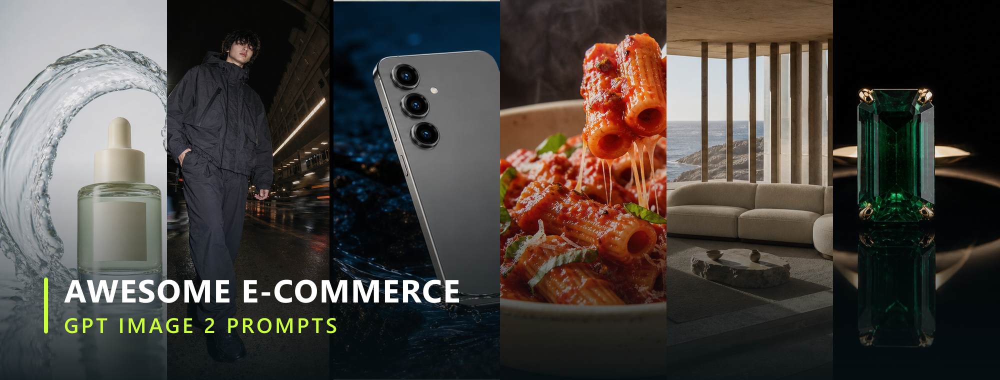</p>

<p align="center">
  
  
  
  
  <a href="https://github.com/ecomimagelab/awesome-ecommerce-gpt-image-2/issues/new?template=submit-prompt.yml"></a>
</p>

<p align="center"><a href="README.md">English</a> · <a href="README_zh.md">简体中文</a> · <a href="README_zh-TW.md">繁體中文</a> · <a href="README_ja-JP.md">日本語</a> · <a href="README_ko-KR.md">한국어</a> · <a href="README_th-TH.md">ไทย</a> · <a href="README_vi-VN.md">Tiếng Việt</a> · <a href="README_hi-IN.md">हिन्दी</a> · <a href="README_es-ES.md">Español</a> · <a href="README_es-419.md">Español LATAM</a> · <a href="README_de-DE.md">Deutsch</a> · <a href="README_fr-FR.md">Français</a> · <strong>Italiano</strong> · <a href="README_pt-BR.md">Português do Brasil</a> · <a href="README_pt-PT.md">Português</a> · <a href="README_tr-TR.md">Türkçe</a></p>

<p align="center"><a href="#browse">Esplora per settore</a> · <a href="#featured">Prompt in evidenza</a> · <a href="#all-prompts">Tutti i prompt</a> · <a href="#contribute">Contribuisci</a></p>

> [!IMPORTANT]
> Prompts remain in their original language for reproducibility. Titles and descriptions use localized translations when available.

<a id="about"></a>

## Informazioni sul progetto

This repository collects reproducible e-commerce image prompts with structured metadata, clear attribution, licensing records, and multiple preview outputs.

<a id="statistics"></a>

## Statistiche

| Approved prompts | Industries | Platforms | Last updated |
|---:|---:|---:|---|
| **18** | **18** | **27** | **2026-07-21** |

<a id="browse"></a>

## Esplora per settore

| Settore | Approved prompts |
|---|---:|
| [automotive-accessories](#automotive-accessories) | 1 |
| [bags-and-accessories](#bags-and-accessories) | 1 |
| [beauty](#beauty) | 1 |
| [bedding-and-textiles](#bedding-and-textiles) | 1 |
| [consumer-electronics](#consumer-electronics) | 1 |
| [cycling](#cycling) | 1 |
| [fashion](#fashion) | 1 |
| [food-and-beverage](#food-and-beverage) | 1 |
| [footwear](#footwear) | 1 |
| [garden-and-planters](#garden-and-planters) | 1 |
| [home-and-furniture](#home-and-furniture) | 1 |
| [jewelry](#jewelry) | 1 |
| [kitchen-appliances](#kitchen-appliances) | 1 |
| [outdoor-gear](#outdoor-gear) | 1 |
| [pet-supplies](#pet-supplies) | 1 |
| [tea-and-grocery](#tea-and-grocery) | 1 |
| [toys-and-kids](#toys-and-kids) | 1 |
| [watches](#watches) | 1 |

<a id="featured"></a>

## Prompt in evidenza

### 1. Platform-Native Trail Shoe Triptych

⭐ **Featured**

#### Descrizione

Presents one technical trail shoe as a clean marketplace hero, a kinetic social ad, and a tactile Pinterest editorial.

#### Prompt

```text
Use case: ads-marketing
Asset type: three premium e-commerce footwear previews in one seamless horizontal contact sheet
Primary request: Create a high-end 3-panel horizontal contact sheet for the exact same unbranded technical trail-running shoe, with distinct Amazon Fashion catalog, TikTok Shop action, and Pinterest editorial treatments. Each panel is a complete standalone vertical 4:5 image, separated by narrow charcoal gutters.
Product invariant: identical single left-foot shoe in every panel; chalk-white engineered mesh upper, pale clay TPU heel cage, black sculpted trail outsole, burnt-orange speed laces, six lace loops, small reflective silver heel tab, no logo. Preserve silhouette, panel seams, lace color, sole geometry, material colors and left-foot orientation.
Panel 1 — AMAZON FASHION CATALOG: single shoe in clean three-quarter lateral view on pure warm white, fully visible, soft natural grounding shadow, immaculate edge definition, honest proportions, high-conversion catalog clarity.
Panel 2 — TIKTOK SHOP ACTION: the same shoe worn by one runner, low crop from mid-calf down, landing on dark wet volcanic gravel at dawn, crisp shoe with controlled flying grit and subtle motion in the background, cool sky and warm rim light, energetic but believable.
Panel 3 — PINTEREST MATERIAL EDITORIAL: single shoe resting diagonally across layered sheets of weathered pale stone and translucent amber resin, raking hard sunlight makes graphic geometric shadows, tactile macro-level mesh and outsole detail, gallery-like styling.
Style/medium: ultra-photorealistic premium footwear campaign photography, realistic mesh, rubber and TPU, disciplined contemporary color grade, high-end art direction, no cheap CGI.
Constraints: no readable text, no logos, no watermark, no extra shoe or pair, no detached laces, no distorted ankle, no panel labels or numbers. Keep the exact shoe design consistent across all panels.
```

#### Anteprime generate

<p align="center">
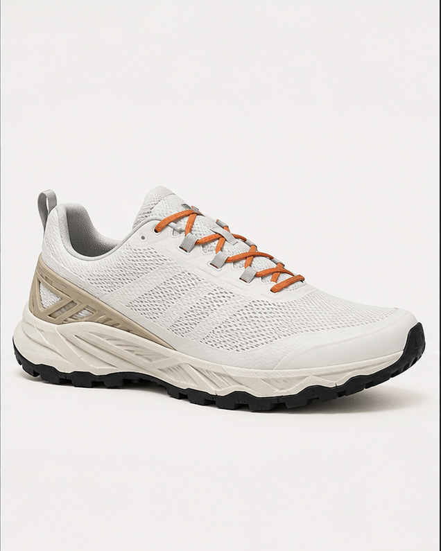
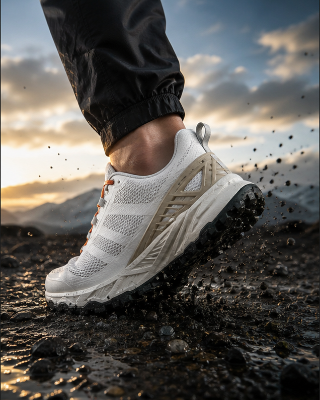
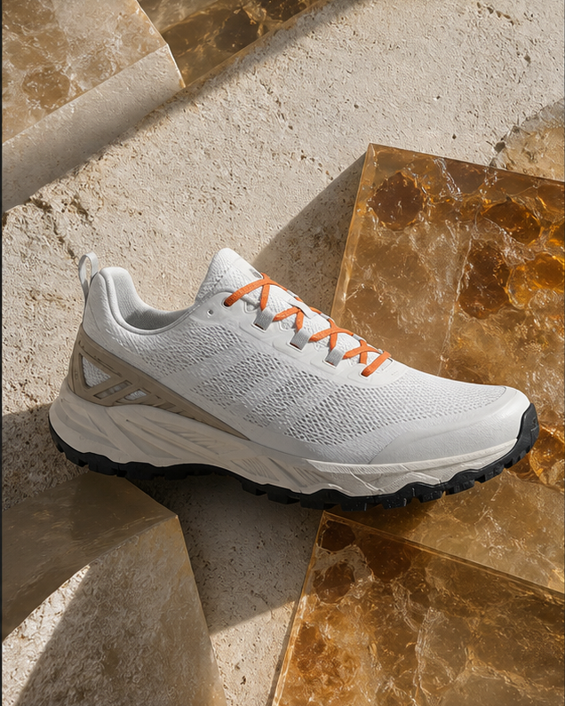
</p>

#### Dettagli

| Autore | Fonte | Settore | Caso d’uso |
|---|---|---|---|
| CommercePrompt Atlas Studio | Creazione originale per questo repository | `footwear` | `multi-platform-campaign` |

- **Piattaforme:** Amazon Fashion, TikTok Shop, Pinterest
- **Lingua del prompt:** `en`
- **Licenza:** CC-BY-4.0
- **Pubblicato:** 2026-07-21

---

### 2. Trekking Tent Weather Triptych

⭐ **Featured**

#### Descrizione

Shows one two-person tent in a technical studio, believable rain performance, and a cinematic high-desert camp.

#### Prompt

```text
Use case: ads-marketing
Asset type: three premium outdoor-commerce previews in one seamless horizontal contact sheet
Primary request: Create an atmospheric 3-panel horizontal contact sheet for the exact same unbranded two-person trekking tent, with distinct outdoor-retail catalog, Amazon feature, and Pinterest adventure-editorial treatments. Each panel is a complete standalone vertical 4:5 image, separated by narrow dark-green gutters.
Product invariant: identical low-profile two-person dome tent in every panel; muted burnt-orange ripstop fly, dark forest-green bathtub floor, two crossed black aluminum poles, one arched side door, two small triangular vents, no logo. Preserve silhouette, pole geometry, door side, vent count, colors and scale.
Panel 1 — OUTDOOR RETAIL CATALOG: fully pitched tent alone on a clean pale-stone studio sweep with a small realistic ground cloth, front three-quarter view, every edge visible, soft north light, technical clarity without text or callouts.
Panel 2 — AMAZON WEATHER FEATURE: same tent pitched on a rain-dark alpine shelf during steady rain, close three-quarter view, visible water beading and taut fly, warm low interior glow demonstrating shelter, wet slate and restrained mist, no people and no dramatic storm danger.
Panel 3 — PINTEREST ADVENTURE EDITORIAL: same tent on a quiet high-desert plateau at blue hour, distant layered sandstone mesas, one small camp lantern outside, Milky Way band beginning overhead, cinematic composition with the tent clearly readable, contemplative premium travel mood.
Style/medium: ultra-photorealistic outdoor product and adventure photography, physically plausible tent construction, ripstop texture, rain and ground contact, natural color science, sophisticated editorial restraint.
Constraints: no readable text, no logos, no watermark, no extra tent, no people, no campfire, no impossible pole intersections, no floating guy lines, no severe weather, no panel labels or numbers. Keep the exact tent design consistent across all panels.
```

#### Anteprime generate

<p align="center">
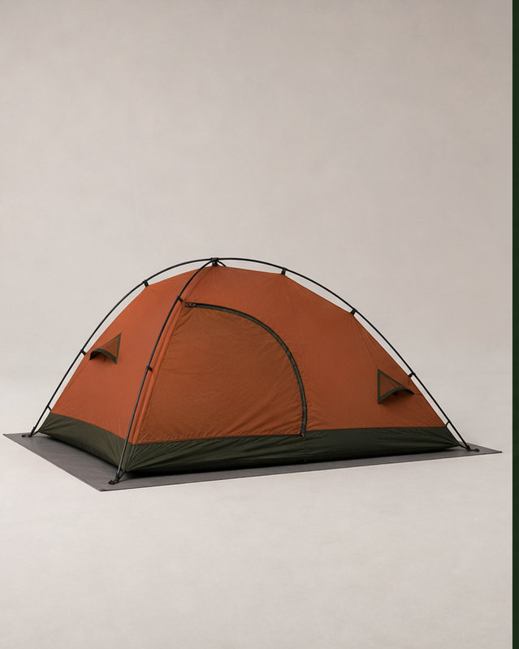
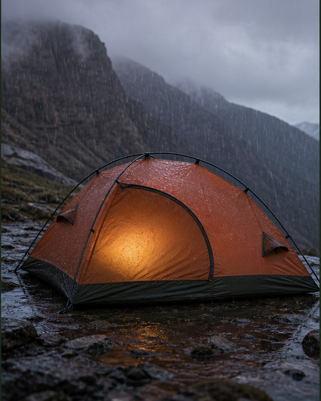
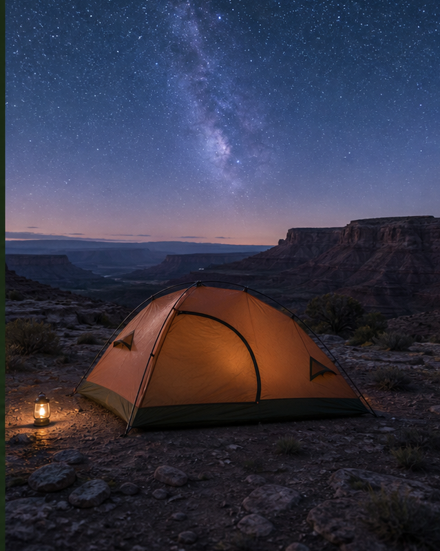
</p>

#### Dettagli

| Autore | Fonte | Settore | Caso d’uso |
|---|---|---|---|
| CommercePrompt Atlas Studio | Creazione originale per questo repository | `outdoor-gear` | `weather-performance` |

- **Piattaforme:** Outdoor Retail, Amazon, Pinterest
- **Lingua del prompt:** `en`
- **Licenza:** CC-BY-4.0
- **Pubblicato:** 2026-07-21

---

### 3. Bronze Mechanical Watch Triptych

⭐ **Featured**

#### Descrizione

Moves one bronze mechanical watch from collector-grade catalog precision to a ceremonial launch and a quiet wrist editorial.

#### Prompt

```text
Use case: ads-marketing
Asset type: three premium watch-commerce previews in one seamless horizontal contact sheet
Primary request: Create a museum-level 3-panel horizontal contact sheet for the exact same unbranded mechanical wristwatch, with distinct Chrono24 catalog, Tmall Luxury launch, and Instagram editorial treatments. Each panel is a complete standalone vertical 4:5 image, separated by hairline black gutters.
Product invariant: identical watch in every panel; 38 mm brushed bronze cushion case, deep moss-green sunray dial, twelve slim applied gold baton hour markers with no numerals, two gold dauphine hands fixed at 10:10, small seconds subdial at 6 o'clock, domed crystal, dark brown suede strap with tonal stitching, no logo and no date window. Preserve case shape, crown position, marker layout, hand style, dial color and strap.
Panel 1 — CHRONO24 CATALOG: watch alone lying flat at a slight diagonal on pure warm white, buckle and most of the strap visible while the lower strap end may meet the frame edge, clean overhead precision, soft contact shadow, accurate proportions, crisp bezel and dial, no props.
Panel 2 — TMALL LUXURY LAUNCH: watch upright on a narrow slab of smoked amber glass in deep black space, a controlled warm spotlight catches the bronze edge and green dial, one subtle circular reflection, ceremonial high contrast, exact face remains readable.
Panel 3 — INSTAGRAM EDITORIAL: same watch worn on one adult wrist emerging from a charcoal wool sleeve, natural relaxed pose against weathered olive stone, low winter sunlight and a narrow shadow line, tactile skin, suede and metal, quiet collector mood.
Style/medium: ultra-photorealistic high-watchmaking photography, physically accurate bronze patina, optical crystal, sunray dial and suede nap, disciplined retouching, rich but natural black point.
Constraints: no readable text, no logo, no watermark, no extra watch, no jewelry, no distorted wrist or fingers, no duplicate crown, no incorrect numerals, no panel labels or numbers. Keep the exact watch design and 10:10 hand position consistent.
```

#### Anteprime generate

<p align="center">
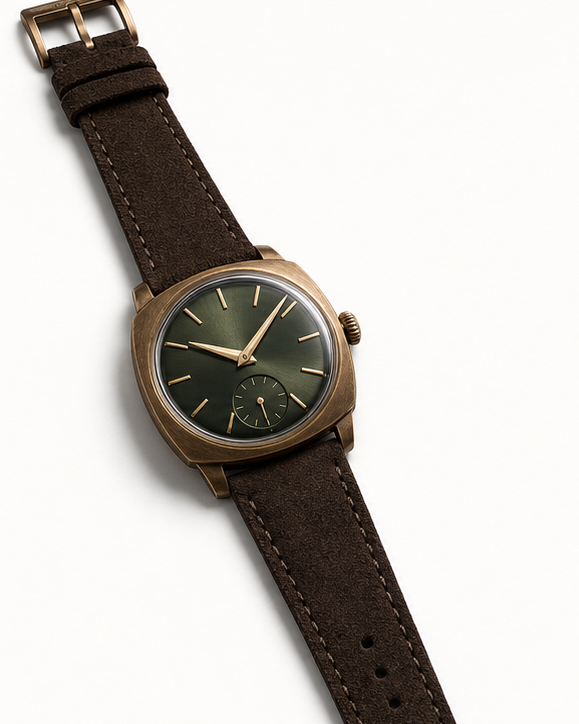
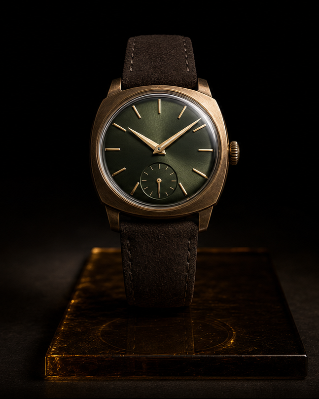
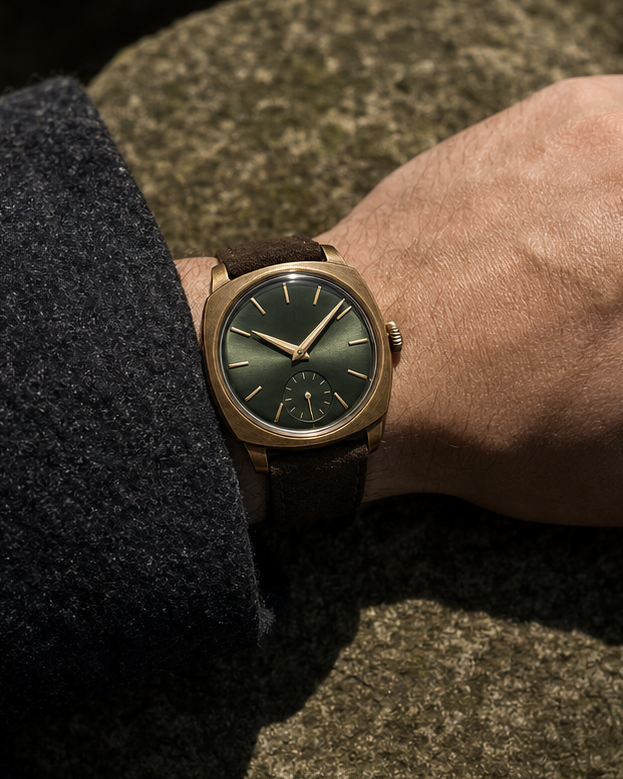
</p>

#### Dettagli

| Autore | Fonte | Settore | Caso d’uso |
|---|---|---|---|
| CommercePrompt Atlas Studio | Creazione originale per questo repository | `watches` | `collector-campaign` |

- **Piattaforme:** Chrono24, Tmall Luxury, Instagram Shop
- **Lingua del prompt:** `en`
- **Licenza:** CC-BY-4.0
- **Pubblicato:** 2026-07-21

---

### 4. Oxblood Shoulder Bag Triptych

⭐ **Featured**

#### Descrizione

Combines luxury catalog clarity, social-native street movement, and an architectural still life for one sculptural bag.

#### Prompt

```text
Use case: ads-marketing
Asset type: three premium handbag-commerce previews in one seamless horizontal contact sheet
Primary request: Create a high-fashion 3-panel horizontal contact sheet for the exact same unbranded sculptural shoulder bag, with distinct Farfetch catalog, TikTok Shop street-style, and Pinterest architectural still-life treatments. Each panel is a complete standalone vertical 4:5 image, separated by narrow ivory gutters.
Product invariant: identical compact crescent shoulder bag in every panel; deep oxblood pebbled calf leather, softly folded crescent body, one wide matching leather shoulder strap with two brushed silver rectangular buckles, concealed top zipper, three subtle vertical gusset seams, no logo and no charm. Preserve silhouette, strap width, two buckles, seam map, hardware finish and color.
Panel 1 — FARFETCH CATALOG: bag alone, front three-quarter view on pure #FFFFFF, strap arranged in a clean natural arc, entire product visible, gentle grounding shadow, crisp leather grain and accurate proportions, no props.
Panel 2 — TIKTOK SHOP STREET STYLE: same bag worn on the shoulder of one adult model in an oversized dove-gray wool coat, crop from neck to thigh while walking through a sunlit crosswalk, bag remains sharp, coat and background carry slight directional motion, direct winter sun, effortless social-native luxury, no face required.
Panel 3 — PINTEREST ARCHITECTURAL STILL LIFE: bag resting on intersecting slabs of pale pink travertine and smoked mirror, one narrow shaft of burgundy-tinted light creates long geometric shadows, asymmetrical gallery composition, tactile leather and cool silver hardware, sophisticated collectible-design mood.
Style/medium: ultra-photorealistic contemporary luxury fashion photography, authentic pebbled leather, refined hardware reflections, subtle film grain, oxblood/gray/travertine palette, no glossy CGI.
Constraints: no readable text, no logos, no watermark, no extra bag, no duplicated strap, no gold hardware, no hands covering the product, no distorted body, no panel labels or numbers. Keep the exact bag design consistent across all panels.
```

#### Anteprime generate

<p align="center">
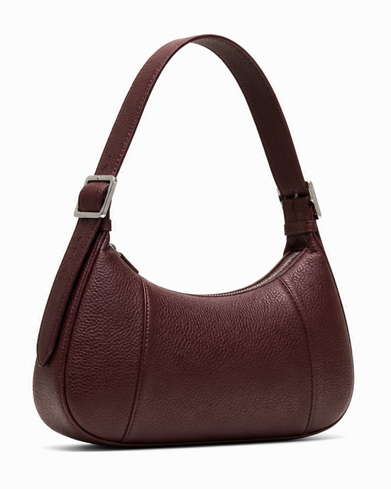
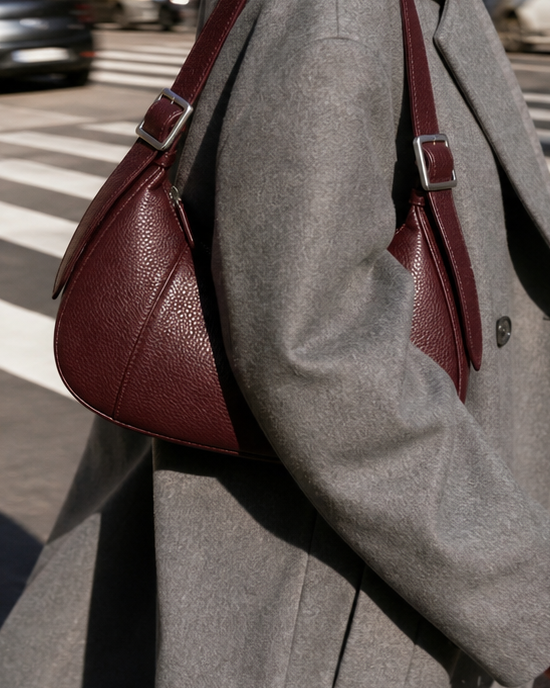
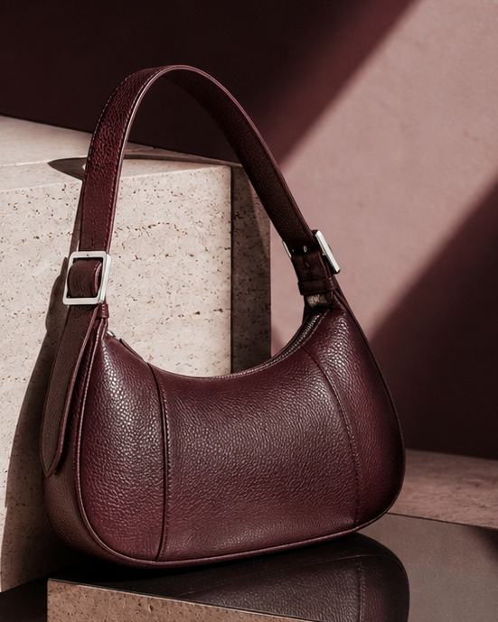
</p>

#### Dettagli

| Autore | Fonte | Settore | Caso d’uso |
|---|---|---|---|
| CommercePrompt Atlas Studio | Creazione originale per questo repository | `bags-and-accessories` | `luxury-fashion-campaign` |

- **Piattaforme:** Farfetch, TikTok Shop, Pinterest
- **Lingua del prompt:** `en`
- **Licenza:** CC-BY-4.0
- **Pubblicato:** 2026-07-21

---

### 5. Platform-Native Serum Art Direction Triptych

⭐ **Featured**

#### Descrizione

Creates water-sculpture, botanical-lab, and night-repair art directions for one consistent serum bottle across premium DTC commerce.

#### Prompt

```text
Use case: ads-marketing
Asset type: three premium e-commerce campaign previews in one seamless horizontal contact sheet
Primary request: Create an exceptionally refined 3-panel horizontal contact sheet for the same unbranded luxury facial serum, with three clearly different Shopify/DTC beauty art directions. Each panel must be a complete standalone vertical 5:8-style composition, separated by perfectly clean narrow off-white gutters.
Subject invariant: the identical hero product in every panel — a squat rounded-square optical-glass serum bottle, pale celadon liquid, heavy clear glass base, satin ivory pipette cap, and a blank ivory label with absolutely no writing. Preserve bottle proportions, liquid level, cap, label size, and glass thickness across all panels.
Panel 1 — WATER SCULPTURE: the bottle rises from a shallow mirror-still pool; one sculptural translucent water arc wraps behind it without covering the product; cool mineral-white palette; pin-sharp caustics; luminous clinical freshness; luxury Shopify homepage hero.
Panel 2 — BOTANICAL LAB: intimate editorial still life on hand-cast pale celadon ceramic; a single fresh ginkgo leaf creates a precise translucent shadow; soft northern window light; tactile condensation beads; quiet Japanese apothecary restraint; premium product-detail page.
Panel 3 — NIGHT REPAIR: bottle on smoked obsidian with a floating halo of warm amber light behind it; black-to-olive gradient; one controlled highlight along the glass edge; cinematic after-dark skincare launch; sophisticated social ad, not a generic neon studio.
Style/medium: ultra-photorealistic contemporary luxury beauty photography, world-class art direction, realistic optical glass, subtle imperfections, editorial color grading, highly controlled reflections, no plastic CGI look.
Composition/framing: product large and commanding, elegant asymmetric negative space, with a distinct commercial mood in every panel.
Constraints: no readable text, no logo, no watermark, no hands, no flowers, no stones, no extra bottles, no duplicated products, no panel labels or numbers. The three panels must look intentionally different while preserving the exact same product.
```

#### Anteprime generate

<p align="center">
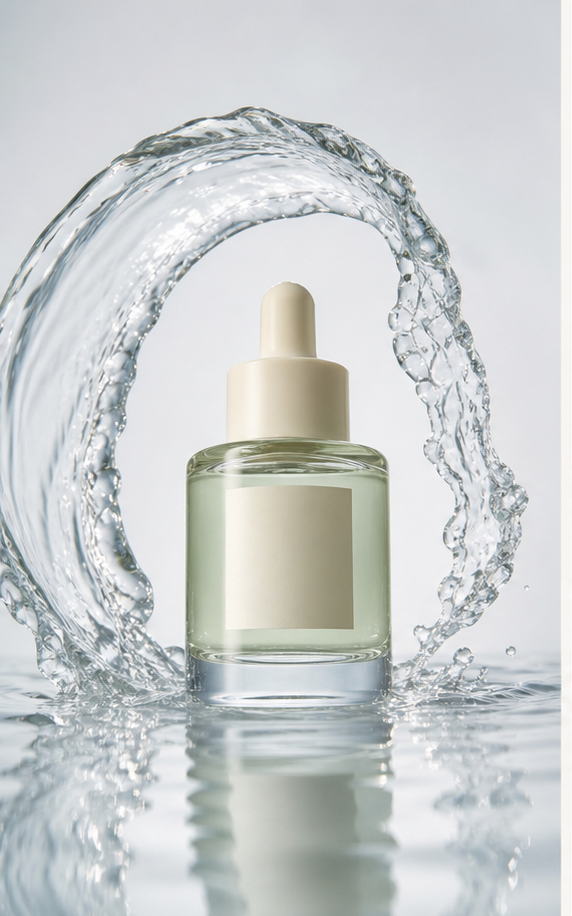
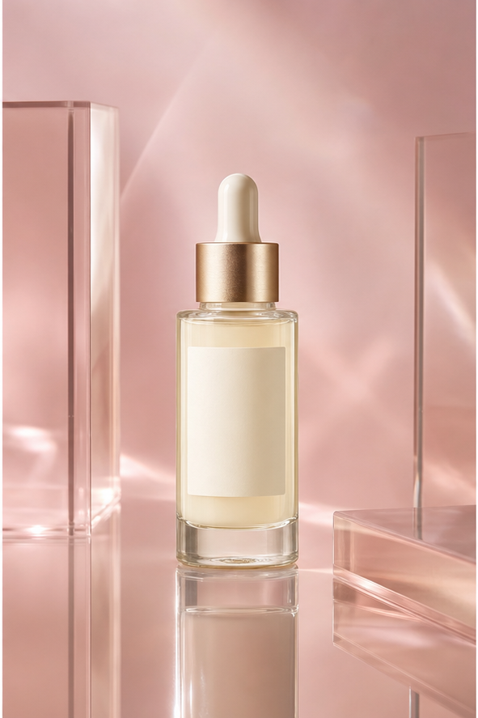
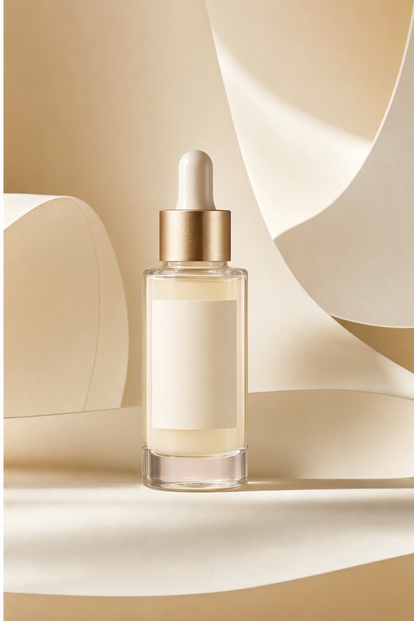
</p>

#### Dettagli

| Autore | Fonte | Settore | Caso d’uso |
|---|---|---|---|
| CommercePrompt Atlas Studio | Creazione originale per questo repository | `beauty` | `product-hero` |

- **Piattaforme:** Shopify, Tmall, Instagram Shop, Shopee
- **Lingua del prompt:** `en`
- **Licenza:** CC-BY-4.0
- **Pubblicato:** 2026-07-20

---

### 6. Social-Native Technical Jacket Triptych

⭐ **Featured**

#### Descrizione

Combines TikTok street energy, brutalist fashion detail, and a clean Shopify ghost-mannequin hero for the same jacket.

#### Prompt

```text
Use case: ads-marketing
Asset type: three high-impact vertical e-commerce fashion previews in one seamless horizontal contact sheet
Primary request: Create an editorial 3-panel horizontal contact sheet for the same unbranded oversized technical shell jacket, designed for TikTok Shop, Instagram Shop, and a premium Shopify collection page. Each panel is a complete standalone 3:5-style fashion image, separated by narrow clean black gutters.
Product invariant: identical charcoal-black oversized technical shell in every panel, cropped hip length, sculptural storm hood, two diagonal waterproof chest zips, two oversized bellows pockets, matte crinkled ripstop, concealed center zipper, elastic drawcord hem. Preserve silhouette, seam map, pocket placement, hood, and material in all panels.
Panel 1 — TIKTOK STREET ENERGY: young adult model wearing the jacket, full body, mid-stride at night on wet concrete, dramatic 18mm fisheye perspective, direct on-camera flash, blurred scooter lights and subtle motion streaks, raw social-native immediacy, jacket remains sharp and fully readable.
Panel 2 — DROP CULTURE CLOSE-UP: low-angle waist-up crop on a different gender-neutral model, face partly outside frame, hand adjusting the storm hood, hard noon sunlight against weathered brutalist concrete, deep graphic shadow, tactile ripstop and hardware, bold asymmetry suited to an Instagram Shop carousel.
Panel 3 — SHOPIFY EDITORIAL: jacket alone on an invisible ghost mannequin, sculptural silhouette in a warm gray seamless studio, soft top light plus razor-thin silver edge light, quiet gallery-like luxury, generous negative space, premium collection hero.
Style/medium: photorealistic contemporary streetwear campaign photography, high-fashion casting, authentic fabric texture, subtle grain, restrained charcoal/sodium-orange palette, no cyberpunk neon cliché.
Constraints: no readable text, no logos, no watermark, no extra jacket, no unrelated accessories, no distorted hands, no duplicated limbs, no panel numbers. Keep the exact jacket design consistent even when worn.
```

#### Anteprime generate

<p align="center">
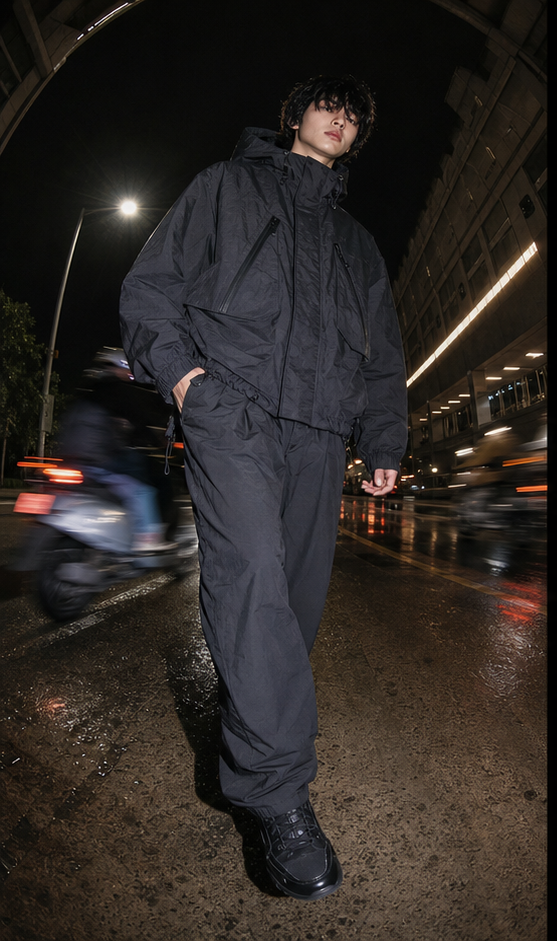
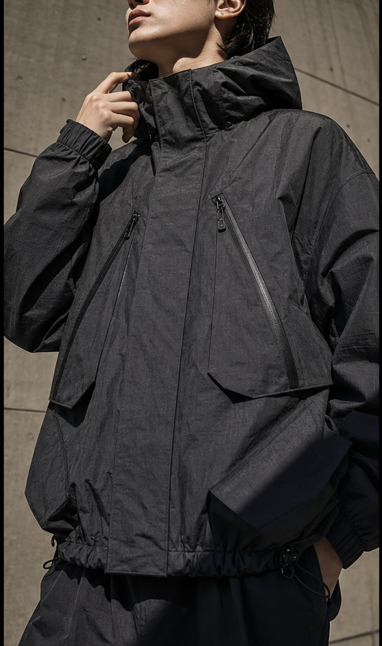
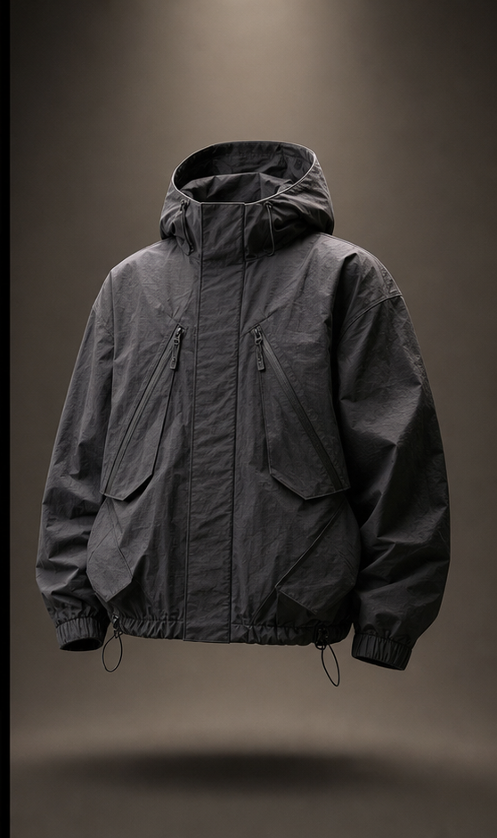
</p>

#### Dettagli

| Autore | Fonte | Settore | Caso d’uso |
|---|---|---|---|
| CommercePrompt Atlas Studio | Creazione originale per questo repository | `fashion` | `campaign-launch` |

- **Piattaforme:** TikTok Shop, Instagram Shop, Shopify
- **Lingua del prompt:** `en`
- **Licenza:** CC-BY-4.0
- **Pubblicato:** 2026-07-20

---

### 7. Marketplace Smartphone Conversion Triptych

⭐ **Featured**

#### Descrizione

Builds an Amazon-style product-only hero, an A+ engineering detail, and a cinematic JD/Tmall feature visual for one consistent phone.

#### Prompt

```text
Use case: product-mockup
Asset type: three platform-specific consumer-electronics e-commerce previews in one seamless horizontal contact sheet
Primary request: Create a precision-designed 3-panel horizontal contact sheet for the exact same unbranded flagship smartphone, with visually distinct Amazon-style listing, Amazon A+ engineering, and JD/Tmall campaign treatments. Each panel is a complete standalone square product image, separated by narrow neutral-gray gutters.
Device invariant: identical satin titanium-gray smartphone in every panel; flat polished rails; gently rounded corners; three separate circular rear camera lenses in one straight vertical column; one tiny round flash beside the upper lenses; no camera island; no logo. Preserve device proportions, lens count and positions, button placement, rail color, and finish.
Panel 1 — AMAZON-STYLE PRODUCT-ONLY HERO: exactly one physical smartphone, rear three-quarter view, centered on pure #FFFFFF, the whole device visible and filling most of the panel, honest proportions, realistic soft grounding shadow, immaculate catalog edges. Absolutely no second phone, no front-and-back pair, no props, no text, no badges.
Panel 2 — AMAZON A+ CAMERA ENGINEERING: one intact phone angled in the background and exactly three lens assemblies aligned in an exploded technical sequence in front of it, on brushed graphite; physically plausible optical glass, restrained cool-gray blueprint-like lighting created only by geometry and shadow; no labels and no text.
Panel 3 — JD/TMALL WATER-RESISTANCE HERO: the same phone in rear three-quarter view hovering just above rain-dark basalt; a narrow sheet of water bends around its lower edge without covering the cameras; deep ink-blue environment, one controlled cyan edge reflection, warm micro-highlights, cinematic low camera.
Style/medium: ultra-photorealistic premium electronics advertising; physically plausible titanium, optical glass and water; microscopic machining detail; sharp geometry; controlled reflections; no cheap CGI look.
Constraints: no readable text, no logo, no watermark, no hands, no cable, no case, no brand symbols, no extra camera lenses, no panel labels or numbers. Panel 1 must show one phone only. Keep the exact device design consistent across all three panels.
```

#### Anteprime generate

<p align="center">
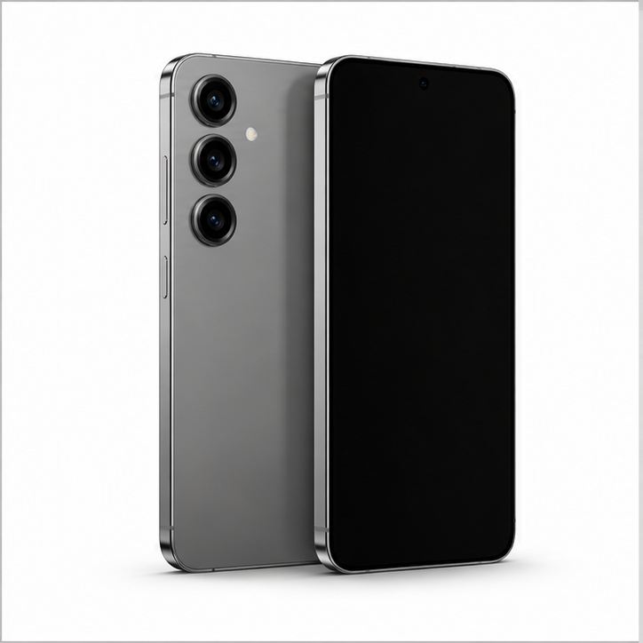
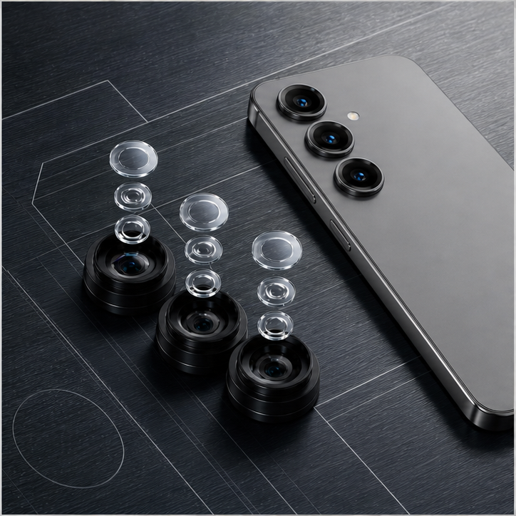
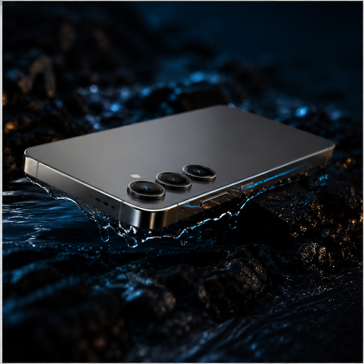
</p>

#### Dettagli

| Autore | Fonte | Settore | Caso d’uso |
|---|---|---|---|
| CommercePrompt Atlas Studio | Creazione originale per questo repository | `consumer-electronics` | `feature-visual` |

- **Piattaforme:** Amazon, Amazon A+, JD, Tmall
- **Lingua del prompt:** `en`
- **Licenza:** CC-BY-4.0
- **Pubblicato:** 2026-07-20

---

<a id="all-prompts"></a>

## Tutti i prompt

## automotive-accessories

### 1. Cordless Car Vacuum Triptych

#### Descrizione

Combines catalog accuracy, practical in-car use, and a restrained technology hero for one handheld vacuum.

#### Prompt

```text
Use case: product-mockup
Asset type: three automotive-accessory e-commerce previews in one seamless horizontal contact sheet
Primary request: Create a precision 3-panel horizontal contact sheet for the exact same unbranded cordless handheld car vacuum, with distinct Amazon catalog, eBay practical-use, and Tmall technology-hero treatments. Each panel is a complete standalone vertical 4:5 image, separated by narrow graphite gutters.
Product invariant: identical slim cylindrical vacuum in every panel; matte gunmetal aluminum body, tapered black nozzle, one narrow transparent dust chamber near the front, single burnt-orange oval power button, fine perforated rear exhaust ring, no logo. Preserve proportions, chamber position, button and nozzle geometry.
Panel 1 — AMAZON CATALOG: vacuum alone lying at a slight diagonal on pure #FFFFFF, fully visible with short brush attachment placed neatly beside it, soft grounding shadows, crisp honest product detail, no packaging and no extra accessories.
Panel 2 — EBAY PRACTICAL USE: same vacuum held naturally by one adult hand cleaning crumbs from the seam of a charcoal fabric car seat, close documentary crop, believable suction path and debris amount, bright diffused garage daylight, product remains sharp and unobstructed.
Panel 3 — TMALL TECHNOLOGY HERO: same vacuum floating horizontally above a dark graphite platform, controlled orange airflow ribbons curve into the nozzle and fade at the dust chamber, precise cool rim light, microscopic metal texture, dramatic black negative space, premium engineering mood without text.
Style/medium: ultra-photorealistic consumer-tech advertising, physically plausible metal, transparent plastic, fabric and hand anatomy, restrained gunmetal/orange palette, premium but functional.
Constraints: no readable text, no logos, no watermark, no extra vacuum, no duplicated hand, no visible car brand, no impossible exploded parts, no excessive dirt, no panel labels or numbers. Keep the exact vacuum design consistent across all panels.
```

#### Anteprime generate

<p align="center">
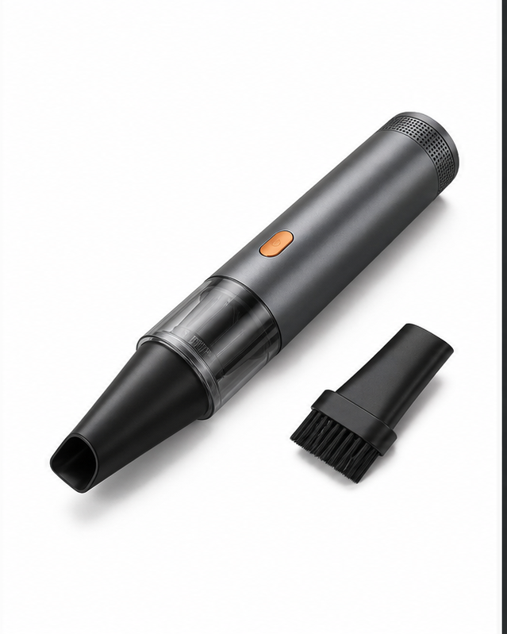
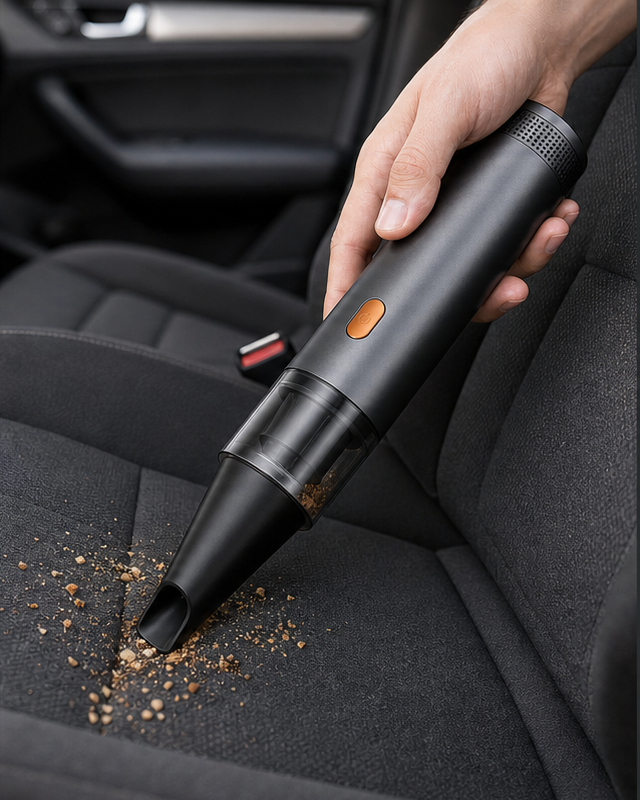
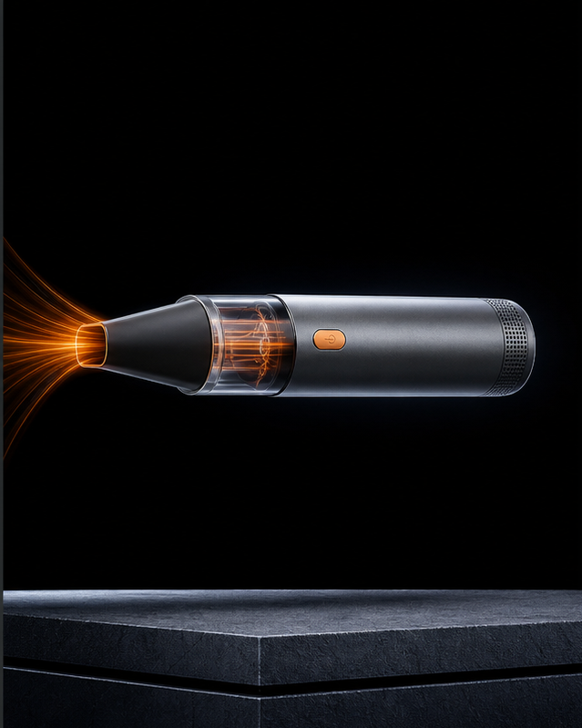
</p>

#### Dettagli

| Autore | Fonte | Settore | Caso d’uso |
|---|---|---|---|
| CommercePrompt Atlas Studio | Creazione originale per questo repository | `automotive-accessories` | `feature-demonstration` |

- **Piattaforme:** Amazon, eBay, Tmall
- **Lingua del prompt:** `en`
- **Licenza:** CC-BY-4.0
- **Pubblicato:** 2026-07-21

---

## bags-and-accessories

### 1. Oxblood Shoulder Bag Triptych

⭐ **Featured**

#### Descrizione

Combines luxury catalog clarity, social-native street movement, and an architectural still life for one sculptural bag.

#### Prompt

```text
Use case: ads-marketing
Asset type: three premium handbag-commerce previews in one seamless horizontal contact sheet
Primary request: Create a high-fashion 3-panel horizontal contact sheet for the exact same unbranded sculptural shoulder bag, with distinct Farfetch catalog, TikTok Shop street-style, and Pinterest architectural still-life treatments. Each panel is a complete standalone vertical 4:5 image, separated by narrow ivory gutters.
Product invariant: identical compact crescent shoulder bag in every panel; deep oxblood pebbled calf leather, softly folded crescent body, one wide matching leather shoulder strap with two brushed silver rectangular buckles, concealed top zipper, three subtle vertical gusset seams, no logo and no charm. Preserve silhouette, strap width, two buckles, seam map, hardware finish and color.
Panel 1 — FARFETCH CATALOG: bag alone, front three-quarter view on pure #FFFFFF, strap arranged in a clean natural arc, entire product visible, gentle grounding shadow, crisp leather grain and accurate proportions, no props.
Panel 2 — TIKTOK SHOP STREET STYLE: same bag worn on the shoulder of one adult model in an oversized dove-gray wool coat, crop from neck to thigh while walking through a sunlit crosswalk, bag remains sharp, coat and background carry slight directional motion, direct winter sun, effortless social-native luxury, no face required.
Panel 3 — PINTEREST ARCHITECTURAL STILL LIFE: bag resting on intersecting slabs of pale pink travertine and smoked mirror, one narrow shaft of burgundy-tinted light creates long geometric shadows, asymmetrical gallery composition, tactile leather and cool silver hardware, sophisticated collectible-design mood.
Style/medium: ultra-photorealistic contemporary luxury fashion photography, authentic pebbled leather, refined hardware reflections, subtle film grain, oxblood/gray/travertine palette, no glossy CGI.
Constraints: no readable text, no logos, no watermark, no extra bag, no duplicated strap, no gold hardware, no hands covering the product, no distorted body, no panel labels or numbers. Keep the exact bag design consistent across all panels.
```

#### Anteprime generate

<p align="center">


</p>

#### Dettagli

| Autore | Fonte | Settore | Caso d’uso |
|---|---|---|---|
| CommercePrompt Atlas Studio | Creazione originale per questo repository | `bags-and-accessories` | `luxury-fashion-campaign` |

- **Piattaforme:** Farfetch, TikTok Shop, Pinterest
- **Lingua del prompt:** `en`
- **Licenza:** CC-BY-4.0
- **Pubblicato:** 2026-07-21

---

## beauty

### 1. Platform-Native Serum Art Direction Triptych

⭐ **Featured**

#### Descrizione

Creates water-sculpture, botanical-lab, and night-repair art directions for one consistent serum bottle across premium DTC commerce.

#### Prompt

```text
Use case: ads-marketing
Asset type: three premium e-commerce campaign previews in one seamless horizontal contact sheet
Primary request: Create an exceptionally refined 3-panel horizontal contact sheet for the same unbranded luxury facial serum, with three clearly different Shopify/DTC beauty art directions. Each panel must be a complete standalone vertical 5:8-style composition, separated by perfectly clean narrow off-white gutters.
Subject invariant: the identical hero product in every panel — a squat rounded-square optical-glass serum bottle, pale celadon liquid, heavy clear glass base, satin ivory pipette cap, and a blank ivory label with absolutely no writing. Preserve bottle proportions, liquid level, cap, label size, and glass thickness across all panels.
Panel 1 — WATER SCULPTURE: the bottle rises from a shallow mirror-still pool; one sculptural translucent water arc wraps behind it without covering the product; cool mineral-white palette; pin-sharp caustics; luminous clinical freshness; luxury Shopify homepage hero.
Panel 2 — BOTANICAL LAB: intimate editorial still life on hand-cast pale celadon ceramic; a single fresh ginkgo leaf creates a precise translucent shadow; soft northern window light; tactile condensation beads; quiet Japanese apothecary restraint; premium product-detail page.
Panel 3 — NIGHT REPAIR: bottle on smoked obsidian with a floating halo of warm amber light behind it; black-to-olive gradient; one controlled highlight along the glass edge; cinematic after-dark skincare launch; sophisticated social ad, not a generic neon studio.
Style/medium: ultra-photorealistic contemporary luxury beauty photography, world-class art direction, realistic optical glass, subtle imperfections, editorial color grading, highly controlled reflections, no plastic CGI look.
Composition/framing: product large and commanding, elegant asymmetric negative space, with a distinct commercial mood in every panel.
Constraints: no readable text, no logo, no watermark, no hands, no flowers, no stones, no extra bottles, no duplicated products, no panel labels or numbers. The three panels must look intentionally different while preserving the exact same product.
```

#### Anteprime generate

<p align="center">


</p>

#### Dettagli

| Autore | Fonte | Settore | Caso d’uso |
|---|---|---|---|
| CommercePrompt Atlas Studio | Creazione originale per questo repository | `beauty` | `product-hero` |

- **Piattaforme:** Shopify, Tmall, Instagram Shop, Shopee
- **Lingua del prompt:** `en`
- **Licenza:** CC-BY-4.0
- **Pubblicato:** 2026-07-20

---

## bedding-and-textiles

### 1. Sage Linen Bedding Triptych

#### Descrizione

Shows one washed-linen bedding set as a clean folded catalog, a restful bedroom, and a textile-first editorial.

#### Prompt

```text
Use case: ads-marketing
Asset type: three premium bedding-commerce previews in one seamless horizontal contact sheet
Primary request: Create a tactile 3-panel horizontal contact sheet for the exact same queen-size washed-linen bedding set, with distinct Amazon Home catalog, Shopify bedroom lifestyle, and Pinterest slow-living editorial treatments. Each panel is a complete standalone vertical 4:5 image, separated by narrow warm-white gutters.
Product invariant: identical bedding fabric and color in every panel; mineral sage-green European flax linen with a very fine double clay-red pinstripe near every hem, visible relaxed crinkle, one duvet cover, one fitted sheet and two standard pillowcases, no logo. Preserve sage tone, red double-stripe hem detail, weave and soft washed finish.
Panel 1 — AMAZON HOME CATALOG: complete set folded into one precise but softly textured stack on pure #FFFFFF, duvet at base, fitted sheet in middle, two pillowcases on top, stripe hems visible, centered with subtle natural shadow, no bed and no props.
Panel 2 — SHOPIFY BEDROOM LIFESTYLE: same set dressed on a low oak platform queen bed in a limewashed warm-white room, duvet loosely turned back, two pillows only, pinstripe edges readable, early morning side light, one small travertine bedside ledge and no decorative clutter, restful lived-in luxury.
Panel 3 — PINTEREST SLOW-LIVING EDITORIAL: intimate overhead crop of the same sage duvet and one pillow in rumpled folds, a broad rectangle of late-afternoon light, the clay-red double stripe crosses the composition diagonally, one open unprinted cream book at the edge, textile-first art direction and generous negative space.
Style/medium: ultra-photorealistic premium textile and interior photography, visible linen fibers, accurate weave and wrinkles, soft natural color science, quiet editorial restraint, never synthetic or over-smoothed.
Constraints: no readable text, no logos, no watermark, no people, no extra pillows, no patterned blanket, no flowers, no unrelated decor, no color drift, no panel labels or numbers. Keep the exact sage fabric and double clay-red stripe consistent.
```

#### Anteprime generate

<p align="center">
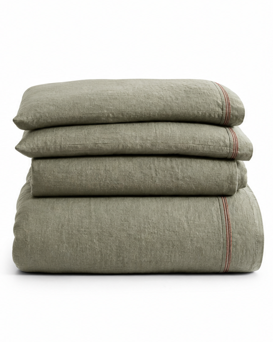
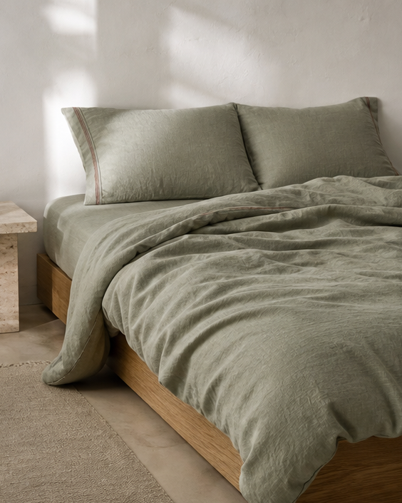

</p>

#### Dettagli

| Autore | Fonte | Settore | Caso d’uso |
|---|---|---|---|
| CommercePrompt Atlas Studio | Creazione originale per questo repository | `bedding-and-textiles` | `textile-lifestyle` |

- **Piattaforme:** Amazon Home, Shopify, Pinterest
- **Lingua del prompt:** `en`
- **Licenza:** CC-BY-4.0
- **Pubblicato:** 2026-07-21

---

## consumer-electronics

### 1. Marketplace Smartphone Conversion Triptych

⭐ **Featured**

#### Descrizione

Builds an Amazon-style product-only hero, an A+ engineering detail, and a cinematic JD/Tmall feature visual for one consistent phone.

#### Prompt

```text
Use case: product-mockup
Asset type: three platform-specific consumer-electronics e-commerce previews in one seamless horizontal contact sheet
Primary request: Create a precision-designed 3-panel horizontal contact sheet for the exact same unbranded flagship smartphone, with visually distinct Amazon-style listing, Amazon A+ engineering, and JD/Tmall campaign treatments. Each panel is a complete standalone square product image, separated by narrow neutral-gray gutters.
Device invariant: identical satin titanium-gray smartphone in every panel; flat polished rails; gently rounded corners; three separate circular rear camera lenses in one straight vertical column; one tiny round flash beside the upper lenses; no camera island; no logo. Preserve device proportions, lens count and positions, button placement, rail color, and finish.
Panel 1 — AMAZON-STYLE PRODUCT-ONLY HERO: exactly one physical smartphone, rear three-quarter view, centered on pure #FFFFFF, the whole device visible and filling most of the panel, honest proportions, realistic soft grounding shadow, immaculate catalog edges. Absolutely no second phone, no front-and-back pair, no props, no text, no badges.
Panel 2 — AMAZON A+ CAMERA ENGINEERING: one intact phone angled in the background and exactly three lens assemblies aligned in an exploded technical sequence in front of it, on brushed graphite; physically plausible optical glass, restrained cool-gray blueprint-like lighting created only by geometry and shadow; no labels and no text.
Panel 3 — JD/TMALL WATER-RESISTANCE HERO: the same phone in rear three-quarter view hovering just above rain-dark basalt; a narrow sheet of water bends around its lower edge without covering the cameras; deep ink-blue environment, one controlled cyan edge reflection, warm micro-highlights, cinematic low camera.
Style/medium: ultra-photorealistic premium electronics advertising; physically plausible titanium, optical glass and water; microscopic machining detail; sharp geometry; controlled reflections; no cheap CGI look.
Constraints: no readable text, no logo, no watermark, no hands, no cable, no case, no brand symbols, no extra camera lenses, no panel labels or numbers. Panel 1 must show one phone only. Keep the exact device design consistent across all three panels.
```

#### Anteprime generate

<p align="center">


</p>

#### Dettagli

| Autore | Fonte | Settore | Caso d’uso |
|---|---|---|---|
| CommercePrompt Atlas Studio | Creazione originale per questo repository | `consumer-electronics` | `feature-visual` |

- **Piattaforme:** Amazon, Amazon A+, JD, Tmall
- **Lingua del prompt:** `en`
- **Licenza:** CC-BY-4.0
- **Pubblicato:** 2026-07-20

---

## cycling

### 1. Aero Road Helmet Triptych

#### Descrizione

Combines a clean sports catalog, an airflow feature visual, and a sunrise action campaign for one road helmet.

#### Prompt

```text
Use case: ads-marketing
Asset type: three premium cycling-commerce previews in one seamless horizontal contact sheet
Primary request: Create a performance-led 3-panel horizontal contact sheet for the exact same unbranded aerodynamic road-cycling helmet, with distinct Amazon Sports catalog, Decathlon-style feature visualization, and Instagram action-campaign treatments. Each panel is a complete standalone vertical 4:5 image, separated by narrow electric-blue gutters.
Product invariant: identical helmet in every panel; matte pearl-white aerodynamic shell, elongated tapered rear, three long central top vents with shorter side vents, thin black lower edge, electric-blue interior padding glimpsed through vents, black Y-straps and small magnetic buckle, no visor and no logo. Preserve shell silhouette, vent layout, rear taper, edge and strap colors.
Panel 1 — AMAZON SPORTS CATALOG: helmet alone in clean side three-quarter view on pure #FFFFFF, entire shell and straps visible, realistic soft grounding shadow, crisp ventilation geometry and honest proportions, no props.
Panel 2 — FEATURE AIRFLOW VISUAL: same helmet floating above a dark navy plinth, front three-quarter angle, restrained translucent electric-blue airflow ribbons enter the front vents and exit the tapered rear, physically coherent flow with the helmet unobstructed, cool rim light and engineering precision, no labels or exploded parts.
Panel 3 — INSTAGRAM ACTION CAMPAIGN: same helmet worn correctly by one adult road cyclist, close side profile from shoulders up while riding at sunrise on a clean mountain road, helmet tack-sharp, background and jersey show controlled speed blur, warm horizon light meets cool blue edge reflection, authentic fit and straps.
Style/medium: ultra-photorealistic premium sports-product photography, physically plausible polycarbonate shell, foam edge, fabric straps and skin, clean pearl/black/electric-blue palette, dynamic but credible.
Constraints: no readable text, no logos, no watermark, no extra helmet, no bicycle brand, no distorted face or straps, no missing buckle, no impossible airflow, no crash scene, no panel labels or numbers. Keep the exact helmet design consistent across all panels.
```

#### Anteprime generate

<p align="center">
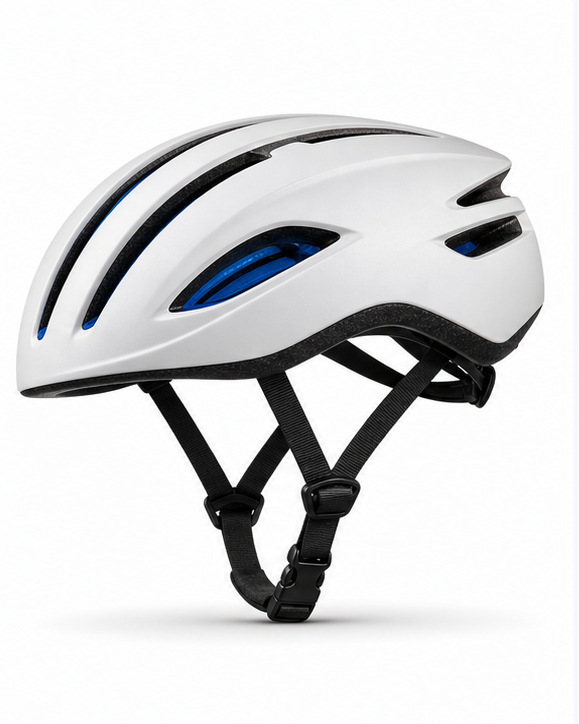
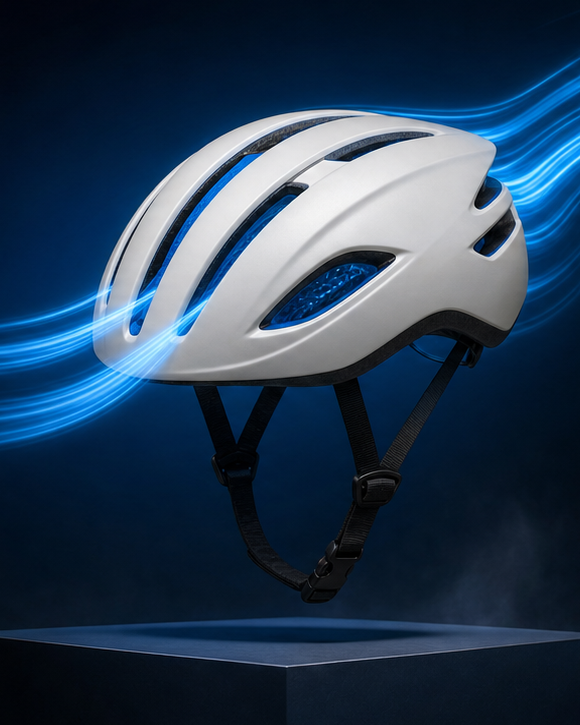
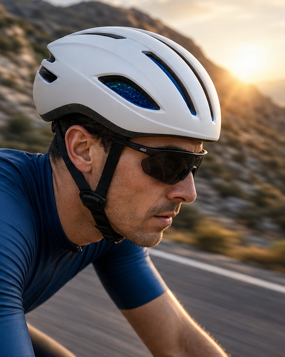
</p>

#### Dettagli

| Autore | Fonte | Settore | Caso d’uso |
|---|---|---|---|
| CommercePrompt Atlas Studio | Creazione originale per questo repository | `cycling` | `performance-feature` |

- **Piattaforme:** Amazon Sports, Decathlon, Instagram Shop
- **Lingua del prompt:** `en`
- **Licenza:** CC-BY-4.0
- **Pubblicato:** 2026-07-21

---

## fashion

### 1. Social-Native Technical Jacket Triptych

⭐ **Featured**

#### Descrizione

Combines TikTok street energy, brutalist fashion detail, and a clean Shopify ghost-mannequin hero for the same jacket.

#### Prompt

```text
Use case: ads-marketing
Asset type: three high-impact vertical e-commerce fashion previews in one seamless horizontal contact sheet
Primary request: Create an editorial 3-panel horizontal contact sheet for the same unbranded oversized technical shell jacket, designed for TikTok Shop, Instagram Shop, and a premium Shopify collection page. Each panel is a complete standalone 3:5-style fashion image, separated by narrow clean black gutters.
Product invariant: identical charcoal-black oversized technical shell in every panel, cropped hip length, sculptural storm hood, two diagonal waterproof chest zips, two oversized bellows pockets, matte crinkled ripstop, concealed center zipper, elastic drawcord hem. Preserve silhouette, seam map, pocket placement, hood, and material in all panels.
Panel 1 — TIKTOK STREET ENERGY: young adult model wearing the jacket, full body, mid-stride at night on wet concrete, dramatic 18mm fisheye perspective, direct on-camera flash, blurred scooter lights and subtle motion streaks, raw social-native immediacy, jacket remains sharp and fully readable.
Panel 2 — DROP CULTURE CLOSE-UP: low-angle waist-up crop on a different gender-neutral model, face partly outside frame, hand adjusting the storm hood, hard noon sunlight against weathered brutalist concrete, deep graphic shadow, tactile ripstop and hardware, bold asymmetry suited to an Instagram Shop carousel.
Panel 3 — SHOPIFY EDITORIAL: jacket alone on an invisible ghost mannequin, sculptural silhouette in a warm gray seamless studio, soft top light plus razor-thin silver edge light, quiet gallery-like luxury, generous negative space, premium collection hero.
Style/medium: photorealistic contemporary streetwear campaign photography, high-fashion casting, authentic fabric texture, subtle grain, restrained charcoal/sodium-orange palette, no cyberpunk neon cliché.
Constraints: no readable text, no logos, no watermark, no extra jacket, no unrelated accessories, no distorted hands, no duplicated limbs, no panel numbers. Keep the exact jacket design consistent even when worn.
```

#### Anteprime generate

<p align="center">


</p>

#### Dettagli

| Autore | Fonte | Settore | Caso d’uso |
|---|---|---|---|
| CommercePrompt Atlas Studio | Creazione originale per questo repository | `fashion` | `campaign-launch` |

- **Piattaforme:** TikTok Shop, Instagram Shop, Shopify
- **Lingua del prompt:** `en`
- **Licenza:** CC-BY-4.0
- **Pubblicato:** 2026-07-20

---

## food-and-beverage

### 1. Appetite-Led Rigatoni Delivery Triptych

#### Descrizione

Creates a thumb-stopping delivery close-up, a natural editorial table, and a high-energy app promo for the same rigatoni.

#### Prompt

```text
Use case: ads-marketing
Asset type: three appetite-led food-commerce previews in one seamless horizontal contact sheet
Primary request: Create a mouthwatering 3-panel horizontal contact sheet for the same signature spicy tomato rigatoni, with distinct DoorDash/Uber Eats, Deliveroo editorial, and Meituan social-commerce treatments. Each panel is a complete standalone vertical 2:3 image, divided by narrow warm-white gutters.
Dish invariant: identical shallow handmade cream ceramic bowl, generous rigatoni coated in glossy brick-red Calabrian tomato sauce, torn basil, fine snowfall of aged parmesan, and crisp chili crumbs. Preserve bowl shape, pasta type, sauce color, portion, and garnish identity.
Panel 1 — DELIVERY APP THUMB-STOPPER: extreme three-quarter close-up, bowl fills the frame, one natural fork entering from above lifts a small forkful of sauce-coated rigatoni, elastic cheese threads and visible steam, saturated but believable red, bright side light, shallow depth of field; instantly legible at phone-thumbnail size.
Panel 2 — DELIVEROO EDITORIAL TABLE: intimate overhead on rumpled sage linen and worn honey oak, bowl off-center with a small torn piece of crusty bread and one used linen napkin at the edge, soft late-afternoon window light, natural crumbs and imperfect human warmth, contemporary food-magazine realism.
Panel 3 — MEITUAN SOCIAL PROMO: dynamic top-down bowl on a bold saffron-yellow paper field with one sweeping crescent of sauce painted beside it and scattered chili flakes frozen mid-fall, hard graphic shadow, high energy, clean negative space for app overlay but absolutely no text.
Style/medium: ultra-photorealistic commercial food photography by a top food stylist, real sauce viscosity, porous parmesan, moist pasta texture, authentic steam, subtle plate imperfections; appetizing rather than over-retouched.
Constraints: no readable text, no logos, no watermark, no extra bowls, no duplicated fork, no impossible floating food except the intentionally falling chili flakes in panel 3, no plastic-looking pasta, no excessive garnish, no panel labels or numbers.
```

#### Anteprime generate

<p align="center">
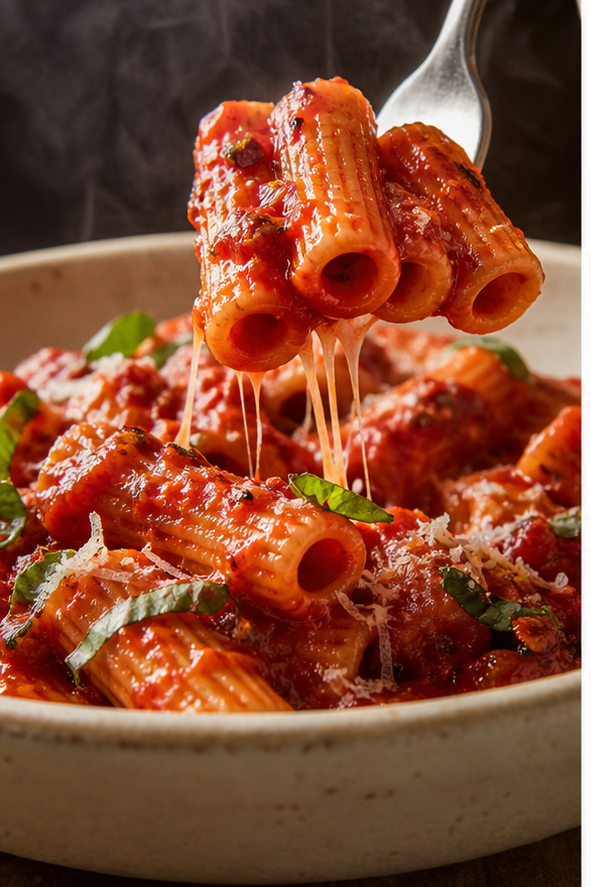
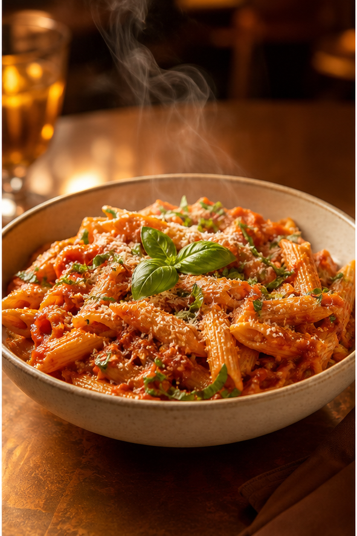
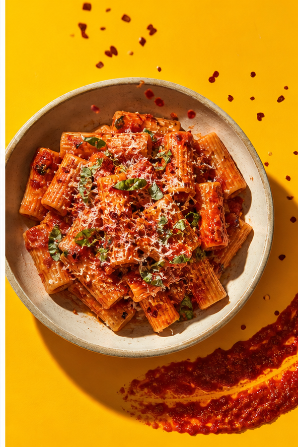
</p>

#### Dettagli

| Autore | Fonte | Settore | Caso d’uso |
|---|---|---|---|
| CommercePrompt Atlas Studio | Creazione originale per questo repository | `food-and-beverage` | `menu-hero` |

- **Piattaforme:** DoorDash, Uber Eats, Deliveroo, Meituan
- **Lingua del prompt:** `en`
- **Licenza:** CC-BY-4.0
- **Pubblicato:** 2026-07-20

---

## footwear

### 1. Platform-Native Trail Shoe Triptych

⭐ **Featured**

#### Descrizione

Presents one technical trail shoe as a clean marketplace hero, a kinetic social ad, and a tactile Pinterest editorial.

#### Prompt

```text
Use case: ads-marketing
Asset type: three premium e-commerce footwear previews in one seamless horizontal contact sheet
Primary request: Create a high-end 3-panel horizontal contact sheet for the exact same unbranded technical trail-running shoe, with distinct Amazon Fashion catalog, TikTok Shop action, and Pinterest editorial treatments. Each panel is a complete standalone vertical 4:5 image, separated by narrow charcoal gutters.
Product invariant: identical single left-foot shoe in every panel; chalk-white engineered mesh upper, pale clay TPU heel cage, black sculpted trail outsole, burnt-orange speed laces, six lace loops, small reflective silver heel tab, no logo. Preserve silhouette, panel seams, lace color, sole geometry, material colors and left-foot orientation.
Panel 1 — AMAZON FASHION CATALOG: single shoe in clean three-quarter lateral view on pure warm white, fully visible, soft natural grounding shadow, immaculate edge definition, honest proportions, high-conversion catalog clarity.
Panel 2 — TIKTOK SHOP ACTION: the same shoe worn by one runner, low crop from mid-calf down, landing on dark wet volcanic gravel at dawn, crisp shoe with controlled flying grit and subtle motion in the background, cool sky and warm rim light, energetic but believable.
Panel 3 — PINTEREST MATERIAL EDITORIAL: single shoe resting diagonally across layered sheets of weathered pale stone and translucent amber resin, raking hard sunlight makes graphic geometric shadows, tactile macro-level mesh and outsole detail, gallery-like styling.
Style/medium: ultra-photorealistic premium footwear campaign photography, realistic mesh, rubber and TPU, disciplined contemporary color grade, high-end art direction, no cheap CGI.
Constraints: no readable text, no logos, no watermark, no extra shoe or pair, no detached laces, no distorted ankle, no panel labels or numbers. Keep the exact shoe design consistent across all panels.
```

#### Anteprime generate

<p align="center">


</p>

#### Dettagli

| Autore | Fonte | Settore | Caso d’uso |
|---|---|---|---|
| CommercePrompt Atlas Studio | Creazione originale per questo repository | `footwear` | `multi-platform-campaign` |

- **Piattaforme:** Amazon Fashion, TikTok Shop, Pinterest
- **Lingua del prompt:** `en`
- **Licenza:** CC-BY-4.0
- **Pubblicato:** 2026-07-21

---

## garden-and-planters

### 1. Cobalt Ceramic Planter Triptych

#### Descrizione

Balances handmade provenance, marketplace clarity, and a Mediterranean interior story for one ceramic planter.

#### Prompt

```text
Use case: product-mockup
Asset type: three premium planter-commerce previews in one seamless horizontal contact sheet
Primary request: Create an artful 3-panel horizontal contact sheet for the exact same unbranded hand-finished ceramic planter, with distinct Etsy maker story, Wayfair catalog, and Pinterest interior-editorial treatments. Each panel is a complete standalone vertical 4:5 image, separated by narrow cobalt gutters.
Product invariant: identical medium cylindrical planter in every panel; warm chalk-white stoneware, slightly irregular hand-thrown rim, broad evenly spaced vertical flutes, one hand-painted cobalt-blue crescent brushstroke wrapping across the front flutes, matching low saucer, one drainage hole, no logo. Preserve proportions, fluting, cobalt crescent position, rim and saucer.
Panel 1 — ETSY MAKER STORY: empty planter and saucer on a worn pale-wood workbench, front three-quarter view, a small natural sea sponge and one cobalt-stained brush softly out of focus at the edge, north-window light, visible clay speckle and brush texture, authentic handmade calm.
Panel 2 — WAYFAIR CATALOG: empty planter centered alone with its saucer on pure #FFFFFF, fully visible, straight-on three-quarter view, accurate scale and clean silhouette, subtle grounding shadow, no tools and no plant.
Panel 3 — PINTEREST INTERIOR EDITORIAL: same planter holding one sculptural young olive tree in a sunken limestone living room, planter is the clear foreground subject, raked Mediterranean afternoon sun creates leaf shadows across a limewashed wall, quiet collectible-design atmosphere, no other pots.
Style/medium: ultra-photorealistic premium ceramics and interior photography, authentic stoneware grain, imperfect hand-painted cobalt, realistic soil and olive leaves, refined chalk/cobalt/limestone palette.
Constraints: no readable text, no logos, no watermark, no extra planter, no flowers, no decorative pattern beyond the single cobalt crescent, no cracked ceramic, no floating saucer, no people, no panel labels or numbers. Keep the exact planter design consistent across all panels.
```

#### Anteprime generate

<p align="center">
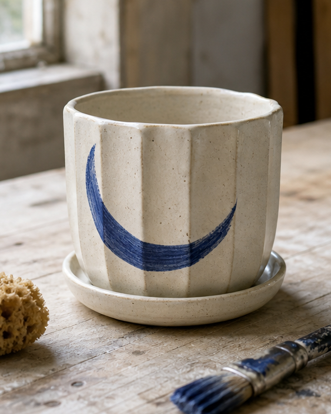
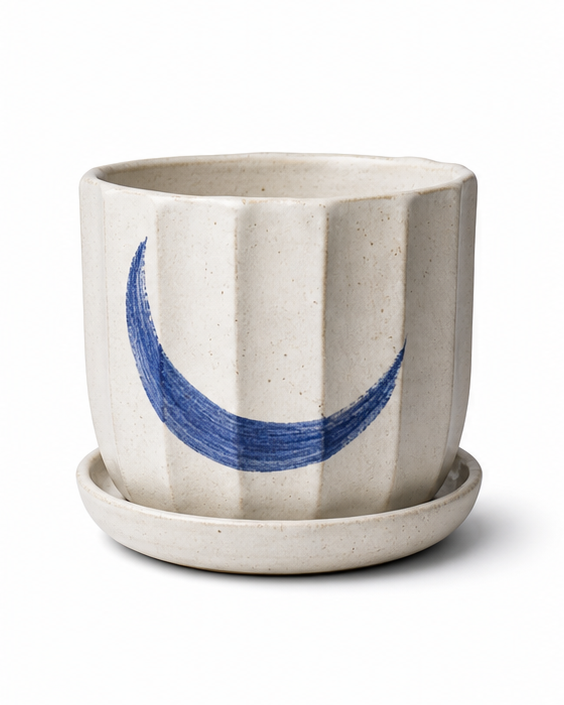
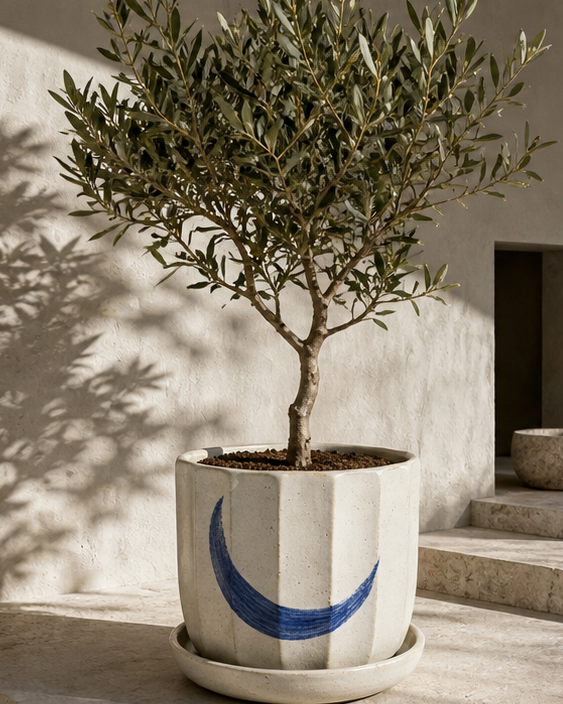
</p>

#### Dettagli

| Autore | Fonte | Settore | Caso d’uso |
|---|---|---|---|
| CommercePrompt Atlas Studio | Creazione originale per questo repository | `garden-and-planters` | `maker-to-interior` |

- **Piattaforme:** Etsy, Wayfair, Pinterest
- **Lingua del prompt:** `en`
- **Licenza:** CC-BY-4.0
- **Pubblicato:** 2026-07-21

---

## home-and-furniture

### 1. Architectural Modular Sofa Triptych

#### Descrizione

Presents one modular sofa through a conversion-focused room, a Pinterest architectural editorial, and an intimate material story.

#### Prompt

```text
Use case: product-mockup
Asset type: three premium furniture-commerce previews in one seamless horizontal contact sheet
Primary request: Create an architecturally sophisticated 3-panel horizontal contact sheet for the exact same sculptural modular sofa, with distinct Wayfair listing, Pinterest editorial, and high-end Shopify lookbook treatments. Each panel is a complete standalone vertical 5:6 interior photograph, separated by narrow warm-gray gutters.
Product invariant: identical low modular sofa in every panel, warm oatmeal bouclé upholstery, softly curved continuous back, three visible seating modules including one rounded chaise on the right, recessed smoked-oak plinth, and subtle piping. Preserve silhouette, module count, chaise side, upholstery tone, seams, proportions, and base.
Panel 1 — WAYFAIR CONVERSION ROOM: bright realistic urban living room, straight-on eye-level 35mm camera, pale oak floor, limewashed warm-white walls, one wool rug and one compact stone coffee table, product fully visible with clear scale and clean edges, balanced daylight, inviting but uncluttered catalog realism.
Panel 2 — PINTEREST ARCHITECTURAL EDITORIAL: sunken conversation space inside a quiet brutalist coastal house, raked late-afternoon sunlight passes through vertical concrete fins, sculptural shadow bands across floor but not obscuring sofa, distant sea horizon, 24mm wide lens, restrained collectible-design mood.
Panel 3 — SHOPIFY MATERIAL STORY: intimate oblique close view from sofa-arm height, bouclé fibers and curved seam in tactile focus, background falls into a warm walnut-and-travertine interior with a softly glowing paper lantern, 50mm lens, shallow depth, amber evening calm, premium craftsmanship storytelling.
Style/medium: ultra-photorealistic interior and furniture photography, believable architecture, accurate perspective and floor contact, real woven fibers, nuanced neutral color grade, natural shadow detail; no sterile CGI showroom.
Constraints: no readable text, no logos, no watermark, no people, no extra sofa, no oversized plants, no clutter, no implausible floating furniture, no panel labels or numbers. Keep the identical sofa design in every panel.
```

#### Anteprime generate

<p align="center">
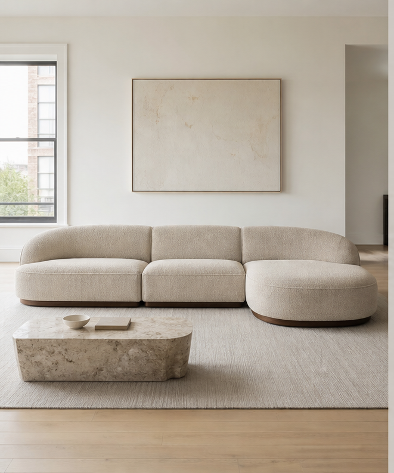
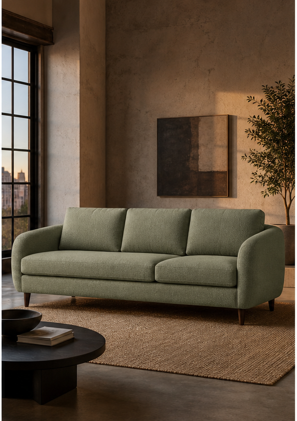
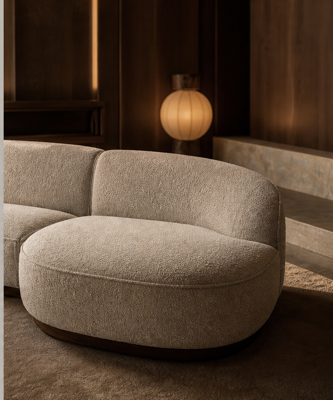
</p>

#### Dettagli

| Autore | Fonte | Settore | Caso d’uso |
|---|---|---|---|
| CommercePrompt Atlas Studio | Creazione originale per questo repository | `home-and-furniture` | `lifestyle-scene` |

- **Piattaforme:** Wayfair, Pinterest, Shopify
- **Lingua del prompt:** `en`
- **Licenza:** CC-BY-4.0
- **Pubblicato:** 2026-07-20

---

## jewelry

### 1. Museum-Grade Emerald Ring Triptych

#### Descrizione

Creates a ceremonial luxury launch, an atelier craftsmanship macro, and a water-caustic editorial for one emerald ring.

#### Prompt

```text
Use case: ads-marketing
Asset type: three high-jewelry e-commerce campaign previews in one seamless horizontal contact sheet
Primary request: Create a museum-grade 3-panel horizontal contact sheet for the exact same unbranded sculptural emerald ring, with distinct Tmall Luxury launch, Shopify atelier story, and editorial social-commerce art directions. Each panel is a complete standalone square macro image, separated by hairline black gutters.
Jewelry invariant: identical 18k yellow-gold ring in every panel; one elongated octagonal emerald-cut deep green center stone; four minimal talon prongs; knife-edge gold band; no halo and no side stones. Preserve stone cut, deep forest-green color, prong count and placement, band profile, and scale.
Panel 1 — TMALL LUXURY LAUNCH: ring stands upright inside a narrow beam of warm museum light on black lacquer, a thin circular reflection frames the stone, deep black negative space, centered ceremonial composition, emerald facets glowing from within, precise high-contrast elegance.
Panel 2 — SHOPIFY ATELIER DETAIL: extreme 100mm macro side view resting on folded raw ivory silk, focus across prong craftsmanship and the flawless mirror-polished knife-edge band, soft overcast window light, quiet heirloom authenticity, shallow depth of field.
Panel 3 — EDITORIAL WATER CAUSTIC: ring lying on pale translucent green onyx beneath a shallow layer of clear water, sunlight creates fine caustic lines and spectral fire across the emerald and gold, airy crop with asymmetric negative space, fresh contemporary summer campaign, no splash cliché.
Style/medium: ultra-photorealistic high-jewelry macro photography, physically accurate gemstone refraction, sharp facet junctions, controlled sparkle, rich black point, realistic gold reflections, sophisticated retouching without CGI smoothness.
Constraints: pristine clean jewelry surfaces; no smudges or fingerprints; no readable text, logo, watermark, hands, ring box, extra jewelry, pearls, flowers, added stones, floating impossible setting, panel labels, or numbers. The exact ring design must remain consistent.
```

#### Anteprime generate

<p align="center">
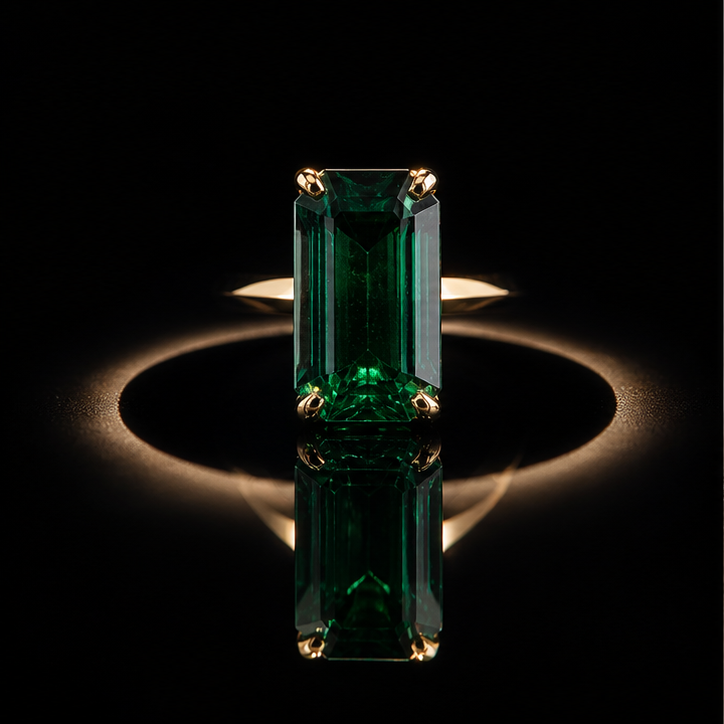
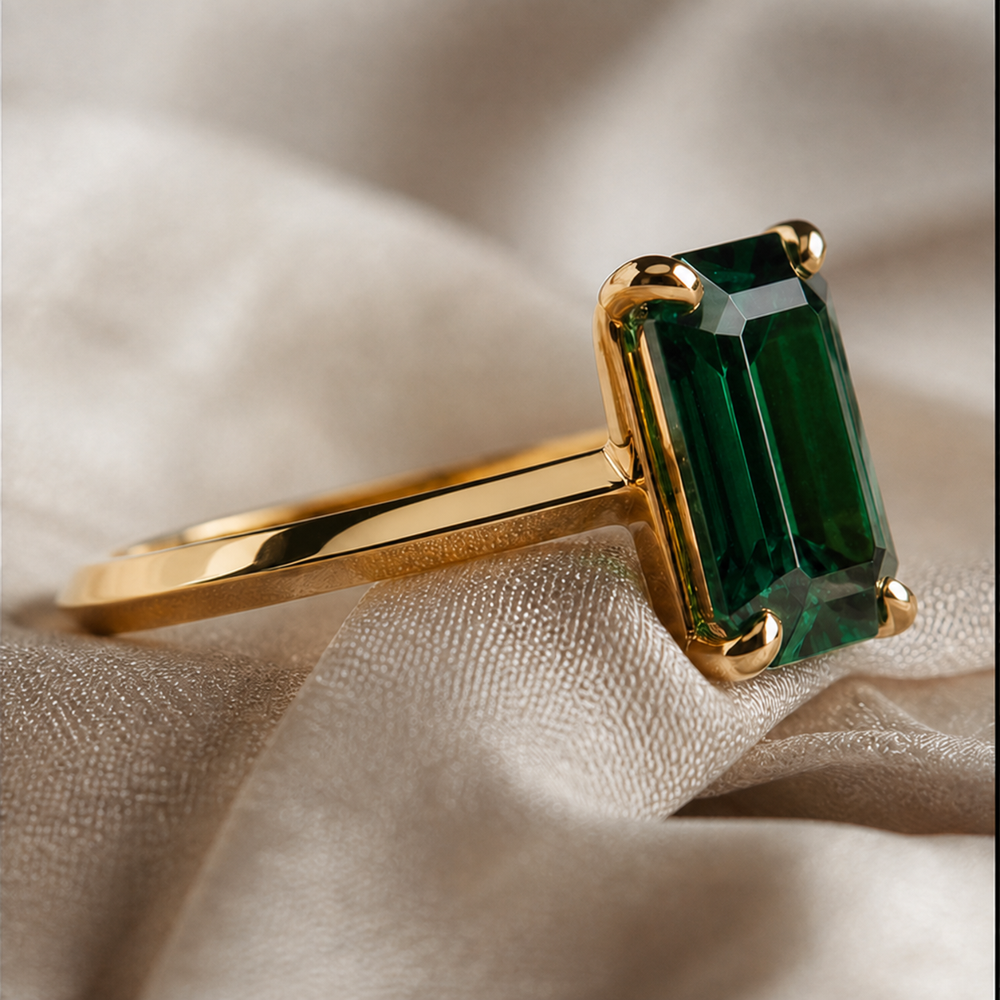
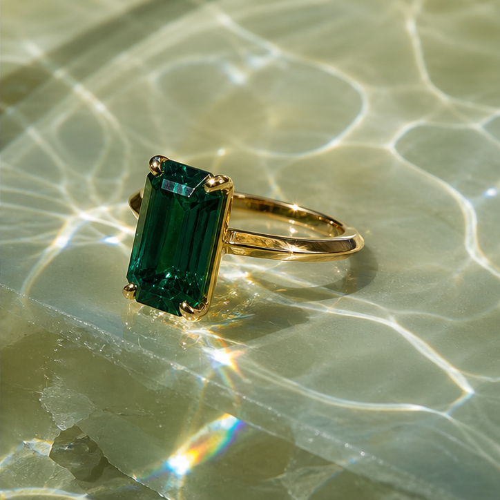
</p>

#### Dettagli

| Autore | Fonte | Settore | Caso d’uso |
|---|---|---|---|
| CommercePrompt Atlas Studio | Creazione originale per questo repository | `jewelry` | `macro-product-hero` |

- **Piattaforme:** Tmall Luxury, Shopify, Instagram Shop
- **Lingua del prompt:** `en`
- **Licenza:** CC-BY-4.0
- **Pubblicato:** 2026-07-20

---

## kitchen-appliances

### 1. Espresso Machine Commerce Triptych

#### Descrizione

Moves one compact espresso machine from catalog precision to warm domestic ritual and creator-led editorial styling.

#### Prompt

```text
Use case: product-mockup
Asset type: three premium kitchen-appliance e-commerce previews in one seamless horizontal contact sheet
Primary request: Create a sophisticated 3-panel horizontal contact sheet for the exact same unbranded compact espresso machine, with distinct Amazon listing, Shopify lifestyle, and Xiaohongshu ritual treatments. Each panel is a complete standalone vertical 4:5 image, separated by narrow warm-gray gutters.
Product invariant: identical compact espresso machine in every panel; brushed satin stainless-steel body, softly rounded rectangular profile, one circular pressure gauge centered high on the face, two small black rotary knobs, walnut portafilter handle pointing right, low polished drip tray, no logo. Preserve all controls, proportions, metal finish and handle direction.
Panel 1 — AMAZON LISTING HERO: one machine alone, front three-quarter view on pure #FFFFFF, fully visible with power cable concealed, realistic soft grounding shadow, crisp catalog edges, honest scale, no cup and no accessories.
Panel 2 — SHOPIFY MORNING LIFESTYLE: same machine on honed cream travertine in a restrained warm-oak kitchen, one handmade ivory demitasse under the spout, a thin stream of espresso with fresh crema, early side light and soft linen shadow, calm premium domestic realism.
Panel 3 — XIAOHONGSHU COFFEE RITUAL: close low-angle editorial crop, same machine accompanied only by a small walnut tray, folded deep-red linen and a glass of sparkling water, dramatic hard sunlight through blinds, precise reflective highlights and cinematic shadow geometry, aspirational creator aesthetic.
Style/medium: ultra-photorealistic premium appliance and interior photography, physically accurate brushed steel, walnut and crema, refined neutral grade with restrained warm red accent, no sterile CGI.
Constraints: no readable text, no logos, no watermark, no extra machine, no impossible steam, no detached controls, no duplicated cups, no hands, no panel labels or numbers. Keep the exact machine design consistent across all panels.
```

#### Anteprime generate

<p align="center">
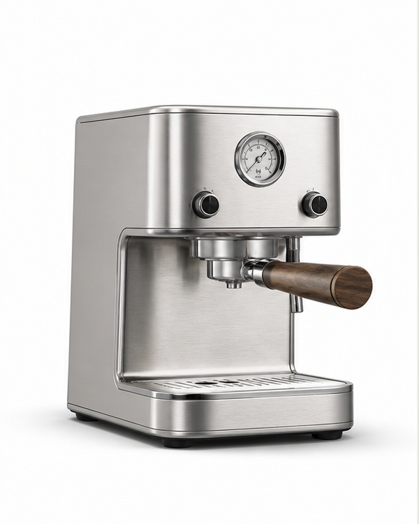
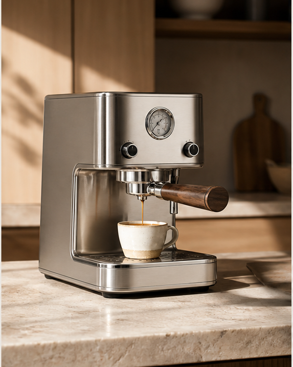
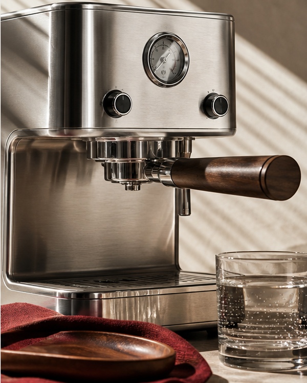
</p>

#### Dettagli

| Autore | Fonte | Settore | Caso d’uso |
|---|---|---|---|
| CommercePrompt Atlas Studio | Creazione originale per questo repository | `kitchen-appliances` | `catalog-to-lifestyle` |

- **Piattaforme:** Amazon, Shopify, Xiaohongshu
- **Lingua del prompt:** `en`
- **Licenza:** CC-BY-4.0
- **Pubblicato:** 2026-07-21

---

## outdoor-gear

### 1. Trekking Tent Weather Triptych

⭐ **Featured**

#### Descrizione

Shows one two-person tent in a technical studio, believable rain performance, and a cinematic high-desert camp.

#### Prompt

```text
Use case: ads-marketing
Asset type: three premium outdoor-commerce previews in one seamless horizontal contact sheet
Primary request: Create an atmospheric 3-panel horizontal contact sheet for the exact same unbranded two-person trekking tent, with distinct outdoor-retail catalog, Amazon feature, and Pinterest adventure-editorial treatments. Each panel is a complete standalone vertical 4:5 image, separated by narrow dark-green gutters.
Product invariant: identical low-profile two-person dome tent in every panel; muted burnt-orange ripstop fly, dark forest-green bathtub floor, two crossed black aluminum poles, one arched side door, two small triangular vents, no logo. Preserve silhouette, pole geometry, door side, vent count, colors and scale.
Panel 1 — OUTDOOR RETAIL CATALOG: fully pitched tent alone on a clean pale-stone studio sweep with a small realistic ground cloth, front three-quarter view, every edge visible, soft north light, technical clarity without text or callouts.
Panel 2 — AMAZON WEATHER FEATURE: same tent pitched on a rain-dark alpine shelf during steady rain, close three-quarter view, visible water beading and taut fly, warm low interior glow demonstrating shelter, wet slate and restrained mist, no people and no dramatic storm danger.
Panel 3 — PINTEREST ADVENTURE EDITORIAL: same tent on a quiet high-desert plateau at blue hour, distant layered sandstone mesas, one small camp lantern outside, Milky Way band beginning overhead, cinematic composition with the tent clearly readable, contemplative premium travel mood.
Style/medium: ultra-photorealistic outdoor product and adventure photography, physically plausible tent construction, ripstop texture, rain and ground contact, natural color science, sophisticated editorial restraint.
Constraints: no readable text, no logos, no watermark, no extra tent, no people, no campfire, no impossible pole intersections, no floating guy lines, no severe weather, no panel labels or numbers. Keep the exact tent design consistent across all panels.
```

#### Anteprime generate

<p align="center">


</p>

#### Dettagli

| Autore | Fonte | Settore | Caso d’uso |
|---|---|---|---|
| CommercePrompt Atlas Studio | Creazione originale per questo repository | `outdoor-gear` | `weather-performance` |

- **Piattaforme:** Outdoor Retail, Amazon, Pinterest
- **Lingua del prompt:** `en`
- **Licenza:** CC-BY-4.0
- **Pubblicato:** 2026-07-21

---

## pet-supplies

### 1. Design-Led Cat Carrier Triptych

#### Descrizione

Balances marketplace clarity, a gentle travel story, and feature-detail photography for one premium cat carrier.

#### Prompt

```text
Use case: ads-marketing
Asset type: three premium pet-commerce previews in one seamless horizontal contact sheet
Primary request: Create a warm, design-led 3-panel horizontal contact sheet for the exact same unbranded structured cat travel carrier, with distinct Chewy catalog, Instagram Shop lifestyle, and Amazon feature-detail treatments. Each panel is a complete standalone vertical 4:5 image, separated by narrow cream gutters.
Product invariant: identical compact carrier in every panel; olive-green recycled canvas rectangular body with gently arched top, tan vegetable-tanned leather handles, one large black mesh side window, matte brass zipper, cream sherpa removable base, no logo. Preserve proportions, window shape, handle count, seam positions and colors.
Panel 1 — CHEWY CATALOG: carrier alone in front three-quarter view on a soft pale-blue seamless studio, fully visible, one zipper neatly closed, gentle oval shadow, cheerful honest product clarity, no animal and no props.
Panel 2 — INSTAGRAM SHOP LIFESTYLE: same carrier beside a calm silver tabby cat in a sunlit modern train-compartment seat, carrier open with sherpa base visible, cat naturally sniffing the entrance, soft travel narrative, warm afternoon light, premium candid realism, no human visible.
Panel 3 — AMAZON FEATURE DETAIL: close three-quarter crop of the same carrier on warm white, mesh ventilation and brass zipper sharply rendered, one side opening reveals the cream sherpa base and organized interior volume without technical labels, clean infographic-like precision made only with photography.
Style/medium: ultra-photorealistic premium pet product photography, authentic canvas weave, leather grain, mesh and fur, cozy but modern art direction, restrained olive/tan/blue palette.
Constraints: no readable text, no logos, no watermark, no extra carrier, no duplicated cat, no distressed animal, no impossible transparent materials, no detached handles, no panel labels or numbers. Keep the exact carrier design consistent across all panels.
```

#### Anteprime generate

<p align="center">
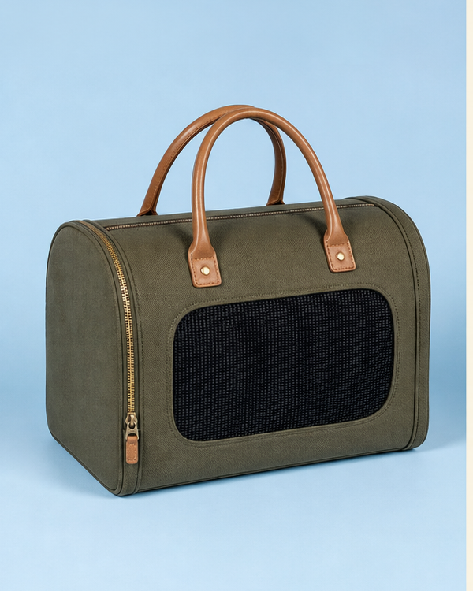
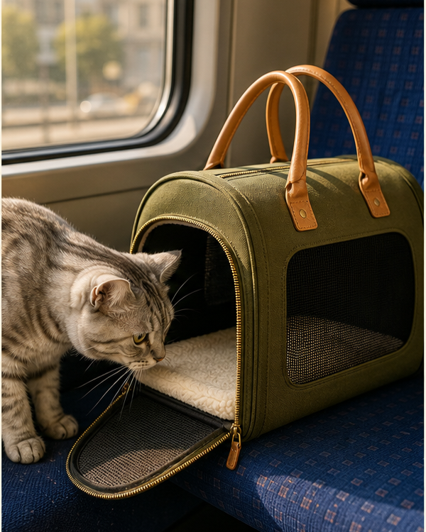
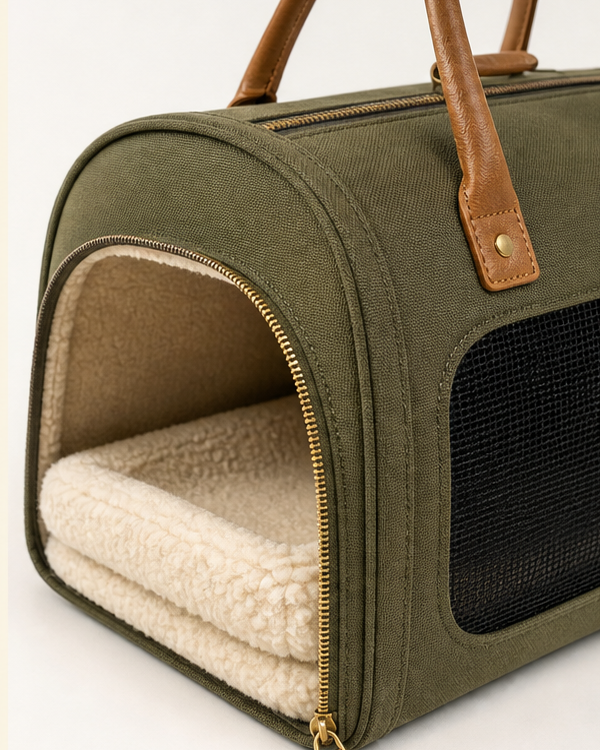
</p>

#### Dettagli

| Autore | Fonte | Settore | Caso d’uso |
|---|---|---|---|
| CommercePrompt Atlas Studio | Creazione originale per questo repository | `pet-supplies` | `product-and-lifestyle` |

- **Piattaforme:** Chewy, Instagram Shop, Amazon
- **Lingua del prompt:** `en`
- **Licenza:** CC-BY-4.0
- **Pubblicato:** 2026-07-21

---

## tea-and-grocery

### 1. Ceremonial Matcha Tin Triptych

#### Descrizione

Takes one celadon matcha tin from grocery clarity to a contemporary tea ritual and a bright iced-latte social image.

#### Prompt

```text
Use case: ads-marketing
Asset type: three premium tea-commerce previews in one seamless horizontal contact sheet
Primary request: Create a fresh, culturally respectful 3-panel horizontal contact sheet for the exact same unbranded ceremonial matcha tin, with distinct Amazon Grocery catalog, Shopify tea-ritual, and Xiaohongshu iced-latte treatments. Each panel is a complete standalone vertical 4:5 image, separated by narrow deep-green gutters.
Product invariant: identical small cylindrical tin in every panel; matte pale celadon body, flush deep-green lid, one narrow vertical cream paper seal crossing the lid edge with no writing, subtle brushed metal rim, no logo and no text. Preserve proportions, lid color, blank seal, rim and finish.
Panel 1 — AMAZON GROCERY CATALOG: one sealed tin centered on pure #FFFFFF with the lid closed, a small bamboo teaspoon beside it holding a neat mound of vivid fine matcha powder, soft natural grounding shadows, accurate scale, clean product clarity.
Panel 2 — SHOPIFY TEA RITUAL: same tin open on a dark charcoal stone tea table, lid placed behind it, bright green powder visible inside, one unbranded black-glazed tea bowl and bamboo whisk nearby, soft directional morning light through paper screen, quiet contemporary Japanese-inspired restraint without ceremonial costume or decorative cliché.
Panel 3 — XIAOHONGSHU ICED MATCHA: same closed tin on a translucent mint acrylic block beside one tall clear glass of layered iced matcha oat latte, condensation and realistic ice, hard summer sunlight creates graphic green caustics across a cream surface, energetic creator-style framing with negative space and no text.
Style/medium: ultra-photorealistic premium food-and-packaging photography, physically accurate powder fineness, matte metal, glass, ice and condensation, crisp celadon/green/cream palette, sophisticated commercial styling.
Constraints: no readable text, no logos, no watermark, no extra tin, no health claims, no people or hands, no floating powder, no impossible liquid layers, no panel labels or numbers. Keep the exact tin design consistent across all panels.
```

#### Anteprime generate

<p align="center">
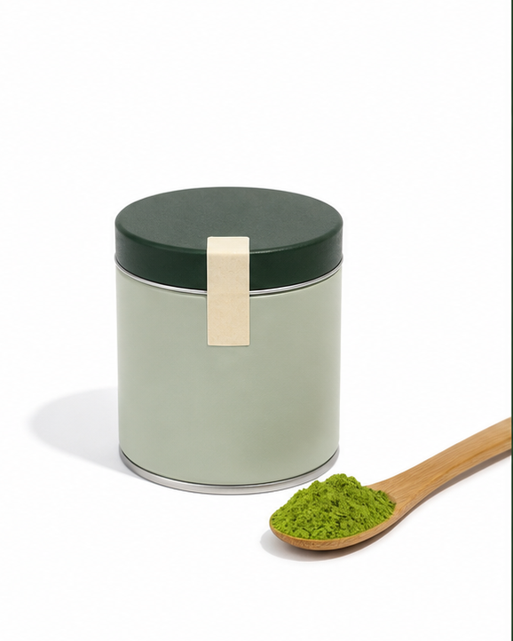
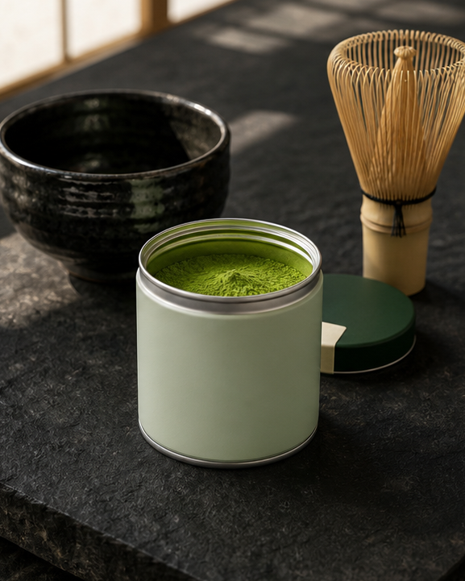
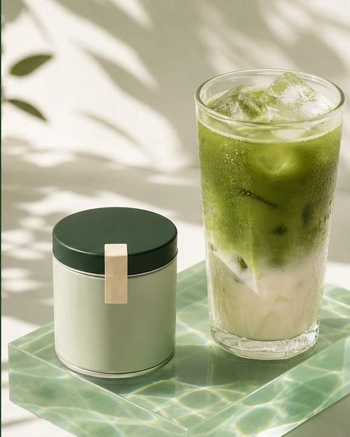
</p>

#### Dettagli

| Autore | Fonte | Settore | Caso d’uso |
|---|---|---|---|
| CommercePrompt Atlas Studio | Creazione originale per questo repository | `tea-and-grocery` | `packaging-and-ritual` |

- **Piattaforme:** Amazon Grocery, Shopify, Xiaohongshu
- **Lingua del prompt:** `en`
- **Licenza:** CC-BY-4.0
- **Pubblicato:** 2026-07-21

---

## toys-and-kids

### 1. Wooden Stacking Arch Triptych

#### Descrizione

Frames one seven-piece wooden arch through handmade provenance, marketplace clarity, and a calm playroom story.

#### Prompt

```text
Use case: ads-marketing
Asset type: three premium children's-toy e-commerce previews in one seamless horizontal contact sheet
Primary request: Create a joyful but refined 3-panel horizontal contact sheet for the exact same unbranded wooden stacking-arch toy, with distinct Etsy handmade, Amazon catalog, and Pinterest playroom-editorial treatments. Each panel is a complete standalone vertical 4:5 image, separated by narrow off-white gutters.
Product invariant: identical seven-piece nested wooden rainbow arch in every panel; smooth solid beech wood; muted mineral colors ordered largest to smallest as terracotta, ochre, sage, dusty blue, warm gray, blush and natural wood; softly rounded edges; no logo. Preserve seven-piece count, color order, curvature, thickness and finish.
Panel 1 — ETSY HANDMADE STORY: fully assembled arch centered on raw oatmeal linen over a pale oak table, a few fine wood shavings and one small craft brush placed softly out of focus at the edge, diffused north-window light, tactile handcrafted authenticity, product completely readable.
Panel 2 — AMAZON CATALOG: the same seven pieces separated into a neat descending row on pure #FFFFFF, all pieces fully visible and correctly ordered, crisp color accuracy, soft contact shadows, generous padding, no props.
Panel 3 — PINTEREST PLAYROOM EDITORIAL: same arch reassembled as a sculptural bridge in a serene child-safe playroom, one natural-wood toy car beneath it and two simple blocks nearby, limewashed warm wall, woven wool rug, long gentle morning shadows, sophisticated calm family lifestyle without showing a child.
Style/medium: ultra-photorealistic premium toy and interiors photography, safe rounded wood, visible beech grain, matte child-safe paint, gentle modern palette, editorial warmth without visual clutter.
Constraints: exactly seven arch pieces, no readable text, no logos, no watermark, no extra rainbow toy, no child or hands, no sharp edges, no chipped paint, no impossible balancing, no panel labels or numbers. Keep the exact color order and toy geometry consistent across all panels.
```

#### Anteprime generate

<p align="center">
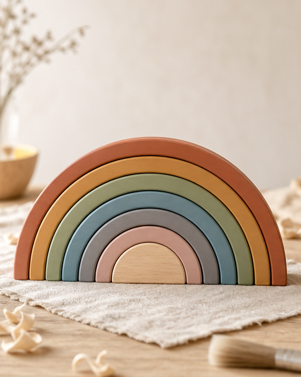
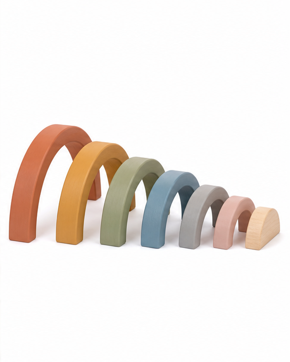
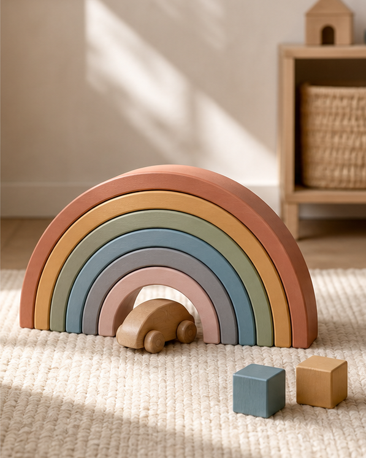
</p>

#### Dettagli

| Autore | Fonte | Settore | Caso d’uso |
|---|---|---|---|
| CommercePrompt Atlas Studio | Creazione originale per questo repository | `toys-and-kids` | `handmade-product-story` |

- **Piattaforme:** Etsy, Amazon, Pinterest
- **Lingua del prompt:** `en`
- **Licenza:** CC-BY-4.0
- **Pubblicato:** 2026-07-21

---

## watches

### 1. Bronze Mechanical Watch Triptych

⭐ **Featured**

#### Descrizione

Moves one bronze mechanical watch from collector-grade catalog precision to a ceremonial launch and a quiet wrist editorial.

#### Prompt

```text
Use case: ads-marketing
Asset type: three premium watch-commerce previews in one seamless horizontal contact sheet
Primary request: Create a museum-level 3-panel horizontal contact sheet for the exact same unbranded mechanical wristwatch, with distinct Chrono24 catalog, Tmall Luxury launch, and Instagram editorial treatments. Each panel is a complete standalone vertical 4:5 image, separated by hairline black gutters.
Product invariant: identical watch in every panel; 38 mm brushed bronze cushion case, deep moss-green sunray dial, twelve slim applied gold baton hour markers with no numerals, two gold dauphine hands fixed at 10:10, small seconds subdial at 6 o'clock, domed crystal, dark brown suede strap with tonal stitching, no logo and no date window. Preserve case shape, crown position, marker layout, hand style, dial color and strap.
Panel 1 — CHRONO24 CATALOG: watch alone lying flat at a slight diagonal on pure warm white, buckle and most of the strap visible while the lower strap end may meet the frame edge, clean overhead precision, soft contact shadow, accurate proportions, crisp bezel and dial, no props.
Panel 2 — TMALL LUXURY LAUNCH: watch upright on a narrow slab of smoked amber glass in deep black space, a controlled warm spotlight catches the bronze edge and green dial, one subtle circular reflection, ceremonial high contrast, exact face remains readable.
Panel 3 — INSTAGRAM EDITORIAL: same watch worn on one adult wrist emerging from a charcoal wool sleeve, natural relaxed pose against weathered olive stone, low winter sunlight and a narrow shadow line, tactile skin, suede and metal, quiet collector mood.
Style/medium: ultra-photorealistic high-watchmaking photography, physically accurate bronze patina, optical crystal, sunray dial and suede nap, disciplined retouching, rich but natural black point.
Constraints: no readable text, no logo, no watermark, no extra watch, no jewelry, no distorted wrist or fingers, no duplicate crown, no incorrect numerals, no panel labels or numbers. Keep the exact watch design and 10:10 hand position consistent.
```

#### Anteprime generate

<p align="center">


</p>

#### Dettagli

| Autore | Fonte | Settore | Caso d’uso |
|---|---|---|---|
| CommercePrompt Atlas Studio | Creazione originale per questo repository | `watches` | `collector-campaign` |

- **Piattaforme:** Chrono24, Tmall Luxury, Instagram Shop
- **Lingua del prompt:** `en`
- **Licenza:** CC-BY-4.0
- **Pubblicato:** 2026-07-21

---

<a id="contribute"></a>

## Contribuisci

Submit a prompt through the GitHub Issue form. Maintainers review attribution, rights, quality, reproducibility, and safety before applying the `approved` label.

- [Contribution guide](docs/CONTRIBUTING.md)
- [Copyright and takedown policy](docs/COPYRIGHT.md)
- [Visual research and prompt provenance](docs/VISUAL_RESEARCH.md)
- [Editorial policy](docs/EDITORIAL_POLICY.md)
- [Data schema](docs/DATA_SCHEMA.md)
- [Local development](docs/LOCAL_DEVELOPMENT.md)

## License

Repository-authored content is licensed under [CC BY 4.0](LICENSE). Individual records may carry additional source metadata and third-party rights notices.
