<!-- AUTO-GENERATED FILE. EDIT data/prompts/*.json, data/taxonomy.json, scripts/i18n.mjs, OR scripts/generate-readmes.mjs INSTEAD. -->

# ecommerce-gpt-image-prompts

[](https://github.com/sindresorhus/awesome) [](https://github.com/ecomimagelab/ecommerce-gpt-image-prompts) [](LICENSE) [](https://github.com/ecomimagelab/ecommerce-gpt-image-prompts/actions/workflows/update-readmes.yml) [](docs/CONTRIBUTING.md)

> Uma biblioteca multilíngue e selecionada de prompts para o comércio eletrônico global.

> ⚠️ **Copyright Notice:** Prompts and preview images retain their recorded attribution and license metadata. If you believe an entry infringes your rights, please request review or removal [Report content](https://github.com/ecomimagelab/ecommerce-gpt-image-prompts/issues/new?template=copyright-report.yml).

---

[](README.md) [](README_zh.md) [](README_zh-TW.md) [](README_ja-JP.md) [](README_ko-KR.md) [](README_th-TH.md) [](README_vi-VN.md) [](README_hi-IN.md) [](README_es-ES.md) [](README_es-419.md) [](README_de-DE.md) [](README_fr-FR.md) [](README_it-IT.md) [](README_pt-BR.md) [](README_pt-PT.md) [](README_tr-TR.md)

---

<a id="try-in-pixpix"></a>

## ✨ Experimentar no PixPix

[](https://www.pixpix.com/)

**[🚀 Abrir o PixPix e criar agora →](https://www.pixpix.com/)**

Copy any prompt from this library into PixPix to create or edit e-commerce images and videos.

### Why use PixPix?

| Feature | GitHub README | PixPix |
|---|---|---|
| Prompt library | Curated prompts, previews, and attribution | Copy a prompt into the creation workspace |
| AI generation | — | AI image and video tools |
| E-commerce workflow | Platform, use-case, and aspect-ratio metadata | Product image sets and A+ content workflows |
| Product editing | Before/After evidence when available | Retouching, background, inpainting, and expansion tools |

### 🗂️ Browse by Category

- **Industries**
  - [Automotive accessories](#categories-automotive-accessories) · [Bags and accessories](#categories-bags-and-accessories) · [Beauty and skincare](#categories-beauty) · [Bedding and textiles](#categories-bedding-and-textiles) · [Consumer electronics](#categories-consumer-electronics) · [Cookware](#categories-cookware) · [Cycling](#categories-cycling) · [Fashion](#categories-fashion) · [Fitness and wellness](#categories-fitness-and-wellness) · [Food and beverage](#categories-food-and-beverage) · [Footwear](#categories-footwear) · [Garden and planters](#categories-garden-and-planters) · [Home and furniture](#categories-home-and-furniture) · [Jewelry](#categories-jewelry) · [Kitchen appliances](#categories-kitchen-appliances) · [Outdoor gear](#categories-outdoor-gear) · [Pet supplies](#categories-pet-supplies) · [Stationery and office](#categories-stationery-and-office) · [Tea and grocery](#categories-tea-and-grocery) · [Toys and kids](#categories-toys-and-kids) · [Travel and luggage](#categories-travel-and-luggage) · [Watches](#categories-watches)
- **Use Cases**
  - [Branded hero](#usecases-branded-hero) · [Lifestyle scene](#usecases-lifestyle-scene) · [Marketplace main image](#usecases-main-image) · [Catalog image](#usecases-catalog-image) · [Social commerce ad](#usecases-social-ad) · [Feature visual](#usecases-feature-callout) · [Detail and macro](#usecases-detail-macro) · [On-model](#usecases-on-model)
- **Platforms**
  - [Amazon](#platforms-amazon) · [Pinterest](#platforms-pinterest) · [Shopify](#platforms-shopify) · [Instagram Shop](#platforms-instagram-shop) · [TikTok Shop](#platforms-tiktok-shop) · [Xiaohongshu](#platforms-xiaohongshu) · [Tmall](#platforms-tmall) · [Etsy](#platforms-etsy) · [Tmall Luxury](#platforms-tmall-luxury) · [Amazon Home](#platforms-amazon-home) · [Wayfair](#platforms-wayfair) · [Amazon A+](#platforms-amazon-a-plus) · [Amazon Fashion](#platforms-amazon-fashion) · [Amazon Grocery](#platforms-amazon-grocery) · [Amazon Sports](#platforms-amazon-sports) · [Best Buy](#platforms-best-buy) · [Chewy](#platforms-chewy) · [Chrono24](#platforms-chrono24) · [Decathlon](#platforms-decathlon) · [Deliveroo](#platforms-deliveroo) · [DoorDash](#platforms-doordash) · [eBay](#platforms-ebay) · [Farfetch](#platforms-farfetch) · [JD](#platforms-jd) · [Meituan](#platforms-meituan) · [Outdoor retail](#platforms-outdoor-retail) · [Sephora](#platforms-sephora) · [Shopee](#platforms-shopee) · [Uber Eats](#platforms-uber-eats)

---

<a id="table-of-contents"></a>

## Índice

- [✨ Experimentar no PixPix](#try-in-pixpix)
- [O que é ecommerce-gpt-image-prompts?](#what-is-library)
- [Estatísticas](#statistics)
- [Prompts em destaque](#featured-prompts)
- [Todos os prompts](#all-prompts)
- [Como contribuir](#how-to-contribute)
- [Licença](#license)
- [Agradecimentos](#acknowledgements)
- [⭐ Histórico de estrelas](#star-history)

---

<a id="what-is-library"></a>

## O que é ecommerce-gpt-image-prompts?

This repository collects reproducible e-commerce image prompts with structured metadata, clear attribution, licensing records, and multiple preview outputs.

Each visible entry pairs one copy-ready prompt with the preview generated from that prompt. Production metadata remains available without interrupting the image-first browsing flow.

- **Reproducible prompts** — Every displayed preview maps to the standalone prompt shown directly above it.
- **Platform-native direction** — Amazon, Shopify, TikTok Shop, Pinterest, Tmall, and other treatments remain visually distinct.
- **Product consistency** — Structured invariants help preserve silhouette, materials, colors, and recognizable identity.
- **Preview evidence** — High-resolution generated examples are displayed inline for visual review.
- **Rights metadata** — Every entry records author, source, license, publication date, and provenance notes.

---

<a id="statistics"></a>

## Estatísticas

| Metric | Count |
|---|---:|
| Total prompts | **74** |
| Product collections | **25** |
| ⭐ Prompts em destaque | **6** |
| Generated preview images | **74** |
| Industries | **22** |
| Platforms | **29** |
| Last updated | **2026-07-22** |

---

<a id="featured-prompts"></a>

## Prompts em destaque

> ⭐ Hand-picked by our team for exceptional e-commerce quality and reproducibility.

<a id="featured-ec-0022-amazon-home-main-image"></a>

### No. 1: Cookware — Forest Cocotte Cookware Set: AMAZON HOME MAIN IMAGE

  

#### Descrição

Moves one forest-green Dutch oven from white-background retail clarity to a save-worthy Mediterranean still life and a believable home-cooking ritual.

> This title and description use the English fallback.

**Marketplace main image · Amazon Home · 4:5**

#### Prompt

```text
Create one ultra-photorealistic portrait 4:5 catalog photograph of a fictional unbranded 5-quart round enameled cast-iron Dutch oven. Use a low wide cylindrical body in deep forest-green gloss enamel, warm-cream enamel interior, two short horizontal loop handles, matching heavy lid with three subtle concentric rings and a small domed brushed-brass knob. Lean the lid upright directly behind the open empty pot so the interior and lid are visible; exactly one pot and one matching lid. Use pure #FFFFFF, centered three-quarter view, complete handles and lid, 76% frame fill, broad softbox and controlled enamel highlight. No food, steam, utensils, packaging, text, logo, watermark, extra cookware, detached knob, distorted handles, chips, plastic CGI, collage, or border.
```

#### Pré-visualizações geradas

##### Image 1

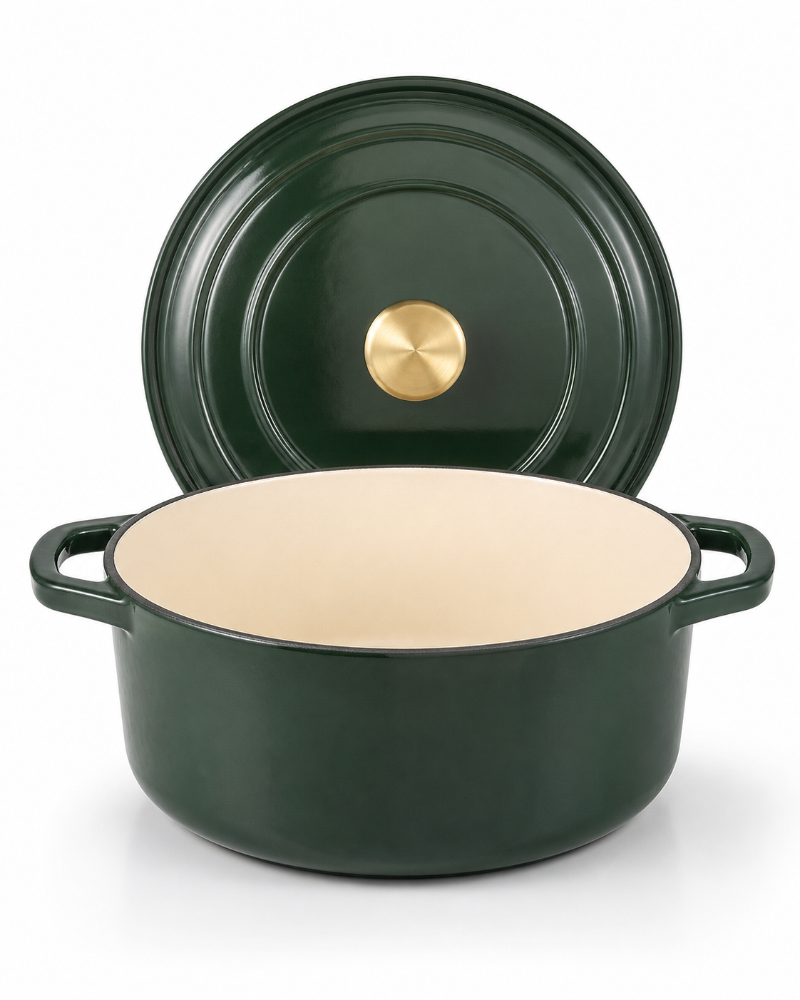

#### Detalhes

- **Autor:** [Ecommerce GPT Image Prompts Studio](https://github.com/ecomimagelab)
- **Fonte:** Criação original para este repositório
- **Publicado:** 2026-07-22
- **Languages:** en
- **Plataformas:** Amazon Home
- **Licença:** CC-BY-4.0

<details>
<summary><strong>Production details, product invariants, and provenance</strong></summary>

| Mode | Industry | Use cases | Aspect ratio |
|---|---|---|---|
| `text-to-image` | Cookware | Marketplace main image | 4:5 |

- **Styles:** Minimalist clean, Natural organic, Food editorial
- **Backgrounds:** Pure white
- **Asset purpose:** Marketplace main image
- **Input requirements:** No reference image is required for this fictional cookware design; use product-edit mode for a real SKU.
- **Product invariants:**
  - Preserve the low wide cylindrical cast-iron body, deep forest-green gloss exterior, warm-cream enamel interior, and two short horizontal loop handles.
  - Preserve the matching heavy green lid with three subtle concentric rings and one small domed brushed-brass knob.
- **Negative constraints:** No words, logos, watermark, extra pot, extra lid, detached knob, distorted handles, impossible geometry, unsafe hand contact, plastic CGI, collage, or border.

**Provenance and rights**

- Generated specifically for this repository from the recorded standalone prompt; no third-party preview image is redistributed.
- Original prompt and generated previews created for this repository after open-source prompt-pattern research; no external preview asset is included.
- [visual-research](docs/VISUAL_RESEARCH.md)
- [visual-research](https://github.com/wuyoscar/GPT-Image2-Skill)
- **Platform-policy status:** Platform names identify intended visual treatment only; verify current listing and advertising requirements before publication.
- **Product collection:** [ec-0022](data/prompts/ec-0022-forest-cocotte-cookware-set.json)

</details>

**[🚀 Experimentar agora →](https://www.pixpix.com/)**

---

<a id="featured-ec-0021-amazon-clean-main-image"></a>

### No. 2: Consumer electronics — Midnight Headphones Platform Set: AMAZON CLEAN MAIN IMAGE

  

#### Descrição

Keeps one midnight-blue headphone design consistent across a pure-white marketplace listing, an acoustic feature visual, and a creator-led TikTok Shop frame.

> This title and description use the English fallback.

**Marketplace main image · Amazon · 4:5**

#### Prompt

```text
Create one ultra-photorealistic portrait 4:5 catalog photograph of a fictional unbranded pair of premium over-ear wireless headphones. Product design: two large rounded-oval matte midnight-navy earcups with shallow concentric bevels, slim bead-blasted natural-aluminum Y-yokes, a broad navy woven-fabric headband with a narrow aluminum center rail, thick charcoal textile memory-foam cushions, and one tiny burnt-orange fabric pull tab beneath the right earcup. Use pure #FFFFFF. Fold the headphones into a graceful three-quarter standing pose with the entire headband and both cushions visible; fill 78% of frame. Use an overhead softbox, precise silver edge highlights and a realistic grounding shadow. No text, logo, watermark, cable, stand, phone, case, extra headphones, separated parts, distorted headband, asymmetric earcups, CGI plastic, collage, or border.
```

#### Pré-visualizações geradas

##### Image 1

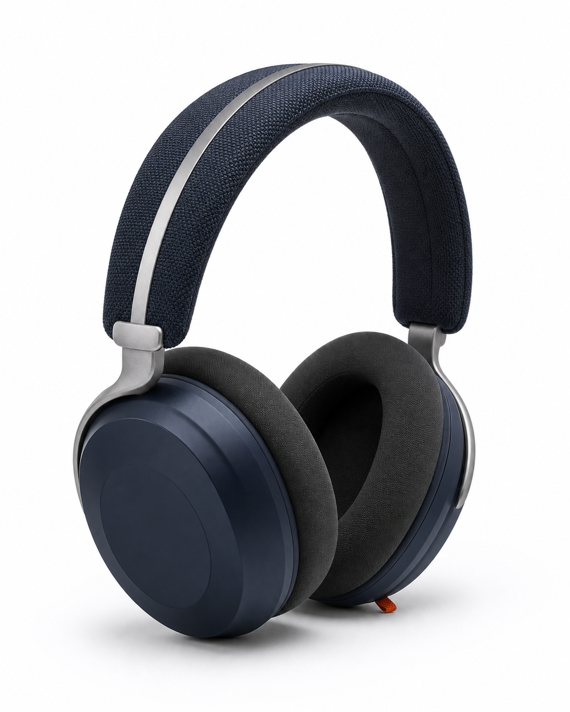

#### Detalhes

- **Autor:** [Ecommerce GPT Image Prompts Studio](https://github.com/ecomimagelab)
- **Fonte:** Criação original para este repositório
- **Publicado:** 2026-07-22
- **Languages:** en
- **Plataformas:** Amazon
- **Licença:** CC-BY-4.0

<details>
<summary><strong>Production details, product invariants, and provenance</strong></summary>

| Mode | Industry | Use cases | Aspect ratio |
|---|---|---|---|
| `text-to-image` | Consumer electronics | Marketplace main image | 4:5 |

- **Styles:** Minimalist clean, Technical, Social native
- **Backgrounds:** Pure white
- **Asset purpose:** Marketplace main image
- **Input requirements:** No reference image is required for this fictional product; edit owned product photography when exact inventory fidelity is required.
- **Product invariants:**
  - Preserve two large rounded-oval matte midnight-navy earcups with shallow concentric bevels and thick charcoal textile cushions.
  - Preserve slim natural-aluminum Y-yokes, the broad navy woven headband with narrow aluminum center rail, and tiny burnt-orange tab beneath the right earcup.
- **Negative constraints:** No words, letters, logos, watermark, cable, stand, extra headphones, separated parts, malformed headband, asymmetric earcups, exaggerated RGB clutter, CGI plastic, collage, or border.

**Provenance and rights**

- Generated specifically for this repository from the recorded standalone prompt; no third-party preview image is redistributed.
- Original prompt and generated previews created for this repository after open-source prompt-pattern research; no external preview asset is included.
- [visual-research](docs/VISUAL_RESEARCH.md)
- [visual-research](https://github.com/wuyoscar/GPT-Image2-Skill)
- **Platform-policy status:** Platform names identify intended visual treatment only; verify current listing and advertising requirements before publication.
- **Product collection:** [ec-0021](data/prompts/ec-0021-midnight-headphones-platform-set.json)

</details>

**[🚀 Experimentar agora →](https://www.pixpix.com/)**

---

<a id="featured-ec-0020-sephora-clean-catalog"></a>

### No. 3: Beauty and skincare — Sculptural Garnet Lipstick Commerce Set: SEPHORA CLEAN CATALOG

  

#### Descrição

Builds three distinct beauty-commerce treatments around one fictional garnet lipstick: clean catalog clarity, lacquered luxury launch art, and a flash-lit social editorial.

> This title and description use the English fallback.

**Catalog image · Sephora · 4:5**

#### Prompt

```text
Create a single ultra-photorealistic portrait 4:5 product photograph of one fictional, unbranded refillable lipstick. The lipstick is open and standing upright at a subtle three-quarter angle. It has a slim rectangular brushed champagne-gold metal case, one narrow deep-burgundy enamel side panel, a fine horizontal seam near the base, and a deep garnet satin lipstick bullet with a pristine sharp slanted tip. Use a seamless warm-ivory cyclorama and low cream lacquer plinth. Center the product lower-middle, fill about 72% of frame height, preserve the complete silhouette, and leave breathing room. Light with a large upper-left softbox, a controlled metal specular strip, delicate burgundy bounce, and soft grounding shadow. Render believable brushed metal, flawless enamel and dense satin wax microtexture. No words, letters, logos, watermark, second lipstick, cap, cosmetic smear, flowers, fruit, hands, floating objects, distorted case, damaged bullet, CGI-plastic look, collage, or border.
```

#### Pré-visualizações geradas

##### Image 1

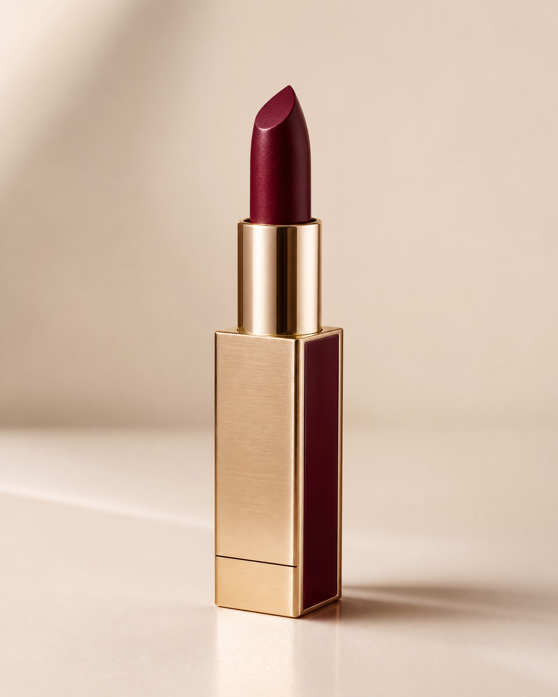

#### Detalhes

- **Autor:** [Ecommerce GPT Image Prompts Studio](https://github.com/ecomimagelab)
- **Fonte:** Criação original para este repositório
- **Publicado:** 2026-07-22
- **Languages:** en
- **Plataformas:** Sephora
- **Licença:** CC-BY-4.0

<details>
<summary><strong>Production details, product invariants, and provenance</strong></summary>

| Mode | Industry | Use cases | Aspect ratio |
|---|---|---|---|
| `text-to-image` | Beauty and skincare | Catalog image | 4:5 |

- **Styles:** Luxury premium, Editorial, Dark moody
- **Backgrounds:** Soft studio
- **Asset purpose:** Catalog image
- **Input requirements:** No reference image is required because the product is fictional; use product-edit mode with owned source photography for real inventory.
- **Product invariants:**
  - Preserve the slim rectangular brushed champagne-gold metal case, narrow deep-burgundy enamel side panel, and fine horizontal seam near the base.
  - Preserve the open deep-garnet satin lipstick bullet with a clean, pristine slanted tip and believable dense wax texture.
- **Negative constraints:** No words, letters, logos, watermark, extra lipstick, cap, damaged bullet, malformed case, floating product, cheap CGI, collage, frame, or border.

**Provenance and rights**

- Generated specifically for this repository from the recorded standalone prompt; no third-party preview image is redistributed.
- Original prompt and generated previews created for this repository after open-source prompt-pattern research; no external preview asset is included.
- [visual-research](docs/VISUAL_RESEARCH.md)
- [visual-research](https://github.com/wuyoscar/GPT-Image2-Skill)
- **Platform-policy status:** Platform names identify intended visual treatment only; verify current listing and advertising requirements before publication.
- **Product collection:** [ec-0020](data/prompts/ec-0020-sculptural-garnet-lipstick-set.json)

</details>

**[🚀 Experimentar agora →](https://www.pixpix.com/)**

---

<a id="featured-ec-0019-shopify-travertine-hero"></a>

### No. 4: Beauty and skincare — Product-Faithful Serum Background Edit Workflow: SHOPIFY TRAVERTINE HERO

  

#### Descrição

Uses one repository-owned serum image as the identity reference, then changes only the set, lighting, and campaign treatment for Shopify and Instagram Shop.

> This title and description use the English fallback.

**Branded hero · Shopify · 5:8**

#### Prompt

```text
Edit the supplied serum product image into one standalone premium Shopify product hero, portrait 5:8. Use the supplied image as the product identity reference and edit target. Preserve the serum bottle as closely as possible: the same squat rounded-square clear optical-glass bottle, pale celadon liquid level, heavy clear base, satin warm-ivory pipette cap, blank rectangular ivory label, overall proportions, label size and placement, glass thickness, cap geometry, and celadon color. Remove the water splash and reflective pool completely. Place the bottle upright on a single carved warm-ivory travertine pedestal with subtle natural pores, against a quiet warm limestone-to-cream studio gradient. Add one restrained curved architectural shadow behind the bottle, soft diffused key light from upper left, a controlled glass-edge highlight, a realistic small contact shadow, generous negative space, editorial luxury-skincare art direction, refined natural color, and ultra-photorealistic materials. Human comparison with the reference is required. No text, logo, watermark, flowers, leaves, water, extra bottle, added product features, label distortion, plastic CGI look, collage, split screen, or panel border.
```

#### Pré-visualizações geradas

##### Before


##### Image 1

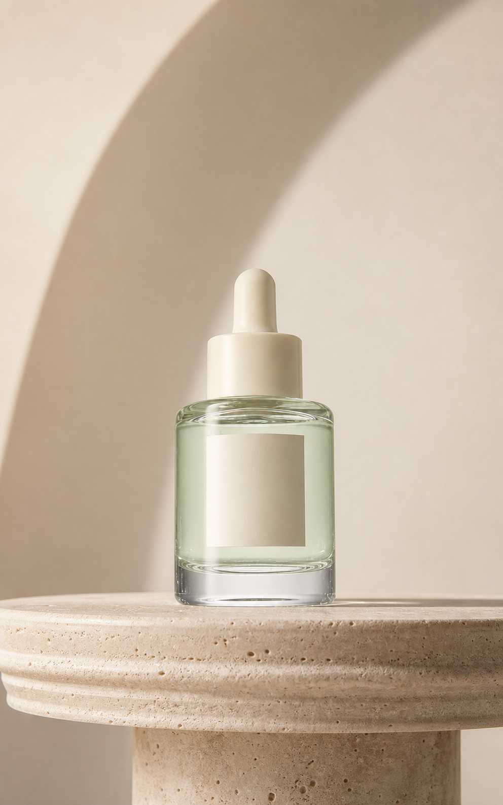

#### Detalhes

- **Autor:** Ecommerce GPT Image Prompts Studio
- **Fonte:** Criação original para este repositório
- **Publicado:** 2026-07-22
- **Languages:** en
- **Plataformas:** Shopify
- **Licença:** CC-BY-4.0

<details>
<summary><strong>Production details, product invariants, and provenance</strong></summary>

| Mode | Industry | Use cases | Aspect ratio |
|---|---|---|---|
| `product-edit` | Beauty and skincare | Branded hero | 5:8 |

- **Styles:** Luxury premium, Minimalist clean, Dark moody
- **Backgrounds:** Natural material
- **Asset purpose:** Branded hero
- **Input requirements:** Provide one front-facing, sufficiently sharp product image that you own or may license publicly; compare the generated bottle, label, color, and proportions with the source before use.
- **Product invariants:**
  - Preserve the squat rounded-square clear optical-glass bottle, pale celadon liquid level, heavy clear base, and overall front-facing proportions.
  - Preserve the satin warm-ivory pipette cap, its rounded top, width, height, and centered alignment.
  - Preserve the blank rectangular ivory label, its size and placement; do not add, distort, or fabricate label text.
  - Preserve the glass thickness and celadon color; do not add product claims, ingredients, certifications, or performance statements.
- **Negative constraints:** No readable text, logo, watermark, extra bottle, replacement packaging, recoloring, invented feature, malformed label, plastic CGI look, collage, split screen, or panel border.

**Provenance and rights**

- The Before image was generated for this repository; the After image was produced by editing that local source with the recorded GPT Image 2 prompt.
- Original product-edit workflow and generated examples created specifically for this repository from a repository-owned source image.
- [visual-research](docs/VISUAL_RESEARCH.md)
- **Platform-policy status:** Shopify and Instagram Shop identify the intended creative treatment only; the images do not claim guaranteed platform or advertising approval.
- **Product collection:** [ec-0019](data/prompts/ec-0019-product-faithful-serum-edit-workflow.json)

</details>

**[🚀 Experimentar agora →](https://www.pixpix.com/)**

---

<a id="featured-ec-0014-variant-1"></a>

### No. 5: Bags and accessories — Oxblood Shoulder Bag Triptych: FARFETCH CATALOG

  

#### Descrição

Combines luxury catalog clarity, social-native street movement, and an architectural still life for one sculptural bag.

> This title and description use the English fallback.

**Catalog image · Farfetch · 4:5**

#### Prompt

```text
Create one standalone 4:5 e-commerce image, not a collage, contact sheet, split screen, or multi-panel layout.
Product specification and invariants: identical compact crescent shoulder bag in this output; deep oxblood pebbled calf leather, softly folded crescent body, one wide matching leather shoulder strap with two brushed silver rectangular buckles, concealed top zipper, three subtle vertical gusset seams, no logo and no charm. Preserve silhouette, strap width, two buckles, seam map, hardware finish and color.
Art direction: bag alone, front three-quarter view on pure #FFFFFF, strap arranged in a clean natural arc, entire product visible, gentle grounding shadow, crisp leather grain and accurate proportions, no props.
Photography and rendering: ultra-photorealistic contemporary luxury fashion photography, authentic pebbled leather, refined hardware reflections, subtle film grain, oxblood/gray/travertine palette, no glossy CGI.
Quality and safety constraints: no readable text, no logos, no watermark, no extra bag, no duplicated strap, no gold hardware, no hands covering the product, no distorted body, no added layout labels or numbers. Keep the exact bag design consistent in this output.
```

#### Pré-visualizações geradas

##### Image 1


#### Detalhes

- **Autor:** Ecommerce GPT Image Prompts Studio
- **Fonte:** Criação original para este repositório
- **Publicado:** 2026-07-21
- **Languages:** en
- **Plataformas:** Farfetch
- **Licença:** CC-BY-4.0

<details>
<summary><strong>Production details, product invariants, and provenance</strong></summary>

| Mode | Industry | Use cases | Aspect ratio |
|---|---|---|---|
| `text-to-image` | Bags and accessories | Catalog image | 4:5 |

- **Styles:** Luxury premium, Editorial, Architectural
- **Backgrounds:** Pure white
- **Asset purpose:** Catalog image
- **Input requirements:** No reference image is required. This record defines a fictional, unbranded product; use product-edit mode for real inventory.
- **Product invariants:**
  - identical compact crescent shoulder bag in this output; deep oxblood pebbled calf leather, softly folded crescent body, one wide matching leather shoulder strap with two brushed silver rectangular buckles, concealed top zipper, three subtle vertical gusset seams, no logo and no charm. Preserve silhouette, strap width, two buckles, seam map, hardware finish and color.
- **Negative constraints:** no readable text, no logos, no watermark, no extra bag, no duplicated strap, no gold hardware, no hands covering the product, no distorted body, no added layout labels or numbers. Keep the exact bag design consistent in this output.

**Provenance and rights**

- Generated specifically for this repository from the corresponding prompt direction; no third-party preview image is redistributed.
- Original synthesis informed by broad visual research; prompt and generated previews created for this repository. See docs/VISUAL_RESEARCH.md.
- [visual-research](docs/VISUAL_RESEARCH.md)
- **Platform-policy status:** Platform names describe intended art direction only. Verify the current official rules for the product category before publishing.
- **Product collection:** [ec-0014](data/prompts/ec-0014-oxblood-shoulder-bag-triptych.json)

</details>

**[🚀 Experimentar agora →](https://www.pixpix.com/)**

---

<a id="featured-ec-0013-variant-1"></a>

### No. 6: Watches — Bronze Mechanical Watch Triptych: CHRONO24 CATALOG

  

#### Descrição

Moves one bronze mechanical watch from collector-grade catalog precision to a ceremonial launch and a quiet wrist editorial.

> This title and description use the English fallback.

**Catalog image · Chrono24 · 4:5**

#### Prompt

```text
Create one standalone 4:5 e-commerce image, not a collage, contact sheet, split screen, or multi-panel layout.
Product specification and invariants: identical watch in this output; 38 mm brushed bronze cushion case, deep moss-green sunray dial, twelve slim applied gold baton hour markers with no numerals, two gold dauphine hands fixed at 10:10, small seconds subdial at 6 o'clock, domed crystal, dark brown suede strap with tonal stitching, no logo and no date window. Preserve case shape, crown position, marker layout, hand style, dial color and strap.
Art direction: watch alone lying flat at a slight diagonal on pure warm white, buckle and most of the strap visible while the lower strap end may meet the frame edge, clean overhead precision, soft contact shadow, accurate proportions, crisp bezel and dial, no props.
Photography and rendering: ultra-photorealistic high-watchmaking photography, physically accurate bronze patina, optical crystal, sunray dial and suede nap, disciplined retouching, rich but natural black point.
Quality and safety constraints: no readable text, no logo, no watermark, no extra watch, no jewelry, no distorted wrist or fingers, no duplicate crown, no incorrect numerals, no added layout labels or numbers. Keep the exact watch design and 10:10 hand position consistent.
```

#### Pré-visualizações geradas

##### Image 1


#### Detalhes

- **Autor:** Ecommerce GPT Image Prompts Studio
- **Fonte:** Criação original para este repositório
- **Publicado:** 2026-07-21
- **Languages:** en
- **Plataformas:** Chrono24
- **Licença:** CC-BY-4.0

<details>
<summary><strong>Production details, product invariants, and provenance</strong></summary>

| Mode | Industry | Use cases | Aspect ratio |
|---|---|---|---|
| `text-to-image` | Watches | Catalog image | 4:5 |

- **Styles:** Luxury premium, Dark moody, Editorial
- **Backgrounds:** Soft studio
- **Asset purpose:** Catalog image
- **Input requirements:** No reference image is required. This record defines a fictional, unbranded product; use product-edit mode for real inventory.
- **Product invariants:**
  - identical watch in this output; 38 mm brushed bronze cushion case, deep moss-green sunray dial, twelve slim applied gold baton hour markers with no numerals, two gold dauphine hands fixed at 10:10, small seconds subdial at 6 o'clock, domed crystal, dark brown suede strap with tonal stitching, no logo and no date window. Preserve case shape, crown position, marker layout, hand style, dial color and strap.
- **Negative constraints:** no readable text, no logo, no watermark, no extra watch, no jewelry, no distorted wrist or fingers, no duplicate crown, no incorrect numerals, no added layout labels or numbers. Keep the exact watch design and 10:10 hand position consistent.

**Provenance and rights**

- Generated specifically for this repository from the corresponding prompt direction; no third-party preview image is redistributed.
- Original synthesis informed by broad visual research; prompt and generated previews created for this repository. See docs/VISUAL_RESEARCH.md.
- [visual-research](docs/VISUAL_RESEARCH.md)
- **Platform-policy status:** Platform names describe intended art direction only. Verify the current official rules for the product category before publishing.
- **Product collection:** [ec-0013](data/prompts/ec-0013-bronze-mechanical-watch-triptych.json)

</details>

**[🚀 Experimentar agora →](https://www.pixpix.com/)**

---

<a id="all-prompts"></a>

## Todos os prompts

> Sorted by publish date, newest first.

<a id="categories-stationery-and-office"></a>

<a id="usecases-catalog-image"></a>

<a id="platforms-tmall"></a>

<a id="platforms-etsy"></a>

<a id="platforms-xiaohongshu"></a>

<a id="prompt-ec-0025-tmall-luxury-catalog"></a>

### No. 1: Stationery and office — Faceted Jade Fountain Pen Set: TMALL LUXURY CATALOG

 

#### Descrição

Uses translucent resin and machined brass to distinguish a clean retail macro, an Etsy maker story, and an intimate rain-day writing ritual.

> This title and description use the English fallback.

**Catalog image · Tmall · 4:5**

#### Prompt

```text
Create one ultra-photorealistic portrait 4:5 product photograph of a fictional unbranded fountain pen. Product design: gently faceted twelve-sided deep-jade translucent resin barrel and matching cap, brushed warm-brass straight clip, two thin brass cap bands, brushed brass grip and one dark ruthenium steel nib with fine geometric engraved lines but no symbol or lettering. Exactly one pen and one cap. Use a warm off-white seamless studio and one thin horizontal brushed-brass display rail. Lay the uncapped pen diagonally across the rail with nib pointing lower left; place the cap parallel behind it. Keep the full barrel, nib, clip and cap visible. Use a large softbox and narrow edge light revealing translucent jade depth. No text, logos, watermark, ink bottle, paper, extra pen, duplicate cap, floating pieces, malformed nib, bent clip, ink stains, CGI look, collage, or border.
```

#### Pré-visualizações geradas

##### Image 1

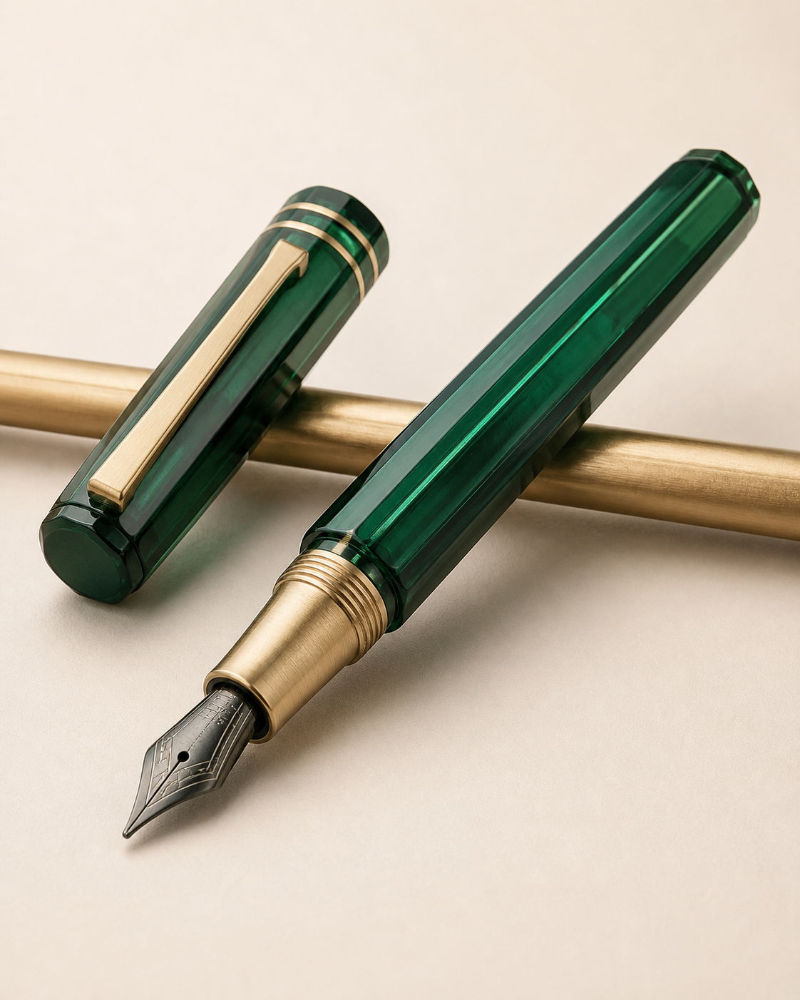

#### Detalhes

- **Autor:** [Ecommerce GPT Image Prompts Studio](https://github.com/ecomimagelab)
- **Fonte:** Criação original para este repositório
- **Publicado:** 2026-07-22
- **Languages:** en
- **Plataformas:** Tmall
- **Licença:** CC-BY-4.0

<details>
<summary><strong>Production details, product invariants, and provenance</strong></summary>

| Mode | Industry | Use cases | Aspect ratio |
|---|---|---|---|
| `text-to-image` | Stationery and office | Catalog image | 4:5 |

- **Styles:** Luxury premium, Handmade tactile, Quiet living
- **Backgrounds:** Soft studio
- **Asset purpose:** Catalog image
- **Input requirements:** No reference image is required for this fictional pen; use a sharp licensed product reference for real nib and clip fidelity.
- **Product invariants:**
  - Preserve the gently faceted twelve-sided deep-jade translucent resin barrel and matching cap.
  - Preserve the straight brushed-brass clip, two thin brass cap bands, brass grip, and dark ruthenium nib with nonverbal geometric lines.
- **Negative constraints:** No readable text, letters, logos, watermark, extra pen, duplicate cap, malformed nib, bent clip, gemstone look, ink spill, CGI plastic, collage, or border.

**Provenance and rights**

- Generated specifically for this repository from the recorded standalone prompt; no third-party preview image is redistributed.
- Original prompt and generated previews created for this repository after open-source prompt-pattern research; no external preview asset is included.
- [visual-research](docs/VISUAL_RESEARCH.md)
- [visual-research](https://github.com/wuyoscar/GPT-Image2-Skill)
- **Platform-policy status:** Platform names identify intended visual treatment only; verify current listing and advertising requirements before publication.
- **Product collection:** [ec-0025](data/prompts/ec-0025-jade-fountain-pen-set.json)

</details>

**[🚀 Experimentar agora →](https://www.pixpix.com/)**

---

<a id="usecases-detail-macro"></a>

<a id="prompt-ec-0025-etsy-maker-provenance"></a>

### No. 2: Stationery and office — Faceted Jade Fountain Pen Set: ETSY MAKER PROVENANCE

 

#### Descrição

Uses translucent resin and machined brass to distinguish a clean retail macro, an Etsy maker story, and an intimate rain-day writing ritual.

> This title and description use the English fallback.

**Detail and macro · Etsy · 5:8**

#### Prompt

```text
Create one tactile portrait 5:8 editorial photograph of the same fictional fountain pen. Preserve the twelve-sided deep-jade translucent resin barrel and cap, straight brushed-brass clip, two thin brass cap bands, brushed-brass grip and dark ruthenium nib with nonverbal geometric engraving. Set it on a small craftsperson's walnut workbench with one worn linen pad, one restrained curled brass shaving and a single faceted jade-resin blank in soft background. Rest the complete uncapped pen diagonally on the linen; put the matching cap beside it with clip facing camera. Use warm north-window light and one cool workshop rim. Render walnut pores, frayed linen, resin facets, micro-scratched brass and crisp steel. No text, logos, watermark, human, extra finished pen, extra cap, scattered tools, gemstones, malformed nib, fake antique filter, CGI look, collage, or border.
```

#### Pré-visualizações geradas

##### Image 1

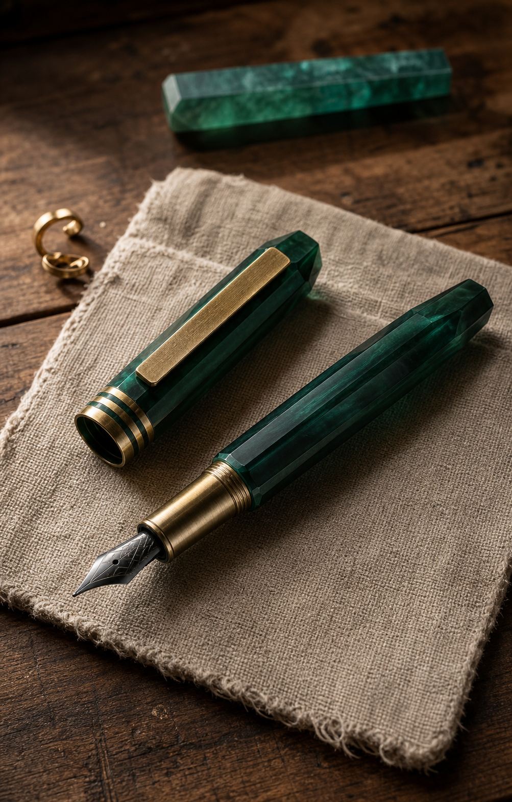

#### Detalhes

- **Autor:** [Ecommerce GPT Image Prompts Studio](https://github.com/ecomimagelab)
- **Fonte:** Criação original para este repositório
- **Publicado:** 2026-07-22
- **Languages:** en
- **Plataformas:** Etsy
- **Licença:** CC-BY-4.0

<details>
<summary><strong>Production details, product invariants, and provenance</strong></summary>

| Mode | Industry | Use cases | Aspect ratio |
|---|---|---|---|
| `text-to-image` | Stationery and office | Detail and macro | 5:8 |

- **Styles:** Luxury premium, Handmade tactile, Quiet living
- **Backgrounds:** Natural material
- **Asset purpose:** Branded hero
- **Input requirements:** No reference image is required for this fictional pen; use a sharp licensed product reference for real nib and clip fidelity.
- **Product invariants:**
  - Preserve the gently faceted twelve-sided deep-jade translucent resin barrel and matching cap.
  - Preserve the straight brushed-brass clip, two thin brass cap bands, brass grip, and dark ruthenium nib with nonverbal geometric lines.
- **Negative constraints:** No readable text, letters, logos, watermark, extra pen, duplicate cap, malformed nib, bent clip, gemstone look, ink spill, CGI plastic, collage, or border.

**Provenance and rights**

- Generated specifically for this repository from the recorded standalone prompt; no third-party preview image is redistributed.
- Original prompt and generated previews created for this repository after open-source prompt-pattern research; no external preview asset is included.
- [visual-research](docs/VISUAL_RESEARCH.md)
- [visual-research](https://github.com/wuyoscar/GPT-Image2-Skill)
- **Platform-policy status:** Platform names identify intended visual treatment only; verify current listing and advertising requirements before publication.
- **Product collection:** [ec-0025](data/prompts/ec-0025-jade-fountain-pen-set.json)

</details>

**[🚀 Experimentar agora →](https://www.pixpix.com/)**

---

<a id="usecases-lifestyle-scene"></a>

<a id="prompt-ec-0025-xiaohongshu-rain-day-writing"></a>

### No. 3: Stationery and office — Faceted Jade Fountain Pen Set: XIAOHONGSHU RAIN-DAY WRITING

 

#### Descrição

Uses translucent resin and machined brass to distinguish a clean retail macro, an Etsy maker story, and an intimate rain-day writing ritual.

> This title and description use the English fallback.

**Lifestyle scene · Xiaohongshu · 5:8**

#### Prompt

```text
Create one intimate portrait 5:8 photorealistic desk scene showing the same fictional fountain pen in use. Preserve the twelve-sided deep-jade translucent barrel, matching cap, straight brass clip, two thin bands, brass grip and dark ruthenium nib. Use a smoked-oak desk near a rain-softened window with one cream cotton notebook, celadon tea cup and small brass paperweight softly out of focus. One adult hand holds the uncapped pen correctly over the notebook. The page contains only a few abstract sweeping ink lines and geometric marks—absolutely no readable writing. Place the matching cap beside the notebook with clip visible. Use a close 50mm over-shoulder view, cool rainy daylight, warm desk-lamp pool and subtle flash lift. No readable text, logos, extra pen, extra cap, ink spill, distorted fingers, malformed nib, hidden pen, clutter, CGI look, collage, or border.
```

#### Pré-visualizações geradas

##### Image 1

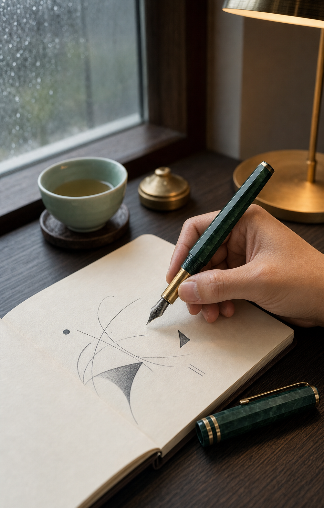

#### Detalhes

- **Autor:** [Ecommerce GPT Image Prompts Studio](https://github.com/ecomimagelab)
- **Fonte:** Criação original para este repositório
- **Publicado:** 2026-07-22
- **Languages:** en
- **Plataformas:** Xiaohongshu
- **Licença:** CC-BY-4.0

<details>
<summary><strong>Production details, product invariants, and provenance</strong></summary>

| Mode | Industry | Use cases | Aspect ratio |
|---|---|---|---|
| `text-to-image` | Stationery and office | Lifestyle scene | 5:8 |

- **Styles:** Luxury premium, Handmade tactile, Quiet living
- **Backgrounds:** Home interior
- **Asset purpose:** Social creative
- **Input requirements:** No reference image is required for this fictional pen; use a sharp licensed product reference for real nib and clip fidelity.
- **Product invariants:**
  - Preserve the gently faceted twelve-sided deep-jade translucent resin barrel and matching cap.
  - Preserve the straight brushed-brass clip, two thin brass cap bands, brass grip, and dark ruthenium nib with nonverbal geometric lines.
- **Negative constraints:** No readable text, letters, logos, watermark, extra pen, duplicate cap, malformed nib, bent clip, gemstone look, ink spill, CGI plastic, collage, or border.

**Provenance and rights**

- Generated specifically for this repository from the recorded standalone prompt; no third-party preview image is redistributed.
- Original prompt and generated previews created for this repository after open-source prompt-pattern research; no external preview asset is included.
- [visual-research](docs/VISUAL_RESEARCH.md)
- [visual-research](https://github.com/wuyoscar/GPT-Image2-Skill)
- **Platform-policy status:** Platform names identify intended visual treatment only; verify current listing and advertising requirements before publication.
- **Product collection:** [ec-0025](data/prompts/ec-0025-jade-fountain-pen-set.json)

</details>

**[🚀 Experimentar agora →](https://www.pixpix.com/)**

---

<a id="categories-travel-and-luggage"></a>

<a id="usecases-main-image"></a>

<a id="platforms-amazon"></a>

<a id="platforms-shopify"></a>

<a id="platforms-pinterest"></a>

<a id="prompt-ec-0024-amazon-carryon-main-image"></a>

### No. 4: Travel and luggage — Sand Carry-On Travel Set: AMAZON CARRY-ON MAIN IMAGE

 

#### Descrição

Preserves one sand-and-orange carry-on across a white marketplace view, a quiet architectural airport hero, and an overhead packing guide.

> This title and description use the English fallback.

**Marketplace main image · Amazon · 5:8**

#### Prompt

```text
Create one ultra-photorealistic portrait 5:8 catalog photograph of a fictional unbranded compact cabin suitcase. Use a softly rounded rectangular matte warm-sand polycarbonate shell, five wide vertical front flutes, a slim burnt-orange zipperless aluminum perimeter frame, matching burnt-orange flush top handle and telescoping grip, black two-stage telescoping rails, and four compact black double-spinner wheel groups. No exterior pockets or logos. Stand the suitcase upright at a front three-quarter angle on pure #FFFFFF with the handle extended to first stop; show all wheels and the entire handle, filling 76% of frame. Use a high-key broad softbox and restrained grounding shadow. No text, logos, watermark, stickers, tags, extra suitcase, person, zipper, missing wheel, bent handle, floating case, CGI plastic, collage, or border.
```

#### Pré-visualizações geradas

##### Image 1

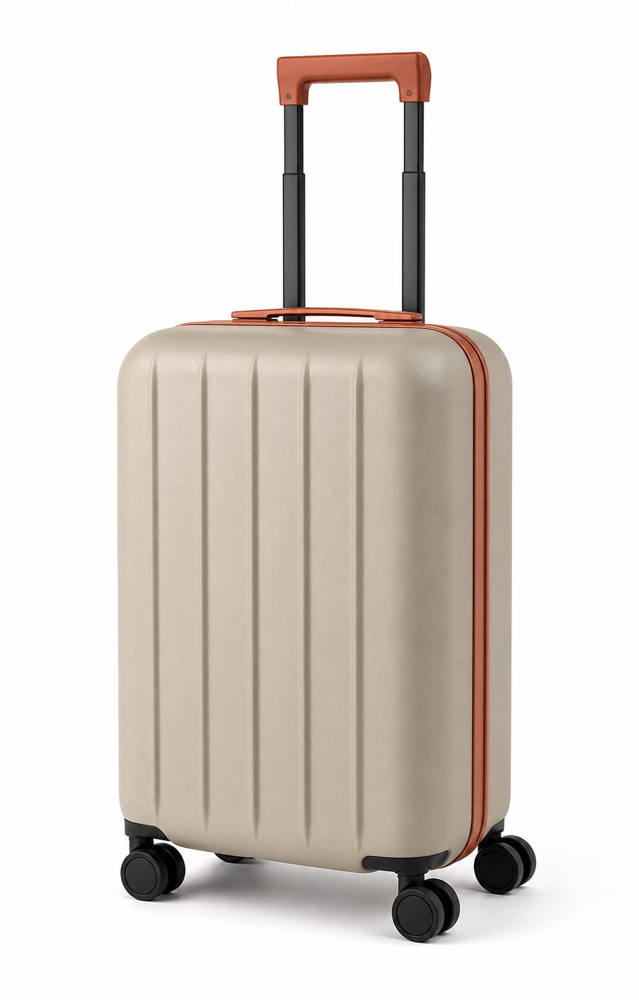

#### Detalhes

- **Autor:** [Ecommerce GPT Image Prompts Studio](https://github.com/ecomimagelab)
- **Fonte:** Criação original para este repositório
- **Publicado:** 2026-07-22
- **Languages:** en
- **Plataformas:** Amazon
- **Licença:** CC-BY-4.0

<details>
<summary><strong>Production details, product invariants, and provenance</strong></summary>

| Mode | Industry | Use cases | Aspect ratio |
|---|---|---|---|
| `text-to-image` | Travel and luggage | Marketplace main image | 5:8 |

- **Styles:** Minimalist clean, Architectural, Quiet living
- **Backgrounds:** Pure white
- **Asset purpose:** Marketplace main image
- **Input requirements:** No reference image is required for this fictional carry-on; use product-edit mode for real luggage dimensions and hardware.
- **Product invariants:**
  - Preserve the softly rounded rectangular warm-sand polycarbonate shell and five broad vertical front flutes.
  - Preserve the slim burnt-orange zipperless frame, burnt-orange handles, black two-stage rails, and four compact black double-spinner wheel groups.
- **Negative constraints:** No text, logos, watermark, stickers, tags, zipper, exterior pocket, extra suitcase, missing wheel, bent handle, distorted shell, CGI plastic, collage, or border.

**Provenance and rights**

- Generated specifically for this repository from the recorded standalone prompt; no third-party preview image is redistributed.
- Original prompt and generated previews created for this repository after open-source prompt-pattern research; no external preview asset is included.
- [visual-research](docs/VISUAL_RESEARCH.md)
- [visual-research](https://github.com/wuyoscar/GPT-Image2-Skill)
- **Platform-policy status:** Platform names identify intended visual treatment only; verify current listing and advertising requirements before publication.
- **Product collection:** [ec-0024](data/prompts/ec-0024-sand-carryon-travel-set.json)

</details>

**[🚀 Experimentar agora →](https://www.pixpix.com/)**

---

<a id="usecases-branded-hero"></a>

<a id="prompt-ec-0024-shopify-airport-hero"></a>

### No. 5: Travel and luggage — Sand Carry-On Travel Set: SHOPIFY AIRPORT HERO

 

#### Descrição

Preserves one sand-and-orange carry-on across a white marketplace view, a quiet architectural airport hero, and an overhead packing guide.

> This title and description use the English fallback.

**Branded hero · Shopify · 4:5**

#### Prompt

```text
Create one cinematic portrait 4:5 architectural campaign photograph of the same fictional unbranded carry-on. Preserve the rounded warm-sand hard shell, five broad vertical flutes, slim burnt-orange zipperless frame, orange flush top handle and grip, black rails, and four black double-spinner wheels. Place it in a quiet modern airport concourse at first light with pale travertine walls, one immense curved window and honey sunlight. Set the suitcase upright in foreground at a low three-quarter angle with telescoping handle lowered and flush; show all wheels and cast a long clean shadow toward the window. Use warm sunrise against cool stone and controlled orange edge light. No text, logos, watermark, signage, people, extra luggage, travel tags, zipper, missing wheel, crooked body, CGI look, collage, or border.
```

#### Pré-visualizações geradas

##### Image 1


#### Detalhes

- **Autor:** [Ecommerce GPT Image Prompts Studio](https://github.com/ecomimagelab)
- **Fonte:** Criação original para este repositório
- **Publicado:** 2026-07-22
- **Languages:** en
- **Plataformas:** Shopify
- **Licença:** CC-BY-4.0

<details>
<summary><strong>Production details, product invariants, and provenance</strong></summary>

| Mode | Industry | Use cases | Aspect ratio |
|---|---|---|---|
| `text-to-image` | Travel and luggage | Branded hero | 4:5 |

- **Styles:** Minimalist clean, Architectural, Quiet living
- **Backgrounds:** Lifestyle location
- **Asset purpose:** Branded hero
- **Input requirements:** No reference image is required for this fictional carry-on; use product-edit mode for real luggage dimensions and hardware.
- **Product invariants:**
  - Preserve the softly rounded rectangular warm-sand polycarbonate shell and five broad vertical front flutes.
  - Preserve the slim burnt-orange zipperless frame, burnt-orange handles, black two-stage rails, and four compact black double-spinner wheel groups.
- **Negative constraints:** No text, logos, watermark, stickers, tags, zipper, exterior pocket, extra suitcase, missing wheel, bent handle, distorted shell, CGI plastic, collage, or border.

**Provenance and rights**

- Generated specifically for this repository from the recorded standalone prompt; no third-party preview image is redistributed.
- Original prompt and generated previews created for this repository after open-source prompt-pattern research; no external preview asset is included.
- [visual-research](docs/VISUAL_RESEARCH.md)
- [visual-research](https://github.com/wuyoscar/GPT-Image2-Skill)
- **Platform-policy status:** Platform names identify intended visual treatment only; verify current listing and advertising requirements before publication.
- **Product collection:** [ec-0024](data/prompts/ec-0024-sand-carryon-travel-set.json)

</details>

**[🚀 Experimentar agora →](https://www.pixpix.com/)**

---

<a id="usecases-feature-callout"></a>

<a id="prompt-ec-0024-pinterest-packing-organization"></a>

### No. 6: Travel and luggage — Sand Carry-On Travel Set: PINTEREST PACKING ORGANIZATION

 

#### Descrição

Preserves one sand-and-orange carry-on across a white marketplace view, a quiet architectural airport hero, and an overhead packing guide.

> This title and description use the English fallback.

**Feature visual · Pinterest · 4:5**

#### Prompt

```text
Create one photorealistic portrait 4:5 overhead packing story featuring the same fictional cabin suitcase opened flat. Preserve the warm-sand shell with five exterior flutes visible at the edges, slim burnt-orange zipperless frame, orange top handle, black rails and four black double-spinner wheels. Interior is warm-stone recycled fabric: left side has one full mesh divider without text; right side has crossed orange compression straps. On a pale-oak floor, neatly pack an ivory, navy and terracotta capsule wardrobe, one rolled linen shirt, clean neutral sneakers and a blank amber toiletry pouch. Use an exact overhead view with the complete open suitcase and every wheel in frame, soft diagonal daylight and clean negative space. No text, logos, passports, boarding passes, money, branded clothing, extra suitcase, human, overfilled case, impossible compartments, distorted case, CGI look, collage, or border.
```

#### Pré-visualizações geradas

##### Image 1


#### Detalhes

- **Autor:** [Ecommerce GPT Image Prompts Studio](https://github.com/ecomimagelab)
- **Fonte:** Criação original para este repositório
- **Publicado:** 2026-07-22
- **Languages:** en
- **Plataformas:** Pinterest
- **Licença:** CC-BY-4.0

<details>
<summary><strong>Production details, product invariants, and provenance</strong></summary>

| Mode | Industry | Use cases | Aspect ratio |
|---|---|---|---|
| `text-to-image` | Travel and luggage | Feature visual | 4:5 |

- **Styles:** Minimalist clean, Architectural, Quiet living
- **Backgrounds:** Home interior
- **Asset purpose:** Secondary listing image
- **Input requirements:** No reference image is required for this fictional carry-on; use product-edit mode for real luggage dimensions and hardware.
- **Product invariants:**
  - Preserve the softly rounded rectangular warm-sand polycarbonate shell and five broad vertical front flutes.
  - Preserve the slim burnt-orange zipperless frame, burnt-orange handles, black two-stage rails, and four compact black double-spinner wheel groups.
- **Negative constraints:** No text, logos, watermark, stickers, tags, zipper, exterior pocket, extra suitcase, missing wheel, bent handle, distorted shell, CGI plastic, collage, or border.

**Provenance and rights**

- Generated specifically for this repository from the recorded standalone prompt; no third-party preview image is redistributed.
- Original prompt and generated previews created for this repository after open-source prompt-pattern research; no external preview asset is included.
- [visual-research](docs/VISUAL_RESEARCH.md)
- [visual-research](https://github.com/wuyoscar/GPT-Image2-Skill)
- **Platform-policy status:** Platform names identify intended visual treatment only; verify current listing and advertising requirements before publication.
- **Product collection:** [ec-0024](data/prompts/ec-0024-sand-carryon-travel-set.json)

</details>

**[🚀 Experimentar agora →](https://www.pixpix.com/)**

---

<a id="categories-fitness-and-wellness"></a>

<a id="platforms-tiktok-shop"></a>

<a id="prompt-ec-0023-amazon-claim-free-main-image"></a>

### No. 7: Fitness and wellness — Cobalt Plant Protein Commerce Set: AMAZON CLAIM-FREE MAIN IMAGE

 

#### Descrição

Creates a claim-free wellness package system for marketplace clarity, kinetic training content, and a bright social breakfast recipe.

> This title and description use the English fallback.

**Marketplace main image · Amazon · 4:5**

#### Prompt

```text
Create one ultra-photorealistic portrait 4:5 catalog photograph of a fictional unbranded plant-protein package. Show one squat cylindrical warm-white fiberboard tub with a slightly domed matte cobalt-blue screw lid, broad blank warm-white label, one diagonal cobalt-blue band around the lower third, one thin acid-lime stripe above it, and a small embossed leaf seal with no lettering. Place one matching cobalt scoop beside the sealed tub, bowl upward with a modest mound of pale vanilla powder. Use pure #FFFFFF, slight three-quarter front view, full package and scoop, 72% frame fill, broad bright softbox and soft grounding shadow. Absolutely no text, numbers, letters, logo, nutrition panel, claims, certification marks, watermark, fruit, glass, duplicate tub, open lid, scattered mess, distorted packaging, CGI plastic, collage, or border.
```

#### Pré-visualizações geradas

##### Image 1

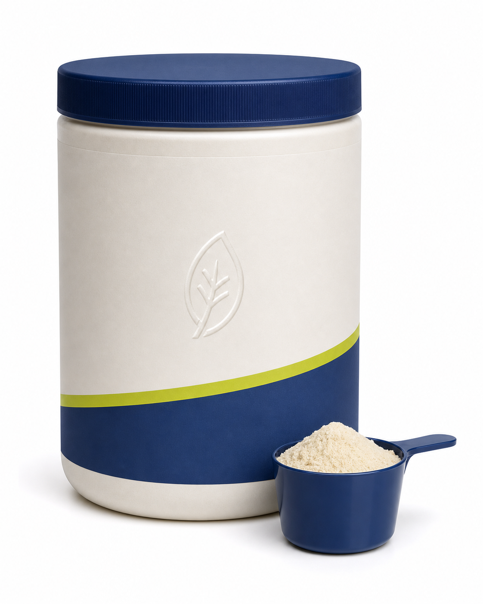

#### Detalhes

- **Autor:** [Ecommerce GPT Image Prompts Studio](https://github.com/ecomimagelab)
- **Fonte:** Criação original para este repositório
- **Publicado:** 2026-07-22
- **Languages:** en
- **Plataformas:** Amazon
- **Licença:** CC-BY-4.0

<details>
<summary><strong>Production details, product invariants, and provenance</strong></summary>

| Mode | Industry | Use cases | Aspect ratio |
|---|---|---|---|
| `text-to-image` | Fitness and wellness | Marketplace main image | 4:5 |

- **Styles:** Minimalist clean, Social native, Bright playful
- **Backgrounds:** Pure white
- **Asset purpose:** Marketplace main image
- **Input requirements:** No reference image is required for this fictional package; all legal label copy must be added and reviewed outside image generation.
- **Product invariants:**
  - Preserve one squat warm-white fiberboard tub, a slightly domed matte cobalt-blue screw lid, and a broad blank warm-white paper label.
  - Preserve the diagonal cobalt-blue lower band, thin acid-lime accent stripe, and small embossed leaf seal without letters or claims.
- **Negative constraints:** No readable text, letters, numbers, nutrition panel, health claims, certification marks, logos, watermark, duplicate tub, distorted packaging, unsafe powder action, CGI plastic, collage, or border.

**Provenance and rights**

- Generated specifically for this repository from the recorded standalone prompt; no third-party preview image is redistributed.
- Original prompt and generated previews created for this repository after open-source prompt-pattern research; no external preview asset is included.
- [visual-research](docs/VISUAL_RESEARCH.md)
- [visual-research](https://github.com/wuyoscar/GPT-Image2-Skill)
- **Platform-policy status:** Platform names identify intended visual treatment only; legal supplement labels and current advertising rules require separate human review.
- **Product collection:** [ec-0023](data/prompts/ec-0023-cobalt-plant-protein-set.json)

</details>

**[🚀 Experimentar agora →](https://www.pixpix.com/)**

---

<a id="usecases-social-ad"></a>

<a id="prompt-ec-0023-tiktok-training-energy"></a>

### No. 8: Fitness and wellness — Cobalt Plant Protein Commerce Set: TIKTOK TRAINING ENERGY

 

#### Descrição

Creates a claim-free wellness package system for marketplace clarity, kinetic training content, and a bright social breakfast recipe.

> This title and description use the English fallback.

**Social commerce ad · TikTok Shop · 5:8**

#### Prompt

```text
Create one kinetic portrait 5:8 social-native photograph featuring the same fictional plant-protein tub. Preserve the squat warm-white cylinder, domed matte cobalt lid, blank label, diagonal cobalt lower band, thin acid-lime stripe, and tiny embossed leaf seal without lettering. Place the sealed package safely on a stainless-steel bench in sharp foreground in a raw pale-concrete training studio with one cobalt crash mat. Behind it, an athletic adult performs battle-rope movement with controlled motion blur. A restrained arc of pale powder hangs in side light well behind the tub and never touches it. Use a low 28mm angle, direct flash, cool high-window daylight and acid-lime rim accent. Adult only; no text, claims, logos, watermark, extra tub, open lid, shaker, unsafe powder inhalation, dust obscuring product, distorted body, extra limbs, CGI packaging, collage, or border.
```

#### Pré-visualizações geradas

##### Image 1

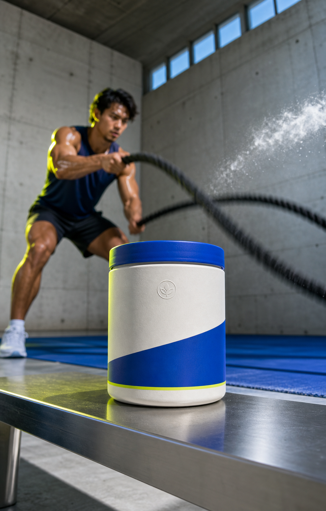

#### Detalhes

- **Autor:** [Ecommerce GPT Image Prompts Studio](https://github.com/ecomimagelab)
- **Fonte:** Criação original para este repositório
- **Publicado:** 2026-07-22
- **Languages:** en
- **Plataformas:** TikTok Shop
- **Licença:** CC-BY-4.0

<details>
<summary><strong>Production details, product invariants, and provenance</strong></summary>

| Mode | Industry | Use cases | Aspect ratio |
|---|---|---|---|
| `text-to-image` | Fitness and wellness | Social commerce ad | 5:8 |

- **Styles:** Minimalist clean, Social native, Bright playful
- **Backgrounds:** Lifestyle location
- **Asset purpose:** Social creative
- **Input requirements:** No reference image is required for this fictional package; all legal label copy must be added and reviewed outside image generation.
- **Product invariants:**
  - Preserve one squat warm-white fiberboard tub, a slightly domed matte cobalt-blue screw lid, and a broad blank warm-white paper label.
  - Preserve the diagonal cobalt-blue lower band, thin acid-lime accent stripe, and small embossed leaf seal without letters or claims.
- **Negative constraints:** No readable text, letters, numbers, nutrition panel, health claims, certification marks, logos, watermark, duplicate tub, distorted packaging, unsafe powder action, CGI plastic, collage, or border.

**Provenance and rights**

- Generated specifically for this repository from the recorded standalone prompt; no third-party preview image is redistributed.
- Original prompt and generated previews created for this repository after open-source prompt-pattern research; no external preview asset is included.
- [visual-research](docs/VISUAL_RESEARCH.md)
- [visual-research](https://github.com/wuyoscar/GPT-Image2-Skill)
- **Platform-policy status:** Platform names identify intended visual treatment only; legal supplement labels and current advertising rules require separate human review.
- **Product collection:** [ec-0023](data/prompts/ec-0023-cobalt-plant-protein-set.json)

</details>

**[🚀 Experimentar agora →](https://www.pixpix.com/)**

---

<a id="prompt-ec-0023-xiaohongshu-breakfast-flatlay"></a>

### No. 9: Fitness and wellness — Cobalt Plant Protein Commerce Set: XIAOHONGSHU BREAKFAST FLAT LAY

 

#### Descrição

Creates a claim-free wellness package system for marketplace clarity, kinetic training content, and a bright social breakfast recipe.

> This title and description use the English fallback.

**Lifestyle scene · Xiaohongshu · 4:5**

#### Prompt

```text
Create one refined portrait 4:5 social-commerce breakfast flat lay centered on the same fictional plant-protein tub. Preserve the squat warm-white fiberboard cylinder, domed matte cobalt lid, blank label, diagonal cobalt lower band, thin acid-lime stripe and small embossed leaf seal without lettering. Use a pale terrazzo table with cobalt mineral chips and morning sunlight. Add one ceramic bowl of thick banana-oat smoothie topped with blueberries, pumpkin seeds and a restrained lime spiral, one matching cobalt scoop with pale vanilla powder, and an oatmeal linen napkin. Arrange tub upper right and bowl lower left in a geometric top-down composition with clean negative space and crisp botanical shadow. No text, claims, logos, watermark, extra tub, open container, powder spill, hands, pills, fitness equipment, clutter, CGI look, collage, or border.
```

#### Pré-visualizações geradas

##### Image 1

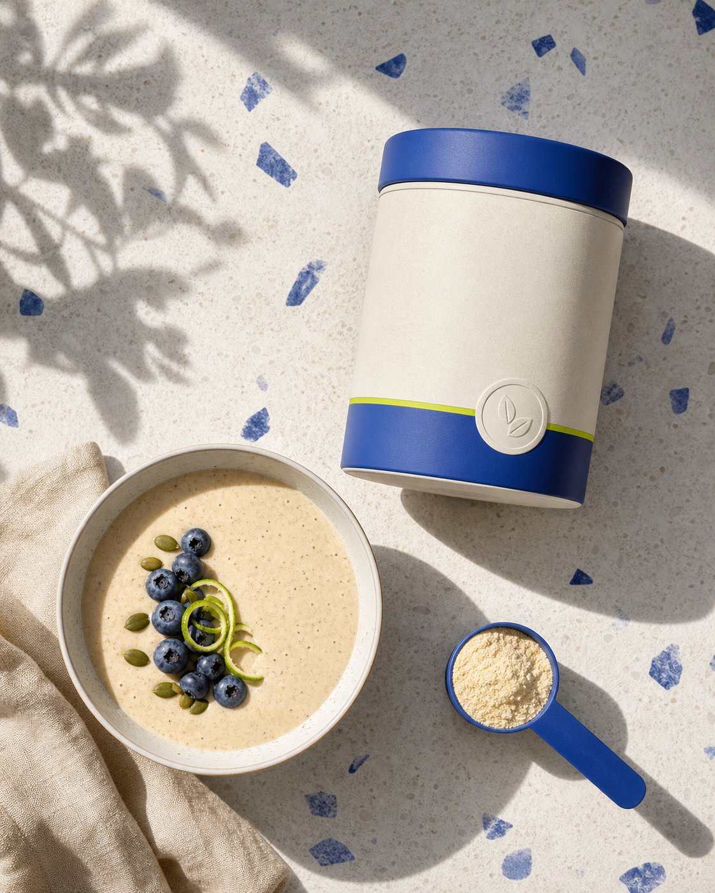

#### Detalhes

- **Autor:** [Ecommerce GPT Image Prompts Studio](https://github.com/ecomimagelab)
- **Fonte:** Criação original para este repositório
- **Publicado:** 2026-07-22
- **Languages:** en
- **Plataformas:** Xiaohongshu
- **Licença:** CC-BY-4.0

<details>
<summary><strong>Production details, product invariants, and provenance</strong></summary>

| Mode | Industry | Use cases | Aspect ratio |
|---|---|---|---|
| `text-to-image` | Fitness and wellness | Lifestyle scene | 4:5 |

- **Styles:** Minimalist clean, Social native, Bright playful
- **Backgrounds:** Natural material
- **Asset purpose:** Social creative
- **Input requirements:** No reference image is required for this fictional package; all legal label copy must be added and reviewed outside image generation.
- **Product invariants:**
  - Preserve one squat warm-white fiberboard tub, a slightly domed matte cobalt-blue screw lid, and a broad blank warm-white paper label.
  - Preserve the diagonal cobalt-blue lower band, thin acid-lime accent stripe, and small embossed leaf seal without letters or claims.
- **Negative constraints:** No readable text, letters, numbers, nutrition panel, health claims, certification marks, logos, watermark, duplicate tub, distorted packaging, unsafe powder action, CGI plastic, collage, or border.

**Provenance and rights**

- Generated specifically for this repository from the recorded standalone prompt; no third-party preview image is redistributed.
- Original prompt and generated previews created for this repository after open-source prompt-pattern research; no external preview asset is included.
- [visual-research](docs/VISUAL_RESEARCH.md)
- [visual-research](https://github.com/wuyoscar/GPT-Image2-Skill)
- **Platform-policy status:** Platform names identify intended visual treatment only; legal supplement labels and current advertising rules require separate human review.
- **Product collection:** [ec-0023](data/prompts/ec-0023-cobalt-plant-protein-set.json)

</details>

**[🚀 Experimentar agora →](https://www.pixpix.com/)**

---

<a id="categories-cookware"></a>

<a id="platforms-amazon-home"></a>

<a id="prompt-ec-0022-amazon-home-main-image"></a>

### No. 10: Cookware — Forest Cocotte Cookware Set: AMAZON HOME MAIN IMAGE

  

#### Descrição

Moves one forest-green Dutch oven from white-background retail clarity to a save-worthy Mediterranean still life and a believable home-cooking ritual.

> This title and description use the English fallback.

**Marketplace main image · Amazon Home · 4:5**

#### Prompt

```text
Create one ultra-photorealistic portrait 4:5 catalog photograph of a fictional unbranded 5-quart round enameled cast-iron Dutch oven. Use a low wide cylindrical body in deep forest-green gloss enamel, warm-cream enamel interior, two short horizontal loop handles, matching heavy lid with three subtle concentric rings and a small domed brushed-brass knob. Lean the lid upright directly behind the open empty pot so the interior and lid are visible; exactly one pot and one matching lid. Use pure #FFFFFF, centered three-quarter view, complete handles and lid, 76% frame fill, broad softbox and controlled enamel highlight. No food, steam, utensils, packaging, text, logo, watermark, extra cookware, detached knob, distorted handles, chips, plastic CGI, collage, or border.
```

#### Pré-visualizações geradas

##### Image 1


#### Detalhes

- **Autor:** [Ecommerce GPT Image Prompts Studio](https://github.com/ecomimagelab)
- **Fonte:** Criação original para este repositório
- **Publicado:** 2026-07-22
- **Languages:** en
- **Plataformas:** Amazon Home
- **Licença:** CC-BY-4.0

<details>
<summary><strong>Production details, product invariants, and provenance</strong></summary>

| Mode | Industry | Use cases | Aspect ratio |
|---|---|---|---|
| `text-to-image` | Cookware | Marketplace main image | 4:5 |

- **Styles:** Minimalist clean, Natural organic, Food editorial
- **Backgrounds:** Pure white
- **Asset purpose:** Marketplace main image
- **Input requirements:** No reference image is required for this fictional cookware design; use product-edit mode for a real SKU.
- **Product invariants:**
  - Preserve the low wide cylindrical cast-iron body, deep forest-green gloss exterior, warm-cream enamel interior, and two short horizontal loop handles.
  - Preserve the matching heavy green lid with three subtle concentric rings and one small domed brushed-brass knob.
- **Negative constraints:** No words, logos, watermark, extra pot, extra lid, detached knob, distorted handles, impossible geometry, unsafe hand contact, plastic CGI, collage, or border.

**Provenance and rights**

- Generated specifically for this repository from the recorded standalone prompt; no third-party preview image is redistributed.
- Original prompt and generated previews created for this repository after open-source prompt-pattern research; no external preview asset is included.
- [visual-research](docs/VISUAL_RESEARCH.md)
- [visual-research](https://github.com/wuyoscar/GPT-Image2-Skill)
- **Platform-policy status:** Platform names identify intended visual treatment only; verify current listing and advertising requirements before publication.
- **Product collection:** [ec-0022](data/prompts/ec-0022-forest-cocotte-cookware-set.json)

</details>

**[🚀 Experimentar agora →](https://www.pixpix.com/)**

---

<a id="prompt-ec-0022-pinterest-mediterranean-still-life"></a>

### No. 11: Cookware — Forest Cocotte Cookware Set: PINTEREST MEDITERRANEAN STILL LIFE

 

#### Descrição

Moves one forest-green Dutch oven from white-background retail clarity to a save-worthy Mediterranean still life and a believable home-cooking ritual.

> This title and description use the English fallback.

**Branded hero · Pinterest · 5:8**

#### Prompt

```text
Create one portrait 5:8 photorealistic editorial image of the same fictional forest-green Dutch oven. Preserve the low wide body, cream interior, two short loop handles, ringed green lid and domed brushed-brass knob. Set the closed pot on a limestone worktop in a quiet old-world chalk-plaster kitchen with one wrinkled natural flax cloth, a few sage leaves and two whole pears. Show the full pot in lower center at a three-quarter view with the lid properly seated. Use one hard late-afternoon window beam, sculptural leaf shadow, cool room shadows and warm brass highlight. Render pitted stone, imperfect plaster, woven linen and heavy vitreous enamel. No text, logos, watermark, extra pot or lid, food on pot, flames, person, modern appliance, clutter, flowers, distorted handles, CGI, collage, or border.
```

#### Pré-visualizações geradas

##### Image 1

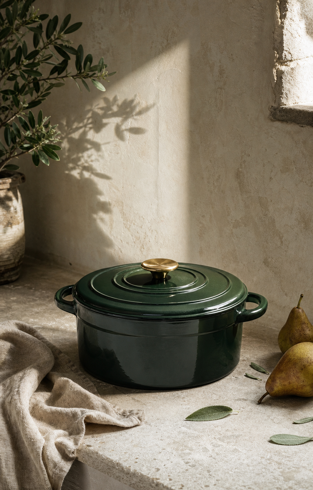

#### Detalhes

- **Autor:** [Ecommerce GPT Image Prompts Studio](https://github.com/ecomimagelab)
- **Fonte:** Criação original para este repositório
- **Publicado:** 2026-07-22
- **Languages:** en
- **Plataformas:** Pinterest
- **Licença:** CC-BY-4.0

<details>
<summary><strong>Production details, product invariants, and provenance</strong></summary>

| Mode | Industry | Use cases | Aspect ratio |
|---|---|---|---|
| `text-to-image` | Cookware | Branded hero | 5:8 |

- **Styles:** Minimalist clean, Natural organic, Food editorial
- **Backgrounds:** Natural material
- **Asset purpose:** Branded hero
- **Input requirements:** No reference image is required for this fictional cookware design; use product-edit mode for a real SKU.
- **Product invariants:**
  - Preserve the low wide cylindrical cast-iron body, deep forest-green gloss exterior, warm-cream enamel interior, and two short horizontal loop handles.
  - Preserve the matching heavy green lid with three subtle concentric rings and one small domed brushed-brass knob.
- **Negative constraints:** No words, logos, watermark, extra pot, extra lid, detached knob, distorted handles, impossible geometry, unsafe hand contact, plastic CGI, collage, or border.

**Provenance and rights**

- Generated specifically for this repository from the recorded standalone prompt; no third-party preview image is redistributed.
- Original prompt and generated previews created for this repository after open-source prompt-pattern research; no external preview asset is included.
- [visual-research](docs/VISUAL_RESEARCH.md)
- [visual-research](https://github.com/wuyoscar/GPT-Image2-Skill)
- **Platform-policy status:** Platform names identify intended visual treatment only; verify current listing and advertising requirements before publication.
- **Product collection:** [ec-0022](data/prompts/ec-0022-forest-cocotte-cookware-set.json)

</details>

**[🚀 Experimentar agora →](https://www.pixpix.com/)**

---

<a id="prompt-ec-0022-xiaohongshu-cooking-ritual"></a>

### No. 12: Cookware — Forest Cocotte Cookware Set: XIAOHONGSHU COOKING RITUAL

 

#### Descrição

Moves one forest-green Dutch oven from white-background retail clarity to a save-worthy Mediterranean still life and a believable home-cooking ritual.

> This title and description use the English fallback.

**Lifestyle scene · Xiaohongshu · 4:5**

#### Prompt

```text
Create one portrait 4:5 appetizing social-commerce lifestyle photograph of the same forest-green enameled Dutch oven in use. Preserve the low wide body, cream interior, short loop handles, matching ringed lid and brass knob. In a compact sunlit kitchen with pale oak and warm-white tile, fill the open pot with a rustic tomato-and-white-bean braise and gentle natural steam. One adult hand stirs with a simple wooden spoon from the side. Put the matching lid safely on a small wooden trivet behind the pot. Use a close 45-degree tabletop view; the pot dominates while the front body and both handles remain visible. Use warm morning light with a small direct-flash lift. No text, logo, watermark, extra cookware, duplicated lid, fire, unsafe contact, overflowing food, malformed fingers, CGI food, collage, or border.
```

#### Pré-visualizações geradas

##### Image 1


#### Detalhes

- **Autor:** [Ecommerce GPT Image Prompts Studio](https://github.com/ecomimagelab)
- **Fonte:** Criação original para este repositório
- **Publicado:** 2026-07-22
- **Languages:** en
- **Plataformas:** Xiaohongshu
- **Licença:** CC-BY-4.0

<details>
<summary><strong>Production details, product invariants, and provenance</strong></summary>

| Mode | Industry | Use cases | Aspect ratio |
|---|---|---|---|
| `text-to-image` | Cookware | Lifestyle scene | 4:5 |

- **Styles:** Minimalist clean, Natural organic, Food editorial
- **Backgrounds:** Home interior
- **Asset purpose:** Social creative
- **Input requirements:** No reference image is required for this fictional cookware design; use product-edit mode for a real SKU.
- **Product invariants:**
  - Preserve the low wide cylindrical cast-iron body, deep forest-green gloss exterior, warm-cream enamel interior, and two short horizontal loop handles.
  - Preserve the matching heavy green lid with three subtle concentric rings and one small domed brushed-brass knob.
- **Negative constraints:** No words, logos, watermark, extra pot, extra lid, detached knob, distorted handles, impossible geometry, unsafe hand contact, plastic CGI, collage, or border.

**Provenance and rights**

- Generated specifically for this repository from the recorded standalone prompt; no third-party preview image is redistributed.
- Original prompt and generated previews created for this repository after open-source prompt-pattern research; no external preview asset is included.
- [visual-research](docs/VISUAL_RESEARCH.md)
- [visual-research](https://github.com/wuyoscar/GPT-Image2-Skill)
- **Platform-policy status:** Platform names identify intended visual treatment only; verify current listing and advertising requirements before publication.
- **Product collection:** [ec-0022](data/prompts/ec-0022-forest-cocotte-cookware-set.json)

</details>

**[🚀 Experimentar agora →](https://www.pixpix.com/)**

---

<a id="categories-consumer-electronics"></a>

<a id="platforms-best-buy"></a>

<a id="prompt-ec-0021-amazon-clean-main-image"></a>

### No. 13: Consumer electronics — Midnight Headphones Platform Set: AMAZON CLEAN MAIN IMAGE

  

#### Descrição

Keeps one midnight-blue headphone design consistent across a pure-white marketplace listing, an acoustic feature visual, and a creator-led TikTok Shop frame.

> This title and description use the English fallback.

**Marketplace main image · Amazon · 4:5**

#### Prompt

```text
Create one ultra-photorealistic portrait 4:5 catalog photograph of a fictional unbranded pair of premium over-ear wireless headphones. Product design: two large rounded-oval matte midnight-navy earcups with shallow concentric bevels, slim bead-blasted natural-aluminum Y-yokes, a broad navy woven-fabric headband with a narrow aluminum center rail, thick charcoal textile memory-foam cushions, and one tiny burnt-orange fabric pull tab beneath the right earcup. Use pure #FFFFFF. Fold the headphones into a graceful three-quarter standing pose with the entire headband and both cushions visible; fill 78% of frame. Use an overhead softbox, precise silver edge highlights and a realistic grounding shadow. No text, logo, watermark, cable, stand, phone, case, extra headphones, separated parts, distorted headband, asymmetric earcups, CGI plastic, collage, or border.
```

#### Pré-visualizações geradas

##### Image 1


#### Detalhes

- **Autor:** [Ecommerce GPT Image Prompts Studio](https://github.com/ecomimagelab)
- **Fonte:** Criação original para este repositório
- **Publicado:** 2026-07-22
- **Languages:** en
- **Plataformas:** Amazon
- **Licença:** CC-BY-4.0

<details>
<summary><strong>Production details, product invariants, and provenance</strong></summary>

| Mode | Industry | Use cases | Aspect ratio |
|---|---|---|---|
| `text-to-image` | Consumer electronics | Marketplace main image | 4:5 |

- **Styles:** Minimalist clean, Technical, Social native
- **Backgrounds:** Pure white
- **Asset purpose:** Marketplace main image
- **Input requirements:** No reference image is required for this fictional product; edit owned product photography when exact inventory fidelity is required.
- **Product invariants:**
  - Preserve two large rounded-oval matte midnight-navy earcups with shallow concentric bevels and thick charcoal textile cushions.
  - Preserve slim natural-aluminum Y-yokes, the broad navy woven headband with narrow aluminum center rail, and tiny burnt-orange tab beneath the right earcup.
- **Negative constraints:** No words, letters, logos, watermark, cable, stand, extra headphones, separated parts, malformed headband, asymmetric earcups, exaggerated RGB clutter, CGI plastic, collage, or border.

**Provenance and rights**

- Generated specifically for this repository from the recorded standalone prompt; no third-party preview image is redistributed.
- Original prompt and generated previews created for this repository after open-source prompt-pattern research; no external preview asset is included.
- [visual-research](docs/VISUAL_RESEARCH.md)
- [visual-research](https://github.com/wuyoscar/GPT-Image2-Skill)
- **Platform-policy status:** Platform names identify intended visual treatment only; verify current listing and advertising requirements before publication.
- **Product collection:** [ec-0021](data/prompts/ec-0021-midnight-headphones-platform-set.json)

</details>

**[🚀 Experimentar agora →](https://www.pixpix.com/)**

---

<a id="prompt-ec-0021-best-buy-acoustic-feature"></a>

### No. 14: Consumer electronics — Midnight Headphones Platform Set: BEST BUY ACOUSTIC FEATURE

 

#### Descrição

Keeps one midnight-blue headphone design consistent across a pure-white marketplace listing, an acoustic feature visual, and a creator-led TikTok Shop frame.

> This title and description use the English fallback.

**Feature visual · Best Buy · 4:5**

#### Prompt

```text
Create one dramatic ultra-photorealistic portrait 4:5 feature image of the same fictional unbranded over-ear wireless headphones. Preserve rounded-oval matte midnight-navy earcups, slim natural-aluminum Y-yokes, broad navy woven headband with narrow aluminum rail, thick charcoal textile cushions and one tiny burnt-orange tab. Use a deep ink-blue acoustic chamber and one low black-glass plinth. Place restrained translucent amber-to-cobalt sound-wave ribbons behind the headphones in smooth concentric arcs without obscuring the product. Show the full upright product at a front three-quarter angle. Use cool rim lights, one warm pinpoint accent and rich controlled blacks. No text, logos, labels, arrows, numbers, cable, person, extra headphones, exploded parts, impossible waves, neon clutter, distorted headband, CGI look, collage, or border.
```

#### Pré-visualizações geradas

##### Image 1

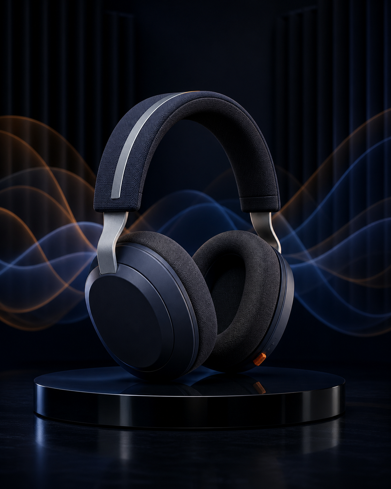

#### Detalhes

- **Autor:** [Ecommerce GPT Image Prompts Studio](https://github.com/ecomimagelab)
- **Fonte:** Criação original para este repositório
- **Publicado:** 2026-07-22
- **Languages:** en
- **Plataformas:** Best Buy
- **Licença:** CC-BY-4.0

<details>
<summary><strong>Production details, product invariants, and provenance</strong></summary>

| Mode | Industry | Use cases | Aspect ratio |
|---|---|---|---|
| `text-to-image` | Consumer electronics | Feature visual | 4:5 |

- **Styles:** Minimalist clean, Technical, Social native
- **Backgrounds:** Dark studio
- **Asset purpose:** Secondary listing image
- **Input requirements:** No reference image is required for this fictional product; edit owned product photography when exact inventory fidelity is required.
- **Product invariants:**
  - Preserve two large rounded-oval matte midnight-navy earcups with shallow concentric bevels and thick charcoal textile cushions.
  - Preserve slim natural-aluminum Y-yokes, the broad navy woven headband with narrow aluminum center rail, and tiny burnt-orange tab beneath the right earcup.
- **Negative constraints:** No words, letters, logos, watermark, cable, stand, extra headphones, separated parts, malformed headband, asymmetric earcups, exaggerated RGB clutter, CGI plastic, collage, or border.

**Provenance and rights**

- Generated specifically for this repository from the recorded standalone prompt; no third-party preview image is redistributed.
- Original prompt and generated previews created for this repository after open-source prompt-pattern research; no external preview asset is included.
- [visual-research](docs/VISUAL_RESEARCH.md)
- [visual-research](https://github.com/wuyoscar/GPT-Image2-Skill)
- **Platform-policy status:** Platform names identify intended visual treatment only; verify current listing and advertising requirements before publication.
- **Product collection:** [ec-0021](data/prompts/ec-0021-midnight-headphones-platform-set.json)

</details>

**[🚀 Experimentar agora →](https://www.pixpix.com/)**

---

<a id="prompt-ec-0021-tiktok-creator-session"></a>

### No. 15: Consumer electronics — Midnight Headphones Platform Set: TIKTOK CREATOR SESSION

 

#### Descrição

Keeps one midnight-blue headphone design consistent across a pure-white marketplace listing, an acoustic feature visual, and a creator-led TikTok Shop frame.

> This title and description use the English fallback.

**Social commerce ad · TikTok Shop · 4:5**

#### Prompt

```text
Create one portrait 4:5 social-native photorealistic campaign frame of one adult music creator wearing the same fictional unbranded headphones. Preserve the rounded-oval midnight-navy earcups with shallow bevels, natural-aluminum Y-yokes, broad navy woven headband with narrow aluminum rail, charcoal textile cushions and tiny burnt-orange tab. Set the scene in a compact independent music studio at blue hour with muted acoustic panels, one amber lamp and blurred MIDI shapes without readable markings. Capture the creator chest-up, leaning toward an off-frame mixer mid-head-nod; keep the headphones tack sharp and correctly fitted. Use bounced direct flash, ambient cobalt room tone and warm practical light. No text, logos, visible brand interface, extra headphones, cable, microphone covering product, RGB gaming clutter, distorted face, extra fingers, deformed headband, collage, or border.
```

#### Pré-visualizações geradas

##### Image 1


#### Detalhes

- **Autor:** [Ecommerce GPT Image Prompts Studio](https://github.com/ecomimagelab)
- **Fonte:** Criação original para este repositório
- **Publicado:** 2026-07-22
- **Languages:** en
- **Plataformas:** TikTok Shop
- **Licença:** CC-BY-4.0

<details>
<summary><strong>Production details, product invariants, and provenance</strong></summary>

| Mode | Industry | Use cases | Aspect ratio |
|---|---|---|---|
| `text-to-image` | Consumer electronics | Social commerce ad | 4:5 |

- **Styles:** Minimalist clean, Technical, Social native
- **Backgrounds:** Lifestyle location
- **Asset purpose:** Social creative
- **Input requirements:** No reference image is required for this fictional product; edit owned product photography when exact inventory fidelity is required.
- **Product invariants:**
  - Preserve two large rounded-oval matte midnight-navy earcups with shallow concentric bevels and thick charcoal textile cushions.
  - Preserve slim natural-aluminum Y-yokes, the broad navy woven headband with narrow aluminum center rail, and tiny burnt-orange tab beneath the right earcup.
- **Negative constraints:** No words, letters, logos, watermark, cable, stand, extra headphones, separated parts, malformed headband, asymmetric earcups, exaggerated RGB clutter, CGI plastic, collage, or border.

**Provenance and rights**

- Generated specifically for this repository from the recorded standalone prompt; no third-party preview image is redistributed.
- Original prompt and generated previews created for this repository after open-source prompt-pattern research; no external preview asset is included.
- [visual-research](docs/VISUAL_RESEARCH.md)
- [visual-research](https://github.com/wuyoscar/GPT-Image2-Skill)
- **Platform-policy status:** Platform names identify intended visual treatment only; verify current listing and advertising requirements before publication.
- **Product collection:** [ec-0021](data/prompts/ec-0021-midnight-headphones-platform-set.json)

</details>

**[🚀 Experimentar agora →](https://www.pixpix.com/)**

---

<a id="categories-beauty"></a>

<a id="platforms-sephora"></a>

<a id="platforms-tmall-luxury"></a>

<a id="platforms-instagram-shop"></a>

<a id="prompt-ec-0020-sephora-clean-catalog"></a>

### No. 16: Beauty and skincare — Sculptural Garnet Lipstick Commerce Set: SEPHORA CLEAN CATALOG

  

#### Descrição

Builds three distinct beauty-commerce treatments around one fictional garnet lipstick: clean catalog clarity, lacquered luxury launch art, and a flash-lit social editorial.

> This title and description use the English fallback.

**Catalog image · Sephora · 4:5**

#### Prompt

```text
Create a single ultra-photorealistic portrait 4:5 product photograph of one fictional, unbranded refillable lipstick. The lipstick is open and standing upright at a subtle three-quarter angle. It has a slim rectangular brushed champagne-gold metal case, one narrow deep-burgundy enamel side panel, a fine horizontal seam near the base, and a deep garnet satin lipstick bullet with a pristine sharp slanted tip. Use a seamless warm-ivory cyclorama and low cream lacquer plinth. Center the product lower-middle, fill about 72% of frame height, preserve the complete silhouette, and leave breathing room. Light with a large upper-left softbox, a controlled metal specular strip, delicate burgundy bounce, and soft grounding shadow. Render believable brushed metal, flawless enamel and dense satin wax microtexture. No words, letters, logos, watermark, second lipstick, cap, cosmetic smear, flowers, fruit, hands, floating objects, distorted case, damaged bullet, CGI-plastic look, collage, or border.
```

#### Pré-visualizações geradas

##### Image 1


#### Detalhes

- **Autor:** [Ecommerce GPT Image Prompts Studio](https://github.com/ecomimagelab)
- **Fonte:** Criação original para este repositório
- **Publicado:** 2026-07-22
- **Languages:** en
- **Plataformas:** Sephora
- **Licença:** CC-BY-4.0

<details>
<summary><strong>Production details, product invariants, and provenance</strong></summary>

| Mode | Industry | Use cases | Aspect ratio |
|---|---|---|---|
| `text-to-image` | Beauty and skincare | Catalog image | 4:5 |

- **Styles:** Luxury premium, Editorial, Dark moody
- **Backgrounds:** Soft studio
- **Asset purpose:** Catalog image
- **Input requirements:** No reference image is required because the product is fictional; use product-edit mode with owned source photography for real inventory.
- **Product invariants:**
  - Preserve the slim rectangular brushed champagne-gold metal case, narrow deep-burgundy enamel side panel, and fine horizontal seam near the base.
  - Preserve the open deep-garnet satin lipstick bullet with a clean, pristine slanted tip and believable dense wax texture.
- **Negative constraints:** No words, letters, logos, watermark, extra lipstick, cap, damaged bullet, malformed case, floating product, cheap CGI, collage, frame, or border.

**Provenance and rights**

- Generated specifically for this repository from the recorded standalone prompt; no third-party preview image is redistributed.
- Original prompt and generated previews created for this repository after open-source prompt-pattern research; no external preview asset is included.
- [visual-research](docs/VISUAL_RESEARCH.md)
- [visual-research](https://github.com/wuyoscar/GPT-Image2-Skill)
- **Platform-policy status:** Platform names identify intended visual treatment only; verify current listing and advertising requirements before publication.
- **Product collection:** [ec-0020](data/prompts/ec-0020-sculptural-garnet-lipstick-set.json)

</details>

**[🚀 Experimentar agora →](https://www.pixpix.com/)**

---

<a id="prompt-ec-0020-tmall-oxblood-launch"></a>

### No. 17: Beauty and skincare — Sculptural Garnet Lipstick Commerce Set: TMALL OXBLOOD LAUNCH

 

#### Descrição

Builds three distinct beauty-commerce treatments around one fictional garnet lipstick: clean catalog clarity, lacquered luxury launch art, and a flash-lit social editorial.

> This title and description use the English fallback.

**Branded hero · Tmall Luxury · 4:5**

#### Prompt

```text
Create a single ultra-photorealistic portrait 4:5 campaign still of the same fictional unbranded refillable lipstick: slim rectangular brushed champagne-gold metal case, one narrow deep-burgundy enamel side panel, fine horizontal seam near the base, open with a deep garnet satin lipstick bullet and pristine sharp slanted tip. Use a monumental set made from deep oxblood high-gloss lacquer and one warm-cream curved arch. Add one restrained thick garnet cosmetic swipe across the lower foreground without touching the product. Stand the lipstick upright on a circular oxblood lacquer pedestal at a heroic low three-quarter view with strong graphic negative space. Use hard warm spotlight through the arch, controlled gold rim light, rich black-red shadows and jewel-like reflections. No words, letters, logos, watermark, people, hands, lips, extra lipstick, cap, flowers, drips on product, malformed case, damaged tip, cheap CGI, collage, frame, or border.
```

#### Pré-visualizações geradas

##### Image 1

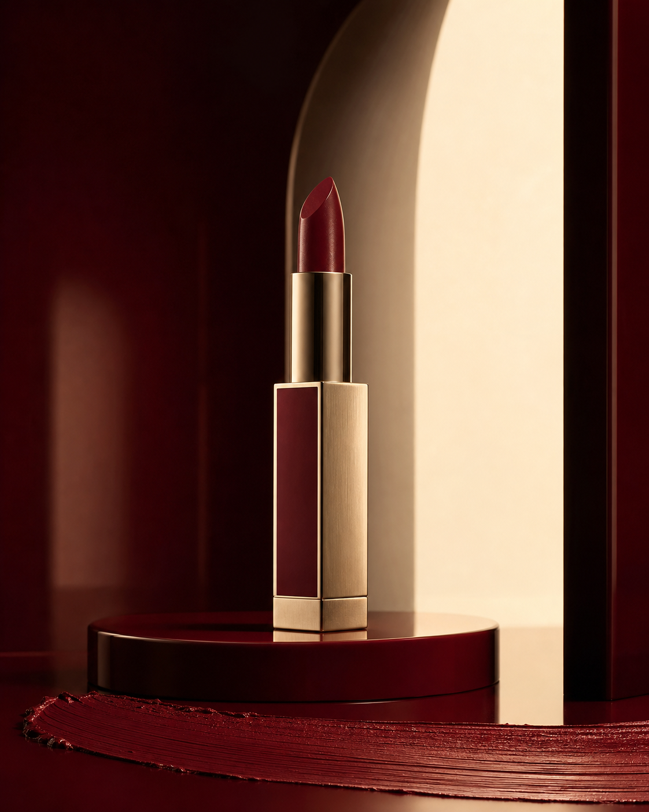

#### Detalhes

- **Autor:** [Ecommerce GPT Image Prompts Studio](https://github.com/ecomimagelab)
- **Fonte:** Criação original para este repositório
- **Publicado:** 2026-07-22
- **Languages:** en
- **Plataformas:** Tmall Luxury
- **Licença:** CC-BY-4.0

<details>
<summary><strong>Production details, product invariants, and provenance</strong></summary>

| Mode | Industry | Use cases | Aspect ratio |
|---|---|---|---|
| `text-to-image` | Beauty and skincare | Branded hero | 4:5 |

- **Styles:** Luxury premium, Editorial, Dark moody
- **Backgrounds:** Color studio
- **Asset purpose:** Branded hero
- **Input requirements:** No reference image is required because the product is fictional; use product-edit mode with owned source photography for real inventory.
- **Product invariants:**
  - Preserve the slim rectangular brushed champagne-gold metal case, narrow deep-burgundy enamel side panel, and fine horizontal seam near the base.
  - Preserve the open deep-garnet satin lipstick bullet with a clean, pristine slanted tip and believable dense wax texture.
- **Negative constraints:** No words, letters, logos, watermark, extra lipstick, cap, damaged bullet, malformed case, floating product, cheap CGI, collage, frame, or border.

**Provenance and rights**

- Generated specifically for this repository from the recorded standalone prompt; no third-party preview image is redistributed.
- Original prompt and generated previews created for this repository after open-source prompt-pattern research; no external preview asset is included.
- [visual-research](docs/VISUAL_RESEARCH.md)
- [visual-research](https://github.com/wuyoscar/GPT-Image2-Skill)
- **Platform-policy status:** Platform names identify intended visual treatment only; verify current listing and advertising requirements before publication.
- **Product collection:** [ec-0020](data/prompts/ec-0020-sculptural-garnet-lipstick-set.json)

</details>

**[🚀 Experimentar agora →](https://www.pixpix.com/)**

---

<a id="usecases-on-model"></a>

<a id="prompt-ec-0020-instagram-flash-editorial"></a>

### No. 18: Beauty and skincare — Sculptural Garnet Lipstick Commerce Set: INSTAGRAM FLASH EDITORIAL

 

#### Descrição

Builds three distinct beauty-commerce treatments around one fictional garnet lipstick: clean catalog clarity, lacquered luxury launch art, and a flash-lit social editorial.

> This title and description use the English fallback.

**On-model · Instagram Shop · 5:8**

#### Prompt

```text
Create a single photorealistic portrait 5:8 social-commerce beauty photograph featuring the same fictional unbranded refillable lipstick held near the face by one elegant adult model. Keep the product clearly visible: slim rectangular brushed champagne-gold metal case, one narrow deep-burgundy enamel side panel, fine seam near the base, open with a deep garnet satin bullet and pristine slanted tip. Use an intimate dark-cherry studio and one soft out-of-focus burgundy silk plane. Crop from nose to collarbone with natural skin texture; lips wear matching deep-garnet satin color. One hand holds the complete lipstick upright beside the cheek without covering the case or bullet. Use an 85mm editorial close-up, softened direct flash and narrow warm side fill. Product and lips must both be tack sharp. Adult model only; no words, logo, watermark, extra lipstick, cap, jewelry clutter, excessive smoothing, distorted hand, extra fingers, damaged bullet, duplicate product, collage, frame, or border.
```

#### Pré-visualizações geradas

##### Image 1

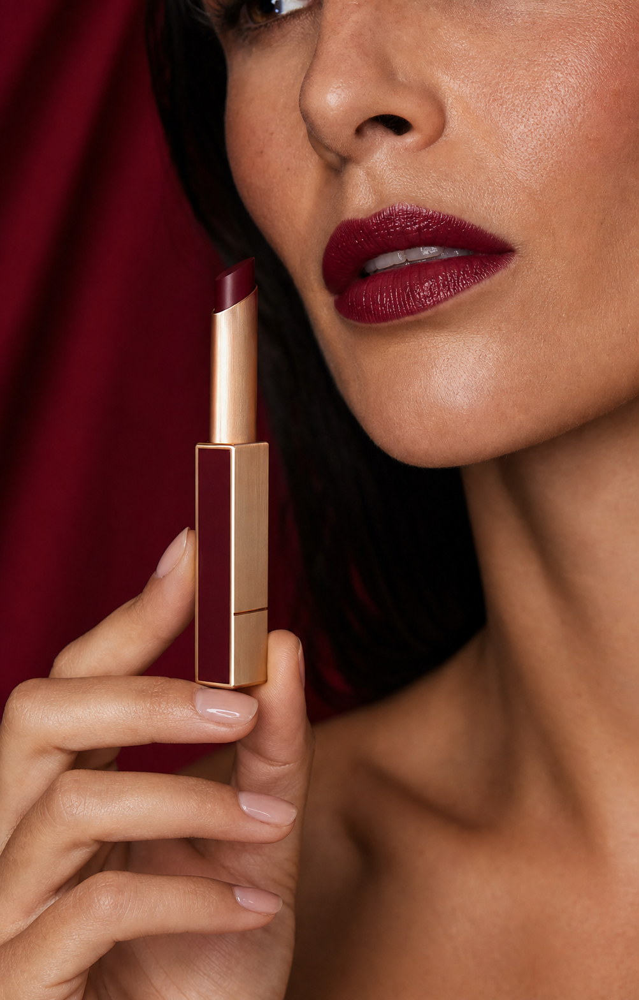

#### Detalhes

- **Autor:** [Ecommerce GPT Image Prompts Studio](https://github.com/ecomimagelab)
- **Fonte:** Criação original para este repositório
- **Publicado:** 2026-07-22
- **Languages:** en
- **Plataformas:** Instagram Shop
- **Licença:** CC-BY-4.0

<details>
<summary><strong>Production details, product invariants, and provenance</strong></summary>

| Mode | Industry | Use cases | Aspect ratio |
|---|---|---|---|
| `text-to-image` | Beauty and skincare | On-model | 5:8 |

- **Styles:** Luxury premium, Editorial, Dark moody
- **Backgrounds:** Dark studio
- **Asset purpose:** Social creative
- **Input requirements:** No reference image is required because the product is fictional; use product-edit mode with owned source photography for real inventory.
- **Product invariants:**
  - Preserve the slim rectangular brushed champagne-gold metal case, narrow deep-burgundy enamel side panel, and fine horizontal seam near the base.
  - Preserve the open deep-garnet satin lipstick bullet with a clean, pristine slanted tip and believable dense wax texture.
- **Negative constraints:** No words, letters, logos, watermark, extra lipstick, cap, damaged bullet, malformed case, floating product, cheap CGI, collage, frame, or border.

**Provenance and rights**

- Generated specifically for this repository from the recorded standalone prompt; no third-party preview image is redistributed.
- Original prompt and generated previews created for this repository after open-source prompt-pattern research; no external preview asset is included.
- [visual-research](docs/VISUAL_RESEARCH.md)
- [visual-research](https://github.com/wuyoscar/GPT-Image2-Skill)
- **Platform-policy status:** Platform names identify intended visual treatment only; verify current listing and advertising requirements before publication.
- **Product collection:** [ec-0020](data/prompts/ec-0020-sculptural-garnet-lipstick-set.json)

</details>

**[🚀 Experimentar agora →](https://www.pixpix.com/)**

---

<a id="prompt-ec-0019-shopify-travertine-hero"></a>

### No. 19: Beauty and skincare — Product-Faithful Serum Background Edit Workflow: SHOPIFY TRAVERTINE HERO

  

#### Descrição

Uses one repository-owned serum image as the identity reference, then changes only the set, lighting, and campaign treatment for Shopify and Instagram Shop.

> This title and description use the English fallback.

**Branded hero · Shopify · 5:8**

#### Prompt

```text
Edit the supplied serum product image into one standalone premium Shopify product hero, portrait 5:8. Use the supplied image as the product identity reference and edit target. Preserve the serum bottle as closely as possible: the same squat rounded-square clear optical-glass bottle, pale celadon liquid level, heavy clear base, satin warm-ivory pipette cap, blank rectangular ivory label, overall proportions, label size and placement, glass thickness, cap geometry, and celadon color. Remove the water splash and reflective pool completely. Place the bottle upright on a single carved warm-ivory travertine pedestal with subtle natural pores, against a quiet warm limestone-to-cream studio gradient. Add one restrained curved architectural shadow behind the bottle, soft diffused key light from upper left, a controlled glass-edge highlight, a realistic small contact shadow, generous negative space, editorial luxury-skincare art direction, refined natural color, and ultra-photorealistic materials. Human comparison with the reference is required. No text, logo, watermark, flowers, leaves, water, extra bottle, added product features, label distortion, plastic CGI look, collage, split screen, or panel border.
```

#### Pré-visualizações geradas

##### Before


##### Image 1


#### Detalhes

- **Autor:** Ecommerce GPT Image Prompts Studio
- **Fonte:** Criação original para este repositório
- **Publicado:** 2026-07-22
- **Languages:** en
- **Plataformas:** Shopify
- **Licença:** CC-BY-4.0

<details>
<summary><strong>Production details, product invariants, and provenance</strong></summary>

| Mode | Industry | Use cases | Aspect ratio |
|---|---|---|---|
| `product-edit` | Beauty and skincare | Branded hero | 5:8 |

- **Styles:** Luxury premium, Minimalist clean, Dark moody
- **Backgrounds:** Natural material
- **Asset purpose:** Branded hero
- **Input requirements:** Provide one front-facing, sufficiently sharp product image that you own or may license publicly; compare the generated bottle, label, color, and proportions with the source before use.
- **Product invariants:**
  - Preserve the squat rounded-square clear optical-glass bottle, pale celadon liquid level, heavy clear base, and overall front-facing proportions.
  - Preserve the satin warm-ivory pipette cap, its rounded top, width, height, and centered alignment.
  - Preserve the blank rectangular ivory label, its size and placement; do not add, distort, or fabricate label text.
  - Preserve the glass thickness and celadon color; do not add product claims, ingredients, certifications, or performance statements.
- **Negative constraints:** No readable text, logo, watermark, extra bottle, replacement packaging, recoloring, invented feature, malformed label, plastic CGI look, collage, split screen, or panel border.

**Provenance and rights**

- The Before image was generated for this repository; the After image was produced by editing that local source with the recorded GPT Image 2 prompt.
- Original product-edit workflow and generated examples created specifically for this repository from a repository-owned source image.
- [visual-research](docs/VISUAL_RESEARCH.md)
- **Platform-policy status:** Shopify and Instagram Shop identify the intended creative treatment only; the images do not claim guaranteed platform or advertising approval.
- **Product collection:** [ec-0019](data/prompts/ec-0019-product-faithful-serum-edit-workflow.json)

</details>

**[🚀 Experimentar agora →](https://www.pixpix.com/)**

---

<a id="prompt-ec-0019-instagram-night-launch"></a>

### No. 20: Beauty and skincare — Product-Faithful Serum Background Edit Workflow: INSTAGRAM NIGHT LAUNCH

 

#### Descrição

Uses one repository-owned serum image as the identity reference, then changes only the set, lighting, and campaign treatment for Shopify and Instagram Shop.

> This title and description use the English fallback.

**Social commerce ad · Instagram Shop · 5:8**

#### Prompt

```text
Edit the supplied serum product image into one standalone premium Instagram Shop launch image, portrait 5:8. Use the supplied image as the product identity reference and edit target. Preserve the serum bottle as closely as possible: the same squat rounded-square clear optical-glass bottle, pale celadon liquid level, heavy clear base, satin warm-ivory pipette cap, blank rectangular ivory label, overall proportions, label size and placement, glass thickness, cap geometry, and celadon color. Remove the water splash and reflective pool completely. Place the bottle upright on a narrow slab of smoked olive glass in a deep moss-to-black studio. Create one controlled warm amber circular halo behind the upper bottle, a cool narrow rim light on the glass edge, subtle condensation limited to the exterior glass, precise realistic reflections, strong product separation, a luxurious night-repair campaign mood, refined editorial color, generous clean negative space, and ultra-photorealistic materials. Human comparison with the reference is required. No readable text, logo, watermark, water splash, flowers, leaves, extra bottle, added product features, label distortion, plastic CGI look, neon clutter, collage, split screen, or panel border.
```

#### Pré-visualizações geradas

##### Before


##### Image 1


#### Detalhes

- **Autor:** Ecommerce GPT Image Prompts Studio
- **Fonte:** Criação original para este repositório
- **Publicado:** 2026-07-22
- **Languages:** en
- **Plataformas:** Instagram Shop
- **Licença:** CC-BY-4.0

<details>
<summary><strong>Production details, product invariants, and provenance</strong></summary>

| Mode | Industry | Use cases | Aspect ratio |
|---|---|---|---|
| `product-edit` | Beauty and skincare | Social commerce ad | 5:8 |

- **Styles:** Luxury premium, Minimalist clean, Dark moody
- **Backgrounds:** Dark studio
- **Asset purpose:** Social creative
- **Input requirements:** Provide one front-facing, sufficiently sharp product image that you own or may license publicly; compare the generated bottle, label, color, and proportions with the source before use.
- **Product invariants:**
  - Preserve the squat rounded-square clear optical-glass bottle, pale celadon liquid level, heavy clear base, and overall front-facing proportions.
  - Preserve the satin warm-ivory pipette cap, its rounded top, width, height, and centered alignment.
  - Preserve the blank rectangular ivory label, its size and placement; do not add, distort, or fabricate label text.
  - Preserve the glass thickness and celadon color; do not add product claims, ingredients, certifications, or performance statements.
- **Negative constraints:** No readable text, logo, watermark, extra bottle, replacement packaging, recoloring, invented feature, malformed label, plastic CGI look, collage, split screen, or panel border.

**Provenance and rights**

- The Before image was generated for this repository; the After image was produced by editing that local source with the recorded GPT Image 2 prompt.
- Original product-edit workflow and generated examples created specifically for this repository from a repository-owned source image.
- [visual-research](docs/VISUAL_RESEARCH.md)
- **Platform-policy status:** Shopify and Instagram Shop identify the intended creative treatment only; the images do not claim guaranteed platform or advertising approval.
- **Product collection:** [ec-0019](data/prompts/ec-0019-product-faithful-serum-edit-workflow.json)

</details>

**[🚀 Experimentar agora →](https://www.pixpix.com/)**

---

<a id="categories-cycling"></a>

<a id="platforms-amazon-sports"></a>

<a id="platforms-decathlon"></a>

<a id="prompt-ec-0018-variant-1"></a>

### No. 21: Cycling — Aero Road Helmet Triptych: AMAZON SPORTS CATALOG

 

#### Descrição

Combines a clean sports catalog, an airflow feature visual, and a sunrise action campaign for one road helmet.

> This title and description use the English fallback.

**Marketplace main image · Amazon Sports · 4:5**

#### Prompt

```text
Create one standalone 4:5 e-commerce image, not a collage, contact sheet, split screen, or multi-panel layout.
Product specification and invariants: identical helmet in this output; matte pearl-white aerodynamic shell, elongated tapered rear, three long central top vents with shorter side vents, thin black lower edge, electric-blue interior padding glimpsed through vents, black Y-straps and small magnetic buckle, no visor and no logo. Preserve shell silhouette, vent layout, rear taper, edge and strap colors.
Art direction: helmet alone in clean side three-quarter view on pure #FFFFFF, entire shell and straps visible, realistic soft grounding shadow, crisp ventilation geometry and honest proportions, no props.
Photography and rendering: ultra-photorealistic premium sports-product photography, physically plausible polycarbonate shell, foam edge, fabric straps and skin, clean pearl/black/electric-blue palette, dynamic but credible.
Quality and safety constraints: no readable text, no logos, no watermark, no extra helmet, no bicycle brand, no distorted face or straps, no missing buckle, no impossible airflow, no crash scene, no added layout labels or numbers. Keep the exact helmet design consistent in this output.
```

#### Pré-visualizações geradas

##### Image 1


#### Detalhes

- **Autor:** Ecommerce GPT Image Prompts Studio
- **Fonte:** Criação original para este repositório
- **Publicado:** 2026-07-21
- **Languages:** en
- **Plataformas:** Amazon Sports
- **Licença:** CC-BY-4.0

<details>
<summary><strong>Production details, product invariants, and provenance</strong></summary>

| Mode | Industry | Use cases | Aspect ratio |
|---|---|---|---|
| `text-to-image` | Cycling | Marketplace main image | 4:5 |

- **Styles:** Outdoor performance, Technical, Social native
- **Backgrounds:** Pure white
- **Asset purpose:** Marketplace main image
- **Input requirements:** No reference image is required. This record defines a fictional, unbranded product; use product-edit mode for real inventory.
- **Product invariants:**
  - identical helmet in this output; matte pearl-white aerodynamic shell, elongated tapered rear, three long central top vents with shorter side vents, thin black lower edge, electric-blue interior padding glimpsed through vents, black Y-straps and small magnetic buckle, no visor and no logo. Preserve shell silhouette, vent layout, rear taper, edge and strap colors.
- **Negative constraints:** no readable text, no logos, no watermark, no extra helmet, no bicycle brand, no distorted face or straps, no missing buckle, no impossible airflow, no crash scene, no added layout labels or numbers. Keep the exact helmet design consistent in this output.

**Provenance and rights**

- Generated specifically for this repository from the corresponding prompt direction; no third-party preview image is redistributed.
- Original synthesis informed by broad visual research; prompt and generated previews created for this repository. See docs/VISUAL_RESEARCH.md.
- [visual-research](docs/VISUAL_RESEARCH.md)
- **Platform-policy status:** Platform names describe intended art direction only. Verify the current official rules for the product category before publishing.
- **Product collection:** [ec-0018](data/prompts/ec-0018-aero-road-helmet-triptych.json)

</details>

**[🚀 Experimentar agora →](https://www.pixpix.com/)**

---

<a id="prompt-ec-0018-variant-2"></a>

### No. 22: Cycling — Aero Road Helmet Triptych: FEATURE AIRFLOW VISUAL

 

#### Descrição

Combines a clean sports catalog, an airflow feature visual, and a sunrise action campaign for one road helmet.

> This title and description use the English fallback.

**Feature visual · Decathlon · 4:5**

#### Prompt

```text
Create one standalone 4:5 e-commerce image, not a collage, contact sheet, split screen, or multi-panel layout.
Product specification and invariants: identical helmet in this output; matte pearl-white aerodynamic shell, elongated tapered rear, three long central top vents with shorter side vents, thin black lower edge, electric-blue interior padding glimpsed through vents, black Y-straps and small magnetic buckle, no visor and no logo. Preserve shell silhouette, vent layout, rear taper, edge and strap colors.
Art direction: same helmet floating above a dark navy plinth, front three-quarter angle, restrained translucent electric-blue airflow ribbons enter the front vents and exit the tapered rear, physically coherent flow with the helmet unobstructed, cool rim light and engineering precision, no labels or exploded parts.
Photography and rendering: ultra-photorealistic premium sports-product photography, physically plausible polycarbonate shell, foam edge, fabric straps and skin, clean pearl/black/electric-blue palette, dynamic but credible.
Quality and safety constraints: no readable text, no logos, no watermark, no extra helmet, no bicycle brand, no distorted face or straps, no missing buckle, no impossible airflow, no crash scene, no added layout labels or numbers. Keep the exact helmet design consistent in this output.
```

#### Pré-visualizações geradas

##### Image 1


#### Detalhes

- **Autor:** Ecommerce GPT Image Prompts Studio
- **Fonte:** Criação original para este repositório
- **Publicado:** 2026-07-21
- **Languages:** en
- **Plataformas:** Decathlon
- **Licença:** CC-BY-4.0

<details>
<summary><strong>Production details, product invariants, and provenance</strong></summary>

| Mode | Industry | Use cases | Aspect ratio |
|---|---|---|---|
| `text-to-image` | Cycling | Feature visual | 4:5 |

- **Styles:** Outdoor performance, Technical, Social native
- **Backgrounds:** Dark studio
- **Asset purpose:** Secondary listing image
- **Input requirements:** No reference image is required. This record defines a fictional, unbranded product; use product-edit mode for real inventory.
- **Product invariants:**
  - identical helmet in this output; matte pearl-white aerodynamic shell, elongated tapered rear, three long central top vents with shorter side vents, thin black lower edge, electric-blue interior padding glimpsed through vents, black Y-straps and small magnetic buckle, no visor and no logo. Preserve shell silhouette, vent layout, rear taper, edge and strap colors.
- **Negative constraints:** no readable text, no logos, no watermark, no extra helmet, no bicycle brand, no distorted face or straps, no missing buckle, no impossible airflow, no crash scene, no added layout labels or numbers. Keep the exact helmet design consistent in this output.

**Provenance and rights**

- Generated specifically for this repository from the corresponding prompt direction; no third-party preview image is redistributed.
- Original synthesis informed by broad visual research; prompt and generated previews created for this repository. See docs/VISUAL_RESEARCH.md.
- [visual-research](docs/VISUAL_RESEARCH.md)
- **Platform-policy status:** Platform names describe intended art direction only. Verify the current official rules for the product category before publishing.
- **Product collection:** [ec-0018](data/prompts/ec-0018-aero-road-helmet-triptych.json)

</details>

**[🚀 Experimentar agora →](https://www.pixpix.com/)**

---

<a id="prompt-ec-0018-variant-3"></a>

### No. 23: Cycling — Aero Road Helmet Triptych: INSTAGRAM ACTION CAMPAIGN

 

#### Descrição

Combines a clean sports catalog, an airflow feature visual, and a sunrise action campaign for one road helmet.

> This title and description use the English fallback.

**Lifestyle scene · Instagram Shop · 4:5**

#### Prompt

```text
Create one standalone 4:5 e-commerce image, not a collage, contact sheet, split screen, or multi-panel layout.
Product specification and invariants: identical helmet in this output; matte pearl-white aerodynamic shell, elongated tapered rear, three long central top vents with shorter side vents, thin black lower edge, electric-blue interior padding glimpsed through vents, black Y-straps and small magnetic buckle, no visor and no logo. Preserve shell silhouette, vent layout, rear taper, edge and strap colors.
Art direction: same helmet worn correctly by one adult road cyclist, close side profile from shoulders up while riding at sunrise on a clean mountain road, helmet tack-sharp, background and jersey show controlled speed blur, warm horizon light meets cool blue edge reflection, authentic fit and straps.
Photography and rendering: ultra-photorealistic premium sports-product photography, physically plausible polycarbonate shell, foam edge, fabric straps and skin, clean pearl/black/electric-blue palette, dynamic but credible.
Quality and safety constraints: no readable text, no logos, no watermark, no extra helmet, no bicycle brand, no distorted face or straps, no missing buckle, no impossible airflow, no crash scene, no added layout labels or numbers. Keep the exact helmet design consistent in this output.
```

#### Pré-visualizações geradas

##### Image 1


#### Detalhes

- **Autor:** Ecommerce GPT Image Prompts Studio
- **Fonte:** Criação original para este repositório
- **Publicado:** 2026-07-21
- **Languages:** en
- **Plataformas:** Instagram Shop
- **Licença:** CC-BY-4.0

<details>
<summary><strong>Production details, product invariants, and provenance</strong></summary>

| Mode | Industry | Use cases | Aspect ratio |
|---|---|---|---|
| `text-to-image` | Cycling | Lifestyle scene | 4:5 |

- **Styles:** Outdoor performance, Technical, Social native
- **Backgrounds:** Outdoor location
- **Asset purpose:** Branded hero
- **Input requirements:** No reference image is required. This record defines a fictional, unbranded product; use product-edit mode for real inventory.
- **Product invariants:**
  - identical helmet in this output; matte pearl-white aerodynamic shell, elongated tapered rear, three long central top vents with shorter side vents, thin black lower edge, electric-blue interior padding glimpsed through vents, black Y-straps and small magnetic buckle, no visor and no logo. Preserve shell silhouette, vent layout, rear taper, edge and strap colors.
- **Negative constraints:** no readable text, no logos, no watermark, no extra helmet, no bicycle brand, no distorted face or straps, no missing buckle, no impossible airflow, no crash scene, no added layout labels or numbers. Keep the exact helmet design consistent in this output.

**Provenance and rights**

- Generated specifically for this repository from the corresponding prompt direction; no third-party preview image is redistributed.
- Original synthesis informed by broad visual research; prompt and generated previews created for this repository. See docs/VISUAL_RESEARCH.md.
- [visual-research](docs/VISUAL_RESEARCH.md)
- **Platform-policy status:** Platform names describe intended art direction only. Verify the current official rules for the product category before publishing.
- **Product collection:** [ec-0018](data/prompts/ec-0018-aero-road-helmet-triptych.json)

</details>

**[🚀 Experimentar agora →](https://www.pixpix.com/)**

---

<a id="categories-garden-and-planters"></a>

<a id="platforms-wayfair"></a>

<a id="prompt-ec-0017-variant-1"></a>

### No. 24: Garden and planters — Cobalt Ceramic Planter Triptych: ETSY MAKER STORY

 

#### Descrição

Balances handmade provenance, marketplace clarity, and a Mediterranean interior story for one ceramic planter.

> This title and description use the English fallback.

**Lifestyle scene · Etsy · 4:5**

#### Prompt

```text
Create one standalone 4:5 e-commerce image, not a collage, contact sheet, split screen, or multi-panel layout.
Product specification and invariants: identical medium cylindrical planter in this output; warm chalk-white stoneware, slightly irregular hand-thrown rim, broad evenly spaced vertical flutes, one hand-painted cobalt-blue crescent brushstroke wrapping across the front flutes, matching low saucer, one drainage hole, no logo. Preserve proportions, fluting, cobalt crescent position, rim and saucer.
Art direction: empty planter and saucer on a worn pale-wood workbench, front three-quarter view, a small natural sea sponge and one cobalt-stained brush softly out of focus at the edge, north-window light, visible clay speckle and brush texture, authentic handmade calm.
Photography and rendering: ultra-photorealistic premium ceramics and interior photography, authentic stoneware grain, imperfect hand-painted cobalt, realistic soil and olive leaves, refined chalk/cobalt/limestone palette.
Quality and safety constraints: no readable text, no logos, no watermark, no extra planter, no flowers, no decorative pattern beyond the single cobalt crescent, no cracked ceramic, no floating saucer, no people, no added layout labels or numbers. Keep the exact planter design consistent in this output.
```

#### Pré-visualizações geradas

##### Image 1


#### Detalhes

- **Autor:** Ecommerce GPT Image Prompts Studio
- **Fonte:** Criação original para este repositório
- **Publicado:** 2026-07-21
- **Languages:** en
- **Plataformas:** Etsy
- **Licença:** CC-BY-4.0

<details>
<summary><strong>Production details, product invariants, and provenance</strong></summary>

| Mode | Industry | Use cases | Aspect ratio |
|---|---|---|---|
| `text-to-image` | Garden and planters | Lifestyle scene | 4:5 |

- **Styles:** Handmade tactile, Architectural, Natural organic
- **Backgrounds:** Natural material
- **Asset purpose:** Branded hero
- **Input requirements:** No reference image is required. This record defines a fictional, unbranded product; use product-edit mode for real inventory.
- **Product invariants:**
  - identical medium cylindrical planter in this output; warm chalk-white stoneware, slightly irregular hand-thrown rim, broad evenly spaced vertical flutes, one hand-painted cobalt-blue crescent brushstroke wrapping across the front flutes, matching low saucer, one drainage hole, no logo. Preserve proportions, fluting, cobalt crescent position, rim and saucer.
- **Negative constraints:** no readable text, no logos, no watermark, no extra planter, no flowers, no decorative pattern beyond the single cobalt crescent, no cracked ceramic, no floating saucer, no people, no added layout labels or numbers. Keep the exact planter design consistent in this output.

**Provenance and rights**

- Generated specifically for this repository from the corresponding prompt direction; no third-party preview image is redistributed.
- Original synthesis informed by broad visual research; prompt and generated previews created for this repository. See docs/VISUAL_RESEARCH.md.
- [visual-research](docs/VISUAL_RESEARCH.md)
- **Platform-policy status:** Platform names describe intended art direction only. Verify the current official rules for the product category before publishing.
- **Product collection:** [ec-0017](data/prompts/ec-0017-cobalt-ceramic-planter-triptych.json)

</details>

**[🚀 Experimentar agora →](https://www.pixpix.com/)**

---

<a id="prompt-ec-0017-variant-2"></a>

### No. 25: Garden and planters — Cobalt Ceramic Planter Triptych: WAYFAIR CATALOG

 

#### Descrição

Balances handmade provenance, marketplace clarity, and a Mediterranean interior story for one ceramic planter.

> This title and description use the English fallback.

**Catalog image · Wayfair · 4:5**

#### Prompt

```text
Create one standalone 4:5 e-commerce image, not a collage, contact sheet, split screen, or multi-panel layout.
Product specification and invariants: identical medium cylindrical planter in this output; warm chalk-white stoneware, slightly irregular hand-thrown rim, broad evenly spaced vertical flutes, one hand-painted cobalt-blue crescent brushstroke wrapping across the front flutes, matching low saucer, one drainage hole, no logo. Preserve proportions, fluting, cobalt crescent position, rim and saucer.
Art direction: empty planter centered alone with its saucer on pure #FFFFFF, fully visible, straight-on three-quarter view, accurate scale and clean silhouette, subtle grounding shadow, no tools and no plant.
Photography and rendering: ultra-photorealistic premium ceramics and interior photography, authentic stoneware grain, imperfect hand-painted cobalt, realistic soil and olive leaves, refined chalk/cobalt/limestone palette.
Quality and safety constraints: no readable text, no logos, no watermark, no extra planter, no flowers, no decorative pattern beyond the single cobalt crescent, no cracked ceramic, no floating saucer, no people, no added layout labels or numbers. Keep the exact planter design consistent in this output.
```

#### Pré-visualizações geradas

##### Image 1


#### Detalhes

- **Autor:** Ecommerce GPT Image Prompts Studio
- **Fonte:** Criação original para este repositório
- **Publicado:** 2026-07-21
- **Languages:** en
- **Plataformas:** Wayfair
- **Licença:** CC-BY-4.0

<details>
<summary><strong>Production details, product invariants, and provenance</strong></summary>

| Mode | Industry | Use cases | Aspect ratio |
|---|---|---|---|
| `text-to-image` | Garden and planters | Catalog image | 4:5 |

- **Styles:** Handmade tactile, Architectural, Natural organic
- **Backgrounds:** Pure white
- **Asset purpose:** Catalog image
- **Input requirements:** No reference image is required. This record defines a fictional, unbranded product; use product-edit mode for real inventory.
- **Product invariants:**
  - identical medium cylindrical planter in this output; warm chalk-white stoneware, slightly irregular hand-thrown rim, broad evenly spaced vertical flutes, one hand-painted cobalt-blue crescent brushstroke wrapping across the front flutes, matching low saucer, one drainage hole, no logo. Preserve proportions, fluting, cobalt crescent position, rim and saucer.
- **Negative constraints:** no readable text, no logos, no watermark, no extra planter, no flowers, no decorative pattern beyond the single cobalt crescent, no cracked ceramic, no floating saucer, no people, no added layout labels or numbers. Keep the exact planter design consistent in this output.

**Provenance and rights**

- Generated specifically for this repository from the corresponding prompt direction; no third-party preview image is redistributed.
- Original synthesis informed by broad visual research; prompt and generated previews created for this repository. See docs/VISUAL_RESEARCH.md.
- [visual-research](docs/VISUAL_RESEARCH.md)
- **Platform-policy status:** Platform names describe intended art direction only. Verify the current official rules for the product category before publishing.
- **Product collection:** [ec-0017](data/prompts/ec-0017-cobalt-ceramic-planter-triptych.json)

</details>

**[🚀 Experimentar agora →](https://www.pixpix.com/)**

---

<a id="prompt-ec-0017-variant-3"></a>

### No. 26: Garden and planters — Cobalt Ceramic Planter Triptych: PINTEREST INTERIOR EDITORIAL

 

#### Descrição

Balances handmade provenance, marketplace clarity, and a Mediterranean interior story for one ceramic planter.

> This title and description use the English fallback.

**Lifestyle scene · Pinterest · 4:5**

#### Prompt

```text
Create one standalone 4:5 e-commerce image, not a collage, contact sheet, split screen, or multi-panel layout.
Product specification and invariants: identical medium cylindrical planter in this output; warm chalk-white stoneware, slightly irregular hand-thrown rim, broad evenly spaced vertical flutes, one hand-painted cobalt-blue crescent brushstroke wrapping across the front flutes, matching low saucer, one drainage hole, no logo. Preserve proportions, fluting, cobalt crescent position, rim and saucer.
Art direction: same planter holding one sculptural young olive tree in a sunken limestone living room, planter is the clear foreground subject, raked Mediterranean afternoon sun creates leaf shadows across a limewashed wall, quiet collectible-design atmosphere, no other pots.
Photography and rendering: ultra-photorealistic premium ceramics and interior photography, authentic stoneware grain, imperfect hand-painted cobalt, realistic soil and olive leaves, refined chalk/cobalt/limestone palette.
Quality and safety constraints: no readable text, no logos, no watermark, no extra planter, no flowers, no decorative pattern beyond the single cobalt crescent, no cracked ceramic, no floating saucer, no people, no added layout labels or numbers. Keep the exact planter design consistent in this output.
```

#### Pré-visualizações geradas

##### Image 1


#### Detalhes

- **Autor:** Ecommerce GPT Image Prompts Studio
- **Fonte:** Criação original para este repositório
- **Publicado:** 2026-07-21
- **Languages:** en
- **Plataformas:** Pinterest
- **Licença:** CC-BY-4.0

<details>
<summary><strong>Production details, product invariants, and provenance</strong></summary>

| Mode | Industry | Use cases | Aspect ratio |
|---|---|---|---|
| `text-to-image` | Garden and planters | Lifestyle scene | 4:5 |

- **Styles:** Handmade tactile, Architectural, Natural organic
- **Backgrounds:** Home interior
- **Asset purpose:** Branded hero
- **Input requirements:** No reference image is required. This record defines a fictional, unbranded product; use product-edit mode for real inventory.
- **Product invariants:**
  - identical medium cylindrical planter in this output; warm chalk-white stoneware, slightly irregular hand-thrown rim, broad evenly spaced vertical flutes, one hand-painted cobalt-blue crescent brushstroke wrapping across the front flutes, matching low saucer, one drainage hole, no logo. Preserve proportions, fluting, cobalt crescent position, rim and saucer.
- **Negative constraints:** no readable text, no logos, no watermark, no extra planter, no flowers, no decorative pattern beyond the single cobalt crescent, no cracked ceramic, no floating saucer, no people, no added layout labels or numbers. Keep the exact planter design consistent in this output.

**Provenance and rights**

- Generated specifically for this repository from the corresponding prompt direction; no third-party preview image is redistributed.
- Original synthesis informed by broad visual research; prompt and generated previews created for this repository. See docs/VISUAL_RESEARCH.md.
- [visual-research](docs/VISUAL_RESEARCH.md)
- **Platform-policy status:** Platform names describe intended art direction only. Verify the current official rules for the product category before publishing.
- **Product collection:** [ec-0017](data/prompts/ec-0017-cobalt-ceramic-planter-triptych.json)

</details>

**[🚀 Experimentar agora →](https://www.pixpix.com/)**

---

<a id="categories-tea-and-grocery"></a>

<a id="platforms-amazon-grocery"></a>

<a id="prompt-ec-0016-variant-1"></a>

### No. 27: Tea and grocery — Ceremonial Matcha Tin Triptych: AMAZON GROCERY CATALOG

 

#### Descrição

Takes one celadon matcha tin from grocery clarity to a contemporary tea ritual and a bright iced-latte social image.

> This title and description use the English fallback.

**Marketplace main image · Amazon Grocery · 4:5**

#### Prompt

```text
Create one standalone 4:5 e-commerce image, not a collage, contact sheet, split screen, or multi-panel layout.
Product specification and invariants: identical small cylindrical tin in this output; matte pale celadon body, flush deep-green lid, one narrow vertical cream paper seal crossing the lid edge with no writing, subtle brushed metal rim, no logo and no text. Preserve proportions, lid color, blank seal, rim and finish.
Art direction: one sealed tin centered on pure #FFFFFF with the lid closed, a small bamboo teaspoon beside it holding a neat mound of vivid fine matcha powder, soft natural grounding shadows, accurate scale, clean product clarity.
Photography and rendering: ultra-photorealistic premium food-and-packaging photography, physically accurate powder fineness, matte metal, glass, ice and condensation, crisp celadon/green/cream palette, sophisticated commercial styling.
Quality and safety constraints: no readable text, no logos, no watermark, no extra tin, no health claims, no people or hands, no floating powder, no impossible liquid layers, no added layout labels or numbers. Keep the exact tin design consistent in this output.
```

#### Pré-visualizações geradas

##### Image 1


#### Detalhes

- **Autor:** Ecommerce GPT Image Prompts Studio
- **Fonte:** Criação original para este repositório
- **Publicado:** 2026-07-21
- **Languages:** en
- **Plataformas:** Amazon Grocery
- **Licença:** CC-BY-4.0

<details>
<summary><strong>Production details, product invariants, and provenance</strong></summary>

| Mode | Industry | Use cases | Aspect ratio |
|---|---|---|---|
| `text-to-image` | Tea and grocery | Marketplace main image | 4:5 |

- **Styles:** Natural organic, Food editorial, Social native
- **Backgrounds:** Pure white
- **Asset purpose:** Marketplace main image
- **Input requirements:** No reference image is required. This record defines a fictional, unbranded product; use product-edit mode for real inventory.
- **Product invariants:**
  - identical small cylindrical tin in this output; matte pale celadon body, flush deep-green lid, one narrow vertical cream paper seal crossing the lid edge with no writing, subtle brushed metal rim, no logo and no text. Preserve proportions, lid color, blank seal, rim and finish.
- **Negative constraints:** no readable text, no logos, no watermark, no extra tin, no health claims, no people or hands, no floating powder, no impossible liquid layers, no added layout labels or numbers. Keep the exact tin design consistent in this output.

**Provenance and rights**

- Generated specifically for this repository from the corresponding prompt direction; no third-party preview image is redistributed.
- Original synthesis informed by broad visual research; prompt and generated previews created for this repository. See docs/VISUAL_RESEARCH.md.
- [visual-research](docs/VISUAL_RESEARCH.md)
- **Platform-policy status:** Platform names describe intended art direction only. Verify the current official rules for the product category before publishing.
- **Product collection:** [ec-0016](data/prompts/ec-0016-ceremonial-matcha-tin-triptych.json)

</details>

**[🚀 Experimentar agora →](https://www.pixpix.com/)**

---

<a id="prompt-ec-0016-variant-2"></a>

### No. 28: Tea and grocery — Ceremonial Matcha Tin Triptych: SHOPIFY TEA RITUAL

 

#### Descrição

Takes one celadon matcha tin from grocery clarity to a contemporary tea ritual and a bright iced-latte social image.

> This title and description use the English fallback.

**Branded hero · Shopify · 4:5**

#### Prompt

```text
Create one standalone 4:5 e-commerce image, not a collage, contact sheet, split screen, or multi-panel layout.
Product specification and invariants: identical small cylindrical tin in this output; matte pale celadon body, flush deep-green lid, one narrow vertical cream paper seal crossing the lid edge with no writing, subtle brushed metal rim, no logo and no text. Preserve proportions, lid color, blank seal, rim and finish.
Art direction: same tin open on a dark charcoal stone tea table, lid placed behind it, bright green powder visible inside, one unbranded black-glazed tea bowl and bamboo whisk nearby, soft directional morning light through paper screen, quiet contemporary Japanese-inspired restraint without ceremonial costume or decorative cliché.
Photography and rendering: ultra-photorealistic premium food-and-packaging photography, physically accurate powder fineness, matte metal, glass, ice and condensation, crisp celadon/green/cream palette, sophisticated commercial styling.
Quality and safety constraints: no readable text, no logos, no watermark, no extra tin, no health claims, no people or hands, no floating powder, no impossible liquid layers, no added layout labels or numbers. Keep the exact tin design consistent in this output.
```

#### Pré-visualizações geradas

##### Image 1


#### Detalhes

- **Autor:** Ecommerce GPT Image Prompts Studio
- **Fonte:** Criação original para este repositório
- **Publicado:** 2026-07-21
- **Languages:** en
- **Plataformas:** Shopify
- **Licença:** CC-BY-4.0

<details>
<summary><strong>Production details, product invariants, and provenance</strong></summary>

| Mode | Industry | Use cases | Aspect ratio |
|---|---|---|---|
| `text-to-image` | Tea and grocery | Branded hero | 4:5 |

- **Styles:** Natural organic, Food editorial, Social native
- **Backgrounds:** Dark studio
- **Asset purpose:** Branded hero
- **Input requirements:** No reference image is required. This record defines a fictional, unbranded product; use product-edit mode for real inventory.
- **Product invariants:**
  - identical small cylindrical tin in this output; matte pale celadon body, flush deep-green lid, one narrow vertical cream paper seal crossing the lid edge with no writing, subtle brushed metal rim, no logo and no text. Preserve proportions, lid color, blank seal, rim and finish.
- **Negative constraints:** no readable text, no logos, no watermark, no extra tin, no health claims, no people or hands, no floating powder, no impossible liquid layers, no added layout labels or numbers. Keep the exact tin design consistent in this output.

**Provenance and rights**

- Generated specifically for this repository from the corresponding prompt direction; no third-party preview image is redistributed.
- Original synthesis informed by broad visual research; prompt and generated previews created for this repository. See docs/VISUAL_RESEARCH.md.
- [visual-research](docs/VISUAL_RESEARCH.md)
- **Platform-policy status:** Platform names describe intended art direction only. Verify the current official rules for the product category before publishing.
- **Product collection:** [ec-0016](data/prompts/ec-0016-ceremonial-matcha-tin-triptych.json)

</details>

**[🚀 Experimentar agora →](https://www.pixpix.com/)**

---

<a id="prompt-ec-0016-variant-3"></a>

### No. 29: Tea and grocery — Ceremonial Matcha Tin Triptych: XIAOHONGSHU ICED MATCHA

 

#### Descrição

Takes one celadon matcha tin from grocery clarity to a contemporary tea ritual and a bright iced-latte social image.

> This title and description use the English fallback.

**Social commerce ad · Xiaohongshu · 4:5**

#### Prompt

```text
Create one standalone 4:5 e-commerce image, not a collage, contact sheet, split screen, or multi-panel layout.
Product specification and invariants: identical small cylindrical tin in this output; matte pale celadon body, flush deep-green lid, one narrow vertical cream paper seal crossing the lid edge with no writing, subtle brushed metal rim, no logo and no text. Preserve proportions, lid color, blank seal, rim and finish.
Art direction: same closed tin on a translucent mint acrylic block beside one tall clear glass of layered iced matcha oat latte, condensation and realistic ice, hard summer sunlight creates graphic green caustics across a cream surface, energetic creator-style framing with negative space and no text.
Photography and rendering: ultra-photorealistic premium food-and-packaging photography, physically accurate powder fineness, matte metal, glass, ice and condensation, crisp celadon/green/cream palette, sophisticated commercial styling.
Quality and safety constraints: no readable text, no logos, no watermark, no extra tin, no health claims, no people or hands, no floating powder, no impossible liquid layers, no added layout labels or numbers. Keep the exact tin design consistent in this output.
```

#### Pré-visualizações geradas

##### Image 1


#### Detalhes

- **Autor:** Ecommerce GPT Image Prompts Studio
- **Fonte:** Criação original para este repositório
- **Publicado:** 2026-07-21
- **Languages:** en
- **Plataformas:** Xiaohongshu
- **Licença:** CC-BY-4.0

<details>
<summary><strong>Production details, product invariants, and provenance</strong></summary>

| Mode | Industry | Use cases | Aspect ratio |
|---|---|---|---|
| `text-to-image` | Tea and grocery | Social commerce ad | 4:5 |

- **Styles:** Natural organic, Food editorial, Social native
- **Backgrounds:** Color studio
- **Asset purpose:** Social creative
- **Input requirements:** No reference image is required. This record defines a fictional, unbranded product; use product-edit mode for real inventory.
- **Product invariants:**
  - identical small cylindrical tin in this output; matte pale celadon body, flush deep-green lid, one narrow vertical cream paper seal crossing the lid edge with no writing, subtle brushed metal rim, no logo and no text. Preserve proportions, lid color, blank seal, rim and finish.
- **Negative constraints:** no readable text, no logos, no watermark, no extra tin, no health claims, no people or hands, no floating powder, no impossible liquid layers, no added layout labels or numbers. Keep the exact tin design consistent in this output.

**Provenance and rights**

- Generated specifically for this repository from the corresponding prompt direction; no third-party preview image is redistributed.
- Original synthesis informed by broad visual research; prompt and generated previews created for this repository. See docs/VISUAL_RESEARCH.md.
- [visual-research](docs/VISUAL_RESEARCH.md)
- **Platform-policy status:** Platform names describe intended art direction only. Verify the current official rules for the product category before publishing.
- **Product collection:** [ec-0016](data/prompts/ec-0016-ceremonial-matcha-tin-triptych.json)

</details>

**[🚀 Experimentar agora →](https://www.pixpix.com/)**

---

<a id="categories-bedding-and-textiles"></a>

<a id="prompt-ec-0015-variant-1"></a>

### No. 30: Bedding and textiles — Sage Linen Bedding Triptych: AMAZON HOME CATALOG

 

#### Descrição

Shows one washed-linen bedding set as a clean folded catalog, a restful bedroom, and a textile-first editorial.

> This title and description use the English fallback.

**Marketplace main image · Amazon Home · 4:5**

#### Prompt

```text
Create one standalone 4:5 e-commerce image, not a collage, contact sheet, split screen, or multi-panel layout.
Product specification and invariants: identical bedding fabric and color in this output; mineral sage-green European flax linen with a very fine double clay-red pinstripe near every hem, visible relaxed crinkle, one duvet cover, one fitted sheet and two standard pillowcases, no logo. Preserve sage tone, red double-stripe hem detail, weave and soft washed finish.
Art direction: complete set folded into one precise but softly textured stack on pure #FFFFFF, duvet at base, fitted sheet in middle, two pillowcases on top, stripe hems visible, centered with subtle natural shadow, no bed and no props.
Photography and rendering: ultra-photorealistic premium textile and interior photography, visible linen fibers, accurate weave and wrinkles, soft natural color science, quiet editorial restraint, never synthetic or over-smoothed.
Quality and safety constraints: no readable text, no logos, no watermark, no people, no extra pillows, no patterned blanket, no flowers, no unrelated decor, no color drift, no added layout labels or numbers. Keep the exact sage fabric and double clay-red stripe consistent.
```

#### Pré-visualizações geradas

##### Image 1


#### Detalhes

- **Autor:** Ecommerce GPT Image Prompts Studio
- **Fonte:** Criação original para este repositório
- **Publicado:** 2026-07-21
- **Languages:** en
- **Plataformas:** Amazon Home
- **Licença:** CC-BY-4.0

<details>
<summary><strong>Production details, product invariants, and provenance</strong></summary>

| Mode | Industry | Use cases | Aspect ratio |
|---|---|---|---|
| `text-to-image` | Bedding and textiles | Marketplace main image | 4:5 |

- **Styles:** Quiet living, Natural organic, Editorial
- **Backgrounds:** Pure white
- **Asset purpose:** Marketplace main image
- **Input requirements:** No reference image is required. This record defines a fictional, unbranded product; use product-edit mode for real inventory.
- **Product invariants:**
  - identical bedding fabric and color in this output; mineral sage-green European flax linen with a very fine double clay-red pinstripe near every hem, visible relaxed crinkle, one duvet cover, one fitted sheet and two standard pillowcases, no logo. Preserve sage tone, red double-stripe hem detail, weave and soft washed finish.
- **Negative constraints:** no readable text, no logos, no watermark, no people, no extra pillows, no patterned blanket, no flowers, no unrelated decor, no color drift, no added layout labels or numbers. Keep the exact sage fabric and double clay-red stripe consistent.

**Provenance and rights**

- Generated specifically for this repository from the corresponding prompt direction; no third-party preview image is redistributed.
- Original synthesis informed by broad visual research; prompt and generated previews created for this repository. See docs/VISUAL_RESEARCH.md.
- [visual-research](docs/VISUAL_RESEARCH.md)
- **Platform-policy status:** Platform names describe intended art direction only. Verify the current official rules for the product category before publishing.
- **Product collection:** [ec-0015](data/prompts/ec-0015-sage-linen-bedding-triptych.json)

</details>

**[🚀 Experimentar agora →](https://www.pixpix.com/)**

---

<a id="prompt-ec-0015-variant-2"></a>

### No. 31: Bedding and textiles — Sage Linen Bedding Triptych: SHOPIFY BEDROOM LIFESTYLE

 

#### Descrição

Shows one washed-linen bedding set as a clean folded catalog, a restful bedroom, and a textile-first editorial.

> This title and description use the English fallback.

**Lifestyle scene · Shopify · 4:5**

#### Prompt

```text
Create one standalone 4:5 e-commerce image, not a collage, contact sheet, split screen, or multi-panel layout.
Product specification and invariants: identical bedding fabric and color in this output; mineral sage-green European flax linen with a very fine double clay-red pinstripe near every hem, visible relaxed crinkle, one duvet cover, one fitted sheet and two standard pillowcases, no logo. Preserve sage tone, red double-stripe hem detail, weave and soft washed finish.
Art direction: same set dressed on a low oak platform queen bed in a limewashed warm-white room, duvet loosely turned back, two pillows only, pinstripe edges readable, early morning side light, one small travertine bedside ledge and no decorative clutter, restful lived-in luxury.
Photography and rendering: ultra-photorealistic premium textile and interior photography, visible linen fibers, accurate weave and wrinkles, soft natural color science, quiet editorial restraint, never synthetic or over-smoothed.
Quality and safety constraints: no readable text, no logos, no watermark, no people, no extra pillows, no patterned blanket, no flowers, no unrelated decor, no color drift, no added layout labels or numbers. Keep the exact sage fabric and double clay-red stripe consistent.
```

#### Pré-visualizações geradas

##### Image 1


#### Detalhes

- **Autor:** Ecommerce GPT Image Prompts Studio
- **Fonte:** Criação original para este repositório
- **Publicado:** 2026-07-21
- **Languages:** en
- **Plataformas:** Shopify
- **Licença:** CC-BY-4.0

<details>
<summary><strong>Production details, product invariants, and provenance</strong></summary>

| Mode | Industry | Use cases | Aspect ratio |
|---|---|---|---|
| `text-to-image` | Bedding and textiles | Lifestyle scene | 4:5 |

- **Styles:** Quiet living, Natural organic, Editorial
- **Backgrounds:** Home interior
- **Asset purpose:** Branded hero
- **Input requirements:** No reference image is required. This record defines a fictional, unbranded product; use product-edit mode for real inventory.
- **Product invariants:**
  - identical bedding fabric and color in this output; mineral sage-green European flax linen with a very fine double clay-red pinstripe near every hem, visible relaxed crinkle, one duvet cover, one fitted sheet and two standard pillowcases, no logo. Preserve sage tone, red double-stripe hem detail, weave and soft washed finish.
- **Negative constraints:** no readable text, no logos, no watermark, no people, no extra pillows, no patterned blanket, no flowers, no unrelated decor, no color drift, no added layout labels or numbers. Keep the exact sage fabric and double clay-red stripe consistent.

**Provenance and rights**

- Generated specifically for this repository from the corresponding prompt direction; no third-party preview image is redistributed.
- Original synthesis informed by broad visual research; prompt and generated previews created for this repository. See docs/VISUAL_RESEARCH.md.
- [visual-research](docs/VISUAL_RESEARCH.md)
- **Platform-policy status:** Platform names describe intended art direction only. Verify the current official rules for the product category before publishing.
- **Product collection:** [ec-0015](data/prompts/ec-0015-sage-linen-bedding-triptych.json)

</details>

**[🚀 Experimentar agora →](https://www.pixpix.com/)**

---

<a id="prompt-ec-0015-variant-3"></a>

### No. 32: Bedding and textiles — Sage Linen Bedding Triptych: PINTEREST SLOW-LIVING EDITORIAL

 

#### Descrição

Shows one washed-linen bedding set as a clean folded catalog, a restful bedroom, and a textile-first editorial.

> This title and description use the English fallback.

**Branded hero · Pinterest · 4:5**

#### Prompt

```text
Create one standalone 4:5 e-commerce image, not a collage, contact sheet, split screen, or multi-panel layout.
Product specification and invariants: identical bedding fabric and color in this output; mineral sage-green European flax linen with a very fine double clay-red pinstripe near every hem, visible relaxed crinkle, one duvet cover, one fitted sheet and two standard pillowcases, no logo. Preserve sage tone, red double-stripe hem detail, weave and soft washed finish.
Art direction: intimate overhead crop of the same sage duvet and one pillow in rumpled folds, a broad rectangle of late-afternoon light, the clay-red double stripe crosses the composition diagonally, one open unprinted cream book at the edge, textile-first art direction and generous negative space.
Photography and rendering: ultra-photorealistic premium textile and interior photography, visible linen fibers, accurate weave and wrinkles, soft natural color science, quiet editorial restraint, never synthetic or over-smoothed.
Quality and safety constraints: no readable text, no logos, no watermark, no people, no extra pillows, no patterned blanket, no flowers, no unrelated decor, no color drift, no added layout labels or numbers. Keep the exact sage fabric and double clay-red stripe consistent.
```

#### Pré-visualizações geradas

##### Image 1


#### Detalhes

- **Autor:** Ecommerce GPT Image Prompts Studio
- **Fonte:** Criação original para este repositório
- **Publicado:** 2026-07-21
- **Languages:** en
- **Plataformas:** Pinterest
- **Licença:** CC-BY-4.0

<details>
<summary><strong>Production details, product invariants, and provenance</strong></summary>

| Mode | Industry | Use cases | Aspect ratio |
|---|---|---|---|
| `text-to-image` | Bedding and textiles | Branded hero | 4:5 |

- **Styles:** Quiet living, Natural organic, Editorial
- **Backgrounds:** Soft studio
- **Asset purpose:** Branded hero
- **Input requirements:** No reference image is required. This record defines a fictional, unbranded product; use product-edit mode for real inventory.
- **Product invariants:**
  - identical bedding fabric and color in this output; mineral sage-green European flax linen with a very fine double clay-red pinstripe near every hem, visible relaxed crinkle, one duvet cover, one fitted sheet and two standard pillowcases, no logo. Preserve sage tone, red double-stripe hem detail, weave and soft washed finish.
- **Negative constraints:** no readable text, no logos, no watermark, no people, no extra pillows, no patterned blanket, no flowers, no unrelated decor, no color drift, no added layout labels or numbers. Keep the exact sage fabric and double clay-red stripe consistent.

**Provenance and rights**

- Generated specifically for this repository from the corresponding prompt direction; no third-party preview image is redistributed.
- Original synthesis informed by broad visual research; prompt and generated previews created for this repository. See docs/VISUAL_RESEARCH.md.
- [visual-research](docs/VISUAL_RESEARCH.md)
- **Platform-policy status:** Platform names describe intended art direction only. Verify the current official rules for the product category before publishing.
- **Product collection:** [ec-0015](data/prompts/ec-0015-sage-linen-bedding-triptych.json)

</details>

**[🚀 Experimentar agora →](https://www.pixpix.com/)**

---

<a id="categories-bags-and-accessories"></a>

<a id="platforms-farfetch"></a>

<a id="prompt-ec-0014-variant-1"></a>

### No. 33: Bags and accessories — Oxblood Shoulder Bag Triptych: FARFETCH CATALOG

  

#### Descrição

Combines luxury catalog clarity, social-native street movement, and an architectural still life for one sculptural bag.

> This title and description use the English fallback.

**Catalog image · Farfetch · 4:5**

#### Prompt

```text
Create one standalone 4:5 e-commerce image, not a collage, contact sheet, split screen, or multi-panel layout.
Product specification and invariants: identical compact crescent shoulder bag in this output; deep oxblood pebbled calf leather, softly folded crescent body, one wide matching leather shoulder strap with two brushed silver rectangular buckles, concealed top zipper, three subtle vertical gusset seams, no logo and no charm. Preserve silhouette, strap width, two buckles, seam map, hardware finish and color.
Art direction: bag alone, front three-quarter view on pure #FFFFFF, strap arranged in a clean natural arc, entire product visible, gentle grounding shadow, crisp leather grain and accurate proportions, no props.
Photography and rendering: ultra-photorealistic contemporary luxury fashion photography, authentic pebbled leather, refined hardware reflections, subtle film grain, oxblood/gray/travertine palette, no glossy CGI.
Quality and safety constraints: no readable text, no logos, no watermark, no extra bag, no duplicated strap, no gold hardware, no hands covering the product, no distorted body, no added layout labels or numbers. Keep the exact bag design consistent in this output.
```

#### Pré-visualizações geradas

##### Image 1


#### Detalhes

- **Autor:** Ecommerce GPT Image Prompts Studio
- **Fonte:** Criação original para este repositório
- **Publicado:** 2026-07-21
- **Languages:** en
- **Plataformas:** Farfetch
- **Licença:** CC-BY-4.0

<details>
<summary><strong>Production details, product invariants, and provenance</strong></summary>

| Mode | Industry | Use cases | Aspect ratio |
|---|---|---|---|
| `text-to-image` | Bags and accessories | Catalog image | 4:5 |

- **Styles:** Luxury premium, Editorial, Architectural
- **Backgrounds:** Pure white
- **Asset purpose:** Catalog image
- **Input requirements:** No reference image is required. This record defines a fictional, unbranded product; use product-edit mode for real inventory.
- **Product invariants:**
  - identical compact crescent shoulder bag in this output; deep oxblood pebbled calf leather, softly folded crescent body, one wide matching leather shoulder strap with two brushed silver rectangular buckles, concealed top zipper, three subtle vertical gusset seams, no logo and no charm. Preserve silhouette, strap width, two buckles, seam map, hardware finish and color.
- **Negative constraints:** no readable text, no logos, no watermark, no extra bag, no duplicated strap, no gold hardware, no hands covering the product, no distorted body, no added layout labels or numbers. Keep the exact bag design consistent in this output.

**Provenance and rights**

- Generated specifically for this repository from the corresponding prompt direction; no third-party preview image is redistributed.
- Original synthesis informed by broad visual research; prompt and generated previews created for this repository. See docs/VISUAL_RESEARCH.md.
- [visual-research](docs/VISUAL_RESEARCH.md)
- **Platform-policy status:** Platform names describe intended art direction only. Verify the current official rules for the product category before publishing.
- **Product collection:** [ec-0014](data/prompts/ec-0014-oxblood-shoulder-bag-triptych.json)

</details>

**[🚀 Experimentar agora →](https://www.pixpix.com/)**

---

<a id="prompt-ec-0014-variant-2"></a>

### No. 34: Bags and accessories — Oxblood Shoulder Bag Triptych: TIKTOK SHOP STREET STYLE

 

#### Descrição

Combines luxury catalog clarity, social-native street movement, and an architectural still life for one sculptural bag.

> This title and description use the English fallback.

**Lifestyle scene · TikTok Shop · 4:5**

#### Prompt

```text
Create one standalone 4:5 e-commerce image, not a collage, contact sheet, split screen, or multi-panel layout.
Product specification and invariants: identical compact crescent shoulder bag in this output; deep oxblood pebbled calf leather, softly folded crescent body, one wide matching leather shoulder strap with two brushed silver rectangular buckles, concealed top zipper, three subtle vertical gusset seams, no logo and no charm. Preserve silhouette, strap width, two buckles, seam map, hardware finish and color.
Art direction: same bag worn on the shoulder of one adult model in an oversized dove-gray wool coat, crop from neck to thigh while walking through a sunlit crosswalk, bag remains sharp, coat and background carry slight directional motion, direct winter sun, effortless social-native luxury, no face required.
Photography and rendering: ultra-photorealistic contemporary luxury fashion photography, authentic pebbled leather, refined hardware reflections, subtle film grain, oxblood/gray/travertine palette, no glossy CGI.
Quality and safety constraints: no readable text, no logos, no watermark, no extra bag, no duplicated strap, no gold hardware, no hands covering the product, no distorted body, no added layout labels or numbers. Keep the exact bag design consistent in this output.
```

#### Pré-visualizações geradas

##### Image 1


#### Detalhes

- **Autor:** Ecommerce GPT Image Prompts Studio
- **Fonte:** Criação original para este repositório
- **Publicado:** 2026-07-21
- **Languages:** en
- **Plataformas:** TikTok Shop
- **Licença:** CC-BY-4.0

<details>
<summary><strong>Production details, product invariants, and provenance</strong></summary>

| Mode | Industry | Use cases | Aspect ratio |
|---|---|---|---|
| `text-to-image` | Bags and accessories | Lifestyle scene | 4:5 |

- **Styles:** Luxury premium, Editorial, Architectural
- **Backgrounds:** Lifestyle location
- **Asset purpose:** Branded hero
- **Input requirements:** No reference image is required. This record defines a fictional, unbranded product; use product-edit mode for real inventory.
- **Product invariants:**
  - identical compact crescent shoulder bag in this output; deep oxblood pebbled calf leather, softly folded crescent body, one wide matching leather shoulder strap with two brushed silver rectangular buckles, concealed top zipper, three subtle vertical gusset seams, no logo and no charm. Preserve silhouette, strap width, two buckles, seam map, hardware finish and color.
- **Negative constraints:** no readable text, no logos, no watermark, no extra bag, no duplicated strap, no gold hardware, no hands covering the product, no distorted body, no added layout labels or numbers. Keep the exact bag design consistent in this output.

**Provenance and rights**

- Generated specifically for this repository from the corresponding prompt direction; no third-party preview image is redistributed.
- Original synthesis informed by broad visual research; prompt and generated previews created for this repository. See docs/VISUAL_RESEARCH.md.
- [visual-research](docs/VISUAL_RESEARCH.md)
- **Platform-policy status:** Platform names describe intended art direction only. Verify the current official rules for the product category before publishing.
- **Product collection:** [ec-0014](data/prompts/ec-0014-oxblood-shoulder-bag-triptych.json)

</details>

**[🚀 Experimentar agora →](https://www.pixpix.com/)**

---

<a id="prompt-ec-0014-variant-3"></a>

### No. 35: Bags and accessories — Oxblood Shoulder Bag Triptych: PINTEREST ARCHITECTURAL STILL LIFE

 

#### Descrição

Combines luxury catalog clarity, social-native street movement, and an architectural still life for one sculptural bag.

> This title and description use the English fallback.

**Branded hero · Pinterest · 4:5**

#### Prompt

```text
Create one standalone 4:5 e-commerce image, not a collage, contact sheet, split screen, or multi-panel layout.
Product specification and invariants: identical compact crescent shoulder bag in this output; deep oxblood pebbled calf leather, softly folded crescent body, one wide matching leather shoulder strap with two brushed silver rectangular buckles, concealed top zipper, three subtle vertical gusset seams, no logo and no charm. Preserve silhouette, strap width, two buckles, seam map, hardware finish and color.
Art direction: bag resting on intersecting slabs of pale pink travertine and smoked mirror, one narrow shaft of burgundy-tinted light creates long geometric shadows, asymmetrical gallery composition, tactile leather and cool silver hardware, sophisticated collectible-design mood.
Photography and rendering: ultra-photorealistic contemporary luxury fashion photography, authentic pebbled leather, refined hardware reflections, subtle film grain, oxblood/gray/travertine palette, no glossy CGI.
Quality and safety constraints: no readable text, no logos, no watermark, no extra bag, no duplicated strap, no gold hardware, no hands covering the product, no distorted body, no added layout labels or numbers. Keep the exact bag design consistent in this output.
```

#### Pré-visualizações geradas

##### Image 1


#### Detalhes

- **Autor:** Ecommerce GPT Image Prompts Studio
- **Fonte:** Criação original para este repositório
- **Publicado:** 2026-07-21
- **Languages:** en
- **Plataformas:** Pinterest
- **Licença:** CC-BY-4.0

<details>
<summary><strong>Production details, product invariants, and provenance</strong></summary>

| Mode | Industry | Use cases | Aspect ratio |
|---|---|---|---|
| `text-to-image` | Bags and accessories | Branded hero | 4:5 |

- **Styles:** Luxury premium, Editorial, Architectural
- **Backgrounds:** Natural material
- **Asset purpose:** Branded hero
- **Input requirements:** No reference image is required. This record defines a fictional, unbranded product; use product-edit mode for real inventory.
- **Product invariants:**
  - identical compact crescent shoulder bag in this output; deep oxblood pebbled calf leather, softly folded crescent body, one wide matching leather shoulder strap with two brushed silver rectangular buckles, concealed top zipper, three subtle vertical gusset seams, no logo and no charm. Preserve silhouette, strap width, two buckles, seam map, hardware finish and color.
- **Negative constraints:** no readable text, no logos, no watermark, no extra bag, no duplicated strap, no gold hardware, no hands covering the product, no distorted body, no added layout labels or numbers. Keep the exact bag design consistent in this output.

**Provenance and rights**

- Generated specifically for this repository from the corresponding prompt direction; no third-party preview image is redistributed.
- Original synthesis informed by broad visual research; prompt and generated previews created for this repository. See docs/VISUAL_RESEARCH.md.
- [visual-research](docs/VISUAL_RESEARCH.md)
- **Platform-policy status:** Platform names describe intended art direction only. Verify the current official rules for the product category before publishing.
- **Product collection:** [ec-0014](data/prompts/ec-0014-oxblood-shoulder-bag-triptych.json)

</details>

**[🚀 Experimentar agora →](https://www.pixpix.com/)**

---

<a id="categories-watches"></a>

<a id="platforms-chrono24"></a>

<a id="prompt-ec-0013-variant-1"></a>

### No. 36: Watches — Bronze Mechanical Watch Triptych: CHRONO24 CATALOG

  

#### Descrição

Moves one bronze mechanical watch from collector-grade catalog precision to a ceremonial launch and a quiet wrist editorial.

> This title and description use the English fallback.

**Catalog image · Chrono24 · 4:5**

#### Prompt

```text
Create one standalone 4:5 e-commerce image, not a collage, contact sheet, split screen, or multi-panel layout.
Product specification and invariants: identical watch in this output; 38 mm brushed bronze cushion case, deep moss-green sunray dial, twelve slim applied gold baton hour markers with no numerals, two gold dauphine hands fixed at 10:10, small seconds subdial at 6 o'clock, domed crystal, dark brown suede strap with tonal stitching, no logo and no date window. Preserve case shape, crown position, marker layout, hand style, dial color and strap.
Art direction: watch alone lying flat at a slight diagonal on pure warm white, buckle and most of the strap visible while the lower strap end may meet the frame edge, clean overhead precision, soft contact shadow, accurate proportions, crisp bezel and dial, no props.
Photography and rendering: ultra-photorealistic high-watchmaking photography, physically accurate bronze patina, optical crystal, sunray dial and suede nap, disciplined retouching, rich but natural black point.
Quality and safety constraints: no readable text, no logo, no watermark, no extra watch, no jewelry, no distorted wrist or fingers, no duplicate crown, no incorrect numerals, no added layout labels or numbers. Keep the exact watch design and 10:10 hand position consistent.
```

#### Pré-visualizações geradas

##### Image 1


#### Detalhes

- **Autor:** Ecommerce GPT Image Prompts Studio
- **Fonte:** Criação original para este repositório
- **Publicado:** 2026-07-21
- **Languages:** en
- **Plataformas:** Chrono24
- **Licença:** CC-BY-4.0

<details>
<summary><strong>Production details, product invariants, and provenance</strong></summary>

| Mode | Industry | Use cases | Aspect ratio |
|---|---|---|---|
| `text-to-image` | Watches | Catalog image | 4:5 |

- **Styles:** Luxury premium, Dark moody, Editorial
- **Backgrounds:** Soft studio
- **Asset purpose:** Catalog image
- **Input requirements:** No reference image is required. This record defines a fictional, unbranded product; use product-edit mode for real inventory.
- **Product invariants:**
  - identical watch in this output; 38 mm brushed bronze cushion case, deep moss-green sunray dial, twelve slim applied gold baton hour markers with no numerals, two gold dauphine hands fixed at 10:10, small seconds subdial at 6 o'clock, domed crystal, dark brown suede strap with tonal stitching, no logo and no date window. Preserve case shape, crown position, marker layout, hand style, dial color and strap.
- **Negative constraints:** no readable text, no logo, no watermark, no extra watch, no jewelry, no distorted wrist or fingers, no duplicate crown, no incorrect numerals, no added layout labels or numbers. Keep the exact watch design and 10:10 hand position consistent.

**Provenance and rights**

- Generated specifically for this repository from the corresponding prompt direction; no third-party preview image is redistributed.
- Original synthesis informed by broad visual research; prompt and generated previews created for this repository. See docs/VISUAL_RESEARCH.md.
- [visual-research](docs/VISUAL_RESEARCH.md)
- **Platform-policy status:** Platform names describe intended art direction only. Verify the current official rules for the product category before publishing.
- **Product collection:** [ec-0013](data/prompts/ec-0013-bronze-mechanical-watch-triptych.json)

</details>

**[🚀 Experimentar agora →](https://www.pixpix.com/)**

---

<a id="prompt-ec-0013-variant-2"></a>

### No. 37: Watches — Bronze Mechanical Watch Triptych: TMALL LUXURY LAUNCH

 

#### Descrição

Moves one bronze mechanical watch from collector-grade catalog precision to a ceremonial launch and a quiet wrist editorial.

> This title and description use the English fallback.

**Branded hero · Tmall Luxury · 4:5**

#### Prompt

```text
Create one standalone 4:5 e-commerce image, not a collage, contact sheet, split screen, or multi-panel layout.
Product specification and invariants: identical watch in this output; 38 mm brushed bronze cushion case, deep moss-green sunray dial, twelve slim applied gold baton hour markers with no numerals, two gold dauphine hands fixed at 10:10, small seconds subdial at 6 o'clock, domed crystal, dark brown suede strap with tonal stitching, no logo and no date window. Preserve case shape, crown position, marker layout, hand style, dial color and strap.
Art direction: watch upright on a narrow slab of smoked amber glass in deep black space, a controlled warm spotlight catches the bronze edge and green dial, one subtle circular reflection, ceremonial high contrast, exact face remains readable.
Photography and rendering: ultra-photorealistic high-watchmaking photography, physically accurate bronze patina, optical crystal, sunray dial and suede nap, disciplined retouching, rich but natural black point.
Quality and safety constraints: no readable text, no logo, no watermark, no extra watch, no jewelry, no distorted wrist or fingers, no duplicate crown, no incorrect numerals, no added layout labels or numbers. Keep the exact watch design and 10:10 hand position consistent.
```

#### Pré-visualizações geradas

##### Image 1


#### Detalhes

- **Autor:** Ecommerce GPT Image Prompts Studio
- **Fonte:** Criação original para este repositório
- **Publicado:** 2026-07-21
- **Languages:** en
- **Plataformas:** Tmall Luxury
- **Licença:** CC-BY-4.0

<details>
<summary><strong>Production details, product invariants, and provenance</strong></summary>

| Mode | Industry | Use cases | Aspect ratio |
|---|---|---|---|
| `text-to-image` | Watches | Branded hero | 4:5 |

- **Styles:** Luxury premium, Dark moody, Editorial
- **Backgrounds:** Dark studio
- **Asset purpose:** Branded hero
- **Input requirements:** No reference image is required. This record defines a fictional, unbranded product; use product-edit mode for real inventory.
- **Product invariants:**
  - identical watch in this output; 38 mm brushed bronze cushion case, deep moss-green sunray dial, twelve slim applied gold baton hour markers with no numerals, two gold dauphine hands fixed at 10:10, small seconds subdial at 6 o'clock, domed crystal, dark brown suede strap with tonal stitching, no logo and no date window. Preserve case shape, crown position, marker layout, hand style, dial color and strap.
- **Negative constraints:** no readable text, no logo, no watermark, no extra watch, no jewelry, no distorted wrist or fingers, no duplicate crown, no incorrect numerals, no added layout labels or numbers. Keep the exact watch design and 10:10 hand position consistent.

**Provenance and rights**

- Generated specifically for this repository from the corresponding prompt direction; no third-party preview image is redistributed.
- Original synthesis informed by broad visual research; prompt and generated previews created for this repository. See docs/VISUAL_RESEARCH.md.
- [visual-research](docs/VISUAL_RESEARCH.md)
- **Platform-policy status:** Platform names describe intended art direction only. Verify the current official rules for the product category before publishing.
- **Product collection:** [ec-0013](data/prompts/ec-0013-bronze-mechanical-watch-triptych.json)

</details>

**[🚀 Experimentar agora →](https://www.pixpix.com/)**

---

<a id="prompt-ec-0013-variant-3"></a>

### No. 38: Watches — Bronze Mechanical Watch Triptych: INSTAGRAM EDITORIAL

 

#### Descrição

Moves one bronze mechanical watch from collector-grade catalog precision to a ceremonial launch and a quiet wrist editorial.

> This title and description use the English fallback.

**Lifestyle scene · Instagram Shop · 4:5**

#### Prompt

```text
Create one standalone 4:5 e-commerce image, not a collage, contact sheet, split screen, or multi-panel layout.
Product specification and invariants: identical watch in this output; 38 mm brushed bronze cushion case, deep moss-green sunray dial, twelve slim applied gold baton hour markers with no numerals, two gold dauphine hands fixed at 10:10, small seconds subdial at 6 o'clock, domed crystal, dark brown suede strap with tonal stitching, no logo and no date window. Preserve case shape, crown position, marker layout, hand style, dial color and strap.
Art direction: same watch worn on one adult wrist emerging from a charcoal wool sleeve, natural relaxed pose against weathered olive stone, low winter sunlight and a narrow shadow line, tactile skin, suede and metal, quiet collector mood.
Photography and rendering: ultra-photorealistic high-watchmaking photography, physically accurate bronze patina, optical crystal, sunray dial and suede nap, disciplined retouching, rich but natural black point.
Quality and safety constraints: no readable text, no logo, no watermark, no extra watch, no jewelry, no distorted wrist or fingers, no duplicate crown, no incorrect numerals, no added layout labels or numbers. Keep the exact watch design and 10:10 hand position consistent.
```

#### Pré-visualizações geradas

##### Image 1


#### Detalhes

- **Autor:** Ecommerce GPT Image Prompts Studio
- **Fonte:** Criação original para este repositório
- **Publicado:** 2026-07-21
- **Languages:** en
- **Plataformas:** Instagram Shop
- **Licença:** CC-BY-4.0

<details>
<summary><strong>Production details, product invariants, and provenance</strong></summary>

| Mode | Industry | Use cases | Aspect ratio |
|---|---|---|---|
| `text-to-image` | Watches | Lifestyle scene | 4:5 |

- **Styles:** Luxury premium, Dark moody, Editorial
- **Backgrounds:** Lifestyle location
- **Asset purpose:** Branded hero
- **Input requirements:** No reference image is required. This record defines a fictional, unbranded product; use product-edit mode for real inventory.
- **Product invariants:**
  - identical watch in this output; 38 mm brushed bronze cushion case, deep moss-green sunray dial, twelve slim applied gold baton hour markers with no numerals, two gold dauphine hands fixed at 10:10, small seconds subdial at 6 o'clock, domed crystal, dark brown suede strap with tonal stitching, no logo and no date window. Preserve case shape, crown position, marker layout, hand style, dial color and strap.
- **Negative constraints:** no readable text, no logo, no watermark, no extra watch, no jewelry, no distorted wrist or fingers, no duplicate crown, no incorrect numerals, no added layout labels or numbers. Keep the exact watch design and 10:10 hand position consistent.

**Provenance and rights**

- Generated specifically for this repository from the corresponding prompt direction; no third-party preview image is redistributed.
- Original synthesis informed by broad visual research; prompt and generated previews created for this repository. See docs/VISUAL_RESEARCH.md.
- [visual-research](docs/VISUAL_RESEARCH.md)
- **Platform-policy status:** Platform names describe intended art direction only. Verify the current official rules for the product category before publishing.
- **Product collection:** [ec-0013](data/prompts/ec-0013-bronze-mechanical-watch-triptych.json)

</details>

**[🚀 Experimentar agora →](https://www.pixpix.com/)**

---

<a id="categories-toys-and-kids"></a>

<a id="prompt-ec-0012-variant-1"></a>

### No. 39: Toys and kids — Wooden Stacking Arch Triptych: ETSY HANDMADE STORY

 

#### Descrição

Frames one seven-piece wooden arch through handmade provenance, marketplace clarity, and a calm playroom story.

> This title and description use the English fallback.

**Branded hero · Etsy · 4:5**

#### Prompt

```text
Create one standalone 4:5 e-commerce image, not a collage, contact sheet, split screen, or multi-panel layout.
Product specification and invariants: identical seven-piece nested wooden rainbow arch in this output; smooth solid beech wood; muted mineral colors ordered largest to smallest as terracotta, ochre, sage, dusty blue, warm gray, blush and natural wood; softly rounded edges; no logo. Preserve seven-piece count, color order, curvature, thickness and finish.
Art direction: fully assembled arch centered on raw oatmeal linen over a pale oak table, a few fine wood shavings and one small craft brush placed softly out of focus at the edge, diffused north-window light, tactile handcrafted authenticity, product completely readable.
Photography and rendering: ultra-photorealistic premium toy and interiors photography, safe rounded wood, visible beech grain, matte child-safe paint, gentle modern palette, editorial warmth without visual clutter.
Quality and safety constraints: exactly seven arch pieces, no readable text, no logos, no watermark, no extra rainbow toy, no child or hands, no sharp edges, no chipped paint, no impossible balancing, no added layout labels or numbers. Keep the exact color order and toy geometry consistent in this output.
```

#### Pré-visualizações geradas

##### Image 1


#### Detalhes

- **Autor:** Ecommerce GPT Image Prompts Studio
- **Fonte:** Criação original para este repositório
- **Publicado:** 2026-07-21
- **Languages:** en
- **Plataformas:** Etsy
- **Licença:** CC-BY-4.0

<details>
<summary><strong>Production details, product invariants, and provenance</strong></summary>

| Mode | Industry | Use cases | Aspect ratio |
|---|---|---|---|
| `text-to-image` | Toys and kids | Branded hero | 4:5 |

- **Styles:** Bright playful, Handmade tactile, Quiet living
- **Backgrounds:** Natural material
- **Asset purpose:** Branded hero
- **Input requirements:** No reference image is required. This record defines a fictional, unbranded product; use product-edit mode for real inventory.
- **Product invariants:**
  - identical seven-piece nested wooden rainbow arch in this output; smooth solid beech wood; muted mineral colors ordered largest to smallest as terracotta, ochre, sage, dusty blue, warm gray, blush and natural wood; softly rounded edges; no logo. Preserve seven-piece count, color order, curvature, thickness and finish.
- **Negative constraints:** exactly seven arch pieces, no readable text, no logos, no watermark, no extra rainbow toy, no child or hands, no sharp edges, no chipped paint, no impossible balancing, no added layout labels or numbers. Keep the exact color order and toy geometry consistent in this output.

**Provenance and rights**

- Generated specifically for this repository from the corresponding prompt direction; no third-party preview image is redistributed.
- Original synthesis informed by broad visual research; prompt and generated previews created for this repository. See docs/VISUAL_RESEARCH.md.
- [visual-research](docs/VISUAL_RESEARCH.md)
- **Platform-policy status:** Platform names describe intended art direction only. Verify the current official rules for the product category before publishing.
- **Product collection:** [ec-0012](data/prompts/ec-0012-wooden-stacking-arch-triptych.json)

</details>

**[🚀 Experimentar agora →](https://www.pixpix.com/)**

---

<a id="prompt-ec-0012-variant-2"></a>

### No. 40: Toys and kids — Wooden Stacking Arch Triptych: AMAZON CATALOG

 

#### Descrição

Frames one seven-piece wooden arch through handmade provenance, marketplace clarity, and a calm playroom story.

> This title and description use the English fallback.

**Marketplace main image · Amazon · 4:5**

#### Prompt

```text
Create one standalone 4:5 e-commerce image, not a collage, contact sheet, split screen, or multi-panel layout.
Product specification and invariants: identical seven-piece nested wooden rainbow arch in this output; smooth solid beech wood; muted mineral colors ordered largest to smallest as terracotta, ochre, sage, dusty blue, warm gray, blush and natural wood; softly rounded edges; no logo. Preserve seven-piece count, color order, curvature, thickness and finish.
Art direction: the same seven pieces separated into a neat descending row on pure #FFFFFF, all pieces fully visible and correctly ordered, crisp color accuracy, soft contact shadows, generous padding, no props.
Photography and rendering: ultra-photorealistic premium toy and interiors photography, safe rounded wood, visible beech grain, matte child-safe paint, gentle modern palette, editorial warmth without visual clutter.
Quality and safety constraints: exactly seven arch pieces, no readable text, no logos, no watermark, no extra rainbow toy, no child or hands, no sharp edges, no chipped paint, no impossible balancing, no added layout labels or numbers. Keep the exact color order and toy geometry consistent in this output.
```

#### Pré-visualizações geradas

##### Image 1


#### Detalhes

- **Autor:** Ecommerce GPT Image Prompts Studio
- **Fonte:** Criação original para este repositório
- **Publicado:** 2026-07-21
- **Languages:** en
- **Plataformas:** Amazon
- **Licença:** CC-BY-4.0

<details>
<summary><strong>Production details, product invariants, and provenance</strong></summary>

| Mode | Industry | Use cases | Aspect ratio |
|---|---|---|---|
| `text-to-image` | Toys and kids | Marketplace main image | 4:5 |

- **Styles:** Bright playful, Handmade tactile, Quiet living
- **Backgrounds:** Pure white
- **Asset purpose:** Marketplace main image
- **Input requirements:** No reference image is required. This record defines a fictional, unbranded product; use product-edit mode for real inventory.
- **Product invariants:**
  - identical seven-piece nested wooden rainbow arch in this output; smooth solid beech wood; muted mineral colors ordered largest to smallest as terracotta, ochre, sage, dusty blue, warm gray, blush and natural wood; softly rounded edges; no logo. Preserve seven-piece count, color order, curvature, thickness and finish.
- **Negative constraints:** exactly seven arch pieces, no readable text, no logos, no watermark, no extra rainbow toy, no child or hands, no sharp edges, no chipped paint, no impossible balancing, no added layout labels or numbers. Keep the exact color order and toy geometry consistent in this output.

**Provenance and rights**

- Generated specifically for this repository from the corresponding prompt direction; no third-party preview image is redistributed.
- Original synthesis informed by broad visual research; prompt and generated previews created for this repository. See docs/VISUAL_RESEARCH.md.
- [visual-research](docs/VISUAL_RESEARCH.md)
- **Platform-policy status:** Platform names describe intended art direction only. Verify the current official rules for the product category before publishing.
- **Product collection:** [ec-0012](data/prompts/ec-0012-wooden-stacking-arch-triptych.json)

</details>

**[🚀 Experimentar agora →](https://www.pixpix.com/)**

---

<a id="prompt-ec-0012-variant-3"></a>

### No. 41: Toys and kids — Wooden Stacking Arch Triptych: PINTEREST PLAYROOM EDITORIAL

 

#### Descrição

Frames one seven-piece wooden arch through handmade provenance, marketplace clarity, and a calm playroom story.

> This title and description use the English fallback.

**Lifestyle scene · Pinterest · 4:5**

#### Prompt

```text
Create one standalone 4:5 e-commerce image, not a collage, contact sheet, split screen, or multi-panel layout.
Product specification and invariants: identical seven-piece nested wooden rainbow arch in this output; smooth solid beech wood; muted mineral colors ordered largest to smallest as terracotta, ochre, sage, dusty blue, warm gray, blush and natural wood; softly rounded edges; no logo. Preserve seven-piece count, color order, curvature, thickness and finish.
Art direction: same arch reassembled as a sculptural bridge in a serene child-safe playroom, one natural-wood toy car beneath it and two simple blocks nearby, limewashed warm wall, woven wool rug, long gentle morning shadows, sophisticated calm family lifestyle without showing a child.
Photography and rendering: ultra-photorealistic premium toy and interiors photography, safe rounded wood, visible beech grain, matte child-safe paint, gentle modern palette, editorial warmth without visual clutter.
Quality and safety constraints: exactly seven arch pieces, no readable text, no logos, no watermark, no extra rainbow toy, no child or hands, no sharp edges, no chipped paint, no impossible balancing, no added layout labels or numbers. Keep the exact color order and toy geometry consistent in this output.
```

#### Pré-visualizações geradas

##### Image 1


#### Detalhes

- **Autor:** Ecommerce GPT Image Prompts Studio
- **Fonte:** Criação original para este repositório
- **Publicado:** 2026-07-21
- **Languages:** en
- **Plataformas:** Pinterest
- **Licença:** CC-BY-4.0

<details>
<summary><strong>Production details, product invariants, and provenance</strong></summary>

| Mode | Industry | Use cases | Aspect ratio |
|---|---|---|---|
| `text-to-image` | Toys and kids | Lifestyle scene | 4:5 |

- **Styles:** Bright playful, Handmade tactile, Quiet living
- **Backgrounds:** Home interior
- **Asset purpose:** Branded hero
- **Input requirements:** No reference image is required. This record defines a fictional, unbranded product; use product-edit mode for real inventory.
- **Product invariants:**
  - identical seven-piece nested wooden rainbow arch in this output; smooth solid beech wood; muted mineral colors ordered largest to smallest as terracotta, ochre, sage, dusty blue, warm gray, blush and natural wood; softly rounded edges; no logo. Preserve seven-piece count, color order, curvature, thickness and finish.
- **Negative constraints:** exactly seven arch pieces, no readable text, no logos, no watermark, no extra rainbow toy, no child or hands, no sharp edges, no chipped paint, no impossible balancing, no added layout labels or numbers. Keep the exact color order and toy geometry consistent in this output.

**Provenance and rights**

- Generated specifically for this repository from the corresponding prompt direction; no third-party preview image is redistributed.
- Original synthesis informed by broad visual research; prompt and generated previews created for this repository. See docs/VISUAL_RESEARCH.md.
- [visual-research](docs/VISUAL_RESEARCH.md)
- **Platform-policy status:** Platform names describe intended art direction only. Verify the current official rules for the product category before publishing.
- **Product collection:** [ec-0012](data/prompts/ec-0012-wooden-stacking-arch-triptych.json)

</details>

**[🚀 Experimentar agora →](https://www.pixpix.com/)**

---

<a id="categories-automotive-accessories"></a>

<a id="platforms-ebay"></a>

<a id="prompt-ec-0011-variant-1"></a>

### No. 42: Automotive accessories — Cordless Car Vacuum Triptych: AMAZON CATALOG

 

#### Descrição

Combines catalog accuracy, practical in-car use, and a restrained technology hero for one handheld vacuum.

> This title and description use the English fallback.

**Marketplace main image · Amazon · 4:5**

#### Prompt

```text
Create one standalone 4:5 e-commerce image, not a collage, contact sheet, split screen, or multi-panel layout.
Product specification and invariants: identical slim cylindrical vacuum in this output; matte gunmetal aluminum body, tapered black nozzle, one narrow transparent dust chamber near the front, single burnt-orange oval power button, fine perforated rear exhaust ring, no logo. Preserve proportions, chamber position, button and nozzle geometry.
Art direction: vacuum alone lying at a slight diagonal on pure #FFFFFF, fully visible with short brush attachment placed neatly beside it, soft grounding shadows, crisp honest product detail, no packaging and no extra accessories.
Photography and rendering: ultra-photorealistic consumer-tech advertising, physically plausible metal, transparent plastic, fabric and hand anatomy, restrained gunmetal/orange palette, premium but functional.
Quality and safety constraints: no readable text, no logos, no watermark, no extra vacuum, no duplicated hand, no visible car brand, no impossible exploded parts, no excessive dirt, no added layout labels or numbers. Keep the exact vacuum design consistent in this output.
```

#### Pré-visualizações geradas

##### Image 1


#### Detalhes

- **Autor:** Ecommerce GPT Image Prompts Studio
- **Fonte:** Criação original para este repositório
- **Publicado:** 2026-07-21
- **Languages:** en
- **Plataformas:** Amazon
- **Licença:** CC-BY-4.0

<details>
<summary><strong>Production details, product invariants, and provenance</strong></summary>

| Mode | Industry | Use cases | Aspect ratio |
|---|---|---|---|
| `text-to-image` | Automotive accessories | Marketplace main image | 4:5 |

- **Styles:** Technical, Minimalist clean, Cinematic
- **Backgrounds:** Pure white
- **Asset purpose:** Marketplace main image
- **Input requirements:** No reference image is required. This record defines a fictional, unbranded product; use product-edit mode for real inventory.
- **Product invariants:**
  - identical slim cylindrical vacuum in this output; matte gunmetal aluminum body, tapered black nozzle, one narrow transparent dust chamber near the front, single burnt-orange oval power button, fine perforated rear exhaust ring, no logo. Preserve proportions, chamber position, button and nozzle geometry.
- **Negative constraints:** no readable text, no logos, no watermark, no extra vacuum, no duplicated hand, no visible car brand, no impossible exploded parts, no excessive dirt, no added layout labels or numbers. Keep the exact vacuum design consistent in this output.

**Provenance and rights**

- Generated specifically for this repository from the corresponding prompt direction; no third-party preview image is redistributed.
- Original synthesis informed by broad visual research; prompt and generated previews created for this repository. See docs/VISUAL_RESEARCH.md.
- [visual-research](docs/VISUAL_RESEARCH.md)
- **Platform-policy status:** Platform names describe intended art direction only. Verify the current official rules for the product category before publishing.
- **Product collection:** [ec-0011](data/prompts/ec-0011-cordless-car-vacuum-triptych.json)

</details>

**[🚀 Experimentar agora →](https://www.pixpix.com/)**

---

<a id="prompt-ec-0011-variant-2"></a>

### No. 43: Automotive accessories — Cordless Car Vacuum Triptych: EBAY PRACTICAL USE

 

#### Descrição

Combines catalog accuracy, practical in-car use, and a restrained technology hero for one handheld vacuum.

> This title and description use the English fallback.

**Branded hero · eBay · 4:5**

#### Prompt

```text
Create one standalone 4:5 e-commerce image, not a collage, contact sheet, split screen, or multi-panel layout.
Product specification and invariants: identical slim cylindrical vacuum in this output; matte gunmetal aluminum body, tapered black nozzle, one narrow transparent dust chamber near the front, single burnt-orange oval power button, fine perforated rear exhaust ring, no logo. Preserve proportions, chamber position, button and nozzle geometry.
Art direction: same vacuum held naturally by one adult hand cleaning crumbs from the seam of a charcoal fabric car seat, close documentary crop, believable suction path and debris amount, bright diffused garage daylight, product remains sharp and unobstructed.
Photography and rendering: ultra-photorealistic consumer-tech advertising, physically plausible metal, transparent plastic, fabric and hand anatomy, restrained gunmetal/orange palette, premium but functional.
Quality and safety constraints: no readable text, no logos, no watermark, no extra vacuum, no duplicated hand, no visible car brand, no impossible exploded parts, no excessive dirt, no added layout labels or numbers. Keep the exact vacuum design consistent in this output.
```

#### Pré-visualizações geradas

##### Image 1


#### Detalhes

- **Autor:** Ecommerce GPT Image Prompts Studio
- **Fonte:** Criação original para este repositório
- **Publicado:** 2026-07-21
- **Languages:** en
- **Plataformas:** eBay
- **Licença:** CC-BY-4.0

<details>
<summary><strong>Production details, product invariants, and provenance</strong></summary>

| Mode | Industry | Use cases | Aspect ratio |
|---|---|---|---|
| `text-to-image` | Automotive accessories | Branded hero | 4:5 |

- **Styles:** Technical, Minimalist clean, Cinematic
- **Backgrounds:** Lifestyle location
- **Asset purpose:** Branded hero
- **Input requirements:** No reference image is required. This record defines a fictional, unbranded product; use product-edit mode for real inventory.
- **Product invariants:**
  - identical slim cylindrical vacuum in this output; matte gunmetal aluminum body, tapered black nozzle, one narrow transparent dust chamber near the front, single burnt-orange oval power button, fine perforated rear exhaust ring, no logo. Preserve proportions, chamber position, button and nozzle geometry.
- **Negative constraints:** no readable text, no logos, no watermark, no extra vacuum, no duplicated hand, no visible car brand, no impossible exploded parts, no excessive dirt, no added layout labels or numbers. Keep the exact vacuum design consistent in this output.

**Provenance and rights**

- Generated specifically for this repository from the corresponding prompt direction; no third-party preview image is redistributed.
- Original synthesis informed by broad visual research; prompt and generated previews created for this repository. See docs/VISUAL_RESEARCH.md.
- [visual-research](docs/VISUAL_RESEARCH.md)
- **Platform-policy status:** Platform names describe intended art direction only. Verify the current official rules for the product category before publishing.
- **Product collection:** [ec-0011](data/prompts/ec-0011-cordless-car-vacuum-triptych.json)

</details>

**[🚀 Experimentar agora →](https://www.pixpix.com/)**

---

<a id="prompt-ec-0011-variant-3"></a>

### No. 44: Automotive accessories — Cordless Car Vacuum Triptych: TMALL TECHNOLOGY HERO

 

#### Descrição

Combines catalog accuracy, practical in-car use, and a restrained technology hero for one handheld vacuum.

> This title and description use the English fallback.

**Feature visual · Tmall · 4:5**

#### Prompt

```text
Create one standalone 4:5 e-commerce image, not a collage, contact sheet, split screen, or multi-panel layout.
Product specification and invariants: identical slim cylindrical vacuum in this output; matte gunmetal aluminum body, tapered black nozzle, one narrow transparent dust chamber near the front, single burnt-orange oval power button, fine perforated rear exhaust ring, no logo. Preserve proportions, chamber position, button and nozzle geometry.
Art direction: same vacuum floating horizontally above a dark graphite platform, controlled orange airflow ribbons curve into the nozzle and fade at the dust chamber, precise cool rim light, microscopic metal texture, dramatic black negative space, premium engineering mood without text.
Photography and rendering: ultra-photorealistic consumer-tech advertising, physically plausible metal, transparent plastic, fabric and hand anatomy, restrained gunmetal/orange palette, premium but functional.
Quality and safety constraints: no readable text, no logos, no watermark, no extra vacuum, no duplicated hand, no visible car brand, no impossible exploded parts, no excessive dirt, no added layout labels or numbers. Keep the exact vacuum design consistent in this output.
```

#### Pré-visualizações geradas

##### Image 1


#### Detalhes

- **Autor:** Ecommerce GPT Image Prompts Studio
- **Fonte:** Criação original para este repositório
- **Publicado:** 2026-07-21
- **Languages:** en
- **Plataformas:** Tmall
- **Licença:** CC-BY-4.0

<details>
<summary><strong>Production details, product invariants, and provenance</strong></summary>

| Mode | Industry | Use cases | Aspect ratio |
|---|---|---|---|
| `text-to-image` | Automotive accessories | Feature visual | 4:5 |

- **Styles:** Technical, Minimalist clean, Cinematic
- **Backgrounds:** Dark studio
- **Asset purpose:** Secondary listing image
- **Input requirements:** No reference image is required. This record defines a fictional, unbranded product; use product-edit mode for real inventory.
- **Product invariants:**
  - identical slim cylindrical vacuum in this output; matte gunmetal aluminum body, tapered black nozzle, one narrow transparent dust chamber near the front, single burnt-orange oval power button, fine perforated rear exhaust ring, no logo. Preserve proportions, chamber position, button and nozzle geometry.
- **Negative constraints:** no readable text, no logos, no watermark, no extra vacuum, no duplicated hand, no visible car brand, no impossible exploded parts, no excessive dirt, no added layout labels or numbers. Keep the exact vacuum design consistent in this output.

**Provenance and rights**

- Generated specifically for this repository from the corresponding prompt direction; no third-party preview image is redistributed.
- Original synthesis informed by broad visual research; prompt and generated previews created for this repository. See docs/VISUAL_RESEARCH.md.
- [visual-research](docs/VISUAL_RESEARCH.md)
- **Platform-policy status:** Platform names describe intended art direction only. Verify the current official rules for the product category before publishing.
- **Product collection:** [ec-0011](data/prompts/ec-0011-cordless-car-vacuum-triptych.json)

</details>

**[🚀 Experimentar agora →](https://www.pixpix.com/)**

---

<a id="categories-outdoor-gear"></a>

<a id="platforms-outdoor-retail"></a>

<a id="prompt-ec-0010-variant-1"></a>

### No. 45: Outdoor gear — Trekking Tent Weather Triptych: OUTDOOR RETAIL CATALOG

 

#### Descrição

Shows one two-person tent in a technical studio, believable rain performance, and a cinematic high-desert camp.

> This title and description use the English fallback.

**Catalog image · Outdoor retail · 4:5**

#### Prompt

```text
Create one standalone 4:5 e-commerce image, not a collage, contact sheet, split screen, or multi-panel layout.
Product specification and invariants: identical low-profile two-person dome tent in this output; muted burnt-orange ripstop fly, dark forest-green bathtub floor, two crossed black aluminum poles, one arched side door, two small triangular vents, no logo. Preserve silhouette, pole geometry, door side, vent count, colors and scale.
Art direction: fully pitched tent alone on a clean pale-stone studio sweep with a small realistic ground cloth, front three-quarter view, every edge visible, soft north light, technical clarity without text or callouts.
Photography and rendering: ultra-photorealistic outdoor product and adventure photography, physically plausible tent construction, ripstop texture, rain and ground contact, natural color science, sophisticated editorial restraint.
Quality and safety constraints: no readable text, no logos, no watermark, no extra tent, no people, no campfire, no impossible pole intersections, no floating guy lines, no severe weather, no added layout labels or numbers. Keep the exact tent design consistent in this output.
```

#### Pré-visualizações geradas

##### Image 1


#### Detalhes

- **Autor:** Ecommerce GPT Image Prompts Studio
- **Fonte:** Criação original para este repositório
- **Publicado:** 2026-07-21
- **Languages:** en
- **Plataformas:** Outdoor retail
- **Licença:** CC-BY-4.0

<details>
<summary><strong>Production details, product invariants, and provenance</strong></summary>

| Mode | Industry | Use cases | Aspect ratio |
|---|---|---|---|
| `text-to-image` | Outdoor gear | Catalog image | 4:5 |

- **Styles:** Outdoor performance, Technical, Cinematic
- **Backgrounds:** Outdoor location
- **Asset purpose:** Catalog image
- **Input requirements:** No reference image is required. This record defines a fictional, unbranded product; use product-edit mode for real inventory.
- **Product invariants:**
  - identical low-profile two-person dome tent in this output; muted burnt-orange ripstop fly, dark forest-green bathtub floor, two crossed black aluminum poles, one arched side door, two small triangular vents, no logo. Preserve silhouette, pole geometry, door side, vent count, colors and scale.
- **Negative constraints:** no readable text, no logos, no watermark, no extra tent, no people, no campfire, no impossible pole intersections, no floating guy lines, no severe weather, no added layout labels or numbers. Keep the exact tent design consistent in this output.

**Provenance and rights**

- Generated specifically for this repository from the corresponding prompt direction; no third-party preview image is redistributed.
- Original synthesis informed by broad visual research; prompt and generated previews created for this repository. See docs/VISUAL_RESEARCH.md.
- [visual-research](docs/VISUAL_RESEARCH.md)
- **Platform-policy status:** Platform names describe intended art direction only. Verify the current official rules for the product category before publishing.
- **Product collection:** [ec-0010](data/prompts/ec-0010-trekking-tent-weather-triptych.json)

</details>

**[🚀 Experimentar agora →](https://www.pixpix.com/)**

---

<a id="prompt-ec-0010-variant-2"></a>

### No. 46: Outdoor gear — Trekking Tent Weather Triptych: AMAZON WEATHER FEATURE

 

#### Descrição

Shows one two-person tent in a technical studio, believable rain performance, and a cinematic high-desert camp.

> This title and description use the English fallback.

**Feature visual · Amazon · 4:5**

#### Prompt

```text
Create one standalone 4:5 e-commerce image, not a collage, contact sheet, split screen, or multi-panel layout.
Product specification and invariants: identical low-profile two-person dome tent in this output; muted burnt-orange ripstop fly, dark forest-green bathtub floor, two crossed black aluminum poles, one arched side door, two small triangular vents, no logo. Preserve silhouette, pole geometry, door side, vent count, colors and scale.
Art direction: same tent pitched on a rain-dark alpine shelf during steady rain, close three-quarter view, visible water beading and taut fly, warm low interior glow demonstrating shelter, wet slate and restrained mist, no people and no dramatic storm danger.
Photography and rendering: ultra-photorealistic outdoor product and adventure photography, physically plausible tent construction, ripstop texture, rain and ground contact, natural color science, sophisticated editorial restraint.
Quality and safety constraints: no readable text, no logos, no watermark, no extra tent, no people, no campfire, no impossible pole intersections, no floating guy lines, no severe weather, no added layout labels or numbers. Keep the exact tent design consistent in this output.
```

#### Pré-visualizações geradas

##### Image 1


#### Detalhes

- **Autor:** Ecommerce GPT Image Prompts Studio
- **Fonte:** Criação original para este repositório
- **Publicado:** 2026-07-21
- **Languages:** en
- **Plataformas:** Amazon
- **Licença:** CC-BY-4.0

<details>
<summary><strong>Production details, product invariants, and provenance</strong></summary>

| Mode | Industry | Use cases | Aspect ratio |
|---|---|---|---|
| `text-to-image` | Outdoor gear | Feature visual | 4:5 |

- **Styles:** Outdoor performance, Technical, Cinematic
- **Backgrounds:** Outdoor location
- **Asset purpose:** Secondary listing image
- **Input requirements:** No reference image is required. This record defines a fictional, unbranded product; use product-edit mode for real inventory.
- **Product invariants:**
  - identical low-profile two-person dome tent in this output; muted burnt-orange ripstop fly, dark forest-green bathtub floor, two crossed black aluminum poles, one arched side door, two small triangular vents, no logo. Preserve silhouette, pole geometry, door side, vent count, colors and scale.
- **Negative constraints:** no readable text, no logos, no watermark, no extra tent, no people, no campfire, no impossible pole intersections, no floating guy lines, no severe weather, no added layout labels or numbers. Keep the exact tent design consistent in this output.

**Provenance and rights**

- Generated specifically for this repository from the corresponding prompt direction; no third-party preview image is redistributed.
- Original synthesis informed by broad visual research; prompt and generated previews created for this repository. See docs/VISUAL_RESEARCH.md.
- [visual-research](docs/VISUAL_RESEARCH.md)
- **Platform-policy status:** Platform names describe intended art direction only. Verify the current official rules for the product category before publishing.
- **Product collection:** [ec-0010](data/prompts/ec-0010-trekking-tent-weather-triptych.json)

</details>

**[🚀 Experimentar agora →](https://www.pixpix.com/)**

---

<a id="prompt-ec-0010-variant-3"></a>

### No. 47: Outdoor gear — Trekking Tent Weather Triptych: PINTEREST ADVENTURE EDITORIAL

 

#### Descrição

Shows one two-person tent in a technical studio, believable rain performance, and a cinematic high-desert camp.

> This title and description use the English fallback.

**Lifestyle scene · Pinterest · 4:5**

#### Prompt

```text
Create one standalone 4:5 e-commerce image, not a collage, contact sheet, split screen, or multi-panel layout.
Product specification and invariants: identical low-profile two-person dome tent in this output; muted burnt-orange ripstop fly, dark forest-green bathtub floor, two crossed black aluminum poles, one arched side door, two small triangular vents, no logo. Preserve silhouette, pole geometry, door side, vent count, colors and scale.
Art direction: same tent on a quiet high-desert plateau at blue hour, distant layered sandstone mesas, one small camp lantern outside, Milky Way band beginning overhead, cinematic composition with the tent clearly readable, contemplative premium travel mood.
Photography and rendering: ultra-photorealistic outdoor product and adventure photography, physically plausible tent construction, ripstop texture, rain and ground contact, natural color science, sophisticated editorial restraint.
Quality and safety constraints: no readable text, no logos, no watermark, no extra tent, no people, no campfire, no impossible pole intersections, no floating guy lines, no severe weather, no added layout labels or numbers. Keep the exact tent design consistent in this output.
```

#### Pré-visualizações geradas

##### Image 1


#### Detalhes

- **Autor:** Ecommerce GPT Image Prompts Studio
- **Fonte:** Criação original para este repositório
- **Publicado:** 2026-07-21
- **Languages:** en
- **Plataformas:** Pinterest
- **Licença:** CC-BY-4.0

<details>
<summary><strong>Production details, product invariants, and provenance</strong></summary>

| Mode | Industry | Use cases | Aspect ratio |
|---|---|---|---|
| `text-to-image` | Outdoor gear | Lifestyle scene | 4:5 |

- **Styles:** Outdoor performance, Technical, Cinematic
- **Backgrounds:** Outdoor location
- **Asset purpose:** Branded hero
- **Input requirements:** No reference image is required. This record defines a fictional, unbranded product; use product-edit mode for real inventory.
- **Product invariants:**
  - identical low-profile two-person dome tent in this output; muted burnt-orange ripstop fly, dark forest-green bathtub floor, two crossed black aluminum poles, one arched side door, two small triangular vents, no logo. Preserve silhouette, pole geometry, door side, vent count, colors and scale.
- **Negative constraints:** no readable text, no logos, no watermark, no extra tent, no people, no campfire, no impossible pole intersections, no floating guy lines, no severe weather, no added layout labels or numbers. Keep the exact tent design consistent in this output.

**Provenance and rights**

- Generated specifically for this repository from the corresponding prompt direction; no third-party preview image is redistributed.
- Original synthesis informed by broad visual research; prompt and generated previews created for this repository. See docs/VISUAL_RESEARCH.md.
- [visual-research](docs/VISUAL_RESEARCH.md)
- **Platform-policy status:** Platform names describe intended art direction only. Verify the current official rules for the product category before publishing.
- **Product collection:** [ec-0010](data/prompts/ec-0010-trekking-tent-weather-triptych.json)

</details>

**[🚀 Experimentar agora →](https://www.pixpix.com/)**

---

<a id="categories-pet-supplies"></a>

<a id="platforms-chewy"></a>

<a id="prompt-ec-0009-variant-1"></a>

### No. 48: Pet supplies — Design-Led Cat Carrier Triptych: CHEWY CATALOG

 

#### Descrição

Balances marketplace clarity, a gentle travel story, and feature-detail photography for one premium cat carrier.

> This title and description use the English fallback.

**Catalog image · Chewy · 4:5**

#### Prompt

```text
Create one standalone 4:5 e-commerce image, not a collage, contact sheet, split screen, or multi-panel layout.
Product specification and invariants: identical compact carrier in this output; olive-green recycled canvas rectangular body with gently arched top, tan vegetable-tanned leather handles, one large black mesh side window, matte brass zipper, cream sherpa removable base, no logo. Preserve proportions, window shape, handle count, seam positions and colors.
Art direction: carrier alone in front three-quarter view on a soft pale-blue seamless studio, fully visible, one zipper neatly closed, gentle oval shadow, cheerful honest product clarity, no animal and no props.
Photography and rendering: ultra-photorealistic premium pet product photography, authentic canvas weave, leather grain, mesh and fur, cozy but modern art direction, restrained olive/tan/blue palette.
Quality and safety constraints: no readable text, no logos, no watermark, no extra carrier, no duplicated cat, no distressed animal, no impossible transparent materials, no detached handles, no added layout labels or numbers. Keep the exact carrier design consistent in this output.
```

#### Pré-visualizações geradas

##### Image 1


#### Detalhes

- **Autor:** Ecommerce GPT Image Prompts Studio
- **Fonte:** Criação original para este repositório
- **Publicado:** 2026-07-21
- **Languages:** en
- **Plataformas:** Chewy
- **Licença:** CC-BY-4.0

<details>
<summary><strong>Production details, product invariants, and provenance</strong></summary>

| Mode | Industry | Use cases | Aspect ratio |
|---|---|---|---|
| `text-to-image` | Pet supplies | Catalog image | 4:5 |

- **Styles:** Natural organic, Social native, Minimalist clean
- **Backgrounds:** Soft studio
- **Asset purpose:** Catalog image
- **Input requirements:** No reference image is required. This record defines a fictional, unbranded product; use product-edit mode for real inventory.
- **Product invariants:**
  - identical compact carrier in this output; olive-green recycled canvas rectangular body with gently arched top, tan vegetable-tanned leather handles, one large black mesh side window, matte brass zipper, cream sherpa removable base, no logo. Preserve proportions, window shape, handle count, seam positions and colors.
- **Negative constraints:** no readable text, no logos, no watermark, no extra carrier, no duplicated cat, no distressed animal, no impossible transparent materials, no detached handles, no added layout labels or numbers. Keep the exact carrier design consistent in this output.

**Provenance and rights**

- Generated specifically for this repository from the corresponding prompt direction; no third-party preview image is redistributed.
- Original synthesis informed by broad visual research; prompt and generated previews created for this repository. See docs/VISUAL_RESEARCH.md.
- [visual-research](docs/VISUAL_RESEARCH.md)
- **Platform-policy status:** Platform names describe intended art direction only. Verify the current official rules for the product category before publishing.
- **Product collection:** [ec-0009](data/prompts/ec-0009-design-led-cat-carrier-triptych.json)

</details>

**[🚀 Experimentar agora →](https://www.pixpix.com/)**

---

<a id="prompt-ec-0009-variant-2"></a>

### No. 49: Pet supplies — Design-Led Cat Carrier Triptych: INSTAGRAM SHOP LIFESTYLE

 

#### Descrição

Balances marketplace clarity, a gentle travel story, and feature-detail photography for one premium cat carrier.

> This title and description use the English fallback.

**Lifestyle scene · Instagram Shop · 4:5**

#### Prompt

```text
Create one standalone 4:5 e-commerce image, not a collage, contact sheet, split screen, or multi-panel layout.
Product specification and invariants: identical compact carrier in this output; olive-green recycled canvas rectangular body with gently arched top, tan vegetable-tanned leather handles, one large black mesh side window, matte brass zipper, cream sherpa removable base, no logo. Preserve proportions, window shape, handle count, seam positions and colors.
Art direction: same carrier beside a calm silver tabby cat in a sunlit modern train-compartment seat, carrier open with sherpa base visible, cat naturally sniffing the entrance, soft travel narrative, warm afternoon light, premium candid realism, no human visible.
Photography and rendering: ultra-photorealistic premium pet product photography, authentic canvas weave, leather grain, mesh and fur, cozy but modern art direction, restrained olive/tan/blue palette.
Quality and safety constraints: no readable text, no logos, no watermark, no extra carrier, no duplicated cat, no distressed animal, no impossible transparent materials, no detached handles, no added layout labels or numbers. Keep the exact carrier design consistent in this output.
```

#### Pré-visualizações geradas

##### Image 1


#### Detalhes

- **Autor:** Ecommerce GPT Image Prompts Studio
- **Fonte:** Criação original para este repositório
- **Publicado:** 2026-07-21
- **Languages:** en
- **Plataformas:** Instagram Shop
- **Licença:** CC-BY-4.0

<details>
<summary><strong>Production details, product invariants, and provenance</strong></summary>

| Mode | Industry | Use cases | Aspect ratio |
|---|---|---|---|
| `text-to-image` | Pet supplies | Lifestyle scene | 4:5 |

- **Styles:** Natural organic, Social native, Minimalist clean
- **Backgrounds:** Lifestyle location
- **Asset purpose:** Branded hero
- **Input requirements:** No reference image is required. This record defines a fictional, unbranded product; use product-edit mode for real inventory.
- **Product invariants:**
  - identical compact carrier in this output; olive-green recycled canvas rectangular body with gently arched top, tan vegetable-tanned leather handles, one large black mesh side window, matte brass zipper, cream sherpa removable base, no logo. Preserve proportions, window shape, handle count, seam positions and colors.
- **Negative constraints:** no readable text, no logos, no watermark, no extra carrier, no duplicated cat, no distressed animal, no impossible transparent materials, no detached handles, no added layout labels or numbers. Keep the exact carrier design consistent in this output.

**Provenance and rights**

- Generated specifically for this repository from the corresponding prompt direction; no third-party preview image is redistributed.
- Original synthesis informed by broad visual research; prompt and generated previews created for this repository. See docs/VISUAL_RESEARCH.md.
- [visual-research](docs/VISUAL_RESEARCH.md)
- **Platform-policy status:** Platform names describe intended art direction only. Verify the current official rules for the product category before publishing.
- **Product collection:** [ec-0009](data/prompts/ec-0009-design-led-cat-carrier-triptych.json)

</details>

**[🚀 Experimentar agora →](https://www.pixpix.com/)**

---

<a id="prompt-ec-0009-variant-3"></a>

### No. 50: Pet supplies — Design-Led Cat Carrier Triptych: AMAZON FEATURE DETAIL

 

#### Descrição

Balances marketplace clarity, a gentle travel story, and feature-detail photography for one premium cat carrier.

> This title and description use the English fallback.

**Feature visual · Amazon · 4:5**

#### Prompt

```text
Create one standalone 4:5 e-commerce image, not a collage, contact sheet, split screen, or multi-panel layout.
Product specification and invariants: identical compact carrier in this output; olive-green recycled canvas rectangular body with gently arched top, tan vegetable-tanned leather handles, one large black mesh side window, matte brass zipper, cream sherpa removable base, no logo. Preserve proportions, window shape, handle count, seam positions and colors.
Art direction: close three-quarter crop of the same carrier on warm white, mesh ventilation and brass zipper sharply rendered, one side opening reveals the cream sherpa base and organized interior volume without technical labels, clean infographic-like precision made only with photography.
Photography and rendering: ultra-photorealistic premium pet product photography, authentic canvas weave, leather grain, mesh and fur, cozy but modern art direction, restrained olive/tan/blue palette.
Quality and safety constraints: no readable text, no logos, no watermark, no extra carrier, no duplicated cat, no distressed animal, no impossible transparent materials, no detached handles, no added layout labels or numbers. Keep the exact carrier design consistent in this output.
```

#### Pré-visualizações geradas

##### Image 1


#### Detalhes

- **Autor:** Ecommerce GPT Image Prompts Studio
- **Fonte:** Criação original para este repositório
- **Publicado:** 2026-07-21
- **Languages:** en
- **Plataformas:** Amazon
- **Licença:** CC-BY-4.0

<details>
<summary><strong>Production details, product invariants, and provenance</strong></summary>

| Mode | Industry | Use cases | Aspect ratio |
|---|---|---|---|
| `text-to-image` | Pet supplies | Feature visual | 4:5 |

- **Styles:** Natural organic, Social native, Minimalist clean
- **Backgrounds:** Graphic set
- **Asset purpose:** Secondary listing image
- **Input requirements:** No reference image is required. This record defines a fictional, unbranded product; use product-edit mode for real inventory.
- **Product invariants:**
  - identical compact carrier in this output; olive-green recycled canvas rectangular body with gently arched top, tan vegetable-tanned leather handles, one large black mesh side window, matte brass zipper, cream sherpa removable base, no logo. Preserve proportions, window shape, handle count, seam positions and colors.
- **Negative constraints:** no readable text, no logos, no watermark, no extra carrier, no duplicated cat, no distressed animal, no impossible transparent materials, no detached handles, no added layout labels or numbers. Keep the exact carrier design consistent in this output.

**Provenance and rights**

- Generated specifically for this repository from the corresponding prompt direction; no third-party preview image is redistributed.
- Original synthesis informed by broad visual research; prompt and generated previews created for this repository. See docs/VISUAL_RESEARCH.md.
- [visual-research](docs/VISUAL_RESEARCH.md)
- **Platform-policy status:** Platform names describe intended art direction only. Verify the current official rules for the product category before publishing.
- **Product collection:** [ec-0009](data/prompts/ec-0009-design-led-cat-carrier-triptych.json)

</details>

**[🚀 Experimentar agora →](https://www.pixpix.com/)**

---

<a id="categories-kitchen-appliances"></a>

<a id="prompt-ec-0008-variant-1"></a>

### No. 51: Kitchen appliances — Espresso Machine Commerce Triptych: AMAZON LISTING HERO

 

#### Descrição

Moves one compact espresso machine from catalog precision to warm domestic ritual and creator-led editorial styling.

> This title and description use the English fallback.

**Marketplace main image · Amazon · 4:5**

#### Prompt

```text
Create one standalone 4:5 e-commerce image, not a collage, contact sheet, split screen, or multi-panel layout.
Product specification and invariants: identical compact espresso machine in this output; brushed satin stainless-steel body, softly rounded rectangular profile, one circular pressure gauge centered high on the face, two small black rotary knobs, walnut portafilter handle pointing right, low polished drip tray, no logo. Preserve all controls, proportions, metal finish and handle direction.
Art direction: one machine alone, front three-quarter view on pure #FFFFFF, fully visible with power cable concealed, realistic soft grounding shadow, crisp catalog edges, honest scale, no cup and no accessories.
Photography and rendering: ultra-photorealistic premium appliance and interior photography, physically accurate brushed steel, walnut and crema, refined neutral grade with restrained warm red accent, no sterile CGI.
Quality and safety constraints: no readable text, no logos, no watermark, no extra machine, no impossible steam, no detached controls, no duplicated cups, no hands, no added layout labels or numbers. Keep the exact machine design consistent in this output.
```

#### Pré-visualizações geradas

##### Image 1


#### Detalhes

- **Autor:** Ecommerce GPT Image Prompts Studio
- **Fonte:** Criação original para este repositório
- **Publicado:** 2026-07-21
- **Languages:** en
- **Plataformas:** Amazon
- **Licença:** CC-BY-4.0

<details>
<summary><strong>Production details, product invariants, and provenance</strong></summary>

| Mode | Industry | Use cases | Aspect ratio |
|---|---|---|---|
| `text-to-image` | Kitchen appliances | Marketplace main image | 4:5 |

- **Styles:** Minimalist clean, Quiet living, Editorial
- **Backgrounds:** Pure white
- **Asset purpose:** Marketplace main image
- **Input requirements:** No reference image is required. This record defines a fictional, unbranded product; use product-edit mode for real inventory.
- **Product invariants:**
  - identical compact espresso machine in this output; brushed satin stainless-steel body, softly rounded rectangular profile, one circular pressure gauge centered high on the face, two small black rotary knobs, walnut portafilter handle pointing right, low polished drip tray, no logo. Preserve all controls, proportions, metal finish and handle direction.
- **Negative constraints:** no readable text, no logos, no watermark, no extra machine, no impossible steam, no detached controls, no duplicated cups, no hands, no added layout labels or numbers. Keep the exact machine design consistent in this output.

**Provenance and rights**

- Generated specifically for this repository from the corresponding prompt direction; no third-party preview image is redistributed.
- Original synthesis informed by broad visual research; prompt and generated previews created for this repository. See docs/VISUAL_RESEARCH.md.
- [visual-research](docs/VISUAL_RESEARCH.md)
- **Platform-policy status:** Platform names describe intended art direction only. Verify the current official rules for the product category before publishing.
- **Product collection:** [ec-0008](data/prompts/ec-0008-espresso-machine-commerce-triptych.json)

</details>

**[🚀 Experimentar agora →](https://www.pixpix.com/)**

---

<a id="prompt-ec-0008-variant-2"></a>

### No. 52: Kitchen appliances — Espresso Machine Commerce Triptych: SHOPIFY MORNING LIFESTYLE

 

#### Descrição

Moves one compact espresso machine from catalog precision to warm domestic ritual and creator-led editorial styling.

> This title and description use the English fallback.

**Lifestyle scene · Shopify · 4:5**

#### Prompt

```text
Create one standalone 4:5 e-commerce image, not a collage, contact sheet, split screen, or multi-panel layout.
Product specification and invariants: identical compact espresso machine in this output; brushed satin stainless-steel body, softly rounded rectangular profile, one circular pressure gauge centered high on the face, two small black rotary knobs, walnut portafilter handle pointing right, low polished drip tray, no logo. Preserve all controls, proportions, metal finish and handle direction.
Art direction: same machine on honed cream travertine in a restrained warm-oak kitchen, one handmade ivory demitasse under the spout, a thin stream of espresso with fresh crema, early side light and soft linen shadow, calm premium domestic realism.
Photography and rendering: ultra-photorealistic premium appliance and interior photography, physically accurate brushed steel, walnut and crema, refined neutral grade with restrained warm red accent, no sterile CGI.
Quality and safety constraints: no readable text, no logos, no watermark, no extra machine, no impossible steam, no detached controls, no duplicated cups, no hands, no added layout labels or numbers. Keep the exact machine design consistent in this output.
```

#### Pré-visualizações geradas

##### Image 1


#### Detalhes

- **Autor:** Ecommerce GPT Image Prompts Studio
- **Fonte:** Criação original para este repositório
- **Publicado:** 2026-07-21
- **Languages:** en
- **Plataformas:** Shopify
- **Licença:** CC-BY-4.0

<details>
<summary><strong>Production details, product invariants, and provenance</strong></summary>

| Mode | Industry | Use cases | Aspect ratio |
|---|---|---|---|
| `text-to-image` | Kitchen appliances | Lifestyle scene | 4:5 |

- **Styles:** Minimalist clean, Quiet living, Editorial
- **Backgrounds:** Home interior
- **Asset purpose:** Branded hero
- **Input requirements:** No reference image is required. This record defines a fictional, unbranded product; use product-edit mode for real inventory.
- **Product invariants:**
  - identical compact espresso machine in this output; brushed satin stainless-steel body, softly rounded rectangular profile, one circular pressure gauge centered high on the face, two small black rotary knobs, walnut portafilter handle pointing right, low polished drip tray, no logo. Preserve all controls, proportions, metal finish and handle direction.
- **Negative constraints:** no readable text, no logos, no watermark, no extra machine, no impossible steam, no detached controls, no duplicated cups, no hands, no added layout labels or numbers. Keep the exact machine design consistent in this output.

**Provenance and rights**

- Generated specifically for this repository from the corresponding prompt direction; no third-party preview image is redistributed.
- Original synthesis informed by broad visual research; prompt and generated previews created for this repository. See docs/VISUAL_RESEARCH.md.
- [visual-research](docs/VISUAL_RESEARCH.md)
- **Platform-policy status:** Platform names describe intended art direction only. Verify the current official rules for the product category before publishing.
- **Product collection:** [ec-0008](data/prompts/ec-0008-espresso-machine-commerce-triptych.json)

</details>

**[🚀 Experimentar agora →](https://www.pixpix.com/)**

---

<a id="prompt-ec-0008-variant-3"></a>

### No. 53: Kitchen appliances — Espresso Machine Commerce Triptych: XIAOHONGSHU COFFEE RITUAL

 

#### Descrição

Moves one compact espresso machine from catalog precision to warm domestic ritual and creator-led editorial styling.

> This title and description use the English fallback.

**Social commerce ad · Xiaohongshu · 4:5**

#### Prompt

```text
Create one standalone 4:5 e-commerce image, not a collage, contact sheet, split screen, or multi-panel layout.
Product specification and invariants: identical compact espresso machine in this output; brushed satin stainless-steel body, softly rounded rectangular profile, one circular pressure gauge centered high on the face, two small black rotary knobs, walnut portafilter handle pointing right, low polished drip tray, no logo. Preserve all controls, proportions, metal finish and handle direction.
Art direction: close low-angle editorial crop, same machine accompanied only by a small walnut tray, folded deep-red linen and a glass of sparkling water, dramatic hard sunlight through blinds, precise reflective highlights and cinematic shadow geometry, aspirational creator aesthetic.
Photography and rendering: ultra-photorealistic premium appliance and interior photography, physically accurate brushed steel, walnut and crema, refined neutral grade with restrained warm red accent, no sterile CGI.
Quality and safety constraints: no readable text, no logos, no watermark, no extra machine, no impossible steam, no detached controls, no duplicated cups, no hands, no added layout labels or numbers. Keep the exact machine design consistent in this output.
```

#### Pré-visualizações geradas

##### Image 1


#### Detalhes

- **Autor:** Ecommerce GPT Image Prompts Studio
- **Fonte:** Criação original para este repositório
- **Publicado:** 2026-07-21
- **Languages:** en
- **Plataformas:** Xiaohongshu
- **Licença:** CC-BY-4.0

<details>
<summary><strong>Production details, product invariants, and provenance</strong></summary>

| Mode | Industry | Use cases | Aspect ratio |
|---|---|---|---|
| `text-to-image` | Kitchen appliances | Social commerce ad | 4:5 |

- **Styles:** Minimalist clean, Quiet living, Editorial
- **Backgrounds:** Natural material
- **Asset purpose:** Social creative
- **Input requirements:** No reference image is required. This record defines a fictional, unbranded product; use product-edit mode for real inventory.
- **Product invariants:**
  - identical compact espresso machine in this output; brushed satin stainless-steel body, softly rounded rectangular profile, one circular pressure gauge centered high on the face, two small black rotary knobs, walnut portafilter handle pointing right, low polished drip tray, no logo. Preserve all controls, proportions, metal finish and handle direction.
- **Negative constraints:** no readable text, no logos, no watermark, no extra machine, no impossible steam, no detached controls, no duplicated cups, no hands, no added layout labels or numbers. Keep the exact machine design consistent in this output.

**Provenance and rights**

- Generated specifically for this repository from the corresponding prompt direction; no third-party preview image is redistributed.
- Original synthesis informed by broad visual research; prompt and generated previews created for this repository. See docs/VISUAL_RESEARCH.md.
- [visual-research](docs/VISUAL_RESEARCH.md)
- **Platform-policy status:** Platform names describe intended art direction only. Verify the current official rules for the product category before publishing.
- **Product collection:** [ec-0008](data/prompts/ec-0008-espresso-machine-commerce-triptych.json)

</details>

**[🚀 Experimentar agora →](https://www.pixpix.com/)**

---

<a id="categories-footwear"></a>

<a id="platforms-amazon-fashion"></a>

<a id="prompt-ec-0007-variant-1"></a>

### No. 54: Footwear — Platform-Native Trail Shoe Triptych: AMAZON FASHION CATALOG

 

#### Descrição

Presents one technical trail shoe as a clean marketplace hero, a kinetic social ad, and a tactile Pinterest editorial.

> This title and description use the English fallback.

**Catalog image · Amazon Fashion · 4:5**

#### Prompt

```text
Create one standalone 4:5 e-commerce image, not a collage, contact sheet, split screen, or multi-panel layout.
Product specification and invariants: identical single left-foot shoe in this output; chalk-white engineered mesh upper, pale clay TPU heel cage, black sculpted trail outsole, burnt-orange speed laces, six lace loops, small reflective silver heel tab, no logo. Preserve silhouette, panel seams, lace color, sole geometry, material colors and left-foot orientation.
Art direction: single shoe in clean three-quarter lateral view on pure warm white, fully visible, soft natural grounding shadow, immaculate edge definition, honest proportions, high-conversion catalog clarity.
Photography and rendering: ultra-photorealistic premium footwear campaign photography, realistic mesh, rubber and TPU, disciplined contemporary color grade, high-end art direction, no cheap CGI.
Quality and safety constraints: no readable text, no logos, no watermark, no extra shoe or pair, no detached laces, no distorted ankle, no added layout labels or numbers. Keep the exact shoe design consistent in this output.
```

#### Pré-visualizações geradas

##### Image 1


#### Detalhes

- **Autor:** Ecommerce GPT Image Prompts Studio
- **Fonte:** Criação original para este repositório
- **Publicado:** 2026-07-21
- **Languages:** en
- **Plataformas:** Amazon Fashion
- **Licença:** CC-BY-4.0

<details>
<summary><strong>Production details, product invariants, and provenance</strong></summary>

| Mode | Industry | Use cases | Aspect ratio |
|---|---|---|---|
| `text-to-image` | Footwear | Catalog image | 4:5 |

- **Styles:** Outdoor performance, Social native, Editorial
- **Backgrounds:** Soft studio
- **Asset purpose:** Catalog image
- **Input requirements:** No reference image is required. This record defines a fictional, unbranded product; use product-edit mode for real inventory.
- **Product invariants:**
  - identical single left-foot shoe in this output; chalk-white engineered mesh upper, pale clay TPU heel cage, black sculpted trail outsole, burnt-orange speed laces, six lace loops, small reflective silver heel tab, no logo. Preserve silhouette, panel seams, lace color, sole geometry, material colors and left-foot orientation.
- **Negative constraints:** no readable text, no logos, no watermark, no extra shoe or pair, no detached laces, no distorted ankle, no added layout labels or numbers. Keep the exact shoe design consistent in this output.

**Provenance and rights**

- Generated specifically for this repository from the corresponding prompt direction; no third-party preview image is redistributed.
- Original synthesis informed by broad visual research; prompt and generated previews created for this repository. See docs/VISUAL_RESEARCH.md.
- [visual-research](docs/VISUAL_RESEARCH.md)
- **Platform-policy status:** Platform names describe intended art direction only. Verify the current official rules for the product category before publishing.
- **Product collection:** [ec-0007](data/prompts/ec-0007-platform-native-trail-shoe-triptych.json)

</details>

**[🚀 Experimentar agora →](https://www.pixpix.com/)**

---

<a id="prompt-ec-0007-variant-2"></a>

### No. 55: Footwear — Platform-Native Trail Shoe Triptych: TIKTOK SHOP ACTION

 

#### Descrição

Presents one technical trail shoe as a clean marketplace hero, a kinetic social ad, and a tactile Pinterest editorial.

> This title and description use the English fallback.

**Lifestyle scene · TikTok Shop · 4:5**

#### Prompt

```text
Create one standalone 4:5 e-commerce image, not a collage, contact sheet, split screen, or multi-panel layout.
Product specification and invariants: identical single left-foot shoe in this output; chalk-white engineered mesh upper, pale clay TPU heel cage, black sculpted trail outsole, burnt-orange speed laces, six lace loops, small reflective silver heel tab, no logo. Preserve silhouette, panel seams, lace color, sole geometry, material colors and left-foot orientation.
Art direction: the same shoe worn by one runner, low crop from mid-calf down, landing on dark wet volcanic gravel at dawn, crisp shoe with controlled flying grit and subtle motion in the background, cool sky and warm rim light, energetic but believable.
Photography and rendering: ultra-photorealistic premium footwear campaign photography, realistic mesh, rubber and TPU, disciplined contemporary color grade, high-end art direction, no cheap CGI.
Quality and safety constraints: no readable text, no logos, no watermark, no extra shoe or pair, no detached laces, no distorted ankle, no added layout labels or numbers. Keep the exact shoe design consistent in this output.
```

#### Pré-visualizações geradas

##### Image 1


#### Detalhes

- **Autor:** Ecommerce GPT Image Prompts Studio
- **Fonte:** Criação original para este repositório
- **Publicado:** 2026-07-21
- **Languages:** en
- **Plataformas:** TikTok Shop
- **Licença:** CC-BY-4.0

<details>
<summary><strong>Production details, product invariants, and provenance</strong></summary>

| Mode | Industry | Use cases | Aspect ratio |
|---|---|---|---|
| `text-to-image` | Footwear | Lifestyle scene | 4:5 |

- **Styles:** Outdoor performance, Social native, Editorial
- **Backgrounds:** Outdoor location
- **Asset purpose:** Branded hero
- **Input requirements:** No reference image is required. This record defines a fictional, unbranded product; use product-edit mode for real inventory.
- **Product invariants:**
  - identical single left-foot shoe in this output; chalk-white engineered mesh upper, pale clay TPU heel cage, black sculpted trail outsole, burnt-orange speed laces, six lace loops, small reflective silver heel tab, no logo. Preserve silhouette, panel seams, lace color, sole geometry, material colors and left-foot orientation.
- **Negative constraints:** no readable text, no logos, no watermark, no extra shoe or pair, no detached laces, no distorted ankle, no added layout labels or numbers. Keep the exact shoe design consistent in this output.

**Provenance and rights**

- Generated specifically for this repository from the corresponding prompt direction; no third-party preview image is redistributed.
- Original synthesis informed by broad visual research; prompt and generated previews created for this repository. See docs/VISUAL_RESEARCH.md.
- [visual-research](docs/VISUAL_RESEARCH.md)
- **Platform-policy status:** Platform names describe intended art direction only. Verify the current official rules for the product category before publishing.
- **Product collection:** [ec-0007](data/prompts/ec-0007-platform-native-trail-shoe-triptych.json)

</details>

**[🚀 Experimentar agora →](https://www.pixpix.com/)**

---

<a id="prompt-ec-0007-variant-3"></a>

### No. 56: Footwear — Platform-Native Trail Shoe Triptych: PINTEREST MATERIAL EDITORIAL

 

#### Descrição

Presents one technical trail shoe as a clean marketplace hero, a kinetic social ad, and a tactile Pinterest editorial.

> This title and description use the English fallback.

**Detail and macro · Pinterest · 4:5**

#### Prompt

```text
Create one standalone 4:5 e-commerce image, not a collage, contact sheet, split screen, or multi-panel layout.
Product specification and invariants: identical single left-foot shoe in this output; chalk-white engineered mesh upper, pale clay TPU heel cage, black sculpted trail outsole, burnt-orange speed laces, six lace loops, small reflective silver heel tab, no logo. Preserve silhouette, panel seams, lace color, sole geometry, material colors and left-foot orientation.
Art direction: single shoe resting diagonally across layered sheets of weathered pale stone and translucent amber resin, raking hard sunlight makes graphic geometric shadows, tactile macro-level mesh and outsole detail, gallery-like styling.
Photography and rendering: ultra-photorealistic premium footwear campaign photography, realistic mesh, rubber and TPU, disciplined contemporary color grade, high-end art direction, no cheap CGI.
Quality and safety constraints: no readable text, no logos, no watermark, no extra shoe or pair, no detached laces, no distorted ankle, no added layout labels or numbers. Keep the exact shoe design consistent in this output.
```

#### Pré-visualizações geradas

##### Image 1


#### Detalhes

- **Autor:** Ecommerce GPT Image Prompts Studio
- **Fonte:** Criação original para este repositório
- **Publicado:** 2026-07-21
- **Languages:** en
- **Plataformas:** Pinterest
- **Licença:** CC-BY-4.0

<details>
<summary><strong>Production details, product invariants, and provenance</strong></summary>

| Mode | Industry | Use cases | Aspect ratio |
|---|---|---|---|
| `text-to-image` | Footwear | Detail and macro | 4:5 |

- **Styles:** Outdoor performance, Social native, Editorial
- **Backgrounds:** Natural material
- **Asset purpose:** Secondary listing image
- **Input requirements:** No reference image is required. This record defines a fictional, unbranded product; use product-edit mode for real inventory.
- **Product invariants:**
  - identical single left-foot shoe in this output; chalk-white engineered mesh upper, pale clay TPU heel cage, black sculpted trail outsole, burnt-orange speed laces, six lace loops, small reflective silver heel tab, no logo. Preserve silhouette, panel seams, lace color, sole geometry, material colors and left-foot orientation.
- **Negative constraints:** no readable text, no logos, no watermark, no extra shoe or pair, no detached laces, no distorted ankle, no added layout labels or numbers. Keep the exact shoe design consistent in this output.

**Provenance and rights**

- Generated specifically for this repository from the corresponding prompt direction; no third-party preview image is redistributed.
- Original synthesis informed by broad visual research; prompt and generated previews created for this repository. See docs/VISUAL_RESEARCH.md.
- [visual-research](docs/VISUAL_RESEARCH.md)
- **Platform-policy status:** Platform names describe intended art direction only. Verify the current official rules for the product category before publishing.
- **Product collection:** [ec-0007](data/prompts/ec-0007-platform-native-trail-shoe-triptych.json)

</details>

**[🚀 Experimentar agora →](https://www.pixpix.com/)**

---

<a id="categories-jewelry"></a>

<a id="prompt-ec-0006-variant-1"></a>

### No. 57: Jewelry — Museum-Grade Emerald Ring Triptych: TMALL LUXURY LAUNCH

 

#### Descrição

Creates a ceremonial luxury launch, an atelier craftsmanship macro, and a water-caustic editorial for one emerald ring.

> This title and description use the English fallback.

**Branded hero · Tmall Luxury · 1:1**

#### Prompt

```text
Create one standalone 1:1 e-commerce image, not a collage, contact sheet, split screen, or multi-panel layout.
Product specification and invariants: Keep the product design, proportions, materials, colors, and identity consistent.
Art direction: ring stands upright inside a narrow beam of warm museum light on black lacquer, a thin circular reflection frames the stone, deep black negative space, centered ceremonial composition, emerald facets glowing from within, precise high-contrast elegance.
Photography and rendering: ultra-photorealistic high-jewelry macro photography, physically accurate gemstone refraction, sharp facet junctions, controlled sparkle, rich black point, realistic gold reflections, sophisticated retouching without CGI smoothness.
Quality and safety constraints: pristine clean jewelry surfaces; no smudges or fingerprints; no readable text, logo, watermark, hands, ring box, extra jewelry, pearls, flowers, added stones, floating impossible setting, added layout labels, or numbers. The exact ring design must remain consistent.
```

#### Pré-visualizações geradas

##### Image 1


#### Detalhes

- **Autor:** Ecommerce GPT Image Prompts Studio
- **Fonte:** Criação original para este repositório
- **Publicado:** 2026-07-20
- **Languages:** en
- **Plataformas:** Tmall Luxury
- **Licença:** CC-BY-4.0

<details>
<summary><strong>Production details, product invariants, and provenance</strong></summary>

| Mode | Industry | Use cases | Aspect ratio |
|---|---|---|---|
| `text-to-image` | Jewelry | Branded hero | 1:1 |

- **Styles:** Luxury premium, Dark moody, Editorial
- **Backgrounds:** Dark studio
- **Asset purpose:** Branded hero
- **Input requirements:** No reference image is required. This record defines a fictional, unbranded product; use product-edit mode for real inventory.
- **Product invariants:**
  - Keep the product design, proportions, materials, colors, and identity consistent.
- **Negative constraints:** pristine clean jewelry surfaces; no smudges or fingerprints; no readable text, logo, watermark, hands, ring box, extra jewelry, pearls, flowers, added stones, floating impossible setting, added layout labels, or numbers. The exact ring design must remain consistent.

**Provenance and rights**

- Generated specifically for this repository from the corresponding prompt direction; no third-party preview image is redistributed.
- Original synthesis informed by broad visual research; prompt and generated previews created for this repository. See docs/VISUAL_RESEARCH.md.
- [visual-research](docs/VISUAL_RESEARCH.md)
- **Platform-policy status:** Platform names describe intended art direction only. Verify the current official rules for the product category before publishing.
- **Product collection:** [ec-0006](data/prompts/ec-0006-museum-grade-emerald-ring-triptych.json)

</details>

**[🚀 Experimentar agora →](https://www.pixpix.com/)**

---

<a id="prompt-ec-0006-variant-2"></a>

### No. 58: Jewelry — Museum-Grade Emerald Ring Triptych: SHOPIFY ATELIER DETAIL

 

#### Descrição

Creates a ceremonial luxury launch, an atelier craftsmanship macro, and a water-caustic editorial for one emerald ring.

> This title and description use the English fallback.

**Detail and macro · Shopify · 1:1**

#### Prompt

```text
Create one standalone 1:1 e-commerce image, not a collage, contact sheet, split screen, or multi-panel layout.
Product specification and invariants: Keep the product design, proportions, materials, colors, and identity consistent.
Art direction: extreme 100mm macro side view resting on folded raw ivory silk, focus across prong craftsmanship and the flawless mirror-polished knife-edge band, soft overcast window light, quiet heirloom authenticity, shallow depth of field.
Photography and rendering: ultra-photorealistic high-jewelry macro photography, physically accurate gemstone refraction, sharp facet junctions, controlled sparkle, rich black point, realistic gold reflections, sophisticated retouching without CGI smoothness.
Quality and safety constraints: pristine clean jewelry surfaces; no smudges or fingerprints; no readable text, logo, watermark, hands, ring box, extra jewelry, pearls, flowers, added stones, floating impossible setting, added layout labels, or numbers. The exact ring design must remain consistent.
```

#### Pré-visualizações geradas

##### Image 1


#### Detalhes

- **Autor:** Ecommerce GPT Image Prompts Studio
- **Fonte:** Criação original para este repositório
- **Publicado:** 2026-07-20
- **Languages:** en
- **Plataformas:** Shopify
- **Licença:** CC-BY-4.0

<details>
<summary><strong>Production details, product invariants, and provenance</strong></summary>

| Mode | Industry | Use cases | Aspect ratio |
|---|---|---|---|
| `text-to-image` | Jewelry | Detail and macro | 1:1 |

- **Styles:** Luxury premium, Dark moody, Editorial
- **Backgrounds:** Natural material
- **Asset purpose:** Secondary listing image
- **Input requirements:** No reference image is required. This record defines a fictional, unbranded product; use product-edit mode for real inventory.
- **Product invariants:**
  - Keep the product design, proportions, materials, colors, and identity consistent.
- **Negative constraints:** pristine clean jewelry surfaces; no smudges or fingerprints; no readable text, logo, watermark, hands, ring box, extra jewelry, pearls, flowers, added stones, floating impossible setting, added layout labels, or numbers. The exact ring design must remain consistent.

**Provenance and rights**

- Generated specifically for this repository from the corresponding prompt direction; no third-party preview image is redistributed.
- Original synthesis informed by broad visual research; prompt and generated previews created for this repository. See docs/VISUAL_RESEARCH.md.
- [visual-research](docs/VISUAL_RESEARCH.md)
- **Platform-policy status:** Platform names describe intended art direction only. Verify the current official rules for the product category before publishing.
- **Product collection:** [ec-0006](data/prompts/ec-0006-museum-grade-emerald-ring-triptych.json)

</details>

**[🚀 Experimentar agora →](https://www.pixpix.com/)**

---

<a id="prompt-ec-0006-variant-3"></a>

### No. 59: Jewelry — Museum-Grade Emerald Ring Triptych: EDITORIAL WATER CAUSTIC

 

#### Descrição

Creates a ceremonial luxury launch, an atelier craftsmanship macro, and a water-caustic editorial for one emerald ring.

> This title and description use the English fallback.

**Branded hero · Instagram Shop · 1:1**

#### Prompt

```text
Create one standalone 1:1 e-commerce image, not a collage, contact sheet, split screen, or multi-panel layout.
Product specification and invariants: Keep the product design, proportions, materials, colors, and identity consistent.
Art direction: ring lying on pale translucent green onyx beneath a shallow layer of clear water, sunlight creates fine caustic lines and spectral fire across the emerald and gold, airy crop with asymmetric negative space, fresh contemporary summer campaign, no splash cliché.
Photography and rendering: ultra-photorealistic high-jewelry macro photography, physically accurate gemstone refraction, sharp facet junctions, controlled sparkle, rich black point, realistic gold reflections, sophisticated retouching without CGI smoothness.
Quality and safety constraints: pristine clean jewelry surfaces; no smudges or fingerprints; no readable text, logo, watermark, hands, ring box, extra jewelry, pearls, flowers, added stones, floating impossible setting, added layout labels, or numbers. The exact ring design must remain consistent.
```

#### Pré-visualizações geradas

##### Image 1


#### Detalhes

- **Autor:** Ecommerce GPT Image Prompts Studio
- **Fonte:** Criação original para este repositório
- **Publicado:** 2026-07-20
- **Languages:** en
- **Plataformas:** Instagram Shop
- **Licença:** CC-BY-4.0

<details>
<summary><strong>Production details, product invariants, and provenance</strong></summary>

| Mode | Industry | Use cases | Aspect ratio |
|---|---|---|---|
| `text-to-image` | Jewelry | Branded hero | 1:1 |

- **Styles:** Luxury premium, Dark moody, Editorial
- **Backgrounds:** Natural material
- **Asset purpose:** Branded hero
- **Input requirements:** No reference image is required. This record defines a fictional, unbranded product; use product-edit mode for real inventory.
- **Product invariants:**
  - Keep the product design, proportions, materials, colors, and identity consistent.
- **Negative constraints:** pristine clean jewelry surfaces; no smudges or fingerprints; no readable text, logo, watermark, hands, ring box, extra jewelry, pearls, flowers, added stones, floating impossible setting, added layout labels, or numbers. The exact ring design must remain consistent.

**Provenance and rights**

- Generated specifically for this repository from the corresponding prompt direction; no third-party preview image is redistributed.
- Original synthesis informed by broad visual research; prompt and generated previews created for this repository. See docs/VISUAL_RESEARCH.md.
- [visual-research](docs/VISUAL_RESEARCH.md)
- **Platform-policy status:** Platform names describe intended art direction only. Verify the current official rules for the product category before publishing.
- **Product collection:** [ec-0006](data/prompts/ec-0006-museum-grade-emerald-ring-triptych.json)

</details>

**[🚀 Experimentar agora →](https://www.pixpix.com/)**

---

<a id="categories-home-and-furniture"></a>

<a id="prompt-ec-0005-variant-1"></a>

### No. 60: Home and furniture — Architectural Modular Sofa Triptych: WAYFAIR CONVERSION ROOM

 

#### Descrição

Presents one modular sofa through a conversion-focused room, a Pinterest architectural editorial, and an intimate material story.

> This title and description use the English fallback.

**Catalog image · Wayfair · 5:6**

#### Prompt

```text
Create one standalone 5:6 e-commerce image, not a collage, contact sheet, split screen, or multi-panel layout.
Product specification and invariants: identical low modular sofa in this output, warm oatmeal bouclé upholstery, softly curved continuous back, three visible seating modules including one rounded chaise on the right, recessed smoked-oak plinth, and subtle piping. Preserve silhouette, module count, chaise side, upholstery tone, seams, proportions, and base.
Art direction: bright realistic urban living room, straight-on eye-level 35mm camera, pale oak floor, limewashed warm-white walls, one wool rug and one compact stone coffee table, product fully visible with clear scale and clean edges, balanced daylight, inviting but uncluttered catalog realism.
Photography and rendering: ultra-photorealistic interior and furniture photography, believable architecture, accurate perspective and floor contact, real woven fibers, nuanced neutral color grade, natural shadow detail; no sterile CGI showroom.
Quality and safety constraints: no readable text, no logos, no watermark, no people, no extra sofa, no oversized plants, no clutter, no implausible floating furniture, no added layout labels or numbers. Keep the identical sofa design in this output.
```

#### Pré-visualizações geradas

##### Image 1


#### Detalhes

- **Autor:** Ecommerce GPT Image Prompts Studio
- **Fonte:** Criação original para este repositório
- **Publicado:** 2026-07-20
- **Languages:** en
- **Plataformas:** Wayfair
- **Licença:** CC-BY-4.0

<details>
<summary><strong>Production details, product invariants, and provenance</strong></summary>

| Mode | Industry | Use cases | Aspect ratio |
|---|---|---|---|
| `text-to-image` | Home and furniture | Catalog image | 5:6 |

- **Styles:** Architectural, Quiet living, Editorial
- **Backgrounds:** Home interior
- **Asset purpose:** Catalog image
- **Input requirements:** No reference image is required. This record defines a fictional, unbranded product; use product-edit mode for real inventory.
- **Product invariants:**
  - identical low modular sofa in this output, warm oatmeal bouclé upholstery, softly curved continuous back, three visible seating modules including one rounded chaise on the right, recessed smoked-oak plinth, and subtle piping. Preserve silhouette, module count, chaise side, upholstery tone, seams, proportions, and base.
- **Negative constraints:** no readable text, no logos, no watermark, no people, no extra sofa, no oversized plants, no clutter, no implausible floating furniture, no added layout labels or numbers. Keep the identical sofa design in this output.

**Provenance and rights**

- Generated specifically for this repository from the corresponding prompt direction; no third-party preview image is redistributed.
- Original synthesis informed by broad visual research; prompt and generated previews created for this repository. See docs/VISUAL_RESEARCH.md.
- [visual-research](docs/VISUAL_RESEARCH.md)
- **Platform-policy status:** Platform names describe intended art direction only. Verify the current official rules for the product category before publishing.
- **Product collection:** [ec-0005](data/prompts/ec-0005-architectural-modular-sofa-triptych.json)

</details>

**[🚀 Experimentar agora →](https://www.pixpix.com/)**

---

<a id="prompt-ec-0005-variant-2"></a>

### No. 61: Home and furniture — Architectural Modular Sofa Triptych: PINTEREST ARCHITECTURAL EDITORIAL

 

#### Descrição

Presents one modular sofa through a conversion-focused room, a Pinterest architectural editorial, and an intimate material story.

> This title and description use the English fallback.

**Branded hero · Pinterest · 5:6**

#### Prompt

```text
Create one standalone 5:6 e-commerce image, not a collage, contact sheet, split screen, or multi-panel layout.
Product specification and invariants: identical low modular sofa in this output, warm oatmeal bouclé upholstery, softly curved continuous back, three visible seating modules including one rounded chaise on the right, recessed smoked-oak plinth, and subtle piping. Preserve silhouette, module count, chaise side, upholstery tone, seams, proportions, and base.
Art direction: sunken conversation space inside a quiet brutalist coastal house, raked late-afternoon sunlight passes through vertical concrete fins, sculptural shadow bands across floor but not obscuring sofa, distant sea horizon, 24mm wide lens, restrained collectible-design mood.
Photography and rendering: ultra-photorealistic interior and furniture photography, believable architecture, accurate perspective and floor contact, real woven fibers, nuanced neutral color grade, natural shadow detail; no sterile CGI showroom.
Quality and safety constraints: no readable text, no logos, no watermark, no people, no extra sofa, no oversized plants, no clutter, no implausible floating furniture, no added layout labels or numbers. Keep the identical sofa design in this output.
```

#### Pré-visualizações geradas

##### Image 1


#### Detalhes

- **Autor:** Ecommerce GPT Image Prompts Studio
- **Fonte:** Criação original para este repositório
- **Publicado:** 2026-07-20
- **Languages:** en
- **Plataformas:** Pinterest
- **Licença:** CC-BY-4.0

<details>
<summary><strong>Production details, product invariants, and provenance</strong></summary>

| Mode | Industry | Use cases | Aspect ratio |
|---|---|---|---|
| `text-to-image` | Home and furniture | Branded hero | 5:6 |

- **Styles:** Architectural, Quiet living, Editorial
- **Backgrounds:** Home interior
- **Asset purpose:** Branded hero
- **Input requirements:** No reference image is required. This record defines a fictional, unbranded product; use product-edit mode for real inventory.
- **Product invariants:**
  - identical low modular sofa in this output, warm oatmeal bouclé upholstery, softly curved continuous back, three visible seating modules including one rounded chaise on the right, recessed smoked-oak plinth, and subtle piping. Preserve silhouette, module count, chaise side, upholstery tone, seams, proportions, and base.
- **Negative constraints:** no readable text, no logos, no watermark, no people, no extra sofa, no oversized plants, no clutter, no implausible floating furniture, no added layout labels or numbers. Keep the identical sofa design in this output.

**Provenance and rights**

- Generated specifically for this repository from the corresponding prompt direction; no third-party preview image is redistributed.
- Original synthesis informed by broad visual research; prompt and generated previews created for this repository. See docs/VISUAL_RESEARCH.md.
- [visual-research](docs/VISUAL_RESEARCH.md)
- **Platform-policy status:** Platform names describe intended art direction only. Verify the current official rules for the product category before publishing.
- **Product collection:** [ec-0005](data/prompts/ec-0005-architectural-modular-sofa-triptych.json)

</details>

**[🚀 Experimentar agora →](https://www.pixpix.com/)**

---

<a id="prompt-ec-0005-variant-3"></a>

### No. 62: Home and furniture — Architectural Modular Sofa Triptych: SHOPIFY MATERIAL STORY

 

#### Descrição

Presents one modular sofa through a conversion-focused room, a Pinterest architectural editorial, and an intimate material story.

> This title and description use the English fallback.

**Lifestyle scene · Shopify · 5:6**

#### Prompt

```text
Create one standalone 5:6 e-commerce image, not a collage, contact sheet, split screen, or multi-panel layout.
Product specification and invariants: identical low modular sofa in this output, warm oatmeal bouclé upholstery, softly curved continuous back, three visible seating modules including one rounded chaise on the right, recessed smoked-oak plinth, and subtle piping. Preserve silhouette, module count, chaise side, upholstery tone, seams, proportions, and base.
Art direction: intimate oblique close view from sofa-arm height, bouclé fibers and curved seam in tactile focus, background falls into a warm walnut-and-travertine interior with a softly glowing paper lantern, 50mm lens, shallow depth, amber evening calm, premium craftsmanship storytelling.
Photography and rendering: ultra-photorealistic interior and furniture photography, believable architecture, accurate perspective and floor contact, real woven fibers, nuanced neutral color grade, natural shadow detail; no sterile CGI showroom.
Quality and safety constraints: no readable text, no logos, no watermark, no people, no extra sofa, no oversized plants, no clutter, no implausible floating furniture, no added layout labels or numbers. Keep the identical sofa design in this output.
```

#### Pré-visualizações geradas

##### Image 1


#### Detalhes

- **Autor:** Ecommerce GPT Image Prompts Studio
- **Fonte:** Criação original para este repositório
- **Publicado:** 2026-07-20
- **Languages:** en
- **Plataformas:** Shopify
- **Licença:** CC-BY-4.0

<details>
<summary><strong>Production details, product invariants, and provenance</strong></summary>

| Mode | Industry | Use cases | Aspect ratio |
|---|---|---|---|
| `text-to-image` | Home and furniture | Lifestyle scene | 5:6 |

- **Styles:** Architectural, Quiet living, Editorial
- **Backgrounds:** Home interior
- **Asset purpose:** Branded hero
- **Input requirements:** No reference image is required. This record defines a fictional, unbranded product; use product-edit mode for real inventory.
- **Product invariants:**
  - identical low modular sofa in this output, warm oatmeal bouclé upholstery, softly curved continuous back, three visible seating modules including one rounded chaise on the right, recessed smoked-oak plinth, and subtle piping. Preserve silhouette, module count, chaise side, upholstery tone, seams, proportions, and base.
- **Negative constraints:** no readable text, no logos, no watermark, no people, no extra sofa, no oversized plants, no clutter, no implausible floating furniture, no added layout labels or numbers. Keep the identical sofa design in this output.

**Provenance and rights**

- Generated specifically for this repository from the corresponding prompt direction; no third-party preview image is redistributed.
- Original synthesis informed by broad visual research; prompt and generated previews created for this repository. See docs/VISUAL_RESEARCH.md.
- [visual-research](docs/VISUAL_RESEARCH.md)
- **Platform-policy status:** Platform names describe intended art direction only. Verify the current official rules for the product category before publishing.
- **Product collection:** [ec-0005](data/prompts/ec-0005-architectural-modular-sofa-triptych.json)

</details>

**[🚀 Experimentar agora →](https://www.pixpix.com/)**

---

<a id="categories-food-and-beverage"></a>

<a id="platforms-doordash"></a>

<a id="platforms-uber-eats"></a>

<a id="platforms-deliveroo"></a>

<a id="platforms-meituan"></a>

<a id="prompt-ec-0004-variant-1"></a>

### No. 63: Food and beverage — Appetite-Led Rigatoni Delivery Triptych: DELIVERY APP THUMB-STOPPER

 

#### Descrição

Creates a thumb-stopping delivery close-up, a natural editorial table, and a high-energy app promo for the same rigatoni.

> This title and description use the English fallback.

**Branded hero · DoorDash · 2:3**

#### Prompt

```text
Create one standalone 2:3 e-commerce image, not a collage, contact sheet, split screen, or multi-panel layout.
Product specification and invariants: Keep the product design, proportions, materials, colors, and identity consistent.
Art direction: extreme three-quarter close-up, bowl fills the frame, one natural fork entering from above lifts a small forkful of sauce-coated rigatoni, elastic cheese threads and visible steam, saturated but believable red, bright side light, shallow depth of field; instantly legible at phone-thumbnail size.
Photography and rendering: ultra-photorealistic commercial food photography by a top food stylist, real sauce viscosity, porous parmesan, moist pasta texture, authentic steam, subtle plate imperfections; appetizing rather than over-retouched.
Quality and safety constraints: no readable text, no logos, no watermark, no extra bowls, no duplicated fork, no impossible floating food unless falling chili flakes are explicitly requested in the art direction, no plastic-looking pasta, no excessive garnish, no added layout labels or numbers.
```

#### Pré-visualizações geradas

##### Image 1


#### Detalhes

- **Autor:** Ecommerce GPT Image Prompts Studio
- **Fonte:** Criação original para este repositório
- **Publicado:** 2026-07-20
- **Languages:** en
- **Plataformas:** DoorDash
- **Licença:** CC-BY-4.0

<details>
<summary><strong>Production details, product invariants, and provenance</strong></summary>

| Mode | Industry | Use cases | Aspect ratio |
|---|---|---|---|
| `text-to-image` | Food and beverage | Branded hero | 2:3 |

- **Styles:** Food editorial, Social native, Natural organic
- **Backgrounds:** Soft studio
- **Asset purpose:** Branded hero
- **Input requirements:** No reference image is required. This record defines a fictional, unbranded product; use product-edit mode for real inventory.
- **Product invariants:**
  - Keep the product design, proportions, materials, colors, and identity consistent.
- **Negative constraints:** no readable text, no logos, no watermark, no extra bowls, no duplicated fork, no impossible floating food unless falling chili flakes are explicitly requested in the art direction, no plastic-looking pasta, no excessive garnish, no added layout labels or numbers.

**Provenance and rights**

- Generated specifically for this repository from the corresponding prompt direction; no third-party preview image is redistributed.
- Original synthesis informed by broad visual research; prompt and generated previews created for this repository. See docs/VISUAL_RESEARCH.md.
- [visual-research](docs/VISUAL_RESEARCH.md)
- **Platform-policy status:** Platform names describe intended art direction only. Verify the current official rules for the product category before publishing.
- **Product collection:** [ec-0004](data/prompts/ec-0004-appetite-led-rigatoni-delivery-triptych.json)

</details>

**[🚀 Experimentar agora →](https://www.pixpix.com/)**

---

<a id="prompt-ec-0004-variant-2"></a>

### No. 64: Food and beverage — Appetite-Led Rigatoni Delivery Triptych: DELIVEROO EDITORIAL TABLE

 

#### Descrição

Creates a thumb-stopping delivery close-up, a natural editorial table, and a high-energy app promo for the same rigatoni.

> This title and description use the English fallback.

**Lifestyle scene · Deliveroo · 2:3**

#### Prompt

```text
Create one standalone 2:3 e-commerce image, not a collage, contact sheet, split screen, or multi-panel layout.
Product specification and invariants: Keep the product design, proportions, materials, colors, and identity consistent.
Art direction: intimate overhead on rumpled sage linen and worn honey oak, bowl off-center with a small torn piece of crusty bread and one used linen napkin at the edge, soft late-afternoon window light, natural crumbs and imperfect human warmth, contemporary food-magazine realism.
Photography and rendering: ultra-photorealistic commercial food photography by a top food stylist, real sauce viscosity, porous parmesan, moist pasta texture, authentic steam, subtle plate imperfections; appetizing rather than over-retouched.
Quality and safety constraints: no readable text, no logos, no watermark, no extra bowls, no duplicated fork, no impossible floating food unless falling chili flakes are explicitly requested in the art direction, no plastic-looking pasta, no excessive garnish, no added layout labels or numbers.
```

#### Pré-visualizações geradas

##### Image 1


#### Detalhes

- **Autor:** Ecommerce GPT Image Prompts Studio
- **Fonte:** Criação original para este repositório
- **Publicado:** 2026-07-20
- **Languages:** en
- **Plataformas:** Deliveroo
- **Licença:** CC-BY-4.0

<details>
<summary><strong>Production details, product invariants, and provenance</strong></summary>

| Mode | Industry | Use cases | Aspect ratio |
|---|---|---|---|
| `text-to-image` | Food and beverage | Lifestyle scene | 2:3 |

- **Styles:** Food editorial, Social native, Natural organic
- **Backgrounds:** Lifestyle location
- **Asset purpose:** Branded hero
- **Input requirements:** No reference image is required. This record defines a fictional, unbranded product; use product-edit mode for real inventory.
- **Product invariants:**
  - Keep the product design, proportions, materials, colors, and identity consistent.
- **Negative constraints:** no readable text, no logos, no watermark, no extra bowls, no duplicated fork, no impossible floating food unless falling chili flakes are explicitly requested in the art direction, no plastic-looking pasta, no excessive garnish, no added layout labels or numbers.

**Provenance and rights**

- Generated specifically for this repository from the corresponding prompt direction; no third-party preview image is redistributed.
- Original synthesis informed by broad visual research; prompt and generated previews created for this repository. See docs/VISUAL_RESEARCH.md.
- [visual-research](docs/VISUAL_RESEARCH.md)
- **Platform-policy status:** Platform names describe intended art direction only. Verify the current official rules for the product category before publishing.
- **Product collection:** [ec-0004](data/prompts/ec-0004-appetite-led-rigatoni-delivery-triptych.json)

</details>

**[🚀 Experimentar agora →](https://www.pixpix.com/)**

---

<a id="prompt-ec-0004-variant-3"></a>

### No. 65: Food and beverage — Appetite-Led Rigatoni Delivery Triptych: MEITUAN SOCIAL PROMO

 

#### Descrição

Creates a thumb-stopping delivery close-up, a natural editorial table, and a high-energy app promo for the same rigatoni.

> This title and description use the English fallback.

**Social commerce ad · Meituan · 2:3**

#### Prompt

```text
Create one standalone 2:3 e-commerce image, not a collage, contact sheet, split screen, or multi-panel layout.
Product specification and invariants: Keep the product design, proportions, materials, colors, and identity consistent.
Art direction: dynamic top-down bowl on a bold saffron-yellow paper field with one sweeping crescent of sauce painted beside it and scattered chili flakes frozen mid-fall, hard graphic shadow, high energy, clean negative space for app overlay but absolutely no text.
Photography and rendering: ultra-photorealistic commercial food photography by a top food stylist, real sauce viscosity, porous parmesan, moist pasta texture, authentic steam, subtle plate imperfections; appetizing rather than over-retouched.
Quality and safety constraints: no readable text, no logos, no watermark, no extra bowls, no duplicated fork, no impossible floating food unless falling chili flakes are explicitly requested in the art direction, no plastic-looking pasta, no excessive garnish, no added layout labels or numbers.
```

#### Pré-visualizações geradas

##### Image 1


#### Detalhes

- **Autor:** Ecommerce GPT Image Prompts Studio
- **Fonte:** Criação original para este repositório
- **Publicado:** 2026-07-20
- **Languages:** en
- **Plataformas:** Meituan
- **Licença:** CC-BY-4.0

<details>
<summary><strong>Production details, product invariants, and provenance</strong></summary>

| Mode | Industry | Use cases | Aspect ratio |
|---|---|---|---|
| `text-to-image` | Food and beverage | Social commerce ad | 2:3 |

- **Styles:** Food editorial, Social native, Natural organic
- **Backgrounds:** Color studio
- **Asset purpose:** Social creative
- **Input requirements:** No reference image is required. This record defines a fictional, unbranded product; use product-edit mode for real inventory.
- **Product invariants:**
  - Keep the product design, proportions, materials, colors, and identity consistent.
- **Negative constraints:** no readable text, no logos, no watermark, no extra bowls, no duplicated fork, no impossible floating food unless falling chili flakes are explicitly requested in the art direction, no plastic-looking pasta, no excessive garnish, no added layout labels or numbers.

**Provenance and rights**

- Generated specifically for this repository from the corresponding prompt direction; no third-party preview image is redistributed.
- Original synthesis informed by broad visual research; prompt and generated previews created for this repository. See docs/VISUAL_RESEARCH.md.
- [visual-research](docs/VISUAL_RESEARCH.md)
- **Platform-policy status:** Platform names describe intended art direction only. Verify the current official rules for the product category before publishing.
- **Product collection:** [ec-0004](data/prompts/ec-0004-appetite-led-rigatoni-delivery-triptych.json)

</details>

**[🚀 Experimentar agora →](https://www.pixpix.com/)**

---

<a id="platforms-amazon-a-plus"></a>

<a id="platforms-jd"></a>

<a id="prompt-ec-0003-variant-1"></a>

### No. 66: Consumer electronics — Marketplace Smartphone Conversion Triptych: AMAZON-STYLE PRODUCT-ONLY HERO

 

#### Descrição

Builds an Amazon-style product-only hero, an A+ engineering detail, and a cinematic JD/Tmall feature visual for one consistent phone.

> This title and description use the English fallback.

**Marketplace main image · Amazon · 1:1**

#### Prompt

```text
Create one standalone 1:1 e-commerce image, not a collage, contact sheet, split screen, or multi-panel layout.
Product specification and invariants: Keep the product design, proportions, materials, colors, and identity consistent.
Art direction: exactly one physical smartphone, rear three-quarter view, centered on pure #FFFFFF, the whole device visible and filling most of the frame, honest proportions, realistic soft grounding shadow, immaculate catalog edges. Absolutely no second phone, no front-and-back pair, no props, no text, no badges.
Photography and rendering: ultra-photorealistic premium electronics advertising; physically plausible titanium, optical glass and water; microscopic machining detail; sharp geometry; controlled reflections; no cheap CGI look.
Quality and safety constraints: no readable text, no logo, no watermark, no hands, no cable, no case, no brand symbols, no extra camera lenses, no added layout labels or numbers. show only the explicitly requested phone view. Keep the exact device design consistent in this output.
```

#### Pré-visualizações geradas

##### Image 1


#### Detalhes

- **Autor:** Ecommerce GPT Image Prompts Studio
- **Fonte:** Criação original para este repositório
- **Publicado:** 2026-07-20
- **Languages:** en
- **Plataformas:** Amazon
- **Licença:** CC-BY-4.0

<details>
<summary><strong>Production details, product invariants, and provenance</strong></summary>

| Mode | Industry | Use cases | Aspect ratio |
|---|---|---|---|
| `text-to-image` | Consumer electronics | Marketplace main image | 1:1 |

- **Styles:** Minimalist clean, Technical, Cinematic
- **Backgrounds:** Pure white
- **Asset purpose:** Marketplace main image
- **Input requirements:** No reference image is required. This record defines a fictional, unbranded product; use product-edit mode for real inventory.
- **Product invariants:**
  - Keep the product design, proportions, materials, colors, and identity consistent.
- **Negative constraints:** no readable text, no logo, no watermark, no hands, no cable, no case, no brand symbols, no extra camera lenses, no added layout labels or numbers. show only the explicitly requested phone view. Keep the exact device design consistent in this output.

**Provenance and rights**

- Generated specifically for this repository from the corresponding prompt direction; no third-party preview image is redistributed.
- Original synthesis informed by broad visual research and marketplace conventions; prompt and generated previews created for this repository. See docs/VISUAL_RESEARCH.md.
- [visual-research](docs/VISUAL_RESEARCH.md)
- **Platform-policy status:** Platform names describe intended art direction only. Verify the current official rules for the product category before publishing.
- **Product collection:** [ec-0003](data/prompts/ec-0003-marketplace-smartphone-conversion-triptych.json)

</details>

**[🚀 Experimentar agora →](https://www.pixpix.com/)**

---

<a id="prompt-ec-0003-variant-2"></a>

### No. 67: Consumer electronics — Marketplace Smartphone Conversion Triptych: AMAZON A+ CAMERA ENGINEERING

 

#### Descrição

Builds an Amazon-style product-only hero, an A+ engineering detail, and a cinematic JD/Tmall feature visual for one consistent phone.

> This title and description use the English fallback.

**Feature visual · Amazon, Amazon A+ · 1:1**

#### Prompt

```text
Create one standalone 1:1 e-commerce image, not a collage, contact sheet, split screen, or multi-panel layout.
Product specification and invariants: Keep the product design, proportions, materials, colors, and identity consistent.
Art direction: one intact phone angled in the background and exactly three lens assemblies aligned in an exploded technical sequence in front of it, on brushed graphite; physically plausible optical glass, restrained cool-gray blueprint-like lighting created only by geometry and shadow; no labels and no text.
Photography and rendering: ultra-photorealistic premium electronics advertising; physically plausible titanium, optical glass and water; microscopic machining detail; sharp geometry; controlled reflections; no cheap CGI look.
Quality and safety constraints: no readable text, no logo, no watermark, no hands, no cable, no case, no brand symbols, no extra camera lenses, no added layout labels or numbers. show only the explicitly requested phone view. Keep the exact device design consistent in this output.
```

#### Pré-visualizações geradas

##### Image 1


#### Detalhes

- **Autor:** Ecommerce GPT Image Prompts Studio
- **Fonte:** Criação original para este repositório
- **Publicado:** 2026-07-20
- **Languages:** en
- **Plataformas:** Amazon, Amazon A+
- **Licença:** CC-BY-4.0

<details>
<summary><strong>Production details, product invariants, and provenance</strong></summary>

| Mode | Industry | Use cases | Aspect ratio |
|---|---|---|---|
| `text-to-image` | Consumer electronics | Feature visual | 1:1 |

- **Styles:** Minimalist clean, Technical, Cinematic
- **Backgrounds:** Graphic set
- **Asset purpose:** Secondary listing image
- **Input requirements:** No reference image is required. This record defines a fictional, unbranded product; use product-edit mode for real inventory.
- **Product invariants:**
  - Keep the product design, proportions, materials, colors, and identity consistent.
- **Negative constraints:** no readable text, no logo, no watermark, no hands, no cable, no case, no brand symbols, no extra camera lenses, no added layout labels or numbers. show only the explicitly requested phone view. Keep the exact device design consistent in this output.

**Provenance and rights**

- Generated specifically for this repository from the corresponding prompt direction; no third-party preview image is redistributed.
- Original synthesis informed by broad visual research and marketplace conventions; prompt and generated previews created for this repository. See docs/VISUAL_RESEARCH.md.
- [visual-research](docs/VISUAL_RESEARCH.md)
- **Platform-policy status:** Platform names describe intended art direction only. Verify the current official rules for the product category before publishing.
- **Product collection:** [ec-0003](data/prompts/ec-0003-marketplace-smartphone-conversion-triptych.json)

</details>

**[🚀 Experimentar agora →](https://www.pixpix.com/)**

---

<a id="prompt-ec-0003-variant-3"></a>

### No. 68: Consumer electronics — Marketplace Smartphone Conversion Triptych: JD/TMALL WATER-RESISTANCE HERO

 

#### Descrição

Builds an Amazon-style product-only hero, an A+ engineering detail, and a cinematic JD/Tmall feature visual for one consistent phone.

> This title and description use the English fallback.

**Branded hero · JD, Tmall · 1:1**

#### Prompt

```text
Create one standalone 1:1 e-commerce image, not a collage, contact sheet, split screen, or multi-panel layout.
Product specification and invariants: Keep the product design, proportions, materials, colors, and identity consistent.
Art direction: the same phone in rear three-quarter view hovering just above rain-dark basalt; a narrow sheet of water bends around its lower edge without covering the cameras; deep ink-blue environment, one controlled cyan edge reflection, warm micro-highlights, cinematic low camera.
Photography and rendering: ultra-photorealistic premium electronics advertising; physically plausible titanium, optical glass and water; microscopic machining detail; sharp geometry; controlled reflections; no cheap CGI look.
Quality and safety constraints: no readable text, no logo, no watermark, no hands, no cable, no case, no brand symbols, no extra camera lenses, no added layout labels or numbers. show only the explicitly requested phone view. Keep the exact device design consistent in this output.
```

#### Pré-visualizações geradas

##### Image 1


#### Detalhes

- **Autor:** Ecommerce GPT Image Prompts Studio
- **Fonte:** Criação original para este repositório
- **Publicado:** 2026-07-20
- **Languages:** en
- **Plataformas:** JD, Tmall
- **Licença:** CC-BY-4.0

<details>
<summary><strong>Production details, product invariants, and provenance</strong></summary>

| Mode | Industry | Use cases | Aspect ratio |
|---|---|---|---|
| `text-to-image` | Consumer electronics | Branded hero | 1:1 |

- **Styles:** Minimalist clean, Technical, Cinematic
- **Backgrounds:** Dark studio
- **Asset purpose:** Branded hero
- **Input requirements:** No reference image is required. This record defines a fictional, unbranded product; use product-edit mode for real inventory.
- **Product invariants:**
  - Keep the product design, proportions, materials, colors, and identity consistent.
- **Negative constraints:** no readable text, no logo, no watermark, no hands, no cable, no case, no brand symbols, no extra camera lenses, no added layout labels or numbers. show only the explicitly requested phone view. Keep the exact device design consistent in this output.

**Provenance and rights**

- Generated specifically for this repository from the corresponding prompt direction; no third-party preview image is redistributed.
- Original synthesis informed by broad visual research and marketplace conventions; prompt and generated previews created for this repository. See docs/VISUAL_RESEARCH.md.
- [visual-research](docs/VISUAL_RESEARCH.md)
- **Platform-policy status:** Platform names describe intended art direction only. Verify the current official rules for the product category before publishing.
- **Product collection:** [ec-0003](data/prompts/ec-0003-marketplace-smartphone-conversion-triptych.json)

</details>

**[🚀 Experimentar agora →](https://www.pixpix.com/)**

---

<a id="categories-fashion"></a>

<a id="prompt-ec-0002-variant-1"></a>

### No. 69: Fashion — Social-Native Technical Jacket Triptych: TIKTOK STREET ENERGY

 

#### Descrição

Combines TikTok street energy, brutalist fashion detail, and a clean Shopify ghost-mannequin hero for the same jacket.

> This title and description use the English fallback.

**Social commerce ad · TikTok Shop · 3:5**

#### Prompt

```text
Create one standalone 3:5 e-commerce image, not a collage, contact sheet, split screen, or multi-panel layout.
Product specification and invariants: identical charcoal-black oversized technical shell in this output, cropped hip length, sculptural storm hood, two diagonal waterproof chest zips, two oversized bellows pockets, matte crinkled ripstop, concealed center zipper, elastic drawcord hem. Preserve silhouette, seam map, pocket placement, hood, and material in this output.
Art direction: young adult model wearing the jacket, full body, mid-stride at night on wet concrete, dramatic 18mm fisheye perspective, direct on-camera flash, blurred scooter lights and subtle motion streaks, raw social-native immediacy, jacket remains sharp and fully readable.
Photography and rendering: photorealistic contemporary streetwear campaign photography, high-fashion casting, authentic fabric texture, subtle grain, restrained charcoal/sodium-orange palette, no cyberpunk neon cliché.
Quality and safety constraints: no readable text, no logos, no watermark, no extra jacket, no unrelated accessories, no distorted hands, no duplicated limbs, no added layout labels or numbers. Keep the exact jacket design consistent even when worn.
```

#### Pré-visualizações geradas

##### Image 1


#### Detalhes

- **Autor:** Ecommerce GPT Image Prompts Studio
- **Fonte:** Criação original para este repositório
- **Publicado:** 2026-07-20
- **Languages:** en
- **Plataformas:** TikTok Shop
- **Licença:** CC-BY-4.0

<details>
<summary><strong>Production details, product invariants, and provenance</strong></summary>

| Mode | Industry | Use cases | Aspect ratio |
|---|---|---|---|
| `text-to-image` | Fashion | Social commerce ad | 3:5 |

- **Styles:** Editorial, Social native, Outdoor performance
- **Backgrounds:** Dark studio
- **Asset purpose:** Social creative
- **Input requirements:** No reference image is required. This record defines a fictional, unbranded product; use product-edit mode for real inventory.
- **Product invariants:**
  - identical charcoal-black oversized technical shell in this output, cropped hip length, sculptural storm hood, two diagonal waterproof chest zips, two oversized bellows pockets, matte crinkled ripstop, concealed center zipper, elastic drawcord hem. Preserve silhouette, seam map, pocket placement, hood, and material in this output.
- **Negative constraints:** no readable text, no logos, no watermark, no extra jacket, no unrelated accessories, no distorted hands, no duplicated limbs, no added layout labels or numbers. Keep the exact jacket design consistent even when worn.

**Provenance and rights**

- Generated specifically for this repository from the corresponding prompt direction; no third-party preview image is redistributed.
- Original synthesis informed by broad visual research; prompt and generated previews created for this repository. See docs/VISUAL_RESEARCH.md.
- [visual-research](docs/VISUAL_RESEARCH.md)
- **Platform-policy status:** Platform names describe intended art direction only. Verify the current official rules for the product category before publishing.
- **Product collection:** [ec-0002](data/prompts/ec-0002-social-native-technical-jacket-triptych.json)

</details>

**[🚀 Experimentar agora →](https://www.pixpix.com/)**

---

<a id="prompt-ec-0002-variant-2"></a>

### No. 70: Fashion — Social-Native Technical Jacket Triptych: DROP CULTURE CLOSE-UP

 

#### Descrição

Combines TikTok street energy, brutalist fashion detail, and a clean Shopify ghost-mannequin hero for the same jacket.

> This title and description use the English fallback.

**Social commerce ad · Instagram Shop · 3:5**

#### Prompt

```text
Create one standalone 3:5 e-commerce image, not a collage, contact sheet, split screen, or multi-panel layout.
Product specification and invariants: identical charcoal-black oversized technical shell in this output, cropped hip length, sculptural storm hood, two diagonal waterproof chest zips, two oversized bellows pockets, matte crinkled ripstop, concealed center zipper, elastic drawcord hem. Preserve silhouette, seam map, pocket placement, hood, and material in this output.
Art direction: low-angle waist-up crop on a different gender-neutral model, face partly outside frame, hand adjusting the storm hood, hard noon sunlight against weathered brutalist concrete, deep graphic shadow, tactile ripstop and hardware, bold asymmetry suited to an Instagram Shop carousel.
Photography and rendering: photorealistic contemporary streetwear campaign photography, high-fashion casting, authentic fabric texture, subtle grain, restrained charcoal/sodium-orange palette, no cyberpunk neon cliché.
Quality and safety constraints: no readable text, no logos, no watermark, no extra jacket, no unrelated accessories, no distorted hands, no duplicated limbs, no added layout labels or numbers. Keep the exact jacket design consistent even when worn.
```

#### Pré-visualizações geradas

##### Image 1


#### Detalhes

- **Autor:** Ecommerce GPT Image Prompts Studio
- **Fonte:** Criação original para este repositório
- **Publicado:** 2026-07-20
- **Languages:** en
- **Plataformas:** Instagram Shop
- **Licença:** CC-BY-4.0

<details>
<summary><strong>Production details, product invariants, and provenance</strong></summary>

| Mode | Industry | Use cases | Aspect ratio |
|---|---|---|---|
| `text-to-image` | Fashion | Social commerce ad | 3:5 |

- **Styles:** Editorial, Social native, Outdoor performance
- **Backgrounds:** Color studio
- **Asset purpose:** Social creative
- **Input requirements:** No reference image is required. This record defines a fictional, unbranded product; use product-edit mode for real inventory.
- **Product invariants:**
  - identical charcoal-black oversized technical shell in this output, cropped hip length, sculptural storm hood, two diagonal waterproof chest zips, two oversized bellows pockets, matte crinkled ripstop, concealed center zipper, elastic drawcord hem. Preserve silhouette, seam map, pocket placement, hood, and material in this output.
- **Negative constraints:** no readable text, no logos, no watermark, no extra jacket, no unrelated accessories, no distorted hands, no duplicated limbs, no added layout labels or numbers. Keep the exact jacket design consistent even when worn.

**Provenance and rights**

- Generated specifically for this repository from the corresponding prompt direction; no third-party preview image is redistributed.
- Original synthesis informed by broad visual research; prompt and generated previews created for this repository. See docs/VISUAL_RESEARCH.md.
- [visual-research](docs/VISUAL_RESEARCH.md)
- **Platform-policy status:** Platform names describe intended art direction only. Verify the current official rules for the product category before publishing.
- **Product collection:** [ec-0002](data/prompts/ec-0002-social-native-technical-jacket-triptych.json)

</details>

**[🚀 Experimentar agora →](https://www.pixpix.com/)**

---

<a id="prompt-ec-0002-variant-3"></a>

### No. 71: Fashion — Social-Native Technical Jacket Triptych: SHOPIFY EDITORIAL

 

#### Descrição

Combines TikTok street energy, brutalist fashion detail, and a clean Shopify ghost-mannequin hero for the same jacket.

> This title and description use the English fallback.

**Branded hero · Shopify · 3:5**

#### Prompt

```text
Create one standalone 3:5 e-commerce image, not a collage, contact sheet, split screen, or multi-panel layout.
Product specification and invariants: identical charcoal-black oversized technical shell in this output, cropped hip length, sculptural storm hood, two diagonal waterproof chest zips, two oversized bellows pockets, matte crinkled ripstop, concealed center zipper, elastic drawcord hem. Preserve silhouette, seam map, pocket placement, hood, and material in this output.
Art direction: jacket alone on an invisible ghost mannequin, sculptural silhouette in a warm gray seamless studio, soft top light plus razor-thin silver edge light, quiet gallery-like luxury, generous negative space, premium collection hero.
Photography and rendering: photorealistic contemporary streetwear campaign photography, high-fashion casting, authentic fabric texture, subtle grain, restrained charcoal/sodium-orange palette, no cyberpunk neon cliché.
Quality and safety constraints: no readable text, no logos, no watermark, no extra jacket, no unrelated accessories, no distorted hands, no duplicated limbs, no added layout labels or numbers. Keep the exact jacket design consistent even when worn.
```

#### Pré-visualizações geradas

##### Image 1


#### Detalhes

- **Autor:** Ecommerce GPT Image Prompts Studio
- **Fonte:** Criação original para este repositório
- **Publicado:** 2026-07-20
- **Languages:** en
- **Plataformas:** Shopify
- **Licença:** CC-BY-4.0

<details>
<summary><strong>Production details, product invariants, and provenance</strong></summary>

| Mode | Industry | Use cases | Aspect ratio |
|---|---|---|---|
| `text-to-image` | Fashion | Branded hero | 3:5 |

- **Styles:** Editorial, Social native, Outdoor performance
- **Backgrounds:** Soft studio
- **Asset purpose:** Branded hero
- **Input requirements:** No reference image is required. This record defines a fictional, unbranded product; use product-edit mode for real inventory.
- **Product invariants:**
  - identical charcoal-black oversized technical shell in this output, cropped hip length, sculptural storm hood, two diagonal waterproof chest zips, two oversized bellows pockets, matte crinkled ripstop, concealed center zipper, elastic drawcord hem. Preserve silhouette, seam map, pocket placement, hood, and material in this output.
- **Negative constraints:** no readable text, no logos, no watermark, no extra jacket, no unrelated accessories, no distorted hands, no duplicated limbs, no added layout labels or numbers. Keep the exact jacket design consistent even when worn.

**Provenance and rights**

- Generated specifically for this repository from the corresponding prompt direction; no third-party preview image is redistributed.
- Original synthesis informed by broad visual research; prompt and generated previews created for this repository. See docs/VISUAL_RESEARCH.md.
- [visual-research](docs/VISUAL_RESEARCH.md)
- **Platform-policy status:** Platform names describe intended art direction only. Verify the current official rules for the product category before publishing.
- **Product collection:** [ec-0002](data/prompts/ec-0002-social-native-technical-jacket-triptych.json)

</details>

**[🚀 Experimentar agora →](https://www.pixpix.com/)**

---

<a id="platforms-shopee"></a>

<a id="prompt-ec-0001-variant-1"></a>

### No. 72: Beauty and skincare — Platform-Native Serum Art Direction Triptych: WATER SCULPTURE

 

#### Descrição

Creates water-sculpture, botanical-lab, and night-repair art directions for one consistent serum bottle across premium DTC commerce.

> This title and description use the English fallback.

**Branded hero · Shopify · 5:8**

#### Prompt

```text
Create one standalone 5:8 e-commerce image, not a collage, contact sheet, split screen, or multi-panel layout.
Product specification and invariants: the identical hero product in this output — a squat rounded-square optical-glass serum bottle, pale celadon liquid, heavy clear glass base, satin ivory pipette cap, and a blank ivory label with absolutely no writing. Preserve bottle proportions, liquid level, cap, label size, and glass thickness in this output.
Art direction: the bottle rises from a shallow mirror-still pool; one sculptural translucent water arc wraps behind it without covering the product; cool mineral-white palette; pin-sharp caustics; luminous clinical freshness; luxury Shopify homepage hero.
Photography and rendering: ultra-photorealistic contemporary luxury beauty photography, world-class art direction, realistic optical glass, subtle imperfections, editorial color grading, highly controlled reflections, no plastic CGI look.
Quality and safety constraints: no readable text, no logo, no watermark, no hands, no flowers, no stones, no extra bottles, no duplicated products, no added layout labels or numbers. preserve the exact specified product.
```

#### Pré-visualizações geradas

##### Image 1


#### Detalhes

- **Autor:** Ecommerce GPT Image Prompts Studio
- **Fonte:** Criação original para este repositório
- **Publicado:** 2026-07-20
- **Languages:** en
- **Plataformas:** Shopify
- **Licença:** CC-BY-4.0

<details>
<summary><strong>Production details, product invariants, and provenance</strong></summary>

| Mode | Industry | Use cases | Aspect ratio |
|---|---|---|---|
| `text-to-image` | Beauty and skincare | Branded hero | 5:8 |

- **Styles:** Luxury premium, Minimalist clean, Editorial
- **Backgrounds:** Soft studio
- **Asset purpose:** Branded hero
- **Input requirements:** No reference image is required. This record defines a fictional, unbranded product; use product-edit mode for real inventory.
- **Product invariants:**
  - the identical hero product in this output — a squat rounded-square optical-glass serum bottle, pale celadon liquid, heavy clear glass base, satin ivory pipette cap, and a blank ivory label with absolutely no writing. Preserve bottle proportions, liquid level, cap, label size, and glass thickness in this output.
- **Negative constraints:** no readable text, no logo, no watermark, no hands, no flowers, no stones, no extra bottles, no duplicated products, no added layout labels or numbers. preserve the exact specified product.

**Provenance and rights**

- Generated specifically for this repository from the corresponding prompt direction; no third-party preview image is redistributed.
- Original synthesis informed by broad visual research; prompt and generated previews created for this repository. See docs/VISUAL_RESEARCH.md.
- [visual-research](docs/VISUAL_RESEARCH.md)
- **Platform-policy status:** Platform names describe intended art direction only. Verify the current official rules for the product category before publishing.
- **Product collection:** [ec-0001](data/prompts/ec-0001-platform-native-serum-campaign-triptych.json)

</details>

**[🚀 Experimentar agora →](https://www.pixpix.com/)**

---

<a id="prompt-ec-0001-variant-2"></a>

### No. 73: Beauty and skincare — Platform-Native Serum Art Direction Triptych: BOTANICAL LAB

 

#### Descrição

Creates water-sculpture, botanical-lab, and night-repair art directions for one consistent serum bottle across premium DTC commerce.

> This title and description use the English fallback.

**Detail and macro · Tmall · 5:8**

#### Prompt

```text
Create one standalone 5:8 e-commerce image, not a collage, contact sheet, split screen, or multi-panel layout.
Product specification and invariants: the identical hero product in this output — a squat rounded-square optical-glass serum bottle, pale celadon liquid, heavy clear glass base, satin ivory pipette cap, and a blank ivory label with absolutely no writing. Preserve bottle proportions, liquid level, cap, label size, and glass thickness in this output.
Art direction: intimate editorial still life on hand-cast pale celadon ceramic; a single fresh ginkgo leaf creates a precise translucent shadow; soft northern window light; tactile condensation beads; quiet Japanese apothecary restraint; premium product-detail page.
Photography and rendering: ultra-photorealistic contemporary luxury beauty photography, world-class art direction, realistic optical glass, subtle imperfections, editorial color grading, highly controlled reflections, no plastic CGI look.
Quality and safety constraints: no readable text, no logo, no watermark, no hands, no flowers, no stones, no extra bottles, no duplicated products, no added layout labels or numbers. preserve the exact specified product.
```

#### Pré-visualizações geradas

##### Image 1


#### Detalhes

- **Autor:** Ecommerce GPT Image Prompts Studio
- **Fonte:** Criação original para este repositório
- **Publicado:** 2026-07-20
- **Languages:** en
- **Plataformas:** Tmall
- **Licença:** CC-BY-4.0

<details>
<summary><strong>Production details, product invariants, and provenance</strong></summary>

| Mode | Industry | Use cases | Aspect ratio |
|---|---|---|---|
| `text-to-image` | Beauty and skincare | Detail and macro | 5:8 |

- **Styles:** Luxury premium, Minimalist clean, Editorial
- **Backgrounds:** Natural material
- **Asset purpose:** Secondary listing image
- **Input requirements:** No reference image is required. This record defines a fictional, unbranded product; use product-edit mode for real inventory.
- **Product invariants:**
  - the identical hero product in this output — a squat rounded-square optical-glass serum bottle, pale celadon liquid, heavy clear glass base, satin ivory pipette cap, and a blank ivory label with absolutely no writing. Preserve bottle proportions, liquid level, cap, label size, and glass thickness in this output.
- **Negative constraints:** no readable text, no logo, no watermark, no hands, no flowers, no stones, no extra bottles, no duplicated products, no added layout labels or numbers. preserve the exact specified product.

**Provenance and rights**

- Generated specifically for this repository from the corresponding prompt direction; no third-party preview image is redistributed.
- Original synthesis informed by broad visual research; prompt and generated previews created for this repository. See docs/VISUAL_RESEARCH.md.
- [visual-research](docs/VISUAL_RESEARCH.md)
- **Platform-policy status:** Platform names describe intended art direction only. Verify the current official rules for the product category before publishing.
- **Product collection:** [ec-0001](data/prompts/ec-0001-platform-native-serum-campaign-triptych.json)

</details>

**[🚀 Experimentar agora →](https://www.pixpix.com/)**

---

<a id="prompt-ec-0001-variant-3"></a>

### No. 74: Beauty and skincare — Platform-Native Serum Art Direction Triptych: NIGHT REPAIR

 

#### Descrição

Creates water-sculpture, botanical-lab, and night-repair art directions for one consistent serum bottle across premium DTC commerce.

> This title and description use the English fallback.

**Social commerce ad · Instagram Shop · 5:8**

#### Prompt

```text
Create one standalone 5:8 e-commerce image, not a collage, contact sheet, split screen, or multi-panel layout.
Product specification and invariants: the identical hero product in this output — a squat rounded-square optical-glass serum bottle, pale celadon liquid, heavy clear glass base, satin ivory pipette cap, and a blank ivory label with absolutely no writing. Preserve bottle proportions, liquid level, cap, label size, and glass thickness in this output.
Art direction: bottle on smoked obsidian with a floating halo of warm amber light behind it; black-to-olive gradient; one controlled highlight along the glass edge; cinematic after-dark skincare launch; sophisticated social ad, not a generic neon studio.
Photography and rendering: ultra-photorealistic contemporary luxury beauty photography, world-class art direction, realistic optical glass, subtle imperfections, editorial color grading, highly controlled reflections, no plastic CGI look.
Quality and safety constraints: no readable text, no logo, no watermark, no hands, no flowers, no stones, no extra bottles, no duplicated products, no added layout labels or numbers. preserve the exact specified product.
```

#### Pré-visualizações geradas

##### Image 1


#### Detalhes

- **Autor:** Ecommerce GPT Image Prompts Studio
- **Fonte:** Criação original para este repositório
- **Publicado:** 2026-07-20
- **Languages:** en
- **Plataformas:** Instagram Shop
- **Licença:** CC-BY-4.0

<details>
<summary><strong>Production details, product invariants, and provenance</strong></summary>

| Mode | Industry | Use cases | Aspect ratio |
|---|---|---|---|
| `text-to-image` | Beauty and skincare | Social commerce ad | 5:8 |

- **Styles:** Luxury premium, Minimalist clean, Editorial
- **Backgrounds:** Dark studio
- **Asset purpose:** Social creative
- **Input requirements:** No reference image is required. This record defines a fictional, unbranded product; use product-edit mode for real inventory.
- **Product invariants:**
  - the identical hero product in this output — a squat rounded-square optical-glass serum bottle, pale celadon liquid, heavy clear glass base, satin ivory pipette cap, and a blank ivory label with absolutely no writing. Preserve bottle proportions, liquid level, cap, label size, and glass thickness in this output.
- **Negative constraints:** no readable text, no logo, no watermark, no hands, no flowers, no stones, no extra bottles, no duplicated products, no added layout labels or numbers. preserve the exact specified product.

**Provenance and rights**

- Generated specifically for this repository from the corresponding prompt direction; no third-party preview image is redistributed.
- Original synthesis informed by broad visual research; prompt and generated previews created for this repository. See docs/VISUAL_RESEARCH.md.
- [visual-research](docs/VISUAL_RESEARCH.md)
- **Platform-policy status:** Platform names describe intended art direction only. Verify the current official rules for the product category before publishing.
- **Product collection:** [ec-0001](data/prompts/ec-0001-platform-native-serum-campaign-triptych.json)

</details>

**[🚀 Experimentar agora →](https://www.pixpix.com/)**

---

<a id="how-to-contribute"></a>

## Como contribuir

Submit a prompt through the GitHub Issue form. Maintainers review attribution, rights, quality, reproducibility, and safety before applying the `approved` label.

1. [**Submit a New Prompt**](https://github.com/ecomimagelab/ecommerce-gpt-image-prompts/issues/new?template=submit-prompt.yml).
2. Complete the Issue form with the prompt, generated previews, author, source, and license.
3. Wait for maintainers to review rights, quality, reproducibility, and safety.
4. After the `approved` label is applied, automation validates and adds the entry to all 16 README editions.

**Note:** Prompt submissions are accepted through GitHub Issues so every entry has a review trail.

- [Contribution guide](docs/CONTRIBUTING.md)
- [Prompt authoring and QA standard](docs/PROMPT_AUTHORING_STANDARD.md)
- [Copyright and takedown policy](docs/COPYRIGHT.md)
- [Automation and review flow](docs/AUTOMATION.md)
- [Local development](docs/LOCAL_DEVELOPMENT.md)

---

<a id="license"></a>

## Licença

Repository-authored content is licensed under [CC BY 4.0](LICENSE). Individual entries and preview assets retain their recorded source, permission, and license metadata.

---

<a id="acknowledgements"></a>

## Agradecimentos

- [PixPix](https://www.pixpix.com/) — the immediate creation destination linked from every prompt entry.
- [YouMind-OpenLab/awesome-gpt-image-2](https://github.com/YouMind-OpenLab/awesome-gpt-image-2) — presentation benchmark for this GitHub-first library.
- [Open-source visual research](docs/VISUAL_RESEARCH.md)

---

<a id="star-history"></a>

## ⭐ Histórico de estrelas

[](https://star-history.com/#ecomimagelab/ecommerce-gpt-image-prompts&Date)

---

**[🚀 Experimentar no PixPix](https://www.pixpix.com/)** • **[Submit a New Prompt](https://github.com/ecomimagelab/ecommerce-gpt-image-prompts/issues/new?template=submit-prompt.yml)** • **[⭐ Star this repo](https://github.com/ecomimagelab/ecommerce-gpt-image-prompts)**

This README is automatically generated. Last updated: 2026-07-22T00:00:00.000Z
