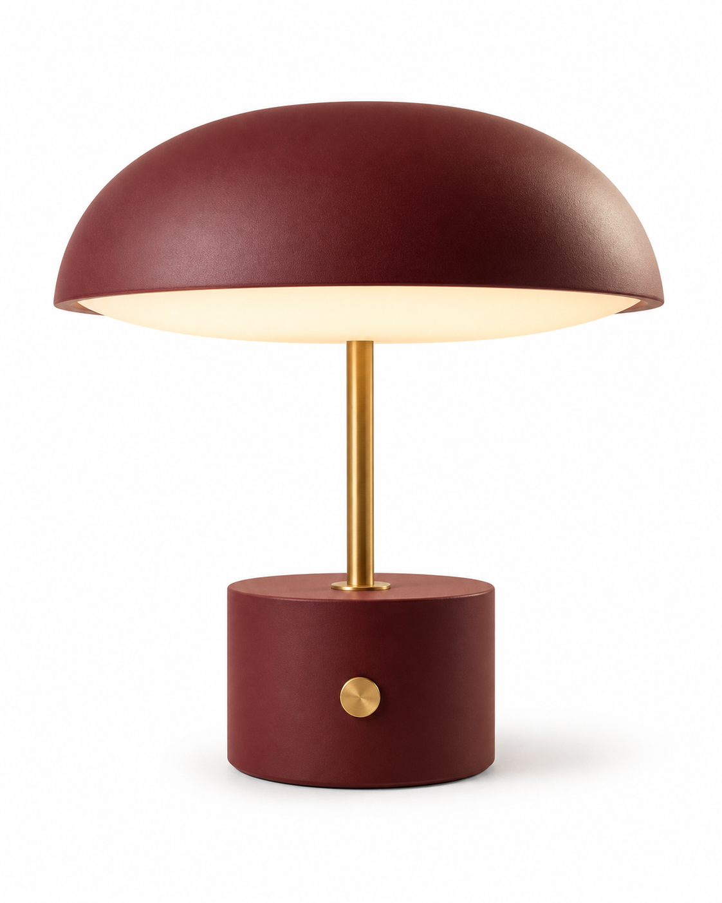
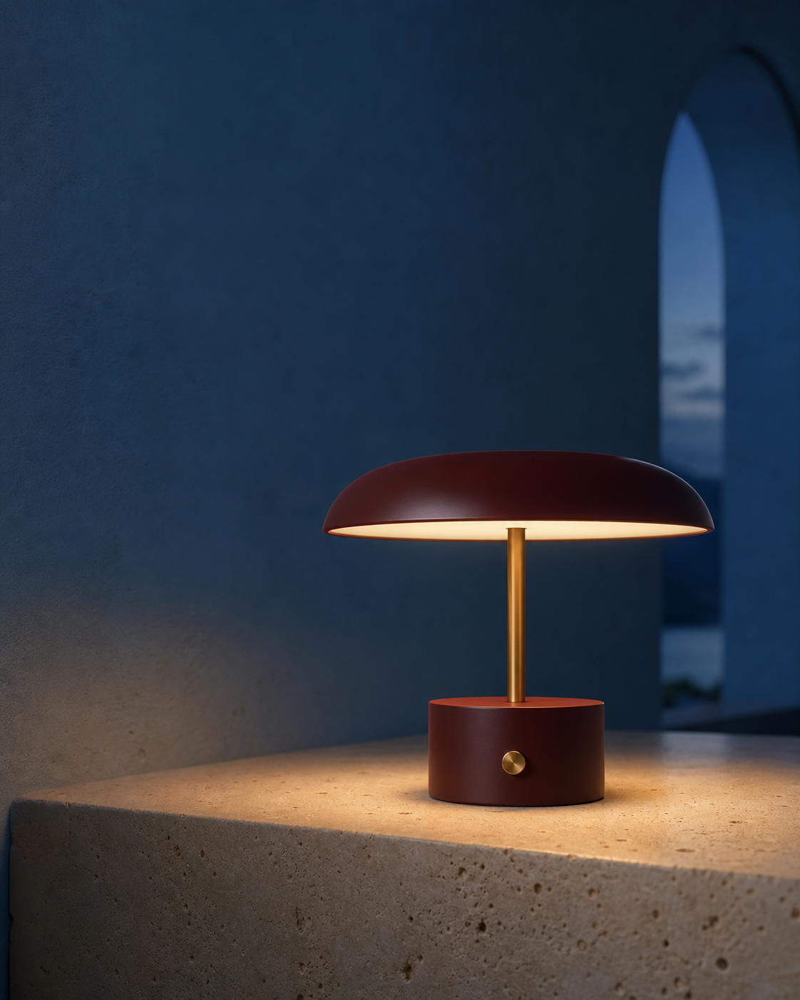
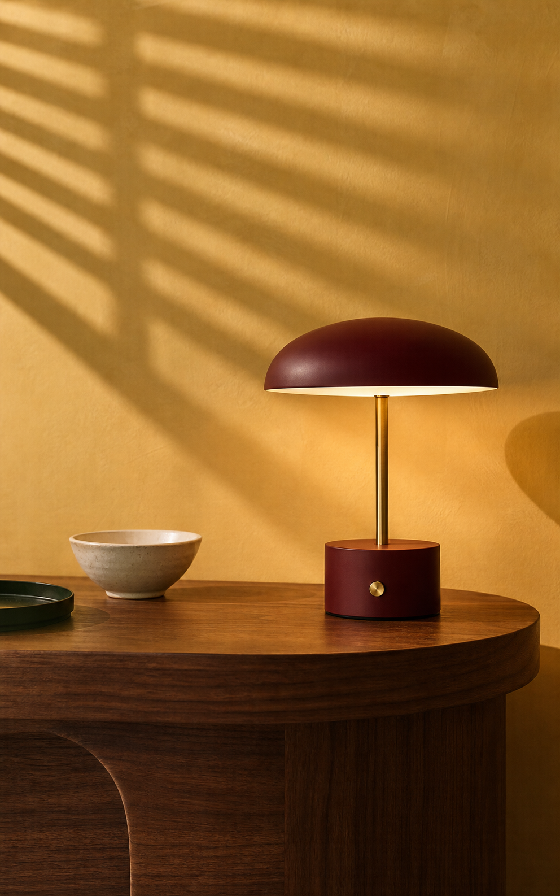
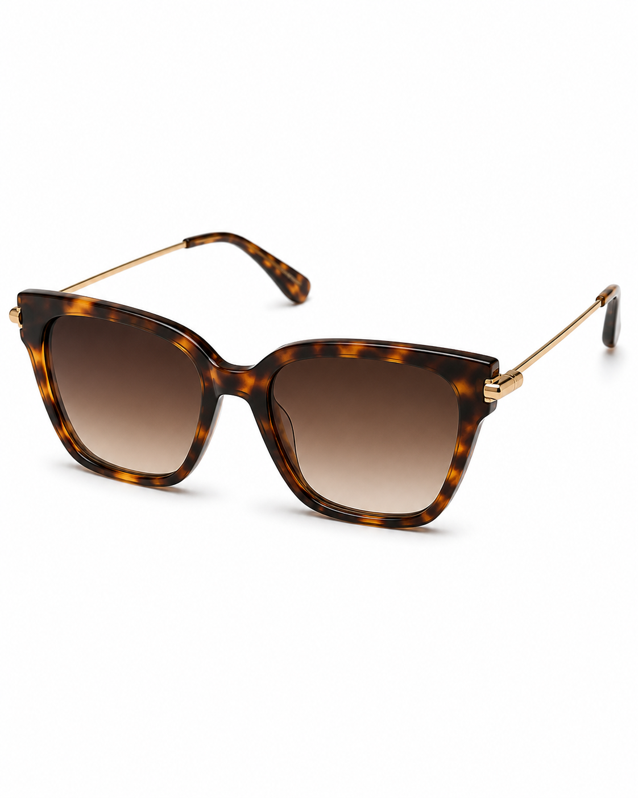
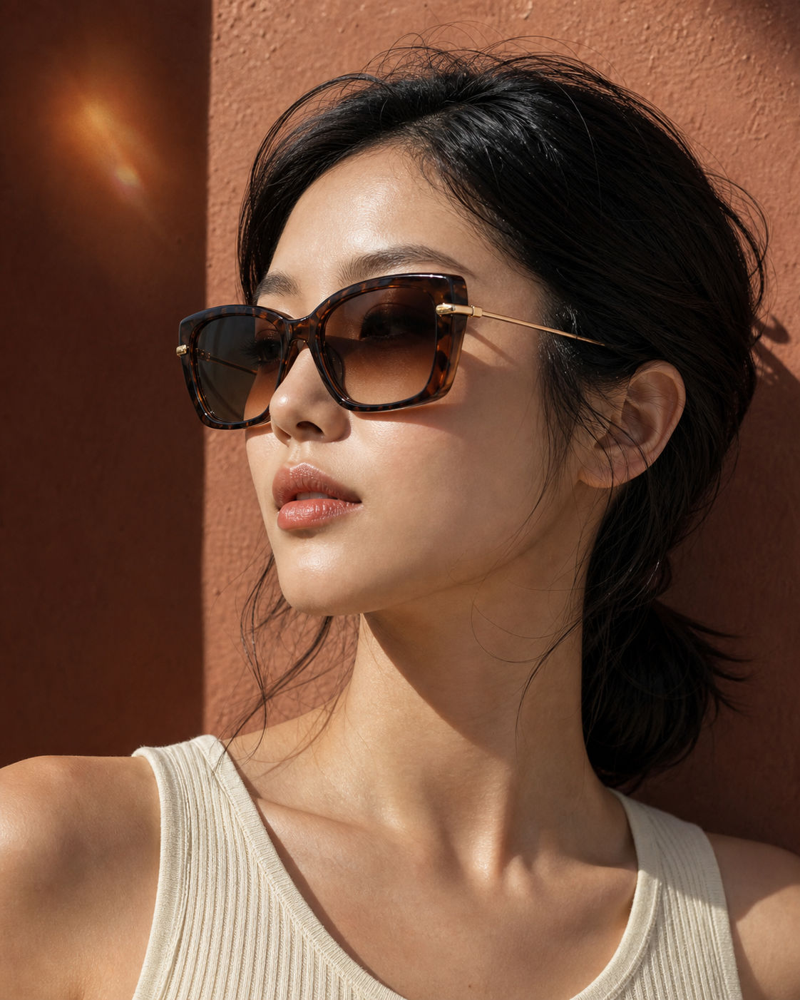
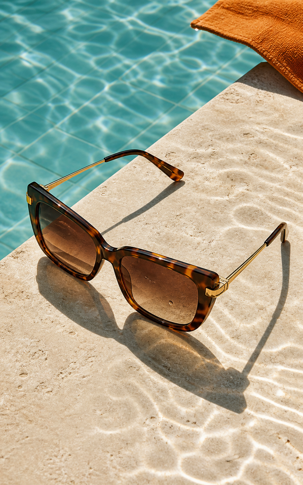

<!-- AUTO-GENERATED FILE. EDIT data/prompts/*.json, data/taxonomy.json, scripts/i18n.mjs, OR scripts/generate-readmes.mjs INSTEAD. -->

# ecommerce-gpt-image-prompts

[](https://github.com/sindresorhus/awesome) [](https://github.com/ecomimagelab/ecommerce-gpt-image-prompts) [](LICENSE) [](https://github.com/ecomimagelab/ecommerce-gpt-image-prompts/actions/workflows/update-readmes.yml) [](docs/CONTRIBUTING.md)

> 面向全球電商的高品質、多語言 GPT Image 2 提示詞庫。

> ⚠️ **版權聲明:** 提示詞和預覽圖均保留記錄中的署名與授權資訊。如你認為某條內容侵犯了你的權利，請申請審核或刪除 [回報內容](https://github.com/ecomimagelab/ecommerce-gpt-image-prompts/issues/new?template=copyright-report.yml).

---

[](README.md) [](README_zh.md) [](README_zh-TW.md) [](README_ja-JP.md) [](README_ko-KR.md) [](README_th-TH.md) [](README_vi-VN.md) [](README_hi-IN.md) [](README_es-ES.md) [](README_es-419.md) [](README_de-DE.md) [](README_fr-FR.md) [](README_it-IT.md) [](README_pt-BR.md) [](README_pt-PT.md) [](README_tr-TR.md)

---

<a id="try-in-pixpix"></a>

## ✨ 在 PixPix 中體驗

[](https://www.pixpix.com/)

**[🚀 開啟 PixPix 立即創作 →](https://www.pixpix.com/)**

將本庫任意提示詞複製到 PixPix，即可生成或編輯電商圖片和影片。

### 為什麼使用 PixPix？

| 功能 | GitHub README | PixPix |
|---|---|---|
| 提示詞庫 | 精選提示詞、預覽圖與清晰署名 | 複製提示詞到創作工作區 |
| AI 生成 | — | AI 圖片和影片工具 |
| 電商工作流程 | 平台、用途和寬高比資料 | 商品套圖與 A+ 內容工作流程 |
| 商品編輯 | 在適用時提供修改前後證據 | 精修、換背景、局部重繪和擴圖工具 |

### 🗂️ 依分類瀏覽

- **商品產業**
  - [汽车配件](#categories-automotive-accessories) · [箱包与配饰](#categories-bags-and-accessories) · [美妆与护肤](#categories-beauty) · [床品与家纺](#categories-bedding-and-textiles) · [消费电子](#categories-consumer-electronics) · [炊具](#categories-cookware) · [骑行](#categories-cycling) · [服装](#categories-fashion) · [健身与健康生活](#categories-fitness-and-wellness) · [食品与饮料](#categories-food-and-beverage) · [鞋履](#categories-footwear) · [园艺与花器](#categories-garden-and-planters) · [家居与家具](#categories-home-and-furniture) · [珠宝](#categories-jewelry) · [厨房电器](#categories-kitchen-appliances) · [户外装备](#categories-outdoor-gear) · [宠物用品](#categories-pet-supplies) · [文具与办公](#categories-stationery-and-office) · [茶饮与杂货](#categories-tea-and-grocery) · [玩具与儿童用品](#categories-toys-and-kids) · [旅行与箱包](#categories-travel-and-luggage) · [腕表](#categories-watches)
- **使用情境**
  - [品牌首图](#usecases-branded-hero) · [生活方式场景](#usecases-lifestyle-scene) · [平台主图](#usecases-main-image) · [目录商品图](#usecases-catalog-image) · [社交电商广告](#usecases-social-ad) · [功能卖点图](#usecases-feature-callout) · [细节与微距](#usecases-detail-macro) · [模特上身](#usecases-on-model)
- **電商平台**
  - [Pinterest](#platforms-pinterest) · [Shopify](#platforms-shopify) · [Amazon](#platforms-amazon) · [Instagram Shop](#platforms-instagram-shop) · [小红书](#platforms-xiaohongshu) · [TikTok Shop](#platforms-tiktok-shop) · [天猫](#platforms-tmall) · [Amazon Home](#platforms-amazon-home) · [Etsy](#platforms-etsy) · [天猫奢品](#platforms-tmall-luxury) · [Amazon Fashion](#platforms-amazon-fashion) · [Wayfair](#platforms-wayfair) · [Amazon A+](#platforms-amazon-a-plus) · [Amazon Grocery](#platforms-amazon-grocery) · [Amazon Sports](#platforms-amazon-sports) · [Best Buy](#platforms-best-buy) · [Chewy](#platforms-chewy) · [Chrono24](#platforms-chrono24) · [迪卡侬](#platforms-decathlon) · [Deliveroo](#platforms-deliveroo) · [DoorDash](#platforms-doordash) · [eBay](#platforms-ebay) · [Farfetch](#platforms-farfetch) · [京东](#platforms-jd) · [美团](#platforms-meituan) · [户外零售](#platforms-outdoor-retail) · [Sephora](#platforms-sephora) · [Shopee](#platforms-shopee) · [Uber Eats](#platforms-uber-eats)

---

<a id="table-of-contents"></a>

## 目錄

- [✨ 在 PixPix 中體驗](#try-in-pixpix)
- [什麼是 ecommerce-gpt-image-prompts？](#what-is-library)
- [統計資料](#statistics)
- [精選提示詞](#featured-prompts)
- [全部提示詞](#all-prompts)
- [如何貢獻](#how-to-contribute)
- [授權](#license)
- [致謝](#acknowledgements)
- [⭐ Star 歷史](#star-history)

---

<a id="what-is-library"></a>

## 什麼是 ecommerce-gpt-image-prompts？

This repository collects reproducible e-commerce image prompts with structured metadata, clear attribution, licensing records, and multiple preview outputs.

每個可見條目都將一條可直接複製的提示詞與該提示詞生成的預覽圖對應展示；生產資料保留在摺疊區域，不打斷以圖片為主的瀏覽節奏。

- **可重現提示詞** — 每張展示的預覽圖都對應其正上方的單圖提示詞。
- **平台原生設計** — Amazon、Shopify、TikTok Shop、Pinterest、天貓等平台保持不同的視覺處理。
- **商品一致性** — 結構化保真項幫助維持輪廓、材質、顏色和可識別的商品身份。
- **預覽證據** — 頁面直接展示高清生成範例，便於視覺審核。
- **版權資料** — 每條內容記錄作者、來源、授權、發布日期和溯源說明。

---

<a id="statistics"></a>

## 統計資料

| 指標 | 數量 |
|---|---:|
| 提示詞總數 | **80** |
| 商品系列 | **27** |
| ⭐ 精選提示詞 | **6** |
| 生成預覽圖 | **80** |
| 商品產業 | **22** |
| Platforms | **29** |
| Last updated | **2026-07-22** |

---

<a id="featured-prompts"></a>

## 精選提示詞

> ⭐ 由團隊精選，重點保證電商視覺品質與提示詞可重現性。

<a id="featured-ec-0022-amazon-home-main-image"></a>

### No. 1: 炊具 — 森林绿珐琅铸铁锅电商套图: AMAZON HOME MAIN IMAGE

  

#### 說明

让同一口森林绿铸铁锅从白底商品图进入地中海静物和真实家庭烹饪场景。

**平台主图 · Amazon Home · 4:5**

#### 提示詞

```text
Create one ultra-photorealistic portrait 4:5 catalog photograph of a fictional unbranded 5-quart round enameled cast-iron Dutch oven. Use a low wide cylindrical body in deep forest-green gloss enamel, warm-cream enamel interior, two short horizontal loop handles, matching heavy lid with three subtle concentric rings and a small domed brushed-brass knob. Lean the lid upright directly behind the open empty pot so the interior and lid are visible; exactly one pot and one matching lid. Use pure #FFFFFF, centered three-quarter view, complete handles and lid, 76% frame fill, broad softbox and controlled enamel highlight. No food, steam, utensils, packaging, text, logo, watermark, extra cookware, detached knob, distorted handles, chips, plastic CGI, collage, or border.
```

#### 生成預覽圖

##### 圖片 1


#### 詳細資料

- **作者:** [Ecommerce GPT Image Prompts Studio](https://github.com/ecomimagelab)
- **來源:** 本倉庫原創內容
- **發布日期:** 2026-07-22
- **語言:** en
- **適用平台:** Amazon Home
- **授權:** CC-BY-4.0

<details>
<summary><strong>生產參數、商品保真項與溯源資訊</strong></summary>

| 生成模式 | 商品產業 | 使用情境 | 寬高比 |
|---|---|---|---|
| `text-to-image` | 炊具 | 平台主图 | 4:5 |

- **視覺風格:** 极简干净, 自然有机, 美食编辑
- **背景類型:** 纯白背景
- **素材用途:** 平台主图
- **輸入要求:** No reference image is required for this fictional cookware design; use product-edit mode for a real SKU.
- **商品保真項:**
  - Preserve the low wide cylindrical cast-iron body, deep forest-green gloss exterior, warm-cream enamel interior, and two short horizontal loop handles.
  - Preserve the matching heavy green lid with three subtle concentric rings and one small domed brushed-brass knob.
- **負面約束:** No words, logos, watermark, extra pot, extra lid, detached knob, distorted handles, impossible geometry, unsafe hand contact, plastic CGI, collage, or border.

**來源與版權**

- Generated specifically for this repository from the recorded standalone prompt; no third-party preview image is redistributed.
- Original prompt and generated previews created for this repository after open-source prompt-pattern research; no external preview asset is included.
- [visual-research](docs/VISUAL_RESEARCH.md)
- [visual-research](https://github.com/wuyoscar/GPT-Image2-Skill)
- **平台規則狀態:** Platform names identify intended visual treatment only; verify current listing and advertising requirements before publication.
- **商品系列:** [ec-0022](data/prompts/ec-0022-forest-cocotte-cookware-set.json)

</details>

**[🚀 立即體驗 →](https://www.pixpix.com/)**

---

<a id="featured-ec-0021-amazon-clean-main-image"></a>

### No. 2: 消费电子 — 午夜蓝无线耳机平台套图: AMAZON CLEAN MAIN IMAGE

  

#### 說明

让同一副午夜蓝耳机在纯白主图、声学功能图和 TikTok Shop 创作者场景中保持清晰一致。

**平台主图 · Amazon · 4:5**

#### 提示詞

```text
Create one ultra-photorealistic portrait 4:5 catalog photograph of a fictional unbranded pair of premium over-ear wireless headphones. Product design: two large rounded-oval matte midnight-navy earcups with shallow concentric bevels, slim bead-blasted natural-aluminum Y-yokes, a broad navy woven-fabric headband with a narrow aluminum center rail, thick charcoal textile memory-foam cushions, and one tiny burnt-orange fabric pull tab beneath the right earcup. Use pure #FFFFFF. Fold the headphones into a graceful three-quarter standing pose with the entire headband and both cushions visible; fill 78% of frame. Use an overhead softbox, precise silver edge highlights and a realistic grounding shadow. No text, logo, watermark, cable, stand, phone, case, extra headphones, separated parts, distorted headband, asymmetric earcups, CGI plastic, collage, or border.
```

#### 生成預覽圖

##### 圖片 1


#### 詳細資料

- **作者:** [Ecommerce GPT Image Prompts Studio](https://github.com/ecomimagelab)
- **來源:** 本倉庫原創內容
- **發布日期:** 2026-07-22
- **語言:** en
- **適用平台:** Amazon
- **授權:** CC-BY-4.0

<details>
<summary><strong>生產參數、商品保真項與溯源資訊</strong></summary>

| 生成模式 | 商品產業 | 使用情境 | 寬高比 |
|---|---|---|---|
| `text-to-image` | 消费电子 | 平台主图 | 4:5 |

- **視覺風格:** 极简干净, 技术表达, 社交原生
- **背景類型:** 纯白背景
- **素材用途:** 平台主图
- **輸入要求:** No reference image is required for this fictional product; edit owned product photography when exact inventory fidelity is required.
- **商品保真項:**
  - Preserve two large rounded-oval matte midnight-navy earcups with shallow concentric bevels and thick charcoal textile cushions.
  - Preserve slim natural-aluminum Y-yokes, the broad navy woven headband with narrow aluminum center rail, and tiny burnt-orange tab beneath the right earcup.
- **負面約束:** No words, letters, logos, watermark, cable, stand, extra headphones, separated parts, malformed headband, asymmetric earcups, exaggerated RGB clutter, CGI plastic, collage, or border.

**來源與版權**

- Generated specifically for this repository from the recorded standalone prompt; no third-party preview image is redistributed.
- Original prompt and generated previews created for this repository after open-source prompt-pattern research; no external preview asset is included.
- [visual-research](docs/VISUAL_RESEARCH.md)
- [visual-research](https://github.com/wuyoscar/GPT-Image2-Skill)
- **平台規則狀態:** Platform names identify intended visual treatment only; verify current listing and advertising requirements before publication.
- **商品系列:** [ec-0021](data/prompts/ec-0021-midnight-headphones-platform-set.json)

</details>

**[🚀 立即體驗 →](https://www.pixpix.com/)**

---

<a id="featured-ec-0020-sephora-clean-catalog"></a>

### No. 3: 美妆与护肤 — 雕塑感石榴红唇膏电商套图: SEPHORA CLEAN CATALOG

  

#### 說明

围绕同一支虚构石榴红唇膏，构建干净目录图、漆面奢华发布图和闪光灯社交大片三种差异化方案。

**目录商品图 · Sephora · 4:5**

#### 提示詞

```text
Create a single ultra-photorealistic portrait 4:5 product photograph of one fictional, unbranded refillable lipstick. The lipstick is open and standing upright at a subtle three-quarter angle. It has a slim rectangular brushed champagne-gold metal case, one narrow deep-burgundy enamel side panel, a fine horizontal seam near the base, and a deep garnet satin lipstick bullet with a pristine sharp slanted tip. Use a seamless warm-ivory cyclorama and low cream lacquer plinth. Center the product lower-middle, fill about 72% of frame height, preserve the complete silhouette, and leave breathing room. Light with a large upper-left softbox, a controlled metal specular strip, delicate burgundy bounce, and soft grounding shadow. Render believable brushed metal, flawless enamel and dense satin wax microtexture. No words, letters, logos, watermark, second lipstick, cap, cosmetic smear, flowers, fruit, hands, floating objects, distorted case, damaged bullet, CGI-plastic look, collage, or border.
```

#### 生成預覽圖

##### 圖片 1


#### 詳細資料

- **作者:** [Ecommerce GPT Image Prompts Studio](https://github.com/ecomimagelab)
- **來源:** 本倉庫原創內容
- **發布日期:** 2026-07-22
- **語言:** en
- **適用平台:** Sephora
- **授權:** CC-BY-4.0

<details>
<summary><strong>生產參數、商品保真項與溯源資訊</strong></summary>

| 生成模式 | 商品產業 | 使用情境 | 寬高比 |
|---|---|---|---|
| `text-to-image` | 美妆与护肤 | 目录商品图 | 4:5 |

- **視覺風格:** 高端奢华, 编辑大片, 暗调氛围
- **背景類型:** 柔光影棚
- **素材用途:** 目录商品图
- **輸入要求:** No reference image is required because the product is fictional; use product-edit mode with owned source photography for real inventory.
- **商品保真項:**
  - Preserve the slim rectangular brushed champagne-gold metal case, narrow deep-burgundy enamel side panel, and fine horizontal seam near the base.
  - Preserve the open deep-garnet satin lipstick bullet with a clean, pristine slanted tip and believable dense wax texture.
- **負面約束:** No words, letters, logos, watermark, extra lipstick, cap, damaged bullet, malformed case, floating product, cheap CGI, collage, frame, or border.

**來源與版權**

- Generated specifically for this repository from the recorded standalone prompt; no third-party preview image is redistributed.
- Original prompt and generated previews created for this repository after open-source prompt-pattern research; no external preview asset is included.
- [visual-research](docs/VISUAL_RESEARCH.md)
- [visual-research](https://github.com/wuyoscar/GPT-Image2-Skill)
- **平台規則狀態:** Platform names identify intended visual treatment only; verify current listing and advertising requirements before publication.
- **商品系列:** [ec-0020](data/prompts/ec-0020-sculptural-garnet-lipstick-set.json)

</details>

**[🚀 立即體驗 →](https://www.pixpix.com/)**

---

<a id="featured-ec-0019-shopify-travertine-hero"></a>

### No. 4: 美妆与护肤 — 商品保真精華液背景改圖工作流程: SHOPIFY TRAVERTINE HERO

  

#### 說明

使用倉庫自有的精華液圖片作為商品身分參考，只改變佈景、燈光與行銷方向，生成 Shopify 與 Instagram Shop 兩種成品。

**品牌首图 · Shopify · 5:8**

#### 提示詞

```text
Edit the supplied serum product image into one standalone premium Shopify product hero, portrait 5:8. Use the supplied image as the product identity reference and edit target. Preserve the serum bottle as closely as possible: the same squat rounded-square clear optical-glass bottle, pale celadon liquid level, heavy clear base, satin warm-ivory pipette cap, blank rectangular ivory label, overall proportions, label size and placement, glass thickness, cap geometry, and celadon color. Remove the water splash and reflective pool completely. Place the bottle upright on a single carved warm-ivory travertine pedestal with subtle natural pores, against a quiet warm limestone-to-cream studio gradient. Add one restrained curved architectural shadow behind the bottle, soft diffused key light from upper left, a controlled glass-edge highlight, a realistic small contact shadow, generous negative space, editorial luxury-skincare art direction, refined natural color, and ultra-photorealistic materials. Human comparison with the reference is required. No text, logo, watermark, flowers, leaves, water, extra bottle, added product features, label distortion, plastic CGI look, collage, split screen, or panel border.
```

#### 生成預覽圖

##### 修改前


##### 圖片 1


#### 詳細資料

- **作者:** Ecommerce GPT Image Prompts Studio
- **來源:** 本倉庫原創內容
- **發布日期:** 2026-07-22
- **語言:** en
- **適用平台:** Shopify
- **授權:** CC-BY-4.0

<details>
<summary><strong>生產參數、商品保真項與溯源資訊</strong></summary>

| 生成模式 | 商品產業 | 使用情境 | 寬高比 |
|---|---|---|---|
| `product-edit` | 美妆与护肤 | 品牌首图 | 5:8 |

- **視覺風格:** 高端奢华, 极简干净, 暗调氛围
- **背景類型:** 天然材质
- **素材用途:** 品牌首图
- **輸入要求:** Provide one front-facing, sufficiently sharp product image that you own or may license publicly; compare the generated bottle, label, color, and proportions with the source before use.
- **商品保真項:**
  - Preserve the squat rounded-square clear optical-glass bottle, pale celadon liquid level, heavy clear base, and overall front-facing proportions.
  - Preserve the satin warm-ivory pipette cap, its rounded top, width, height, and centered alignment.
  - Preserve the blank rectangular ivory label, its size and placement; do not add, distort, or fabricate label text.
  - Preserve the glass thickness and celadon color; do not add product claims, ingredients, certifications, or performance statements.
- **負面約束:** No readable text, logo, watermark, extra bottle, replacement packaging, recoloring, invented feature, malformed label, plastic CGI look, collage, split screen, or panel border.

**來源與版權**

- The Before image was generated for this repository; the After image was produced by editing that local source with the recorded GPT Image 2 prompt.
- Original product-edit workflow and generated examples created specifically for this repository from a repository-owned source image.
- [visual-research](docs/VISUAL_RESEARCH.md)
- **平台規則狀態:** Shopify and Instagram Shop identify the intended creative treatment only; the images do not claim guaranteed platform or advertising approval.
- **商品系列:** [ec-0019](data/prompts/ec-0019-product-faithful-serum-edit-workflow.json)

</details>

**[🚀 立即體驗 →](https://www.pixpix.com/)**

---

<a id="featured-ec-0014-variant-1"></a>

### No. 5: 箱包与配饰 — 牛血红肩背包三场景: FARFETCH CATALOG

  

#### 說明

为同一款雕塑感手袋组合奢品商品图、社交街拍动势和建筑静物摄影。

**目录商品图 · Farfetch · 4:5**

#### 提示詞

```text
Create one standalone 4:5 e-commerce image, not a collage, contact sheet, split screen, or multi-panel layout.
Product specification and invariants: identical compact crescent shoulder bag in this output; deep oxblood pebbled calf leather, softly folded crescent body, one wide matching leather shoulder strap with two brushed silver rectangular buckles, concealed top zipper, three subtle vertical gusset seams, no logo and no charm. Preserve silhouette, strap width, two buckles, seam map, hardware finish and color.
Art direction: bag alone, front three-quarter view on pure #FFFFFF, strap arranged in a clean natural arc, entire product visible, gentle grounding shadow, crisp leather grain and accurate proportions, no props.
Photography and rendering: ultra-photorealistic contemporary luxury fashion photography, authentic pebbled leather, refined hardware reflections, subtle film grain, oxblood/gray/travertine palette, no glossy CGI.
Quality and safety constraints: no readable text, no logos, no watermark, no extra bag, no duplicated strap, no gold hardware, no hands covering the product, no distorted body, no added layout labels or numbers. Keep the exact bag design consistent in this output.
```

#### 生成預覽圖

##### 圖片 1


#### 詳細資料

- **作者:** Ecommerce GPT Image Prompts Studio
- **來源:** 本倉庫原創內容
- **發布日期:** 2026-07-21
- **語言:** en
- **適用平台:** Farfetch
- **授權:** CC-BY-4.0

<details>
<summary><strong>生產參數、商品保真項與溯源資訊</strong></summary>

| 生成模式 | 商品產業 | 使用情境 | 寬高比 |
|---|---|---|---|
| `text-to-image` | 箱包与配饰 | 目录商品图 | 4:5 |

- **視覺風格:** 高端奢华, 编辑大片, 建筑感
- **背景類型:** 纯白背景
- **素材用途:** 目录商品图
- **輸入要求:** No reference image is required. This record defines a fictional, unbranded product; use product-edit mode for real inventory.
- **商品保真項:**
  - identical compact crescent shoulder bag in this output; deep oxblood pebbled calf leather, softly folded crescent body, one wide matching leather shoulder strap with two brushed silver rectangular buckles, concealed top zipper, three subtle vertical gusset seams, no logo and no charm. Preserve silhouette, strap width, two buckles, seam map, hardware finish and color.
- **負面約束:** no readable text, no logos, no watermark, no extra bag, no duplicated strap, no gold hardware, no hands covering the product, no distorted body, no added layout labels or numbers. Keep the exact bag design consistent in this output.

**來源與版權**

- Generated specifically for this repository from the corresponding prompt direction; no third-party preview image is redistributed.
- Original synthesis informed by broad visual research; prompt and generated previews created for this repository. See docs/VISUAL_RESEARCH.md.
- [visual-research](docs/VISUAL_RESEARCH.md)
- **平台規則狀態:** Platform names describe intended art direction only. Verify the current official rules for the product category before publishing.
- **商品系列:** [ec-0014](data/prompts/ec-0014-oxblood-shoulder-bag-triptych.json)

</details>

**[🚀 立即體驗 →](https://www.pixpix.com/)**

---

<a id="featured-ec-0013-variant-1"></a>

### No. 6: 腕表 — 青铜机械腕表三场景: CHRONO24 CATALOG

  

#### 說明

将同一枚青铜机械腕表呈现为收藏级商品图、典礼式发布图和安静的上腕编辑图。

**目录商品图 · Chrono24 · 4:5**

#### 提示詞

```text
Create one standalone 4:5 e-commerce image, not a collage, contact sheet, split screen, or multi-panel layout.
Product specification and invariants: identical watch in this output; 38 mm brushed bronze cushion case, deep moss-green sunray dial, twelve slim applied gold baton hour markers with no numerals, two gold dauphine hands fixed at 10:10, small seconds subdial at 6 o'clock, domed crystal, dark brown suede strap with tonal stitching, no logo and no date window. Preserve case shape, crown position, marker layout, hand style, dial color and strap.
Art direction: watch alone lying flat at a slight diagonal on pure warm white, buckle and most of the strap visible while the lower strap end may meet the frame edge, clean overhead precision, soft contact shadow, accurate proportions, crisp bezel and dial, no props.
Photography and rendering: ultra-photorealistic high-watchmaking photography, physically accurate bronze patina, optical crystal, sunray dial and suede nap, disciplined retouching, rich but natural black point.
Quality and safety constraints: no readable text, no logo, no watermark, no extra watch, no jewelry, no distorted wrist or fingers, no duplicate crown, no incorrect numerals, no added layout labels or numbers. Keep the exact watch design and 10:10 hand position consistent.
```

#### 生成預覽圖

##### 圖片 1


#### 詳細資料

- **作者:** Ecommerce GPT Image Prompts Studio
- **來源:** 本倉庫原創內容
- **發布日期:** 2026-07-21
- **語言:** en
- **適用平台:** Chrono24
- **授權:** CC-BY-4.0

<details>
<summary><strong>生產參數、商品保真項與溯源資訊</strong></summary>

| 生成模式 | 商品產業 | 使用情境 | 寬高比 |
|---|---|---|---|
| `text-to-image` | 腕表 | 目录商品图 | 4:5 |

- **視覺風格:** 高端奢华, 暗调氛围, 编辑大片
- **背景類型:** 柔光影棚
- **素材用途:** 目录商品图
- **輸入要求:** No reference image is required. This record defines a fictional, unbranded product; use product-edit mode for real inventory.
- **商品保真項:**
  - identical watch in this output; 38 mm brushed bronze cushion case, deep moss-green sunray dial, twelve slim applied gold baton hour markers with no numerals, two gold dauphine hands fixed at 10:10, small seconds subdial at 6 o'clock, domed crystal, dark brown suede strap with tonal stitching, no logo and no date window. Preserve case shape, crown position, marker layout, hand style, dial color and strap.
- **負面約束:** no readable text, no logo, no watermark, no extra watch, no jewelry, no distorted wrist or fingers, no duplicate crown, no incorrect numerals, no added layout labels or numbers. Keep the exact watch design and 10:10 hand position consistent.

**來源與版權**

- Generated specifically for this repository from the corresponding prompt direction; no third-party preview image is redistributed.
- Original synthesis informed by broad visual research; prompt and generated previews created for this repository. See docs/VISUAL_RESEARCH.md.
- [visual-research](docs/VISUAL_RESEARCH.md)
- **平台規則狀態:** Platform names describe intended art direction only. Verify the current official rules for the product category before publishing.
- **商品系列:** [ec-0013](data/prompts/ec-0013-bronze-mechanical-watch-triptych.json)

</details>

**[🚀 立即體驗 →](https://www.pixpix.com/)**

---

<a id="all-prompts"></a>

## 全部提示詞

> 按發布日期由新到舊排列。

<a id="categories-home-and-furniture"></a>

<a id="usecases-main-image"></a>

<a id="platforms-amazon-home"></a>

<a id="platforms-shopify"></a>

<a id="platforms-pinterest"></a>

<a id="prompt-ec-0027-amazon-home-clean-catalog"></a>

### No. 1: 家居与家具 — 牛血红便携台灯多平台套图: AMAZON HOME CLEAN CATALOG

 

#### 說明

让同一盏牛血红与黄铜便携台灯分别呈现为 Amazon Home 白底图、Shopify 蓝调英雄图和 Pinterest 阳光家居静物。

**平台主图 · Amazon Home · 4:5**

#### 提示詞

```text
Create one ultra-photorealistic portrait 4:5 catalog photograph of one fictional unbranded rechargeable table lamp. Product design: a low flattened dome shade in matte oxblood-red powder-coated aluminum, a warm opal-glass diffuser visible underneath, one slender satin-brass stem, and a compact straight-sided cylindrical oxblood base with one small circular satin-brass dimmer button centered on the front. The dome diameter is about 1.55 times the base diameter; the lamp has no visible cord, seam, logo, or vent. Show exactly one complete lamp, switched on at a gentle warm 2700K glow, standing centered in a subtle front three-quarter view on seamless pure #FFFFFF. Keep the entire shade, diffuser, stem, base and button visible, filling about 76% of frame. Use a broad high-key softbox, a precise champagne edge highlight, honest matte-metal texture, and one restrained soft grounding shadow. No furniture, props, text, logo, watermark, cable, plug, duplicate lamp, floating shade, crooked stem, extra button, distorted base, harsh bloom, CGI plastic, collage, or border.
```

#### 生成預覽圖

##### 圖片 1



#### 詳細資料

- **作者:** [Ecommerce GPT Image Prompts Studio](https://github.com/ecomimagelab)
- **來源:** 本倉庫原創內容
- **發布日期:** 2026-07-22
- **語言:** en
- **適用平台:** Amazon Home
- **授權:** CC-BY-4.0

<details>
<summary><strong>生產參數、商品保真項與溯源資訊</strong></summary>

| 生成模式 | 商品產業 | 使用情境 | 寬高比 |
|---|---|---|---|
| `text-to-image` | 家居与家具 | 平台主图 | 4:5 |

- **視覺風格:** 极简干净, 建筑感, 编辑大片
- **背景類型:** 纯白背景
- **素材用途:** 平台主图
- **輸入要求:** No reference image is required for this fictional lamp; use product-edit mode with a sharp front product image when adapting a real SKU.
- **商品保真項:**
  - Preserve the low flattened dome shade in matte oxblood-red aluminum and warm opal-glass diffuser visible underneath.
  - Preserve one slender satin-brass stem and the compact straight-sided oxblood cylindrical base with a single centered circular brass dimmer.
- **負面約束:** No readable text, logos, watermark, visible cable, plug, duplicate lamp, floating shade, crooked stem, extra button, distorted base, harsh bloom, CGI plastic, collage, or border.

**來源與版權**

- Generated specifically for this repository from the recorded standalone prompt; no third-party preview image is redistributed.
- Original prompt and generated previews created for this repository after Pinterest pattern and open-source workflow research; no external preview asset is included.
- [visual-research](docs/VISUAL_RESEARCH.md)
- [visual-research](https://github.com/buluslan/gpt-image2-ecommerce)
- [visual-research](https://github.com/motiful/product-shots)
- **平台規則狀態:** Platform names identify intended visual treatment only; verify current listing and advertising requirements before publication.
- **商品系列:** [ec-0027](data/prompts/ec-0027-oxblood-portable-lamp-platform-set.json)

</details>

**[🚀 立即體驗 →](https://www.pixpix.com/)**

---

<a id="usecases-branded-hero"></a>

<a id="prompt-ec-0027-shopify-blue-hour-hero"></a>

### No. 2: 家居与家具 — 牛血红便携台灯多平台套图: SHOPIFY BLUE-HOUR HERO

 

#### 說明

让同一盏牛血红与黄铜便携台灯分别呈现为 Amazon Home 白底图、Shopify 蓝调英雄图和 Pinterest 阳光家居静物。

**品牌首图 · Shopify · 4:5**

#### 提示詞

```text
Create one cinematic ultra-photorealistic portrait 4:5 Shopify hero photograph of one fictional unbranded rechargeable table lamp. Preserve this exact product design: a low flattened dome shade in matte oxblood-red powder-coated aluminum, a warm opal-glass diffuser visible underneath, one slender satin-brass stem, and a compact straight-sided cylindrical oxblood base with one small circular satin-brass dimmer button centered on the front. The dome diameter is about 1.55 times the base diameter; there is no visible cord, seam, logo, or vent. Place exactly one complete lamp, switched on at 2700K, on a monolithic pale limestone side table in a minimal blue-hour interior. Frame it from a low three-quarter angle against a deep mineral-blue plaster wall with one soft arched opening far behind. Let the warm pool of light reveal stone pores while cool dusk washes the wall; add a precise brass rim highlight and sophisticated oxblood–cobalt contrast. Leave controlled negative space above and to the left for optional layout, but include no actual copy. No text, logo, watermark, cable, plug, duplicate lamp, vase, books, flowers, person, floating shade, crooked stem, extra button, harsh bloom, CGI plastic, collage, or border.
```

#### 生成預覽圖

##### 圖片 1



#### 詳細資料

- **作者:** [Ecommerce GPT Image Prompts Studio](https://github.com/ecomimagelab)
- **來源:** 本倉庫原創內容
- **發布日期:** 2026-07-22
- **語言:** en
- **適用平台:** Shopify
- **授權:** CC-BY-4.0

<details>
<summary><strong>生產參數、商品保真項與溯源資訊</strong></summary>

| 生成模式 | 商品產業 | 使用情境 | 寬高比 |
|---|---|---|---|
| `text-to-image` | 家居与家具 | 品牌首图 | 4:5 |

- **視覺風格:** 极简干净, 建筑感, 编辑大片
- **背景類型:** 家居空间
- **素材用途:** 品牌首图
- **輸入要求:** No reference image is required for this fictional lamp; use product-edit mode with a sharp front product image when adapting a real SKU.
- **商品保真項:**
  - Preserve the low flattened dome shade in matte oxblood-red aluminum and warm opal-glass diffuser visible underneath.
  - Preserve one slender satin-brass stem and the compact straight-sided oxblood cylindrical base with a single centered circular brass dimmer.
- **負面約束:** No readable text, logos, watermark, visible cable, plug, duplicate lamp, floating shade, crooked stem, extra button, distorted base, harsh bloom, CGI plastic, collage, or border.

**來源與版權**

- Generated specifically for this repository from the recorded standalone prompt; no third-party preview image is redistributed.
- Original prompt and generated previews created for this repository after Pinterest pattern and open-source workflow research; no external preview asset is included.
- [visual-research](docs/VISUAL_RESEARCH.md)
- [visual-research](https://github.com/buluslan/gpt-image2-ecommerce)
- [visual-research](https://github.com/motiful/product-shots)
- **平台規則狀態:** Platform names identify intended visual treatment only; verify current listing and advertising requirements before publication.
- **商品系列:** [ec-0027](data/prompts/ec-0027-oxblood-portable-lamp-platform-set.json)

</details>

**[🚀 立即體驗 →](https://www.pixpix.com/)**

---

<a id="usecases-lifestyle-scene"></a>

<a id="prompt-ec-0027-pinterest-midcentury-still-life"></a>

### No. 3: 家居与家具 — 牛血红便携台灯多平台套图: PINTEREST MID-CENTURY STILL LIFE

 

#### 說明

让同一盏牛血红与黄铜便携台灯分别呈现为 Amazon Home 白底图、Shopify 蓝调英雄图和 Pinterest 阳光家居静物。

**生活方式场景 · Pinterest · 5:8**

#### 提示詞

```text
Create one ultra-photorealistic portrait 5:8 Pinterest interior-editorial still life featuring one fictional unbranded rechargeable table lamp. Preserve this exact product design: a low flattened dome shade in matte oxblood-red powder-coated aluminum, a warm opal-glass diffuser visible underneath, one slender satin-brass stem, and a compact straight-sided cylindrical oxblood base with one small circular satin-brass dimmer button centered on the front. The dome diameter is about 1.55 times the base diameter; there is no visible cord, seam, logo, or vent. Place exactly one complete lamp, switched on at a restrained 2700K glow, near the right third of a sculptural smoked-walnut console. Build a refined mid-century color story with a muted butter-yellow limewash wall, one low hand-thrown ivory ceramic bowl, and the edge of one forest-green lacquer tray; keep both props well separated from the lamp. Use late-afternoon side sun through slatted blinds to cast long graphic shadows, balanced by the warm lamp pool. Shoot slightly above table height with tactile walnut grain, honest matte metal, crisp brass, layered negative space, and save-worthy magazine art direction. No readable text, logo, watermark, cable, plug, duplicate lamp, books, flowers, people, extra buttons, floating shade, crooked stem, clutter, harsh bloom, CGI plastic, collage, or border.
```

#### 生成預覽圖

##### 圖片 1



#### 詳細資料

- **作者:** [Ecommerce GPT Image Prompts Studio](https://github.com/ecomimagelab)
- **來源:** 本倉庫原創內容
- **發布日期:** 2026-07-22
- **語言:** en
- **適用平台:** Pinterest
- **授權:** CC-BY-4.0

<details>
<summary><strong>生產參數、商品保真項與溯源資訊</strong></summary>

| 生成模式 | 商品產業 | 使用情境 | 寬高比 |
|---|---|---|---|
| `text-to-image` | 家居与家具 | 生活方式场景 | 5:8 |

- **視覺風格:** 极简干净, 建筑感, 编辑大片
- **背景類型:** 家居空间
- **素材用途:** 社交创意
- **輸入要求:** No reference image is required for this fictional lamp; use product-edit mode with a sharp front product image when adapting a real SKU.
- **商品保真項:**
  - Preserve the low flattened dome shade in matte oxblood-red aluminum and warm opal-glass diffuser visible underneath.
  - Preserve one slender satin-brass stem and the compact straight-sided oxblood cylindrical base with a single centered circular brass dimmer.
- **負面約束:** No readable text, logos, watermark, visible cable, plug, duplicate lamp, floating shade, crooked stem, extra button, distorted base, harsh bloom, CGI plastic, collage, or border.

**來源與版權**

- Generated specifically for this repository from the recorded standalone prompt; no third-party preview image is redistributed.
- Original prompt and generated previews created for this repository after Pinterest pattern and open-source workflow research; no external preview asset is included.
- [visual-research](docs/VISUAL_RESEARCH.md)
- [visual-research](https://github.com/buluslan/gpt-image2-ecommerce)
- [visual-research](https://github.com/motiful/product-shots)
- **平台規則狀態:** Platform names identify intended visual treatment only; verify current listing and advertising requirements before publication.
- **商品系列:** [ec-0027](data/prompts/ec-0027-oxblood-portable-lamp-platform-set.json)

</details>

**[🚀 立即體驗 →](https://www.pixpix.com/)**

---

<a id="categories-bags-and-accessories"></a>

<a id="platforms-amazon-fashion"></a>

<a id="platforms-xiaohongshu"></a>

<a id="prompt-ec-0026-amazon-fashion-clean-catalog"></a>

### No. 4: 箱包与配饰 — 玳瑁太阳镜多平台套图: AMAZON FASHION CLEAN CATALOG

 

#### 說明

让同一副高级玳瑁镜框分别呈现为 Amazon 白底商品图、小红书阳光时装片和 Pinterest 泳池静物。

**平台主图 · Amazon Fashion · 4:5**

#### 提示詞

```text
Create one ultra-photorealistic portrait 4:5 catalog photograph of one fictional unbranded pair of premium sunglasses. Product design: translucent warm tortoiseshell acetate with subtle amber and espresso marbling, a softly upswept geometric rectangular silhouette, thick 8 mm bevelled rims, smoke-brown gradient lenses, slim champagne-gold metal temples, and one small cylindrical champagne hinge on each side. Exactly one pair, opened at a natural 110-degree temple angle in a front three-quarter view, centered and completely visible. Use a seamless pure #FFFFFF background, broad high-key softbox light, a narrow edge highlight through the translucent acetate, crisp optical-grade reflections, and one restrained soft grounding shadow. The frame should fill about 72% of the image and read as premium real eyewear photography. No case, packaging, text, logo, watermark, duplicate glasses, extra lens, bent temple, malformed hinge, opaque plastic, face, hands, colored backdrop, CGI look, collage, or border.
```

#### 生成預覽圖

##### 圖片 1



#### 詳細資料

- **作者:** [Ecommerce GPT Image Prompts Studio](https://github.com/ecomimagelab)
- **來源:** 本倉庫原創內容
- **發布日期:** 2026-07-22
- **語言:** en
- **適用平台:** Amazon Fashion
- **授權:** CC-BY-4.0

<details>
<summary><strong>生產參數、商品保真項與溯源資訊</strong></summary>

| 生成模式 | 商品產業 | 使用情境 | 寬高比 |
|---|---|---|---|
| `text-to-image` | 箱包与配饰 | 平台主图 | 4:5 |

- **視覺風格:** 极简干净, 社交原生, 编辑大片
- **背景類型:** 纯白背景
- **素材用途:** 平台主图
- **輸入要求:** No reference image is required for this fictional eyewear design; use product-edit mode with sharp front and temple references for a real SKU.
- **商品保真項:**
  - Preserve the translucent warm tortoiseshell acetate with subtle amber and espresso marbling, upswept geometric rectangular silhouette, and thick 8 mm bevelled rims.
  - Preserve the smoke-brown gradient lenses, slim champagne-gold temples, and one small cylindrical champagne hinge on each side.
- **負面約束:** No readable text, logos, watermark, extra glasses, duplicate lenses, malformed hinge, bent temple, warped frame, opaque plastic, CGI look, collage, or border.

**來源與版權**

- Generated specifically for this repository from the recorded standalone prompt; no third-party preview image is redistributed.
- Original prompt and generated previews created for this repository after Pinterest pattern and open-source workflow research; no external preview asset is included.
- [visual-research](docs/VISUAL_RESEARCH.md)
- [visual-research](https://github.com/buluslan/gpt-image2-ecommerce)
- [visual-research](https://github.com/motiful/product-shots)
- **平台規則狀態:** Platform names identify intended visual treatment only; verify current listing and advertising requirements before publication.
- **商品系列:** [ec-0026](data/prompts/ec-0026-tortoiseshell-sunglasses-platform-set.json)

</details>

**[🚀 立即體驗 →](https://www.pixpix.com/)**

---

<a id="usecases-on-model"></a>

<a id="prompt-ec-0026-xiaohongshu-sunlit-fashion"></a>

### No. 5: 箱包与配饰 — 玳瑁太阳镜多平台套图: XIAOHONGSHU SUNLIT FASHION

 

#### 說明

让同一副高级玳瑁镜框分别呈现为 Amazon 白底商品图、小红书阳光时装片和 Pinterest 泳池静物。

**模特上身 · 小红书 · 4:5**

#### 提示詞

```text
Create one ultra-photorealistic portrait 4:5 social-commerce fashion photograph featuring one fictional unbranded pair of premium sunglasses. Product design must remain clear: translucent warm tortoiseshell acetate with subtle amber and espresso marbling, a softly upswept geometric rectangular silhouette, thick 8 mm bevelled rims, smoke-brown gradient lenses, slim champagne-gold metal temples, and one small cylindrical champagne hinge on each side. One adult East Asian woman wears the sunglasses; crop from forehead to collarbone at a confident three-quarter angle, with no hands in frame. Style her in a simple ivory ribbed sleeveless top with natural skin texture and understated makeup. Place her against a matte burnt-coral stucco wall under hard late-afternoon summer sunlight, creating one elegant architectural shadow and a small warm lens flare. Keep the frame, lenses, visible hinge and temple tack sharp; use premium fashion-editorial color, controlled contrast, and spontaneous Xiaohongshu energy. No readable text, logos, watermark, extra glasses, hat, jewelry, hand, duplicate face, distorted ear, warped frame, opaque black lenses, beauty-filter skin, CGI look, collage, or border.
```

#### 生成預覽圖

##### 圖片 1



#### 詳細資料

- **作者:** [Ecommerce GPT Image Prompts Studio](https://github.com/ecomimagelab)
- **來源:** 本倉庫原創內容
- **發布日期:** 2026-07-22
- **語言:** en
- **適用平台:** 小红书
- **授權:** CC-BY-4.0

<details>
<summary><strong>生產參數、商品保真項與溯源資訊</strong></summary>

| 生成模式 | 商品產業 | 使用情境 | 寬高比 |
|---|---|---|---|
| `text-to-image` | 箱包与配饰 | 模特上身 | 4:5 |

- **視覺風格:** 极简干净, 社交原生, 编辑大片
- **背景類型:** 生活方式实景
- **素材用途:** 社交创意
- **輸入要求:** No reference image is required for this fictional eyewear design; use product-edit mode with sharp front and temple references for a real SKU.
- **商品保真項:**
  - Preserve the translucent warm tortoiseshell acetate with subtle amber and espresso marbling, upswept geometric rectangular silhouette, and thick 8 mm bevelled rims.
  - Preserve the smoke-brown gradient lenses, slim champagne-gold temples, and one small cylindrical champagne hinge on each side.
- **負面約束:** No readable text, logos, watermark, extra glasses, duplicate lenses, malformed hinge, bent temple, warped frame, opaque plastic, CGI look, collage, or border.

**來源與版權**

- Generated specifically for this repository from the recorded standalone prompt; no third-party preview image is redistributed.
- Original prompt and generated previews created for this repository after Pinterest pattern and open-source workflow research; no external preview asset is included.
- [visual-research](docs/VISUAL_RESEARCH.md)
- [visual-research](https://github.com/buluslan/gpt-image2-ecommerce)
- [visual-research](https://github.com/motiful/product-shots)
- **平台規則狀態:** Platform names identify intended visual treatment only; verify current listing and advertising requirements before publication.
- **商品系列:** [ec-0026](data/prompts/ec-0026-tortoiseshell-sunglasses-platform-set.json)

</details>

**[🚀 立即體驗 →](https://www.pixpix.com/)**

---

<a id="prompt-ec-0026-pinterest-poolside-editorial"></a>

### No. 6: 箱包与配饰 — 玳瑁太阳镜多平台套图: PINTEREST POOLSIDE EDITORIAL

 

#### 說明

让同一副高级玳瑁镜框分别呈现为 Amazon 白底商品图、小红书阳光时装片和 Pinterest 泳池静物。

**品牌首图 · Pinterest · 5:8**

#### 提示詞

```text
Create one ultra-photorealistic portrait 5:8 Pinterest editorial still life of one fictional unbranded pair of premium sunglasses. Product design: translucent warm tortoiseshell acetate with subtle amber and espresso marbling, a softly upswept geometric rectangular silhouette, thick 8 mm bevelled rims, smoke-brown gradient lenses, slim champagne-gold metal temples, and one small cylindrical champagne hinge on each side. Place exactly one open pair diagonally across the meeting edge of pale aqua glazed pool tile and honed cream travertine; both lenses, the upswept frame, one hinge and both temples must read clearly. Add moving turquoise water caustics across the stone and one narrow folded edge of a burnt-orange linen towel entering from the upper corner, never touching or obscuring the glasses. Use direct Mediterranean noon sun, sharp graphic shadows, micro-drops on one lens edge, refined aqua–amber color harmony, abundant negative space, and save-worthy luxury travel-editorial art direction. No pool logo, readable text, watermark, case, packaging, duplicate glasses, shells, plants, cocktails, hand, face, warped frame, extra lens, opaque plastic, CGI look, collage, or border.
```

#### 生成預覽圖

##### 圖片 1



#### 詳細資料

- **作者:** [Ecommerce GPT Image Prompts Studio](https://github.com/ecomimagelab)
- **來源:** 本倉庫原創內容
- **發布日期:** 2026-07-22
- **語言:** en
- **適用平台:** Pinterest
- **授權:** CC-BY-4.0

<details>
<summary><strong>生產參數、商品保真項與溯源資訊</strong></summary>

| 生成模式 | 商品產業 | 使用情境 | 寬高比 |
|---|---|---|---|
| `text-to-image` | 箱包与配饰 | 品牌首图 | 5:8 |

- **視覺風格:** 极简干净, 社交原生, 编辑大片
- **背景類型:** 天然材质
- **素材用途:** 社交创意
- **輸入要求:** No reference image is required for this fictional eyewear design; use product-edit mode with sharp front and temple references for a real SKU.
- **商品保真項:**
  - Preserve the translucent warm tortoiseshell acetate with subtle amber and espresso marbling, upswept geometric rectangular silhouette, and thick 8 mm bevelled rims.
  - Preserve the smoke-brown gradient lenses, slim champagne-gold temples, and one small cylindrical champagne hinge on each side.
- **負面約束:** No readable text, logos, watermark, extra glasses, duplicate lenses, malformed hinge, bent temple, warped frame, opaque plastic, CGI look, collage, or border.

**來源與版權**

- Generated specifically for this repository from the recorded standalone prompt; no third-party preview image is redistributed.
- Original prompt and generated previews created for this repository after Pinterest pattern and open-source workflow research; no external preview asset is included.
- [visual-research](docs/VISUAL_RESEARCH.md)
- [visual-research](https://github.com/buluslan/gpt-image2-ecommerce)
- [visual-research](https://github.com/motiful/product-shots)
- **平台規則狀態:** Platform names identify intended visual treatment only; verify current listing and advertising requirements before publication.
- **商品系列:** [ec-0026](data/prompts/ec-0026-tortoiseshell-sunglasses-platform-set.json)

</details>

**[🚀 立即體驗 →](https://www.pixpix.com/)**

---

<a id="categories-stationery-and-office"></a>

<a id="usecases-catalog-image"></a>

<a id="platforms-tmall"></a>

<a id="platforms-etsy"></a>

<a id="prompt-ec-0025-tmall-luxury-catalog"></a>

### No. 7: 文具与办公 — 切面玉绿色钢笔电商套图: TMALL LUXURY CATALOG

 

#### 說明

以半透明树脂和精密黄铜区分干净商品微距、Etsy 手作溯源和雨天书写仪式。

**目录商品图 · 天猫 · 4:5**

#### 提示詞

```text
Create one ultra-photorealistic portrait 4:5 product photograph of a fictional unbranded fountain pen. Product design: gently faceted twelve-sided deep-jade translucent resin barrel and matching cap, brushed warm-brass straight clip, two thin brass cap bands, brushed brass grip and one dark ruthenium steel nib with fine geometric engraved lines but no symbol or lettering. Exactly one pen and one cap. Use a warm off-white seamless studio and one thin horizontal brushed-brass display rail. Lay the uncapped pen diagonally across the rail with nib pointing lower left; place the cap parallel behind it. Keep the full barrel, nib, clip and cap visible. Use a large softbox and narrow edge light revealing translucent jade depth. No text, logos, watermark, ink bottle, paper, extra pen, duplicate cap, floating pieces, malformed nib, bent clip, ink stains, CGI look, collage, or border.
```

#### 生成預覽圖

##### 圖片 1


#### 詳細資料

- **作者:** [Ecommerce GPT Image Prompts Studio](https://github.com/ecomimagelab)
- **來源:** 本倉庫原創內容
- **發布日期:** 2026-07-22
- **語言:** en
- **適用平台:** 天猫
- **授權:** CC-BY-4.0

<details>
<summary><strong>生產參數、商品保真項與溯源資訊</strong></summary>

| 生成模式 | 商品產業 | 使用情境 | 寬高比 |
|---|---|---|---|
| `text-to-image` | 文具与办公 | 目录商品图 | 4:5 |

- **視覺風格:** 高端奢华, 手作质感, 静谧生活
- **背景類型:** 柔光影棚
- **素材用途:** 目录商品图
- **輸入要求:** No reference image is required for this fictional pen; use a sharp licensed product reference for real nib and clip fidelity.
- **商品保真項:**
  - Preserve the gently faceted twelve-sided deep-jade translucent resin barrel and matching cap.
  - Preserve the straight brushed-brass clip, two thin brass cap bands, brass grip, and dark ruthenium nib with nonverbal geometric lines.
- **負面約束:** No readable text, letters, logos, watermark, extra pen, duplicate cap, malformed nib, bent clip, gemstone look, ink spill, CGI plastic, collage, or border.

**來源與版權**

- Generated specifically for this repository from the recorded standalone prompt; no third-party preview image is redistributed.
- Original prompt and generated previews created for this repository after open-source prompt-pattern research; no external preview asset is included.
- [visual-research](docs/VISUAL_RESEARCH.md)
- [visual-research](https://github.com/wuyoscar/GPT-Image2-Skill)
- **平台規則狀態:** Platform names identify intended visual treatment only; verify current listing and advertising requirements before publication.
- **商品系列:** [ec-0025](data/prompts/ec-0025-jade-fountain-pen-set.json)

</details>

**[🚀 立即體驗 →](https://www.pixpix.com/)**

---

<a id="usecases-detail-macro"></a>

<a id="prompt-ec-0025-etsy-maker-provenance"></a>

### No. 8: 文具与办公 — 切面玉绿色钢笔电商套图: ETSY MAKER PROVENANCE

 

#### 說明

以半透明树脂和精密黄铜区分干净商品微距、Etsy 手作溯源和雨天书写仪式。

**细节与微距 · Etsy · 5:8**

#### 提示詞

```text
Create one tactile portrait 5:8 editorial photograph of the same fictional fountain pen. Preserve the twelve-sided deep-jade translucent resin barrel and cap, straight brushed-brass clip, two thin brass cap bands, brushed-brass grip and dark ruthenium nib with nonverbal geometric engraving. Set it on a small craftsperson's walnut workbench with one worn linen pad, one restrained curled brass shaving and a single faceted jade-resin blank in soft background. Rest the complete uncapped pen diagonally on the linen; put the matching cap beside it with clip facing camera. Use warm north-window light and one cool workshop rim. Render walnut pores, frayed linen, resin facets, micro-scratched brass and crisp steel. No text, logos, watermark, human, extra finished pen, extra cap, scattered tools, gemstones, malformed nib, fake antique filter, CGI look, collage, or border.
```

#### 生成預覽圖

##### 圖片 1


#### 詳細資料

- **作者:** [Ecommerce GPT Image Prompts Studio](https://github.com/ecomimagelab)
- **來源:** 本倉庫原創內容
- **發布日期:** 2026-07-22
- **語言:** en
- **適用平台:** Etsy
- **授權:** CC-BY-4.0

<details>
<summary><strong>生產參數、商品保真項與溯源資訊</strong></summary>

| 生成模式 | 商品產業 | 使用情境 | 寬高比 |
|---|---|---|---|
| `text-to-image` | 文具与办公 | 细节与微距 | 5:8 |

- **視覺風格:** 高端奢华, 手作质感, 静谧生活
- **背景類型:** 天然材质
- **素材用途:** 品牌首图
- **輸入要求:** No reference image is required for this fictional pen; use a sharp licensed product reference for real nib and clip fidelity.
- **商品保真項:**
  - Preserve the gently faceted twelve-sided deep-jade translucent resin barrel and matching cap.
  - Preserve the straight brushed-brass clip, two thin brass cap bands, brass grip, and dark ruthenium nib with nonverbal geometric lines.
- **負面約束:** No readable text, letters, logos, watermark, extra pen, duplicate cap, malformed nib, bent clip, gemstone look, ink spill, CGI plastic, collage, or border.

**來源與版權**

- Generated specifically for this repository from the recorded standalone prompt; no third-party preview image is redistributed.
- Original prompt and generated previews created for this repository after open-source prompt-pattern research; no external preview asset is included.
- [visual-research](docs/VISUAL_RESEARCH.md)
- [visual-research](https://github.com/wuyoscar/GPT-Image2-Skill)
- **平台規則狀態:** Platform names identify intended visual treatment only; verify current listing and advertising requirements before publication.
- **商品系列:** [ec-0025](data/prompts/ec-0025-jade-fountain-pen-set.json)

</details>

**[🚀 立即體驗 →](https://www.pixpix.com/)**

---

<a id="prompt-ec-0025-xiaohongshu-rain-day-writing"></a>

### No. 9: 文具与办公 — 切面玉绿色钢笔电商套图: XIAOHONGSHU RAIN-DAY WRITING

 

#### 說明

以半透明树脂和精密黄铜区分干净商品微距、Etsy 手作溯源和雨天书写仪式。

**生活方式场景 · 小红书 · 5:8**

#### 提示詞

```text
Create one intimate portrait 5:8 photorealistic desk scene showing the same fictional fountain pen in use. Preserve the twelve-sided deep-jade translucent barrel, matching cap, straight brass clip, two thin bands, brass grip and dark ruthenium nib. Use a smoked-oak desk near a rain-softened window with one cream cotton notebook, celadon tea cup and small brass paperweight softly out of focus. One adult hand holds the uncapped pen correctly over the notebook. The page contains only a few abstract sweeping ink lines and geometric marks—absolutely no readable writing. Place the matching cap beside the notebook with clip visible. Use a close 50mm over-shoulder view, cool rainy daylight, warm desk-lamp pool and subtle flash lift. No readable text, logos, extra pen, extra cap, ink spill, distorted fingers, malformed nib, hidden pen, clutter, CGI look, collage, or border.
```

#### 生成預覽圖

##### 圖片 1


#### 詳細資料

- **作者:** [Ecommerce GPT Image Prompts Studio](https://github.com/ecomimagelab)
- **來源:** 本倉庫原創內容
- **發布日期:** 2026-07-22
- **語言:** en
- **適用平台:** 小红书
- **授權:** CC-BY-4.0

<details>
<summary><strong>生產參數、商品保真項與溯源資訊</strong></summary>

| 生成模式 | 商品產業 | 使用情境 | 寬高比 |
|---|---|---|---|
| `text-to-image` | 文具与办公 | 生活方式场景 | 5:8 |

- **視覺風格:** 高端奢华, 手作质感, 静谧生活
- **背景類型:** 家居空间
- **素材用途:** 社交创意
- **輸入要求:** No reference image is required for this fictional pen; use a sharp licensed product reference for real nib and clip fidelity.
- **商品保真項:**
  - Preserve the gently faceted twelve-sided deep-jade translucent resin barrel and matching cap.
  - Preserve the straight brushed-brass clip, two thin brass cap bands, brass grip, and dark ruthenium nib with nonverbal geometric lines.
- **負面約束:** No readable text, letters, logos, watermark, extra pen, duplicate cap, malformed nib, bent clip, gemstone look, ink spill, CGI plastic, collage, or border.

**來源與版權**

- Generated specifically for this repository from the recorded standalone prompt; no third-party preview image is redistributed.
- Original prompt and generated previews created for this repository after open-source prompt-pattern research; no external preview asset is included.
- [visual-research](docs/VISUAL_RESEARCH.md)
- [visual-research](https://github.com/wuyoscar/GPT-Image2-Skill)
- **平台規則狀態:** Platform names identify intended visual treatment only; verify current listing and advertising requirements before publication.
- **商品系列:** [ec-0025](data/prompts/ec-0025-jade-fountain-pen-set.json)

</details>

**[🚀 立即體驗 →](https://www.pixpix.com/)**

---

<a id="categories-travel-and-luggage"></a>

<a id="platforms-amazon"></a>

<a id="prompt-ec-0024-amazon-carryon-main-image"></a>

### No. 10: 旅行与箱包 — 沙色登机箱旅行电商套图: AMAZON CARRY-ON MAIN IMAGE

 

#### 說明

让同一只沙色橙框登机箱在白底商品图、机场建筑品牌图和俯拍收纳指南中保持一致。

**平台主图 · Amazon · 5:8**

#### 提示詞

```text
Create one ultra-photorealistic portrait 5:8 catalog photograph of a fictional unbranded compact cabin suitcase. Use a softly rounded rectangular matte warm-sand polycarbonate shell, five wide vertical front flutes, a slim burnt-orange zipperless aluminum perimeter frame, matching burnt-orange flush top handle and telescoping grip, black two-stage telescoping rails, and four compact black double-spinner wheel groups. No exterior pockets or logos. Stand the suitcase upright at a front three-quarter angle on pure #FFFFFF with the handle extended to first stop; show all wheels and the entire handle, filling 76% of frame. Use a high-key broad softbox and restrained grounding shadow. No text, logos, watermark, stickers, tags, extra suitcase, person, zipper, missing wheel, bent handle, floating case, CGI plastic, collage, or border.
```

#### 生成預覽圖

##### 圖片 1


#### 詳細資料

- **作者:** [Ecommerce GPT Image Prompts Studio](https://github.com/ecomimagelab)
- **來源:** 本倉庫原創內容
- **發布日期:** 2026-07-22
- **語言:** en
- **適用平台:** Amazon
- **授權:** CC-BY-4.0

<details>
<summary><strong>生產參數、商品保真項與溯源資訊</strong></summary>

| 生成模式 | 商品產業 | 使用情境 | 寬高比 |
|---|---|---|---|
| `text-to-image` | 旅行与箱包 | 平台主图 | 5:8 |

- **視覺風格:** 极简干净, 建筑感, 静谧生活
- **背景類型:** 纯白背景
- **素材用途:** 平台主图
- **輸入要求:** No reference image is required for this fictional carry-on; use product-edit mode for real luggage dimensions and hardware.
- **商品保真項:**
  - Preserve the softly rounded rectangular warm-sand polycarbonate shell and five broad vertical front flutes.
  - Preserve the slim burnt-orange zipperless frame, burnt-orange handles, black two-stage rails, and four compact black double-spinner wheel groups.
- **負面約束:** No text, logos, watermark, stickers, tags, zipper, exterior pocket, extra suitcase, missing wheel, bent handle, distorted shell, CGI plastic, collage, or border.

**來源與版權**

- Generated specifically for this repository from the recorded standalone prompt; no third-party preview image is redistributed.
- Original prompt and generated previews created for this repository after open-source prompt-pattern research; no external preview asset is included.
- [visual-research](docs/VISUAL_RESEARCH.md)
- [visual-research](https://github.com/wuyoscar/GPT-Image2-Skill)
- **平台規則狀態:** Platform names identify intended visual treatment only; verify current listing and advertising requirements before publication.
- **商品系列:** [ec-0024](data/prompts/ec-0024-sand-carryon-travel-set.json)

</details>

**[🚀 立即體驗 →](https://www.pixpix.com/)**

---

<a id="prompt-ec-0024-shopify-airport-hero"></a>

### No. 11: 旅行与箱包 — 沙色登机箱旅行电商套图: SHOPIFY AIRPORT HERO

 

#### 說明

让同一只沙色橙框登机箱在白底商品图、机场建筑品牌图和俯拍收纳指南中保持一致。

**品牌首图 · Shopify · 4:5**

#### 提示詞

```text
Create one cinematic portrait 4:5 architectural campaign photograph of the same fictional unbranded carry-on. Preserve the rounded warm-sand hard shell, five broad vertical flutes, slim burnt-orange zipperless frame, orange flush top handle and grip, black rails, and four black double-spinner wheels. Place it in a quiet modern airport concourse at first light with pale travertine walls, one immense curved window and honey sunlight. Set the suitcase upright in foreground at a low three-quarter angle with telescoping handle lowered and flush; show all wheels and cast a long clean shadow toward the window. Use warm sunrise against cool stone and controlled orange edge light. No text, logos, watermark, signage, people, extra luggage, travel tags, zipper, missing wheel, crooked body, CGI look, collage, or border.
```

#### 生成預覽圖

##### 圖片 1


#### 詳細資料

- **作者:** [Ecommerce GPT Image Prompts Studio](https://github.com/ecomimagelab)
- **來源:** 本倉庫原創內容
- **發布日期:** 2026-07-22
- **語言:** en
- **適用平台:** Shopify
- **授權:** CC-BY-4.0

<details>
<summary><strong>生產參數、商品保真項與溯源資訊</strong></summary>

| 生成模式 | 商品產業 | 使用情境 | 寬高比 |
|---|---|---|---|
| `text-to-image` | 旅行与箱包 | 品牌首图 | 4:5 |

- **視覺風格:** 极简干净, 建筑感, 静谧生活
- **背景類型:** 生活方式实景
- **素材用途:** 品牌首图
- **輸入要求:** No reference image is required for this fictional carry-on; use product-edit mode for real luggage dimensions and hardware.
- **商品保真項:**
  - Preserve the softly rounded rectangular warm-sand polycarbonate shell and five broad vertical front flutes.
  - Preserve the slim burnt-orange zipperless frame, burnt-orange handles, black two-stage rails, and four compact black double-spinner wheel groups.
- **負面約束:** No text, logos, watermark, stickers, tags, zipper, exterior pocket, extra suitcase, missing wheel, bent handle, distorted shell, CGI plastic, collage, or border.

**來源與版權**

- Generated specifically for this repository from the recorded standalone prompt; no third-party preview image is redistributed.
- Original prompt and generated previews created for this repository after open-source prompt-pattern research; no external preview asset is included.
- [visual-research](docs/VISUAL_RESEARCH.md)
- [visual-research](https://github.com/wuyoscar/GPT-Image2-Skill)
- **平台規則狀態:** Platform names identify intended visual treatment only; verify current listing and advertising requirements before publication.
- **商品系列:** [ec-0024](data/prompts/ec-0024-sand-carryon-travel-set.json)

</details>

**[🚀 立即體驗 →](https://www.pixpix.com/)**

---

<a id="usecases-feature-callout"></a>

<a id="prompt-ec-0024-pinterest-packing-organization"></a>

### No. 12: 旅行与箱包 — 沙色登机箱旅行电商套图: PINTEREST PACKING ORGANIZATION

 

#### 說明

让同一只沙色橙框登机箱在白底商品图、机场建筑品牌图和俯拍收纳指南中保持一致。

**功能卖点图 · Pinterest · 4:5**

#### 提示詞

```text
Create one photorealistic portrait 4:5 overhead packing story featuring the same fictional cabin suitcase opened flat. Preserve the warm-sand shell with five exterior flutes visible at the edges, slim burnt-orange zipperless frame, orange top handle, black rails and four black double-spinner wheels. Interior is warm-stone recycled fabric: left side has one full mesh divider without text; right side has crossed orange compression straps. On a pale-oak floor, neatly pack an ivory, navy and terracotta capsule wardrobe, one rolled linen shirt, clean neutral sneakers and a blank amber toiletry pouch. Use an exact overhead view with the complete open suitcase and every wheel in frame, soft diagonal daylight and clean negative space. No text, logos, passports, boarding passes, money, branded clothing, extra suitcase, human, overfilled case, impossible compartments, distorted case, CGI look, collage, or border.
```

#### 生成預覽圖

##### 圖片 1


#### 詳細資料

- **作者:** [Ecommerce GPT Image Prompts Studio](https://github.com/ecomimagelab)
- **來源:** 本倉庫原創內容
- **發布日期:** 2026-07-22
- **語言:** en
- **適用平台:** Pinterest
- **授權:** CC-BY-4.0

<details>
<summary><strong>生產參數、商品保真項與溯源資訊</strong></summary>

| 生成模式 | 商品產業 | 使用情境 | 寬高比 |
|---|---|---|---|
| `text-to-image` | 旅行与箱包 | 功能卖点图 | 4:5 |

- **視覺風格:** 极简干净, 建筑感, 静谧生活
- **背景類型:** 家居空间
- **素材用途:** 商品副图
- **輸入要求:** No reference image is required for this fictional carry-on; use product-edit mode for real luggage dimensions and hardware.
- **商品保真項:**
  - Preserve the softly rounded rectangular warm-sand polycarbonate shell and five broad vertical front flutes.
  - Preserve the slim burnt-orange zipperless frame, burnt-orange handles, black two-stage rails, and four compact black double-spinner wheel groups.
- **負面約束:** No text, logos, watermark, stickers, tags, zipper, exterior pocket, extra suitcase, missing wheel, bent handle, distorted shell, CGI plastic, collage, or border.

**來源與版權**

- Generated specifically for this repository from the recorded standalone prompt; no third-party preview image is redistributed.
- Original prompt and generated previews created for this repository after open-source prompt-pattern research; no external preview asset is included.
- [visual-research](docs/VISUAL_RESEARCH.md)
- [visual-research](https://github.com/wuyoscar/GPT-Image2-Skill)
- **平台規則狀態:** Platform names identify intended visual treatment only; verify current listing and advertising requirements before publication.
- **商品系列:** [ec-0024](data/prompts/ec-0024-sand-carryon-travel-set.json)

</details>

**[🚀 立即體驗 →](https://www.pixpix.com/)**

---

<a id="categories-fitness-and-wellness"></a>

<a id="platforms-tiktok-shop"></a>

<a id="prompt-ec-0023-amazon-claim-free-main-image"></a>

### No. 13: 健身与健康生活 — 钴蓝植物蛋白粉电商套图: AMAZON CLAIM-FREE MAIN IMAGE

 

#### 說明

为无功效声明的虚构健康包装制作白底主图、动态训练内容和明亮早餐配方图。

**平台主图 · Amazon · 4:5**

#### 提示詞

```text
Create one ultra-photorealistic portrait 4:5 catalog photograph of a fictional unbranded plant-protein package. Show one squat cylindrical warm-white fiberboard tub with a slightly domed matte cobalt-blue screw lid, broad blank warm-white label, one diagonal cobalt-blue band around the lower third, one thin acid-lime stripe above it, and a small embossed leaf seal with no lettering. Place one matching cobalt scoop beside the sealed tub, bowl upward with a modest mound of pale vanilla powder. Use pure #FFFFFF, slight three-quarter front view, full package and scoop, 72% frame fill, broad bright softbox and soft grounding shadow. Absolutely no text, numbers, letters, logo, nutrition panel, claims, certification marks, watermark, fruit, glass, duplicate tub, open lid, scattered mess, distorted packaging, CGI plastic, collage, or border.
```

#### 生成預覽圖

##### 圖片 1


#### 詳細資料

- **作者:** [Ecommerce GPT Image Prompts Studio](https://github.com/ecomimagelab)
- **來源:** 本倉庫原創內容
- **發布日期:** 2026-07-22
- **語言:** en
- **適用平台:** Amazon
- **授權:** CC-BY-4.0

<details>
<summary><strong>生產參數、商品保真項與溯源資訊</strong></summary>

| 生成模式 | 商品產業 | 使用情境 | 寬高比 |
|---|---|---|---|
| `text-to-image` | 健身与健康生活 | 平台主图 | 4:5 |

- **視覺風格:** 极简干净, 社交原生, 明亮活泼
- **背景類型:** 纯白背景
- **素材用途:** 平台主图
- **輸入要求:** No reference image is required for this fictional package; all legal label copy must be added and reviewed outside image generation.
- **商品保真項:**
  - Preserve one squat warm-white fiberboard tub, a slightly domed matte cobalt-blue screw lid, and a broad blank warm-white paper label.
  - Preserve the diagonal cobalt-blue lower band, thin acid-lime accent stripe, and small embossed leaf seal without letters or claims.
- **負面約束:** No readable text, letters, numbers, nutrition panel, health claims, certification marks, logos, watermark, duplicate tub, distorted packaging, unsafe powder action, CGI plastic, collage, or border.

**來源與版權**

- Generated specifically for this repository from the recorded standalone prompt; no third-party preview image is redistributed.
- Original prompt and generated previews created for this repository after open-source prompt-pattern research; no external preview asset is included.
- [visual-research](docs/VISUAL_RESEARCH.md)
- [visual-research](https://github.com/wuyoscar/GPT-Image2-Skill)
- **平台規則狀態:** Platform names identify intended visual treatment only; legal supplement labels and current advertising rules require separate human review.
- **商品系列:** [ec-0023](data/prompts/ec-0023-cobalt-plant-protein-set.json)

</details>

**[🚀 立即體驗 →](https://www.pixpix.com/)**

---

<a id="usecases-social-ad"></a>

<a id="prompt-ec-0023-tiktok-training-energy"></a>

### No. 14: 健身与健康生活 — 钴蓝植物蛋白粉电商套图: TIKTOK TRAINING ENERGY

 

#### 說明

为无功效声明的虚构健康包装制作白底主图、动态训练内容和明亮早餐配方图。

**社交电商广告 · TikTok Shop · 5:8**

#### 提示詞

```text
Create one kinetic portrait 5:8 social-native photograph featuring the same fictional plant-protein tub. Preserve the squat warm-white cylinder, domed matte cobalt lid, blank label, diagonal cobalt lower band, thin acid-lime stripe, and tiny embossed leaf seal without lettering. Place the sealed package safely on a stainless-steel bench in sharp foreground in a raw pale-concrete training studio with one cobalt crash mat. Behind it, an athletic adult performs battle-rope movement with controlled motion blur. A restrained arc of pale powder hangs in side light well behind the tub and never touches it. Use a low 28mm angle, direct flash, cool high-window daylight and acid-lime rim accent. Adult only; no text, claims, logos, watermark, extra tub, open lid, shaker, unsafe powder inhalation, dust obscuring product, distorted body, extra limbs, CGI packaging, collage, or border.
```

#### 生成預覽圖

##### 圖片 1


#### 詳細資料

- **作者:** [Ecommerce GPT Image Prompts Studio](https://github.com/ecomimagelab)
- **來源:** 本倉庫原創內容
- **發布日期:** 2026-07-22
- **語言:** en
- **適用平台:** TikTok Shop
- **授權:** CC-BY-4.0

<details>
<summary><strong>生產參數、商品保真項與溯源資訊</strong></summary>

| 生成模式 | 商品產業 | 使用情境 | 寬高比 |
|---|---|---|---|
| `text-to-image` | 健身与健康生活 | 社交电商广告 | 5:8 |

- **視覺風格:** 极简干净, 社交原生, 明亮活泼
- **背景類型:** 生活方式实景
- **素材用途:** 社交创意
- **輸入要求:** No reference image is required for this fictional package; all legal label copy must be added and reviewed outside image generation.
- **商品保真項:**
  - Preserve one squat warm-white fiberboard tub, a slightly domed matte cobalt-blue screw lid, and a broad blank warm-white paper label.
  - Preserve the diagonal cobalt-blue lower band, thin acid-lime accent stripe, and small embossed leaf seal without letters or claims.
- **負面約束:** No readable text, letters, numbers, nutrition panel, health claims, certification marks, logos, watermark, duplicate tub, distorted packaging, unsafe powder action, CGI plastic, collage, or border.

**來源與版權**

- Generated specifically for this repository from the recorded standalone prompt; no third-party preview image is redistributed.
- Original prompt and generated previews created for this repository after open-source prompt-pattern research; no external preview asset is included.
- [visual-research](docs/VISUAL_RESEARCH.md)
- [visual-research](https://github.com/wuyoscar/GPT-Image2-Skill)
- **平台規則狀態:** Platform names identify intended visual treatment only; legal supplement labels and current advertising rules require separate human review.
- **商品系列:** [ec-0023](data/prompts/ec-0023-cobalt-plant-protein-set.json)

</details>

**[🚀 立即體驗 →](https://www.pixpix.com/)**

---

<a id="prompt-ec-0023-xiaohongshu-breakfast-flatlay"></a>

### No. 15: 健身与健康生活 — 钴蓝植物蛋白粉电商套图: XIAOHONGSHU BREAKFAST FLAT LAY

 

#### 說明

为无功效声明的虚构健康包装制作白底主图、动态训练内容和明亮早餐配方图。

**生活方式场景 · 小红书 · 4:5**

#### 提示詞

```text
Create one refined portrait 4:5 social-commerce breakfast flat lay centered on the same fictional plant-protein tub. Preserve the squat warm-white fiberboard cylinder, domed matte cobalt lid, blank label, diagonal cobalt lower band, thin acid-lime stripe and small embossed leaf seal without lettering. Use a pale terrazzo table with cobalt mineral chips and morning sunlight. Add one ceramic bowl of thick banana-oat smoothie topped with blueberries, pumpkin seeds and a restrained lime spiral, one matching cobalt scoop with pale vanilla powder, and an oatmeal linen napkin. Arrange tub upper right and bowl lower left in a geometric top-down composition with clean negative space and crisp botanical shadow. No text, claims, logos, watermark, extra tub, open container, powder spill, hands, pills, fitness equipment, clutter, CGI look, collage, or border.
```

#### 生成預覽圖

##### 圖片 1


#### 詳細資料

- **作者:** [Ecommerce GPT Image Prompts Studio](https://github.com/ecomimagelab)
- **來源:** 本倉庫原創內容
- **發布日期:** 2026-07-22
- **語言:** en
- **適用平台:** 小红书
- **授權:** CC-BY-4.0

<details>
<summary><strong>生產參數、商品保真項與溯源資訊</strong></summary>

| 生成模式 | 商品產業 | 使用情境 | 寬高比 |
|---|---|---|---|
| `text-to-image` | 健身与健康生活 | 生活方式场景 | 4:5 |

- **視覺風格:** 极简干净, 社交原生, 明亮活泼
- **背景類型:** 天然材质
- **素材用途:** 社交创意
- **輸入要求:** No reference image is required for this fictional package; all legal label copy must be added and reviewed outside image generation.
- **商品保真項:**
  - Preserve one squat warm-white fiberboard tub, a slightly domed matte cobalt-blue screw lid, and a broad blank warm-white paper label.
  - Preserve the diagonal cobalt-blue lower band, thin acid-lime accent stripe, and small embossed leaf seal without letters or claims.
- **負面約束:** No readable text, letters, numbers, nutrition panel, health claims, certification marks, logos, watermark, duplicate tub, distorted packaging, unsafe powder action, CGI plastic, collage, or border.

**來源與版權**

- Generated specifically for this repository from the recorded standalone prompt; no third-party preview image is redistributed.
- Original prompt and generated previews created for this repository after open-source prompt-pattern research; no external preview asset is included.
- [visual-research](docs/VISUAL_RESEARCH.md)
- [visual-research](https://github.com/wuyoscar/GPT-Image2-Skill)
- **平台規則狀態:** Platform names identify intended visual treatment only; legal supplement labels and current advertising rules require separate human review.
- **商品系列:** [ec-0023](data/prompts/ec-0023-cobalt-plant-protein-set.json)

</details>

**[🚀 立即體驗 →](https://www.pixpix.com/)**

---

<a id="categories-cookware"></a>

<a id="prompt-ec-0022-amazon-home-main-image"></a>

### No. 16: 炊具 — 森林绿珐琅铸铁锅电商套图: AMAZON HOME MAIN IMAGE

  

#### 說明

让同一口森林绿铸铁锅从白底商品图进入地中海静物和真实家庭烹饪场景。

**平台主图 · Amazon Home · 4:5**

#### 提示詞

```text
Create one ultra-photorealistic portrait 4:5 catalog photograph of a fictional unbranded 5-quart round enameled cast-iron Dutch oven. Use a low wide cylindrical body in deep forest-green gloss enamel, warm-cream enamel interior, two short horizontal loop handles, matching heavy lid with three subtle concentric rings and a small domed brushed-brass knob. Lean the lid upright directly behind the open empty pot so the interior and lid are visible; exactly one pot and one matching lid. Use pure #FFFFFF, centered three-quarter view, complete handles and lid, 76% frame fill, broad softbox and controlled enamel highlight. No food, steam, utensils, packaging, text, logo, watermark, extra cookware, detached knob, distorted handles, chips, plastic CGI, collage, or border.
```

#### 生成預覽圖

##### 圖片 1


#### 詳細資料

- **作者:** [Ecommerce GPT Image Prompts Studio](https://github.com/ecomimagelab)
- **來源:** 本倉庫原創內容
- **發布日期:** 2026-07-22
- **語言:** en
- **適用平台:** Amazon Home
- **授權:** CC-BY-4.0

<details>
<summary><strong>生產參數、商品保真項與溯源資訊</strong></summary>

| 生成模式 | 商品產業 | 使用情境 | 寬高比 |
|---|---|---|---|
| `text-to-image` | 炊具 | 平台主图 | 4:5 |

- **視覺風格:** 极简干净, 自然有机, 美食编辑
- **背景類型:** 纯白背景
- **素材用途:** 平台主图
- **輸入要求:** No reference image is required for this fictional cookware design; use product-edit mode for a real SKU.
- **商品保真項:**
  - Preserve the low wide cylindrical cast-iron body, deep forest-green gloss exterior, warm-cream enamel interior, and two short horizontal loop handles.
  - Preserve the matching heavy green lid with three subtle concentric rings and one small domed brushed-brass knob.
- **負面約束:** No words, logos, watermark, extra pot, extra lid, detached knob, distorted handles, impossible geometry, unsafe hand contact, plastic CGI, collage, or border.

**來源與版權**

- Generated specifically for this repository from the recorded standalone prompt; no third-party preview image is redistributed.
- Original prompt and generated previews created for this repository after open-source prompt-pattern research; no external preview asset is included.
- [visual-research](docs/VISUAL_RESEARCH.md)
- [visual-research](https://github.com/wuyoscar/GPT-Image2-Skill)
- **平台規則狀態:** Platform names identify intended visual treatment only; verify current listing and advertising requirements before publication.
- **商品系列:** [ec-0022](data/prompts/ec-0022-forest-cocotte-cookware-set.json)

</details>

**[🚀 立即體驗 →](https://www.pixpix.com/)**

---

<a id="prompt-ec-0022-pinterest-mediterranean-still-life"></a>

### No. 17: 炊具 — 森林绿珐琅铸铁锅电商套图: PINTEREST MEDITERRANEAN STILL LIFE

 

#### 說明

让同一口森林绿铸铁锅从白底商品图进入地中海静物和真实家庭烹饪场景。

**品牌首图 · Pinterest · 5:8**

#### 提示詞

```text
Create one portrait 5:8 photorealistic editorial image of the same fictional forest-green Dutch oven. Preserve the low wide body, cream interior, two short loop handles, ringed green lid and domed brushed-brass knob. Set the closed pot on a limestone worktop in a quiet old-world chalk-plaster kitchen with one wrinkled natural flax cloth, a few sage leaves and two whole pears. Show the full pot in lower center at a three-quarter view with the lid properly seated. Use one hard late-afternoon window beam, sculptural leaf shadow, cool room shadows and warm brass highlight. Render pitted stone, imperfect plaster, woven linen and heavy vitreous enamel. No text, logos, watermark, extra pot or lid, food on pot, flames, person, modern appliance, clutter, flowers, distorted handles, CGI, collage, or border.
```

#### 生成預覽圖

##### 圖片 1


#### 詳細資料

- **作者:** [Ecommerce GPT Image Prompts Studio](https://github.com/ecomimagelab)
- **來源:** 本倉庫原創內容
- **發布日期:** 2026-07-22
- **語言:** en
- **適用平台:** Pinterest
- **授權:** CC-BY-4.0

<details>
<summary><strong>生產參數、商品保真項與溯源資訊</strong></summary>

| 生成模式 | 商品產業 | 使用情境 | 寬高比 |
|---|---|---|---|
| `text-to-image` | 炊具 | 品牌首图 | 5:8 |

- **視覺風格:** 极简干净, 自然有机, 美食编辑
- **背景類型:** 天然材质
- **素材用途:** 品牌首图
- **輸入要求:** No reference image is required for this fictional cookware design; use product-edit mode for a real SKU.
- **商品保真項:**
  - Preserve the low wide cylindrical cast-iron body, deep forest-green gloss exterior, warm-cream enamel interior, and two short horizontal loop handles.
  - Preserve the matching heavy green lid with three subtle concentric rings and one small domed brushed-brass knob.
- **負面約束:** No words, logos, watermark, extra pot, extra lid, detached knob, distorted handles, impossible geometry, unsafe hand contact, plastic CGI, collage, or border.

**來源與版權**

- Generated specifically for this repository from the recorded standalone prompt; no third-party preview image is redistributed.
- Original prompt and generated previews created for this repository after open-source prompt-pattern research; no external preview asset is included.
- [visual-research](docs/VISUAL_RESEARCH.md)
- [visual-research](https://github.com/wuyoscar/GPT-Image2-Skill)
- **平台規則狀態:** Platform names identify intended visual treatment only; verify current listing and advertising requirements before publication.
- **商品系列:** [ec-0022](data/prompts/ec-0022-forest-cocotte-cookware-set.json)

</details>

**[🚀 立即體驗 →](https://www.pixpix.com/)**

---

<a id="prompt-ec-0022-xiaohongshu-cooking-ritual"></a>

### No. 18: 炊具 — 森林绿珐琅铸铁锅电商套图: XIAOHONGSHU COOKING RITUAL

 

#### 說明

让同一口森林绿铸铁锅从白底商品图进入地中海静物和真实家庭烹饪场景。

**生活方式场景 · 小红书 · 4:5**

#### 提示詞

```text
Create one portrait 4:5 appetizing social-commerce lifestyle photograph of the same forest-green enameled Dutch oven in use. Preserve the low wide body, cream interior, short loop handles, matching ringed lid and brass knob. In a compact sunlit kitchen with pale oak and warm-white tile, fill the open pot with a rustic tomato-and-white-bean braise and gentle natural steam. One adult hand stirs with a simple wooden spoon from the side. Put the matching lid safely on a small wooden trivet behind the pot. Use a close 45-degree tabletop view; the pot dominates while the front body and both handles remain visible. Use warm morning light with a small direct-flash lift. No text, logo, watermark, extra cookware, duplicated lid, fire, unsafe contact, overflowing food, malformed fingers, CGI food, collage, or border.
```

#### 生成預覽圖

##### 圖片 1


#### 詳細資料

- **作者:** [Ecommerce GPT Image Prompts Studio](https://github.com/ecomimagelab)
- **來源:** 本倉庫原創內容
- **發布日期:** 2026-07-22
- **語言:** en
- **適用平台:** 小红书
- **授權:** CC-BY-4.0

<details>
<summary><strong>生產參數、商品保真項與溯源資訊</strong></summary>

| 生成模式 | 商品產業 | 使用情境 | 寬高比 |
|---|---|---|---|
| `text-to-image` | 炊具 | 生活方式场景 | 4:5 |

- **視覺風格:** 极简干净, 自然有机, 美食编辑
- **背景類型:** 家居空间
- **素材用途:** 社交创意
- **輸入要求:** No reference image is required for this fictional cookware design; use product-edit mode for a real SKU.
- **商品保真項:**
  - Preserve the low wide cylindrical cast-iron body, deep forest-green gloss exterior, warm-cream enamel interior, and two short horizontal loop handles.
  - Preserve the matching heavy green lid with three subtle concentric rings and one small domed brushed-brass knob.
- **負面約束:** No words, logos, watermark, extra pot, extra lid, detached knob, distorted handles, impossible geometry, unsafe hand contact, plastic CGI, collage, or border.

**來源與版權**

- Generated specifically for this repository from the recorded standalone prompt; no third-party preview image is redistributed.
- Original prompt and generated previews created for this repository after open-source prompt-pattern research; no external preview asset is included.
- [visual-research](docs/VISUAL_RESEARCH.md)
- [visual-research](https://github.com/wuyoscar/GPT-Image2-Skill)
- **平台規則狀態:** Platform names identify intended visual treatment only; verify current listing and advertising requirements before publication.
- **商品系列:** [ec-0022](data/prompts/ec-0022-forest-cocotte-cookware-set.json)

</details>

**[🚀 立即體驗 →](https://www.pixpix.com/)**

---

<a id="categories-consumer-electronics"></a>

<a id="platforms-best-buy"></a>

<a id="prompt-ec-0021-amazon-clean-main-image"></a>

### No. 19: 消费电子 — 午夜蓝无线耳机平台套图: AMAZON CLEAN MAIN IMAGE

  

#### 說明

让同一副午夜蓝耳机在纯白主图、声学功能图和 TikTok Shop 创作者场景中保持清晰一致。

**平台主图 · Amazon · 4:5**

#### 提示詞

```text
Create one ultra-photorealistic portrait 4:5 catalog photograph of a fictional unbranded pair of premium over-ear wireless headphones. Product design: two large rounded-oval matte midnight-navy earcups with shallow concentric bevels, slim bead-blasted natural-aluminum Y-yokes, a broad navy woven-fabric headband with a narrow aluminum center rail, thick charcoal textile memory-foam cushions, and one tiny burnt-orange fabric pull tab beneath the right earcup. Use pure #FFFFFF. Fold the headphones into a graceful three-quarter standing pose with the entire headband and both cushions visible; fill 78% of frame. Use an overhead softbox, precise silver edge highlights and a realistic grounding shadow. No text, logo, watermark, cable, stand, phone, case, extra headphones, separated parts, distorted headband, asymmetric earcups, CGI plastic, collage, or border.
```

#### 生成預覽圖

##### 圖片 1


#### 詳細資料

- **作者:** [Ecommerce GPT Image Prompts Studio](https://github.com/ecomimagelab)
- **來源:** 本倉庫原創內容
- **發布日期:** 2026-07-22
- **語言:** en
- **適用平台:** Amazon
- **授權:** CC-BY-4.0

<details>
<summary><strong>生產參數、商品保真項與溯源資訊</strong></summary>

| 生成模式 | 商品產業 | 使用情境 | 寬高比 |
|---|---|---|---|
| `text-to-image` | 消费电子 | 平台主图 | 4:5 |

- **視覺風格:** 极简干净, 技术表达, 社交原生
- **背景類型:** 纯白背景
- **素材用途:** 平台主图
- **輸入要求:** No reference image is required for this fictional product; edit owned product photography when exact inventory fidelity is required.
- **商品保真項:**
  - Preserve two large rounded-oval matte midnight-navy earcups with shallow concentric bevels and thick charcoal textile cushions.
  - Preserve slim natural-aluminum Y-yokes, the broad navy woven headband with narrow aluminum center rail, and tiny burnt-orange tab beneath the right earcup.
- **負面約束:** No words, letters, logos, watermark, cable, stand, extra headphones, separated parts, malformed headband, asymmetric earcups, exaggerated RGB clutter, CGI plastic, collage, or border.

**來源與版權**

- Generated specifically for this repository from the recorded standalone prompt; no third-party preview image is redistributed.
- Original prompt and generated previews created for this repository after open-source prompt-pattern research; no external preview asset is included.
- [visual-research](docs/VISUAL_RESEARCH.md)
- [visual-research](https://github.com/wuyoscar/GPT-Image2-Skill)
- **平台規則狀態:** Platform names identify intended visual treatment only; verify current listing and advertising requirements before publication.
- **商品系列:** [ec-0021](data/prompts/ec-0021-midnight-headphones-platform-set.json)

</details>

**[🚀 立即體驗 →](https://www.pixpix.com/)**

---

<a id="prompt-ec-0021-best-buy-acoustic-feature"></a>

### No. 20: 消费电子 — 午夜蓝无线耳机平台套图: BEST BUY ACOUSTIC FEATURE

 

#### 說明

让同一副午夜蓝耳机在纯白主图、声学功能图和 TikTok Shop 创作者场景中保持清晰一致。

**功能卖点图 · Best Buy · 4:5**

#### 提示詞

```text
Create one dramatic ultra-photorealistic portrait 4:5 feature image of the same fictional unbranded over-ear wireless headphones. Preserve rounded-oval matte midnight-navy earcups, slim natural-aluminum Y-yokes, broad navy woven headband with narrow aluminum rail, thick charcoal textile cushions and one tiny burnt-orange tab. Use a deep ink-blue acoustic chamber and one low black-glass plinth. Place restrained translucent amber-to-cobalt sound-wave ribbons behind the headphones in smooth concentric arcs without obscuring the product. Show the full upright product at a front three-quarter angle. Use cool rim lights, one warm pinpoint accent and rich controlled blacks. No text, logos, labels, arrows, numbers, cable, person, extra headphones, exploded parts, impossible waves, neon clutter, distorted headband, CGI look, collage, or border.
```

#### 生成預覽圖

##### 圖片 1


#### 詳細資料

- **作者:** [Ecommerce GPT Image Prompts Studio](https://github.com/ecomimagelab)
- **來源:** 本倉庫原創內容
- **發布日期:** 2026-07-22
- **語言:** en
- **適用平台:** Best Buy
- **授權:** CC-BY-4.0

<details>
<summary><strong>生產參數、商品保真項與溯源資訊</strong></summary>

| 生成模式 | 商品產業 | 使用情境 | 寬高比 |
|---|---|---|---|
| `text-to-image` | 消费电子 | 功能卖点图 | 4:5 |

- **視覺風格:** 极简干净, 技术表达, 社交原生
- **背景類型:** 暗调影棚
- **素材用途:** 商品副图
- **輸入要求:** No reference image is required for this fictional product; edit owned product photography when exact inventory fidelity is required.
- **商品保真項:**
  - Preserve two large rounded-oval matte midnight-navy earcups with shallow concentric bevels and thick charcoal textile cushions.
  - Preserve slim natural-aluminum Y-yokes, the broad navy woven headband with narrow aluminum center rail, and tiny burnt-orange tab beneath the right earcup.
- **負面約束:** No words, letters, logos, watermark, cable, stand, extra headphones, separated parts, malformed headband, asymmetric earcups, exaggerated RGB clutter, CGI plastic, collage, or border.

**來源與版權**

- Generated specifically for this repository from the recorded standalone prompt; no third-party preview image is redistributed.
- Original prompt and generated previews created for this repository after open-source prompt-pattern research; no external preview asset is included.
- [visual-research](docs/VISUAL_RESEARCH.md)
- [visual-research](https://github.com/wuyoscar/GPT-Image2-Skill)
- **平台規則狀態:** Platform names identify intended visual treatment only; verify current listing and advertising requirements before publication.
- **商品系列:** [ec-0021](data/prompts/ec-0021-midnight-headphones-platform-set.json)

</details>

**[🚀 立即體驗 →](https://www.pixpix.com/)**

---

<a id="prompt-ec-0021-tiktok-creator-session"></a>

### No. 21: 消费电子 — 午夜蓝无线耳机平台套图: TIKTOK CREATOR SESSION

 

#### 說明

让同一副午夜蓝耳机在纯白主图、声学功能图和 TikTok Shop 创作者场景中保持清晰一致。

**社交电商广告 · TikTok Shop · 4:5**

#### 提示詞

```text
Create one portrait 4:5 social-native photorealistic campaign frame of one adult music creator wearing the same fictional unbranded headphones. Preserve the rounded-oval midnight-navy earcups with shallow bevels, natural-aluminum Y-yokes, broad navy woven headband with narrow aluminum rail, charcoal textile cushions and tiny burnt-orange tab. Set the scene in a compact independent music studio at blue hour with muted acoustic panels, one amber lamp and blurred MIDI shapes without readable markings. Capture the creator chest-up, leaning toward an off-frame mixer mid-head-nod; keep the headphones tack sharp and correctly fitted. Use bounced direct flash, ambient cobalt room tone and warm practical light. No text, logos, visible brand interface, extra headphones, cable, microphone covering product, RGB gaming clutter, distorted face, extra fingers, deformed headband, collage, or border.
```

#### 生成預覽圖

##### 圖片 1


#### 詳細資料

- **作者:** [Ecommerce GPT Image Prompts Studio](https://github.com/ecomimagelab)
- **來源:** 本倉庫原創內容
- **發布日期:** 2026-07-22
- **語言:** en
- **適用平台:** TikTok Shop
- **授權:** CC-BY-4.0

<details>
<summary><strong>生產參數、商品保真項與溯源資訊</strong></summary>

| 生成模式 | 商品產業 | 使用情境 | 寬高比 |
|---|---|---|---|
| `text-to-image` | 消费电子 | 社交电商广告 | 4:5 |

- **視覺風格:** 极简干净, 技术表达, 社交原生
- **背景類型:** 生活方式实景
- **素材用途:** 社交创意
- **輸入要求:** No reference image is required for this fictional product; edit owned product photography when exact inventory fidelity is required.
- **商品保真項:**
  - Preserve two large rounded-oval matte midnight-navy earcups with shallow concentric bevels and thick charcoal textile cushions.
  - Preserve slim natural-aluminum Y-yokes, the broad navy woven headband with narrow aluminum center rail, and tiny burnt-orange tab beneath the right earcup.
- **負面約束:** No words, letters, logos, watermark, cable, stand, extra headphones, separated parts, malformed headband, asymmetric earcups, exaggerated RGB clutter, CGI plastic, collage, or border.

**來源與版權**

- Generated specifically for this repository from the recorded standalone prompt; no third-party preview image is redistributed.
- Original prompt and generated previews created for this repository after open-source prompt-pattern research; no external preview asset is included.
- [visual-research](docs/VISUAL_RESEARCH.md)
- [visual-research](https://github.com/wuyoscar/GPT-Image2-Skill)
- **平台規則狀態:** Platform names identify intended visual treatment only; verify current listing and advertising requirements before publication.
- **商品系列:** [ec-0021](data/prompts/ec-0021-midnight-headphones-platform-set.json)

</details>

**[🚀 立即體驗 →](https://www.pixpix.com/)**

---

<a id="categories-beauty"></a>

<a id="platforms-sephora"></a>

<a id="platforms-tmall-luxury"></a>

<a id="platforms-instagram-shop"></a>

<a id="prompt-ec-0020-sephora-clean-catalog"></a>

### No. 22: 美妆与护肤 — 雕塑感石榴红唇膏电商套图: SEPHORA CLEAN CATALOG

  

#### 說明

围绕同一支虚构石榴红唇膏，构建干净目录图、漆面奢华发布图和闪光灯社交大片三种差异化方案。

**目录商品图 · Sephora · 4:5**

#### 提示詞

```text
Create a single ultra-photorealistic portrait 4:5 product photograph of one fictional, unbranded refillable lipstick. The lipstick is open and standing upright at a subtle three-quarter angle. It has a slim rectangular brushed champagne-gold metal case, one narrow deep-burgundy enamel side panel, a fine horizontal seam near the base, and a deep garnet satin lipstick bullet with a pristine sharp slanted tip. Use a seamless warm-ivory cyclorama and low cream lacquer plinth. Center the product lower-middle, fill about 72% of frame height, preserve the complete silhouette, and leave breathing room. Light with a large upper-left softbox, a controlled metal specular strip, delicate burgundy bounce, and soft grounding shadow. Render believable brushed metal, flawless enamel and dense satin wax microtexture. No words, letters, logos, watermark, second lipstick, cap, cosmetic smear, flowers, fruit, hands, floating objects, distorted case, damaged bullet, CGI-plastic look, collage, or border.
```

#### 生成預覽圖

##### 圖片 1


#### 詳細資料

- **作者:** [Ecommerce GPT Image Prompts Studio](https://github.com/ecomimagelab)
- **來源:** 本倉庫原創內容
- **發布日期:** 2026-07-22
- **語言:** en
- **適用平台:** Sephora
- **授權:** CC-BY-4.0

<details>
<summary><strong>生產參數、商品保真項與溯源資訊</strong></summary>

| 生成模式 | 商品產業 | 使用情境 | 寬高比 |
|---|---|---|---|
| `text-to-image` | 美妆与护肤 | 目录商品图 | 4:5 |

- **視覺風格:** 高端奢华, 编辑大片, 暗调氛围
- **背景類型:** 柔光影棚
- **素材用途:** 目录商品图
- **輸入要求:** No reference image is required because the product is fictional; use product-edit mode with owned source photography for real inventory.
- **商品保真項:**
  - Preserve the slim rectangular brushed champagne-gold metal case, narrow deep-burgundy enamel side panel, and fine horizontal seam near the base.
  - Preserve the open deep-garnet satin lipstick bullet with a clean, pristine slanted tip and believable dense wax texture.
- **負面約束:** No words, letters, logos, watermark, extra lipstick, cap, damaged bullet, malformed case, floating product, cheap CGI, collage, frame, or border.

**來源與版權**

- Generated specifically for this repository from the recorded standalone prompt; no third-party preview image is redistributed.
- Original prompt and generated previews created for this repository after open-source prompt-pattern research; no external preview asset is included.
- [visual-research](docs/VISUAL_RESEARCH.md)
- [visual-research](https://github.com/wuyoscar/GPT-Image2-Skill)
- **平台規則狀態:** Platform names identify intended visual treatment only; verify current listing and advertising requirements before publication.
- **商品系列:** [ec-0020](data/prompts/ec-0020-sculptural-garnet-lipstick-set.json)

</details>

**[🚀 立即體驗 →](https://www.pixpix.com/)**

---

<a id="prompt-ec-0020-tmall-oxblood-launch"></a>

### No. 23: 美妆与护肤 — 雕塑感石榴红唇膏电商套图: TMALL OXBLOOD LAUNCH

 

#### 說明

围绕同一支虚构石榴红唇膏，构建干净目录图、漆面奢华发布图和闪光灯社交大片三种差异化方案。

**品牌首图 · 天猫奢品 · 4:5**

#### 提示詞

```text
Create a single ultra-photorealistic portrait 4:5 campaign still of the same fictional unbranded refillable lipstick: slim rectangular brushed champagne-gold metal case, one narrow deep-burgundy enamel side panel, fine horizontal seam near the base, open with a deep garnet satin lipstick bullet and pristine sharp slanted tip. Use a monumental set made from deep oxblood high-gloss lacquer and one warm-cream curved arch. Add one restrained thick garnet cosmetic swipe across the lower foreground without touching the product. Stand the lipstick upright on a circular oxblood lacquer pedestal at a heroic low three-quarter view with strong graphic negative space. Use hard warm spotlight through the arch, controlled gold rim light, rich black-red shadows and jewel-like reflections. No words, letters, logos, watermark, people, hands, lips, extra lipstick, cap, flowers, drips on product, malformed case, damaged tip, cheap CGI, collage, frame, or border.
```

#### 生成預覽圖

##### 圖片 1


#### 詳細資料

- **作者:** [Ecommerce GPT Image Prompts Studio](https://github.com/ecomimagelab)
- **來源:** 本倉庫原創內容
- **發布日期:** 2026-07-22
- **語言:** en
- **適用平台:** 天猫奢品
- **授權:** CC-BY-4.0

<details>
<summary><strong>生產參數、商品保真項與溯源資訊</strong></summary>

| 生成模式 | 商品產業 | 使用情境 | 寬高比 |
|---|---|---|---|
| `text-to-image` | 美妆与护肤 | 品牌首图 | 4:5 |

- **視覺風格:** 高端奢华, 编辑大片, 暗调氛围
- **背景類型:** 彩色影棚
- **素材用途:** 品牌首图
- **輸入要求:** No reference image is required because the product is fictional; use product-edit mode with owned source photography for real inventory.
- **商品保真項:**
  - Preserve the slim rectangular brushed champagne-gold metal case, narrow deep-burgundy enamel side panel, and fine horizontal seam near the base.
  - Preserve the open deep-garnet satin lipstick bullet with a clean, pristine slanted tip and believable dense wax texture.
- **負面約束:** No words, letters, logos, watermark, extra lipstick, cap, damaged bullet, malformed case, floating product, cheap CGI, collage, frame, or border.

**來源與版權**

- Generated specifically for this repository from the recorded standalone prompt; no third-party preview image is redistributed.
- Original prompt and generated previews created for this repository after open-source prompt-pattern research; no external preview asset is included.
- [visual-research](docs/VISUAL_RESEARCH.md)
- [visual-research](https://github.com/wuyoscar/GPT-Image2-Skill)
- **平台規則狀態:** Platform names identify intended visual treatment only; verify current listing and advertising requirements before publication.
- **商品系列:** [ec-0020](data/prompts/ec-0020-sculptural-garnet-lipstick-set.json)

</details>

**[🚀 立即體驗 →](https://www.pixpix.com/)**

---

<a id="prompt-ec-0020-instagram-flash-editorial"></a>

### No. 24: 美妆与护肤 — 雕塑感石榴红唇膏电商套图: INSTAGRAM FLASH EDITORIAL

 

#### 說明

围绕同一支虚构石榴红唇膏，构建干净目录图、漆面奢华发布图和闪光灯社交大片三种差异化方案。

**模特上身 · Instagram Shop · 5:8**

#### 提示詞

```text
Create a single photorealistic portrait 5:8 social-commerce beauty photograph featuring the same fictional unbranded refillable lipstick held near the face by one elegant adult model. Keep the product clearly visible: slim rectangular brushed champagne-gold metal case, one narrow deep-burgundy enamel side panel, fine seam near the base, open with a deep garnet satin bullet and pristine slanted tip. Use an intimate dark-cherry studio and one soft out-of-focus burgundy silk plane. Crop from nose to collarbone with natural skin texture; lips wear matching deep-garnet satin color. One hand holds the complete lipstick upright beside the cheek without covering the case or bullet. Use an 85mm editorial close-up, softened direct flash and narrow warm side fill. Product and lips must both be tack sharp. Adult model only; no words, logo, watermark, extra lipstick, cap, jewelry clutter, excessive smoothing, distorted hand, extra fingers, damaged bullet, duplicate product, collage, frame, or border.
```

#### 生成預覽圖

##### 圖片 1


#### 詳細資料

- **作者:** [Ecommerce GPT Image Prompts Studio](https://github.com/ecomimagelab)
- **來源:** 本倉庫原創內容
- **發布日期:** 2026-07-22
- **語言:** en
- **適用平台:** Instagram Shop
- **授權:** CC-BY-4.0

<details>
<summary><strong>生產參數、商品保真項與溯源資訊</strong></summary>

| 生成模式 | 商品產業 | 使用情境 | 寬高比 |
|---|---|---|---|
| `text-to-image` | 美妆与护肤 | 模特上身 | 5:8 |

- **視覺風格:** 高端奢华, 编辑大片, 暗调氛围
- **背景類型:** 暗调影棚
- **素材用途:** 社交创意
- **輸入要求:** No reference image is required because the product is fictional; use product-edit mode with owned source photography for real inventory.
- **商品保真項:**
  - Preserve the slim rectangular brushed champagne-gold metal case, narrow deep-burgundy enamel side panel, and fine horizontal seam near the base.
  - Preserve the open deep-garnet satin lipstick bullet with a clean, pristine slanted tip and believable dense wax texture.
- **負面約束:** No words, letters, logos, watermark, extra lipstick, cap, damaged bullet, malformed case, floating product, cheap CGI, collage, frame, or border.

**來源與版權**

- Generated specifically for this repository from the recorded standalone prompt; no third-party preview image is redistributed.
- Original prompt and generated previews created for this repository after open-source prompt-pattern research; no external preview asset is included.
- [visual-research](docs/VISUAL_RESEARCH.md)
- [visual-research](https://github.com/wuyoscar/GPT-Image2-Skill)
- **平台規則狀態:** Platform names identify intended visual treatment only; verify current listing and advertising requirements before publication.
- **商品系列:** [ec-0020](data/prompts/ec-0020-sculptural-garnet-lipstick-set.json)

</details>

**[🚀 立即體驗 →](https://www.pixpix.com/)**

---

<a id="prompt-ec-0019-shopify-travertine-hero"></a>

### No. 25: 美妆与护肤 — 商品保真精華液背景改圖工作流程: SHOPIFY TRAVERTINE HERO

  

#### 說明

使用倉庫自有的精華液圖片作為商品身分參考，只改變佈景、燈光與行銷方向，生成 Shopify 與 Instagram Shop 兩種成品。

**品牌首图 · Shopify · 5:8**

#### 提示詞

```text
Edit the supplied serum product image into one standalone premium Shopify product hero, portrait 5:8. Use the supplied image as the product identity reference and edit target. Preserve the serum bottle as closely as possible: the same squat rounded-square clear optical-glass bottle, pale celadon liquid level, heavy clear base, satin warm-ivory pipette cap, blank rectangular ivory label, overall proportions, label size and placement, glass thickness, cap geometry, and celadon color. Remove the water splash and reflective pool completely. Place the bottle upright on a single carved warm-ivory travertine pedestal with subtle natural pores, against a quiet warm limestone-to-cream studio gradient. Add one restrained curved architectural shadow behind the bottle, soft diffused key light from upper left, a controlled glass-edge highlight, a realistic small contact shadow, generous negative space, editorial luxury-skincare art direction, refined natural color, and ultra-photorealistic materials. Human comparison with the reference is required. No text, logo, watermark, flowers, leaves, water, extra bottle, added product features, label distortion, plastic CGI look, collage, split screen, or panel border.
```

#### 生成預覽圖

##### 修改前


##### 圖片 1


#### 詳細資料

- **作者:** Ecommerce GPT Image Prompts Studio
- **來源:** 本倉庫原創內容
- **發布日期:** 2026-07-22
- **語言:** en
- **適用平台:** Shopify
- **授權:** CC-BY-4.0

<details>
<summary><strong>生產參數、商品保真項與溯源資訊</strong></summary>

| 生成模式 | 商品產業 | 使用情境 | 寬高比 |
|---|---|---|---|
| `product-edit` | 美妆与护肤 | 品牌首图 | 5:8 |

- **視覺風格:** 高端奢华, 极简干净, 暗调氛围
- **背景類型:** 天然材质
- **素材用途:** 品牌首图
- **輸入要求:** Provide one front-facing, sufficiently sharp product image that you own or may license publicly; compare the generated bottle, label, color, and proportions with the source before use.
- **商品保真項:**
  - Preserve the squat rounded-square clear optical-glass bottle, pale celadon liquid level, heavy clear base, and overall front-facing proportions.
  - Preserve the satin warm-ivory pipette cap, its rounded top, width, height, and centered alignment.
  - Preserve the blank rectangular ivory label, its size and placement; do not add, distort, or fabricate label text.
  - Preserve the glass thickness and celadon color; do not add product claims, ingredients, certifications, or performance statements.
- **負面約束:** No readable text, logo, watermark, extra bottle, replacement packaging, recoloring, invented feature, malformed label, plastic CGI look, collage, split screen, or panel border.

**來源與版權**

- The Before image was generated for this repository; the After image was produced by editing that local source with the recorded GPT Image 2 prompt.
- Original product-edit workflow and generated examples created specifically for this repository from a repository-owned source image.
- [visual-research](docs/VISUAL_RESEARCH.md)
- **平台規則狀態:** Shopify and Instagram Shop identify the intended creative treatment only; the images do not claim guaranteed platform or advertising approval.
- **商品系列:** [ec-0019](data/prompts/ec-0019-product-faithful-serum-edit-workflow.json)

</details>

**[🚀 立即體驗 →](https://www.pixpix.com/)**

---

<a id="prompt-ec-0019-instagram-night-launch"></a>

### No. 26: 美妆与护肤 — 商品保真精華液背景改圖工作流程: INSTAGRAM NIGHT LAUNCH

 

#### 說明

使用倉庫自有的精華液圖片作為商品身分參考，只改變佈景、燈光與行銷方向，生成 Shopify 與 Instagram Shop 兩種成品。

**社交电商广告 · Instagram Shop · 5:8**

#### 提示詞

```text
Edit the supplied serum product image into one standalone premium Instagram Shop launch image, portrait 5:8. Use the supplied image as the product identity reference and edit target. Preserve the serum bottle as closely as possible: the same squat rounded-square clear optical-glass bottle, pale celadon liquid level, heavy clear base, satin warm-ivory pipette cap, blank rectangular ivory label, overall proportions, label size and placement, glass thickness, cap geometry, and celadon color. Remove the water splash and reflective pool completely. Place the bottle upright on a narrow slab of smoked olive glass in a deep moss-to-black studio. Create one controlled warm amber circular halo behind the upper bottle, a cool narrow rim light on the glass edge, subtle condensation limited to the exterior glass, precise realistic reflections, strong product separation, a luxurious night-repair campaign mood, refined editorial color, generous clean negative space, and ultra-photorealistic materials. Human comparison with the reference is required. No readable text, logo, watermark, water splash, flowers, leaves, extra bottle, added product features, label distortion, plastic CGI look, neon clutter, collage, split screen, or panel border.
```

#### 生成預覽圖

##### 修改前


##### 圖片 1


#### 詳細資料

- **作者:** Ecommerce GPT Image Prompts Studio
- **來源:** 本倉庫原創內容
- **發布日期:** 2026-07-22
- **語言:** en
- **適用平台:** Instagram Shop
- **授權:** CC-BY-4.0

<details>
<summary><strong>生產參數、商品保真項與溯源資訊</strong></summary>

| 生成模式 | 商品產業 | 使用情境 | 寬高比 |
|---|---|---|---|
| `product-edit` | 美妆与护肤 | 社交电商广告 | 5:8 |

- **視覺風格:** 高端奢华, 极简干净, 暗调氛围
- **背景類型:** 暗调影棚
- **素材用途:** 社交创意
- **輸入要求:** Provide one front-facing, sufficiently sharp product image that you own or may license publicly; compare the generated bottle, label, color, and proportions with the source before use.
- **商品保真項:**
  - Preserve the squat rounded-square clear optical-glass bottle, pale celadon liquid level, heavy clear base, and overall front-facing proportions.
  - Preserve the satin warm-ivory pipette cap, its rounded top, width, height, and centered alignment.
  - Preserve the blank rectangular ivory label, its size and placement; do not add, distort, or fabricate label text.
  - Preserve the glass thickness and celadon color; do not add product claims, ingredients, certifications, or performance statements.
- **負面約束:** No readable text, logo, watermark, extra bottle, replacement packaging, recoloring, invented feature, malformed label, plastic CGI look, collage, split screen, or panel border.

**來源與版權**

- The Before image was generated for this repository; the After image was produced by editing that local source with the recorded GPT Image 2 prompt.
- Original product-edit workflow and generated examples created specifically for this repository from a repository-owned source image.
- [visual-research](docs/VISUAL_RESEARCH.md)
- **平台規則狀態:** Shopify and Instagram Shop identify the intended creative treatment only; the images do not claim guaranteed platform or advertising approval.
- **商品系列:** [ec-0019](data/prompts/ec-0019-product-faithful-serum-edit-workflow.json)

</details>

**[🚀 立即體驗 →](https://www.pixpix.com/)**

---

<a id="categories-cycling"></a>

<a id="platforms-amazon-sports"></a>

<a id="platforms-decathlon"></a>

<a id="prompt-ec-0018-variant-1"></a>

### No. 27: 骑行 — 空气动力公路头盔三场景: AMAZON SPORTS CATALOG

 

#### 說明

将清晰运动商品图、气流功能图和日出动态广告组合为同一款公路头盔方案。

**平台主图 · Amazon Sports · 4:5**

#### 提示詞

```text
Create one standalone 4:5 e-commerce image, not a collage, contact sheet, split screen, or multi-panel layout.
Product specification and invariants: identical helmet in this output; matte pearl-white aerodynamic shell, elongated tapered rear, three long central top vents with shorter side vents, thin black lower edge, electric-blue interior padding glimpsed through vents, black Y-straps and small magnetic buckle, no visor and no logo. Preserve shell silhouette, vent layout, rear taper, edge and strap colors.
Art direction: helmet alone in clean side three-quarter view on pure #FFFFFF, entire shell and straps visible, realistic soft grounding shadow, crisp ventilation geometry and honest proportions, no props.
Photography and rendering: ultra-photorealistic premium sports-product photography, physically plausible polycarbonate shell, foam edge, fabric straps and skin, clean pearl/black/electric-blue palette, dynamic but credible.
Quality and safety constraints: no readable text, no logos, no watermark, no extra helmet, no bicycle brand, no distorted face or straps, no missing buckle, no impossible airflow, no crash scene, no added layout labels or numbers. Keep the exact helmet design consistent in this output.
```

#### 生成預覽圖

##### 圖片 1


#### 詳細資料

- **作者:** Ecommerce GPT Image Prompts Studio
- **來源:** 本倉庫原創內容
- **發布日期:** 2026-07-21
- **語言:** en
- **適用平台:** Amazon Sports
- **授權:** CC-BY-4.0

<details>
<summary><strong>生產參數、商品保真項與溯源資訊</strong></summary>

| 生成模式 | 商品產業 | 使用情境 | 寬高比 |
|---|---|---|---|
| `text-to-image` | 骑行 | 平台主图 | 4:5 |

- **視覺風格:** 户外机能, 技术表达, 社交原生
- **背景類型:** 纯白背景
- **素材用途:** 平台主图
- **輸入要求:** No reference image is required. This record defines a fictional, unbranded product; use product-edit mode for real inventory.
- **商品保真項:**
  - identical helmet in this output; matte pearl-white aerodynamic shell, elongated tapered rear, three long central top vents with shorter side vents, thin black lower edge, electric-blue interior padding glimpsed through vents, black Y-straps and small magnetic buckle, no visor and no logo. Preserve shell silhouette, vent layout, rear taper, edge and strap colors.
- **負面約束:** no readable text, no logos, no watermark, no extra helmet, no bicycle brand, no distorted face or straps, no missing buckle, no impossible airflow, no crash scene, no added layout labels or numbers. Keep the exact helmet design consistent in this output.

**來源與版權**

- Generated specifically for this repository from the corresponding prompt direction; no third-party preview image is redistributed.
- Original synthesis informed by broad visual research; prompt and generated previews created for this repository. See docs/VISUAL_RESEARCH.md.
- [visual-research](docs/VISUAL_RESEARCH.md)
- **平台規則狀態:** Platform names describe intended art direction only. Verify the current official rules for the product category before publishing.
- **商品系列:** [ec-0018](data/prompts/ec-0018-aero-road-helmet-triptych.json)

</details>

**[🚀 立即體驗 →](https://www.pixpix.com/)**

---

<a id="prompt-ec-0018-variant-2"></a>

### No. 28: 骑行 — 空气动力公路头盔三场景: FEATURE AIRFLOW VISUAL

 

#### 說明

将清晰运动商品图、气流功能图和日出动态广告组合为同一款公路头盔方案。

**功能卖点图 · 迪卡侬 · 4:5**

#### 提示詞

```text
Create one standalone 4:5 e-commerce image, not a collage, contact sheet, split screen, or multi-panel layout.
Product specification and invariants: identical helmet in this output; matte pearl-white aerodynamic shell, elongated tapered rear, three long central top vents with shorter side vents, thin black lower edge, electric-blue interior padding glimpsed through vents, black Y-straps and small magnetic buckle, no visor and no logo. Preserve shell silhouette, vent layout, rear taper, edge and strap colors.
Art direction: same helmet floating above a dark navy plinth, front three-quarter angle, restrained translucent electric-blue airflow ribbons enter the front vents and exit the tapered rear, physically coherent flow with the helmet unobstructed, cool rim light and engineering precision, no labels or exploded parts.
Photography and rendering: ultra-photorealistic premium sports-product photography, physically plausible polycarbonate shell, foam edge, fabric straps and skin, clean pearl/black/electric-blue palette, dynamic but credible.
Quality and safety constraints: no readable text, no logos, no watermark, no extra helmet, no bicycle brand, no distorted face or straps, no missing buckle, no impossible airflow, no crash scene, no added layout labels or numbers. Keep the exact helmet design consistent in this output.
```

#### 生成預覽圖

##### 圖片 1


#### 詳細資料

- **作者:** Ecommerce GPT Image Prompts Studio
- **來源:** 本倉庫原創內容
- **發布日期:** 2026-07-21
- **語言:** en
- **適用平台:** 迪卡侬
- **授權:** CC-BY-4.0

<details>
<summary><strong>生產參數、商品保真項與溯源資訊</strong></summary>

| 生成模式 | 商品產業 | 使用情境 | 寬高比 |
|---|---|---|---|
| `text-to-image` | 骑行 | 功能卖点图 | 4:5 |

- **視覺風格:** 户外机能, 技术表达, 社交原生
- **背景類型:** 暗调影棚
- **素材用途:** 商品副图
- **輸入要求:** No reference image is required. This record defines a fictional, unbranded product; use product-edit mode for real inventory.
- **商品保真項:**
  - identical helmet in this output; matte pearl-white aerodynamic shell, elongated tapered rear, three long central top vents with shorter side vents, thin black lower edge, electric-blue interior padding glimpsed through vents, black Y-straps and small magnetic buckle, no visor and no logo. Preserve shell silhouette, vent layout, rear taper, edge and strap colors.
- **負面約束:** no readable text, no logos, no watermark, no extra helmet, no bicycle brand, no distorted face or straps, no missing buckle, no impossible airflow, no crash scene, no added layout labels or numbers. Keep the exact helmet design consistent in this output.

**來源與版權**

- Generated specifically for this repository from the corresponding prompt direction; no third-party preview image is redistributed.
- Original synthesis informed by broad visual research; prompt and generated previews created for this repository. See docs/VISUAL_RESEARCH.md.
- [visual-research](docs/VISUAL_RESEARCH.md)
- **平台規則狀態:** Platform names describe intended art direction only. Verify the current official rules for the product category before publishing.
- **商品系列:** [ec-0018](data/prompts/ec-0018-aero-road-helmet-triptych.json)

</details>

**[🚀 立即體驗 →](https://www.pixpix.com/)**

---

<a id="prompt-ec-0018-variant-3"></a>

### No. 29: 骑行 — 空气动力公路头盔三场景: INSTAGRAM ACTION CAMPAIGN

 

#### 說明

将清晰运动商品图、气流功能图和日出动态广告组合为同一款公路头盔方案。

**生活方式场景 · Instagram Shop · 4:5**

#### 提示詞

```text
Create one standalone 4:5 e-commerce image, not a collage, contact sheet, split screen, or multi-panel layout.
Product specification and invariants: identical helmet in this output; matte pearl-white aerodynamic shell, elongated tapered rear, three long central top vents with shorter side vents, thin black lower edge, electric-blue interior padding glimpsed through vents, black Y-straps and small magnetic buckle, no visor and no logo. Preserve shell silhouette, vent layout, rear taper, edge and strap colors.
Art direction: same helmet worn correctly by one adult road cyclist, close side profile from shoulders up while riding at sunrise on a clean mountain road, helmet tack-sharp, background and jersey show controlled speed blur, warm horizon light meets cool blue edge reflection, authentic fit and straps.
Photography and rendering: ultra-photorealistic premium sports-product photography, physically plausible polycarbonate shell, foam edge, fabric straps and skin, clean pearl/black/electric-blue palette, dynamic but credible.
Quality and safety constraints: no readable text, no logos, no watermark, no extra helmet, no bicycle brand, no distorted face or straps, no missing buckle, no impossible airflow, no crash scene, no added layout labels or numbers. Keep the exact helmet design consistent in this output.
```

#### 生成預覽圖

##### 圖片 1


#### 詳細資料

- **作者:** Ecommerce GPT Image Prompts Studio
- **來源:** 本倉庫原創內容
- **發布日期:** 2026-07-21
- **語言:** en
- **適用平台:** Instagram Shop
- **授權:** CC-BY-4.0

<details>
<summary><strong>生產參數、商品保真項與溯源資訊</strong></summary>

| 生成模式 | 商品產業 | 使用情境 | 寬高比 |
|---|---|---|---|
| `text-to-image` | 骑行 | 生活方式场景 | 4:5 |

- **視覺風格:** 户外机能, 技术表达, 社交原生
- **背景類型:** 户外实景
- **素材用途:** 品牌首图
- **輸入要求:** No reference image is required. This record defines a fictional, unbranded product; use product-edit mode for real inventory.
- **商品保真項:**
  - identical helmet in this output; matte pearl-white aerodynamic shell, elongated tapered rear, three long central top vents with shorter side vents, thin black lower edge, electric-blue interior padding glimpsed through vents, black Y-straps and small magnetic buckle, no visor and no logo. Preserve shell silhouette, vent layout, rear taper, edge and strap colors.
- **負面約束:** no readable text, no logos, no watermark, no extra helmet, no bicycle brand, no distorted face or straps, no missing buckle, no impossible airflow, no crash scene, no added layout labels or numbers. Keep the exact helmet design consistent in this output.

**來源與版權**

- Generated specifically for this repository from the corresponding prompt direction; no third-party preview image is redistributed.
- Original synthesis informed by broad visual research; prompt and generated previews created for this repository. See docs/VISUAL_RESEARCH.md.
- [visual-research](docs/VISUAL_RESEARCH.md)
- **平台規則狀態:** Platform names describe intended art direction only. Verify the current official rules for the product category before publishing.
- **商品系列:** [ec-0018](data/prompts/ec-0018-aero-road-helmet-triptych.json)

</details>

**[🚀 立即體驗 →](https://www.pixpix.com/)**

---

<a id="categories-garden-and-planters"></a>

<a id="platforms-wayfair"></a>

<a id="prompt-ec-0017-variant-1"></a>

### No. 30: 园艺与花器 — 钴蓝陶瓷花盆三场景: ETSY MAKER STORY

 

#### 說明

为同一只陶瓷花盆平衡手作溯源、商城清晰度和地中海室内叙事。

**生活方式场景 · Etsy · 4:5**

#### 提示詞

```text
Create one standalone 4:5 e-commerce image, not a collage, contact sheet, split screen, or multi-panel layout.
Product specification and invariants: identical medium cylindrical planter in this output; warm chalk-white stoneware, slightly irregular hand-thrown rim, broad evenly spaced vertical flutes, one hand-painted cobalt-blue crescent brushstroke wrapping across the front flutes, matching low saucer, one drainage hole, no logo. Preserve proportions, fluting, cobalt crescent position, rim and saucer.
Art direction: empty planter and saucer on a worn pale-wood workbench, front three-quarter view, a small natural sea sponge and one cobalt-stained brush softly out of focus at the edge, north-window light, visible clay speckle and brush texture, authentic handmade calm.
Photography and rendering: ultra-photorealistic premium ceramics and interior photography, authentic stoneware grain, imperfect hand-painted cobalt, realistic soil and olive leaves, refined chalk/cobalt/limestone palette.
Quality and safety constraints: no readable text, no logos, no watermark, no extra planter, no flowers, no decorative pattern beyond the single cobalt crescent, no cracked ceramic, no floating saucer, no people, no added layout labels or numbers. Keep the exact planter design consistent in this output.
```

#### 生成預覽圖

##### 圖片 1


#### 詳細資料

- **作者:** Ecommerce GPT Image Prompts Studio
- **來源:** 本倉庫原創內容
- **發布日期:** 2026-07-21
- **語言:** en
- **適用平台:** Etsy
- **授權:** CC-BY-4.0

<details>
<summary><strong>生產參數、商品保真項與溯源資訊</strong></summary>

| 生成模式 | 商品產業 | 使用情境 | 寬高比 |
|---|---|---|---|
| `text-to-image` | 园艺与花器 | 生活方式场景 | 4:5 |

- **視覺風格:** 手作质感, 建筑感, 自然有机
- **背景類型:** 天然材质
- **素材用途:** 品牌首图
- **輸入要求:** No reference image is required. This record defines a fictional, unbranded product; use product-edit mode for real inventory.
- **商品保真項:**
  - identical medium cylindrical planter in this output; warm chalk-white stoneware, slightly irregular hand-thrown rim, broad evenly spaced vertical flutes, one hand-painted cobalt-blue crescent brushstroke wrapping across the front flutes, matching low saucer, one drainage hole, no logo. Preserve proportions, fluting, cobalt crescent position, rim and saucer.
- **負面約束:** no readable text, no logos, no watermark, no extra planter, no flowers, no decorative pattern beyond the single cobalt crescent, no cracked ceramic, no floating saucer, no people, no added layout labels or numbers. Keep the exact planter design consistent in this output.

**來源與版權**

- Generated specifically for this repository from the corresponding prompt direction; no third-party preview image is redistributed.
- Original synthesis informed by broad visual research; prompt and generated previews created for this repository. See docs/VISUAL_RESEARCH.md.
- [visual-research](docs/VISUAL_RESEARCH.md)
- **平台規則狀態:** Platform names describe intended art direction only. Verify the current official rules for the product category before publishing.
- **商品系列:** [ec-0017](data/prompts/ec-0017-cobalt-ceramic-planter-triptych.json)

</details>

**[🚀 立即體驗 →](https://www.pixpix.com/)**

---

<a id="prompt-ec-0017-variant-2"></a>

### No. 31: 园艺与花器 — 钴蓝陶瓷花盆三场景: WAYFAIR CATALOG

 

#### 說明

为同一只陶瓷花盆平衡手作溯源、商城清晰度和地中海室内叙事。

**目录商品图 · Wayfair · 4:5**

#### 提示詞

```text
Create one standalone 4:5 e-commerce image, not a collage, contact sheet, split screen, or multi-panel layout.
Product specification and invariants: identical medium cylindrical planter in this output; warm chalk-white stoneware, slightly irregular hand-thrown rim, broad evenly spaced vertical flutes, one hand-painted cobalt-blue crescent brushstroke wrapping across the front flutes, matching low saucer, one drainage hole, no logo. Preserve proportions, fluting, cobalt crescent position, rim and saucer.
Art direction: empty planter centered alone with its saucer on pure #FFFFFF, fully visible, straight-on three-quarter view, accurate scale and clean silhouette, subtle grounding shadow, no tools and no plant.
Photography and rendering: ultra-photorealistic premium ceramics and interior photography, authentic stoneware grain, imperfect hand-painted cobalt, realistic soil and olive leaves, refined chalk/cobalt/limestone palette.
Quality and safety constraints: no readable text, no logos, no watermark, no extra planter, no flowers, no decorative pattern beyond the single cobalt crescent, no cracked ceramic, no floating saucer, no people, no added layout labels or numbers. Keep the exact planter design consistent in this output.
```

#### 生成預覽圖

##### 圖片 1


#### 詳細資料

- **作者:** Ecommerce GPT Image Prompts Studio
- **來源:** 本倉庫原創內容
- **發布日期:** 2026-07-21
- **語言:** en
- **適用平台:** Wayfair
- **授權:** CC-BY-4.0

<details>
<summary><strong>生產參數、商品保真項與溯源資訊</strong></summary>

| 生成模式 | 商品產業 | 使用情境 | 寬高比 |
|---|---|---|---|
| `text-to-image` | 园艺与花器 | 目录商品图 | 4:5 |

- **視覺風格:** 手作质感, 建筑感, 自然有机
- **背景類型:** 纯白背景
- **素材用途:** 目录商品图
- **輸入要求:** No reference image is required. This record defines a fictional, unbranded product; use product-edit mode for real inventory.
- **商品保真項:**
  - identical medium cylindrical planter in this output; warm chalk-white stoneware, slightly irregular hand-thrown rim, broad evenly spaced vertical flutes, one hand-painted cobalt-blue crescent brushstroke wrapping across the front flutes, matching low saucer, one drainage hole, no logo. Preserve proportions, fluting, cobalt crescent position, rim and saucer.
- **負面約束:** no readable text, no logos, no watermark, no extra planter, no flowers, no decorative pattern beyond the single cobalt crescent, no cracked ceramic, no floating saucer, no people, no added layout labels or numbers. Keep the exact planter design consistent in this output.

**來源與版權**

- Generated specifically for this repository from the corresponding prompt direction; no third-party preview image is redistributed.
- Original synthesis informed by broad visual research; prompt and generated previews created for this repository. See docs/VISUAL_RESEARCH.md.
- [visual-research](docs/VISUAL_RESEARCH.md)
- **平台規則狀態:** Platform names describe intended art direction only. Verify the current official rules for the product category before publishing.
- **商品系列:** [ec-0017](data/prompts/ec-0017-cobalt-ceramic-planter-triptych.json)

</details>

**[🚀 立即體驗 →](https://www.pixpix.com/)**

---

<a id="prompt-ec-0017-variant-3"></a>

### No. 32: 园艺与花器 — 钴蓝陶瓷花盆三场景: PINTEREST INTERIOR EDITORIAL

 

#### 說明

为同一只陶瓷花盆平衡手作溯源、商城清晰度和地中海室内叙事。

**生活方式场景 · Pinterest · 4:5**

#### 提示詞

```text
Create one standalone 4:5 e-commerce image, not a collage, contact sheet, split screen, or multi-panel layout.
Product specification and invariants: identical medium cylindrical planter in this output; warm chalk-white stoneware, slightly irregular hand-thrown rim, broad evenly spaced vertical flutes, one hand-painted cobalt-blue crescent brushstroke wrapping across the front flutes, matching low saucer, one drainage hole, no logo. Preserve proportions, fluting, cobalt crescent position, rim and saucer.
Art direction: same planter holding one sculptural young olive tree in a sunken limestone living room, planter is the clear foreground subject, raked Mediterranean afternoon sun creates leaf shadows across a limewashed wall, quiet collectible-design atmosphere, no other pots.
Photography and rendering: ultra-photorealistic premium ceramics and interior photography, authentic stoneware grain, imperfect hand-painted cobalt, realistic soil and olive leaves, refined chalk/cobalt/limestone palette.
Quality and safety constraints: no readable text, no logos, no watermark, no extra planter, no flowers, no decorative pattern beyond the single cobalt crescent, no cracked ceramic, no floating saucer, no people, no added layout labels or numbers. Keep the exact planter design consistent in this output.
```

#### 生成預覽圖

##### 圖片 1


#### 詳細資料

- **作者:** Ecommerce GPT Image Prompts Studio
- **來源:** 本倉庫原創內容
- **發布日期:** 2026-07-21
- **語言:** en
- **適用平台:** Pinterest
- **授權:** CC-BY-4.0

<details>
<summary><strong>生產參數、商品保真項與溯源資訊</strong></summary>

| 生成模式 | 商品產業 | 使用情境 | 寬高比 |
|---|---|---|---|
| `text-to-image` | 园艺与花器 | 生活方式场景 | 4:5 |

- **視覺風格:** 手作质感, 建筑感, 自然有机
- **背景類型:** 家居空间
- **素材用途:** 品牌首图
- **輸入要求:** No reference image is required. This record defines a fictional, unbranded product; use product-edit mode for real inventory.
- **商品保真項:**
  - identical medium cylindrical planter in this output; warm chalk-white stoneware, slightly irregular hand-thrown rim, broad evenly spaced vertical flutes, one hand-painted cobalt-blue crescent brushstroke wrapping across the front flutes, matching low saucer, one drainage hole, no logo. Preserve proportions, fluting, cobalt crescent position, rim and saucer.
- **負面約束:** no readable text, no logos, no watermark, no extra planter, no flowers, no decorative pattern beyond the single cobalt crescent, no cracked ceramic, no floating saucer, no people, no added layout labels or numbers. Keep the exact planter design consistent in this output.

**來源與版權**

- Generated specifically for this repository from the corresponding prompt direction; no third-party preview image is redistributed.
- Original synthesis informed by broad visual research; prompt and generated previews created for this repository. See docs/VISUAL_RESEARCH.md.
- [visual-research](docs/VISUAL_RESEARCH.md)
- **平台規則狀態:** Platform names describe intended art direction only. Verify the current official rules for the product category before publishing.
- **商品系列:** [ec-0017](data/prompts/ec-0017-cobalt-ceramic-planter-triptych.json)

</details>

**[🚀 立即體驗 →](https://www.pixpix.com/)**

---

<a id="categories-tea-and-grocery"></a>

<a id="platforms-amazon-grocery"></a>

<a id="prompt-ec-0016-variant-1"></a>

### No. 33: 茶饮与杂货 — 典礼级抹茶罐三场景: AMAZON GROCERY CATALOG

 

#### 說明

让同一只青瓷色抹茶罐从清晰食品商品图延伸到当代茶席和夏日冰饮社交图。

**平台主图 · Amazon Grocery · 4:5**

#### 提示詞

```text
Create one standalone 4:5 e-commerce image, not a collage, contact sheet, split screen, or multi-panel layout.
Product specification and invariants: identical small cylindrical tin in this output; matte pale celadon body, flush deep-green lid, one narrow vertical cream paper seal crossing the lid edge with no writing, subtle brushed metal rim, no logo and no text. Preserve proportions, lid color, blank seal, rim and finish.
Art direction: one sealed tin centered on pure #FFFFFF with the lid closed, a small bamboo teaspoon beside it holding a neat mound of vivid fine matcha powder, soft natural grounding shadows, accurate scale, clean product clarity.
Photography and rendering: ultra-photorealistic premium food-and-packaging photography, physically accurate powder fineness, matte metal, glass, ice and condensation, crisp celadon/green/cream palette, sophisticated commercial styling.
Quality and safety constraints: no readable text, no logos, no watermark, no extra tin, no health claims, no people or hands, no floating powder, no impossible liquid layers, no added layout labels or numbers. Keep the exact tin design consistent in this output.
```

#### 生成預覽圖

##### 圖片 1


#### 詳細資料

- **作者:** Ecommerce GPT Image Prompts Studio
- **來源:** 本倉庫原創內容
- **發布日期:** 2026-07-21
- **語言:** en
- **適用平台:** Amazon Grocery
- **授權:** CC-BY-4.0

<details>
<summary><strong>生產參數、商品保真項與溯源資訊</strong></summary>

| 生成模式 | 商品產業 | 使用情境 | 寬高比 |
|---|---|---|---|
| `text-to-image` | 茶饮与杂货 | 平台主图 | 4:5 |

- **視覺風格:** 自然有机, 美食编辑, 社交原生
- **背景類型:** 纯白背景
- **素材用途:** 平台主图
- **輸入要求:** No reference image is required. This record defines a fictional, unbranded product; use product-edit mode for real inventory.
- **商品保真項:**
  - identical small cylindrical tin in this output; matte pale celadon body, flush deep-green lid, one narrow vertical cream paper seal crossing the lid edge with no writing, subtle brushed metal rim, no logo and no text. Preserve proportions, lid color, blank seal, rim and finish.
- **負面約束:** no readable text, no logos, no watermark, no extra tin, no health claims, no people or hands, no floating powder, no impossible liquid layers, no added layout labels or numbers. Keep the exact tin design consistent in this output.

**來源與版權**

- Generated specifically for this repository from the corresponding prompt direction; no third-party preview image is redistributed.
- Original synthesis informed by broad visual research; prompt and generated previews created for this repository. See docs/VISUAL_RESEARCH.md.
- [visual-research](docs/VISUAL_RESEARCH.md)
- **平台規則狀態:** Platform names describe intended art direction only. Verify the current official rules for the product category before publishing.
- **商品系列:** [ec-0016](data/prompts/ec-0016-ceremonial-matcha-tin-triptych.json)

</details>

**[🚀 立即體驗 →](https://www.pixpix.com/)**

---

<a id="prompt-ec-0016-variant-2"></a>

### No. 34: 茶饮与杂货 — 典礼级抹茶罐三场景: SHOPIFY TEA RITUAL

 

#### 說明

让同一只青瓷色抹茶罐从清晰食品商品图延伸到当代茶席和夏日冰饮社交图。

**品牌首图 · Shopify · 4:5**

#### 提示詞

```text
Create one standalone 4:5 e-commerce image, not a collage, contact sheet, split screen, or multi-panel layout.
Product specification and invariants: identical small cylindrical tin in this output; matte pale celadon body, flush deep-green lid, one narrow vertical cream paper seal crossing the lid edge with no writing, subtle brushed metal rim, no logo and no text. Preserve proportions, lid color, blank seal, rim and finish.
Art direction: same tin open on a dark charcoal stone tea table, lid placed behind it, bright green powder visible inside, one unbranded black-glazed tea bowl and bamboo whisk nearby, soft directional morning light through paper screen, quiet contemporary Japanese-inspired restraint without ceremonial costume or decorative cliché.
Photography and rendering: ultra-photorealistic premium food-and-packaging photography, physically accurate powder fineness, matte metal, glass, ice and condensation, crisp celadon/green/cream palette, sophisticated commercial styling.
Quality and safety constraints: no readable text, no logos, no watermark, no extra tin, no health claims, no people or hands, no floating powder, no impossible liquid layers, no added layout labels or numbers. Keep the exact tin design consistent in this output.
```

#### 生成預覽圖

##### 圖片 1


#### 詳細資料

- **作者:** Ecommerce GPT Image Prompts Studio
- **來源:** 本倉庫原創內容
- **發布日期:** 2026-07-21
- **語言:** en
- **適用平台:** Shopify
- **授權:** CC-BY-4.0

<details>
<summary><strong>生產參數、商品保真項與溯源資訊</strong></summary>

| 生成模式 | 商品產業 | 使用情境 | 寬高比 |
|---|---|---|---|
| `text-to-image` | 茶饮与杂货 | 品牌首图 | 4:5 |

- **視覺風格:** 自然有机, 美食编辑, 社交原生
- **背景類型:** 暗调影棚
- **素材用途:** 品牌首图
- **輸入要求:** No reference image is required. This record defines a fictional, unbranded product; use product-edit mode for real inventory.
- **商品保真項:**
  - identical small cylindrical tin in this output; matte pale celadon body, flush deep-green lid, one narrow vertical cream paper seal crossing the lid edge with no writing, subtle brushed metal rim, no logo and no text. Preserve proportions, lid color, blank seal, rim and finish.
- **負面約束:** no readable text, no logos, no watermark, no extra tin, no health claims, no people or hands, no floating powder, no impossible liquid layers, no added layout labels or numbers. Keep the exact tin design consistent in this output.

**來源與版權**

- Generated specifically for this repository from the corresponding prompt direction; no third-party preview image is redistributed.
- Original synthesis informed by broad visual research; prompt and generated previews created for this repository. See docs/VISUAL_RESEARCH.md.
- [visual-research](docs/VISUAL_RESEARCH.md)
- **平台規則狀態:** Platform names describe intended art direction only. Verify the current official rules for the product category before publishing.
- **商品系列:** [ec-0016](data/prompts/ec-0016-ceremonial-matcha-tin-triptych.json)

</details>

**[🚀 立即體驗 →](https://www.pixpix.com/)**

---

<a id="prompt-ec-0016-variant-3"></a>

### No. 35: 茶饮与杂货 — 典礼级抹茶罐三场景: XIAOHONGSHU ICED MATCHA

 

#### 說明

让同一只青瓷色抹茶罐从清晰食品商品图延伸到当代茶席和夏日冰饮社交图。

**社交电商广告 · 小红书 · 4:5**

#### 提示詞

```text
Create one standalone 4:5 e-commerce image, not a collage, contact sheet, split screen, or multi-panel layout.
Product specification and invariants: identical small cylindrical tin in this output; matte pale celadon body, flush deep-green lid, one narrow vertical cream paper seal crossing the lid edge with no writing, subtle brushed metal rim, no logo and no text. Preserve proportions, lid color, blank seal, rim and finish.
Art direction: same closed tin on a translucent mint acrylic block beside one tall clear glass of layered iced matcha oat latte, condensation and realistic ice, hard summer sunlight creates graphic green caustics across a cream surface, energetic creator-style framing with negative space and no text.
Photography and rendering: ultra-photorealistic premium food-and-packaging photography, physically accurate powder fineness, matte metal, glass, ice and condensation, crisp celadon/green/cream palette, sophisticated commercial styling.
Quality and safety constraints: no readable text, no logos, no watermark, no extra tin, no health claims, no people or hands, no floating powder, no impossible liquid layers, no added layout labels or numbers. Keep the exact tin design consistent in this output.
```

#### 生成預覽圖

##### 圖片 1


#### 詳細資料

- **作者:** Ecommerce GPT Image Prompts Studio
- **來源:** 本倉庫原創內容
- **發布日期:** 2026-07-21
- **語言:** en
- **適用平台:** 小红书
- **授權:** CC-BY-4.0

<details>
<summary><strong>生產參數、商品保真項與溯源資訊</strong></summary>

| 生成模式 | 商品產業 | 使用情境 | 寬高比 |
|---|---|---|---|
| `text-to-image` | 茶饮与杂货 | 社交电商广告 | 4:5 |

- **視覺風格:** 自然有机, 美食编辑, 社交原生
- **背景類型:** 彩色影棚
- **素材用途:** 社交创意
- **輸入要求:** No reference image is required. This record defines a fictional, unbranded product; use product-edit mode for real inventory.
- **商品保真項:**
  - identical small cylindrical tin in this output; matte pale celadon body, flush deep-green lid, one narrow vertical cream paper seal crossing the lid edge with no writing, subtle brushed metal rim, no logo and no text. Preserve proportions, lid color, blank seal, rim and finish.
- **負面約束:** no readable text, no logos, no watermark, no extra tin, no health claims, no people or hands, no floating powder, no impossible liquid layers, no added layout labels or numbers. Keep the exact tin design consistent in this output.

**來源與版權**

- Generated specifically for this repository from the corresponding prompt direction; no third-party preview image is redistributed.
- Original synthesis informed by broad visual research; prompt and generated previews created for this repository. See docs/VISUAL_RESEARCH.md.
- [visual-research](docs/VISUAL_RESEARCH.md)
- **平台規則狀態:** Platform names describe intended art direction only. Verify the current official rules for the product category before publishing.
- **商品系列:** [ec-0016](data/prompts/ec-0016-ceremonial-matcha-tin-triptych.json)

</details>

**[🚀 立即體驗 →](https://www.pixpix.com/)**

---

<a id="categories-bedding-and-textiles"></a>

<a id="prompt-ec-0015-variant-1"></a>

### No. 36: 床品与家纺 — 鼠尾草亚麻床品三场景: AMAZON HOME CATALOG

 

#### 說明

以折叠商品图、安静卧室和材质优先的编辑图呈现同一套水洗亚麻床品。

**平台主图 · Amazon Home · 4:5**

#### 提示詞

```text
Create one standalone 4:5 e-commerce image, not a collage, contact sheet, split screen, or multi-panel layout.
Product specification and invariants: identical bedding fabric and color in this output; mineral sage-green European flax linen with a very fine double clay-red pinstripe near every hem, visible relaxed crinkle, one duvet cover, one fitted sheet and two standard pillowcases, no logo. Preserve sage tone, red double-stripe hem detail, weave and soft washed finish.
Art direction: complete set folded into one precise but softly textured stack on pure #FFFFFF, duvet at base, fitted sheet in middle, two pillowcases on top, stripe hems visible, centered with subtle natural shadow, no bed and no props.
Photography and rendering: ultra-photorealistic premium textile and interior photography, visible linen fibers, accurate weave and wrinkles, soft natural color science, quiet editorial restraint, never synthetic or over-smoothed.
Quality and safety constraints: no readable text, no logos, no watermark, no people, no extra pillows, no patterned blanket, no flowers, no unrelated decor, no color drift, no added layout labels or numbers. Keep the exact sage fabric and double clay-red stripe consistent.
```

#### 生成預覽圖

##### 圖片 1


#### 詳細資料

- **作者:** Ecommerce GPT Image Prompts Studio
- **來源:** 本倉庫原創內容
- **發布日期:** 2026-07-21
- **語言:** en
- **適用平台:** Amazon Home
- **授權:** CC-BY-4.0

<details>
<summary><strong>生產參數、商品保真項與溯源資訊</strong></summary>

| 生成模式 | 商品產業 | 使用情境 | 寬高比 |
|---|---|---|---|
| `text-to-image` | 床品与家纺 | 平台主图 | 4:5 |

- **視覺風格:** 静谧生活, 自然有机, 编辑大片
- **背景類型:** 纯白背景
- **素材用途:** 平台主图
- **輸入要求:** No reference image is required. This record defines a fictional, unbranded product; use product-edit mode for real inventory.
- **商品保真項:**
  - identical bedding fabric and color in this output; mineral sage-green European flax linen with a very fine double clay-red pinstripe near every hem, visible relaxed crinkle, one duvet cover, one fitted sheet and two standard pillowcases, no logo. Preserve sage tone, red double-stripe hem detail, weave and soft washed finish.
- **負面約束:** no readable text, no logos, no watermark, no people, no extra pillows, no patterned blanket, no flowers, no unrelated decor, no color drift, no added layout labels or numbers. Keep the exact sage fabric and double clay-red stripe consistent.

**來源與版權**

- Generated specifically for this repository from the corresponding prompt direction; no third-party preview image is redistributed.
- Original synthesis informed by broad visual research; prompt and generated previews created for this repository. See docs/VISUAL_RESEARCH.md.
- [visual-research](docs/VISUAL_RESEARCH.md)
- **平台規則狀態:** Platform names describe intended art direction only. Verify the current official rules for the product category before publishing.
- **商品系列:** [ec-0015](data/prompts/ec-0015-sage-linen-bedding-triptych.json)

</details>

**[🚀 立即體驗 →](https://www.pixpix.com/)**

---

<a id="prompt-ec-0015-variant-2"></a>

### No. 37: 床品与家纺 — 鼠尾草亚麻床品三场景: SHOPIFY BEDROOM LIFESTYLE

 

#### 說明

以折叠商品图、安静卧室和材质优先的编辑图呈现同一套水洗亚麻床品。

**生活方式场景 · Shopify · 4:5**

#### 提示詞

```text
Create one standalone 4:5 e-commerce image, not a collage, contact sheet, split screen, or multi-panel layout.
Product specification and invariants: identical bedding fabric and color in this output; mineral sage-green European flax linen with a very fine double clay-red pinstripe near every hem, visible relaxed crinkle, one duvet cover, one fitted sheet and two standard pillowcases, no logo. Preserve sage tone, red double-stripe hem detail, weave and soft washed finish.
Art direction: same set dressed on a low oak platform queen bed in a limewashed warm-white room, duvet loosely turned back, two pillows only, pinstripe edges readable, early morning side light, one small travertine bedside ledge and no decorative clutter, restful lived-in luxury.
Photography and rendering: ultra-photorealistic premium textile and interior photography, visible linen fibers, accurate weave and wrinkles, soft natural color science, quiet editorial restraint, never synthetic or over-smoothed.
Quality and safety constraints: no readable text, no logos, no watermark, no people, no extra pillows, no patterned blanket, no flowers, no unrelated decor, no color drift, no added layout labels or numbers. Keep the exact sage fabric and double clay-red stripe consistent.
```

#### 生成預覽圖

##### 圖片 1


#### 詳細資料

- **作者:** Ecommerce GPT Image Prompts Studio
- **來源:** 本倉庫原創內容
- **發布日期:** 2026-07-21
- **語言:** en
- **適用平台:** Shopify
- **授權:** CC-BY-4.0

<details>
<summary><strong>生產參數、商品保真項與溯源資訊</strong></summary>

| 生成模式 | 商品產業 | 使用情境 | 寬高比 |
|---|---|---|---|
| `text-to-image` | 床品与家纺 | 生活方式场景 | 4:5 |

- **視覺風格:** 静谧生活, 自然有机, 编辑大片
- **背景類型:** 家居空间
- **素材用途:** 品牌首图
- **輸入要求:** No reference image is required. This record defines a fictional, unbranded product; use product-edit mode for real inventory.
- **商品保真項:**
  - identical bedding fabric and color in this output; mineral sage-green European flax linen with a very fine double clay-red pinstripe near every hem, visible relaxed crinkle, one duvet cover, one fitted sheet and two standard pillowcases, no logo. Preserve sage tone, red double-stripe hem detail, weave and soft washed finish.
- **負面約束:** no readable text, no logos, no watermark, no people, no extra pillows, no patterned blanket, no flowers, no unrelated decor, no color drift, no added layout labels or numbers. Keep the exact sage fabric and double clay-red stripe consistent.

**來源與版權**

- Generated specifically for this repository from the corresponding prompt direction; no third-party preview image is redistributed.
- Original synthesis informed by broad visual research; prompt and generated previews created for this repository. See docs/VISUAL_RESEARCH.md.
- [visual-research](docs/VISUAL_RESEARCH.md)
- **平台規則狀態:** Platform names describe intended art direction only. Verify the current official rules for the product category before publishing.
- **商品系列:** [ec-0015](data/prompts/ec-0015-sage-linen-bedding-triptych.json)

</details>

**[🚀 立即體驗 →](https://www.pixpix.com/)**

---

<a id="prompt-ec-0015-variant-3"></a>

### No. 38: 床品与家纺 — 鼠尾草亚麻床品三场景: PINTEREST SLOW-LIVING EDITORIAL

 

#### 說明

以折叠商品图、安静卧室和材质优先的编辑图呈现同一套水洗亚麻床品。

**品牌首图 · Pinterest · 4:5**

#### 提示詞

```text
Create one standalone 4:5 e-commerce image, not a collage, contact sheet, split screen, or multi-panel layout.
Product specification and invariants: identical bedding fabric and color in this output; mineral sage-green European flax linen with a very fine double clay-red pinstripe near every hem, visible relaxed crinkle, one duvet cover, one fitted sheet and two standard pillowcases, no logo. Preserve sage tone, red double-stripe hem detail, weave and soft washed finish.
Art direction: intimate overhead crop of the same sage duvet and one pillow in rumpled folds, a broad rectangle of late-afternoon light, the clay-red double stripe crosses the composition diagonally, one open unprinted cream book at the edge, textile-first art direction and generous negative space.
Photography and rendering: ultra-photorealistic premium textile and interior photography, visible linen fibers, accurate weave and wrinkles, soft natural color science, quiet editorial restraint, never synthetic or over-smoothed.
Quality and safety constraints: no readable text, no logos, no watermark, no people, no extra pillows, no patterned blanket, no flowers, no unrelated decor, no color drift, no added layout labels or numbers. Keep the exact sage fabric and double clay-red stripe consistent.
```

#### 生成預覽圖

##### 圖片 1


#### 詳細資料

- **作者:** Ecommerce GPT Image Prompts Studio
- **來源:** 本倉庫原創內容
- **發布日期:** 2026-07-21
- **語言:** en
- **適用平台:** Pinterest
- **授權:** CC-BY-4.0

<details>
<summary><strong>生產參數、商品保真項與溯源資訊</strong></summary>

| 生成模式 | 商品產業 | 使用情境 | 寬高比 |
|---|---|---|---|
| `text-to-image` | 床品与家纺 | 品牌首图 | 4:5 |

- **視覺風格:** 静谧生活, 自然有机, 编辑大片
- **背景類型:** 柔光影棚
- **素材用途:** 品牌首图
- **輸入要求:** No reference image is required. This record defines a fictional, unbranded product; use product-edit mode for real inventory.
- **商品保真項:**
  - identical bedding fabric and color in this output; mineral sage-green European flax linen with a very fine double clay-red pinstripe near every hem, visible relaxed crinkle, one duvet cover, one fitted sheet and two standard pillowcases, no logo. Preserve sage tone, red double-stripe hem detail, weave and soft washed finish.
- **負面約束:** no readable text, no logos, no watermark, no people, no extra pillows, no patterned blanket, no flowers, no unrelated decor, no color drift, no added layout labels or numbers. Keep the exact sage fabric and double clay-red stripe consistent.

**來源與版權**

- Generated specifically for this repository from the corresponding prompt direction; no third-party preview image is redistributed.
- Original synthesis informed by broad visual research; prompt and generated previews created for this repository. See docs/VISUAL_RESEARCH.md.
- [visual-research](docs/VISUAL_RESEARCH.md)
- **平台規則狀態:** Platform names describe intended art direction only. Verify the current official rules for the product category before publishing.
- **商品系列:** [ec-0015](data/prompts/ec-0015-sage-linen-bedding-triptych.json)

</details>

**[🚀 立即體驗 →](https://www.pixpix.com/)**

---

<a id="platforms-farfetch"></a>

<a id="prompt-ec-0014-variant-1"></a>

### No. 39: 箱包与配饰 — 牛血红肩背包三场景: FARFETCH CATALOG

  

#### 說明

为同一款雕塑感手袋组合奢品商品图、社交街拍动势和建筑静物摄影。

**目录商品图 · Farfetch · 4:5**

#### 提示詞

```text
Create one standalone 4:5 e-commerce image, not a collage, contact sheet, split screen, or multi-panel layout.
Product specification and invariants: identical compact crescent shoulder bag in this output; deep oxblood pebbled calf leather, softly folded crescent body, one wide matching leather shoulder strap with two brushed silver rectangular buckles, concealed top zipper, three subtle vertical gusset seams, no logo and no charm. Preserve silhouette, strap width, two buckles, seam map, hardware finish and color.
Art direction: bag alone, front three-quarter view on pure #FFFFFF, strap arranged in a clean natural arc, entire product visible, gentle grounding shadow, crisp leather grain and accurate proportions, no props.
Photography and rendering: ultra-photorealistic contemporary luxury fashion photography, authentic pebbled leather, refined hardware reflections, subtle film grain, oxblood/gray/travertine palette, no glossy CGI.
Quality and safety constraints: no readable text, no logos, no watermark, no extra bag, no duplicated strap, no gold hardware, no hands covering the product, no distorted body, no added layout labels or numbers. Keep the exact bag design consistent in this output.
```

#### 生成預覽圖

##### 圖片 1


#### 詳細資料

- **作者:** Ecommerce GPT Image Prompts Studio
- **來源:** 本倉庫原創內容
- **發布日期:** 2026-07-21
- **語言:** en
- **適用平台:** Farfetch
- **授權:** CC-BY-4.0

<details>
<summary><strong>生產參數、商品保真項與溯源資訊</strong></summary>

| 生成模式 | 商品產業 | 使用情境 | 寬高比 |
|---|---|---|---|
| `text-to-image` | 箱包与配饰 | 目录商品图 | 4:5 |

- **視覺風格:** 高端奢华, 编辑大片, 建筑感
- **背景類型:** 纯白背景
- **素材用途:** 目录商品图
- **輸入要求:** No reference image is required. This record defines a fictional, unbranded product; use product-edit mode for real inventory.
- **商品保真項:**
  - identical compact crescent shoulder bag in this output; deep oxblood pebbled calf leather, softly folded crescent body, one wide matching leather shoulder strap with two brushed silver rectangular buckles, concealed top zipper, three subtle vertical gusset seams, no logo and no charm. Preserve silhouette, strap width, two buckles, seam map, hardware finish and color.
- **負面約束:** no readable text, no logos, no watermark, no extra bag, no duplicated strap, no gold hardware, no hands covering the product, no distorted body, no added layout labels or numbers. Keep the exact bag design consistent in this output.

**來源與版權**

- Generated specifically for this repository from the corresponding prompt direction; no third-party preview image is redistributed.
- Original synthesis informed by broad visual research; prompt and generated previews created for this repository. See docs/VISUAL_RESEARCH.md.
- [visual-research](docs/VISUAL_RESEARCH.md)
- **平台規則狀態:** Platform names describe intended art direction only. Verify the current official rules for the product category before publishing.
- **商品系列:** [ec-0014](data/prompts/ec-0014-oxblood-shoulder-bag-triptych.json)

</details>

**[🚀 立即體驗 →](https://www.pixpix.com/)**

---

<a id="prompt-ec-0014-variant-2"></a>

### No. 40: 箱包与配饰 — 牛血红肩背包三场景: TIKTOK SHOP STREET STYLE

 

#### 說明

为同一款雕塑感手袋组合奢品商品图、社交街拍动势和建筑静物摄影。

**生活方式场景 · TikTok Shop · 4:5**

#### 提示詞

```text
Create one standalone 4:5 e-commerce image, not a collage, contact sheet, split screen, or multi-panel layout.
Product specification and invariants: identical compact crescent shoulder bag in this output; deep oxblood pebbled calf leather, softly folded crescent body, one wide matching leather shoulder strap with two brushed silver rectangular buckles, concealed top zipper, three subtle vertical gusset seams, no logo and no charm. Preserve silhouette, strap width, two buckles, seam map, hardware finish and color.
Art direction: same bag worn on the shoulder of one adult model in an oversized dove-gray wool coat, crop from neck to thigh while walking through a sunlit crosswalk, bag remains sharp, coat and background carry slight directional motion, direct winter sun, effortless social-native luxury, no face required.
Photography and rendering: ultra-photorealistic contemporary luxury fashion photography, authentic pebbled leather, refined hardware reflections, subtle film grain, oxblood/gray/travertine palette, no glossy CGI.
Quality and safety constraints: no readable text, no logos, no watermark, no extra bag, no duplicated strap, no gold hardware, no hands covering the product, no distorted body, no added layout labels or numbers. Keep the exact bag design consistent in this output.
```

#### 生成預覽圖

##### 圖片 1


#### 詳細資料

- **作者:** Ecommerce GPT Image Prompts Studio
- **來源:** 本倉庫原創內容
- **發布日期:** 2026-07-21
- **語言:** en
- **適用平台:** TikTok Shop
- **授權:** CC-BY-4.0

<details>
<summary><strong>生產參數、商品保真項與溯源資訊</strong></summary>

| 生成模式 | 商品產業 | 使用情境 | 寬高比 |
|---|---|---|---|
| `text-to-image` | 箱包与配饰 | 生活方式场景 | 4:5 |

- **視覺風格:** 高端奢华, 编辑大片, 建筑感
- **背景類型:** 生活方式实景
- **素材用途:** 品牌首图
- **輸入要求:** No reference image is required. This record defines a fictional, unbranded product; use product-edit mode for real inventory.
- **商品保真項:**
  - identical compact crescent shoulder bag in this output; deep oxblood pebbled calf leather, softly folded crescent body, one wide matching leather shoulder strap with two brushed silver rectangular buckles, concealed top zipper, three subtle vertical gusset seams, no logo and no charm. Preserve silhouette, strap width, two buckles, seam map, hardware finish and color.
- **負面約束:** no readable text, no logos, no watermark, no extra bag, no duplicated strap, no gold hardware, no hands covering the product, no distorted body, no added layout labels or numbers. Keep the exact bag design consistent in this output.

**來源與版權**

- Generated specifically for this repository from the corresponding prompt direction; no third-party preview image is redistributed.
- Original synthesis informed by broad visual research; prompt and generated previews created for this repository. See docs/VISUAL_RESEARCH.md.
- [visual-research](docs/VISUAL_RESEARCH.md)
- **平台規則狀態:** Platform names describe intended art direction only. Verify the current official rules for the product category before publishing.
- **商品系列:** [ec-0014](data/prompts/ec-0014-oxblood-shoulder-bag-triptych.json)

</details>

**[🚀 立即體驗 →](https://www.pixpix.com/)**

---

<a id="prompt-ec-0014-variant-3"></a>

### No. 41: 箱包与配饰 — 牛血红肩背包三场景: PINTEREST ARCHITECTURAL STILL LIFE

 

#### 說明

为同一款雕塑感手袋组合奢品商品图、社交街拍动势和建筑静物摄影。

**品牌首图 · Pinterest · 4:5**

#### 提示詞

```text
Create one standalone 4:5 e-commerce image, not a collage, contact sheet, split screen, or multi-panel layout.
Product specification and invariants: identical compact crescent shoulder bag in this output; deep oxblood pebbled calf leather, softly folded crescent body, one wide matching leather shoulder strap with two brushed silver rectangular buckles, concealed top zipper, three subtle vertical gusset seams, no logo and no charm. Preserve silhouette, strap width, two buckles, seam map, hardware finish and color.
Art direction: bag resting on intersecting slabs of pale pink travertine and smoked mirror, one narrow shaft of burgundy-tinted light creates long geometric shadows, asymmetrical gallery composition, tactile leather and cool silver hardware, sophisticated collectible-design mood.
Photography and rendering: ultra-photorealistic contemporary luxury fashion photography, authentic pebbled leather, refined hardware reflections, subtle film grain, oxblood/gray/travertine palette, no glossy CGI.
Quality and safety constraints: no readable text, no logos, no watermark, no extra bag, no duplicated strap, no gold hardware, no hands covering the product, no distorted body, no added layout labels or numbers. Keep the exact bag design consistent in this output.
```

#### 生成預覽圖

##### 圖片 1


#### 詳細資料

- **作者:** Ecommerce GPT Image Prompts Studio
- **來源:** 本倉庫原創內容
- **發布日期:** 2026-07-21
- **語言:** en
- **適用平台:** Pinterest
- **授權:** CC-BY-4.0

<details>
<summary><strong>生產參數、商品保真項與溯源資訊</strong></summary>

| 生成模式 | 商品產業 | 使用情境 | 寬高比 |
|---|---|---|---|
| `text-to-image` | 箱包与配饰 | 品牌首图 | 4:5 |

- **視覺風格:** 高端奢华, 编辑大片, 建筑感
- **背景類型:** 天然材质
- **素材用途:** 品牌首图
- **輸入要求:** No reference image is required. This record defines a fictional, unbranded product; use product-edit mode for real inventory.
- **商品保真項:**
  - identical compact crescent shoulder bag in this output; deep oxblood pebbled calf leather, softly folded crescent body, one wide matching leather shoulder strap with two brushed silver rectangular buckles, concealed top zipper, three subtle vertical gusset seams, no logo and no charm. Preserve silhouette, strap width, two buckles, seam map, hardware finish and color.
- **負面約束:** no readable text, no logos, no watermark, no extra bag, no duplicated strap, no gold hardware, no hands covering the product, no distorted body, no added layout labels or numbers. Keep the exact bag design consistent in this output.

**來源與版權**

- Generated specifically for this repository from the corresponding prompt direction; no third-party preview image is redistributed.
- Original synthesis informed by broad visual research; prompt and generated previews created for this repository. See docs/VISUAL_RESEARCH.md.
- [visual-research](docs/VISUAL_RESEARCH.md)
- **平台規則狀態:** Platform names describe intended art direction only. Verify the current official rules for the product category before publishing.
- **商品系列:** [ec-0014](data/prompts/ec-0014-oxblood-shoulder-bag-triptych.json)

</details>

**[🚀 立即體驗 →](https://www.pixpix.com/)**

---

<a id="categories-watches"></a>

<a id="platforms-chrono24"></a>

<a id="prompt-ec-0013-variant-1"></a>

### No. 42: 腕表 — 青铜机械腕表三场景: CHRONO24 CATALOG

  

#### 說明

将同一枚青铜机械腕表呈现为收藏级商品图、典礼式发布图和安静的上腕编辑图。

**目录商品图 · Chrono24 · 4:5**

#### 提示詞

```text
Create one standalone 4:5 e-commerce image, not a collage, contact sheet, split screen, or multi-panel layout.
Product specification and invariants: identical watch in this output; 38 mm brushed bronze cushion case, deep moss-green sunray dial, twelve slim applied gold baton hour markers with no numerals, two gold dauphine hands fixed at 10:10, small seconds subdial at 6 o'clock, domed crystal, dark brown suede strap with tonal stitching, no logo and no date window. Preserve case shape, crown position, marker layout, hand style, dial color and strap.
Art direction: watch alone lying flat at a slight diagonal on pure warm white, buckle and most of the strap visible while the lower strap end may meet the frame edge, clean overhead precision, soft contact shadow, accurate proportions, crisp bezel and dial, no props.
Photography and rendering: ultra-photorealistic high-watchmaking photography, physically accurate bronze patina, optical crystal, sunray dial and suede nap, disciplined retouching, rich but natural black point.
Quality and safety constraints: no readable text, no logo, no watermark, no extra watch, no jewelry, no distorted wrist or fingers, no duplicate crown, no incorrect numerals, no added layout labels or numbers. Keep the exact watch design and 10:10 hand position consistent.
```

#### 生成預覽圖

##### 圖片 1


#### 詳細資料

- **作者:** Ecommerce GPT Image Prompts Studio
- **來源:** 本倉庫原創內容
- **發布日期:** 2026-07-21
- **語言:** en
- **適用平台:** Chrono24
- **授權:** CC-BY-4.0

<details>
<summary><strong>生產參數、商品保真項與溯源資訊</strong></summary>

| 生成模式 | 商品產業 | 使用情境 | 寬高比 |
|---|---|---|---|
| `text-to-image` | 腕表 | 目录商品图 | 4:5 |

- **視覺風格:** 高端奢华, 暗调氛围, 编辑大片
- **背景類型:** 柔光影棚
- **素材用途:** 目录商品图
- **輸入要求:** No reference image is required. This record defines a fictional, unbranded product; use product-edit mode for real inventory.
- **商品保真項:**
  - identical watch in this output; 38 mm brushed bronze cushion case, deep moss-green sunray dial, twelve slim applied gold baton hour markers with no numerals, two gold dauphine hands fixed at 10:10, small seconds subdial at 6 o'clock, domed crystal, dark brown suede strap with tonal stitching, no logo and no date window. Preserve case shape, crown position, marker layout, hand style, dial color and strap.
- **負面約束:** no readable text, no logo, no watermark, no extra watch, no jewelry, no distorted wrist or fingers, no duplicate crown, no incorrect numerals, no added layout labels or numbers. Keep the exact watch design and 10:10 hand position consistent.

**來源與版權**

- Generated specifically for this repository from the corresponding prompt direction; no third-party preview image is redistributed.
- Original synthesis informed by broad visual research; prompt and generated previews created for this repository. See docs/VISUAL_RESEARCH.md.
- [visual-research](docs/VISUAL_RESEARCH.md)
- **平台規則狀態:** Platform names describe intended art direction only. Verify the current official rules for the product category before publishing.
- **商品系列:** [ec-0013](data/prompts/ec-0013-bronze-mechanical-watch-triptych.json)

</details>

**[🚀 立即體驗 →](https://www.pixpix.com/)**

---

<a id="prompt-ec-0013-variant-2"></a>

### No. 43: 腕表 — 青铜机械腕表三场景: TMALL LUXURY LAUNCH

 

#### 說明

将同一枚青铜机械腕表呈现为收藏级商品图、典礼式发布图和安静的上腕编辑图。

**品牌首图 · 天猫奢品 · 4:5**

#### 提示詞

```text
Create one standalone 4:5 e-commerce image, not a collage, contact sheet, split screen, or multi-panel layout.
Product specification and invariants: identical watch in this output; 38 mm brushed bronze cushion case, deep moss-green sunray dial, twelve slim applied gold baton hour markers with no numerals, two gold dauphine hands fixed at 10:10, small seconds subdial at 6 o'clock, domed crystal, dark brown suede strap with tonal stitching, no logo and no date window. Preserve case shape, crown position, marker layout, hand style, dial color and strap.
Art direction: watch upright on a narrow slab of smoked amber glass in deep black space, a controlled warm spotlight catches the bronze edge and green dial, one subtle circular reflection, ceremonial high contrast, exact face remains readable.
Photography and rendering: ultra-photorealistic high-watchmaking photography, physically accurate bronze patina, optical crystal, sunray dial and suede nap, disciplined retouching, rich but natural black point.
Quality and safety constraints: no readable text, no logo, no watermark, no extra watch, no jewelry, no distorted wrist or fingers, no duplicate crown, no incorrect numerals, no added layout labels or numbers. Keep the exact watch design and 10:10 hand position consistent.
```

#### 生成預覽圖

##### 圖片 1


#### 詳細資料

- **作者:** Ecommerce GPT Image Prompts Studio
- **來源:** 本倉庫原創內容
- **發布日期:** 2026-07-21
- **語言:** en
- **適用平台:** 天猫奢品
- **授權:** CC-BY-4.0

<details>
<summary><strong>生產參數、商品保真項與溯源資訊</strong></summary>

| 生成模式 | 商品產業 | 使用情境 | 寬高比 |
|---|---|---|---|
| `text-to-image` | 腕表 | 品牌首图 | 4:5 |

- **視覺風格:** 高端奢华, 暗调氛围, 编辑大片
- **背景類型:** 暗调影棚
- **素材用途:** 品牌首图
- **輸入要求:** No reference image is required. This record defines a fictional, unbranded product; use product-edit mode for real inventory.
- **商品保真項:**
  - identical watch in this output; 38 mm brushed bronze cushion case, deep moss-green sunray dial, twelve slim applied gold baton hour markers with no numerals, two gold dauphine hands fixed at 10:10, small seconds subdial at 6 o'clock, domed crystal, dark brown suede strap with tonal stitching, no logo and no date window. Preserve case shape, crown position, marker layout, hand style, dial color and strap.
- **負面約束:** no readable text, no logo, no watermark, no extra watch, no jewelry, no distorted wrist or fingers, no duplicate crown, no incorrect numerals, no added layout labels or numbers. Keep the exact watch design and 10:10 hand position consistent.

**來源與版權**

- Generated specifically for this repository from the corresponding prompt direction; no third-party preview image is redistributed.
- Original synthesis informed by broad visual research; prompt and generated previews created for this repository. See docs/VISUAL_RESEARCH.md.
- [visual-research](docs/VISUAL_RESEARCH.md)
- **平台規則狀態:** Platform names describe intended art direction only. Verify the current official rules for the product category before publishing.
- **商品系列:** [ec-0013](data/prompts/ec-0013-bronze-mechanical-watch-triptych.json)

</details>

**[🚀 立即體驗 →](https://www.pixpix.com/)**

---

<a id="prompt-ec-0013-variant-3"></a>

### No. 44: 腕表 — 青铜机械腕表三场景: INSTAGRAM EDITORIAL

 

#### 說明

将同一枚青铜机械腕表呈现为收藏级商品图、典礼式发布图和安静的上腕编辑图。

**生活方式场景 · Instagram Shop · 4:5**

#### 提示詞

```text
Create one standalone 4:5 e-commerce image, not a collage, contact sheet, split screen, or multi-panel layout.
Product specification and invariants: identical watch in this output; 38 mm brushed bronze cushion case, deep moss-green sunray dial, twelve slim applied gold baton hour markers with no numerals, two gold dauphine hands fixed at 10:10, small seconds subdial at 6 o'clock, domed crystal, dark brown suede strap with tonal stitching, no logo and no date window. Preserve case shape, crown position, marker layout, hand style, dial color and strap.
Art direction: same watch worn on one adult wrist emerging from a charcoal wool sleeve, natural relaxed pose against weathered olive stone, low winter sunlight and a narrow shadow line, tactile skin, suede and metal, quiet collector mood.
Photography and rendering: ultra-photorealistic high-watchmaking photography, physically accurate bronze patina, optical crystal, sunray dial and suede nap, disciplined retouching, rich but natural black point.
Quality and safety constraints: no readable text, no logo, no watermark, no extra watch, no jewelry, no distorted wrist or fingers, no duplicate crown, no incorrect numerals, no added layout labels or numbers. Keep the exact watch design and 10:10 hand position consistent.
```

#### 生成預覽圖

##### 圖片 1


#### 詳細資料

- **作者:** Ecommerce GPT Image Prompts Studio
- **來源:** 本倉庫原創內容
- **發布日期:** 2026-07-21
- **語言:** en
- **適用平台:** Instagram Shop
- **授權:** CC-BY-4.0

<details>
<summary><strong>生產參數、商品保真項與溯源資訊</strong></summary>

| 生成模式 | 商品產業 | 使用情境 | 寬高比 |
|---|---|---|---|
| `text-to-image` | 腕表 | 生活方式场景 | 4:5 |

- **視覺風格:** 高端奢华, 暗调氛围, 编辑大片
- **背景類型:** 生活方式实景
- **素材用途:** 品牌首图
- **輸入要求:** No reference image is required. This record defines a fictional, unbranded product; use product-edit mode for real inventory.
- **商品保真項:**
  - identical watch in this output; 38 mm brushed bronze cushion case, deep moss-green sunray dial, twelve slim applied gold baton hour markers with no numerals, two gold dauphine hands fixed at 10:10, small seconds subdial at 6 o'clock, domed crystal, dark brown suede strap with tonal stitching, no logo and no date window. Preserve case shape, crown position, marker layout, hand style, dial color and strap.
- **負面約束:** no readable text, no logo, no watermark, no extra watch, no jewelry, no distorted wrist or fingers, no duplicate crown, no incorrect numerals, no added layout labels or numbers. Keep the exact watch design and 10:10 hand position consistent.

**來源與版權**

- Generated specifically for this repository from the corresponding prompt direction; no third-party preview image is redistributed.
- Original synthesis informed by broad visual research; prompt and generated previews created for this repository. See docs/VISUAL_RESEARCH.md.
- [visual-research](docs/VISUAL_RESEARCH.md)
- **平台規則狀態:** Platform names describe intended art direction only. Verify the current official rules for the product category before publishing.
- **商品系列:** [ec-0013](data/prompts/ec-0013-bronze-mechanical-watch-triptych.json)

</details>

**[🚀 立即體驗 →](https://www.pixpix.com/)**

---

<a id="categories-toys-and-kids"></a>

<a id="prompt-ec-0012-variant-1"></a>

### No. 45: 玩具与儿童用品 — 木质叠叠拱门玩具三场景: ETSY HANDMADE STORY

 

#### 說明

用手作溯源、商城清晰度和安静游戏室叙事呈现同一套七片木质拱门。

**品牌首图 · Etsy · 4:5**

#### 提示詞

```text
Create one standalone 4:5 e-commerce image, not a collage, contact sheet, split screen, or multi-panel layout.
Product specification and invariants: identical seven-piece nested wooden rainbow arch in this output; smooth solid beech wood; muted mineral colors ordered largest to smallest as terracotta, ochre, sage, dusty blue, warm gray, blush and natural wood; softly rounded edges; no logo. Preserve seven-piece count, color order, curvature, thickness and finish.
Art direction: fully assembled arch centered on raw oatmeal linen over a pale oak table, a few fine wood shavings and one small craft brush placed softly out of focus at the edge, diffused north-window light, tactile handcrafted authenticity, product completely readable.
Photography and rendering: ultra-photorealistic premium toy and interiors photography, safe rounded wood, visible beech grain, matte child-safe paint, gentle modern palette, editorial warmth without visual clutter.
Quality and safety constraints: exactly seven arch pieces, no readable text, no logos, no watermark, no extra rainbow toy, no child or hands, no sharp edges, no chipped paint, no impossible balancing, no added layout labels or numbers. Keep the exact color order and toy geometry consistent in this output.
```

#### 生成預覽圖

##### 圖片 1


#### 詳細資料

- **作者:** Ecommerce GPT Image Prompts Studio
- **來源:** 本倉庫原創內容
- **發布日期:** 2026-07-21
- **語言:** en
- **適用平台:** Etsy
- **授權:** CC-BY-4.0

<details>
<summary><strong>生產參數、商品保真項與溯源資訊</strong></summary>

| 生成模式 | 商品產業 | 使用情境 | 寬高比 |
|---|---|---|---|
| `text-to-image` | 玩具与儿童用品 | 品牌首图 | 4:5 |

- **視覺風格:** 明亮活泼, 手作质感, 静谧生活
- **背景類型:** 天然材质
- **素材用途:** 品牌首图
- **輸入要求:** No reference image is required. This record defines a fictional, unbranded product; use product-edit mode for real inventory.
- **商品保真項:**
  - identical seven-piece nested wooden rainbow arch in this output; smooth solid beech wood; muted mineral colors ordered largest to smallest as terracotta, ochre, sage, dusty blue, warm gray, blush and natural wood; softly rounded edges; no logo. Preserve seven-piece count, color order, curvature, thickness and finish.
- **負面約束:** exactly seven arch pieces, no readable text, no logos, no watermark, no extra rainbow toy, no child or hands, no sharp edges, no chipped paint, no impossible balancing, no added layout labels or numbers. Keep the exact color order and toy geometry consistent in this output.

**來源與版權**

- Generated specifically for this repository from the corresponding prompt direction; no third-party preview image is redistributed.
- Original synthesis informed by broad visual research; prompt and generated previews created for this repository. See docs/VISUAL_RESEARCH.md.
- [visual-research](docs/VISUAL_RESEARCH.md)
- **平台規則狀態:** Platform names describe intended art direction only. Verify the current official rules for the product category before publishing.
- **商品系列:** [ec-0012](data/prompts/ec-0012-wooden-stacking-arch-triptych.json)

</details>

**[🚀 立即體驗 →](https://www.pixpix.com/)**

---

<a id="prompt-ec-0012-variant-2"></a>

### No. 46: 玩具与儿童用品 — 木质叠叠拱门玩具三场景: AMAZON CATALOG

 

#### 說明

用手作溯源、商城清晰度和安静游戏室叙事呈现同一套七片木质拱门。

**平台主图 · Amazon · 4:5**

#### 提示詞

```text
Create one standalone 4:5 e-commerce image, not a collage, contact sheet, split screen, or multi-panel layout.
Product specification and invariants: identical seven-piece nested wooden rainbow arch in this output; smooth solid beech wood; muted mineral colors ordered largest to smallest as terracotta, ochre, sage, dusty blue, warm gray, blush and natural wood; softly rounded edges; no logo. Preserve seven-piece count, color order, curvature, thickness and finish.
Art direction: the same seven pieces separated into a neat descending row on pure #FFFFFF, all pieces fully visible and correctly ordered, crisp color accuracy, soft contact shadows, generous padding, no props.
Photography and rendering: ultra-photorealistic premium toy and interiors photography, safe rounded wood, visible beech grain, matte child-safe paint, gentle modern palette, editorial warmth without visual clutter.
Quality and safety constraints: exactly seven arch pieces, no readable text, no logos, no watermark, no extra rainbow toy, no child or hands, no sharp edges, no chipped paint, no impossible balancing, no added layout labels or numbers. Keep the exact color order and toy geometry consistent in this output.
```

#### 生成預覽圖

##### 圖片 1


#### 詳細資料

- **作者:** Ecommerce GPT Image Prompts Studio
- **來源:** 本倉庫原創內容
- **發布日期:** 2026-07-21
- **語言:** en
- **適用平台:** Amazon
- **授權:** CC-BY-4.0

<details>
<summary><strong>生產參數、商品保真項與溯源資訊</strong></summary>

| 生成模式 | 商品產業 | 使用情境 | 寬高比 |
|---|---|---|---|
| `text-to-image` | 玩具与儿童用品 | 平台主图 | 4:5 |

- **視覺風格:** 明亮活泼, 手作质感, 静谧生活
- **背景類型:** 纯白背景
- **素材用途:** 平台主图
- **輸入要求:** No reference image is required. This record defines a fictional, unbranded product; use product-edit mode for real inventory.
- **商品保真項:**
  - identical seven-piece nested wooden rainbow arch in this output; smooth solid beech wood; muted mineral colors ordered largest to smallest as terracotta, ochre, sage, dusty blue, warm gray, blush and natural wood; softly rounded edges; no logo. Preserve seven-piece count, color order, curvature, thickness and finish.
- **負面約束:** exactly seven arch pieces, no readable text, no logos, no watermark, no extra rainbow toy, no child or hands, no sharp edges, no chipped paint, no impossible balancing, no added layout labels or numbers. Keep the exact color order and toy geometry consistent in this output.

**來源與版權**

- Generated specifically for this repository from the corresponding prompt direction; no third-party preview image is redistributed.
- Original synthesis informed by broad visual research; prompt and generated previews created for this repository. See docs/VISUAL_RESEARCH.md.
- [visual-research](docs/VISUAL_RESEARCH.md)
- **平台規則狀態:** Platform names describe intended art direction only. Verify the current official rules for the product category before publishing.
- **商品系列:** [ec-0012](data/prompts/ec-0012-wooden-stacking-arch-triptych.json)

</details>

**[🚀 立即體驗 →](https://www.pixpix.com/)**

---

<a id="prompt-ec-0012-variant-3"></a>

### No. 47: 玩具与儿童用品 — 木质叠叠拱门玩具三场景: PINTEREST PLAYROOM EDITORIAL

 

#### 說明

用手作溯源、商城清晰度和安静游戏室叙事呈现同一套七片木质拱门。

**生活方式场景 · Pinterest · 4:5**

#### 提示詞

```text
Create one standalone 4:5 e-commerce image, not a collage, contact sheet, split screen, or multi-panel layout.
Product specification and invariants: identical seven-piece nested wooden rainbow arch in this output; smooth solid beech wood; muted mineral colors ordered largest to smallest as terracotta, ochre, sage, dusty blue, warm gray, blush and natural wood; softly rounded edges; no logo. Preserve seven-piece count, color order, curvature, thickness and finish.
Art direction: same arch reassembled as a sculptural bridge in a serene child-safe playroom, one natural-wood toy car beneath it and two simple blocks nearby, limewashed warm wall, woven wool rug, long gentle morning shadows, sophisticated calm family lifestyle without showing a child.
Photography and rendering: ultra-photorealistic premium toy and interiors photography, safe rounded wood, visible beech grain, matte child-safe paint, gentle modern palette, editorial warmth without visual clutter.
Quality and safety constraints: exactly seven arch pieces, no readable text, no logos, no watermark, no extra rainbow toy, no child or hands, no sharp edges, no chipped paint, no impossible balancing, no added layout labels or numbers. Keep the exact color order and toy geometry consistent in this output.
```

#### 生成預覽圖

##### 圖片 1


#### 詳細資料

- **作者:** Ecommerce GPT Image Prompts Studio
- **來源:** 本倉庫原創內容
- **發布日期:** 2026-07-21
- **語言:** en
- **適用平台:** Pinterest
- **授權:** CC-BY-4.0

<details>
<summary><strong>生產參數、商品保真項與溯源資訊</strong></summary>

| 生成模式 | 商品產業 | 使用情境 | 寬高比 |
|---|---|---|---|
| `text-to-image` | 玩具与儿童用品 | 生活方式场景 | 4:5 |

- **視覺風格:** 明亮活泼, 手作质感, 静谧生活
- **背景類型:** 家居空间
- **素材用途:** 品牌首图
- **輸入要求:** No reference image is required. This record defines a fictional, unbranded product; use product-edit mode for real inventory.
- **商品保真項:**
  - identical seven-piece nested wooden rainbow arch in this output; smooth solid beech wood; muted mineral colors ordered largest to smallest as terracotta, ochre, sage, dusty blue, warm gray, blush and natural wood; softly rounded edges; no logo. Preserve seven-piece count, color order, curvature, thickness and finish.
- **負面約束:** exactly seven arch pieces, no readable text, no logos, no watermark, no extra rainbow toy, no child or hands, no sharp edges, no chipped paint, no impossible balancing, no added layout labels or numbers. Keep the exact color order and toy geometry consistent in this output.

**來源與版權**

- Generated specifically for this repository from the corresponding prompt direction; no third-party preview image is redistributed.
- Original synthesis informed by broad visual research; prompt and generated previews created for this repository. See docs/VISUAL_RESEARCH.md.
- [visual-research](docs/VISUAL_RESEARCH.md)
- **平台規則狀態:** Platform names describe intended art direction only. Verify the current official rules for the product category before publishing.
- **商品系列:** [ec-0012](data/prompts/ec-0012-wooden-stacking-arch-triptych.json)

</details>

**[🚀 立即體驗 →](https://www.pixpix.com/)**

---

<a id="categories-automotive-accessories"></a>

<a id="platforms-ebay"></a>

<a id="prompt-ec-0011-variant-1"></a>

### No. 48: 汽车配件 — 无线车载吸尘器三场景: AMAZON CATALOG

 

#### 說明

把精准白底商品图、真实车内使用和克制的科技主视觉组合为同一产品方案。

**平台主图 · Amazon · 4:5**

#### 提示詞

```text
Create one standalone 4:5 e-commerce image, not a collage, contact sheet, split screen, or multi-panel layout.
Product specification and invariants: identical slim cylindrical vacuum in this output; matte gunmetal aluminum body, tapered black nozzle, one narrow transparent dust chamber near the front, single burnt-orange oval power button, fine perforated rear exhaust ring, no logo. Preserve proportions, chamber position, button and nozzle geometry.
Art direction: vacuum alone lying at a slight diagonal on pure #FFFFFF, fully visible with short brush attachment placed neatly beside it, soft grounding shadows, crisp honest product detail, no packaging and no extra accessories.
Photography and rendering: ultra-photorealistic consumer-tech advertising, physically plausible metal, transparent plastic, fabric and hand anatomy, restrained gunmetal/orange palette, premium but functional.
Quality and safety constraints: no readable text, no logos, no watermark, no extra vacuum, no duplicated hand, no visible car brand, no impossible exploded parts, no excessive dirt, no added layout labels or numbers. Keep the exact vacuum design consistent in this output.
```

#### 生成預覽圖

##### 圖片 1


#### 詳細資料

- **作者:** Ecommerce GPT Image Prompts Studio
- **來源:** 本倉庫原創內容
- **發布日期:** 2026-07-21
- **語言:** en
- **適用平台:** Amazon
- **授權:** CC-BY-4.0

<details>
<summary><strong>生產參數、商品保真項與溯源資訊</strong></summary>

| 生成模式 | 商品產業 | 使用情境 | 寬高比 |
|---|---|---|---|
| `text-to-image` | 汽车配件 | 平台主图 | 4:5 |

- **視覺風格:** 技术表达, 极简干净, 电影感
- **背景類型:** 纯白背景
- **素材用途:** 平台主图
- **輸入要求:** No reference image is required. This record defines a fictional, unbranded product; use product-edit mode for real inventory.
- **商品保真項:**
  - identical slim cylindrical vacuum in this output; matte gunmetal aluminum body, tapered black nozzle, one narrow transparent dust chamber near the front, single burnt-orange oval power button, fine perforated rear exhaust ring, no logo. Preserve proportions, chamber position, button and nozzle geometry.
- **負面約束:** no readable text, no logos, no watermark, no extra vacuum, no duplicated hand, no visible car brand, no impossible exploded parts, no excessive dirt, no added layout labels or numbers. Keep the exact vacuum design consistent in this output.

**來源與版權**

- Generated specifically for this repository from the corresponding prompt direction; no third-party preview image is redistributed.
- Original synthesis informed by broad visual research; prompt and generated previews created for this repository. See docs/VISUAL_RESEARCH.md.
- [visual-research](docs/VISUAL_RESEARCH.md)
- **平台規則狀態:** Platform names describe intended art direction only. Verify the current official rules for the product category before publishing.
- **商品系列:** [ec-0011](data/prompts/ec-0011-cordless-car-vacuum-triptych.json)

</details>

**[🚀 立即體驗 →](https://www.pixpix.com/)**

---

<a id="prompt-ec-0011-variant-2"></a>

### No. 49: 汽车配件 — 无线车载吸尘器三场景: EBAY PRACTICAL USE

 

#### 說明

把精准白底商品图、真实车内使用和克制的科技主视觉组合为同一产品方案。

**品牌首图 · eBay · 4:5**

#### 提示詞

```text
Create one standalone 4:5 e-commerce image, not a collage, contact sheet, split screen, or multi-panel layout.
Product specification and invariants: identical slim cylindrical vacuum in this output; matte gunmetal aluminum body, tapered black nozzle, one narrow transparent dust chamber near the front, single burnt-orange oval power button, fine perforated rear exhaust ring, no logo. Preserve proportions, chamber position, button and nozzle geometry.
Art direction: same vacuum held naturally by one adult hand cleaning crumbs from the seam of a charcoal fabric car seat, close documentary crop, believable suction path and debris amount, bright diffused garage daylight, product remains sharp and unobstructed.
Photography and rendering: ultra-photorealistic consumer-tech advertising, physically plausible metal, transparent plastic, fabric and hand anatomy, restrained gunmetal/orange palette, premium but functional.
Quality and safety constraints: no readable text, no logos, no watermark, no extra vacuum, no duplicated hand, no visible car brand, no impossible exploded parts, no excessive dirt, no added layout labels or numbers. Keep the exact vacuum design consistent in this output.
```

#### 生成預覽圖

##### 圖片 1


#### 詳細資料

- **作者:** Ecommerce GPT Image Prompts Studio
- **來源:** 本倉庫原創內容
- **發布日期:** 2026-07-21
- **語言:** en
- **適用平台:** eBay
- **授權:** CC-BY-4.0

<details>
<summary><strong>生產參數、商品保真項與溯源資訊</strong></summary>

| 生成模式 | 商品產業 | 使用情境 | 寬高比 |
|---|---|---|---|
| `text-to-image` | 汽车配件 | 品牌首图 | 4:5 |

- **視覺風格:** 技术表达, 极简干净, 电影感
- **背景類型:** 生活方式实景
- **素材用途:** 品牌首图
- **輸入要求:** No reference image is required. This record defines a fictional, unbranded product; use product-edit mode for real inventory.
- **商品保真項:**
  - identical slim cylindrical vacuum in this output; matte gunmetal aluminum body, tapered black nozzle, one narrow transparent dust chamber near the front, single burnt-orange oval power button, fine perforated rear exhaust ring, no logo. Preserve proportions, chamber position, button and nozzle geometry.
- **負面約束:** no readable text, no logos, no watermark, no extra vacuum, no duplicated hand, no visible car brand, no impossible exploded parts, no excessive dirt, no added layout labels or numbers. Keep the exact vacuum design consistent in this output.

**來源與版權**

- Generated specifically for this repository from the corresponding prompt direction; no third-party preview image is redistributed.
- Original synthesis informed by broad visual research; prompt and generated previews created for this repository. See docs/VISUAL_RESEARCH.md.
- [visual-research](docs/VISUAL_RESEARCH.md)
- **平台規則狀態:** Platform names describe intended art direction only. Verify the current official rules for the product category before publishing.
- **商品系列:** [ec-0011](data/prompts/ec-0011-cordless-car-vacuum-triptych.json)

</details>

**[🚀 立即體驗 →](https://www.pixpix.com/)**

---

<a id="prompt-ec-0011-variant-3"></a>

### No. 50: 汽车配件 — 无线车载吸尘器三场景: TMALL TECHNOLOGY HERO

 

#### 說明

把精准白底商品图、真实车内使用和克制的科技主视觉组合为同一产品方案。

**功能卖点图 · 天猫 · 4:5**

#### 提示詞

```text
Create one standalone 4:5 e-commerce image, not a collage, contact sheet, split screen, or multi-panel layout.
Product specification and invariants: identical slim cylindrical vacuum in this output; matte gunmetal aluminum body, tapered black nozzle, one narrow transparent dust chamber near the front, single burnt-orange oval power button, fine perforated rear exhaust ring, no logo. Preserve proportions, chamber position, button and nozzle geometry.
Art direction: same vacuum floating horizontally above a dark graphite platform, controlled orange airflow ribbons curve into the nozzle and fade at the dust chamber, precise cool rim light, microscopic metal texture, dramatic black negative space, premium engineering mood without text.
Photography and rendering: ultra-photorealistic consumer-tech advertising, physically plausible metal, transparent plastic, fabric and hand anatomy, restrained gunmetal/orange palette, premium but functional.
Quality and safety constraints: no readable text, no logos, no watermark, no extra vacuum, no duplicated hand, no visible car brand, no impossible exploded parts, no excessive dirt, no added layout labels or numbers. Keep the exact vacuum design consistent in this output.
```

#### 生成預覽圖

##### 圖片 1


#### 詳細資料

- **作者:** Ecommerce GPT Image Prompts Studio
- **來源:** 本倉庫原創內容
- **發布日期:** 2026-07-21
- **語言:** en
- **適用平台:** 天猫
- **授權:** CC-BY-4.0

<details>
<summary><strong>生產參數、商品保真項與溯源資訊</strong></summary>

| 生成模式 | 商品產業 | 使用情境 | 寬高比 |
|---|---|---|---|
| `text-to-image` | 汽车配件 | 功能卖点图 | 4:5 |

- **視覺風格:** 技术表达, 极简干净, 电影感
- **背景類型:** 暗调影棚
- **素材用途:** 商品副图
- **輸入要求:** No reference image is required. This record defines a fictional, unbranded product; use product-edit mode for real inventory.
- **商品保真項:**
  - identical slim cylindrical vacuum in this output; matte gunmetal aluminum body, tapered black nozzle, one narrow transparent dust chamber near the front, single burnt-orange oval power button, fine perforated rear exhaust ring, no logo. Preserve proportions, chamber position, button and nozzle geometry.
- **負面約束:** no readable text, no logos, no watermark, no extra vacuum, no duplicated hand, no visible car brand, no impossible exploded parts, no excessive dirt, no added layout labels or numbers. Keep the exact vacuum design consistent in this output.

**來源與版權**

- Generated specifically for this repository from the corresponding prompt direction; no third-party preview image is redistributed.
- Original synthesis informed by broad visual research; prompt and generated previews created for this repository. See docs/VISUAL_RESEARCH.md.
- [visual-research](docs/VISUAL_RESEARCH.md)
- **平台規則狀態:** Platform names describe intended art direction only. Verify the current official rules for the product category before publishing.
- **商品系列:** [ec-0011](data/prompts/ec-0011-cordless-car-vacuum-triptych.json)

</details>

**[🚀 立即體驗 →](https://www.pixpix.com/)**

---

<a id="categories-outdoor-gear"></a>

<a id="platforms-outdoor-retail"></a>

<a id="prompt-ec-0010-variant-1"></a>

### No. 51: 户外装备 — 徒步帐篷天气表现三场景: OUTDOOR RETAIL CATALOG

 

#### 說明

在技术棚拍、可信雨景和高地荒漠露营中呈现同一顶双人帐篷。

**目录商品图 · 户外零售 · 4:5**

#### 提示詞

```text
Create one standalone 4:5 e-commerce image, not a collage, contact sheet, split screen, or multi-panel layout.
Product specification and invariants: identical low-profile two-person dome tent in this output; muted burnt-orange ripstop fly, dark forest-green bathtub floor, two crossed black aluminum poles, one arched side door, two small triangular vents, no logo. Preserve silhouette, pole geometry, door side, vent count, colors and scale.
Art direction: fully pitched tent alone on a clean pale-stone studio sweep with a small realistic ground cloth, front three-quarter view, every edge visible, soft north light, technical clarity without text or callouts.
Photography and rendering: ultra-photorealistic outdoor product and adventure photography, physically plausible tent construction, ripstop texture, rain and ground contact, natural color science, sophisticated editorial restraint.
Quality and safety constraints: no readable text, no logos, no watermark, no extra tent, no people, no campfire, no impossible pole intersections, no floating guy lines, no severe weather, no added layout labels or numbers. Keep the exact tent design consistent in this output.
```

#### 生成預覽圖

##### 圖片 1


#### 詳細資料

- **作者:** Ecommerce GPT Image Prompts Studio
- **來源:** 本倉庫原創內容
- **發布日期:** 2026-07-21
- **語言:** en
- **適用平台:** 户外零售
- **授權:** CC-BY-4.0

<details>
<summary><strong>生產參數、商品保真項與溯源資訊</strong></summary>

| 生成模式 | 商品產業 | 使用情境 | 寬高比 |
|---|---|---|---|
| `text-to-image` | 户外装备 | 目录商品图 | 4:5 |

- **視覺風格:** 户外机能, 技术表达, 电影感
- **背景類型:** 户外实景
- **素材用途:** 目录商品图
- **輸入要求:** No reference image is required. This record defines a fictional, unbranded product; use product-edit mode for real inventory.
- **商品保真項:**
  - identical low-profile two-person dome tent in this output; muted burnt-orange ripstop fly, dark forest-green bathtub floor, two crossed black aluminum poles, one arched side door, two small triangular vents, no logo. Preserve silhouette, pole geometry, door side, vent count, colors and scale.
- **負面約束:** no readable text, no logos, no watermark, no extra tent, no people, no campfire, no impossible pole intersections, no floating guy lines, no severe weather, no added layout labels or numbers. Keep the exact tent design consistent in this output.

**來源與版權**

- Generated specifically for this repository from the corresponding prompt direction; no third-party preview image is redistributed.
- Original synthesis informed by broad visual research; prompt and generated previews created for this repository. See docs/VISUAL_RESEARCH.md.
- [visual-research](docs/VISUAL_RESEARCH.md)
- **平台規則狀態:** Platform names describe intended art direction only. Verify the current official rules for the product category before publishing.
- **商品系列:** [ec-0010](data/prompts/ec-0010-trekking-tent-weather-triptych.json)

</details>

**[🚀 立即體驗 →](https://www.pixpix.com/)**

---

<a id="prompt-ec-0010-variant-2"></a>

### No. 52: 户外装备 — 徒步帐篷天气表现三场景: AMAZON WEATHER FEATURE

 

#### 說明

在技术棚拍、可信雨景和高地荒漠露营中呈现同一顶双人帐篷。

**功能卖点图 · Amazon · 4:5**

#### 提示詞

```text
Create one standalone 4:5 e-commerce image, not a collage, contact sheet, split screen, or multi-panel layout.
Product specification and invariants: identical low-profile two-person dome tent in this output; muted burnt-orange ripstop fly, dark forest-green bathtub floor, two crossed black aluminum poles, one arched side door, two small triangular vents, no logo. Preserve silhouette, pole geometry, door side, vent count, colors and scale.
Art direction: same tent pitched on a rain-dark alpine shelf during steady rain, close three-quarter view, visible water beading and taut fly, warm low interior glow demonstrating shelter, wet slate and restrained mist, no people and no dramatic storm danger.
Photography and rendering: ultra-photorealistic outdoor product and adventure photography, physically plausible tent construction, ripstop texture, rain and ground contact, natural color science, sophisticated editorial restraint.
Quality and safety constraints: no readable text, no logos, no watermark, no extra tent, no people, no campfire, no impossible pole intersections, no floating guy lines, no severe weather, no added layout labels or numbers. Keep the exact tent design consistent in this output.
```

#### 生成預覽圖

##### 圖片 1


#### 詳細資料

- **作者:** Ecommerce GPT Image Prompts Studio
- **來源:** 本倉庫原創內容
- **發布日期:** 2026-07-21
- **語言:** en
- **適用平台:** Amazon
- **授權:** CC-BY-4.0

<details>
<summary><strong>生產參數、商品保真項與溯源資訊</strong></summary>

| 生成模式 | 商品產業 | 使用情境 | 寬高比 |
|---|---|---|---|
| `text-to-image` | 户外装备 | 功能卖点图 | 4:5 |

- **視覺風格:** 户外机能, 技术表达, 电影感
- **背景類型:** 户外实景
- **素材用途:** 商品副图
- **輸入要求:** No reference image is required. This record defines a fictional, unbranded product; use product-edit mode for real inventory.
- **商品保真項:**
  - identical low-profile two-person dome tent in this output; muted burnt-orange ripstop fly, dark forest-green bathtub floor, two crossed black aluminum poles, one arched side door, two small triangular vents, no logo. Preserve silhouette, pole geometry, door side, vent count, colors and scale.
- **負面約束:** no readable text, no logos, no watermark, no extra tent, no people, no campfire, no impossible pole intersections, no floating guy lines, no severe weather, no added layout labels or numbers. Keep the exact tent design consistent in this output.

**來源與版權**

- Generated specifically for this repository from the corresponding prompt direction; no third-party preview image is redistributed.
- Original synthesis informed by broad visual research; prompt and generated previews created for this repository. See docs/VISUAL_RESEARCH.md.
- [visual-research](docs/VISUAL_RESEARCH.md)
- **平台規則狀態:** Platform names describe intended art direction only. Verify the current official rules for the product category before publishing.
- **商品系列:** [ec-0010](data/prompts/ec-0010-trekking-tent-weather-triptych.json)

</details>

**[🚀 立即體驗 →](https://www.pixpix.com/)**

---

<a id="prompt-ec-0010-variant-3"></a>

### No. 53: 户外装备 — 徒步帐篷天气表现三场景: PINTEREST ADVENTURE EDITORIAL

 

#### 說明

在技术棚拍、可信雨景和高地荒漠露营中呈现同一顶双人帐篷。

**生活方式场景 · Pinterest · 4:5**

#### 提示詞

```text
Create one standalone 4:5 e-commerce image, not a collage, contact sheet, split screen, or multi-panel layout.
Product specification and invariants: identical low-profile two-person dome tent in this output; muted burnt-orange ripstop fly, dark forest-green bathtub floor, two crossed black aluminum poles, one arched side door, two small triangular vents, no logo. Preserve silhouette, pole geometry, door side, vent count, colors and scale.
Art direction: same tent on a quiet high-desert plateau at blue hour, distant layered sandstone mesas, one small camp lantern outside, Milky Way band beginning overhead, cinematic composition with the tent clearly readable, contemplative premium travel mood.
Photography and rendering: ultra-photorealistic outdoor product and adventure photography, physically plausible tent construction, ripstop texture, rain and ground contact, natural color science, sophisticated editorial restraint.
Quality and safety constraints: no readable text, no logos, no watermark, no extra tent, no people, no campfire, no impossible pole intersections, no floating guy lines, no severe weather, no added layout labels or numbers. Keep the exact tent design consistent in this output.
```

#### 生成預覽圖

##### 圖片 1


#### 詳細資料

- **作者:** Ecommerce GPT Image Prompts Studio
- **來源:** 本倉庫原創內容
- **發布日期:** 2026-07-21
- **語言:** en
- **適用平台:** Pinterest
- **授權:** CC-BY-4.0

<details>
<summary><strong>生產參數、商品保真項與溯源資訊</strong></summary>

| 生成模式 | 商品產業 | 使用情境 | 寬高比 |
|---|---|---|---|
| `text-to-image` | 户外装备 | 生活方式场景 | 4:5 |

- **視覺風格:** 户外机能, 技术表达, 电影感
- **背景類型:** 户外实景
- **素材用途:** 品牌首图
- **輸入要求:** No reference image is required. This record defines a fictional, unbranded product; use product-edit mode for real inventory.
- **商品保真項:**
  - identical low-profile two-person dome tent in this output; muted burnt-orange ripstop fly, dark forest-green bathtub floor, two crossed black aluminum poles, one arched side door, two small triangular vents, no logo. Preserve silhouette, pole geometry, door side, vent count, colors and scale.
- **負面約束:** no readable text, no logos, no watermark, no extra tent, no people, no campfire, no impossible pole intersections, no floating guy lines, no severe weather, no added layout labels or numbers. Keep the exact tent design consistent in this output.

**來源與版權**

- Generated specifically for this repository from the corresponding prompt direction; no third-party preview image is redistributed.
- Original synthesis informed by broad visual research; prompt and generated previews created for this repository. See docs/VISUAL_RESEARCH.md.
- [visual-research](docs/VISUAL_RESEARCH.md)
- **平台規則狀態:** Platform names describe intended art direction only. Verify the current official rules for the product category before publishing.
- **商品系列:** [ec-0010](data/prompts/ec-0010-trekking-tent-weather-triptych.json)

</details>

**[🚀 立即體驗 →](https://www.pixpix.com/)**

---

<a id="categories-pet-supplies"></a>

<a id="platforms-chewy"></a>

<a id="prompt-ec-0009-variant-1"></a>

### No. 54: 宠物用品 — 设计感猫咪旅行包三场景: CHEWY CATALOG

 

#### 說明

将清晰商品图、温和旅行叙事与功能细节摄影统一在同一款猫包上。

**目录商品图 · Chewy · 4:5**

#### 提示詞

```text
Create one standalone 4:5 e-commerce image, not a collage, contact sheet, split screen, or multi-panel layout.
Product specification and invariants: identical compact carrier in this output; olive-green recycled canvas rectangular body with gently arched top, tan vegetable-tanned leather handles, one large black mesh side window, matte brass zipper, cream sherpa removable base, no logo. Preserve proportions, window shape, handle count, seam positions and colors.
Art direction: carrier alone in front three-quarter view on a soft pale-blue seamless studio, fully visible, one zipper neatly closed, gentle oval shadow, cheerful honest product clarity, no animal and no props.
Photography and rendering: ultra-photorealistic premium pet product photography, authentic canvas weave, leather grain, mesh and fur, cozy but modern art direction, restrained olive/tan/blue palette.
Quality and safety constraints: no readable text, no logos, no watermark, no extra carrier, no duplicated cat, no distressed animal, no impossible transparent materials, no detached handles, no added layout labels or numbers. Keep the exact carrier design consistent in this output.
```

#### 生成預覽圖

##### 圖片 1


#### 詳細資料

- **作者:** Ecommerce GPT Image Prompts Studio
- **來源:** 本倉庫原創內容
- **發布日期:** 2026-07-21
- **語言:** en
- **適用平台:** Chewy
- **授權:** CC-BY-4.0

<details>
<summary><strong>生產參數、商品保真項與溯源資訊</strong></summary>

| 生成模式 | 商品產業 | 使用情境 | 寬高比 |
|---|---|---|---|
| `text-to-image` | 宠物用品 | 目录商品图 | 4:5 |

- **視覺風格:** 自然有机, 社交原生, 极简干净
- **背景類型:** 柔光影棚
- **素材用途:** 目录商品图
- **輸入要求:** No reference image is required. This record defines a fictional, unbranded product; use product-edit mode for real inventory.
- **商品保真項:**
  - identical compact carrier in this output; olive-green recycled canvas rectangular body with gently arched top, tan vegetable-tanned leather handles, one large black mesh side window, matte brass zipper, cream sherpa removable base, no logo. Preserve proportions, window shape, handle count, seam positions and colors.
- **負面約束:** no readable text, no logos, no watermark, no extra carrier, no duplicated cat, no distressed animal, no impossible transparent materials, no detached handles, no added layout labels or numbers. Keep the exact carrier design consistent in this output.

**來源與版權**

- Generated specifically for this repository from the corresponding prompt direction; no third-party preview image is redistributed.
- Original synthesis informed by broad visual research; prompt and generated previews created for this repository. See docs/VISUAL_RESEARCH.md.
- [visual-research](docs/VISUAL_RESEARCH.md)
- **平台規則狀態:** Platform names describe intended art direction only. Verify the current official rules for the product category before publishing.
- **商品系列:** [ec-0009](data/prompts/ec-0009-design-led-cat-carrier-triptych.json)

</details>

**[🚀 立即體驗 →](https://www.pixpix.com/)**

---

<a id="prompt-ec-0009-variant-2"></a>

### No. 55: 宠物用品 — 设计感猫咪旅行包三场景: INSTAGRAM SHOP LIFESTYLE

 

#### 說明

将清晰商品图、温和旅行叙事与功能细节摄影统一在同一款猫包上。

**生活方式场景 · Instagram Shop · 4:5**

#### 提示詞

```text
Create one standalone 4:5 e-commerce image, not a collage, contact sheet, split screen, or multi-panel layout.
Product specification and invariants: identical compact carrier in this output; olive-green recycled canvas rectangular body with gently arched top, tan vegetable-tanned leather handles, one large black mesh side window, matte brass zipper, cream sherpa removable base, no logo. Preserve proportions, window shape, handle count, seam positions and colors.
Art direction: same carrier beside a calm silver tabby cat in a sunlit modern train-compartment seat, carrier open with sherpa base visible, cat naturally sniffing the entrance, soft travel narrative, warm afternoon light, premium candid realism, no human visible.
Photography and rendering: ultra-photorealistic premium pet product photography, authentic canvas weave, leather grain, mesh and fur, cozy but modern art direction, restrained olive/tan/blue palette.
Quality and safety constraints: no readable text, no logos, no watermark, no extra carrier, no duplicated cat, no distressed animal, no impossible transparent materials, no detached handles, no added layout labels or numbers. Keep the exact carrier design consistent in this output.
```

#### 生成預覽圖

##### 圖片 1


#### 詳細資料

- **作者:** Ecommerce GPT Image Prompts Studio
- **來源:** 本倉庫原創內容
- **發布日期:** 2026-07-21
- **語言:** en
- **適用平台:** Instagram Shop
- **授權:** CC-BY-4.0

<details>
<summary><strong>生產參數、商品保真項與溯源資訊</strong></summary>

| 生成模式 | 商品產業 | 使用情境 | 寬高比 |
|---|---|---|---|
| `text-to-image` | 宠物用品 | 生活方式场景 | 4:5 |

- **視覺風格:** 自然有机, 社交原生, 极简干净
- **背景類型:** 生活方式实景
- **素材用途:** 品牌首图
- **輸入要求:** No reference image is required. This record defines a fictional, unbranded product; use product-edit mode for real inventory.
- **商品保真項:**
  - identical compact carrier in this output; olive-green recycled canvas rectangular body with gently arched top, tan vegetable-tanned leather handles, one large black mesh side window, matte brass zipper, cream sherpa removable base, no logo. Preserve proportions, window shape, handle count, seam positions and colors.
- **負面約束:** no readable text, no logos, no watermark, no extra carrier, no duplicated cat, no distressed animal, no impossible transparent materials, no detached handles, no added layout labels or numbers. Keep the exact carrier design consistent in this output.

**來源與版權**

- Generated specifically for this repository from the corresponding prompt direction; no third-party preview image is redistributed.
- Original synthesis informed by broad visual research; prompt and generated previews created for this repository. See docs/VISUAL_RESEARCH.md.
- [visual-research](docs/VISUAL_RESEARCH.md)
- **平台規則狀態:** Platform names describe intended art direction only. Verify the current official rules for the product category before publishing.
- **商品系列:** [ec-0009](data/prompts/ec-0009-design-led-cat-carrier-triptych.json)

</details>

**[🚀 立即體驗 →](https://www.pixpix.com/)**

---

<a id="prompt-ec-0009-variant-3"></a>

### No. 56: 宠物用品 — 设计感猫咪旅行包三场景: AMAZON FEATURE DETAIL

 

#### 說明

将清晰商品图、温和旅行叙事与功能细节摄影统一在同一款猫包上。

**功能卖点图 · Amazon · 4:5**

#### 提示詞

```text
Create one standalone 4:5 e-commerce image, not a collage, contact sheet, split screen, or multi-panel layout.
Product specification and invariants: identical compact carrier in this output; olive-green recycled canvas rectangular body with gently arched top, tan vegetable-tanned leather handles, one large black mesh side window, matte brass zipper, cream sherpa removable base, no logo. Preserve proportions, window shape, handle count, seam positions and colors.
Art direction: close three-quarter crop of the same carrier on warm white, mesh ventilation and brass zipper sharply rendered, one side opening reveals the cream sherpa base and organized interior volume without technical labels, clean infographic-like precision made only with photography.
Photography and rendering: ultra-photorealistic premium pet product photography, authentic canvas weave, leather grain, mesh and fur, cozy but modern art direction, restrained olive/tan/blue palette.
Quality and safety constraints: no readable text, no logos, no watermark, no extra carrier, no duplicated cat, no distressed animal, no impossible transparent materials, no detached handles, no added layout labels or numbers. Keep the exact carrier design consistent in this output.
```

#### 生成預覽圖

##### 圖片 1


#### 詳細資料

- **作者:** Ecommerce GPT Image Prompts Studio
- **來源:** 本倉庫原創內容
- **發布日期:** 2026-07-21
- **語言:** en
- **適用平台:** Amazon
- **授權:** CC-BY-4.0

<details>
<summary><strong>生產參數、商品保真項與溯源資訊</strong></summary>

| 生成模式 | 商品產業 | 使用情境 | 寬高比 |
|---|---|---|---|
| `text-to-image` | 宠物用品 | 功能卖点图 | 4:5 |

- **視覺風格:** 自然有机, 社交原生, 极简干净
- **背景類型:** 图形化布景
- **素材用途:** 商品副图
- **輸入要求:** No reference image is required. This record defines a fictional, unbranded product; use product-edit mode for real inventory.
- **商品保真項:**
  - identical compact carrier in this output; olive-green recycled canvas rectangular body with gently arched top, tan vegetable-tanned leather handles, one large black mesh side window, matte brass zipper, cream sherpa removable base, no logo. Preserve proportions, window shape, handle count, seam positions and colors.
- **負面約束:** no readable text, no logos, no watermark, no extra carrier, no duplicated cat, no distressed animal, no impossible transparent materials, no detached handles, no added layout labels or numbers. Keep the exact carrier design consistent in this output.

**來源與版權**

- Generated specifically for this repository from the corresponding prompt direction; no third-party preview image is redistributed.
- Original synthesis informed by broad visual research; prompt and generated previews created for this repository. See docs/VISUAL_RESEARCH.md.
- [visual-research](docs/VISUAL_RESEARCH.md)
- **平台規則狀態:** Platform names describe intended art direction only. Verify the current official rules for the product category before publishing.
- **商品系列:** [ec-0009](data/prompts/ec-0009-design-led-cat-carrier-triptych.json)

</details>

**[🚀 立即體驗 →](https://www.pixpix.com/)**

---

<a id="categories-kitchen-appliances"></a>

<a id="prompt-ec-0008-variant-1"></a>

### No. 57: 厨房电器 — 精品咖啡机电商三场景: AMAZON LISTING HERO

 

#### 說明

让同一台咖啡机从精准白底图过渡到晨间生活方式与创作者仪式感画面。

**平台主图 · Amazon · 4:5**

#### 提示詞

```text
Create one standalone 4:5 e-commerce image, not a collage, contact sheet, split screen, or multi-panel layout.
Product specification and invariants: identical compact espresso machine in this output; brushed satin stainless-steel body, softly rounded rectangular profile, one circular pressure gauge centered high on the face, two small black rotary knobs, walnut portafilter handle pointing right, low polished drip tray, no logo. Preserve all controls, proportions, metal finish and handle direction.
Art direction: one machine alone, front three-quarter view on pure #FFFFFF, fully visible with power cable concealed, realistic soft grounding shadow, crisp catalog edges, honest scale, no cup and no accessories.
Photography and rendering: ultra-photorealistic premium appliance and interior photography, physically accurate brushed steel, walnut and crema, refined neutral grade with restrained warm red accent, no sterile CGI.
Quality and safety constraints: no readable text, no logos, no watermark, no extra machine, no impossible steam, no detached controls, no duplicated cups, no hands, no added layout labels or numbers. Keep the exact machine design consistent in this output.
```

#### 生成預覽圖

##### 圖片 1


#### 詳細資料

- **作者:** Ecommerce GPT Image Prompts Studio
- **來源:** 本倉庫原創內容
- **發布日期:** 2026-07-21
- **語言:** en
- **適用平台:** Amazon
- **授權:** CC-BY-4.0

<details>
<summary><strong>生產參數、商品保真項與溯源資訊</strong></summary>

| 生成模式 | 商品產業 | 使用情境 | 寬高比 |
|---|---|---|---|
| `text-to-image` | 厨房电器 | 平台主图 | 4:5 |

- **視覺風格:** 极简干净, 静谧生活, 编辑大片
- **背景類型:** 纯白背景
- **素材用途:** 平台主图
- **輸入要求:** No reference image is required. This record defines a fictional, unbranded product; use product-edit mode for real inventory.
- **商品保真項:**
  - identical compact espresso machine in this output; brushed satin stainless-steel body, softly rounded rectangular profile, one circular pressure gauge centered high on the face, two small black rotary knobs, walnut portafilter handle pointing right, low polished drip tray, no logo. Preserve all controls, proportions, metal finish and handle direction.
- **負面約束:** no readable text, no logos, no watermark, no extra machine, no impossible steam, no detached controls, no duplicated cups, no hands, no added layout labels or numbers. Keep the exact machine design consistent in this output.

**來源與版權**

- Generated specifically for this repository from the corresponding prompt direction; no third-party preview image is redistributed.
- Original synthesis informed by broad visual research; prompt and generated previews created for this repository. See docs/VISUAL_RESEARCH.md.
- [visual-research](docs/VISUAL_RESEARCH.md)
- **平台規則狀態:** Platform names describe intended art direction only. Verify the current official rules for the product category before publishing.
- **商品系列:** [ec-0008](data/prompts/ec-0008-espresso-machine-commerce-triptych.json)

</details>

**[🚀 立即體驗 →](https://www.pixpix.com/)**

---

<a id="prompt-ec-0008-variant-2"></a>

### No. 58: 厨房电器 — 精品咖啡机电商三场景: SHOPIFY MORNING LIFESTYLE

 

#### 說明

让同一台咖啡机从精准白底图过渡到晨间生活方式与创作者仪式感画面。

**生活方式场景 · Shopify · 4:5**

#### 提示詞

```text
Create one standalone 4:5 e-commerce image, not a collage, contact sheet, split screen, or multi-panel layout.
Product specification and invariants: identical compact espresso machine in this output; brushed satin stainless-steel body, softly rounded rectangular profile, one circular pressure gauge centered high on the face, two small black rotary knobs, walnut portafilter handle pointing right, low polished drip tray, no logo. Preserve all controls, proportions, metal finish and handle direction.
Art direction: same machine on honed cream travertine in a restrained warm-oak kitchen, one handmade ivory demitasse under the spout, a thin stream of espresso with fresh crema, early side light and soft linen shadow, calm premium domestic realism.
Photography and rendering: ultra-photorealistic premium appliance and interior photography, physically accurate brushed steel, walnut and crema, refined neutral grade with restrained warm red accent, no sterile CGI.
Quality and safety constraints: no readable text, no logos, no watermark, no extra machine, no impossible steam, no detached controls, no duplicated cups, no hands, no added layout labels or numbers. Keep the exact machine design consistent in this output.
```

#### 生成預覽圖

##### 圖片 1


#### 詳細資料

- **作者:** Ecommerce GPT Image Prompts Studio
- **來源:** 本倉庫原創內容
- **發布日期:** 2026-07-21
- **語言:** en
- **適用平台:** Shopify
- **授權:** CC-BY-4.0

<details>
<summary><strong>生產參數、商品保真項與溯源資訊</strong></summary>

| 生成模式 | 商品產業 | 使用情境 | 寬高比 |
|---|---|---|---|
| `text-to-image` | 厨房电器 | 生活方式场景 | 4:5 |

- **視覺風格:** 极简干净, 静谧生活, 编辑大片
- **背景類型:** 家居空间
- **素材用途:** 品牌首图
- **輸入要求:** No reference image is required. This record defines a fictional, unbranded product; use product-edit mode for real inventory.
- **商品保真項:**
  - identical compact espresso machine in this output; brushed satin stainless-steel body, softly rounded rectangular profile, one circular pressure gauge centered high on the face, two small black rotary knobs, walnut portafilter handle pointing right, low polished drip tray, no logo. Preserve all controls, proportions, metal finish and handle direction.
- **負面約束:** no readable text, no logos, no watermark, no extra machine, no impossible steam, no detached controls, no duplicated cups, no hands, no added layout labels or numbers. Keep the exact machine design consistent in this output.

**來源與版權**

- Generated specifically for this repository from the corresponding prompt direction; no third-party preview image is redistributed.
- Original synthesis informed by broad visual research; prompt and generated previews created for this repository. See docs/VISUAL_RESEARCH.md.
- [visual-research](docs/VISUAL_RESEARCH.md)
- **平台規則狀態:** Platform names describe intended art direction only. Verify the current official rules for the product category before publishing.
- **商品系列:** [ec-0008](data/prompts/ec-0008-espresso-machine-commerce-triptych.json)

</details>

**[🚀 立即體驗 →](https://www.pixpix.com/)**

---

<a id="prompt-ec-0008-variant-3"></a>

### No. 59: 厨房电器 — 精品咖啡机电商三场景: XIAOHONGSHU COFFEE RITUAL

 

#### 說明

让同一台咖啡机从精准白底图过渡到晨间生活方式与创作者仪式感画面。

**社交电商广告 · 小红书 · 4:5**

#### 提示詞

```text
Create one standalone 4:5 e-commerce image, not a collage, contact sheet, split screen, or multi-panel layout.
Product specification and invariants: identical compact espresso machine in this output; brushed satin stainless-steel body, softly rounded rectangular profile, one circular pressure gauge centered high on the face, two small black rotary knobs, walnut portafilter handle pointing right, low polished drip tray, no logo. Preserve all controls, proportions, metal finish and handle direction.
Art direction: close low-angle editorial crop, same machine accompanied only by a small walnut tray, folded deep-red linen and a glass of sparkling water, dramatic hard sunlight through blinds, precise reflective highlights and cinematic shadow geometry, aspirational creator aesthetic.
Photography and rendering: ultra-photorealistic premium appliance and interior photography, physically accurate brushed steel, walnut and crema, refined neutral grade with restrained warm red accent, no sterile CGI.
Quality and safety constraints: no readable text, no logos, no watermark, no extra machine, no impossible steam, no detached controls, no duplicated cups, no hands, no added layout labels or numbers. Keep the exact machine design consistent in this output.
```

#### 生成預覽圖

##### 圖片 1


#### 詳細資料

- **作者:** Ecommerce GPT Image Prompts Studio
- **來源:** 本倉庫原創內容
- **發布日期:** 2026-07-21
- **語言:** en
- **適用平台:** 小红书
- **授權:** CC-BY-4.0

<details>
<summary><strong>生產參數、商品保真項與溯源資訊</strong></summary>

| 生成模式 | 商品產業 | 使用情境 | 寬高比 |
|---|---|---|---|
| `text-to-image` | 厨房电器 | 社交电商广告 | 4:5 |

- **視覺風格:** 极简干净, 静谧生活, 编辑大片
- **背景類型:** 天然材质
- **素材用途:** 社交创意
- **輸入要求:** No reference image is required. This record defines a fictional, unbranded product; use product-edit mode for real inventory.
- **商品保真項:**
  - identical compact espresso machine in this output; brushed satin stainless-steel body, softly rounded rectangular profile, one circular pressure gauge centered high on the face, two small black rotary knobs, walnut portafilter handle pointing right, low polished drip tray, no logo. Preserve all controls, proportions, metal finish and handle direction.
- **負面約束:** no readable text, no logos, no watermark, no extra machine, no impossible steam, no detached controls, no duplicated cups, no hands, no added layout labels or numbers. Keep the exact machine design consistent in this output.

**來源與版權**

- Generated specifically for this repository from the corresponding prompt direction; no third-party preview image is redistributed.
- Original synthesis informed by broad visual research; prompt and generated previews created for this repository. See docs/VISUAL_RESEARCH.md.
- [visual-research](docs/VISUAL_RESEARCH.md)
- **平台規則狀態:** Platform names describe intended art direction only. Verify the current official rules for the product category before publishing.
- **商品系列:** [ec-0008](data/prompts/ec-0008-espresso-machine-commerce-triptych.json)

</details>

**[🚀 立即體驗 →](https://www.pixpix.com/)**

---

<a id="categories-footwear"></a>

<a id="prompt-ec-0007-variant-1"></a>

### No. 60: 鞋履 — 平台原生越野跑鞋三场景: AMAZON FASHION CATALOG

 

#### 說明

为同一款越野跑鞋生成商城白底主图、社交动态广告和 Pinterest 材质编辑图。

**目录商品图 · Amazon Fashion · 4:5**

#### 提示詞

```text
Create one standalone 4:5 e-commerce image, not a collage, contact sheet, split screen, or multi-panel layout.
Product specification and invariants: identical single left-foot shoe in this output; chalk-white engineered mesh upper, pale clay TPU heel cage, black sculpted trail outsole, burnt-orange speed laces, six lace loops, small reflective silver heel tab, no logo. Preserve silhouette, panel seams, lace color, sole geometry, material colors and left-foot orientation.
Art direction: single shoe in clean three-quarter lateral view on pure warm white, fully visible, soft natural grounding shadow, immaculate edge definition, honest proportions, high-conversion catalog clarity.
Photography and rendering: ultra-photorealistic premium footwear campaign photography, realistic mesh, rubber and TPU, disciplined contemporary color grade, high-end art direction, no cheap CGI.
Quality and safety constraints: no readable text, no logos, no watermark, no extra shoe or pair, no detached laces, no distorted ankle, no added layout labels or numbers. Keep the exact shoe design consistent in this output.
```

#### 生成預覽圖

##### 圖片 1


#### 詳細資料

- **作者:** Ecommerce GPT Image Prompts Studio
- **來源:** 本倉庫原創內容
- **發布日期:** 2026-07-21
- **語言:** en
- **適用平台:** Amazon Fashion
- **授權:** CC-BY-4.0

<details>
<summary><strong>生產參數、商品保真項與溯源資訊</strong></summary>

| 生成模式 | 商品產業 | 使用情境 | 寬高比 |
|---|---|---|---|
| `text-to-image` | 鞋履 | 目录商品图 | 4:5 |

- **視覺風格:** 户外机能, 社交原生, 编辑大片
- **背景類型:** 柔光影棚
- **素材用途:** 目录商品图
- **輸入要求:** No reference image is required. This record defines a fictional, unbranded product; use product-edit mode for real inventory.
- **商品保真項:**
  - identical single left-foot shoe in this output; chalk-white engineered mesh upper, pale clay TPU heel cage, black sculpted trail outsole, burnt-orange speed laces, six lace loops, small reflective silver heel tab, no logo. Preserve silhouette, panel seams, lace color, sole geometry, material colors and left-foot orientation.
- **負面約束:** no readable text, no logos, no watermark, no extra shoe or pair, no detached laces, no distorted ankle, no added layout labels or numbers. Keep the exact shoe design consistent in this output.

**來源與版權**

- Generated specifically for this repository from the corresponding prompt direction; no third-party preview image is redistributed.
- Original synthesis informed by broad visual research; prompt and generated previews created for this repository. See docs/VISUAL_RESEARCH.md.
- [visual-research](docs/VISUAL_RESEARCH.md)
- **平台規則狀態:** Platform names describe intended art direction only. Verify the current official rules for the product category before publishing.
- **商品系列:** [ec-0007](data/prompts/ec-0007-platform-native-trail-shoe-triptych.json)

</details>

**[🚀 立即體驗 →](https://www.pixpix.com/)**

---

<a id="prompt-ec-0007-variant-2"></a>

### No. 61: 鞋履 — 平台原生越野跑鞋三场景: TIKTOK SHOP ACTION

 

#### 說明

为同一款越野跑鞋生成商城白底主图、社交动态广告和 Pinterest 材质编辑图。

**生活方式场景 · TikTok Shop · 4:5**

#### 提示詞

```text
Create one standalone 4:5 e-commerce image, not a collage, contact sheet, split screen, or multi-panel layout.
Product specification and invariants: identical single left-foot shoe in this output; chalk-white engineered mesh upper, pale clay TPU heel cage, black sculpted trail outsole, burnt-orange speed laces, six lace loops, small reflective silver heel tab, no logo. Preserve silhouette, panel seams, lace color, sole geometry, material colors and left-foot orientation.
Art direction: the same shoe worn by one runner, low crop from mid-calf down, landing on dark wet volcanic gravel at dawn, crisp shoe with controlled flying grit and subtle motion in the background, cool sky and warm rim light, energetic but believable.
Photography and rendering: ultra-photorealistic premium footwear campaign photography, realistic mesh, rubber and TPU, disciplined contemporary color grade, high-end art direction, no cheap CGI.
Quality and safety constraints: no readable text, no logos, no watermark, no extra shoe or pair, no detached laces, no distorted ankle, no added layout labels or numbers. Keep the exact shoe design consistent in this output.
```

#### 生成預覽圖

##### 圖片 1


#### 詳細資料

- **作者:** Ecommerce GPT Image Prompts Studio
- **來源:** 本倉庫原創內容
- **發布日期:** 2026-07-21
- **語言:** en
- **適用平台:** TikTok Shop
- **授權:** CC-BY-4.0

<details>
<summary><strong>生產參數、商品保真項與溯源資訊</strong></summary>

| 生成模式 | 商品產業 | 使用情境 | 寬高比 |
|---|---|---|---|
| `text-to-image` | 鞋履 | 生活方式场景 | 4:5 |

- **視覺風格:** 户外机能, 社交原生, 编辑大片
- **背景類型:** 户外实景
- **素材用途:** 品牌首图
- **輸入要求:** No reference image is required. This record defines a fictional, unbranded product; use product-edit mode for real inventory.
- **商品保真項:**
  - identical single left-foot shoe in this output; chalk-white engineered mesh upper, pale clay TPU heel cage, black sculpted trail outsole, burnt-orange speed laces, six lace loops, small reflective silver heel tab, no logo. Preserve silhouette, panel seams, lace color, sole geometry, material colors and left-foot orientation.
- **負面約束:** no readable text, no logos, no watermark, no extra shoe or pair, no detached laces, no distorted ankle, no added layout labels or numbers. Keep the exact shoe design consistent in this output.

**來源與版權**

- Generated specifically for this repository from the corresponding prompt direction; no third-party preview image is redistributed.
- Original synthesis informed by broad visual research; prompt and generated previews created for this repository. See docs/VISUAL_RESEARCH.md.
- [visual-research](docs/VISUAL_RESEARCH.md)
- **平台規則狀態:** Platform names describe intended art direction only. Verify the current official rules for the product category before publishing.
- **商品系列:** [ec-0007](data/prompts/ec-0007-platform-native-trail-shoe-triptych.json)

</details>

**[🚀 立即體驗 →](https://www.pixpix.com/)**

---

<a id="prompt-ec-0007-variant-3"></a>

### No. 62: 鞋履 — 平台原生越野跑鞋三场景: PINTEREST MATERIAL EDITORIAL

 

#### 說明

为同一款越野跑鞋生成商城白底主图、社交动态广告和 Pinterest 材质编辑图。

**细节与微距 · Pinterest · 4:5**

#### 提示詞

```text
Create one standalone 4:5 e-commerce image, not a collage, contact sheet, split screen, or multi-panel layout.
Product specification and invariants: identical single left-foot shoe in this output; chalk-white engineered mesh upper, pale clay TPU heel cage, black sculpted trail outsole, burnt-orange speed laces, six lace loops, small reflective silver heel tab, no logo. Preserve silhouette, panel seams, lace color, sole geometry, material colors and left-foot orientation.
Art direction: single shoe resting diagonally across layered sheets of weathered pale stone and translucent amber resin, raking hard sunlight makes graphic geometric shadows, tactile macro-level mesh and outsole detail, gallery-like styling.
Photography and rendering: ultra-photorealistic premium footwear campaign photography, realistic mesh, rubber and TPU, disciplined contemporary color grade, high-end art direction, no cheap CGI.
Quality and safety constraints: no readable text, no logos, no watermark, no extra shoe or pair, no detached laces, no distorted ankle, no added layout labels or numbers. Keep the exact shoe design consistent in this output.
```

#### 生成預覽圖

##### 圖片 1


#### 詳細資料

- **作者:** Ecommerce GPT Image Prompts Studio
- **來源:** 本倉庫原創內容
- **發布日期:** 2026-07-21
- **語言:** en
- **適用平台:** Pinterest
- **授權:** CC-BY-4.0

<details>
<summary><strong>生產參數、商品保真項與溯源資訊</strong></summary>

| 生成模式 | 商品產業 | 使用情境 | 寬高比 |
|---|---|---|---|
| `text-to-image` | 鞋履 | 细节与微距 | 4:5 |

- **視覺風格:** 户外机能, 社交原生, 编辑大片
- **背景類型:** 天然材质
- **素材用途:** 商品副图
- **輸入要求:** No reference image is required. This record defines a fictional, unbranded product; use product-edit mode for real inventory.
- **商品保真項:**
  - identical single left-foot shoe in this output; chalk-white engineered mesh upper, pale clay TPU heel cage, black sculpted trail outsole, burnt-orange speed laces, six lace loops, small reflective silver heel tab, no logo. Preserve silhouette, panel seams, lace color, sole geometry, material colors and left-foot orientation.
- **負面約束:** no readable text, no logos, no watermark, no extra shoe or pair, no detached laces, no distorted ankle, no added layout labels or numbers. Keep the exact shoe design consistent in this output.

**來源與版權**

- Generated specifically for this repository from the corresponding prompt direction; no third-party preview image is redistributed.
- Original synthesis informed by broad visual research; prompt and generated previews created for this repository. See docs/VISUAL_RESEARCH.md.
- [visual-research](docs/VISUAL_RESEARCH.md)
- **平台規則狀態:** Platform names describe intended art direction only. Verify the current official rules for the product category before publishing.
- **商品系列:** [ec-0007](data/prompts/ec-0007-platform-native-trail-shoe-triptych.json)

</details>

**[🚀 立即體驗 →](https://www.pixpix.com/)**

---

<a id="categories-jewelry"></a>

<a id="prompt-ec-0006-variant-1"></a>

### No. 63: 珠宝 — 博物馆级祖母绿戒指三场景: TMALL LUXURY LAUNCH

 

#### 說明

为同一枚祖母绿戒指生成典礼式奢品主图、工艺微距和水光编辑图。

**品牌首图 · 天猫奢品 · 1:1**

#### 提示詞

```text
Create one standalone 1:1 e-commerce image, not a collage, contact sheet, split screen, or multi-panel layout.
Product specification and invariants: Keep the product design, proportions, materials, colors, and identity consistent.
Art direction: ring stands upright inside a narrow beam of warm museum light on black lacquer, a thin circular reflection frames the stone, deep black negative space, centered ceremonial composition, emerald facets glowing from within, precise high-contrast elegance.
Photography and rendering: ultra-photorealistic high-jewelry macro photography, physically accurate gemstone refraction, sharp facet junctions, controlled sparkle, rich black point, realistic gold reflections, sophisticated retouching without CGI smoothness.
Quality and safety constraints: pristine clean jewelry surfaces; no smudges or fingerprints; no readable text, logo, watermark, hands, ring box, extra jewelry, pearls, flowers, added stones, floating impossible setting, added layout labels, or numbers. The exact ring design must remain consistent.
```

#### 生成預覽圖

##### 圖片 1


#### 詳細資料

- **作者:** Ecommerce GPT Image Prompts Studio
- **來源:** 本倉庫原創內容
- **發布日期:** 2026-07-20
- **語言:** en
- **適用平台:** 天猫奢品
- **授權:** CC-BY-4.0

<details>
<summary><strong>生產參數、商品保真項與溯源資訊</strong></summary>

| 生成模式 | 商品產業 | 使用情境 | 寬高比 |
|---|---|---|---|
| `text-to-image` | 珠宝 | 品牌首图 | 1:1 |

- **視覺風格:** 高端奢华, 暗调氛围, 编辑大片
- **背景類型:** 暗调影棚
- **素材用途:** 品牌首图
- **輸入要求:** No reference image is required. This record defines a fictional, unbranded product; use product-edit mode for real inventory.
- **商品保真項:**
  - Keep the product design, proportions, materials, colors, and identity consistent.
- **負面約束:** pristine clean jewelry surfaces; no smudges or fingerprints; no readable text, logo, watermark, hands, ring box, extra jewelry, pearls, flowers, added stones, floating impossible setting, added layout labels, or numbers. The exact ring design must remain consistent.

**來源與版權**

- Generated specifically for this repository from the corresponding prompt direction; no third-party preview image is redistributed.
- Original synthesis informed by broad visual research; prompt and generated previews created for this repository. See docs/VISUAL_RESEARCH.md.
- [visual-research](docs/VISUAL_RESEARCH.md)
- **平台規則狀態:** Platform names describe intended art direction only. Verify the current official rules for the product category before publishing.
- **商品系列:** [ec-0006](data/prompts/ec-0006-museum-grade-emerald-ring-triptych.json)

</details>

**[🚀 立即體驗 →](https://www.pixpix.com/)**

---

<a id="prompt-ec-0006-variant-2"></a>

### No. 64: 珠宝 — 博物馆级祖母绿戒指三场景: SHOPIFY ATELIER DETAIL

 

#### 說明

为同一枚祖母绿戒指生成典礼式奢品主图、工艺微距和水光编辑图。

**细节与微距 · Shopify · 1:1**

#### 提示詞

```text
Create one standalone 1:1 e-commerce image, not a collage, contact sheet, split screen, or multi-panel layout.
Product specification and invariants: Keep the product design, proportions, materials, colors, and identity consistent.
Art direction: extreme 100mm macro side view resting on folded raw ivory silk, focus across prong craftsmanship and the flawless mirror-polished knife-edge band, soft overcast window light, quiet heirloom authenticity, shallow depth of field.
Photography and rendering: ultra-photorealistic high-jewelry macro photography, physically accurate gemstone refraction, sharp facet junctions, controlled sparkle, rich black point, realistic gold reflections, sophisticated retouching without CGI smoothness.
Quality and safety constraints: pristine clean jewelry surfaces; no smudges or fingerprints; no readable text, logo, watermark, hands, ring box, extra jewelry, pearls, flowers, added stones, floating impossible setting, added layout labels, or numbers. The exact ring design must remain consistent.
```

#### 生成預覽圖

##### 圖片 1


#### 詳細資料

- **作者:** Ecommerce GPT Image Prompts Studio
- **來源:** 本倉庫原創內容
- **發布日期:** 2026-07-20
- **語言:** en
- **適用平台:** Shopify
- **授權:** CC-BY-4.0

<details>
<summary><strong>生產參數、商品保真項與溯源資訊</strong></summary>

| 生成模式 | 商品產業 | 使用情境 | 寬高比 |
|---|---|---|---|
| `text-to-image` | 珠宝 | 细节与微距 | 1:1 |

- **視覺風格:** 高端奢华, 暗调氛围, 编辑大片
- **背景類型:** 天然材质
- **素材用途:** 商品副图
- **輸入要求:** No reference image is required. This record defines a fictional, unbranded product; use product-edit mode for real inventory.
- **商品保真項:**
  - Keep the product design, proportions, materials, colors, and identity consistent.
- **負面約束:** pristine clean jewelry surfaces; no smudges or fingerprints; no readable text, logo, watermark, hands, ring box, extra jewelry, pearls, flowers, added stones, floating impossible setting, added layout labels, or numbers. The exact ring design must remain consistent.

**來源與版權**

- Generated specifically for this repository from the corresponding prompt direction; no third-party preview image is redistributed.
- Original synthesis informed by broad visual research; prompt and generated previews created for this repository. See docs/VISUAL_RESEARCH.md.
- [visual-research](docs/VISUAL_RESEARCH.md)
- **平台規則狀態:** Platform names describe intended art direction only. Verify the current official rules for the product category before publishing.
- **商品系列:** [ec-0006](data/prompts/ec-0006-museum-grade-emerald-ring-triptych.json)

</details>

**[🚀 立即體驗 →](https://www.pixpix.com/)**

---

<a id="prompt-ec-0006-variant-3"></a>

### No. 65: 珠宝 — 博物馆级祖母绿戒指三场景: EDITORIAL WATER CAUSTIC

 

#### 說明

为同一枚祖母绿戒指生成典礼式奢品主图、工艺微距和水光编辑图。

**品牌首图 · Instagram Shop · 1:1**

#### 提示詞

```text
Create one standalone 1:1 e-commerce image, not a collage, contact sheet, split screen, or multi-panel layout.
Product specification and invariants: Keep the product design, proportions, materials, colors, and identity consistent.
Art direction: ring lying on pale translucent green onyx beneath a shallow layer of clear water, sunlight creates fine caustic lines and spectral fire across the emerald and gold, airy crop with asymmetric negative space, fresh contemporary summer campaign, no splash cliché.
Photography and rendering: ultra-photorealistic high-jewelry macro photography, physically accurate gemstone refraction, sharp facet junctions, controlled sparkle, rich black point, realistic gold reflections, sophisticated retouching without CGI smoothness.
Quality and safety constraints: pristine clean jewelry surfaces; no smudges or fingerprints; no readable text, logo, watermark, hands, ring box, extra jewelry, pearls, flowers, added stones, floating impossible setting, added layout labels, or numbers. The exact ring design must remain consistent.
```

#### 生成預覽圖

##### 圖片 1


#### 詳細資料

- **作者:** Ecommerce GPT Image Prompts Studio
- **來源:** 本倉庫原創內容
- **發布日期:** 2026-07-20
- **語言:** en
- **適用平台:** Instagram Shop
- **授權:** CC-BY-4.0

<details>
<summary><strong>生產參數、商品保真項與溯源資訊</strong></summary>

| 生成模式 | 商品產業 | 使用情境 | 寬高比 |
|---|---|---|---|
| `text-to-image` | 珠宝 | 品牌首图 | 1:1 |

- **視覺風格:** 高端奢华, 暗调氛围, 编辑大片
- **背景類型:** 天然材质
- **素材用途:** 品牌首图
- **輸入要求:** No reference image is required. This record defines a fictional, unbranded product; use product-edit mode for real inventory.
- **商品保真項:**
  - Keep the product design, proportions, materials, colors, and identity consistent.
- **負面約束:** pristine clean jewelry surfaces; no smudges or fingerprints; no readable text, logo, watermark, hands, ring box, extra jewelry, pearls, flowers, added stones, floating impossible setting, added layout labels, or numbers. The exact ring design must remain consistent.

**來源與版權**

- Generated specifically for this repository from the corresponding prompt direction; no third-party preview image is redistributed.
- Original synthesis informed by broad visual research; prompt and generated previews created for this repository. See docs/VISUAL_RESEARCH.md.
- [visual-research](docs/VISUAL_RESEARCH.md)
- **平台規則狀態:** Platform names describe intended art direction only. Verify the current official rules for the product category before publishing.
- **商品系列:** [ec-0006](data/prompts/ec-0006-museum-grade-emerald-ring-triptych.json)

</details>

**[🚀 立即體驗 →](https://www.pixpix.com/)**

---

<a id="prompt-ec-0005-variant-1"></a>

### No. 66: 家居与家具 — 建筑感模块沙发三场景: WAYFAIR CONVERSION ROOM

 

#### 說明

用转化型空间、Pinterest 建筑编辑图和材质特写呈现同一张模块沙发。

**目录商品图 · Wayfair · 5:6**

#### 提示詞

```text
Create one standalone 5:6 e-commerce image, not a collage, contact sheet, split screen, or multi-panel layout.
Product specification and invariants: identical low modular sofa in this output, warm oatmeal bouclé upholstery, softly curved continuous back, three visible seating modules including one rounded chaise on the right, recessed smoked-oak plinth, and subtle piping. Preserve silhouette, module count, chaise side, upholstery tone, seams, proportions, and base.
Art direction: bright realistic urban living room, straight-on eye-level 35mm camera, pale oak floor, limewashed warm-white walls, one wool rug and one compact stone coffee table, product fully visible with clear scale and clean edges, balanced daylight, inviting but uncluttered catalog realism.
Photography and rendering: ultra-photorealistic interior and furniture photography, believable architecture, accurate perspective and floor contact, real woven fibers, nuanced neutral color grade, natural shadow detail; no sterile CGI showroom.
Quality and safety constraints: no readable text, no logos, no watermark, no people, no extra sofa, no oversized plants, no clutter, no implausible floating furniture, no added layout labels or numbers. Keep the identical sofa design in this output.
```

#### 生成預覽圖

##### 圖片 1


#### 詳細資料

- **作者:** Ecommerce GPT Image Prompts Studio
- **來源:** 本倉庫原創內容
- **發布日期:** 2026-07-20
- **語言:** en
- **適用平台:** Wayfair
- **授權:** CC-BY-4.0

<details>
<summary><strong>生產參數、商品保真項與溯源資訊</strong></summary>

| 生成模式 | 商品產業 | 使用情境 | 寬高比 |
|---|---|---|---|
| `text-to-image` | 家居与家具 | 目录商品图 | 5:6 |

- **視覺風格:** 建筑感, 静谧生活, 编辑大片
- **背景類型:** 家居空间
- **素材用途:** 目录商品图
- **輸入要求:** No reference image is required. This record defines a fictional, unbranded product; use product-edit mode for real inventory.
- **商品保真項:**
  - identical low modular sofa in this output, warm oatmeal bouclé upholstery, softly curved continuous back, three visible seating modules including one rounded chaise on the right, recessed smoked-oak plinth, and subtle piping. Preserve silhouette, module count, chaise side, upholstery tone, seams, proportions, and base.
- **負面約束:** no readable text, no logos, no watermark, no people, no extra sofa, no oversized plants, no clutter, no implausible floating furniture, no added layout labels or numbers. Keep the identical sofa design in this output.

**來源與版權**

- Generated specifically for this repository from the corresponding prompt direction; no third-party preview image is redistributed.
- Original synthesis informed by broad visual research; prompt and generated previews created for this repository. See docs/VISUAL_RESEARCH.md.
- [visual-research](docs/VISUAL_RESEARCH.md)
- **平台規則狀態:** Platform names describe intended art direction only. Verify the current official rules for the product category before publishing.
- **商品系列:** [ec-0005](data/prompts/ec-0005-architectural-modular-sofa-triptych.json)

</details>

**[🚀 立即體驗 →](https://www.pixpix.com/)**

---

<a id="prompt-ec-0005-variant-2"></a>

### No. 67: 家居与家具 — 建筑感模块沙发三场景: PINTEREST ARCHITECTURAL EDITORIAL

 

#### 說明

用转化型空间、Pinterest 建筑编辑图和材质特写呈现同一张模块沙发。

**品牌首图 · Pinterest · 5:6**

#### 提示詞

```text
Create one standalone 5:6 e-commerce image, not a collage, contact sheet, split screen, or multi-panel layout.
Product specification and invariants: identical low modular sofa in this output, warm oatmeal bouclé upholstery, softly curved continuous back, three visible seating modules including one rounded chaise on the right, recessed smoked-oak plinth, and subtle piping. Preserve silhouette, module count, chaise side, upholstery tone, seams, proportions, and base.
Art direction: sunken conversation space inside a quiet brutalist coastal house, raked late-afternoon sunlight passes through vertical concrete fins, sculptural shadow bands across floor but not obscuring sofa, distant sea horizon, 24mm wide lens, restrained collectible-design mood.
Photography and rendering: ultra-photorealistic interior and furniture photography, believable architecture, accurate perspective and floor contact, real woven fibers, nuanced neutral color grade, natural shadow detail; no sterile CGI showroom.
Quality and safety constraints: no readable text, no logos, no watermark, no people, no extra sofa, no oversized plants, no clutter, no implausible floating furniture, no added layout labels or numbers. Keep the identical sofa design in this output.
```

#### 生成預覽圖

##### 圖片 1


#### 詳細資料

- **作者:** Ecommerce GPT Image Prompts Studio
- **來源:** 本倉庫原創內容
- **發布日期:** 2026-07-20
- **語言:** en
- **適用平台:** Pinterest
- **授權:** CC-BY-4.0

<details>
<summary><strong>生產參數、商品保真項與溯源資訊</strong></summary>

| 生成模式 | 商品產業 | 使用情境 | 寬高比 |
|---|---|---|---|
| `text-to-image` | 家居与家具 | 品牌首图 | 5:6 |

- **視覺風格:** 建筑感, 静谧生活, 编辑大片
- **背景類型:** 家居空间
- **素材用途:** 品牌首图
- **輸入要求:** No reference image is required. This record defines a fictional, unbranded product; use product-edit mode for real inventory.
- **商品保真項:**
  - identical low modular sofa in this output, warm oatmeal bouclé upholstery, softly curved continuous back, three visible seating modules including one rounded chaise on the right, recessed smoked-oak plinth, and subtle piping. Preserve silhouette, module count, chaise side, upholstery tone, seams, proportions, and base.
- **負面約束:** no readable text, no logos, no watermark, no people, no extra sofa, no oversized plants, no clutter, no implausible floating furniture, no added layout labels or numbers. Keep the identical sofa design in this output.

**來源與版權**

- Generated specifically for this repository from the corresponding prompt direction; no third-party preview image is redistributed.
- Original synthesis informed by broad visual research; prompt and generated previews created for this repository. See docs/VISUAL_RESEARCH.md.
- [visual-research](docs/VISUAL_RESEARCH.md)
- **平台規則狀態:** Platform names describe intended art direction only. Verify the current official rules for the product category before publishing.
- **商品系列:** [ec-0005](data/prompts/ec-0005-architectural-modular-sofa-triptych.json)

</details>

**[🚀 立即體驗 →](https://www.pixpix.com/)**

---

<a id="prompt-ec-0005-variant-3"></a>

### No. 68: 家居与家具 — 建筑感模块沙发三场景: SHOPIFY MATERIAL STORY

 

#### 說明

用转化型空间、Pinterest 建筑编辑图和材质特写呈现同一张模块沙发。

**生活方式场景 · Shopify · 5:6**

#### 提示詞

```text
Create one standalone 5:6 e-commerce image, not a collage, contact sheet, split screen, or multi-panel layout.
Product specification and invariants: identical low modular sofa in this output, warm oatmeal bouclé upholstery, softly curved continuous back, three visible seating modules including one rounded chaise on the right, recessed smoked-oak plinth, and subtle piping. Preserve silhouette, module count, chaise side, upholstery tone, seams, proportions, and base.
Art direction: intimate oblique close view from sofa-arm height, bouclé fibers and curved seam in tactile focus, background falls into a warm walnut-and-travertine interior with a softly glowing paper lantern, 50mm lens, shallow depth, amber evening calm, premium craftsmanship storytelling.
Photography and rendering: ultra-photorealistic interior and furniture photography, believable architecture, accurate perspective and floor contact, real woven fibers, nuanced neutral color grade, natural shadow detail; no sterile CGI showroom.
Quality and safety constraints: no readable text, no logos, no watermark, no people, no extra sofa, no oversized plants, no clutter, no implausible floating furniture, no added layout labels or numbers. Keep the identical sofa design in this output.
```

#### 生成預覽圖

##### 圖片 1


#### 詳細資料

- **作者:** Ecommerce GPT Image Prompts Studio
- **來源:** 本倉庫原創內容
- **發布日期:** 2026-07-20
- **語言:** en
- **適用平台:** Shopify
- **授權:** CC-BY-4.0

<details>
<summary><strong>生產參數、商品保真項與溯源資訊</strong></summary>

| 生成模式 | 商品產業 | 使用情境 | 寬高比 |
|---|---|---|---|
| `text-to-image` | 家居与家具 | 生活方式场景 | 5:6 |

- **視覺風格:** 建筑感, 静谧生活, 编辑大片
- **背景類型:** 家居空间
- **素材用途:** 品牌首图
- **輸入要求:** No reference image is required. This record defines a fictional, unbranded product; use product-edit mode for real inventory.
- **商品保真項:**
  - identical low modular sofa in this output, warm oatmeal bouclé upholstery, softly curved continuous back, three visible seating modules including one rounded chaise on the right, recessed smoked-oak plinth, and subtle piping. Preserve silhouette, module count, chaise side, upholstery tone, seams, proportions, and base.
- **負面約束:** no readable text, no logos, no watermark, no people, no extra sofa, no oversized plants, no clutter, no implausible floating furniture, no added layout labels or numbers. Keep the identical sofa design in this output.

**來源與版權**

- Generated specifically for this repository from the corresponding prompt direction; no third-party preview image is redistributed.
- Original synthesis informed by broad visual research; prompt and generated previews created for this repository. See docs/VISUAL_RESEARCH.md.
- [visual-research](docs/VISUAL_RESEARCH.md)
- **平台規則狀態:** Platform names describe intended art direction only. Verify the current official rules for the product category before publishing.
- **商品系列:** [ec-0005](data/prompts/ec-0005-architectural-modular-sofa-triptych.json)

</details>

**[🚀 立即體驗 →](https://www.pixpix.com/)**

---

<a id="categories-food-and-beverage"></a>

<a id="platforms-doordash"></a>

<a id="platforms-uber-eats"></a>

<a id="platforms-deliveroo"></a>

<a id="platforms-meituan"></a>

<a id="prompt-ec-0004-variant-1"></a>

### No. 69: 食品与饮料 — 高食欲感通心粉外卖三场景: DELIVERY APP THUMB-STOPPER

 

#### 說明

为同一份通心粉生成外卖近景、自然餐桌编辑图和高能量平台推广图。

**品牌首图 · DoorDash · 2:3**

#### 提示詞

```text
Create one standalone 2:3 e-commerce image, not a collage, contact sheet, split screen, or multi-panel layout.
Product specification and invariants: Keep the product design, proportions, materials, colors, and identity consistent.
Art direction: extreme three-quarter close-up, bowl fills the frame, one natural fork entering from above lifts a small forkful of sauce-coated rigatoni, elastic cheese threads and visible steam, saturated but believable red, bright side light, shallow depth of field; instantly legible at phone-thumbnail size.
Photography and rendering: ultra-photorealistic commercial food photography by a top food stylist, real sauce viscosity, porous parmesan, moist pasta texture, authentic steam, subtle plate imperfections; appetizing rather than over-retouched.
Quality and safety constraints: no readable text, no logos, no watermark, no extra bowls, no duplicated fork, no impossible floating food unless falling chili flakes are explicitly requested in the art direction, no plastic-looking pasta, no excessive garnish, no added layout labels or numbers.
```

#### 生成預覽圖

##### 圖片 1


#### 詳細資料

- **作者:** Ecommerce GPT Image Prompts Studio
- **來源:** 本倉庫原創內容
- **發布日期:** 2026-07-20
- **語言:** en
- **適用平台:** DoorDash
- **授權:** CC-BY-4.0

<details>
<summary><strong>生產參數、商品保真項與溯源資訊</strong></summary>

| 生成模式 | 商品產業 | 使用情境 | 寬高比 |
|---|---|---|---|
| `text-to-image` | 食品与饮料 | 品牌首图 | 2:3 |

- **視覺風格:** 美食编辑, 社交原生, 自然有机
- **背景類型:** 柔光影棚
- **素材用途:** 品牌首图
- **輸入要求:** No reference image is required. This record defines a fictional, unbranded product; use product-edit mode for real inventory.
- **商品保真項:**
  - Keep the product design, proportions, materials, colors, and identity consistent.
- **負面約束:** no readable text, no logos, no watermark, no extra bowls, no duplicated fork, no impossible floating food unless falling chili flakes are explicitly requested in the art direction, no plastic-looking pasta, no excessive garnish, no added layout labels or numbers.

**來源與版權**

- Generated specifically for this repository from the corresponding prompt direction; no third-party preview image is redistributed.
- Original synthesis informed by broad visual research; prompt and generated previews created for this repository. See docs/VISUAL_RESEARCH.md.
- [visual-research](docs/VISUAL_RESEARCH.md)
- **平台規則狀態:** Platform names describe intended art direction only. Verify the current official rules for the product category before publishing.
- **商品系列:** [ec-0004](data/prompts/ec-0004-appetite-led-rigatoni-delivery-triptych.json)

</details>

**[🚀 立即體驗 →](https://www.pixpix.com/)**

---

<a id="prompt-ec-0004-variant-2"></a>

### No. 70: 食品与饮料 — 高食欲感通心粉外卖三场景: DELIVEROO EDITORIAL TABLE

 

#### 說明

为同一份通心粉生成外卖近景、自然餐桌编辑图和高能量平台推广图。

**生活方式场景 · Deliveroo · 2:3**

#### 提示詞

```text
Create one standalone 2:3 e-commerce image, not a collage, contact sheet, split screen, or multi-panel layout.
Product specification and invariants: Keep the product design, proportions, materials, colors, and identity consistent.
Art direction: intimate overhead on rumpled sage linen and worn honey oak, bowl off-center with a small torn piece of crusty bread and one used linen napkin at the edge, soft late-afternoon window light, natural crumbs and imperfect human warmth, contemporary food-magazine realism.
Photography and rendering: ultra-photorealistic commercial food photography by a top food stylist, real sauce viscosity, porous parmesan, moist pasta texture, authentic steam, subtle plate imperfections; appetizing rather than over-retouched.
Quality and safety constraints: no readable text, no logos, no watermark, no extra bowls, no duplicated fork, no impossible floating food unless falling chili flakes are explicitly requested in the art direction, no plastic-looking pasta, no excessive garnish, no added layout labels or numbers.
```

#### 生成預覽圖

##### 圖片 1


#### 詳細資料

- **作者:** Ecommerce GPT Image Prompts Studio
- **來源:** 本倉庫原創內容
- **發布日期:** 2026-07-20
- **語言:** en
- **適用平台:** Deliveroo
- **授權:** CC-BY-4.0

<details>
<summary><strong>生產參數、商品保真項與溯源資訊</strong></summary>

| 生成模式 | 商品產業 | 使用情境 | 寬高比 |
|---|---|---|---|
| `text-to-image` | 食品与饮料 | 生活方式场景 | 2:3 |

- **視覺風格:** 美食编辑, 社交原生, 自然有机
- **背景類型:** 生活方式实景
- **素材用途:** 品牌首图
- **輸入要求:** No reference image is required. This record defines a fictional, unbranded product; use product-edit mode for real inventory.
- **商品保真項:**
  - Keep the product design, proportions, materials, colors, and identity consistent.
- **負面約束:** no readable text, no logos, no watermark, no extra bowls, no duplicated fork, no impossible floating food unless falling chili flakes are explicitly requested in the art direction, no plastic-looking pasta, no excessive garnish, no added layout labels or numbers.

**來源與版權**

- Generated specifically for this repository from the corresponding prompt direction; no third-party preview image is redistributed.
- Original synthesis informed by broad visual research; prompt and generated previews created for this repository. See docs/VISUAL_RESEARCH.md.
- [visual-research](docs/VISUAL_RESEARCH.md)
- **平台規則狀態:** Platform names describe intended art direction only. Verify the current official rules for the product category before publishing.
- **商品系列:** [ec-0004](data/prompts/ec-0004-appetite-led-rigatoni-delivery-triptych.json)

</details>

**[🚀 立即體驗 →](https://www.pixpix.com/)**

---

<a id="prompt-ec-0004-variant-3"></a>

### No. 71: 食品与饮料 — 高食欲感通心粉外卖三场景: MEITUAN SOCIAL PROMO

 

#### 說明

为同一份通心粉生成外卖近景、自然餐桌编辑图和高能量平台推广图。

**社交电商广告 · 美团 · 2:3**

#### 提示詞

```text
Create one standalone 2:3 e-commerce image, not a collage, contact sheet, split screen, or multi-panel layout.
Product specification and invariants: Keep the product design, proportions, materials, colors, and identity consistent.
Art direction: dynamic top-down bowl on a bold saffron-yellow paper field with one sweeping crescent of sauce painted beside it and scattered chili flakes frozen mid-fall, hard graphic shadow, high energy, clean negative space for app overlay but absolutely no text.
Photography and rendering: ultra-photorealistic commercial food photography by a top food stylist, real sauce viscosity, porous parmesan, moist pasta texture, authentic steam, subtle plate imperfections; appetizing rather than over-retouched.
Quality and safety constraints: no readable text, no logos, no watermark, no extra bowls, no duplicated fork, no impossible floating food unless falling chili flakes are explicitly requested in the art direction, no plastic-looking pasta, no excessive garnish, no added layout labels or numbers.
```

#### 生成預覽圖

##### 圖片 1


#### 詳細資料

- **作者:** Ecommerce GPT Image Prompts Studio
- **來源:** 本倉庫原創內容
- **發布日期:** 2026-07-20
- **語言:** en
- **適用平台:** 美团
- **授權:** CC-BY-4.0

<details>
<summary><strong>生產參數、商品保真項與溯源資訊</strong></summary>

| 生成模式 | 商品產業 | 使用情境 | 寬高比 |
|---|---|---|---|
| `text-to-image` | 食品与饮料 | 社交电商广告 | 2:3 |

- **視覺風格:** 美食编辑, 社交原生, 自然有机
- **背景類型:** 彩色影棚
- **素材用途:** 社交创意
- **輸入要求:** No reference image is required. This record defines a fictional, unbranded product; use product-edit mode for real inventory.
- **商品保真項:**
  - Keep the product design, proportions, materials, colors, and identity consistent.
- **負面約束:** no readable text, no logos, no watermark, no extra bowls, no duplicated fork, no impossible floating food unless falling chili flakes are explicitly requested in the art direction, no plastic-looking pasta, no excessive garnish, no added layout labels or numbers.

**來源與版權**

- Generated specifically for this repository from the corresponding prompt direction; no third-party preview image is redistributed.
- Original synthesis informed by broad visual research; prompt and generated previews created for this repository. See docs/VISUAL_RESEARCH.md.
- [visual-research](docs/VISUAL_RESEARCH.md)
- **平台規則狀態:** Platform names describe intended art direction only. Verify the current official rules for the product category before publishing.
- **商品系列:** [ec-0004](data/prompts/ec-0004-appetite-led-rigatoni-delivery-triptych.json)

</details>

**[🚀 立即體驗 →](https://www.pixpix.com/)**

---

<a id="platforms-amazon-a-plus"></a>

<a id="platforms-jd"></a>

<a id="prompt-ec-0003-variant-1"></a>

### No. 72: 消费电子 — 多平台手机转化三场景: AMAZON-STYLE PRODUCT-ONLY HERO

 

#### 說明

为同一款手机生成 Amazon 白底主图、A+ 镜头结构图和京东/天猫夜景功能图。

**平台主图 · Amazon · 1:1**

#### 提示詞

```text
Create one standalone 1:1 e-commerce image, not a collage, contact sheet, split screen, or multi-panel layout.
Product specification and invariants: Keep the product design, proportions, materials, colors, and identity consistent.
Art direction: exactly one physical smartphone, rear three-quarter view, centered on pure #FFFFFF, the whole device visible and filling most of the frame, honest proportions, realistic soft grounding shadow, immaculate catalog edges. Absolutely no second phone, no front-and-back pair, no props, no text, no badges.
Photography and rendering: ultra-photorealistic premium electronics advertising; physically plausible titanium, optical glass and water; microscopic machining detail; sharp geometry; controlled reflections; no cheap CGI look.
Quality and safety constraints: no readable text, no logo, no watermark, no hands, no cable, no case, no brand symbols, no extra camera lenses, no added layout labels or numbers. show only the explicitly requested phone view. Keep the exact device design consistent in this output.
```

#### 生成預覽圖

##### 圖片 1


#### 詳細資料

- **作者:** Ecommerce GPT Image Prompts Studio
- **來源:** 本倉庫原創內容
- **發布日期:** 2026-07-20
- **語言:** en
- **適用平台:** Amazon
- **授權:** CC-BY-4.0

<details>
<summary><strong>生產參數、商品保真項與溯源資訊</strong></summary>

| 生成模式 | 商品產業 | 使用情境 | 寬高比 |
|---|---|---|---|
| `text-to-image` | 消费电子 | 平台主图 | 1:1 |

- **視覺風格:** 极简干净, 技术表达, 电影感
- **背景類型:** 纯白背景
- **素材用途:** 平台主图
- **輸入要求:** No reference image is required. This record defines a fictional, unbranded product; use product-edit mode for real inventory.
- **商品保真項:**
  - Keep the product design, proportions, materials, colors, and identity consistent.
- **負面約束:** no readable text, no logo, no watermark, no hands, no cable, no case, no brand symbols, no extra camera lenses, no added layout labels or numbers. show only the explicitly requested phone view. Keep the exact device design consistent in this output.

**來源與版權**

- Generated specifically for this repository from the corresponding prompt direction; no third-party preview image is redistributed.
- Original synthesis informed by broad visual research and marketplace conventions; prompt and generated previews created for this repository. See docs/VISUAL_RESEARCH.md.
- [visual-research](docs/VISUAL_RESEARCH.md)
- **平台規則狀態:** Platform names describe intended art direction only. Verify the current official rules for the product category before publishing.
- **商品系列:** [ec-0003](data/prompts/ec-0003-marketplace-smartphone-conversion-triptych.json)

</details>

**[🚀 立即體驗 →](https://www.pixpix.com/)**

---

<a id="prompt-ec-0003-variant-2"></a>

### No. 73: 消费电子 — 多平台手机转化三场景: AMAZON A+ CAMERA ENGINEERING

 

#### 說明

为同一款手机生成 Amazon 白底主图、A+ 镜头结构图和京东/天猫夜景功能图。

**功能卖点图 · Amazon, Amazon A+ · 1:1**

#### 提示詞

```text
Create one standalone 1:1 e-commerce image, not a collage, contact sheet, split screen, or multi-panel layout.
Product specification and invariants: Keep the product design, proportions, materials, colors, and identity consistent.
Art direction: one intact phone angled in the background and exactly three lens assemblies aligned in an exploded technical sequence in front of it, on brushed graphite; physically plausible optical glass, restrained cool-gray blueprint-like lighting created only by geometry and shadow; no labels and no text.
Photography and rendering: ultra-photorealistic premium electronics advertising; physically plausible titanium, optical glass and water; microscopic machining detail; sharp geometry; controlled reflections; no cheap CGI look.
Quality and safety constraints: no readable text, no logo, no watermark, no hands, no cable, no case, no brand symbols, no extra camera lenses, no added layout labels or numbers. show only the explicitly requested phone view. Keep the exact device design consistent in this output.
```

#### 生成預覽圖

##### 圖片 1


#### 詳細資料

- **作者:** Ecommerce GPT Image Prompts Studio
- **來源:** 本倉庫原創內容
- **發布日期:** 2026-07-20
- **語言:** en
- **適用平台:** Amazon, Amazon A+
- **授權:** CC-BY-4.0

<details>
<summary><strong>生產參數、商品保真項與溯源資訊</strong></summary>

| 生成模式 | 商品產業 | 使用情境 | 寬高比 |
|---|---|---|---|
| `text-to-image` | 消费电子 | 功能卖点图 | 1:1 |

- **視覺風格:** 极简干净, 技术表达, 电影感
- **背景類型:** 图形化布景
- **素材用途:** 商品副图
- **輸入要求:** No reference image is required. This record defines a fictional, unbranded product; use product-edit mode for real inventory.
- **商品保真項:**
  - Keep the product design, proportions, materials, colors, and identity consistent.
- **負面約束:** no readable text, no logo, no watermark, no hands, no cable, no case, no brand symbols, no extra camera lenses, no added layout labels or numbers. show only the explicitly requested phone view. Keep the exact device design consistent in this output.

**來源與版權**

- Generated specifically for this repository from the corresponding prompt direction; no third-party preview image is redistributed.
- Original synthesis informed by broad visual research and marketplace conventions; prompt and generated previews created for this repository. See docs/VISUAL_RESEARCH.md.
- [visual-research](docs/VISUAL_RESEARCH.md)
- **平台規則狀態:** Platform names describe intended art direction only. Verify the current official rules for the product category before publishing.
- **商品系列:** [ec-0003](data/prompts/ec-0003-marketplace-smartphone-conversion-triptych.json)

</details>

**[🚀 立即體驗 →](https://www.pixpix.com/)**

---

<a id="prompt-ec-0003-variant-3"></a>

### No. 74: 消费电子 — 多平台手机转化三场景: JD/TMALL WATER-RESISTANCE HERO

 

#### 說明

为同一款手机生成 Amazon 白底主图、A+ 镜头结构图和京东/天猫夜景功能图。

**品牌首图 · 京东, 天猫 · 1:1**

#### 提示詞

```text
Create one standalone 1:1 e-commerce image, not a collage, contact sheet, split screen, or multi-panel layout.
Product specification and invariants: Keep the product design, proportions, materials, colors, and identity consistent.
Art direction: the same phone in rear three-quarter view hovering just above rain-dark basalt; a narrow sheet of water bends around its lower edge without covering the cameras; deep ink-blue environment, one controlled cyan edge reflection, warm micro-highlights, cinematic low camera.
Photography and rendering: ultra-photorealistic premium electronics advertising; physically plausible titanium, optical glass and water; microscopic machining detail; sharp geometry; controlled reflections; no cheap CGI look.
Quality and safety constraints: no readable text, no logo, no watermark, no hands, no cable, no case, no brand symbols, no extra camera lenses, no added layout labels or numbers. show only the explicitly requested phone view. Keep the exact device design consistent in this output.
```

#### 生成預覽圖

##### 圖片 1


#### 詳細資料

- **作者:** Ecommerce GPT Image Prompts Studio
- **來源:** 本倉庫原創內容
- **發布日期:** 2026-07-20
- **語言:** en
- **適用平台:** 京东, 天猫
- **授權:** CC-BY-4.0

<details>
<summary><strong>生產參數、商品保真項與溯源資訊</strong></summary>

| 生成模式 | 商品產業 | 使用情境 | 寬高比 |
|---|---|---|---|
| `text-to-image` | 消费电子 | 品牌首图 | 1:1 |

- **視覺風格:** 极简干净, 技术表达, 电影感
- **背景類型:** 暗调影棚
- **素材用途:** 品牌首图
- **輸入要求:** No reference image is required. This record defines a fictional, unbranded product; use product-edit mode for real inventory.
- **商品保真項:**
  - Keep the product design, proportions, materials, colors, and identity consistent.
- **負面約束:** no readable text, no logo, no watermark, no hands, no cable, no case, no brand symbols, no extra camera lenses, no added layout labels or numbers. show only the explicitly requested phone view. Keep the exact device design consistent in this output.

**來源與版權**

- Generated specifically for this repository from the corresponding prompt direction; no third-party preview image is redistributed.
- Original synthesis informed by broad visual research and marketplace conventions; prompt and generated previews created for this repository. See docs/VISUAL_RESEARCH.md.
- [visual-research](docs/VISUAL_RESEARCH.md)
- **平台規則狀態:** Platform names describe intended art direction only. Verify the current official rules for the product category before publishing.
- **商品系列:** [ec-0003](data/prompts/ec-0003-marketplace-smartphone-conversion-triptych.json)

</details>

**[🚀 立即體驗 →](https://www.pixpix.com/)**

---

<a id="categories-fashion"></a>

<a id="prompt-ec-0002-variant-1"></a>

### No. 75: 服装 — 社交平台原生机能夹克三场景: TIKTOK STREET ENERGY

 

#### 說明

为同一件机能夹克生成 TikTok 街拍、建筑硬光细节和 Shopify 幽灵模特主图。

**社交电商广告 · TikTok Shop · 3:5**

#### 提示詞

```text
Create one standalone 3:5 e-commerce image, not a collage, contact sheet, split screen, or multi-panel layout.
Product specification and invariants: identical charcoal-black oversized technical shell in this output, cropped hip length, sculptural storm hood, two diagonal waterproof chest zips, two oversized bellows pockets, matte crinkled ripstop, concealed center zipper, elastic drawcord hem. Preserve silhouette, seam map, pocket placement, hood, and material in this output.
Art direction: young adult model wearing the jacket, full body, mid-stride at night on wet concrete, dramatic 18mm fisheye perspective, direct on-camera flash, blurred scooter lights and subtle motion streaks, raw social-native immediacy, jacket remains sharp and fully readable.
Photography and rendering: photorealistic contemporary streetwear campaign photography, high-fashion casting, authentic fabric texture, subtle grain, restrained charcoal/sodium-orange palette, no cyberpunk neon cliché.
Quality and safety constraints: no readable text, no logos, no watermark, no extra jacket, no unrelated accessories, no distorted hands, no duplicated limbs, no added layout labels or numbers. Keep the exact jacket design consistent even when worn.
```

#### 生成預覽圖

##### 圖片 1


#### 詳細資料

- **作者:** Ecommerce GPT Image Prompts Studio
- **來源:** 本倉庫原創內容
- **發布日期:** 2026-07-20
- **語言:** en
- **適用平台:** TikTok Shop
- **授權:** CC-BY-4.0

<details>
<summary><strong>生產參數、商品保真項與溯源資訊</strong></summary>

| 生成模式 | 商品產業 | 使用情境 | 寬高比 |
|---|---|---|---|
| `text-to-image` | 服装 | 社交电商广告 | 3:5 |

- **視覺風格:** 编辑大片, 社交原生, 户外机能
- **背景類型:** 暗调影棚
- **素材用途:** 社交创意
- **輸入要求:** No reference image is required. This record defines a fictional, unbranded product; use product-edit mode for real inventory.
- **商品保真項:**
  - identical charcoal-black oversized technical shell in this output, cropped hip length, sculptural storm hood, two diagonal waterproof chest zips, two oversized bellows pockets, matte crinkled ripstop, concealed center zipper, elastic drawcord hem. Preserve silhouette, seam map, pocket placement, hood, and material in this output.
- **負面約束:** no readable text, no logos, no watermark, no extra jacket, no unrelated accessories, no distorted hands, no duplicated limbs, no added layout labels or numbers. Keep the exact jacket design consistent even when worn.

**來源與版權**

- Generated specifically for this repository from the corresponding prompt direction; no third-party preview image is redistributed.
- Original synthesis informed by broad visual research; prompt and generated previews created for this repository. See docs/VISUAL_RESEARCH.md.
- [visual-research](docs/VISUAL_RESEARCH.md)
- **平台規則狀態:** Platform names describe intended art direction only. Verify the current official rules for the product category before publishing.
- **商品系列:** [ec-0002](data/prompts/ec-0002-social-native-technical-jacket-triptych.json)

</details>

**[🚀 立即體驗 →](https://www.pixpix.com/)**

---

<a id="prompt-ec-0002-variant-2"></a>

### No. 76: 服装 — 社交平台原生机能夹克三场景: DROP CULTURE CLOSE-UP

 

#### 說明

为同一件机能夹克生成 TikTok 街拍、建筑硬光细节和 Shopify 幽灵模特主图。

**社交电商广告 · Instagram Shop · 3:5**

#### 提示詞

```text
Create one standalone 3:5 e-commerce image, not a collage, contact sheet, split screen, or multi-panel layout.
Product specification and invariants: identical charcoal-black oversized technical shell in this output, cropped hip length, sculptural storm hood, two diagonal waterproof chest zips, two oversized bellows pockets, matte crinkled ripstop, concealed center zipper, elastic drawcord hem. Preserve silhouette, seam map, pocket placement, hood, and material in this output.
Art direction: low-angle waist-up crop on a different gender-neutral model, face partly outside frame, hand adjusting the storm hood, hard noon sunlight against weathered brutalist concrete, deep graphic shadow, tactile ripstop and hardware, bold asymmetry suited to an Instagram Shop carousel.
Photography and rendering: photorealistic contemporary streetwear campaign photography, high-fashion casting, authentic fabric texture, subtle grain, restrained charcoal/sodium-orange palette, no cyberpunk neon cliché.
Quality and safety constraints: no readable text, no logos, no watermark, no extra jacket, no unrelated accessories, no distorted hands, no duplicated limbs, no added layout labels or numbers. Keep the exact jacket design consistent even when worn.
```

#### 生成預覽圖

##### 圖片 1


#### 詳細資料

- **作者:** Ecommerce GPT Image Prompts Studio
- **來源:** 本倉庫原創內容
- **發布日期:** 2026-07-20
- **語言:** en
- **適用平台:** Instagram Shop
- **授權:** CC-BY-4.0

<details>
<summary><strong>生產參數、商品保真項與溯源資訊</strong></summary>

| 生成模式 | 商品產業 | 使用情境 | 寬高比 |
|---|---|---|---|
| `text-to-image` | 服装 | 社交电商广告 | 3:5 |

- **視覺風格:** 编辑大片, 社交原生, 户外机能
- **背景類型:** 彩色影棚
- **素材用途:** 社交创意
- **輸入要求:** No reference image is required. This record defines a fictional, unbranded product; use product-edit mode for real inventory.
- **商品保真項:**
  - identical charcoal-black oversized technical shell in this output, cropped hip length, sculptural storm hood, two diagonal waterproof chest zips, two oversized bellows pockets, matte crinkled ripstop, concealed center zipper, elastic drawcord hem. Preserve silhouette, seam map, pocket placement, hood, and material in this output.
- **負面約束:** no readable text, no logos, no watermark, no extra jacket, no unrelated accessories, no distorted hands, no duplicated limbs, no added layout labels or numbers. Keep the exact jacket design consistent even when worn.

**來源與版權**

- Generated specifically for this repository from the corresponding prompt direction; no third-party preview image is redistributed.
- Original synthesis informed by broad visual research; prompt and generated previews created for this repository. See docs/VISUAL_RESEARCH.md.
- [visual-research](docs/VISUAL_RESEARCH.md)
- **平台規則狀態:** Platform names describe intended art direction only. Verify the current official rules for the product category before publishing.
- **商品系列:** [ec-0002](data/prompts/ec-0002-social-native-technical-jacket-triptych.json)

</details>

**[🚀 立即體驗 →](https://www.pixpix.com/)**

---

<a id="prompt-ec-0002-variant-3"></a>

### No. 77: 服装 — 社交平台原生机能夹克三场景: SHOPIFY EDITORIAL

 

#### 說明

为同一件机能夹克生成 TikTok 街拍、建筑硬光细节和 Shopify 幽灵模特主图。

**品牌首图 · Shopify · 3:5**

#### 提示詞

```text
Create one standalone 3:5 e-commerce image, not a collage, contact sheet, split screen, or multi-panel layout.
Product specification and invariants: identical charcoal-black oversized technical shell in this output, cropped hip length, sculptural storm hood, two diagonal waterproof chest zips, two oversized bellows pockets, matte crinkled ripstop, concealed center zipper, elastic drawcord hem. Preserve silhouette, seam map, pocket placement, hood, and material in this output.
Art direction: jacket alone on an invisible ghost mannequin, sculptural silhouette in a warm gray seamless studio, soft top light plus razor-thin silver edge light, quiet gallery-like luxury, generous negative space, premium collection hero.
Photography and rendering: photorealistic contemporary streetwear campaign photography, high-fashion casting, authentic fabric texture, subtle grain, restrained charcoal/sodium-orange palette, no cyberpunk neon cliché.
Quality and safety constraints: no readable text, no logos, no watermark, no extra jacket, no unrelated accessories, no distorted hands, no duplicated limbs, no added layout labels or numbers. Keep the exact jacket design consistent even when worn.
```

#### 生成預覽圖

##### 圖片 1


#### 詳細資料

- **作者:** Ecommerce GPT Image Prompts Studio
- **來源:** 本倉庫原創內容
- **發布日期:** 2026-07-20
- **語言:** en
- **適用平台:** Shopify
- **授權:** CC-BY-4.0

<details>
<summary><strong>生產參數、商品保真項與溯源資訊</strong></summary>

| 生成模式 | 商品產業 | 使用情境 | 寬高比 |
|---|---|---|---|
| `text-to-image` | 服装 | 品牌首图 | 3:5 |

- **視覺風格:** 编辑大片, 社交原生, 户外机能
- **背景類型:** 柔光影棚
- **素材用途:** 品牌首图
- **輸入要求:** No reference image is required. This record defines a fictional, unbranded product; use product-edit mode for real inventory.
- **商品保真項:**
  - identical charcoal-black oversized technical shell in this output, cropped hip length, sculptural storm hood, two diagonal waterproof chest zips, two oversized bellows pockets, matte crinkled ripstop, concealed center zipper, elastic drawcord hem. Preserve silhouette, seam map, pocket placement, hood, and material in this output.
- **負面約束:** no readable text, no logos, no watermark, no extra jacket, no unrelated accessories, no distorted hands, no duplicated limbs, no added layout labels or numbers. Keep the exact jacket design consistent even when worn.

**來源與版權**

- Generated specifically for this repository from the corresponding prompt direction; no third-party preview image is redistributed.
- Original synthesis informed by broad visual research; prompt and generated previews created for this repository. See docs/VISUAL_RESEARCH.md.
- [visual-research](docs/VISUAL_RESEARCH.md)
- **平台規則狀態:** Platform names describe intended art direction only. Verify the current official rules for the product category before publishing.
- **商品系列:** [ec-0002](data/prompts/ec-0002-social-native-technical-jacket-triptych.json)

</details>

**[🚀 立即體驗 →](https://www.pixpix.com/)**

---

<a id="platforms-shopee"></a>

<a id="prompt-ec-0001-variant-1"></a>

### No. 78: 美妆与护肤 — 平台原生精华液三场景艺术指导: WATER SCULPTURE

 

#### 說明

为同一款精华液生成水雕塑、植物实验室和夜间修护三种高级 DTC 电商视觉。

**品牌首图 · Shopify · 5:8**

#### 提示詞

```text
Create one standalone 5:8 e-commerce image, not a collage, contact sheet, split screen, or multi-panel layout.
Product specification and invariants: the identical hero product in this output — a squat rounded-square optical-glass serum bottle, pale celadon liquid, heavy clear glass base, satin ivory pipette cap, and a blank ivory label with absolutely no writing. Preserve bottle proportions, liquid level, cap, label size, and glass thickness in this output.
Art direction: the bottle rises from a shallow mirror-still pool; one sculptural translucent water arc wraps behind it without covering the product; cool mineral-white palette; pin-sharp caustics; luminous clinical freshness; luxury Shopify homepage hero.
Photography and rendering: ultra-photorealistic contemporary luxury beauty photography, world-class art direction, realistic optical glass, subtle imperfections, editorial color grading, highly controlled reflections, no plastic CGI look.
Quality and safety constraints: no readable text, no logo, no watermark, no hands, no flowers, no stones, no extra bottles, no duplicated products, no added layout labels or numbers. preserve the exact specified product.
```

#### 生成預覽圖

##### 圖片 1


#### 詳細資料

- **作者:** Ecommerce GPT Image Prompts Studio
- **來源:** 本倉庫原創內容
- **發布日期:** 2026-07-20
- **語言:** en
- **適用平台:** Shopify
- **授權:** CC-BY-4.0

<details>
<summary><strong>生產參數、商品保真項與溯源資訊</strong></summary>

| 生成模式 | 商品產業 | 使用情境 | 寬高比 |
|---|---|---|---|
| `text-to-image` | 美妆与护肤 | 品牌首图 | 5:8 |

- **視覺風格:** 高端奢华, 极简干净, 编辑大片
- **背景類型:** 柔光影棚
- **素材用途:** 品牌首图
- **輸入要求:** No reference image is required. This record defines a fictional, unbranded product; use product-edit mode for real inventory.
- **商品保真項:**
  - the identical hero product in this output — a squat rounded-square optical-glass serum bottle, pale celadon liquid, heavy clear glass base, satin ivory pipette cap, and a blank ivory label with absolutely no writing. Preserve bottle proportions, liquid level, cap, label size, and glass thickness in this output.
- **負面約束:** no readable text, no logo, no watermark, no hands, no flowers, no stones, no extra bottles, no duplicated products, no added layout labels or numbers. preserve the exact specified product.

**來源與版權**

- Generated specifically for this repository from the corresponding prompt direction; no third-party preview image is redistributed.
- Original synthesis informed by broad visual research; prompt and generated previews created for this repository. See docs/VISUAL_RESEARCH.md.
- [visual-research](docs/VISUAL_RESEARCH.md)
- **平台規則狀態:** Platform names describe intended art direction only. Verify the current official rules for the product category before publishing.
- **商品系列:** [ec-0001](data/prompts/ec-0001-platform-native-serum-campaign-triptych.json)

</details>

**[🚀 立即體驗 →](https://www.pixpix.com/)**

---

<a id="prompt-ec-0001-variant-2"></a>

### No. 79: 美妆与护肤 — 平台原生精华液三场景艺术指导: BOTANICAL LAB

 

#### 說明

为同一款精华液生成水雕塑、植物实验室和夜间修护三种高级 DTC 电商视觉。

**细节与微距 · 天猫 · 5:8**

#### 提示詞

```text
Create one standalone 5:8 e-commerce image, not a collage, contact sheet, split screen, or multi-panel layout.
Product specification and invariants: the identical hero product in this output — a squat rounded-square optical-glass serum bottle, pale celadon liquid, heavy clear glass base, satin ivory pipette cap, and a blank ivory label with absolutely no writing. Preserve bottle proportions, liquid level, cap, label size, and glass thickness in this output.
Art direction: intimate editorial still life on hand-cast pale celadon ceramic; a single fresh ginkgo leaf creates a precise translucent shadow; soft northern window light; tactile condensation beads; quiet Japanese apothecary restraint; premium product-detail page.
Photography and rendering: ultra-photorealistic contemporary luxury beauty photography, world-class art direction, realistic optical glass, subtle imperfections, editorial color grading, highly controlled reflections, no plastic CGI look.
Quality and safety constraints: no readable text, no logo, no watermark, no hands, no flowers, no stones, no extra bottles, no duplicated products, no added layout labels or numbers. preserve the exact specified product.
```

#### 生成預覽圖

##### 圖片 1


#### 詳細資料

- **作者:** Ecommerce GPT Image Prompts Studio
- **來源:** 本倉庫原創內容
- **發布日期:** 2026-07-20
- **語言:** en
- **適用平台:** 天猫
- **授權:** CC-BY-4.0

<details>
<summary><strong>生產參數、商品保真項與溯源資訊</strong></summary>

| 生成模式 | 商品產業 | 使用情境 | 寬高比 |
|---|---|---|---|
| `text-to-image` | 美妆与护肤 | 细节与微距 | 5:8 |

- **視覺風格:** 高端奢华, 极简干净, 编辑大片
- **背景類型:** 天然材质
- **素材用途:** 商品副图
- **輸入要求:** No reference image is required. This record defines a fictional, unbranded product; use product-edit mode for real inventory.
- **商品保真項:**
  - the identical hero product in this output — a squat rounded-square optical-glass serum bottle, pale celadon liquid, heavy clear glass base, satin ivory pipette cap, and a blank ivory label with absolutely no writing. Preserve bottle proportions, liquid level, cap, label size, and glass thickness in this output.
- **負面約束:** no readable text, no logo, no watermark, no hands, no flowers, no stones, no extra bottles, no duplicated products, no added layout labels or numbers. preserve the exact specified product.

**來源與版權**

- Generated specifically for this repository from the corresponding prompt direction; no third-party preview image is redistributed.
- Original synthesis informed by broad visual research; prompt and generated previews created for this repository. See docs/VISUAL_RESEARCH.md.
- [visual-research](docs/VISUAL_RESEARCH.md)
- **平台規則狀態:** Platform names describe intended art direction only. Verify the current official rules for the product category before publishing.
- **商品系列:** [ec-0001](data/prompts/ec-0001-platform-native-serum-campaign-triptych.json)

</details>

**[🚀 立即體驗 →](https://www.pixpix.com/)**

---

<a id="prompt-ec-0001-variant-3"></a>

### No. 80: 美妆与护肤 — 平台原生精华液三场景艺术指导: NIGHT REPAIR

 

#### 說明

为同一款精华液生成水雕塑、植物实验室和夜间修护三种高级 DTC 电商视觉。

**社交电商广告 · Instagram Shop · 5:8**

#### 提示詞

```text
Create one standalone 5:8 e-commerce image, not a collage, contact sheet, split screen, or multi-panel layout.
Product specification and invariants: the identical hero product in this output — a squat rounded-square optical-glass serum bottle, pale celadon liquid, heavy clear glass base, satin ivory pipette cap, and a blank ivory label with absolutely no writing. Preserve bottle proportions, liquid level, cap, label size, and glass thickness in this output.
Art direction: bottle on smoked obsidian with a floating halo of warm amber light behind it; black-to-olive gradient; one controlled highlight along the glass edge; cinematic after-dark skincare launch; sophisticated social ad, not a generic neon studio.
Photography and rendering: ultra-photorealistic contemporary luxury beauty photography, world-class art direction, realistic optical glass, subtle imperfections, editorial color grading, highly controlled reflections, no plastic CGI look.
Quality and safety constraints: no readable text, no logo, no watermark, no hands, no flowers, no stones, no extra bottles, no duplicated products, no added layout labels or numbers. preserve the exact specified product.
```

#### 生成預覽圖

##### 圖片 1


#### 詳細資料

- **作者:** Ecommerce GPT Image Prompts Studio
- **來源:** 本倉庫原創內容
- **發布日期:** 2026-07-20
- **語言:** en
- **適用平台:** Instagram Shop
- **授權:** CC-BY-4.0

<details>
<summary><strong>生產參數、商品保真項與溯源資訊</strong></summary>

| 生成模式 | 商品產業 | 使用情境 | 寬高比 |
|---|---|---|---|
| `text-to-image` | 美妆与护肤 | 社交电商广告 | 5:8 |

- **視覺風格:** 高端奢华, 极简干净, 编辑大片
- **背景類型:** 暗调影棚
- **素材用途:** 社交创意
- **輸入要求:** No reference image is required. This record defines a fictional, unbranded product; use product-edit mode for real inventory.
- **商品保真項:**
  - the identical hero product in this output — a squat rounded-square optical-glass serum bottle, pale celadon liquid, heavy clear glass base, satin ivory pipette cap, and a blank ivory label with absolutely no writing. Preserve bottle proportions, liquid level, cap, label size, and glass thickness in this output.
- **負面約束:** no readable text, no logo, no watermark, no hands, no flowers, no stones, no extra bottles, no duplicated products, no added layout labels or numbers. preserve the exact specified product.

**來源與版權**

- Generated specifically for this repository from the corresponding prompt direction; no third-party preview image is redistributed.
- Original synthesis informed by broad visual research; prompt and generated previews created for this repository. See docs/VISUAL_RESEARCH.md.
- [visual-research](docs/VISUAL_RESEARCH.md)
- **平台規則狀態:** Platform names describe intended art direction only. Verify the current official rules for the product category before publishing.
- **商品系列:** [ec-0001](data/prompts/ec-0001-platform-native-serum-campaign-triptych.json)

</details>

**[🚀 立即體驗 →](https://www.pixpix.com/)**

---

<a id="how-to-contribute"></a>

## 如何貢獻

Submit a prompt through the GitHub Issue form. Maintainers review attribution, rights, quality, reproducibility, and safety before applying the `approved` label.

1. [**提交新提示詞**](https://github.com/ecomimagelab/ecommerce-gpt-image-prompts/issues/new?template=submit-prompt.yml).
2. 在 Issue 表單中填寫提示詞、生成預覽圖、作者、來源和授權。
3. 等待維護者審核版權、品質、可重現性和安全性。
4. 取得 `approved` 標籤後，自動化流程會驗證內容並更新全部 16 個 README 版本。

**說明:** 提示詞投稿統一透過 GitHub Issues，以便每條內容都保留審核記錄。

- [Contribution guide](docs/CONTRIBUTING.md)
- [Prompt authoring and QA standard](docs/PROMPT_AUTHORING_STANDARD.md)
- [Copyright and takedown policy](docs/COPYRIGHT.md)
- [Automation and review flow](docs/AUTOMATION.md)
- [Local development](docs/LOCAL_DEVELOPMENT.md)

---

<a id="license"></a>

## 授權

本倉庫原創內容採用 [CC BY 4.0](LICENSE) 授權。各條目和預覽素材保留其記錄中的來源、授權與許可資訊。

---

<a id="acknowledgements"></a>

## 致謝

- [PixPix](https://www.pixpix.com/) — 每條提示詞統一連結的即時創作入口。
- [YouMind-OpenLab/awesome-gpt-image-2](https://github.com/YouMind-OpenLab/awesome-gpt-image-2) — 本 GitHub-first 提示詞庫的展示形式參考。
- [Open-source visual research](docs/VISUAL_RESEARCH.md)

---

<a id="star-history"></a>

## ⭐ Star 歷史

[](https://star-history.com/#ecomimagelab/ecommerce-gpt-image-prompts&Date)

---

**[🚀 在 PixPix 中體驗](https://www.pixpix.com/)** • **[提交新提示詞](https://github.com/ecomimagelab/ecommerce-gpt-image-prompts/issues/new?template=submit-prompt.yml)** • **[⭐ 為倉庫加 Star](https://github.com/ecomimagelab/ecommerce-gpt-image-prompts)**

本 README 由程式自動生成。最後更新： 2026-07-22T00:00:00.000Z
