<!-- AUTO-GENERATED FILE. EDIT data/prompts/*.json, data/taxonomy.json, scripts/i18n.mjs, OR scripts/generate-readmes.mjs INSTEAD. -->

# ecommerce-gpt-image-prompts

[](https://github.com/sindresorhus/awesome) [](https://github.com/ecomimagelab/ecommerce-gpt-image-prompts) [](LICENSE) [](https://github.com/ecomimagelab/ecommerce-gpt-image-prompts/actions/workflows/update-readmes.yml) [](docs/CONTRIBUTING.md)

> 面向全球电商的高质量、多语言 GPT Image 2 提示词库。

> ⚠️ **版权声明:** 提示词和预览图均保留记录中的署名与许可证信息。如你认为某条内容侵犯了你的权利，请申请审核或删除 [报告内容](https://github.com/ecomimagelab/ecommerce-gpt-image-prompts/issues/new?template=copyright-report.yml).

---

[](README.md) [](README_zh.md) [](README_zh-TW.md) [](README_ja-JP.md) [](README_ko-KR.md) [](README_th-TH.md) [](README_vi-VN.md) [](README_hi-IN.md) [](README_es-ES.md) [](README_es-419.md) [](README_de-DE.md) [](README_fr-FR.md) [](README_it-IT.md) [](README_pt-BR.md) [](README_pt-PT.md) [](README_tr-TR.md)

---

<a id="try-in-pixpix"></a>

## ✨ 在 PixPix 中体验

[](https://www.pixpix.com/)

**[🚀 打开 PixPix 立即创作 →](https://www.pixpix.com/)**

将本库任意提示词复制到 PixPix，即可生成或编辑电商图片和视频。

### 为什么使用 PixPix？

| 功能 | GitHub README | PixPix |
|---|---|---|
| 提示词库 | 精选提示词、预览图与清晰署名 | 复制提示词到创作工作区 |
| AI 生成 | — | AI 图片和视频工具 |
| 电商工作流 | 平台、用途和宽高比元数据 | 商品套图与 A+ 内容工作流 |
| 商品编辑 | 在适用时提供修改前后证据 | 精修、换背景、局部重绘和扩图工具 |

### 🗂️ 按分类浏览

- **商品行业**
  - [汽车配件](#categories-automotive-accessories) · [箱包与配饰](#categories-bags-and-accessories) · [美妆与护肤](#categories-beauty) · [床品与家纺](#categories-bedding-and-textiles) · [消费电子](#categories-consumer-electronics) · [炊具](#categories-cookware) · [骑行](#categories-cycling) · [服装](#categories-fashion) · [健身与健康生活](#categories-fitness-and-wellness) · [食品与饮料](#categories-food-and-beverage) · [鞋履](#categories-footwear) · [园艺与花器](#categories-garden-and-planters) · [家居与家具](#categories-home-and-furniture) · [珠宝](#categories-jewelry) · [厨房电器](#categories-kitchen-appliances) · [户外装备](#categories-outdoor-gear) · [宠物用品](#categories-pet-supplies) · [文具与办公](#categories-stationery-and-office) · [茶饮与杂货](#categories-tea-and-grocery) · [玩具与儿童用品](#categories-toys-and-kids) · [旅行与箱包](#categories-travel-and-luggage) · [腕表](#categories-watches)
- **使用场景**
  - [品牌首图](#usecases-branded-hero) · [生活方式场景](#usecases-lifestyle-scene) · [平台主图](#usecases-main-image) · [社交电商广告](#usecases-social-ad) · [模特上身](#usecases-on-model) · [功能卖点图](#usecases-feature-callout) · [目录商品图](#usecases-catalog-image) · [细节与微距](#usecases-detail-macro)
- **电商平台**
  - [Pinterest](#platforms-pinterest) · [Shopify](#platforms-shopify) · [Instagram Shop](#platforms-instagram-shop) · [TikTok Shop](#platforms-tiktok-shop) · [Amazon](#platforms-amazon) · [小红书](#platforms-xiaohongshu) · [Etsy](#platforms-etsy) · [天猫奢品](#platforms-tmall-luxury) · [Amazon Home](#platforms-amazon-home) · [天猫](#platforms-tmall) · [Amazon Fashion](#platforms-amazon-fashion) · [Amazon Grocery](#platforms-amazon-grocery) · [Amazon Sports](#platforms-amazon-sports) · [Best Buy](#platforms-best-buy) · [Farfetch](#platforms-farfetch) · [Sephora](#platforms-sephora) · [Wayfair](#platforms-wayfair) · [迪卡侬](#platforms-decathlon) · [户外零售](#platforms-outdoor-retail) · [Chewy](#platforms-chewy) · [Amazon A+](#platforms-amazon-a-plus) · [Chrono24](#platforms-chrono24) · [Deliveroo](#platforms-deliveroo) · [DoorDash](#platforms-doordash) · [eBay](#platforms-ebay) · [京东](#platforms-jd) · [美团](#platforms-meituan) · [Shopee](#platforms-shopee) · [Uber Eats](#platforms-uber-eats)

---

<a id="table-of-contents"></a>

## 目录

- [✨ 在 PixPix 中体验](#try-in-pixpix)
- [什么是 ecommerce-gpt-image-prompts？](#what-is-library)
- [统计数据](#statistics)
- [精选提示词](#featured-prompts)
- [全部提示词](#all-prompts)
- [如何贡献](#how-to-contribute)
- [许可证](#license)
- [致谢](#acknowledgements)
- [⭐ Star 历史](#star-history)

---

<a id="what-is-library"></a>

## 什么是 ecommerce-gpt-image-prompts？

本仓库收录可复现的电商图像提示词，并提供结构化数据、清晰署名、授权记录和多张生成预览图。

每个可见条目都将一条可直接复制的提示词与该提示词生成的预览图对应展示；生产元数据保留在折叠区域，不打断以图片为主的浏览节奏。

- **可复现提示词** — 每张展示的预览图都对应其正上方的单图提示词。
- **平台原生设计** — Amazon、Shopify、TikTok Shop、Pinterest、天猫等平台保持不同的视觉处理。
- **商品一致性** — 结构化保真项帮助维持轮廓、材质、颜色和可识别的商品身份。
- **预览证据** — 页面直接展示高清生成示例，便于视觉审核。
- **版权元数据** — 每条内容记录作者、来源、许可证、发布日期和溯源说明。

---

<a id="statistics"></a>

## 统计数据

| 指标 | 数量 |
|---|---:|
| 提示词总数 | **230** |
| 商品系列 | **57** |
| ⭐ 精选提示词 | **6** |
| 生成预览图 | **230** |
| 商品行业 | **22** |
| 电商平台 | **29** |
| 最后更新 | **2026-07-23** |

---

<a id="featured-prompts"></a>

## 精选提示词

> ⭐ 由团队精选，重点保证电商视觉质量与提示词可复现性。

<a id="featured-ec-0054-shopify-architectural-sunset"></a>

### No. 1: 家居与家具 — 琥珀钴蓝雕塑玻璃花器多平台套图: SHOPIFY ARCHITECTURAL SUNSET

  

#### 描述

让同一只琥珀钴蓝双色雕塑花器在家居零售、日落建筑、彩色室内、成年花艺和玻璃工艺中保持一致。

**品牌首图 · Shopify · 5:8**

#### 提示词

```text
Use case: product-mockup.
Asset type: branded hero for shopify.
Primary request: Create one ultra-photorealistic portrait 5:8 e-commerce image featuring exactly one sculptural glass vase.
Product design: one fictional unbranded hand-blown sculptural vase formed by a low transparent amber sphere fused to a tall asymmetrical cobalt-blue neck that bends gently left, with one clear circular side handle bridging sphere and neck, a thick flat clear base, and no decoration.
Scene/backdrop: Stand the empty vase on a long travertine console inside a curved cream room where sunset enters through one tall arched opening.
Composition/framing: Use a tall architectural composition with the vase in the lower third, complete silhouette and handle visible, and sweeping amber-cobalt caustics across the wall.
Lighting/mood: Low golden sun, cool cobalt shadow, luminous glass transmission, and quiet plaster depth.
Materials/textures: Render hand-blown amber and cobalt glass, optical clear handle and base, subtle bubbles, polished rim, refraction, and realistic caustics with physically believable surfaces, disciplined commercial retouching, fine natural microtexture, and premium photographic depth.
Product invariants: Preserve the same amber spherical body, left-bending cobalt neck, clear circular side handle, thick flat clear base, and asymmetric proportions.
Constraints: Keep the fused glass geometry physically plausible and use only one vase; flowers may appear only where specified. Keep the product fully recognizable and commercially usable; use only fictional, unbranded design details.
Avoid: No flowers, person, second vase, wall art, text, clutter, or sun flare obscuring glass. No brand, text, extra vase, ceramic texture, straight neck, missing handle, second handle, cracked glass, impossible floating fusion, changed colors, excessive bubbles, child, warped flowers, or liquid spill. No readable text, brand name, logo, trademark, watermark, duplicate product, broken geometry, cheap CGI, collage, split screen, frame, or border.
```

#### 生成预览图

##### 图片 1

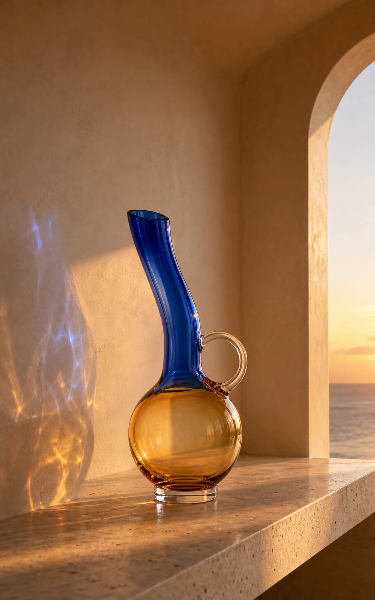

#### 详细信息

- **作者:** [Ecommerce GPT Image Prompts Studio](https://github.com/ecomimagelab)
- **来源:** 本仓库原创内容
- **发布日期:** 2026-07-23
- **语言:** en
- **适用平台:** Shopify
- **许可证:** CC-BY-4.0

<details>
<summary><strong>生产参数、商品保真项与溯源信息</strong></summary>

| 生成模式 | 商品行业 | 使用场景 | 宽高比 |
|---|---|---|---|
| `text-to-image` | 家居与家具 | 品牌首图 | 5:8 |

- **视觉风格:** 建筑感, 明亮活泼, 手作质感
- **背景类型:** 家居空间
- **素材用途:** 品牌首图
- **输入要求:** No reference image is required for this fictional unbranded product; use product-edit mode with owned source photography when adapting a real SKU.
- **商品保真项:**
  - Preserve the low transparent amber spherical body and tall cobalt neck bending gently left.
  - Preserve the clear circular side handle, thick flat clear base, polished rim, and asymmetric hand-blown proportions.
- **负面约束:** No brand, text, extra vase, ceramic texture, straight neck, missing handle, second handle, cracked glass, impossible floating fusion, changed colors, excessive bubbles, child, warped flowers, or liquid spill. No readable text, logo, trademark, watermark, duplicate product, broken geometry, cheap CGI, collage, or border.

**来源与版权**

- Generated specifically for this repository from the recorded standalone prompt; no third-party preview image is redistributed.
- Original prompt and generated previews created for this repository after visual-pattern and open-source workflow research; no external preview asset is included.
- [visual-research](docs/VISUAL_RESEARCH.md)
- [visual-research](https://github.com/buluslan/gpt-image2-ecommerce)
- [visual-research](https://github.com/motiful/product-shots)
- **平台规则状态:** Platform names identify intended visual treatment only; verify current listing and advertising requirements before publication.
- **商品系列:** [ec-0054](data/prompts/ec-0054-amber-cobalt-glass-vase-platform-set.json)

</details>

**[🚀 立即体验 →](https://www.pixpix.com/)**

---

<a id="featured-ec-0051-pinterest-sunlit-table"></a>

### No. 2: 食品与饮料 — 森林绿陶瓷橄榄油瓶多平台套图: PINTEREST SUNLIT TABLE

  

#### 描述

让同一只森林绿陶瓷橄榄油瓶在食品零售、橄榄园 DTC、阳光 Pinterest 餐桌、成年厨师动作和收获工艺故事中保持一致。

**生活方式场景 · Pinterest · 5:8**

#### 提示词

```text
Use case: product-mockup.
Asset type: social creative for pinterest.
Primary request: Create one ultra-photorealistic portrait 5:8 e-commerce image featuring exactly one premium olive-oil bottle with one stopper.
Product design: one fictional unbranded 500 ml tall ceramic olive-oil bottle in deep forest-green satin glaze, with broad rounded shoulders, a narrow neck, one natural cork stopper capped by a small cobalt ceramic disc, a single thin ivory vertical brushstroke on the front, and no words.
Scene/backdrop: Place the sealed bottle on a long sunlit linen table beside one shallow cream plate holding torn bread, a small saucer of golden oil, and six green olives.
Composition/framing: Use a tall editorial dining composition with the bottle as hero, quiet negative space, honest crumbs, and diagonal afternoon shadows.
Lighting/mood: Hard Mediterranean window sun, warm linen bounce, translucent oil glow, and natural food texture.
Materials/textures: Render satin reactive ceramic glaze, natural cork, cobalt ceramic, olive oil, old stone, linen, and believable food surfaces with physically believable surfaces, disciplined commercial retouching, fine natural microtexture, and premium photographic depth.
Product invariants: Preserve the same tall forest bottle, rounded shoulders, narrow neck, cork stopper, cobalt top disc, and single ivory brushstroke.
Constraints: Keep the bottle sealed except in a safe pouring scene and never add claims or readable packaging. Keep the product fully recognizable and commercially usable; use only fictional, unbranded design details.
Avoid: No people, second bottle, wine, readable menu, excessive food, flowers, oil spill, or bottle cropped. No brand, letters, extra bottle, glass body, metal pourer unless scene specifies open cork removal, missing brushstroke, blue glaze change, floating olives, excessive oil spill, child, unsafe flame, or deformed neck. No readable text, brand name, logo, trademark, watermark, duplicate product, broken geometry, cheap CGI, collage, split screen, frame, or border.
```

#### 生成预览图

##### 图片 1

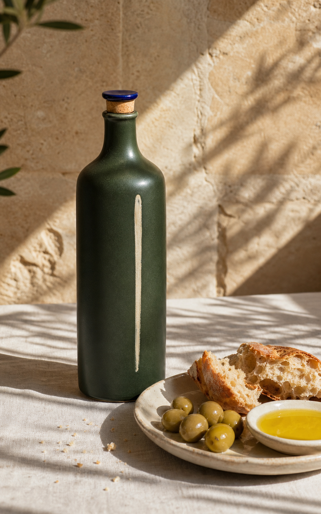

#### 详细信息

- **作者:** [Ecommerce GPT Image Prompts Studio](https://github.com/ecomimagelab)
- **来源:** 本仓库原创内容
- **发布日期:** 2026-07-23
- **语言:** en
- **适用平台:** Pinterest
- **许可证:** CC-BY-4.0

<details>
<summary><strong>生产参数、商品保真项与溯源信息</strong></summary>

| 生成模式 | 商品行业 | 使用场景 | 宽高比 |
|---|---|---|---|
| `text-to-image` | 食品与饮料 | 生活方式场景 | 5:8 |

- **视觉风格:** 美食编辑, 自然有机, 手作质感
- **背景类型:** 天然材质
- **素材用途:** 社交创意
- **输入要求:** No reference image is required for this fictional unbranded product; use product-edit mode with owned source photography when adapting a real SKU.
- **商品保真项:**
  - Preserve the 500 ml tall forest-green satin ceramic bottle, rounded shoulders, narrow neck, and single ivory brushstroke.
  - Preserve the natural cork stopper capped with one small cobalt ceramic disc.
- **负面约束:** No brand, letters, extra bottle, glass body, metal pourer unless scene specifies open cork removal, missing brushstroke, blue glaze change, floating olives, excessive oil spill, child, unsafe flame, or deformed neck. No readable text, logo, trademark, watermark, duplicate product, broken geometry, cheap CGI, collage, or border.

**来源与版权**

- Generated specifically for this repository from the recorded standalone prompt; no third-party preview image is redistributed.
- Original prompt and generated previews created for this repository after visual-pattern and open-source workflow research; no external preview asset is included.
- [visual-research](docs/VISUAL_RESEARCH.md)
- [visual-research](https://github.com/buluslan/gpt-image2-ecommerce)
- [visual-research](https://github.com/motiful/product-shots)
- **平台规则状态:** Platform names identify intended visual treatment only; verify current listing and advertising requirements before publication.
- **商品系列:** [ec-0051](data/prompts/ec-0051-forest-ceramic-olive-oil-platform-set.json)

</details>

**[🚀 立即体验 →](https://www.pixpix.com/)**

---

<a id="featured-ec-0048-instagram-gravel-sprint"></a>

### No. 3: 骑行 — 钴蓝碳纤维砾石公路车多平台套图: INSTAGRAM GRAVEL SPRINT

  

#### 描述

让同一辆钴蓝碳纤维砾石公路车在白底零售、技术棚拍、成年骑手竞速、薄雾 DTC 景观和沙漠雕塑画面中保持一致。

**模特上身 · Instagram Shop · 5:8**

#### 提示词

```text
Use case: product-mockup.
Asset type: social creative for instagram shop.
Primary request: Create one ultra-photorealistic portrait 5:8 e-commerce image featuring exactly one premium carbon gravel bicycle.
Product design: one fictional unbranded carbon gravel bicycle with a satin deep-cobalt aero frame, a straight charcoal carbon fork, flared drop handlebars wrapped in burnt-orange tape, tan-wall 45 mm gravel tires, matte-black deep-section wheels, a compact black drivetrain, and one small orange bottle cage with no bottle.
Scene/backdrop: An athletic adult rider wearing a plain cream helmet and charcoal kit sprints the bicycle along a pale gravel road through ochre hills.
Composition/framing: Use a low panning side-front action frame with the complete bicycle, both wheels, rider's safe posture, hands on drops, and orange bar tape clearly visible.
Lighting/mood: Hard sunrise side light, direct-flash lift, controlled gravel spray, natural adult anatomy, and energetic editorial motion.
Materials/textures: Render satin carbon fiber, matte wheel rims, textured handlebar tape, tan rubber sidewalls, black metal drivetrain, and fine road dust with physically believable surfaces, disciplined commercial retouching, fine natural microtexture, and premium photographic depth.
Product invariants: Preserve the same cobalt frame geometry, charcoal fork, orange flared-bar tape, tan-wall gravel tires, black deep wheels and drivetrain, and orange empty cage.
Constraints: Keep bicycle mechanics plausible with two wheels, one saddle, aligned drivetrain, and safe adult riding poses. Keep the product fully recognizable and commercially usable; use only fictional, unbranded design details.
Avoid: No child, missing helmet, extra cyclist, distorted limbs, warped wheel, logo kit, traffic, dangerous cliff, or product obscured by dust. No brand, text, motor, suspension fork, flat bars, extra bicycle, missing pedal, warped wheel, duplicate chain, bottle in cage, road-bike skinny tire, child rider, unsafe helmetless action, or impossible spoke geometry. No readable text, brand name, logo, trademark, watermark, duplicate product, broken geometry, cheap CGI, collage, split screen, frame, or border.
```

#### 生成预览图

##### 图片 1

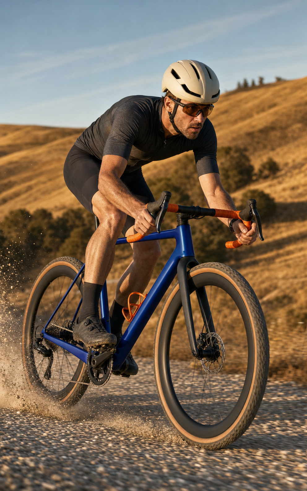

#### 详细信息

- **作者:** [Ecommerce GPT Image Prompts Studio](https://github.com/ecomimagelab)
- **来源:** 本仓库原创内容
- **发布日期:** 2026-07-23
- **语言:** en
- **适用平台:** Instagram Shop
- **许可证:** CC-BY-4.0

<details>
<summary><strong>生产参数、商品保真项与溯源信息</strong></summary>

| 生成模式 | 商品行业 | 使用场景 | 宽高比 |
|---|---|---|---|
| `text-to-image` | 骑行 | 模特上身 | 5:8 |

- **视觉风格:** 技术表达, 户外机能, 编辑大片
- **背景类型:** 户外实景
- **素材用途:** 社交创意
- **输入要求:** No reference image is required for this fictional unbranded product; use product-edit mode with owned source photography when adapting a real SKU.
- **商品保真项:**
  - Preserve the satin deep-cobalt carbon frame, straight charcoal fork, flared bars, and burnt-orange tape.
  - Preserve tan-wall 45 mm tires, matte-black deep wheels and drivetrain, and the small empty orange bottle cage.
- **负面约束:** No brand, text, motor, suspension fork, flat bars, extra bicycle, missing pedal, warped wheel, duplicate chain, bottle in cage, road-bike skinny tire, child rider, unsafe helmetless action, or impossible spoke geometry. No readable text, logo, trademark, watermark, duplicate product, broken geometry, cheap CGI, collage, or border.

**来源与版权**

- Generated specifically for this repository from the recorded standalone prompt; no third-party preview image is redistributed.
- Original prompt and generated previews created for this repository after visual-pattern and open-source workflow research; no external preview asset is included.
- [visual-research](docs/VISUAL_RESEARCH.md)
- [visual-research](https://github.com/buluslan/gpt-image2-ecommerce)
- [visual-research](https://github.com/motiful/product-shots)
- **平台规则状态:** Platform names identify intended visual treatment only; verify current listing and advertising requirements before publication.
- **商品系列:** [ec-0048](data/prompts/ec-0048-cobalt-carbon-gravel-bike-platform-set.json)

</details>

**[🚀 立即体验 →](https://www.pixpix.com/)**

---

<a id="featured-ec-0043-xiaohongshu-evening-style"></a>

### No. 4: 美妆与护肤 — 石榴红高速吹风机多平台套图: XIAOHONGSHU EVENING STYLE

  

#### 描述

让同一台石榴红高速吹风机在白底零售、镀铬美妆发布、成年模特梳妆造型、沙龙创作者动态和彩色静物中保持一致。

**模特上身 · 小红书 · 5:8**

#### 提示词

```text
Use case: product-mockup.
Asset type: social creative for xiaohongshu.
Primary request: Create one ultra-photorealistic portrait 5:8 e-commerce image featuring exactly one premium hair dryer with its single concentrator nozzle.
Product design: one fictional unbranded compact high-velocity hair dryer in deep satin garnet-red aluminum, with a short graphite-gray cylindrical barrel, a hollow circular rear intake, a slim straight handle, one small ivory oval control inset, a charcoal braided cord, and one detachable matching garnet concentrator nozzle.
Scene/backdrop: An adult East Asian woman in a plain ivory tank uses the dryer with concentrator to smooth one side of her shoulder-length dark hair at a warm evening vanity; the counter is dry and uncluttered.
Composition/framing: Frame a waist-up mirror-adjacent portrait without photographing through the mirror; show her natural hand grip, face, complete dryer, connected cord, and controlled hair movement.
Lighting/mood: Warm practical lamp mixed with soft direct flash, natural adult skin and hair texture, garnet color separation, and candid creator polish.
Materials/textures: Render satin anodized aluminum, graphite polymer, fine intake mesh, braided textile cord, and controlled beauty-device reflections with physically believable surfaces, disciplined commercial retouching, fine natural microtexture, and premium photographic depth.
Product invariants: Preserve the same garnet short barrel, hollow rear ring, straight slim handle, ivory control inset, charcoal cord, and single concentrator nozzle.
Constraints: Show only safe adult styling; keep the airflow device physically plausible and the cord connected. Keep the product fully recognizable and commercially usable; use only fictional, unbranded design details.
Avoid: No child, wet counter, sink, bath, distorted fingers, extra dryer in reflection, hair covering intake, branded cosmetics, or extreme wind. No brand word, extra attachment, diffuser, cordless body, pistol grip, black color change, oversized nozzle, visible heating coil, flying hair covering product, child model, damaged cord, or unsafe proximity to water. No readable text, brand name, logo, trademark, watermark, duplicate product, broken geometry, cheap CGI, collage, split screen, frame, or border.
```

#### 生成预览图

##### 图片 1

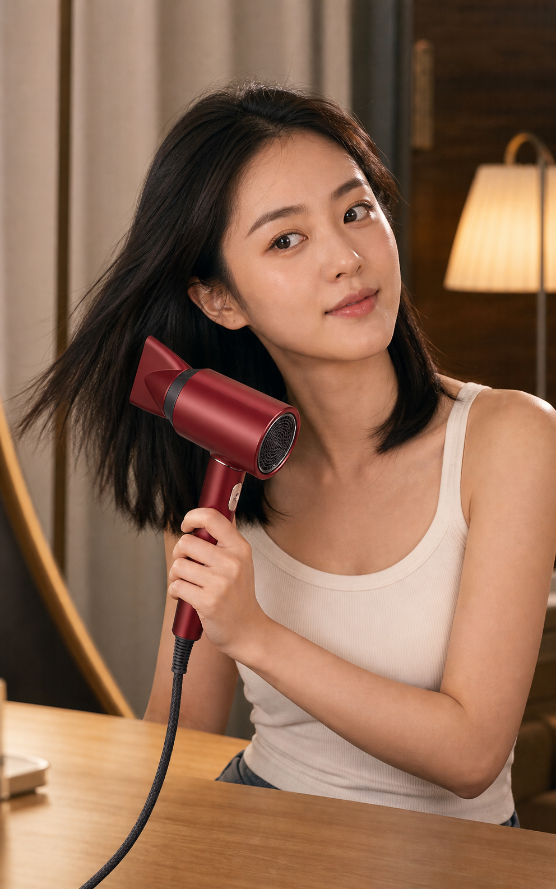

#### 详细信息

- **作者:** [Ecommerce GPT Image Prompts Studio](https://github.com/ecomimagelab)
- **来源:** 本仓库原创内容
- **发布日期:** 2026-07-23
- **语言:** en
- **适用平台:** 小红书
- **许可证:** CC-BY-4.0

<details>
<summary><strong>生产参数、商品保真项与溯源信息</strong></summary>

| 生成模式 | 商品行业 | 使用场景 | 宽高比 |
|---|---|---|---|
| `text-to-image` | 美妆与护肤 | 模特上身 | 5:8 |

- **视觉风格:** 高端奢华, 技术表达, 社交原生
- **背景类型:** 生活方式实景
- **素材用途:** 社交创意
- **输入要求:** No reference image is required for this fictional unbranded product; use product-edit mode with owned source photography when adapting a real SKU.
- **商品保真项:**
  - Preserve the deep satin garnet aluminum body, short graphite barrel, hollow circular rear intake, and slim straight handle.
  - Preserve the ivory oval control inset, connected charcoal braided cord, and one matching concentrator nozzle.
- **负面约束:** No brand word, extra attachment, diffuser, cordless body, pistol grip, black color change, oversized nozzle, visible heating coil, flying hair covering product, child model, damaged cord, or unsafe proximity to water. No readable text, logo, trademark, watermark, duplicate product, broken geometry, cheap CGI, collage, or border.

**来源与版权**

- Generated specifically for this repository from the recorded standalone prompt; no third-party preview image is redistributed.
- Original prompt and generated previews created for this repository after visual-pattern and open-source workflow research; no external preview asset is included.
- [visual-research](docs/VISUAL_RESEARCH.md)
- [visual-research](https://github.com/buluslan/gpt-image2-ecommerce)
- [visual-research](https://github.com/motiful/product-shots)
- **平台规则状态:** Platform names identify intended visual treatment only; verify current listing and advertising requirements before publication.
- **商品系列:** [ec-0043](data/prompts/ec-0043-garnet-hair-dryer-platform-set.json)

</details>

**[🚀 立即体验 →](https://www.pixpix.com/)**

---

<a id="featured-ec-0042-farfetch-courtyard-model"></a>

### No. 5: 服装 — 陶土色亚麻西装多平台套图: FARFETCH COURTYARD MODEL

  

#### 描述

让同一件陶土色宽松亚麻西装在时装目录、庭院成年模特编辑、面料细节、暗调奢华和高收藏配色造型中保持一致。

**模特上身 · Farfetch · 5:8**

#### 提示词

```text
Use case: product-mockup.
Asset type: social creative for farfetch.
Primary request: Create one ultra-photorealistic portrait 5:8 e-commerce image featuring exactly one relaxed linen blazer.
Product design: one fictional unbranded women's single-breasted blazer in warm clay-red washed linen, with a relaxed hip-length cut, one natural horn two-hole button, soft notched lapels, two low patch pockets, a center back vent, tonal half lining, and sleeves designed to be casually rolled once.
Scene/backdrop: An adult woman wears the blazer open over a plain black bandeau and high-waisted ivory trousers while standing in a sunlit travertine courtyard.
Composition/framing: Use a full three-quarter fashion portrait with relaxed weight shift, one hand in a patch pocket, the other natural at her side, and the complete blazer silhouette visible.
Lighting/mood: Hard late-afternoon sun, architectural shadow bands, direct-flash lift, real adult skin texture, and refined Mediterranean color.
Materials/textures: Render visible washed-linen slub, soft tailoring, natural horn, matte tonal lining, and believable garment drape with physically believable surfaces, disciplined commercial retouching, fine natural microtexture, and premium photographic depth.
Product invariants: Preserve the same clay-red color, relaxed hip length, single horn button, soft notched lapels, two patch pockets, center vent, and linen slub.
Constraints: Keep the blazer single-breasted with one visible button and no branding; use adult models only. Keep the product fully recognizable and commercially usable; use only fictional, unbranded design details.
Avoid: No child, extra blazer, bag, jewelry distraction, branded clothing, distorted fingers, hidden button, cropped hem, or exaggerated pose. No double-breasted closure, shoulder pads, gold buttons, chest logo, extra garment, cropped jacket, wool texture, missing pocket, pinstripe, hanger distortion, child model, or malformed hands. No readable text, brand name, logo, trademark, watermark, duplicate product, broken geometry, cheap CGI, collage, split screen, frame, or border.
```

#### 生成预览图

##### 图片 1

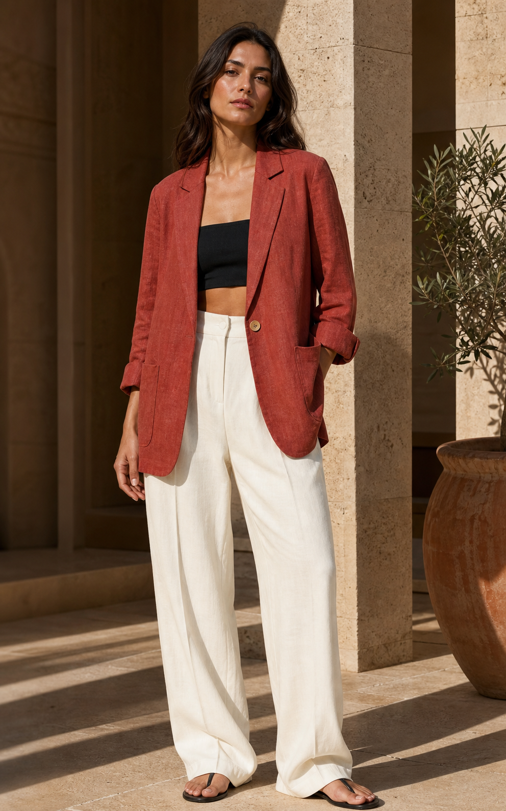

#### 详细信息

- **作者:** [Ecommerce GPT Image Prompts Studio](https://github.com/ecomimagelab)
- **来源:** 本仓库原创内容
- **发布日期:** 2026-07-23
- **语言:** en
- **适用平台:** Farfetch
- **许可证:** CC-BY-4.0

<details>
<summary><strong>生产参数、商品保真项与溯源信息</strong></summary>

| 生成模式 | 商品行业 | 使用场景 | 宽高比 |
|---|---|---|---|
| `text-to-image` | 服装 | 模特上身 | 5:8 |

- **视觉风格:** 编辑大片, 高端奢华, 自然有机
- **背景类型:** 生活方式实景
- **素材用途:** 社交创意
- **输入要求:** No reference image is required for this fictional unbranded product; use product-edit mode with owned source photography when adapting a real SKU.
- **商品保真项:**
  - Preserve the warm clay-red washed linen, relaxed hip-length cut, and soft notched lapels.
  - Preserve one natural horn button, two low patch pockets, center back vent, tonal half lining, and rolled-once sleeves.
- **负面约束:** No double-breasted closure, shoulder pads, gold buttons, chest logo, extra garment, cropped jacket, wool texture, missing pocket, pinstripe, hanger distortion, child model, or malformed hands. No readable text, logo, trademark, watermark, duplicate product, broken geometry, cheap CGI, collage, or border.

**来源与版权**

- Generated specifically for this repository from the recorded standalone prompt; no third-party preview image is redistributed.
- Original prompt and generated previews created for this repository after visual-pattern and open-source workflow research; no external preview asset is included.
- [visual-research](docs/VISUAL_RESEARCH.md)
- [visual-research](https://github.com/buluslan/gpt-image2-ecommerce)
- [visual-research](https://github.com/motiful/product-shots)
- **平台规则状态:** Platform names identify intended visual treatment only; verify current listing and advertising requirements before publication.
- **商品系列:** [ec-0042](data/prompts/ec-0042-clay-linen-blazer-platform-set.json)

</details>

**[🚀 立即体验 →](https://www.pixpix.com/)**

---

<a id="featured-ec-0039-instagram-wind-portrait"></a>

### No. 6: 服装 — 宝石蓝真丝方巾多平台套图: INSTAGRAM WIND PORTRAIT

  

#### 描述

让同一条宝石蓝植物纹真丝方巾在精品目录、成年模特风动时装、漆面发布、工坊微距和画廊静物中保持一致。

**模特上身 · Instagram Shop · 5:8**

#### 提示词

```text
Use case: product-mockup.
Asset type: social creative for instagram shop.
Primary request: Create one ultra-photorealistic portrait 5:8 e-commerce image featuring exactly one premium silk scarf.
Product design: one fictional unbranded 90 cm square silk-twill scarf with a deep sapphire field, a hand-drawn ivory ginkgo-leaf border, four burnt-orange corner medallions, a narrow ivory outer keyline, and hand-rolled edges.
Scene/backdrop: An elegant adult woman in a plain ivory sleeveless column dress holds one corner while a controlled breeze lifts the scarf behind her against a muted moss-green wall.
Composition/framing: Use a three-quarter fashion portrait with her complete head, hands, and upper body visible; the scarf forms a dynamic diagonal while its border and two orange medallions remain readable.
Lighting/mood: Warm directional window light with a crisp flash lift, natural adult skin, subtle film grain, and tactile moving silk.
Materials/textures: Render lustrous silk twill, crisp hand-rolled hems, saturated ink, fluid drape, and realistic fold highlights with physically believable surfaces, disciplined commercial retouching, fine natural microtexture, and premium photographic depth.
Product invariants: Preserve the same sapphire field, ivory ginkgo border, four burnt-orange corner medallions, square proportions, and narrow ivory keyline.
Constraints: Keep the print geometry coherent across folds and never invent lettering or a monogram. Keep the product fully recognizable and commercially usable; use only fictional, unbranded design details.
Avoid: No child, extra scarf, wind-obscured face, distorted fingers, branded dress, hat, jewelry distraction, or flying detached fabric. No brand mark, letters, extra scarf, changed print, floral roses, fringe, polyester shine, torn hem, missing corner medallion, duplicated fabric, or impossible fold continuity. No readable text, brand name, logo, trademark, watermark, duplicate product, broken geometry, cheap CGI, collage, split screen, frame, or border.
```

#### 生成预览图

##### 图片 1

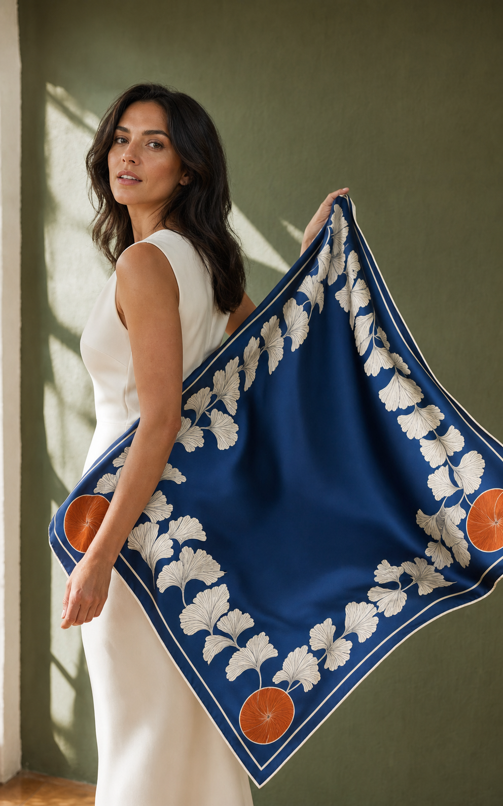

#### 详细信息

- **作者:** [Ecommerce GPT Image Prompts Studio](https://github.com/ecomimagelab)
- **来源:** 本仓库原创内容
- **发布日期:** 2026-07-23
- **语言:** en
- **适用平台:** Instagram Shop
- **许可证:** CC-BY-4.0

<details>
<summary><strong>生产参数、商品保真项与溯源信息</strong></summary>

| 生成模式 | 商品行业 | 使用场景 | 宽高比 |
|---|---|---|---|
| `text-to-image` | 服装 | 模特上身 | 5:8 |

- **视觉风格:** 高端奢华, 编辑大片, 社交原生
- **背景类型:** 生活方式实景
- **素材用途:** 社交创意
- **输入要求:** No reference image is required for this fictional unbranded product; use product-edit mode with owned source photography when adapting a real SKU.
- **商品保真项:**
  - Preserve the sapphire silk square with ivory ginkgo border and four burnt-orange corner medallions.
  - Preserve the narrow ivory keyline, hand-rolled edges, fluid silk-twill sheen, and 90 cm square proportions.
- **负面约束:** No brand mark, letters, extra scarf, changed print, floral roses, fringe, polyester shine, torn hem, missing corner medallion, duplicated fabric, or impossible fold continuity. No readable text, logo, trademark, watermark, duplicate product, broken geometry, cheap CGI, collage, or border.

**来源与版权**

- Generated specifically for this repository from the recorded standalone prompt; no third-party preview image is redistributed.
- Original prompt and generated previews created for this repository after visual-pattern and open-source workflow research; no external preview asset is included.
- [visual-research](docs/VISUAL_RESEARCH.md)
- [visual-research](https://github.com/buluslan/gpt-image2-ecommerce)
- [visual-research](https://github.com/motiful/product-shots)
- **平台规则状态:** Platform names identify intended visual treatment only; verify current listing and advertising requirements before publication.
- **商品系列:** [ec-0039](data/prompts/ec-0039-sapphire-silk-scarf-platform-set.json)

</details>

**[🚀 立即体验 →](https://www.pixpix.com/)**

---

<a id="all-prompts"></a>

## 全部提示词

> 按发布日期从新到旧排列。

<a id="categories-garden-and-planters"></a>

<a id="usecases-main-image"></a>

<a id="platforms-amazon"></a>

<a id="platforms-etsy"></a>

<a id="platforms-shopify"></a>

<a id="platforms-tiktok-shop"></a>

<a id="platforms-pinterest"></a>

<a id="prompt-ec-0057-amazon-garden-shears-main"></a>

### No. 1: 园艺与花器 — 黑化钢园艺修枝剪多平台套图: AMAZON GARDEN SHEARS MAIN

 

#### 描述

让同一把黑化钢修枝剪在白底零售、铁匠工艺、玫瑰园细节、成年园艺动作和工具平铺中保持一致。

**平台主图 · Amazon · 4:5**

#### 提示词

```text
Use case: product-mockup.
Asset type: main image for amazon.
Primary request: Create one ultra-photorealistic portrait 4:5 e-commerce image featuring exactly one premium bypass pruning shear.
Product design: one fictional unbranded forged bypass pruning shear with a dark hand-blackened high-carbon steel blade, a warm-brass pivot bolt, two slim smoked-ash wood handles with exactly two small brass pins per handle, one charcoal leather safety loop at the handle ends, and a compact closed length.
Scene/backdrop: Lay the closed shears diagonally on seamless pure #FFFFFF with the safety loop fastened and blade pointing upper left.
Composition/framing: Center the complete tool at about 76% frame fill; show blade geometry, satin edge, brass pivot, four total handle pins, wood grain, loop, and soft shadow.
Lighting/mood: Broad high-key tool softboxes, crisp steel edge, warm wood accuracy, and neutral white balance.
Materials/textures: Render forged blackened steel, sharpened satin blade edge, warm brass, smoked ash grain, charcoal leather, plant stems, soil, and workshop wood with physically believable surfaces, disciplined commercial retouching, fine natural microtexture, and premium photographic depth.
Product invariants: Preserve the same bypass blade geometry, blackened steel, brass pivot, two smoked-ash handles with two pins each, and charcoal safety loop.
Constraints: Keep the tool mechanically plausible and depict only safe adult use with fingers behind the handles. Keep the product fully recognizable and commercially usable; use only fictional, unbranded design details.
Avoid: No branch, glove, packaging, oil, extra tool, open blade, hand, or cropped handle. No brand engraving, text, extra tool, scissors shape, anvil blade, plastic handles, extra pin, missing loop, rust damage, blood, child, unsafe hand near blade, severed fingers, warped pivot, or floating parts. No readable text, brand name, logo, trademark, watermark, duplicate product, broken geometry, cheap CGI, collage, split screen, frame, or border.
```

#### 生成预览图

##### 图片 1

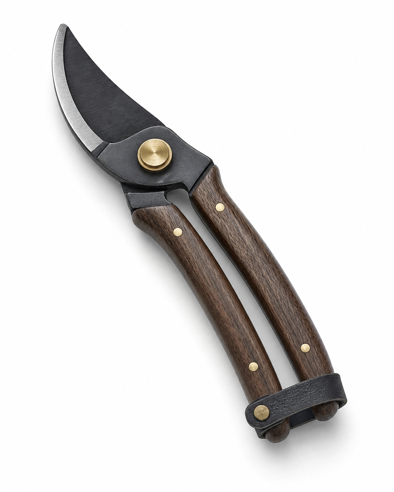

#### 详细信息

- **作者:** [Ecommerce GPT Image Prompts Studio](https://github.com/ecomimagelab)
- **来源:** 本仓库原创内容
- **发布日期:** 2026-07-23
- **语言:** en
- **适用平台:** Amazon
- **许可证:** CC-BY-4.0

<details>
<summary><strong>生产参数、商品保真项与溯源信息</strong></summary>

| 生成模式 | 商品行业 | 使用场景 | 宽高比 |
|---|---|---|---|
| `text-to-image` | 园艺与花器 | 平台主图 | 4:5 |

- **视觉风格:** 手作质感, 自然有机, 技术表达
- **背景类型:** 纯白背景
- **素材用途:** 平台主图
- **输入要求:** No reference image is required for this fictional unbranded product; use product-edit mode with owned source photography when adapting a real SKU.
- **商品保真项:**
  - Preserve the forged bypass blade with blackened upper steel, satin cutting edge, and warm-brass pivot bolt.
  - Preserve two smoked-ash handles with exactly two brass pins each and one charcoal leather safety loop.
- **负面约束:** No brand engraving, text, extra tool, scissors shape, anvil blade, plastic handles, extra pin, missing loop, rust damage, blood, child, unsafe hand near blade, severed fingers, warped pivot, or floating parts. No readable text, logo, trademark, watermark, duplicate product, broken geometry, cheap CGI, collage, or border.

**来源与版权**

- Generated specifically for this repository from the recorded standalone prompt; no third-party preview image is redistributed.
- Original prompt and generated previews created for this repository after visual-pattern and open-source workflow research; no external preview asset is included.
- [visual-research](docs/VISUAL_RESEARCH.md)
- [visual-research](https://github.com/buluslan/gpt-image2-ecommerce)
- [visual-research](https://github.com/motiful/product-shots)
- **平台规则状态:** Platform names identify intended visual treatment only; verify current listing and advertising requirements before publication.
- **商品系列:** [ec-0057](data/prompts/ec-0057-blackened-steel-pruning-shears-platform-set.json)

</details>

**[🚀 立即体验 →](https://www.pixpix.com/)**

---

<a id="usecases-lifestyle-scene"></a>

<a id="prompt-ec-0057-etsy-blacksmith-bench"></a>

### No. 2: 园艺与花器 — 黑化钢园艺修枝剪多平台套图: ETSY BLACKSMITH BENCH

 

#### 描述

让同一把黑化钢修枝剪在白底零售、铁匠工艺、玫瑰园细节、成年园艺动作和工具平铺中保持一致。

**生活方式场景 · Etsy · 4:5**

#### 提示词

```text
Use case: product-mockup.
Asset type: secondary image for etsy.
Primary request: Create one ultra-photorealistic portrait 4:5 e-commerce image featuring exactly one premium bypass pruning shear.
Product design: one fictional unbranded forged bypass pruning shear with a dark hand-blackened high-carbon steel blade, a warm-brass pivot bolt, two slim smoked-ash wood handles with exactly two small brass pins per handle, one charcoal leather safety loop at the handle ends, and a compact closed length.
Scene/backdrop: Rest the finished closed shears on a scarred oak bench beside one plain brass hammer head and a folded charcoal cloth.
Composition/framing: Use an intimate three-quarter maker portrait showing forge texture, polished cutting edge, pivot machining, wood grain, pins, and leather loop.
Lighting/mood: Warm workshop window light, subtle furnace glow far behind, shallow depth of field, and honest handcrafted texture.
Materials/textures: Render forged blackened steel, sharpened satin blade edge, warm brass, smoked ash grain, charcoal leather, plant stems, soil, and workshop wood with physically believable surfaces, disciplined commercial retouching, fine natural microtexture, and premium photographic depth.
Product invariants: Preserve the same bypass blade geometry, blackened steel, brass pivot, two smoked-ash handles with two pins each, and charcoal safety loop.
Constraints: Keep the tool mechanically plausible and depict only safe adult use with fingers behind the handles. Keep the product fully recognizable and commercially usable; use only fictional, unbranded design details.
Avoid: No active flame touching tool, person, text, extra shears, loose blade, rust, excessive tools, or sparks. No brand engraving, text, extra tool, scissors shape, anvil blade, plastic handles, extra pin, missing loop, rust damage, blood, child, unsafe hand near blade, severed fingers, warped pivot, or floating parts. No readable text, brand name, logo, trademark, watermark, duplicate product, broken geometry, cheap CGI, collage, split screen, frame, or border.
```

#### 生成预览图

##### 图片 1

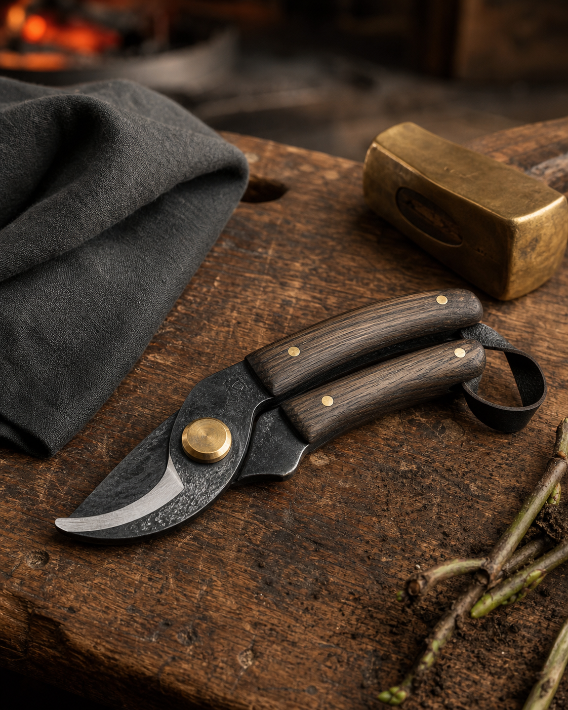

#### 详细信息

- **作者:** [Ecommerce GPT Image Prompts Studio](https://github.com/ecomimagelab)
- **来源:** 本仓库原创内容
- **发布日期:** 2026-07-23
- **语言:** en
- **适用平台:** Etsy
- **许可证:** CC-BY-4.0

<details>
<summary><strong>生产参数、商品保真项与溯源信息</strong></summary>

| 生成模式 | 商品行业 | 使用场景 | 宽高比 |
|---|---|---|---|
| `text-to-image` | 园艺与花器 | 生活方式场景 | 4:5 |

- **视觉风格:** 手作质感, 自然有机, 技术表达
- **背景类型:** 天然材质
- **素材用途:** 商品副图
- **输入要求:** No reference image is required for this fictional unbranded product; use product-edit mode with owned source photography when adapting a real SKU.
- **商品保真项:**
  - Preserve the forged bypass blade with blackened upper steel, satin cutting edge, and warm-brass pivot bolt.
  - Preserve two smoked-ash handles with exactly two brass pins each and one charcoal leather safety loop.
- **负面约束:** No brand engraving, text, extra tool, scissors shape, anvil blade, plastic handles, extra pin, missing loop, rust damage, blood, child, unsafe hand near blade, severed fingers, warped pivot, or floating parts. No readable text, logo, trademark, watermark, duplicate product, broken geometry, cheap CGI, collage, or border.

**来源与版权**

- Generated specifically for this repository from the recorded standalone prompt; no third-party preview image is redistributed.
- Original prompt and generated previews created for this repository after visual-pattern and open-source workflow research; no external preview asset is included.
- [visual-research](docs/VISUAL_RESEARCH.md)
- [visual-research](https://github.com/buluslan/gpt-image2-ecommerce)
- [visual-research](https://github.com/motiful/product-shots)
- **平台规则状态:** Platform names identify intended visual treatment only; verify current listing and advertising requirements before publication.
- **商品系列:** [ec-0057](data/prompts/ec-0057-blackened-steel-pruning-shears-platform-set.json)

</details>

**[🚀 立即体验 →](https://www.pixpix.com/)**

---

<a id="usecases-detail-macro"></a>

<a id="prompt-ec-0057-shopify-rose-garden-detail"></a>

### No. 3: 园艺与花器 — 黑化钢园艺修枝剪多平台套图: SHOPIFY ROSE GARDEN DETAIL

 

#### 描述

让同一把黑化钢修枝剪在白底零售、铁匠工艺、玫瑰园细节、成年园艺动作和工具平铺中保持一致。

**细节与微距 · Shopify · 5:8**

#### 提示词

```text
Use case: product-mockup.
Asset type: secondary image for shopify.
Primary request: Create one ultra-photorealistic portrait 5:8 e-commerce image featuring exactly one premium bypass pruning shear.
Product design: one fictional unbranded forged bypass pruning shear with a dark hand-blackened high-carbon steel blade, a warm-brass pivot bolt, two slim smoked-ash wood handles with exactly two small brass pins per handle, one charcoal leather safety loop at the handle ends, and a compact closed length.
Scene/backdrop: Place the open shears safely on a pale stone garden ledge beside one freshly cut green rose stem and three leaves, with no flower head.
Composition/framing: Use a close vertical material portrait that includes the complete tool and emphasizes bypass overlap, sharp satin edge, brass pivot, pins, and wood grain.
Lighting/mood: Soft morning garden light, green bounce, gentle stone texture, and precise natural color.
Materials/textures: Render forged blackened steel, sharpened satin blade edge, warm brass, smoked ash grain, charcoal leather, plant stems, soil, and workshop wood with physically believable surfaces, disciplined commercial retouching, fine natural microtexture, and premium photographic depth.
Product invariants: Preserve the same bypass blade geometry, blackened steel, brass pivot, two smoked-ash handles with two pins each, and charcoal safety loop.
Constraints: Keep the tool mechanically plausible and depict only safe adult use with fingers behind the handles. Keep the product fully recognizable and commercially usable; use only fictional, unbranded design details.
Avoid: No human hand, blood, thorn touching handle, extra tool, open blade beyond safe angle, flower clutter, text, or rust. No brand engraving, text, extra tool, scissors shape, anvil blade, plastic handles, extra pin, missing loop, rust damage, blood, child, unsafe hand near blade, severed fingers, warped pivot, or floating parts. No readable text, brand name, logo, trademark, watermark, duplicate product, broken geometry, cheap CGI, collage, split screen, frame, or border.
```

#### 生成预览图

##### 图片 1

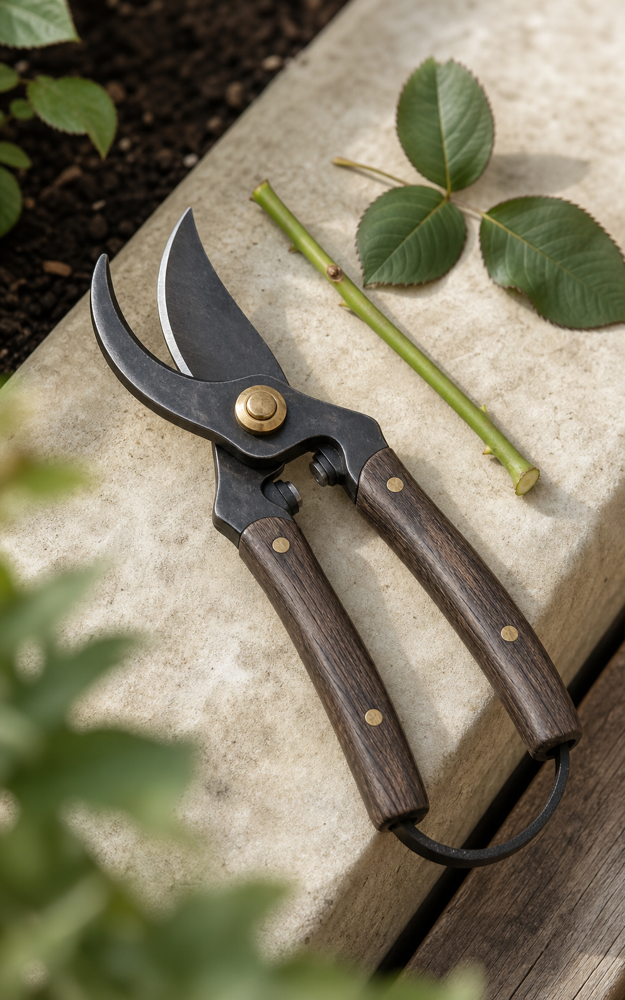

#### 详细信息

- **作者:** [Ecommerce GPT Image Prompts Studio](https://github.com/ecomimagelab)
- **来源:** 本仓库原创内容
- **发布日期:** 2026-07-23
- **语言:** en
- **适用平台:** Shopify
- **许可证:** CC-BY-4.0

<details>
<summary><strong>生产参数、商品保真项与溯源信息</strong></summary>

| 生成模式 | 商品行业 | 使用场景 | 宽高比 |
|---|---|---|---|
| `text-to-image` | 园艺与花器 | 细节与微距 | 5:8 |

- **视觉风格:** 手作质感, 自然有机, 技术表达
- **背景类型:** 户外实景
- **素材用途:** 商品副图
- **输入要求:** No reference image is required for this fictional unbranded product; use product-edit mode with owned source photography when adapting a real SKU.
- **商品保真项:**
  - Preserve the forged bypass blade with blackened upper steel, satin cutting edge, and warm-brass pivot bolt.
  - Preserve two smoked-ash handles with exactly two brass pins each and one charcoal leather safety loop.
- **负面约束:** No brand engraving, text, extra tool, scissors shape, anvil blade, plastic handles, extra pin, missing loop, rust damage, blood, child, unsafe hand near blade, severed fingers, warped pivot, or floating parts. No readable text, logo, trademark, watermark, duplicate product, broken geometry, cheap CGI, collage, or border.

**来源与版权**

- Generated specifically for this repository from the recorded standalone prompt; no third-party preview image is redistributed.
- Original prompt and generated previews created for this repository after visual-pattern and open-source workflow research; no external preview asset is included.
- [visual-research](docs/VISUAL_RESEARCH.md)
- [visual-research](https://github.com/buluslan/gpt-image2-ecommerce)
- [visual-research](https://github.com/motiful/product-shots)
- **平台规则状态:** Platform names identify intended visual treatment only; verify current listing and advertising requirements before publication.
- **商品系列:** [ec-0057](data/prompts/ec-0057-blackened-steel-pruning-shears-platform-set.json)

</details>

**[🚀 立即体验 →](https://www.pixpix.com/)**

---

<a id="usecases-on-model"></a>

<a id="prompt-ec-0057-tiktok-adult-gardener"></a>

### No. 4: 园艺与花器 — 黑化钢园艺修枝剪多平台套图: TIKTOK SHOP ADULT GARDENER

 

#### 描述

让同一把黑化钢修枝剪在白底零售、铁匠工艺、玫瑰园细节、成年园艺动作和工具平铺中保持一致。

**模特上身 · TikTok Shop · 5:8**

#### 提示词

```text
Use case: product-mockup.
Asset type: social creative for tiktok shop.
Primary request: Create one ultra-photorealistic portrait 5:8 e-commerce image featuring exactly one premium bypass pruning shear.
Product design: one fictional unbranded forged bypass pruning shear with a dark hand-blackened high-carbon steel blade, a warm-brass pivot bolt, two slim smoked-ash wood handles with exactly two small brass pins per handle, one charcoal leather safety loop at the handle ends, and a compact closed length.
Scene/backdrop: An adult gardener wearing plain canvas gloves safely trims one thin lavender stem with the shears in a sunlit courtyard planter.
Composition/framing: Use a close vertical action frame showing both complete gloved hands, fingers behind handles, tool identity, controlled cut, and natural adult posture.
Lighting/mood: Direct flash mixed with hard morning sun, crisp plant texture, warm brass glint, and authentic creator energy.
Materials/textures: Render forged blackened steel, sharpened satin blade edge, warm brass, smoked ash grain, charcoal leather, plant stems, soil, and workshop wood with physically believable surfaces, disciplined commercial retouching, fine natural microtexture, and premium photographic depth.
Product invariants: Preserve the same bypass blade geometry, blackened steel, brass pivot, two smoked-ash handles with two pins each, and charcoal safety loop.
Constraints: Keep the tool mechanically plausible and depict only safe adult use with fingers behind the handles. Keep the product fully recognizable and commercially usable; use only fictional, unbranded design details.
Avoid: No child, bare fingers near blade, extra fingers, severed thick branch, logo glove, extra shears, unsafe grip, text, or flying debris. No brand engraving, text, extra tool, scissors shape, anvil blade, plastic handles, extra pin, missing loop, rust damage, blood, child, unsafe hand near blade, severed fingers, warped pivot, or floating parts. No readable text, brand name, logo, trademark, watermark, duplicate product, broken geometry, cheap CGI, collage, split screen, frame, or border.
```

#### 生成预览图

##### 图片 1

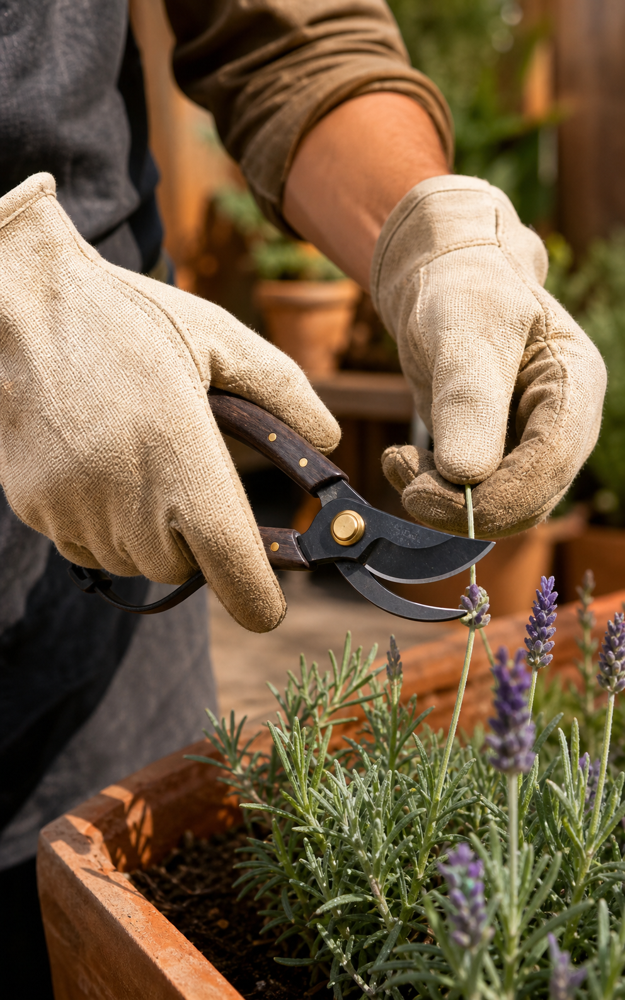

#### 详细信息

- **作者:** [Ecommerce GPT Image Prompts Studio](https://github.com/ecomimagelab)
- **来源:** 本仓库原创内容
- **发布日期:** 2026-07-23
- **语言:** en
- **适用平台:** TikTok Shop
- **许可证:** CC-BY-4.0

<details>
<summary><strong>生产参数、商品保真项与溯源信息</strong></summary>

| 生成模式 | 商品行业 | 使用场景 | 宽高比 |
|---|---|---|---|
| `text-to-image` | 园艺与花器 | 模特上身 | 5:8 |

- **视觉风格:** 手作质感, 自然有机, 技术表达
- **背景类型:** 户外实景
- **素材用途:** 社交创意
- **输入要求:** No reference image is required for this fictional unbranded product; use product-edit mode with owned source photography when adapting a real SKU.
- **商品保真项:**
  - Preserve the forged bypass blade with blackened upper steel, satin cutting edge, and warm-brass pivot bolt.
  - Preserve two smoked-ash handles with exactly two brass pins each and one charcoal leather safety loop.
- **负面约束:** No brand engraving, text, extra tool, scissors shape, anvil blade, plastic handles, extra pin, missing loop, rust damage, blood, child, unsafe hand near blade, severed fingers, warped pivot, or floating parts. No readable text, logo, trademark, watermark, duplicate product, broken geometry, cheap CGI, collage, or border.

**来源与版权**

- Generated specifically for this repository from the recorded standalone prompt; no third-party preview image is redistributed.
- Original prompt and generated previews created for this repository after visual-pattern and open-source workflow research; no external preview asset is included.
- [visual-research](docs/VISUAL_RESEARCH.md)
- [visual-research](https://github.com/buluslan/gpt-image2-ecommerce)
- [visual-research](https://github.com/motiful/product-shots)
- **平台规则状态:** Platform names identify intended visual treatment only; verify current listing and advertising requirements before publication.
- **商品系列:** [ec-0057](data/prompts/ec-0057-blackened-steel-pruning-shears-platform-set.json)

</details>

**[🚀 立即体验 →](https://www.pixpix.com/)**

---

<a id="prompt-ec-0057-pinterest-tool-flatlay"></a>

### No. 5: 园艺与花器 — 黑化钢园艺修枝剪多平台套图: PINTEREST TOOL FLAT LAY

 

#### 描述

让同一把黑化钢修枝剪在白底零售、铁匠工艺、玫瑰园细节、成年园艺动作和工具平铺中保持一致。

**生活方式场景 · Pinterest · 4:5**

#### 提示词

```text
Use case: product-mockup.
Asset type: social creative for pinterest.
Primary request: Create one ultra-photorealistic portrait 4:5 e-commerce image featuring exactly one premium bypass pruning shear.
Product design: one fictional unbranded forged bypass pruning shear with a dark hand-blackened high-carbon steel blade, a warm-brass pivot bolt, two slim smoked-ash wood handles with exactly two small brass pins per handle, one charcoal leather safety loop at the handle ends, and a compact closed length.
Scene/backdrop: Lay the closed shears on a sage canvas cloth beside one coiled natural twine, one plain terracotta pot, and three clipped rosemary sprigs.
Composition/framing: Use an organized overhead composition with the complete tool, four handle pins, leather loop, blade profile, and balanced negative space.
Lighting/mood: Hard side sunlight, graphic herb shadows, warm terracotta bounce, and tactile garden materials.
Materials/textures: Render forged blackened steel, sharpened satin blade edge, warm brass, smoked ash grain, charcoal leather, plant stems, soil, and workshop wood with physically believable surfaces, disciplined commercial retouching, fine natural microtexture, and premium photographic depth.
Product invariants: Preserve the same bypass blade geometry, blackened steel, brass pivot, two smoked-ash handles with two pins each, and charcoal safety loop.
Constraints: Keep the tool mechanically plausible and depict only safe adult use with fingers behind the handles. Keep the product fully recognizable and commercially usable; use only fictional, unbranded design details.
Avoid: No text tag, extra tool, soil covering blade, gloves, flowers, duplicate twine, or cropped handle. No brand engraving, text, extra tool, scissors shape, anvil blade, plastic handles, extra pin, missing loop, rust damage, blood, child, unsafe hand near blade, severed fingers, warped pivot, or floating parts. No readable text, brand name, logo, trademark, watermark, duplicate product, broken geometry, cheap CGI, collage, split screen, frame, or border.
```

#### 生成预览图

##### 图片 1

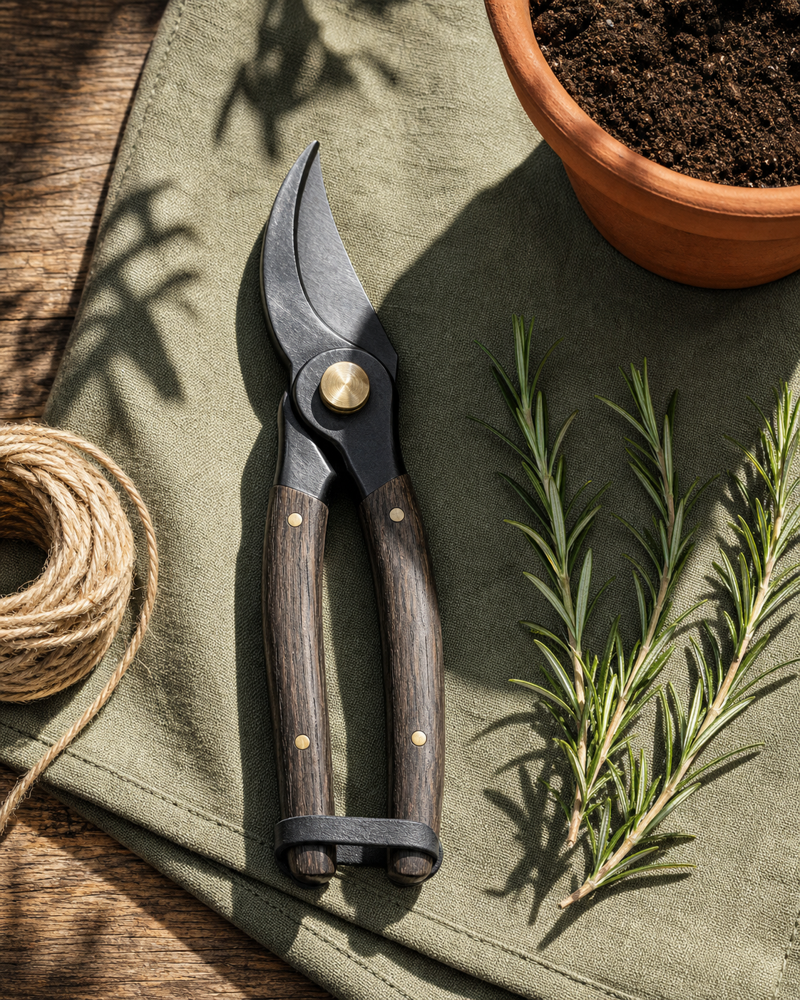

#### 详细信息

- **作者:** [Ecommerce GPT Image Prompts Studio](https://github.com/ecomimagelab)
- **来源:** 本仓库原创内容
- **发布日期:** 2026-07-23
- **语言:** en
- **适用平台:** Pinterest
- **许可证:** CC-BY-4.0

<details>
<summary><strong>生产参数、商品保真项与溯源信息</strong></summary>

| 生成模式 | 商品行业 | 使用场景 | 宽高比 |
|---|---|---|---|
| `text-to-image` | 园艺与花器 | 生活方式场景 | 4:5 |

- **视觉风格:** 手作质感, 自然有机, 技术表达
- **背景类型:** 天然材质
- **素材用途:** 社交创意
- **输入要求:** No reference image is required for this fictional unbranded product; use product-edit mode with owned source photography when adapting a real SKU.
- **商品保真项:**
  - Preserve the forged bypass blade with blackened upper steel, satin cutting edge, and warm-brass pivot bolt.
  - Preserve two smoked-ash handles with exactly two brass pins each and one charcoal leather safety loop.
- **负面约束:** No brand engraving, text, extra tool, scissors shape, anvil blade, plastic handles, extra pin, missing loop, rust damage, blood, child, unsafe hand near blade, severed fingers, warped pivot, or floating parts. No readable text, logo, trademark, watermark, duplicate product, broken geometry, cheap CGI, collage, or border.

**来源与版权**

- Generated specifically for this repository from the recorded standalone prompt; no third-party preview image is redistributed.
- Original prompt and generated previews created for this repository after visual-pattern and open-source workflow research; no external preview asset is included.
- [visual-research](docs/VISUAL_RESEARCH.md)
- [visual-research](https://github.com/buluslan/gpt-image2-ecommerce)
- [visual-research](https://github.com/motiful/product-shots)
- **平台规则状态:** Platform names identify intended visual treatment only; verify current listing and advertising requirements before publication.
- **商品系列:** [ec-0057](data/prompts/ec-0057-blackened-steel-pruning-shears-platform-set.json)

</details>

**[🚀 立即体验 →](https://www.pixpix.com/)**

---

<a id="categories-outdoor-gear"></a>

<a id="platforms-outdoor-retail"></a>

<a id="platforms-instagram-shop"></a>

<a id="prompt-ec-0056-amazon-cooler-clean-main"></a>

### No. 6: 户外装备 — 海军蓝珊瑚扣户外保温箱多平台套图: AMAZON COOLER CLEAN MAIN

 

#### 描述

让同一只海军蓝珊瑚扣户外保温箱在白底零售、冰块性能细节、岩岸 DTC、成年露营生活方式和彩色尾箱静物中保持一致。

**平台主图 · Amazon · 4:5**

#### 提示词

```text
Use case: product-mockup.
Asset type: main image for amazon.
Primary request: Create one ultra-photorealistic portrait 4:5 e-commerce image featuring exactly one rugged outdoor cooler.
Product design: one fictional unbranded 32-liter rotomolded outdoor cooler in matte deep-marine blue, with a flat ivory lid, exactly two coral-red rubber front latches, one charcoal braided side handle on each end, four small graphite corner feet, and one coral drain plug low on the right side.
Scene/backdrop: Place the closed cooler front three-quarter on seamless pure #FFFFFF with both coral latches fastened.
Composition/framing: Center the complete cooler at about 76% frame fill; show lid, two latches, right drain plug, both side-handle attachments, feet, and soft shadow.
Lighting/mood: Broad high-key softboxes, clean polymer texture, true marine color, and crisp ivory-coral separation.
Materials/textures: Render matte rotomolded polymer, ivory textured lid, coral rubber, charcoal braided handles, graphite feet, ice, condensation, and outdoor stone with physically believable surfaces, disciplined commercial retouching, fine natural microtexture, and premium photographic depth.
Product invariants: Preserve the same marine 32-liter body, ivory lid, two coral front latches, two charcoal side handles, four graphite feet, and right coral drain plug.
Constraints: Keep latch, foot, handle, and drain-plug counts and locations consistent; use adult models only. Keep the product fully recognizable and commercially usable; use only fictional, unbranded design details.
Avoid: No ice, food, hand, packaging, open lid, extra accessory, or cropped foot. No brand, text, extra cooler, extra latch, missing handle, wheels, telescoping handle, bottle opener, changed colors, floating lid, warped box, child, alcohol branding, raw meat, or dangerous wildlife. No readable text, brand name, logo, trademark, watermark, duplicate product, broken geometry, cheap CGI, collage, split screen, frame, or border.
```

#### 生成预览图

##### 图片 1

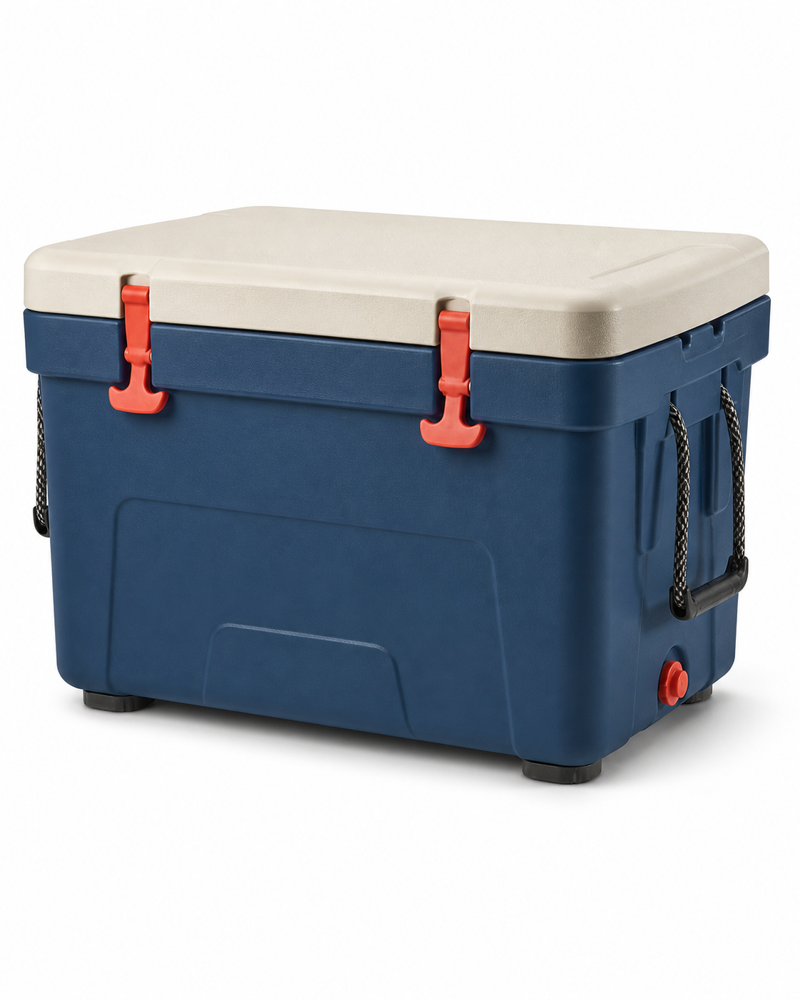

#### 详细信息

- **作者:** [Ecommerce GPT Image Prompts Studio](https://github.com/ecomimagelab)
- **来源:** 本仓库原创内容
- **发布日期:** 2026-07-23
- **语言:** en
- **适用平台:** Amazon
- **许可证:** CC-BY-4.0

<details>
<summary><strong>生产参数、商品保真项与溯源信息</strong></summary>

| 生成模式 | 商品行业 | 使用场景 | 宽高比 |
|---|---|---|---|
| `text-to-image` | 户外装备 | 平台主图 | 4:5 |

- **视觉风格:** 户外机能, 技术表达, 明亮活泼
- **背景类型:** 纯白背景
- **素材用途:** 平台主图
- **输入要求:** No reference image is required for this fictional unbranded product; use product-edit mode with owned source photography when adapting a real SKU.
- **商品保真项:**
  - Preserve the matte marine-blue 32-liter body, flat ivory lid, and exactly two coral-red front latches.
  - Preserve two charcoal braided side handles, four graphite corner feet, and one coral drain plug low on the right.
- **负面约束:** No brand, text, extra cooler, extra latch, missing handle, wheels, telescoping handle, bottle opener, changed colors, floating lid, warped box, child, alcohol branding, raw meat, or dangerous wildlife. No readable text, logo, trademark, watermark, duplicate product, broken geometry, cheap CGI, collage, or border.

**来源与版权**

- Generated specifically for this repository from the recorded standalone prompt; no third-party preview image is redistributed.
- Original prompt and generated previews created for this repository after visual-pattern and open-source workflow research; no external preview asset is included.
- [visual-research](docs/VISUAL_RESEARCH.md)
- [visual-research](https://github.com/buluslan/gpt-image2-ecommerce)
- [visual-research](https://github.com/motiful/product-shots)
- **平台规则状态:** Platform names identify intended visual treatment only; verify current listing and advertising requirements before publication.
- **商品系列:** [ec-0056](data/prompts/ec-0056-marine-coral-outdoor-cooler-platform-set.json)

</details>

**[🚀 立即体验 →](https://www.pixpix.com/)**

---

<a id="usecases-feature-callout"></a>

<a id="prompt-ec-0056-outdoor-retail-ice-detail"></a>

### No. 7: 户外装备 — 海军蓝珊瑚扣户外保温箱多平台套图: OUTDOOR RETAIL ICE DETAIL

 

#### 描述

让同一只海军蓝珊瑚扣户外保温箱在白底零售、冰块性能细节、岩岸 DTC、成年露营生活方式和彩色尾箱静物中保持一致。

**功能卖点图 · 户外零售 · 4:5**

#### 提示词

```text
Use case: product-mockup.
Asset type: secondary image for outdoor retail.
Primary request: Create one ultra-photorealistic portrait 4:5 e-commerce image featuring exactly one rugged outdoor cooler.
Product design: one fictional unbranded 32-liter rotomolded outdoor cooler in matte deep-marine blue, with a flat ivory lid, exactly two coral-red rubber front latches, one charcoal braided side handle on each end, four small graphite corner feet, and one coral drain plug low on the right side.
Scene/backdrop: Open the cooler on a wet graphite slab to reveal clear ice and three blank reusable steel bottles in cream, cobalt, and coral; keep lid attached.
Composition/framing: Use a slightly elevated close view showing insulation rim, both latches, interior volume, right drain plug, handles, and cold condensation.
Lighting/mood: Cool hard rim light, crisp ice sparkle, dark controlled fill, and subtle marine reflection.
Materials/textures: Render matte rotomolded polymer, ivory textured lid, coral rubber, charcoal braided handles, graphite feet, ice, condensation, and outdoor stone with physically believable surfaces, disciplined commercial retouching, fine natural microtexture, and premium photographic depth.
Product invariants: Preserve the same marine 32-liter body, ivory lid, two coral front latches, two charcoal side handles, four graphite feet, and right coral drain plug.
Constraints: Keep latch, foot, handle, and drain-plug counts and locations consistent; use adult models only. Keep the product fully recognizable and commercially usable; use only fictional, unbranded design details.
Avoid: No brand, alcohol, loose food, extra cooler, detached lid, more than three bottles, text, or overflowing water. No brand, text, extra cooler, extra latch, missing handle, wheels, telescoping handle, bottle opener, changed colors, floating lid, warped box, child, alcohol branding, raw meat, or dangerous wildlife. No readable text, brand name, logo, trademark, watermark, duplicate product, broken geometry, cheap CGI, collage, split screen, frame, or border.
```

#### 生成预览图

##### 图片 1

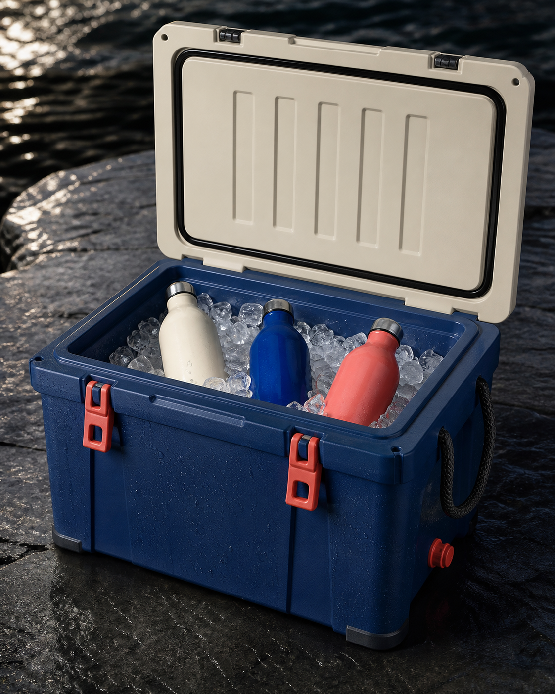

#### 详细信息

- **作者:** [Ecommerce GPT Image Prompts Studio](https://github.com/ecomimagelab)
- **来源:** 本仓库原创内容
- **发布日期:** 2026-07-23
- **语言:** en
- **适用平台:** 户外零售
- **许可证:** CC-BY-4.0

<details>
<summary><strong>生产参数、商品保真项与溯源信息</strong></summary>

| 生成模式 | 商品行业 | 使用场景 | 宽高比 |
|---|---|---|---|
| `text-to-image` | 户外装备 | 功能卖点图 | 4:5 |

- **视觉风格:** 户外机能, 技术表达, 明亮活泼
- **背景类型:** 暗调影棚
- **素材用途:** 商品副图
- **输入要求:** No reference image is required for this fictional unbranded product; use product-edit mode with owned source photography when adapting a real SKU.
- **商品保真项:**
  - Preserve the matte marine-blue 32-liter body, flat ivory lid, and exactly two coral-red front latches.
  - Preserve two charcoal braided side handles, four graphite corner feet, and one coral drain plug low on the right.
- **负面约束:** No brand, text, extra cooler, extra latch, missing handle, wheels, telescoping handle, bottle opener, changed colors, floating lid, warped box, child, alcohol branding, raw meat, or dangerous wildlife. No readable text, logo, trademark, watermark, duplicate product, broken geometry, cheap CGI, collage, or border.

**来源与版权**

- Generated specifically for this repository from the recorded standalone prompt; no third-party preview image is redistributed.
- Original prompt and generated previews created for this repository after visual-pattern and open-source workflow research; no external preview asset is included.
- [visual-research](docs/VISUAL_RESEARCH.md)
- [visual-research](https://github.com/buluslan/gpt-image2-ecommerce)
- [visual-research](https://github.com/motiful/product-shots)
- **平台规则状态:** Platform names identify intended visual treatment only; verify current listing and advertising requirements before publication.
- **商品系列:** [ec-0056](data/prompts/ec-0056-marine-coral-outdoor-cooler-platform-set.json)

</details>

**[🚀 立即体验 →](https://www.pixpix.com/)**

---

<a id="usecases-branded-hero"></a>

<a id="prompt-ec-0056-shopify-rocky-shore"></a>

### No. 8: 户外装备 — 海军蓝珊瑚扣户外保温箱多平台套图: SHOPIFY ROCKY SHORE

 

#### 描述

让同一只海军蓝珊瑚扣户外保温箱在白底零售、冰块性能细节、岩岸 DTC、成年露营生活方式和彩色尾箱静物中保持一致。

**品牌首图 · Shopify · 5:8**

#### 提示词

```text
Use case: product-mockup.
Asset type: branded hero for shopify.
Primary request: Create one ultra-photorealistic portrait 5:8 e-commerce image featuring exactly one rugged outdoor cooler.
Product design: one fictional unbranded 32-liter rotomolded outdoor cooler in matte deep-marine blue, with a flat ivory lid, exactly two coral-red rubber front latches, one charcoal braided side handle on each end, four small graphite corner feet, and one coral drain plug low on the right side.
Scene/backdrop: Place the closed cooler on a flat black coastal rock above a calm slate sea at blue hour, with both latches secured.
Composition/framing: Use a low environmental product portrait with the complete cooler dominant and layered shoreline creating rugged vertical depth.
Lighting/mood: Cool twilight ambience, warm coral rim, wet-stone reflections, and crisp salt-air texture.
Materials/textures: Render matte rotomolded polymer, ivory textured lid, coral rubber, charcoal braided handles, graphite feet, ice, condensation, and outdoor stone with physically believable surfaces, disciplined commercial retouching, fine natural microtexture, and premium photographic depth.
Product invariants: Preserve the same marine 32-liter body, ivory lid, two coral front latches, two charcoal side handles, four graphite feet, and right coral drain plug.
Constraints: Keep latch, foot, handle, and drain-plug counts and locations consistent; use adult models only. Keep the product fully recognizable and commercially usable; use only fictional, unbranded design details.
Avoid: No person, waves touching cooler, fish, boat, extra gear, text, open lid, or floating product. No brand, text, extra cooler, extra latch, missing handle, wheels, telescoping handle, bottle opener, changed colors, floating lid, warped box, child, alcohol branding, raw meat, or dangerous wildlife. No readable text, brand name, logo, trademark, watermark, duplicate product, broken geometry, cheap CGI, collage, split screen, frame, or border.
```

#### 生成预览图

##### 图片 1

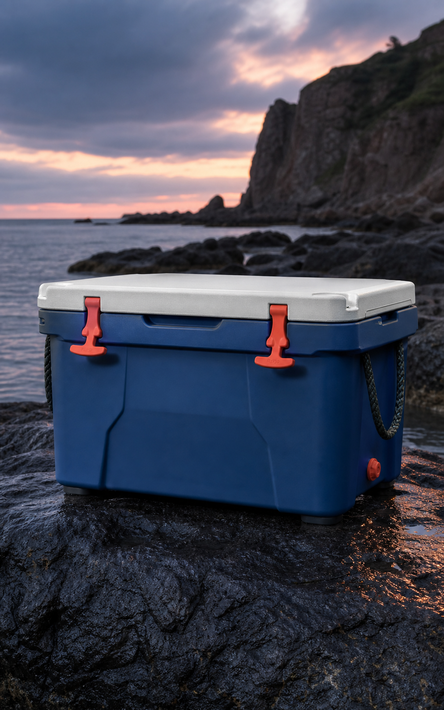

#### 详细信息

- **作者:** [Ecommerce GPT Image Prompts Studio](https://github.com/ecomimagelab)
- **来源:** 本仓库原创内容
- **发布日期:** 2026-07-23
- **语言:** en
- **适用平台:** Shopify
- **许可证:** CC-BY-4.0

<details>
<summary><strong>生产参数、商品保真项与溯源信息</strong></summary>

| 生成模式 | 商品行业 | 使用场景 | 宽高比 |
|---|---|---|---|
| `text-to-image` | 户外装备 | 品牌首图 | 5:8 |

- **视觉风格:** 户外机能, 技术表达, 明亮活泼
- **背景类型:** 户外实景
- **素材用途:** 品牌首图
- **输入要求:** No reference image is required for this fictional unbranded product; use product-edit mode with owned source photography when adapting a real SKU.
- **商品保真项:**
  - Preserve the matte marine-blue 32-liter body, flat ivory lid, and exactly two coral-red front latches.
  - Preserve two charcoal braided side handles, four graphite corner feet, and one coral drain plug low on the right.
- **负面约束:** No brand, text, extra cooler, extra latch, missing handle, wheels, telescoping handle, bottle opener, changed colors, floating lid, warped box, child, alcohol branding, raw meat, or dangerous wildlife. No readable text, logo, trademark, watermark, duplicate product, broken geometry, cheap CGI, collage, or border.

**来源与版权**

- Generated specifically for this repository from the recorded standalone prompt; no third-party preview image is redistributed.
- Original prompt and generated previews created for this repository after visual-pattern and open-source workflow research; no external preview asset is included.
- [visual-research](docs/VISUAL_RESEARCH.md)
- [visual-research](https://github.com/buluslan/gpt-image2-ecommerce)
- [visual-research](https://github.com/motiful/product-shots)
- **平台规则状态:** Platform names identify intended visual treatment only; verify current listing and advertising requirements before publication.
- **商品系列:** [ec-0056](data/prompts/ec-0056-marine-coral-outdoor-cooler-platform-set.json)

</details>

**[🚀 立即体验 →](https://www.pixpix.com/)**

---

<a id="prompt-ec-0056-instagram-adult-camp"></a>

### No. 9: 户外装备 — 海军蓝珊瑚扣户外保温箱多平台套图: INSTAGRAM ADULT CAMP

 

#### 描述

让同一只海军蓝珊瑚扣户外保温箱在白底零售、冰块性能细节、岩岸 DTC、成年露营生活方式和彩色尾箱静物中保持一致。

**模特上身 · Instagram Shop · 5:8**

#### 提示词

```text
Use case: product-mockup.
Asset type: social creative for instagram shop.
Primary request: Create one ultra-photorealistic portrait 5:8 e-commerce image featuring exactly one rugged outdoor cooler.
Product design: one fictional unbranded 32-liter rotomolded outdoor cooler in matte deep-marine blue, with a flat ivory lid, exactly two coral-red rubber front latches, one charcoal braided side handle on each end, four small graphite corner feet, and one coral drain plug low on the right side.
Scene/backdrop: An adult camper sits beside the closed cooler at a simple pine-forest campsite, resting one complete hand on the ivory lid while holding a blank steel cup in the other.
Composition/framing: Use a relaxed full-body direct-flash portrait with the entire cooler, latches, handle, feet, and safe adult posture visible.
Lighting/mood: Direct flash mixed with cool dusk, warm tent glow far behind, natural adult skin, and authentic outdoor texture.
Materials/textures: Render matte rotomolded polymer, ivory textured lid, coral rubber, charcoal braided handles, graphite feet, ice, condensation, and outdoor stone with physically believable surfaces, disciplined commercial retouching, fine natural microtexture, and premium photographic depth.
Product invariants: Preserve the same marine 32-liter body, ivory lid, two coral front latches, two charcoal side handles, four graphite feet, and right coral drain plug.
Constraints: Keep latch, foot, handle, and drain-plug counts and locations consistent; use adult models only. Keep the product fully recognizable and commercially usable; use only fictional, unbranded design details.
Avoid: No child, alcohol, logo clothing, extra cooler, campfire near product, distorted fingers, food waste, text, or wildlife. No brand, text, extra cooler, extra latch, missing handle, wheels, telescoping handle, bottle opener, changed colors, floating lid, warped box, child, alcohol branding, raw meat, or dangerous wildlife. No readable text, brand name, logo, trademark, watermark, duplicate product, broken geometry, cheap CGI, collage, split screen, frame, or border.
```

#### 生成预览图

##### 图片 1

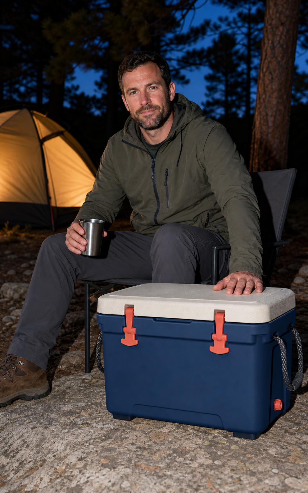

#### 详细信息

- **作者:** [Ecommerce GPT Image Prompts Studio](https://github.com/ecomimagelab)
- **来源:** 本仓库原创内容
- **发布日期:** 2026-07-23
- **语言:** en
- **适用平台:** Instagram Shop
- **许可证:** CC-BY-4.0

<details>
<summary><strong>生产参数、商品保真项与溯源信息</strong></summary>

| 生成模式 | 商品行业 | 使用场景 | 宽高比 |
|---|---|---|---|
| `text-to-image` | 户外装备 | 模特上身 | 5:8 |

- **视觉风格:** 户外机能, 技术表达, 明亮活泼
- **背景类型:** 户外实景
- **素材用途:** 社交创意
- **输入要求:** No reference image is required for this fictional unbranded product; use product-edit mode with owned source photography when adapting a real SKU.
- **商品保真项:**
  - Preserve the matte marine-blue 32-liter body, flat ivory lid, and exactly two coral-red front latches.
  - Preserve two charcoal braided side handles, four graphite corner feet, and one coral drain plug low on the right.
- **负面约束:** No brand, text, extra cooler, extra latch, missing handle, wheels, telescoping handle, bottle opener, changed colors, floating lid, warped box, child, alcohol branding, raw meat, or dangerous wildlife. No readable text, logo, trademark, watermark, duplicate product, broken geometry, cheap CGI, collage, or border.

**来源与版权**

- Generated specifically for this repository from the recorded standalone prompt; no third-party preview image is redistributed.
- Original prompt and generated previews created for this repository after visual-pattern and open-source workflow research; no external preview asset is included.
- [visual-research](docs/VISUAL_RESEARCH.md)
- [visual-research](https://github.com/buluslan/gpt-image2-ecommerce)
- [visual-research](https://github.com/motiful/product-shots)
- **平台规则状态:** Platform names identify intended visual treatment only; verify current listing and advertising requirements before publication.
- **商品系列:** [ec-0056](data/prompts/ec-0056-marine-coral-outdoor-cooler-platform-set.json)

</details>

**[🚀 立即体验 →](https://www.pixpix.com/)**

---

<a id="prompt-ec-0056-pinterest-tailgate-color"></a>

### No. 10: 户外装备 — 海军蓝珊瑚扣户外保温箱多平台套图: PINTEREST TAILGATE COLOR

 

#### 描述

让同一只海军蓝珊瑚扣户外保温箱在白底零售、冰块性能细节、岩岸 DTC、成年露营生活方式和彩色尾箱静物中保持一致。

**生活方式场景 · Pinterest · 5:8**

#### 提示词

```text
Use case: product-mockup.
Asset type: social creative for pinterest.
Primary request: Create one ultra-photorealistic portrait 5:8 e-commerce image featuring exactly one rugged outdoor cooler.
Product design: one fictional unbranded 32-liter rotomolded outdoor cooler in matte deep-marine blue, with a flat ivory lid, exactly two coral-red rubber front latches, one charcoal braided side handle on each end, four small graphite corner feet, and one coral drain plug low on the right side.
Scene/backdrop: Place the closed cooler on a coral picnic mat against a cobalt vehicle tailgate cropped abstractly, with one folded ivory blanket and no people.
Composition/framing: Create a save-worthy graphic outdoor still life with complete cooler silhouette, exact latches, right drain plug, and strong marine-coral color blocking.
Lighting/mood: Hard late sun, crisp geometric shadows, textured fabric, and polished but believable weekend color.
Materials/textures: Render matte rotomolded polymer, ivory textured lid, coral rubber, charcoal braided handles, graphite feet, ice, condensation, and outdoor stone with physically believable surfaces, disciplined commercial retouching, fine natural microtexture, and premium photographic depth.
Product invariants: Preserve the same marine 32-liter body, ivory lid, two coral front latches, two charcoal side handles, four graphite feet, and right coral drain plug.
Constraints: Keep latch, foot, handle, and drain-plug counts and locations consistent; use adult models only. Keep the product fully recognizable and commercially usable; use only fictional, unbranded design details.
Avoid: No vehicle logo, license plate, alcohol, extra cooler, food, text, open lid, or prop covering latches. No brand, text, extra cooler, extra latch, missing handle, wheels, telescoping handle, bottle opener, changed colors, floating lid, warped box, child, alcohol branding, raw meat, or dangerous wildlife. No readable text, brand name, logo, trademark, watermark, duplicate product, broken geometry, cheap CGI, collage, split screen, frame, or border.
```

#### 生成预览图

##### 图片 1

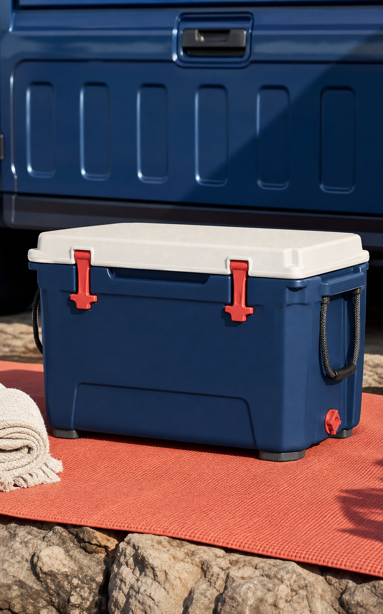

#### 详细信息

- **作者:** [Ecommerce GPT Image Prompts Studio](https://github.com/ecomimagelab)
- **来源:** 本仓库原创内容
- **发布日期:** 2026-07-23
- **语言:** en
- **适用平台:** Pinterest
- **许可证:** CC-BY-4.0

<details>
<summary><strong>生产参数、商品保真项与溯源信息</strong></summary>

| 生成模式 | 商品行业 | 使用场景 | 宽高比 |
|---|---|---|---|
| `text-to-image` | 户外装备 | 生活方式场景 | 5:8 |

- **视觉风格:** 户外机能, 技术表达, 明亮活泼
- **背景类型:** 图形化布景
- **素材用途:** 社交创意
- **输入要求:** No reference image is required for this fictional unbranded product; use product-edit mode with owned source photography when adapting a real SKU.
- **商品保真项:**
  - Preserve the matte marine-blue 32-liter body, flat ivory lid, and exactly two coral-red front latches.
  - Preserve two charcoal braided side handles, four graphite corner feet, and one coral drain plug low on the right.
- **负面约束:** No brand, text, extra cooler, extra latch, missing handle, wheels, telescoping handle, bottle opener, changed colors, floating lid, warped box, child, alcohol branding, raw meat, or dangerous wildlife. No readable text, logo, trademark, watermark, duplicate product, broken geometry, cheap CGI, collage, or border.

**来源与版权**

- Generated specifically for this repository from the recorded standalone prompt; no third-party preview image is redistributed.
- Original prompt and generated previews created for this repository after visual-pattern and open-source workflow research; no external preview asset is included.
- [visual-research](docs/VISUAL_RESEARCH.md)
- [visual-research](https://github.com/buluslan/gpt-image2-ecommerce)
- [visual-research](https://github.com/motiful/product-shots)
- **平台规则状态:** Platform names identify intended visual treatment only; verify current listing and advertising requirements before publication.
- **商品系列:** [ec-0056](data/prompts/ec-0056-marine-coral-outdoor-cooler-platform-set.json)

</details>

**[🚀 立即体验 →](https://www.pixpix.com/)**

---

<a id="categories-toys-and-kids"></a>

<a id="prompt-ec-0055-amazon-stroller-clean-main"></a>

### No. 11: 玩具与儿童用品 — 燕麦色模块化婴儿车多平台套图: AMAZON STROLLER CLEAN MAIN

 

#### 描述

让同一辆燕麦色模块化婴儿车在白底零售、建筑 DTC、成年家长城市使用、安全折叠演示和公园生活方式中保持一致。

**平台主图 · Amazon · 4:5**

#### 提示词

```text
Use case: product-mockup.
Asset type: main image for amazon.
Primary request: Create one ultra-photorealistic portrait 4:5 e-commerce image featuring exactly one premium modular stroller.
Product design: one fictional unbranded modular stroller with an oat-beige recycled-textile seat and full canopy, a matte graphite oval-tube frame, a cognac-brown wrapped push bar, four charcoal wheels with slim terracotta hub rings, a black under-seat basket, and one five-point charcoal harness.
Scene/backdrop: Stand the empty stroller fully open at a front three-quarter angle on seamless pure #FFFFFF with canopy extended halfway and harness visible.
Composition/framing: Center the complete stroller at about 78% frame fill; show all four wheels, frame joints, seat, canopy, push bar, basket, and soft grounding shadow.
Lighting/mood: Broad high-key softboxes, accurate oat textile, clean graphite edges, and neutral white balance.
Materials/textures: Render woven oat textile, matte graphite aluminum, cognac wrap, rubber tires, terracotta hub rings, mesh basket, and realistic stroller joints with physically believable surfaces, disciplined commercial retouching, fine natural microtexture, and premium photographic depth.
Product invariants: Preserve the same oat seat and canopy, graphite oval frame, cognac push bar, four charcoal wheels with terracotta rings, black basket, and charcoal harness.
Constraints: Keep stroller geometry safe and plausible; adult-parent scenes may imply an infant under the closed canopy but must not expose or distort a child. Keep the product fully recognizable and commercially usable; use only fictional, unbranded design details.
Avoid: No baby, parent, bag, blanket, packaging, extra wheel, folded frame, or cropped push bar. No brand, text, extra stroller, three wheels, missing wheel, car seat, cup holder, toy, changed fabric color, unsafe stairs, child standing, visible infant face, runaway stroller, warped frame, or detached harness. No readable text, brand name, logo, trademark, watermark, duplicate product, broken geometry, cheap CGI, collage, split screen, frame, or border.
```

#### 生成预览图

##### 图片 1

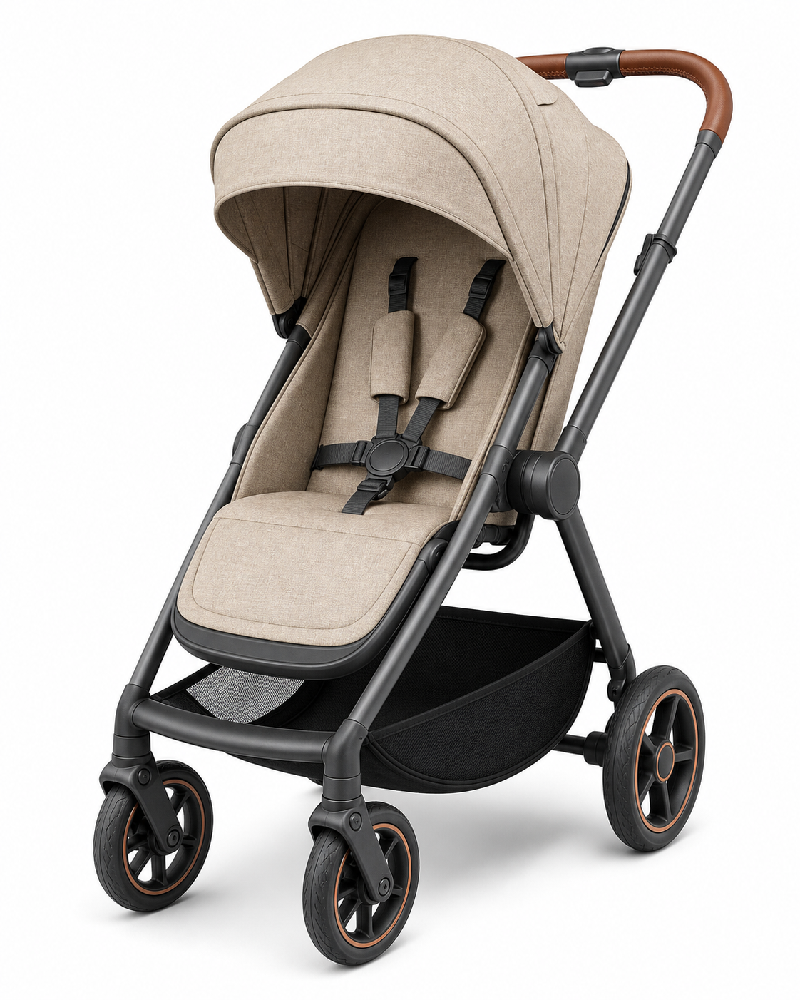

#### 详细信息

- **作者:** [Ecommerce GPT Image Prompts Studio](https://github.com/ecomimagelab)
- **来源:** 本仓库原创内容
- **发布日期:** 2026-07-23
- **语言:** en
- **适用平台:** Amazon
- **许可证:** CC-BY-4.0

<details>
<summary><strong>生产参数、商品保真项与溯源信息</strong></summary>

| 生成模式 | 商品行业 | 使用场景 | 宽高比 |
|---|---|---|---|
| `text-to-image` | 玩具与儿童用品 | 平台主图 | 4:5 |

- **视觉风格:** 极简干净, 静谧生活, 建筑感
- **背景类型:** 纯白背景
- **素材用途:** 平台主图
- **输入要求:** No reference image is required for this fictional unbranded product; use product-edit mode with owned source photography when adapting a real SKU.
- **商品保真项:**
  - Preserve the oat-beige seat and full canopy, graphite oval-tube frame, and cognac wrapped push bar.
  - Preserve four charcoal wheels with terracotta hub rings, black under-seat basket, and five-point charcoal harness.
- **负面约束:** No brand, text, extra stroller, three wheels, missing wheel, car seat, cup holder, toy, changed fabric color, unsafe stairs, child standing, visible infant face, runaway stroller, warped frame, or detached harness. No readable text, logo, trademark, watermark, duplicate product, broken geometry, cheap CGI, collage, or border.

**来源与版权**

- Generated specifically for this repository from the recorded standalone prompt; no third-party preview image is redistributed.
- Original prompt and generated previews created for this repository after visual-pattern and open-source workflow research; no external preview asset is included.
- [visual-research](docs/VISUAL_RESEARCH.md)
- [visual-research](https://github.com/buluslan/gpt-image2-ecommerce)
- [visual-research](https://github.com/motiful/product-shots)
- **平台规则状态:** Platform names identify intended visual treatment only; verify current listing and advertising requirements before publication.
- **商品系列:** [ec-0055](data/prompts/ec-0055-oat-modular-stroller-platform-set.json)

</details>

**[🚀 立即体验 →](https://www.pixpix.com/)**

---

<a id="prompt-ec-0055-shopify-curved-arcade"></a>

### No. 12: 玩具与儿童用品 — 燕麦色模块化婴儿车多平台套图: SHOPIFY CURVED ARCADE

 

#### 描述

让同一辆燕麦色模块化婴儿车在白底零售、建筑 DTC、成年家长城市使用、安全折叠演示和公园生活方式中保持一致。

**品牌首图 · Shopify · 5:8**

#### 提示词

```text
Use case: product-mockup.
Asset type: branded hero for shopify.
Primary request: Create one ultra-photorealistic portrait 5:8 e-commerce image featuring exactly one premium modular stroller.
Product design: one fictional unbranded modular stroller with an oat-beige recycled-textile seat and full canopy, a matte graphite oval-tube frame, a cognac-brown wrapped push bar, four charcoal wheels with slim terracotta hub rings, a black under-seat basket, and one five-point charcoal harness.
Scene/backdrop: Park the empty stroller on pale limestone inside a sunlit curved arcade, canopy extended and wheels aligned naturally.
Composition/framing: Use a low architectural product portrait with the full stroller dominant and repeating arches creating generous vertical depth.
Lighting/mood: Soft morning sun, long curved shadows, warm stone bounce, and crisp textile-frame separation.
Materials/textures: Render woven oat textile, matte graphite aluminum, cognac wrap, rubber tires, terracotta hub rings, mesh basket, and realistic stroller joints with physically believable surfaces, disciplined commercial retouching, fine natural microtexture, and premium photographic depth.
Product invariants: Preserve the same oat seat and canopy, graphite oval frame, cognac push bar, four charcoal wheels with terracotta rings, black basket, and charcoal harness.
Constraints: Keep stroller geometry safe and plausible; adult-parent scenes may imply an infant under the closed canopy but must not expose or distort a child. Keep the product fully recognizable and commercially usable; use only fictional, unbranded design details.
Avoid: No person, baby, stairs, bag, plants, text, extra stroller, or wheel clipping. No brand, text, extra stroller, three wheels, missing wheel, car seat, cup holder, toy, changed fabric color, unsafe stairs, child standing, visible infant face, runaway stroller, warped frame, or detached harness. No readable text, brand name, logo, trademark, watermark, duplicate product, broken geometry, cheap CGI, collage, split screen, frame, or border.
```

#### 生成预览图

##### 图片 1

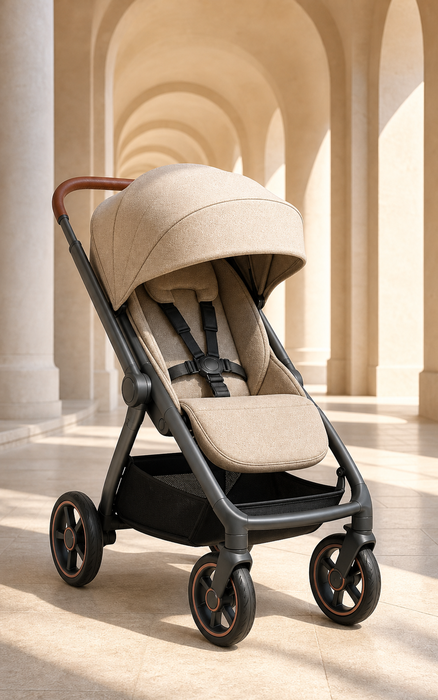

#### 详细信息

- **作者:** [Ecommerce GPT Image Prompts Studio](https://github.com/ecomimagelab)
- **来源:** 本仓库原创内容
- **发布日期:** 2026-07-23
- **语言:** en
- **适用平台:** Shopify
- **许可证:** CC-BY-4.0

<details>
<summary><strong>生产参数、商品保真项与溯源信息</strong></summary>

| 生成模式 | 商品行业 | 使用场景 | 宽高比 |
|---|---|---|---|
| `text-to-image` | 玩具与儿童用品 | 品牌首图 | 5:8 |

- **视觉风格:** 极简干净, 静谧生活, 建筑感
- **背景类型:** 生活方式实景
- **素材用途:** 品牌首图
- **输入要求:** No reference image is required for this fictional unbranded product; use product-edit mode with owned source photography when adapting a real SKU.
- **商品保真项:**
  - Preserve the oat-beige seat and full canopy, graphite oval-tube frame, and cognac wrapped push bar.
  - Preserve four charcoal wheels with terracotta hub rings, black under-seat basket, and five-point charcoal harness.
- **负面约束:** No brand, text, extra stroller, three wheels, missing wheel, car seat, cup holder, toy, changed fabric color, unsafe stairs, child standing, visible infant face, runaway stroller, warped frame, or detached harness. No readable text, logo, trademark, watermark, duplicate product, broken geometry, cheap CGI, collage, or border.

**来源与版权**

- Generated specifically for this repository from the recorded standalone prompt; no third-party preview image is redistributed.
- Original prompt and generated previews created for this repository after visual-pattern and open-source workflow research; no external preview asset is included.
- [visual-research](docs/VISUAL_RESEARCH.md)
- [visual-research](https://github.com/buluslan/gpt-image2-ecommerce)
- [visual-research](https://github.com/motiful/product-shots)
- **平台规则状态:** Platform names identify intended visual treatment only; verify current listing and advertising requirements before publication.
- **商品系列:** [ec-0055](data/prompts/ec-0055-oat-modular-stroller-platform-set.json)

</details>

**[🚀 立即体验 →](https://www.pixpix.com/)**

---

<a id="prompt-ec-0055-instagram-adult-parent-walk"></a>

### No. 13: 玩具与儿童用品 — 燕麦色模块化婴儿车多平台套图: INSTAGRAM ADULT PARENT WALK

 

#### 描述

让同一辆燕麦色模块化婴儿车在白底零售、建筑 DTC、成年家长城市使用、安全折叠演示和公园生活方式中保持一致。

**模特上身 · Instagram Shop · 5:8**

#### 提示词

```text
Use case: product-mockup.
Asset type: social creative for instagram shop.
Primary request: Create one ultra-photorealistic portrait 5:8 e-commerce image featuring exactly one premium modular stroller.
Product design: one fictional unbranded modular stroller with an oat-beige recycled-textile seat and full canopy, a matte graphite oval-tube frame, a cognac-brown wrapped push bar, four charcoal wheels with slim terracotta hub rings, a black under-seat basket, and one five-point charcoal harness.
Scene/backdrop: An adult parent pushes the stroller along a wide modern pedestrian path; the full canopy is closed over a sleeping infant who is not visible, and the parent wears plain navy clothing.
Composition/framing: Use a full-body side-three-quarter walking frame with complete adult anatomy, both hands naturally on the push bar, all four wheels, and stroller silhouette visible.
Lighting/mood: Late-afternoon city sun with direct-flash lift, natural adult expression, moving shadow, and premium lifestyle texture.
Materials/textures: Render woven oat textile, matte graphite aluminum, cognac wrap, rubber tires, terracotta hub rings, mesh basket, and realistic stroller joints with physically believable surfaces, disciplined commercial retouching, fine natural microtexture, and premium photographic depth.
Product invariants: Preserve the same oat seat and canopy, graphite oval frame, cognac push bar, four charcoal wheels with terracotta rings, black basket, and charcoal harness.
Constraints: Keep stroller geometry safe and plausible; adult-parent scenes may imply an infant under the closed canopy but must not expose or distort a child. Keep the product fully recognizable and commercially usable; use only fictional, unbranded design details.
Avoid: No visible child face, extra stroller, phone use, stairs, traffic, distorted hands, logo clothing, running pose, or detached wheel. No brand, text, extra stroller, three wheels, missing wheel, car seat, cup holder, toy, changed fabric color, unsafe stairs, child standing, visible infant face, runaway stroller, warped frame, or detached harness. No readable text, brand name, logo, trademark, watermark, duplicate product, broken geometry, cheap CGI, collage, split screen, frame, or border.
```

#### 生成预览图

##### 图片 1

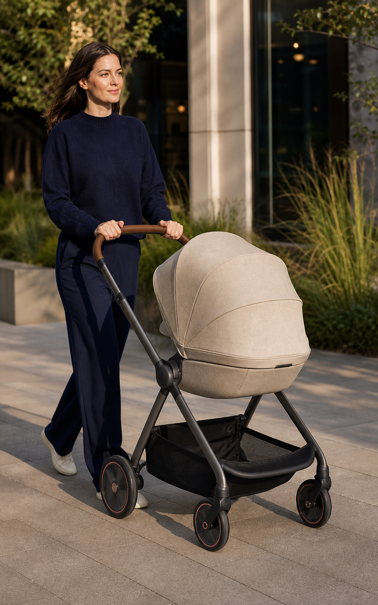

#### 详细信息

- **作者:** [Ecommerce GPT Image Prompts Studio](https://github.com/ecomimagelab)
- **来源:** 本仓库原创内容
- **发布日期:** 2026-07-23
- **语言:** en
- **适用平台:** Instagram Shop
- **许可证:** CC-BY-4.0

<details>
<summary><strong>生产参数、商品保真项与溯源信息</strong></summary>

| 生成模式 | 商品行业 | 使用场景 | 宽高比 |
|---|---|---|---|
| `text-to-image` | 玩具与儿童用品 | 模特上身 | 5:8 |

- **视觉风格:** 极简干净, 静谧生活, 建筑感
- **背景类型:** 生活方式实景
- **素材用途:** 社交创意
- **输入要求:** No reference image is required for this fictional unbranded product; use product-edit mode with owned source photography when adapting a real SKU.
- **商品保真项:**
  - Preserve the oat-beige seat and full canopy, graphite oval-tube frame, and cognac wrapped push bar.
  - Preserve four charcoal wheels with terracotta hub rings, black under-seat basket, and five-point charcoal harness.
- **负面约束:** No brand, text, extra stroller, three wheels, missing wheel, car seat, cup holder, toy, changed fabric color, unsafe stairs, child standing, visible infant face, runaway stroller, warped frame, or detached harness. No readable text, logo, trademark, watermark, duplicate product, broken geometry, cheap CGI, collage, or border.

**来源与版权**

- Generated specifically for this repository from the recorded standalone prompt; no third-party preview image is redistributed.
- Original prompt and generated previews created for this repository after visual-pattern and open-source workflow research; no external preview asset is included.
- [visual-research](docs/VISUAL_RESEARCH.md)
- [visual-research](https://github.com/buluslan/gpt-image2-ecommerce)
- [visual-research](https://github.com/motiful/product-shots)
- **平台规则状态:** Platform names identify intended visual treatment only; verify current listing and advertising requirements before publication.
- **商品系列:** [ec-0055](data/prompts/ec-0055-oat-modular-stroller-platform-set.json)

</details>

**[🚀 立即体验 →](https://www.pixpix.com/)**

---

<a id="prompt-ec-0055-tiktok-safe-fold-demo"></a>

### No. 14: 玩具与儿童用品 — 燕麦色模块化婴儿车多平台套图: TIKTOK SHOP SAFE FOLD DEMO

 

#### 描述

让同一辆燕麦色模块化婴儿车在白底零售、建筑 DTC、成年家长城市使用、安全折叠演示和公园生活方式中保持一致。

**功能卖点图 · TikTok Shop · 5:8**

#### 提示词

```text
Use case: product-mockup.
Asset type: secondary image for tiktok shop.
Primary request: Create one ultra-photorealistic portrait 5:8 e-commerce image featuring exactly one premium modular stroller.
Product design: one fictional unbranded modular stroller with an oat-beige recycled-textile seat and full canopy, a matte graphite oval-tube frame, a cognac-brown wrapped push bar, four charcoal wheels with slim terracotta hub rings, a black under-seat basket, and one five-point charcoal harness.
Scene/backdrop: An adult demonstrator safely folds the empty stroller on a pale-gray studio floor, holding the cognac push bar with one hand and a clearly visible central frame release with the other.
Composition/framing: Use a close full-product vertical frame showing complete hands, all wheels, collapsing frame path, empty seat, and no body part near pinch points.
Lighting/mood: Bright soft studio light with direct-flash clarity, crisp mechanism detail, and neutral instructional polish without text.
Materials/textures: Render woven oat textile, matte graphite aluminum, cognac wrap, rubber tires, terracotta hub rings, mesh basket, and realistic stroller joints with physically believable surfaces, disciplined commercial retouching, fine natural microtexture, and premium photographic depth.
Product invariants: Preserve the same oat seat and canopy, graphite oval frame, cognac push bar, four charcoal wheels with terracotta rings, black basket, and charcoal harness.
Constraints: Keep stroller geometry safe and plausible; adult-parent scenes may imply an infant under the closed canopy but must not expose or distort a child. Keep the product fully recognizable and commercially usable; use only fictional, unbranded design details.
Avoid: No child, extra fingers, unsafe pinch, detached parts, floating arrows, labels, second stroller, or impossible fold. No brand, text, extra stroller, three wheels, missing wheel, car seat, cup holder, toy, changed fabric color, unsafe stairs, child standing, visible infant face, runaway stroller, warped frame, or detached harness. No readable text, brand name, logo, trademark, watermark, duplicate product, broken geometry, cheap CGI, collage, split screen, frame, or border.
```

#### 生成预览图

##### 图片 1

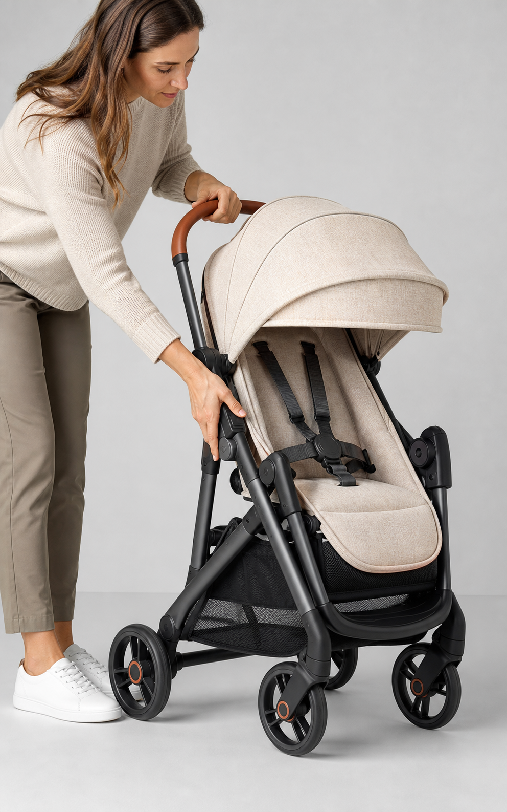

#### 详细信息

- **作者:** [Ecommerce GPT Image Prompts Studio](https://github.com/ecomimagelab)
- **来源:** 本仓库原创内容
- **发布日期:** 2026-07-23
- **语言:** en
- **适用平台:** TikTok Shop
- **许可证:** CC-BY-4.0

<details>
<summary><strong>生产参数、商品保真项与溯源信息</strong></summary>

| 生成模式 | 商品行业 | 使用场景 | 宽高比 |
|---|---|---|---|
| `text-to-image` | 玩具与儿童用品 | 功能卖点图 | 5:8 |

- **视觉风格:** 极简干净, 静谧生活, 建筑感
- **背景类型:** 柔光影棚
- **素材用途:** 商品副图
- **输入要求:** No reference image is required for this fictional unbranded product; use product-edit mode with owned source photography when adapting a real SKU.
- **商品保真项:**
  - Preserve the oat-beige seat and full canopy, graphite oval-tube frame, and cognac wrapped push bar.
  - Preserve four charcoal wheels with terracotta hub rings, black under-seat basket, and five-point charcoal harness.
- **负面约束:** No brand, text, extra stroller, three wheels, missing wheel, car seat, cup holder, toy, changed fabric color, unsafe stairs, child standing, visible infant face, runaway stroller, warped frame, or detached harness. No readable text, logo, trademark, watermark, duplicate product, broken geometry, cheap CGI, collage, or border.

**来源与版权**

- Generated specifically for this repository from the recorded standalone prompt; no third-party preview image is redistributed.
- Original prompt and generated previews created for this repository after visual-pattern and open-source workflow research; no external preview asset is included.
- [visual-research](docs/VISUAL_RESEARCH.md)
- [visual-research](https://github.com/buluslan/gpt-image2-ecommerce)
- [visual-research](https://github.com/motiful/product-shots)
- **平台规则状态:** Platform names identify intended visual treatment only; verify current listing and advertising requirements before publication.
- **商品系列:** [ec-0055](data/prompts/ec-0055-oat-modular-stroller-platform-set.json)

</details>

**[🚀 立即体验 →](https://www.pixpix.com/)**

---

<a id="prompt-ec-0055-pinterest-park-still"></a>

### No. 15: 玩具与儿童用品 — 燕麦色模块化婴儿车多平台套图: PINTEREST PARK STILL

 

#### 描述

让同一辆燕麦色模块化婴儿车在白底零售、建筑 DTC、成年家长城市使用、安全折叠演示和公园生活方式中保持一致。

**生活方式场景 · Pinterest · 5:8**

#### 提示词

```text
Use case: product-mockup.
Asset type: social creative for pinterest.
Primary request: Create one ultra-photorealistic portrait 5:8 e-commerce image featuring exactly one premium modular stroller.
Product design: one fictional unbranded modular stroller with an oat-beige recycled-textile seat and full canopy, a matte graphite oval-tube frame, a cognac-brown wrapped push bar, four charcoal wheels with slim terracotta hub rings, a black under-seat basket, and one five-point charcoal harness.
Scene/backdrop: Park the empty stroller beside a curved pale-stone bench in a quiet green park at golden hour, with canopy open and harness neatly arranged.
Composition/framing: Create a save-worthy lifestyle portrait with the full stroller, all wheels, cognac handle, oat canopy, and softly layered trees.
Lighting/mood: Warm backlight, cool green shadow, subtle lens depth, and realistic park texture.
Materials/textures: Render woven oat textile, matte graphite aluminum, cognac wrap, rubber tires, terracotta hub rings, mesh basket, and realistic stroller joints with physically believable surfaces, disciplined commercial retouching, fine natural microtexture, and premium photographic depth.
Product invariants: Preserve the same oat seat and canopy, graphite oval frame, cognac push bar, four charcoal wheels with terracotta rings, black basket, and charcoal harness.
Constraints: Keep stroller geometry safe and plausible; adult-parent scenes may imply an infant under the closed canopy but must not expose or distort a child. Keep the product fully recognizable and commercially usable; use only fictional, unbranded design details.
Avoid: No child, parent, picnic props, extra stroller, flowers in basket, text, traffic, or floating product. No brand, text, extra stroller, three wheels, missing wheel, car seat, cup holder, toy, changed fabric color, unsafe stairs, child standing, visible infant face, runaway stroller, warped frame, or detached harness. No readable text, brand name, logo, trademark, watermark, duplicate product, broken geometry, cheap CGI, collage, split screen, frame, or border.
```

#### 生成预览图

##### 图片 1

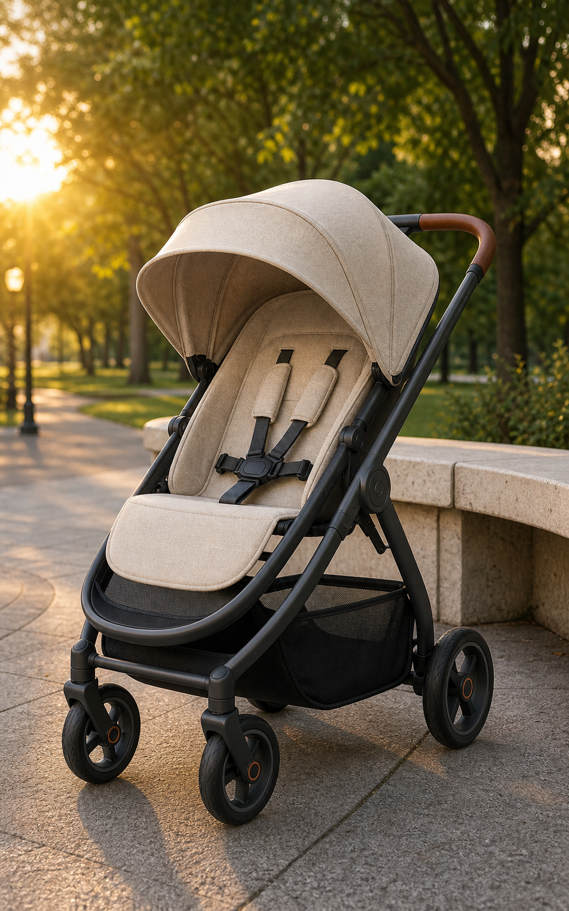

#### 详细信息

- **作者:** [Ecommerce GPT Image Prompts Studio](https://github.com/ecomimagelab)
- **来源:** 本仓库原创内容
- **发布日期:** 2026-07-23
- **语言:** en
- **适用平台:** Pinterest
- **许可证:** CC-BY-4.0

<details>
<summary><strong>生产参数、商品保真项与溯源信息</strong></summary>

| 生成模式 | 商品行业 | 使用场景 | 宽高比 |
|---|---|---|---|
| `text-to-image` | 玩具与儿童用品 | 生活方式场景 | 5:8 |

- **视觉风格:** 极简干净, 静谧生活, 建筑感
- **背景类型:** 户外实景
- **素材用途:** 社交创意
- **输入要求:** No reference image is required for this fictional unbranded product; use product-edit mode with owned source photography when adapting a real SKU.
- **商品保真项:**
  - Preserve the oat-beige seat and full canopy, graphite oval-tube frame, and cognac wrapped push bar.
  - Preserve four charcoal wheels with terracotta hub rings, black under-seat basket, and five-point charcoal harness.
- **负面约束:** No brand, text, extra stroller, three wheels, missing wheel, car seat, cup holder, toy, changed fabric color, unsafe stairs, child standing, visible infant face, runaway stroller, warped frame, or detached harness. No readable text, logo, trademark, watermark, duplicate product, broken geometry, cheap CGI, collage, or border.

**来源与版权**

- Generated specifically for this repository from the recorded standalone prompt; no third-party preview image is redistributed.
- Original prompt and generated previews created for this repository after visual-pattern and open-source workflow research; no external preview asset is included.
- [visual-research](docs/VISUAL_RESEARCH.md)
- [visual-research](https://github.com/buluslan/gpt-image2-ecommerce)
- [visual-research](https://github.com/motiful/product-shots)
- **平台规则状态:** Platform names identify intended visual treatment only; verify current listing and advertising requirements before publication.
- **商品系列:** [ec-0055](data/prompts/ec-0055-oat-modular-stroller-platform-set.json)

</details>

**[🚀 立即体验 →](https://www.pixpix.com/)**

---

<a id="categories-home-and-furniture"></a>

<a id="platforms-wayfair"></a>

<a id="prompt-ec-0054-wayfair-vase-clean-main"></a>

### No. 16: 家居与家具 — 琥珀钴蓝雕塑玻璃花器多平台套图: WAYFAIR VASE CLEAN MAIN

 

#### 描述

让同一只琥珀钴蓝双色雕塑花器在家居零售、日落建筑、彩色室内、成年花艺和玻璃工艺中保持一致。

**平台主图 · Wayfair · 4:5**

#### 提示词

```text
Use case: product-mockup.
Asset type: main image for wayfair.
Primary request: Create one ultra-photorealistic portrait 4:5 e-commerce image featuring exactly one sculptural glass vase.
Product design: one fictional unbranded hand-blown sculptural vase formed by a low transparent amber sphere fused to a tall asymmetrical cobalt-blue neck that bends gently left, with one clear circular side handle bridging sphere and neck, a thick flat clear base, and no decoration.
Scene/backdrop: Stand the empty vase upright on seamless pure #FFFFFF with no props or flowers.
Composition/framing: Center the complete vase at about 72% frame fill; show amber sphere, cobalt neck bend, clear handle, base, rim, and soft optical grounding shadow.
Lighting/mood: Broad high-key glass softboxes, controlled transmission, crisp color separation, subtle caustic, and neutral white balance.
Materials/textures: Render hand-blown amber and cobalt glass, optical clear handle and base, subtle bubbles, polished rim, refraction, and realistic caustics with physically believable surfaces, disciplined commercial retouching, fine natural microtexture, and premium photographic depth.
Product invariants: Preserve the same amber spherical body, left-bending cobalt neck, clear circular side handle, thick flat clear base, and asymmetric proportions.
Constraints: Keep the fused glass geometry physically plausible and use only one vase; flowers may appear only where specified. Keep the product fully recognizable and commercially usable; use only fictional, unbranded design details.
Avoid: No flower, water, hand, packaging, second vase, harsh clipping, or hidden handle. No brand, text, extra vase, ceramic texture, straight neck, missing handle, second handle, cracked glass, impossible floating fusion, changed colors, excessive bubbles, child, warped flowers, or liquid spill. No readable text, brand name, logo, trademark, watermark, duplicate product, broken geometry, cheap CGI, collage, split screen, frame, or border.
```

#### 生成预览图

##### 图片 1

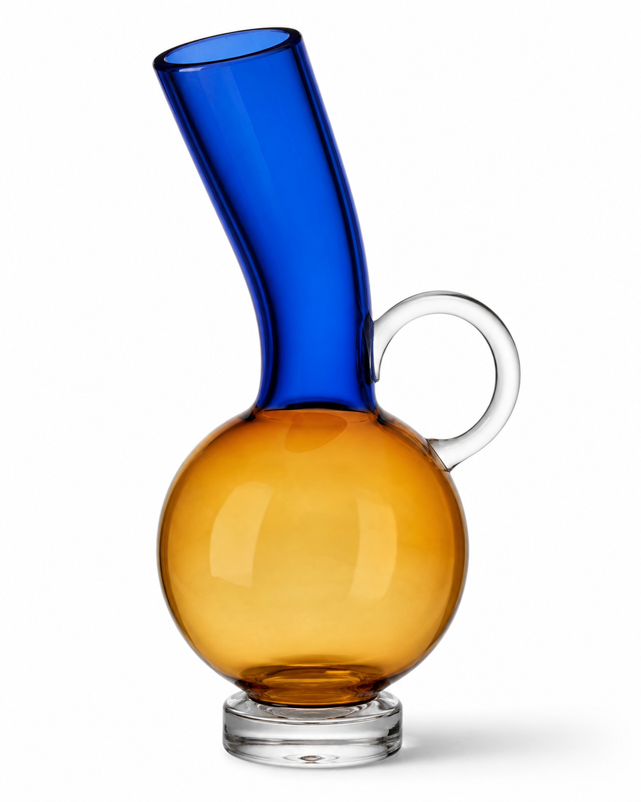

#### 详细信息

- **作者:** [Ecommerce GPT Image Prompts Studio](https://github.com/ecomimagelab)
- **来源:** 本仓库原创内容
- **发布日期:** 2026-07-23
- **语言:** en
- **适用平台:** Wayfair
- **许可证:** CC-BY-4.0

<details>
<summary><strong>生产参数、商品保真项与溯源信息</strong></summary>

| 生成模式 | 商品行业 | 使用场景 | 宽高比 |
|---|---|---|---|
| `text-to-image` | 家居与家具 | 平台主图 | 4:5 |

- **视觉风格:** 建筑感, 明亮活泼, 手作质感
- **背景类型:** 纯白背景
- **素材用途:** 平台主图
- **输入要求:** No reference image is required for this fictional unbranded product; use product-edit mode with owned source photography when adapting a real SKU.
- **商品保真项:**
  - Preserve the low transparent amber spherical body and tall cobalt neck bending gently left.
  - Preserve the clear circular side handle, thick flat clear base, polished rim, and asymmetric hand-blown proportions.
- **负面约束:** No brand, text, extra vase, ceramic texture, straight neck, missing handle, second handle, cracked glass, impossible floating fusion, changed colors, excessive bubbles, child, warped flowers, or liquid spill. No readable text, logo, trademark, watermark, duplicate product, broken geometry, cheap CGI, collage, or border.

**来源与版权**

- Generated specifically for this repository from the recorded standalone prompt; no third-party preview image is redistributed.
- Original prompt and generated previews created for this repository after visual-pattern and open-source workflow research; no external preview asset is included.
- [visual-research](docs/VISUAL_RESEARCH.md)
- [visual-research](https://github.com/buluslan/gpt-image2-ecommerce)
- [visual-research](https://github.com/motiful/product-shots)
- **平台规则状态:** Platform names identify intended visual treatment only; verify current listing and advertising requirements before publication.
- **商品系列:** [ec-0054](data/prompts/ec-0054-amber-cobalt-glass-vase-platform-set.json)

</details>

**[🚀 立即体验 →](https://www.pixpix.com/)**

---

<a id="prompt-ec-0054-shopify-architectural-sunset"></a>

### No. 17: 家居与家具 — 琥珀钴蓝雕塑玻璃花器多平台套图: SHOPIFY ARCHITECTURAL SUNSET

  

#### 描述

让同一只琥珀钴蓝双色雕塑花器在家居零售、日落建筑、彩色室内、成年花艺和玻璃工艺中保持一致。

**品牌首图 · Shopify · 5:8**

#### 提示词

```text
Use case: product-mockup.
Asset type: branded hero for shopify.
Primary request: Create one ultra-photorealistic portrait 5:8 e-commerce image featuring exactly one sculptural glass vase.
Product design: one fictional unbranded hand-blown sculptural vase formed by a low transparent amber sphere fused to a tall asymmetrical cobalt-blue neck that bends gently left, with one clear circular side handle bridging sphere and neck, a thick flat clear base, and no decoration.
Scene/backdrop: Stand the empty vase on a long travertine console inside a curved cream room where sunset enters through one tall arched opening.
Composition/framing: Use a tall architectural composition with the vase in the lower third, complete silhouette and handle visible, and sweeping amber-cobalt caustics across the wall.
Lighting/mood: Low golden sun, cool cobalt shadow, luminous glass transmission, and quiet plaster depth.
Materials/textures: Render hand-blown amber and cobalt glass, optical clear handle and base, subtle bubbles, polished rim, refraction, and realistic caustics with physically believable surfaces, disciplined commercial retouching, fine natural microtexture, and premium photographic depth.
Product invariants: Preserve the same amber spherical body, left-bending cobalt neck, clear circular side handle, thick flat clear base, and asymmetric proportions.
Constraints: Keep the fused glass geometry physically plausible and use only one vase; flowers may appear only where specified. Keep the product fully recognizable and commercially usable; use only fictional, unbranded design details.
Avoid: No flowers, person, second vase, wall art, text, clutter, or sun flare obscuring glass. No brand, text, extra vase, ceramic texture, straight neck, missing handle, second handle, cracked glass, impossible floating fusion, changed colors, excessive bubbles, child, warped flowers, or liquid spill. No readable text, brand name, logo, trademark, watermark, duplicate product, broken geometry, cheap CGI, collage, split screen, frame, or border.
```

#### 生成预览图

##### 图片 1


#### 详细信息

- **作者:** [Ecommerce GPT Image Prompts Studio](https://github.com/ecomimagelab)
- **来源:** 本仓库原创内容
- **发布日期:** 2026-07-23
- **语言:** en
- **适用平台:** Shopify
- **许可证:** CC-BY-4.0

<details>
<summary><strong>生产参数、商品保真项与溯源信息</strong></summary>

| 生成模式 | 商品行业 | 使用场景 | 宽高比 |
|---|---|---|---|
| `text-to-image` | 家居与家具 | 品牌首图 | 5:8 |

- **视觉风格:** 建筑感, 明亮活泼, 手作质感
- **背景类型:** 家居空间
- **素材用途:** 品牌首图
- **输入要求:** No reference image is required for this fictional unbranded product; use product-edit mode with owned source photography when adapting a real SKU.
- **商品保真项:**
  - Preserve the low transparent amber spherical body and tall cobalt neck bending gently left.
  - Preserve the clear circular side handle, thick flat clear base, polished rim, and asymmetric hand-blown proportions.
- **负面约束:** No brand, text, extra vase, ceramic texture, straight neck, missing handle, second handle, cracked glass, impossible floating fusion, changed colors, excessive bubbles, child, warped flowers, or liquid spill. No readable text, logo, trademark, watermark, duplicate product, broken geometry, cheap CGI, collage, or border.

**来源与版权**

- Generated specifically for this repository from the recorded standalone prompt; no third-party preview image is redistributed.
- Original prompt and generated previews created for this repository after visual-pattern and open-source workflow research; no external preview asset is included.
- [visual-research](docs/VISUAL_RESEARCH.md)
- [visual-research](https://github.com/buluslan/gpt-image2-ecommerce)
- [visual-research](https://github.com/motiful/product-shots)
- **平台规则状态:** Platform names identify intended visual treatment only; verify current listing and advertising requirements before publication.
- **商品系列:** [ec-0054](data/prompts/ec-0054-amber-cobalt-glass-vase-platform-set.json)

</details>

**[🚀 立即体验 →](https://www.pixpix.com/)**

---

<a id="prompt-ec-0054-pinterest-cobalt-apricot-room"></a>

### No. 18: 家居与家具 — 琥珀钴蓝雕塑玻璃花器多平台套图: PINTEREST COBALT APRICOT ROOM

 

#### 描述

让同一只琥珀钴蓝双色雕塑花器在家居零售、日落建筑、彩色室内、成年花艺和玻璃工艺中保持一致。

**生活方式场景 · Pinterest · 5:8**

#### 提示词

```text
Use case: product-mockup.
Asset type: social creative for pinterest.
Primary request: Create one ultra-photorealistic portrait 5:8 e-commerce image featuring exactly one sculptural glass vase.
Product design: one fictional unbranded hand-blown sculptural vase formed by a low transparent amber sphere fused to a tall asymmetrical cobalt-blue neck that bends gently left, with one clear circular side handle bridging sphere and neck, a thick flat clear base, and no decoration.
Scene/backdrop: Place the empty vase on a pale lilac shelf against an apricot wall beside one cobalt tubular chair far below.
Composition/framing: Create a save-worthy interior crop with the vase dominant, bold color planes, clean negative space, and complete handle geometry.
Lighting/mood: Hard side sun, graphic colored shadows, crisp refraction, and playful but controlled editorial color.
Materials/textures: Render hand-blown amber and cobalt glass, optical clear handle and base, subtle bubbles, polished rim, refraction, and realistic caustics with physically believable surfaces, disciplined commercial retouching, fine natural microtexture, and premium photographic depth.
Product invariants: Preserve the same amber spherical body, left-bending cobalt neck, clear circular side handle, thick flat clear base, and asymmetric proportions.
Constraints: Keep the fused glass geometry physically plausible and use only one vase; flowers may appear only where specified. Keep the product fully recognizable and commercially usable; use only fictional, unbranded design details.
Avoid: No flowers, books, extra vase, text, clutter, chair overlapping vase, or cropped neck. No brand, text, extra vase, ceramic texture, straight neck, missing handle, second handle, cracked glass, impossible floating fusion, changed colors, excessive bubbles, child, warped flowers, or liquid spill. No readable text, brand name, logo, trademark, watermark, duplicate product, broken geometry, cheap CGI, collage, split screen, frame, or border.
```

#### 生成预览图

##### 图片 1

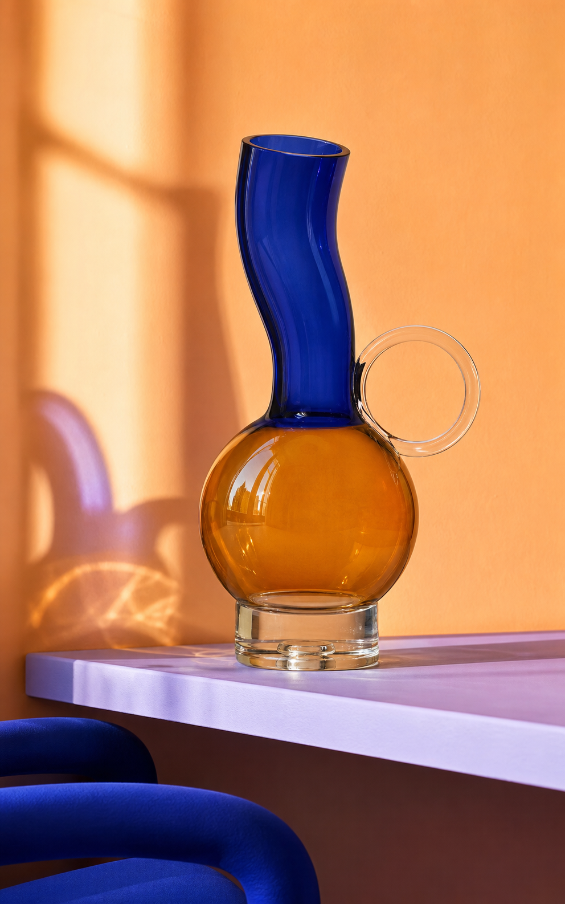

#### 详细信息

- **作者:** [Ecommerce GPT Image Prompts Studio](https://github.com/ecomimagelab)
- **来源:** 本仓库原创内容
- **发布日期:** 2026-07-23
- **语言:** en
- **适用平台:** Pinterest
- **许可证:** CC-BY-4.0

<details>
<summary><strong>生产参数、商品保真项与溯源信息</strong></summary>

| 生成模式 | 商品行业 | 使用场景 | 宽高比 |
|---|---|---|---|
| `text-to-image` | 家居与家具 | 生活方式场景 | 5:8 |

- **视觉风格:** 建筑感, 明亮活泼, 手作质感
- **背景类型:** 家居空间
- **素材用途:** 社交创意
- **输入要求:** No reference image is required for this fictional unbranded product; use product-edit mode with owned source photography when adapting a real SKU.
- **商品保真项:**
  - Preserve the low transparent amber spherical body and tall cobalt neck bending gently left.
  - Preserve the clear circular side handle, thick flat clear base, polished rim, and asymmetric hand-blown proportions.
- **负面约束:** No brand, text, extra vase, ceramic texture, straight neck, missing handle, second handle, cracked glass, impossible floating fusion, changed colors, excessive bubbles, child, warped flowers, or liquid spill. No readable text, logo, trademark, watermark, duplicate product, broken geometry, cheap CGI, collage, or border.

**来源与版权**

- Generated specifically for this repository from the recorded standalone prompt; no third-party preview image is redistributed.
- Original prompt and generated previews created for this repository after visual-pattern and open-source workflow research; no external preview asset is included.
- [visual-research](docs/VISUAL_RESEARCH.md)
- [visual-research](https://github.com/buluslan/gpt-image2-ecommerce)
- [visual-research](https://github.com/motiful/product-shots)
- **平台规则状态:** Platform names identify intended visual treatment only; verify current listing and advertising requirements before publication.
- **商品系列:** [ec-0054](data/prompts/ec-0054-amber-cobalt-glass-vase-platform-set.json)

</details>

**[🚀 立即体验 →](https://www.pixpix.com/)**

---

<a id="prompt-ec-0054-instagram-adult-florist"></a>

### No. 19: 家居与家具 — 琥珀钴蓝雕塑玻璃花器多平台套图: INSTAGRAM ADULT FLORIST

 

#### 描述

让同一只琥珀钴蓝双色雕塑花器在家居零售、日落建筑、彩色室内、成年花艺和玻璃工艺中保持一致。

**模特上身 · Instagram Shop · 5:8**

#### 提示词

```text
Use case: product-mockup.
Asset type: social creative for instagram shop.
Primary request: Create one ultra-photorealistic portrait 5:8 e-commerce image featuring exactly one sculptural glass vase.
Product design: one fictional unbranded hand-blown sculptural vase formed by a low transparent amber sphere fused to a tall asymmetrical cobalt-blue neck that bends gently left, with one clear circular side handle bridging sphere and neck, a thick flat clear base, and no decoration.
Scene/backdrop: An adult florist in a plain charcoal apron places three long rust-colored branches into the vase on a dry worktable.
Composition/framing: Use a waist-up direct-flash portrait showing complete natural hands, full vase silhouette, clear handle, branch entry, and concentrated adult expression.
Lighting/mood: Soft workshop daylight mixed with direct flash, real adult skin, luminous glass, and tactile candid energy.
Materials/textures: Render hand-blown amber and cobalt glass, optical clear handle and base, subtle bubbles, polished rim, refraction, and realistic caustics with physically believable surfaces, disciplined commercial retouching, fine natural microtexture, and premium photographic depth.
Product invariants: Preserve the same amber spherical body, left-bending cobalt neck, clear circular side handle, thick flat clear base, and asymmetric proportions.
Constraints: Keep the fused glass geometry physically plausible and use only one vase; flowers may appear only where specified. Keep the product fully recognizable and commercially usable; use only fictional, unbranded design details.
Avoid: No child, extra fingers, extra vase, water spill, logo apron, flowers hiding neck or handle, text, or crowded shop. No brand, text, extra vase, ceramic texture, straight neck, missing handle, second handle, cracked glass, impossible floating fusion, changed colors, excessive bubbles, child, warped flowers, or liquid spill. No readable text, brand name, logo, trademark, watermark, duplicate product, broken geometry, cheap CGI, collage, split screen, frame, or border.
```

#### 生成预览图

##### 图片 1

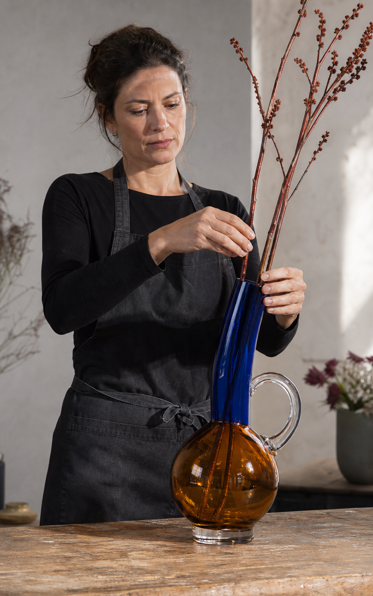

#### 详细信息

- **作者:** [Ecommerce GPT Image Prompts Studio](https://github.com/ecomimagelab)
- **来源:** 本仓库原创内容
- **发布日期:** 2026-07-23
- **语言:** en
- **适用平台:** Instagram Shop
- **许可证:** CC-BY-4.0

<details>
<summary><strong>生产参数、商品保真项与溯源信息</strong></summary>

| 生成模式 | 商品行业 | 使用场景 | 宽高比 |
|---|---|---|---|
| `text-to-image` | 家居与家具 | 模特上身 | 5:8 |

- **视觉风格:** 建筑感, 明亮活泼, 手作质感
- **背景类型:** 生活方式实景
- **素材用途:** 社交创意
- **输入要求:** No reference image is required for this fictional unbranded product; use product-edit mode with owned source photography when adapting a real SKU.
- **商品保真项:**
  - Preserve the low transparent amber spherical body and tall cobalt neck bending gently left.
  - Preserve the clear circular side handle, thick flat clear base, polished rim, and asymmetric hand-blown proportions.
- **负面约束:** No brand, text, extra vase, ceramic texture, straight neck, missing handle, second handle, cracked glass, impossible floating fusion, changed colors, excessive bubbles, child, warped flowers, or liquid spill. No readable text, logo, trademark, watermark, duplicate product, broken geometry, cheap CGI, collage, or border.

**来源与版权**

- Generated specifically for this repository from the recorded standalone prompt; no third-party preview image is redistributed.
- Original prompt and generated previews created for this repository after visual-pattern and open-source workflow research; no external preview asset is included.
- [visual-research](docs/VISUAL_RESEARCH.md)
- [visual-research](https://github.com/buluslan/gpt-image2-ecommerce)
- [visual-research](https://github.com/motiful/product-shots)
- **平台规则状态:** Platform names identify intended visual treatment only; verify current listing and advertising requirements before publication.
- **商品系列:** [ec-0054](data/prompts/ec-0054-amber-cobalt-glass-vase-platform-set.json)

</details>

**[🚀 立即体验 →](https://www.pixpix.com/)**

---

<a id="prompt-ec-0054-etsy-glassmaker-bench"></a>

### No. 20: 家居与家具 — 琥珀钴蓝雕塑玻璃花器多平台套图: ETSY GLASSMAKER BENCH

 

#### 描述

让同一只琥珀钴蓝双色雕塑花器在家居零售、日落建筑、彩色室内、成年花艺和玻璃工艺中保持一致。

**生活方式场景 · Etsy · 4:5**

#### 提示词

```text
Use case: product-mockup.
Asset type: secondary image for etsy.
Primary request: Create one ultra-photorealistic portrait 4:5 e-commerce image featuring exactly one sculptural glass vase.
Product design: one fictional unbranded hand-blown sculptural vase formed by a low transparent amber sphere fused to a tall asymmetrical cobalt-blue neck that bends gently left, with one clear circular side handle bridging sphere and neck, a thick flat clear base, and no decoration.
Scene/backdrop: Stand the finished empty vase on a scorched wooden glassmaker's bench beside one plain graphite paddle and a folded heat cloth, with the furnace softly blurred far behind.
Composition/framing: Use an intimate three-quarter craft portrait emphasizing hand-blown bubbles, fused color seam, clear handle, base thickness, and polished rim.
Lighting/mood: Warm furnace ambience, cool window rim, gentle film grain, and honest workshop texture.
Materials/textures: Render hand-blown amber and cobalt glass, optical clear handle and base, subtle bubbles, polished rim, refraction, and realistic caustics with physically believable surfaces, disciplined commercial retouching, fine natural microtexture, and premium photographic depth.
Product invariants: Preserve the same amber spherical body, left-bending cobalt neck, clear circular side handle, thick flat clear base, and asymmetric proportions.
Constraints: Keep the fused glass geometry physically plausible and use only one vase; flowers may appear only where specified. Keep the product fully recognizable and commercially usable; use only fictional, unbranded design details.
Avoid: No active molten glass, person, fire touching vase, written tools, extra vessel, cracks, smoke covering product, or clutter. No brand, text, extra vase, ceramic texture, straight neck, missing handle, second handle, cracked glass, impossible floating fusion, changed colors, excessive bubbles, child, warped flowers, or liquid spill. No readable text, brand name, logo, trademark, watermark, duplicate product, broken geometry, cheap CGI, collage, split screen, frame, or border.
```

#### 生成预览图

##### 图片 1

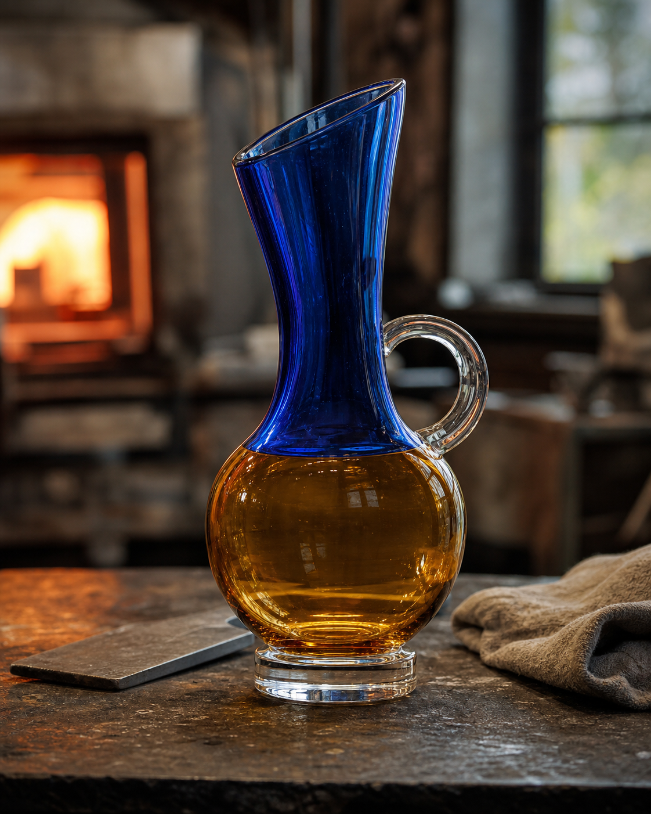

#### 详细信息

- **作者:** [Ecommerce GPT Image Prompts Studio](https://github.com/ecomimagelab)
- **来源:** 本仓库原创内容
- **发布日期:** 2026-07-23
- **语言:** en
- **适用平台:** Etsy
- **许可证:** CC-BY-4.0

<details>
<summary><strong>生产参数、商品保真项与溯源信息</strong></summary>

| 生成模式 | 商品行业 | 使用场景 | 宽高比 |
|---|---|---|---|
| `text-to-image` | 家居与家具 | 生活方式场景 | 4:5 |

- **视觉风格:** 建筑感, 明亮活泼, 手作质感
- **背景类型:** 天然材质
- **素材用途:** 商品副图
- **输入要求:** No reference image is required for this fictional unbranded product; use product-edit mode with owned source photography when adapting a real SKU.
- **商品保真项:**
  - Preserve the low transparent amber spherical body and tall cobalt neck bending gently left.
  - Preserve the clear circular side handle, thick flat clear base, polished rim, and asymmetric hand-blown proportions.
- **负面约束:** No brand, text, extra vase, ceramic texture, straight neck, missing handle, second handle, cracked glass, impossible floating fusion, changed colors, excessive bubbles, child, warped flowers, or liquid spill. No readable text, logo, trademark, watermark, duplicate product, broken geometry, cheap CGI, collage, or border.

**来源与版权**

- Generated specifically for this repository from the recorded standalone prompt; no third-party preview image is redistributed.
- Original prompt and generated previews created for this repository after visual-pattern and open-source workflow research; no external preview asset is included.
- [visual-research](docs/VISUAL_RESEARCH.md)
- [visual-research](https://github.com/buluslan/gpt-image2-ecommerce)
- [visual-research](https://github.com/motiful/product-shots)
- **平台规则状态:** Platform names identify intended visual treatment only; verify current listing and advertising requirements before publication.
- **商品系列:** [ec-0054](data/prompts/ec-0054-amber-cobalt-glass-vase-platform-set.json)

</details>

**[🚀 立即体验 →](https://www.pixpix.com/)**

---

<a id="categories-food-and-beverage"></a>

<a id="platforms-amazon-grocery"></a>

<a id="platforms-xiaohongshu"></a>

<a id="prompt-ec-0053-amazon-grocery-can-trio"></a>

### No. 21: 食品与饮料 — 柑橘植物气泡水多平台套图: AMAZON GROCERY CAN TRIO

 

#### 描述

让同一组三口味植物气泡水在食品零售、水花 DTC、成年海滩创作者、彩色野餐和 Pinterest 包装静物中保持一致。

**平台主图 · Amazon Grocery · 4:5**

#### 提示词

```text
Use case: product-mockup.
Asset type: main image for amazon grocery.
Primary request: Create one ultra-photorealistic portrait 4:5 e-commerce image featuring exactly three slim sparkling-water cans, one of each flavor color.
Product design: one fictional unbranded trio of slim 330 ml matte aluminum cans sharing a blank cream vertical oval panel and one small embossed bubble motif, with exactly one coral can, one cobalt can, and one celery-green can; each has a silver pull tab and no words.
Scene/backdrop: Stand the three unopened cans in a shallow staggered row on seamless pure #FFFFFF: coral left, cobalt center, celery right.
Composition/framing: Center the complete trio at about 76% frame fill; show all blank cream ovals, top rims, silver tabs, bottoms, and soft shared shadow.
Lighting/mood: Broad high-key beverage softboxes, clean matte color, restrained condensation-free surfaces, and neutral white balance.
Materials/textures: Render matte printed aluminum, silver pull tabs, condensation, clear carbonated water, citrus peel, and realistic cold-can reflections with physically believable surfaces, disciplined commercial retouching, fine natural microtexture, and premium photographic depth.
Product invariants: Preserve the same three slim cans, exact coral-cobalt-celery color trio, blank cream oval panels, small embossed bubble motifs, and silver tabs.
Constraints: Show exactly three cans—one coral, one cobalt, one celery—unless a close lifestyle crop explicitly focuses on one while the other two remain present. Keep the product fully recognizable and commercially usable; use only fictional, unbranded design details.
Avoid: No fruit, ice, water, hand, packaging, extra can, open tab, or cropped base. No brand, letters, nutrition text, extra can, duplicate color, missing can, plastic bottle, straw, alcohol cue, energy-drink styling, child, deformed pull tab, floating fruit, or unsupported health claim. No readable text, brand name, logo, trademark, watermark, duplicate product, broken geometry, cheap CGI, collage, split screen, frame, or border.
```

#### 生成预览图

##### 图片 1

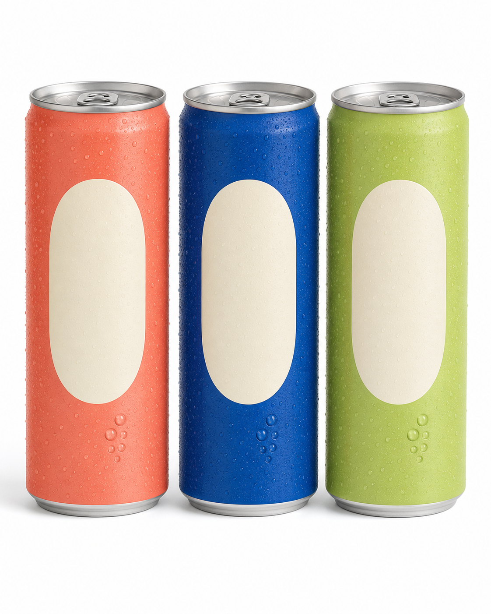

#### 详细信息

- **作者:** [Ecommerce GPT Image Prompts Studio](https://github.com/ecomimagelab)
- **来源:** 本仓库原创内容
- **发布日期:** 2026-07-23
- **语言:** en
- **适用平台:** Amazon Grocery
- **许可证:** CC-BY-4.0

<details>
<summary><strong>生产参数、商品保真项与溯源信息</strong></summary>

| 生成模式 | 商品行业 | 使用场景 | 宽高比 |
|---|---|---|---|
| `text-to-image` | 食品与饮料 | 平台主图 | 4:5 |

- **视觉风格:** 明亮活泼, 美食编辑, 社交原生
- **背景类型:** 纯白背景
- **素材用途:** 平台主图
- **输入要求:** No reference image is required for this fictional unbranded product; use product-edit mode with owned source photography when adapting a real SKU.
- **商品保真项:**
  - Preserve exactly three slim 330 ml cans in coral, cobalt, and celery green.
  - Preserve the blank cream vertical oval panel, small embossed bubble motif, and silver pull tab on every can.
- **负面约束:** No brand, letters, nutrition text, extra can, duplicate color, missing can, plastic bottle, straw, alcohol cue, energy-drink styling, child, deformed pull tab, floating fruit, or unsupported health claim. No readable text, logo, trademark, watermark, duplicate product, broken geometry, cheap CGI, collage, or border.

**来源与版权**

- Generated specifically for this repository from the recorded standalone prompt; no third-party preview image is redistributed.
- Original prompt and generated previews created for this repository after visual-pattern and open-source workflow research; no external preview asset is included.
- [visual-research](docs/VISUAL_RESEARCH.md)
- [visual-research](https://github.com/buluslan/gpt-image2-ecommerce)
- [visual-research](https://github.com/motiful/product-shots)
- **平台规则状态:** Platform names identify intended visual treatment only; verify current listing and advertising requirements before publication.
- **商品系列:** [ec-0053](data/prompts/ec-0053-citrus-botanical-sparkling-water-platform-set.json)

</details>

**[🚀 立即体验 →](https://www.pixpix.com/)**

---

<a id="prompt-ec-0053-shopify-citrus-splash"></a>

### No. 22: 食品与饮料 — 柑橘植物气泡水多平台套图: SHOPIFY CITRUS SPLASH

 

#### 描述

让同一组三口味植物气泡水在食品零售、水花 DTC、成年海滩创作者、彩色野餐和 Pinterest 包装静物中保持一致。

**品牌首图 · Shopify · 5:8**

#### 提示词

```text
Use case: product-mockup.
Asset type: branded hero for shopify.
Primary request: Create one ultra-photorealistic portrait 5:8 e-commerce image featuring exactly three slim sparkling-water cans, one of each flavor color.
Product design: one fictional unbranded trio of slim 330 ml matte aluminum cans sharing a blank cream vertical oval panel and one small embossed bubble motif, with exactly one coral can, one cobalt can, and one celery-green can; each has a silver pull tab and no words.
Scene/backdrop: Stand the three cans on a shallow clear-water plane against a pale sky-blue background while one controlled transparent splash arcs behind them; add one curl each of orange, lemon, and lime peel on the floor.
Composition/framing: Use a low centered hero composition with all cans unobstructed, exact color order, blank panels readable, and generous vertical freshness.
Lighting/mood: Hard sun through water, bright caustics, cold rim light, crisp condensation, and energetic but premium color.
Materials/textures: Render matte printed aluminum, silver pull tabs, condensation, clear carbonated water, citrus peel, and realistic cold-can reflections with physically believable surfaces, disciplined commercial retouching, fine natural microtexture, and premium photographic depth.
Product invariants: Preserve the same three slim cans, exact coral-cobalt-celery color trio, blank cream oval panels, small embossed bubble motifs, and silver tabs.
Constraints: Show exactly three cans—one coral, one cobalt, one celery—unless a close lifestyle crop explicitly focuses on one while the other two remain present. Keep the product fully recognizable and commercially usable; use only fictional, unbranded design details.
Avoid: No fruit slice covering panel, extra can, colored liquid, straw, floating peel, logo, or splash crossing the products. No brand, letters, nutrition text, extra can, duplicate color, missing can, plastic bottle, straw, alcohol cue, energy-drink styling, child, deformed pull tab, floating fruit, or unsupported health claim. No readable text, brand name, logo, trademark, watermark, duplicate product, broken geometry, cheap CGI, collage, split screen, frame, or border.
```

#### 生成预览图

##### 图片 1

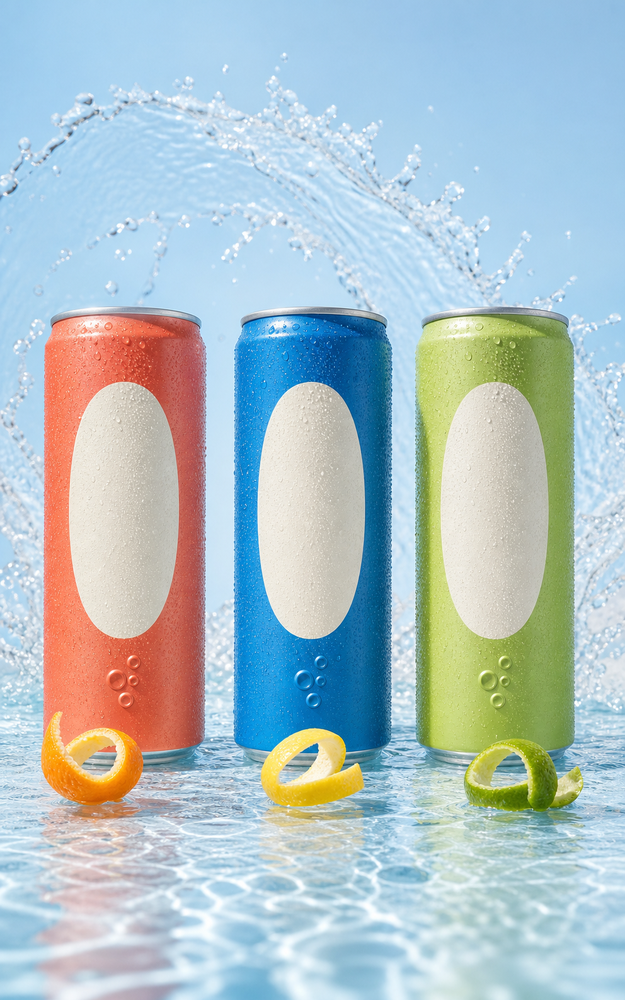

#### 详细信息

- **作者:** [Ecommerce GPT Image Prompts Studio](https://github.com/ecomimagelab)
- **来源:** 本仓库原创内容
- **发布日期:** 2026-07-23
- **语言:** en
- **适用平台:** Shopify
- **许可证:** CC-BY-4.0

<details>
<summary><strong>生产参数、商品保真项与溯源信息</strong></summary>

| 生成模式 | 商品行业 | 使用场景 | 宽高比 |
|---|---|---|---|
| `text-to-image` | 食品与饮料 | 品牌首图 | 5:8 |

- **视觉风格:** 明亮活泼, 美食编辑, 社交原生
- **背景类型:** 彩色影棚
- **素材用途:** 品牌首图
- **输入要求:** No reference image is required for this fictional unbranded product; use product-edit mode with owned source photography when adapting a real SKU.
- **商品保真项:**
  - Preserve exactly three slim 330 ml cans in coral, cobalt, and celery green.
  - Preserve the blank cream vertical oval panel, small embossed bubble motif, and silver pull tab on every can.
- **负面约束:** No brand, letters, nutrition text, extra can, duplicate color, missing can, plastic bottle, straw, alcohol cue, energy-drink styling, child, deformed pull tab, floating fruit, or unsupported health claim. No readable text, logo, trademark, watermark, duplicate product, broken geometry, cheap CGI, collage, or border.

**来源与版权**

- Generated specifically for this repository from the recorded standalone prompt; no third-party preview image is redistributed.
- Original prompt and generated previews created for this repository after visual-pattern and open-source workflow research; no external preview asset is included.
- [visual-research](docs/VISUAL_RESEARCH.md)
- [visual-research](https://github.com/buluslan/gpt-image2-ecommerce)
- [visual-research](https://github.com/motiful/product-shots)
- **平台规则状态:** Platform names identify intended visual treatment only; verify current listing and advertising requirements before publication.
- **商品系列:** [ec-0053](data/prompts/ec-0053-citrus-botanical-sparkling-water-platform-set.json)

</details>

**[🚀 立即体验 →](https://www.pixpix.com/)**

---

<a id="prompt-ec-0053-tiktok-adult-beach-cooler"></a>

### No. 23: 食品与饮料 — 柑橘植物气泡水多平台套图: TIKTOK SHOP BEACH COOLER

 

#### 描述

让同一组三口味植物气泡水在食品零售、水花 DTC、成年海滩创作者、彩色野餐和 Pinterest 包装静物中保持一致。

**模特上身 · TikTok Shop · 5:8**

#### 提示词

```text
Use case: product-mockup.
Asset type: social creative for tiktok shop.
Primary request: Create one ultra-photorealistic portrait 5:8 e-commerce image featuring exactly three slim sparkling-water cans, one of each flavor color.
Product design: one fictional unbranded trio of slim 330 ml matte aluminum cans sharing a blank cream vertical oval panel and one small embossed bubble motif, with exactly one coral can, one cobalt can, and one celery-green can; each has a silver pull tab and no words.
Scene/backdrop: An adult woman at a sunny beach opens a plain cream cooler containing the three cans nestled in ice; she lifts only the coral can while cobalt and celery remain visible.
Composition/framing: Use a close vertical creator frame showing her complete hands, all three cans, open cooler, natural adult posture, and bright sea bokeh.
Lighting/mood: Direct flash in hard sun, sparkling ice texture, candid adult skin, and saturated summer contrast.
Materials/textures: Render matte printed aluminum, silver pull tabs, condensation, clear carbonated water, citrus peel, and realistic cold-can reflections with physically believable surfaces, disciplined commercial retouching, fine natural microtexture, and premium photographic depth.
Product invariants: Preserve the same three slim cans, exact coral-cobalt-celery color trio, blank cream oval panels, small embossed bubble motifs, and silver tabs.
Constraints: Show exactly three cans—one coral, one cobalt, one celery—unless a close lifestyle crop explicitly focuses on one while the other two remain present. Keep the product fully recognizable and commercially usable; use only fictional, unbranded design details.
Avoid: No child, alcohol, drinking action, logo swimwear, extra can, distorted fingers, can hidden by ice, text, or crowded beach. No brand, letters, nutrition text, extra can, duplicate color, missing can, plastic bottle, straw, alcohol cue, energy-drink styling, child, deformed pull tab, floating fruit, or unsupported health claim. No readable text, brand name, logo, trademark, watermark, duplicate product, broken geometry, cheap CGI, collage, split screen, frame, or border.
```

#### 生成预览图

##### 图片 1

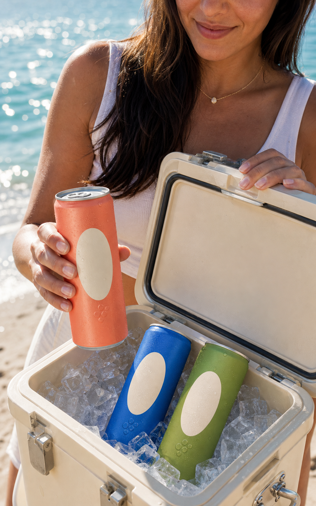

#### 详细信息

- **作者:** [Ecommerce GPT Image Prompts Studio](https://github.com/ecomimagelab)
- **来源:** 本仓库原创内容
- **发布日期:** 2026-07-23
- **语言:** en
- **适用平台:** TikTok Shop
- **许可证:** CC-BY-4.0

<details>
<summary><strong>生产参数、商品保真项与溯源信息</strong></summary>

| 生成模式 | 商品行业 | 使用场景 | 宽高比 |
|---|---|---|---|
| `text-to-image` | 食品与饮料 | 模特上身 | 5:8 |

- **视觉风格:** 明亮活泼, 美食编辑, 社交原生
- **背景类型:** 户外实景
- **素材用途:** 社交创意
- **输入要求:** No reference image is required for this fictional unbranded product; use product-edit mode with owned source photography when adapting a real SKU.
- **商品保真项:**
  - Preserve exactly three slim 330 ml cans in coral, cobalt, and celery green.
  - Preserve the blank cream vertical oval panel, small embossed bubble motif, and silver pull tab on every can.
- **负面约束:** No brand, letters, nutrition text, extra can, duplicate color, missing can, plastic bottle, straw, alcohol cue, energy-drink styling, child, deformed pull tab, floating fruit, or unsupported health claim. No readable text, logo, trademark, watermark, duplicate product, broken geometry, cheap CGI, collage, or border.

**来源与版权**

- Generated specifically for this repository from the recorded standalone prompt; no third-party preview image is redistributed.
- Original prompt and generated previews created for this repository after visual-pattern and open-source workflow research; no external preview asset is included.
- [visual-research](docs/VISUAL_RESEARCH.md)
- [visual-research](https://github.com/buluslan/gpt-image2-ecommerce)
- [visual-research](https://github.com/motiful/product-shots)
- **平台规则状态:** Platform names identify intended visual treatment only; verify current listing and advertising requirements before publication.
- **商品系列:** [ec-0053](data/prompts/ec-0053-citrus-botanical-sparkling-water-platform-set.json)

</details>

**[🚀 立即体验 →](https://www.pixpix.com/)**

---

<a id="prompt-ec-0053-xiaohongshu-citrus-picnic"></a>

### No. 24: 食品与饮料 — 柑橘植物气泡水多平台套图: XIAOHONGSHU CITRUS PICNIC

 

#### 描述

让同一组三口味植物气泡水在食品零售、水花 DTC、成年海滩创作者、彩色野餐和 Pinterest 包装静物中保持一致。

**生活方式场景 · 小红书 · 4:5**

#### 提示词

```text
Use case: product-mockup.
Asset type: social creative for xiaohongshu.
Primary request: Create one ultra-photorealistic portrait 4:5 e-commerce image featuring exactly three slim sparkling-water cans, one of each flavor color.
Product design: one fictional unbranded trio of slim 330 ml matte aluminum cans sharing a blank cream vertical oval panel and one small embossed bubble motif, with exactly one coral can, one cobalt can, and one celery-green can; each has a silver pull tab and no words.
Scene/backdrop: Arrange the three closed cans on a checkerboard apricot picnic cloth beside one plain glass of sparkling water and three small citrus wedges.
Composition/framing: Use a bright overhead social composition with exact can colors, blank oval panels, neat negative space, and natural picnic imperfection.
Lighting/mood: Soft noon daylight with gentle flash lift, crisp bubbles in glass, matte can texture, and cheerful color.
Materials/textures: Render matte printed aluminum, silver pull tabs, condensation, clear carbonated water, citrus peel, and realistic cold-can reflections with physically believable surfaces, disciplined commercial retouching, fine natural microtexture, and premium photographic depth.
Product invariants: Preserve the same three slim cans, exact coral-cobalt-celery color trio, blank cream oval panels, small embossed bubble motifs, and silver tabs.
Constraints: Show exactly three cans—one coral, one cobalt, one celery—unless a close lifestyle crop explicitly focuses on one while the other two remain present. Keep the product fully recognizable and commercially usable; use only fictional, unbranded design details.
Avoid: No person, readable napkin, extra beverage, straw, snack branding, extra can, or fruit covering panels. No brand, letters, nutrition text, extra can, duplicate color, missing can, plastic bottle, straw, alcohol cue, energy-drink styling, child, deformed pull tab, floating fruit, or unsupported health claim. No readable text, brand name, logo, trademark, watermark, duplicate product, broken geometry, cheap CGI, collage, split screen, frame, or border.
```

#### 生成预览图

##### 图片 1

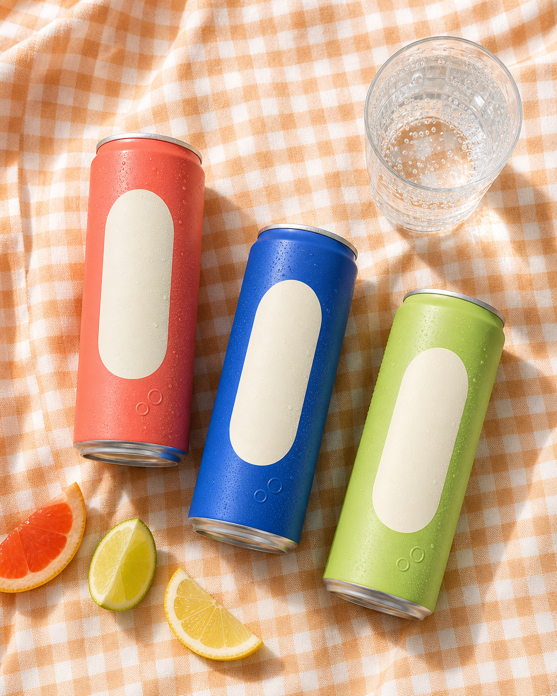

#### 详细信息

- **作者:** [Ecommerce GPT Image Prompts Studio](https://github.com/ecomimagelab)
- **来源:** 本仓库原创内容
- **发布日期:** 2026-07-23
- **语言:** en
- **适用平台:** 小红书
- **许可证:** CC-BY-4.0

<details>
<summary><strong>生产参数、商品保真项与溯源信息</strong></summary>

| 生成模式 | 商品行业 | 使用场景 | 宽高比 |
|---|---|---|---|
| `text-to-image` | 食品与饮料 | 生活方式场景 | 4:5 |

- **视觉风格:** 明亮活泼, 美食编辑, 社交原生
- **背景类型:** 图形化布景
- **素材用途:** 社交创意
- **输入要求:** No reference image is required for this fictional unbranded product; use product-edit mode with owned source photography when adapting a real SKU.
- **商品保真项:**
  - Preserve exactly three slim 330 ml cans in coral, cobalt, and celery green.
  - Preserve the blank cream vertical oval panel, small embossed bubble motif, and silver pull tab on every can.
- **负面约束:** No brand, letters, nutrition text, extra can, duplicate color, missing can, plastic bottle, straw, alcohol cue, energy-drink styling, child, deformed pull tab, floating fruit, or unsupported health claim. No readable text, logo, trademark, watermark, duplicate product, broken geometry, cheap CGI, collage, or border.

**来源与版权**

- Generated specifically for this repository from the recorded standalone prompt; no third-party preview image is redistributed.
- Original prompt and generated previews created for this repository after visual-pattern and open-source workflow research; no external preview asset is included.
- [visual-research](docs/VISUAL_RESEARCH.md)
- [visual-research](https://github.com/buluslan/gpt-image2-ecommerce)
- [visual-research](https://github.com/motiful/product-shots)
- **平台规则状态:** Platform names identify intended visual treatment only; verify current listing and advertising requirements before publication.
- **商品系列:** [ec-0053](data/prompts/ec-0053-citrus-botanical-sparkling-water-platform-set.json)

</details>

**[🚀 立即体验 →](https://www.pixpix.com/)**

---

<a id="usecases-social-ad"></a>

<a id="prompt-ec-0053-pinterest-gradient-packaging"></a>

### No. 25: 食品与饮料 — 柑橘植物气泡水多平台套图: PINTEREST GRADIENT PACKAGING

 

#### 描述

让同一组三口味植物气泡水在食品零售、水花 DTC、成年海滩创作者、彩色野餐和 Pinterest 包装静物中保持一致。

**社交电商广告 · Pinterest · 5:8**

#### 提示词

```text
Use case: product-mockup.
Asset type: social creative for pinterest.
Primary request: Create one ultra-photorealistic portrait 5:8 e-commerce image featuring exactly three slim sparkling-water cans, one of each flavor color.
Product design: one fictional unbranded trio of slim 330 ml matte aluminum cans sharing a blank cream vertical oval panel and one small embossed bubble motif, with exactly one coral can, one cobalt can, and one celery-green can; each has a silver pull tab and no words.
Scene/backdrop: Balance the three cans on stepped cylinders against a coral-to-cobalt gradient set with one celery circular shadow plane.
Composition/framing: Create a save-worthy vertical packaging portrait using height variation, exact color trio, clean panel visibility, and sculptural negative space.
Lighting/mood: Hard graphic light, clean colored shadows, restrained condensation, and precise aluminum highlights.
Materials/textures: Render matte printed aluminum, silver pull tabs, condensation, clear carbonated water, citrus peel, and realistic cold-can reflections with physically believable surfaces, disciplined commercial retouching, fine natural microtexture, and premium photographic depth.
Product invariants: Preserve the same three slim cans, exact coral-cobalt-celery color trio, blank cream oval panels, small embossed bubble motifs, and silver tabs.
Constraints: Show exactly three cans—one coral, one cobalt, one celery—unless a close lifestyle crop explicitly focuses on one while the other two remain present. Keep the product fully recognizable and commercially usable; use only fictional, unbranded design details.
Avoid: No fruit, people, water, text, extra can, floating product, duplicate color, or cropped top. No brand, letters, nutrition text, extra can, duplicate color, missing can, plastic bottle, straw, alcohol cue, energy-drink styling, child, deformed pull tab, floating fruit, or unsupported health claim. No readable text, brand name, logo, trademark, watermark, duplicate product, broken geometry, cheap CGI, collage, split screen, frame, or border.
```

#### 生成预览图

##### 图片 1

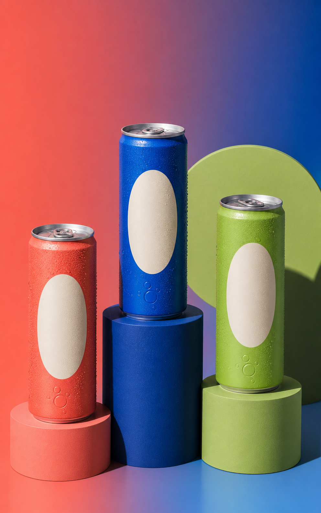

#### 详细信息

- **作者:** [Ecommerce GPT Image Prompts Studio](https://github.com/ecomimagelab)
- **来源:** 本仓库原创内容
- **发布日期:** 2026-07-23
- **语言:** en
- **适用平台:** Pinterest
- **许可证:** CC-BY-4.0

<details>
<summary><strong>生产参数、商品保真项与溯源信息</strong></summary>

| 生成模式 | 商品行业 | 使用场景 | 宽高比 |
|---|---|---|---|
| `text-to-image` | 食品与饮料 | 社交电商广告 | 5:8 |

- **视觉风格:** 明亮活泼, 美食编辑, 社交原生
- **背景类型:** 图形化布景
- **素材用途:** 社交创意
- **输入要求:** No reference image is required for this fictional unbranded product; use product-edit mode with owned source photography when adapting a real SKU.
- **商品保真项:**
  - Preserve exactly three slim 330 ml cans in coral, cobalt, and celery green.
  - Preserve the blank cream vertical oval panel, small embossed bubble motif, and silver pull tab on every can.
- **负面约束:** No brand, letters, nutrition text, extra can, duplicate color, missing can, plastic bottle, straw, alcohol cue, energy-drink styling, child, deformed pull tab, floating fruit, or unsupported health claim. No readable text, logo, trademark, watermark, duplicate product, broken geometry, cheap CGI, collage, or border.

**来源与版权**

- Generated specifically for this repository from the recorded standalone prompt; no third-party preview image is redistributed.
- Original prompt and generated previews created for this repository after visual-pattern and open-source workflow research; no external preview asset is included.
- [visual-research](docs/VISUAL_RESEARCH.md)
- [visual-research](https://github.com/buluslan/gpt-image2-ecommerce)
- [visual-research](https://github.com/motiful/product-shots)
- **平台规则状态:** Platform names identify intended visual treatment only; verify current listing and advertising requirements before publication.
- **商品系列:** [ec-0053](data/prompts/ec-0053-citrus-botanical-sparkling-water-platform-set.json)

</details>

**[🚀 立即体验 →](https://www.pixpix.com/)**

---

<a id="prompt-ec-0052-amazon-grocery-box-main"></a>

### No. 26: 食品与饮料 — 午夜蓝植物纹夹心巧克力礼盒多平台套图: AMAZON GROCERY BOX MAIN

 

#### 描述

让同一盒十二枚午夜蓝植物纹夹心巧克力在食品目录、暗调 DTC 开盒、成年赠礼、巧克力工艺和大胆 Pinterest 静物中保持一致。

**平台主图 · Amazon Grocery · 4:5**

#### 提示词

```text
Use case: product-mockup.
Asset type: main image for amazon grocery.
Primary request: Create one ultra-photorealistic portrait 4:5 e-commerce image featuring exactly one premium twelve-piece bonbon box.
Product design: one fictional unbranded rigid square bonbon box in matte midnight-blue paper with a blank embossed copper botanical line pattern, a burnt-orange inner tray holding exactly twelve glossy chocolates in a three-by-four grid, alternating dark-cocoa domes, ivory cubes, and pistachio-green faceted pieces, with no writing.
Scene/backdrop: Place the open box front three-quarter on seamless pure #FFFFFF with the lid standing behind and all twelve chocolates visible.
Composition/framing: Center the complete box and lid at about 76% frame fill; keep the three-by-four grid, copper pattern, orange tray, corners, and soft shadow crisp.
Lighting/mood: Broad high-key food softboxes, controlled chocolate gloss, true color, and neutral white balance.
Materials/textures: Render matte paper, blind copper embossing without letters, burnt-orange card, glossy tempered chocolate, cocoa powder, and fine nut texture with physically believable surfaces, disciplined commercial retouching, fine natural microtexture, and premium photographic depth.
Product invariants: Preserve the same midnight square box, copper botanical line pattern, orange tray, exact twelve-piece three-by-four grid, and three repeating chocolate designs.
Constraints: Show exactly twelve chocolates when the open tray is visible; keep food clean, plausible, and free of unsupported claims. Keep the product fully recognizable and commercially usable; use only fictional, unbranded design details.
Avoid: No hand, ribbon, loose chocolate, crumbs, packaging sleeve, extra lid, or cropped box. No brand, readable text, extra box, missing chocolate, more than twelve pieces, random colors, gold logo, ribbon, melted chocolate, bite marks unless specified, child, alcohol, or warped grid. No readable text, brand name, logo, trademark, watermark, duplicate product, broken geometry, cheap CGI, collage, split screen, frame, or border.
```

#### 生成预览图

##### 图片 1

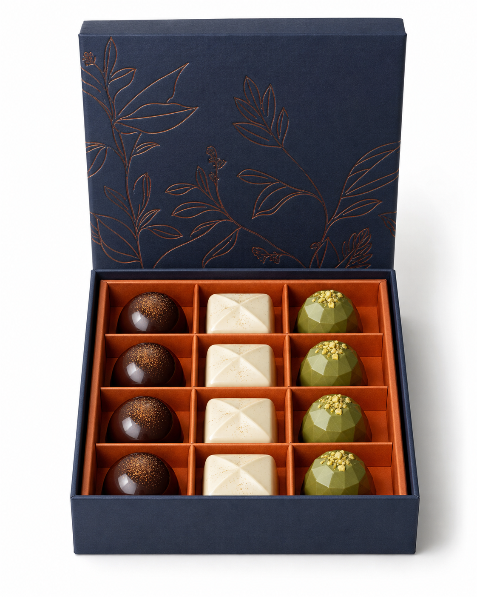

#### 详细信息

- **作者:** [Ecommerce GPT Image Prompts Studio](https://github.com/ecomimagelab)
- **来源:** 本仓库原创内容
- **发布日期:** 2026-07-23
- **语言:** en
- **适用平台:** Amazon Grocery
- **许可证:** CC-BY-4.0

<details>
<summary><strong>生产参数、商品保真项与溯源信息</strong></summary>

| 生成模式 | 商品行业 | 使用场景 | 宽高比 |
|---|---|---|---|
| `text-to-image` | 食品与饮料 | 平台主图 | 4:5 |

- **视觉风格:** 美食编辑, 高端奢华, 明亮活泼
- **背景类型:** 纯白背景
- **素材用途:** 平台主图
- **输入要求:** No reference image is required for this fictional unbranded product; use product-edit mode with owned source photography when adapting a real SKU.
- **商品保真项:**
  - Preserve the matte midnight-blue square box, blank copper botanical line pattern, and burnt-orange inner tray.
  - Preserve exactly twelve chocolates in a three-by-four grid alternating dark domes, ivory cubes, and pistachio faceted pieces.
- **负面约束:** No brand, readable text, extra box, missing chocolate, more than twelve pieces, random colors, gold logo, ribbon, melted chocolate, bite marks unless specified, child, alcohol, or warped grid. No readable text, logo, trademark, watermark, duplicate product, broken geometry, cheap CGI, collage, or border.

**来源与版权**

- Generated specifically for this repository from the recorded standalone prompt; no third-party preview image is redistributed.
- Original prompt and generated previews created for this repository after visual-pattern and open-source workflow research; no external preview asset is included.
- [visual-research](docs/VISUAL_RESEARCH.md)
- [visual-research](https://github.com/buluslan/gpt-image2-ecommerce)
- [visual-research](https://github.com/motiful/product-shots)
- **平台规则状态:** Platform names identify intended visual treatment only; verify current listing and advertising requirements before publication.
- **商品系列:** [ec-0052](data/prompts/ec-0052-midnight-bonbon-box-platform-set.json)

</details>

**[🚀 立即体验 →](https://www.pixpix.com/)**

---

<a id="prompt-ec-0052-shopify-dark-reveal"></a>

### No. 27: 食品与饮料 — 午夜蓝植物纹夹心巧克力礼盒多平台套图: SHOPIFY DARK REVEAL

 

#### 描述

让同一盒十二枚午夜蓝植物纹夹心巧克力在食品目录、暗调 DTC 开盒、成年赠礼、巧克力工艺和大胆 Pinterest 静物中保持一致。

**品牌首图 · Shopify · 5:8**

#### 提示词

```text
Use case: product-mockup.
Asset type: branded hero for shopify.
Primary request: Create one ultra-photorealistic portrait 5:8 e-commerce image featuring exactly one premium twelve-piece bonbon box.
Product design: one fictional unbranded rigid square bonbon box in matte midnight-blue paper with a blank embossed copper botanical line pattern, a burnt-orange inner tray holding exactly twelve glossy chocolates in a three-by-four grid, alternating dark-cocoa domes, ivory cubes, and pistachio-green faceted pieces, with no writing.
Scene/backdrop: Open the box on a black stone plinth with the patterned lid leaning behind and one narrow copper arc reflected below.
Composition/framing: Use a low close luxury composition with the complete twelve-piece grid dominant and deep midnight negative space above.
Lighting/mood: Focused warm strip light, cool black fill, polished chocolate highlights, and restrained copper reflection.
Materials/textures: Render matte paper, blind copper embossing without letters, burnt-orange card, glossy tempered chocolate, cocoa powder, and fine nut texture with physically believable surfaces, disciplined commercial retouching, fine natural microtexture, and premium photographic depth.
Product invariants: Preserve the same midnight square box, copper botanical line pattern, orange tray, exact twelve-piece three-by-four grid, and three repeating chocolate designs.
Constraints: Show exactly twelve chocolates when the open tray is visible; keep food clean, plausible, and free of unsupported claims. Keep the product fully recognizable and commercially usable; use only fictional, unbranded design details.
Avoid: No smoke, gold text, extra chocolate, floating lid, fruit, flowers, or melted pieces. No brand, readable text, extra box, missing chocolate, more than twelve pieces, random colors, gold logo, ribbon, melted chocolate, bite marks unless specified, child, alcohol, or warped grid. No readable text, brand name, logo, trademark, watermark, duplicate product, broken geometry, cheap CGI, collage, split screen, frame, or border.
```

#### 生成预览图

##### 图片 1

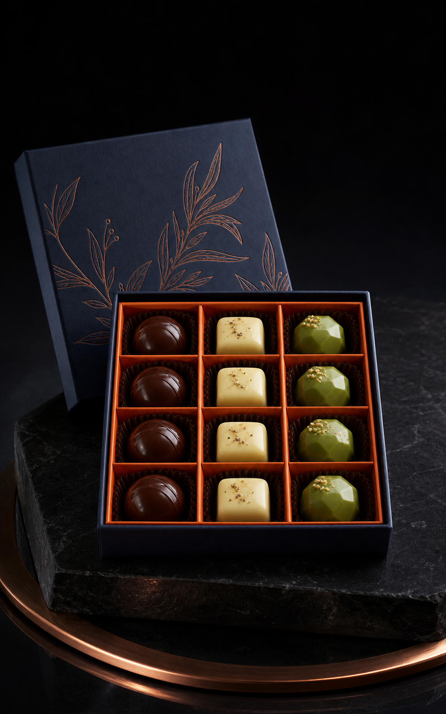

#### 详细信息

- **作者:** [Ecommerce GPT Image Prompts Studio](https://github.com/ecomimagelab)
- **来源:** 本仓库原创内容
- **发布日期:** 2026-07-23
- **语言:** en
- **适用平台:** Shopify
- **许可证:** CC-BY-4.0

<details>
<summary><strong>生产参数、商品保真项与溯源信息</strong></summary>

| 生成模式 | 商品行业 | 使用场景 | 宽高比 |
|---|---|---|---|
| `text-to-image` | 食品与饮料 | 品牌首图 | 5:8 |

- **视觉风格:** 美食编辑, 高端奢华, 明亮活泼
- **背景类型:** 暗调影棚
- **素材用途:** 品牌首图
- **输入要求:** No reference image is required for this fictional unbranded product; use product-edit mode with owned source photography when adapting a real SKU.
- **商品保真项:**
  - Preserve the matte midnight-blue square box, blank copper botanical line pattern, and burnt-orange inner tray.
  - Preserve exactly twelve chocolates in a three-by-four grid alternating dark domes, ivory cubes, and pistachio faceted pieces.
- **负面约束:** No brand, readable text, extra box, missing chocolate, more than twelve pieces, random colors, gold logo, ribbon, melted chocolate, bite marks unless specified, child, alcohol, or warped grid. No readable text, logo, trademark, watermark, duplicate product, broken geometry, cheap CGI, collage, or border.

**来源与版权**

- Generated specifically for this repository from the recorded standalone prompt; no third-party preview image is redistributed.
- Original prompt and generated previews created for this repository after visual-pattern and open-source workflow research; no external preview asset is included.
- [visual-research](docs/VISUAL_RESEARCH.md)
- [visual-research](https://github.com/buluslan/gpt-image2-ecommerce)
- [visual-research](https://github.com/motiful/product-shots)
- **平台规则状态:** Platform names identify intended visual treatment only; verify current listing and advertising requirements before publication.
- **商品系列:** [ec-0052](data/prompts/ec-0052-midnight-bonbon-box-platform-set.json)

</details>

**[🚀 立即体验 →](https://www.pixpix.com/)**

---

<a id="prompt-ec-0052-instagram-adult-gift"></a>

### No. 28: 食品与饮料 — 午夜蓝植物纹夹心巧克力礼盒多平台套图: INSTAGRAM ADULT GIFT

 

#### 描述

让同一盒十二枚午夜蓝植物纹夹心巧克力在食品目录、暗调 DTC 开盒、成年赠礼、巧克力工艺和大胆 Pinterest 静物中保持一致。

**模特上身 · Instagram Shop · 5:8**

#### 提示词

```text
Use case: product-mockup.
Asset type: social creative for instagram shop.
Primary request: Create one ultra-photorealistic portrait 5:8 e-commerce image featuring exactly one premium twelve-piece bonbon box.
Product design: one fictional unbranded rigid square bonbon box in matte midnight-blue paper with a blank embossed copper botanical line pattern, a burnt-orange inner tray holding exactly twelve glossy chocolates in a three-by-four grid, alternating dark-cocoa domes, ivory cubes, and pistachio-green faceted pieces, with no writing.
Scene/backdrop: An adult woman in a plain cream suit holds the closed box toward camera at a cobalt doorway, with the copper botanical pattern facing forward.
Composition/framing: Use a waist-up direct-flash portrait with complete natural hands, the entire box, relaxed expression, and bold color contrast.
Lighting/mood: Direct flash, cobalt ambient light, natural adult skin, crisp matte paper, and contemporary gifting energy.
Materials/textures: Render matte paper, blind copper embossing without letters, burnt-orange card, glossy tempered chocolate, cocoa powder, and fine nut texture with physically believable surfaces, disciplined commercial retouching, fine natural microtexture, and premium photographic depth.
Product invariants: Preserve the same midnight square box, copper botanical line pattern, orange tray, exact twelve-piece three-by-four grid, and three repeating chocolate designs.
Constraints: Show exactly twelve chocolates when the open tray is visible; keep food clean, plausible, and free of unsupported claims. Keep the product fully recognizable and commercially usable; use only fictional, unbranded design details.
Avoid: No child, extra box, ribbon, logo clothing, distorted fingers, readable card, jewelry distraction, or open food near face. No brand, readable text, extra box, missing chocolate, more than twelve pieces, random colors, gold logo, ribbon, melted chocolate, bite marks unless specified, child, alcohol, or warped grid. No readable text, brand name, logo, trademark, watermark, duplicate product, broken geometry, cheap CGI, collage, split screen, frame, or border.
```

#### 生成预览图

##### 图片 1

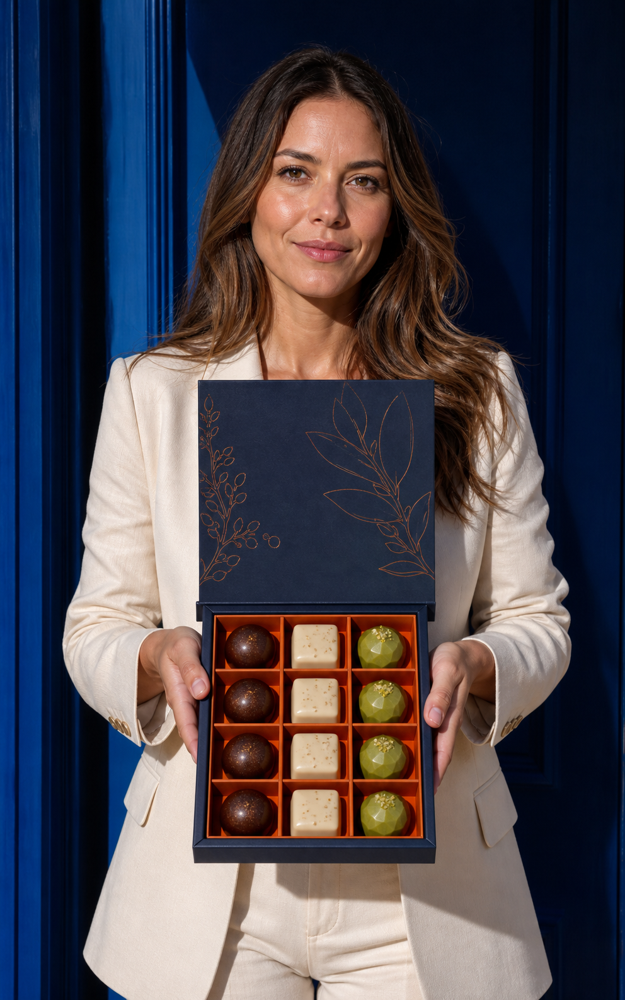

#### 详细信息

- **作者:** [Ecommerce GPT Image Prompts Studio](https://github.com/ecomimagelab)
- **来源:** 本仓库原创内容
- **发布日期:** 2026-07-23
- **语言:** en
- **适用平台:** Instagram Shop
- **许可证:** CC-BY-4.0

<details>
<summary><strong>生产参数、商品保真项与溯源信息</strong></summary>

| 生成模式 | 商品行业 | 使用场景 | 宽高比 |
|---|---|---|---|
| `text-to-image` | 食品与饮料 | 模特上身 | 5:8 |

- **视觉风格:** 美食编辑, 高端奢华, 明亮活泼
- **背景类型:** 生活方式实景
- **素材用途:** 社交创意
- **输入要求:** No reference image is required for this fictional unbranded product; use product-edit mode with owned source photography when adapting a real SKU.
- **商品保真项:**
  - Preserve the matte midnight-blue square box, blank copper botanical line pattern, and burnt-orange inner tray.
  - Preserve exactly twelve chocolates in a three-by-four grid alternating dark domes, ivory cubes, and pistachio faceted pieces.
- **负面约束:** No brand, readable text, extra box, missing chocolate, more than twelve pieces, random colors, gold logo, ribbon, melted chocolate, bite marks unless specified, child, alcohol, or warped grid. No readable text, logo, trademark, watermark, duplicate product, broken geometry, cheap CGI, collage, or border.

**来源与版权**

- Generated specifically for this repository from the recorded standalone prompt; no third-party preview image is redistributed.
- Original prompt and generated previews created for this repository after visual-pattern and open-source workflow research; no external preview asset is included.
- [visual-research](docs/VISUAL_RESEARCH.md)
- [visual-research](https://github.com/buluslan/gpt-image2-ecommerce)
- [visual-research](https://github.com/motiful/product-shots)
- **平台规则状态:** Platform names identify intended visual treatment only; verify current listing and advertising requirements before publication.
- **商品系列:** [ec-0052](data/prompts/ec-0052-midnight-bonbon-box-platform-set.json)

</details>

**[🚀 立即体验 →](https://www.pixpix.com/)**

---

<a id="prompt-ec-0052-tiktok-chocolatier-finish"></a>

### No. 29: 食品与饮料 — 午夜蓝植物纹夹心巧克力礼盒多平台套图: TIKTOK SHOP CHOCOLATIER FINISH

 

#### 描述

让同一盒十二枚午夜蓝植物纹夹心巧克力在食品目录、暗调 DTC 开盒、成年赠礼、巧克力工艺和大胆 Pinterest 静物中保持一致。

**生活方式场景 · TikTok Shop · 5:8**

#### 提示词

```text
Use case: product-mockup.
Asset type: social creative for tiktok shop.
Primary request: Create one ultra-photorealistic portrait 5:8 e-commerce image featuring exactly one premium twelve-piece bonbon box.
Product design: one fictional unbranded rigid square bonbon box in matte midnight-blue paper with a blank embossed copper botanical line pattern, a burnt-orange inner tray holding exactly twelve glossy chocolates in a three-by-four grid, alternating dark-cocoa domes, ivory cubes, and pistachio-green faceted pieces, with no writing.
Scene/backdrop: An adult chocolatier wearing plain black gloves places the final pistachio faceted piece into the empty last slot of the orange tray; the other eleven pieces are aligned.
Composition/framing: Use a close overhead creator frame showing both complete hands, open box, lid edge, precise grid, and the moment the twelfth piece reaches its slot.
Lighting/mood: Bright workbench daylight mixed with direct flash, glossy chocolate detail, tactile paper, and authentic craft energy.
Materials/textures: Render matte paper, blind copper embossing without letters, burnt-orange card, glossy tempered chocolate, cocoa powder, and fine nut texture with physically believable surfaces, disciplined commercial retouching, fine natural microtexture, and premium photographic depth.
Product invariants: Preserve the same midnight square box, copper botanical line pattern, orange tray, exact twelve-piece three-by-four grid, and three repeating chocolate designs.
Constraints: Show exactly twelve chocolates when the open tray is visible; keep food clean, plausible, and free of unsupported claims. Keep the product fully recognizable and commercially usable; use only fictional, unbranded design details.
Avoid: No child, bare hand touching food, extra fingers, more than twelve pieces, logo glove, text, melted chocolate, or messy tray. No brand, readable text, extra box, missing chocolate, more than twelve pieces, random colors, gold logo, ribbon, melted chocolate, bite marks unless specified, child, alcohol, or warped grid. No readable text, brand name, logo, trademark, watermark, duplicate product, broken geometry, cheap CGI, collage, split screen, frame, or border.
```

#### 生成预览图

##### 图片 1

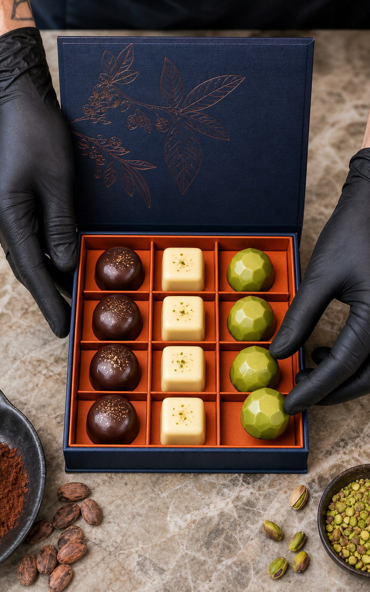

#### 详细信息

- **作者:** [Ecommerce GPT Image Prompts Studio](https://github.com/ecomimagelab)
- **来源:** 本仓库原创内容
- **发布日期:** 2026-07-23
- **语言:** en
- **适用平台:** TikTok Shop
- **许可证:** CC-BY-4.0

<details>
<summary><strong>生产参数、商品保真项与溯源信息</strong></summary>

| 生成模式 | 商品行业 | 使用场景 | 宽高比 |
|---|---|---|---|
| `text-to-image` | 食品与饮料 | 生活方式场景 | 5:8 |

- **视觉风格:** 美食编辑, 高端奢华, 明亮活泼
- **背景类型:** 天然材质
- **素材用途:** 社交创意
- **输入要求:** No reference image is required for this fictional unbranded product; use product-edit mode with owned source photography when adapting a real SKU.
- **商品保真项:**
  - Preserve the matte midnight-blue square box, blank copper botanical line pattern, and burnt-orange inner tray.
  - Preserve exactly twelve chocolates in a three-by-four grid alternating dark domes, ivory cubes, and pistachio faceted pieces.
- **负面约束:** No brand, readable text, extra box, missing chocolate, more than twelve pieces, random colors, gold logo, ribbon, melted chocolate, bite marks unless specified, child, alcohol, or warped grid. No readable text, logo, trademark, watermark, duplicate product, broken geometry, cheap CGI, collage, or border.

**来源与版权**

- Generated specifically for this repository from the recorded standalone prompt; no third-party preview image is redistributed.
- Original prompt and generated previews created for this repository after visual-pattern and open-source workflow research; no external preview asset is included.
- [visual-research](docs/VISUAL_RESEARCH.md)
- [visual-research](https://github.com/buluslan/gpt-image2-ecommerce)
- [visual-research](https://github.com/motiful/product-shots)
- **平台规则状态:** Platform names identify intended visual treatment only; verify current listing and advertising requirements before publication.
- **商品系列:** [ec-0052](data/prompts/ec-0052-midnight-bonbon-box-platform-set.json)

</details>

**[🚀 立即体验 →](https://www.pixpix.com/)**

---

<a id="prompt-ec-0052-pinterest-cobalt-cocoa"></a>

### No. 30: 食品与饮料 — 午夜蓝植物纹夹心巧克力礼盒多平台套图: PINTEREST COBALT COCOA

 

#### 描述

让同一盒十二枚午夜蓝植物纹夹心巧克力在食品目录、暗调 DTC 开盒、成年赠礼、巧克力工艺和大胆 Pinterest 静物中保持一致。

**社交电商广告 · Pinterest · 4:5**

#### 提示词

```text
Use case: product-mockup.
Asset type: social creative for pinterest.
Primary request: Create one ultra-photorealistic portrait 4:5 e-commerce image featuring exactly one premium twelve-piece bonbon box.
Product design: one fictional unbranded rigid square bonbon box in matte midnight-blue paper with a blank embossed copper botanical line pattern, a burnt-orange inner tray holding exactly twelve glossy chocolates in a three-by-four grid, alternating dark-cocoa domes, ivory cubes, and pistachio-green faceted pieces, with no writing.
Scene/backdrop: Place the open box on a cobalt paper plane against a cocoa-brown circular wall shadow, with the patterned lid flat beside it.
Composition/framing: Create a save-worthy overhead still life showing the exact grid, orange tray, copper pattern, and bold geometric color fields.
Lighting/mood: Hard side sun, clean cocoa shadow, bright controlled chocolate highlights, and crisp graphic separation.
Materials/textures: Render matte paper, blind copper embossing without letters, burnt-orange card, glossy tempered chocolate, cocoa powder, and fine nut texture with physically believable surfaces, disciplined commercial retouching, fine natural microtexture, and premium photographic depth.
Product invariants: Preserve the same midnight square box, copper botanical line pattern, orange tray, exact twelve-piece three-by-four grid, and three repeating chocolate designs.
Constraints: Show exactly twelve chocolates when the open tray is visible; keep food clean, plausible, and free of unsupported claims. Keep the product fully recognizable and commercially usable; use only fictional, unbranded design details.
Avoid: No loose chocolate, fruit, flowers, text, extra box, cropped grid, or scattered powder. No brand, readable text, extra box, missing chocolate, more than twelve pieces, random colors, gold logo, ribbon, melted chocolate, bite marks unless specified, child, alcohol, or warped grid. No readable text, brand name, logo, trademark, watermark, duplicate product, broken geometry, cheap CGI, collage, split screen, frame, or border.
```

#### 生成预览图

##### 图片 1

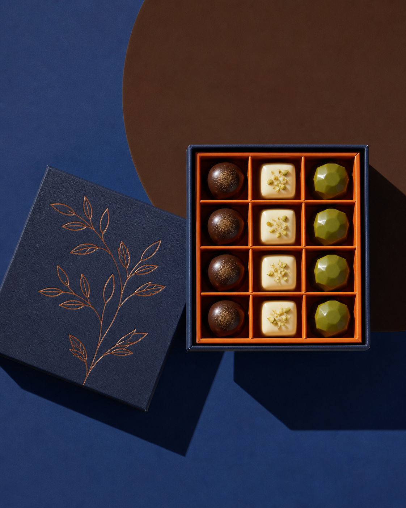

#### 详细信息

- **作者:** [Ecommerce GPT Image Prompts Studio](https://github.com/ecomimagelab)
- **来源:** 本仓库原创内容
- **发布日期:** 2026-07-23
- **语言:** en
- **适用平台:** Pinterest
- **许可证:** CC-BY-4.0

<details>
<summary><strong>生产参数、商品保真项与溯源信息</strong></summary>

| 生成模式 | 商品行业 | 使用场景 | 宽高比 |
|---|---|---|---|
| `text-to-image` | 食品与饮料 | 社交电商广告 | 4:5 |

- **视觉风格:** 美食编辑, 高端奢华, 明亮活泼
- **背景类型:** 图形化布景
- **素材用途:** 社交创意
- **输入要求:** No reference image is required for this fictional unbranded product; use product-edit mode with owned source photography when adapting a real SKU.
- **商品保真项:**
  - Preserve the matte midnight-blue square box, blank copper botanical line pattern, and burnt-orange inner tray.
  - Preserve exactly twelve chocolates in a three-by-four grid alternating dark domes, ivory cubes, and pistachio faceted pieces.
- **负面约束:** No brand, readable text, extra box, missing chocolate, more than twelve pieces, random colors, gold logo, ribbon, melted chocolate, bite marks unless specified, child, alcohol, or warped grid. No readable text, logo, trademark, watermark, duplicate product, broken geometry, cheap CGI, collage, or border.

**来源与版权**

- Generated specifically for this repository from the recorded standalone prompt; no third-party preview image is redistributed.
- Original prompt and generated previews created for this repository after visual-pattern and open-source workflow research; no external preview asset is included.
- [visual-research](docs/VISUAL_RESEARCH.md)
- [visual-research](https://github.com/buluslan/gpt-image2-ecommerce)
- [visual-research](https://github.com/motiful/product-shots)
- **平台规则状态:** Platform names identify intended visual treatment only; verify current listing and advertising requirements before publication.
- **商品系列:** [ec-0052](data/prompts/ec-0052-midnight-bonbon-box-platform-set.json)

</details>

**[🚀 立即体验 →](https://www.pixpix.com/)**

---

<a id="prompt-ec-0051-amazon-grocery-bottle-main"></a>

### No. 31: 食品与饮料 — 森林绿陶瓷橄榄油瓶多平台套图: AMAZON GROCERY BOTTLE MAIN

 

#### 描述

让同一只森林绿陶瓷橄榄油瓶在食品零售、橄榄园 DTC、阳光 Pinterest 餐桌、成年厨师动作和收获工艺故事中保持一致。

**平台主图 · Amazon Grocery · 4:5**

#### 提示词

```text
Use case: product-mockup.
Asset type: main image for amazon grocery.
Primary request: Create one ultra-photorealistic portrait 4:5 e-commerce image featuring exactly one premium olive-oil bottle with one stopper.
Product design: one fictional unbranded 500 ml tall ceramic olive-oil bottle in deep forest-green satin glaze, with broad rounded shoulders, a narrow neck, one natural cork stopper capped by a small cobalt ceramic disc, a single thin ivory vertical brushstroke on the front, and no words.
Scene/backdrop: Stand the sealed bottle upright and front-facing on seamless pure #FFFFFF with no props.
Composition/framing: Center the complete bottle at about 76% frame fill; show shoulder shape, neck, cork, cobalt disc, ivory brushstroke, base, and natural shadow.
Lighting/mood: Broad high-key softboxes, true forest glaze, controlled ceramic highlight, and neutral white balance.
Materials/textures: Render satin reactive ceramic glaze, natural cork, cobalt ceramic, olive oil, old stone, linen, and believable food surfaces with physically believable surfaces, disciplined commercial retouching, fine natural microtexture, and premium photographic depth.
Product invariants: Preserve the same tall forest bottle, rounded shoulders, narrow neck, cork stopper, cobalt top disc, and single ivory brushstroke.
Constraints: Keep the bottle sealed except in a safe pouring scene and never add claims or readable packaging. Keep the product fully recognizable and commercially usable; use only fictional, unbranded design details.
Avoid: No olives, dish, hand, packaging, extra stopper, reflection, or label text. No brand, letters, extra bottle, glass body, metal pourer unless scene specifies open cork removal, missing brushstroke, blue glaze change, floating olives, excessive oil spill, child, unsafe flame, or deformed neck. No readable text, brand name, logo, trademark, watermark, duplicate product, broken geometry, cheap CGI, collage, split screen, frame, or border.
```

#### 生成预览图

##### 图片 1

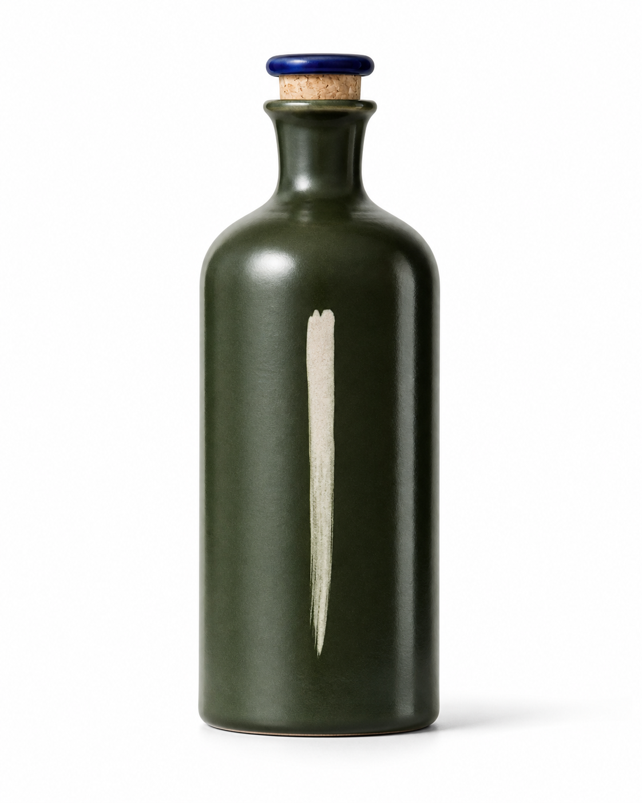

#### 详细信息

- **作者:** [Ecommerce GPT Image Prompts Studio](https://github.com/ecomimagelab)
- **来源:** 本仓库原创内容
- **发布日期:** 2026-07-23
- **语言:** en
- **适用平台:** Amazon Grocery
- **许可证:** CC-BY-4.0

<details>
<summary><strong>生产参数、商品保真项与溯源信息</strong></summary>

| 生成模式 | 商品行业 | 使用场景 | 宽高比 |
|---|---|---|---|
| `text-to-image` | 食品与饮料 | 平台主图 | 4:5 |

- **视觉风格:** 美食编辑, 自然有机, 手作质感
- **背景类型:** 纯白背景
- **素材用途:** 平台主图
- **输入要求:** No reference image is required for this fictional unbranded product; use product-edit mode with owned source photography when adapting a real SKU.
- **商品保真项:**
  - Preserve the 500 ml tall forest-green satin ceramic bottle, rounded shoulders, narrow neck, and single ivory brushstroke.
  - Preserve the natural cork stopper capped with one small cobalt ceramic disc.
- **负面约束:** No brand, letters, extra bottle, glass body, metal pourer unless scene specifies open cork removal, missing brushstroke, blue glaze change, floating olives, excessive oil spill, child, unsafe flame, or deformed neck. No readable text, logo, trademark, watermark, duplicate product, broken geometry, cheap CGI, collage, or border.

**来源与版权**

- Generated specifically for this repository from the recorded standalone prompt; no third-party preview image is redistributed.
- Original prompt and generated previews created for this repository after visual-pattern and open-source workflow research; no external preview asset is included.
- [visual-research](docs/VISUAL_RESEARCH.md)
- [visual-research](https://github.com/buluslan/gpt-image2-ecommerce)
- [visual-research](https://github.com/motiful/product-shots)
- **平台规则状态:** Platform names identify intended visual treatment only; verify current listing and advertising requirements before publication.
- **商品系列:** [ec-0051](data/prompts/ec-0051-forest-ceramic-olive-oil-platform-set.json)

</details>

**[🚀 立即体验 →](https://www.pixpix.com/)**

---

<a id="prompt-ec-0051-shopify-orchard-stone"></a>

### No. 32: 食品与饮料 — 森林绿陶瓷橄榄油瓶多平台套图: SHOPIFY ORCHARD STONE

 

#### 描述

让同一只森林绿陶瓷橄榄油瓶在食品零售、橄榄园 DTC、阳光 Pinterest 餐桌、成年厨师动作和收获工艺故事中保持一致。

**品牌首图 · Shopify · 5:8**

#### 提示词

```text
Use case: product-mockup.
Asset type: branded hero for shopify.
Primary request: Create one ultra-photorealistic portrait 5:8 e-commerce image featuring exactly one premium olive-oil bottle with one stopper.
Product design: one fictional unbranded 500 ml tall ceramic olive-oil bottle in deep forest-green satin glaze, with broad rounded shoulders, a narrow neck, one natural cork stopper capped by a small cobalt ceramic disc, a single thin ivory vertical brushstroke on the front, and no words.
Scene/backdrop: Stand the sealed bottle on a weathered limestone ledge in a quiet olive grove at early morning, with soft branches far behind.
Composition/framing: Use a low product portrait keeping the entire bottle dominant and the orchard softly layered into vertical depth.
Lighting/mood: Warm dawn side light, cool leaf shadows, restrained glaze sheen, and tactile old-stone texture.
Materials/textures: Render satin reactive ceramic glaze, natural cork, cobalt ceramic, olive oil, old stone, linen, and believable food surfaces with physically believable surfaces, disciplined commercial retouching, fine natural microtexture, and premium photographic depth.
Product invariants: Preserve the same tall forest bottle, rounded shoulders, narrow neck, cork stopper, cobalt top disc, and single ivory brushstroke.
Constraints: Keep the bottle sealed except in a safe pouring scene and never add claims or readable packaging. Keep the product fully recognizable and commercially usable; use only fictional, unbranded design details.
Avoid: No person, basket, text, second bottle, branch touching bottle, floating olives, or dramatic flare. No brand, letters, extra bottle, glass body, metal pourer unless scene specifies open cork removal, missing brushstroke, blue glaze change, floating olives, excessive oil spill, child, unsafe flame, or deformed neck. No readable text, brand name, logo, trademark, watermark, duplicate product, broken geometry, cheap CGI, collage, split screen, frame, or border.
```

#### 生成预览图

##### 图片 1

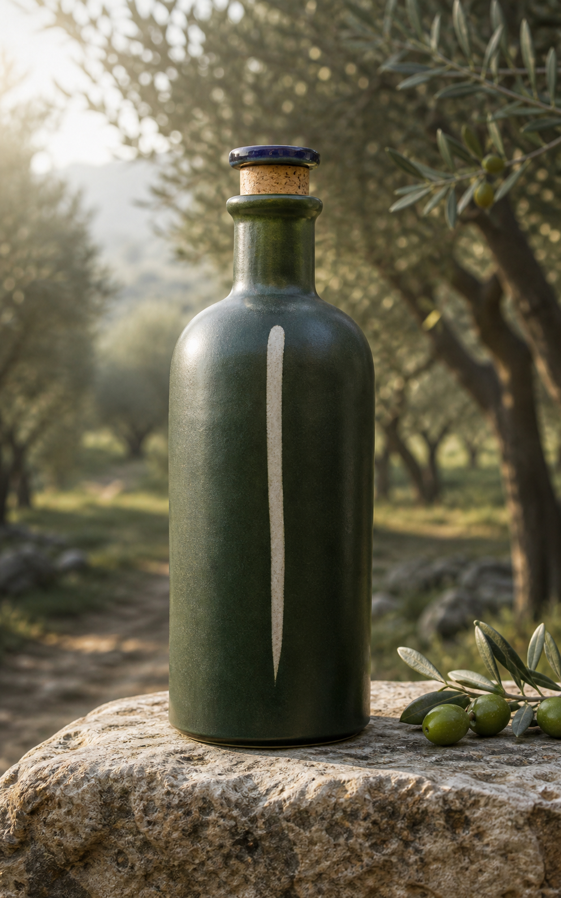

#### 详细信息

- **作者:** [Ecommerce GPT Image Prompts Studio](https://github.com/ecomimagelab)
- **来源:** 本仓库原创内容
- **发布日期:** 2026-07-23
- **语言:** en
- **适用平台:** Shopify
- **许可证:** CC-BY-4.0

<details>
<summary><strong>生产参数、商品保真项与溯源信息</strong></summary>

| 生成模式 | 商品行业 | 使用场景 | 宽高比 |
|---|---|---|---|
| `text-to-image` | 食品与饮料 | 品牌首图 | 5:8 |

- **视觉风格:** 美食编辑, 自然有机, 手作质感
- **背景类型:** 户外实景
- **素材用途:** 品牌首图
- **输入要求:** No reference image is required for this fictional unbranded product; use product-edit mode with owned source photography when adapting a real SKU.
- **商品保真项:**
  - Preserve the 500 ml tall forest-green satin ceramic bottle, rounded shoulders, narrow neck, and single ivory brushstroke.
  - Preserve the natural cork stopper capped with one small cobalt ceramic disc.
- **负面约束:** No brand, letters, extra bottle, glass body, metal pourer unless scene specifies open cork removal, missing brushstroke, blue glaze change, floating olives, excessive oil spill, child, unsafe flame, or deformed neck. No readable text, logo, trademark, watermark, duplicate product, broken geometry, cheap CGI, collage, or border.

**来源与版权**

- Generated specifically for this repository from the recorded standalone prompt; no third-party preview image is redistributed.
- Original prompt and generated previews created for this repository after visual-pattern and open-source workflow research; no external preview asset is included.
- [visual-research](docs/VISUAL_RESEARCH.md)
- [visual-research](https://github.com/buluslan/gpt-image2-ecommerce)
- [visual-research](https://github.com/motiful/product-shots)
- **平台规则状态:** Platform names identify intended visual treatment only; verify current listing and advertising requirements before publication.
- **商品系列:** [ec-0051](data/prompts/ec-0051-forest-ceramic-olive-oil-platform-set.json)

</details>

**[🚀 立即体验 →](https://www.pixpix.com/)**

---

<a id="prompt-ec-0051-pinterest-sunlit-table"></a>

### No. 33: 食品与饮料 — 森林绿陶瓷橄榄油瓶多平台套图: PINTEREST SUNLIT TABLE

  

#### 描述

让同一只森林绿陶瓷橄榄油瓶在食品零售、橄榄园 DTC、阳光 Pinterest 餐桌、成年厨师动作和收获工艺故事中保持一致。

**生活方式场景 · Pinterest · 5:8**

#### 提示词

```text
Use case: product-mockup.
Asset type: social creative for pinterest.
Primary request: Create one ultra-photorealistic portrait 5:8 e-commerce image featuring exactly one premium olive-oil bottle with one stopper.
Product design: one fictional unbranded 500 ml tall ceramic olive-oil bottle in deep forest-green satin glaze, with broad rounded shoulders, a narrow neck, one natural cork stopper capped by a small cobalt ceramic disc, a single thin ivory vertical brushstroke on the front, and no words.
Scene/backdrop: Place the sealed bottle on a long sunlit linen table beside one shallow cream plate holding torn bread, a small saucer of golden oil, and six green olives.
Composition/framing: Use a tall editorial dining composition with the bottle as hero, quiet negative space, honest crumbs, and diagonal afternoon shadows.
Lighting/mood: Hard Mediterranean window sun, warm linen bounce, translucent oil glow, and natural food texture.
Materials/textures: Render satin reactive ceramic glaze, natural cork, cobalt ceramic, olive oil, old stone, linen, and believable food surfaces with physically believable surfaces, disciplined commercial retouching, fine natural microtexture, and premium photographic depth.
Product invariants: Preserve the same tall forest bottle, rounded shoulders, narrow neck, cork stopper, cobalt top disc, and single ivory brushstroke.
Constraints: Keep the bottle sealed except in a safe pouring scene and never add claims or readable packaging. Keep the product fully recognizable and commercially usable; use only fictional, unbranded design details.
Avoid: No people, second bottle, wine, readable menu, excessive food, flowers, oil spill, or bottle cropped. No brand, letters, extra bottle, glass body, metal pourer unless scene specifies open cork removal, missing brushstroke, blue glaze change, floating olives, excessive oil spill, child, unsafe flame, or deformed neck. No readable text, brand name, logo, trademark, watermark, duplicate product, broken geometry, cheap CGI, collage, split screen, frame, or border.
```

#### 生成预览图

##### 图片 1


#### 详细信息

- **作者:** [Ecommerce GPT Image Prompts Studio](https://github.com/ecomimagelab)
- **来源:** 本仓库原创内容
- **发布日期:** 2026-07-23
- **语言:** en
- **适用平台:** Pinterest
- **许可证:** CC-BY-4.0

<details>
<summary><strong>生产参数、商品保真项与溯源信息</strong></summary>

| 生成模式 | 商品行业 | 使用场景 | 宽高比 |
|---|---|---|---|
| `text-to-image` | 食品与饮料 | 生活方式场景 | 5:8 |

- **视觉风格:** 美食编辑, 自然有机, 手作质感
- **背景类型:** 天然材质
- **素材用途:** 社交创意
- **输入要求:** No reference image is required for this fictional unbranded product; use product-edit mode with owned source photography when adapting a real SKU.
- **商品保真项:**
  - Preserve the 500 ml tall forest-green satin ceramic bottle, rounded shoulders, narrow neck, and single ivory brushstroke.
  - Preserve the natural cork stopper capped with one small cobalt ceramic disc.
- **负面约束:** No brand, letters, extra bottle, glass body, metal pourer unless scene specifies open cork removal, missing brushstroke, blue glaze change, floating olives, excessive oil spill, child, unsafe flame, or deformed neck. No readable text, logo, trademark, watermark, duplicate product, broken geometry, cheap CGI, collage, or border.

**来源与版权**

- Generated specifically for this repository from the recorded standalone prompt; no third-party preview image is redistributed.
- Original prompt and generated previews created for this repository after visual-pattern and open-source workflow research; no external preview asset is included.
- [visual-research](docs/VISUAL_RESEARCH.md)
- [visual-research](https://github.com/buluslan/gpt-image2-ecommerce)
- [visual-research](https://github.com/motiful/product-shots)
- **平台规则状态:** Platform names identify intended visual treatment only; verify current listing and advertising requirements before publication.
- **商品系列:** [ec-0051](data/prompts/ec-0051-forest-ceramic-olive-oil-platform-set.json)

</details>

**[🚀 立即体验 →](https://www.pixpix.com/)**

---

<a id="prompt-ec-0051-instagram-adult-chef-drizzle"></a>

### No. 34: 食品与饮料 — 森林绿陶瓷橄榄油瓶多平台套图: INSTAGRAM CHEF DRIZZLE

 

#### 描述

让同一只森林绿陶瓷橄榄油瓶在食品零售、橄榄园 DTC、阳光 Pinterest 餐桌、成年厨师动作和收获工艺故事中保持一致。

**生活方式场景 · Instagram Shop · 5:8**

#### 提示词

```text
Use case: product-mockup.
Asset type: social creative for instagram shop.
Primary request: Create one ultra-photorealistic portrait 5:8 e-commerce image featuring exactly one premium olive-oil bottle with one stopper.
Product design: one fictional unbranded 500 ml tall ceramic olive-oil bottle in deep forest-green satin glaze, with broad rounded shoulders, a narrow neck, one natural cork stopper capped by a small cobalt ceramic disc, a single thin ivory vertical brushstroke on the front, and no words.
Scene/backdrop: An adult chef in a plain charcoal apron pours a thin controlled stream from the uncorked bottle over a plate of roasted tomatoes; the cork with cobalt disc rests safely beside the plate.
Composition/framing: Use a close vertical action frame showing complete hands, full bottle silhouette, ivory brushstroke, smooth oil stream, food, and natural working posture.
Lighting/mood: Direct flash mixed with warm kitchen light, glossy food texture, real adult skin, and crisp ceramic color.
Materials/textures: Render satin reactive ceramic glaze, natural cork, cobalt ceramic, olive oil, old stone, linen, and believable food surfaces with physically believable surfaces, disciplined commercial retouching, fine natural microtexture, and premium photographic depth.
Product invariants: Preserve the same tall forest bottle, rounded shoulders, narrow neck, cork stopper, cobalt top disc, and single ivory brushstroke.
Constraints: Keep the bottle sealed except in a safe pouring scene and never add claims or readable packaging. Keep the product fully recognizable and commercially usable; use only fictional, unbranded design details.
Avoid: No child, extra fingers, logo apron, excessive pour, hot flame, second bottle, text, or oil covering the brushstroke. No brand, letters, extra bottle, glass body, metal pourer unless scene specifies open cork removal, missing brushstroke, blue glaze change, floating olives, excessive oil spill, child, unsafe flame, or deformed neck. No readable text, brand name, logo, trademark, watermark, duplicate product, broken geometry, cheap CGI, collage, split screen, frame, or border.
```

#### 生成预览图

##### 图片 1

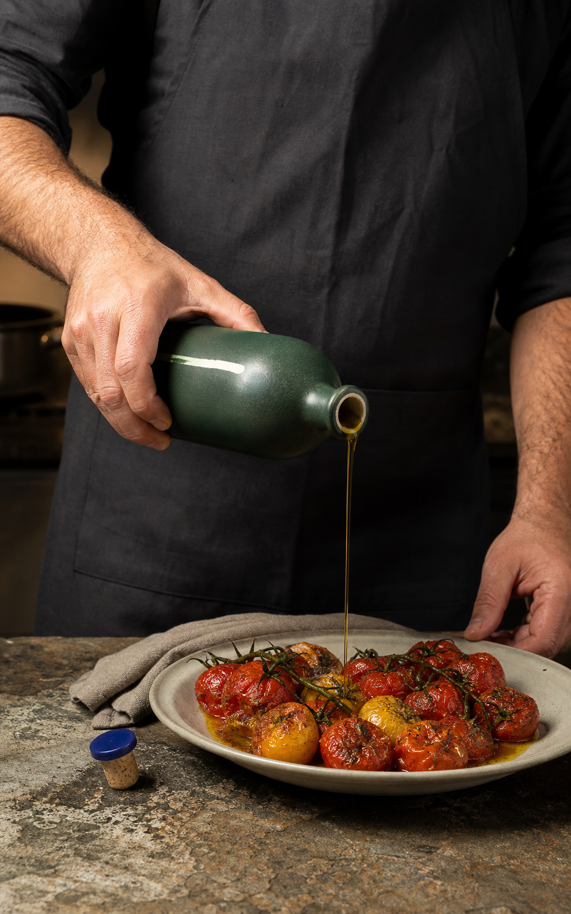

#### 详细信息

- **作者:** [Ecommerce GPT Image Prompts Studio](https://github.com/ecomimagelab)
- **来源:** 本仓库原创内容
- **发布日期:** 2026-07-23
- **语言:** en
- **适用平台:** Instagram Shop
- **许可证:** CC-BY-4.0

<details>
<summary><strong>生产参数、商品保真项与溯源信息</strong></summary>

| 生成模式 | 商品行业 | 使用场景 | 宽高比 |
|---|---|---|---|
| `text-to-image` | 食品与饮料 | 生活方式场景 | 5:8 |

- **视觉风格:** 美食编辑, 自然有机, 手作质感
- **背景类型:** 生活方式实景
- **素材用途:** 社交创意
- **输入要求:** No reference image is required for this fictional unbranded product; use product-edit mode with owned source photography when adapting a real SKU.
- **商品保真项:**
  - Preserve the 500 ml tall forest-green satin ceramic bottle, rounded shoulders, narrow neck, and single ivory brushstroke.
  - Preserve the natural cork stopper capped with one small cobalt ceramic disc.
- **负面约束:** No brand, letters, extra bottle, glass body, metal pourer unless scene specifies open cork removal, missing brushstroke, blue glaze change, floating olives, excessive oil spill, child, unsafe flame, or deformed neck. No readable text, logo, trademark, watermark, duplicate product, broken geometry, cheap CGI, collage, or border.

**来源与版权**

- Generated specifically for this repository from the recorded standalone prompt; no third-party preview image is redistributed.
- Original prompt and generated previews created for this repository after visual-pattern and open-source workflow research; no external preview asset is included.
- [visual-research](docs/VISUAL_RESEARCH.md)
- [visual-research](https://github.com/buluslan/gpt-image2-ecommerce)
- [visual-research](https://github.com/motiful/product-shots)
- **平台规则状态:** Platform names identify intended visual treatment only; verify current listing and advertising requirements before publication.
- **商品系列:** [ec-0051](data/prompts/ec-0051-forest-ceramic-olive-oil-platform-set.json)

</details>

**[🚀 立即体验 →](https://www.pixpix.com/)**

---

<a id="prompt-ec-0051-etsy-harvest-maker"></a>

### No. 35: 食品与饮料 — 森林绿陶瓷橄榄油瓶多平台套图: ETSY HARVEST MAKER

 

#### 描述

让同一只森林绿陶瓷橄榄油瓶在食品零售、橄榄园 DTC、阳光 Pinterest 餐桌、成年厨师动作和收获工艺故事中保持一致。

**生活方式场景 · Etsy · 4:5**

#### 提示词

```text
Use case: product-mockup.
Asset type: secondary image for etsy.
Primary request: Create one ultra-photorealistic portrait 4:5 e-commerce image featuring exactly one premium olive-oil bottle with one stopper.
Product design: one fictional unbranded 500 ml tall ceramic olive-oil bottle in deep forest-green satin glaze, with broad rounded shoulders, a narrow neck, one natural cork stopper capped by a small cobalt ceramic disc, a single thin ivory vertical brushstroke on the front, and no words.
Scene/backdrop: Stand the sealed bottle on a rough oak packing table beside one small linen pouch of olives and a plain cork bowl.
Composition/framing: Use an intimate three-quarter maker-story frame emphasizing glaze variation, cork texture, cobalt cap, brushstroke, and hand-finished ceramic base.
Lighting/mood: Soft barn-door daylight, warm wood bounce, gentle film grain, and honest artisanal texture.
Materials/textures: Render satin reactive ceramic glaze, natural cork, cobalt ceramic, olive oil, old stone, linen, and believable food surfaces with physically believable surfaces, disciplined commercial retouching, fine natural microtexture, and premium photographic depth.
Product invariants: Preserve the same tall forest bottle, rounded shoulders, narrow neck, cork stopper, cobalt top disc, and single ivory brushstroke.
Constraints: Keep the bottle sealed except in a safe pouring scene and never add claims or readable packaging. Keep the product fully recognizable and commercially usable; use only fictional, unbranded design details.
Avoid: No person, handwritten tag, extra bottle, pottery tools, logo stamp, excessive olives, or damaged cork. No brand, letters, extra bottle, glass body, metal pourer unless scene specifies open cork removal, missing brushstroke, blue glaze change, floating olives, excessive oil spill, child, unsafe flame, or deformed neck. No readable text, brand name, logo, trademark, watermark, duplicate product, broken geometry, cheap CGI, collage, split screen, frame, or border.
```

#### 生成预览图

##### 图片 1

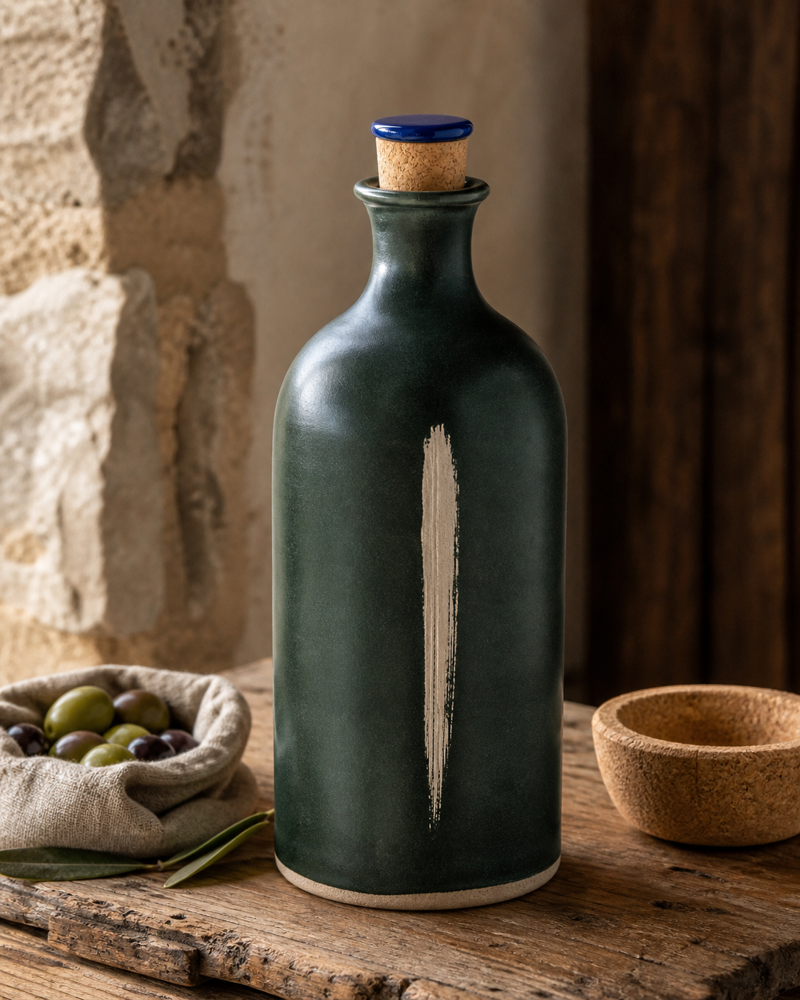

#### 详细信息

- **作者:** [Ecommerce GPT Image Prompts Studio](https://github.com/ecomimagelab)
- **来源:** 本仓库原创内容
- **发布日期:** 2026-07-23
- **语言:** en
- **适用平台:** Etsy
- **许可证:** CC-BY-4.0

<details>
<summary><strong>生产参数、商品保真项与溯源信息</strong></summary>

| 生成模式 | 商品行业 | 使用场景 | 宽高比 |
|---|---|---|---|
| `text-to-image` | 食品与饮料 | 生活方式场景 | 4:5 |

- **视觉风格:** 美食编辑, 自然有机, 手作质感
- **背景类型:** 天然材质
- **素材用途:** 商品副图
- **输入要求:** No reference image is required for this fictional unbranded product; use product-edit mode with owned source photography when adapting a real SKU.
- **商品保真项:**
  - Preserve the 500 ml tall forest-green satin ceramic bottle, rounded shoulders, narrow neck, and single ivory brushstroke.
  - Preserve the natural cork stopper capped with one small cobalt ceramic disc.
- **负面约束:** No brand, letters, extra bottle, glass body, metal pourer unless scene specifies open cork removal, missing brushstroke, blue glaze change, floating olives, excessive oil spill, child, unsafe flame, or deformed neck. No readable text, logo, trademark, watermark, duplicate product, broken geometry, cheap CGI, collage, or border.

**来源与版权**

- Generated specifically for this repository from the recorded standalone prompt; no third-party preview image is redistributed.
- Original prompt and generated previews created for this repository after visual-pattern and open-source workflow research; no external preview asset is included.
- [visual-research](docs/VISUAL_RESEARCH.md)
- [visual-research](https://github.com/buluslan/gpt-image2-ecommerce)
- [visual-research](https://github.com/motiful/product-shots)
- **平台规则状态:** Platform names identify intended visual treatment only; verify current listing and advertising requirements before publication.
- **商品系列:** [ec-0051](data/prompts/ec-0051-forest-ceramic-olive-oil-platform-set.json)

</details>

**[🚀 立即体验 →](https://www.pixpix.com/)**

---

<a id="categories-kitchen-appliances"></a>

<a id="platforms-amazon-home"></a>

<a id="prompt-ec-0050-amazon-home-mixer-main"></a>

### No. 36: 厨房电器 — 奶油黄抬头式厨师机多平台套图: AMAZON HOME MIXER MAIN

 

#### 描述

让同一台奶油黄抬头式厨师机在白底零售、洞石 DTC、成年烘焙、彩色食谱内容和高收藏感产品艺术中保持一致。

**平台主图 · Amazon Home · 4:5**

#### 提示词

```text
Use case: product-mockup.
Asset type: main image for amazon home.
Primary request: Create one ultra-photorealistic portrait 4:5 e-commerce image featuring exactly one tilt-head stand mixer with one bowl and one whisk.
Product design: one fictional unbranded compact tilt-head stand mixer in satin buttercream-yellow enamel, with a rounded motor head, a narrow cobalt speed lever on the right, one brushed-steel 4.5-liter bowl with a small loop handle, one wire whisk attachment, and a warm-gray cast base with four hidden feet.
Scene/backdrop: Place the assembled mixer front three-quarter on seamless pure #FFFFFF with the head down, whisk inside the empty clean bowl, and lever visible.
Composition/framing: Center the complete appliance at about 75% frame fill; show motor head, bowl handle, base, lever, whisk, and soft grounding shadow.
Lighting/mood: Broad high-key softboxes, clean enamel highlights, brushed-steel detail, and neutral color.
Materials/textures: Render satin enamel, brushed stainless steel, polished whisk wire, cast metal base, flour dust, and believable food texture with physically believable surfaces, disciplined commercial retouching, fine natural microtexture, and premium photographic depth.
Product invariants: Preserve the same buttercream rounded head, cobalt right-side lever, steel handled bowl, single wire whisk, warm-gray base, and compact proportions.
Constraints: Keep mixer mechanics plausible; show only safe adult baking and no hands near a moving whisk. Keep the product fully recognizable and commercially usable; use only fictional, unbranded design details.
Avoid: No ingredients, cord, packaging, extra attachment, hand, countertop, or open head. No brand badge, text, extra mixer, extra bowl, glass bowl, red body, missing lever, dough hook unless specified, exposed gears, child user, unsafe moving attachment, deformed handle, or floating appliance. No readable text, brand name, logo, trademark, watermark, duplicate product, broken geometry, cheap CGI, collage, split screen, frame, or border.
```

#### 生成预览图

##### 图片 1

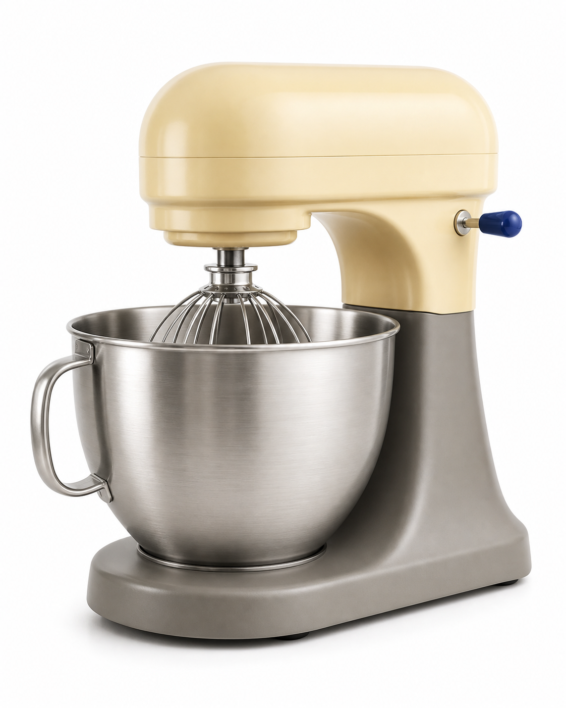

#### 详细信息

- **作者:** [Ecommerce GPT Image Prompts Studio](https://github.com/ecomimagelab)
- **来源:** 本仓库原创内容
- **发布日期:** 2026-07-23
- **语言:** en
- **适用平台:** Amazon Home
- **许可证:** CC-BY-4.0

<details>
<summary><strong>生产参数、商品保真项与溯源信息</strong></summary>

| 生成模式 | 商品行业 | 使用场景 | 宽高比 |
|---|---|---|---|
| `text-to-image` | 厨房电器 | 平台主图 | 4:5 |

- **视觉风格:** 静谧生活, 美食编辑, 明亮活泼
- **背景类型:** 纯白背景
- **素材用途:** 平台主图
- **输入要求:** No reference image is required for this fictional unbranded product; use product-edit mode with owned source photography when adapting a real SKU.
- **商品保真项:**
  - Preserve the satin buttercream-yellow rounded motor head, cobalt right-side speed lever, and warm-gray cast base.
  - Preserve the brushed-steel 4.5-liter bowl with loop handle and one wire whisk attachment.
- **负面约束:** No brand badge, text, extra mixer, extra bowl, glass bowl, red body, missing lever, dough hook unless specified, exposed gears, child user, unsafe moving attachment, deformed handle, or floating appliance. No readable text, logo, trademark, watermark, duplicate product, broken geometry, cheap CGI, collage, or border.

**来源与版权**

- Generated specifically for this repository from the recorded standalone prompt; no third-party preview image is redistributed.
- Original prompt and generated previews created for this repository after visual-pattern and open-source workflow research; no external preview asset is included.
- [visual-research](docs/VISUAL_RESEARCH.md)
- [visual-research](https://github.com/buluslan/gpt-image2-ecommerce)
- [visual-research](https://github.com/motiful/product-shots)
- **平台规则状态:** Platform names identify intended visual treatment only; verify current listing and advertising requirements before publication.
- **商品系列:** [ec-0050](data/prompts/ec-0050-buttercream-stand-mixer-platform-set.json)

</details>

**[🚀 立即体验 →](https://www.pixpix.com/)**

---

<a id="prompt-ec-0050-shopify-travertine-kitchen"></a>

### No. 37: 厨房电器 — 奶油黄抬头式厨师机多平台套图: SHOPIFY TRAVERTINE KITCHEN

 

#### 描述

让同一台奶油黄抬头式厨师机在白底零售、洞石 DTC、成年烘焙、彩色食谱内容和高收藏感产品艺术中保持一致。

**品牌首图 · Shopify · 5:8**

#### 提示词

```text
Use case: product-mockup.
Asset type: branded hero for shopify.
Primary request: Create one ultra-photorealistic portrait 5:8 e-commerce image featuring exactly one tilt-head stand mixer with one bowl and one whisk.
Product design: one fictional unbranded compact tilt-head stand mixer in satin buttercream-yellow enamel, with a rounded motor head, a narrow cobalt speed lever on the right, one brushed-steel 4.5-liter bowl with a small loop handle, one wire whisk attachment, and a warm-gray cast base with four hidden feet.
Scene/backdrop: Place the mixer on a pale travertine island in a curved warm-ivory kitchen with a small bowl of lemons far behind.
Composition/framing: Use a low three-quarter product portrait with the appliance dominant, bowl and lever readable, and generous architectural height.
Lighting/mood: Soft morning window light, long curved plaster shadow, warm metal bounce, and calm premium domestic texture.
Materials/textures: Render satin enamel, brushed stainless steel, polished whisk wire, cast metal base, flour dust, and believable food texture with physically believable surfaces, disciplined commercial retouching, fine natural microtexture, and premium photographic depth.
Product invariants: Preserve the same buttercream rounded head, cobalt right-side lever, steel handled bowl, single wire whisk, warm-gray base, and compact proportions.
Constraints: Keep mixer mechanics plausible; show only safe adult baking and no hands near a moving whisk. Keep the product fully recognizable and commercially usable; use only fictional, unbranded design details.
Avoid: No person, clutter, text, extra appliance, food inside mixer, flowers, or hidden whisk. No brand badge, text, extra mixer, extra bowl, glass bowl, red body, missing lever, dough hook unless specified, exposed gears, child user, unsafe moving attachment, deformed handle, or floating appliance. No readable text, brand name, logo, trademark, watermark, duplicate product, broken geometry, cheap CGI, collage, split screen, frame, or border.
```

#### 生成预览图

##### 图片 1

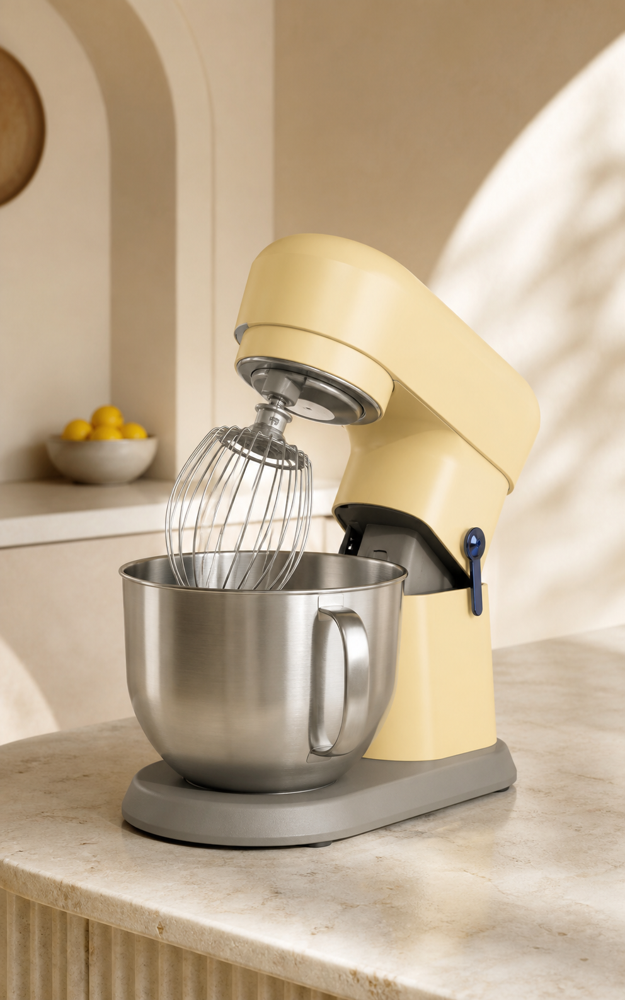

#### 详细信息

- **作者:** [Ecommerce GPT Image Prompts Studio](https://github.com/ecomimagelab)
- **来源:** 本仓库原创内容
- **发布日期:** 2026-07-23
- **语言:** en
- **适用平台:** Shopify
- **许可证:** CC-BY-4.0

<details>
<summary><strong>生产参数、商品保真项与溯源信息</strong></summary>

| 生成模式 | 商品行业 | 使用场景 | 宽高比 |
|---|---|---|---|
| `text-to-image` | 厨房电器 | 品牌首图 | 5:8 |

- **视觉风格:** 静谧生活, 美食编辑, 明亮活泼
- **背景类型:** 家居空间
- **素材用途:** 品牌首图
- **输入要求:** No reference image is required for this fictional unbranded product; use product-edit mode with owned source photography when adapting a real SKU.
- **商品保真项:**
  - Preserve the satin buttercream-yellow rounded motor head, cobalt right-side speed lever, and warm-gray cast base.
  - Preserve the brushed-steel 4.5-liter bowl with loop handle and one wire whisk attachment.
- **负面约束:** No brand badge, text, extra mixer, extra bowl, glass bowl, red body, missing lever, dough hook unless specified, exposed gears, child user, unsafe moving attachment, deformed handle, or floating appliance. No readable text, logo, trademark, watermark, duplicate product, broken geometry, cheap CGI, collage, or border.

**来源与版权**

- Generated specifically for this repository from the recorded standalone prompt; no third-party preview image is redistributed.
- Original prompt and generated previews created for this repository after visual-pattern and open-source workflow research; no external preview asset is included.
- [visual-research](docs/VISUAL_RESEARCH.md)
- [visual-research](https://github.com/buluslan/gpt-image2-ecommerce)
- [visual-research](https://github.com/motiful/product-shots)
- **平台规则状态:** Platform names identify intended visual treatment only; verify current listing and advertising requirements before publication.
- **商品系列:** [ec-0050](data/prompts/ec-0050-buttercream-stand-mixer-platform-set.json)

</details>

**[🚀 立即体验 →](https://www.pixpix.com/)**

---

<a id="prompt-ec-0050-tiktok-adult-baker"></a>

### No. 38: 厨房电器 — 奶油黄抬头式厨师机多平台套图: TIKTOK SHOP ADULT BAKER

 

#### 描述

让同一台奶油黄抬头式厨师机在白底零售、洞石 DTC、成年烘焙、彩色食谱内容和高收藏感产品艺术中保持一致。

**生活方式场景 · TikTok Shop · 5:8**

#### 提示词

```text
Use case: product-mockup.
Asset type: social creative for tiktok shop.
Primary request: Create one ultra-photorealistic portrait 5:8 e-commerce image featuring exactly one tilt-head stand mixer with one bowl and one whisk.
Product design: one fictional unbranded compact tilt-head stand mixer in satin buttercream-yellow enamel, with a rounded motor head, a narrow cobalt speed lever on the right, one brushed-steel 4.5-liter bowl with a small loop handle, one wire whisk attachment, and a warm-gray cast base with four hidden feet.
Scene/backdrop: An adult baker in a plain cobalt apron safely pours flour from a small ceramic bowl into the stopped mixer bowl while the head is raised and whisk stationary.
Composition/framing: Use a close waist-up creator frame showing complete hands, safe attachment clearance, the full mixer, cobalt lever, steel bowl, and a light controlled flour puff.
Lighting/mood: Direct flash mixed with warm bakery daylight, natural adult skin, tactile flour, and lively but believable action.
Materials/textures: Render satin enamel, brushed stainless steel, polished whisk wire, cast metal base, flour dust, and believable food texture with physically believable surfaces, disciplined commercial retouching, fine natural microtexture, and premium photographic depth.
Product invariants: Preserve the same buttercream rounded head, cobalt right-side lever, steel handled bowl, single wire whisk, warm-gray base, and compact proportions.
Constraints: Keep mixer mechanics plausible; show only safe adult baking and no hands near a moving whisk. Keep the product fully recognizable and commercially usable; use only fictional, unbranded design details.
Avoid: No child, moving whisk, hand inside bowl, extra fingers, logo apron, text, excessive flour cloud, second mixer, or face distortion. No brand badge, text, extra mixer, extra bowl, glass bowl, red body, missing lever, dough hook unless specified, exposed gears, child user, unsafe moving attachment, deformed handle, or floating appliance. No readable text, brand name, logo, trademark, watermark, duplicate product, broken geometry, cheap CGI, collage, split screen, frame, or border.
```

#### 生成预览图

##### 图片 1

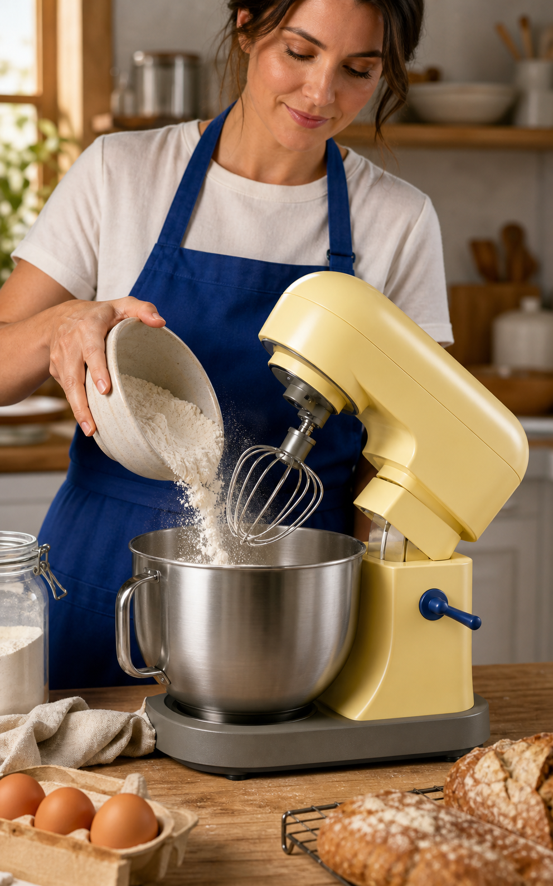

#### 详细信息

- **作者:** [Ecommerce GPT Image Prompts Studio](https://github.com/ecomimagelab)
- **来源:** 本仓库原创内容
- **发布日期:** 2026-07-23
- **语言:** en
- **适用平台:** TikTok Shop
- **许可证:** CC-BY-4.0

<details>
<summary><strong>生产参数、商品保真项与溯源信息</strong></summary>

| 生成模式 | 商品行业 | 使用场景 | 宽高比 |
|---|---|---|---|
| `text-to-image` | 厨房电器 | 生活方式场景 | 5:8 |

- **视觉风格:** 静谧生活, 美食编辑, 明亮活泼
- **背景类型:** 生活方式实景
- **素材用途:** 社交创意
- **输入要求:** No reference image is required for this fictional unbranded product; use product-edit mode with owned source photography when adapting a real SKU.
- **商品保真项:**
  - Preserve the satin buttercream-yellow rounded motor head, cobalt right-side speed lever, and warm-gray cast base.
  - Preserve the brushed-steel 4.5-liter bowl with loop handle and one wire whisk attachment.
- **负面约束:** No brand badge, text, extra mixer, extra bowl, glass bowl, red body, missing lever, dough hook unless specified, exposed gears, child user, unsafe moving attachment, deformed handle, or floating appliance. No readable text, logo, trademark, watermark, duplicate product, broken geometry, cheap CGI, collage, or border.

**来源与版权**

- Generated specifically for this repository from the recorded standalone prompt; no third-party preview image is redistributed.
- Original prompt and generated previews created for this repository after visual-pattern and open-source workflow research; no external preview asset is included.
- [visual-research](docs/VISUAL_RESEARCH.md)
- [visual-research](https://github.com/buluslan/gpt-image2-ecommerce)
- [visual-research](https://github.com/motiful/product-shots)
- **平台规则状态:** Platform names identify intended visual treatment only; verify current listing and advertising requirements before publication.
- **商品系列:** [ec-0050](data/prompts/ec-0050-buttercream-stand-mixer-platform-set.json)

</details>

**[🚀 立即体验 →](https://www.pixpix.com/)**

---

<a id="prompt-ec-0050-xiaohongshu-strawberry-bake"></a>

### No. 39: 厨房电器 — 奶油黄抬头式厨师机多平台套图: XIAOHONGSHU STRAWBERRY BAKE

 

#### 描述

让同一台奶油黄抬头式厨师机在白底零售、洞石 DTC、成年烘焙、彩色食谱内容和高收藏感产品艺术中保持一致。

**生活方式场景 · 小红书 · 4:5**

#### 提示词

```text
Use case: product-mockup.
Asset type: social creative for xiaohongshu.
Primary request: Create one ultra-photorealistic portrait 4:5 e-commerce image featuring exactly one tilt-head stand mixer with one bowl and one whisk.
Product design: one fictional unbranded compact tilt-head stand mixer in satin buttercream-yellow enamel, with a rounded motor head, a narrow cobalt speed lever on the right, one brushed-steel 4.5-liter bowl with a small loop handle, one wire whisk attachment, and a warm-gray cast base with four hidden feet.
Scene/backdrop: Set the mixer on a coral counter with the head down and whisk mixing pale pink cream; arrange three strawberries and one plain cream piping bag beside it.
Composition/framing: Use an elevated colorful recipe frame with the complete appliance, bowl handle, cobalt lever, safe closed head, and appetizing cream texture.
Lighting/mood: Bright side daylight, gentle direct-flash lift, crisp strawberry red, and clean playful contrast.
Materials/textures: Render satin enamel, brushed stainless steel, polished whisk wire, cast metal base, flour dust, and believable food texture with physically believable surfaces, disciplined commercial retouching, fine natural microtexture, and premium photographic depth.
Product invariants: Preserve the same buttercream rounded head, cobalt right-side lever, steel handled bowl, single wire whisk, warm-gray base, and compact proportions.
Constraints: Keep mixer mechanics plausible; show only safe adult baking and no hands near a moving whisk. Keep the product fully recognizable and commercially usable; use only fictional, unbranded design details.
Avoid: No readable recipe, human hand, extra mixer, splashing cream, unsafe open head, excessive props, or cake branding. No brand badge, text, extra mixer, extra bowl, glass bowl, red body, missing lever, dough hook unless specified, exposed gears, child user, unsafe moving attachment, deformed handle, or floating appliance. No readable text, brand name, logo, trademark, watermark, duplicate product, broken geometry, cheap CGI, collage, split screen, frame, or border.
```

#### 生成预览图

##### 图片 1

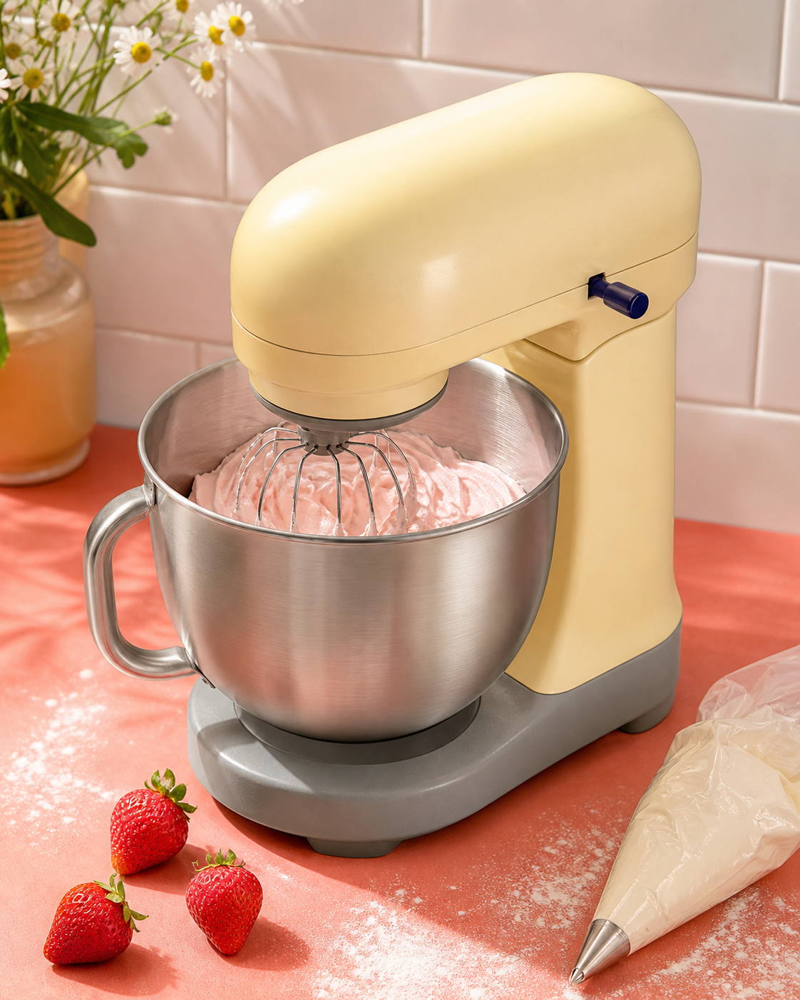

#### 详细信息

- **作者:** [Ecommerce GPT Image Prompts Studio](https://github.com/ecomimagelab)
- **来源:** 本仓库原创内容
- **发布日期:** 2026-07-23
- **语言:** en
- **适用平台:** 小红书
- **许可证:** CC-BY-4.0

<details>
<summary><strong>生产参数、商品保真项与溯源信息</strong></summary>

| 生成模式 | 商品行业 | 使用场景 | 宽高比 |
|---|---|---|---|
| `text-to-image` | 厨房电器 | 生活方式场景 | 4:5 |

- **视觉风格:** 静谧生活, 美食编辑, 明亮活泼
- **背景类型:** 图形化布景
- **素材用途:** 社交创意
- **输入要求:** No reference image is required for this fictional unbranded product; use product-edit mode with owned source photography when adapting a real SKU.
- **商品保真项:**
  - Preserve the satin buttercream-yellow rounded motor head, cobalt right-side speed lever, and warm-gray cast base.
  - Preserve the brushed-steel 4.5-liter bowl with loop handle and one wire whisk attachment.
- **负面约束:** No brand badge, text, extra mixer, extra bowl, glass bowl, red body, missing lever, dough hook unless specified, exposed gears, child user, unsafe moving attachment, deformed handle, or floating appliance. No readable text, logo, trademark, watermark, duplicate product, broken geometry, cheap CGI, collage, or border.

**来源与版权**

- Generated specifically for this repository from the recorded standalone prompt; no third-party preview image is redistributed.
- Original prompt and generated previews created for this repository after visual-pattern and open-source workflow research; no external preview asset is included.
- [visual-research](docs/VISUAL_RESEARCH.md)
- [visual-research](https://github.com/buluslan/gpt-image2-ecommerce)
- [visual-research](https://github.com/motiful/product-shots)
- **平台规则状态:** Platform names identify intended visual treatment only; verify current listing and advertising requirements before publication.
- **商品系列:** [ec-0050](data/prompts/ec-0050-buttercream-stand-mixer-platform-set.json)

</details>

**[🚀 立即体验 →](https://www.pixpix.com/)**

---

<a id="prompt-ec-0050-pinterest-cobalt-sun"></a>

### No. 40: 厨房电器 — 奶油黄抬头式厨师机多平台套图: PINTEREST COBALT SUN

 

#### 描述

让同一台奶油黄抬头式厨师机在白底零售、洞石 DTC、成年烘焙、彩色食谱内容和高收藏感产品艺术中保持一致。

**社交电商广告 · Pinterest · 5:8**

#### 提示词

```text
Use case: product-mockup.
Asset type: social creative for pinterest.
Primary request: Create one ultra-photorealistic portrait 5:8 e-commerce image featuring exactly one tilt-head stand mixer with one bowl and one whisk.
Product design: one fictional unbranded compact tilt-head stand mixer in satin buttercream-yellow enamel, with a rounded motor head, a narrow cobalt speed lever on the right, one brushed-steel 4.5-liter bowl with a small loop handle, one wire whisk attachment, and a warm-gray cast base with four hidden feet.
Scene/backdrop: Stage the empty assembled mixer on a cobalt circular plinth against a saffron wall with one large curved sunlight shadow.
Composition/framing: Create a save-worthy vertical product portrait with the complete silhouette, steel bowl reflection, cobalt lever echo, and generous negative space.
Lighting/mood: Hard graphic sun, saturated but refined color, crisp enamel highlights, and dimensional shadow.
Materials/textures: Render satin enamel, brushed stainless steel, polished whisk wire, cast metal base, flour dust, and believable food texture with physically believable surfaces, disciplined commercial retouching, fine natural microtexture, and premium photographic depth.
Product invariants: Preserve the same buttercream rounded head, cobalt right-side lever, steel handled bowl, single wire whisk, warm-gray base, and compact proportions.
Constraints: Keep mixer mechanics plausible; show only safe adult baking and no hands near a moving whisk. Keep the product fully recognizable and commercially usable; use only fictional, unbranded design details.
Avoid: No food, person, text, extra attachment, levitation, floral prop, or cropped base. No brand badge, text, extra mixer, extra bowl, glass bowl, red body, missing lever, dough hook unless specified, exposed gears, child user, unsafe moving attachment, deformed handle, or floating appliance. No readable text, brand name, logo, trademark, watermark, duplicate product, broken geometry, cheap CGI, collage, split screen, frame, or border.
```

#### 生成预览图

##### 图片 1

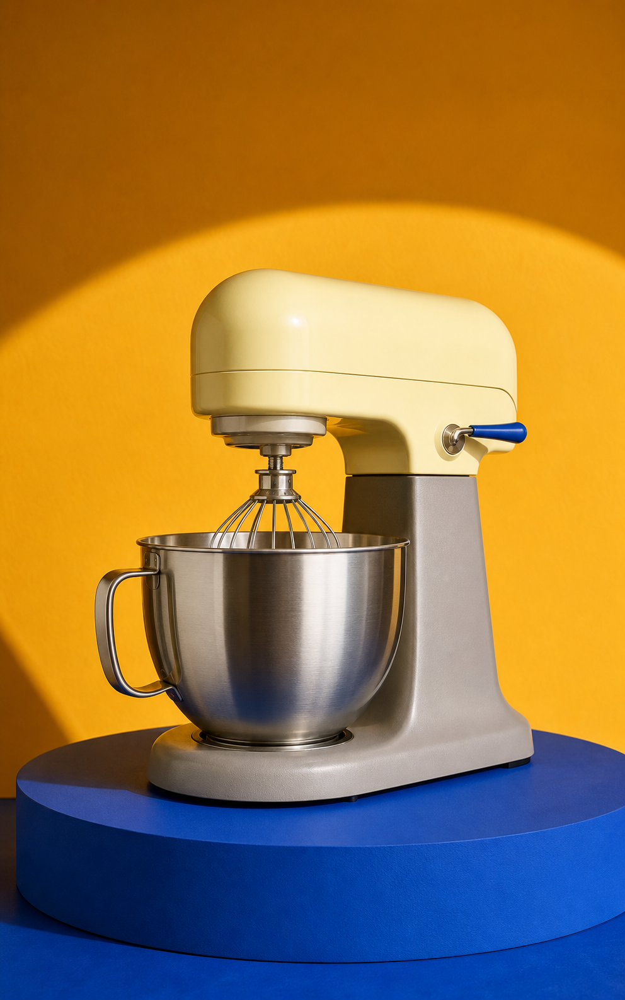

#### 详细信息

- **作者:** [Ecommerce GPT Image Prompts Studio](https://github.com/ecomimagelab)
- **来源:** 本仓库原创内容
- **发布日期:** 2026-07-23
- **语言:** en
- **适用平台:** Pinterest
- **许可证:** CC-BY-4.0

<details>
<summary><strong>生产参数、商品保真项与溯源信息</strong></summary>

| 生成模式 | 商品行业 | 使用场景 | 宽高比 |
|---|---|---|---|
| `text-to-image` | 厨房电器 | 社交电商广告 | 5:8 |

- **视觉风格:** 静谧生活, 美食编辑, 明亮活泼
- **背景类型:** 图形化布景
- **素材用途:** 社交创意
- **输入要求:** No reference image is required for this fictional unbranded product; use product-edit mode with owned source photography when adapting a real SKU.
- **商品保真项:**
  - Preserve the satin buttercream-yellow rounded motor head, cobalt right-side speed lever, and warm-gray cast base.
  - Preserve the brushed-steel 4.5-liter bowl with loop handle and one wire whisk attachment.
- **负面约束:** No brand badge, text, extra mixer, extra bowl, glass bowl, red body, missing lever, dough hook unless specified, exposed gears, child user, unsafe moving attachment, deformed handle, or floating appliance. No readable text, logo, trademark, watermark, duplicate product, broken geometry, cheap CGI, collage, or border.

**来源与版权**

- Generated specifically for this repository from the recorded standalone prompt; no third-party preview image is redistributed.
- Original prompt and generated previews created for this repository after visual-pattern and open-source workflow research; no external preview asset is included.
- [visual-research](docs/VISUAL_RESEARCH.md)
- [visual-research](https://github.com/buluslan/gpt-image2-ecommerce)
- [visual-research](https://github.com/motiful/product-shots)
- **平台规则状态:** Platform names identify intended visual treatment only; verify current listing and advertising requirements before publication.
- **商品系列:** [ec-0050](data/prompts/ec-0050-buttercream-stand-mixer-platform-set.json)

</details>

**[🚀 立即体验 →](https://www.pixpix.com/)**

---

<a id="categories-fitness-and-wellness"></a>

<a id="platforms-amazon-sports"></a>

<a id="platforms-decathlon"></a>

<a id="prompt-ec-0049-amazon-sports-racket-main"></a>

### No. 41: 健身与健康生活 — 梅子紫碳纤维板式网球拍多平台套图: AMAZON SPORTS RACKET MAIN

 

#### 描述

让同一支梅子紫碳纤维板式网球拍在零售、性能细节、成年球场动作、闪光灯通道广告和水磨石静物中保持一致。

**平台主图 · Amazon Sports · 4:5**

#### 提示词

```text
Use case: product-mockup.
Asset type: main image for amazon sports.
Primary request: Create one ultra-photorealistic portrait 4:5 e-commerce image featuring exactly one premium padel racket with one wrist cord.
Product design: one fictional unbranded teardrop-shaped padel racket with a matte smoky-plum carbon face, a centered pattern of round perforations, a narrow acid-lime edge guard, a short graphite handle wrapped in ivory grip tape, and one charcoal wrist cord with a single lime bar-tack.
Scene/backdrop: Lay the racket diagonally on seamless pure #FFFFFF with the face fully visible and the wrist cord arranged in one clean open loop.
Composition/framing: Center the complete racket at about 78% frame fill; show teardrop geometry, every perforation, lime edge, grip, cord, and soft shadow.
Lighting/mood: Broad high-key softboxes, restrained carbon weave, crisp lime separation, and neutral white balance.
Materials/textures: Render matte carbon weave, clean perforation edges, acid-lime polymer guard, textured ivory grip tape, and woven wrist cord with physically believable surfaces, disciplined commercial retouching, fine natural microtexture, and premium photographic depth.
Product invariants: Preserve the same teardrop silhouette, smoky-plum perforated face, acid-lime edge guard, short graphite handle, ivory grip, and charcoal cord.
Constraints: Keep the hole pattern centered and racket proportions plausible; adult athletes must use a safe grip. Keep the product fully recognizable and commercially usable; use only fictional, unbranded design details.
Avoid: No ball, hand, case, packaging, court, second racket, or cropped cord. No brand, letters, tennis strings, extra racket, extra ball embedded in face, missing holes, circular beach paddle, long tennis handle, changed edge color, child player, distorted hands, or broken wrist cord. No readable text, brand name, logo, trademark, watermark, duplicate product, broken geometry, cheap CGI, collage, split screen, frame, or border.
```

#### 生成预览图

##### 图片 1

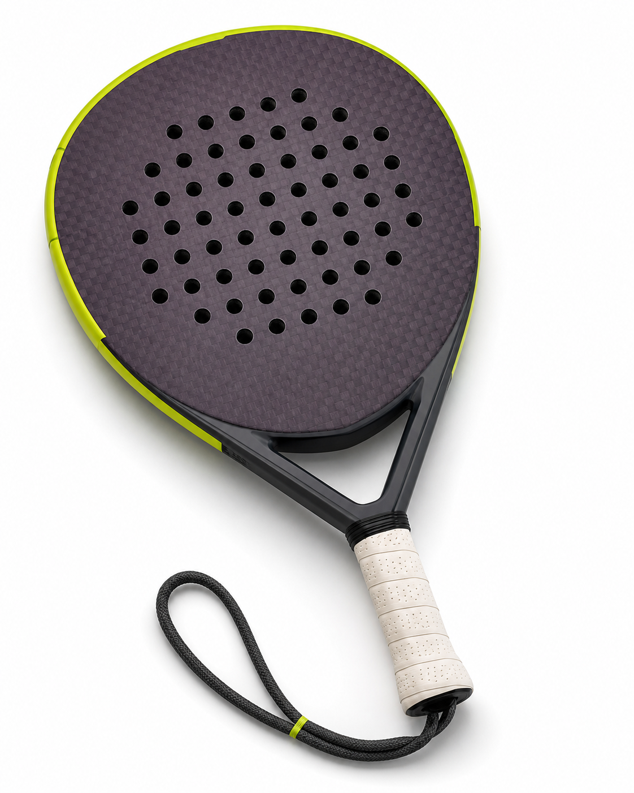

#### 详细信息

- **作者:** [Ecommerce GPT Image Prompts Studio](https://github.com/ecomimagelab)
- **来源:** 本仓库原创内容
- **发布日期:** 2026-07-23
- **语言:** en
- **适用平台:** Amazon Sports
- **许可证:** CC-BY-4.0

<details>
<summary><strong>生产参数、商品保真项与溯源信息</strong></summary>

| 生成模式 | 商品行业 | 使用场景 | 宽高比 |
|---|---|---|---|
| `text-to-image` | 健身与健康生活 | 平台主图 | 4:5 |

- **视觉风格:** 技术表达, 社交原生, 明亮活泼
- **背景类型:** 纯白背景
- **素材用途:** 平台主图
- **输入要求:** No reference image is required for this fictional unbranded product; use product-edit mode with owned source photography when adapting a real SKU.
- **商品保真项:**
  - Preserve the smoky-plum teardrop carbon face, centered round perforations, and acid-lime edge guard.
  - Preserve the short graphite handle, ivory grip tape, and charcoal wrist cord with one lime bar-tack.
- **负面约束:** No brand, letters, tennis strings, extra racket, extra ball embedded in face, missing holes, circular beach paddle, long tennis handle, changed edge color, child player, distorted hands, or broken wrist cord. No readable text, logo, trademark, watermark, duplicate product, broken geometry, cheap CGI, collage, or border.

**来源与版权**

- Generated specifically for this repository from the recorded standalone prompt; no third-party preview image is redistributed.
- Original prompt and generated previews created for this repository after visual-pattern and open-source workflow research; no external preview asset is included.
- [visual-research](docs/VISUAL_RESEARCH.md)
- [visual-research](https://github.com/buluslan/gpt-image2-ecommerce)
- [visual-research](https://github.com/motiful/product-shots)
- **平台规则状态:** Platform names identify intended visual treatment only; verify current listing and advertising requirements before publication.
- **商品系列:** [ec-0049](data/prompts/ec-0049-plum-carbon-padel-racket-platform-set.json)

</details>

**[🚀 立即体验 →](https://www.pixpix.com/)**

---

<a id="prompt-ec-0049-decathlon-carbon-detail"></a>

### No. 42: 健身与健康生活 — 梅子紫碳纤维板式网球拍多平台套图: DECATHLON CARBON DETAIL

 

#### 描述

让同一支梅子紫碳纤维板式网球拍在零售、性能细节、成年球场动作、闪光灯通道广告和水磨石静物中保持一致。

**功能卖点图 · 迪卡侬 · 4:5**

#### 提示词

```text
Use case: product-mockup.
Asset type: secondary image for decathlon.
Primary request: Create one ultra-photorealistic portrait 4:5 e-commerce image featuring exactly one premium padel racket with one wrist cord.
Product design: one fictional unbranded teardrop-shaped padel racket with a matte smoky-plum carbon face, a centered pattern of round perforations, a narrow acid-lime edge guard, a short graphite handle wrapped in ivory grip tape, and one charcoal wrist cord with a single lime bar-tack.
Scene/backdrop: Rest the racket face-up on a dark graphite ribbed surface with one plain yellow padel ball near but not touching the lime edge.
Composition/framing: Use a tight three-quarter technical crop that still includes the full face and handle while emphasizing weave, hole depth, guard thickness, grip, and cord stitch.
Lighting/mood: Hard side strip light, cool fill, narrow lime bounce, and crisp material contrast.
Materials/textures: Render matte carbon weave, clean perforation edges, acid-lime polymer guard, textured ivory grip tape, and woven wrist cord with physically believable surfaces, disciplined commercial retouching, fine natural microtexture, and premium photographic depth.
Product invariants: Preserve the same teardrop silhouette, smoky-plum perforated face, acid-lime edge guard, short graphite handle, ivory grip, and charcoal cord.
Constraints: Keep the hole pattern centered and racket proportions plausible; adult athletes must use a safe grip. Keep the product fully recognizable and commercially usable; use only fictional, unbranded design details.
Avoid: No text, arrows, cutaway, exploded face, extra ball, extra racket, or floating diagram. No brand, letters, tennis strings, extra racket, extra ball embedded in face, missing holes, circular beach paddle, long tennis handle, changed edge color, child player, distorted hands, or broken wrist cord. No readable text, brand name, logo, trademark, watermark, duplicate product, broken geometry, cheap CGI, collage, split screen, frame, or border.
```

#### 生成预览图

##### 图片 1

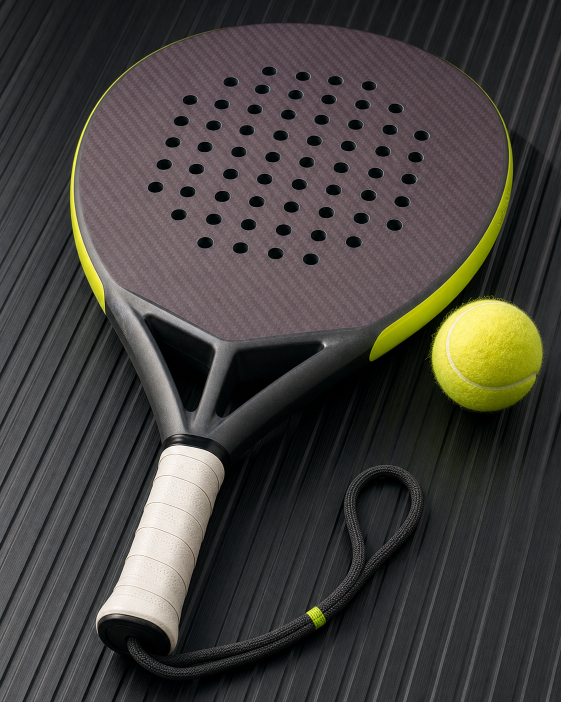

#### 详细信息

- **作者:** [Ecommerce GPT Image Prompts Studio](https://github.com/ecomimagelab)
- **来源:** 本仓库原创内容
- **发布日期:** 2026-07-23
- **语言:** en
- **适用平台:** 迪卡侬
- **许可证:** CC-BY-4.0

<details>
<summary><strong>生产参数、商品保真项与溯源信息</strong></summary>

| 生成模式 | 商品行业 | 使用场景 | 宽高比 |
|---|---|---|---|
| `text-to-image` | 健身与健康生活 | 功能卖点图 | 4:5 |

- **视觉风格:** 技术表达, 社交原生, 明亮活泼
- **背景类型:** 暗调影棚
- **素材用途:** 商品副图
- **输入要求:** No reference image is required for this fictional unbranded product; use product-edit mode with owned source photography when adapting a real SKU.
- **商品保真项:**
  - Preserve the smoky-plum teardrop carbon face, centered round perforations, and acid-lime edge guard.
  - Preserve the short graphite handle, ivory grip tape, and charcoal wrist cord with one lime bar-tack.
- **负面约束:** No brand, letters, tennis strings, extra racket, extra ball embedded in face, missing holes, circular beach paddle, long tennis handle, changed edge color, child player, distorted hands, or broken wrist cord. No readable text, logo, trademark, watermark, duplicate product, broken geometry, cheap CGI, collage, or border.

**来源与版权**

- Generated specifically for this repository from the recorded standalone prompt; no third-party preview image is redistributed.
- Original prompt and generated previews created for this repository after visual-pattern and open-source workflow research; no external preview asset is included.
- [visual-research](docs/VISUAL_RESEARCH.md)
- [visual-research](https://github.com/buluslan/gpt-image2-ecommerce)
- [visual-research](https://github.com/motiful/product-shots)
- **平台规则状态:** Platform names identify intended visual treatment only; verify current listing and advertising requirements before publication.
- **商品系列:** [ec-0049](data/prompts/ec-0049-plum-carbon-padel-racket-platform-set.json)

</details>

**[🚀 立即体验 →](https://www.pixpix.com/)**

---

<a id="prompt-ec-0049-tiktok-adult-court-action"></a>

### No. 43: 健身与健康生活 — 梅子紫碳纤维板式网球拍多平台套图: TIKTOK SHOP COURT ACTION

 

#### 描述

让同一支梅子紫碳纤维板式网球拍在零售、性能细节、成年球场动作、闪光灯通道广告和水磨石静物中保持一致。

**模特上身 · TikTok Shop · 5:8**

#### 提示词

```text
Use case: product-mockup.
Asset type: social creative for tiktok shop.
Primary request: Create one ultra-photorealistic portrait 5:8 e-commerce image featuring exactly one premium padel racket with one wrist cord.
Product design: one fictional unbranded teardrop-shaped padel racket with a matte smoky-plum carbon face, a centered pattern of round perforations, a narrow acid-lime edge guard, a short graphite handle wrapped in ivory grip tape, and one charcoal wrist cord with a single lime bar-tack.
Scene/backdrop: An athletic adult player in a plain cobalt outfit prepares a controlled forehand on a sunlit terracotta padel court while holding the racket correctly.
Composition/framing: Use a dynamic full-body low angle with complete safe anatomy, the full racket face visible, one ball approaching, and strong court lines.
Lighting/mood: Hard midday sun mixed with direct flash, crisp moving shadow, natural skin, and energetic creator texture.
Materials/textures: Render matte carbon weave, clean perforation edges, acid-lime polymer guard, textured ivory grip tape, and woven wrist cord with physically believable surfaces, disciplined commercial retouching, fine natural microtexture, and premium photographic depth.
Product invariants: Preserve the same teardrop silhouette, smoky-plum perforated face, acid-lime edge guard, short graphite handle, ivory grip, and charcoal cord.
Constraints: Keep the hole pattern centered and racket proportions plausible; adult athletes must use a safe grip. Keep the product fully recognizable and commercially usable; use only fictional, unbranded design details.
Avoid: No child, extra player, multiple balls, distorted arm, unsafe wrist, logo clothing, tennis net close-up, or racket hidden behind body. No brand, letters, tennis strings, extra racket, extra ball embedded in face, missing holes, circular beach paddle, long tennis handle, changed edge color, child player, distorted hands, or broken wrist cord. No readable text, brand name, logo, trademark, watermark, duplicate product, broken geometry, cheap CGI, collage, split screen, frame, or border.
```

#### 生成预览图

##### 图片 1

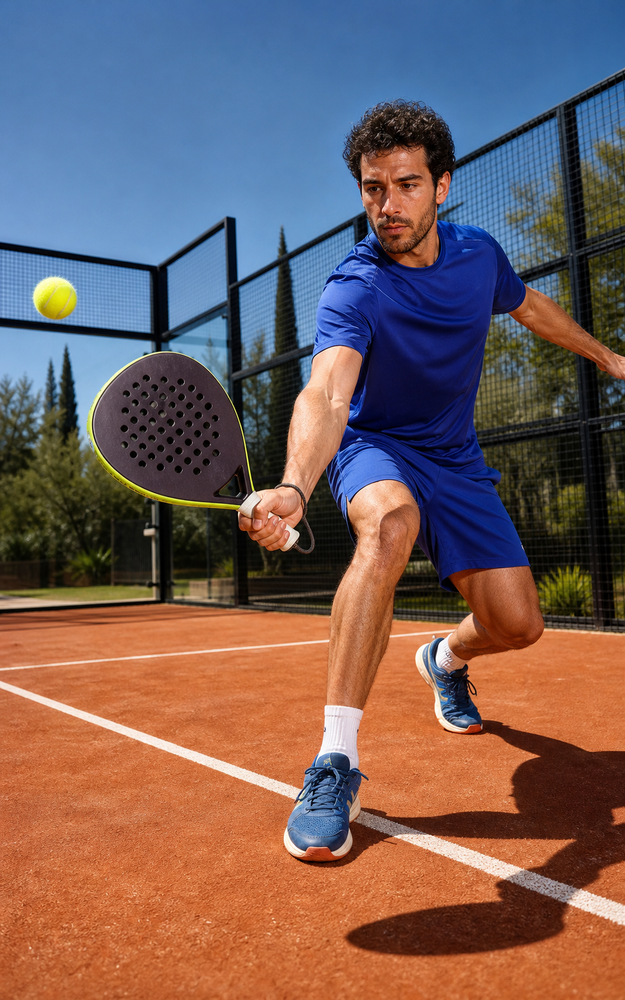

#### 详细信息

- **作者:** [Ecommerce GPT Image Prompts Studio](https://github.com/ecomimagelab)
- **来源:** 本仓库原创内容
- **发布日期:** 2026-07-23
- **语言:** en
- **适用平台:** TikTok Shop
- **许可证:** CC-BY-4.0

<details>
<summary><strong>生产参数、商品保真项与溯源信息</strong></summary>

| 生成模式 | 商品行业 | 使用场景 | 宽高比 |
|---|---|---|---|
| `text-to-image` | 健身与健康生活 | 模特上身 | 5:8 |

- **视觉风格:** 技术表达, 社交原生, 明亮活泼
- **背景类型:** 生活方式实景
- **素材用途:** 社交创意
- **输入要求:** No reference image is required for this fictional unbranded product; use product-edit mode with owned source photography when adapting a real SKU.
- **商品保真项:**
  - Preserve the smoky-plum teardrop carbon face, centered round perforations, and acid-lime edge guard.
  - Preserve the short graphite handle, ivory grip tape, and charcoal wrist cord with one lime bar-tack.
- **负面约束:** No brand, letters, tennis strings, extra racket, extra ball embedded in face, missing holes, circular beach paddle, long tennis handle, changed edge color, child player, distorted hands, or broken wrist cord. No readable text, logo, trademark, watermark, duplicate product, broken geometry, cheap CGI, collage, or border.

**来源与版权**

- Generated specifically for this repository from the recorded standalone prompt; no third-party preview image is redistributed.
- Original prompt and generated previews created for this repository after visual-pattern and open-source workflow research; no external preview asset is included.
- [visual-research](docs/VISUAL_RESEARCH.md)
- [visual-research](https://github.com/buluslan/gpt-image2-ecommerce)
- [visual-research](https://github.com/motiful/product-shots)
- **平台规则状态:** Platform names identify intended visual treatment only; verify current listing and advertising requirements before publication.
- **商品系列:** [ec-0049](data/prompts/ec-0049-plum-carbon-padel-racket-platform-set.json)

</details>

**[🚀 立即体验 →](https://www.pixpix.com/)**

---

<a id="prompt-ec-0049-instagram-flash-tunnel"></a>

### No. 44: 健身与健康生活 — 梅子紫碳纤维板式网球拍多平台套图: INSTAGRAM FLASH TUNNEL

 

#### 描述

让同一支梅子紫碳纤维板式网球拍在零售、性能细节、成年球场动作、闪光灯通道广告和水磨石静物中保持一致。

**社交电商广告 · Instagram Shop · 5:8**

#### 提示词

```text
Use case: product-mockup.
Asset type: social creative for instagram shop.
Primary request: Create one ultra-photorealistic portrait 5:8 e-commerce image featuring exactly one premium padel racket with one wrist cord.
Product design: one fictional unbranded teardrop-shaped padel racket with a matte smoky-plum carbon face, a centered pattern of round perforations, a narrow acid-lime edge guard, a short graphite handle wrapped in ivory grip tape, and one charcoal wrist cord with a single lime bar-tack.
Scene/backdrop: An adult athlete carries the racket at her side while walking through a cobalt stadium tunnel in a plain ivory warm-up suit.
Composition/framing: Use a full vertical fashion-sport portrait with relaxed natural stride, complete racket silhouette, cord, lime edge, and confident negative space.
Lighting/mood: Direct flash, saturated cobalt ambience, glossy floor reflection, natural adult expression, and editorial grain.
Materials/textures: Render matte carbon weave, clean perforation edges, acid-lime polymer guard, textured ivory grip tape, and woven wrist cord with physically believable surfaces, disciplined commercial retouching, fine natural microtexture, and premium photographic depth.
Product invariants: Preserve the same teardrop silhouette, smoky-plum perforated face, acid-lime edge guard, short graphite handle, ivory grip, and charcoal cord.
Constraints: Keep the hole pattern centered and racket proportions plausible; adult athletes must use a safe grip. Keep the product fully recognizable and commercially usable; use only fictional, unbranded design details.
Avoid: No child, extra racket, distorted fingers, brand clothing, text signage, smoke, crowd, or cropped handle. No brand, letters, tennis strings, extra racket, extra ball embedded in face, missing holes, circular beach paddle, long tennis handle, changed edge color, child player, distorted hands, or broken wrist cord. No readable text, brand name, logo, trademark, watermark, duplicate product, broken geometry, cheap CGI, collage, split screen, frame, or border.
```

#### 生成预览图

##### 图片 1

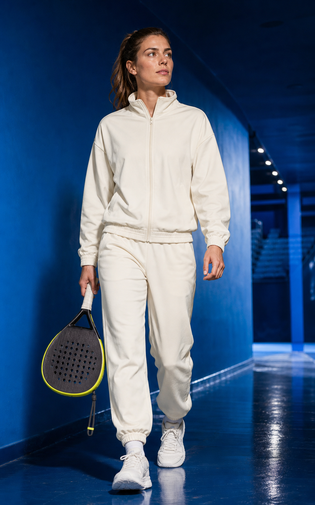

#### 详细信息

- **作者:** [Ecommerce GPT Image Prompts Studio](https://github.com/ecomimagelab)
- **来源:** 本仓库原创内容
- **发布日期:** 2026-07-23
- **语言:** en
- **适用平台:** Instagram Shop
- **许可证:** CC-BY-4.0

<details>
<summary><strong>生产参数、商品保真项与溯源信息</strong></summary>

| 生成模式 | 商品行业 | 使用场景 | 宽高比 |
|---|---|---|---|
| `text-to-image` | 健身与健康生活 | 社交电商广告 | 5:8 |

- **视觉风格:** 技术表达, 社交原生, 明亮活泼
- **背景类型:** 生活方式实景
- **素材用途:** 社交创意
- **输入要求:** No reference image is required for this fictional unbranded product; use product-edit mode with owned source photography when adapting a real SKU.
- **商品保真项:**
  - Preserve the smoky-plum teardrop carbon face, centered round perforations, and acid-lime edge guard.
  - Preserve the short graphite handle, ivory grip tape, and charcoal wrist cord with one lime bar-tack.
- **负面约束:** No brand, letters, tennis strings, extra racket, extra ball embedded in face, missing holes, circular beach paddle, long tennis handle, changed edge color, child player, distorted hands, or broken wrist cord. No readable text, logo, trademark, watermark, duplicate product, broken geometry, cheap CGI, collage, or border.

**来源与版权**

- Generated specifically for this repository from the recorded standalone prompt; no third-party preview image is redistributed.
- Original prompt and generated previews created for this repository after visual-pattern and open-source workflow research; no external preview asset is included.
- [visual-research](docs/VISUAL_RESEARCH.md)
- [visual-research](https://github.com/buluslan/gpt-image2-ecommerce)
- [visual-research](https://github.com/motiful/product-shots)
- **平台规则状态:** Platform names identify intended visual treatment only; verify current listing and advertising requirements before publication.
- **商品系列:** [ec-0049](data/prompts/ec-0049-plum-carbon-padel-racket-platform-set.json)

</details>

**[🚀 立即体验 →](https://www.pixpix.com/)**

---

<a id="prompt-ec-0049-pinterest-terrazzo-still"></a>

### No. 45: 健身与健康生活 — 梅子紫碳纤维板式网球拍多平台套图: PINTEREST TERRAZZO STILL

 

#### 描述

让同一支梅子紫碳纤维板式网球拍在零售、性能细节、成年球场动作、闪光灯通道广告和水磨石静物中保持一致。

**社交电商广告 · Pinterest · 5:8**

#### 提示词

```text
Use case: product-mockup.
Asset type: social creative for pinterest.
Primary request: Create one ultra-photorealistic portrait 5:8 e-commerce image featuring exactly one premium padel racket with one wrist cord.
Product design: one fictional unbranded teardrop-shaped padel racket with a matte smoky-plum carbon face, a centered pattern of round perforations, a narrow acid-lime edge guard, a short graphite handle wrapped in ivory grip tape, and one charcoal wrist cord with a single lime bar-tack.
Scene/backdrop: Lean the racket across two low cream-terrazzo blocks against a split plum and acid-lime paper background; place one plain ball below.
Composition/framing: Create a save-worthy graphic still life with the full teardrop face, handle, cord, and bold geometric shadows.
Lighting/mood: Hard side sunlight, clean colored bounce, crisp perforation shadows, and tactile terrazzo detail.
Materials/textures: Render matte carbon weave, clean perforation edges, acid-lime polymer guard, textured ivory grip tape, and woven wrist cord with physically believable surfaces, disciplined commercial retouching, fine natural microtexture, and premium photographic depth.
Product invariants: Preserve the same teardrop silhouette, smoky-plum perforated face, acid-lime edge guard, short graphite handle, ivory grip, and charcoal cord.
Constraints: Keep the hole pattern centered and racket proportions plausible; adult athletes must use a safe grip. Keep the product fully recognizable and commercially usable; use only fictional, unbranded design details.
Avoid: No person, extra ball, text, floating racket, second racket, or prop covering the face. No brand, letters, tennis strings, extra racket, extra ball embedded in face, missing holes, circular beach paddle, long tennis handle, changed edge color, child player, distorted hands, or broken wrist cord. No readable text, brand name, logo, trademark, watermark, duplicate product, broken geometry, cheap CGI, collage, split screen, frame, or border.
```

#### 生成预览图

##### 图片 1

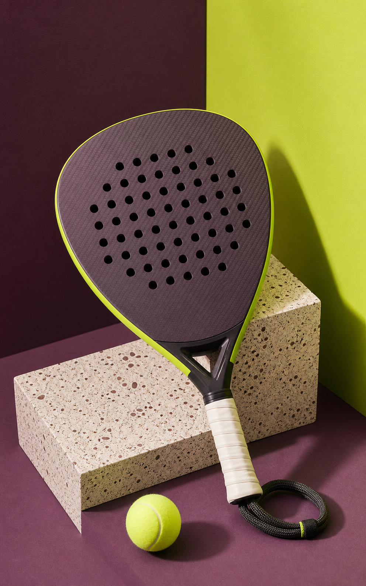

#### 详细信息

- **作者:** [Ecommerce GPT Image Prompts Studio](https://github.com/ecomimagelab)
- **来源:** 本仓库原创内容
- **发布日期:** 2026-07-23
- **语言:** en
- **适用平台:** Pinterest
- **许可证:** CC-BY-4.0

<details>
<summary><strong>生产参数、商品保真项与溯源信息</strong></summary>

| 生成模式 | 商品行业 | 使用场景 | 宽高比 |
|---|---|---|---|
| `text-to-image` | 健身与健康生活 | 社交电商广告 | 5:8 |

- **视觉风格:** 技术表达, 社交原生, 明亮活泼
- **背景类型:** 图形化布景
- **素材用途:** 社交创意
- **输入要求:** No reference image is required for this fictional unbranded product; use product-edit mode with owned source photography when adapting a real SKU.
- **商品保真项:**
  - Preserve the smoky-plum teardrop carbon face, centered round perforations, and acid-lime edge guard.
  - Preserve the short graphite handle, ivory grip tape, and charcoal wrist cord with one lime bar-tack.
- **负面约束:** No brand, letters, tennis strings, extra racket, extra ball embedded in face, missing holes, circular beach paddle, long tennis handle, changed edge color, child player, distorted hands, or broken wrist cord. No readable text, logo, trademark, watermark, duplicate product, broken geometry, cheap CGI, collage, or border.

**来源与版权**

- Generated specifically for this repository from the recorded standalone prompt; no third-party preview image is redistributed.
- Original prompt and generated previews created for this repository after visual-pattern and open-source workflow research; no external preview asset is included.
- [visual-research](docs/VISUAL_RESEARCH.md)
- [visual-research](https://github.com/buluslan/gpt-image2-ecommerce)
- [visual-research](https://github.com/motiful/product-shots)
- **平台规则状态:** Platform names identify intended visual treatment only; verify current listing and advertising requirements before publication.
- **商品系列:** [ec-0049](data/prompts/ec-0049-plum-carbon-padel-racket-platform-set.json)

</details>

**[🚀 立即体验 →](https://www.pixpix.com/)**

---

<a id="categories-cycling"></a>

<a id="prompt-ec-0048-amazon-sports-bike-side"></a>

### No. 46: 骑行 — 钴蓝碳纤维砾石公路车多平台套图: AMAZON SPORTS BIKE SIDE

 

#### 描述

让同一辆钴蓝碳纤维砾石公路车在白底零售、技术棚拍、成年骑手竞速、薄雾 DTC 景观和沙漠雕塑画面中保持一致。

**平台主图 · Amazon Sports · 4:5**

#### 提示词

```text
Use case: product-mockup.
Asset type: main image for amazon sports.
Primary request: Create one ultra-photorealistic portrait 4:5 e-commerce image featuring exactly one premium carbon gravel bicycle.
Product design: one fictional unbranded carbon gravel bicycle with a satin deep-cobalt aero frame, a straight charcoal carbon fork, flared drop handlebars wrapped in burnt-orange tape, tan-wall 45 mm gravel tires, matte-black deep-section wheels, a compact black drivetrain, and one small orange bottle cage with no bottle.
Scene/backdrop: Stand the bicycle perfectly upright in a clean drive-side profile on seamless pure #FFFFFF using an invisible support.
Composition/framing: Center the complete bicycle at about 82% frame width; show both round wheels, full frame, bars, saddle, drivetrain, pedals, cage, and tires without cropping.
Lighting/mood: Broad high-key softboxes, precise carbon highlights, clean wheel separation, and a soft realistic grounding shadow.
Materials/textures: Render satin carbon fiber, matte wheel rims, textured handlebar tape, tan rubber sidewalls, black metal drivetrain, and fine road dust with physically believable surfaces, disciplined commercial retouching, fine natural microtexture, and premium photographic depth.
Product invariants: Preserve the same cobalt frame geometry, charcoal fork, orange flared-bar tape, tan-wall gravel tires, black deep wheels and drivetrain, and orange empty cage.
Constraints: Keep bicycle mechanics plausible with two wheels, one saddle, aligned drivetrain, and safe adult riding poses. Keep the product fully recognizable and commercially usable; use only fictional, unbranded design details.
Avoid: No rider, helmet, bottle, rack, bag, mud, visible stand, turned front wheel, or clipped tire. No brand, text, motor, suspension fork, flat bars, extra bicycle, missing pedal, warped wheel, duplicate chain, bottle in cage, road-bike skinny tire, child rider, unsafe helmetless action, or impossible spoke geometry. No readable text, brand name, logo, trademark, watermark, duplicate product, broken geometry, cheap CGI, collage, split screen, frame, or border.
```

#### 生成预览图

##### 图片 1

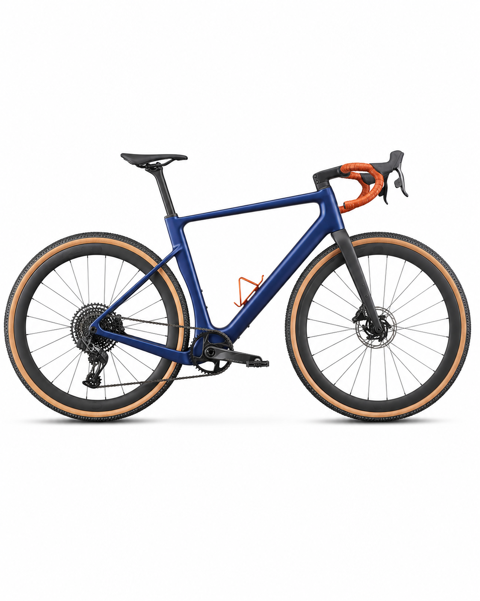

#### 详细信息

- **作者:** [Ecommerce GPT Image Prompts Studio](https://github.com/ecomimagelab)
- **来源:** 本仓库原创内容
- **发布日期:** 2026-07-23
- **语言:** en
- **适用平台:** Amazon Sports
- **许可证:** CC-BY-4.0

<details>
<summary><strong>生产参数、商品保真项与溯源信息</strong></summary>

| 生成模式 | 商品行业 | 使用场景 | 宽高比 |
|---|---|---|---|
| `text-to-image` | 骑行 | 平台主图 | 4:5 |

- **视觉风格:** 技术表达, 户外机能, 编辑大片
- **背景类型:** 纯白背景
- **素材用途:** 平台主图
- **输入要求:** No reference image is required for this fictional unbranded product; use product-edit mode with owned source photography when adapting a real SKU.
- **商品保真项:**
  - Preserve the satin deep-cobalt carbon frame, straight charcoal fork, flared bars, and burnt-orange tape.
  - Preserve tan-wall 45 mm tires, matte-black deep wheels and drivetrain, and the small empty orange bottle cage.
- **负面约束:** No brand, text, motor, suspension fork, flat bars, extra bicycle, missing pedal, warped wheel, duplicate chain, bottle in cage, road-bike skinny tire, child rider, unsafe helmetless action, or impossible spoke geometry. No readable text, logo, trademark, watermark, duplicate product, broken geometry, cheap CGI, collage, or border.

**来源与版权**

- Generated specifically for this repository from the recorded standalone prompt; no third-party preview image is redistributed.
- Original prompt and generated previews created for this repository after visual-pattern and open-source workflow research; no external preview asset is included.
- [visual-research](docs/VISUAL_RESEARCH.md)
- [visual-research](https://github.com/buluslan/gpt-image2-ecommerce)
- [visual-research](https://github.com/motiful/product-shots)
- **平台规则状态:** Platform names identify intended visual treatment only; verify current listing and advertising requirements before publication.
- **商品系列:** [ec-0048](data/prompts/ec-0048-cobalt-carbon-gravel-bike-platform-set.json)

</details>

**[🚀 立即体验 →](https://www.pixpix.com/)**

---

<a id="prompt-ec-0048-decathlon-technical-angle"></a>

### No. 47: 骑行 — 钴蓝碳纤维砾石公路车多平台套图: DECATHLON TECHNICAL ANGLE

 

#### 描述

让同一辆钴蓝碳纤维砾石公路车在白底零售、技术棚拍、成年骑手竞速、薄雾 DTC 景观和沙漠雕塑画面中保持一致。

**功能卖点图 · 迪卡侬 · 5:8**

#### 提示词

```text
Use case: product-mockup.
Asset type: secondary image for decathlon.
Primary request: Create one ultra-photorealistic portrait 5:8 e-commerce image featuring exactly one premium carbon gravel bicycle.
Product design: one fictional unbranded carbon gravel bicycle with a satin deep-cobalt aero frame, a straight charcoal carbon fork, flared drop handlebars wrapped in burnt-orange tape, tan-wall 45 mm gravel tires, matte-black deep-section wheels, a compact black drivetrain, and one small orange bottle cage with no bottle.
Scene/backdrop: Place the bicycle on a graphite studio floor with the front wheel turned slightly toward camera and three soft amber light planes behind it.
Composition/framing: Use a low front three-quarter technical view that reveals flared bars, fork, tire width, frame junctions, drivetrain, and orange cage without labels.
Lighting/mood: Hard controlled rim lights, cool graphite fill, amber edge accents, and crisp mechanical detail.
Materials/textures: Render satin carbon fiber, matte wheel rims, textured handlebar tape, tan rubber sidewalls, black metal drivetrain, and fine road dust with physically believable surfaces, disciplined commercial retouching, fine natural microtexture, and premium photographic depth.
Product invariants: Preserve the same cobalt frame geometry, charcoal fork, orange flared-bar tape, tan-wall gravel tires, black deep wheels and drivetrain, and orange empty cage.
Constraints: Keep bicycle mechanics plausible with two wheels, one saddle, aligned drivetrain, and safe adult riding poses. Keep the product fully recognizable and commercially usable; use only fictional, unbranded design details.
Avoid: No measurements, arrows, exploded parts, text, rider, extra wheel, smoke, or neon grid. No brand, text, motor, suspension fork, flat bars, extra bicycle, missing pedal, warped wheel, duplicate chain, bottle in cage, road-bike skinny tire, child rider, unsafe helmetless action, or impossible spoke geometry. No readable text, brand name, logo, trademark, watermark, duplicate product, broken geometry, cheap CGI, collage, split screen, frame, or border.
```

#### 生成预览图

##### 图片 1

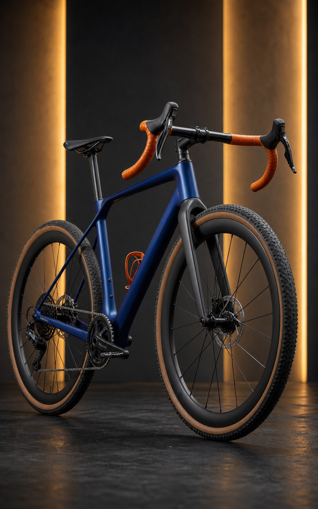

#### 详细信息

- **作者:** [Ecommerce GPT Image Prompts Studio](https://github.com/ecomimagelab)
- **来源:** 本仓库原创内容
- **发布日期:** 2026-07-23
- **语言:** en
- **适用平台:** 迪卡侬
- **许可证:** CC-BY-4.0

<details>
<summary><strong>生产参数、商品保真项与溯源信息</strong></summary>

| 生成模式 | 商品行业 | 使用场景 | 宽高比 |
|---|---|---|---|
| `text-to-image` | 骑行 | 功能卖点图 | 5:8 |

- **视觉风格:** 技术表达, 户外机能, 编辑大片
- **背景类型:** 暗调影棚
- **素材用途:** 商品副图
- **输入要求:** No reference image is required for this fictional unbranded product; use product-edit mode with owned source photography when adapting a real SKU.
- **商品保真项:**
  - Preserve the satin deep-cobalt carbon frame, straight charcoal fork, flared bars, and burnt-orange tape.
  - Preserve tan-wall 45 mm tires, matte-black deep wheels and drivetrain, and the small empty orange bottle cage.
- **负面约束:** No brand, text, motor, suspension fork, flat bars, extra bicycle, missing pedal, warped wheel, duplicate chain, bottle in cage, road-bike skinny tire, child rider, unsafe helmetless action, or impossible spoke geometry. No readable text, logo, trademark, watermark, duplicate product, broken geometry, cheap CGI, collage, or border.

**来源与版权**

- Generated specifically for this repository from the recorded standalone prompt; no third-party preview image is redistributed.
- Original prompt and generated previews created for this repository after visual-pattern and open-source workflow research; no external preview asset is included.
- [visual-research](docs/VISUAL_RESEARCH.md)
- [visual-research](https://github.com/buluslan/gpt-image2-ecommerce)
- [visual-research](https://github.com/motiful/product-shots)
- **平台规则状态:** Platform names identify intended visual treatment only; verify current listing and advertising requirements before publication.
- **商品系列:** [ec-0048](data/prompts/ec-0048-cobalt-carbon-gravel-bike-platform-set.json)

</details>

**[🚀 立即体验 →](https://www.pixpix.com/)**

---

<a id="prompt-ec-0048-instagram-gravel-sprint"></a>

### No. 48: 骑行 — 钴蓝碳纤维砾石公路车多平台套图: INSTAGRAM GRAVEL SPRINT

  

#### 描述

让同一辆钴蓝碳纤维砾石公路车在白底零售、技术棚拍、成年骑手竞速、薄雾 DTC 景观和沙漠雕塑画面中保持一致。

**模特上身 · Instagram Shop · 5:8**

#### 提示词

```text
Use case: product-mockup.
Asset type: social creative for instagram shop.
Primary request: Create one ultra-photorealistic portrait 5:8 e-commerce image featuring exactly one premium carbon gravel bicycle.
Product design: one fictional unbranded carbon gravel bicycle with a satin deep-cobalt aero frame, a straight charcoal carbon fork, flared drop handlebars wrapped in burnt-orange tape, tan-wall 45 mm gravel tires, matte-black deep-section wheels, a compact black drivetrain, and one small orange bottle cage with no bottle.
Scene/backdrop: An athletic adult rider wearing a plain cream helmet and charcoal kit sprints the bicycle along a pale gravel road through ochre hills.
Composition/framing: Use a low panning side-front action frame with the complete bicycle, both wheels, rider's safe posture, hands on drops, and orange bar tape clearly visible.
Lighting/mood: Hard sunrise side light, direct-flash lift, controlled gravel spray, natural adult anatomy, and energetic editorial motion.
Materials/textures: Render satin carbon fiber, matte wheel rims, textured handlebar tape, tan rubber sidewalls, black metal drivetrain, and fine road dust with physically believable surfaces, disciplined commercial retouching, fine natural microtexture, and premium photographic depth.
Product invariants: Preserve the same cobalt frame geometry, charcoal fork, orange flared-bar tape, tan-wall gravel tires, black deep wheels and drivetrain, and orange empty cage.
Constraints: Keep bicycle mechanics plausible with two wheels, one saddle, aligned drivetrain, and safe adult riding poses. Keep the product fully recognizable and commercially usable; use only fictional, unbranded design details.
Avoid: No child, missing helmet, extra cyclist, distorted limbs, warped wheel, logo kit, traffic, dangerous cliff, or product obscured by dust. No brand, text, motor, suspension fork, flat bars, extra bicycle, missing pedal, warped wheel, duplicate chain, bottle in cage, road-bike skinny tire, child rider, unsafe helmetless action, or impossible spoke geometry. No readable text, brand name, logo, trademark, watermark, duplicate product, broken geometry, cheap CGI, collage, split screen, frame, or border.
```

#### 生成预览图

##### 图片 1


#### 详细信息

- **作者:** [Ecommerce GPT Image Prompts Studio](https://github.com/ecomimagelab)
- **来源:** 本仓库原创内容
- **发布日期:** 2026-07-23
- **语言:** en
- **适用平台:** Instagram Shop
- **许可证:** CC-BY-4.0

<details>
<summary><strong>生产参数、商品保真项与溯源信息</strong></summary>

| 生成模式 | 商品行业 | 使用场景 | 宽高比 |
|---|---|---|---|
| `text-to-image` | 骑行 | 模特上身 | 5:8 |

- **视觉风格:** 技术表达, 户外机能, 编辑大片
- **背景类型:** 户外实景
- **素材用途:** 社交创意
- **输入要求:** No reference image is required for this fictional unbranded product; use product-edit mode with owned source photography when adapting a real SKU.
- **商品保真项:**
  - Preserve the satin deep-cobalt carbon frame, straight charcoal fork, flared bars, and burnt-orange tape.
  - Preserve tan-wall 45 mm tires, matte-black deep wheels and drivetrain, and the small empty orange bottle cage.
- **负面约束:** No brand, text, motor, suspension fork, flat bars, extra bicycle, missing pedal, warped wheel, duplicate chain, bottle in cage, road-bike skinny tire, child rider, unsafe helmetless action, or impossible spoke geometry. No readable text, logo, trademark, watermark, duplicate product, broken geometry, cheap CGI, collage, or border.

**来源与版权**

- Generated specifically for this repository from the recorded standalone prompt; no third-party preview image is redistributed.
- Original prompt and generated previews created for this repository after visual-pattern and open-source workflow research; no external preview asset is included.
- [visual-research](docs/VISUAL_RESEARCH.md)
- [visual-research](https://github.com/buluslan/gpt-image2-ecommerce)
- [visual-research](https://github.com/motiful/product-shots)
- **平台规则状态:** Platform names identify intended visual treatment only; verify current listing and advertising requirements before publication.
- **商品系列:** [ec-0048](data/prompts/ec-0048-cobalt-carbon-gravel-bike-platform-set.json)

</details>

**[🚀 立即体验 →](https://www.pixpix.com/)**

---

<a id="prompt-ec-0048-shopify-mist-forest"></a>

### No. 49: 骑行 — 钴蓝碳纤维砾石公路车多平台套图: SHOPIFY MIST FOREST

 

#### 描述

让同一辆钴蓝碳纤维砾石公路车在白底零售、技术棚拍、成年骑手竞速、薄雾 DTC 景观和沙漠雕塑画面中保持一致。

**品牌首图 · Shopify · 5:8**

#### 提示词

```text
Use case: product-mockup.
Asset type: branded hero for shopify.
Primary request: Create one ultra-photorealistic portrait 5:8 e-commerce image featuring exactly one premium carbon gravel bicycle.
Product design: one fictional unbranded carbon gravel bicycle with a satin deep-cobalt aero frame, a straight charcoal carbon fork, flared drop handlebars wrapped in burnt-orange tape, tan-wall 45 mm gravel tires, matte-black deep-section wheels, a compact black drivetrain, and one small orange bottle cage with no bottle.
Scene/backdrop: Lean the bicycle safely against one mossy basalt boulder on a misty conifer road after rain, with no person.
Composition/framing: Use a full environmental side-three-quarter portrait that keeps both wheels and frame clearly visible against soft forest depth.
Lighting/mood: Cool overcast dawn, faint warm rim on cobalt carbon, wet road reflection, and tactile natural atmosphere.
Materials/textures: Render satin carbon fiber, matte wheel rims, textured handlebar tape, tan rubber sidewalls, black metal drivetrain, and fine road dust with physically believable surfaces, disciplined commercial retouching, fine natural microtexture, and premium photographic depth.
Product invariants: Preserve the same cobalt frame geometry, charcoal fork, orange flared-bar tape, tan-wall gravel tires, black deep wheels and drivetrain, and orange empty cage.
Constraints: Keep bicycle mechanics plausible with two wheels, one saddle, aligned drivetrain, and safe adult riding poses. Keep the product fully recognizable and commercially usable; use only fictional, unbranded design details.
Avoid: No visible support, luggage, bottle, mud covering frame, extra bike, fog hiding wheels, or wildlife. No brand, text, motor, suspension fork, flat bars, extra bicycle, missing pedal, warped wheel, duplicate chain, bottle in cage, road-bike skinny tire, child rider, unsafe helmetless action, or impossible spoke geometry. No readable text, brand name, logo, trademark, watermark, duplicate product, broken geometry, cheap CGI, collage, split screen, frame, or border.
```

#### 生成预览图

##### 图片 1

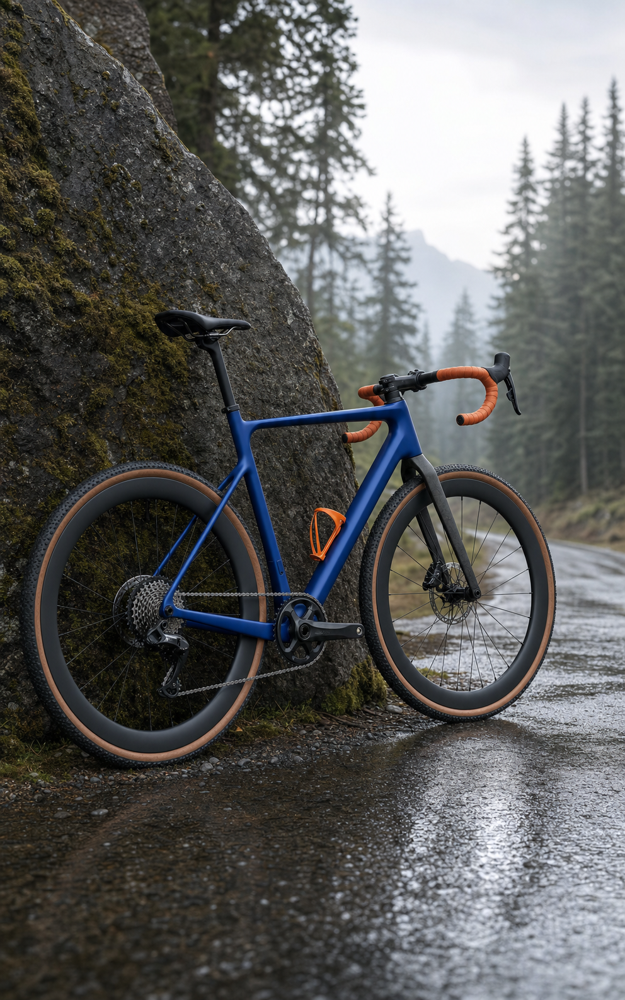

#### 详细信息

- **作者:** [Ecommerce GPT Image Prompts Studio](https://github.com/ecomimagelab)
- **来源:** 本仓库原创内容
- **发布日期:** 2026-07-23
- **语言:** en
- **适用平台:** Shopify
- **许可证:** CC-BY-4.0

<details>
<summary><strong>生产参数、商品保真项与溯源信息</strong></summary>

| 生成模式 | 商品行业 | 使用场景 | 宽高比 |
|---|---|---|---|
| `text-to-image` | 骑行 | 品牌首图 | 5:8 |

- **视觉风格:** 技术表达, 户外机能, 编辑大片
- **背景类型:** 户外实景
- **素材用途:** 品牌首图
- **输入要求:** No reference image is required for this fictional unbranded product; use product-edit mode with owned source photography when adapting a real SKU.
- **商品保真项:**
  - Preserve the satin deep-cobalt carbon frame, straight charcoal fork, flared bars, and burnt-orange tape.
  - Preserve tan-wall 45 mm tires, matte-black deep wheels and drivetrain, and the small empty orange bottle cage.
- **负面约束:** No brand, text, motor, suspension fork, flat bars, extra bicycle, missing pedal, warped wheel, duplicate chain, bottle in cage, road-bike skinny tire, child rider, unsafe helmetless action, or impossible spoke geometry. No readable text, logo, trademark, watermark, duplicate product, broken geometry, cheap CGI, collage, or border.

**来源与版权**

- Generated specifically for this repository from the recorded standalone prompt; no third-party preview image is redistributed.
- Original prompt and generated previews created for this repository after visual-pattern and open-source workflow research; no external preview asset is included.
- [visual-research](docs/VISUAL_RESEARCH.md)
- [visual-research](https://github.com/buluslan/gpt-image2-ecommerce)
- [visual-research](https://github.com/motiful/product-shots)
- **平台规则状态:** Platform names identify intended visual treatment only; verify current listing and advertising requirements before publication.
- **商品系列:** [ec-0048](data/prompts/ec-0048-cobalt-carbon-gravel-bike-platform-set.json)

</details>

**[🚀 立即体验 →](https://www.pixpix.com/)**

---

<a id="prompt-ec-0048-pinterest-desert-sculpture"></a>

### No. 50: 骑行 — 钴蓝碳纤维砾石公路车多平台套图: PINTEREST DESERT SCULPTURE

 

#### 描述

让同一辆钴蓝碳纤维砾石公路车在白底零售、技术棚拍、成年骑手竞速、薄雾 DTC 景观和沙漠雕塑画面中保持一致。

**社交电商广告 · Pinterest · 5:8**

#### 提示词

```text
Use case: product-mockup.
Asset type: social creative for pinterest.
Primary request: Create one ultra-photorealistic portrait 5:8 e-commerce image featuring exactly one premium carbon gravel bicycle.
Product design: one fictional unbranded carbon gravel bicycle with a satin deep-cobalt aero frame, a straight charcoal carbon fork, flared drop handlebars wrapped in burnt-orange tape, tan-wall 45 mm gravel tires, matte-black deep-section wheels, a compact black drivetrain, and one small orange bottle cage with no bottle.
Scene/backdrop: Stand the bicycle on a flat travertine terrace overlooking layered apricot desert hills, with one cobalt architectural wall plane behind.
Composition/framing: Create a save-worthy elevated side composition with complete wheel circles, strong negative space, and the orange details echoing the landscape.
Lighting/mood: Low golden sun, lavender shadows, crisp carbon texture, and clean aspirational travel color.
Materials/textures: Render satin carbon fiber, matte wheel rims, textured handlebar tape, tan rubber sidewalls, black metal drivetrain, and fine road dust with physically believable surfaces, disciplined commercial retouching, fine natural microtexture, and premium photographic depth.
Product invariants: Preserve the same cobalt frame geometry, charcoal fork, orange flared-bar tape, tan-wall gravel tires, black deep wheels and drivetrain, and orange empty cage.
Constraints: Keep bicycle mechanics plausible with two wheels, one saddle, aligned drivetrain, and safe adult riding poses. Keep the product fully recognizable and commercially usable; use only fictional, unbranded design details.
Avoid: No rider, cactus touching bicycle, text, extra bike, water bottle, floating wheels, or dramatic lens flare. No brand, text, motor, suspension fork, flat bars, extra bicycle, missing pedal, warped wheel, duplicate chain, bottle in cage, road-bike skinny tire, child rider, unsafe helmetless action, or impossible spoke geometry. No readable text, brand name, logo, trademark, watermark, duplicate product, broken geometry, cheap CGI, collage, split screen, frame, or border.
```

#### 生成预览图

##### 图片 1

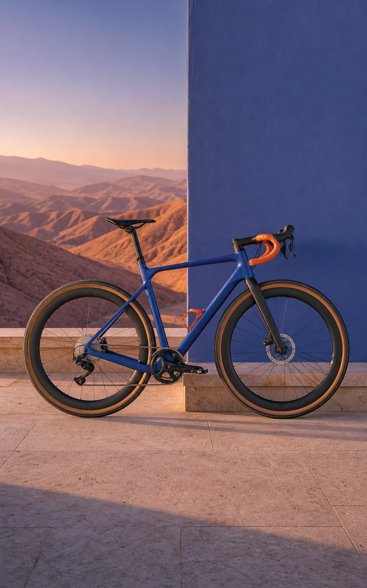

#### 详细信息

- **作者:** [Ecommerce GPT Image Prompts Studio](https://github.com/ecomimagelab)
- **来源:** 本仓库原创内容
- **发布日期:** 2026-07-23
- **语言:** en
- **适用平台:** Pinterest
- **许可证:** CC-BY-4.0

<details>
<summary><strong>生产参数、商品保真项与溯源信息</strong></summary>

| 生成模式 | 商品行业 | 使用场景 | 宽高比 |
|---|---|---|---|
| `text-to-image` | 骑行 | 社交电商广告 | 5:8 |

- **视觉风格:** 技术表达, 户外机能, 编辑大片
- **背景类型:** 户外实景
- **素材用途:** 社交创意
- **输入要求:** No reference image is required for this fictional unbranded product; use product-edit mode with owned source photography when adapting a real SKU.
- **商品保真项:**
  - Preserve the satin deep-cobalt carbon frame, straight charcoal fork, flared bars, and burnt-orange tape.
  - Preserve tan-wall 45 mm tires, matte-black deep wheels and drivetrain, and the small empty orange bottle cage.
- **负面约束:** No brand, text, motor, suspension fork, flat bars, extra bicycle, missing pedal, warped wheel, duplicate chain, bottle in cage, road-bike skinny tire, child rider, unsafe helmetless action, or impossible spoke geometry. No readable text, logo, trademark, watermark, duplicate product, broken geometry, cheap CGI, collage, or border.

**来源与版权**

- Generated specifically for this repository from the recorded standalone prompt; no third-party preview image is redistributed.
- Original prompt and generated previews created for this repository after visual-pattern and open-source workflow research; no external preview asset is included.
- [visual-research](docs/VISUAL_RESEARCH.md)
- [visual-research](https://github.com/buluslan/gpt-image2-ecommerce)
- [visual-research](https://github.com/motiful/product-shots)
- **平台规则状态:** Platform names identify intended visual treatment only; verify current listing and advertising requirements before publication.
- **商品系列:** [ec-0048](data/prompts/ec-0048-cobalt-carbon-gravel-bike-platform-set.json)

</details>

**[🚀 立即体验 →](https://www.pixpix.com/)**

---

<a id="categories-consumer-electronics"></a>

<a id="platforms-best-buy"></a>

<a id="prompt-ec-0047-amazon-projector-clean-main"></a>

### No. 51: 消费电子 — 砂岩色便携投影仪多平台套图: AMAZON PROJECTOR CLEAN MAIN

 

#### 描述

让同一台砂岩色便携投影仪在白底零售、功能光效、建筑客厅、成年观影夜和 Pinterest 户外影院中保持一致。

**平台主图 · Amazon · 4:5**

#### 提示词

```text
Use case: product-mockup.
Asset type: main image for amazon.
Primary request: Create one ultra-photorealistic portrait 4:5 e-commerce image featuring exactly one compact portable projector with one remote.
Product design: one fictional unbranded compact portable projector in warm sandstone-beige matte aluminum, shaped as a low rounded rectangle with one large black circular lens on the front-left, a narrow burnt-orange focus ring, a perforated graphite speaker grille on the right side, a slim camel leather carry loop, and one small matching blank remote.
Scene/backdrop: Place the projector front three-quarter on seamless pure #FFFFFF with the camel loop upright and the blank remote lying beside it.
Composition/framing: Center the complete product set at about 72% frame fill; show lens, orange ring, grille edge, loop, feet, remote, and soft grounding shadow.
Lighting/mood: Broad high-key technical softboxes, controlled lens reflection, warm sandstone accuracy, and crisp perforations.
Materials/textures: Render matte aluminum, optical black glass, burnt-orange anodized ring, perforated graphite grille, and camel leather with physically believable surfaces, disciplined commercial retouching, fine natural microtexture, and premium photographic depth.
Product invariants: Preserve the same low sandstone body, front-left black lens, orange focus ring, right graphite grille, camel loop, and small blank remote.
Constraints: Keep projection light physically aligned with the lens; show no copyrighted film or readable interface. Keep the product fully recognizable and commercially usable; use only fictional, unbranded design details.
Avoid: No beam, screen, cable, hand, packaging, extra remote, or lens cap. No brand, text, extra projector, second lens, white plastic, floating UI, copyrighted movie, visible streaming logo, impossible beam direction, tangled power cable, overheated glow, child model, or warped remote. No readable text, brand name, logo, trademark, watermark, duplicate product, broken geometry, cheap CGI, collage, split screen, frame, or border.
```

#### 生成预览图

##### 图片 1

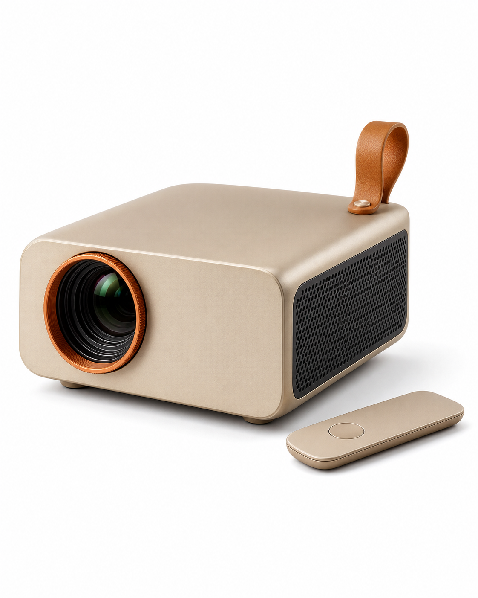

#### 详细信息

- **作者:** [Ecommerce GPT Image Prompts Studio](https://github.com/ecomimagelab)
- **来源:** 本仓库原创内容
- **发布日期:** 2026-07-23
- **语言:** en
- **适用平台:** Amazon
- **许可证:** CC-BY-4.0

<details>
<summary><strong>生产参数、商品保真项与溯源信息</strong></summary>

| 生成模式 | 商品行业 | 使用场景 | 宽高比 |
|---|---|---|---|
| `text-to-image` | 消费电子 | 平台主图 | 4:5 |

- **视觉风格:** 技术表达, 建筑感, 静谧生活
- **背景类型:** 纯白背景
- **素材用途:** 平台主图
- **输入要求:** No reference image is required for this fictional unbranded product; use product-edit mode with owned source photography when adapting a real SKU.
- **商品保真项:**
  - Preserve the low rounded sandstone aluminum body, front-left circular lens, and narrow burnt-orange focus ring.
  - Preserve the right graphite speaker grille, camel leather carry loop, and one small blank matching remote.
- **负面约束:** No brand, text, extra projector, second lens, white plastic, floating UI, copyrighted movie, visible streaming logo, impossible beam direction, tangled power cable, overheated glow, child model, or warped remote. No readable text, logo, trademark, watermark, duplicate product, broken geometry, cheap CGI, collage, or border.

**来源与版权**

- Generated specifically for this repository from the recorded standalone prompt; no third-party preview image is redistributed.
- Original prompt and generated previews created for this repository after visual-pattern and open-source workflow research; no external preview asset is included.
- [visual-research](docs/VISUAL_RESEARCH.md)
- [visual-research](https://github.com/buluslan/gpt-image2-ecommerce)
- [visual-research](https://github.com/motiful/product-shots)
- **平台规则状态:** Platform names identify intended visual treatment only; verify current listing and advertising requirements before publication.
- **商品系列:** [ec-0047](data/prompts/ec-0047-sandstone-portable-projector-platform-set.json)

</details>

**[🚀 立即体验 →](https://www.pixpix.com/)**

---

<a id="prompt-ec-0047-bestbuy-light-path"></a>

### No. 52: 消费电子 — 砂岩色便携投影仪多平台套图: BEST BUY LIGHT PATH

 

#### 描述

让同一台砂岩色便携投影仪在白底零售、功能光效、建筑客厅、成年观影夜和 Pinterest 户外影院中保持一致。

**功能卖点图 · Best Buy · 5:8**

#### 提示词

```text
Use case: product-mockup.
Asset type: secondary image for best buy.
Primary request: Create one ultra-photorealistic portrait 5:8 e-commerce image featuring exactly one compact portable projector with one remote.
Product design: one fictional unbranded compact portable projector in warm sandstone-beige matte aluminum, shaped as a low rounded rectangle with one large black circular lens on the front-left, a narrow burnt-orange focus ring, a perforated graphite speaker grille on the right side, a slim camel leather carry loop, and one small matching blank remote.
Scene/backdrop: Set the projector on a dark graphite shelf and emit one soft warm beam toward a blank off-frame wall, with the remote resting flat.
Composition/framing: Use a close side-front technical angle that clearly aligns beam and lens while showing the orange ring, side grille, and leather loop.
Lighting/mood: Cool dark-room ambience, warm optical beam with subtle dust, tight rim light, and precise metal texture.
Materials/textures: Render matte aluminum, optical black glass, burnt-orange anodized ring, perforated graphite grille, and camel leather with physically believable surfaces, disciplined commercial retouching, fine natural microtexture, and premium photographic depth.
Product invariants: Preserve the same low sandstone body, front-left black lens, orange focus ring, right graphite grille, camel loop, and small blank remote.
Constraints: Keep projection light physically aligned with the lens; show no copyrighted film or readable interface. Keep the product fully recognizable and commercially usable; use only fictional, unbranded design details.
Avoid: No movie image, floating diagram, text, icons, visible fan, extra projector, or overblown beam. No brand, text, extra projector, second lens, white plastic, floating UI, copyrighted movie, visible streaming logo, impossible beam direction, tangled power cable, overheated glow, child model, or warped remote. No readable text, brand name, logo, trademark, watermark, duplicate product, broken geometry, cheap CGI, collage, split screen, frame, or border.
```

#### 生成预览图

##### 图片 1

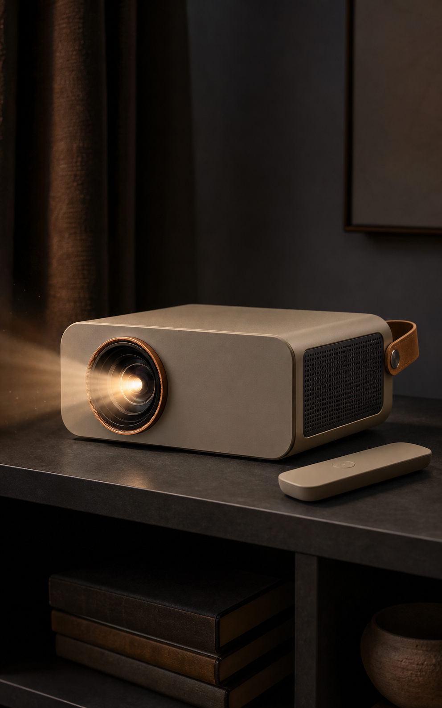

#### 详细信息

- **作者:** [Ecommerce GPT Image Prompts Studio](https://github.com/ecomimagelab)
- **来源:** 本仓库原创内容
- **发布日期:** 2026-07-23
- **语言:** en
- **适用平台:** Best Buy
- **许可证:** CC-BY-4.0

<details>
<summary><strong>生产参数、商品保真项与溯源信息</strong></summary>

| 生成模式 | 商品行业 | 使用场景 | 宽高比 |
|---|---|---|---|
| `text-to-image` | 消费电子 | 功能卖点图 | 5:8 |

- **视觉风格:** 技术表达, 建筑感, 静谧生活
- **背景类型:** 暗调影棚
- **素材用途:** 商品副图
- **输入要求:** No reference image is required for this fictional unbranded product; use product-edit mode with owned source photography when adapting a real SKU.
- **商品保真项:**
  - Preserve the low rounded sandstone aluminum body, front-left circular lens, and narrow burnt-orange focus ring.
  - Preserve the right graphite speaker grille, camel leather carry loop, and one small blank matching remote.
- **负面约束:** No brand, text, extra projector, second lens, white plastic, floating UI, copyrighted movie, visible streaming logo, impossible beam direction, tangled power cable, overheated glow, child model, or warped remote. No readable text, logo, trademark, watermark, duplicate product, broken geometry, cheap CGI, collage, or border.

**来源与版权**

- Generated specifically for this repository from the recorded standalone prompt; no third-party preview image is redistributed.
- Original prompt and generated previews created for this repository after visual-pattern and open-source workflow research; no external preview asset is included.
- [visual-research](docs/VISUAL_RESEARCH.md)
- [visual-research](https://github.com/buluslan/gpt-image2-ecommerce)
- [visual-research](https://github.com/motiful/product-shots)
- **平台规则状态:** Platform names identify intended visual treatment only; verify current listing and advertising requirements before publication.
- **商品系列:** [ec-0047](data/prompts/ec-0047-sandstone-portable-projector-platform-set.json)

</details>

**[🚀 立即体验 →](https://www.pixpix.com/)**

---

<a id="prompt-ec-0047-shopify-limewash-living"></a>

### No. 53: 消费电子 — 砂岩色便携投影仪多平台套图: SHOPIFY LIMEWASH LIVING

 

#### 描述

让同一台砂岩色便携投影仪在白底零售、功能光效、建筑客厅、成年观影夜和 Pinterest 户外影院中保持一致。

**品牌首图 · Shopify · 5:8**

#### 提示词

```text
Use case: product-mockup.
Asset type: branded hero for shopify.
Primary request: Create one ultra-photorealistic portrait 5:8 e-commerce image featuring exactly one compact portable projector with one remote.
Product design: one fictional unbranded compact portable projector in warm sandstone-beige matte aluminum, shaped as a low rounded rectangle with one large black circular lens on the front-left, a narrow burnt-orange focus ring, a perforated graphite speaker grille on the right side, a slim camel leather carry loop, and one small matching blank remote.
Scene/backdrop: Place the projector on a low travertine table in a curved limewash living room facing a blank warm-gray wall; the remote sits beside it.
Composition/framing: Use a wide architectural vertical composition with the product clearly foregrounded, a faint light rectangle on the wall, and generous calm space.
Lighting/mood: Blue-hour window light, warm projected glow, soft plaster gradients, and premium quiet-living texture.
Materials/textures: Render matte aluminum, optical black glass, burnt-orange anodized ring, perforated graphite grille, and camel leather with physically believable surfaces, disciplined commercial retouching, fine natural microtexture, and premium photographic depth.
Product invariants: Preserve the same low sandstone body, front-left black lens, orange focus ring, right graphite grille, camel loop, and small blank remote.
Constraints: Keep projection light physically aligned with the lens; show no copyrighted film or readable interface. Keep the product fully recognizable and commercially usable; use only fictional, unbranded design details.
Avoid: No people, television, readable screen, sofa clutter, candles, extra remote, or hidden lens. No brand, text, extra projector, second lens, white plastic, floating UI, copyrighted movie, visible streaming logo, impossible beam direction, tangled power cable, overheated glow, child model, or warped remote. No readable text, brand name, logo, trademark, watermark, duplicate product, broken geometry, cheap CGI, collage, split screen, frame, or border.
```

#### 生成预览图

##### 图片 1

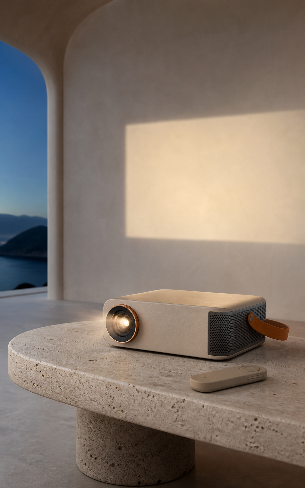

#### 详细信息

- **作者:** [Ecommerce GPT Image Prompts Studio](https://github.com/ecomimagelab)
- **来源:** 本仓库原创内容
- **发布日期:** 2026-07-23
- **语言:** en
- **适用平台:** Shopify
- **许可证:** CC-BY-4.0

<details>
<summary><strong>生产参数、商品保真项与溯源信息</strong></summary>

| 生成模式 | 商品行业 | 使用场景 | 宽高比 |
|---|---|---|---|
| `text-to-image` | 消费电子 | 品牌首图 | 5:8 |

- **视觉风格:** 技术表达, 建筑感, 静谧生活
- **背景类型:** 家居空间
- **素材用途:** 品牌首图
- **输入要求:** No reference image is required for this fictional unbranded product; use product-edit mode with owned source photography when adapting a real SKU.
- **商品保真项:**
  - Preserve the low rounded sandstone aluminum body, front-left circular lens, and narrow burnt-orange focus ring.
  - Preserve the right graphite speaker grille, camel leather carry loop, and one small blank matching remote.
- **负面约束:** No brand, text, extra projector, second lens, white plastic, floating UI, copyrighted movie, visible streaming logo, impossible beam direction, tangled power cable, overheated glow, child model, or warped remote. No readable text, logo, trademark, watermark, duplicate product, broken geometry, cheap CGI, collage, or border.

**来源与版权**

- Generated specifically for this repository from the recorded standalone prompt; no third-party preview image is redistributed.
- Original prompt and generated previews created for this repository after visual-pattern and open-source workflow research; no external preview asset is included.
- [visual-research](docs/VISUAL_RESEARCH.md)
- [visual-research](https://github.com/buluslan/gpt-image2-ecommerce)
- [visual-research](https://github.com/motiful/product-shots)
- **平台规则状态:** Platform names identify intended visual treatment only; verify current listing and advertising requirements before publication.
- **商品系列:** [ec-0047](data/prompts/ec-0047-sandstone-portable-projector-platform-set.json)

</details>

**[🚀 立即体验 →](https://www.pixpix.com/)**

---

<a id="prompt-ec-0047-tiktok-adult-movie-night"></a>

### No. 54: 消费电子 — 砂岩色便携投影仪多平台套图: TIKTOK SHOP MOVIE NIGHT

 

#### 描述

让同一台砂岩色便携投影仪在白底零售、功能光效、建筑客厅、成年观影夜和 Pinterest 户外影院中保持一致。

**生活方式场景 · TikTok Shop · 5:8**

#### 提示词

```text
Use case: product-mockup.
Asset type: social creative for tiktok shop.
Primary request: Create one ultra-photorealistic portrait 5:8 e-commerce image featuring exactly one compact portable projector with one remote.
Product design: one fictional unbranded compact portable projector in warm sandstone-beige matte aluminum, shaped as a low rounded rectangle with one large black circular lens on the front-left, a narrow burnt-orange focus ring, a perforated graphite speaker grille on the right side, a slim camel leather carry loop, and one small matching blank remote.
Scene/backdrop: Two adult friends sit on floor cushions in a simple apartment while the projector in the foreground casts abstract soft color shapes onto a blank wall.
Composition/framing: Use a low creator-style frame with the complete projector dominant and the adults softly behind, naturally reacting without holding branded items.
Lighting/mood: Direct flash on foreground mixed with warm projection ambience, candid adult expressions, and realistic home texture.
Materials/textures: Render matte aluminum, optical black glass, burnt-orange anodized ring, perforated graphite grille, and camel leather with physically believable surfaces, disciplined commercial retouching, fine natural microtexture, and premium photographic depth.
Product invariants: Preserve the same low sandstone body, front-left black lens, orange focus ring, right graphite grille, camel loop, and small blank remote.
Constraints: Keep projection light physically aligned with the lens; show no copyrighted film or readable interface. Keep the product fully recognizable and commercially usable; use only fictional, unbranded design details.
Avoid: No children, copyrighted film, readable subtitles, alcohol, phone screens, extra projector, distorted hands, or party clutter. No brand, text, extra projector, second lens, white plastic, floating UI, copyrighted movie, visible streaming logo, impossible beam direction, tangled power cable, overheated glow, child model, or warped remote. No readable text, brand name, logo, trademark, watermark, duplicate product, broken geometry, cheap CGI, collage, split screen, frame, or border.
```

#### 生成预览图

##### 图片 1

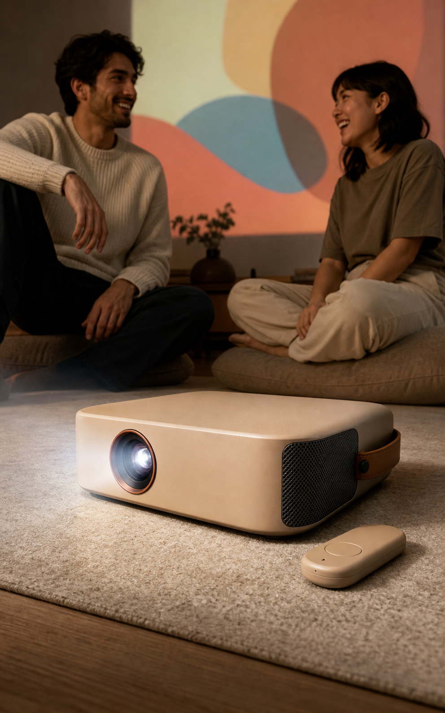

#### 详细信息

- **作者:** [Ecommerce GPT Image Prompts Studio](https://github.com/ecomimagelab)
- **来源:** 本仓库原创内容
- **发布日期:** 2026-07-23
- **语言:** en
- **适用平台:** TikTok Shop
- **许可证:** CC-BY-4.0

<details>
<summary><strong>生产参数、商品保真项与溯源信息</strong></summary>

| 生成模式 | 商品行业 | 使用场景 | 宽高比 |
|---|---|---|---|
| `text-to-image` | 消费电子 | 生活方式场景 | 5:8 |

- **视觉风格:** 技术表达, 建筑感, 静谧生活
- **背景类型:** 家居空间
- **素材用途:** 社交创意
- **输入要求:** No reference image is required for this fictional unbranded product; use product-edit mode with owned source photography when adapting a real SKU.
- **商品保真项:**
  - Preserve the low rounded sandstone aluminum body, front-left circular lens, and narrow burnt-orange focus ring.
  - Preserve the right graphite speaker grille, camel leather carry loop, and one small blank matching remote.
- **负面约束:** No brand, text, extra projector, second lens, white plastic, floating UI, copyrighted movie, visible streaming logo, impossible beam direction, tangled power cable, overheated glow, child model, or warped remote. No readable text, logo, trademark, watermark, duplicate product, broken geometry, cheap CGI, collage, or border.

**来源与版权**

- Generated specifically for this repository from the recorded standalone prompt; no third-party preview image is redistributed.
- Original prompt and generated previews created for this repository after visual-pattern and open-source workflow research; no external preview asset is included.
- [visual-research](docs/VISUAL_RESEARCH.md)
- [visual-research](https://github.com/buluslan/gpt-image2-ecommerce)
- [visual-research](https://github.com/motiful/product-shots)
- **平台规则状态:** Platform names identify intended visual treatment only; verify current listing and advertising requirements before publication.
- **商品系列:** [ec-0047](data/prompts/ec-0047-sandstone-portable-projector-platform-set.json)

</details>

**[🚀 立即体验 →](https://www.pixpix.com/)**

---

<a id="prompt-ec-0047-pinterest-desert-cinema"></a>

### No. 55: 消费电子 — 砂岩色便携投影仪多平台套图: PINTEREST DESERT CINEMA

 

#### 描述

让同一台砂岩色便携投影仪在白底零售、功能光效、建筑客厅、成年观影夜和 Pinterest 户外影院中保持一致。

**生活方式场景 · Pinterest · 5:8**

#### 提示词

```text
Use case: product-mockup.
Asset type: social creative for pinterest.
Primary request: Create one ultra-photorealistic portrait 5:8 e-commerce image featuring exactly one compact portable projector with one remote.
Product design: one fictional unbranded compact portable projector in warm sandstone-beige matte aluminum, shaped as a low rounded rectangle with one large black circular lens on the front-left, a narrow burnt-orange focus ring, a perforated graphite speaker grille on the right side, a slim camel leather carry loop, and one small matching blank remote.
Scene/backdrop: Place the projector on a pale stone plinth at a desert retreat after sunset, with its front lens physically aimed toward a blank ivory fabric screen between two adobe walls; no people.
Composition/framing: Use a tall aspirational composition viewed from behind and slightly to the projector's right side: the remote and complete three-quarter-rear projector sit in the lower foreground, the lens is visible in side profile at the left-front corner pointing away from the viewer, and the empty glowing screen occupies the upper background directly along the same optical axis.
Lighting/mood: Lavender dusk, one restrained conical beam traveling from the lens toward the screen, soft adobe texture, and restrained cinematic contrast.
Materials/textures: Render matte aluminum, optical black glass, burnt-orange anodized ring, perforated graphite grille, and camel leather with physically believable surfaces, disciplined commercial retouching, fine natural microtexture, and premium photographic depth.
Product invariants: Preserve the same low sandstone body, front-left black lens, orange focus ring, right graphite grille, camel loop, and small blank remote.
Constraints: The projector must sit between the camera and the screen; the lens must face away from the camera toward the screen, and the single light beam must run only from lens to screen. Show no copyrighted film or readable interface. Keep the product fully recognizable and commercially usable; use only fictional, unbranded design details.
Avoid: No lens facing the viewer, no beam behind the projector, no sideways screen, no movie image, stars exaggerated, campfire, alcohol, extra projector, text, wind-distorted screen, or visible cable hazard. No brand, text, extra projector, second lens, white plastic, floating UI, copyrighted movie, visible streaming logo, impossible beam direction, tangled power cable, overheated glow, child model, or warped remote. No readable text, brand name, logo, trademark, watermark, duplicate product, broken geometry, cheap CGI, collage, split screen, frame, or border.
```

#### 生成预览图

##### 图片 1

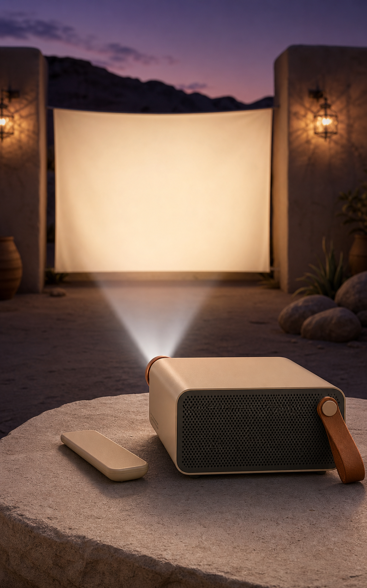

#### 详细信息

- **作者:** [Ecommerce GPT Image Prompts Studio](https://github.com/ecomimagelab)
- **来源:** 本仓库原创内容
- **发布日期:** 2026-07-23
- **语言:** en
- **适用平台:** Pinterest
- **许可证:** CC-BY-4.0

<details>
<summary><strong>生产参数、商品保真项与溯源信息</strong></summary>

| 生成模式 | 商品行业 | 使用场景 | 宽高比 |
|---|---|---|---|
| `text-to-image` | 消费电子 | 生活方式场景 | 5:8 |

- **视觉风格:** 技术表达, 建筑感, 静谧生活
- **背景类型:** 户外实景
- **素材用途:** 社交创意
- **输入要求:** No reference image is required for this fictional unbranded product; use product-edit mode with owned source photography when adapting a real SKU.
- **商品保真项:**
  - Preserve the low rounded sandstone aluminum body, front-left circular lens, and narrow burnt-orange focus ring.
  - Preserve the right graphite speaker grille, camel leather carry loop, and one small blank matching remote.
- **负面约束:** No brand, text, extra projector, second lens, white plastic, floating UI, copyrighted movie, visible streaming logo, impossible beam direction, tangled power cable, overheated glow, child model, or warped remote. No readable text, logo, trademark, watermark, duplicate product, broken geometry, cheap CGI, collage, or border.

**来源与版权**

- Generated specifically for this repository from the recorded standalone prompt; no third-party preview image is redistributed.
- Original prompt and generated previews created for this repository after visual-pattern and open-source workflow research; no external preview asset is included.
- [visual-research](docs/VISUAL_RESEARCH.md)
- [visual-research](https://github.com/buluslan/gpt-image2-ecommerce)
- [visual-research](https://github.com/motiful/product-shots)
- **平台规则状态:** Platform names identify intended visual treatment only; verify current listing and advertising requirements before publication.
- **商品系列:** [ec-0047](data/prompts/ec-0047-sandstone-portable-projector-platform-set.json)

</details>

**[🚀 立即体验 →](https://www.pixpix.com/)**

---

<a id="platforms-tmall-luxury"></a>

<a id="prompt-ec-0046-amazon-electronics-open-case"></a>

### No. 56: 消费电子 — 烟灰透明真无线耳机多平台套图: AMAZON ELECTRONICS OPEN CASE

 

#### 描述

让同一套烟灰透明真无线耳机在电子零售、技术细节、暗调发布、成年通勤和折射静物中保持一致。

**平台主图 · Amazon · 4:5**

#### 提示词

```text
Use case: product-mockup.
Asset type: main image for amazon.
Primary request: Create one ultra-photorealistic portrait 4:5 e-commerce image featuring exactly one charging case and one matching left-right pair of wireless earbuds.
Product design: one fictional unbranded wireless earbud set with a low rounded smoke-transparent charging case, a satin-black inner cradle, two compact stemless earbuds with smoke-transparent outer shells, one small coral touch disc on each earbud, and a single amber status dot centered on the case front.
Scene/backdrop: Place the open charging case front-facing on seamless pure #FFFFFF with both earbuds seated correctly and the lid upright.
Composition/framing: Center the complete set at about 70% frame fill; show transparent lid, black cradle, both coral discs, amber dot, and soft grounding shadow.
Lighting/mood: Broad high-key softboxes, controlled transparency, crisp internal silhouettes, and neutral white balance.
Materials/textures: Render smoked transparent polymer, satin black cradle, coral touch discs, fine acoustic mesh, and controlled internal-component visibility with physically believable surfaces, disciplined commercial retouching, fine natural microtexture, and premium photographic depth.
Product invariants: Preserve the same low transparent case, black cradle, two stemless transparent buds, one coral disc per bud, and one centered amber status dot.
Constraints: Show exactly two earbuds as a matching left-right pair and only one charging case. Keep the product fully recognizable and commercially usable; use only fictional, unbranded design details.
Avoid: No cable, hand, packaging, floating bud, closed lid, extra component, or harsh glare hiding transparency. No brand, text, extra earbud, missing bud, long stems, white plastic, visible battery hazard, tangled cable, duplicate case, oversized internal electronics, ear distortion, child model, or floating interface. No readable text, brand name, logo, trademark, watermark, duplicate product, broken geometry, cheap CGI, collage, split screen, frame, or border.
```

#### 生成预览图

##### 图片 1

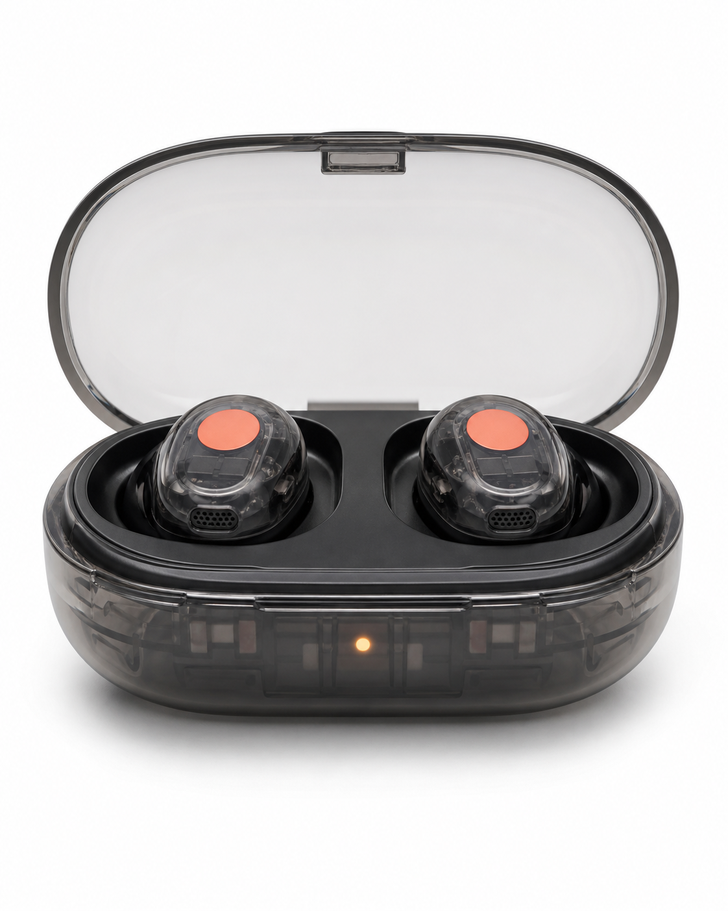

#### 详细信息

- **作者:** [Ecommerce GPT Image Prompts Studio](https://github.com/ecomimagelab)
- **来源:** 本仓库原创内容
- **发布日期:** 2026-07-23
- **语言:** en
- **适用平台:** Amazon
- **许可证:** CC-BY-4.0

<details>
<summary><strong>生产参数、商品保真项与溯源信息</strong></summary>

| 生成模式 | 商品行业 | 使用场景 | 宽高比 |
|---|---|---|---|
| `text-to-image` | 消费电子 | 平台主图 | 4:5 |

- **视觉风格:** 技术表达, 高端奢华, 编辑大片
- **背景类型:** 纯白背景
- **素材用途:** 平台主图
- **输入要求:** No reference image is required for this fictional unbranded product; use product-edit mode with owned source photography when adapting a real SKU.
- **商品保真项:**
  - Preserve the low smoke-transparent rounded case, satin-black inner cradle, and centered amber status dot.
  - Preserve exactly two compact stemless smoke-transparent earbuds with one coral touch disc each.
- **负面约束:** No brand, text, extra earbud, missing bud, long stems, white plastic, visible battery hazard, tangled cable, duplicate case, oversized internal electronics, ear distortion, child model, or floating interface. No readable text, logo, trademark, watermark, duplicate product, broken geometry, cheap CGI, collage, or border.

**来源与版权**

- Generated specifically for this repository from the recorded standalone prompt; no third-party preview image is redistributed.
- Original prompt and generated previews created for this repository after visual-pattern and open-source workflow research; no external preview asset is included.
- [visual-research](docs/VISUAL_RESEARCH.md)
- [visual-research](https://github.com/buluslan/gpt-image2-ecommerce)
- [visual-research](https://github.com/motiful/product-shots)
- **平台规则状态:** Platform names identify intended visual treatment only; verify current listing and advertising requirements before publication.
- **商品系列:** [ec-0046](data/prompts/ec-0046-smoke-transparent-earbuds-platform-set.json)

</details>

**[🚀 立即体验 →](https://www.pixpix.com/)**

---

<a id="prompt-ec-0046-bestbuy-acoustic-detail"></a>

### No. 57: 消费电子 — 烟灰透明真无线耳机多平台套图: BEST BUY ACOUSTIC DETAIL

 

#### 描述

让同一套烟灰透明真无线耳机在电子零售、技术细节、暗调发布、成年通勤和折射静物中保持一致。

**功能卖点图 · Best Buy · 4:5**

#### 提示词

```text
Use case: product-mockup.
Asset type: secondary image for best buy.
Primary request: Create one ultra-photorealistic portrait 4:5 e-commerce image featuring exactly one charging case and one matching left-right pair of wireless earbuds.
Product design: one fictional unbranded wireless earbud set with a low rounded smoke-transparent charging case, a satin-black inner cradle, two compact stemless earbuds with smoke-transparent outer shells, one small coral touch disc on each earbud, and a single amber status dot centered on the case front.
Scene/backdrop: Rest one earbud beside the open case on a dark graphite plane while the second remains seated; use faint concentric coral shadow rings on the surface only.
Composition/framing: Use a tight technical macro showing acoustic mesh, coral touch disc, transparent shell thickness, case cradle, and amber dot without explanatory text.
Lighting/mood: Cool rim light, narrow coral reflection, high microcontrast, and deep controlled shadows.
Materials/textures: Render smoked transparent polymer, satin black cradle, coral touch discs, fine acoustic mesh, and controlled internal-component visibility with physically believable surfaces, disciplined commercial retouching, fine natural microtexture, and premium photographic depth.
Product invariants: Preserve the same low transparent case, black cradle, two stemless transparent buds, one coral disc per bud, and one centered amber status dot.
Constraints: Show exactly two earbuds as a matching left-right pair and only one charging case. Keep the product fully recognizable and commercially usable; use only fictional, unbranded design details.
Avoid: No floating sound-wave graphic, labels, exploded parts, extra bud, visible text, water, or ear. No brand, text, extra earbud, missing bud, long stems, white plastic, visible battery hazard, tangled cable, duplicate case, oversized internal electronics, ear distortion, child model, or floating interface. No readable text, brand name, logo, trademark, watermark, duplicate product, broken geometry, cheap CGI, collage, split screen, frame, or border.
```

#### 生成预览图

##### 图片 1

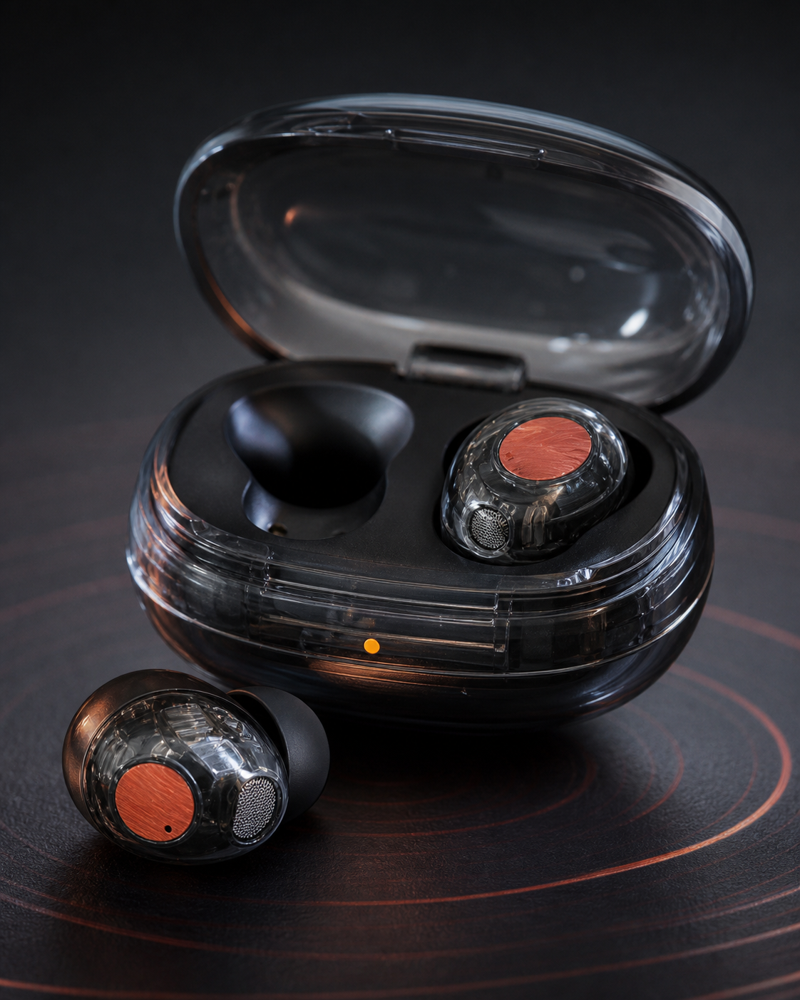

#### 详细信息

- **作者:** [Ecommerce GPT Image Prompts Studio](https://github.com/ecomimagelab)
- **来源:** 本仓库原创内容
- **发布日期:** 2026-07-23
- **语言:** en
- **适用平台:** Best Buy
- **许可证:** CC-BY-4.0

<details>
<summary><strong>生产参数、商品保真项与溯源信息</strong></summary>

| 生成模式 | 商品行业 | 使用场景 | 宽高比 |
|---|---|---|---|
| `text-to-image` | 消费电子 | 功能卖点图 | 4:5 |

- **视觉风格:** 技术表达, 高端奢华, 编辑大片
- **背景类型:** 暗调影棚
- **素材用途:** 商品副图
- **输入要求:** No reference image is required for this fictional unbranded product; use product-edit mode with owned source photography when adapting a real SKU.
- **商品保真项:**
  - Preserve the low smoke-transparent rounded case, satin-black inner cradle, and centered amber status dot.
  - Preserve exactly two compact stemless smoke-transparent earbuds with one coral touch disc each.
- **负面约束:** No brand, text, extra earbud, missing bud, long stems, white plastic, visible battery hazard, tangled cable, duplicate case, oversized internal electronics, ear distortion, child model, or floating interface. No readable text, logo, trademark, watermark, duplicate product, broken geometry, cheap CGI, collage, or border.

**来源与版权**

- Generated specifically for this repository from the recorded standalone prompt; no third-party preview image is redistributed.
- Original prompt and generated previews created for this repository after visual-pattern and open-source workflow research; no external preview asset is included.
- [visual-research](docs/VISUAL_RESEARCH.md)
- [visual-research](https://github.com/buluslan/gpt-image2-ecommerce)
- [visual-research](https://github.com/motiful/product-shots)
- **平台规则状态:** Platform names identify intended visual treatment only; verify current listing and advertising requirements before publication.
- **商品系列:** [ec-0046](data/prompts/ec-0046-smoke-transparent-earbuds-platform-set.json)

</details>

**[🚀 立即体验 →](https://www.pixpix.com/)**

---

<a id="prompt-ec-0046-tmall-obsidian-launch"></a>

### No. 58: 消费电子 — 烟灰透明真无线耳机多平台套图: TMALL OBSIDIAN LAUNCH

 

#### 描述

让同一套烟灰透明真无线耳机在电子零售、技术细节、暗调发布、成年通勤和折射静物中保持一致。

**品牌首图 · 天猫奢品 · 5:8**

#### 提示词

```text
Use case: product-mockup.
Asset type: branded hero for tmall luxury.
Primary request: Create one ultra-photorealistic portrait 5:8 e-commerce image featuring exactly one charging case and one matching left-right pair of wireless earbuds.
Product design: one fictional unbranded wireless earbud set with a low rounded smoke-transparent charging case, a satin-black inner cradle, two compact stemless earbuds with smoke-transparent outer shells, one small coral touch disc on each earbud, and a single amber status dot centered on the case front.
Scene/backdrop: Place the open case on one polished obsidian wedge with both earbuds resting symmetrically in front against a near-black background.
Composition/framing: Create a centered ceremonial vertical composition with smoke transparency glowing from behind and generous luxury negative space.
Lighting/mood: Focused amber backlight, coral specular accents, glossy black reflection, and precise edge separation.
Materials/textures: Render smoked transparent polymer, satin black cradle, coral touch discs, fine acoustic mesh, and controlled internal-component visibility with physically believable surfaces, disciplined commercial retouching, fine natural microtexture, and premium photographic depth.
Product invariants: Preserve the same low transparent case, black cradle, two stemless transparent buds, one coral disc per bud, and one centered amber status dot.
Constraints: Show exactly two earbuds as a matching left-right pair and only one charging case. Keep the product fully recognizable and commercially usable; use only fictional, unbranded design details.
Avoid: No neon text, smoke cloud, extra case, floating product, gemstones, gold trim, or mirrored duplicates. No brand, text, extra earbud, missing bud, long stems, white plastic, visible battery hazard, tangled cable, duplicate case, oversized internal electronics, ear distortion, child model, or floating interface. No readable text, brand name, logo, trademark, watermark, duplicate product, broken geometry, cheap CGI, collage, split screen, frame, or border.
```

#### 生成预览图

##### 图片 1

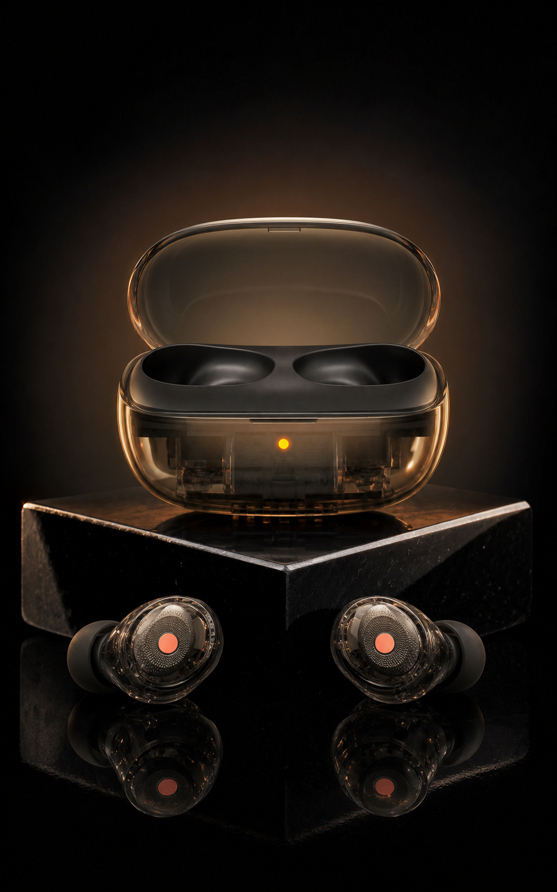

#### 详细信息

- **作者:** [Ecommerce GPT Image Prompts Studio](https://github.com/ecomimagelab)
- **来源:** 本仓库原创内容
- **发布日期:** 2026-07-23
- **语言:** en
- **适用平台:** 天猫奢品
- **许可证:** CC-BY-4.0

<details>
<summary><strong>生产参数、商品保真项与溯源信息</strong></summary>

| 生成模式 | 商品行业 | 使用场景 | 宽高比 |
|---|---|---|---|
| `text-to-image` | 消费电子 | 品牌首图 | 5:8 |

- **视觉风格:** 技术表达, 高端奢华, 编辑大片
- **背景类型:** 暗调影棚
- **素材用途:** 品牌首图
- **输入要求:** No reference image is required for this fictional unbranded product; use product-edit mode with owned source photography when adapting a real SKU.
- **商品保真项:**
  - Preserve the low smoke-transparent rounded case, satin-black inner cradle, and centered amber status dot.
  - Preserve exactly two compact stemless smoke-transparent earbuds with one coral touch disc each.
- **负面约束:** No brand, text, extra earbud, missing bud, long stems, white plastic, visible battery hazard, tangled cable, duplicate case, oversized internal electronics, ear distortion, child model, or floating interface. No readable text, logo, trademark, watermark, duplicate product, broken geometry, cheap CGI, collage, or border.

**来源与版权**

- Generated specifically for this repository from the recorded standalone prompt; no third-party preview image is redistributed.
- Original prompt and generated previews created for this repository after visual-pattern and open-source workflow research; no external preview asset is included.
- [visual-research](docs/VISUAL_RESEARCH.md)
- [visual-research](https://github.com/buluslan/gpt-image2-ecommerce)
- [visual-research](https://github.com/motiful/product-shots)
- **平台规则状态:** Platform names identify intended visual treatment only; verify current listing and advertising requirements before publication.
- **商品系列:** [ec-0046](data/prompts/ec-0046-smoke-transparent-earbuds-platform-set.json)

</details>

**[🚀 立即体验 →](https://www.pixpix.com/)**

---

<a id="prompt-ec-0046-instagram-adult-subway"></a>

### No. 59: 消费电子 — 烟灰透明真无线耳机多平台套图: INSTAGRAM ADULT SUBWAY

 

#### 描述

让同一套烟灰透明真无线耳机在电子零售、技术细节、暗调发布、成年通勤和折射静物中保持一致。

**模特上身 · Instagram Shop · 5:8**

#### 提示词

```text
Use case: product-mockup.
Asset type: social creative for instagram shop.
Primary request: Create one ultra-photorealistic portrait 5:8 e-commerce image featuring exactly one charging case and exactly two wireless earbuds total in the entire image.
Product design: one fictional unbranded wireless earbud set with a low rounded smoke-transparent charging case, a satin-black inner cradle, two compact stemless earbuds with smoke-transparent outer shells, one small coral touch disc on each earbud, and a single amber status dot centered on the case front.
Scene/backdrop: An adult commuter wears exactly one earbud in the single visible near ear while standing inside a modern subway car, dressed in a plain charcoal coat and looking naturally toward the window; the matching second earbud remains inside the open charging case held in one hand, and the other cradle slot is visibly empty.
Composition/framing: Use a close shoulders-up side portrait with only one human ear visible, the worn earbud sharply readable, and the open charging case held in one complete relaxed hand so exactly one remaining earbud and exactly one empty slot are obvious.
Lighting/mood: Cool transit ambience with direct-flash lift, natural adult skin, window streak bokeh, and crisp coral accent.
Materials/textures: Render smoked transparent polymer, satin black cradle, coral touch discs, fine acoustic mesh, and controlled internal-component visibility with physically believable surfaces, disciplined commercial retouching, fine natural microtexture, and premium photographic depth.
Product invariants: Preserve the same low transparent case, black cradle, exactly two stemless transparent buds total, one coral disc per bud, and one centered amber status dot.
Constraints: Across the complete frame show exactly two earbuds total: one in the visible ear and one inside the case; show exactly one visibly empty cradle slot and only one charging case. Keep the product fully recognizable and commercially usable; use only fictional, unbranded design details.
Avoid: No second earbud inside the case, no third earbud, no two occupied cradle slots, no child, distorted ear, logo clothing, readable transit signs, extra fingers, phone, or exaggerated smile. No brand, text, extra earbud, missing bud, long stems, white plastic, visible battery hazard, tangled cable, duplicate case, oversized internal electronics, ear distortion, child model, or floating interface. No readable text, brand name, logo, trademark, watermark, duplicate product, broken geometry, cheap CGI, collage, split screen, frame, or border.
```

#### 生成预览图

##### 图片 1

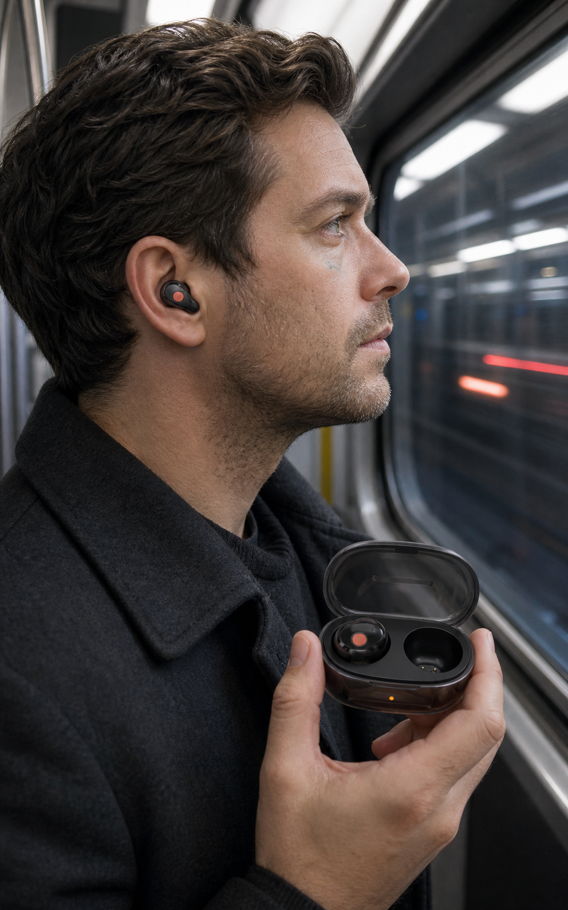

#### 详细信息

- **作者:** [Ecommerce GPT Image Prompts Studio](https://github.com/ecomimagelab)
- **来源:** 本仓库原创内容
- **发布日期:** 2026-07-23
- **语言:** en
- **适用平台:** Instagram Shop
- **许可证:** CC-BY-4.0

<details>
<summary><strong>生产参数、商品保真项与溯源信息</strong></summary>

| 生成模式 | 商品行业 | 使用场景 | 宽高比 |
|---|---|---|---|
| `text-to-image` | 消费电子 | 模特上身 | 5:8 |

- **视觉风格:** 技术表达, 高端奢华, 编辑大片
- **背景类型:** 生活方式实景
- **素材用途:** 社交创意
- **输入要求:** No reference image is required for this fictional unbranded product; use product-edit mode with owned source photography when adapting a real SKU.
- **商品保真项:**
  - Preserve the low smoke-transparent rounded case, satin-black inner cradle, and centered amber status dot.
  - Preserve exactly two compact stemless smoke-transparent earbuds with one coral touch disc each.
- **负面约束:** No brand, text, extra earbud, missing bud, long stems, white plastic, visible battery hazard, tangled cable, duplicate case, oversized internal electronics, ear distortion, child model, or floating interface. No readable text, logo, trademark, watermark, duplicate product, broken geometry, cheap CGI, collage, or border.

**来源与版权**

- Generated specifically for this repository from the recorded standalone prompt; no third-party preview image is redistributed.
- Original prompt and generated previews created for this repository after visual-pattern and open-source workflow research; no external preview asset is included.
- [visual-research](docs/VISUAL_RESEARCH.md)
- [visual-research](https://github.com/buluslan/gpt-image2-ecommerce)
- [visual-research](https://github.com/motiful/product-shots)
- **平台规则状态:** Platform names identify intended visual treatment only; verify current listing and advertising requirements before publication.
- **商品系列:** [ec-0046](data/prompts/ec-0046-smoke-transparent-earbuds-platform-set.json)

</details>

**[🚀 立即体验 →](https://www.pixpix.com/)**

---

<a id="prompt-ec-0046-pinterest-ice-refraction"></a>

### No. 60: 消费电子 — 烟灰透明真无线耳机多平台套图: PINTEREST ICE REFRACTION

 

#### 描述

让同一套烟灰透明真无线耳机在电子零售、技术细节、暗调发布、成年通勤和折射静物中保持一致。

**社交电商广告 · Pinterest · 5:8**

#### 提示词

```text
Use case: product-mockup.
Asset type: social creative for pinterest.
Primary request: Create one ultra-photorealistic portrait 5:8 e-commerce image featuring exactly one charging case and one matching left-right pair of wireless earbuds.
Product design: one fictional unbranded wireless earbud set with a low rounded smoke-transparent charging case, a satin-black inner cradle, two compact stemless earbuds with smoke-transparent outer shells, one small coral touch disc on each earbud, and a single amber status dot centered on the case front.
Scene/backdrop: Arrange the open case and two earbuds on clear acrylic blocks over a pale ice-blue floor with one coral circular backdrop.
Composition/framing: Use a save-worthy refractive still life with all three product components distinct, elegant asymmetry, and clean negative space.
Lighting/mood: Hard cool sunlight, acrylic caustics, coral bounce, and controlled transparent-shell detail.
Materials/textures: Render smoked transparent polymer, satin black cradle, coral touch discs, fine acoustic mesh, and controlled internal-component visibility with physically believable surfaces, disciplined commercial retouching, fine natural microtexture, and premium photographic depth.
Product invariants: Preserve the same low transparent case, black cradle, two stemless transparent buds, one coral disc per bud, and one centered amber status dot.
Constraints: Show exactly two earbuds as a matching left-right pair and only one charging case. Keep the product fully recognizable and commercially usable; use only fictional, unbranded design details.
Avoid: No real melting ice, water on electronics, extra bud, text, floating case, or clutter. No brand, text, extra earbud, missing bud, long stems, white plastic, visible battery hazard, tangled cable, duplicate case, oversized internal electronics, ear distortion, child model, or floating interface. No readable text, brand name, logo, trademark, watermark, duplicate product, broken geometry, cheap CGI, collage, split screen, frame, or border.
```

#### 生成预览图

##### 图片 1

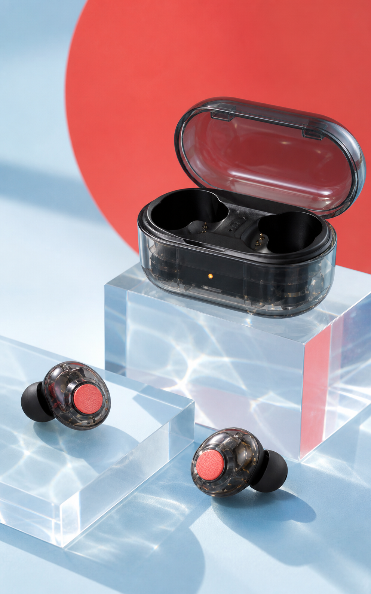

#### 详细信息

- **作者:** [Ecommerce GPT Image Prompts Studio](https://github.com/ecomimagelab)
- **来源:** 本仓库原创内容
- **发布日期:** 2026-07-23
- **语言:** en
- **适用平台:** Pinterest
- **许可证:** CC-BY-4.0

<details>
<summary><strong>生产参数、商品保真项与溯源信息</strong></summary>

| 生成模式 | 商品行业 | 使用场景 | 宽高比 |
|---|---|---|---|
| `text-to-image` | 消费电子 | 社交电商广告 | 5:8 |

- **视觉风格:** 技术表达, 高端奢华, 编辑大片
- **背景类型:** 图形化布景
- **素材用途:** 社交创意
- **输入要求:** No reference image is required for this fictional unbranded product; use product-edit mode with owned source photography when adapting a real SKU.
- **商品保真项:**
  - Preserve the low smoke-transparent rounded case, satin-black inner cradle, and centered amber status dot.
  - Preserve exactly two compact stemless smoke-transparent earbuds with one coral touch disc each.
- **负面约束:** No brand, text, extra earbud, missing bud, long stems, white plastic, visible battery hazard, tangled cable, duplicate case, oversized internal electronics, ear distortion, child model, or floating interface. No readable text, logo, trademark, watermark, duplicate product, broken geometry, cheap CGI, collage, or border.

**来源与版权**

- Generated specifically for this repository from the recorded standalone prompt; no third-party preview image is redistributed.
- Original prompt and generated previews created for this repository after visual-pattern and open-source workflow research; no external preview asset is included.
- [visual-research](docs/VISUAL_RESEARCH.md)
- [visual-research](https://github.com/buluslan/gpt-image2-ecommerce)
- [visual-research](https://github.com/motiful/product-shots)
- **平台规则状态:** Platform names identify intended visual treatment only; verify current listing and advertising requirements before publication.
- **商品系列:** [ec-0046](data/prompts/ec-0046-smoke-transparent-earbuds-platform-set.json)

</details>

**[🚀 立即体验 →](https://www.pixpix.com/)**

---

<a id="platforms-tmall"></a>

<a id="prompt-ec-0045-bestbuy-clean-keyboard"></a>

### No. 61: 消费电子 — 石墨灰珊瑚轴机械键盘多平台套图: BEST BUY CLEAN KEYBOARD

 

#### 描述

让同一把石墨灰紧凑机械键盘在零售主图、暗调桌面、技术发布、创作者手部和彩色 Pinterest 工作区中保持一致。

**平台主图 · Best Buy · 4:5**

#### 提示词

```text
Use case: product-mockup.
Asset type: main image for best buy.
Primary request: Create one ultra-photorealistic portrait 4:5 e-commerce image featuring exactly one compact mechanical keyboard with one detachable cable.
Product design: one fictional unbranded compact 75-percent mechanical keyboard with a bead-blasted graphite aluminum case, low charcoal keycaps with no printed legends, exactly three coral accent keys at the upper-right corner, one small knurled brass volume knob, a thin amber light line under the front edge, and one detachable black braided USB cable.
Scene/backdrop: Place the keyboard at a front three-quarter angle on seamless pure #FFFFFF with the cable connected and arranged in one clean curve.
Composition/framing: Center the entire keyboard at about 75% frame fill; show case thickness, blank rows, three coral keys, brass knob, amber line, cable, and connector.
Lighting/mood: Broad high-key technical softboxes, clean aluminum highlights, subtle grounding shadow, and restrained amber glow.
Materials/textures: Render bead-blasted aluminum, matte PBT keycaps, satin coral caps, knurled brass, braided cable, and restrained amber light with physically believable surfaces, disciplined commercial retouching, fine natural microtexture, and premium photographic depth.
Product invariants: Preserve the same compact 75-percent layout, graphite case, blank charcoal caps, three coral upper-right keys, brass knob, amber front line, and black cable.
Constraints: Keep all keycaps blank to avoid false text and preserve the exact accent-key count. Keep the product fully recognizable and commercially usable; use only fictional, unbranded design details.
Avoid: No hands, computer, mouse, desk mat, packaging, floating keys, or cropped cable connector. No letters, numbers, brand, RGB rainbow, wrist rest, mouse, extra keyboard, extra coral key, missing knob, full-size numpad, warped rows, floating keycaps, transparent case, or disconnected cable unless specified. No readable text, brand name, logo, trademark, watermark, duplicate product, broken geometry, cheap CGI, collage, split screen, frame, or border.
```

#### 生成预览图

##### 图片 1

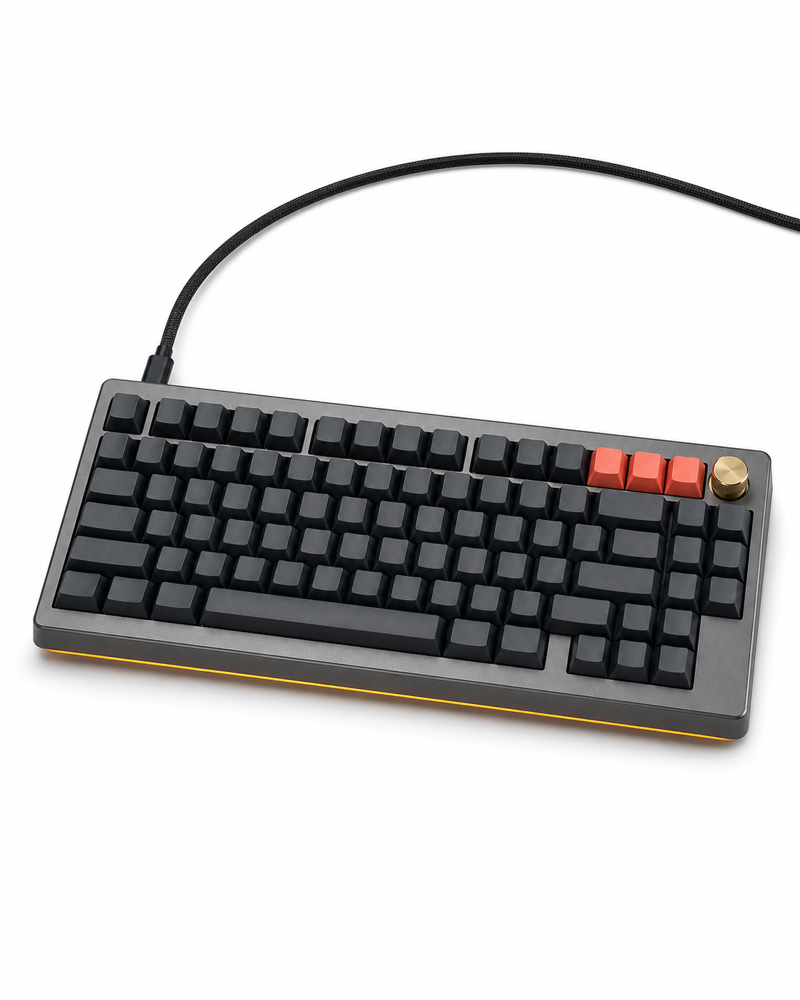

#### 详细信息

- **作者:** [Ecommerce GPT Image Prompts Studio](https://github.com/ecomimagelab)
- **来源:** 本仓库原创内容
- **发布日期:** 2026-07-23
- **语言:** en
- **适用平台:** Best Buy
- **许可证:** CC-BY-4.0

<details>
<summary><strong>生产参数、商品保真项与溯源信息</strong></summary>

| 生成模式 | 商品行业 | 使用场景 | 宽高比 |
|---|---|---|---|
| `text-to-image` | 消费电子 | 平台主图 | 4:5 |

- **视觉风格:** 技术表达, 暗调氛围, 社交原生
- **背景类型:** 纯白背景
- **素材用途:** 平台主图
- **输入要求:** No reference image is required for this fictional unbranded product; use product-edit mode with owned source photography when adapting a real SKU.
- **商品保真项:**
  - Preserve the compact graphite 75-percent case, blank charcoal keycaps, and exactly three coral keys at the upper right.
  - Preserve the knurled brass volume knob, thin amber front light line, and detachable black braided cable.
- **负面约束:** No letters, numbers, brand, RGB rainbow, wrist rest, mouse, extra keyboard, extra coral key, missing knob, full-size numpad, warped rows, floating keycaps, transparent case, or disconnected cable unless specified. No readable text, logo, trademark, watermark, duplicate product, broken geometry, cheap CGI, collage, or border.

**来源与版权**

- Generated specifically for this repository from the recorded standalone prompt; no third-party preview image is redistributed.
- Original prompt and generated previews created for this repository after visual-pattern and open-source workflow research; no external preview asset is included.
- [visual-research](docs/VISUAL_RESEARCH.md)
- [visual-research](https://github.com/buluslan/gpt-image2-ecommerce)
- [visual-research](https://github.com/motiful/product-shots)
- **平台规则状态:** Platform names identify intended visual treatment only; verify current listing and advertising requirements before publication.
- **商品系列:** [ec-0045](data/prompts/ec-0045-graphite-coral-mechanical-keyboard-platform-set.json)

</details>

**[🚀 立即体验 →](https://www.pixpix.com/)**

---

<a id="prompt-ec-0045-shopify-midnight-desk"></a>

### No. 62: 消费电子 — 石墨灰珊瑚轴机械键盘多平台套图: SHOPIFY MIDNIGHT DESK

 

#### 描述

让同一把石墨灰紧凑机械键盘在零售主图、暗调桌面、技术发布、创作者手部和彩色 Pinterest 工作区中保持一致。

**生活方式场景 · Shopify · 5:8**

#### 提示词

```text
Use case: product-mockup.
Asset type: branded hero for shopify.
Primary request: Create one ultra-photorealistic portrait 5:8 e-commerce image featuring exactly one compact mechanical keyboard with one detachable cable.
Product design: one fictional unbranded compact 75-percent mechanical keyboard with a bead-blasted graphite aluminum case, low charcoal keycaps with no printed legends, exactly three coral accent keys at the upper-right corner, one small knurled brass volume knob, a thin amber light line under the front edge, and one detachable black braided USB cable.
Scene/backdrop: Place the keyboard on a blackened-oak desk beneath a dark blank monitor, with one smoked-glass lamp far behind and no other peripherals.
Composition/framing: Use a low desk-level diagonal view with the keyboard dominant and the amber front line leading into deep negative space.
Lighting/mood: Cool midnight window ambience, warm amber edge, soft lamp bokeh, and rich charcoal material separation.
Materials/textures: Render bead-blasted aluminum, matte PBT keycaps, satin coral caps, knurled brass, braided cable, and restrained amber light with physically believable surfaces, disciplined commercial retouching, fine natural microtexture, and premium photographic depth.
Product invariants: Preserve the same compact 75-percent layout, graphite case, blank charcoal caps, three coral upper-right keys, brass knob, amber front line, and black cable.
Constraints: Keep all keycaps blank to avoid false text and preserve the exact accent-key count. Keep the product fully recognizable and commercially usable; use only fictional, unbranded design details.
Avoid: No visible UI, readable screen, mouse, headphones, cup, extra cable, messy desk, or neon rainbow. No letters, numbers, brand, RGB rainbow, wrist rest, mouse, extra keyboard, extra coral key, missing knob, full-size numpad, warped rows, floating keycaps, transparent case, or disconnected cable unless specified. No readable text, brand name, logo, trademark, watermark, duplicate product, broken geometry, cheap CGI, collage, split screen, frame, or border.
```

#### 生成预览图

##### 图片 1

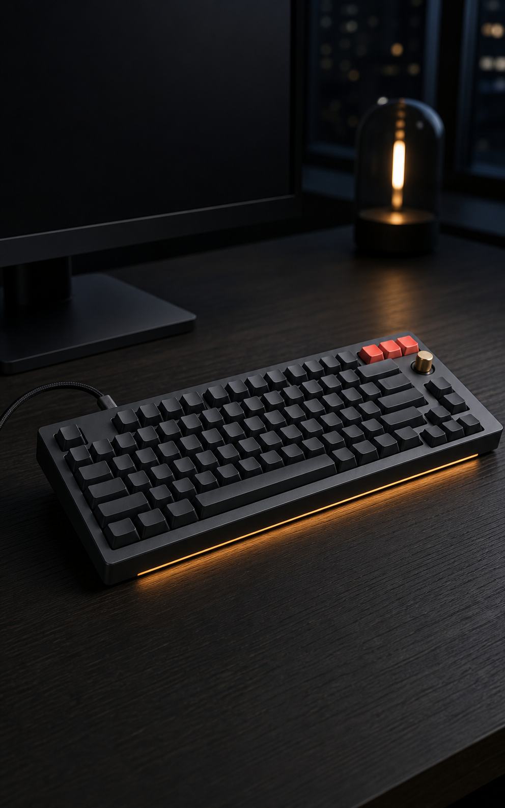

#### 详细信息

- **作者:** [Ecommerce GPT Image Prompts Studio](https://github.com/ecomimagelab)
- **来源:** 本仓库原创内容
- **发布日期:** 2026-07-23
- **语言:** en
- **适用平台:** Shopify
- **许可证:** CC-BY-4.0

<details>
<summary><strong>生产参数、商品保真项与溯源信息</strong></summary>

| 生成模式 | 商品行业 | 使用场景 | 宽高比 |
|---|---|---|---|
| `text-to-image` | 消费电子 | 生活方式场景 | 5:8 |

- **视觉风格:** 技术表达, 暗调氛围, 社交原生
- **背景类型:** 家居空间
- **素材用途:** 品牌首图
- **输入要求:** No reference image is required for this fictional unbranded product; use product-edit mode with owned source photography when adapting a real SKU.
- **商品保真项:**
  - Preserve the compact graphite 75-percent case, blank charcoal keycaps, and exactly three coral keys at the upper right.
  - Preserve the knurled brass volume knob, thin amber front light line, and detachable black braided cable.
- **负面约束:** No letters, numbers, brand, RGB rainbow, wrist rest, mouse, extra keyboard, extra coral key, missing knob, full-size numpad, warped rows, floating keycaps, transparent case, or disconnected cable unless specified. No readable text, logo, trademark, watermark, duplicate product, broken geometry, cheap CGI, collage, or border.

**来源与版权**

- Generated specifically for this repository from the recorded standalone prompt; no third-party preview image is redistributed.
- Original prompt and generated previews created for this repository after visual-pattern and open-source workflow research; no external preview asset is included.
- [visual-research](docs/VISUAL_RESEARCH.md)
- [visual-research](https://github.com/buluslan/gpt-image2-ecommerce)
- [visual-research](https://github.com/motiful/product-shots)
- **平台规则状态:** Platform names identify intended visual treatment only; verify current listing and advertising requirements before publication.
- **商品系列:** [ec-0045](data/prompts/ec-0045-graphite-coral-mechanical-keyboard-platform-set.json)

</details>

**[🚀 立即体验 →](https://www.pixpix.com/)**

---

<a id="prompt-ec-0045-tmall-technical-grid"></a>

### No. 63: 消费电子 — 石墨灰珊瑚轴机械键盘多平台套图: TMALL TECHNICAL GRID

 

#### 描述

让同一把石墨灰紧凑机械键盘在零售主图、暗调桌面、技术发布、创作者手部和彩色 Pinterest 工作区中保持一致。

**功能卖点图 · 天猫 · 5:8**

#### 提示词

```text
Use case: product-mockup.
Asset type: secondary image for tmall.
Primary request: Create one ultra-photorealistic portrait 5:8 e-commerce image featuring exactly one compact mechanical keyboard with one detachable cable.
Product design: one fictional unbranded compact 75-percent mechanical keyboard with a bead-blasted graphite aluminum case, low charcoal keycaps with no printed legends, exactly three coral accent keys at the upper-right corner, one small knurled brass volume knob, a thin amber light line under the front edge, and one detachable black braided USB cable.
Scene/backdrop: Float the keyboard a few centimeters above a matte graphite grid floor with three restrained amber light planes revealing its underside profile.
Composition/framing: Use a precise low front angle that keeps every row aligned and the brass knob, coral keys, cable port, and amber line readable without labels.
Lighting/mood: Hard technical rim lights, crisp controlled reflections, dark negative space, and no holographic text.
Materials/textures: Render bead-blasted aluminum, matte PBT keycaps, satin coral caps, knurled brass, braided cable, and restrained amber light with physically believable surfaces, disciplined commercial retouching, fine natural microtexture, and premium photographic depth.
Product invariants: Preserve the same compact 75-percent layout, graphite case, blank charcoal caps, three coral upper-right keys, brass knob, amber front line, and black cable.
Constraints: Keep all keycaps blank to avoid false text and preserve the exact accent-key count. Keep the product fully recognizable and commercially usable; use only fictional, unbranded design details.
Avoid: No exploded parts, arrows, measurements, interface labels, extra keyboard, rainbow light, or impossible levitation shadow. No letters, numbers, brand, RGB rainbow, wrist rest, mouse, extra keyboard, extra coral key, missing knob, full-size numpad, warped rows, floating keycaps, transparent case, or disconnected cable unless specified. No readable text, brand name, logo, trademark, watermark, duplicate product, broken geometry, cheap CGI, collage, split screen, frame, or border.
```

#### 生成预览图

##### 图片 1

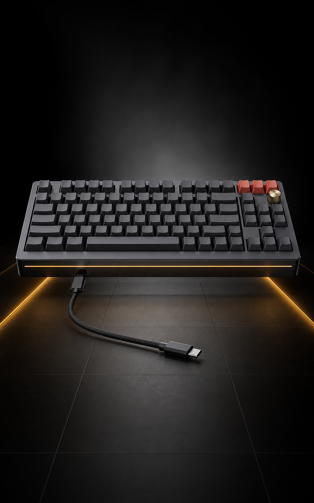

#### 详细信息

- **作者:** [Ecommerce GPT Image Prompts Studio](https://github.com/ecomimagelab)
- **来源:** 本仓库原创内容
- **发布日期:** 2026-07-23
- **语言:** en
- **适用平台:** 天猫
- **许可证:** CC-BY-4.0

<details>
<summary><strong>生产参数、商品保真项与溯源信息</strong></summary>

| 生成模式 | 商品行业 | 使用场景 | 宽高比 |
|---|---|---|---|
| `text-to-image` | 消费电子 | 功能卖点图 | 5:8 |

- **视觉风格:** 技术表达, 暗调氛围, 社交原生
- **背景类型:** 图形化布景
- **素材用途:** 商品副图
- **输入要求:** No reference image is required for this fictional unbranded product; use product-edit mode with owned source photography when adapting a real SKU.
- **商品保真项:**
  - Preserve the compact graphite 75-percent case, blank charcoal keycaps, and exactly three coral keys at the upper right.
  - Preserve the knurled brass volume knob, thin amber front light line, and detachable black braided cable.
- **负面约束:** No letters, numbers, brand, RGB rainbow, wrist rest, mouse, extra keyboard, extra coral key, missing knob, full-size numpad, warped rows, floating keycaps, transparent case, or disconnected cable unless specified. No readable text, logo, trademark, watermark, duplicate product, broken geometry, cheap CGI, collage, or border.

**来源与版权**

- Generated specifically for this repository from the recorded standalone prompt; no third-party preview image is redistributed.
- Original prompt and generated previews created for this repository after visual-pattern and open-source workflow research; no external preview asset is included.
- [visual-research](docs/VISUAL_RESEARCH.md)
- [visual-research](https://github.com/buluslan/gpt-image2-ecommerce)
- [visual-research](https://github.com/motiful/product-shots)
- **平台规则状态:** Platform names identify intended visual treatment only; verify current listing and advertising requirements before publication.
- **商品系列:** [ec-0045](data/prompts/ec-0045-graphite-coral-mechanical-keyboard-platform-set.json)

</details>

**[🚀 立即体验 →](https://www.pixpix.com/)**

---

<a id="prompt-ec-0045-tiktok-creator-hands"></a>

### No. 64: 消费电子 — 石墨灰珊瑚轴机械键盘多平台套图: TIKTOK SHOP CREATOR HANDS

 

#### 描述

让同一把石墨灰紧凑机械键盘在零售主图、暗调桌面、技术发布、创作者手部和彩色 Pinterest 工作区中保持一致。

**模特上身 · TikTok Shop · 5:8**

#### 提示词

```text
Use case: product-mockup.
Asset type: social creative for tiktok shop.
Primary request: Create one ultra-photorealistic portrait 5:8 e-commerce image featuring exactly one compact mechanical keyboard with one detachable cable.
Product design: one fictional unbranded compact 75-percent mechanical keyboard with a bead-blasted graphite aluminum case, low charcoal keycaps with no printed legends, exactly three coral accent keys at the upper-right corner, one small knurled brass volume knob, a thin amber light line under the front edge, and one detachable black braided USB cable.
Scene/backdrop: An adult creator types naturally on the keyboard at a compact concrete desk, wearing a plain cobalt sweatshirt; only forearms and complete hands enter the frame.
Composition/framing: Use a close over-desk vertical view showing both hands with correct anatomy, the full key layout, coral accents, brass knob, amber line, and connected cable.
Lighting/mood: Direct flash mixed with cool window light, slight hand-motion energy, truthful skin, and crisp device texture.
Materials/textures: Render bead-blasted aluminum, matte PBT keycaps, satin coral caps, knurled brass, braided cable, and restrained amber light with physically believable surfaces, disciplined commercial retouching, fine natural microtexture, and premium photographic depth.
Product invariants: Preserve the same compact 75-percent layout, graphite case, blank charcoal caps, three coral upper-right keys, brass knob, amber front line, and black cable.
Constraints: Keep all keycaps blank to avoid false text and preserve the exact accent-key count. Keep the product fully recognizable and commercially usable; use only fictional, unbranded design details.
Avoid: No child, extra fingers, long nails obscuring keys, rings, logo clothing, visible screen text, mouse, or second keyboard. No letters, numbers, brand, RGB rainbow, wrist rest, mouse, extra keyboard, extra coral key, missing knob, full-size numpad, warped rows, floating keycaps, transparent case, or disconnected cable unless specified. No readable text, brand name, logo, trademark, watermark, duplicate product, broken geometry, cheap CGI, collage, split screen, frame, or border.
```

#### 生成预览图

##### 图片 1


#### 详细信息

- **作者:** [Ecommerce GPT Image Prompts Studio](https://github.com/ecomimagelab)
- **来源:** 本仓库原创内容
- **发布日期:** 2026-07-23
- **语言:** en
- **适用平台:** TikTok Shop
- **许可证:** CC-BY-4.0

<details>
<summary><strong>生产参数、商品保真项与溯源信息</strong></summary>

| 生成模式 | 商品行业 | 使用场景 | 宽高比 |
|---|---|---|---|
| `text-to-image` | 消费电子 | 模特上身 | 5:8 |

- **视觉风格:** 技术表达, 暗调氛围, 社交原生
- **背景类型:** 生活方式实景
- **素材用途:** 社交创意
- **输入要求:** No reference image is required for this fictional unbranded product; use product-edit mode with owned source photography when adapting a real SKU.
- **商品保真项:**
  - Preserve the compact graphite 75-percent case, blank charcoal keycaps, and exactly three coral keys at the upper right.
  - Preserve the knurled brass volume knob, thin amber front light line, and detachable black braided cable.
- **负面约束:** No letters, numbers, brand, RGB rainbow, wrist rest, mouse, extra keyboard, extra coral key, missing knob, full-size numpad, warped rows, floating keycaps, transparent case, or disconnected cable unless specified. No readable text, logo, trademark, watermark, duplicate product, broken geometry, cheap CGI, collage, or border.

**来源与版权**

- Generated specifically for this repository from the recorded standalone prompt; no third-party preview image is redistributed.
- Original prompt and generated previews created for this repository after visual-pattern and open-source workflow research; no external preview asset is included.
- [visual-research](docs/VISUAL_RESEARCH.md)
- [visual-research](https://github.com/buluslan/gpt-image2-ecommerce)
- [visual-research](https://github.com/motiful/product-shots)
- **平台规则状态:** Platform names identify intended visual treatment only; verify current listing and advertising requirements before publication.
- **商品系列:** [ec-0045](data/prompts/ec-0045-graphite-coral-mechanical-keyboard-platform-set.json)

</details>

**[🚀 立即体验 →](https://www.pixpix.com/)**

---

<a id="prompt-ec-0045-pinterest-coral-cobalt-workspace"></a>

### No. 65: 消费电子 — 石墨灰珊瑚轴机械键盘多平台套图: PINTEREST CORAL COBALT WORKSPACE

 

#### 描述

让同一把石墨灰紧凑机械键盘在零售主图、暗调桌面、技术发布、创作者手部和彩色 Pinterest 工作区中保持一致。

**生活方式场景 · Pinterest · 4:5**

#### 提示词

```text
Use case: product-mockup.
Asset type: social creative for pinterest.
Primary request: Create one ultra-photorealistic portrait 4:5 e-commerce image featuring exactly one compact mechanical keyboard with one detachable cable.
Product design: one fictional unbranded compact 75-percent mechanical keyboard with a bead-blasted graphite aluminum case, low charcoal keycaps with no printed legends, exactly three coral accent keys at the upper-right corner, one small knurled brass volume knob, a thin amber light line under the front edge, and one detachable black braided USB cable.
Scene/backdrop: Stage the keyboard on a cobalt desk plane against a coral wall with one cream cylindrical pencil cup containing two blank pencils.
Composition/framing: Use an elevated save-worthy workspace crop with the complete keyboard, cable loop, coral keys, brass knob, and strong geometric negative space.
Lighting/mood: Hard side sun, graphic shadows, clean color blocking, and detailed matte surfaces.
Materials/textures: Render bead-blasted aluminum, matte PBT keycaps, satin coral caps, knurled brass, braided cable, and restrained amber light with physically believable surfaces, disciplined commercial retouching, fine natural microtexture, and premium photographic depth.
Product invariants: Preserve the same compact 75-percent layout, graphite case, blank charcoal caps, three coral upper-right keys, brass knob, amber front line, and black cable.
Constraints: Keep all keycaps blank to avoid false text and preserve the exact accent-key count. Keep the product fully recognizable and commercially usable; use only fictional, unbranded design details.
Avoid: No monitor, notebook text, mouse, plant, extra keyboard, letters on keys, or clutter. No letters, numbers, brand, RGB rainbow, wrist rest, mouse, extra keyboard, extra coral key, missing knob, full-size numpad, warped rows, floating keycaps, transparent case, or disconnected cable unless specified. No readable text, brand name, logo, trademark, watermark, duplicate product, broken geometry, cheap CGI, collage, split screen, frame, or border.
```

#### 生成预览图

##### 图片 1

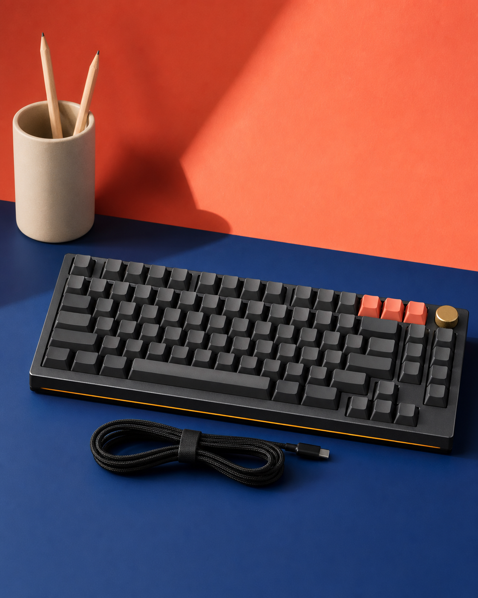

#### 详细信息

- **作者:** [Ecommerce GPT Image Prompts Studio](https://github.com/ecomimagelab)
- **来源:** 本仓库原创内容
- **发布日期:** 2026-07-23
- **语言:** en
- **适用平台:** Pinterest
- **许可证:** CC-BY-4.0

<details>
<summary><strong>生产参数、商品保真项与溯源信息</strong></summary>

| 生成模式 | 商品行业 | 使用场景 | 宽高比 |
|---|---|---|---|
| `text-to-image` | 消费电子 | 生活方式场景 | 4:5 |

- **视觉风格:** 技术表达, 暗调氛围, 社交原生
- **背景类型:** 图形化布景
- **素材用途:** 社交创意
- **输入要求:** No reference image is required for this fictional unbranded product; use product-edit mode with owned source photography when adapting a real SKU.
- **商品保真项:**
  - Preserve the compact graphite 75-percent case, blank charcoal keycaps, and exactly three coral keys at the upper right.
  - Preserve the knurled brass volume knob, thin amber front light line, and detachable black braided cable.
- **负面约束:** No letters, numbers, brand, RGB rainbow, wrist rest, mouse, extra keyboard, extra coral key, missing knob, full-size numpad, warped rows, floating keycaps, transparent case, or disconnected cable unless specified. No readable text, logo, trademark, watermark, duplicate product, broken geometry, cheap CGI, collage, or border.

**来源与版权**

- Generated specifically for this repository from the recorded standalone prompt; no third-party preview image is redistributed.
- Original prompt and generated previews created for this repository after visual-pattern and open-source workflow research; no external preview asset is included.
- [visual-research](docs/VISUAL_RESEARCH.md)
- [visual-research](https://github.com/buluslan/gpt-image2-ecommerce)
- [visual-research](https://github.com/motiful/product-shots)
- **平台规则状态:** Platform names identify intended visual treatment only; verify current listing and advertising requirements before publication.
- **商品系列:** [ec-0045](data/prompts/ec-0045-graphite-coral-mechanical-keyboard-platform-set.json)

</details>

**[🚀 立即体验 →](https://www.pixpix.com/)**

---

<a id="categories-beauty"></a>

<a id="platforms-sephora"></a>

<a id="prompt-ec-0044-sephora-clean-jar"></a>

### No. 66: 美妆与护肤 — 玉石绿替换芯面霜多平台套图: SEPHORA CLEAN JAR

 

#### 描述

让同一只玉石绿可替换芯面霜罐贯穿 Sephora 目录、湿石 DTC、暗调奢华、成年护肤仪式和 Pinterest 植物配色。

**平台主图 · Sephora · 4:5**

#### 提示词

```text
Use case: product-mockup.
Asset type: main image for sephora.
Primary request: Create one ultra-photorealistic portrait 4:5 e-commerce image featuring exactly one refillable face-cream jar with one lid.
Product design: one fictional unbranded low round face-cream jar in translucent pale-jade glass with a thick clear base, a removable brushed-sage aluminum outer lid, a visible ivory refill cup nested inside, smooth white cream, and one blank tiny oval ceramic medallion on the front.
Scene/backdrop: Place the open jar upright on seamless pure #FFFFFF with the sage lid leaning beside it and the nested ivory refill visible.
Composition/framing: Center the complete jar and lid at about 72% frame fill; keep cream surface, glass thickness, refill rim, medallion, and lid finish crisp.
Lighting/mood: Broad beauty softboxes, pale jade transmission, controlled white cream detail, and a soft grounding shadow.
Materials/textures: Render translucent jade glass, clear optical base, brushed sage metal, matte refill polymer, glossy cream, and condensation with physically believable surfaces, disciplined commercial retouching, fine natural microtexture, and premium photographic depth.
Product invariants: Preserve the same low jade jar, heavy clear base, brushed-sage lid, ivory inner refill cup, white cream, and blank ceramic oval.
Constraints: Keep the jar unlabeled and show no invented skincare claims; the refill cup must remain clearly nested and plausible. Keep the product fully recognizable and commercially usable; use only fictional, unbranded design details.
Avoid: No spatula, flowers, water, packaging, extra refill, hand, or cropped lid. No readable label, dropper, pump, extra jar, gold lid, colored cream, botanical ingredients inside cream, floating refill, deformed rim, missing medallion, child model, eye contact with cream, or medical claim. No readable text, brand name, logo, trademark, watermark, duplicate product, broken geometry, cheap CGI, collage, split screen, frame, or border.
```

#### 生成预览图

##### 图片 1

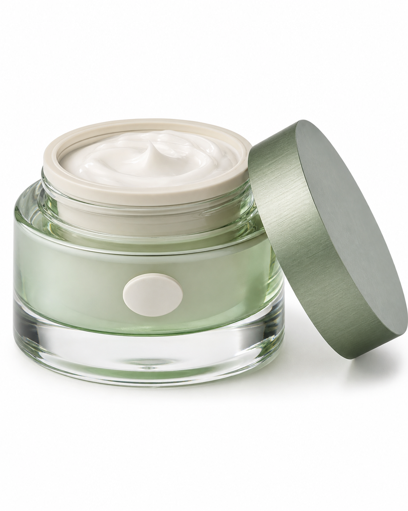

#### 详细信息

- **作者:** [Ecommerce GPT Image Prompts Studio](https://github.com/ecomimagelab)
- **来源:** 本仓库原创内容
- **发布日期:** 2026-07-23
- **语言:** en
- **适用平台:** Sephora
- **许可证:** CC-BY-4.0

<details>
<summary><strong>生产参数、商品保真项与溯源信息</strong></summary>

| 生成模式 | 商品行业 | 使用场景 | 宽高比 |
|---|---|---|---|
| `text-to-image` | 美妆与护肤 | 平台主图 | 4:5 |

- **视觉风格:** 高端奢华, 自然有机, 编辑大片
- **背景类型:** 纯白背景
- **素材用途:** 平台主图
- **输入要求:** No reference image is required for this fictional unbranded product; use product-edit mode with owned source photography when adapting a real SKU.
- **商品保真项:**
  - Preserve the low translucent pale-jade jar, thick clear base, and blank oval ceramic medallion.
  - Preserve the brushed-sage removable lid, nested ivory refill cup, and smooth white cream.
- **负面约束:** No readable label, dropper, pump, extra jar, gold lid, colored cream, botanical ingredients inside cream, floating refill, deformed rim, missing medallion, child model, eye contact with cream, or medical claim. No readable text, logo, trademark, watermark, duplicate product, broken geometry, cheap CGI, collage, or border.

**来源与版权**

- Generated specifically for this repository from the recorded standalone prompt; no third-party preview image is redistributed.
- Original prompt and generated previews created for this repository after visual-pattern and open-source workflow research; no external preview asset is included.
- [visual-research](docs/VISUAL_RESEARCH.md)
- [visual-research](https://github.com/buluslan/gpt-image2-ecommerce)
- [visual-research](https://github.com/motiful/product-shots)
- **平台规则状态:** Platform names identify intended visual treatment only; verify current listing and advertising requirements before publication.
- **商品系列:** [ec-0044](data/prompts/ec-0044-jade-refill-face-cream-platform-set.json)

</details>

**[🚀 立即体验 →](https://www.pixpix.com/)**

---

<a id="prompt-ec-0044-shopify-wet-river-stone"></a>

### No. 67: 美妆与护肤 — 玉石绿替换芯面霜多平台套图: SHOPIFY WET RIVER STONE

 

#### 描述

让同一只玉石绿可替换芯面霜罐贯穿 Sephora 目录、湿石 DTC、暗调奢华、成年护肤仪式和 Pinterest 植物配色。

**品牌首图 · Shopify · 5:8**

#### 提示词

```text
Use case: product-mockup.
Asset type: branded hero for shopify.
Primary request: Create one ultra-photorealistic portrait 5:8 e-commerce image featuring exactly one refillable face-cream jar with one lid.
Product design: one fictional unbranded low round face-cream jar in translucent pale-jade glass with a thick clear base, a removable brushed-sage aluminum outer lid, a visible ivory refill cup nested inside, smooth white cream, and one blank tiny oval ceramic medallion on the front.
Scene/backdrop: Set the closed jar on one wet charcoal river stone above a shallow pale-jade water plane with the lid correctly seated.
Composition/framing: Use a close low product portrait with optical glass refraction, one restrained reflection, and generous misty negative space.
Lighting/mood: Soft cool dawn light, subtle water caustics, controlled condensation, and a narrow warm edge on the medallion.
Materials/textures: Render translucent jade glass, clear optical base, brushed sage metal, matte refill polymer, glossy cream, and condensation with physically believable surfaces, disciplined commercial retouching, fine natural microtexture, and premium photographic depth.
Product invariants: Preserve the same low jade jar, heavy clear base, brushed-sage lid, ivory inner refill cup, white cream, and blank ceramic oval.
Constraints: Keep the jar unlabeled and show no invented skincare claims; the refill cup must remain clearly nested and plausible. Keep the product fully recognizable and commercially usable; use only fictional, unbranded design details.
Avoid: No leaves, flowers, splashing over open cream, extra jar, floating stone, readable copy, or spa towel. No readable label, dropper, pump, extra jar, gold lid, colored cream, botanical ingredients inside cream, floating refill, deformed rim, missing medallion, child model, eye contact with cream, or medical claim. No readable text, brand name, logo, trademark, watermark, duplicate product, broken geometry, cheap CGI, collage, split screen, frame, or border.
```

#### 生成预览图

##### 图片 1

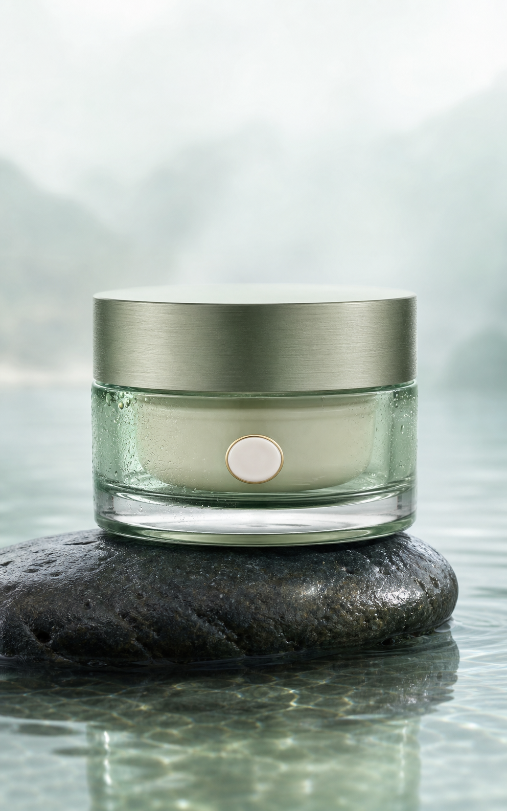

#### 详细信息

- **作者:** [Ecommerce GPT Image Prompts Studio](https://github.com/ecomimagelab)
- **来源:** 本仓库原创内容
- **发布日期:** 2026-07-23
- **语言:** en
- **适用平台:** Shopify
- **许可证:** CC-BY-4.0

<details>
<summary><strong>生产参数、商品保真项与溯源信息</strong></summary>

| 生成模式 | 商品行业 | 使用场景 | 宽高比 |
|---|---|---|---|
| `text-to-image` | 美妆与护肤 | 品牌首图 | 5:8 |

- **视觉风格:** 高端奢华, 自然有机, 编辑大片
- **背景类型:** 天然材质
- **素材用途:** 品牌首图
- **输入要求:** No reference image is required for this fictional unbranded product; use product-edit mode with owned source photography when adapting a real SKU.
- **商品保真项:**
  - Preserve the low translucent pale-jade jar, thick clear base, and blank oval ceramic medallion.
  - Preserve the brushed-sage removable lid, nested ivory refill cup, and smooth white cream.
- **负面约束:** No readable label, dropper, pump, extra jar, gold lid, colored cream, botanical ingredients inside cream, floating refill, deformed rim, missing medallion, child model, eye contact with cream, or medical claim. No readable text, logo, trademark, watermark, duplicate product, broken geometry, cheap CGI, collage, or border.

**来源与版权**

- Generated specifically for this repository from the recorded standalone prompt; no third-party preview image is redistributed.
- Original prompt and generated previews created for this repository after visual-pattern and open-source workflow research; no external preview asset is included.
- [visual-research](docs/VISUAL_RESEARCH.md)
- [visual-research](https://github.com/buluslan/gpt-image2-ecommerce)
- [visual-research](https://github.com/motiful/product-shots)
- **平台规则状态:** Platform names identify intended visual treatment only; verify current listing and advertising requirements before publication.
- **商品系列:** [ec-0044](data/prompts/ec-0044-jade-refill-face-cream-platform-set.json)

</details>

**[🚀 立即体验 →](https://www.pixpix.com/)**

---

<a id="prompt-ec-0044-tmall-jade-portal"></a>

### No. 68: 美妆与护肤 — 玉石绿替换芯面霜多平台套图: TMALL JADE PORTAL

 

#### 描述

让同一只玉石绿可替换芯面霜罐贯穿 Sephora 目录、湿石 DTC、暗调奢华、成年护肤仪式和 Pinterest 植物配色。

**品牌首图 · 天猫奢品 · 5:8**

#### 提示词

```text
Use case: product-mockup.
Asset type: branded hero for tmall luxury.
Primary request: Create one ultra-photorealistic portrait 5:8 e-commerce image featuring exactly one refillable face-cream jar with one lid.
Product design: one fictional unbranded low round face-cream jar in translucent pale-jade glass with a thick clear base, a removable brushed-sage aluminum outer lid, a visible ivory refill cup nested inside, smooth white cream, and one blank tiny oval ceramic medallion on the front.
Scene/backdrop: Place the closed jar inside a circular dark-jade stone portal on a black reflective shelf; set the lid slightly rotated but still seated.
Composition/framing: Compose a centered ceremonial product portrait with the jar dominant, circular forms aligned, and deep negative space.
Lighting/mood: Focused top light, emerald subsurface glow, graphite shadow falloff, and precise glass-metal separation.
Materials/textures: Render translucent jade glass, clear optical base, brushed sage metal, matte refill polymer, glossy cream, and condensation with physically believable surfaces, disciplined commercial retouching, fine natural microtexture, and premium photographic depth.
Product invariants: Preserve the same low jade jar, heavy clear base, brushed-sage lid, ivory inner refill cup, white cream, and blank ceramic oval.
Constraints: Keep the jar unlabeled and show no invented skincare claims; the refill cup must remain clearly nested and plausible. Keep the product fully recognizable and commercially usable; use only fictional, unbranded design details.
Avoid: No Chinese characters, gold dragon motif, smoke, extra lid, floating jar, coins, crystals, or neon rings. No readable label, dropper, pump, extra jar, gold lid, colored cream, botanical ingredients inside cream, floating refill, deformed rim, missing medallion, child model, eye contact with cream, or medical claim. No readable text, brand name, logo, trademark, watermark, duplicate product, broken geometry, cheap CGI, collage, split screen, frame, or border.
```

#### 生成预览图

##### 图片 1

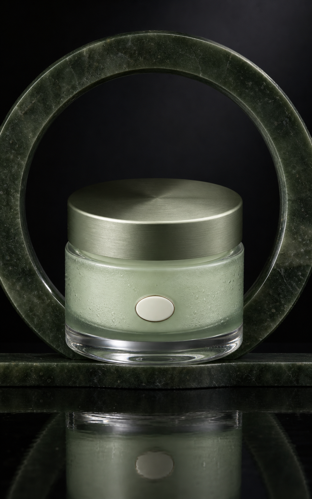

#### 详细信息

- **作者:** [Ecommerce GPT Image Prompts Studio](https://github.com/ecomimagelab)
- **来源:** 本仓库原创内容
- **发布日期:** 2026-07-23
- **语言:** en
- **适用平台:** 天猫奢品
- **许可证:** CC-BY-4.0

<details>
<summary><strong>生产参数、商品保真项与溯源信息</strong></summary>

| 生成模式 | 商品行业 | 使用场景 | 宽高比 |
|---|---|---|---|
| `text-to-image` | 美妆与护肤 | 品牌首图 | 5:8 |

- **视觉风格:** 高端奢华, 自然有机, 编辑大片
- **背景类型:** 暗调影棚
- **素材用途:** 品牌首图
- **输入要求:** No reference image is required for this fictional unbranded product; use product-edit mode with owned source photography when adapting a real SKU.
- **商品保真项:**
  - Preserve the low translucent pale-jade jar, thick clear base, and blank oval ceramic medallion.
  - Preserve the brushed-sage removable lid, nested ivory refill cup, and smooth white cream.
- **负面约束:** No readable label, dropper, pump, extra jar, gold lid, colored cream, botanical ingredients inside cream, floating refill, deformed rim, missing medallion, child model, eye contact with cream, or medical claim. No readable text, logo, trademark, watermark, duplicate product, broken geometry, cheap CGI, collage, or border.

**来源与版权**

- Generated specifically for this repository from the recorded standalone prompt; no third-party preview image is redistributed.
- Original prompt and generated previews created for this repository after visual-pattern and open-source workflow research; no external preview asset is included.
- [visual-research](docs/VISUAL_RESEARCH.md)
- [visual-research](https://github.com/buluslan/gpt-image2-ecommerce)
- [visual-research](https://github.com/motiful/product-shots)
- **平台规则状态:** Platform names identify intended visual treatment only; verify current listing and advertising requirements before publication.
- **商品系列:** [ec-0044](data/prompts/ec-0044-jade-refill-face-cream-platform-set.json)

</details>

**[🚀 立即体验 →](https://www.pixpix.com/)**

---

<a id="prompt-ec-0044-instagram-adult-skin-ritual"></a>

### No. 69: 美妆与护肤 — 玉石绿替换芯面霜多平台套图: INSTAGRAM ADULT SKIN RITUAL

 

#### 描述

让同一只玉石绿可替换芯面霜罐贯穿 Sephora 目录、湿石 DTC、暗调奢华、成年护肤仪式和 Pinterest 植物配色。

**模特上身 · Instagram Shop · 5:8**

#### 提示词

```text
Use case: product-mockup.
Asset type: social creative for instagram shop.
Primary request: Create one ultra-photorealistic portrait 5:8 e-commerce image featuring exactly one refillable face-cream jar with one lid.
Product design: one fictional unbranded low round face-cream jar in translucent pale-jade glass with a thick clear base, a removable brushed-sage aluminum outer lid, a visible ivory refill cup nested inside, smooth white cream, and one blank tiny oval ceramic medallion on the front.
Scene/backdrop: An adult woman with natural skin holds the open jar in her complete left hand near her cheek and applies a small dab of white cream with the index fingertip of her complete right hand, against a soft apricot bathroom wall with a completely dry counter; the detached lid rests visibly on the counter and is not held.
Composition/framing: Use a close shoulders-up beauty portrait; show exactly two complete human hands total, the open jar, the lid resting on the counter, blank medallion, and unretouched adult skin texture.
Lighting/mood: Soft window daylight with gentle direct-flash lift, luminous but believable skin, jade reflections, and clean warm color.
Materials/textures: Render translucent jade glass, clear optical base, brushed sage metal, matte refill polymer, glossy cream, and condensation with physically believable surfaces, disciplined commercial retouching, fine natural microtexture, and premium photographic depth.
Product invariants: Preserve the same low jade jar, heavy clear base, brushed-sage lid, ivory inner refill cup, white cream, and blank ceramic oval.
Constraints: Keep the jar unlabeled and show no invented skincare claims; the refill cup must remain clearly nested and plausible. Keep the product fully recognizable and commercially usable; use only fictional, unbranded design details.
Avoid: No third hand, extra hand, extra fingers, child, cream near eye, distorted fingers, extra jar, branded robe, excessive retouching, wet counter, or text. No readable label, dropper, pump, extra jar, gold lid, colored cream, botanical ingredients inside cream, floating refill, deformed rim, missing medallion, child model, eye contact with cream, or medical claim. No readable text, brand name, logo, trademark, watermark, duplicate product, broken geometry, cheap CGI, collage, split screen, frame, or border.
```

#### 生成预览图

##### 图片 1


#### 详细信息

- **作者:** [Ecommerce GPT Image Prompts Studio](https://github.com/ecomimagelab)
- **来源:** 本仓库原创内容
- **发布日期:** 2026-07-23
- **语言:** en
- **适用平台:** Instagram Shop
- **许可证:** CC-BY-4.0

<details>
<summary><strong>生产参数、商品保真项与溯源信息</strong></summary>

| 生成模式 | 商品行业 | 使用场景 | 宽高比 |
|---|---|---|---|
| `text-to-image` | 美妆与护肤 | 模特上身 | 5:8 |

- **视觉风格:** 高端奢华, 自然有机, 编辑大片
- **背景类型:** 生活方式实景
- **素材用途:** 社交创意
- **输入要求:** No reference image is required for this fictional unbranded product; use product-edit mode with owned source photography when adapting a real SKU.
- **商品保真项:**
  - Preserve the low translucent pale-jade jar, thick clear base, and blank oval ceramic medallion.
  - Preserve the brushed-sage removable lid, nested ivory refill cup, and smooth white cream.
- **负面约束:** No readable label, dropper, pump, extra jar, gold lid, colored cream, botanical ingredients inside cream, floating refill, deformed rim, missing medallion, child model, eye contact with cream, or medical claim. No readable text, logo, trademark, watermark, duplicate product, broken geometry, cheap CGI, collage, or border.

**来源与版权**

- Generated specifically for this repository from the recorded standalone prompt; no third-party preview image is redistributed.
- Original prompt and generated previews created for this repository after visual-pattern and open-source workflow research; no external preview asset is included.
- [visual-research](docs/VISUAL_RESEARCH.md)
- [visual-research](https://github.com/buluslan/gpt-image2-ecommerce)
- [visual-research](https://github.com/motiful/product-shots)
- **平台规则状态:** Platform names identify intended visual treatment only; verify current listing and advertising requirements before publication.
- **商品系列:** [ec-0044](data/prompts/ec-0044-jade-refill-face-cream-platform-set.json)

</details>

**[🚀 立即体验 →](https://www.pixpix.com/)**

---

<a id="prompt-ec-0044-pinterest-fern-apricot"></a>

### No. 70: 美妆与护肤 — 玉石绿替换芯面霜多平台套图: PINTEREST FERN APRICOT

 

#### 描述

让同一只玉石绿可替换芯面霜罐贯穿 Sephora 目录、湿石 DTC、暗调奢华、成年护肤仪式和 Pinterest 植物配色。

**社交电商广告 · Pinterest · 4:5**

#### 提示词

```text
Use case: product-mockup.
Asset type: social creative for pinterest.
Primary request: Create one ultra-photorealistic portrait 4:5 e-commerce image featuring exactly one refillable face-cream jar with one lid.
Product design: one fictional unbranded low round face-cream jar in translucent pale-jade glass with a thick clear base, a removable brushed-sage aluminum outer lid, a visible ivory refill cup nested inside, smooth white cream, and one blank tiny oval ceramic medallion on the front.
Scene/backdrop: Set the open jar and leaning lid on an apricot paper plinth with one soft fern shadow crossing the background but no physical plant.
Composition/framing: Use a minimal asymmetric still life showing cream, refill rim, blank medallion, clear base, and lid interior.
Lighting/mood: Hard morning sun, pale-jade glass caustics, warm apricot bounce, and crisp modern color.
Materials/textures: Render translucent jade glass, clear optical base, brushed sage metal, matte refill polymer, glossy cream, and condensation with physically believable surfaces, disciplined commercial retouching, fine natural microtexture, and premium photographic depth.
Product invariants: Preserve the same low jade jar, heavy clear base, brushed-sage lid, ivory inner refill cup, white cream, and blank ceramic oval.
Constraints: Keep the jar unlabeled and show no invented skincare claims; the refill cup must remain clearly nested and plausible. Keep the product fully recognizable and commercially usable; use only fictional, unbranded design details.
Avoid: No leaf touching product, botanical ingredient claim, extra refill, model, text, or clutter. No readable label, dropper, pump, extra jar, gold lid, colored cream, botanical ingredients inside cream, floating refill, deformed rim, missing medallion, child model, eye contact with cream, or medical claim. No readable text, brand name, logo, trademark, watermark, duplicate product, broken geometry, cheap CGI, collage, split screen, frame, or border.
```

#### 生成预览图

##### 图片 1

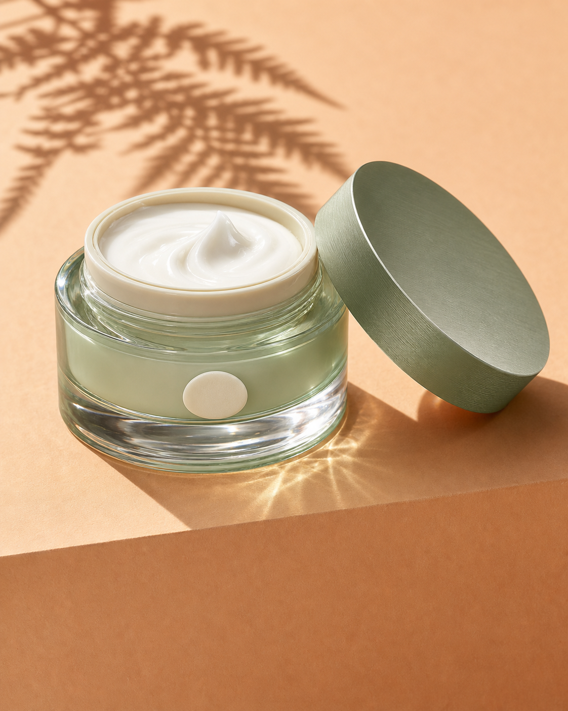

#### 详细信息

- **作者:** [Ecommerce GPT Image Prompts Studio](https://github.com/ecomimagelab)
- **来源:** 本仓库原创内容
- **发布日期:** 2026-07-23
- **语言:** en
- **适用平台:** Pinterest
- **许可证:** CC-BY-4.0

<details>
<summary><strong>生产参数、商品保真项与溯源信息</strong></summary>

| 生成模式 | 商品行业 | 使用场景 | 宽高比 |
|---|---|---|---|
| `text-to-image` | 美妆与护肤 | 社交电商广告 | 4:5 |

- **视觉风格:** 高端奢华, 自然有机, 编辑大片
- **背景类型:** 图形化布景
- **素材用途:** 社交创意
- **输入要求:** No reference image is required for this fictional unbranded product; use product-edit mode with owned source photography when adapting a real SKU.
- **商品保真项:**
  - Preserve the low translucent pale-jade jar, thick clear base, and blank oval ceramic medallion.
  - Preserve the brushed-sage removable lid, nested ivory refill cup, and smooth white cream.
- **负面约束:** No readable label, dropper, pump, extra jar, gold lid, colored cream, botanical ingredients inside cream, floating refill, deformed rim, missing medallion, child model, eye contact with cream, or medical claim. No readable text, logo, trademark, watermark, duplicate product, broken geometry, cheap CGI, collage, or border.

**来源与版权**

- Generated specifically for this repository from the recorded standalone prompt; no third-party preview image is redistributed.
- Original prompt and generated previews created for this repository after visual-pattern and open-source workflow research; no external preview asset is included.
- [visual-research](docs/VISUAL_RESEARCH.md)
- [visual-research](https://github.com/buluslan/gpt-image2-ecommerce)
- [visual-research](https://github.com/motiful/product-shots)
- **平台规则状态:** Platform names identify intended visual treatment only; verify current listing and advertising requirements before publication.
- **商品系列:** [ec-0044](data/prompts/ec-0044-jade-refill-face-cream-platform-set.json)

</details>

**[🚀 立即体验 →](https://www.pixpix.com/)**

---

<a id="prompt-ec-0043-amazon-beauty-clean-main"></a>

### No. 71: 美妆与护肤 — 石榴红高速吹风机多平台套图: AMAZON BEAUTY CLEAN MAIN

 

#### 描述

让同一台石榴红高速吹风机在白底零售、镀铬美妆发布、成年模特梳妆造型、沙龙创作者动态和彩色静物中保持一致。

**平台主图 · Amazon · 4:5**

#### 提示词

```text
Use case: product-mockup.
Asset type: main image for amazon.
Primary request: Create one ultra-photorealistic portrait 4:5 e-commerce image featuring exactly one premium hair dryer with its single concentrator nozzle.
Product design: one fictional unbranded compact high-velocity hair dryer in deep satin garnet-red aluminum, with a short graphite-gray cylindrical barrel, a hollow circular rear intake, a slim straight handle, one small ivory oval control inset, a charcoal braided cord, and one detachable matching garnet concentrator nozzle.
Scene/backdrop: Place the dryer diagonally upright on its handle with the concentrator attached and the cord arranged in one clean loose curve on seamless pure #FFFFFF.
Composition/framing: Center the complete device at about 75% frame fill; show barrel opening, rear ring, handle, control inset, nozzle, cord connection, and plug without cropping.
Lighting/mood: Broad high-key softboxes, precise garnet edge control, subtle graphite separation, and a natural grounding shadow.
Materials/textures: Render satin anodized aluminum, graphite polymer, fine intake mesh, braided textile cord, and controlled beauty-device reflections with physically believable surfaces, disciplined commercial retouching, fine natural microtexture, and premium photographic depth.
Product invariants: Preserve the same garnet short barrel, hollow rear ring, straight slim handle, ivory control inset, charcoal cord, and single concentrator nozzle.
Constraints: Show only safe adult styling; keep the airflow device physically plausible and the cord connected. Keep the product fully recognizable and commercially usable; use only fictional, unbranded design details.
Avoid: No person, stand, packaging, extra nozzle, floating cord, wall outlet, water, or hidden rear ring. No brand word, extra attachment, diffuser, cordless body, pistol grip, black color change, oversized nozzle, visible heating coil, flying hair covering product, child model, damaged cord, or unsafe proximity to water. No readable text, brand name, logo, trademark, watermark, duplicate product, broken geometry, cheap CGI, collage, split screen, frame, or border.
```

#### 生成预览图

##### 图片 1

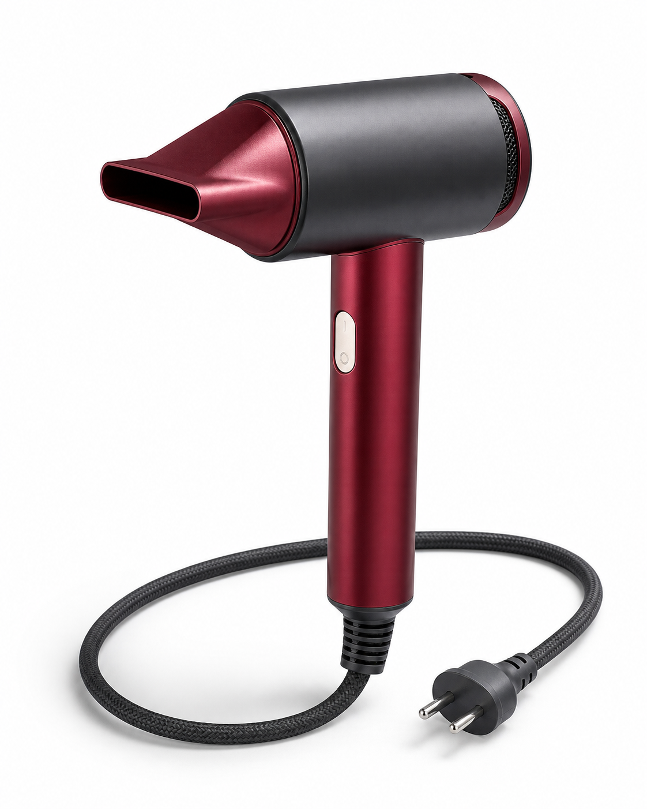

#### 详细信息

- **作者:** [Ecommerce GPT Image Prompts Studio](https://github.com/ecomimagelab)
- **来源:** 本仓库原创内容
- **发布日期:** 2026-07-23
- **语言:** en
- **适用平台:** Amazon
- **许可证:** CC-BY-4.0

<details>
<summary><strong>生产参数、商品保真项与溯源信息</strong></summary>

| 生成模式 | 商品行业 | 使用场景 | 宽高比 |
|---|---|---|---|
| `text-to-image` | 美妆与护肤 | 平台主图 | 4:5 |

- **视觉风格:** 高端奢华, 技术表达, 社交原生
- **背景类型:** 纯白背景
- **素材用途:** 平台主图
- **输入要求:** No reference image is required for this fictional unbranded product; use product-edit mode with owned source photography when adapting a real SKU.
- **商品保真项:**
  - Preserve the deep satin garnet aluminum body, short graphite barrel, hollow circular rear intake, and slim straight handle.
  - Preserve the ivory oval control inset, connected charcoal braided cord, and one matching concentrator nozzle.
- **负面约束:** No brand word, extra attachment, diffuser, cordless body, pistol grip, black color change, oversized nozzle, visible heating coil, flying hair covering product, child model, damaged cord, or unsafe proximity to water. No readable text, logo, trademark, watermark, duplicate product, broken geometry, cheap CGI, collage, or border.

**来源与版权**

- Generated specifically for this repository from the recorded standalone prompt; no third-party preview image is redistributed.
- Original prompt and generated previews created for this repository after visual-pattern and open-source workflow research; no external preview asset is included.
- [visual-research](docs/VISUAL_RESEARCH.md)
- [visual-research](https://github.com/buluslan/gpt-image2-ecommerce)
- [visual-research](https://github.com/motiful/product-shots)
- **平台规则状态:** Platform names identify intended visual treatment only; verify current listing and advertising requirements before publication.
- **商品系列:** [ec-0043](data/prompts/ec-0043-garnet-hair-dryer-platform-set.json)

</details>

**[🚀 立即体验 →](https://www.pixpix.com/)**

---

<a id="prompt-ec-0043-sephora-chrome-launch"></a>

### No. 72: 美妆与护肤 — 石榴红高速吹风机多平台套图: SEPHORA CHROME LAUNCH

 

#### 描述

让同一台石榴红高速吹风机在白底零售、镀铬美妆发布、成年模特梳妆造型、沙龙创作者动态和彩色静物中保持一致。

**品牌首图 · Sephora · 5:8**

#### 提示词

```text
Use case: product-mockup.
Asset type: branded hero for sephora.
Primary request: Create one ultra-photorealistic portrait 5:8 e-commerce image featuring exactly one premium hair dryer with its single concentrator nozzle.
Product design: one fictional unbranded compact high-velocity hair dryer in deep satin garnet-red aluminum, with a short graphite-gray cylindrical barrel, a hollow circular rear intake, a slim straight handle, one small ivory oval control inset, a charcoal braided cord, and one detachable matching garnet concentrator nozzle.
Scene/backdrop: Balance the dryer on one low polished-chrome arc inside a garnet-to-black gradient beauty set, with the nozzle aligned beside the body.
Composition/framing: Use a low sculptural three-quarter composition with generous dark space, crisp silhouette, and controlled mirrored reflection.
Lighting/mood: Narrow beauty strips, deep red glow, cool chrome highlights, and rich premium contrast.
Materials/textures: Render satin anodized aluminum, graphite polymer, fine intake mesh, braided textile cord, and controlled beauty-device reflections with physically believable surfaces, disciplined commercial retouching, fine natural microtexture, and premium photographic depth.
Product invariants: Preserve the same garnet short barrel, hollow rear ring, straight slim handle, ivory control inset, charcoal cord, and single concentrator nozzle.
Constraints: Show only safe adult styling; keep the airflow device physically plausible and the cord connected. Keep the product fully recognizable and commercially usable; use only fictional, unbranded design details.
Avoid: No model, smoke, glitter, text, extra attachment, levitating device, liquid, or mirror duplication. No brand word, extra attachment, diffuser, cordless body, pistol grip, black color change, oversized nozzle, visible heating coil, flying hair covering product, child model, damaged cord, or unsafe proximity to water. No readable text, brand name, logo, trademark, watermark, duplicate product, broken geometry, cheap CGI, collage, split screen, frame, or border.
```

#### 生成预览图

##### 图片 1

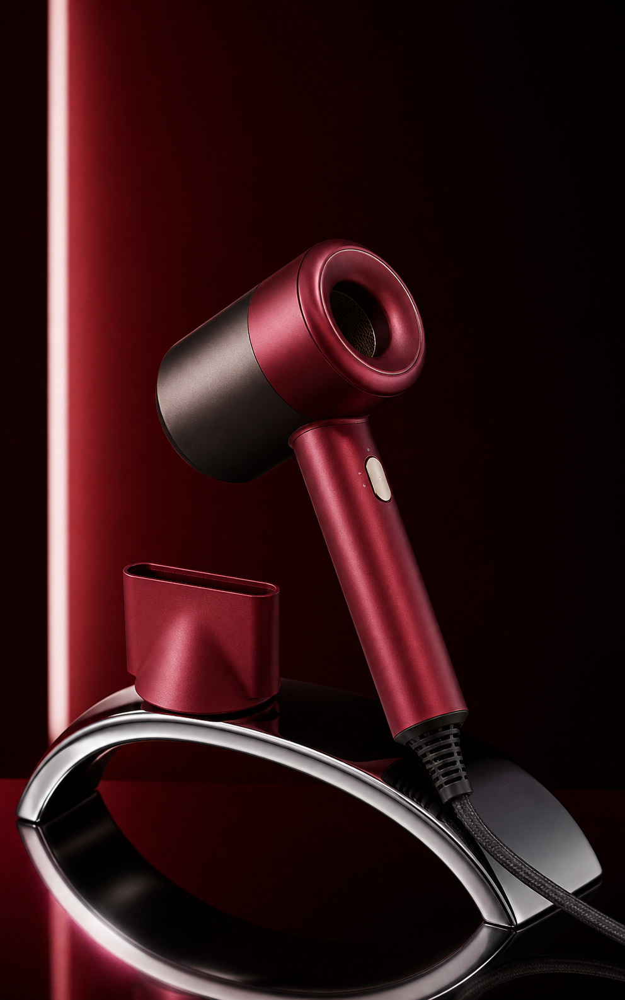

#### 详细信息

- **作者:** [Ecommerce GPT Image Prompts Studio](https://github.com/ecomimagelab)
- **来源:** 本仓库原创内容
- **发布日期:** 2026-07-23
- **语言:** en
- **适用平台:** Sephora
- **许可证:** CC-BY-4.0

<details>
<summary><strong>生产参数、商品保真项与溯源信息</strong></summary>

| 生成模式 | 商品行业 | 使用场景 | 宽高比 |
|---|---|---|---|
| `text-to-image` | 美妆与护肤 | 品牌首图 | 5:8 |

- **视觉风格:** 高端奢华, 技术表达, 社交原生
- **背景类型:** 彩色影棚
- **素材用途:** 品牌首图
- **输入要求:** No reference image is required for this fictional unbranded product; use product-edit mode with owned source photography when adapting a real SKU.
- **商品保真项:**
  - Preserve the deep satin garnet aluminum body, short graphite barrel, hollow circular rear intake, and slim straight handle.
  - Preserve the ivory oval control inset, connected charcoal braided cord, and one matching concentrator nozzle.
- **负面约束:** No brand word, extra attachment, diffuser, cordless body, pistol grip, black color change, oversized nozzle, visible heating coil, flying hair covering product, child model, damaged cord, or unsafe proximity to water. No readable text, logo, trademark, watermark, duplicate product, broken geometry, cheap CGI, collage, or border.

**来源与版权**

- Generated specifically for this repository from the recorded standalone prompt; no third-party preview image is redistributed.
- Original prompt and generated previews created for this repository after visual-pattern and open-source workflow research; no external preview asset is included.
- [visual-research](docs/VISUAL_RESEARCH.md)
- [visual-research](https://github.com/buluslan/gpt-image2-ecommerce)
- [visual-research](https://github.com/motiful/product-shots)
- **平台规则状态:** Platform names identify intended visual treatment only; verify current listing and advertising requirements before publication.
- **商品系列:** [ec-0043](data/prompts/ec-0043-garnet-hair-dryer-platform-set.json)

</details>

**[🚀 立即体验 →](https://www.pixpix.com/)**

---

<a id="prompt-ec-0043-xiaohongshu-evening-style"></a>

### No. 73: 美妆与护肤 — 石榴红高速吹风机多平台套图: XIAOHONGSHU EVENING STYLE

  

#### 描述

让同一台石榴红高速吹风机在白底零售、镀铬美妆发布、成年模特梳妆造型、沙龙创作者动态和彩色静物中保持一致。

**模特上身 · 小红书 · 5:8**

#### 提示词

```text
Use case: product-mockup.
Asset type: social creative for xiaohongshu.
Primary request: Create one ultra-photorealistic portrait 5:8 e-commerce image featuring exactly one premium hair dryer with its single concentrator nozzle.
Product design: one fictional unbranded compact high-velocity hair dryer in deep satin garnet-red aluminum, with a short graphite-gray cylindrical barrel, a hollow circular rear intake, a slim straight handle, one small ivory oval control inset, a charcoal braided cord, and one detachable matching garnet concentrator nozzle.
Scene/backdrop: An adult East Asian woman in a plain ivory tank uses the dryer with concentrator to smooth one side of her shoulder-length dark hair at a warm evening vanity; the counter is dry and uncluttered.
Composition/framing: Frame a waist-up mirror-adjacent portrait without photographing through the mirror; show her natural hand grip, face, complete dryer, connected cord, and controlled hair movement.
Lighting/mood: Warm practical lamp mixed with soft direct flash, natural adult skin and hair texture, garnet color separation, and candid creator polish.
Materials/textures: Render satin anodized aluminum, graphite polymer, fine intake mesh, braided textile cord, and controlled beauty-device reflections with physically believable surfaces, disciplined commercial retouching, fine natural microtexture, and premium photographic depth.
Product invariants: Preserve the same garnet short barrel, hollow rear ring, straight slim handle, ivory control inset, charcoal cord, and single concentrator nozzle.
Constraints: Show only safe adult styling; keep the airflow device physically plausible and the cord connected. Keep the product fully recognizable and commercially usable; use only fictional, unbranded design details.
Avoid: No child, wet counter, sink, bath, distorted fingers, extra dryer in reflection, hair covering intake, branded cosmetics, or extreme wind. No brand word, extra attachment, diffuser, cordless body, pistol grip, black color change, oversized nozzle, visible heating coil, flying hair covering product, child model, damaged cord, or unsafe proximity to water. No readable text, brand name, logo, trademark, watermark, duplicate product, broken geometry, cheap CGI, collage, split screen, frame, or border.
```

#### 生成预览图

##### 图片 1


#### 详细信息

- **作者:** [Ecommerce GPT Image Prompts Studio](https://github.com/ecomimagelab)
- **来源:** 本仓库原创内容
- **发布日期:** 2026-07-23
- **语言:** en
- **适用平台:** 小红书
- **许可证:** CC-BY-4.0

<details>
<summary><strong>生产参数、商品保真项与溯源信息</strong></summary>

| 生成模式 | 商品行业 | 使用场景 | 宽高比 |
|---|---|---|---|
| `text-to-image` | 美妆与护肤 | 模特上身 | 5:8 |

- **视觉风格:** 高端奢华, 技术表达, 社交原生
- **背景类型:** 生活方式实景
- **素材用途:** 社交创意
- **输入要求:** No reference image is required for this fictional unbranded product; use product-edit mode with owned source photography when adapting a real SKU.
- **商品保真项:**
  - Preserve the deep satin garnet aluminum body, short graphite barrel, hollow circular rear intake, and slim straight handle.
  - Preserve the ivory oval control inset, connected charcoal braided cord, and one matching concentrator nozzle.
- **负面约束:** No brand word, extra attachment, diffuser, cordless body, pistol grip, black color change, oversized nozzle, visible heating coil, flying hair covering product, child model, damaged cord, or unsafe proximity to water. No readable text, logo, trademark, watermark, duplicate product, broken geometry, cheap CGI, collage, or border.

**来源与版权**

- Generated specifically for this repository from the recorded standalone prompt; no third-party preview image is redistributed.
- Original prompt and generated previews created for this repository after visual-pattern and open-source workflow research; no external preview asset is included.
- [visual-research](docs/VISUAL_RESEARCH.md)
- [visual-research](https://github.com/buluslan/gpt-image2-ecommerce)
- [visual-research](https://github.com/motiful/product-shots)
- **平台规则状态:** Platform names identify intended visual treatment only; verify current listing and advertising requirements before publication.
- **商品系列:** [ec-0043](data/prompts/ec-0043-garnet-hair-dryer-platform-set.json)

</details>

**[🚀 立即体验 →](https://www.pixpix.com/)**

---

<a id="prompt-ec-0043-tiktok-salon-motion"></a>

### No. 74: 美妆与护肤 — 石榴红高速吹风机多平台套图: TIKTOK SHOP SALON MOTION

 

#### 描述

让同一台石榴红高速吹风机在白底零售、镀铬美妆发布、成年模特梳妆造型、沙龙创作者动态和彩色静物中保持一致。

**生活方式场景 · TikTok Shop · 5:8**

#### 提示词

```text
Use case: product-mockup.
Asset type: social creative for tiktok shop.
Primary request: Create one ultra-photorealistic portrait 5:8 e-commerce image featuring exactly one premium hair dryer with its single concentrator nozzle.
Product design: one fictional unbranded compact high-velocity hair dryer in deep satin garnet-red aluminum, with a short graphite-gray cylindrical barrel, a hollow circular rear intake, a slim straight handle, one small ivory oval control inset, a charcoal braided cord, and one detachable matching garnet concentrator nozzle.
Scene/backdrop: An adult professional stylist uses the dryer on an adult client's long dark hair in a minimal charcoal salon with no visible branding.
Composition/framing: Use a close vertical action frame showing the stylist's complete hands, attached nozzle, garnet body, cord, and a controlled sweep of hair while both adults remain naturally posed.
Lighting/mood: Direct flash, cool overhead salon ambience, crisp moving strands, and realistic high-energy creator texture.
Materials/textures: Render satin anodized aluminum, graphite polymer, fine intake mesh, braided textile cord, and controlled beauty-device reflections with physically believable surfaces, disciplined commercial retouching, fine natural microtexture, and premium photographic depth.
Product invariants: Preserve the same garnet short barrel, hollow rear ring, straight slim handle, ivory control inset, charcoal cord, and single concentrator nozzle.
Constraints: Show only safe adult styling; keep the airflow device physically plausible and the cord connected. Keep the product fully recognizable and commercially usable; use only fictional, unbranded design details.
Avoid: No child, face distortion, extra hands, second dryer, hair entering intake, scissors, wet floor, logo cape, or unsafe nozzle contact. No brand word, extra attachment, diffuser, cordless body, pistol grip, black color change, oversized nozzle, visible heating coil, flying hair covering product, child model, damaged cord, or unsafe proximity to water. No readable text, brand name, logo, trademark, watermark, duplicate product, broken geometry, cheap CGI, collage, split screen, frame, or border.
```

#### 生成预览图

##### 图片 1

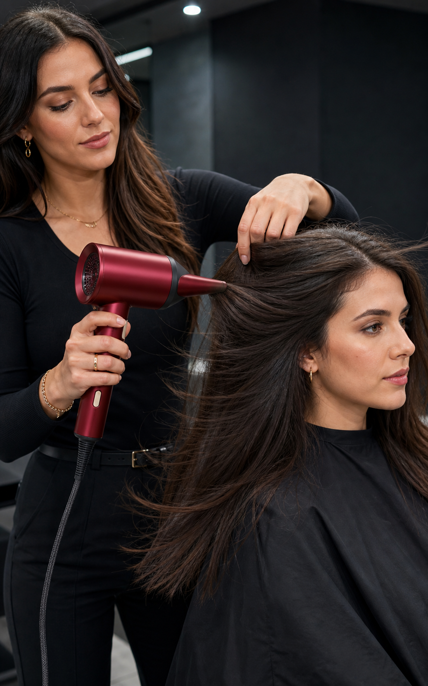

#### 详细信息

- **作者:** [Ecommerce GPT Image Prompts Studio](https://github.com/ecomimagelab)
- **来源:** 本仓库原创内容
- **发布日期:** 2026-07-23
- **语言:** en
- **适用平台:** TikTok Shop
- **许可证:** CC-BY-4.0

<details>
<summary><strong>生产参数、商品保真项与溯源信息</strong></summary>

| 生成模式 | 商品行业 | 使用场景 | 宽高比 |
|---|---|---|---|
| `text-to-image` | 美妆与护肤 | 生活方式场景 | 5:8 |

- **视觉风格:** 高端奢华, 技术表达, 社交原生
- **背景类型:** 生活方式实景
- **素材用途:** 社交创意
- **输入要求:** No reference image is required for this fictional unbranded product; use product-edit mode with owned source photography when adapting a real SKU.
- **商品保真项:**
  - Preserve the deep satin garnet aluminum body, short graphite barrel, hollow circular rear intake, and slim straight handle.
  - Preserve the ivory oval control inset, connected charcoal braided cord, and one matching concentrator nozzle.
- **负面约束:** No brand word, extra attachment, diffuser, cordless body, pistol grip, black color change, oversized nozzle, visible heating coil, flying hair covering product, child model, damaged cord, or unsafe proximity to water. No readable text, logo, trademark, watermark, duplicate product, broken geometry, cheap CGI, collage, or border.

**来源与版权**

- Generated specifically for this repository from the recorded standalone prompt; no third-party preview image is redistributed.
- Original prompt and generated previews created for this repository after visual-pattern and open-source workflow research; no external preview asset is included.
- [visual-research](docs/VISUAL_RESEARCH.md)
- [visual-research](https://github.com/buluslan/gpt-image2-ecommerce)
- [visual-research](https://github.com/motiful/product-shots)
- **平台规则状态:** Platform names identify intended visual treatment only; verify current listing and advertising requirements before publication.
- **商品系列:** [ec-0043](data/prompts/ec-0043-garnet-hair-dryer-platform-set.json)

</details>

**[🚀 立即体验 →](https://www.pixpix.com/)**

---

<a id="prompt-ec-0043-pinterest-ice-cherry-still"></a>

### No. 75: 美妆与护肤 — 石榴红高速吹风机多平台套图: PINTEREST ICE CHERRY STILL

 

#### 描述

让同一台石榴红高速吹风机在白底零售、镀铬美妆发布、成年模特梳妆造型、沙龙创作者动态和彩色静物中保持一致。

**社交电商广告 · Pinterest · 4:5**

#### 提示词

```text
Use case: product-mockup.
Asset type: social creative for pinterest.
Primary request: Create one ultra-photorealistic portrait 4:5 e-commerce image featuring exactly one premium hair dryer with its single concentrator nozzle.
Product design: one fictional unbranded compact high-velocity hair dryer in deep satin garnet-red aluminum, with a short graphite-gray cylindrical barrel, a hollow circular rear intake, a slim straight handle, one small ivory oval control inset, a charcoal braided cord, and one detachable matching garnet concentrator nozzle.
Scene/backdrop: Lay the dryer diagonally across a frosted pale-blue acrylic plane with one curved cherry-red paper wall and the concentrator attached.
Composition/framing: Create a graphic overhead product still life with the charcoal cord forming one elegant open loop and every product feature unobstructed.
Lighting/mood: Hard cool sunlight, ruby shadow edges, frosted caustics, and restrained glossy contrast.
Materials/textures: Render satin anodized aluminum, graphite polymer, fine intake mesh, braided textile cord, and controlled beauty-device reflections with physically believable surfaces, disciplined commercial retouching, fine natural microtexture, and premium photographic depth.
Product invariants: Preserve the same garnet short barrel, hollow rear ring, straight slim handle, ivory control inset, charcoal cord, and single concentrator nozzle.
Constraints: Show only safe adult styling; keep the airflow device physically plausible and the cord connected. Keep the product fully recognizable and commercially usable; use only fictional, unbranded design details.
Avoid: No ice touching electronics, water drops, model, extra attachment, text, fruit, or cropped plug. No brand word, extra attachment, diffuser, cordless body, pistol grip, black color change, oversized nozzle, visible heating coil, flying hair covering product, child model, damaged cord, or unsafe proximity to water. No readable text, brand name, logo, trademark, watermark, duplicate product, broken geometry, cheap CGI, collage, split screen, frame, or border.
```

#### 生成预览图

##### 图片 1

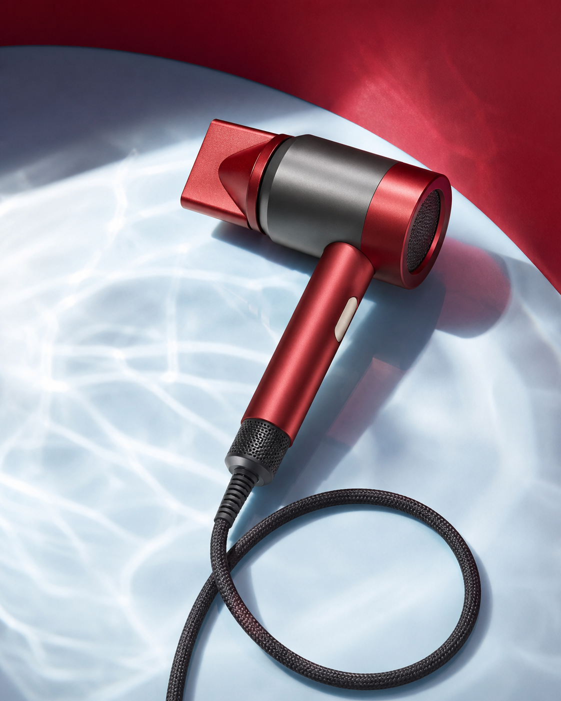

#### 详细信息

- **作者:** [Ecommerce GPT Image Prompts Studio](https://github.com/ecomimagelab)
- **来源:** 本仓库原创内容
- **发布日期:** 2026-07-23
- **语言:** en
- **适用平台:** Pinterest
- **许可证:** CC-BY-4.0

<details>
<summary><strong>生产参数、商品保真项与溯源信息</strong></summary>

| 生成模式 | 商品行业 | 使用场景 | 宽高比 |
|---|---|---|---|
| `text-to-image` | 美妆与护肤 | 社交电商广告 | 4:5 |

- **视觉风格:** 高端奢华, 技术表达, 社交原生
- **背景类型:** 图形化布景
- **素材用途:** 社交创意
- **输入要求:** No reference image is required for this fictional unbranded product; use product-edit mode with owned source photography when adapting a real SKU.
- **商品保真项:**
  - Preserve the deep satin garnet aluminum body, short graphite barrel, hollow circular rear intake, and slim straight handle.
  - Preserve the ivory oval control inset, connected charcoal braided cord, and one matching concentrator nozzle.
- **负面约束:** No brand word, extra attachment, diffuser, cordless body, pistol grip, black color change, oversized nozzle, visible heating coil, flying hair covering product, child model, damaged cord, or unsafe proximity to water. No readable text, logo, trademark, watermark, duplicate product, broken geometry, cheap CGI, collage, or border.

**来源与版权**

- Generated specifically for this repository from the recorded standalone prompt; no third-party preview image is redistributed.
- Original prompt and generated previews created for this repository after visual-pattern and open-source workflow research; no external preview asset is included.
- [visual-research](docs/VISUAL_RESEARCH.md)
- [visual-research](https://github.com/buluslan/gpt-image2-ecommerce)
- [visual-research](https://github.com/motiful/product-shots)
- **平台规则状态:** Platform names identify intended visual treatment only; verify current listing and advertising requirements before publication.
- **商品系列:** [ec-0043](data/prompts/ec-0043-garnet-hair-dryer-platform-set.json)

</details>

**[🚀 立即体验 →](https://www.pixpix.com/)**

---

<a id="categories-fashion"></a>

<a id="usecases-catalog-image"></a>

<a id="platforms-amazon-fashion"></a>

<a id="platforms-farfetch"></a>

<a id="prompt-ec-0042-amazon-fashion-ghost-form"></a>

### No. 76: 服装 — 陶土色亚麻西装多平台套图: AMAZON FASHION GHOST FORM

 

#### 描述

让同一件陶土色宽松亚麻西装在时装目录、庭院成年模特编辑、面料细节、暗调奢华和高收藏配色造型中保持一致。

**目录商品图 · Amazon Fashion · 4:5**

#### 提示词

```text
Use case: product-mockup.
Asset type: catalog image for amazon fashion.
Primary request: Create one ultra-photorealistic portrait 4:5 e-commerce image featuring exactly one relaxed linen blazer.
Product design: one fictional unbranded women's single-breasted blazer in warm clay-red washed linen, with a relaxed hip-length cut, one natural horn two-hole button, soft notched lapels, two low patch pockets, a center back vent, tonal half lining, and sleeves designed to be casually rolled once.
Scene/backdrop: Present the blazer on an invisible ghost form against seamless pure #FFFFFF, closed with its single button and sleeves down.
Composition/framing: Use a straight front catalog view with complete lapels, button, pockets, hem, sleeves, and natural waist ease visible.
Lighting/mood: Even high-key apparel lighting, soft interior shaping, true clay color, and crisp linen slub without harsh shadow.
Materials/textures: Render visible washed-linen slub, soft tailoring, natural horn, matte tonal lining, and believable garment drape with physically believable surfaces, disciplined commercial retouching, fine natural microtexture, and premium photographic depth.
Product invariants: Preserve the same clay-red color, relaxed hip length, single horn button, soft notched lapels, two patch pockets, center vent, and linen slub.
Constraints: Keep the blazer single-breasted with one visible button and no branding; use adult models only. Keep the product fully recognizable and commercially usable; use only fictional, unbranded design details.
Avoid: No model, visible mannequin, trousers, shirt, hanger, accessories, wrinkled collapse, or back view. No double-breasted closure, shoulder pads, gold buttons, chest logo, extra garment, cropped jacket, wool texture, missing pocket, pinstripe, hanger distortion, child model, or malformed hands. No readable text, brand name, logo, trademark, watermark, duplicate product, broken geometry, cheap CGI, collage, split screen, frame, or border.
```

#### 生成预览图

##### 图片 1

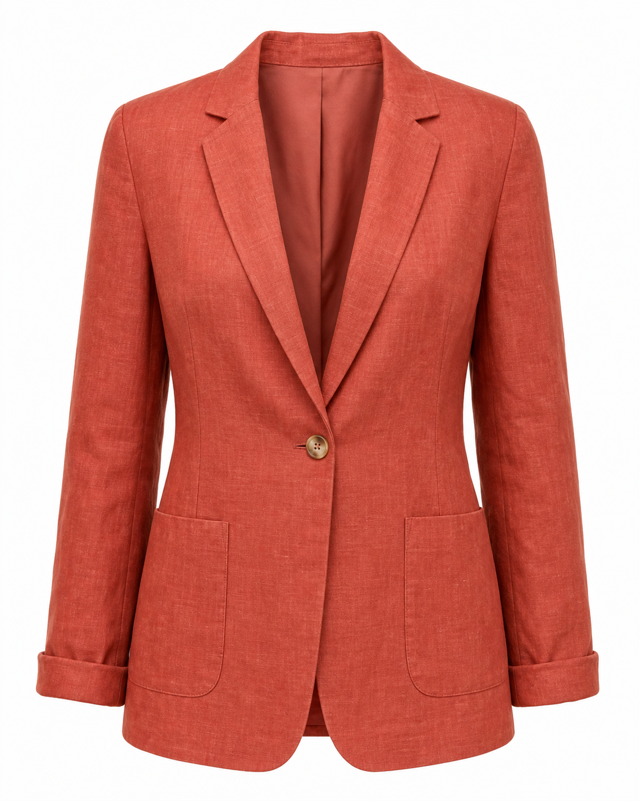

#### 详细信息

- **作者:** [Ecommerce GPT Image Prompts Studio](https://github.com/ecomimagelab)
- **来源:** 本仓库原创内容
- **发布日期:** 2026-07-23
- **语言:** en
- **适用平台:** Amazon Fashion
- **许可证:** CC-BY-4.0

<details>
<summary><strong>生产参数、商品保真项与溯源信息</strong></summary>

| 生成模式 | 商品行业 | 使用场景 | 宽高比 |
|---|---|---|---|
| `text-to-image` | 服装 | 目录商品图 | 4:5 |

- **视觉风格:** 编辑大片, 高端奢华, 自然有机
- **背景类型:** 纯白背景
- **素材用途:** 目录商品图
- **输入要求:** No reference image is required for this fictional unbranded product; use product-edit mode with owned source photography when adapting a real SKU.
- **商品保真项:**
  - Preserve the warm clay-red washed linen, relaxed hip-length cut, and soft notched lapels.
  - Preserve one natural horn button, two low patch pockets, center back vent, tonal half lining, and rolled-once sleeves.
- **负面约束:** No double-breasted closure, shoulder pads, gold buttons, chest logo, extra garment, cropped jacket, wool texture, missing pocket, pinstripe, hanger distortion, child model, or malformed hands. No readable text, logo, trademark, watermark, duplicate product, broken geometry, cheap CGI, collage, or border.

**来源与版权**

- Generated specifically for this repository from the recorded standalone prompt; no third-party preview image is redistributed.
- Original prompt and generated previews created for this repository after visual-pattern and open-source workflow research; no external preview asset is included.
- [visual-research](docs/VISUAL_RESEARCH.md)
- [visual-research](https://github.com/buluslan/gpt-image2-ecommerce)
- [visual-research](https://github.com/motiful/product-shots)
- **平台规则状态:** Platform names identify intended visual treatment only; verify current listing and advertising requirements before publication.
- **商品系列:** [ec-0042](data/prompts/ec-0042-clay-linen-blazer-platform-set.json)

</details>

**[🚀 立即体验 →](https://www.pixpix.com/)**

---

<a id="prompt-ec-0042-farfetch-courtyard-model"></a>

### No. 77: 服装 — 陶土色亚麻西装多平台套图: FARFETCH COURTYARD MODEL

  

#### 描述

让同一件陶土色宽松亚麻西装在时装目录、庭院成年模特编辑、面料细节、暗调奢华和高收藏配色造型中保持一致。

**模特上身 · Farfetch · 5:8**

#### 提示词

```text
Use case: product-mockup.
Asset type: social creative for farfetch.
Primary request: Create one ultra-photorealistic portrait 5:8 e-commerce image featuring exactly one relaxed linen blazer.
Product design: one fictional unbranded women's single-breasted blazer in warm clay-red washed linen, with a relaxed hip-length cut, one natural horn two-hole button, soft notched lapels, two low patch pockets, a center back vent, tonal half lining, and sleeves designed to be casually rolled once.
Scene/backdrop: An adult woman wears the blazer open over a plain black bandeau and high-waisted ivory trousers while standing in a sunlit travertine courtyard.
Composition/framing: Use a full three-quarter fashion portrait with relaxed weight shift, one hand in a patch pocket, the other natural at her side, and the complete blazer silhouette visible.
Lighting/mood: Hard late-afternoon sun, architectural shadow bands, direct-flash lift, real adult skin texture, and refined Mediterranean color.
Materials/textures: Render visible washed-linen slub, soft tailoring, natural horn, matte tonal lining, and believable garment drape with physically believable surfaces, disciplined commercial retouching, fine natural microtexture, and premium photographic depth.
Product invariants: Preserve the same clay-red color, relaxed hip length, single horn button, soft notched lapels, two patch pockets, center vent, and linen slub.
Constraints: Keep the blazer single-breasted with one visible button and no branding; use adult models only. Keep the product fully recognizable and commercially usable; use only fictional, unbranded design details.
Avoid: No child, extra blazer, bag, jewelry distraction, branded clothing, distorted fingers, hidden button, cropped hem, or exaggerated pose. No double-breasted closure, shoulder pads, gold buttons, chest logo, extra garment, cropped jacket, wool texture, missing pocket, pinstripe, hanger distortion, child model, or malformed hands. No readable text, brand name, logo, trademark, watermark, duplicate product, broken geometry, cheap CGI, collage, split screen, frame, or border.
```

#### 生成预览图

##### 图片 1


#### 详细信息

- **作者:** [Ecommerce GPT Image Prompts Studio](https://github.com/ecomimagelab)
- **来源:** 本仓库原创内容
- **发布日期:** 2026-07-23
- **语言:** en
- **适用平台:** Farfetch
- **许可证:** CC-BY-4.0

<details>
<summary><strong>生产参数、商品保真项与溯源信息</strong></summary>

| 生成模式 | 商品行业 | 使用场景 | 宽高比 |
|---|---|---|---|
| `text-to-image` | 服装 | 模特上身 | 5:8 |

- **视觉风格:** 编辑大片, 高端奢华, 自然有机
- **背景类型:** 生活方式实景
- **素材用途:** 社交创意
- **输入要求:** No reference image is required for this fictional unbranded product; use product-edit mode with owned source photography when adapting a real SKU.
- **商品保真项:**
  - Preserve the warm clay-red washed linen, relaxed hip-length cut, and soft notched lapels.
  - Preserve one natural horn button, two low patch pockets, center back vent, tonal half lining, and rolled-once sleeves.
- **负面约束:** No double-breasted closure, shoulder pads, gold buttons, chest logo, extra garment, cropped jacket, wool texture, missing pocket, pinstripe, hanger distortion, child model, or malformed hands. No readable text, logo, trademark, watermark, duplicate product, broken geometry, cheap CGI, collage, or border.

**来源与版权**

- Generated specifically for this repository from the recorded standalone prompt; no third-party preview image is redistributed.
- Original prompt and generated previews created for this repository after visual-pattern and open-source workflow research; no external preview asset is included.
- [visual-research](docs/VISUAL_RESEARCH.md)
- [visual-research](https://github.com/buluslan/gpt-image2-ecommerce)
- [visual-research](https://github.com/motiful/product-shots)
- **平台规则状态:** Platform names identify intended visual treatment only; verify current listing and advertising requirements before publication.
- **商品系列:** [ec-0042](data/prompts/ec-0042-clay-linen-blazer-platform-set.json)

</details>

**[🚀 立即体验 →](https://www.pixpix.com/)**

---

<a id="prompt-ec-0042-shopify-linen-detail"></a>

### No. 78: 服装 — 陶土色亚麻西装多平台套图: SHOPIFY LINEN DETAIL

 

#### 描述

让同一件陶土色宽松亚麻西装在时装目录、庭院成年模特编辑、面料细节、暗调奢华和高收藏配色造型中保持一致。

**细节与微距 · Shopify · 4:5**

#### 提示词

```text
Use case: product-mockup.
Asset type: secondary image for shopify.
Primary request: Create one ultra-photorealistic portrait 4:5 e-commerce image featuring exactly one relaxed linen blazer.
Product design: one fictional unbranded women's single-breasted blazer in warm clay-red washed linen, with a relaxed hip-length cut, one natural horn two-hole button, soft notched lapels, two low patch pockets, a center back vent, tonal half lining, and sleeves designed to be casually rolled once.
Scene/backdrop: Lay the blazer partly folded on pale oak with one lapel, horn button, patch-pocket edge, rolled sleeve, and half-lining visible.
Composition/framing: Use a close overhead material story that still reads as one complete garment section and emphasizes construction without showing unrelated clothing.
Lighting/mood: Soft north-window light, low warm bounce, fine slub shadows, and natural wrinkle honesty.
Materials/textures: Render visible washed-linen slub, soft tailoring, natural horn, matte tonal lining, and believable garment drape with physically believable surfaces, disciplined commercial retouching, fine natural microtexture, and premium photographic depth.
Product invariants: Preserve the same clay-red color, relaxed hip length, single horn button, soft notched lapels, two patch pockets, center vent, and linen slub.
Constraints: Keep the blazer single-breasted with one visible button and no branding; use adult models only. Keep the product fully recognizable and commercially usable; use only fictional, unbranded design details.
Avoid: No scissors, written labels, tailor chalk, extra fabric swatches, loose button, stains, or human hand. No double-breasted closure, shoulder pads, gold buttons, chest logo, extra garment, cropped jacket, wool texture, missing pocket, pinstripe, hanger distortion, child model, or malformed hands. No readable text, brand name, logo, trademark, watermark, duplicate product, broken geometry, cheap CGI, collage, split screen, frame, or border.
```

#### 生成预览图

##### 图片 1

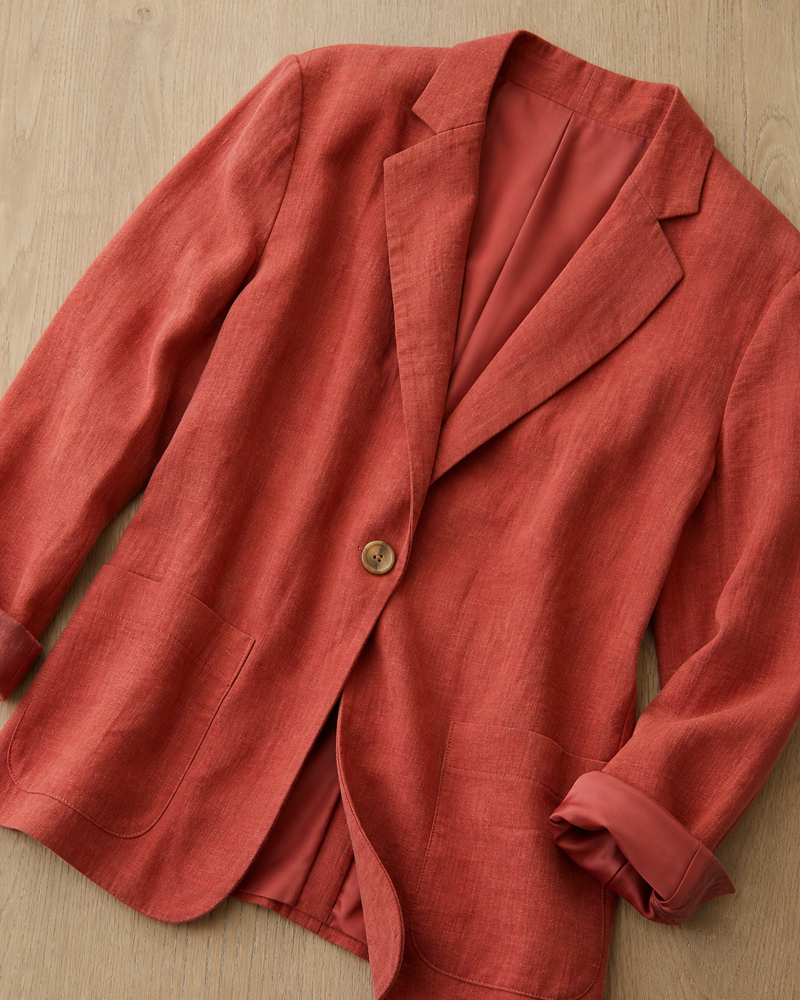

#### 详细信息

- **作者:** [Ecommerce GPT Image Prompts Studio](https://github.com/ecomimagelab)
- **来源:** 本仓库原创内容
- **发布日期:** 2026-07-23
- **语言:** en
- **适用平台:** Shopify
- **许可证:** CC-BY-4.0

<details>
<summary><strong>生产参数、商品保真项与溯源信息</strong></summary>

| 生成模式 | 商品行业 | 使用场景 | 宽高比 |
|---|---|---|---|
| `text-to-image` | 服装 | 细节与微距 | 4:5 |

- **视觉风格:** 编辑大片, 高端奢华, 自然有机
- **背景类型:** 天然材质
- **素材用途:** 商品副图
- **输入要求:** No reference image is required for this fictional unbranded product; use product-edit mode with owned source photography when adapting a real SKU.
- **商品保真项:**
  - Preserve the warm clay-red washed linen, relaxed hip-length cut, and soft notched lapels.
  - Preserve one natural horn button, two low patch pockets, center back vent, tonal half lining, and rolled-once sleeves.
- **负面约束:** No double-breasted closure, shoulder pads, gold buttons, chest logo, extra garment, cropped jacket, wool texture, missing pocket, pinstripe, hanger distortion, child model, or malformed hands. No readable text, logo, trademark, watermark, duplicate product, broken geometry, cheap CGI, collage, or border.

**来源与版权**

- Generated specifically for this repository from the recorded standalone prompt; no third-party preview image is redistributed.
- Original prompt and generated previews created for this repository after visual-pattern and open-source workflow research; no external preview asset is included.
- [visual-research](docs/VISUAL_RESEARCH.md)
- [visual-research](https://github.com/buluslan/gpt-image2-ecommerce)
- [visual-research](https://github.com/motiful/product-shots)
- **平台规则状态:** Platform names identify intended visual treatment only; verify current listing and advertising requirements before publication.
- **商品系列:** [ec-0042](data/prompts/ec-0042-clay-linen-blazer-platform-set.json)

</details>

**[🚀 立即体验 →](https://www.pixpix.com/)**

---

<a id="prompt-ec-0042-tmall-ink-gallery"></a>

### No. 79: 服装 — 陶土色亚麻西装多平台套图: TMALL INK GALLERY

 

#### 描述

让同一件陶土色宽松亚麻西装在时装目录、庭院成年模特编辑、面料细节、暗调奢华和高收藏配色造型中保持一致。

**品牌首图 · 天猫奢品 · 5:8**

#### 提示词

```text
Use case: product-mockup.
Asset type: branded hero for tmall luxury.
Primary request: Create one ultra-photorealistic portrait 5:8 e-commerce image featuring exactly one relaxed linen blazer.
Product design: one fictional unbranded women's single-breasted blazer in warm clay-red washed linen, with a relaxed hip-length cut, one natural horn two-hole button, soft notched lapels, two low patch pockets, a center back vent, tonal half lining, and sleeves designed to be casually rolled once.
Scene/backdrop: Suspend the blazer on an invisible form inside a deep ink-blue gallery with one low black mirror plinth.
Composition/framing: Use a low centered fashion composition with the blazer open, sleeves rolled once, and clay silhouette separated from the dark space.
Lighting/mood: Narrow warm key, cobalt rim, restrained mirror reflection, and sculptural shadow depth.
Materials/textures: Render visible washed-linen slub, soft tailoring, natural horn, matte tonal lining, and believable garment drape with physically believable surfaces, disciplined commercial retouching, fine natural microtexture, and premium photographic depth.
Product invariants: Preserve the same clay-red color, relaxed hip length, single horn button, soft notched lapels, two patch pockets, center vent, and linen slub.
Constraints: Keep the blazer single-breasted with one visible button and no branding; use adult models only. Keep the product fully recognizable and commercially usable; use only fictional, unbranded design details.
Avoid: No visible hanger, model, floating sleeve, gold prop, smoke, text, trousers, or duplicated reflection. No double-breasted closure, shoulder pads, gold buttons, chest logo, extra garment, cropped jacket, wool texture, missing pocket, pinstripe, hanger distortion, child model, or malformed hands. No readable text, brand name, logo, trademark, watermark, duplicate product, broken geometry, cheap CGI, collage, split screen, frame, or border.
```

#### 生成预览图

##### 图片 1

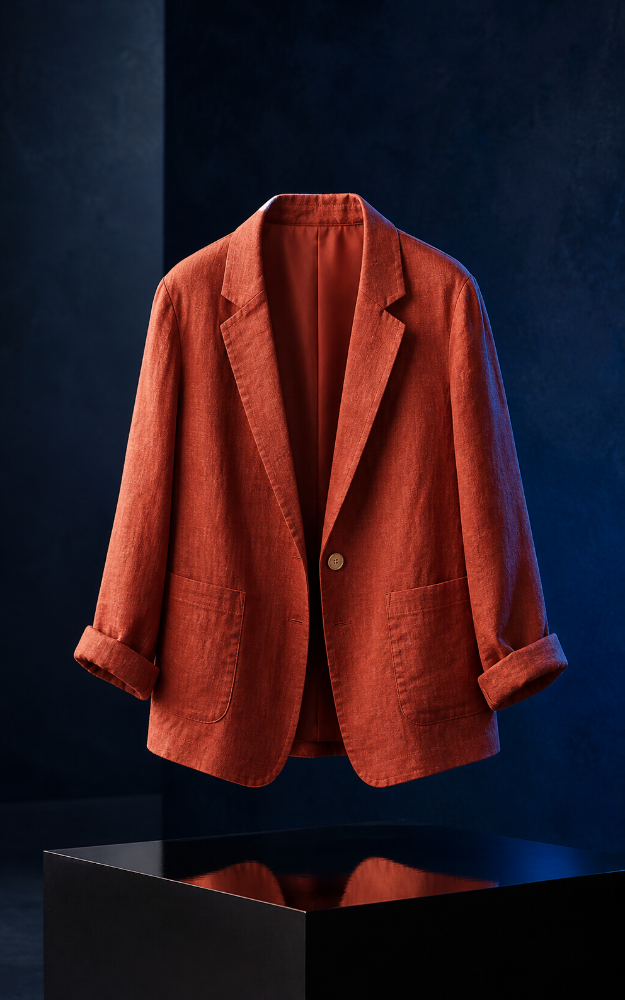

#### 详细信息

- **作者:** [Ecommerce GPT Image Prompts Studio](https://github.com/ecomimagelab)
- **来源:** 本仓库原创内容
- **发布日期:** 2026-07-23
- **语言:** en
- **适用平台:** 天猫奢品
- **许可证:** CC-BY-4.0

<details>
<summary><strong>生产参数、商品保真项与溯源信息</strong></summary>

| 生成模式 | 商品行业 | 使用场景 | 宽高比 |
|---|---|---|---|
| `text-to-image` | 服装 | 品牌首图 | 5:8 |

- **视觉风格:** 编辑大片, 高端奢华, 自然有机
- **背景类型:** 暗调影棚
- **素材用途:** 品牌首图
- **输入要求:** No reference image is required for this fictional unbranded product; use product-edit mode with owned source photography when adapting a real SKU.
- **商品保真项:**
  - Preserve the warm clay-red washed linen, relaxed hip-length cut, and soft notched lapels.
  - Preserve one natural horn button, two low patch pockets, center back vent, tonal half lining, and rolled-once sleeves.
- **负面约束:** No double-breasted closure, shoulder pads, gold buttons, chest logo, extra garment, cropped jacket, wool texture, missing pocket, pinstripe, hanger distortion, child model, or malformed hands. No readable text, logo, trademark, watermark, duplicate product, broken geometry, cheap CGI, collage, or border.

**来源与版权**

- Generated specifically for this repository from the recorded standalone prompt; no third-party preview image is redistributed.
- Original prompt and generated previews created for this repository after visual-pattern and open-source workflow research; no external preview asset is included.
- [visual-research](docs/VISUAL_RESEARCH.md)
- [visual-research](https://github.com/buluslan/gpt-image2-ecommerce)
- [visual-research](https://github.com/motiful/product-shots)
- **平台规则状态:** Platform names identify intended visual treatment only; verify current listing and advertising requirements before publication.
- **商品系列:** [ec-0042](data/prompts/ec-0042-clay-linen-blazer-platform-set.json)

</details>

**[🚀 立即体验 →](https://www.pixpix.com/)**

---

<a id="prompt-ec-0042-pinterest-cobalt-chair-style"></a>

### No. 80: 服装 — 陶土色亚麻西装多平台套图: PINTEREST COBALT CHAIR STYLE

 

#### 描述

让同一件陶土色宽松亚麻西装在时装目录、庭院成年模特编辑、面料细节、暗调奢华和高收藏配色造型中保持一致。

**生活方式场景 · Pinterest · 5:8**

#### 提示词

```text
Use case: product-mockup.
Asset type: social creative for pinterest.
Primary request: Create one ultra-photorealistic portrait 5:8 e-commerce image featuring exactly one relaxed linen blazer.
Product design: one fictional unbranded women's single-breasted blazer in warm clay-red washed linen, with a relaxed hip-length cut, one natural horn two-hole button, soft notched lapels, two low patch pockets, a center back vent, tonal half lining, and sleeves designed to be casually rolled once.
Scene/backdrop: Drape the blazer naturally over one cobalt tubular chair beside a saffron wall and pale terrazzo floor.
Composition/framing: Create a tall saved-look composition with the horn button, lapel, one patch pocket, rolled cuff, and linen texture visible through the drape.
Lighting/mood: Graphic side sun, clean colored shadows, crisp but natural textile texture, and confident editorial blocking.
Materials/textures: Render visible washed-linen slub, soft tailoring, natural horn, matte tonal lining, and believable garment drape with physically believable surfaces, disciplined commercial retouching, fine natural microtexture, and premium photographic depth.
Product invariants: Preserve the same clay-red color, relaxed hip length, single horn button, soft notched lapels, two patch pockets, center vent, and linen slub.
Constraints: Keep the blazer single-breasted with one visible button and no branding; use adult models only. Keep the product fully recognizable and commercially usable; use only fictional, unbranded design details.
Avoid: No person, second garment, shoes, bag, vase, text, or blazer falling on floor. No double-breasted closure, shoulder pads, gold buttons, chest logo, extra garment, cropped jacket, wool texture, missing pocket, pinstripe, hanger distortion, child model, or malformed hands. No readable text, brand name, logo, trademark, watermark, duplicate product, broken geometry, cheap CGI, collage, split screen, frame, or border.
```

#### 生成预览图

##### 图片 1

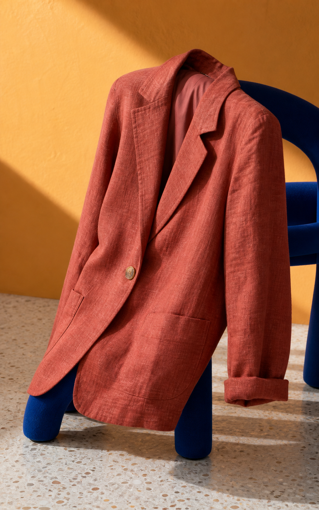

#### 详细信息

- **作者:** [Ecommerce GPT Image Prompts Studio](https://github.com/ecomimagelab)
- **来源:** 本仓库原创内容
- **发布日期:** 2026-07-23
- **语言:** en
- **适用平台:** Pinterest
- **许可证:** CC-BY-4.0

<details>
<summary><strong>生产参数、商品保真项与溯源信息</strong></summary>

| 生成模式 | 商品行业 | 使用场景 | 宽高比 |
|---|---|---|---|
| `text-to-image` | 服装 | 生活方式场景 | 5:8 |

- **视觉风格:** 编辑大片, 高端奢华, 自然有机
- **背景类型:** 家居空间
- **素材用途:** 社交创意
- **输入要求:** No reference image is required for this fictional unbranded product; use product-edit mode with owned source photography when adapting a real SKU.
- **商品保真项:**
  - Preserve the warm clay-red washed linen, relaxed hip-length cut, and soft notched lapels.
  - Preserve one natural horn button, two low patch pockets, center back vent, tonal half lining, and rolled-once sleeves.
- **负面约束:** No double-breasted closure, shoulder pads, gold buttons, chest logo, extra garment, cropped jacket, wool texture, missing pocket, pinstripe, hanger distortion, child model, or malformed hands. No readable text, logo, trademark, watermark, duplicate product, broken geometry, cheap CGI, collage, or border.

**来源与版权**

- Generated specifically for this repository from the recorded standalone prompt; no third-party preview image is redistributed.
- Original prompt and generated previews created for this repository after visual-pattern and open-source workflow research; no external preview asset is included.
- [visual-research](docs/VISUAL_RESEARCH.md)
- [visual-research](https://github.com/buluslan/gpt-image2-ecommerce)
- [visual-research](https://github.com/motiful/product-shots)
- **平台规则状态:** Platform names identify intended visual treatment only; verify current listing and advertising requirements before publication.
- **商品系列:** [ec-0042](data/prompts/ec-0042-clay-linen-blazer-platform-set.json)

</details>

**[🚀 立即体验 →](https://www.pixpix.com/)**

---

<a id="categories-bags-and-accessories"></a>

<a id="prompt-ec-0041-amazon-pack-clean-main"></a>

### No. 81: 箱包与配饰 — 余烬橙高山背包多平台套图: AMAZON PACK CLEAN MAIN

 

#### 描述

让同一只余烬橙技术高山背包在商城主图、雨天性能、山地 DTC、成年徒步和装备平铺中保持一致。

**平台主图 · Amazon · 4:5**

#### 提示词

```text
Use case: product-mockup.
Asset type: main image for amazon.
Primary request: Create one ultra-photorealistic portrait 4:5 e-commerce image featuring exactly one technical alpine backpack.
Product design: one fictional unbranded 28-liter alpine backpack in matte ember-orange ripstop nylon, with a charcoal roll-top secured by one centered black G-hook, two diagonal black compression straps, a graphite back panel, one slim ice-tool loop, and a cobalt zipper pull on the left side pocket.
Scene/backdrop: Stand the empty but naturally shaped backpack upright and front-facing on seamless pure #FFFFFF with no props.
Composition/framing: Center the complete pack at about 76% frame fill; show roll-top, G-hook, diagonal straps, bottom, side pocket edge, and natural grounding shadow.
Lighting/mood: Broad high-key softboxes, controlled ripstop microcontrast, neutral color, and clean black hardware.
Materials/textures: Render fine ripstop grid, matte coated nylon, molded graphite foam, black webbing, metal G-hook, and water beads with physically believable surfaces, disciplined commercial retouching, fine natural microtexture, and premium photographic depth.
Product invariants: Preserve the same ember roll-top body, charcoal top, centered G-hook, two diagonal compression straps, graphite back, ice-tool loop, and cobalt side pull.
Constraints: Keep the 28-liter proportions, strap routing, pocket location, and hardware count consistent. Keep the product fully recognizable and commercially usable; use only fictional, unbranded design details.
Avoid: No person, gear, rock, bottle, packaging, detached strap, or back view. No brand patch, printed words, extra backpack, hiking poles attached, missing strap, extra buckle, military camouflage, hydration tube, floating gear, deformed shoulder straps, or changed color. No readable text, brand name, logo, trademark, watermark, duplicate product, broken geometry, cheap CGI, collage, split screen, frame, or border.
```

#### 生成预览图

##### 图片 1

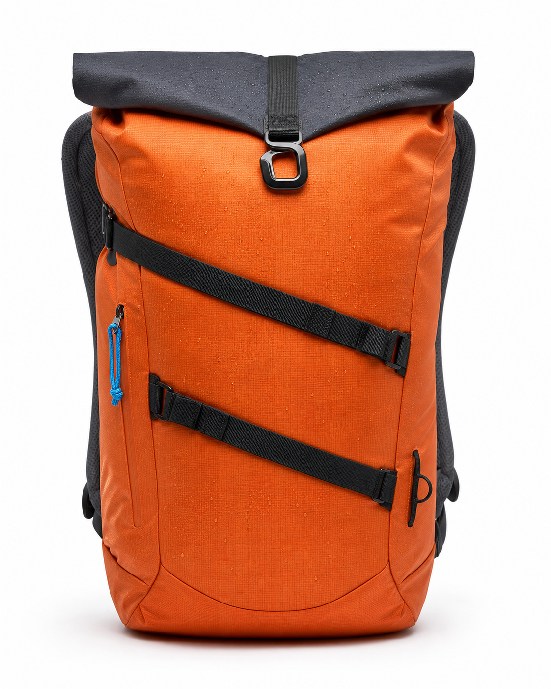

#### 详细信息

- **作者:** [Ecommerce GPT Image Prompts Studio](https://github.com/ecomimagelab)
- **来源:** 本仓库原创内容
- **发布日期:** 2026-07-23
- **语言:** en
- **适用平台:** Amazon
- **许可证:** CC-BY-4.0

<details>
<summary><strong>生产参数、商品保真项与溯源信息</strong></summary>

| 生成模式 | 商品行业 | 使用场景 | 宽高比 |
|---|---|---|---|
| `text-to-image` | 箱包与配饰 | 平台主图 | 4:5 |

- **视觉风格:** 技术表达, 户外机能, 编辑大片
- **背景类型:** 纯白背景
- **素材用途:** 平台主图
- **输入要求:** No reference image is required for this fictional unbranded product; use product-edit mode with owned source photography when adapting a real SKU.
- **商品保真项:**
  - Preserve the ember-orange ripstop body, charcoal roll-top, centered black G-hook, and two diagonal compression straps.
  - Preserve the graphite back panel, slim ice-tool loop, cobalt left-side zipper pull, and 28-liter proportions.
- **负面约束:** No brand patch, printed words, extra backpack, hiking poles attached, missing strap, extra buckle, military camouflage, hydration tube, floating gear, deformed shoulder straps, or changed color. No readable text, logo, trademark, watermark, duplicate product, broken geometry, cheap CGI, collage, or border.

**来源与版权**

- Generated specifically for this repository from the recorded standalone prompt; no third-party preview image is redistributed.
- Original prompt and generated previews created for this repository after visual-pattern and open-source workflow research; no external preview asset is included.
- [visual-research](docs/VISUAL_RESEARCH.md)
- [visual-research](https://github.com/buluslan/gpt-image2-ecommerce)
- [visual-research](https://github.com/motiful/product-shots)
- **平台规则状态:** Platform names identify intended visual treatment only; verify current listing and advertising requirements before publication.
- **商品系列:** [ec-0041](data/prompts/ec-0041-ember-alpine-backpack-platform-set.json)

</details>

**[🚀 立即体验 →](https://www.pixpix.com/)**

---

<a id="prompt-ec-0041-outdoor-retail-rain-test"></a>

### No. 82: 箱包与配饰 — 余烬橙高山背包多平台套图: OUTDOOR RETAIL RAIN TEST

 

#### 描述

让同一只余烬橙技术高山背包在商城主图、雨天性能、山地 DTC、成年徒步和装备平铺中保持一致。

**功能卖点图 · 户外零售 · 5:8**

#### 提示词

```text
Use case: product-mockup.
Asset type: secondary image for outdoor retail.
Primary request: Create one ultra-photorealistic portrait 5:8 e-commerce image featuring exactly one technical alpine backpack.
Product design: one fictional unbranded 28-liter alpine backpack in matte ember-orange ripstop nylon, with a charcoal roll-top secured by one centered black G-hook, two diagonal black compression straps, a graphite back panel, one slim ice-tool loop, and a cobalt zipper pull on the left side pocket.
Scene/backdrop: Stand the pack on a wet dark-slate slab under a controlled curtain of fine rain with the front panel facing camera.
Composition/framing: Use a close low three-quarter angle showing water beading, sealed seams, G-hook, compression straps, and cobalt pull without diagrams or text.
Lighting/mood: Cold directional rim lights, deep graphite shadows, crisp droplets, and one restrained ember reflection.
Materials/textures: Render fine ripstop grid, matte coated nylon, molded graphite foam, black webbing, metal G-hook, and water beads with physically believable surfaces, disciplined commercial retouching, fine natural microtexture, and premium photographic depth.
Product invariants: Preserve the same ember roll-top body, charcoal top, centered G-hook, two diagonal compression straps, graphite back, ice-tool loop, and cobalt side pull.
Constraints: Keep the 28-liter proportions, strap routing, pocket location, and hardware count consistent. Keep the product fully recognizable and commercially usable; use only fictional, unbranded design details.
Avoid: No lightning, waterfall, mud coating, floating arrows, icons, readable claims, open roll-top, or soaked sagging fabric. No brand patch, printed words, extra backpack, hiking poles attached, missing strap, extra buckle, military camouflage, hydration tube, floating gear, deformed shoulder straps, or changed color. No readable text, brand name, logo, trademark, watermark, duplicate product, broken geometry, cheap CGI, collage, split screen, frame, or border.
```

#### 生成预览图

##### 图片 1

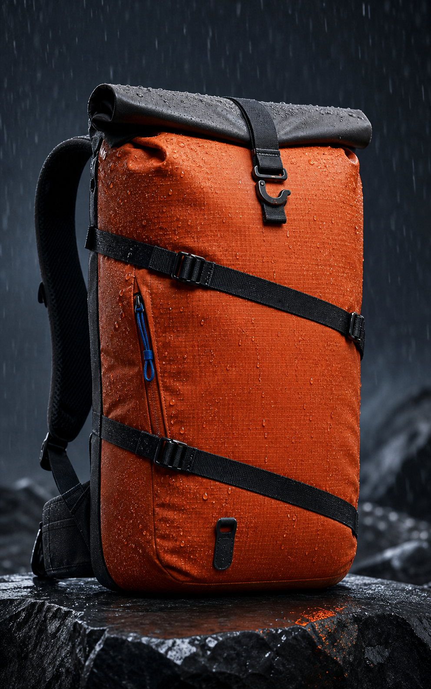

#### 详细信息

- **作者:** [Ecommerce GPT Image Prompts Studio](https://github.com/ecomimagelab)
- **来源:** 本仓库原创内容
- **发布日期:** 2026-07-23
- **语言:** en
- **适用平台:** 户外零售
- **许可证:** CC-BY-4.0

<details>
<summary><strong>生产参数、商品保真项与溯源信息</strong></summary>

| 生成模式 | 商品行业 | 使用场景 | 宽高比 |
|---|---|---|---|
| `text-to-image` | 箱包与配饰 | 功能卖点图 | 5:8 |

- **视觉风格:** 技术表达, 户外机能, 编辑大片
- **背景类型:** 暗调影棚
- **素材用途:** 商品副图
- **输入要求:** No reference image is required for this fictional unbranded product; use product-edit mode with owned source photography when adapting a real SKU.
- **商品保真项:**
  - Preserve the ember-orange ripstop body, charcoal roll-top, centered black G-hook, and two diagonal compression straps.
  - Preserve the graphite back panel, slim ice-tool loop, cobalt left-side zipper pull, and 28-liter proportions.
- **负面约束:** No brand patch, printed words, extra backpack, hiking poles attached, missing strap, extra buckle, military camouflage, hydration tube, floating gear, deformed shoulder straps, or changed color. No readable text, logo, trademark, watermark, duplicate product, broken geometry, cheap CGI, collage, or border.

**来源与版权**

- Generated specifically for this repository from the recorded standalone prompt; no third-party preview image is redistributed.
- Original prompt and generated previews created for this repository after visual-pattern and open-source workflow research; no external preview asset is included.
- [visual-research](docs/VISUAL_RESEARCH.md)
- [visual-research](https://github.com/buluslan/gpt-image2-ecommerce)
- [visual-research](https://github.com/motiful/product-shots)
- **平台规则状态:** Platform names identify intended visual treatment only; verify current listing and advertising requirements before publication.
- **商品系列:** [ec-0041](data/prompts/ec-0041-ember-alpine-backpack-platform-set.json)

</details>

**[🚀 立即体验 →](https://www.pixpix.com/)**

---

<a id="prompt-ec-0041-shopify-alpine-blue-hour"></a>

### No. 83: 箱包与配饰 — 余烬橙高山背包多平台套图: SHOPIFY ALPINE BLUE HOUR

 

#### 描述

让同一只余烬橙技术高山背包在商城主图、雨天性能、山地 DTC、成年徒步和装备平铺中保持一致。

**品牌首图 · Shopify · 5:8**

#### 提示词

```text
Use case: product-mockup.
Asset type: branded hero for shopify.
Primary request: Create one ultra-photorealistic portrait 5:8 e-commerce image featuring exactly one technical alpine backpack.
Product design: one fictional unbranded 28-liter alpine backpack in matte ember-orange ripstop nylon, with a charcoal roll-top secured by one centered black G-hook, two diagonal black compression straps, a graphite back panel, one slim ice-tool loop, and a cobalt zipper pull on the left side pocket.
Scene/backdrop: Place the pack upright on pale granite beside an alpine tarn at blue hour with distant snow ridges and no person.
Composition/framing: Use a low environmental portrait that keeps the full pack dominant while the landscape creates generous aspirational depth.
Lighting/mood: Cool twilight ambience, subtle warm side key on ember fabric, realistic lake reflection, and crisp mountain air.
Materials/textures: Render fine ripstop grid, matte coated nylon, molded graphite foam, black webbing, metal G-hook, and water beads with physically believable surfaces, disciplined commercial retouching, fine natural microtexture, and premium photographic depth.
Product invariants: Preserve the same ember roll-top body, charcoal top, centered G-hook, two diagonal compression straps, graphite back, ice-tool loop, and cobalt side pull.
Constraints: Keep the 28-liter proportions, strap routing, pocket location, and hardware count consistent. Keep the product fully recognizable and commercially usable; use only fictional, unbranded design details.
Avoid: No tent, trekking pole, campfire, text, snow on product, or pack floating near water. No brand patch, printed words, extra backpack, hiking poles attached, missing strap, extra buckle, military camouflage, hydration tube, floating gear, deformed shoulder straps, or changed color. No readable text, brand name, logo, trademark, watermark, duplicate product, broken geometry, cheap CGI, collage, split screen, frame, or border.
```

#### 生成预览图

##### 图片 1

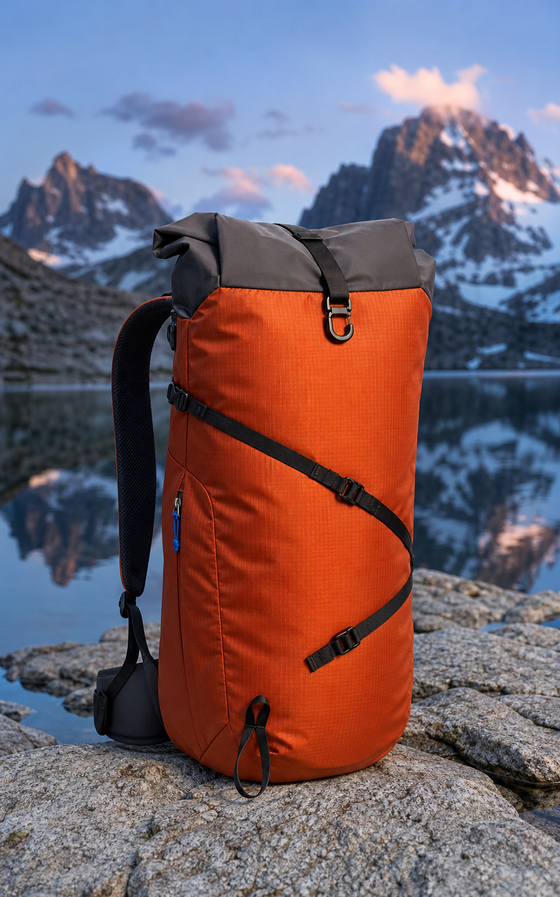

#### 详细信息

- **作者:** [Ecommerce GPT Image Prompts Studio](https://github.com/ecomimagelab)
- **来源:** 本仓库原创内容
- **发布日期:** 2026-07-23
- **语言:** en
- **适用平台:** Shopify
- **许可证:** CC-BY-4.0

<details>
<summary><strong>生产参数、商品保真项与溯源信息</strong></summary>

| 生成模式 | 商品行业 | 使用场景 | 宽高比 |
|---|---|---|---|
| `text-to-image` | 箱包与配饰 | 品牌首图 | 5:8 |

- **视觉风格:** 技术表达, 户外机能, 编辑大片
- **背景类型:** 户外实景
- **素材用途:** 品牌首图
- **输入要求:** No reference image is required for this fictional unbranded product; use product-edit mode with owned source photography when adapting a real SKU.
- **商品保真项:**
  - Preserve the ember-orange ripstop body, charcoal roll-top, centered black G-hook, and two diagonal compression straps.
  - Preserve the graphite back panel, slim ice-tool loop, cobalt left-side zipper pull, and 28-liter proportions.
- **负面约束:** No brand patch, printed words, extra backpack, hiking poles attached, missing strap, extra buckle, military camouflage, hydration tube, floating gear, deformed shoulder straps, or changed color. No readable text, logo, trademark, watermark, duplicate product, broken geometry, cheap CGI, collage, or border.

**来源与版权**

- Generated specifically for this repository from the recorded standalone prompt; no third-party preview image is redistributed.
- Original prompt and generated previews created for this repository after visual-pattern and open-source workflow research; no external preview asset is included.
- [visual-research](docs/VISUAL_RESEARCH.md)
- [visual-research](https://github.com/buluslan/gpt-image2-ecommerce)
- [visual-research](https://github.com/motiful/product-shots)
- **平台规则状态:** Platform names identify intended visual treatment only; verify current listing and advertising requirements before publication.
- **商品系列:** [ec-0041](data/prompts/ec-0041-ember-alpine-backpack-platform-set.json)

</details>

**[🚀 立即体验 →](https://www.pixpix.com/)**

---

<a id="prompt-ec-0041-tiktok-adult-ridge-hike"></a>

### No. 84: 箱包与配饰 — 余烬橙高山背包多平台套图: TIKTOK SHOP RIDGE HIKE

 

#### 描述

让同一只余烬橙技术高山背包在商城主图、雨天性能、山地 DTC、成年徒步和装备平铺中保持一致。

**模特上身 · TikTok Shop · 5:8**

#### 提示词

```text
Use case: product-mockup.
Asset type: social creative for tiktok shop.
Primary request: Create one ultra-photorealistic portrait 5:8 e-commerce image featuring exactly one technical alpine backpack.
Product design: one fictional unbranded 28-liter alpine backpack in matte ember-orange ripstop nylon, with a charcoal roll-top secured by one centered black G-hook, two diagonal black compression straps, a graphite back panel, one slim ice-tool loop, and a cobalt zipper pull on the left side pocket.
Scene/backdrop: An athletic adult hiker wears the pack while crossing a windy grass ridge, dressed in plain slate technical clothing.
Composition/framing: Use a rear three-quarter full-body frame with a natural walking stride; keep the pack front side, roll-top, straps, side pull, and body scale readable.
Lighting/mood: Crisp overcast daylight with direct-flash lift, moving grass, natural clothing texture, and energetic creator realism.
Materials/textures: Render fine ripstop grid, matte coated nylon, molded graphite foam, black webbing, metal G-hook, and water beads with physically believable surfaces, disciplined commercial retouching, fine natural microtexture, and premium photographic depth.
Product invariants: Preserve the same ember roll-top body, charcoal top, centered G-hook, two diagonal compression straps, graphite back, ice-tool loop, and cobalt side pull.
Constraints: Keep the 28-liter proportions, strap routing, pocket location, and hardware count consistent. Keep the product fully recognizable and commercially usable; use only fictional, unbranded design details.
Avoid: No child, dangerous cliff edge, extra backpack, trekking logo, distorted limbs, hidden product, loose unfastened straps, or storm. No brand patch, printed words, extra backpack, hiking poles attached, missing strap, extra buckle, military camouflage, hydration tube, floating gear, deformed shoulder straps, or changed color. No readable text, brand name, logo, trademark, watermark, duplicate product, broken geometry, cheap CGI, collage, split screen, frame, or border.
```

#### 生成预览图

##### 图片 1

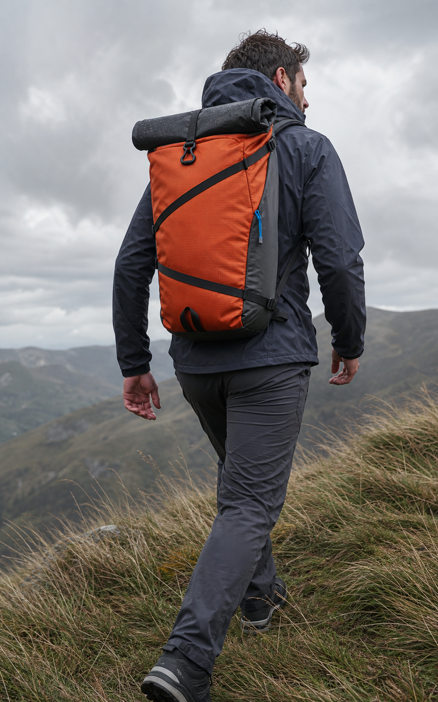

#### 详细信息

- **作者:** [Ecommerce GPT Image Prompts Studio](https://github.com/ecomimagelab)
- **来源:** 本仓库原创内容
- **发布日期:** 2026-07-23
- **语言:** en
- **适用平台:** TikTok Shop
- **许可证:** CC-BY-4.0

<details>
<summary><strong>生产参数、商品保真项与溯源信息</strong></summary>

| 生成模式 | 商品行业 | 使用场景 | 宽高比 |
|---|---|---|---|
| `text-to-image` | 箱包与配饰 | 模特上身 | 5:8 |

- **视觉风格:** 技术表达, 户外机能, 编辑大片
- **背景类型:** 户外实景
- **素材用途:** 社交创意
- **输入要求:** No reference image is required for this fictional unbranded product; use product-edit mode with owned source photography when adapting a real SKU.
- **商品保真项:**
  - Preserve the ember-orange ripstop body, charcoal roll-top, centered black G-hook, and two diagonal compression straps.
  - Preserve the graphite back panel, slim ice-tool loop, cobalt left-side zipper pull, and 28-liter proportions.
- **负面约束:** No brand patch, printed words, extra backpack, hiking poles attached, missing strap, extra buckle, military camouflage, hydration tube, floating gear, deformed shoulder straps, or changed color. No readable text, logo, trademark, watermark, duplicate product, broken geometry, cheap CGI, collage, or border.

**来源与版权**

- Generated specifically for this repository from the recorded standalone prompt; no third-party preview image is redistributed.
- Original prompt and generated previews created for this repository after visual-pattern and open-source workflow research; no external preview asset is included.
- [visual-research](docs/VISUAL_RESEARCH.md)
- [visual-research](https://github.com/buluslan/gpt-image2-ecommerce)
- [visual-research](https://github.com/motiful/product-shots)
- **平台规则状态:** Platform names identify intended visual treatment only; verify current listing and advertising requirements before publication.
- **商品系列:** [ec-0041](data/prompts/ec-0041-ember-alpine-backpack-platform-set.json)

</details>

**[🚀 立即体验 →](https://www.pixpix.com/)**

---

<a id="prompt-ec-0041-pinterest-gear-flatlay"></a>

### No. 85: 箱包与配饰 — 余烬橙高山背包多平台套图: PINTEREST GEAR FLAT LAY

 

#### 描述

让同一只余烬橙技术高山背包在商城主图、雨天性能、山地 DTC、成年徒步和装备平铺中保持一致。

**生活方式场景 · Pinterest · 4:5**

#### 提示词

```text
Use case: product-mockup.
Asset type: social creative for pinterest.
Primary request: Create one ultra-photorealistic portrait 4:5 e-commerce image featuring exactly one technical alpine backpack.
Product design: one fictional unbranded 28-liter alpine backpack in matte ember-orange ripstop nylon, with a charcoal roll-top secured by one centered black G-hook, two diagonal black compression straps, a graphite back panel, one slim ice-tool loop, and a cobalt zipper pull on the left side pocket.
Scene/backdrop: Lay the backpack open but empty on pale canvas beside one plain steel bottle, one folded charcoal shell, and one coiled orange cord.
Composition/framing: Use an organized overhead composition showing the complete pack silhouette, roll-top, straps, back panel edge, and restrained gear spacing.
Lighting/mood: Soft directional daylight, honest fabric wrinkles, quiet earthy color, and sharp utility detail.
Materials/textures: Render fine ripstop grid, matte coated nylon, molded graphite foam, black webbing, metal G-hook, and water beads with physically believable surfaces, disciplined commercial retouching, fine natural microtexture, and premium photographic depth.
Product invariants: Preserve the same ember roll-top body, charcoal top, centered G-hook, two diagonal compression straps, graphite back, ice-tool loop, and cobalt side pull.
Constraints: Keep the 28-liter proportions, strap routing, pocket location, and hardware count consistent. Keep the product fully recognizable and commercially usable; use only fictional, unbranded design details.
Avoid: No text labels, map, compass branding, knife, food, excessive gear, second bag, or objects inside the pack. No brand patch, printed words, extra backpack, hiking poles attached, missing strap, extra buckle, military camouflage, hydration tube, floating gear, deformed shoulder straps, or changed color. No readable text, brand name, logo, trademark, watermark, duplicate product, broken geometry, cheap CGI, collage, split screen, frame, or border.
```

#### 生成预览图

##### 图片 1

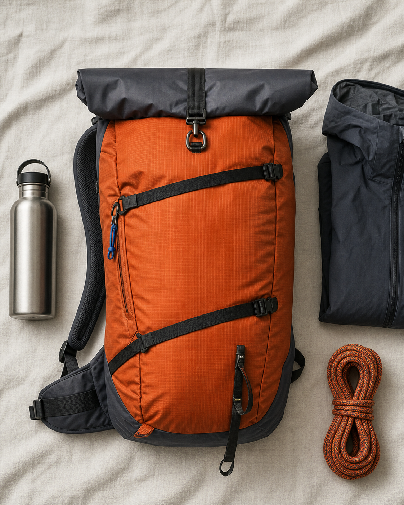

#### 详细信息

- **作者:** [Ecommerce GPT Image Prompts Studio](https://github.com/ecomimagelab)
- **来源:** 本仓库原创内容
- **发布日期:** 2026-07-23
- **语言:** en
- **适用平台:** Pinterest
- **许可证:** CC-BY-4.0

<details>
<summary><strong>生产参数、商品保真项与溯源信息</strong></summary>

| 生成模式 | 商品行业 | 使用场景 | 宽高比 |
|---|---|---|---|
| `text-to-image` | 箱包与配饰 | 生活方式场景 | 4:5 |

- **视觉风格:** 技术表达, 户外机能, 编辑大片
- **背景类型:** 天然材质
- **素材用途:** 社交创意
- **输入要求:** No reference image is required for this fictional unbranded product; use product-edit mode with owned source photography when adapting a real SKU.
- **商品保真项:**
  - Preserve the ember-orange ripstop body, charcoal roll-top, centered black G-hook, and two diagonal compression straps.
  - Preserve the graphite back panel, slim ice-tool loop, cobalt left-side zipper pull, and 28-liter proportions.
- **负面约束:** No brand patch, printed words, extra backpack, hiking poles attached, missing strap, extra buckle, military camouflage, hydration tube, floating gear, deformed shoulder straps, or changed color. No readable text, logo, trademark, watermark, duplicate product, broken geometry, cheap CGI, collage, or border.

**来源与版权**

- Generated specifically for this repository from the recorded standalone prompt; no third-party preview image is redistributed.
- Original prompt and generated previews created for this repository after visual-pattern and open-source workflow research; no external preview asset is included.
- [visual-research](docs/VISUAL_RESEARCH.md)
- [visual-research](https://github.com/buluslan/gpt-image2-ecommerce)
- [visual-research](https://github.com/motiful/product-shots)
- **平台规则状态:** Platform names identify intended visual treatment only; verify current listing and advertising requirements before publication.
- **商品系列:** [ec-0041](data/prompts/ec-0041-ember-alpine-backpack-platform-set.json)

</details>

**[🚀 立即体验 →](https://www.pixpix.com/)**

---

<a id="categories-footwear"></a>

<a id="prompt-ec-0040-amazon-fashion-clean-pair"></a>

### No. 86: 鞋履 — 柏树绿麂皮踝靴多平台套图: AMAZON FASHION CLEAN PAIR

 

#### 描述

让同一双柏树绿麂皮踝靴贯穿白底零售、粗野主义编辑、夜间街头动态、工艺细节和高收藏感静物。

**平台主图 · Amazon Fashion · 4:5**

#### 提示词

```text
Use case: product-mockup.
Asset type: main image for amazon fashion.
Primary request: Create one ultra-photorealistic portrait 4:5 e-commerce image featuring exactly one matching pair of ankle boots.
Product design: one fictional unbranded pair of women's ankle boots in deep cypress-green fine suede, with an almond toe, a clean inner-side brass zip, a narrow chestnut leather welt, a 55 mm sculpted rosewood block heel, and a slim dark rubber outsole.
Scene/backdrop: Arrange the left boot in front three-quarter view and the right boot behind at a complementary side angle on seamless pure #FFFFFF.
Composition/framing: Center the complete pair at about 78% frame fill with both toe shapes, shaft tops, zips, welts, heels, and soles readable.
Lighting/mood: Broad high-key softboxes, soft grounding shadow, controlled suede direction, and neutral color.
Materials/textures: Render directional suede nap, chestnut welt leather, satin brass zip, rosewood heel grain, and fine rubber edges with physically believable surfaces, disciplined commercial retouching, fine natural microtexture, and premium photographic depth.
Product invariants: Preserve the same almond toe, cypress suede, inner brass zip, chestnut welt, sculpted rosewood heel, and slim dark outsole.
Constraints: Show a matching left and right boot with stable shaft height and heel geometry. Keep the product fully recognizable and commercially usable; use only fictional, unbranded design details.
Avoid: No box, tissue, feet, model, stones, plants, floating pair, or hidden heel. No laces, buckle, platform sole, stiletto, black leather, extra shoe, mismatched pair, logo, decorative stitching, square toe, cropped heel, feet distortion, or plastic suede. No readable text, brand name, logo, trademark, watermark, duplicate product, broken geometry, cheap CGI, collage, split screen, frame, or border.
```

#### 生成预览图

##### 图片 1

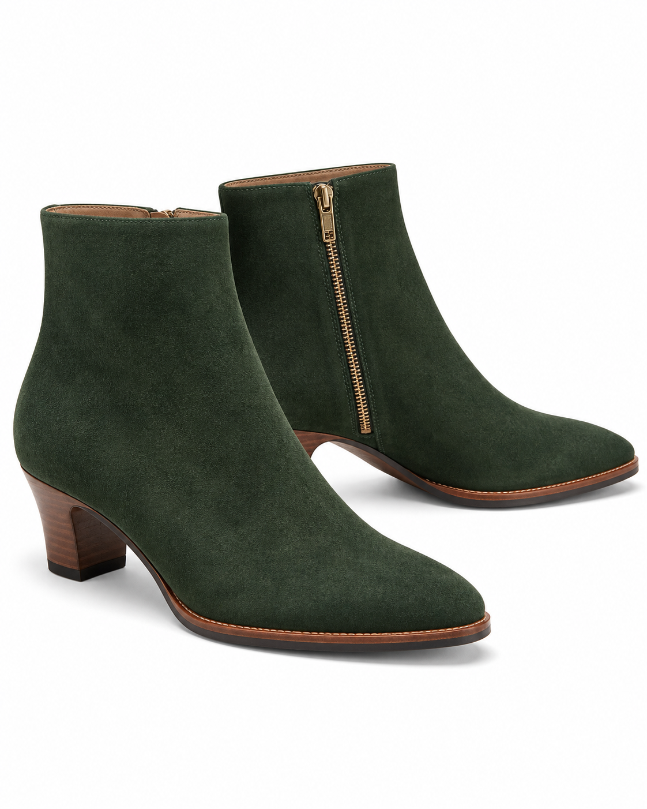

#### 详细信息

- **作者:** [Ecommerce GPT Image Prompts Studio](https://github.com/ecomimagelab)
- **来源:** 本仓库原创内容
- **发布日期:** 2026-07-23
- **语言:** en
- **适用平台:** Amazon Fashion
- **许可证:** CC-BY-4.0

<details>
<summary><strong>生产参数、商品保真项与溯源信息</strong></summary>

| 生成模式 | 商品行业 | 使用场景 | 宽高比 |
|---|---|---|---|
| `text-to-image` | 鞋履 | 平台主图 | 4:5 |

- **视觉风格:** 高端奢华, 编辑大片, 手作质感
- **背景类型:** 纯白背景
- **素材用途:** 平台主图
- **输入要求:** No reference image is required for this fictional unbranded product; use product-edit mode with owned source photography when adapting a real SKU.
- **商品保真项:**
  - Preserve the deep cypress suede, almond toe, inner brass zip, and chestnut welt.
  - Preserve the 55 mm sculpted rosewood block heel, slim dark outsole, and matching shaft height.
- **负面约束:** No laces, buckle, platform sole, stiletto, black leather, extra shoe, mismatched pair, logo, decorative stitching, square toe, cropped heel, feet distortion, or plastic suede. No readable text, logo, trademark, watermark, duplicate product, broken geometry, cheap CGI, collage, or border.

**来源与版权**

- Generated specifically for this repository from the recorded standalone prompt; no third-party preview image is redistributed.
- Original prompt and generated previews created for this repository after visual-pattern and open-source workflow research; no external preview asset is included.
- [visual-research](docs/VISUAL_RESEARCH.md)
- [visual-research](https://github.com/buluslan/gpt-image2-ecommerce)
- [visual-research](https://github.com/motiful/product-shots)
- **平台规则状态:** Platform names identify intended visual treatment only; verify current listing and advertising requirements before publication.
- **商品系列:** [ec-0040](data/prompts/ec-0040-cypress-suede-ankle-boot-platform-set.json)

</details>

**[🚀 立即体验 →](https://www.pixpix.com/)**

---

<a id="prompt-ec-0040-farfetch-brutalist-stone"></a>

### No. 87: 鞋履 — 柏树绿麂皮踝靴多平台套图: FARFETCH BRUTALIST STONE

 

#### 描述

让同一双柏树绿麂皮踝靴贯穿白底零售、粗野主义编辑、夜间街头动态、工艺细节和高收藏感静物。

**品牌首图 · Farfetch · 5:8**

#### 提示词

```text
Use case: product-mockup.
Asset type: branded hero for farfetch.
Primary request: Create one ultra-photorealistic portrait 5:8 e-commerce image featuring exactly one matching pair of ankle boots.
Product design: one fictional unbranded pair of women's ankle boots in deep cypress-green fine suede, with an almond toe, a clean inner-side brass zip, a narrow chestnut leather welt, a 55 mm sculpted rosewood block heel, and a slim dark rubber outsole.
Scene/backdrop: Place the pair across staggered pale-concrete steps in a brutalist courtyard with one rust-red wall plane.
Composition/framing: Use a low diagonal fashion composition with the forward boot upright and the second lying on its outer side to reveal the brass zip and heel profile.
Lighting/mood: Hard winter sun, long angular shadow, cool concrete bounce, and finely separated green suede.
Materials/textures: Render directional suede nap, chestnut welt leather, satin brass zip, rosewood heel grain, and fine rubber edges with physically believable surfaces, disciplined commercial retouching, fine natural microtexture, and premium photographic depth.
Product invariants: Preserve the same almond toe, cypress suede, inner brass zip, chestnut welt, sculpted rosewood heel, and slim dark outsole.
Constraints: Show a matching left and right boot with stable shaft height and heel geometry. Keep the product fully recognizable and commercially usable; use only fictional, unbranded design details.
Avoid: No person, graffiti, text, extra shoe, wet suede, floating boot, or cropped outsole. No laces, buckle, platform sole, stiletto, black leather, extra shoe, mismatched pair, logo, decorative stitching, square toe, cropped heel, feet distortion, or plastic suede. No readable text, brand name, logo, trademark, watermark, duplicate product, broken geometry, cheap CGI, collage, split screen, frame, or border.
```

#### 生成预览图

##### 图片 1

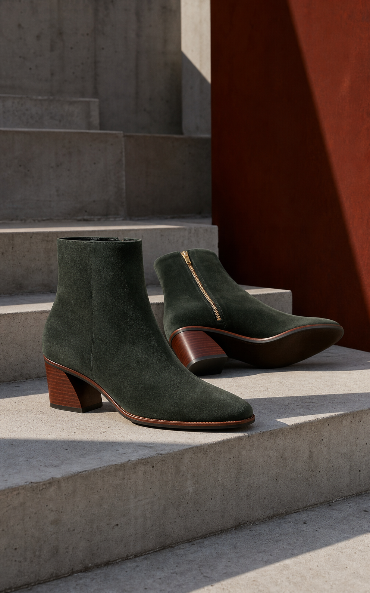

#### 详细信息

- **作者:** [Ecommerce GPT Image Prompts Studio](https://github.com/ecomimagelab)
- **来源:** 本仓库原创内容
- **发布日期:** 2026-07-23
- **语言:** en
- **适用平台:** Farfetch
- **许可证:** CC-BY-4.0

<details>
<summary><strong>生产参数、商品保真项与溯源信息</strong></summary>

| 生成模式 | 商品行业 | 使用场景 | 宽高比 |
|---|---|---|---|
| `text-to-image` | 鞋履 | 品牌首图 | 5:8 |

- **视觉风格:** 高端奢华, 编辑大片, 手作质感
- **背景类型:** 生活方式实景
- **素材用途:** 品牌首图
- **输入要求:** No reference image is required for this fictional unbranded product; use product-edit mode with owned source photography when adapting a real SKU.
- **商品保真项:**
  - Preserve the deep cypress suede, almond toe, inner brass zip, and chestnut welt.
  - Preserve the 55 mm sculpted rosewood block heel, slim dark outsole, and matching shaft height.
- **负面约束:** No laces, buckle, platform sole, stiletto, black leather, extra shoe, mismatched pair, logo, decorative stitching, square toe, cropped heel, feet distortion, or plastic suede. No readable text, logo, trademark, watermark, duplicate product, broken geometry, cheap CGI, collage, or border.

**来源与版权**

- Generated specifically for this repository from the recorded standalone prompt; no third-party preview image is redistributed.
- Original prompt and generated previews created for this repository after visual-pattern and open-source workflow research; no external preview asset is included.
- [visual-research](docs/VISUAL_RESEARCH.md)
- [visual-research](https://github.com/buluslan/gpt-image2-ecommerce)
- [visual-research](https://github.com/motiful/product-shots)
- **平台规则状态:** Platform names identify intended visual treatment only; verify current listing and advertising requirements before publication.
- **商品系列:** [ec-0040](data/prompts/ec-0040-cypress-suede-ankle-boot-platform-set.json)

</details>

**[🚀 立即体验 →](https://www.pixpix.com/)**

---

<a id="prompt-ec-0040-tiktok-night-step"></a>

### No. 88: 鞋履 — 柏树绿麂皮踝靴多平台套图: TIKTOK SHOP NIGHT STEP

 

#### 描述

让同一双柏树绿麂皮踝靴贯穿白底零售、粗野主义编辑、夜间街头动态、工艺细节和高收藏感静物。

**模特上身 · TikTok Shop · 5:8**

#### 提示词

```text
Use case: product-mockup.
Asset type: social creative for tiktok shop.
Primary request: Create one ultra-photorealistic portrait 5:8 e-commerce image featuring exactly one matching pair of ankle boots.
Product design: one fictional unbranded pair of women's ankle boots in deep cypress-green fine suede, with an almond toe, a clean inner-side brass zip, a narrow chestnut leather welt, a 55 mm sculpted rosewood block heel, and a slim dark rubber outsole.
Scene/backdrop: An adult woman wears the pair while stepping from a subway stair onto rain-dark charcoal pavement, styled with plain cropped black trousers.
Composition/framing: Frame from mid-calf downward at a dynamic low angle; show both boots, one planted and one mid-step, with safe natural anatomy and visible rosewood heels.
Lighting/mood: Direct flash mixed with cool city light, wet reflections, subtle motion in the trouser hem, and sharp suede texture.
Materials/textures: Render directional suede nap, chestnut welt leather, satin brass zip, rosewood heel grain, and fine rubber edges with physically believable surfaces, disciplined commercial retouching, fine natural microtexture, and premium photographic depth.
Product invariants: Preserve the same almond toe, cypress suede, inner brass zip, chestnut welt, sculpted rosewood heel, and slim dark outsole.
Constraints: Show a matching left and right boot with stable shaft height and heel geometry. Keep the product fully recognizable and commercially usable; use only fictional, unbranded design details.
Avoid: No child, extra feet, twisted ankle, hidden boot, logo clothing, puddle covering product, or illegible signage. No laces, buckle, platform sole, stiletto, black leather, extra shoe, mismatched pair, logo, decorative stitching, square toe, cropped heel, feet distortion, or plastic suede. No readable text, brand name, logo, trademark, watermark, duplicate product, broken geometry, cheap CGI, collage, split screen, frame, or border.
```

#### 生成预览图

##### 图片 1

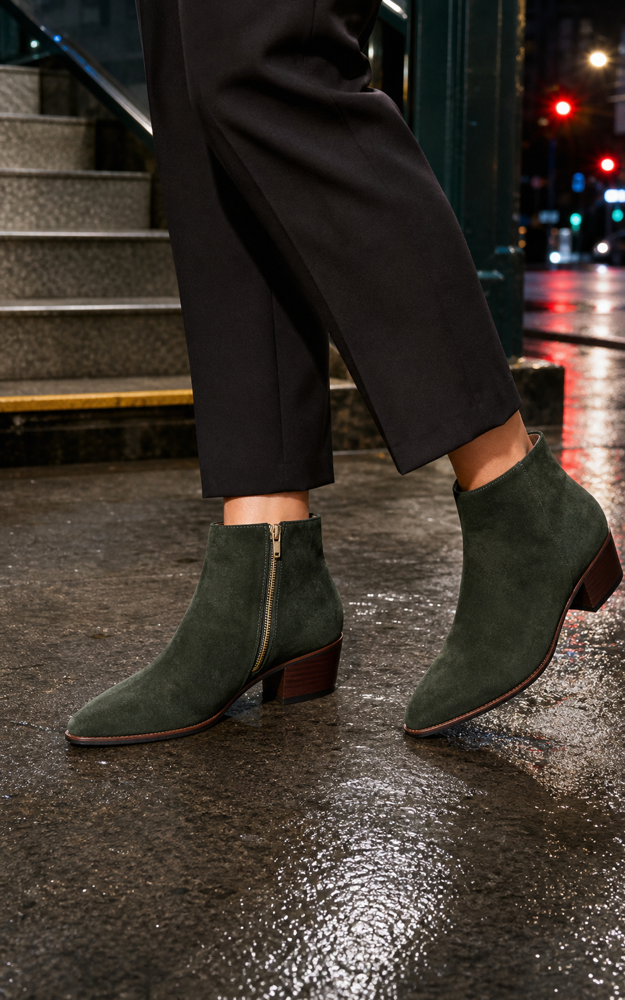

#### 详细信息

- **作者:** [Ecommerce GPT Image Prompts Studio](https://github.com/ecomimagelab)
- **来源:** 本仓库原创内容
- **发布日期:** 2026-07-23
- **语言:** en
- **适用平台:** TikTok Shop
- **许可证:** CC-BY-4.0

<details>
<summary><strong>生产参数、商品保真项与溯源信息</strong></summary>

| 生成模式 | 商品行业 | 使用场景 | 宽高比 |
|---|---|---|---|
| `text-to-image` | 鞋履 | 模特上身 | 5:8 |

- **视觉风格:** 高端奢华, 编辑大片, 手作质感
- **背景类型:** 生活方式实景
- **素材用途:** 社交创意
- **输入要求:** No reference image is required for this fictional unbranded product; use product-edit mode with owned source photography when adapting a real SKU.
- **商品保真项:**
  - Preserve the deep cypress suede, almond toe, inner brass zip, and chestnut welt.
  - Preserve the 55 mm sculpted rosewood block heel, slim dark outsole, and matching shaft height.
- **负面约束:** No laces, buckle, platform sole, stiletto, black leather, extra shoe, mismatched pair, logo, decorative stitching, square toe, cropped heel, feet distortion, or plastic suede. No readable text, logo, trademark, watermark, duplicate product, broken geometry, cheap CGI, collage, or border.

**来源与版权**

- Generated specifically for this repository from the recorded standalone prompt; no third-party preview image is redistributed.
- Original prompt and generated previews created for this repository after visual-pattern and open-source workflow research; no external preview asset is included.
- [visual-research](docs/VISUAL_RESEARCH.md)
- [visual-research](https://github.com/buluslan/gpt-image2-ecommerce)
- [visual-research](https://github.com/motiful/product-shots)
- **平台规则状态:** Platform names identify intended visual treatment only; verify current listing and advertising requirements before publication.
- **商品系列:** [ec-0040](data/prompts/ec-0040-cypress-suede-ankle-boot-platform-set.json)

</details>

**[🚀 立即体验 →](https://www.pixpix.com/)**

---

<a id="prompt-ec-0040-shopify-suede-atelier"></a>

### No. 89: 鞋履 — 柏树绿麂皮踝靴多平台套图: SHOPIFY SUEDE ATELIER

 

#### 描述

让同一双柏树绿麂皮踝靴贯穿白底零售、粗野主义编辑、夜间街头动态、工艺细节和高收藏感静物。

**细节与微距 · Shopify · 4:5**

#### 提示词

```text
Use case: product-mockup.
Asset type: secondary image for shopify.
Primary request: Create one ultra-photorealistic portrait 4:5 e-commerce image featuring exactly one matching pair of ankle boots.
Product design: one fictional unbranded pair of women's ankle boots in deep cypress-green fine suede, with an almond toe, a clean inner-side brass zip, a narrow chestnut leather welt, a 55 mm sculpted rosewood block heel, and a slim dark rubber outsole.
Scene/backdrop: Rest one boot on a chestnut leather work surface with the second softly behind; include one plain suede brush and no other tools.
Composition/framing: Use a close three-quarter crop that still includes the complete forward boot while emphasizing nap direction, brass zip teeth, welt stitching, and rosewood grain.
Lighting/mood: Warm side window light, narrow specular on brass, shallow depth of field, and honest atelier texture.
Materials/textures: Render directional suede nap, chestnut welt leather, satin brass zip, rosewood heel grain, and fine rubber edges with physically believable surfaces, disciplined commercial retouching, fine natural microtexture, and premium photographic depth.
Product invariants: Preserve the same almond toe, cypress suede, inner brass zip, chestnut welt, sculpted rosewood heel, and slim dark outsole.
Constraints: Show a matching left and right boot with stable shaft height and heel geometry. Keep the product fully recognizable and commercially usable; use only fictional, unbranded design details.
Avoid: No cobbler hands, glue, loose sole, excess tools, text, damage, or extra shoe. No laces, buckle, platform sole, stiletto, black leather, extra shoe, mismatched pair, logo, decorative stitching, square toe, cropped heel, feet distortion, or plastic suede. No readable text, brand name, logo, trademark, watermark, duplicate product, broken geometry, cheap CGI, collage, split screen, frame, or border.
```

#### 生成预览图

##### 图片 1

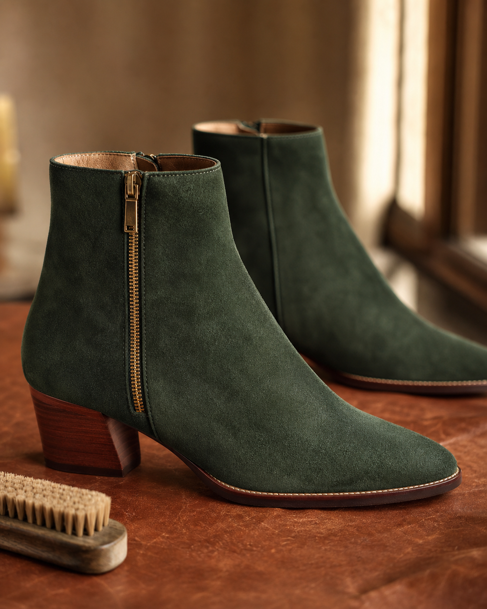

#### 详细信息

- **作者:** [Ecommerce GPT Image Prompts Studio](https://github.com/ecomimagelab)
- **来源:** 本仓库原创内容
- **发布日期:** 2026-07-23
- **语言:** en
- **适用平台:** Shopify
- **许可证:** CC-BY-4.0

<details>
<summary><strong>生产参数、商品保真项与溯源信息</strong></summary>

| 生成模式 | 商品行业 | 使用场景 | 宽高比 |
|---|---|---|---|
| `text-to-image` | 鞋履 | 细节与微距 | 4:5 |

- **视觉风格:** 高端奢华, 编辑大片, 手作质感
- **背景类型:** 天然材质
- **素材用途:** 商品副图
- **输入要求:** No reference image is required for this fictional unbranded product; use product-edit mode with owned source photography when adapting a real SKU.
- **商品保真项:**
  - Preserve the deep cypress suede, almond toe, inner brass zip, and chestnut welt.
  - Preserve the 55 mm sculpted rosewood block heel, slim dark outsole, and matching shaft height.
- **负面约束:** No laces, buckle, platform sole, stiletto, black leather, extra shoe, mismatched pair, logo, decorative stitching, square toe, cropped heel, feet distortion, or plastic suede. No readable text, logo, trademark, watermark, duplicate product, broken geometry, cheap CGI, collage, or border.

**来源与版权**

- Generated specifically for this repository from the recorded standalone prompt; no third-party preview image is redistributed.
- Original prompt and generated previews created for this repository after visual-pattern and open-source workflow research; no external preview asset is included.
- [visual-research](docs/VISUAL_RESEARCH.md)
- [visual-research](https://github.com/buluslan/gpt-image2-ecommerce)
- [visual-research](https://github.com/motiful/product-shots)
- **平台规则状态:** Platform names identify intended visual treatment only; verify current listing and advertising requirements before publication.
- **商品系列:** [ec-0040](data/prompts/ec-0040-cypress-suede-ankle-boot-platform-set.json)

</details>

**[🚀 立即体验 →](https://www.pixpix.com/)**

---

<a id="prompt-ec-0040-pinterest-rust-cobalt-still"></a>

### No. 90: 鞋履 — 柏树绿麂皮踝靴多平台套图: PINTEREST RUST COBALT STILL

 

#### 描述

让同一双柏树绿麂皮踝靴贯穿白底零售、粗野主义编辑、夜间街头动态、工艺细节和高收藏感静物。

**社交电商广告 · Pinterest · 5:8**

#### 提示词

```text
Use case: product-mockup.
Asset type: social creative for pinterest.
Primary request: Create one ultra-photorealistic portrait 5:8 e-commerce image featuring exactly one matching pair of ankle boots.
Product design: one fictional unbranded pair of women's ankle boots in deep cypress-green fine suede, with an almond toe, a clean inner-side brass zip, a narrow chestnut leather welt, a 55 mm sculpted rosewood block heel, and a slim dark rubber outsole.
Scene/backdrop: Stage the pair on a cobalt-blue stepped paper set with one curved rust-orange backdrop and no other props.
Composition/framing: Create a save-worthy vertical still life using strong negative space, clean heel silhouettes, and a diagonal relationship between the two boots.
Lighting/mood: Hard graphic sunlight, dense colored shadows, controlled suede highlights, and modern editorial color blocking.
Materials/textures: Render directional suede nap, chestnut welt leather, satin brass zip, rosewood heel grain, and fine rubber edges with physically believable surfaces, disciplined commercial retouching, fine natural microtexture, and premium photographic depth.
Product invariants: Preserve the same almond toe, cypress suede, inner brass zip, chestnut welt, sculpted rosewood heel, and slim dark outsole.
Constraints: Show a matching left and right boot with stable shaft height and heel geometry. Keep the product fully recognizable and commercially usable; use only fictional, unbranded design details.
Avoid: No model, flowers, bag, text, duplicate boot, levitation, or paper edge crossing the product. No laces, buckle, platform sole, stiletto, black leather, extra shoe, mismatched pair, logo, decorative stitching, square toe, cropped heel, feet distortion, or plastic suede. No readable text, brand name, logo, trademark, watermark, duplicate product, broken geometry, cheap CGI, collage, split screen, frame, or border.
```

#### 生成预览图

##### 图片 1

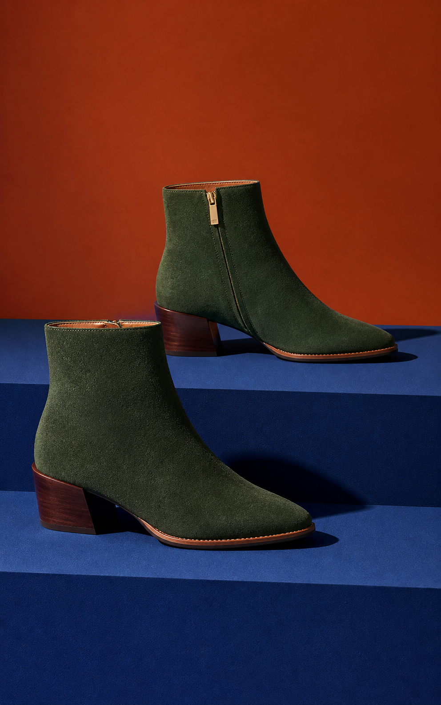

#### 详细信息

- **作者:** [Ecommerce GPT Image Prompts Studio](https://github.com/ecomimagelab)
- **来源:** 本仓库原创内容
- **发布日期:** 2026-07-23
- **语言:** en
- **适用平台:** Pinterest
- **许可证:** CC-BY-4.0

<details>
<summary><strong>生产参数、商品保真项与溯源信息</strong></summary>

| 生成模式 | 商品行业 | 使用场景 | 宽高比 |
|---|---|---|---|
| `text-to-image` | 鞋履 | 社交电商广告 | 5:8 |

- **视觉风格:** 高端奢华, 编辑大片, 手作质感
- **背景类型:** 图形化布景
- **素材用途:** 社交创意
- **输入要求:** No reference image is required for this fictional unbranded product; use product-edit mode with owned source photography when adapting a real SKU.
- **商品保真项:**
  - Preserve the deep cypress suede, almond toe, inner brass zip, and chestnut welt.
  - Preserve the 55 mm sculpted rosewood block heel, slim dark outsole, and matching shaft height.
- **负面约束:** No laces, buckle, platform sole, stiletto, black leather, extra shoe, mismatched pair, logo, decorative stitching, square toe, cropped heel, feet distortion, or plastic suede. No readable text, logo, trademark, watermark, duplicate product, broken geometry, cheap CGI, collage, or border.

**来源与版权**

- Generated specifically for this repository from the recorded standalone prompt; no third-party preview image is redistributed.
- Original prompt and generated previews created for this repository after visual-pattern and open-source workflow research; no external preview asset is included.
- [visual-research](docs/VISUAL_RESEARCH.md)
- [visual-research](https://github.com/buluslan/gpt-image2-ecommerce)
- [visual-research](https://github.com/motiful/product-shots)
- **平台规则状态:** Platform names identify intended visual treatment only; verify current listing and advertising requirements before publication.
- **商品系列:** [ec-0040](data/prompts/ec-0040-cypress-suede-ankle-boot-platform-set.json)

</details>

**[🚀 立即体验 →](https://www.pixpix.com/)**

---

<a id="prompt-ec-0039-farfetch-soft-catalog"></a>

### No. 91: 服装 — 宝石蓝真丝方巾多平台套图: FARFETCH SOFT CATALOG

 

#### 描述

让同一条宝石蓝植物纹真丝方巾在精品目录、成年模特风动时装、漆面发布、工坊微距和画廊静物中保持一致。

**目录商品图 · Farfetch · 4:5**

#### 提示词

```text
Use case: product-mockup.
Asset type: catalog image for farfetch.
Primary request: Create one ultra-photorealistic portrait 4:5 e-commerce image featuring exactly one premium silk scarf.
Product design: one fictional unbranded 90 cm square silk-twill scarf with a deep sapphire field, a hand-drawn ivory ginkgo-leaf border, four burnt-orange corner medallions, a narrow ivory outer keyline, and hand-rolled edges.
Scene/backdrop: Drape the complete scarf in one loose vertical cascade from a hidden support against pale warm-gray seamless paper.
Composition/framing: Show the full square silhouette through a controlled diagonal fold, all four corner medallions, border continuity, and generous clean margins.
Lighting/mood: Large diffused fashion softbox, subtle silk speculars, low shadow density, and true sapphire color.
Materials/textures: Render lustrous silk twill, crisp hand-rolled hems, saturated ink, fluid drape, and realistic fold highlights with physically believable surfaces, disciplined commercial retouching, fine natural microtexture, and premium photographic depth.
Product invariants: Preserve the same sapphire field, ivory ginkgo border, four burnt-orange corner medallions, square proportions, and narrow ivory keyline.
Constraints: Keep the print geometry coherent across folds and never invent lettering or a monogram. Keep the product fully recognizable and commercially usable; use only fictional, unbranded design details.
Avoid: No person, hanger, pin, knot, props, white clipping, or cropped corner. No brand mark, letters, extra scarf, changed print, floral roses, fringe, polyester shine, torn hem, missing corner medallion, duplicated fabric, or impossible fold continuity. No readable text, brand name, logo, trademark, watermark, duplicate product, broken geometry, cheap CGI, collage, split screen, frame, or border.
```

#### 生成预览图

##### 图片 1

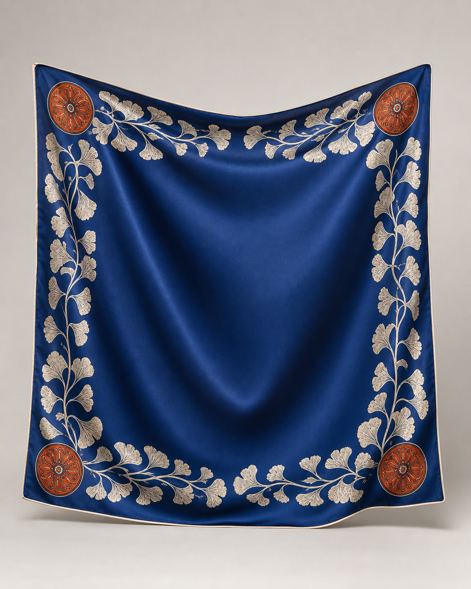

#### 详细信息

- **作者:** [Ecommerce GPT Image Prompts Studio](https://github.com/ecomimagelab)
- **来源:** 本仓库原创内容
- **发布日期:** 2026-07-23
- **语言:** en
- **适用平台:** Farfetch
- **许可证:** CC-BY-4.0

<details>
<summary><strong>生产参数、商品保真项与溯源信息</strong></summary>

| 生成模式 | 商品行业 | 使用场景 | 宽高比 |
|---|---|---|---|
| `text-to-image` | 服装 | 目录商品图 | 4:5 |

- **视觉风格:** 高端奢华, 编辑大片, 社交原生
- **背景类型:** 柔光影棚
- **素材用途:** 目录商品图
- **输入要求:** No reference image is required for this fictional unbranded product; use product-edit mode with owned source photography when adapting a real SKU.
- **商品保真项:**
  - Preserve the sapphire silk square with ivory ginkgo border and four burnt-orange corner medallions.
  - Preserve the narrow ivory keyline, hand-rolled edges, fluid silk-twill sheen, and 90 cm square proportions.
- **负面约束:** No brand mark, letters, extra scarf, changed print, floral roses, fringe, polyester shine, torn hem, missing corner medallion, duplicated fabric, or impossible fold continuity. No readable text, logo, trademark, watermark, duplicate product, broken geometry, cheap CGI, collage, or border.

**来源与版权**

- Generated specifically for this repository from the recorded standalone prompt; no third-party preview image is redistributed.
- Original prompt and generated previews created for this repository after visual-pattern and open-source workflow research; no external preview asset is included.
- [visual-research](docs/VISUAL_RESEARCH.md)
- [visual-research](https://github.com/buluslan/gpt-image2-ecommerce)
- [visual-research](https://github.com/motiful/product-shots)
- **平台规则状态:** Platform names identify intended visual treatment only; verify current listing and advertising requirements before publication.
- **商品系列:** [ec-0039](data/prompts/ec-0039-sapphire-silk-scarf-platform-set.json)

</details>

**[🚀 立即体验 →](https://www.pixpix.com/)**

---

<a id="prompt-ec-0039-instagram-wind-portrait"></a>

### No. 92: 服装 — 宝石蓝真丝方巾多平台套图: INSTAGRAM WIND PORTRAIT

  

#### 描述

让同一条宝石蓝植物纹真丝方巾在精品目录、成年模特风动时装、漆面发布、工坊微距和画廊静物中保持一致。

**模特上身 · Instagram Shop · 5:8**

#### 提示词

```text
Use case: product-mockup.
Asset type: social creative for instagram shop.
Primary request: Create one ultra-photorealistic portrait 5:8 e-commerce image featuring exactly one premium silk scarf.
Product design: one fictional unbranded 90 cm square silk-twill scarf with a deep sapphire field, a hand-drawn ivory ginkgo-leaf border, four burnt-orange corner medallions, a narrow ivory outer keyline, and hand-rolled edges.
Scene/backdrop: An elegant adult woman in a plain ivory sleeveless column dress holds one corner while a controlled breeze lifts the scarf behind her against a muted moss-green wall.
Composition/framing: Use a three-quarter fashion portrait with her complete head, hands, and upper body visible; the scarf forms a dynamic diagonal while its border and two orange medallions remain readable.
Lighting/mood: Warm directional window light with a crisp flash lift, natural adult skin, subtle film grain, and tactile moving silk.
Materials/textures: Render lustrous silk twill, crisp hand-rolled hems, saturated ink, fluid drape, and realistic fold highlights with physically believable surfaces, disciplined commercial retouching, fine natural microtexture, and premium photographic depth.
Product invariants: Preserve the same sapphire field, ivory ginkgo border, four burnt-orange corner medallions, square proportions, and narrow ivory keyline.
Constraints: Keep the print geometry coherent across folds and never invent lettering or a monogram. Keep the product fully recognizable and commercially usable; use only fictional, unbranded design details.
Avoid: No child, extra scarf, wind-obscured face, distorted fingers, branded dress, hat, jewelry distraction, or flying detached fabric. No brand mark, letters, extra scarf, changed print, floral roses, fringe, polyester shine, torn hem, missing corner medallion, duplicated fabric, or impossible fold continuity. No readable text, brand name, logo, trademark, watermark, duplicate product, broken geometry, cheap CGI, collage, split screen, frame, or border.
```

#### 生成预览图

##### 图片 1


#### 详细信息

- **作者:** [Ecommerce GPT Image Prompts Studio](https://github.com/ecomimagelab)
- **来源:** 本仓库原创内容
- **发布日期:** 2026-07-23
- **语言:** en
- **适用平台:** Instagram Shop
- **许可证:** CC-BY-4.0

<details>
<summary><strong>生产参数、商品保真项与溯源信息</strong></summary>

| 生成模式 | 商品行业 | 使用场景 | 宽高比 |
|---|---|---|---|
| `text-to-image` | 服装 | 模特上身 | 5:8 |

- **视觉风格:** 高端奢华, 编辑大片, 社交原生
- **背景类型:** 生活方式实景
- **素材用途:** 社交创意
- **输入要求:** No reference image is required for this fictional unbranded product; use product-edit mode with owned source photography when adapting a real SKU.
- **商品保真项:**
  - Preserve the sapphire silk square with ivory ginkgo border and four burnt-orange corner medallions.
  - Preserve the narrow ivory keyline, hand-rolled edges, fluid silk-twill sheen, and 90 cm square proportions.
- **负面约束:** No brand mark, letters, extra scarf, changed print, floral roses, fringe, polyester shine, torn hem, missing corner medallion, duplicated fabric, or impossible fold continuity. No readable text, logo, trademark, watermark, duplicate product, broken geometry, cheap CGI, collage, or border.

**来源与版权**

- Generated specifically for this repository from the recorded standalone prompt; no third-party preview image is redistributed.
- Original prompt and generated previews created for this repository after visual-pattern and open-source workflow research; no external preview asset is included.
- [visual-research](docs/VISUAL_RESEARCH.md)
- [visual-research](https://github.com/buluslan/gpt-image2-ecommerce)
- [visual-research](https://github.com/motiful/product-shots)
- **平台规则状态:** Platform names identify intended visual treatment only; verify current listing and advertising requirements before publication.
- **商品系列:** [ec-0039](data/prompts/ec-0039-sapphire-silk-scarf-platform-set.json)

</details>

**[🚀 立即体验 →](https://www.pixpix.com/)**

---

<a id="prompt-ec-0039-tmall-oxblood-fold"></a>

### No. 93: 服装 — 宝石蓝真丝方巾多平台套图: TMALL OXBLOOD FOLD

 

#### 描述

让同一条宝石蓝植物纹真丝方巾在精品目录、成年模特风动时装、漆面发布、工坊微距和画廊静物中保持一致。

**品牌首图 · 天猫奢品 · 5:8**

#### 提示词

```text
Use case: product-mockup.
Asset type: branded hero for tmall luxury.
Primary request: Create one ultra-photorealistic portrait 5:8 e-commerce image featuring exactly one premium silk scarf.
Product design: one fictional unbranded 90 cm square silk-twill scarf with a deep sapphire field, a hand-drawn ivory ginkgo-leaf border, four burnt-orange corner medallions, a narrow ivory outer keyline, and hand-rolled edges.
Scene/backdrop: Fold the scarf into a broad sculptural S curve across a glossy oxblood plinth inside a black gallery set.
Composition/framing: Use a low close angle showing the sapphire face, ivory ginkgo border, one full orange medallion, hand-rolled edge, and deep negative space.
Lighting/mood: Controlled hard rim light, oxblood reflections, saturated sapphire shadows, and polished luxury contrast.
Materials/textures: Render lustrous silk twill, crisp hand-rolled hems, saturated ink, fluid drape, and realistic fold highlights with physically believable surfaces, disciplined commercial retouching, fine natural microtexture, and premium photographic depth.
Product invariants: Preserve the same sapphire field, ivory ginkgo border, four burnt-orange corner medallions, square proportions, and narrow ivory keyline.
Constraints: Keep the print geometry coherent across folds and never invent lettering or a monogram. Keep the product fully recognizable and commercially usable; use only fictional, unbranded design details.
Avoid: No mannequin, person, smoke, gold logo, text, extra cloth, crushed folds, or liquid. No brand mark, letters, extra scarf, changed print, floral roses, fringe, polyester shine, torn hem, missing corner medallion, duplicated fabric, or impossible fold continuity. No readable text, brand name, logo, trademark, watermark, duplicate product, broken geometry, cheap CGI, collage, split screen, frame, or border.
```

#### 生成预览图

##### 图片 1

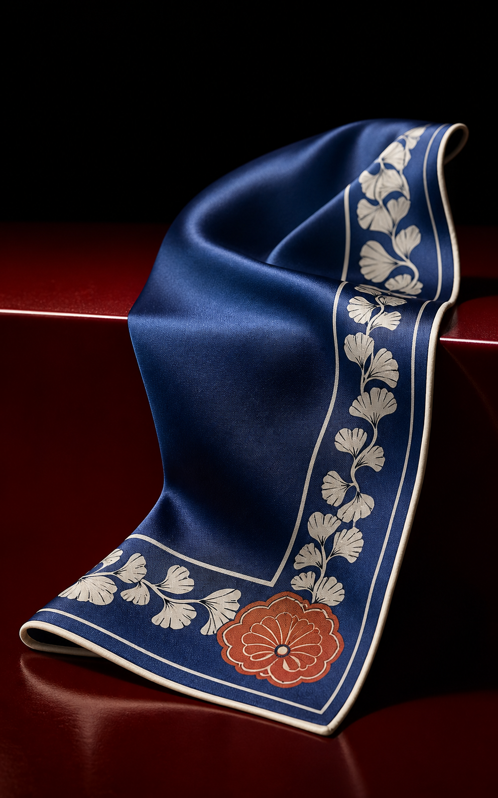

#### 详细信息

- **作者:** [Ecommerce GPT Image Prompts Studio](https://github.com/ecomimagelab)
- **来源:** 本仓库原创内容
- **发布日期:** 2026-07-23
- **语言:** en
- **适用平台:** 天猫奢品
- **许可证:** CC-BY-4.0

<details>
<summary><strong>生产参数、商品保真项与溯源信息</strong></summary>

| 生成模式 | 商品行业 | 使用场景 | 宽高比 |
|---|---|---|---|
| `text-to-image` | 服装 | 品牌首图 | 5:8 |

- **视觉风格:** 高端奢华, 编辑大片, 社交原生
- **背景类型:** 暗调影棚
- **素材用途:** 品牌首图
- **输入要求:** No reference image is required for this fictional unbranded product; use product-edit mode with owned source photography when adapting a real SKU.
- **商品保真项:**
  - Preserve the sapphire silk square with ivory ginkgo border and four burnt-orange corner medallions.
  - Preserve the narrow ivory keyline, hand-rolled edges, fluid silk-twill sheen, and 90 cm square proportions.
- **负面约束:** No brand mark, letters, extra scarf, changed print, floral roses, fringe, polyester shine, torn hem, missing corner medallion, duplicated fabric, or impossible fold continuity. No readable text, logo, trademark, watermark, duplicate product, broken geometry, cheap CGI, collage, or border.

**来源与版权**

- Generated specifically for this repository from the recorded standalone prompt; no third-party preview image is redistributed.
- Original prompt and generated previews created for this repository after visual-pattern and open-source workflow research; no external preview asset is included.
- [visual-research](docs/VISUAL_RESEARCH.md)
- [visual-research](https://github.com/buluslan/gpt-image2-ecommerce)
- [visual-research](https://github.com/motiful/product-shots)
- **平台规则状态:** Platform names identify intended visual treatment only; verify current listing and advertising requirements before publication.
- **商品系列:** [ec-0039](data/prompts/ec-0039-sapphire-silk-scarf-platform-set.json)

</details>

**[🚀 立即体验 →](https://www.pixpix.com/)**

---

<a id="prompt-ec-0039-shopify-atelier-macro"></a>

### No. 94: 服装 — 宝石蓝真丝方巾多平台套图: SHOPIFY ATELIER MACRO

 

#### 描述

让同一条宝石蓝植物纹真丝方巾在精品目录、成年模特风动时装、漆面发布、工坊微距和画廊静物中保持一致。

**细节与微距 · Shopify · 4:5**

#### 提示词

```text
Use case: product-mockup.
Asset type: secondary image for shopify.
Primary request: Create one ultra-photorealistic portrait 4:5 e-commerce image featuring exactly one premium silk scarf.
Product design: one fictional unbranded 90 cm square silk-twill scarf with a deep sapphire field, a hand-drawn ivory ginkgo-leaf border, four burnt-orange corner medallions, a narrow ivory outer keyline, and hand-rolled edges.
Scene/backdrop: Lay one corner over an unbleached cutting table beside a plain wooden seam gauge and a spool of ivory silk thread.
Composition/framing: Frame a close overhead detail of the hand-rolled hem, one orange medallion, ivory keyline, and ginkgo ink texture while enough scarf remains visible to identify it.
Lighting/mood: Soft north light, gentle wood bounce, shallow depth of field, and truthful thread-scale texture.
Materials/textures: Render lustrous silk twill, crisp hand-rolled hems, saturated ink, fluid drape, and realistic fold highlights with physically believable surfaces, disciplined commercial retouching, fine natural microtexture, and premium photographic depth.
Product invariants: Preserve the same sapphire field, ivory ginkgo border, four burnt-orange corner medallions, square proportions, and narrow ivory keyline.
Constraints: Keep the print geometry coherent across folds and never invent lettering or a monogram. Keep the product fully recognizable and commercially usable; use only fictional, unbranded design details.
Avoid: No scissors touching fabric, written ruler numbers, loose damaged thread, extra scarf, tailor hands, or stain. No brand mark, letters, extra scarf, changed print, floral roses, fringe, polyester shine, torn hem, missing corner medallion, duplicated fabric, or impossible fold continuity. No readable text, brand name, logo, trademark, watermark, duplicate product, broken geometry, cheap CGI, collage, split screen, frame, or border.
```

#### 生成预览图

##### 图片 1

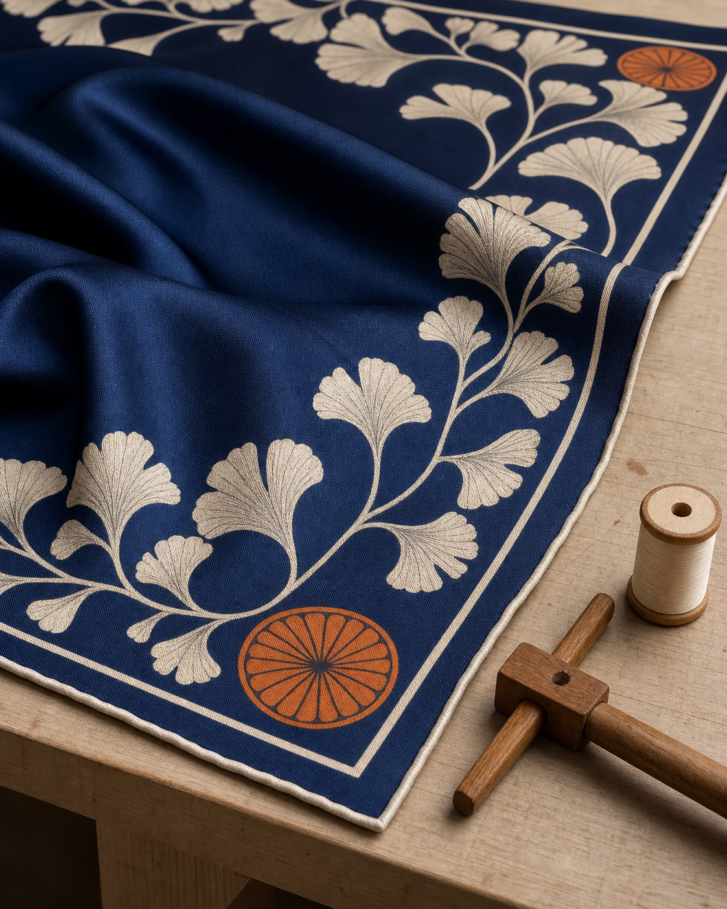

#### 详细信息

- **作者:** [Ecommerce GPT Image Prompts Studio](https://github.com/ecomimagelab)
- **来源:** 本仓库原创内容
- **发布日期:** 2026-07-23
- **语言:** en
- **适用平台:** Shopify
- **许可证:** CC-BY-4.0

<details>
<summary><strong>生产参数、商品保真项与溯源信息</strong></summary>

| 生成模式 | 商品行业 | 使用场景 | 宽高比 |
|---|---|---|---|
| `text-to-image` | 服装 | 细节与微距 | 4:5 |

- **视觉风格:** 高端奢华, 编辑大片, 社交原生
- **背景类型:** 天然材质
- **素材用途:** 商品副图
- **输入要求:** No reference image is required for this fictional unbranded product; use product-edit mode with owned source photography when adapting a real SKU.
- **商品保真项:**
  - Preserve the sapphire silk square with ivory ginkgo border and four burnt-orange corner medallions.
  - Preserve the narrow ivory keyline, hand-rolled edges, fluid silk-twill sheen, and 90 cm square proportions.
- **负面约束:** No brand mark, letters, extra scarf, changed print, floral roses, fringe, polyester shine, torn hem, missing corner medallion, duplicated fabric, or impossible fold continuity. No readable text, logo, trademark, watermark, duplicate product, broken geometry, cheap CGI, collage, or border.

**来源与版权**

- Generated specifically for this repository from the recorded standalone prompt; no third-party preview image is redistributed.
- Original prompt and generated previews created for this repository after visual-pattern and open-source workflow research; no external preview asset is included.
- [visual-research](docs/VISUAL_RESEARCH.md)
- [visual-research](https://github.com/buluslan/gpt-image2-ecommerce)
- [visual-research](https://github.com/motiful/product-shots)
- **平台规则状态:** Platform names identify intended visual treatment only; verify current listing and advertising requirements before publication.
- **商品系列:** [ec-0039](data/prompts/ec-0039-sapphire-silk-scarf-platform-set.json)

</details>

**[🚀 立即体验 →](https://www.pixpix.com/)**

---

<a id="prompt-ec-0039-pinterest-gallery-chair"></a>

### No. 95: 服装 — 宝石蓝真丝方巾多平台套图: PINTEREST GALLERY CHAIR

 

#### 描述

让同一条宝石蓝植物纹真丝方巾在精品目录、成年模特风动时装、漆面发布、工坊微距和画廊静物中保持一致。

**生活方式场景 · Pinterest · 5:8**

#### 提示词

```text
Use case: product-mockup.
Asset type: social creative for pinterest.
Primary request: Create one ultra-photorealistic portrait 5:8 e-commerce image featuring exactly one premium silk scarf.
Product design: one fictional unbranded 90 cm square silk-twill scarf with a deep sapphire field, a hand-drawn ivory ginkgo-leaf border, four burnt-orange corner medallions, a narrow ivory outer keyline, and hand-rolled edges.
Scene/backdrop: Drape the scarf over one curved cream plaster chair in a quiet gallery corner with a cobalt floor and a single apricot wall plane.
Composition/framing: Use a tall architectural composition with the scarf as the central color event, complete corners visible through a natural waterfall drape.
Lighting/mood: Late-afternoon side sun, long geometric shadows, gentle plaster bounce, and rich but restrained color.
Materials/textures: Render lustrous silk twill, crisp hand-rolled hems, saturated ink, fluid drape, and realistic fold highlights with physically believable surfaces, disciplined commercial retouching, fine natural microtexture, and premium photographic depth.
Product invariants: Preserve the same sapphire field, ivory ginkgo border, four burnt-orange corner medallions, square proportions, and narrow ivory keyline.
Constraints: Keep the print geometry coherent across folds and never invent lettering or a monogram. Keep the product fully recognizable and commercially usable; use only fictional, unbranded design details.
Avoid: No person, vase, book, second textile, wall art, text, or scarf pooled on a dirty floor. No brand mark, letters, extra scarf, changed print, floral roses, fringe, polyester shine, torn hem, missing corner medallion, duplicated fabric, or impossible fold continuity. No readable text, brand name, logo, trademark, watermark, duplicate product, broken geometry, cheap CGI, collage, split screen, frame, or border.
```

#### 生成预览图

##### 图片 1

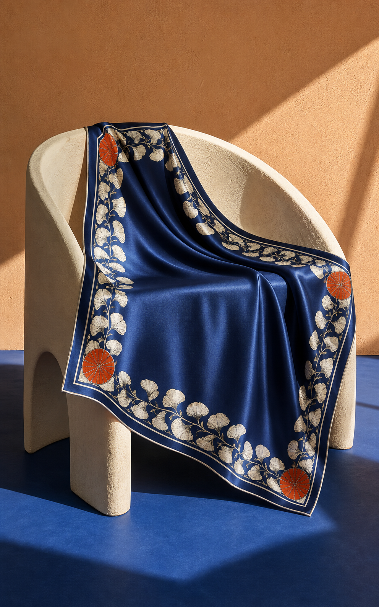

#### 详细信息

- **作者:** [Ecommerce GPT Image Prompts Studio](https://github.com/ecomimagelab)
- **来源:** 本仓库原创内容
- **发布日期:** 2026-07-23
- **语言:** en
- **适用平台:** Pinterest
- **许可证:** CC-BY-4.0

<details>
<summary><strong>生产参数、商品保真项与溯源信息</strong></summary>

| 生成模式 | 商品行业 | 使用场景 | 宽高比 |
|---|---|---|---|
| `text-to-image` | 服装 | 生活方式场景 | 5:8 |

- **视觉风格:** 高端奢华, 编辑大片, 社交原生
- **背景类型:** 家居空间
- **素材用途:** 社交创意
- **输入要求:** No reference image is required for this fictional unbranded product; use product-edit mode with owned source photography when adapting a real SKU.
- **商品保真项:**
  - Preserve the sapphire silk square with ivory ginkgo border and four burnt-orange corner medallions.
  - Preserve the narrow ivory keyline, hand-rolled edges, fluid silk-twill sheen, and 90 cm square proportions.
- **负面约束:** No brand mark, letters, extra scarf, changed print, floral roses, fringe, polyester shine, torn hem, missing corner medallion, duplicated fabric, or impossible fold continuity. No readable text, logo, trademark, watermark, duplicate product, broken geometry, cheap CGI, collage, or border.

**来源与版权**

- Generated specifically for this repository from the recorded standalone prompt; no third-party preview image is redistributed.
- Original prompt and generated previews created for this repository after visual-pattern and open-source workflow research; no external preview asset is included.
- [visual-research](docs/VISUAL_RESEARCH.md)
- [visual-research](https://github.com/buluslan/gpt-image2-ecommerce)
- [visual-research](https://github.com/motiful/product-shots)
- **平台规则状态:** Platform names identify intended visual treatment only; verify current listing and advertising requirements before publication.
- **商品系列:** [ec-0039](data/prompts/ec-0039-sapphire-silk-scarf-platform-set.json)

</details>

**[🚀 立即体验 →](https://www.pixpix.com/)**

---

<a id="categories-jewelry"></a>

<a id="prompt-ec-0038-amazon-jewelry-clean-pair"></a>

### No. 96: 珠宝 — 巴洛克珍珠圈耳环多平台套图: AMAZON JEWELRY CLEAN PAIR

 

#### 描述

让同一对不对称金色珍珠圈耳环在商城白底、漆面奢华、工艺细节、成年模特美妆和 Pinterest 雕塑静物中保持一致。

**平台主图 · Amazon · 4:5**

#### 提示词

```text
Use case: product-mockup.
Asset type: main image for amazon.
Primary request: Create one ultra-photorealistic portrait 4:5 e-commerce image featuring exactly one matching pair of premium hoop earrings.
Product design: one fictional unbranded matching pair of small oval hoops in satin 18k-yellow-gold tone, each hoop carrying five irregular ivory baroque pearls graduated from small at the top to large at the bottom, with a slim hinged post and no stones.
Scene/backdrop: Arrange the pair upright in a gentle mirrored three-quarter stance on seamless pure #FFFFFF with no props.
Composition/framing: Center the complete pair at about 70% frame fill; keep both hoops, all visible pearls, posts, and soft grounding shadows crisp.
Lighting/mood: Broad high-key softboxes, controlled pearl iridescence, clean gold edge highlights, and neutral white balance.
Materials/textures: Render soft satin gold, nacreous irregular pearl skins, tiny hinge construction, and realistic jewelry-scale reflections with physically believable surfaces, disciplined commercial retouching, fine natural microtexture, and premium photographic depth.
Product invariants: Preserve the same oval hoop diameter, five-pearl graduation on each earring, ivory nacre, satin-gold finish, and slim hinged posts.
Constraints: Show exactly two earrings and exactly five pearls on each earring unless a worn close crop naturally hides a rear pearl. Keep the product fully recognizable and commercially usable; use only fictional, unbranded design details.
Avoid: No stand, hand, ear, flowers, shell, card, packaging, harsh reflection, or cropped hoop. No diamonds, gemstones, silver metal, round uniform beads, extra pearl, missing pearl, oversized hoop, dangling chain, mismatched pair, jewelry box branding, or pierced-ear distortion. No readable text, brand name, logo, trademark, watermark, duplicate product, broken geometry, cheap CGI, collage, split screen, frame, or border.
```

#### 生成预览图

##### 图片 1

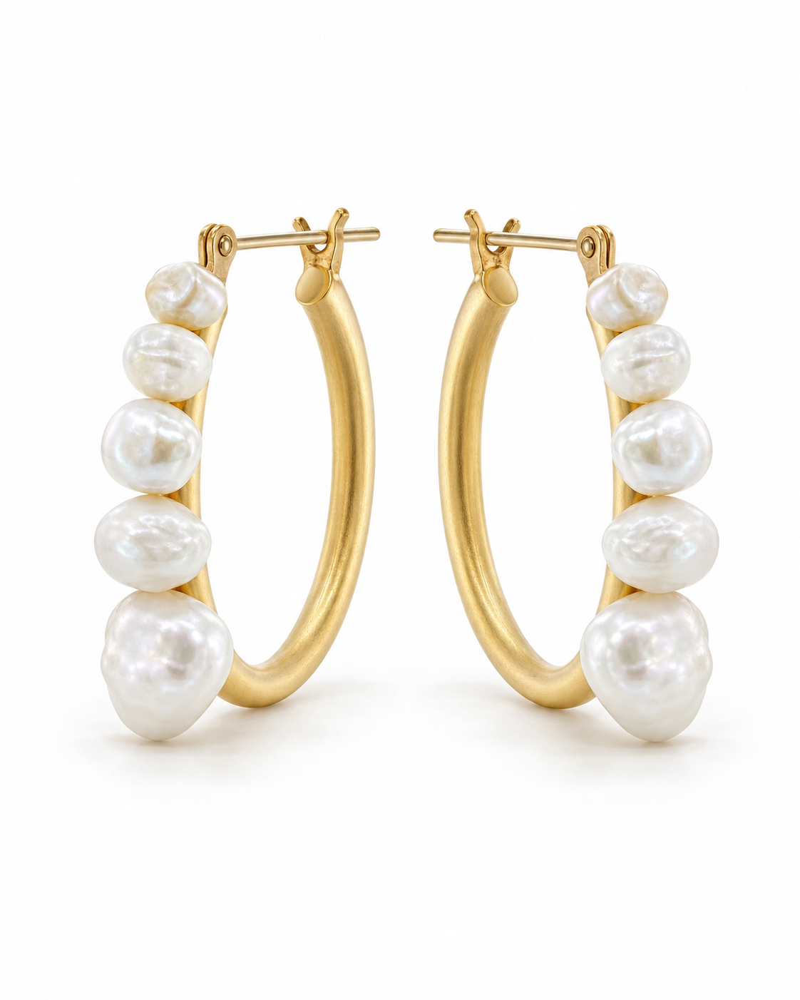

#### 详细信息

- **作者:** [Ecommerce GPT Image Prompts Studio](https://github.com/ecomimagelab)
- **来源:** 本仓库原创内容
- **发布日期:** 2026-07-23
- **语言:** en
- **适用平台:** Amazon
- **许可证:** CC-BY-4.0

<details>
<summary><strong>生产参数、商品保真项与溯源信息</strong></summary>

| 生成模式 | 商品行业 | 使用场景 | 宽高比 |
|---|---|---|---|
| `text-to-image` | 珠宝 | 平台主图 | 4:5 |

- **视觉风格:** 高端奢华, 编辑大片, 手作质感
- **背景类型:** 纯白背景
- **素材用途:** 平台主图
- **输入要求:** No reference image is required for this fictional unbranded product; use product-edit mode with owned source photography when adapting a real SKU.
- **商品保真项:**
  - Preserve the small satin-gold oval hoops and slim hinged posts.
  - Preserve five irregular ivory baroque pearls graduated from small to large on each earring.
- **负面约束:** No diamonds, gemstones, silver metal, round uniform beads, extra pearl, missing pearl, oversized hoop, dangling chain, mismatched pair, jewelry box branding, or pierced-ear distortion. No readable text, logo, trademark, watermark, duplicate product, broken geometry, cheap CGI, collage, or border.

**来源与版权**

- Generated specifically for this repository from the recorded standalone prompt; no third-party preview image is redistributed.
- Original prompt and generated previews created for this repository after visual-pattern and open-source workflow research; no external preview asset is included.
- [visual-research](docs/VISUAL_RESEARCH.md)
- [visual-research](https://github.com/buluslan/gpt-image2-ecommerce)
- [visual-research](https://github.com/motiful/product-shots)
- **平台规则状态:** Platform names identify intended visual treatment only; verify current listing and advertising requirements before publication.
- **商品系列:** [ec-0038](data/prompts/ec-0038-baroque-pearl-hoop-earrings-platform-set.json)

</details>

**[🚀 立即体验 →](https://www.pixpix.com/)**

---

<a id="prompt-ec-0038-tmall-luxury-black-lacquer"></a>

### No. 97: 珠宝 — 巴洛克珍珠圈耳环多平台套图: TMALL LUXURY BLACK LACQUER

 

#### 描述

让同一对不对称金色珍珠圈耳环在商城白底、漆面奢华、工艺细节、成年模特美妆和 Pinterest 雕塑静物中保持一致。

**品牌首图 · 天猫奢品 · 5:8**

#### 提示词

```text
Use case: product-mockup.
Asset type: branded hero for tmall luxury.
Primary request: Create one ultra-photorealistic portrait 5:8 e-commerce image featuring exactly one matching pair of premium hoop earrings.
Product design: one fictional unbranded matching pair of small oval hoops in satin 18k-yellow-gold tone, each hoop carrying five irregular ivory baroque pearls graduated from small at the top to large at the bottom, with a slim hinged post and no stones.
Scene/backdrop: Balance the pair on two low black-lacquer arcs over a deep oxblood reflective floor with a single ivory light blade behind.
Composition/framing: Use a close low three-quarter composition with one earring forward and its mate slightly elevated, leaving dark negative space above.
Lighting/mood: Narrow specular strips, rich black falloff, controlled oxblood bounce, and luminous pearl highlights without clipping.
Materials/textures: Render soft satin gold, nacreous irregular pearl skins, tiny hinge construction, and realistic jewelry-scale reflections with physically believable surfaces, disciplined commercial retouching, fine natural microtexture, and premium photographic depth.
Product invariants: Preserve the same oval hoop diameter, five-pearl graduation on each earring, ivory nacre, satin-gold finish, and slim hinged posts.
Constraints: Show exactly two earrings and exactly five pearls on each earring unless a worn close crop naturally hides a rear pearl. Keep the product fully recognizable and commercially usable; use only fictional, unbranded design details.
Avoid: No smoke, glitter, text, floating pearls, red metal, extra jewelry, or theatrical starburst. No diamonds, gemstones, silver metal, round uniform beads, extra pearl, missing pearl, oversized hoop, dangling chain, mismatched pair, jewelry box branding, or pierced-ear distortion. No readable text, brand name, logo, trademark, watermark, duplicate product, broken geometry, cheap CGI, collage, split screen, frame, or border.
```

#### 生成预览图

##### 图片 1

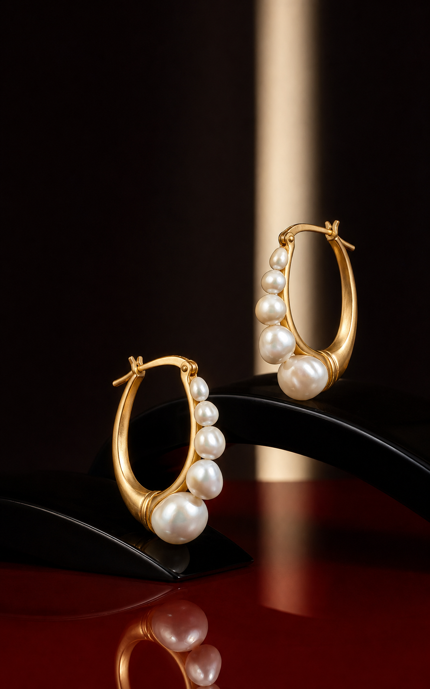

#### 详细信息

- **作者:** [Ecommerce GPT Image Prompts Studio](https://github.com/ecomimagelab)
- **来源:** 本仓库原创内容
- **发布日期:** 2026-07-23
- **语言:** en
- **适用平台:** 天猫奢品
- **许可证:** CC-BY-4.0

<details>
<summary><strong>生产参数、商品保真项与溯源信息</strong></summary>

| 生成模式 | 商品行业 | 使用场景 | 宽高比 |
|---|---|---|---|
| `text-to-image` | 珠宝 | 品牌首图 | 5:8 |

- **视觉风格:** 高端奢华, 编辑大片, 手作质感
- **背景类型:** 暗调影棚
- **素材用途:** 品牌首图
- **输入要求:** No reference image is required for this fictional unbranded product; use product-edit mode with owned source photography when adapting a real SKU.
- **商品保真项:**
  - Preserve the small satin-gold oval hoops and slim hinged posts.
  - Preserve five irregular ivory baroque pearls graduated from small to large on each earring.
- **负面约束:** No diamonds, gemstones, silver metal, round uniform beads, extra pearl, missing pearl, oversized hoop, dangling chain, mismatched pair, jewelry box branding, or pierced-ear distortion. No readable text, logo, trademark, watermark, duplicate product, broken geometry, cheap CGI, collage, or border.

**来源与版权**

- Generated specifically for this repository from the recorded standalone prompt; no third-party preview image is redistributed.
- Original prompt and generated previews created for this repository after visual-pattern and open-source workflow research; no external preview asset is included.
- [visual-research](docs/VISUAL_RESEARCH.md)
- [visual-research](https://github.com/buluslan/gpt-image2-ecommerce)
- [visual-research](https://github.com/motiful/product-shots)
- **平台规则状态:** Platform names identify intended visual treatment only; verify current listing and advertising requirements before publication.
- **商品系列:** [ec-0038](data/prompts/ec-0038-baroque-pearl-hoop-earrings-platform-set.json)

</details>

**[🚀 立即体验 →](https://www.pixpix.com/)**

---

<a id="prompt-ec-0038-etsy-jeweler-bench-macro"></a>

### No. 98: 珠宝 — 巴洛克珍珠圈耳环多平台套图: ETSY JEWELER BENCH MACRO

 

#### 描述

让同一对不对称金色珍珠圈耳环在商城白底、漆面奢华、工艺细节、成年模特美妆和 Pinterest 雕塑静物中保持一致。

**细节与微距 · Etsy · 4:5**

#### 提示词

```text
Use case: product-mockup.
Asset type: secondary image for etsy.
Primary request: Create one ultra-photorealistic portrait 4:5 e-commerce image featuring exactly one matching pair of premium hoop earrings.
Product design: one fictional unbranded matching pair of small oval hoops in satin 18k-yellow-gold tone, each hoop carrying five irregular ivory baroque pearls graduated from small at the top to large at the bottom, with a slim hinged post and no stones.
Scene/backdrop: Rest the finished pair on unbleached linen atop a walnut jeweler's bench beside one plain brass burnisher and a loose cotton thread.
Composition/framing: Frame a tactile overhead macro that keeps both earrings complete while revealing hinge machining, satin gold, and organic pearl ridges.
Lighting/mood: Soft north-window light, warm bench bounce, shallow but sufficient depth of field, and honest handmade surface detail.
Materials/textures: Render soft satin gold, nacreous irregular pearl skins, tiny hinge construction, and realistic jewelry-scale reflections with physically believable surfaces, disciplined commercial retouching, fine natural microtexture, and premium photographic depth.
Product invariants: Preserve the same oval hoop diameter, five-pearl graduation on each earring, ivory nacre, satin-gold finish, and slim hinged posts.
Constraints: Show exactly two earrings and exactly five pearls on each earring unless a worn close crop naturally hides a rear pearl. Keep the product fully recognizable and commercially usable; use only fictional, unbranded design details.
Avoid: No unfinished parts, pliers touching jewelry, glue, fingerprints, extra pearls, written tags, or clutter. No diamonds, gemstones, silver metal, round uniform beads, extra pearl, missing pearl, oversized hoop, dangling chain, mismatched pair, jewelry box branding, or pierced-ear distortion. No readable text, brand name, logo, trademark, watermark, duplicate product, broken geometry, cheap CGI, collage, split screen, frame, or border.
```

#### 生成预览图

##### 图片 1

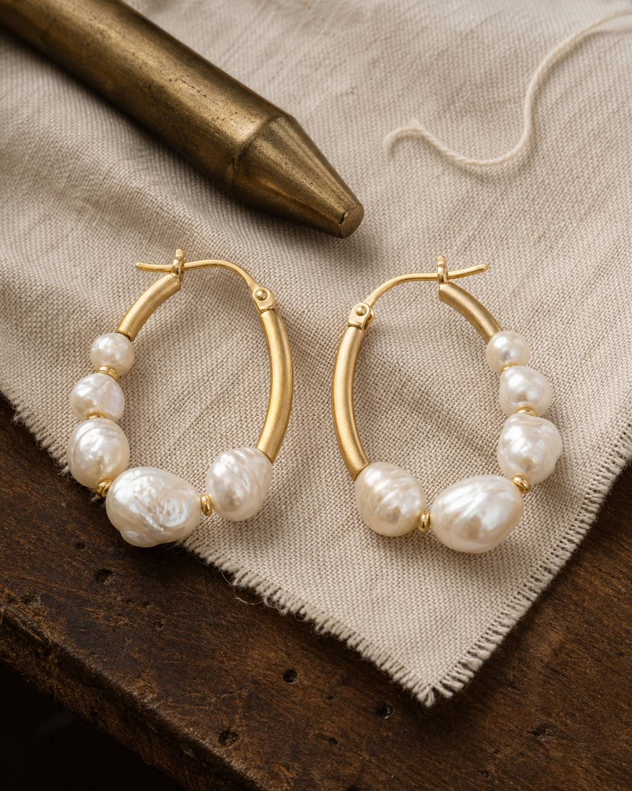

#### 详细信息

- **作者:** [Ecommerce GPT Image Prompts Studio](https://github.com/ecomimagelab)
- **来源:** 本仓库原创内容
- **发布日期:** 2026-07-23
- **语言:** en
- **适用平台:** Etsy
- **许可证:** CC-BY-4.0

<details>
<summary><strong>生产参数、商品保真项与溯源信息</strong></summary>

| 生成模式 | 商品行业 | 使用场景 | 宽高比 |
|---|---|---|---|
| `text-to-image` | 珠宝 | 细节与微距 | 4:5 |

- **视觉风格:** 高端奢华, 编辑大片, 手作质感
- **背景类型:** 天然材质
- **素材用途:** 商品副图
- **输入要求:** No reference image is required for this fictional unbranded product; use product-edit mode with owned source photography when adapting a real SKU.
- **商品保真项:**
  - Preserve the small satin-gold oval hoops and slim hinged posts.
  - Preserve five irregular ivory baroque pearls graduated from small to large on each earring.
- **负面约束:** No diamonds, gemstones, silver metal, round uniform beads, extra pearl, missing pearl, oversized hoop, dangling chain, mismatched pair, jewelry box branding, or pierced-ear distortion. No readable text, logo, trademark, watermark, duplicate product, broken geometry, cheap CGI, collage, or border.

**来源与版权**

- Generated specifically for this repository from the recorded standalone prompt; no third-party preview image is redistributed.
- Original prompt and generated previews created for this repository after visual-pattern and open-source workflow research; no external preview asset is included.
- [visual-research](docs/VISUAL_RESEARCH.md)
- [visual-research](https://github.com/buluslan/gpt-image2-ecommerce)
- [visual-research](https://github.com/motiful/product-shots)
- **平台规则状态:** Platform names identify intended visual treatment only; verify current listing and advertising requirements before publication.
- **商品系列:** [ec-0038](data/prompts/ec-0038-baroque-pearl-hoop-earrings-platform-set.json)

</details>

**[🚀 立即体验 →](https://www.pixpix.com/)**

---

<a id="prompt-ec-0038-instagram-adult-ear-portrait"></a>

### No. 99: 珠宝 — 巴洛克珍珠圈耳环多平台套图: INSTAGRAM ADULT EAR PORTRAIT

 

#### 描述

让同一对不对称金色珍珠圈耳环在商城白底、漆面奢华、工艺细节、成年模特美妆和 Pinterest 雕塑静物中保持一致。

**模特上身 · Instagram Shop · 5:8**

#### 提示词

```text
Use case: product-mockup.
Asset type: social creative for instagram shop.
Primary request: Create one ultra-photorealistic portrait 5:8 e-commerce image featuring exactly one matching pair of premium hoop earrings.
Product design: one fictional unbranded matching pair of small oval hoops in satin 18k-yellow-gold tone, each hoop carrying five irregular ivory baroque pearls graduated from small at the top to large at the bottom, with a slim hinged post and no stones.
Scene/backdrop: An adult woman with short dark hair wears the matching pair against a warm clay studio wall, styled with a plain black boat-neck top.
Composition/framing: Use a beauty close portrait from shoulders up with both ears visible through a slight head turn; keep the forward earring sharply readable and the second clearly matching.
Lighting/mood: Direct flash softened by warm side daylight, natural adult skin texture, restrained makeup, and glossy editorial contrast.
Materials/textures: Render soft satin gold, nacreous irregular pearl skins, tiny hinge construction, and realistic jewelry-scale reflections with physically believable surfaces, disciplined commercial retouching, fine natural microtexture, and premium photographic depth.
Product invariants: Preserve the same oval hoop diameter, five-pearl graduation on each earring, ivory nacre, satin-gold finish, and slim hinged posts.
Constraints: Show exactly two earrings and exactly five pearls on each earring unless a worn close crop naturally hides a rear pearl. Keep the product fully recognizable and commercially usable; use only fictional, unbranded design details.
Avoid: No child, extra piercing, other jewelry, covered earring, distorted ear, duplicated earring, branded clothing, or beauty text. No diamonds, gemstones, silver metal, round uniform beads, extra pearl, missing pearl, oversized hoop, dangling chain, mismatched pair, jewelry box branding, or pierced-ear distortion. No readable text, brand name, logo, trademark, watermark, duplicate product, broken geometry, cheap CGI, collage, split screen, frame, or border.
```

#### 生成预览图

##### 图片 1

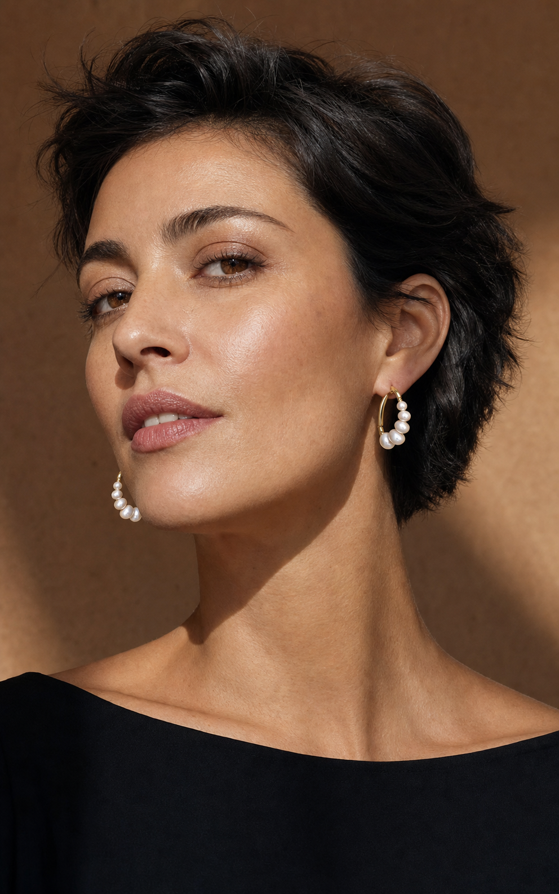

#### 详细信息

- **作者:** [Ecommerce GPT Image Prompts Studio](https://github.com/ecomimagelab)
- **来源:** 本仓库原创内容
- **发布日期:** 2026-07-23
- **语言:** en
- **适用平台:** Instagram Shop
- **许可证:** CC-BY-4.0

<details>
<summary><strong>生产参数、商品保真项与溯源信息</strong></summary>

| 生成模式 | 商品行业 | 使用场景 | 宽高比 |
|---|---|---|---|
| `text-to-image` | 珠宝 | 模特上身 | 5:8 |

- **视觉风格:** 高端奢华, 编辑大片, 手作质感
- **背景类型:** 生活方式实景
- **素材用途:** 社交创意
- **输入要求:** No reference image is required for this fictional unbranded product; use product-edit mode with owned source photography when adapting a real SKU.
- **商品保真项:**
  - Preserve the small satin-gold oval hoops and slim hinged posts.
  - Preserve five irregular ivory baroque pearls graduated from small to large on each earring.
- **负面约束:** No diamonds, gemstones, silver metal, round uniform beads, extra pearl, missing pearl, oversized hoop, dangling chain, mismatched pair, jewelry box branding, or pierced-ear distortion. No readable text, logo, trademark, watermark, duplicate product, broken geometry, cheap CGI, collage, or border.

**来源与版权**

- Generated specifically for this repository from the recorded standalone prompt; no third-party preview image is redistributed.
- Original prompt and generated previews created for this repository after visual-pattern and open-source workflow research; no external preview asset is included.
- [visual-research](docs/VISUAL_RESEARCH.md)
- [visual-research](https://github.com/buluslan/gpt-image2-ecommerce)
- [visual-research](https://github.com/motiful/product-shots)
- **平台规则状态:** Platform names identify intended visual treatment only; verify current listing and advertising requirements before publication.
- **商品系列:** [ec-0038](data/prompts/ec-0038-baroque-pearl-hoop-earrings-platform-set.json)

</details>

**[🚀 立即体验 →](https://www.pixpix.com/)**

---

<a id="prompt-ec-0038-pinterest-shell-sculpture"></a>

### No. 100: 珠宝 — 巴洛克珍珠圈耳环多平台套图: PINTEREST SHELL SCULPTURE

 

#### 描述

让同一对不对称金色珍珠圈耳环在商城白底、漆面奢华、工艺细节、成年模特美妆和 Pinterest 雕塑静物中保持一致。

**社交电商广告 · Pinterest · 5:8**

#### 提示词

```text
Use case: product-mockup.
Asset type: social creative for pinterest.
Primary request: Create one ultra-photorealistic portrait 5:8 e-commerce image featuring exactly one matching pair of premium hoop earrings.
Product design: one fictional unbranded matching pair of small oval hoops in satin 18k-yellow-gold tone, each hoop carrying five irregular ivory baroque pearls graduated from small at the top to large at the bottom, with a slim hinged post and no stones.
Scene/backdrop: Suspend the pair from two smooth cream shell-like ceramic curves against a split celadon and apricot paper set.
Composition/framing: Compose a save-worthy vertical still life with sweeping negative space, elegant asymmetry, and both earrings fully separated from the props.
Lighting/mood: Hard late-afternoon light, precise graphic shadows, pearly color separation, and a sophisticated editorial palette.
Materials/textures: Render soft satin gold, nacreous irregular pearl skins, tiny hinge construction, and realistic jewelry-scale reflections with physically believable surfaces, disciplined commercial retouching, fine natural microtexture, and premium photographic depth.
Product invariants: Preserve the same oval hoop diameter, five-pearl graduation on each earring, ivory nacre, satin-gold finish, and slim hinged posts.
Constraints: Show exactly two earrings and exactly five pearls on each earring unless a worn close crop naturally hides a rear pearl. Keep the product fully recognizable and commercially usable; use only fictional, unbranded design details.
Avoid: No real shell animal, sand, ocean cliché, text, flowers, extra pearl, or earring hidden behind a prop. No diamonds, gemstones, silver metal, round uniform beads, extra pearl, missing pearl, oversized hoop, dangling chain, mismatched pair, jewelry box branding, or pierced-ear distortion. No readable text, brand name, logo, trademark, watermark, duplicate product, broken geometry, cheap CGI, collage, split screen, frame, or border.
```

#### 生成预览图

##### 图片 1

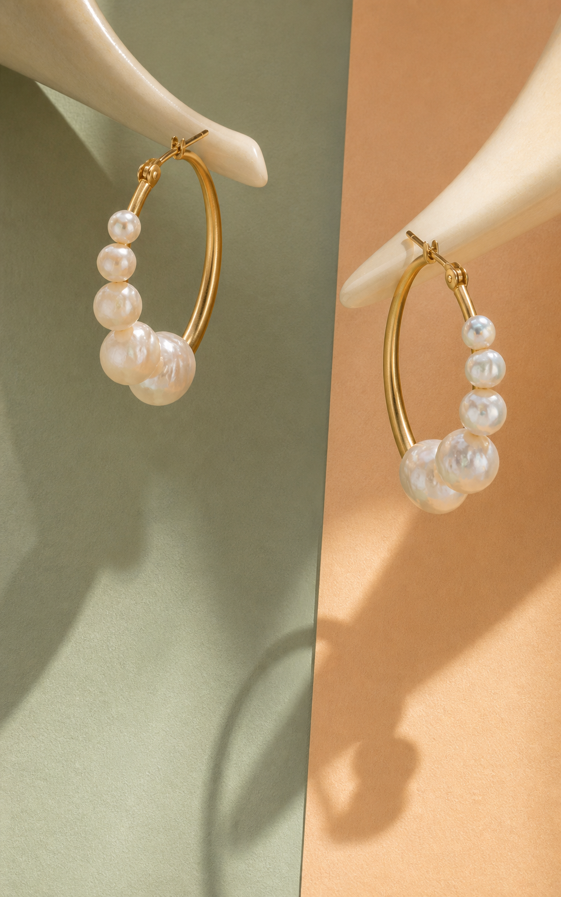

#### 详细信息

- **作者:** [Ecommerce GPT Image Prompts Studio](https://github.com/ecomimagelab)
- **来源:** 本仓库原创内容
- **发布日期:** 2026-07-23
- **语言:** en
- **适用平台:** Pinterest
- **许可证:** CC-BY-4.0

<details>
<summary><strong>生产参数、商品保真项与溯源信息</strong></summary>

| 生成模式 | 商品行业 | 使用场景 | 宽高比 |
|---|---|---|---|
| `text-to-image` | 珠宝 | 社交电商广告 | 5:8 |

- **视觉风格:** 高端奢华, 编辑大片, 手作质感
- **背景类型:** 图形化布景
- **素材用途:** 社交创意
- **输入要求:** No reference image is required for this fictional unbranded product; use product-edit mode with owned source photography when adapting a real SKU.
- **商品保真项:**
  - Preserve the small satin-gold oval hoops and slim hinged posts.
  - Preserve five irregular ivory baroque pearls graduated from small to large on each earring.
- **负面约束:** No diamonds, gemstones, silver metal, round uniform beads, extra pearl, missing pearl, oversized hoop, dangling chain, mismatched pair, jewelry box branding, or pierced-ear distortion. No readable text, logo, trademark, watermark, duplicate product, broken geometry, cheap CGI, collage, or border.

**来源与版权**

- Generated specifically for this repository from the recorded standalone prompt; no third-party preview image is redistributed.
- Original prompt and generated previews created for this repository after visual-pattern and open-source workflow research; no external preview asset is included.
- [visual-research](docs/VISUAL_RESEARCH.md)
- [visual-research](https://github.com/buluslan/gpt-image2-ecommerce)
- [visual-research](https://github.com/motiful/product-shots)
- **平台规则状态:** Platform names identify intended visual treatment only; verify current listing and advertising requirements before publication.
- **商品系列:** [ec-0038](data/prompts/ec-0038-baroque-pearl-hoop-earrings-platform-set.json)

</details>

**[🚀 立即体验 →](https://www.pixpix.com/)**

---

<a id="prompt-ec-0037-amazon-sports-mat-main"></a>

### No. 101: 健身与健康生活 — 云杉绿软木瑜伽垫多平台套图: AMAZON SPORTS MAT MAIN

 

#### 描述

让同一张云杉绿天然橡胶瑜伽垫在白底零售、建筑康养、动感训练、安静居家练习和沙漠 Pinterest 旅修中保持一致。

**平台主图 · Amazon Sports · 4:5**

#### 提示词

```text
Create one ultra-photorealistic portrait 4:5 Amazon Sports main image of exactly one premium yoga mat and its carry strap. Product design: one fictional unbranded premium yoga mat with a deep spruce-green natural-rubber top, fine diagonal anti-slip microtexture, a thin burnt-orange double-line geometry near each short end with no letters, a warm natural-cork underside, and one detachable charcoal woven carry strap with a single orange bar-tack stitch. Roll two-thirds of the mat into a clean cylinder while leaving one short section unfurled to reveal the spruce top, orange line geometry, and a narrow curl of cork underside; wrap the charcoal strap loosely around the roll. Center the complete product on seamless pure #FFFFFF with about 76% frame fill and every material clearly visible. Use broad high-key softboxes, restrained rubber and cork texture, and a natural soft grounding shadow. Render physically believable materials, disciplined commercial retouching, natural microtexture, and a premium photographic finish. Keep the product identity exact: the same spruce rubber top, diagonal grip, orange end geometry, cork underside, and charcoal strap with one orange bar tack. No brand word, logo, alignment marks with letters, extra mat, foam texture, changed color, missing cork, extra strap, unsafe pose, person, blocks, bottle, towel, packaging, levitating roll, readable text, logo, trademark, watermark, duplicate product, broken geometry, cheap CGI, collage, split screen, frame, or border.
```

#### 生成预览图

##### 图片 1

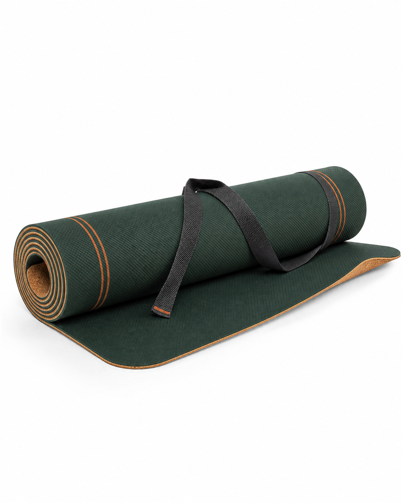

#### 详细信息

- **作者:** [Ecommerce GPT Image Prompts Studio](https://github.com/ecomimagelab)
- **来源:** 本仓库原创内容
- **发布日期:** 2026-07-22
- **语言:** en
- **适用平台:** Amazon Sports
- **许可证:** CC-BY-4.0

<details>
<summary><strong>生产参数、商品保真项与溯源信息</strong></summary>

| 生成模式 | 商品行业 | 使用场景 | 宽高比 |
|---|---|---|---|
| `text-to-image` | 健身与健康生活 | 平台主图 | 4:5 |

- **视觉风格:** 建筑感, 静谧生活, 户外机能
- **背景类型:** 纯白背景
- **素材用途:** 平台主图
- **输入要求:** No reference image is required for this fictional unbranded product; use product-edit mode with owned source photography when adapting a real SKU.
- **商品保真项:**
  - Preserve the deep spruce rubber top, diagonal grip microtexture, and thin burnt-orange double-line geometry near both short ends.
  - Preserve the warm cork underside and detachable charcoal woven strap with one orange bar-tack stitch.
- **负面约束:** No brand word, logo, alignment marks with letters, extra mat, foam texture, changed color, missing cork, extra strap, unsafe pose, readable text, logos, watermark, duplicate product, broken geometry, cheap CGI, collage, or border.

**来源与版权**

- Generated specifically for this repository from the recorded standalone prompt; no third-party preview image is redistributed.
- Original prompt and generated previews created for this repository after Pinterest pattern and open-source workflow research; no external preview asset is included.
- [visual-research](docs/VISUAL_RESEARCH.md)
- [visual-research](https://github.com/buluslan/gpt-image2-ecommerce)
- [visual-research](https://github.com/motiful/product-shots)
- **平台规则状态:** Platform names identify intended visual treatment only; verify current listing and advertising requirements before publication.
- **商品系列:** [ec-0037](data/prompts/ec-0037-spruce-cork-yoga-mat-platform-set.json)

</details>

**[🚀 立即体验 →](https://www.pixpix.com/)**

---

<a id="prompt-ec-0037-shopify-architectural-studio"></a>

### No. 102: 健身与健康生活 — 云杉绿软木瑜伽垫多平台套图: SHOPIFY ARCHITECTURAL STUDIO

 

#### 描述

让同一张云杉绿天然橡胶瑜伽垫在白底零售、建筑康养、动感训练、安静居家练习和沙漠 Pinterest 旅修中保持一致。

**品牌首图 · Shopify · 5:8**

#### 提示词

```text
Create one ultra-photorealistic portrait 5:8 Shopify wellness hero featuring exactly one premium yoga mat. Product design: one fictional unbranded premium yoga mat with a deep spruce-green natural-rubber top, fine diagonal anti-slip microtexture, a thin burnt-orange double-line geometry near each short end with no letters, a warm natural-cork underside, and one detachable charcoal woven carry strap with a single orange bar-tack stitch. Unroll the mat fully on pale limestone in a quiet vaulted studio with warm-ivory limewash walls and one tall arched window; place the folded charcoal strap beyond the top edge of the mat. Use a low diagonal wide view that shows both orange end geometries, spruce texture, a slim cork edge, realistic scale, and generous vertical architecture. Use soft morning sun, long curved shadows, calm warm bounce, and natural material contrast. Render physically believable materials, disciplined commercial retouching, natural microtexture, and a premium photographic finish. Keep the product identity exact: the same spruce rubber top, diagonal grip, orange end geometry, cork underside, and charcoal strap with one orange bar tack. No brand word, logo, alignment marks with letters, extra mat, foam texture, changed color, missing cork, extra strap, unsafe pose, person, yoga props, plants, mirrors, impossible oversized mat, readable text, logo, trademark, watermark, duplicate product, broken geometry, cheap CGI, collage, split screen, frame, or border.
```

#### 生成预览图

##### 图片 1

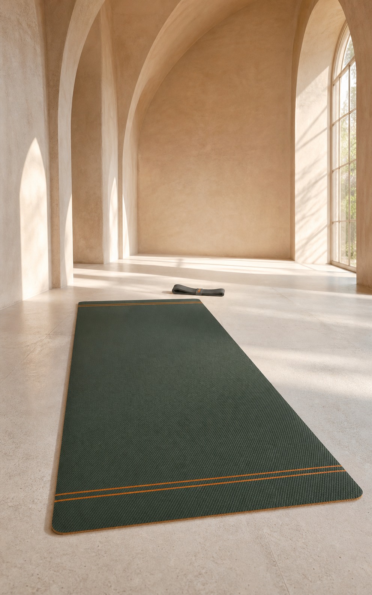

#### 详细信息

- **作者:** [Ecommerce GPT Image Prompts Studio](https://github.com/ecomimagelab)
- **来源:** 本仓库原创内容
- **发布日期:** 2026-07-22
- **语言:** en
- **适用平台:** Shopify
- **许可证:** CC-BY-4.0

<details>
<summary><strong>生产参数、商品保真项与溯源信息</strong></summary>

| 生成模式 | 商品行业 | 使用场景 | 宽高比 |
|---|---|---|---|
| `text-to-image` | 健身与健康生活 | 品牌首图 | 5:8 |

- **视觉风格:** 建筑感, 静谧生活, 户外机能
- **背景类型:** 家居空间
- **素材用途:** 品牌首图
- **输入要求:** No reference image is required for this fictional unbranded product; use product-edit mode with owned source photography when adapting a real SKU.
- **商品保真项:**
  - Preserve the deep spruce rubber top, diagonal grip microtexture, and thin burnt-orange double-line geometry near both short ends.
  - Preserve the warm cork underside and detachable charcoal woven strap with one orange bar-tack stitch.
- **负面约束:** No brand word, logo, alignment marks with letters, extra mat, foam texture, changed color, missing cork, extra strap, unsafe pose, readable text, logos, watermark, duplicate product, broken geometry, cheap CGI, collage, or border.

**来源与版权**

- Generated specifically for this repository from the recorded standalone prompt; no third-party preview image is redistributed.
- Original prompt and generated previews created for this repository after Pinterest pattern and open-source workflow research; no external preview asset is included.
- [visual-research](docs/VISUAL_RESEARCH.md)
- [visual-research](https://github.com/buluslan/gpt-image2-ecommerce)
- [visual-research](https://github.com/motiful/product-shots)
- **平台规则状态:** Platform names identify intended visual treatment only; verify current listing and advertising requirements before publication.
- **商品系列:** [ec-0037](data/prompts/ec-0037-spruce-cork-yoga-mat-platform-set.json)

</details>

**[🚀 立即体验 →](https://www.pixpix.com/)**

---

<a id="prompt-ec-0037-tiktok-power-flow"></a>

### No. 103: 健身与健康生活 — 云杉绿软木瑜伽垫多平台套图: TIKTOK SHOP POWER FLOW

 

#### 描述

让同一张云杉绿天然橡胶瑜伽垫在白底零售、建筑康养、动感训练、安静居家练习和沙漠 Pinterest 旅修中保持一致。

**模特上身 · TikTok Shop · 5:8**

#### 提示词

```text
Create one energetic ultra-photorealistic portrait 5:8 TikTok Shop fitness frame featuring exactly one premium yoga mat and one adult practitioner. Product design: one fictional unbranded premium yoga mat with a deep spruce-green natural-rubber top, fine diagonal anti-slip microtexture, a thin burnt-orange double-line geometry near each short end with no letters, a warm natural-cork underside, and one detachable charcoal woven carry strap with a single orange bar-tack stitch. An athletic adult woman performs a stable high lunge on the fully unrolled mat in a raw concrete studio, wearing a plain cobalt training set; the carry strap rests beyond the mat. Use a low wide-angle view showing her complete safe pose, the mat's full width, both orange end lines, spruce grip, and a cork edge without product obstruction. Use direct flash mixed with hard side sunlight, a clean moving shadow, natural skin texture, and strong creator energy. Render physically believable materials, disciplined commercial retouching, natural microtexture, and a premium photographic finish. Keep the product identity exact: the same spruce rubber top, diagonal grip, orange end geometry, cork underside, and charcoal strap with one orange bar tack. No brand word, logo, alignment marks with letters, extra mat, foam texture, changed color, missing cork, extra strap, unsafe pose, extreme flexibility, unsafe balance, extra person, logo clothing, distorted limbs, readable text, logo, trademark, watermark, duplicate product, broken geometry, cheap CGI, collage, split screen, frame, or border.
```

#### 生成预览图

##### 图片 1

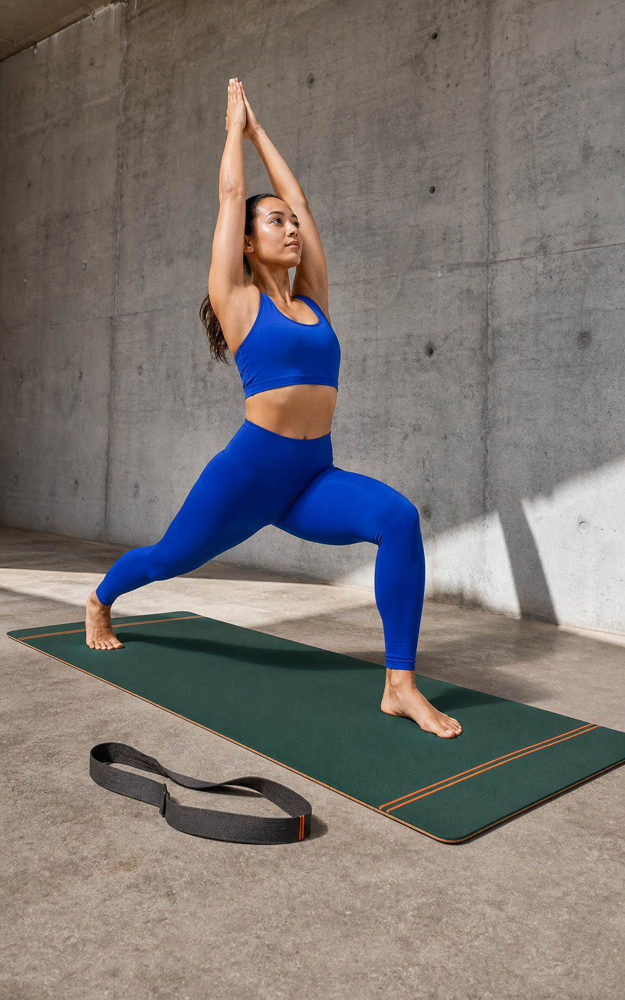

#### 详细信息

- **作者:** [Ecommerce GPT Image Prompts Studio](https://github.com/ecomimagelab)
- **来源:** 本仓库原创内容
- **发布日期:** 2026-07-22
- **语言:** en
- **适用平台:** TikTok Shop
- **许可证:** CC-BY-4.0

<details>
<summary><strong>生产参数、商品保真项与溯源信息</strong></summary>

| 生成模式 | 商品行业 | 使用场景 | 宽高比 |
|---|---|---|---|
| `text-to-image` | 健身与健康生活 | 模特上身 | 5:8 |

- **视觉风格:** 建筑感, 静谧生活, 户外机能
- **背景类型:** 生活方式实景
- **素材用途:** 社交创意
- **输入要求:** No reference image is required for this fictional unbranded product; use product-edit mode with owned source photography when adapting a real SKU.
- **商品保真项:**
  - Preserve the deep spruce rubber top, diagonal grip microtexture, and thin burnt-orange double-line geometry near both short ends.
  - Preserve the warm cork underside and detachable charcoal woven strap with one orange bar-tack stitch.
- **负面约束:** No brand word, logo, alignment marks with letters, extra mat, foam texture, changed color, missing cork, extra strap, unsafe pose, readable text, logos, watermark, duplicate product, broken geometry, cheap CGI, collage, or border.

**来源与版权**

- Generated specifically for this repository from the recorded standalone prompt; no third-party preview image is redistributed.
- Original prompt and generated previews created for this repository after Pinterest pattern and open-source workflow research; no external preview asset is included.
- [visual-research](docs/VISUAL_RESEARCH.md)
- [visual-research](https://github.com/buluslan/gpt-image2-ecommerce)
- [visual-research](https://github.com/motiful/product-shots)
- **平台规则状态:** Platform names identify intended visual treatment only; verify current listing and advertising requirements before publication.
- **商品系列:** [ec-0037](data/prompts/ec-0037-spruce-cork-yoga-mat-platform-set.json)

</details>

**[🚀 立即体验 →](https://www.pixpix.com/)**

---

<a id="prompt-ec-0037-xiaohongshu-sunrise-stretch"></a>

### No. 104: 健身与健康生活 — 云杉绿软木瑜伽垫多平台套图: XIAOHONGSHU SUNRISE STRETCH

 

#### 描述

让同一张云杉绿天然橡胶瑜伽垫在白底零售、建筑康养、动感训练、安静居家练习和沙漠 Pinterest 旅修中保持一致。

**生活方式场景 · 小红书 · 4:5**

#### 提示词

```text
Create one calm ultra-photorealistic portrait 4:5 Xiaohongshu home-wellness image featuring exactly one premium yoga mat and one adult practitioner. Product design: one fictional unbranded premium yoga mat with a deep spruce-green natural-rubber top, fine diagonal anti-slip microtexture, a thin burnt-orange double-line geometry near each short end with no letters, a warm natural-cork underside, and one detachable charcoal woven carry strap with a single orange bar-tack stitch. An adult East Asian woman in a loose ivory tee and clay-colored leggings sits in a simple side stretch on the fully unrolled mat beside a large apartment window; place one plain ceramic cup far behind. Use an intimate eye-level crop with her complete torso and arms, safe natural anatomy, both orange mat lines, spruce texture, and the cork edge visible. Use pale sunrise light, soft peach wall reflection, gentle direct-flash lift, and truthful quiet-morning texture. Render physically believable materials, disciplined commercial retouching, natural microtexture, and a premium photographic finish. Keep the product identity exact: the same spruce rubber top, diagonal grip, orange end geometry, cork underside, and charcoal strap with one orange bar tack. No brand word, logo, alignment marks with letters, extra mat, foam texture, changed color, missing cork, extra strap, unsafe pose, bedroom clutter, incense smoke, extra mat, brand clothing, distorted hands, readable text, logo, trademark, watermark, duplicate product, broken geometry, cheap CGI, collage, split screen, frame, or border.
```

#### 生成预览图

##### 图片 1

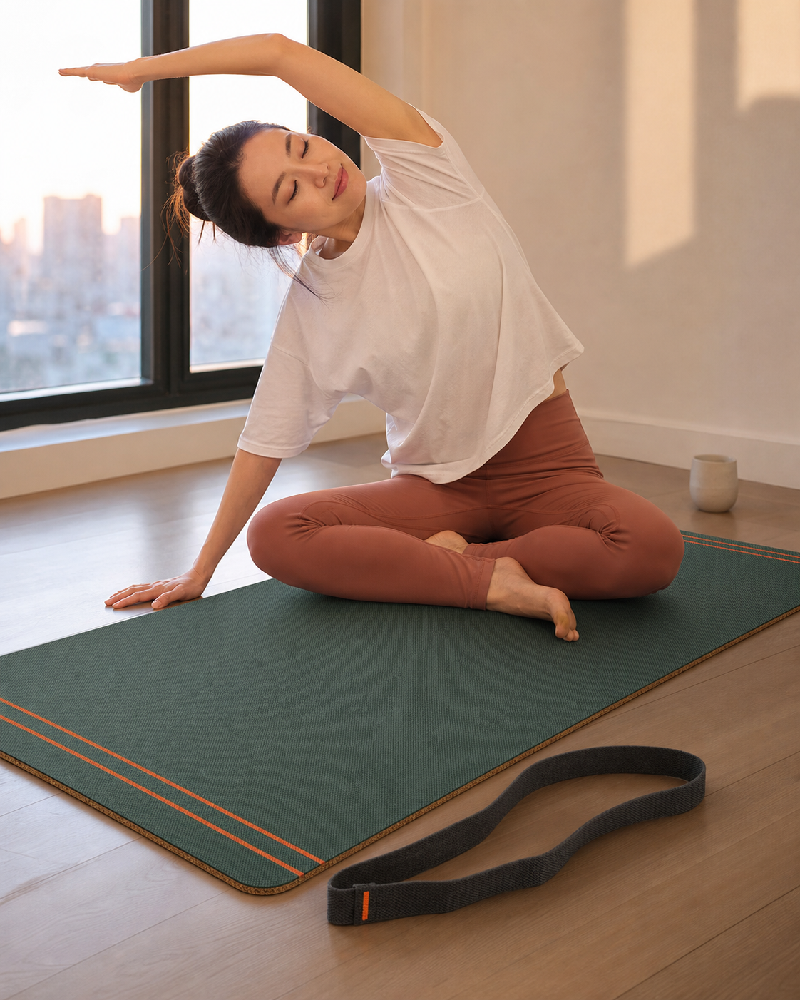

#### 详细信息

- **作者:** [Ecommerce GPT Image Prompts Studio](https://github.com/ecomimagelab)
- **来源:** 本仓库原创内容
- **发布日期:** 2026-07-22
- **语言:** en
- **适用平台:** 小红书
- **许可证:** CC-BY-4.0

<details>
<summary><strong>生产参数、商品保真项与溯源信息</strong></summary>

| 生成模式 | 商品行业 | 使用场景 | 宽高比 |
|---|---|---|---|
| `text-to-image` | 健身与健康生活 | 生活方式场景 | 4:5 |

- **视觉风格:** 建筑感, 静谧生活, 户外机能
- **背景类型:** 家居空间
- **素材用途:** 社交创意
- **输入要求:** No reference image is required for this fictional unbranded product; use product-edit mode with owned source photography when adapting a real SKU.
- **商品保真项:**
  - Preserve the deep spruce rubber top, diagonal grip microtexture, and thin burnt-orange double-line geometry near both short ends.
  - Preserve the warm cork underside and detachable charcoal woven strap with one orange bar-tack stitch.
- **负面约束:** No brand word, logo, alignment marks with letters, extra mat, foam texture, changed color, missing cork, extra strap, unsafe pose, readable text, logos, watermark, duplicate product, broken geometry, cheap CGI, collage, or border.

**来源与版权**

- Generated specifically for this repository from the recorded standalone prompt; no third-party preview image is redistributed.
- Original prompt and generated previews created for this repository after Pinterest pattern and open-source workflow research; no external preview asset is included.
- [visual-research](docs/VISUAL_RESEARCH.md)
- [visual-research](https://github.com/buluslan/gpt-image2-ecommerce)
- [visual-research](https://github.com/motiful/product-shots)
- **平台规则状态:** Platform names identify intended visual treatment only; verify current listing and advertising requirements before publication.
- **商品系列:** [ec-0037](data/prompts/ec-0037-spruce-cork-yoga-mat-platform-set.json)

</details>

**[🚀 立即体验 →](https://www.pixpix.com/)**

---

<a id="prompt-ec-0037-pinterest-desert-retreat"></a>

### No. 105: 健身与健康生活 — 云杉绿软木瑜伽垫多平台套图: PINTEREST DESERT RETREAT

 

#### 描述

让同一张云杉绿天然橡胶瑜伽垫在白底零售、建筑康养、动感训练、安静居家练习和沙漠 Pinterest 旅修中保持一致。

**社交电商广告 · Pinterest · 5:8**

#### 提示词

```text
Create one save-worthy ultra-photorealistic portrait 5:8 Pinterest wellness-retreat image featuring exactly one premium yoga mat. Product design: one fictional unbranded premium yoga mat with a deep spruce-green natural-rubber top, fine diagonal anti-slip microtexture, a thin burnt-orange double-line geometry near each short end with no letters, a warm natural-cork underside, and one detachable charcoal woven carry strap with a single orange bar-tack stitch. Unroll the empty mat across a flat honed-travertine terrace overlooking soft ochre desert hills at first light; coil the charcoal strap near one corner and add no person or prop. Use a slightly elevated long-lens view showing the complete mat, both orange end lines, spruce surface, cork edge, and vast layered landscape. Use low golden sunrise, cool lavender shadows, crisp natural textures, and quiet aspirational travel color. Render physically believable materials, disciplined commercial retouching, natural microtexture, and a premium photographic finish. Keep the product identity exact: the same spruce rubber top, diagonal grip, orange end geometry, cork underside, and charcoal strap with one orange bar tack. No brand word, logo, alignment marks with letters, extra mat, foam texture, changed color, missing cork, extra strap, unsafe pose, cactus touching mat, pool, person, bottle, dramatic sun flare, floating mat, readable text, logo, trademark, watermark, duplicate product, broken geometry, cheap CGI, collage, split screen, frame, or border.
```

#### 生成预览图

##### 图片 1

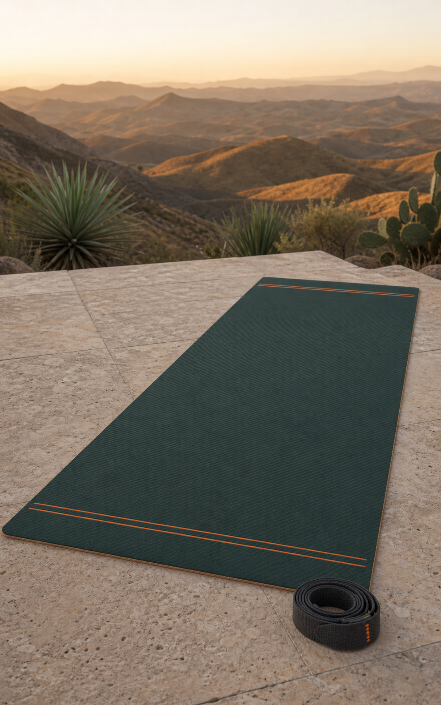

#### 详细信息

- **作者:** [Ecommerce GPT Image Prompts Studio](https://github.com/ecomimagelab)
- **来源:** 本仓库原创内容
- **发布日期:** 2026-07-22
- **语言:** en
- **适用平台:** Pinterest
- **许可证:** CC-BY-4.0

<details>
<summary><strong>生产参数、商品保真项与溯源信息</strong></summary>

| 生成模式 | 商品行业 | 使用场景 | 宽高比 |
|---|---|---|---|
| `text-to-image` | 健身与健康生活 | 社交电商广告 | 5:8 |

- **视觉风格:** 建筑感, 静谧生活, 户外机能
- **背景类型:** 户外实景
- **素材用途:** 社交创意
- **输入要求:** No reference image is required for this fictional unbranded product; use product-edit mode with owned source photography when adapting a real SKU.
- **商品保真项:**
  - Preserve the deep spruce rubber top, diagonal grip microtexture, and thin burnt-orange double-line geometry near both short ends.
  - Preserve the warm cork underside and detachable charcoal woven strap with one orange bar-tack stitch.
- **负面约束:** No brand word, logo, alignment marks with letters, extra mat, foam texture, changed color, missing cork, extra strap, unsafe pose, readable text, logos, watermark, duplicate product, broken geometry, cheap CGI, collage, or border.

**来源与版权**

- Generated specifically for this repository from the recorded standalone prompt; no third-party preview image is redistributed.
- Original prompt and generated previews created for this repository after Pinterest pattern and open-source workflow research; no external preview asset is included.
- [visual-research](docs/VISUAL_RESEARCH.md)
- [visual-research](https://github.com/buluslan/gpt-image2-ecommerce)
- [visual-research](https://github.com/motiful/product-shots)
- **平台规则状态:** Platform names identify intended visual treatment only; verify current listing and advertising requirements before publication.
- **商品系列:** [ec-0037](data/prompts/ec-0037-spruce-cork-yoga-mat-platform-set.json)

</details>

**[🚀 立即体验 →](https://www.pixpix.com/)**

---

<a id="prompt-ec-0036-amazon-home-candle-main"></a>

### No. 106: 家居与家具 — 烟梅色香薰蜡烛多平台套图: AMAZON HOME CANDLE MAIN

 

#### 描述

围绕同一只烟梅色三芯蜡烛构建白底零售、手工灌蜡、暗调 SPA、闪光晚宴和 Pinterest 色块艺术。

**平台主图 · Amazon Home · 4:5**

#### 提示词

```text
Create one ultra-photorealistic portrait 4:5 Amazon Home main image of exactly one premium candle and its matching lid. Product design: one fictional unbranded wide cylindrical hand-blown candle vessel in translucent smoky-plum glass with a thick rounded clear-plum foot, smooth warm-ivory wax, exactly three evenly spaced cotton wicks, and one removable flat matte-champagne metal lid with a centered circular oxblood enamel inset; no label. Place the unlit candle upright on seamless pure #FFFFFF with all three clean wicks visible; lean the matching lid beside it with the oxblood inset facing camera. Use a centered front three-quarter view, show the complete vessel, foot, wax surface, and lid, and fill about 76% of frame. Use broad high-key softboxes, controlled plum-glass refraction, a clean metal highlight, and restrained grounding shadows. Render physically believable materials, disciplined commercial retouching, natural microtexture, and a premium photographic finish. Keep the product identity exact: the same wide smoky-plum vessel, thick rounded foot, ivory wax, three-wick layout, and champagne lid with centered oxblood inset. No label, readable text, logo, single wick, four wicks, colored wax, extra candle, deformed glass, soot-black vessel, unsafe flame, flame, packaging, matches, flowers, duplicate lid, wax spill, readable text, logo, trademark, watermark, duplicate product, broken geometry, cheap CGI, collage, split screen, frame, or border.
```

#### 生成预览图

##### 图片 1

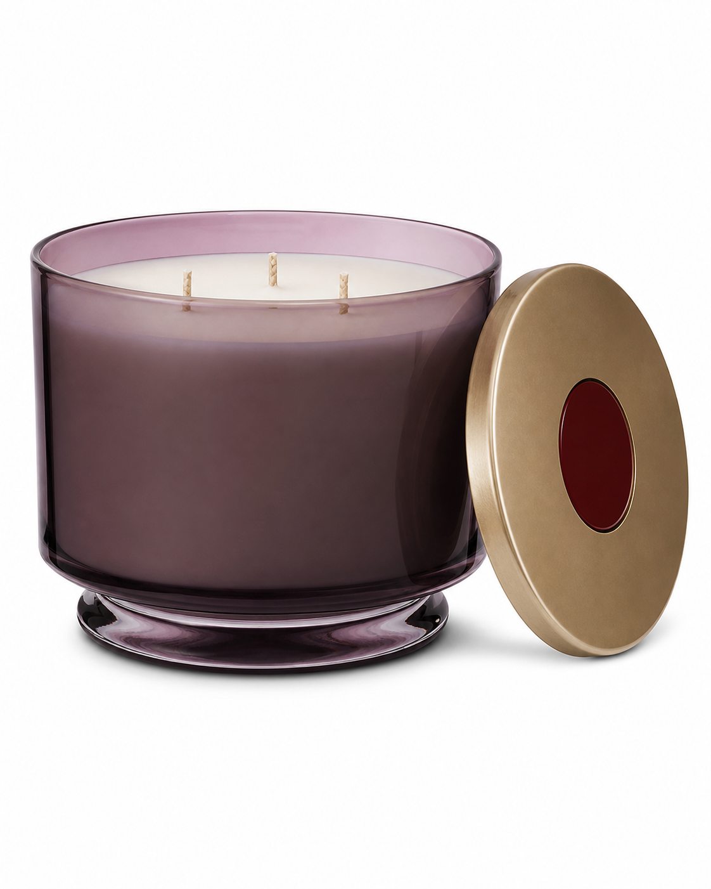

#### 详细信息

- **作者:** [Ecommerce GPT Image Prompts Studio](https://github.com/ecomimagelab)
- **来源:** 本仓库原创内容
- **发布日期:** 2026-07-22
- **语言:** en
- **适用平台:** Amazon Home
- **许可证:** CC-BY-4.0

<details>
<summary><strong>生产参数、商品保真项与溯源信息</strong></summary>

| 生成模式 | 商品行业 | 使用场景 | 宽高比 |
|---|---|---|---|
| `text-to-image` | 家居与家具 | 平台主图 | 4:5 |

- **视觉风格:** 手作质感, 暗调氛围, 明亮活泼
- **背景类型:** 纯白背景
- **素材用途:** 平台主图
- **输入要求:** No reference image is required for this fictional unbranded product; use product-edit mode with owned source photography when adapting a real SKU.
- **商品保真项:**
  - Preserve the wide smoky-plum hand-blown glass cylinder, thick rounded clear-plum foot, and smooth ivory wax with exactly three cotton wicks.
  - Preserve the flat matte-champagne lid with one centered circular oxblood enamel inset and no label.
- **负面约束:** No label, readable text, logo, single wick, four wicks, colored wax, extra candle, deformed glass, soot-black vessel, unsafe flame, readable text, logos, watermark, duplicate product, broken geometry, cheap CGI, collage, or border.

**来源与版权**

- Generated specifically for this repository from the recorded standalone prompt; no third-party preview image is redistributed.
- Original prompt and generated previews created for this repository after Pinterest pattern and open-source workflow research; no external preview asset is included.
- [visual-research](docs/VISUAL_RESEARCH.md)
- [visual-research](https://github.com/buluslan/gpt-image2-ecommerce)
- [visual-research](https://github.com/motiful/product-shots)
- **平台规则状态:** Platform names identify intended visual treatment only; verify current listing and advertising requirements before publication.
- **商品系列:** [ec-0036](data/prompts/ec-0036-smoky-plum-candle-platform-set.json)

</details>

**[🚀 立即体验 →](https://www.pixpix.com/)**

---

<a id="prompt-ec-0036-etsy-hand-poured-detail"></a>

### No. 107: 家居与家具 — 烟梅色香薰蜡烛多平台套图: ETSY HAND-POURED DETAIL

 

#### 描述

围绕同一只烟梅色三芯蜡烛构建白底零售、手工灌蜡、暗调 SPA、闪光晚宴和 Pinterest 色块艺术。

**细节与微距 · Etsy · 5:8**

#### 提示词

```text
Create one tactile ultra-photorealistic portrait 5:8 Etsy maker-story photograph of exactly one finished premium candle and its lid. Product design: one fictional unbranded wide cylindrical hand-blown candle vessel in translucent smoky-plum glass with a thick rounded clear-plum foot, smooth warm-ivory wax, exactly three evenly spaced cotton wicks, and one removable flat matte-champagne metal lid with a centered circular oxblood enamel inset; no label. Set the unlit candle on a worn maple pouring bench with the lid flat behind it, one folded flax cloth, and a tiny ivory wax shaving far to the side. Use a close elevated three-quarter view showing the three centered wicks, smooth wax, hand-blown glass variation, thick foot, lid inset, and honest craft details. Use warm north-window light, a cool glass rim, and nuanced wood, linen, wax, glass, and metal texture. Render physically believable materials, disciplined commercial retouching, natural microtexture, and a premium photographic finish. Keep the product identity exact: the same wide smoky-plum vessel, thick rounded foot, ivory wax, three-wick layout, and champagne lid with centered oxblood inset. No label, readable text, logo, single wick, four wicks, colored wax, extra candle, deformed glass, soot-black vessel, unsafe flame, pouring pot, liquid wax, human, extra vessel, messy workshop, readable text, logo, trademark, watermark, duplicate product, broken geometry, cheap CGI, collage, split screen, frame, or border.
```

#### 生成预览图

##### 图片 1

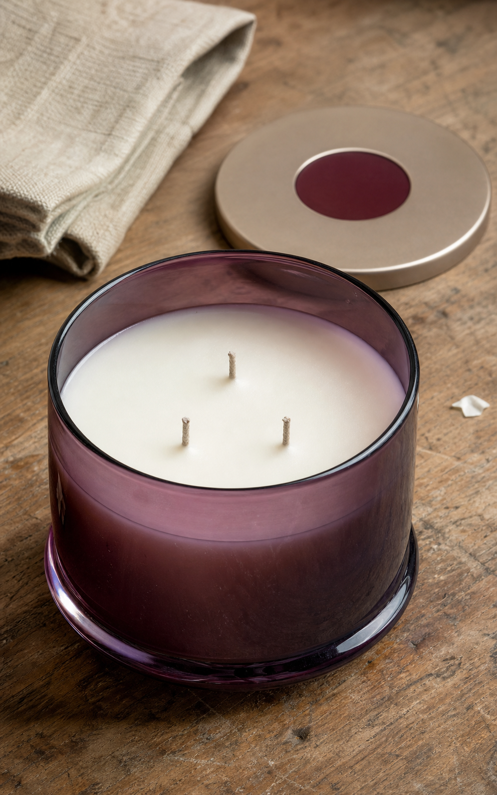

#### 详细信息

- **作者:** [Ecommerce GPT Image Prompts Studio](https://github.com/ecomimagelab)
- **来源:** 本仓库原创内容
- **发布日期:** 2026-07-22
- **语言:** en
- **适用平台:** Etsy
- **许可证:** CC-BY-4.0

<details>
<summary><strong>生产参数、商品保真项与溯源信息</strong></summary>

| 生成模式 | 商品行业 | 使用场景 | 宽高比 |
|---|---|---|---|
| `text-to-image` | 家居与家具 | 细节与微距 | 5:8 |

- **视觉风格:** 手作质感, 暗调氛围, 明亮活泼
- **背景类型:** 天然材质
- **素材用途:** 商品副图
- **输入要求:** No reference image is required for this fictional unbranded product; use product-edit mode with owned source photography when adapting a real SKU.
- **商品保真项:**
  - Preserve the wide smoky-plum hand-blown glass cylinder, thick rounded clear-plum foot, and smooth ivory wax with exactly three cotton wicks.
  - Preserve the flat matte-champagne lid with one centered circular oxblood enamel inset and no label.
- **负面约束:** No label, readable text, logo, single wick, four wicks, colored wax, extra candle, deformed glass, soot-black vessel, unsafe flame, readable text, logos, watermark, duplicate product, broken geometry, cheap CGI, collage, or border.

**来源与版权**

- Generated specifically for this repository from the recorded standalone prompt; no third-party preview image is redistributed.
- Original prompt and generated previews created for this repository after Pinterest pattern and open-source workflow research; no external preview asset is included.
- [visual-research](docs/VISUAL_RESEARCH.md)
- [visual-research](https://github.com/buluslan/gpt-image2-ecommerce)
- [visual-research](https://github.com/motiful/product-shots)
- **平台规则状态:** Platform names identify intended visual treatment only; verify current listing and advertising requirements before publication.
- **商品系列:** [ec-0036](data/prompts/ec-0036-smoky-plum-candle-platform-set.json)

</details>

**[🚀 立即体验 →](https://www.pixpix.com/)**

---

<a id="prompt-ec-0036-shopify-midnight-spa"></a>

### No. 108: 家居与家具 — 烟梅色香薰蜡烛多平台套图: SHOPIFY MIDNIGHT SPA

 

#### 描述

围绕同一只烟梅色三芯蜡烛构建白底零售、手工灌蜡、暗调 SPA、闪光晚宴和 Pinterest 色块艺术。

**品牌首图 · Shopify · 5:8**

#### 提示词

```text
Create one cinematic ultra-photorealistic portrait 5:8 Shopify home-fragrance hero featuring exactly one premium candle. Product design: one fictional unbranded wide cylindrical hand-blown candle vessel in translucent smoky-plum glass with a thick rounded clear-plum foot, smooth warm-ivory wax, exactly three evenly spaced cotton wicks, and one removable flat matte-champagne metal lid with a centered circular oxblood enamel inset; no label. Light all three wicks and place the candle on a honed charcoal-stone shelf against a midnight aubergine plaster wall; rest the closed lid behind the vessel and add no other product. Use a low intimate three-quarter angle with the complete candle and lid visible, a controlled reflection, and deep negative space. Balance the three warm flames with a cool violet edge and subtle reflected glow through smoky-plum glass, retaining detail without heavy haze. Render physically believable materials, disciplined commercial retouching, natural microtexture, and a premium photographic finish. Keep the product identity exact: the same wide smoky-plum vessel, thick rounded foot, ivory wax, three-wick layout, and champagne lid with centered oxblood inset. No label, readable text, logo, single wick, four wicks, colored wax, extra candle, deformed glass, soot-black vessel, unsafe flame, bath tub, towel stack, flowers, smoke plume, overexposed flames, readable text, logo, trademark, watermark, duplicate product, broken geometry, cheap CGI, collage, split screen, frame, or border.
```

#### 生成预览图

##### 图片 1

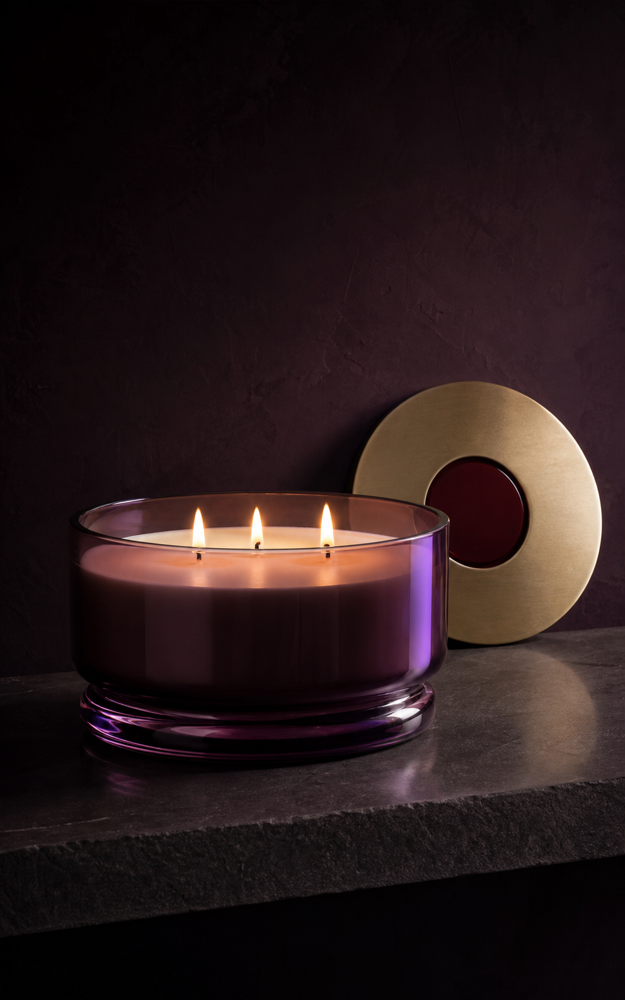

#### 详细信息

- **作者:** [Ecommerce GPT Image Prompts Studio](https://github.com/ecomimagelab)
- **来源:** 本仓库原创内容
- **发布日期:** 2026-07-22
- **语言:** en
- **适用平台:** Shopify
- **许可证:** CC-BY-4.0

<details>
<summary><strong>生产参数、商品保真项与溯源信息</strong></summary>

| 生成模式 | 商品行业 | 使用场景 | 宽高比 |
|---|---|---|---|
| `text-to-image` | 家居与家具 | 品牌首图 | 5:8 |

- **视觉风格:** 手作质感, 暗调氛围, 明亮活泼
- **背景类型:** 暗调影棚
- **素材用途:** 品牌首图
- **输入要求:** No reference image is required for this fictional unbranded product; use product-edit mode with owned source photography when adapting a real SKU.
- **商品保真项:**
  - Preserve the wide smoky-plum hand-blown glass cylinder, thick rounded clear-plum foot, and smooth ivory wax with exactly three cotton wicks.
  - Preserve the flat matte-champagne lid with one centered circular oxblood enamel inset and no label.
- **负面约束:** No label, readable text, logo, single wick, four wicks, colored wax, extra candle, deformed glass, soot-black vessel, unsafe flame, readable text, logos, watermark, duplicate product, broken geometry, cheap CGI, collage, or border.

**来源与版权**

- Generated specifically for this repository from the recorded standalone prompt; no third-party preview image is redistributed.
- Original prompt and generated previews created for this repository after Pinterest pattern and open-source workflow research; no external preview asset is included.
- [visual-research](docs/VISUAL_RESEARCH.md)
- [visual-research](https://github.com/buluslan/gpt-image2-ecommerce)
- [visual-research](https://github.com/motiful/product-shots)
- **平台规则状态:** Platform names identify intended visual treatment only; verify current listing and advertising requirements before publication.
- **商品系列:** [ec-0036](data/prompts/ec-0036-smoky-plum-candle-platform-set.json)

</details>

**[🚀 立即体验 →](https://www.pixpix.com/)**

---

<a id="prompt-ec-0036-instagram-evening-table"></a>

### No. 109: 家居与家具 — 烟梅色香薰蜡烛多平台套图: INSTAGRAM SHOP EVENING TABLE

 

#### 描述

围绕同一只烟梅色三芯蜡烛构建白底零售、手工灌蜡、暗调 SPA、闪光晚宴和 Pinterest 色块艺术。

**社交电商广告 · Instagram Shop · 4:5**

#### 提示词

```text
Create one polished ultra-photorealistic portrait 4:5 Instagram Shop evening-table image featuring exactly one premium candle. Product design: one fictional unbranded wide cylindrical hand-blown candle vessel in translucent smoky-plum glass with a thick rounded clear-plum foot, smooth warm-ivory wax, exactly three evenly spaced cotton wicks, and one removable flat matte-champagne metal lid with a centered circular oxblood enamel inset; no label. Light all three wicks on a glossy oxblood side table beside one ribbed water glass and the matching lid; an adult hand enters only to set down the glass without touching the candle. Use a close direct-flash crop, keep the vessel, three flames, thick foot, and lid inset sharp, and leave the hand natural and secondary. Mix direct flash with warm candle glow and a cool blue evening background for spontaneous luxury-social energy. Render physically believable materials, disciplined commercial retouching, natural microtexture, and a premium photographic finish. Keep the product identity exact: the same wide smoky-plum vessel, thick rounded foot, ivory wax, three-wick layout, and champagne lid with centered oxblood inset. No label, readable text, logo, single wick, four wicks, colored wax, extra candle, deformed glass, soot-black vessel, unsafe flame, face, alcohol, jewelry, distorted fingers, extra candle, unsafe hand near flame, readable text, logo, trademark, watermark, duplicate product, broken geometry, cheap CGI, collage, split screen, frame, or border.
```

#### 生成预览图

##### 图片 1

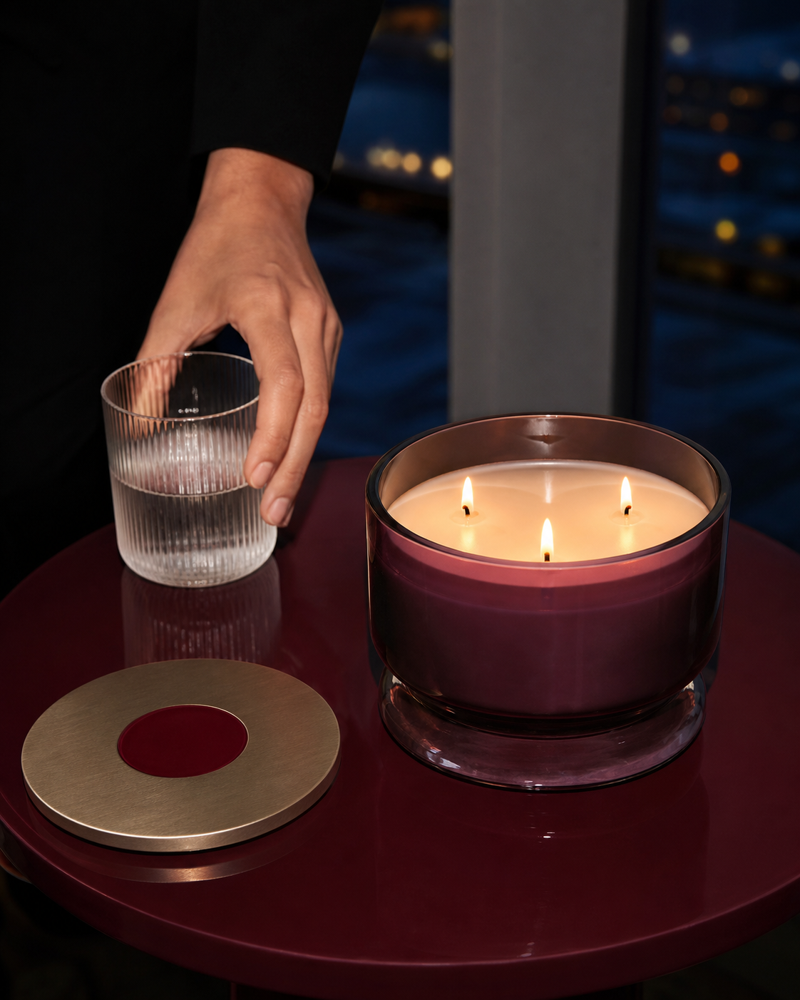

#### 详细信息

- **作者:** [Ecommerce GPT Image Prompts Studio](https://github.com/ecomimagelab)
- **来源:** 本仓库原创内容
- **发布日期:** 2026-07-22
- **语言:** en
- **适用平台:** Instagram Shop
- **许可证:** CC-BY-4.0

<details>
<summary><strong>生产参数、商品保真项与溯源信息</strong></summary>

| 生成模式 | 商品行业 | 使用场景 | 宽高比 |
|---|---|---|---|
| `text-to-image` | 家居与家具 | 社交电商广告 | 4:5 |

- **视觉风格:** 手作质感, 暗调氛围, 明亮活泼
- **背景类型:** 生活方式实景
- **素材用途:** 社交创意
- **输入要求:** No reference image is required for this fictional unbranded product; use product-edit mode with owned source photography when adapting a real SKU.
- **商品保真项:**
  - Preserve the wide smoky-plum hand-blown glass cylinder, thick rounded clear-plum foot, and smooth ivory wax with exactly three cotton wicks.
  - Preserve the flat matte-champagne lid with one centered circular oxblood enamel inset and no label.
- **负面约束:** No label, readable text, logo, single wick, four wicks, colored wax, extra candle, deformed glass, soot-black vessel, unsafe flame, readable text, logos, watermark, duplicate product, broken geometry, cheap CGI, collage, or border.

**来源与版权**

- Generated specifically for this repository from the recorded standalone prompt; no third-party preview image is redistributed.
- Original prompt and generated previews created for this repository after Pinterest pattern and open-source workflow research; no external preview asset is included.
- [visual-research](docs/VISUAL_RESEARCH.md)
- [visual-research](https://github.com/buluslan/gpt-image2-ecommerce)
- [visual-research](https://github.com/motiful/product-shots)
- **平台规则状态:** Platform names identify intended visual treatment only; verify current listing and advertising requirements before publication.
- **商品系列:** [ec-0036](data/prompts/ec-0036-smoky-plum-candle-platform-set.json)

</details>

**[🚀 立即体验 →](https://www.pixpix.com/)**

---

<a id="prompt-ec-0036-pinterest-plum-apricot-art"></a>

### No. 110: 家居与家具 — 烟梅色香薰蜡烛多平台套图: PINTEREST PLUM-APRICOT ART

 

#### 描述

围绕同一只烟梅色三芯蜡烛构建白底零售、手工灌蜡、暗调 SPA、闪光晚宴和 Pinterest 色块艺术。

**生活方式场景 · Pinterest · 5:8**

#### 提示词

```text
Create one save-worthy ultra-photorealistic portrait 5:8 Pinterest home-fragrance still life with exactly one premium candle and lid. Product design: one fictional unbranded wide cylindrical hand-blown candle vessel in translucent smoky-plum glass with a thick rounded clear-plum foot, smooth warm-ivory wax, exactly three evenly spaced cotton wicks, and one removable flat matte-champagne metal lid with a centered circular oxblood enamel inset; no label. Place the unlit candle on a low matte apricot cylinder, balance the lid flat on a lower dusty-lilac slab, and cast one large curved burgundy shadow across a pale peach wall. Use a sculptural vertical composition, full product visibility, graphic negative space, and crisp separation of vessel and lid. Use hard studio sun, soft lavender fill, rich plum–apricot color harmony, and precise glass and metal highlights. Render physically believable materials, disciplined commercial retouching, natural microtexture, and a premium photographic finish. Keep the product identity exact: the same wide smoky-plum vessel, thick rounded foot, ivory wax, three-wick layout, and champagne lid with centered oxblood inset. No label, readable text, logo, single wick, four wicks, colored wax, extra candle, deformed glass, soot-black vessel, unsafe flame, fruit, flowers, text graphics, floating lid, extra pedestal clutter, readable text, logo, trademark, watermark, duplicate product, broken geometry, cheap CGI, collage, split screen, frame, or border.
```

#### 生成预览图

##### 图片 1

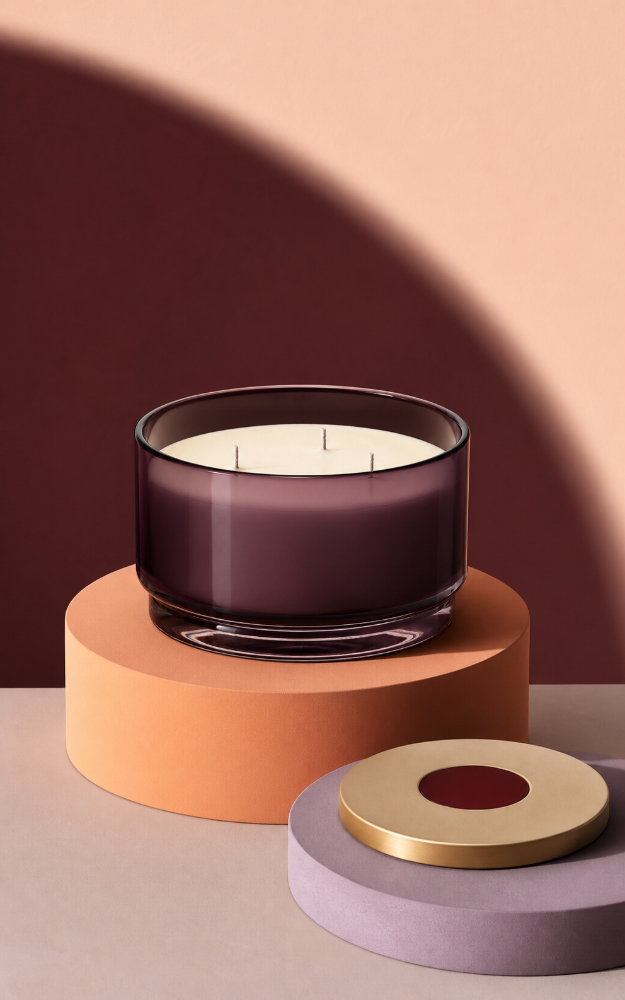

#### 详细信息

- **作者:** [Ecommerce GPT Image Prompts Studio](https://github.com/ecomimagelab)
- **来源:** 本仓库原创内容
- **发布日期:** 2026-07-22
- **语言:** en
- **适用平台:** Pinterest
- **许可证:** CC-BY-4.0

<details>
<summary><strong>生产参数、商品保真项与溯源信息</strong></summary>

| 生成模式 | 商品行业 | 使用场景 | 宽高比 |
|---|---|---|---|
| `text-to-image` | 家居与家具 | 生活方式场景 | 5:8 |

- **视觉风格:** 手作质感, 暗调氛围, 明亮活泼
- **背景类型:** 彩色影棚
- **素材用途:** 社交创意
- **输入要求:** No reference image is required for this fictional unbranded product; use product-edit mode with owned source photography when adapting a real SKU.
- **商品保真项:**
  - Preserve the wide smoky-plum hand-blown glass cylinder, thick rounded clear-plum foot, and smooth ivory wax with exactly three cotton wicks.
  - Preserve the flat matte-champagne lid with one centered circular oxblood enamel inset and no label.
- **负面约束:** No label, readable text, logo, single wick, four wicks, colored wax, extra candle, deformed glass, soot-black vessel, unsafe flame, readable text, logos, watermark, duplicate product, broken geometry, cheap CGI, collage, or border.

**来源与版权**

- Generated specifically for this repository from the recorded standalone prompt; no third-party preview image is redistributed.
- Original prompt and generated previews created for this repository after Pinterest pattern and open-source workflow research; no external preview asset is included.
- [visual-research](docs/VISUAL_RESEARCH.md)
- [visual-research](https://github.com/buluslan/gpt-image2-ecommerce)
- [visual-research](https://github.com/motiful/product-shots)
- **平台规则状态:** Platform names identify intended visual treatment only; verify current listing and advertising requirements before publication.
- **商品系列:** [ec-0036](data/prompts/ec-0036-smoky-plum-candle-platform-set.json)

</details>

**[🚀 立即体验 →](https://www.pixpix.com/)**

---

<a id="categories-cookware"></a>

<a id="prompt-ec-0035-amazon-home-knife-main"></a>

### No. 111: 炊具 — 烟熏橡木柄主厨刀多平台套图: AMAZON HOME KNIFE MAIN

 

#### 描述

让同一把烟熏橡木柄主厨刀呈现为白底零售、黑石广告、刀匠溯源、食谱大片和安全的社交烹饪瞬间。

**平台主图 · Amazon Home · 4:5**

#### 提示词

```text
Create one ultra-photorealistic portrait 4:5 Amazon Home main image of exactly one premium chef knife. Product design: one fictional unbranded 8-inch chef knife with a broad gently curved high-carbon steel blade, a dark hand-hammered upper blade fading into a clean satin lower bevel, a narrow warm-brass bolster, and an octagonal smoked-oak handle secured by exactly three small flush brass pins. Lay the clean dry knife diagonally on seamless pure #FFFFFF with blade pointing upper left and handle lower right; include no sheath, food, or props. Use an exact slightly elevated view with the complete tip, edge, bolster, handle, and all three pins visible, filling about 78% of frame. Use broad high-key light, a long controlled steel reflection, crisp hammered texture, and one soft contact shadow. Render physically believable materials, disciplined commercial retouching, natural microtexture, and a premium photographic finish. Keep the product identity exact: the same broad curved blade, hammered dark upper, satin bevel, brass bolster, octagonal smoked-oak handle, and three brass pins. No brand engraving, letters, serration, cleaver shape, Damascus swirl, extra pin, plastic handle, extra knife, damaged edge, unsafe blade contact, upright floating knife, cutting board, fingerprints, blade glare hiding the bevel, readable text, logo, trademark, watermark, duplicate product, broken geometry, cheap CGI, collage, split screen, frame, or border.
```

#### 生成预览图

##### 图片 1

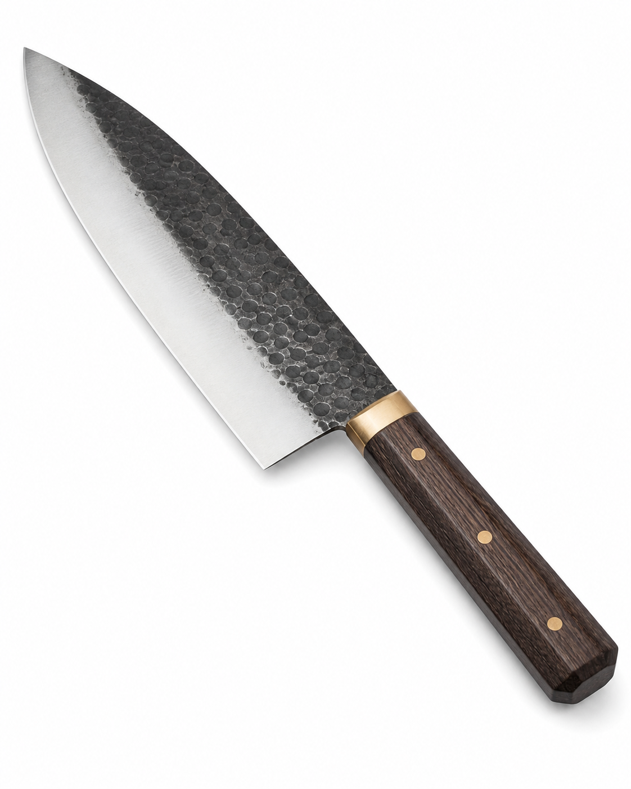

#### 详细信息

- **作者:** [Ecommerce GPT Image Prompts Studio](https://github.com/ecomimagelab)
- **来源:** 本仓库原创内容
- **发布日期:** 2026-07-22
- **语言:** en
- **适用平台:** Amazon Home
- **许可证:** CC-BY-4.0

<details>
<summary><strong>生产参数、商品保真项与溯源信息</strong></summary>

| 生成模式 | 商品行业 | 使用场景 | 宽高比 |
|---|---|---|---|
| `text-to-image` | 炊具 | 平台主图 | 4:5 |

- **视觉风格:** 暗调氛围, 手作质感, 美食编辑
- **背景类型:** 纯白背景
- **素材用途:** 平台主图
- **输入要求:** No reference image is required for this fictional unbranded product; use product-edit mode with owned source photography when adapting a real SKU.
- **商品保真项:**
  - Preserve the broad 8-inch gently curved blade, dark hand-hammered upper section, and clean satin lower bevel.
  - Preserve the narrow warm-brass bolster and octagonal smoked-oak handle with exactly three flush brass pins.
- **负面约束:** No brand engraving, letters, serration, cleaver shape, Damascus swirl, extra pin, plastic handle, extra knife, damaged edge, unsafe blade contact, readable text, logos, watermark, duplicate product, broken geometry, cheap CGI, collage, or border.

**来源与版权**

- Generated specifically for this repository from the recorded standalone prompt; no third-party preview image is redistributed.
- Original prompt and generated previews created for this repository after Pinterest pattern and open-source workflow research; no external preview asset is included.
- [visual-research](docs/VISUAL_RESEARCH.md)
- [visual-research](https://github.com/buluslan/gpt-image2-ecommerce)
- [visual-research](https://github.com/motiful/product-shots)
- **平台规则状态:** Platform names identify intended visual treatment only; verify current listing and advertising requirements before publication.
- **商品系列:** [ec-0035](data/prompts/ec-0035-smoked-oak-chef-knife-platform-set.json)

</details>

**[🚀 立即体验 →](https://www.pixpix.com/)**

---

<a id="prompt-ec-0035-shopify-black-stone-hero"></a>

### No. 112: 炊具 — 烟熏橡木柄主厨刀多平台套图: SHOPIFY BLACK-STONE HERO

 

#### 描述

让同一把烟熏橡木柄主厨刀呈现为白底零售、黑石广告、刀匠溯源、食谱大片和安全的社交烹饪瞬间。

**品牌首图 · Shopify · 5:8**

#### 提示词

```text
Create one cinematic ultra-photorealistic portrait 5:8 Shopify kitchen hero featuring exactly one premium chef knife. Product design: one fictional unbranded 8-inch chef knife with a broad gently curved high-carbon steel blade, a dark hand-hammered upper blade fading into a clean satin lower bevel, a narrow warm-brass bolster, and an octagonal smoked-oak handle secured by exactly three small flush brass pins. Rest the knife across a split black-basalt block with one halved deep-purple shallot far behind on a charcoal plaster set; the dry blade never touches the food. Use a low close three-quarter angle with the full knife visible, blade profile dominant, and refined negative space above. Use a cool steel edge light, a warm brass accent, deep open shadows, and a restrained oxblood bounce from the shallot. Render physically believable materials, disciplined commercial retouching, natural microtexture, and a premium photographic finish. Keep the product identity exact: the same broad curved blade, hammered dark upper, satin bevel, brass bolster, octagonal smoked-oak handle, and three brass pins. No brand engraving, letters, serration, cleaver shape, Damascus swirl, extra pin, plastic handle, extra knife, damaged edge, unsafe blade contact, flames, smoke, blood-like liquid, multiple ingredients, wet blade, readable text, logo, trademark, watermark, duplicate product, broken geometry, cheap CGI, collage, split screen, frame, or border.
```

#### 生成预览图

##### 图片 1

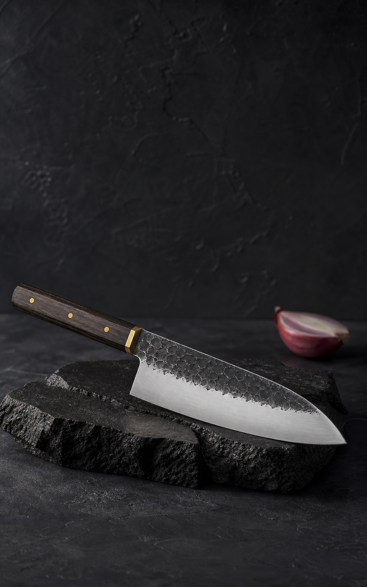

#### 详细信息

- **作者:** [Ecommerce GPT Image Prompts Studio](https://github.com/ecomimagelab)
- **来源:** 本仓库原创内容
- **发布日期:** 2026-07-22
- **语言:** en
- **适用平台:** Shopify
- **许可证:** CC-BY-4.0

<details>
<summary><strong>生产参数、商品保真项与溯源信息</strong></summary>

| 生成模式 | 商品行业 | 使用场景 | 宽高比 |
|---|---|---|---|
| `text-to-image` | 炊具 | 品牌首图 | 5:8 |

- **视觉风格:** 暗调氛围, 手作质感, 美食编辑
- **背景类型:** 暗调影棚
- **素材用途:** 品牌首图
- **输入要求:** No reference image is required for this fictional unbranded product; use product-edit mode with owned source photography when adapting a real SKU.
- **商品保真项:**
  - Preserve the broad 8-inch gently curved blade, dark hand-hammered upper section, and clean satin lower bevel.
  - Preserve the narrow warm-brass bolster and octagonal smoked-oak handle with exactly three flush brass pins.
- **负面约束:** No brand engraving, letters, serration, cleaver shape, Damascus swirl, extra pin, plastic handle, extra knife, damaged edge, unsafe blade contact, readable text, logos, watermark, duplicate product, broken geometry, cheap CGI, collage, or border.

**来源与版权**

- Generated specifically for this repository from the recorded standalone prompt; no third-party preview image is redistributed.
- Original prompt and generated previews created for this repository after Pinterest pattern and open-source workflow research; no external preview asset is included.
- [visual-research](docs/VISUAL_RESEARCH.md)
- [visual-research](https://github.com/buluslan/gpt-image2-ecommerce)
- [visual-research](https://github.com/motiful/product-shots)
- **平台规则状态:** Platform names identify intended visual treatment only; verify current listing and advertising requirements before publication.
- **商品系列:** [ec-0035](data/prompts/ec-0035-smoked-oak-chef-knife-platform-set.json)

</details>

**[🚀 立即体验 →](https://www.pixpix.com/)**

---

<a id="prompt-ec-0035-etsy-bladesmith-provenance"></a>

### No. 113: 炊具 — 烟熏橡木柄主厨刀多平台套图: ETSY BLADESMITH PROVENANCE

 

#### 描述

让同一把烟熏橡木柄主厨刀呈现为白底零售、黑石广告、刀匠溯源、食谱大片和安全的社交烹饪瞬间。

**细节与微距 · Etsy · 5:8**

#### 提示词

```text
Create one tactile ultra-photorealistic portrait 5:8 Etsy bladesmith story featuring exactly one finished premium chef knife. Product design: one fictional unbranded 8-inch chef knife with a broad gently curved high-carbon steel blade, a dark hand-hammered upper blade fading into a clean satin lower bevel, a narrow warm-brass bolster, and an octagonal smoked-oak handle secured by exactly three small flush brass pins. Place the knife on a worn leather pad over an old maple workbench with one curled brass shaving and one small smoked-oak offcut in soft background. Use an elevated close view showing the complete knife, hammered steel, satin bevel transition, brass bolster, oak facets, and exactly three pins. Use warm north-window light, a narrow cool steel rim, and honest micro-scratches without making the knife look used. Render physically believable materials, disciplined commercial retouching, natural microtexture, and a premium photographic finish. Keep the product identity exact: the same broad curved blade, hammered dark upper, satin bevel, brass bolster, octagonal smoked-oak handle, and three brass pins. No brand engraving, letters, serration, cleaver shape, Damascus swirl, extra pin, plastic handle, extra knife, damaged edge, unsafe blade contact, hammer, forge, sparks, unfinished blade, human, multiple knives, readable text, logo, trademark, watermark, duplicate product, broken geometry, cheap CGI, collage, split screen, frame, or border.
```

#### 生成预览图

##### 图片 1

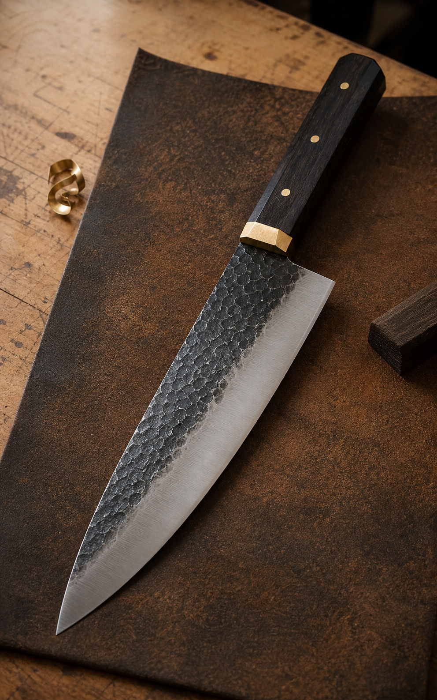

#### 详细信息

- **作者:** [Ecommerce GPT Image Prompts Studio](https://github.com/ecomimagelab)
- **来源:** 本仓库原创内容
- **发布日期:** 2026-07-22
- **语言:** en
- **适用平台:** Etsy
- **许可证:** CC-BY-4.0

<details>
<summary><strong>生产参数、商品保真项与溯源信息</strong></summary>

| 生成模式 | 商品行业 | 使用场景 | 宽高比 |
|---|---|---|---|
| `text-to-image` | 炊具 | 细节与微距 | 5:8 |

- **视觉风格:** 暗调氛围, 手作质感, 美食编辑
- **背景类型:** 天然材质
- **素材用途:** 商品副图
- **输入要求:** No reference image is required for this fictional unbranded product; use product-edit mode with owned source photography when adapting a real SKU.
- **商品保真项:**
  - Preserve the broad 8-inch gently curved blade, dark hand-hammered upper section, and clean satin lower bevel.
  - Preserve the narrow warm-brass bolster and octagonal smoked-oak handle with exactly three flush brass pins.
- **负面约束:** No brand engraving, letters, serration, cleaver shape, Damascus swirl, extra pin, plastic handle, extra knife, damaged edge, unsafe blade contact, readable text, logos, watermark, duplicate product, broken geometry, cheap CGI, collage, or border.

**来源与版权**

- Generated specifically for this repository from the recorded standalone prompt; no third-party preview image is redistributed.
- Original prompt and generated previews created for this repository after Pinterest pattern and open-source workflow research; no external preview asset is included.
- [visual-research](docs/VISUAL_RESEARCH.md)
- [visual-research](https://github.com/buluslan/gpt-image2-ecommerce)
- [visual-research](https://github.com/motiful/product-shots)
- **平台规则状态:** Platform names identify intended visual treatment only; verify current listing and advertising requirements before publication.
- **商品系列:** [ec-0035](data/prompts/ec-0035-smoked-oak-chef-knife-platform-set.json)

</details>

**[🚀 立即体验 →](https://www.pixpix.com/)**

---

<a id="prompt-ec-0035-pinterest-herb-prep-overhead"></a>

### No. 114: 炊具 — 烟熏橡木柄主厨刀多平台套图: PINTEREST HERB-PREP OVERHEAD

 

#### 描述

让同一把烟熏橡木柄主厨刀呈现为白底零售、黑石广告、刀匠溯源、食谱大片和安全的社交烹饪瞬间。

**生活方式场景 · Pinterest · 4:5**

#### 提示词

```text
Create one save-worthy ultra-photorealistic portrait 4:5 Pinterest culinary overhead scene featuring exactly one premium chef knife. Product design: one fictional unbranded 8-inch chef knife with a broad gently curved high-carbon steel blade, a dark hand-hammered upper blade fading into a clean satin lower bevel, a narrow warm-brass bolster, and an octagonal smoked-oak handle secured by exactly three small flush brass pins. Lay the clean knife beside neatly sliced fennel, parsley, and one lemon half on a large pale-maple cutting board over a forest-green linen tablecloth; keep food away from the handle. Use exact overhead geometry with the full knife unobscured, intentional negative space, restrained ingredients, and elegant editorial rhythm. Use soft side-window daylight, crisp fresh food texture, subtle film grain, and balanced green–lemon–oak color. Render physically believable materials, disciplined commercial retouching, natural microtexture, and a premium photographic finish. Keep the product identity exact: the same broad curved blade, hammered dark upper, satin bevel, brass bolster, octagonal smoked-oak handle, and three brass pins. No brand engraving, letters, serration, cleaver shape, Damascus swirl, extra pin, plastic handle, extra knife, damaged edge, unsafe blade contact, hand, meat, messy scraps, wet blade, extra utensil, recipe text, readable text, logo, trademark, watermark, duplicate product, broken geometry, cheap CGI, collage, split screen, frame, or border.
```

#### 生成预览图

##### 图片 1

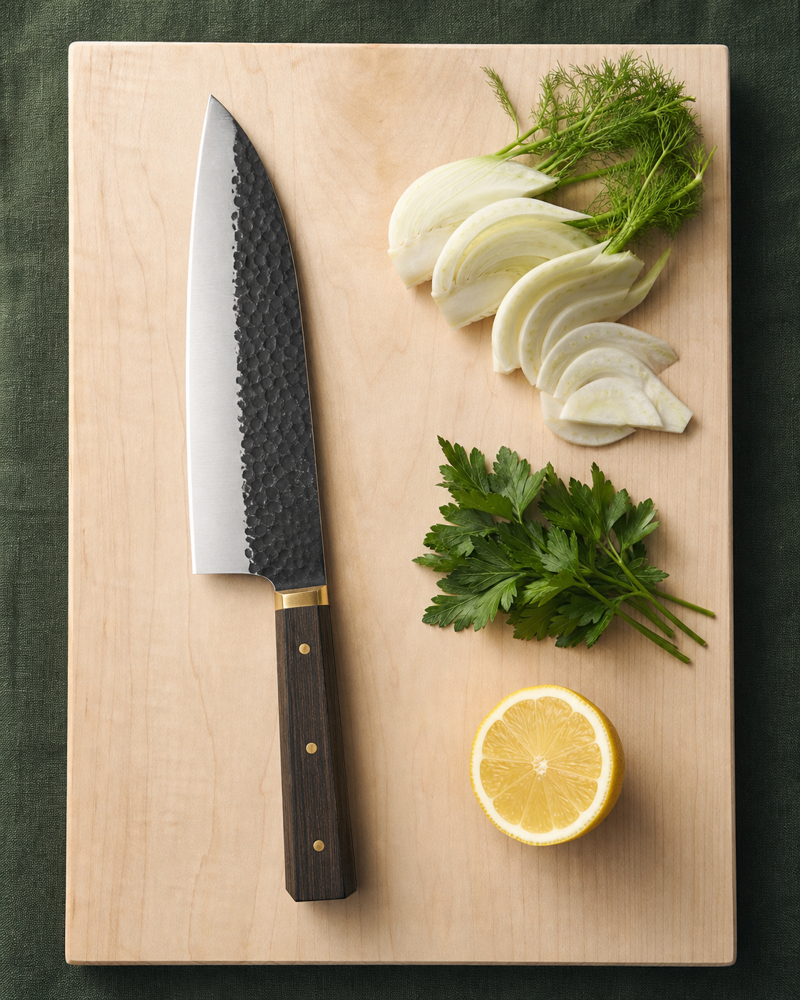

#### 详细信息

- **作者:** [Ecommerce GPT Image Prompts Studio](https://github.com/ecomimagelab)
- **来源:** 本仓库原创内容
- **发布日期:** 2026-07-22
- **语言:** en
- **适用平台:** Pinterest
- **许可证:** CC-BY-4.0

<details>
<summary><strong>生产参数、商品保真项与溯源信息</strong></summary>

| 生成模式 | 商品行业 | 使用场景 | 宽高比 |
|---|---|---|---|
| `text-to-image` | 炊具 | 生活方式场景 | 4:5 |

- **视觉风格:** 暗调氛围, 手作质感, 美食编辑
- **背景类型:** 家居空间
- **素材用途:** 社交创意
- **输入要求:** No reference image is required for this fictional unbranded product; use product-edit mode with owned source photography when adapting a real SKU.
- **商品保真项:**
  - Preserve the broad 8-inch gently curved blade, dark hand-hammered upper section, and clean satin lower bevel.
  - Preserve the narrow warm-brass bolster and octagonal smoked-oak handle with exactly three flush brass pins.
- **负面约束:** No brand engraving, letters, serration, cleaver shape, Damascus swirl, extra pin, plastic handle, extra knife, damaged edge, unsafe blade contact, readable text, logos, watermark, duplicate product, broken geometry, cheap CGI, collage, or border.

**来源与版权**

- Generated specifically for this repository from the recorded standalone prompt; no third-party preview image is redistributed.
- Original prompt and generated previews created for this repository after Pinterest pattern and open-source workflow research; no external preview asset is included.
- [visual-research](docs/VISUAL_RESEARCH.md)
- [visual-research](https://github.com/buluslan/gpt-image2-ecommerce)
- [visual-research](https://github.com/motiful/product-shots)
- **平台规则状态:** Platform names identify intended visual treatment only; verify current listing and advertising requirements before publication.
- **商品系列:** [ec-0035](data/prompts/ec-0035-smoked-oak-chef-knife-platform-set.json)

</details>

**[🚀 立即体验 →](https://www.pixpix.com/)**

---

<a id="prompt-ec-0035-xiaohongshu-safe-cooking"></a>

### No. 115: 炊具 — 烟熏橡木柄主厨刀多平台套图: XIAOHONGSHU SAFE COOKING

 

#### 描述

让同一把烟熏橡木柄主厨刀呈现为白底零售、黑石广告、刀匠溯源、食谱大片和安全的社交烹饪瞬间。

**社交电商广告 · 小红书 · 5:8**

#### 提示词

```text
Create one natural ultra-photorealistic portrait 5:8 Xiaohongshu home-cooking image featuring exactly one premium chef knife in safe adult use. Product design: one fictional unbranded 8-inch chef knife with a broad gently curved high-carbon steel blade, a dark hand-hammered upper blade fading into a clean satin lower bevel, a narrow warm-brass bolster, and an octagonal smoked-oak handle secured by exactly three small flush brass pins. One adult hand grips the smoked-oak handle correctly while the other forms a safe claw grip on half a red cabbage on a thick end-grain board in a bright home kitchen. Use a close 50 mm side angle showing the complete handle, three pins, brass bolster, most of the blade profile, safe finger placement, and clean sliced cabbage ribbons. Use cool window light with gentle direct-flash lift, realistic skin and vegetables, and lively but refined creator energy. Render physically believable materials, disciplined commercial retouching, natural microtexture, and a premium photographic finish. Keep the product identity exact: the same broad curved blade, hammered dark upper, satin bevel, brass bolster, octagonal smoked-oak handle, and three brass pins. No brand engraving, letters, serration, cleaver shape, Damascus swirl, extra pin, plastic handle, extra knife, damaged edge, unsafe blade contact, child, injury, blade toward camera, distorted fingers, rings, cluttered counter, readable text, logo, trademark, watermark, duplicate product, broken geometry, cheap CGI, collage, split screen, frame, or border.
```

#### 生成预览图

##### 图片 1

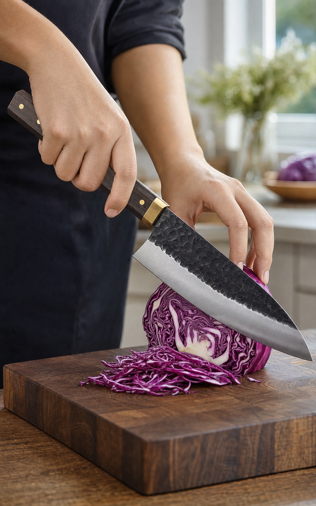

#### 详细信息

- **作者:** [Ecommerce GPT Image Prompts Studio](https://github.com/ecomimagelab)
- **来源:** 本仓库原创内容
- **发布日期:** 2026-07-22
- **语言:** en
- **适用平台:** 小红书
- **许可证:** CC-BY-4.0

<details>
<summary><strong>生产参数、商品保真项与溯源信息</strong></summary>

| 生成模式 | 商品行业 | 使用场景 | 宽高比 |
|---|---|---|---|
| `text-to-image` | 炊具 | 社交电商广告 | 5:8 |

- **视觉风格:** 暗调氛围, 手作质感, 美食编辑
- **背景类型:** 生活方式实景
- **素材用途:** 社交创意
- **输入要求:** No reference image is required for this fictional unbranded product; use product-edit mode with owned source photography when adapting a real SKU.
- **商品保真项:**
  - Preserve the broad 8-inch gently curved blade, dark hand-hammered upper section, and clean satin lower bevel.
  - Preserve the narrow warm-brass bolster and octagonal smoked-oak handle with exactly three flush brass pins.
- **负面约束:** No brand engraving, letters, serration, cleaver shape, Damascus swirl, extra pin, plastic handle, extra knife, damaged edge, unsafe blade contact, readable text, logos, watermark, duplicate product, broken geometry, cheap CGI, collage, or border.

**来源与版权**

- Generated specifically for this repository from the recorded standalone prompt; no third-party preview image is redistributed.
- Original prompt and generated previews created for this repository after Pinterest pattern and open-source workflow research; no external preview asset is included.
- [visual-research](docs/VISUAL_RESEARCH.md)
- [visual-research](https://github.com/buluslan/gpt-image2-ecommerce)
- [visual-research](https://github.com/motiful/product-shots)
- **平台规则状态:** Platform names identify intended visual treatment only; verify current listing and advertising requirements before publication.
- **商品系列:** [ec-0035](data/prompts/ec-0035-smoked-oak-chef-knife-platform-set.json)

</details>

**[🚀 立即体验 →](https://www.pixpix.com/)**

---

<a id="categories-pet-supplies"></a>

<a id="platforms-chewy"></a>

<a id="prompt-ec-0034-chewy-sky-catalog"></a>

### No. 116: 宠物用品 — 鼠尾草绿犬用胸背多平台套图: CHEWY SKY CATALOG

 

#### 描述

让同一件鼠尾草绿犬用胸背呈现为宠物零售、Amazon 规格图、手作细节、城市遛狗社交内容和户外 Pinterest 灵感。

**目录商品图 · Chewy · 4:5**

#### 提示词

```text
Create one ultra-photorealistic portrait 4:5 Chewy-style catalog photograph of exactly one premium dog harness. Product design: one fictional unbranded adjustable Y-front dog harness in matte sage-green ripstop fabric, with burnt-orange edge binding, one horizontal silver reflective chest strip, black acetal side-release buckles, four black adjustment sliders, a charcoal padded inner mesh, and one black metal D-ring centered on the back. Shape the empty harness naturally as if worn and suspend it almost imperceptibly above a matte powder-blue floor and backdrop, with no mannequin visible. Use a centered front three-quarter view showing the Y-front, chest strip, orange binding, side buckles, sliders, mesh edge, and back D-ring. Use bright soft studio light, a cheerful sky-blue bounce, crisp ripstop texture, and a gentle grounding shadow. Render physically believable materials, disciplined commercial retouching, natural microtexture, and a premium photographic finish. Keep the product identity exact: the same sage Y-front panels, orange binding, silver chest strip, charcoal mesh, black buckles, four sliders, and centered back D-ring. No brand patch, printed words, spikes, leather body, extra D-ring, extra buckle, leash attached unless specified, extra harness, malformed straps, dog, leash, toy, floating straps, hidden hardware, readable text, logo, trademark, watermark, duplicate product, broken geometry, cheap CGI, collage, split screen, frame, or border.
```

#### 生成预览图

##### 图片 1

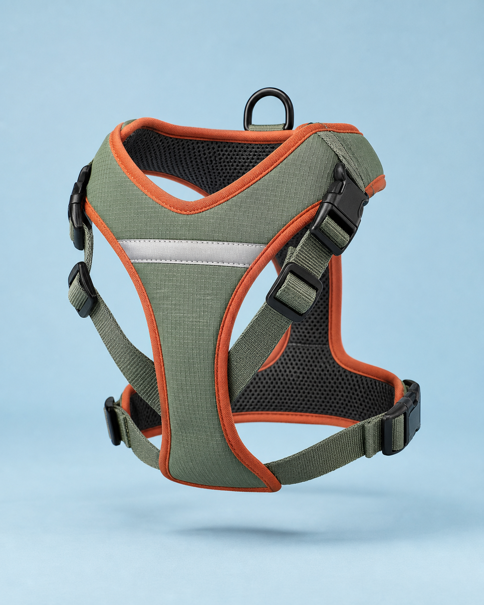

#### 详细信息

- **作者:** [Ecommerce GPT Image Prompts Studio](https://github.com/ecomimagelab)
- **来源:** 本仓库原创内容
- **发布日期:** 2026-07-22
- **语言:** en
- **适用平台:** Chewy
- **许可证:** CC-BY-4.0

<details>
<summary><strong>生产参数、商品保真项与溯源信息</strong></summary>

| 生成模式 | 商品行业 | 使用场景 | 宽高比 |
|---|---|---|---|
| `text-to-image` | 宠物用品 | 目录商品图 | 4:5 |

- **视觉风格:** 手作质感, 社交原生, 户外机能
- **背景类型:** 彩色影棚
- **素材用途:** 目录商品图
- **输入要求:** No reference image is required for this fictional unbranded product; use product-edit mode with owned source photography when adapting a real SKU.
- **商品保真项:**
  - Preserve the sage ripstop Y-front body, burnt-orange binding, horizontal silver reflective chest strip, and charcoal padded inner mesh.
  - Preserve the black side-release buckles, exactly four adjustment sliders, and one centered black metal back D-ring.
- **负面约束:** No brand patch, printed words, spikes, leather body, extra D-ring, extra buckle, leash attached unless specified, extra harness, malformed straps, readable text, logos, watermark, duplicate product, broken geometry, cheap CGI, collage, or border.

**来源与版权**

- Generated specifically for this repository from the recorded standalone prompt; no third-party preview image is redistributed.
- Original prompt and generated previews created for this repository after Pinterest pattern and open-source workflow research; no external preview asset is included.
- [visual-research](docs/VISUAL_RESEARCH.md)
- [visual-research](https://github.com/buluslan/gpt-image2-ecommerce)
- [visual-research](https://github.com/motiful/product-shots)
- **平台规则状态:** Platform names identify intended visual treatment only; verify current listing and advertising requirements before publication.
- **商品系列:** [ec-0034](data/prompts/ec-0034-sage-dog-harness-platform-set.json)

</details>

**[🚀 立即体验 →](https://www.pixpix.com/)**

---

<a id="prompt-ec-0034-amazon-harness-main-image"></a>

### No. 117: 宠物用品 — 鼠尾草绿犬用胸背多平台套图: AMAZON HARNESS MAIN IMAGE

 

#### 描述

让同一件鼠尾草绿犬用胸背呈现为宠物零售、Amazon 规格图、手作细节、城市遛狗社交内容和户外 Pinterest 灵感。

**平台主图 · Amazon · 4:5**

#### 提示词

```text
Create one ultra-photorealistic portrait 4:5 Amazon main image of exactly one premium dog harness. Product design: one fictional unbranded adjustable Y-front dog harness in matte sage-green ripstop fabric, with burnt-orange edge binding, one horizontal silver reflective chest strip, black acetal side-release buckles, four black adjustment sliders, a charcoal padded inner mesh, and one black metal D-ring centered on the back. Lay the empty harness open and symmetrical on seamless pure #FFFFFF with straps neatly extended, buckles closed, and the back D-ring visible at the top. Use an exact overhead view with the entire harness inside frame, about 80% fill, and all four adjustment sliders individually readable. Use broad high-key light, restrained contact shadow, accurate sage color, and clean separation of mesh, binding, webbing, and hardware. Render physically believable materials, disciplined commercial retouching, natural microtexture, and a premium photographic finish. Keep the product identity exact: the same sage Y-front panels, orange binding, silver chest strip, charcoal mesh, black buckles, four sliders, and centered back D-ring. No brand patch, printed words, spikes, leather body, extra D-ring, extra buckle, leash attached unless specified, extra harness, malformed straps, leash, dog, packaging, ruler, infographic arrows, curled strap ends, readable text, logo, trademark, watermark, duplicate product, broken geometry, cheap CGI, collage, split screen, frame, or border.
```

#### 生成预览图

##### 图片 1

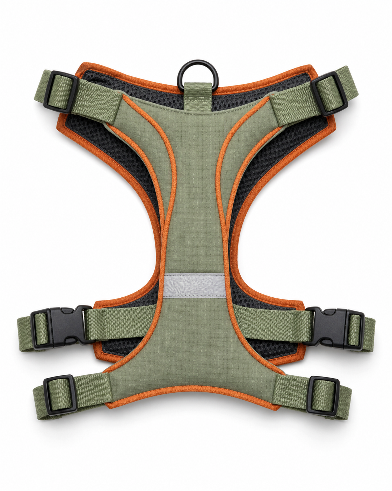

#### 详细信息

- **作者:** [Ecommerce GPT Image Prompts Studio](https://github.com/ecomimagelab)
- **来源:** 本仓库原创内容
- **发布日期:** 2026-07-22
- **语言:** en
- **适用平台:** Amazon
- **许可证:** CC-BY-4.0

<details>
<summary><strong>生产参数、商品保真项与溯源信息</strong></summary>

| 生成模式 | 商品行业 | 使用场景 | 宽高比 |
|---|---|---|---|
| `text-to-image` | 宠物用品 | 平台主图 | 4:5 |

- **视觉风格:** 手作质感, 社交原生, 户外机能
- **背景类型:** 纯白背景
- **素材用途:** 平台主图
- **输入要求:** No reference image is required for this fictional unbranded product; use product-edit mode with owned source photography when adapting a real SKU.
- **商品保真项:**
  - Preserve the sage ripstop Y-front body, burnt-orange binding, horizontal silver reflective chest strip, and charcoal padded inner mesh.
  - Preserve the black side-release buckles, exactly four adjustment sliders, and one centered black metal back D-ring.
- **负面约束:** No brand patch, printed words, spikes, leather body, extra D-ring, extra buckle, leash attached unless specified, extra harness, malformed straps, readable text, logos, watermark, duplicate product, broken geometry, cheap CGI, collage, or border.

**来源与版权**

- Generated specifically for this repository from the recorded standalone prompt; no third-party preview image is redistributed.
- Original prompt and generated previews created for this repository after Pinterest pattern and open-source workflow research; no external preview asset is included.
- [visual-research](docs/VISUAL_RESEARCH.md)
- [visual-research](https://github.com/buluslan/gpt-image2-ecommerce)
- [visual-research](https://github.com/motiful/product-shots)
- **平台规则状态:** Platform names identify intended visual treatment only; verify current listing and advertising requirements before publication.
- **商品系列:** [ec-0034](data/prompts/ec-0034-sage-dog-harness-platform-set.json)

</details>

**[🚀 立即体验 →](https://www.pixpix.com/)**

---

<a id="prompt-ec-0034-etsy-stitching-detail"></a>

### No. 118: 宠物用品 — 鼠尾草绿犬用胸背多平台套图: ETSY STITCHING DETAIL

 

#### 描述

让同一件鼠尾草绿犬用胸背呈现为宠物零售、Amazon 规格图、手作细节、城市遛狗社交内容和户外 Pinterest 灵感。

**细节与微距 · Etsy · 5:8**

#### 提示词

```text
Create one tactile ultra-photorealistic portrait 5:8 Etsy maker-detail photograph of exactly one premium dog harness. Product design: one fictional unbranded adjustable Y-front dog harness in matte sage-green ripstop fabric, with burnt-orange edge binding, one horizontal silver reflective chest strip, black acetal side-release buckles, four black adjustment sliders, a charcoal padded inner mesh, and one black metal D-ring centered on the back. Rest the harness on undyed canvas over a worn maple worktable; include one small spool of burnt-orange thread in the far background and no other tool. Use a close elevated view centered on the Y-junction, reflective strip, reinforced box stitching, binding, ripstop grid, one buckle, and the back D-ring while retaining recognizable harness form. Use soft north-window light with a cool metal rim and honest textile microtexture. Render physically believable materials, disciplined commercial retouching, natural microtexture, and a premium photographic finish. Keep the product identity exact: the same sage Y-front panels, orange binding, silver chest strip, charcoal mesh, black buckles, four sliders, and centered back D-ring. No brand patch, printed words, spikes, leather body, extra D-ring, extra buckle, leash attached unless specified, extra harness, malformed straps, needle, scissors, human, unfinished seams, extra hardware, readable text, logo, trademark, watermark, duplicate product, broken geometry, cheap CGI, collage, split screen, frame, or border.
```

#### 生成预览图

##### 图片 1

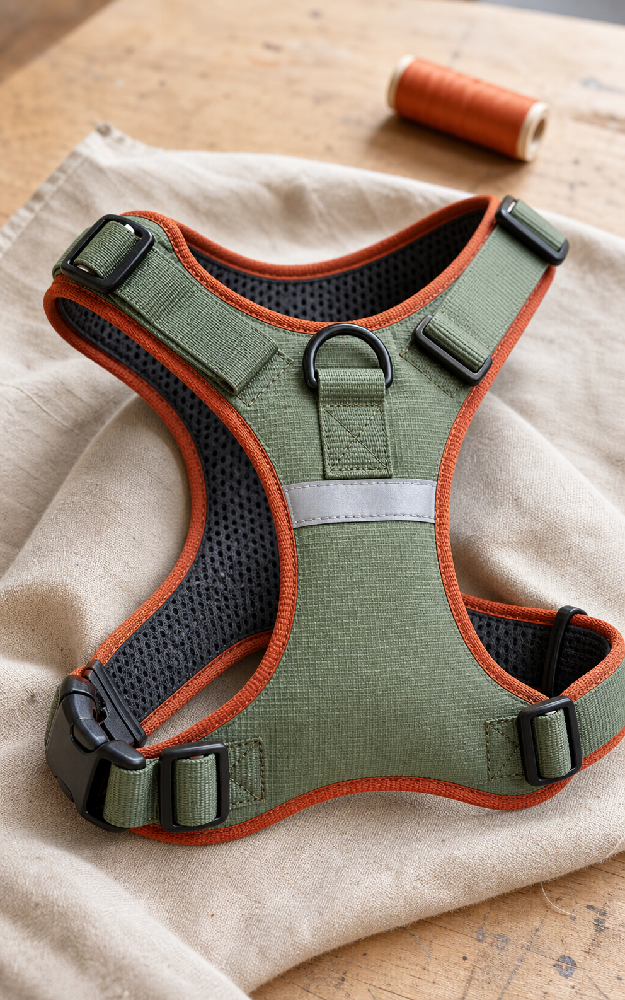

#### 详细信息

- **作者:** [Ecommerce GPT Image Prompts Studio](https://github.com/ecomimagelab)
- **来源:** 本仓库原创内容
- **发布日期:** 2026-07-22
- **语言:** en
- **适用平台:** Etsy
- **许可证:** CC-BY-4.0

<details>
<summary><strong>生产参数、商品保真项与溯源信息</strong></summary>

| 生成模式 | 商品行业 | 使用场景 | 宽高比 |
|---|---|---|---|
| `text-to-image` | 宠物用品 | 细节与微距 | 5:8 |

- **视觉风格:** 手作质感, 社交原生, 户外机能
- **背景类型:** 天然材质
- **素材用途:** 商品副图
- **输入要求:** No reference image is required for this fictional unbranded product; use product-edit mode with owned source photography when adapting a real SKU.
- **商品保真项:**
  - Preserve the sage ripstop Y-front body, burnt-orange binding, horizontal silver reflective chest strip, and charcoal padded inner mesh.
  - Preserve the black side-release buckles, exactly four adjustment sliders, and one centered black metal back D-ring.
- **负面约束:** No brand patch, printed words, spikes, leather body, extra D-ring, extra buckle, leash attached unless specified, extra harness, malformed straps, readable text, logos, watermark, duplicate product, broken geometry, cheap CGI, collage, or border.

**来源与版权**

- Generated specifically for this repository from the recorded standalone prompt; no third-party preview image is redistributed.
- Original prompt and generated previews created for this repository after Pinterest pattern and open-source workflow research; no external preview asset is included.
- [visual-research](docs/VISUAL_RESEARCH.md)
- [visual-research](https://github.com/buluslan/gpt-image2-ecommerce)
- [visual-research](https://github.com/motiful/product-shots)
- **平台规则状态:** Platform names identify intended visual treatment only; verify current listing and advertising requirements before publication.
- **商品系列:** [ec-0034](data/prompts/ec-0034-sage-dog-harness-platform-set.json)

</details>

**[🚀 立即体验 →](https://www.pixpix.com/)**

---

<a id="prompt-ec-0034-instagram-city-dog-walk"></a>

### No. 119: 宠物用品 — 鼠尾草绿犬用胸背多平台套图: INSTAGRAM SHOP CITY WALK

 

#### 描述

让同一件鼠尾草绿犬用胸背呈现为宠物零售、Amazon 规格图、手作细节、城市遛狗社交内容和户外 Pinterest 灵感。

**模特上身 · Instagram Shop · 4:5**

#### 提示词

```text
Create one natural ultra-photorealistic portrait 4:5 Instagram Shop city-walk image featuring exactly one medium adult dog wearing the premium harness. Product design: one fictional unbranded adjustable Y-front dog harness in matte sage-green ripstop fabric, with burnt-orange edge binding, one horizontal silver reflective chest strip, black acetal side-release buckles, four black adjustment sliders, a charcoal padded inner mesh, and one black metal D-ring centered on the back. A calm adult cream-colored mixed-breed dog walks beside an adult person's cropped charcoal trousers on a sunlit concrete sidewalk; attach one plain black leash to the centered back D-ring. Frame from the dog's head to paws at low eye level, show the Y-front fit, reflective strip, orange binding, side buckle, and natural leash angle. Use hard late-afternoon sun, subtle direct-flash lift, realistic fur, and candid street-editorial color. Render physically believable materials, disciplined commercial retouching, natural microtexture, and a premium photographic finish. Keep the product identity exact: the same sage Y-front panels, orange binding, silver chest strip, charcoal mesh, black buckles, four sliders, and centered back D-ring. No brand patch, printed words, spikes, leather body, extra D-ring, extra buckle, leash attached unless specified, extra harness, malformed straps, child, collar covering harness, extra dog, tight leash, distorted legs, brand storefront, readable text, logo, trademark, watermark, duplicate product, broken geometry, cheap CGI, collage, split screen, frame, or border.
```

#### 生成预览图

##### 图片 1

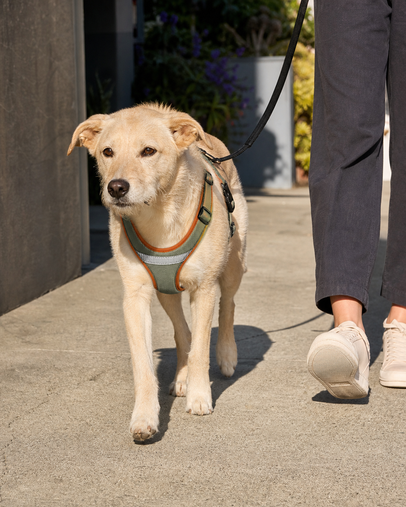

#### 详细信息

- **作者:** [Ecommerce GPT Image Prompts Studio](https://github.com/ecomimagelab)
- **来源:** 本仓库原创内容
- **发布日期:** 2026-07-22
- **语言:** en
- **适用平台:** Instagram Shop
- **许可证:** CC-BY-4.0

<details>
<summary><strong>生产参数、商品保真项与溯源信息</strong></summary>

| 生成模式 | 商品行业 | 使用场景 | 宽高比 |
|---|---|---|---|
| `text-to-image` | 宠物用品 | 模特上身 | 4:5 |

- **视觉风格:** 手作质感, 社交原生, 户外机能
- **背景类型:** 生活方式实景
- **素材用途:** 社交创意
- **输入要求:** No reference image is required for this fictional unbranded product; use product-edit mode with owned source photography when adapting a real SKU.
- **商品保真项:**
  - Preserve the sage ripstop Y-front body, burnt-orange binding, horizontal silver reflective chest strip, and charcoal padded inner mesh.
  - Preserve the black side-release buckles, exactly four adjustment sliders, and one centered black metal back D-ring.
- **负面约束:** No brand patch, printed words, spikes, leather body, extra D-ring, extra buckle, leash attached unless specified, extra harness, malformed straps, readable text, logos, watermark, duplicate product, broken geometry, cheap CGI, collage, or border.

**来源与版权**

- Generated specifically for this repository from the recorded standalone prompt; no third-party preview image is redistributed.
- Original prompt and generated previews created for this repository after Pinterest pattern and open-source workflow research; no external preview asset is included.
- [visual-research](docs/VISUAL_RESEARCH.md)
- [visual-research](https://github.com/buluslan/gpt-image2-ecommerce)
- [visual-research](https://github.com/motiful/product-shots)
- **平台规则状态:** Platform names identify intended visual treatment only; verify current listing and advertising requirements before publication.
- **商品系列:** [ec-0034](data/prompts/ec-0034-sage-dog-harness-platform-set.json)

</details>

**[🚀 立即体验 →](https://www.pixpix.com/)**

---

<a id="prompt-ec-0034-pinterest-coastal-hike"></a>

### No. 120: 宠物用品 — 鼠尾草绿犬用胸背多平台套图: PINTEREST COASTAL HIKE

 

#### 描述

让同一件鼠尾草绿犬用胸背呈现为宠物零售、Amazon 规格图、手作细节、城市遛狗社交内容和户外 Pinterest 灵感。

**生活方式场景 · Pinterest · 5:8**

#### 提示词

```text
Create one save-worthy ultra-photorealistic portrait 5:8 Pinterest outdoor lifestyle image featuring exactly one medium adult dog wearing the premium harness. Product design: one fictional unbranded adjustable Y-front dog harness in matte sage-green ripstop fabric, with burnt-orange edge binding, one horizontal silver reflective chest strip, black acetal side-release buckles, four black adjustment sliders, a charcoal padded inner mesh, and one black metal D-ring centered on the back. The cream-colored dog stands on a wind-shaped coastal grass trail above a misty blue sea, attached to one plain black leash extending toward an unseen adult outside frame. Use a slightly low three-quarter view with the dog and full harness clear, ample sky and trail context, and a calm aspirational travel mood. Use cool overcast coastal light, a narrow warm break in the clouds, visible ripstop and reflective texture, and natural wind in the fur. Render physically believable materials, disciplined commercial retouching, natural microtexture, and a premium photographic finish. Keep the product identity exact: the same sage Y-front panels, orange binding, silver chest strip, charcoal mesh, black buckles, four sliders, and centered back D-ring. No brand patch, printed words, spikes, leather body, extra D-ring, extra buckle, leash attached unless specified, extra harness, malformed straps, cliff danger, extra animal, person, backpack, dramatic storm, hidden chest panel, readable text, logo, trademark, watermark, duplicate product, broken geometry, cheap CGI, collage, split screen, frame, or border.
```

#### 生成预览图

##### 图片 1

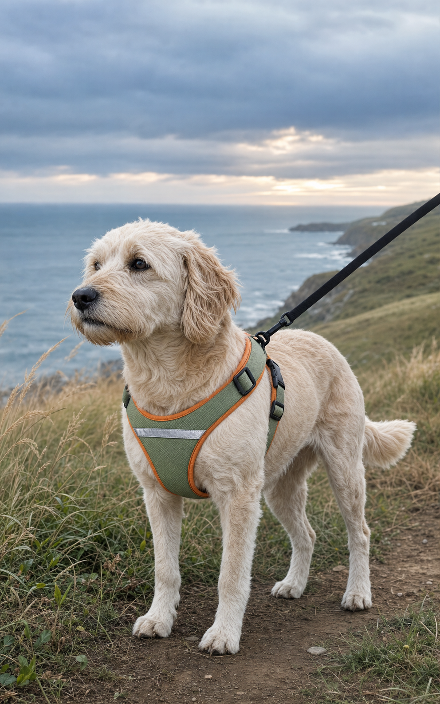

#### 详细信息

- **作者:** [Ecommerce GPT Image Prompts Studio](https://github.com/ecomimagelab)
- **来源:** 本仓库原创内容
- **发布日期:** 2026-07-22
- **语言:** en
- **适用平台:** Pinterest
- **许可证:** CC-BY-4.0

<details>
<summary><strong>生产参数、商品保真项与溯源信息</strong></summary>

| 生成模式 | 商品行业 | 使用场景 | 宽高比 |
|---|---|---|---|
| `text-to-image` | 宠物用品 | 生活方式场景 | 5:8 |

- **视觉风格:** 手作质感, 社交原生, 户外机能
- **背景类型:** 户外实景
- **素材用途:** 社交创意
- **输入要求:** No reference image is required for this fictional unbranded product; use product-edit mode with owned source photography when adapting a real SKU.
- **商品保真项:**
  - Preserve the sage ripstop Y-front body, burnt-orange binding, horizontal silver reflective chest strip, and charcoal padded inner mesh.
  - Preserve the black side-release buckles, exactly four adjustment sliders, and one centered black metal back D-ring.
- **负面约束:** No brand patch, printed words, spikes, leather body, extra D-ring, extra buckle, leash attached unless specified, extra harness, malformed straps, readable text, logos, watermark, duplicate product, broken geometry, cheap CGI, collage, or border.

**来源与版权**

- Generated specifically for this repository from the recorded standalone prompt; no third-party preview image is redistributed.
- Original prompt and generated previews created for this repository after Pinterest pattern and open-source workflow research; no external preview asset is included.
- [visual-research](docs/VISUAL_RESEARCH.md)
- [visual-research](https://github.com/buluslan/gpt-image2-ecommerce)
- [visual-research](https://github.com/motiful/product-shots)
- **平台规则状态:** Platform names identify intended visual treatment only; verify current listing and advertising requirements before publication.
- **商品系列:** [ec-0034](data/prompts/ec-0034-sage-dog-harness-platform-set.json)

</details>

**[🚀 立即体验 →](https://www.pixpix.com/)**

---

<a id="prompt-ec-0033-amazon-sports-main-image"></a>

### No. 121: 消费电子 — 石墨色运动智能表多平台套图: AMAZON SPORTS MAIN IMAGE

 

#### 描述

让同一只石墨色运动智能表呈现为白底目录、技术零售、夜间运动、创作者跑步和棚拍时尚电商。

**平台主图 · Amazon Sports · 4:5**

#### 提示词

```text
Create one ultra-photorealistic portrait 4:5 Amazon Sports main image of exactly one premium fitness smartwatch. Product design: one fictional unbranded fitness smartwatch with a 42 mm rounded-square bead-blasted graphite-titanium case, flat black glass, one burnt-orange knurled crown on the right, two narrow speaker slots on the left, and a deep moss-green woven nylon loop strap with a single orange pull tab; the display shows only three abstract coral, teal, and ivory activity arcs with no numbers or letters. Form the moss woven strap into a clean standing loop on seamless pure #FFFFFF, with the watch face angled slightly toward camera and the orange crown visible. Center the entire watch and strap with about 76% frame fill; keep case edges, speaker slots, pull tab, and abstract arcs crisp. Use high-key softboxes, a controlled graphite edge strip, reflection-managed glass, and one realistic soft grounding shadow. Render physically believable materials, disciplined commercial retouching, natural microtexture, and a premium photographic finish. Keep the product identity exact: the same rounded-square graphite case, orange right crown, left speaker slots, moss woven loop, orange tab, and abstract coral–teal–ivory arcs. No brand icon, readable numbers, letters, app name, extra crown, circular case, metal bracelet, extra watch, distorted strap, floating UI text, charging puck, phone, box, floating watch, closed black screen, readable text, logo, trademark, watermark, duplicate product, broken geometry, cheap CGI, collage, split screen, frame, or border.
```

#### 生成预览图

##### 图片 1

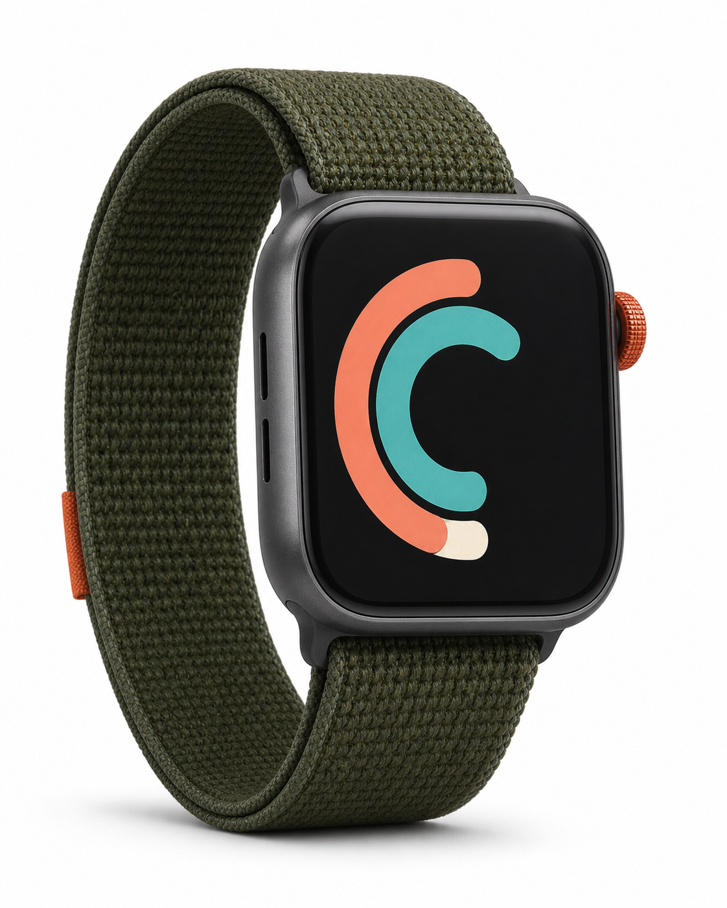

#### 详细信息

- **作者:** [Ecommerce GPT Image Prompts Studio](https://github.com/ecomimagelab)
- **来源:** 本仓库原创内容
- **发布日期:** 2026-07-22
- **语言:** en
- **适用平台:** Amazon Sports
- **许可证:** CC-BY-4.0

<details>
<summary><strong>生产参数、商品保真项与溯源信息</strong></summary>

| 生成模式 | 商品行业 | 使用场景 | 宽高比 |
|---|---|---|---|
| `text-to-image` | 消费电子 | 平台主图 | 4:5 |

- **视觉风格:** 技术表达, 电影感, 社交原生
- **背景类型:** 纯白背景
- **素材用途:** 平台主图
- **输入要求:** No reference image is required for this fictional unbranded product; use product-edit mode with owned source photography when adapting a real SKU.
- **商品保真项:**
  - Preserve the rounded-square 42 mm graphite-titanium case, flat black glass, right orange crown, and two left speaker slots.
  - Preserve the moss woven loop strap, orange pull tab, and abstract three-color activity arcs without text.
- **负面约束:** No brand icon, readable numbers, letters, app name, extra crown, circular case, metal bracelet, extra watch, distorted strap, floating UI text, readable text, logos, watermark, duplicate product, broken geometry, cheap CGI, collage, or border.

**来源与版权**

- Generated specifically for this repository from the recorded standalone prompt; no third-party preview image is redistributed.
- Original prompt and generated previews created for this repository after Pinterest pattern and open-source workflow research; no external preview asset is included.
- [visual-research](docs/VISUAL_RESEARCH.md)
- [visual-research](https://github.com/buluslan/gpt-image2-ecommerce)
- [visual-research](https://github.com/motiful/product-shots)
- **平台规则状态:** Platform names identify intended visual treatment only; verify current listing and advertising requirements before publication.
- **商品系列:** [ec-0033](data/prompts/ec-0033-graphite-fitness-watch-platform-set.json)

</details>

**[🚀 立即体验 →](https://www.pixpix.com/)**

---

<a id="prompt-ec-0033-bestbuy-sensor-feature"></a>

### No. 122: 消费电子 — 石墨色运动智能表多平台套图: BEST BUY SENSOR FEATURE

 

#### 描述

让同一只石墨色运动智能表呈现为白底目录、技术零售、夜间运动、创作者跑步和棚拍时尚电商。

**功能卖点图 · Best Buy · 4:5**

#### 提示词

```text
Create one ultra-photorealistic portrait 4:5 Best Buy-style technical feature image of exactly one premium fitness smartwatch. Product design: one fictional unbranded fitness smartwatch with a 42 mm rounded-square bead-blasted graphite-titanium case, flat black glass, one burnt-orange knurled crown on the right, two narrow speaker slots on the left, and a deep moss-green woven nylon loop strap with a single orange pull tab; the display shows only three abstract coral, teal, and ivory activity arcs with no numbers or letters. Rest the open watch diagonally on a graphite rubber platform, face up, with one subtle teal circular light reflection beneath the sensor area; include no labels or exploded parts. Use a close elevated three-quarter view that shows the display arcs, orange crown, left slots, woven fibers, and a glimpse of the underside sensor glass. Use cool cyan edge light, restrained orange accent, crisp glass control, and precise technical contrast. Render physically believable materials, disciplined commercial retouching, natural microtexture, and a premium photographic finish. Keep the product identity exact: the same rounded-square graphite case, orange right crown, left speaker slots, moss woven loop, orange tab, and abstract coral–teal–ivory arcs. No brand icon, readable numbers, letters, app name, extra crown, circular case, metal bracelet, extra watch, distorted strap, floating UI text, data text, diagrams, callout lines, x-ray view, detached strap, readable text, logo, trademark, watermark, duplicate product, broken geometry, cheap CGI, collage, split screen, frame, or border.
```

#### 生成预览图

##### 图片 1

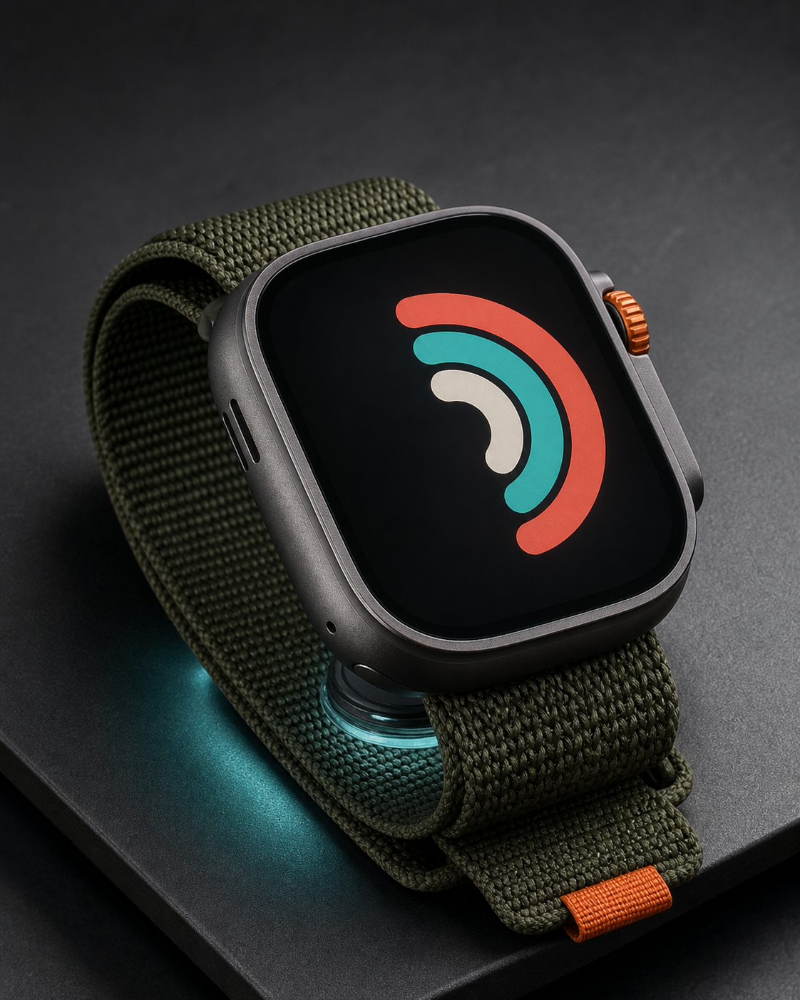

#### 详细信息

- **作者:** [Ecommerce GPT Image Prompts Studio](https://github.com/ecomimagelab)
- **来源:** 本仓库原创内容
- **发布日期:** 2026-07-22
- **语言:** en
- **适用平台:** Best Buy
- **许可证:** CC-BY-4.0

<details>
<summary><strong>生产参数、商品保真项与溯源信息</strong></summary>

| 生成模式 | 商品行业 | 使用场景 | 宽高比 |
|---|---|---|---|
| `text-to-image` | 消费电子 | 功能卖点图 | 4:5 |

- **视觉风格:** 技术表达, 电影感, 社交原生
- **背景类型:** 暗调影棚
- **素材用途:** 商品副图
- **输入要求:** No reference image is required for this fictional unbranded product; use product-edit mode with owned source photography when adapting a real SKU.
- **商品保真项:**
  - Preserve the rounded-square 42 mm graphite-titanium case, flat black glass, right orange crown, and two left speaker slots.
  - Preserve the moss woven loop strap, orange pull tab, and abstract three-color activity arcs without text.
- **负面约束:** No brand icon, readable numbers, letters, app name, extra crown, circular case, metal bracelet, extra watch, distorted strap, floating UI text, readable text, logos, watermark, duplicate product, broken geometry, cheap CGI, collage, or border.

**来源与版权**

- Generated specifically for this repository from the recorded standalone prompt; no third-party preview image is redistributed.
- Original prompt and generated previews created for this repository after Pinterest pattern and open-source workflow research; no external preview asset is included.
- [visual-research](docs/VISUAL_RESEARCH.md)
- [visual-research](https://github.com/buluslan/gpt-image2-ecommerce)
- [visual-research](https://github.com/motiful/product-shots)
- **平台规则状态:** Platform names identify intended visual treatment only; verify current listing and advertising requirements before publication.
- **商品系列:** [ec-0033](data/prompts/ec-0033-graphite-fitness-watch-platform-set.json)

</details>

**[🚀 立即体验 →](https://www.pixpix.com/)**

---

<a id="prompt-ec-0033-tmall-night-performance"></a>

### No. 123: 消费电子 — 石墨色运动智能表多平台套图: TMALL NIGHT PERFORMANCE

 

#### 描述

让同一只石墨色运动智能表呈现为白底目录、技术零售、夜间运动、创作者跑步和棚拍时尚电商。

**品牌首图 · 天猫 · 5:8**

#### 提示词

```text
Create one cinematic ultra-photorealistic portrait 5:8 night-performance campaign image of exactly one premium fitness smartwatch. Product design: one fictional unbranded fitness smartwatch with a 42 mm rounded-square bead-blasted graphite-titanium case, flat black glass, one burnt-orange knurled crown on the right, two narrow speaker slots on the left, and a deep moss-green woven nylon loop strap with a single orange pull tab; the display shows only three abstract coral, teal, and ivory activity arcs with no numbers or letters. Place the watch fastened around a smooth black running baton standing on wet track material at night; add restrained rain droplets and blurred stadium lights far behind. Use a low macro angle with the case dominant, the complete face and crown visible, and the strap wrapping naturally around the baton. Use a teal stadium rim, burnt-orange backlight, crisp droplets, and deep athletic contrast without hiding the product. Render physically believable materials, disciplined commercial retouching, natural microtexture, and a premium photographic finish. Keep the product identity exact: the same rounded-square graphite case, orange right crown, left speaker slots, moss woven loop, orange tab, and abstract coral–teal–ivory arcs. No brand icon, readable numbers, letters, app name, extra crown, circular case, metal bracelet, extra watch, distorted strap, floating UI text, athlete, hand, brand signage, lightning, excessive rain, floating watch, readable text, logo, trademark, watermark, duplicate product, broken geometry, cheap CGI, collage, split screen, frame, or border.
```

#### 生成预览图

##### 图片 1

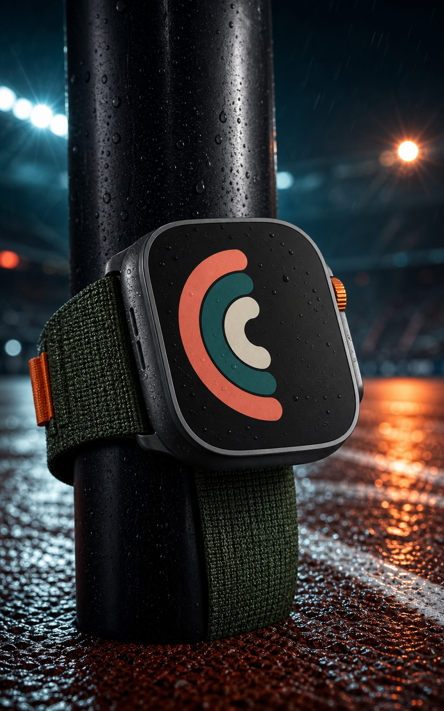

#### 详细信息

- **作者:** [Ecommerce GPT Image Prompts Studio](https://github.com/ecomimagelab)
- **来源:** 本仓库原创内容
- **发布日期:** 2026-07-22
- **语言:** en
- **适用平台:** 天猫
- **许可证:** CC-BY-4.0

<details>
<summary><strong>生产参数、商品保真项与溯源信息</strong></summary>

| 生成模式 | 商品行业 | 使用场景 | 宽高比 |
|---|---|---|---|
| `text-to-image` | 消费电子 | 品牌首图 | 5:8 |

- **视觉风格:** 技术表达, 电影感, 社交原生
- **背景类型:** 户外实景
- **素材用途:** 品牌首图
- **输入要求:** No reference image is required for this fictional unbranded product; use product-edit mode with owned source photography when adapting a real SKU.
- **商品保真项:**
  - Preserve the rounded-square 42 mm graphite-titanium case, flat black glass, right orange crown, and two left speaker slots.
  - Preserve the moss woven loop strap, orange pull tab, and abstract three-color activity arcs without text.
- **负面约束:** No brand icon, readable numbers, letters, app name, extra crown, circular case, metal bracelet, extra watch, distorted strap, floating UI text, readable text, logos, watermark, duplicate product, broken geometry, cheap CGI, collage, or border.

**来源与版权**

- Generated specifically for this repository from the recorded standalone prompt; no third-party preview image is redistributed.
- Original prompt and generated previews created for this repository after Pinterest pattern and open-source workflow research; no external preview asset is included.
- [visual-research](docs/VISUAL_RESEARCH.md)
- [visual-research](https://github.com/buluslan/gpt-image2-ecommerce)
- [visual-research](https://github.com/motiful/product-shots)
- **平台规则状态:** Platform names identify intended visual treatment only; verify current listing and advertising requirements before publication.
- **商品系列:** [ec-0033](data/prompts/ec-0033-graphite-fitness-watch-platform-set.json)

</details>

**[🚀 立即体验 →](https://www.pixpix.com/)**

---

<a id="prompt-ec-0033-tiktok-runner-wrist"></a>

### No. 124: 消费电子 — 石墨色运动智能表多平台套图: TIKTOK SHOP RUNNER WRIST

 

#### 描述

让同一只石墨色运动智能表呈现为白底目录、技术零售、夜间运动、创作者跑步和棚拍时尚电商。

**模特上身 · TikTok Shop · 5:8**

#### 提示词

```text
Create one energetic ultra-photorealistic portrait 5:8 TikTok Shop running frame featuring exactly one premium fitness smartwatch on one adult runner. Product design: one fictional unbranded fitness smartwatch with a 42 mm rounded-square bead-blasted graphite-titanium case, flat black glass, one burnt-orange knurled crown on the right, two narrow speaker slots on the left, and a deep moss-green woven nylon loop strap with a single orange pull tab; the display shows only three abstract coral, teal, and ivory activity arcs with no numbers or letters. Show an adult runner from shoulder to hip mid-stride on a concrete riverside path at dawn, lifting the watch wrist naturally toward camera while wearing a plain cobalt technical top. Use a close wide-angle tracking view; keep the watch face and orange crown tack sharp while the background and free arm carry controlled motion blur. Use cool dawn light with direct-flash lift, truthful skin texture, and a small warm sunrise edge. Render physically believable materials, disciplined commercial retouching, natural microtexture, and a premium photographic finish. Keep the product identity exact: the same rounded-square graphite case, orange right crown, left speaker slots, moss woven loop, orange tab, and abstract coral–teal–ivory arcs. No brand icon, readable numbers, letters, app name, extra crown, circular case, metal bracelet, extra watch, distorted strap, floating UI text, readable data, distorted fingers, extra wrist, headphones logo, staged pointing gesture, readable text, logo, trademark, watermark, duplicate product, broken geometry, cheap CGI, collage, split screen, frame, or border.
```

#### 生成预览图

##### 图片 1

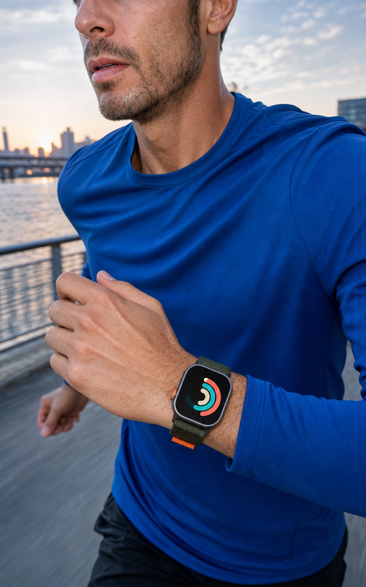

#### 详细信息

- **作者:** [Ecommerce GPT Image Prompts Studio](https://github.com/ecomimagelab)
- **来源:** 本仓库原创内容
- **发布日期:** 2026-07-22
- **语言:** en
- **适用平台:** TikTok Shop
- **许可证:** CC-BY-4.0

<details>
<summary><strong>生产参数、商品保真项与溯源信息</strong></summary>

| 生成模式 | 商品行业 | 使用场景 | 宽高比 |
|---|---|---|---|
| `text-to-image` | 消费电子 | 模特上身 | 5:8 |

- **视觉风格:** 技术表达, 电影感, 社交原生
- **背景类型:** 生活方式实景
- **素材用途:** 社交创意
- **输入要求:** No reference image is required for this fictional unbranded product; use product-edit mode with owned source photography when adapting a real SKU.
- **商品保真项:**
  - Preserve the rounded-square 42 mm graphite-titanium case, flat black glass, right orange crown, and two left speaker slots.
  - Preserve the moss woven loop strap, orange pull tab, and abstract three-color activity arcs without text.
- **负面约束:** No brand icon, readable numbers, letters, app name, extra crown, circular case, metal bracelet, extra watch, distorted strap, floating UI text, readable text, logos, watermark, duplicate product, broken geometry, cheap CGI, collage, or border.

**来源与版权**

- Generated specifically for this repository from the recorded standalone prompt; no third-party preview image is redistributed.
- Original prompt and generated previews created for this repository after Pinterest pattern and open-source workflow research; no external preview asset is included.
- [visual-research](docs/VISUAL_RESEARCH.md)
- [visual-research](https://github.com/buluslan/gpt-image2-ecommerce)
- [visual-research](https://github.com/motiful/product-shots)
- **平台规则状态:** Platform names identify intended visual treatment only; verify current listing and advertising requirements before publication.
- **商品系列:** [ec-0033](data/prompts/ec-0033-graphite-fitness-watch-platform-set.json)

</details>

**[🚀 立即体验 →](https://www.pixpix.com/)**

---

<a id="prompt-ec-0033-instagram-coral-fashion"></a>

### No. 125: 消费电子 — 石墨色运动智能表多平台套图: INSTAGRAM SHOP CORAL FASHION

 

#### 描述

让同一只石墨色运动智能表呈现为白底目录、技术零售、夜间运动、创作者跑步和棚拍时尚电商。

**社交电商广告 · Instagram Shop · 4:5**

#### 提示词

```text
Create one polished ultra-photorealistic portrait 4:5 Instagram Shop studio-fashion image featuring exactly one premium fitness smartwatch on one adult model. Product design: one fictional unbranded fitness smartwatch with a 42 mm rounded-square bead-blasted graphite-titanium case, flat black glass, one burnt-orange knurled crown on the right, two narrow speaker slots on the left, and a deep moss-green woven nylon loop strap with a single orange pull tab; the display shows only three abstract coral, teal, and ivory activity arcs with no numbers or letters. Crop an adult model from jaw to waist against a matte coral backdrop, wearing a sleeveless charcoal top and crossing one arm so the watch sits clearly near the center. Keep the wrist anatomy natural, the face unobstructed, and the graphite, moss, and orange materials sharply defined with elegant negative space. Use a large beauty dish, a hard teal side shadow, subtle film grain, and contemporary sport-fashion color. Render physically believable materials, disciplined commercial retouching, natural microtexture, and a premium photographic finish. Keep the product identity exact: the same rounded-square graphite case, orange right crown, left speaker slots, moss woven loop, orange tab, and abstract coral–teal–ivory arcs. No brand icon, readable numbers, letters, app name, extra crown, circular case, metal bracelet, extra watch, distorted strap, floating UI text, full face, jewelry, manicure art, extra watch, arm covering display, readable text, logo, trademark, watermark, duplicate product, broken geometry, cheap CGI, collage, split screen, frame, or border.
```

#### 生成预览图

##### 图片 1

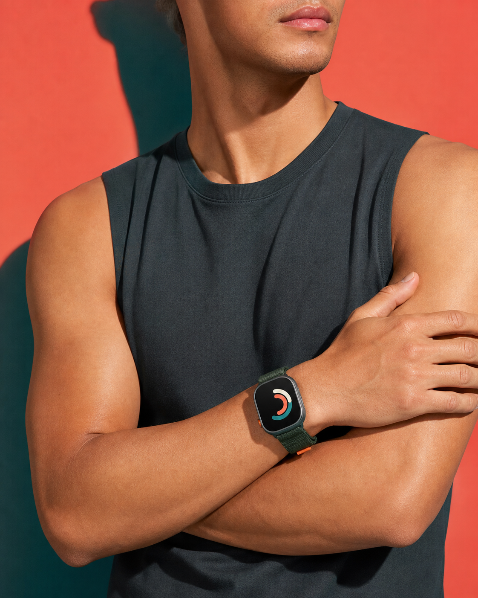

#### 详细信息

- **作者:** [Ecommerce GPT Image Prompts Studio](https://github.com/ecomimagelab)
- **来源:** 本仓库原创内容
- **发布日期:** 2026-07-22
- **语言:** en
- **适用平台:** Instagram Shop
- **许可证:** CC-BY-4.0

<details>
<summary><strong>生产参数、商品保真项与溯源信息</strong></summary>

| 生成模式 | 商品行业 | 使用场景 | 宽高比 |
|---|---|---|---|
| `text-to-image` | 消费电子 | 社交电商广告 | 4:5 |

- **视觉风格:** 技术表达, 电影感, 社交原生
- **背景类型:** 彩色影棚
- **素材用途:** 社交创意
- **输入要求:** No reference image is required for this fictional unbranded product; use product-edit mode with owned source photography when adapting a real SKU.
- **商品保真项:**
  - Preserve the rounded-square 42 mm graphite-titanium case, flat black glass, right orange crown, and two left speaker slots.
  - Preserve the moss woven loop strap, orange pull tab, and abstract three-color activity arcs without text.
- **负面约束:** No brand icon, readable numbers, letters, app name, extra crown, circular case, metal bracelet, extra watch, distorted strap, floating UI text, readable text, logos, watermark, duplicate product, broken geometry, cheap CGI, collage, or border.

**来源与版权**

- Generated specifically for this repository from the recorded standalone prompt; no third-party preview image is redistributed.
- Original prompt and generated previews created for this repository after Pinterest pattern and open-source workflow research; no external preview asset is included.
- [visual-research](docs/VISUAL_RESEARCH.md)
- [visual-research](https://github.com/buluslan/gpt-image2-ecommerce)
- [visual-research](https://github.com/motiful/product-shots)
- **平台规则状态:** Platform names identify intended visual treatment only; verify current listing and advertising requirements before publication.
- **商品系列:** [ec-0033](data/prompts/ec-0033-graphite-fitness-watch-platform-set.json)

</details>

**[🚀 立即体验 →](https://www.pixpix.com/)**

---

<a id="prompt-ec-0032-amazon-home-set-catalog"></a>

### No. 126: 家居与家具 — 青瓷餐具多平台套图: AMAZON HOME SET CATALOG

 

#### 描述

让同一套四件青瓷餐具在白底零售、手作溯源、Pinterest 早午餐、暗调品牌餐桌和彩色早餐内容中保持一致。

**目录商品图 · Amazon Home · 4:5**

#### 提示词

```text
Create one ultra-photorealistic portrait 4:5 Amazon Home catalog image of exactly one complete four-piece dinnerware place setting. Product design: one fictional unbranded four-piece stoneware place setting consisting of one wide dinner plate, one smaller side plate, one low rounded bowl, and one handleless cup, all with translucent pale-celadon reactive glaze, a thin hand-painted cobalt line just inside each rim, and an exposed warm-sand clay foot. Arrange the dinner plate flat, lean the side plate slightly behind, place the bowl centered on the dinner plate, and set the handleless cup to the right on seamless pure #FFFFFF. Use a front three-quarter product view with all four pieces fully readable, complete rims visible, and about 76% frame fill. Use broad high-key softboxes, clean ceramic highlights, subtle celadon translucency, and restrained contact shadows. Render physically believable materials, disciplined commercial retouching, natural microtexture, and a premium photographic finish. Keep the product identity exact: the same four-piece count, pale-celadon glaze, thin cobalt inner-rim line, rounded profiles, and warm-sand exposed feet. No extra plate, handled mug, silver trim, floral pattern, logo, text, chipped rim, glossy plastic ceramic, mismatched glaze, food, cutlery, napkin, packaging, fifth piece, floating plate, readable text, logo, trademark, watermark, duplicate product, broken geometry, cheap CGI, collage, split screen, frame, or border.
```

#### 生成预览图

##### 图片 1

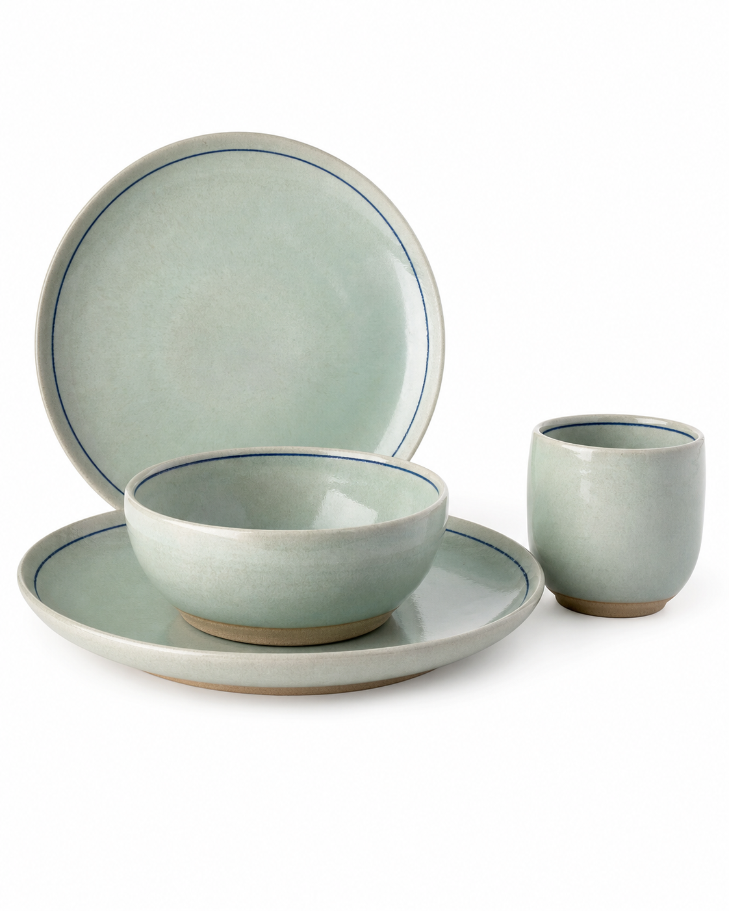

#### 详细信息

- **作者:** [Ecommerce GPT Image Prompts Studio](https://github.com/ecomimagelab)
- **来源:** 本仓库原创内容
- **发布日期:** 2026-07-22
- **语言:** en
- **适用平台:** Amazon Home
- **许可证:** CC-BY-4.0

<details>
<summary><strong>生产参数、商品保真项与溯源信息</strong></summary>

| 生成模式 | 商品行业 | 使用场景 | 宽高比 |
|---|---|---|---|
| `text-to-image` | 家居与家具 | 目录商品图 | 4:5 |

- **视觉风格:** 手作质感, 美食编辑, 暗调氛围
- **背景类型:** 纯白背景
- **素材用途:** 平台主图
- **输入要求:** No reference image is required for this fictional unbranded product; use product-edit mode with owned source photography when adapting a real SKU.
- **商品保真项:**
  - Preserve exactly four pieces: one dinner plate, one side plate, one low bowl, and one handleless cup.
  - Preserve the pale-celadon reactive glaze, thin cobalt inner-rim line, and exposed warm-sand clay feet.
- **负面约束:** No extra plate, handled mug, silver trim, floral pattern, logo, text, chipped rim, glossy plastic ceramic, mismatched glaze, readable text, logos, watermark, duplicate product, broken geometry, cheap CGI, collage, or border.

**来源与版权**

- Generated specifically for this repository from the recorded standalone prompt; no third-party preview image is redistributed.
- Original prompt and generated previews created for this repository after Pinterest pattern and open-source workflow research; no external preview asset is included.
- [visual-research](docs/VISUAL_RESEARCH.md)
- [visual-research](https://github.com/buluslan/gpt-image2-ecommerce)
- [visual-research](https://github.com/motiful/product-shots)
- **平台规则状态:** Platform names identify intended visual treatment only; verify current listing and advertising requirements before publication.
- **商品系列:** [ec-0032](data/prompts/ec-0032-celadon-dinnerware-platform-set.json)

</details>

**[🚀 立即体验 →](https://www.pixpix.com/)**

---

<a id="prompt-ec-0032-etsy-potter-provenance"></a>

### No. 127: 家居与家具 — 青瓷餐具多平台套图: ETSY POTTER PROVENANCE

 

#### 描述

让同一套四件青瓷餐具在白底零售、手作溯源、Pinterest 早午餐、暗调品牌餐桌和彩色早餐内容中保持一致。

**细节与微距 · Etsy · 5:8**

#### 提示词

```text
Create one tactile ultra-photorealistic portrait 5:8 Etsy maker-story photograph of exactly one complete four-piece dinnerware set. Product design: one fictional unbranded four-piece stoneware place setting consisting of one wide dinner plate, one smaller side plate, one low rounded bowl, and one handleless cup, all with translucent pale-celadon reactive glaze, a thin hand-painted cobalt line just inside each rim, and an exposed warm-sand clay foot. Arrange the pieces on a worn oak potter's bench with one folded flax cloth and a small celadon glaze test tile far behind; no tools touch the tableware. Use an elevated three-quarter view showing all four pieces, cobalt rim lines, reactive glaze variation, and exposed feet on the lifted cup and bowl. Use warm north-window light, a cool workshop edge, and honest clay, linen, wood, and glaze microtexture. Render physically believable materials, disciplined commercial retouching, natural microtexture, and a premium photographic finish. Keep the product identity exact: the same four-piece count, pale-celadon glaze, thin cobalt inner-rim line, rounded profiles, and warm-sand exposed feet. No extra plate, handled mug, silver trim, floral pattern, logo, text, chipped rim, glossy plastic ceramic, mismatched glaze, human, pottery wheel, wet clay, extra ceramics, rustic clutter, readable text, logo, trademark, watermark, duplicate product, broken geometry, cheap CGI, collage, split screen, frame, or border.
```

#### 生成预览图

##### 图片 1

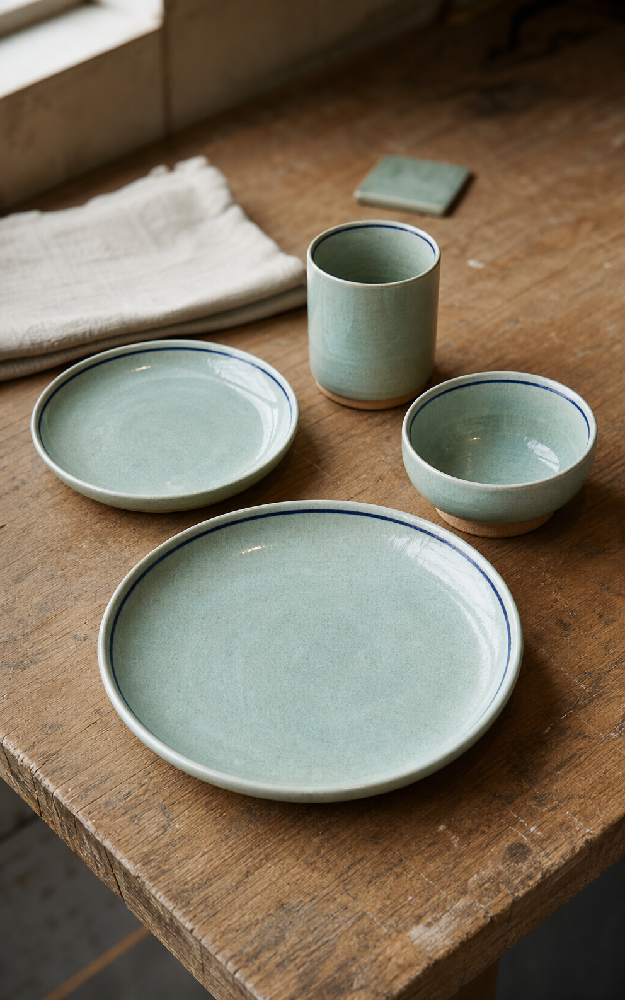

#### 详细信息

- **作者:** [Ecommerce GPT Image Prompts Studio](https://github.com/ecomimagelab)
- **来源:** 本仓库原创内容
- **发布日期:** 2026-07-22
- **语言:** en
- **适用平台:** Etsy
- **许可证:** CC-BY-4.0

<details>
<summary><strong>生产参数、商品保真项与溯源信息</strong></summary>

| 生成模式 | 商品行业 | 使用场景 | 宽高比 |
|---|---|---|---|
| `text-to-image` | 家居与家具 | 细节与微距 | 5:8 |

- **视觉风格:** 手作质感, 美食编辑, 暗调氛围
- **背景类型:** 天然材质
- **素材用途:** 品牌首图
- **输入要求:** No reference image is required for this fictional unbranded product; use product-edit mode with owned source photography when adapting a real SKU.
- **商品保真项:**
  - Preserve exactly four pieces: one dinner plate, one side plate, one low bowl, and one handleless cup.
  - Preserve the pale-celadon reactive glaze, thin cobalt inner-rim line, and exposed warm-sand clay feet.
- **负面约束:** No extra plate, handled mug, silver trim, floral pattern, logo, text, chipped rim, glossy plastic ceramic, mismatched glaze, readable text, logos, watermark, duplicate product, broken geometry, cheap CGI, collage, or border.

**来源与版权**

- Generated specifically for this repository from the recorded standalone prompt; no third-party preview image is redistributed.
- Original prompt and generated previews created for this repository after Pinterest pattern and open-source workflow research; no external preview asset is included.
- [visual-research](docs/VISUAL_RESEARCH.md)
- [visual-research](https://github.com/buluslan/gpt-image2-ecommerce)
- [visual-research](https://github.com/motiful/product-shots)
- **平台规则状态:** Platform names identify intended visual treatment only; verify current listing and advertising requirements before publication.
- **商品系列:** [ec-0032](data/prompts/ec-0032-celadon-dinnerware-platform-set.json)

</details>

**[🚀 立即体验 →](https://www.pixpix.com/)**

---

<a id="prompt-ec-0032-pinterest-spring-brunch"></a>

### No. 128: 家居与家具 — 青瓷餐具多平台套图: PINTEREST SPRING BRUNCH

 

#### 描述

让同一套四件青瓷餐具在白底零售、手作溯源、Pinterest 早午餐、暗调品牌餐桌和彩色早餐内容中保持一致。

**生活方式场景 · Pinterest · 5:8**

#### 提示词

```text
Create one save-worthy ultra-photorealistic portrait 5:8 Pinterest brunch table featuring exactly one four-piece dinnerware setting. Product design: one fictional unbranded four-piece stoneware place setting consisting of one wide dinner plate, one smaller side plate, one low rounded bowl, and one handleless cup, all with translucent pale-celadon reactive glaze, a thin hand-painted cobalt line just inside each rim, and an exposed warm-sand clay foot. Set the dinner and side plates, bowl, and handleless cup on a pale sage linen tablecloth beside brushed-steel cutlery; serve one poached egg with asparagus in the bowl and place a small lemon tart on the side plate. Use a graceful 45-degree overhead view with all four pieces identifiable, styled but uncrowded, and layered negative space. Use soft spring window light, delicate leaf shadows, and fresh celadon–sage–lemon color harmony. Render physically believable materials, disciplined commercial retouching, natural microtexture, and a premium photographic finish. Keep the product identity exact: the same four-piece count, pale-celadon glaze, thin cobalt inner-rim line, rounded profiles, and warm-sand exposed feet. No extra plate, handled mug, silver trim, floral pattern, logo, text, chipped rim, glossy plastic ceramic, mismatched glaze, flowers, extra crockery, readable menu, hands, excessive food, readable text, logo, trademark, watermark, duplicate product, broken geometry, cheap CGI, collage, split screen, frame, or border.
```

#### 生成预览图

##### 图片 1

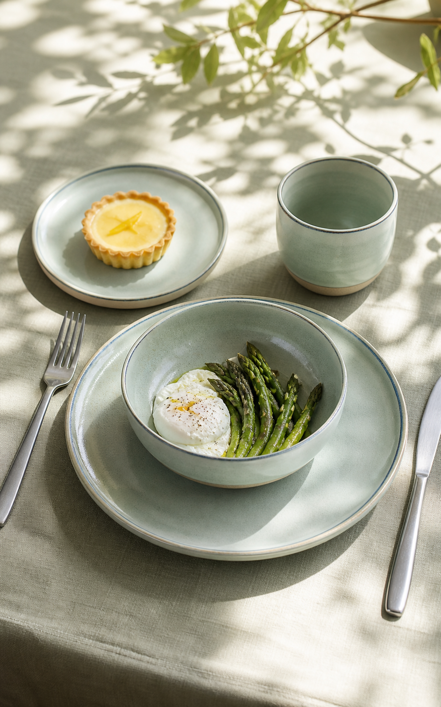

#### 详细信息

- **作者:** [Ecommerce GPT Image Prompts Studio](https://github.com/ecomimagelab)
- **来源:** 本仓库原创内容
- **发布日期:** 2026-07-22
- **语言:** en
- **适用平台:** Pinterest
- **许可证:** CC-BY-4.0

<details>
<summary><strong>生产参数、商品保真项与溯源信息</strong></summary>

| 生成模式 | 商品行业 | 使用场景 | 宽高比 |
|---|---|---|---|
| `text-to-image` | 家居与家具 | 生活方式场景 | 5:8 |

- **视觉风格:** 手作质感, 美食编辑, 暗调氛围
- **背景类型:** 家居空间
- **素材用途:** 社交创意
- **输入要求:** No reference image is required for this fictional unbranded product; use product-edit mode with owned source photography when adapting a real SKU.
- **商品保真项:**
  - Preserve exactly four pieces: one dinner plate, one side plate, one low bowl, and one handleless cup.
  - Preserve the pale-celadon reactive glaze, thin cobalt inner-rim line, and exposed warm-sand clay feet.
- **负面约束:** No extra plate, handled mug, silver trim, floral pattern, logo, text, chipped rim, glossy plastic ceramic, mismatched glaze, readable text, logos, watermark, duplicate product, broken geometry, cheap CGI, collage, or border.

**来源与版权**

- Generated specifically for this repository from the recorded standalone prompt; no third-party preview image is redistributed.
- Original prompt and generated previews created for this repository after Pinterest pattern and open-source workflow research; no external preview asset is included.
- [visual-research](docs/VISUAL_RESEARCH.md)
- [visual-research](https://github.com/buluslan/gpt-image2-ecommerce)
- [visual-research](https://github.com/motiful/product-shots)
- **平台规则状态:** Platform names identify intended visual treatment only; verify current listing and advertising requirements before publication.
- **商品系列:** [ec-0032](data/prompts/ec-0032-celadon-dinnerware-platform-set.json)

</details>

**[🚀 立即体验 →](https://www.pixpix.com/)**

---

<a id="prompt-ec-0032-shopify-olive-dining-hero"></a>

### No. 129: 家居与家具 — 青瓷餐具多平台套图: SHOPIFY OLIVE DINING HERO

 

#### 描述

让同一套四件青瓷餐具在白底零售、手作溯源、Pinterest 早午餐、暗调品牌餐桌和彩色早餐内容中保持一致。

**品牌首图 · Shopify · 4:5**

#### 提示词

```text
Create one cinematic ultra-photorealistic portrait 4:5 Shopify dining hero with exactly one complete four-piece dinnerware setting. Product design: one fictional unbranded four-piece stoneware place setting consisting of one wide dinner plate, one smaller side plate, one low rounded bowl, and one handleless cup, all with translucent pale-celadon reactive glaze, a thin hand-painted cobalt line just inside each rim, and an exposed warm-sand clay foot. Arrange the pieces on a dark smoked-oak table against a deep olive limewash wall; add one slim brushed-brass spoon and no food. Use a low intimate three-quarter angle with the dinner plate and bowl nested, side plate upright behind, cup at left, and every cobalt rim line visible. Use a warm pendant pool, cool shadow fill, and a narrow highlight that reveals celadon glaze depth without glare. Render physically believable materials, disciplined commercial retouching, natural microtexture, and a premium photographic finish. Keep the product identity exact: the same four-piece count, pale-celadon glaze, thin cobalt inner-rim line, rounded profiles, and warm-sand exposed feet. No extra plate, handled mug, silver trim, floral pattern, logo, text, chipped rim, glossy plastic ceramic, mismatched glaze, candles, plant, extra setting, blacked-out ceramic, restaurant clutter, readable text, logo, trademark, watermark, duplicate product, broken geometry, cheap CGI, collage, split screen, frame, or border.
```

#### 生成预览图

##### 图片 1

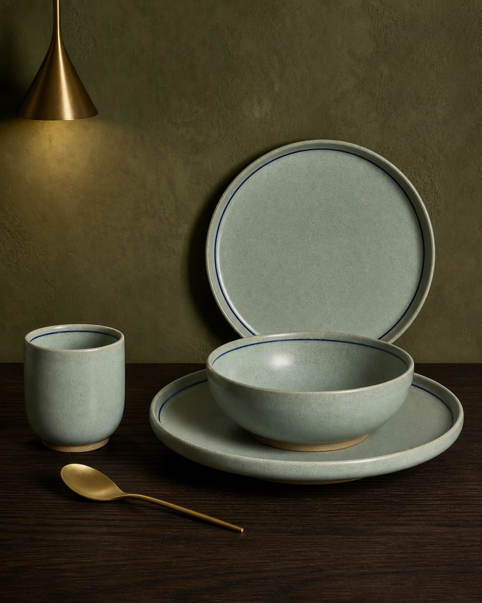

#### 详细信息

- **作者:** [Ecommerce GPT Image Prompts Studio](https://github.com/ecomimagelab)
- **来源:** 本仓库原创内容
- **发布日期:** 2026-07-22
- **语言:** en
- **适用平台:** Shopify
- **许可证:** CC-BY-4.0

<details>
<summary><strong>生产参数、商品保真项与溯源信息</strong></summary>

| 生成模式 | 商品行业 | 使用场景 | 宽高比 |
|---|---|---|---|
| `text-to-image` | 家居与家具 | 品牌首图 | 4:5 |

- **视觉风格:** 手作质感, 美食编辑, 暗调氛围
- **背景类型:** 暗调影棚
- **素材用途:** 品牌首图
- **输入要求:** No reference image is required for this fictional unbranded product; use product-edit mode with owned source photography when adapting a real SKU.
- **商品保真项:**
  - Preserve exactly four pieces: one dinner plate, one side plate, one low bowl, and one handleless cup.
  - Preserve the pale-celadon reactive glaze, thin cobalt inner-rim line, and exposed warm-sand clay feet.
- **负面约束:** No extra plate, handled mug, silver trim, floral pattern, logo, text, chipped rim, glossy plastic ceramic, mismatched glaze, readable text, logos, watermark, duplicate product, broken geometry, cheap CGI, collage, or border.

**来源与版权**

- Generated specifically for this repository from the recorded standalone prompt; no third-party preview image is redistributed.
- Original prompt and generated previews created for this repository after Pinterest pattern and open-source workflow research; no external preview asset is included.
- [visual-research](docs/VISUAL_RESEARCH.md)
- [visual-research](https://github.com/buluslan/gpt-image2-ecommerce)
- [visual-research](https://github.com/motiful/product-shots)
- **平台规则状态:** Platform names identify intended visual treatment only; verify current listing and advertising requirements before publication.
- **商品系列:** [ec-0032](data/prompts/ec-0032-celadon-dinnerware-platform-set.json)

</details>

**[🚀 立即体验 →](https://www.pixpix.com/)**

---

<a id="prompt-ec-0032-xiaohongshu-breakfast-flatlay"></a>

### No. 130: 家居与家具 — 青瓷餐具多平台套图: XIAOHONGSHU BREAKFAST FLAT LAY

 

#### 描述

让同一套四件青瓷餐具在白底零售、手作溯源、Pinterest 早午餐、暗调品牌餐桌和彩色早餐内容中保持一致。

**社交电商广告 · 小红书 · 4:5**

#### 提示词

```text
Create one bright ultra-photorealistic portrait 4:5 Xiaohongshu breakfast flat lay with exactly one complete four-piece dinnerware set. Product design: one fictional unbranded four-piece stoneware place setting consisting of one wide dinner plate, one smaller side plate, one low rounded bowl, and one handleless cup, all with translucent pale-celadon reactive glaze, a thin hand-painted cobalt line just inside each rim, and an exposed warm-sand clay foot. Use a matte peach table: avocado toast on the dinner plate, two apricot halves on the side plate, plain yogurt with blueberries in the bowl, and green tea in the handleless cup. Use exact overhead geometry with all four pieces separated, cobalt rim lines unobscured, playful spacing, and no cropped vessel. Use hard clean morning sun, soft cyan bounce, and vivid but edible natural color. Render physically believable materials, disciplined commercial retouching, natural microtexture, and a premium photographic finish. Keep the product identity exact: the same four-piece count, pale-celadon glaze, thin cobalt inner-rim line, rounded profiles, and warm-sand exposed feet. No extra plate, handled mug, silver trim, floral pattern, logo, text, chipped rim, glossy plastic ceramic, mismatched glaze, text overlay, hands, extra plate, excessive crumbs, utensil crossing a rim, readable text, logo, trademark, watermark, duplicate product, broken geometry, cheap CGI, collage, split screen, frame, or border.
```

#### 生成预览图

##### 图片 1

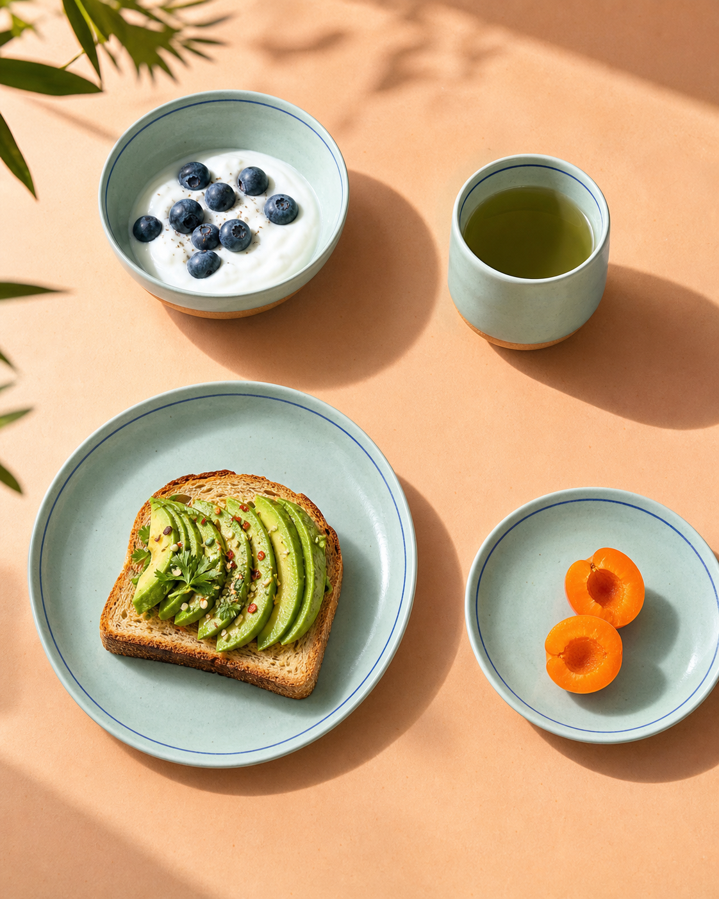

#### 详细信息

- **作者:** [Ecommerce GPT Image Prompts Studio](https://github.com/ecomimagelab)
- **来源:** 本仓库原创内容
- **发布日期:** 2026-07-22
- **语言:** en
- **适用平台:** 小红书
- **许可证:** CC-BY-4.0

<details>
<summary><strong>生产参数、商品保真项与溯源信息</strong></summary>

| 生成模式 | 商品行业 | 使用场景 | 宽高比 |
|---|---|---|---|
| `text-to-image` | 家居与家具 | 社交电商广告 | 4:5 |

- **视觉风格:** 手作质感, 美食编辑, 暗调氛围
- **背景类型:** 彩色影棚
- **素材用途:** 社交创意
- **输入要求:** No reference image is required for this fictional unbranded product; use product-edit mode with owned source photography when adapting a real SKU.
- **商品保真项:**
  - Preserve exactly four pieces: one dinner plate, one side plate, one low bowl, and one handleless cup.
  - Preserve the pale-celadon reactive glaze, thin cobalt inner-rim line, and exposed warm-sand clay feet.
- **负面约束:** No extra plate, handled mug, silver trim, floral pattern, logo, text, chipped rim, glossy plastic ceramic, mismatched glaze, readable text, logos, watermark, duplicate product, broken geometry, cheap CGI, collage, or border.

**来源与版权**

- Generated specifically for this repository from the recorded standalone prompt; no third-party preview image is redistributed.
- Original prompt and generated previews created for this repository after Pinterest pattern and open-source workflow research; no external preview asset is included.
- [visual-research](docs/VISUAL_RESEARCH.md)
- [visual-research](https://github.com/buluslan/gpt-image2-ecommerce)
- [visual-research](https://github.com/motiful/product-shots)
- **平台规则状态:** Platform names identify intended visual treatment only; verify current listing and advertising requirements before publication.
- **商品系列:** [ec-0032](data/prompts/ec-0032-celadon-dinnerware-platform-set.json)

</details>

**[🚀 立即体验 →](https://www.pixpix.com/)**

---

<a id="prompt-ec-0031-amazon-grocery-main-image"></a>

### No. 131: 食品与饮料 — 钴蓝咖啡豆包装多平台套图: AMAZON GROCERY MAIN IMAGE

 

#### 描述

围绕同一只钴蓝咖啡袋构建白底商品图、慢节奏手冲、彩色早餐创作、烘焙坊闪光和 Pinterest 图形静物。

**平台主图 · Amazon Grocery · 4:5**

#### 提示词

```text
Create one ultra-photorealistic portrait 4:5 Amazon Grocery main image of exactly one sealed premium coffee pouch. Product design: one fictional unbranded 340 g block-bottom whole-bean coffee pouch in matte cobalt-blue paper laminate, with a single acid-yellow vertical stripe along the right front edge, a large blank warm-cream oval label, a flat black one-way valve on the back, a straight heat-sealed top, and no printed words. Stand the pouch upright and front-facing on seamless pure #FFFFFF with a natural slight fill in the bag and no props or loose beans. Center the complete package with about 78% frame fill; keep the top seal, bottom gusset, stripe, and blank oval label fully visible. Use high-key softbox light, a narrow paper-edge highlight, controlled matte texture, and one restrained grounding shadow. Render physically believable materials, disciplined commercial retouching, natural microtexture, and a premium photographic finish. Keep the product identity exact: the same cobalt block-bottom pouch, right-edge acid-yellow stripe, blank cream oval label, and sealed top. No readable packaging, logo, claim, coffee cup printed on pouch, altered stripe, extra bag, torn seal, transparent window, cup, beans, scoop, package dents, inflated balloon shape, readable text, logo, trademark, watermark, duplicate product, broken geometry, cheap CGI, collage, split screen, frame, or border.
```

#### 生成预览图

##### 图片 1

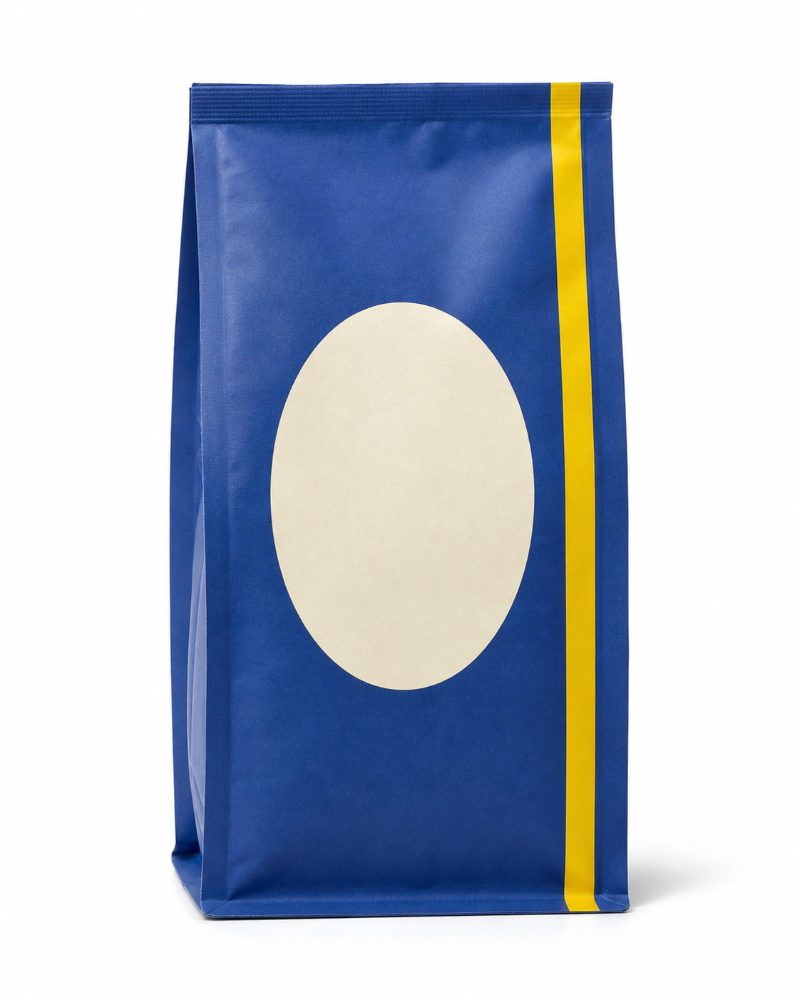

#### 详细信息

- **作者:** [Ecommerce GPT Image Prompts Studio](https://github.com/ecomimagelab)
- **来源:** 本仓库原创内容
- **发布日期:** 2026-07-22
- **语言:** en
- **适用平台:** Amazon Grocery
- **许可证:** CC-BY-4.0

<details>
<summary><strong>生产参数、商品保真项与溯源信息</strong></summary>

| 生成模式 | 商品行业 | 使用场景 | 宽高比 |
|---|---|---|---|
| `text-to-image` | 食品与饮料 | 平台主图 | 4:5 |

- **视觉风格:** 明亮活泼, 社交原生, 美食编辑
- **背景类型:** 纯白背景
- **素材用途:** 平台主图
- **输入要求:** No reference image is required for this fictional unbranded product; use product-edit mode with owned source photography when adapting a real SKU.
- **商品保真项:**
  - Preserve the matte cobalt block-bottom pouch, straight heat-sealed top, and acid-yellow stripe along the right front edge.
  - Preserve the large blank warm-cream oval label and the unprinted, unbranded packaging.
- **负面约束:** No readable packaging, logo, claim, coffee cup printed on pouch, altered stripe, extra bag, torn seal, transparent window, readable text, logos, watermark, duplicate product, broken geometry, cheap CGI, collage, or border.

**来源与版权**

- Generated specifically for this repository from the recorded standalone prompt; no third-party preview image is redistributed.
- Original prompt and generated previews created for this repository after Pinterest pattern and open-source workflow research; no external preview asset is included.
- [visual-research](docs/VISUAL_RESEARCH.md)
- [visual-research](https://github.com/buluslan/gpt-image2-ecommerce)
- [visual-research](https://github.com/motiful/product-shots)
- **平台规则状态:** Platform names identify intended visual treatment only; verify current listing and advertising requirements before publication.
- **商品系列:** [ec-0031](data/prompts/ec-0031-cobalt-coffee-pouch-platform-set.json)

</details>

**[🚀 立即体验 →](https://www.pixpix.com/)**

---

<a id="prompt-ec-0031-shopify-slow-morning-pourover"></a>

### No. 132: 食品与饮料 — 钴蓝咖啡豆包装多平台套图: SHOPIFY SLOW-MORNING POUR-OVER

 

#### 描述

围绕同一只钴蓝咖啡袋构建白底商品图、慢节奏手冲、彩色早餐创作、烘焙坊闪光和 Pinterest 图形静物。

**生活方式场景 · Shopify · 5:8**

#### 提示词

```text
Create one ultra-photorealistic portrait 5:8 Shopify lifestyle hero featuring exactly one sealed premium coffee pouch. Product design: one fictional unbranded 340 g block-bottom whole-bean coffee pouch in matte cobalt-blue paper laminate, with a single acid-yellow vertical stripe along the right front edge, a large blank warm-cream oval label, a flat black one-way valve on the back, a straight heat-sealed top, and no printed words. Place the upright pouch on a pale oak kitchen counter beside one glass pour-over dripper and a blank ivory cup while a thin stream of hot water enters the dripper from outside frame; keep steam subtle. Use an intimate eye-level view with the bag on the right third, its entire front visible, and soft negative space in the sunlit kitchen behind. Use gentle early-morning window light, warm wood bounce, cool cobalt shadow, and honest paper and glass texture. Render physically believable materials, disciplined commercial retouching, natural microtexture, and a premium photographic finish. Keep the product identity exact: the same cobalt block-bottom pouch, right-edge acid-yellow stripe, blank cream oval label, and sealed top. No readable packaging, logo, claim, coffee cup printed on pouch, altered stripe, extra bag, torn seal, transparent window, readable labels, kettle body, extra bag, spilled grounds, excessive steam, readable text, logo, trademark, watermark, duplicate product, broken geometry, cheap CGI, collage, split screen, frame, or border.
```

#### 生成预览图

##### 图片 1

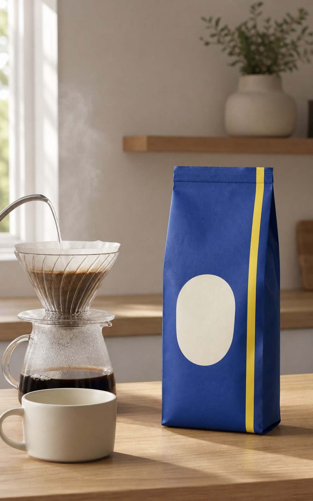

#### 详细信息

- **作者:** [Ecommerce GPT Image Prompts Studio](https://github.com/ecomimagelab)
- **来源:** 本仓库原创内容
- **发布日期:** 2026-07-22
- **语言:** en
- **适用平台:** Shopify
- **许可证:** CC-BY-4.0

<details>
<summary><strong>生产参数、商品保真项与溯源信息</strong></summary>

| 生成模式 | 商品行业 | 使用场景 | 宽高比 |
|---|---|---|---|
| `text-to-image` | 食品与饮料 | 生活方式场景 | 5:8 |

- **视觉风格:** 明亮活泼, 社交原生, 美食编辑
- **背景类型:** 家居空间
- **素材用途:** 品牌首图
- **输入要求:** No reference image is required for this fictional unbranded product; use product-edit mode with owned source photography when adapting a real SKU.
- **商品保真项:**
  - Preserve the matte cobalt block-bottom pouch, straight heat-sealed top, and acid-yellow stripe along the right front edge.
  - Preserve the large blank warm-cream oval label and the unprinted, unbranded packaging.
- **负面约束:** No readable packaging, logo, claim, coffee cup printed on pouch, altered stripe, extra bag, torn seal, transparent window, readable text, logos, watermark, duplicate product, broken geometry, cheap CGI, collage, or border.

**来源与版权**

- Generated specifically for this repository from the recorded standalone prompt; no third-party preview image is redistributed.
- Original prompt and generated previews created for this repository after Pinterest pattern and open-source workflow research; no external preview asset is included.
- [visual-research](docs/VISUAL_RESEARCH.md)
- [visual-research](https://github.com/buluslan/gpt-image2-ecommerce)
- [visual-research](https://github.com/motiful/product-shots)
- **平台规则状态:** Platform names identify intended visual treatment only; verify current listing and advertising requirements before publication.
- **商品系列:** [ec-0031](data/prompts/ec-0031-cobalt-coffee-pouch-platform-set.json)

</details>

**[🚀 立即体验 →](https://www.pixpix.com/)**

---

<a id="prompt-ec-0031-xiaohongshu-color-breakfast"></a>

### No. 133: 食品与饮料 — 钴蓝咖啡豆包装多平台套图: XIAOHONGSHU COLOR BREAKFAST

 

#### 描述

围绕同一只钴蓝咖啡袋构建白底商品图、慢节奏手冲、彩色早餐创作、烘焙坊闪光和 Pinterest 图形静物。

**社交电商广告 · 小红书 · 4:5**

#### 提示词

```text
Create one bright ultra-photorealistic portrait 4:5 Xiaohongshu breakfast flat lay featuring exactly one premium coffee pouch. Product design: one fictional unbranded 340 g block-bottom whole-bean coffee pouch in matte cobalt-blue paper laminate, with a single acid-yellow vertical stripe along the right front edge, a large blank warm-cream oval label, a flat black one-way valve on the back, a straight heat-sealed top, and no printed words. Lay the sealed pouch diagonally on a matte coral table with one butter-yellow cup of black coffee, one small plate holding a single croissant, and a folded sky-blue napkin; keep every prop separated. Use an exact overhead view, bold graphic spacing, full package visibility, and mobile-first color balance. Use hard morning sun with crisp diagonal shadows, a soft white fill, and believable food texture without oversaturation. Render physically believable materials, disciplined commercial retouching, natural microtexture, and a premium photographic finish. Keep the product identity exact: the same cobalt block-bottom pouch, right-edge acid-yellow stripe, blank cream oval label, and sealed top. No readable packaging, logo, claim, coffee cup printed on pouch, altered stripe, extra bag, torn seal, transparent window, hands, readable napkin, multiple pastries, latte art, crumbs over the label, readable text, logo, trademark, watermark, duplicate product, broken geometry, cheap CGI, collage, split screen, frame, or border.
```

#### 生成预览图

##### 图片 1

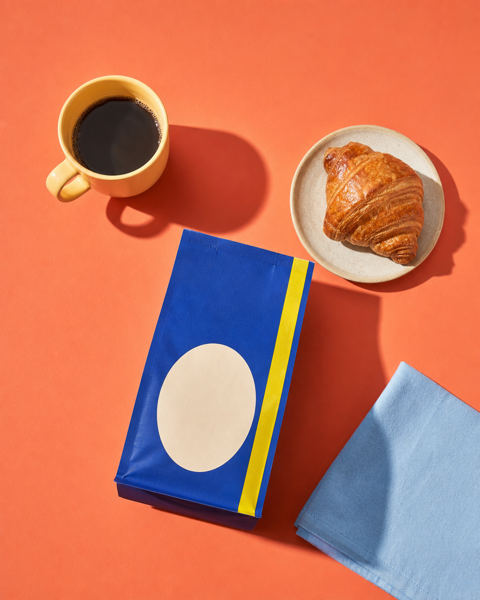

#### 详细信息

- **作者:** [Ecommerce GPT Image Prompts Studio](https://github.com/ecomimagelab)
- **来源:** 本仓库原创内容
- **发布日期:** 2026-07-22
- **语言:** en
- **适用平台:** 小红书
- **许可证:** CC-BY-4.0

<details>
<summary><strong>生产参数、商品保真项与溯源信息</strong></summary>

| 生成模式 | 商品行业 | 使用场景 | 宽高比 |
|---|---|---|---|
| `text-to-image` | 食品与饮料 | 社交电商广告 | 4:5 |

- **视觉风格:** 明亮活泼, 社交原生, 美食编辑
- **背景类型:** 彩色影棚
- **素材用途:** 社交创意
- **输入要求:** No reference image is required for this fictional unbranded product; use product-edit mode with owned source photography when adapting a real SKU.
- **商品保真项:**
  - Preserve the matte cobalt block-bottom pouch, straight heat-sealed top, and acid-yellow stripe along the right front edge.
  - Preserve the large blank warm-cream oval label and the unprinted, unbranded packaging.
- **负面约束:** No readable packaging, logo, claim, coffee cup printed on pouch, altered stripe, extra bag, torn seal, transparent window, readable text, logos, watermark, duplicate product, broken geometry, cheap CGI, collage, or border.

**来源与版权**

- Generated specifically for this repository from the recorded standalone prompt; no third-party preview image is redistributed.
- Original prompt and generated previews created for this repository after Pinterest pattern and open-source workflow research; no external preview asset is included.
- [visual-research](docs/VISUAL_RESEARCH.md)
- [visual-research](https://github.com/buluslan/gpt-image2-ecommerce)
- [visual-research](https://github.com/motiful/product-shots)
- **平台规则状态:** Platform names identify intended visual treatment only; verify current listing and advertising requirements before publication.
- **商品系列:** [ec-0031](data/prompts/ec-0031-cobalt-coffee-pouch-platform-set.json)

</details>

**[🚀 立即体验 →](https://www.pixpix.com/)**

---

<a id="prompt-ec-0031-tiktok-roastery-flash"></a>

### No. 134: 食品与饮料 — 钴蓝咖啡豆包装多平台套图: TIKTOK SHOP ROASTERY FLASH

 

#### 描述

围绕同一只钴蓝咖啡袋构建白底商品图、慢节奏手冲、彩色早餐创作、烘焙坊闪光和 Pinterest 图形静物。

**社交电商广告 · TikTok Shop · 5:8**

#### 提示词

```text
Create one energetic ultra-photorealistic portrait 5:8 TikTok Shop roastery frame featuring exactly one premium coffee pouch and one adult barista. Product design: one fictional unbranded 340 g block-bottom whole-bean coffee pouch in matte cobalt-blue paper laminate, with a single acid-yellow vertical stripe along the right front edge, a large blank warm-cream oval label, a flat black one-way valve on the back, a straight heat-sealed top, and no printed words. An adult barista in a plain charcoal apron holds the sealed pouch toward camera inside a working micro-roastery; blurred copper roaster drums and warm practical lights remain behind. Use a close wide-angle perspective, natural hand grip below the blank label, slight background motion, and tack-sharp package details. Use direct flash mixed with warm industrial light for candid creator energy and truthful cobalt color. Render physically believable materials, disciplined commercial retouching, natural microtexture, and a premium photographic finish. Keep the product identity exact: the same cobalt block-bottom pouch, right-edge acid-yellow stripe, blank cream oval label, and sealed top. No readable packaging, logo, claim, coffee cup printed on pouch, altered stripe, extra bag, torn seal, transparent window, readable signage, extra bag, gloves, distorted fingers, face obscured by pouch, readable text, logo, trademark, watermark, duplicate product, broken geometry, cheap CGI, collage, split screen, frame, or border.
```

#### 生成预览图

##### 图片 1

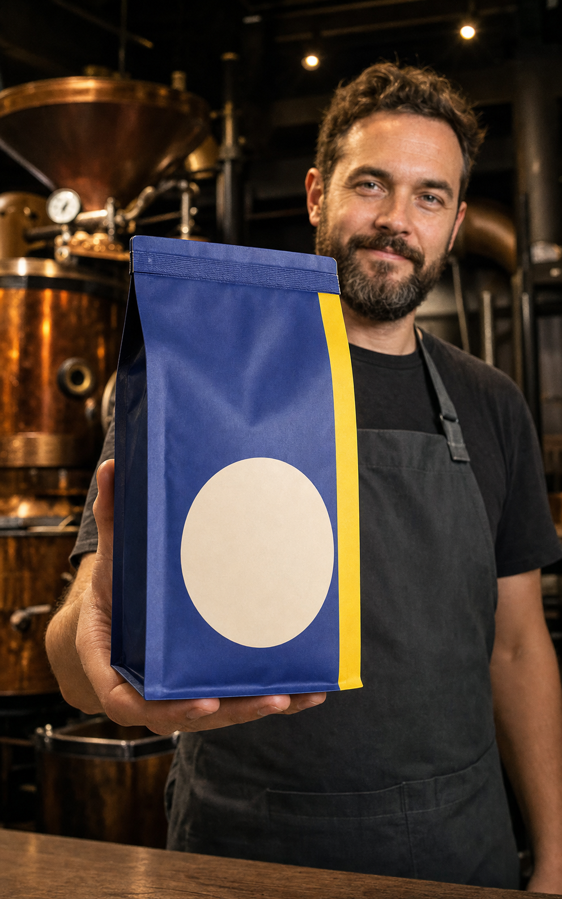

#### 详细信息

- **作者:** [Ecommerce GPT Image Prompts Studio](https://github.com/ecomimagelab)
- **来源:** 本仓库原创内容
- **发布日期:** 2026-07-22
- **语言:** en
- **适用平台:** TikTok Shop
- **许可证:** CC-BY-4.0

<details>
<summary><strong>生产参数、商品保真项与溯源信息</strong></summary>

| 生成模式 | 商品行业 | 使用场景 | 宽高比 |
|---|---|---|---|
| `text-to-image` | 食品与饮料 | 社交电商广告 | 5:8 |

- **视觉风格:** 明亮活泼, 社交原生, 美食编辑
- **背景类型:** 生活方式实景
- **素材用途:** 社交创意
- **输入要求:** No reference image is required for this fictional unbranded product; use product-edit mode with owned source photography when adapting a real SKU.
- **商品保真项:**
  - Preserve the matte cobalt block-bottom pouch, straight heat-sealed top, and acid-yellow stripe along the right front edge.
  - Preserve the large blank warm-cream oval label and the unprinted, unbranded packaging.
- **负面约束:** No readable packaging, logo, claim, coffee cup printed on pouch, altered stripe, extra bag, torn seal, transparent window, readable text, logos, watermark, duplicate product, broken geometry, cheap CGI, collage, or border.

**来源与版权**

- Generated specifically for this repository from the recorded standalone prompt; no third-party preview image is redistributed.
- Original prompt and generated previews created for this repository after Pinterest pattern and open-source workflow research; no external preview asset is included.
- [visual-research](docs/VISUAL_RESEARCH.md)
- [visual-research](https://github.com/buluslan/gpt-image2-ecommerce)
- [visual-research](https://github.com/motiful/product-shots)
- **平台规则状态:** Platform names identify intended visual treatment only; verify current listing and advertising requirements before publication.
- **商品系列:** [ec-0031](data/prompts/ec-0031-cobalt-coffee-pouch-platform-set.json)

</details>

**[🚀 立即体验 →](https://www.pixpix.com/)**

---

<a id="prompt-ec-0031-pinterest-terracotta-still-life"></a>

### No. 135: 食品与饮料 — 钴蓝咖啡豆包装多平台套图: PINTEREST TERRACOTTA STILL LIFE

 

#### 描述

围绕同一只钴蓝咖啡袋构建白底商品图、慢节奏手冲、彩色早餐创作、烘焙坊闪光和 Pinterest 图形静物。

**品牌首图 · Pinterest · 5:8**

#### 提示词

```text
Create one save-worthy ultra-photorealistic portrait 5:8 Pinterest coffee still life featuring exactly one premium pouch. Product design: one fictional unbranded 340 g block-bottom whole-bean coffee pouch in matte cobalt-blue paper laminate, with a single acid-yellow vertical stripe along the right front edge, a large blank warm-cream oval label, a flat black one-way valve on the back, a straight heat-sealed top, and no printed words. Stand the sealed pouch on a rough terracotta slab with one small pile of glossy roasted beans and a low smoked-glass cup on a warm sand background; keep the label unobscured. Use a sculptural three-quarter arrangement, deep negative space, and strong cobalt–terracotta contrast with the bag dominant. Use raking late-afternoon sun, a narrow cool fill, crisp bean highlights, and tactile paper, clay, and glass surfaces. Render physically believable materials, disciplined commercial retouching, natural microtexture, and a premium photographic finish. Keep the product identity exact: the same cobalt block-bottom pouch, right-edge acid-yellow stripe, blank cream oval label, and sealed top. No readable packaging, logo, claim, coffee cup printed on pouch, altered stripe, extra bag, torn seal, transparent window, coffee plant, burlap sack, multiple cups, large bean spill, vintage props, readable text, logo, trademark, watermark, duplicate product, broken geometry, cheap CGI, collage, split screen, frame, or border.
```

#### 生成预览图

##### 图片 1

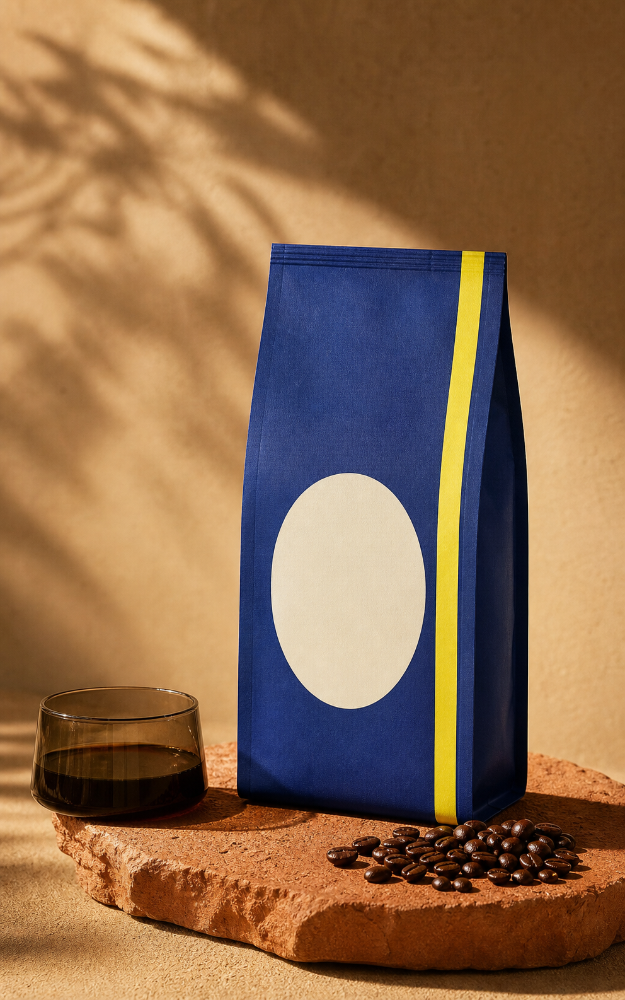

#### 详细信息

- **作者:** [Ecommerce GPT Image Prompts Studio](https://github.com/ecomimagelab)
- **来源:** 本仓库原创内容
- **发布日期:** 2026-07-22
- **语言:** en
- **适用平台:** Pinterest
- **许可证:** CC-BY-4.0

<details>
<summary><strong>生产参数、商品保真项与溯源信息</strong></summary>

| 生成模式 | 商品行业 | 使用场景 | 宽高比 |
|---|---|---|---|
| `text-to-image` | 食品与饮料 | 品牌首图 | 5:8 |

- **视觉风格:** 明亮活泼, 社交原生, 美食编辑
- **背景类型:** 天然材质
- **素材用途:** 社交创意
- **输入要求:** No reference image is required for this fictional unbranded product; use product-edit mode with owned source photography when adapting a real SKU.
- **商品保真项:**
  - Preserve the matte cobalt block-bottom pouch, straight heat-sealed top, and acid-yellow stripe along the right front edge.
  - Preserve the large blank warm-cream oval label and the unprinted, unbranded packaging.
- **负面约束:** No readable packaging, logo, claim, coffee cup printed on pouch, altered stripe, extra bag, torn seal, transparent window, readable text, logos, watermark, duplicate product, broken geometry, cheap CGI, collage, or border.

**来源与版权**

- Generated specifically for this repository from the recorded standalone prompt; no third-party preview image is redistributed.
- Original prompt and generated previews created for this repository after Pinterest pattern and open-source workflow research; no external preview asset is included.
- [visual-research](docs/VISUAL_RESEARCH.md)
- [visual-research](https://github.com/buluslan/gpt-image2-ecommerce)
- [visual-research](https://github.com/motiful/product-shots)
- **平台规则状态:** Platform names identify intended visual treatment only; verify current listing and advertising requirements before publication.
- **商品系列:** [ec-0031](data/prompts/ec-0031-cobalt-coffee-pouch-platform-set.json)

</details>

**[🚀 立即体验 →](https://www.pixpix.com/)**

---

<a id="prompt-ec-0030-wayfair-clean-room-catalog"></a>

### No. 136: 家居与家具 — 象牙白圈圈绒休闲椅多平台套图: WAYFAIR CLEAN ROOM CATALOG

 

#### 描述

让同一把象牙白圈圈绒休闲椅呈现为转化型目录图、建筑品牌图、彩色 Pinterest 大片、画廊奢华图和具有人体尺度的社交场景。

**目录商品图 · Wayfair · 4:5**

#### 提示词

```text
Create one ultra-photorealistic portrait 4:5 Wayfair-ready catalog photograph of exactly one sculptural lounge chair. Product design: one fictional unbranded low armless lounge chair with a thick ivory nubby bouclé seat, a continuous horseshoe-shaped back that wraps into rounded side wings, a subtle seam following the inner curve, and three short splayed cylindrical legs in smoked walnut. Place the chair alone on a seamless warm-white studio floor against a very pale greige wall with a barely visible floor line. Use a centered front three-quarter view at seated eye height, show the full chair and all three legs, and fill about 76% of frame. Use a broad window-like key, soft bounce, clean grounding shadow, and enough side light to resolve the nubby bouclé and walnut grain. Render physically believable materials, disciplined commercial retouching, natural microtexture, and a premium photographic finish. Keep the product identity exact: the same low armless horseshoe silhouette, rounded wings, inner seam, ivory bouclé, and three smoked-walnut legs. No arms, separate cushion, four visible legs, metal base, button tufting, logo, extra chair, warped seat, glossy fabric, rug, pillow, plant, table, room clutter, clipped leg, readable text, logo, trademark, watermark, duplicate product, broken geometry, cheap CGI, collage, split screen, frame, or border.
```

#### 生成预览图

##### 图片 1

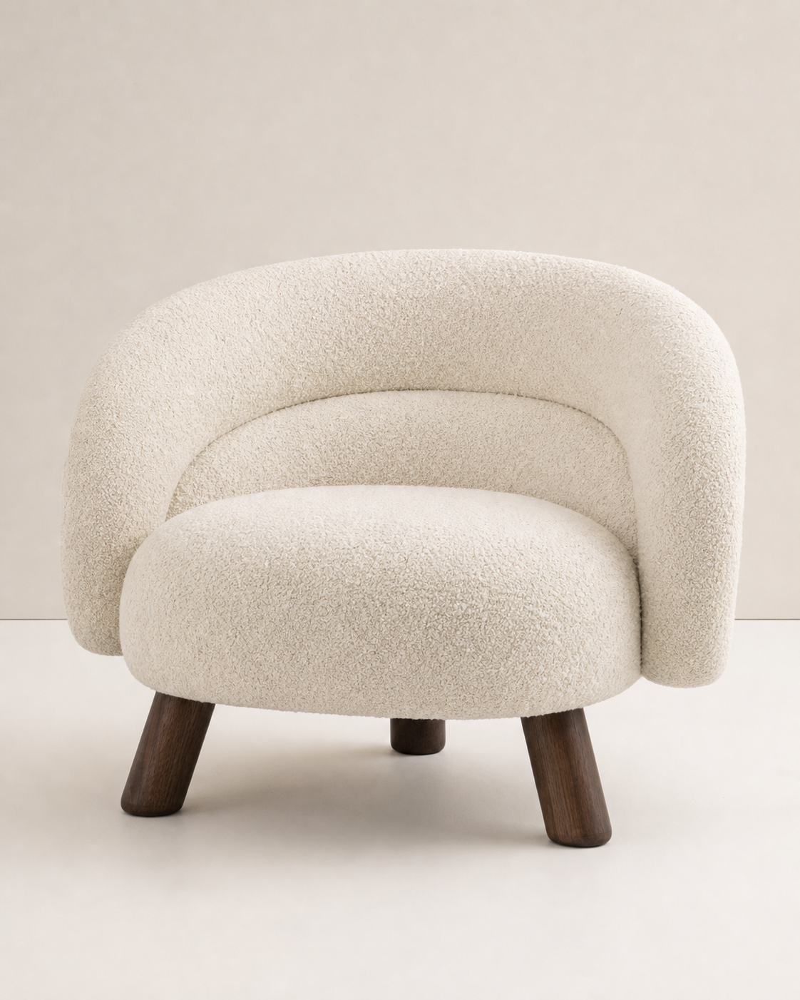

#### 详细信息

- **作者:** [Ecommerce GPT Image Prompts Studio](https://github.com/ecomimagelab)
- **来源:** 本仓库原创内容
- **发布日期:** 2026-07-22
- **语言:** en
- **适用平台:** Wayfair
- **许可证:** CC-BY-4.0

<details>
<summary><strong>生产参数、商品保真项与溯源信息</strong></summary>

| 生成模式 | 商品行业 | 使用场景 | 宽高比 |
|---|---|---|---|
| `text-to-image` | 家居与家具 | 目录商品图 | 4:5 |

- **视觉风格:** 建筑感, 明亮活泼, 静谧生活
- **背景类型:** 柔光影棚
- **素材用途:** 目录商品图
- **输入要求:** No reference image is required for this fictional unbranded product; use product-edit mode with owned source photography when adapting a real SKU.
- **商品保真项:**
  - Preserve the low armless silhouette, continuous horseshoe back with rounded side wings, and inner curved seam.
  - Preserve the thick ivory nubby bouclé upholstery and exactly three short splayed smoked-walnut cylindrical legs.
- **负面约束:** No arms, separate cushion, four visible legs, metal base, button tufting, logo, extra chair, warped seat, glossy fabric, readable text, logos, watermark, duplicate product, broken geometry, cheap CGI, collage, or border.

**来源与版权**

- Generated specifically for this repository from the recorded standalone prompt; no third-party preview image is redistributed.
- Original prompt and generated previews created for this repository after Pinterest pattern and open-source workflow research; no external preview asset is included.
- [visual-research](docs/VISUAL_RESEARCH.md)
- [visual-research](https://github.com/buluslan/gpt-image2-ecommerce)
- [visual-research](https://github.com/motiful/product-shots)
- **平台规则状态:** Platform names identify intended visual treatment only; verify current listing and advertising requirements before publication.
- **商品系列:** [ec-0030](data/prompts/ec-0030-ivory-boucle-lounge-chair-platform-set.json)

</details>

**[🚀 立即体验 →](https://www.pixpix.com/)**

---

<a id="prompt-ec-0030-shopify-limewash-architecture"></a>

### No. 137: 家居与家具 — 象牙白圈圈绒休闲椅多平台套图: SHOPIFY LIMEWASH ARCHITECTURE

 

#### 描述

让同一把象牙白圈圈绒休闲椅呈现为转化型目录图、建筑品牌图、彩色 Pinterest 大片、画廊奢华图和具有人体尺度的社交场景。

**品牌首图 · Shopify · 5:8**

#### 提示词

```text
Create one ultra-photorealistic portrait 5:8 Shopify architectural hero photograph of exactly one sculptural lounge chair. Product design: one fictional unbranded low armless lounge chair with a thick ivory nubby bouclé seat, a continuous horseshoe-shaped back that wraps into rounded side wings, a subtle seam following the inner curve, and three short splayed cylindrical legs in smoked walnut. Place the chair on pale limestone in a quiet double-height interior with curved sand-limewash walls, one tall slit window, and no other furniture. Use a low wide-lens perspective that preserves realistic chair scale, position the chair on the lower third, and leave calm vertical negative space. Use raking morning daylight, soft architectural shadows, and a warm reflected edge that separates ivory bouclé from the wall. Render physically believable materials, disciplined commercial retouching, natural microtexture, and a premium photographic finish. Keep the product identity exact: the same low armless horseshoe silhouette, rounded wings, inner seam, ivory bouclé, and three smoked-walnut legs. No arms, separate cushion, four visible legs, metal base, button tufting, logo, extra chair, warped seat, glossy fabric, oversized room, tiny chair, plant, side table, curtain, impossible architecture, readable text, logo, trademark, watermark, duplicate product, broken geometry, cheap CGI, collage, split screen, frame, or border.
```

#### 生成预览图

##### 图片 1

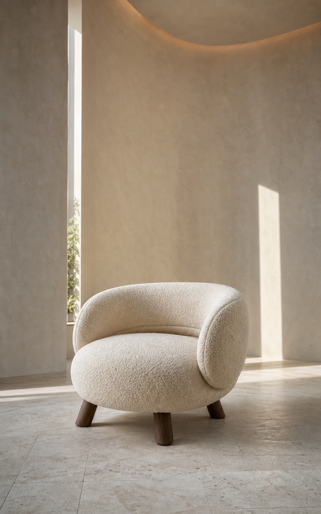

#### 详细信息

- **作者:** [Ecommerce GPT Image Prompts Studio](https://github.com/ecomimagelab)
- **来源:** 本仓库原创内容
- **发布日期:** 2026-07-22
- **语言:** en
- **适用平台:** Shopify
- **许可证:** CC-BY-4.0

<details>
<summary><strong>生产参数、商品保真项与溯源信息</strong></summary>

| 生成模式 | 商品行业 | 使用场景 | 宽高比 |
|---|---|---|---|
| `text-to-image` | 家居与家具 | 品牌首图 | 5:8 |

- **视觉风格:** 建筑感, 明亮活泼, 静谧生活
- **背景类型:** 家居空间
- **素材用途:** 品牌首图
- **输入要求:** No reference image is required for this fictional unbranded product; use product-edit mode with owned source photography when adapting a real SKU.
- **商品保真项:**
  - Preserve the low armless silhouette, continuous horseshoe back with rounded side wings, and inner curved seam.
  - Preserve the thick ivory nubby bouclé upholstery and exactly three short splayed smoked-walnut cylindrical legs.
- **负面约束:** No arms, separate cushion, four visible legs, metal base, button tufting, logo, extra chair, warped seat, glossy fabric, readable text, logos, watermark, duplicate product, broken geometry, cheap CGI, collage, or border.

**来源与版权**

- Generated specifically for this repository from the recorded standalone prompt; no third-party preview image is redistributed.
- Original prompt and generated previews created for this repository after Pinterest pattern and open-source workflow research; no external preview asset is included.
- [visual-research](docs/VISUAL_RESEARCH.md)
- [visual-research](https://github.com/buluslan/gpt-image2-ecommerce)
- [visual-research](https://github.com/motiful/product-shots)
- **平台规则状态:** Platform names identify intended visual treatment only; verify current listing and advertising requirements before publication.
- **商品系列:** [ec-0030](data/prompts/ec-0030-ivory-boucle-lounge-chair-platform-set.json)

</details>

**[🚀 立即体验 →](https://www.pixpix.com/)**

---

<a id="prompt-ec-0030-pinterest-saffron-cobalt-set"></a>

### No. 138: 家居与家具 — 象牙白圈圈绒休闲椅多平台套图: PINTEREST SAFFRON-COBALT SET

 

#### 描述

让同一把象牙白圈圈绒休闲椅呈现为转化型目录图、建筑品牌图、彩色 Pinterest 大片、画廊奢华图和具有人体尺度的社交场景。

**品牌首图 · Pinterest · 5:8**

#### 提示词

```text
Create one save-worthy ultra-photorealistic portrait 5:8 Pinterest furniture editorial of exactly one sculptural lounge chair. Product design: one fictional unbranded low armless lounge chair with a thick ivory nubby bouclé seat, a continuous horseshoe-shaped back that wraps into rounded side wings, a subtle seam following the inner curve, and three short splayed cylindrical legs in smoked walnut. Set the chair on a matte saffron floor against a deep cobalt wall with one oversized circular shadow and a narrow dusty-pink vertical plane; add no props. Use a bold front three-quarter composition with the chair fully visible, strong color blocking, and generous poster-like space. Use hard graphic studio sun, a controlled fill on the ivory upholstery, crisp leg shadows, and rich but natural color. Render physically believable materials, disciplined commercial retouching, natural microtexture, and a premium photographic finish. Keep the product identity exact: the same low armless horseshoe silhouette, rounded wings, inner seam, ivory bouclé, and three smoked-walnut legs. No arms, separate cushion, four visible legs, metal base, button tufting, logo, extra chair, warped seat, glossy fabric, text, poster graphics, second chair, checkerboard, floating geometry, readable text, logo, trademark, watermark, duplicate product, broken geometry, cheap CGI, collage, split screen, frame, or border.
```

#### 生成预览图

##### 图片 1

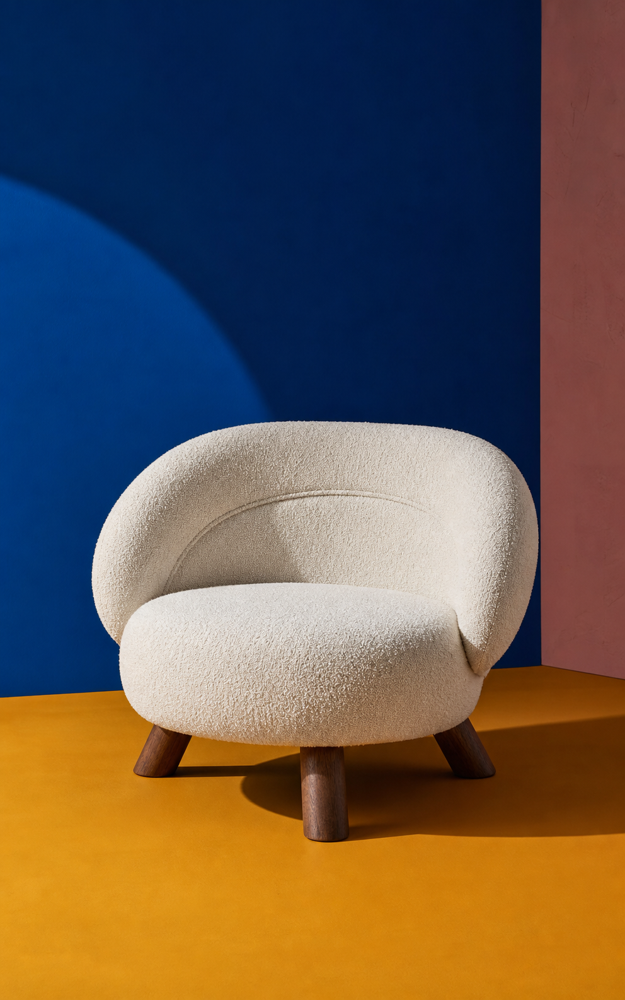

#### 详细信息

- **作者:** [Ecommerce GPT Image Prompts Studio](https://github.com/ecomimagelab)
- **来源:** 本仓库原创内容
- **发布日期:** 2026-07-22
- **语言:** en
- **适用平台:** Pinterest
- **许可证:** CC-BY-4.0

<details>
<summary><strong>生产参数、商品保真项与溯源信息</strong></summary>

| 生成模式 | 商品行业 | 使用场景 | 宽高比 |
|---|---|---|---|
| `text-to-image` | 家居与家具 | 品牌首图 | 5:8 |

- **视觉风格:** 建筑感, 明亮活泼, 静谧生活
- **背景类型:** 彩色影棚
- **素材用途:** 社交创意
- **输入要求:** No reference image is required for this fictional unbranded product; use product-edit mode with owned source photography when adapting a real SKU.
- **商品保真项:**
  - Preserve the low armless silhouette, continuous horseshoe back with rounded side wings, and inner curved seam.
  - Preserve the thick ivory nubby bouclé upholstery and exactly three short splayed smoked-walnut cylindrical legs.
- **负面约束:** No arms, separate cushion, four visible legs, metal base, button tufting, logo, extra chair, warped seat, glossy fabric, readable text, logos, watermark, duplicate product, broken geometry, cheap CGI, collage, or border.

**来源与版权**

- Generated specifically for this repository from the recorded standalone prompt; no third-party preview image is redistributed.
- Original prompt and generated previews created for this repository after Pinterest pattern and open-source workflow research; no external preview asset is included.
- [visual-research](docs/VISUAL_RESEARCH.md)
- [visual-research](https://github.com/buluslan/gpt-image2-ecommerce)
- [visual-research](https://github.com/motiful/product-shots)
- **平台规则状态:** Platform names identify intended visual treatment only; verify current listing and advertising requirements before publication.
- **商品系列:** [ec-0030](data/prompts/ec-0030-ivory-boucle-lounge-chair-platform-set.json)

</details>

**[🚀 立即体验 →](https://www.pixpix.com/)**

---

<a id="prompt-ec-0030-tmall-luxury-stone-gallery"></a>

### No. 139: 家居与家具 — 象牙白圈圈绒休闲椅多平台套图: TMALL LUXURY STONE GALLERY

 

#### 描述

让同一把象牙白圈圈绒休闲椅呈现为转化型目录图、建筑品牌图、彩色 Pinterest 大片、画廊奢华图和具有人体尺度的社交场景。

**品牌首图 · 天猫奢品 · 4:5**

#### 提示词

```text
Create one cinematic ultra-photorealistic portrait 4:5 luxury furniture launch image of exactly one sculptural lounge chair. Product design: one fictional unbranded low armless lounge chair with a thick ivory nubby bouclé seat, a continuous horseshoe-shaped back that wraps into rounded side wings, a subtle seam following the inner curve, and three short splayed cylindrical legs in smoked walnut. Place the chair on a single dark green-veined stone platform inside a shadowed gallery with charcoal plaster walls and one bronze-toned light slot. Frame symmetrically from a slightly low angle with the full chair isolated like collectible design and no surrounding objects. Use a focused warm pool on the bouclé, restrained cool ambient fill, and precise walnut highlights without theatrical haze. Render physically believable materials, disciplined commercial retouching, natural microtexture, and a premium photographic finish. Keep the product identity exact: the same low armless horseshoe silhouette, rounded wings, inner seam, ivory bouclé, and three smoked-walnut legs. No arms, separate cushion, four visible legs, metal base, button tufting, logo, extra chair, warped seat, glossy fabric, museum rope, sculpture, spotlight cone, glossy marble reflection, blacked-out fabric, readable text, logo, trademark, watermark, duplicate product, broken geometry, cheap CGI, collage, split screen, frame, or border.
```

#### 生成预览图

##### 图片 1

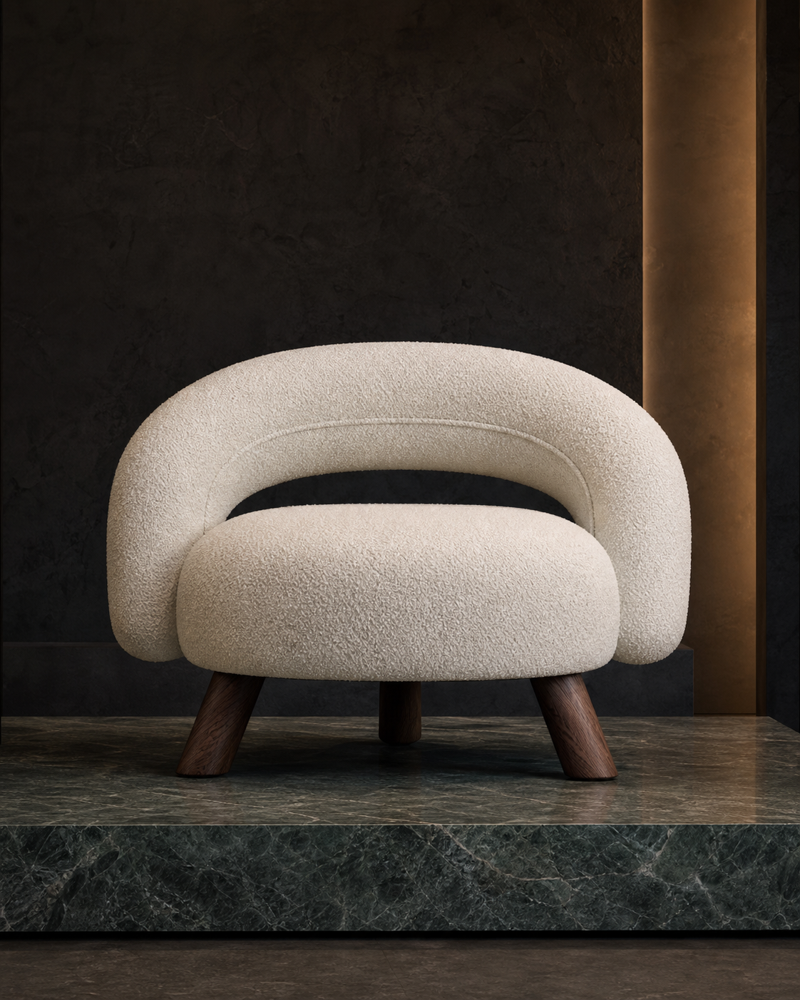

#### 详细信息

- **作者:** [Ecommerce GPT Image Prompts Studio](https://github.com/ecomimagelab)
- **来源:** 本仓库原创内容
- **发布日期:** 2026-07-22
- **语言:** en
- **适用平台:** 天猫奢品
- **许可证:** CC-BY-4.0

<details>
<summary><strong>生产参数、商品保真项与溯源信息</strong></summary>

| 生成模式 | 商品行业 | 使用场景 | 宽高比 |
|---|---|---|---|
| `text-to-image` | 家居与家具 | 品牌首图 | 4:5 |

- **视觉风格:** 建筑感, 明亮活泼, 静谧生活
- **背景类型:** 天然材质
- **素材用途:** 品牌首图
- **输入要求:** No reference image is required for this fictional unbranded product; use product-edit mode with owned source photography when adapting a real SKU.
- **商品保真项:**
  - Preserve the low armless silhouette, continuous horseshoe back with rounded side wings, and inner curved seam.
  - Preserve the thick ivory nubby bouclé upholstery and exactly three short splayed smoked-walnut cylindrical legs.
- **负面约束:** No arms, separate cushion, four visible legs, metal base, button tufting, logo, extra chair, warped seat, glossy fabric, readable text, logos, watermark, duplicate product, broken geometry, cheap CGI, collage, or border.

**来源与版权**

- Generated specifically for this repository from the recorded standalone prompt; no third-party preview image is redistributed.
- Original prompt and generated previews created for this repository after Pinterest pattern and open-source workflow research; no external preview asset is included.
- [visual-research](docs/VISUAL_RESEARCH.md)
- [visual-research](https://github.com/buluslan/gpt-image2-ecommerce)
- [visual-research](https://github.com/motiful/product-shots)
- **平台规则状态:** Platform names identify intended visual treatment only; verify current listing and advertising requirements before publication.
- **商品系列:** [ec-0030](data/prompts/ec-0030-ivory-boucle-lounge-chair-platform-set.json)

</details>

**[🚀 立即体验 →](https://www.pixpix.com/)**

---

<a id="prompt-ec-0030-instagram-reading-moment"></a>

### No. 140: 家居与家具 — 象牙白圈圈绒休闲椅多平台套图: INSTAGRAM SHOP READING MOMENT

 

#### 描述

让同一把象牙白圈圈绒休闲椅呈现为转化型目录图、建筑品牌图、彩色 Pinterest 大片、画廊奢华图和具有人体尺度的社交场景。

**模特上身 · Instagram Shop · 4:5**

#### 提示词

```text
Create one natural ultra-photorealistic portrait 4:5 Instagram Shop lifestyle photograph featuring exactly one sculptural lounge chair and one adult person. Product design: one fictional unbranded low armless lounge chair with a thick ivory nubby bouclé seat, a continuous horseshoe-shaped back that wraps into rounded side wings, a subtle seam following the inner curve, and three short splayed cylindrical legs in smoked walnut. An adult woman in a loose terracotta knit and cream trousers sits naturally sideways in the chair reading a blank-cover magazine in a sunlit apartment with pale oak floor and warm-white wall. Show her from head to bare ankles, keep the chair silhouette, side wings, seam, upholstery, and all visible legs readable, and avoid covering the product. Use soft afternoon window light, gentle direct-flash lift, natural skin texture, and relaxed editorial color. Render physically believable materials, disciplined commercial retouching, natural microtexture, and a premium photographic finish. Keep the product identity exact: the same low armless horseshoe silhouette, rounded wings, inner seam, ivory bouclé, and three smoked-walnut legs. No arms, separate cushion, four visible legs, metal base, button tufting, logo, extra chair, warped seat, glossy fabric, readable magazine text, extra furniture, distorted hands, hidden chair, staged smile, readable text, logo, trademark, watermark, duplicate product, broken geometry, cheap CGI, collage, split screen, frame, or border.
```

#### 生成预览图

##### 图片 1

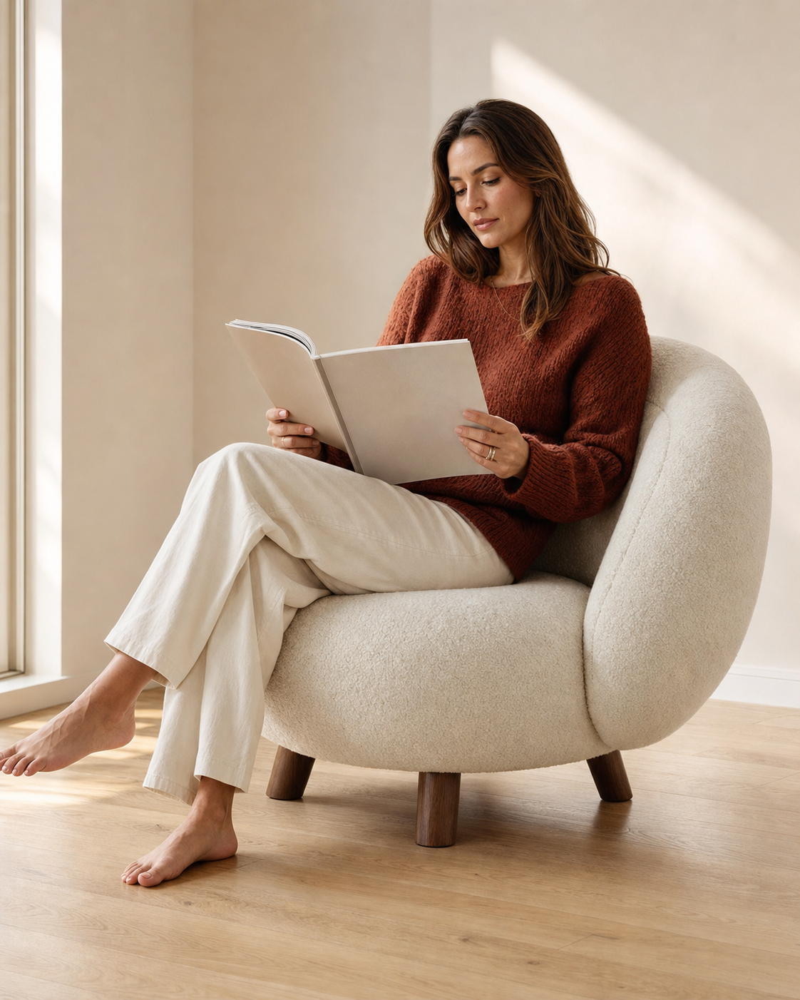

#### 详细信息

- **作者:** [Ecommerce GPT Image Prompts Studio](https://github.com/ecomimagelab)
- **来源:** 本仓库原创内容
- **发布日期:** 2026-07-22
- **语言:** en
- **适用平台:** Instagram Shop
- **许可证:** CC-BY-4.0

<details>
<summary><strong>生产参数、商品保真项与溯源信息</strong></summary>

| 生成模式 | 商品行业 | 使用场景 | 宽高比 |
|---|---|---|---|
| `text-to-image` | 家居与家具 | 模特上身 | 4:5 |

- **视觉风格:** 建筑感, 明亮活泼, 静谧生活
- **背景类型:** 家居空间
- **素材用途:** 社交创意
- **输入要求:** No reference image is required for this fictional unbranded product; use product-edit mode with owned source photography when adapting a real SKU.
- **商品保真项:**
  - Preserve the low armless silhouette, continuous horseshoe back with rounded side wings, and inner curved seam.
  - Preserve the thick ivory nubby bouclé upholstery and exactly three short splayed smoked-walnut cylindrical legs.
- **负面约束:** No arms, separate cushion, four visible legs, metal base, button tufting, logo, extra chair, warped seat, glossy fabric, readable text, logos, watermark, duplicate product, broken geometry, cheap CGI, collage, or border.

**来源与版权**

- Generated specifically for this repository from the recorded standalone prompt; no third-party preview image is redistributed.
- Original prompt and generated previews created for this repository after Pinterest pattern and open-source workflow research; no external preview asset is included.
- [visual-research](docs/VISUAL_RESEARCH.md)
- [visual-research](https://github.com/buluslan/gpt-image2-ecommerce)
- [visual-research](https://github.com/motiful/product-shots)
- **平台规则状态:** Platform names identify intended visual treatment only; verify current listing and advertising requirements before publication.
- **商品系列:** [ec-0030](data/prompts/ec-0030-ivory-boucle-lounge-chair-platform-set.json)

</details>

**[🚀 立即体验 →](https://www.pixpix.com/)**

---

<a id="prompt-ec-0029-amazon-fashion-main-image"></a>

### No. 141: 鞋履 — 浓缩咖啡色便士乐福鞋多平台套图: AMAZON FASHION MAIN IMAGE

 

#### 描述

让同一双浓缩咖啡色乐福鞋在白底商品图、石材大片、街头动态、工坊细节和图书馆风 Pinterest 图片中保持一致。

**平台主图 · Amazon Fashion · 4:5**

#### 提示词

```text
Create one ultra-photorealistic portrait 4:5 Amazon Fashion main image of exactly one matching pair of premium loafers. Product design: one fictional unbranded pair of men's penny loafers in dark espresso burnished box-calf leather, with an almond toe, raised hand-stitched moccasin apron, one clean saddle strap with a narrow oval cutout, oxblood leather lining, a low stacked dark-brown leather heel, and a slim black outsole. Arrange the left shoe in a front three-quarter view and the right shoe slightly behind at a complementary side angle on seamless pure #FFFFFF; show both complete shoes. Center the pair with about 78% frame fill, clear toe shape, saddle cutouts, apron seams, heels, and outsole edges. Use a broad high-key softbox, controlled leather highlights, realistic grounding shadows, and accurate espresso color. Render physically believable materials, disciplined commercial retouching, natural microtexture, and a premium photographic finish. Keep the product identity exact: the same almond toe, apron seam, saddle cutout, espresso leather, oxblood lining, stacked heel, and black outsole. No laces, tassels, metal bit, logo, sneaker sole, square toe, extra shoe, mismatched pair, plastic leather, shoe box, tissue, feet, props, cropped heel, floating pair, readable text, logo, trademark, watermark, duplicate product, broken geometry, cheap CGI, collage, split screen, frame, or border.
```

#### 生成预览图

##### 图片 1

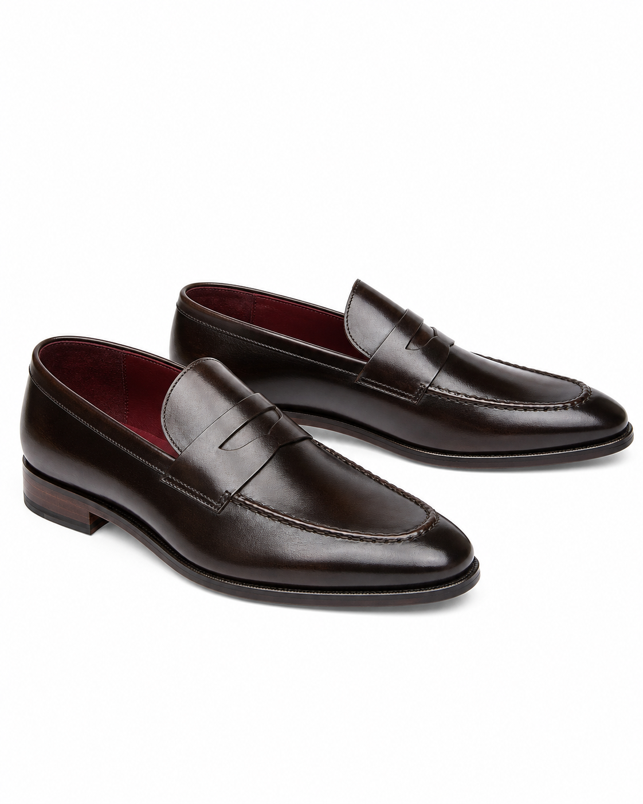

#### 详细信息

- **作者:** [Ecommerce GPT Image Prompts Studio](https://github.com/ecomimagelab)
- **来源:** 本仓库原创内容
- **发布日期:** 2026-07-22
- **语言:** en
- **适用平台:** Amazon Fashion
- **许可证:** CC-BY-4.0

<details>
<summary><strong>生产参数、商品保真项与溯源信息</strong></summary>

| 生成模式 | 商品行业 | 使用场景 | 宽高比 |
|---|---|---|---|
| `text-to-image` | 鞋履 | 平台主图 | 4:5 |

- **视觉风格:** 高端奢华, 社交原生, 手作质感
- **背景类型:** 纯白背景
- **素材用途:** 平台主图
- **输入要求:** No reference image is required for this fictional unbranded product; use product-edit mode with owned source photography when adapting a real SKU.
- **商品保真项:**
  - Preserve the dark espresso burnished box-calf, almond toe, raised moccasin apron, and saddle strap with narrow oval cutout.
  - Preserve the oxblood lining, low stacked dark-brown heel, slim black outsole, and unbranded upper.
- **负面约束:** No laces, tassels, metal bit, logo, sneaker sole, square toe, extra shoe, mismatched pair, plastic leather, readable text, logos, watermark, duplicate product, broken geometry, cheap CGI, collage, or border.

**来源与版权**

- Generated specifically for this repository from the recorded standalone prompt; no third-party preview image is redistributed.
- Original prompt and generated previews created for this repository after Pinterest pattern and open-source workflow research; no external preview asset is included.
- [visual-research](docs/VISUAL_RESEARCH.md)
- [visual-research](https://github.com/buluslan/gpt-image2-ecommerce)
- [visual-research](https://github.com/motiful/product-shots)
- **平台规则状态:** Platform names identify intended visual treatment only; verify current listing and advertising requirements before publication.
- **商品系列:** [ec-0029](data/prompts/ec-0029-espresso-penny-loafer-platform-set.json)

</details>

**[🚀 立即体验 →](https://www.pixpix.com/)**

---

<a id="prompt-ec-0029-farfetch-limestone-editorial"></a>

### No. 142: 鞋履 — 浓缩咖啡色便士乐福鞋多平台套图: FARFETCH LIMESTONE EDITORIAL

 

#### 描述

让同一双浓缩咖啡色乐福鞋在白底商品图、石材大片、街头动态、工坊细节和图书馆风 Pinterest 图片中保持一致。

**品牌首图 · Farfetch · 4:5**

#### 提示词

```text
Create one ultra-photorealistic portrait 4:5 Farfetch-style luxury footwear editorial with exactly one matching pair of loafers. Product design: one fictional unbranded pair of men's penny loafers in dark espresso burnished box-calf leather, with an almond toe, raised hand-stitched moccasin apron, one clean saddle strap with a narrow oval cutout, oxblood leather lining, a low stacked dark-brown leather heel, and a slim black outsole. Place one shoe upright and rest the second across a pale split-limestone block in a warm gray studio; add no other prop. Use an off-center sculptural arrangement, full shoe visibility, low camera height, and crisp negative space. Use hard raking daylight with a narrow warm bounce that reveals burnishing, calfskin grain, apron stitches, and stacked heel layers. Render physically believable materials, disciplined commercial retouching, natural microtexture, and a premium photographic finish. Keep the product identity exact: the same almond toe, apron seam, saddle cutout, espresso leather, oxblood lining, stacked heel, and black outsole. No laces, tassels, metal bit, logo, sneaker sole, square toe, extra shoe, mismatched pair, plastic leather, marble veining, feet, clothing, floating shoe, crushed upper, readable text, logo, trademark, watermark, duplicate product, broken geometry, cheap CGI, collage, split screen, frame, or border.
```

#### 生成预览图

##### 图片 1

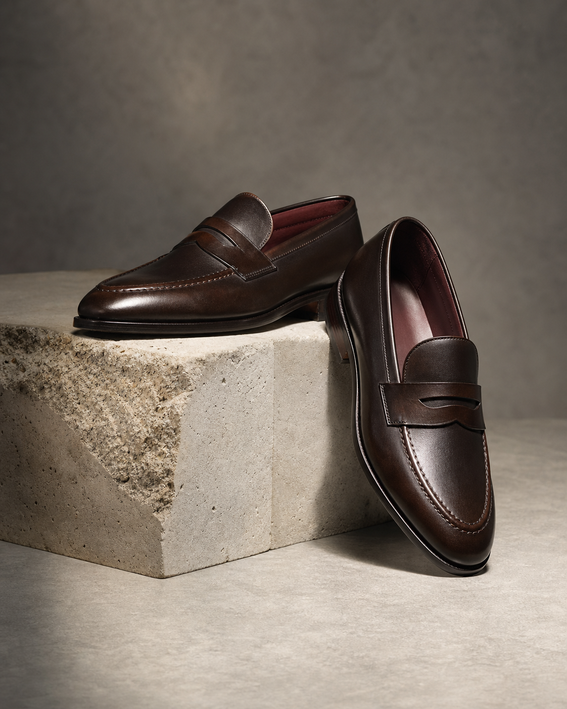

#### 详细信息

- **作者:** [Ecommerce GPT Image Prompts Studio](https://github.com/ecomimagelab)
- **来源:** 本仓库原创内容
- **发布日期:** 2026-07-22
- **语言:** en
- **适用平台:** Farfetch
- **许可证:** CC-BY-4.0

<details>
<summary><strong>生产参数、商品保真项与溯源信息</strong></summary>

| 生成模式 | 商品行业 | 使用场景 | 宽高比 |
|---|---|---|---|
| `text-to-image` | 鞋履 | 品牌首图 | 4:5 |

- **视觉风格:** 高端奢华, 社交原生, 手作质感
- **背景类型:** 天然材质
- **素材用途:** 目录商品图
- **输入要求:** No reference image is required for this fictional unbranded product; use product-edit mode with owned source photography when adapting a real SKU.
- **商品保真项:**
  - Preserve the dark espresso burnished box-calf, almond toe, raised moccasin apron, and saddle strap with narrow oval cutout.
  - Preserve the oxblood lining, low stacked dark-brown heel, slim black outsole, and unbranded upper.
- **负面约束:** No laces, tassels, metal bit, logo, sneaker sole, square toe, extra shoe, mismatched pair, plastic leather, readable text, logos, watermark, duplicate product, broken geometry, cheap CGI, collage, or border.

**来源与版权**

- Generated specifically for this repository from the recorded standalone prompt; no third-party preview image is redistributed.
- Original prompt and generated previews created for this repository after Pinterest pattern and open-source workflow research; no external preview asset is included.
- [visual-research](docs/VISUAL_RESEARCH.md)
- [visual-research](https://github.com/buluslan/gpt-image2-ecommerce)
- [visual-research](https://github.com/motiful/product-shots)
- **平台规则状态:** Platform names identify intended visual treatment only; verify current listing and advertising requirements before publication.
- **商品系列:** [ec-0029](data/prompts/ec-0029-espresso-penny-loafer-platform-set.json)

</details>

**[🚀 立即体验 →](https://www.pixpix.com/)**

---

<a id="prompt-ec-0029-tiktok-city-step"></a>

### No. 143: 鞋履 — 浓缩咖啡色便士乐福鞋多平台套图: TIKTOK SHOP CITY STEP

 

#### 描述

让同一双浓缩咖啡色乐福鞋在白底商品图、石材大片、街头动态、工坊细节和图书馆风 Pinterest 图片中保持一致。

**模特上身 · TikTok Shop · 5:8**

#### 提示词

```text
Create one energetic ultra-photorealistic portrait 5:8 TikTok Shop street-fashion frame featuring the same premium loafers on one adult model. Product design: one fictional unbranded pair of men's penny loafers in dark espresso burnished box-calf leather, with an almond toe, raised hand-stitched moccasin apron, one clean saddle strap with a narrow oval cutout, oxblood leather lining, a low stacked dark-brown leather heel, and a slim black outsole. Show an adult man from mid-calf down stepping off a brushed-steel subway threshold onto wet charcoal pavement, wearing cream ribbed socks and cropped charcoal trousers. Use a low close tracking angle with both loafers visible, the lead shoe tack sharp and the rear shoe carrying restrained motion blur. Use direct on-camera flash, cool city reflections, and a warm tungsten streak for spontaneous night energy while preserving leather detail. Render physically believable materials, disciplined commercial retouching, natural microtexture, and a premium photographic finish. Keep the product identity exact: the same almond toe, apron seam, saddle cutout, espresso leather, oxblood lining, stacked heel, and black outsole. No laces, tassels, metal bit, logo, sneaker sole, square toe, extra shoe, mismatched pair, plastic leather, brand signage, bare feet, distorted ankles, extra legs, shoe morphing, readable text, logo, trademark, watermark, duplicate product, broken geometry, cheap CGI, collage, split screen, frame, or border.
```

#### 生成预览图

##### 图片 1

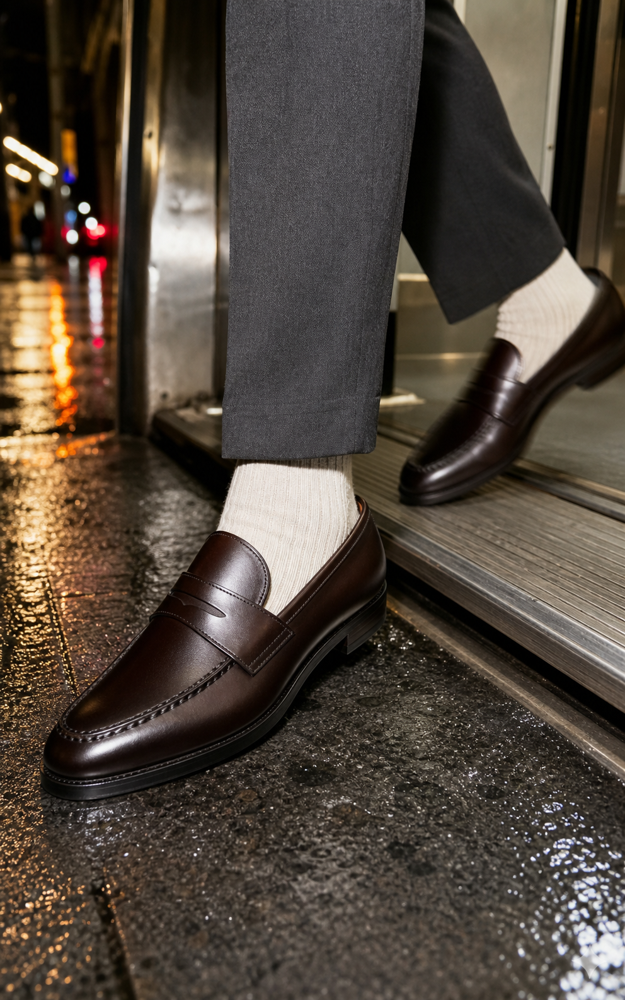

#### 详细信息

- **作者:** [Ecommerce GPT Image Prompts Studio](https://github.com/ecomimagelab)
- **来源:** 本仓库原创内容
- **发布日期:** 2026-07-22
- **语言:** en
- **适用平台:** TikTok Shop
- **许可证:** CC-BY-4.0

<details>
<summary><strong>生产参数、商品保真项与溯源信息</strong></summary>

| 生成模式 | 商品行业 | 使用场景 | 宽高比 |
|---|---|---|---|
| `text-to-image` | 鞋履 | 模特上身 | 5:8 |

- **视觉风格:** 高端奢华, 社交原生, 手作质感
- **背景类型:** 生活方式实景
- **素材用途:** 社交创意
- **输入要求:** No reference image is required for this fictional unbranded product; use product-edit mode with owned source photography when adapting a real SKU.
- **商品保真项:**
  - Preserve the dark espresso burnished box-calf, almond toe, raised moccasin apron, and saddle strap with narrow oval cutout.
  - Preserve the oxblood lining, low stacked dark-brown heel, slim black outsole, and unbranded upper.
- **负面约束:** No laces, tassels, metal bit, logo, sneaker sole, square toe, extra shoe, mismatched pair, plastic leather, readable text, logos, watermark, duplicate product, broken geometry, cheap CGI, collage, or border.

**来源与版权**

- Generated specifically for this repository from the recorded standalone prompt; no third-party preview image is redistributed.
- Original prompt and generated previews created for this repository after Pinterest pattern and open-source workflow research; no external preview asset is included.
- [visual-research](docs/VISUAL_RESEARCH.md)
- [visual-research](https://github.com/buluslan/gpt-image2-ecommerce)
- [visual-research](https://github.com/motiful/product-shots)
- **平台规则状态:** Platform names identify intended visual treatment only; verify current listing and advertising requirements before publication.
- **商品系列:** [ec-0029](data/prompts/ec-0029-espresso-penny-loafer-platform-set.json)

</details>

**[🚀 立即体验 →](https://www.pixpix.com/)**

---

<a id="prompt-ec-0029-shopify-atelier-detail"></a>

### No. 144: 鞋履 — 浓缩咖啡色便士乐福鞋多平台套图: SHOPIFY ATELIER DETAIL

 

#### 描述

让同一双浓缩咖啡色乐福鞋在白底商品图、石材大片、街头动态、工坊细节和图书馆风 Pinterest 图片中保持一致。

**细节与微距 · Shopify · 4:5**

#### 提示词

```text
Create one ultra-photorealistic portrait 4:5 Shopify craftsmanship detail photograph of exactly one premium loafer. Product design: one fictional unbranded pair of men's penny loafers in dark espresso burnished box-calf leather, with an almond toe, raised hand-stitched moccasin apron, one clean saddle strap with a narrow oval cutout, oxblood leather lining, a low stacked dark-brown leather heel, and a slim black outsole. Rest one shoe on a clean warm-gray leatherworker's block with the heel slightly raised; show only one restrained length of dark thread far behind. Frame a close three-quarter macro from toe to heel so the saddle cutout, hand-stitched apron, leather pores, welt edge, lining, and heel layers remain visible. Use soft north-window light plus a slim edge strip to reveal burnished tonal variation without oily glare. Render physically believable materials, disciplined commercial retouching, natural microtexture, and a premium photographic finish. Keep the product identity exact: the same almond toe, apron seam, saddle cutout, espresso leather, oxblood lining, stacked heel, and black outsole. No laces, tassels, metal bit, logo, sneaker sole, square toe, extra shoe, mismatched pair, plastic leather, tools covering the shoe, second shoe, hands, loose sole, unfinished construction, readable text, logo, trademark, watermark, duplicate product, broken geometry, cheap CGI, collage, split screen, frame, or border.
```

#### 生成预览图

##### 图片 1

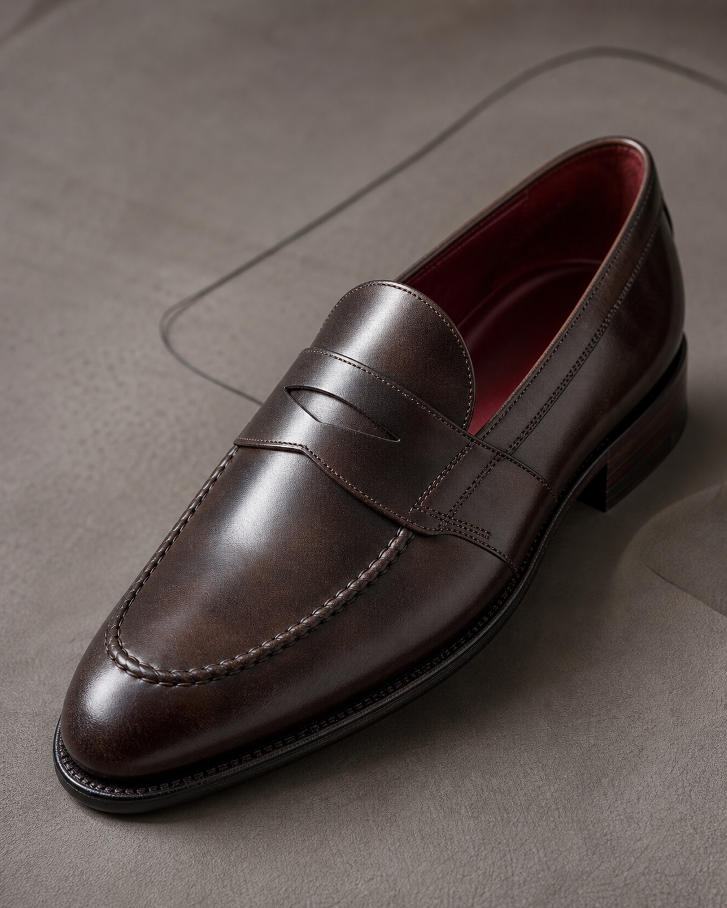

#### 详细信息

- **作者:** [Ecommerce GPT Image Prompts Studio](https://github.com/ecomimagelab)
- **来源:** 本仓库原创内容
- **发布日期:** 2026-07-22
- **语言:** en
- **适用平台:** Shopify
- **许可证:** CC-BY-4.0

<details>
<summary><strong>生产参数、商品保真项与溯源信息</strong></summary>

| 生成模式 | 商品行业 | 使用场景 | 宽高比 |
|---|---|---|---|
| `text-to-image` | 鞋履 | 细节与微距 | 4:5 |

- **视觉风格:** 高端奢华, 社交原生, 手作质感
- **背景类型:** 柔光影棚
- **素材用途:** 商品副图
- **输入要求:** No reference image is required for this fictional unbranded product; use product-edit mode with owned source photography when adapting a real SKU.
- **商品保真项:**
  - Preserve the dark espresso burnished box-calf, almond toe, raised moccasin apron, and saddle strap with narrow oval cutout.
  - Preserve the oxblood lining, low stacked dark-brown heel, slim black outsole, and unbranded upper.
- **负面约束:** No laces, tassels, metal bit, logo, sneaker sole, square toe, extra shoe, mismatched pair, plastic leather, readable text, logos, watermark, duplicate product, broken geometry, cheap CGI, collage, or border.

**来源与版权**

- Generated specifically for this repository from the recorded standalone prompt; no third-party preview image is redistributed.
- Original prompt and generated previews created for this repository after Pinterest pattern and open-source workflow research; no external preview asset is included.
- [visual-research](docs/VISUAL_RESEARCH.md)
- [visual-research](https://github.com/buluslan/gpt-image2-ecommerce)
- [visual-research](https://github.com/motiful/product-shots)
- **平台规则状态:** Platform names identify intended visual treatment only; verify current listing and advertising requirements before publication.
- **商品系列:** [ec-0029](data/prompts/ec-0029-espresso-penny-loafer-platform-set.json)

</details>

**[🚀 立即体验 →](https://www.pixpix.com/)**

---

<a id="prompt-ec-0029-pinterest-library-still-life"></a>

### No. 145: 鞋履 — 浓缩咖啡色便士乐福鞋多平台套图: PINTEREST LIBRARY STILL LIFE

 

#### 描述

让同一双浓缩咖啡色乐福鞋在白底商品图、石材大片、街头动态、工坊细节和图书馆风 Pinterest 图片中保持一致。

**生活方式场景 · Pinterest · 5:8**

#### 提示词

```text
Create one save-worthy ultra-photorealistic portrait 5:8 Pinterest menswear still life with exactly one matching pair of premium loafers. Product design: one fictional unbranded pair of men's penny loafers in dark espresso burnished box-calf leather, with an almond toe, raised hand-stitched moccasin apron, one clean saddle strap with a narrow oval cutout, oxblood leather lining, a low stacked dark-brown leather heel, and a slim black outsole. Place the pair beneath a low walnut library bench on an antique-red wool runner; include the lower edge of one closed blank-cover book and a pool of late-afternoon sun, with no person. Use a calm eye-level crop showing both full shoes, the oxblood lining of one shoe, rich floor texture, and layered negative space. Use warm window light, deep but open shadows, and quiet editorial film color. Render physically believable materials, disciplined commercial retouching, natural microtexture, and a premium photographic finish. Keep the product identity exact: the same almond toe, apron seam, saddle cutout, espresso leather, oxblood lining, stacked heel, and black outsole. No laces, tassels, metal bit, logo, sneaker sole, square toe, extra shoe, mismatched pair, plastic leather, readable book title, socks, clothing pile, dust, vintage damage, readable text, logo, trademark, watermark, duplicate product, broken geometry, cheap CGI, collage, split screen, frame, or border.
```

#### 生成预览图

##### 图片 1

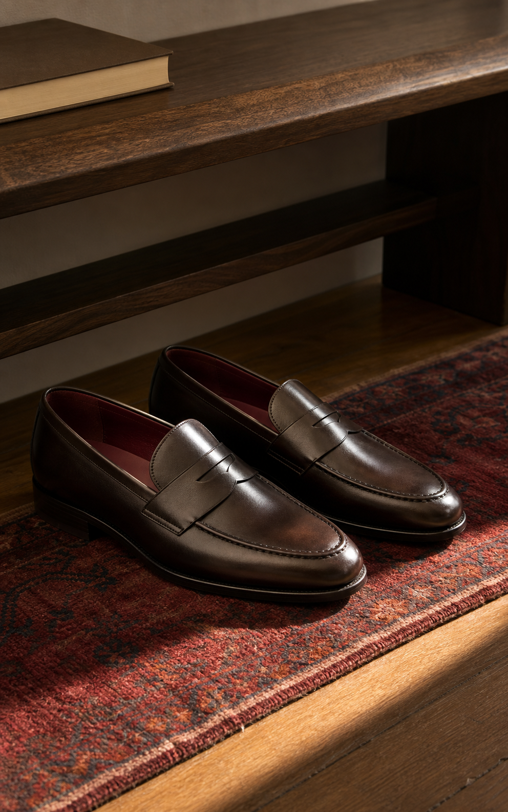

#### 详细信息

- **作者:** [Ecommerce GPT Image Prompts Studio](https://github.com/ecomimagelab)
- **来源:** 本仓库原创内容
- **发布日期:** 2026-07-22
- **语言:** en
- **适用平台:** Pinterest
- **许可证:** CC-BY-4.0

<details>
<summary><strong>生产参数、商品保真项与溯源信息</strong></summary>

| 生成模式 | 商品行业 | 使用场景 | 宽高比 |
|---|---|---|---|
| `text-to-image` | 鞋履 | 生活方式场景 | 5:8 |

- **视觉风格:** 高端奢华, 社交原生, 手作质感
- **背景类型:** 家居空间
- **素材用途:** 社交创意
- **输入要求:** No reference image is required for this fictional unbranded product; use product-edit mode with owned source photography when adapting a real SKU.
- **商品保真项:**
  - Preserve the dark espresso burnished box-calf, almond toe, raised moccasin apron, and saddle strap with narrow oval cutout.
  - Preserve the oxblood lining, low stacked dark-brown heel, slim black outsole, and unbranded upper.
- **负面约束:** No laces, tassels, metal bit, logo, sneaker sole, square toe, extra shoe, mismatched pair, plastic leather, readable text, logos, watermark, duplicate product, broken geometry, cheap CGI, collage, or border.

**来源与版权**

- Generated specifically for this repository from the recorded standalone prompt; no third-party preview image is redistributed.
- Original prompt and generated previews created for this repository after Pinterest pattern and open-source workflow research; no external preview asset is included.
- [visual-research](docs/VISUAL_RESEARCH.md)
- [visual-research](https://github.com/buluslan/gpt-image2-ecommerce)
- [visual-research](https://github.com/motiful/product-shots)
- **平台规则状态:** Platform names identify intended visual treatment only; verify current listing and advertising requirements before publication.
- **商品系列:** [ec-0029](data/prompts/ec-0029-espresso-penny-loafer-platform-set.json)

</details>

**[🚀 立即体验 →](https://www.pixpix.com/)**

---

<a id="prompt-ec-0028-sephora-clean-catalog"></a>

### No. 146: 美妆与护肤 — 烟紫色香水多平台套图: SEPHORA CLEAN CATALOG

 

#### 描述

让同一只烟紫色香水瓶呈现为美妆白底、暗调奢华首发、湿石品牌图、社交美妆片和 Pinterest 收藏级静物。

**目录商品图 · Sephora · 4:5**

#### 提示词

```text
Create one ultra-photorealistic portrait 4:5 Sephora-style clean catalog photograph of exactly one premium fragrance bottle. Product design: one fictional unbranded 75 ml flattened rectangular optical-glass perfume bottle with softly chamfered corners, deep smoke-violet liquid, a thick crystal-clear base, a short brushed-palladium cylindrical cap with one narrow oxblood enamel top disc, and a blank vertical frosted-ivory label with no writing. Stand the capped bottle upright on a low warm-ivory lacquer plinth against a seamless cream cyclorama; include no props. Use a centered front three-quarter view with the complete silhouette visible and the bottle filling about 72% of frame height. Use one large upper-left softbox, a narrow palladium edge strip, controlled violet refraction through the liquid, and a delicate grounding shadow. Render physically believable materials, disciplined commercial retouching, natural microtexture, and a premium photographic finish. Keep the product identity exact: the same chamfered bottle proportions, smoke-violet fill, heavy clear base, palladium cap, oxblood top disc, and blank ivory label. No flowers covering the bottle, invented label copy, atomizer outside the cap, loose cap, extra bottle, colored liquid change, colored backdrop, loose cap, reflection obscuring the blank label, readable text, logo, trademark, watermark, duplicate product, broken geometry, cheap CGI, collage, split screen, frame, or border.
```

#### 生成预览图

##### 图片 1

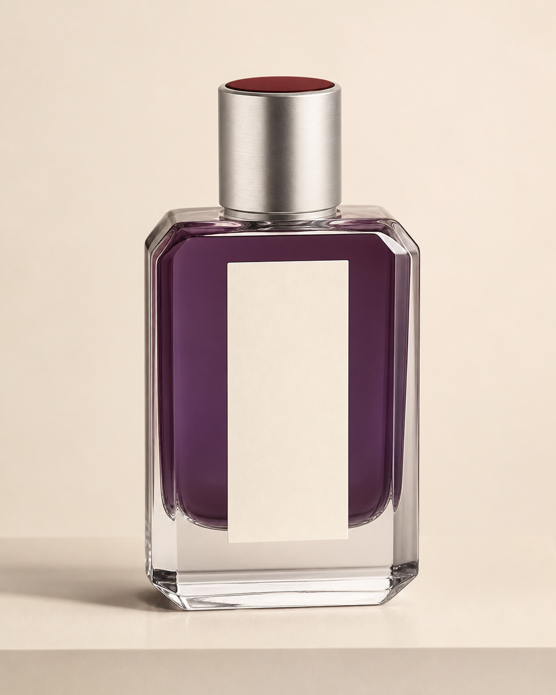

#### 详细信息

- **作者:** [Ecommerce GPT Image Prompts Studio](https://github.com/ecomimagelab)
- **来源:** 本仓库原创内容
- **发布日期:** 2026-07-22
- **语言:** en
- **适用平台:** Sephora
- **许可证:** CC-BY-4.0

<details>
<summary><strong>生产参数、商品保真项与溯源信息</strong></summary>

| 生成模式 | 商品行业 | 使用场景 | 宽高比 |
|---|---|---|---|
| `text-to-image` | 美妆与护肤 | 目录商品图 | 4:5 |

- **视觉风格:** 高端奢华, 暗调氛围, 编辑大片
- **背景类型:** 柔光影棚
- **素材用途:** 目录商品图
- **输入要求:** No reference image is required for this fictional unbranded product; use product-edit mode with owned source photography when adapting a real SKU.
- **商品保真项:**
  - Preserve the flattened chamfered optical-glass bottle, thick clear base, and deep smoke-violet liquid level.
  - Preserve the short palladium cylinder cap with oxblood top disc and the blank vertical frosted-ivory label.
- **负面约束:** No flowers covering the bottle, invented label copy, atomizer outside the cap, loose cap, extra bottle, colored liquid change, readable text, logos, watermark, duplicate product, broken geometry, cheap CGI, collage, or border.

**来源与版权**

- Generated specifically for this repository from the recorded standalone prompt; no third-party preview image is redistributed.
- Original prompt and generated previews created for this repository after Pinterest pattern and open-source workflow research; no external preview asset is included.
- [visual-research](docs/VISUAL_RESEARCH.md)
- [visual-research](https://github.com/buluslan/gpt-image2-ecommerce)
- [visual-research](https://github.com/motiful/product-shots)
- **平台规则状态:** Platform names identify intended visual treatment only; verify current listing and advertising requirements before publication.
- **商品系列:** [ec-0028](data/prompts/ec-0028-smoke-violet-fragrance-platform-set.json)

</details>

**[🚀 立即体验 →](https://www.pixpix.com/)**

---

<a id="prompt-ec-0028-tmall-luxury-obsidian-launch"></a>

### No. 147: 美妆与护肤 — 烟紫色香水多平台套图: TMALL LUXURY OBSIDIAN LAUNCH

 

#### 描述

让同一只烟紫色香水瓶呈现为美妆白底、暗调奢华首发、湿石品牌图、社交美妆片和 Pinterest 收藏级静物。

**品牌首图 · 天猫奢品 · 4:5**

#### 提示词

```text
Create one cinematic ultra-photorealistic portrait 4:5 luxury fragrance launch photograph of exactly one premium bottle. Product design: one fictional unbranded 75 ml flattened rectangular optical-glass perfume bottle with softly chamfered corners, deep smoke-violet liquid, a thick crystal-clear base, a short brushed-palladium cylindrical cap with one narrow oxblood enamel top disc, and a blank vertical frosted-ivory label with no writing. Place the capped bottle on a low black-obsidian mirror slab in a charcoal-to-black studio, with one thin crescent of violet mist behind it and no other object. Frame from a slightly low three-quarter angle; keep the entire bottle and reflection controlled, leaving refined negative space above. Use a blade of cool violet light through the glass, a warm oxblood rim on the cap disc, deep blacks, and precise specular control without crushing the label. Render physically believable materials, disciplined commercial retouching, natural microtexture, and a premium photographic finish. Keep the product identity exact: the same chamfered bottle proportions, smoke-violet fill, heavy clear base, palladium cap, oxblood top disc, and blank ivory label. No flowers covering the bottle, invented label copy, atomizer outside the cap, loose cap, extra bottle, colored liquid change, neon clutter, smoke hiding the bottle, glowing label, fantasy particles, readable text, logo, trademark, watermark, duplicate product, broken geometry, cheap CGI, collage, split screen, frame, or border.
```

#### 生成预览图

##### 图片 1

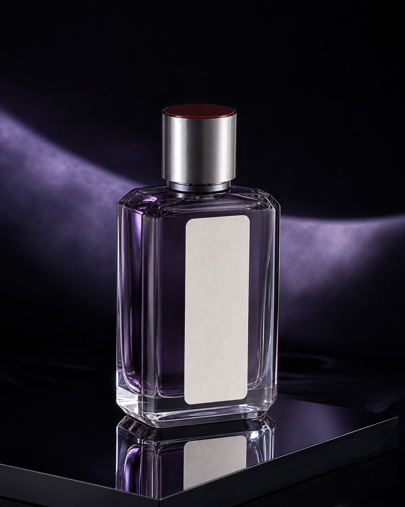

#### 详细信息

- **作者:** [Ecommerce GPT Image Prompts Studio](https://github.com/ecomimagelab)
- **来源:** 本仓库原创内容
- **发布日期:** 2026-07-22
- **语言:** en
- **适用平台:** 天猫奢品
- **许可证:** CC-BY-4.0

<details>
<summary><strong>生产参数、商品保真项与溯源信息</strong></summary>

| 生成模式 | 商品行业 | 使用场景 | 宽高比 |
|---|---|---|---|
| `text-to-image` | 美妆与护肤 | 品牌首图 | 4:5 |

- **视觉风格:** 高端奢华, 暗调氛围, 编辑大片
- **背景类型:** 暗调影棚
- **素材用途:** 品牌首图
- **输入要求:** No reference image is required for this fictional unbranded product; use product-edit mode with owned source photography when adapting a real SKU.
- **商品保真项:**
  - Preserve the flattened chamfered optical-glass bottle, thick clear base, and deep smoke-violet liquid level.
  - Preserve the short palladium cylinder cap with oxblood top disc and the blank vertical frosted-ivory label.
- **负面约束:** No flowers covering the bottle, invented label copy, atomizer outside the cap, loose cap, extra bottle, colored liquid change, readable text, logos, watermark, duplicate product, broken geometry, cheap CGI, collage, or border.

**来源与版权**

- Generated specifically for this repository from the recorded standalone prompt; no third-party preview image is redistributed.
- Original prompt and generated previews created for this repository after Pinterest pattern and open-source workflow research; no external preview asset is included.
- [visual-research](docs/VISUAL_RESEARCH.md)
- [visual-research](https://github.com/buluslan/gpt-image2-ecommerce)
- [visual-research](https://github.com/motiful/product-shots)
- **平台规则状态:** Platform names identify intended visual treatment only; verify current listing and advertising requirements before publication.
- **商品系列:** [ec-0028](data/prompts/ec-0028-smoke-violet-fragrance-platform-set.json)

</details>

**[🚀 立即体验 →](https://www.pixpix.com/)**

---

<a id="prompt-ec-0028-shopify-wet-basalt-hero"></a>

### No. 148: 美妆与护肤 — 烟紫色香水多平台套图: SHOPIFY WET-BASALT HERO

 

#### 描述

让同一只烟紫色香水瓶呈现为美妆白底、暗调奢华首发、湿石品牌图、社交美妆片和 Pinterest 收藏级静物。

**品牌首图 · Shopify · 5:8**

#### 提示词

```text
Create one ultra-photorealistic portrait 5:8 Shopify fragrance hero photograph of exactly one premium bottle. Product design: one fictional unbranded 75 ml flattened rectangular optical-glass perfume bottle with softly chamfered corners, deep smoke-violet liquid, a thick crystal-clear base, a short brushed-palladium cylindrical cap with one narrow oxblood enamel top disc, and a blank vertical frosted-ivory label with no writing. Set the capped bottle upright on a rain-darkened basalt shelf beside a shallow reflective water channel; add only two tiny natural droplets on the glass and a soft out-of-focus slate wall. Use a close eye-level three-quarter view with the bottle on the lower right third and generous clean negative space above left. Use cool overcast window light, one warm silver edge highlight, subtle violet water reflection, and a calm after-rain atmosphere. Render physically believable materials, disciplined commercial retouching, natural microtexture, and a premium photographic finish. Keep the product identity exact: the same chamfered bottle proportions, smoke-violet fill, heavy clear base, palladium cap, oxblood top disc, and blank ivory label. No flowers covering the bottle, invented label copy, atomizer outside the cap, loose cap, extra bottle, colored liquid change, large splash, waterfall, flower, moss covering the base, floating bottle, readable text, logo, trademark, watermark, duplicate product, broken geometry, cheap CGI, collage, split screen, frame, or border.
```

#### 生成预览图

##### 图片 1

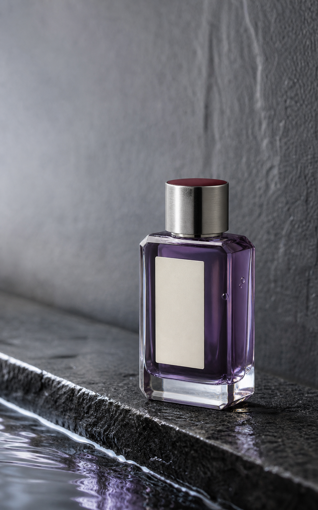

#### 详细信息

- **作者:** [Ecommerce GPT Image Prompts Studio](https://github.com/ecomimagelab)
- **来源:** 本仓库原创内容
- **发布日期:** 2026-07-22
- **语言:** en
- **适用平台:** Shopify
- **许可证:** CC-BY-4.0

<details>
<summary><strong>生产参数、商品保真项与溯源信息</strong></summary>

| 生成模式 | 商品行业 | 使用场景 | 宽高比 |
|---|---|---|---|
| `text-to-image` | 美妆与护肤 | 品牌首图 | 5:8 |

- **视觉风格:** 高端奢华, 暗调氛围, 编辑大片
- **背景类型:** 天然材质
- **素材用途:** 品牌首图
- **输入要求:** No reference image is required for this fictional unbranded product; use product-edit mode with owned source photography when adapting a real SKU.
- **商品保真项:**
  - Preserve the flattened chamfered optical-glass bottle, thick clear base, and deep smoke-violet liquid level.
  - Preserve the short palladium cylinder cap with oxblood top disc and the blank vertical frosted-ivory label.
- **负面约束:** No flowers covering the bottle, invented label copy, atomizer outside the cap, loose cap, extra bottle, colored liquid change, readable text, logos, watermark, duplicate product, broken geometry, cheap CGI, collage, or border.

**来源与版权**

- Generated specifically for this repository from the recorded standalone prompt; no third-party preview image is redistributed.
- Original prompt and generated previews created for this repository after Pinterest pattern and open-source workflow research; no external preview asset is included.
- [visual-research](docs/VISUAL_RESEARCH.md)
- [visual-research](https://github.com/buluslan/gpt-image2-ecommerce)
- [visual-research](https://github.com/motiful/product-shots)
- **平台规则状态:** Platform names identify intended visual treatment only; verify current listing and advertising requirements before publication.
- **商品系列:** [ec-0028](data/prompts/ec-0028-smoke-violet-fragrance-platform-set.json)

</details>

**[🚀 立即体验 →](https://www.pixpix.com/)**

---

<a id="prompt-ec-0028-instagram-evening-beauty"></a>

### No. 149: 美妆与护肤 — 烟紫色香水多平台套图: INSTAGRAM EVENING BEAUTY

 

#### 描述

让同一只烟紫色香水瓶呈现为美妆白底、暗调奢华首发、湿石品牌图、社交美妆片和 Pinterest 收藏级静物。

**社交电商广告 · Instagram Shop · 4:5**

#### 提示词

```text
Create one polished portrait 4:5 Instagram Shop beauty editorial featuring exactly one premium fragrance bottle and one adult model. Product design: one fictional unbranded 75 ml flattened rectangular optical-glass perfume bottle with softly chamfered corners, deep smoke-violet liquid, a thick crystal-clear base, a short brushed-palladium cylindrical cap with one narrow oxblood enamel top disc, and a blank vertical frosted-ivory label with no writing. An adult woman in a black silk sleeveless top holds the capped bottle beside her collarbone against a deep aubergine plaster wall; show natural skin texture, one silver ear cuff, and no other product. Crop from lips to upper chest, keep the hand anatomically natural, and make the bottle, blank label, cap, and liquid sharply readable. Use controlled direct flash balanced with a soft violet side light for modern evening energy and truthful skin color. Render physically believable materials, disciplined commercial retouching, natural microtexture, and a premium photographic finish. Keep the product identity exact: the same chamfered bottle proportions, smoke-violet fill, heavy clear base, palladium cap, oxblood top disc, and blank ivory label. No flowers covering the bottle, invented label copy, atomizer outside the cap, loose cap, extra bottle, colored liquid change, full face, spraying action, distorted fingers, excessive jewelry, beauty-filter skin, readable text, logo, trademark, watermark, duplicate product, broken geometry, cheap CGI, collage, split screen, frame, or border.
```

#### 生成预览图

##### 图片 1

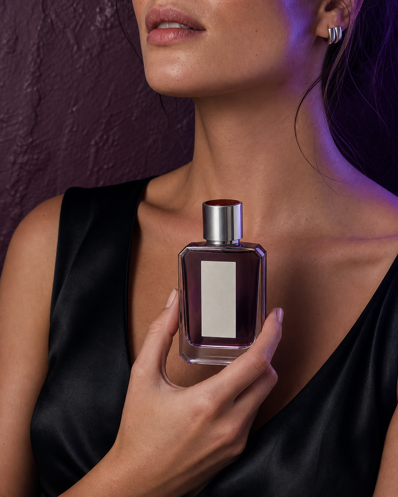

#### 详细信息

- **作者:** [Ecommerce GPT Image Prompts Studio](https://github.com/ecomimagelab)
- **来源:** 本仓库原创内容
- **发布日期:** 2026-07-22
- **语言:** en
- **适用平台:** Instagram Shop
- **许可证:** CC-BY-4.0

<details>
<summary><strong>生产参数、商品保真项与溯源信息</strong></summary>

| 生成模式 | 商品行业 | 使用场景 | 宽高比 |
|---|---|---|---|
| `text-to-image` | 美妆与护肤 | 社交电商广告 | 4:5 |

- **视觉风格:** 高端奢华, 暗调氛围, 编辑大片
- **背景类型:** 生活方式实景
- **素材用途:** 社交创意
- **输入要求:** No reference image is required for this fictional unbranded product; use product-edit mode with owned source photography when adapting a real SKU.
- **商品保真项:**
  - Preserve the flattened chamfered optical-glass bottle, thick clear base, and deep smoke-violet liquid level.
  - Preserve the short palladium cylinder cap with oxblood top disc and the blank vertical frosted-ivory label.
- **负面约束:** No flowers covering the bottle, invented label copy, atomizer outside the cap, loose cap, extra bottle, colored liquid change, readable text, logos, watermark, duplicate product, broken geometry, cheap CGI, collage, or border.

**来源与版权**

- Generated specifically for this repository from the recorded standalone prompt; no third-party preview image is redistributed.
- Original prompt and generated previews created for this repository after Pinterest pattern and open-source workflow research; no external preview asset is included.
- [visual-research](docs/VISUAL_RESEARCH.md)
- [visual-research](https://github.com/buluslan/gpt-image2-ecommerce)
- [visual-research](https://github.com/motiful/product-shots)
- **平台规则状态:** Platform names identify intended visual treatment only; verify current listing and advertising requirements before publication.
- **商品系列:** [ec-0028](data/prompts/ec-0028-smoke-violet-fragrance-platform-set.json)

</details>

**[🚀 立即体验 →](https://www.pixpix.com/)**

---

<a id="prompt-ec-0028-pinterest-scent-still-life"></a>

### No. 150: 美妆与护肤 — 烟紫色香水多平台套图: PINTEREST SCENT STILL LIFE

 

#### 描述

让同一只烟紫色香水瓶呈现为美妆白底、暗调奢华首发、湿石品牌图、社交美妆片和 Pinterest 收藏级静物。

**生活方式场景 · Pinterest · 5:8**

#### 提示词

```text
Create one save-worthy ultra-photorealistic portrait 5:8 Pinterest fragrance still life with exactly one premium bottle. Product design: one fictional unbranded 75 ml flattened rectangular optical-glass perfume bottle with softly chamfered corners, deep smoke-violet liquid, a thick crystal-clear base, a short brushed-palladium cylindrical cap with one narrow oxblood enamel top disc, and a blank vertical frosted-ivory label with no writing. Arrange the capped bottle on folded dusty-lilac silk beside one small smoked-glass pebble and a single dark plum half on a matte apricot background; props must remain secondary and separated. Use an elevated three-quarter composition with graphic diagonal folds, the full bottle unobscured, and generous visual breathing room. Use hard late-afternoon light, a soft lavender bounce, crisp glass refractions, and sophisticated plum–apricot color contrast. Render physically believable materials, disciplined commercial retouching, natural microtexture, and a premium photographic finish. Keep the product identity exact: the same chamfered bottle proportions, smoke-violet fill, heavy clear base, palladium cap, oxblood top disc, and blank ivory label. No flowers covering the bottle, invented label copy, atomizer outside the cap, loose cap, extra bottle, colored liquid change, multiple fruits, flowers, clutter, liquid spill, fabric hiding the base, readable text, logo, trademark, watermark, duplicate product, broken geometry, cheap CGI, collage, split screen, frame, or border.
```

#### 生成预览图

##### 图片 1

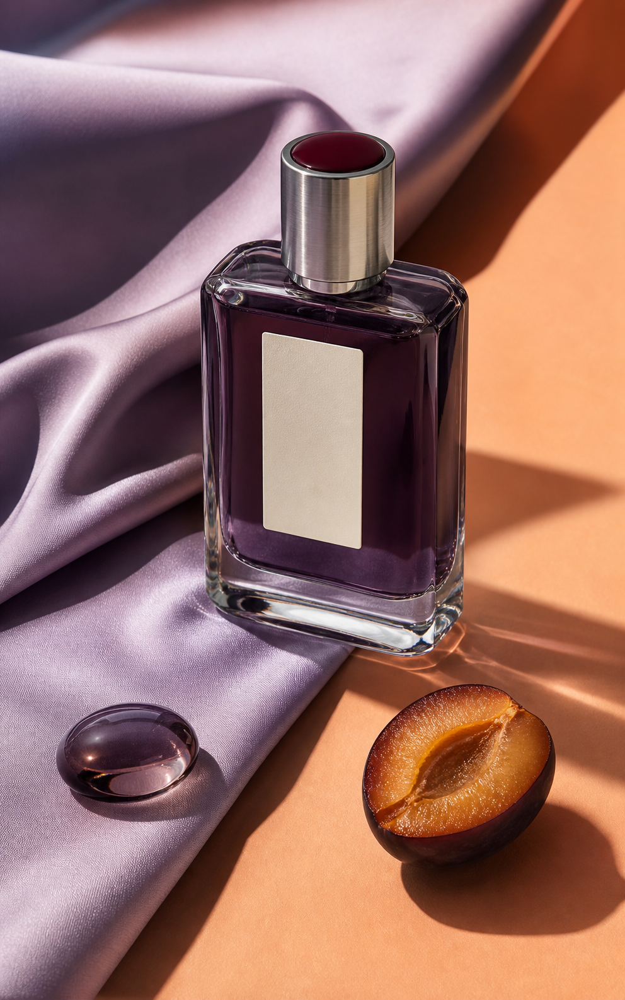

#### 详细信息

- **作者:** [Ecommerce GPT Image Prompts Studio](https://github.com/ecomimagelab)
- **来源:** 本仓库原创内容
- **发布日期:** 2026-07-22
- **语言:** en
- **适用平台:** Pinterest
- **许可证:** CC-BY-4.0

<details>
<summary><strong>生产参数、商品保真项与溯源信息</strong></summary>

| 生成模式 | 商品行业 | 使用场景 | 宽高比 |
|---|---|---|---|
| `text-to-image` | 美妆与护肤 | 生活方式场景 | 5:8 |

- **视觉风格:** 高端奢华, 暗调氛围, 编辑大片
- **背景类型:** 彩色影棚
- **素材用途:** 社交创意
- **输入要求:** No reference image is required for this fictional unbranded product; use product-edit mode with owned source photography when adapting a real SKU.
- **商品保真项:**
  - Preserve the flattened chamfered optical-glass bottle, thick clear base, and deep smoke-violet liquid level.
  - Preserve the short palladium cylinder cap with oxblood top disc and the blank vertical frosted-ivory label.
- **负面约束:** No flowers covering the bottle, invented label copy, atomizer outside the cap, loose cap, extra bottle, colored liquid change, readable text, logos, watermark, duplicate product, broken geometry, cheap CGI, collage, or border.

**来源与版权**

- Generated specifically for this repository from the recorded standalone prompt; no third-party preview image is redistributed.
- Original prompt and generated previews created for this repository after Pinterest pattern and open-source workflow research; no external preview asset is included.
- [visual-research](docs/VISUAL_RESEARCH.md)
- [visual-research](https://github.com/buluslan/gpt-image2-ecommerce)
- [visual-research](https://github.com/motiful/product-shots)
- **平台规则状态:** Platform names identify intended visual treatment only; verify current listing and advertising requirements before publication.
- **商品系列:** [ec-0028](data/prompts/ec-0028-smoke-violet-fragrance-platform-set.json)

</details>

**[🚀 立即体验 →](https://www.pixpix.com/)**

---

<a id="prompt-ec-0027-amazon-home-clean-catalog"></a>

### No. 151: 家居与家具 — 牛血红便携台灯多平台套图: AMAZON HOME CLEAN CATALOG

 

#### 描述

让同一盏牛血红与黄铜便携台灯分别呈现为 Amazon Home 白底图、Shopify 蓝调英雄图和 Pinterest 阳光家居静物。

**平台主图 · Amazon Home · 4:5**

#### 提示词

```text
Create one ultra-photorealistic portrait 4:5 catalog photograph of one fictional unbranded rechargeable table lamp. Product design: a low flattened dome shade in matte oxblood-red powder-coated aluminum, a warm opal-glass diffuser visible underneath, one slender satin-brass stem, and a compact straight-sided cylindrical oxblood base with one small circular satin-brass dimmer button centered on the front. The dome diameter is about 1.55 times the base diameter; the lamp has no visible cord, seam, logo, or vent. Show exactly one complete lamp, switched on at a gentle warm 2700K glow, standing centered in a subtle front three-quarter view on seamless pure #FFFFFF. Keep the entire shade, diffuser, stem, base and button visible, filling about 76% of frame. Use a broad high-key softbox, a precise champagne edge highlight, honest matte-metal texture, and one restrained soft grounding shadow. No furniture, props, text, logo, watermark, cable, plug, duplicate lamp, floating shade, crooked stem, extra button, distorted base, harsh bloom, CGI plastic, collage, or border.
```

#### 生成预览图

##### 图片 1


#### 详细信息

- **作者:** [Ecommerce GPT Image Prompts Studio](https://github.com/ecomimagelab)
- **来源:** 本仓库原创内容
- **发布日期:** 2026-07-22
- **语言:** en
- **适用平台:** Amazon Home
- **许可证:** CC-BY-4.0

<details>
<summary><strong>生产参数、商品保真项与溯源信息</strong></summary>

| 生成模式 | 商品行业 | 使用场景 | 宽高比 |
|---|---|---|---|
| `text-to-image` | 家居与家具 | 平台主图 | 4:5 |

- **视觉风格:** 极简干净, 建筑感, 编辑大片
- **背景类型:** 纯白背景
- **素材用途:** 平台主图
- **输入要求:** No reference image is required for this fictional lamp; use product-edit mode with a sharp front product image when adapting a real SKU.
- **商品保真项:**
  - Preserve the low flattened dome shade in matte oxblood-red aluminum and warm opal-glass diffuser visible underneath.
  - Preserve one slender satin-brass stem and the compact straight-sided oxblood cylindrical base with a single centered circular brass dimmer.
- **负面约束:** No readable text, logos, watermark, visible cable, plug, duplicate lamp, floating shade, crooked stem, extra button, distorted base, harsh bloom, CGI plastic, collage, or border.

**来源与版权**

- Generated specifically for this repository from the recorded standalone prompt; no third-party preview image is redistributed.
- Original prompt and generated previews created for this repository after Pinterest pattern and open-source workflow research; no external preview asset is included.
- [visual-research](docs/VISUAL_RESEARCH.md)
- [visual-research](https://github.com/buluslan/gpt-image2-ecommerce)
- [visual-research](https://github.com/motiful/product-shots)
- **平台规则状态:** Platform names identify intended visual treatment only; verify current listing and advertising requirements before publication.
- **商品系列:** [ec-0027](data/prompts/ec-0027-oxblood-portable-lamp-platform-set.json)

</details>

**[🚀 立即体验 →](https://www.pixpix.com/)**

---

<a id="prompt-ec-0027-shopify-blue-hour-hero"></a>

### No. 152: 家居与家具 — 牛血红便携台灯多平台套图: SHOPIFY BLUE-HOUR HERO

 

#### 描述

让同一盏牛血红与黄铜便携台灯分别呈现为 Amazon Home 白底图、Shopify 蓝调英雄图和 Pinterest 阳光家居静物。

**品牌首图 · Shopify · 4:5**

#### 提示词

```text
Create one cinematic ultra-photorealistic portrait 4:5 Shopify hero photograph of one fictional unbranded rechargeable table lamp. Preserve this exact product design: a low flattened dome shade in matte oxblood-red powder-coated aluminum, a warm opal-glass diffuser visible underneath, one slender satin-brass stem, and a compact straight-sided cylindrical oxblood base with one small circular satin-brass dimmer button centered on the front. The dome diameter is about 1.55 times the base diameter; there is no visible cord, seam, logo, or vent. Place exactly one complete lamp, switched on at 2700K, on a monolithic pale limestone side table in a minimal blue-hour interior. Frame it from a low three-quarter angle against a deep mineral-blue plaster wall with one soft arched opening far behind. Let the warm pool of light reveal stone pores while cool dusk washes the wall; add a precise brass rim highlight and sophisticated oxblood–cobalt contrast. Leave controlled negative space above and to the left for optional layout, but include no actual copy. No text, logo, watermark, cable, plug, duplicate lamp, vase, books, flowers, person, floating shade, crooked stem, extra button, harsh bloom, CGI plastic, collage, or border.
```

#### 生成预览图

##### 图片 1


#### 详细信息

- **作者:** [Ecommerce GPT Image Prompts Studio](https://github.com/ecomimagelab)
- **来源:** 本仓库原创内容
- **发布日期:** 2026-07-22
- **语言:** en
- **适用平台:** Shopify
- **许可证:** CC-BY-4.0

<details>
<summary><strong>生产参数、商品保真项与溯源信息</strong></summary>

| 生成模式 | 商品行业 | 使用场景 | 宽高比 |
|---|---|---|---|
| `text-to-image` | 家居与家具 | 品牌首图 | 4:5 |

- **视觉风格:** 极简干净, 建筑感, 编辑大片
- **背景类型:** 家居空间
- **素材用途:** 品牌首图
- **输入要求:** No reference image is required for this fictional lamp; use product-edit mode with a sharp front product image when adapting a real SKU.
- **商品保真项:**
  - Preserve the low flattened dome shade in matte oxblood-red aluminum and warm opal-glass diffuser visible underneath.
  - Preserve one slender satin-brass stem and the compact straight-sided oxblood cylindrical base with a single centered circular brass dimmer.
- **负面约束:** No readable text, logos, watermark, visible cable, plug, duplicate lamp, floating shade, crooked stem, extra button, distorted base, harsh bloom, CGI plastic, collage, or border.

**来源与版权**

- Generated specifically for this repository from the recorded standalone prompt; no third-party preview image is redistributed.
- Original prompt and generated previews created for this repository after Pinterest pattern and open-source workflow research; no external preview asset is included.
- [visual-research](docs/VISUAL_RESEARCH.md)
- [visual-research](https://github.com/buluslan/gpt-image2-ecommerce)
- [visual-research](https://github.com/motiful/product-shots)
- **平台规则状态:** Platform names identify intended visual treatment only; verify current listing and advertising requirements before publication.
- **商品系列:** [ec-0027](data/prompts/ec-0027-oxblood-portable-lamp-platform-set.json)

</details>

**[🚀 立即体验 →](https://www.pixpix.com/)**

---

<a id="prompt-ec-0027-pinterest-midcentury-still-life"></a>

### No. 153: 家居与家具 — 牛血红便携台灯多平台套图: PINTEREST MID-CENTURY STILL LIFE

 

#### 描述

让同一盏牛血红与黄铜便携台灯分别呈现为 Amazon Home 白底图、Shopify 蓝调英雄图和 Pinterest 阳光家居静物。

**生活方式场景 · Pinterest · 5:8**

#### 提示词

```text
Create one ultra-photorealistic portrait 5:8 Pinterest interior-editorial still life featuring one fictional unbranded rechargeable table lamp. Preserve this exact product design: a low flattened dome shade in matte oxblood-red powder-coated aluminum, a warm opal-glass diffuser visible underneath, one slender satin-brass stem, and a compact straight-sided cylindrical oxblood base with one small circular satin-brass dimmer button centered on the front. The dome diameter is about 1.55 times the base diameter; there is no visible cord, seam, logo, or vent. Place exactly one complete lamp, switched on at a restrained 2700K glow, near the right third of a sculptural smoked-walnut console. Build a refined mid-century color story with a muted butter-yellow limewash wall, one low hand-thrown ivory ceramic bowl, and the edge of one forest-green lacquer tray; keep both props well separated from the lamp. Use late-afternoon side sun through slatted blinds to cast long graphic shadows, balanced by the warm lamp pool. Shoot slightly above table height with tactile walnut grain, honest matte metal, crisp brass, layered negative space, and save-worthy magazine art direction. No readable text, logo, watermark, cable, plug, duplicate lamp, books, flowers, people, extra buttons, floating shade, crooked stem, clutter, harsh bloom, CGI plastic, collage, or border.
```

#### 生成预览图

##### 图片 1


#### 详细信息

- **作者:** [Ecommerce GPT Image Prompts Studio](https://github.com/ecomimagelab)
- **来源:** 本仓库原创内容
- **发布日期:** 2026-07-22
- **语言:** en
- **适用平台:** Pinterest
- **许可证:** CC-BY-4.0

<details>
<summary><strong>生产参数、商品保真项与溯源信息</strong></summary>

| 生成模式 | 商品行业 | 使用场景 | 宽高比 |
|---|---|---|---|
| `text-to-image` | 家居与家具 | 生活方式场景 | 5:8 |

- **视觉风格:** 极简干净, 建筑感, 编辑大片
- **背景类型:** 家居空间
- **素材用途:** 社交创意
- **输入要求:** No reference image is required for this fictional lamp; use product-edit mode with a sharp front product image when adapting a real SKU.
- **商品保真项:**
  - Preserve the low flattened dome shade in matte oxblood-red aluminum and warm opal-glass diffuser visible underneath.
  - Preserve one slender satin-brass stem and the compact straight-sided oxblood cylindrical base with a single centered circular brass dimmer.
- **负面约束:** No readable text, logos, watermark, visible cable, plug, duplicate lamp, floating shade, crooked stem, extra button, distorted base, harsh bloom, CGI plastic, collage, or border.

**来源与版权**

- Generated specifically for this repository from the recorded standalone prompt; no third-party preview image is redistributed.
- Original prompt and generated previews created for this repository after Pinterest pattern and open-source workflow research; no external preview asset is included.
- [visual-research](docs/VISUAL_RESEARCH.md)
- [visual-research](https://github.com/buluslan/gpt-image2-ecommerce)
- [visual-research](https://github.com/motiful/product-shots)
- **平台规则状态:** Platform names identify intended visual treatment only; verify current listing and advertising requirements before publication.
- **商品系列:** [ec-0027](data/prompts/ec-0027-oxblood-portable-lamp-platform-set.json)

</details>

**[🚀 立即体验 →](https://www.pixpix.com/)**

---

<a id="prompt-ec-0026-amazon-fashion-clean-catalog"></a>

### No. 154: 箱包与配饰 — 玳瑁太阳镜多平台套图: AMAZON FASHION CLEAN CATALOG

 

#### 描述

让同一副高级玳瑁镜框分别呈现为 Amazon 白底商品图、小红书阳光时装片和 Pinterest 泳池静物。

**平台主图 · Amazon Fashion · 4:5**

#### 提示词

```text
Create one ultra-photorealistic portrait 4:5 catalog photograph of one fictional unbranded pair of premium sunglasses. Product design: translucent warm tortoiseshell acetate with subtle amber and espresso marbling, a softly upswept geometric rectangular silhouette, thick 8 mm bevelled rims, smoke-brown gradient lenses, slim champagne-gold metal temples, and one small cylindrical champagne hinge on each side. Exactly one pair, opened at a natural 110-degree temple angle in a front three-quarter view, centered and completely visible. Use a seamless pure #FFFFFF background, broad high-key softbox light, a narrow edge highlight through the translucent acetate, crisp optical-grade reflections, and one restrained soft grounding shadow. The frame should fill about 72% of the image and read as premium real eyewear photography. No case, packaging, text, logo, watermark, duplicate glasses, extra lens, bent temple, malformed hinge, opaque plastic, face, hands, colored backdrop, CGI look, collage, or border.
```

#### 生成预览图

##### 图片 1


#### 详细信息

- **作者:** [Ecommerce GPT Image Prompts Studio](https://github.com/ecomimagelab)
- **来源:** 本仓库原创内容
- **发布日期:** 2026-07-22
- **语言:** en
- **适用平台:** Amazon Fashion
- **许可证:** CC-BY-4.0

<details>
<summary><strong>生产参数、商品保真项与溯源信息</strong></summary>

| 生成模式 | 商品行业 | 使用场景 | 宽高比 |
|---|---|---|---|
| `text-to-image` | 箱包与配饰 | 平台主图 | 4:5 |

- **视觉风格:** 极简干净, 社交原生, 编辑大片
- **背景类型:** 纯白背景
- **素材用途:** 平台主图
- **输入要求:** No reference image is required for this fictional eyewear design; use product-edit mode with sharp front and temple references for a real SKU.
- **商品保真项:**
  - Preserve the translucent warm tortoiseshell acetate with subtle amber and espresso marbling, upswept geometric rectangular silhouette, and thick 8 mm bevelled rims.
  - Preserve the smoke-brown gradient lenses, slim champagne-gold temples, and one small cylindrical champagne hinge on each side.
- **负面约束:** No readable text, logos, watermark, extra glasses, duplicate lenses, malformed hinge, bent temple, warped frame, opaque plastic, CGI look, collage, or border.

**来源与版权**

- Generated specifically for this repository from the recorded standalone prompt; no third-party preview image is redistributed.
- Original prompt and generated previews created for this repository after Pinterest pattern and open-source workflow research; no external preview asset is included.
- [visual-research](docs/VISUAL_RESEARCH.md)
- [visual-research](https://github.com/buluslan/gpt-image2-ecommerce)
- [visual-research](https://github.com/motiful/product-shots)
- **平台规则状态:** Platform names identify intended visual treatment only; verify current listing and advertising requirements before publication.
- **商品系列:** [ec-0026](data/prompts/ec-0026-tortoiseshell-sunglasses-platform-set.json)

</details>

**[🚀 立即体验 →](https://www.pixpix.com/)**

---

<a id="prompt-ec-0026-xiaohongshu-sunlit-fashion"></a>

### No. 155: 箱包与配饰 — 玳瑁太阳镜多平台套图: XIAOHONGSHU SUNLIT FASHION

 

#### 描述

让同一副高级玳瑁镜框分别呈现为 Amazon 白底商品图、小红书阳光时装片和 Pinterest 泳池静物。

**模特上身 · 小红书 · 4:5**

#### 提示词

```text
Create one ultra-photorealistic portrait 4:5 social-commerce fashion photograph featuring one fictional unbranded pair of premium sunglasses. Product design must remain clear: translucent warm tortoiseshell acetate with subtle amber and espresso marbling, a softly upswept geometric rectangular silhouette, thick 8 mm bevelled rims, smoke-brown gradient lenses, slim champagne-gold metal temples, and one small cylindrical champagne hinge on each side. One adult East Asian woman wears the sunglasses; crop from forehead to collarbone at a confident three-quarter angle, with no hands in frame. Style her in a simple ivory ribbed sleeveless top with natural skin texture and understated makeup. Place her against a matte burnt-coral stucco wall under hard late-afternoon summer sunlight, creating one elegant architectural shadow and a small warm lens flare. Keep the frame, lenses, visible hinge and temple tack sharp; use premium fashion-editorial color, controlled contrast, and spontaneous Xiaohongshu energy. No readable text, logos, watermark, extra glasses, hat, jewelry, hand, duplicate face, distorted ear, warped frame, opaque black lenses, beauty-filter skin, CGI look, collage, or border.
```

#### 生成预览图

##### 图片 1


#### 详细信息

- **作者:** [Ecommerce GPT Image Prompts Studio](https://github.com/ecomimagelab)
- **来源:** 本仓库原创内容
- **发布日期:** 2026-07-22
- **语言:** en
- **适用平台:** 小红书
- **许可证:** CC-BY-4.0

<details>
<summary><strong>生产参数、商品保真项与溯源信息</strong></summary>

| 生成模式 | 商品行业 | 使用场景 | 宽高比 |
|---|---|---|---|
| `text-to-image` | 箱包与配饰 | 模特上身 | 4:5 |

- **视觉风格:** 极简干净, 社交原生, 编辑大片
- **背景类型:** 生活方式实景
- **素材用途:** 社交创意
- **输入要求:** No reference image is required for this fictional eyewear design; use product-edit mode with sharp front and temple references for a real SKU.
- **商品保真项:**
  - Preserve the translucent warm tortoiseshell acetate with subtle amber and espresso marbling, upswept geometric rectangular silhouette, and thick 8 mm bevelled rims.
  - Preserve the smoke-brown gradient lenses, slim champagne-gold temples, and one small cylindrical champagne hinge on each side.
- **负面约束:** No readable text, logos, watermark, extra glasses, duplicate lenses, malformed hinge, bent temple, warped frame, opaque plastic, CGI look, collage, or border.

**来源与版权**

- Generated specifically for this repository from the recorded standalone prompt; no third-party preview image is redistributed.
- Original prompt and generated previews created for this repository after Pinterest pattern and open-source workflow research; no external preview asset is included.
- [visual-research](docs/VISUAL_RESEARCH.md)
- [visual-research](https://github.com/buluslan/gpt-image2-ecommerce)
- [visual-research](https://github.com/motiful/product-shots)
- **平台规则状态:** Platform names identify intended visual treatment only; verify current listing and advertising requirements before publication.
- **商品系列:** [ec-0026](data/prompts/ec-0026-tortoiseshell-sunglasses-platform-set.json)

</details>

**[🚀 立即体验 →](https://www.pixpix.com/)**

---

<a id="prompt-ec-0026-pinterest-poolside-editorial"></a>

### No. 156: 箱包与配饰 — 玳瑁太阳镜多平台套图: PINTEREST POOLSIDE EDITORIAL

 

#### 描述

让同一副高级玳瑁镜框分别呈现为 Amazon 白底商品图、小红书阳光时装片和 Pinterest 泳池静物。

**品牌首图 · Pinterest · 5:8**

#### 提示词

```text
Create one ultra-photorealistic portrait 5:8 Pinterest editorial still life of one fictional unbranded pair of premium sunglasses. Product design: translucent warm tortoiseshell acetate with subtle amber and espresso marbling, a softly upswept geometric rectangular silhouette, thick 8 mm bevelled rims, smoke-brown gradient lenses, slim champagne-gold metal temples, and one small cylindrical champagne hinge on each side. Place exactly one open pair diagonally across the meeting edge of pale aqua glazed pool tile and honed cream travertine; both lenses, the upswept frame, one hinge and both temples must read clearly. Add moving turquoise water caustics across the stone and one narrow folded edge of a burnt-orange linen towel entering from the upper corner, never touching or obscuring the glasses. Use direct Mediterranean noon sun, sharp graphic shadows, micro-drops on one lens edge, refined aqua–amber color harmony, abundant negative space, and save-worthy luxury travel-editorial art direction. No pool logo, readable text, watermark, case, packaging, duplicate glasses, shells, plants, cocktails, hand, face, warped frame, extra lens, opaque plastic, CGI look, collage, or border.
```

#### 生成预览图

##### 图片 1


#### 详细信息

- **作者:** [Ecommerce GPT Image Prompts Studio](https://github.com/ecomimagelab)
- **来源:** 本仓库原创内容
- **发布日期:** 2026-07-22
- **语言:** en
- **适用平台:** Pinterest
- **许可证:** CC-BY-4.0

<details>
<summary><strong>生产参数、商品保真项与溯源信息</strong></summary>

| 生成模式 | 商品行业 | 使用场景 | 宽高比 |
|---|---|---|---|
| `text-to-image` | 箱包与配饰 | 品牌首图 | 5:8 |

- **视觉风格:** 极简干净, 社交原生, 编辑大片
- **背景类型:** 天然材质
- **素材用途:** 社交创意
- **输入要求:** No reference image is required for this fictional eyewear design; use product-edit mode with sharp front and temple references for a real SKU.
- **商品保真项:**
  - Preserve the translucent warm tortoiseshell acetate with subtle amber and espresso marbling, upswept geometric rectangular silhouette, and thick 8 mm bevelled rims.
  - Preserve the smoke-brown gradient lenses, slim champagne-gold temples, and one small cylindrical champagne hinge on each side.
- **负面约束:** No readable text, logos, watermark, extra glasses, duplicate lenses, malformed hinge, bent temple, warped frame, opaque plastic, CGI look, collage, or border.

**来源与版权**

- Generated specifically for this repository from the recorded standalone prompt; no third-party preview image is redistributed.
- Original prompt and generated previews created for this repository after Pinterest pattern and open-source workflow research; no external preview asset is included.
- [visual-research](docs/VISUAL_RESEARCH.md)
- [visual-research](https://github.com/buluslan/gpt-image2-ecommerce)
- [visual-research](https://github.com/motiful/product-shots)
- **平台规则状态:** Platform names identify intended visual treatment only; verify current listing and advertising requirements before publication.
- **商品系列:** [ec-0026](data/prompts/ec-0026-tortoiseshell-sunglasses-platform-set.json)

</details>

**[🚀 立即体验 →](https://www.pixpix.com/)**

---

<a id="categories-stationery-and-office"></a>

<a id="prompt-ec-0025-tmall-luxury-catalog"></a>

### No. 157: 文具与办公 — 切面玉绿色钢笔电商套图: TMALL LUXURY CATALOG

 

#### 描述

以半透明树脂和精密黄铜区分干净商品微距、Etsy 手作溯源和雨天书写仪式。

**目录商品图 · 天猫 · 4:5**

#### 提示词

```text
Create one ultra-photorealistic portrait 4:5 product photograph of a fictional unbranded fountain pen. Product design: gently faceted twelve-sided deep-jade translucent resin barrel and matching cap, brushed warm-brass straight clip, two thin brass cap bands, brushed brass grip and one dark ruthenium steel nib with fine geometric engraved lines but no symbol or lettering. Exactly one pen and one cap. Use a warm off-white seamless studio and one thin horizontal brushed-brass display rail. Lay the uncapped pen diagonally across the rail with nib pointing lower left; place the cap parallel behind it. Keep the full barrel, nib, clip and cap visible. Use a large softbox and narrow edge light revealing translucent jade depth. No text, logos, watermark, ink bottle, paper, extra pen, duplicate cap, floating pieces, malformed nib, bent clip, ink stains, CGI look, collage, or border.
```

#### 生成预览图

##### 图片 1


#### 详细信息

- **作者:** [Ecommerce GPT Image Prompts Studio](https://github.com/ecomimagelab)
- **来源:** 本仓库原创内容
- **发布日期:** 2026-07-22
- **语言:** en
- **适用平台:** 天猫
- **许可证:** CC-BY-4.0

<details>
<summary><strong>生产参数、商品保真项与溯源信息</strong></summary>

| 生成模式 | 商品行业 | 使用场景 | 宽高比 |
|---|---|---|---|
| `text-to-image` | 文具与办公 | 目录商品图 | 4:5 |

- **视觉风格:** 高端奢华, 手作质感, 静谧生活
- **背景类型:** 柔光影棚
- **素材用途:** 目录商品图
- **输入要求:** No reference image is required for this fictional pen; use a sharp licensed product reference for real nib and clip fidelity.
- **商品保真项:**
  - Preserve the gently faceted twelve-sided deep-jade translucent resin barrel and matching cap.
  - Preserve the straight brushed-brass clip, two thin brass cap bands, brass grip, and dark ruthenium nib with nonverbal geometric lines.
- **负面约束:** No readable text, letters, logos, watermark, extra pen, duplicate cap, malformed nib, bent clip, gemstone look, ink spill, CGI plastic, collage, or border.

**来源与版权**

- Generated specifically for this repository from the recorded standalone prompt; no third-party preview image is redistributed.
- Original prompt and generated previews created for this repository after open-source prompt-pattern research; no external preview asset is included.
- [visual-research](docs/VISUAL_RESEARCH.md)
- [visual-research](https://github.com/wuyoscar/GPT-Image2-Skill)
- **平台规则状态:** Platform names identify intended visual treatment only; verify current listing and advertising requirements before publication.
- **商品系列:** [ec-0025](data/prompts/ec-0025-jade-fountain-pen-set.json)

</details>

**[🚀 立即体验 →](https://www.pixpix.com/)**

---

<a id="prompt-ec-0025-etsy-maker-provenance"></a>

### No. 158: 文具与办公 — 切面玉绿色钢笔电商套图: ETSY MAKER PROVENANCE

 

#### 描述

以半透明树脂和精密黄铜区分干净商品微距、Etsy 手作溯源和雨天书写仪式。

**细节与微距 · Etsy · 5:8**

#### 提示词

```text
Create one tactile portrait 5:8 editorial photograph of the same fictional fountain pen. Preserve the twelve-sided deep-jade translucent resin barrel and cap, straight brushed-brass clip, two thin brass cap bands, brushed-brass grip and dark ruthenium nib with nonverbal geometric engraving. Set it on a small craftsperson's walnut workbench with one worn linen pad, one restrained curled brass shaving and a single faceted jade-resin blank in soft background. Rest the complete uncapped pen diagonally on the linen; put the matching cap beside it with clip facing camera. Use warm north-window light and one cool workshop rim. Render walnut pores, frayed linen, resin facets, micro-scratched brass and crisp steel. No text, logos, watermark, human, extra finished pen, extra cap, scattered tools, gemstones, malformed nib, fake antique filter, CGI look, collage, or border.
```

#### 生成预览图

##### 图片 1


#### 详细信息

- **作者:** [Ecommerce GPT Image Prompts Studio](https://github.com/ecomimagelab)
- **来源:** 本仓库原创内容
- **发布日期:** 2026-07-22
- **语言:** en
- **适用平台:** Etsy
- **许可证:** CC-BY-4.0

<details>
<summary><strong>生产参数、商品保真项与溯源信息</strong></summary>

| 生成模式 | 商品行业 | 使用场景 | 宽高比 |
|---|---|---|---|
| `text-to-image` | 文具与办公 | 细节与微距 | 5:8 |

- **视觉风格:** 高端奢华, 手作质感, 静谧生活
- **背景类型:** 天然材质
- **素材用途:** 品牌首图
- **输入要求:** No reference image is required for this fictional pen; use a sharp licensed product reference for real nib and clip fidelity.
- **商品保真项:**
  - Preserve the gently faceted twelve-sided deep-jade translucent resin barrel and matching cap.
  - Preserve the straight brushed-brass clip, two thin brass cap bands, brass grip, and dark ruthenium nib with nonverbal geometric lines.
- **负面约束:** No readable text, letters, logos, watermark, extra pen, duplicate cap, malformed nib, bent clip, gemstone look, ink spill, CGI plastic, collage, or border.

**来源与版权**

- Generated specifically for this repository from the recorded standalone prompt; no third-party preview image is redistributed.
- Original prompt and generated previews created for this repository after open-source prompt-pattern research; no external preview asset is included.
- [visual-research](docs/VISUAL_RESEARCH.md)
- [visual-research](https://github.com/wuyoscar/GPT-Image2-Skill)
- **平台规则状态:** Platform names identify intended visual treatment only; verify current listing and advertising requirements before publication.
- **商品系列:** [ec-0025](data/prompts/ec-0025-jade-fountain-pen-set.json)

</details>

**[🚀 立即体验 →](https://www.pixpix.com/)**

---

<a id="prompt-ec-0025-xiaohongshu-rain-day-writing"></a>

### No. 159: 文具与办公 — 切面玉绿色钢笔电商套图: XIAOHONGSHU RAIN-DAY WRITING

 

#### 描述

以半透明树脂和精密黄铜区分干净商品微距、Etsy 手作溯源和雨天书写仪式。

**生活方式场景 · 小红书 · 5:8**

#### 提示词

```text
Create one intimate portrait 5:8 photorealistic desk scene showing the same fictional fountain pen in use. Preserve the twelve-sided deep-jade translucent barrel, matching cap, straight brass clip, two thin bands, brass grip and dark ruthenium nib. Use a smoked-oak desk near a rain-softened window with one cream cotton notebook, celadon tea cup and small brass paperweight softly out of focus. One adult hand holds the uncapped pen correctly over the notebook. The page contains only a few abstract sweeping ink lines and geometric marks—absolutely no readable writing. Place the matching cap beside the notebook with clip visible. Use a close 50mm over-shoulder view, cool rainy daylight, warm desk-lamp pool and subtle flash lift. No readable text, logos, extra pen, extra cap, ink spill, distorted fingers, malformed nib, hidden pen, clutter, CGI look, collage, or border.
```

#### 生成预览图

##### 图片 1


#### 详细信息

- **作者:** [Ecommerce GPT Image Prompts Studio](https://github.com/ecomimagelab)
- **来源:** 本仓库原创内容
- **发布日期:** 2026-07-22
- **语言:** en
- **适用平台:** 小红书
- **许可证:** CC-BY-4.0

<details>
<summary><strong>生产参数、商品保真项与溯源信息</strong></summary>

| 生成模式 | 商品行业 | 使用场景 | 宽高比 |
|---|---|---|---|
| `text-to-image` | 文具与办公 | 生活方式场景 | 5:8 |

- **视觉风格:** 高端奢华, 手作质感, 静谧生活
- **背景类型:** 家居空间
- **素材用途:** 社交创意
- **输入要求:** No reference image is required for this fictional pen; use a sharp licensed product reference for real nib and clip fidelity.
- **商品保真项:**
  - Preserve the gently faceted twelve-sided deep-jade translucent resin barrel and matching cap.
  - Preserve the straight brushed-brass clip, two thin brass cap bands, brass grip, and dark ruthenium nib with nonverbal geometric lines.
- **负面约束:** No readable text, letters, logos, watermark, extra pen, duplicate cap, malformed nib, bent clip, gemstone look, ink spill, CGI plastic, collage, or border.

**来源与版权**

- Generated specifically for this repository from the recorded standalone prompt; no third-party preview image is redistributed.
- Original prompt and generated previews created for this repository after open-source prompt-pattern research; no external preview asset is included.
- [visual-research](docs/VISUAL_RESEARCH.md)
- [visual-research](https://github.com/wuyoscar/GPT-Image2-Skill)
- **平台规则状态:** Platform names identify intended visual treatment only; verify current listing and advertising requirements before publication.
- **商品系列:** [ec-0025](data/prompts/ec-0025-jade-fountain-pen-set.json)

</details>

**[🚀 立即体验 →](https://www.pixpix.com/)**

---

<a id="categories-travel-and-luggage"></a>

<a id="prompt-ec-0024-amazon-carryon-main-image"></a>

### No. 160: 旅行与箱包 — 沙色登机箱旅行电商套图: AMAZON CARRY-ON MAIN IMAGE

 

#### 描述

让同一只沙色橙框登机箱在白底商品图、机场建筑品牌图和俯拍收纳指南中保持一致。

**平台主图 · Amazon · 5:8**

#### 提示词

```text
Create one ultra-photorealistic portrait 5:8 catalog photograph of a fictional unbranded compact cabin suitcase. Use a softly rounded rectangular matte warm-sand polycarbonate shell, five wide vertical front flutes, a slim burnt-orange zipperless aluminum perimeter frame, matching burnt-orange flush top handle and telescoping grip, black two-stage telescoping rails, and four compact black double-spinner wheel groups. No exterior pockets or logos. Stand the suitcase upright at a front three-quarter angle on pure #FFFFFF with the handle extended to first stop; show all wheels and the entire handle, filling 76% of frame. Use a high-key broad softbox and restrained grounding shadow. No text, logos, watermark, stickers, tags, extra suitcase, person, zipper, missing wheel, bent handle, floating case, CGI plastic, collage, or border.
```

#### 生成预览图

##### 图片 1


#### 详细信息

- **作者:** [Ecommerce GPT Image Prompts Studio](https://github.com/ecomimagelab)
- **来源:** 本仓库原创内容
- **发布日期:** 2026-07-22
- **语言:** en
- **适用平台:** Amazon
- **许可证:** CC-BY-4.0

<details>
<summary><strong>生产参数、商品保真项与溯源信息</strong></summary>

| 生成模式 | 商品行业 | 使用场景 | 宽高比 |
|---|---|---|---|
| `text-to-image` | 旅行与箱包 | 平台主图 | 5:8 |

- **视觉风格:** 极简干净, 建筑感, 静谧生活
- **背景类型:** 纯白背景
- **素材用途:** 平台主图
- **输入要求:** No reference image is required for this fictional carry-on; use product-edit mode for real luggage dimensions and hardware.
- **商品保真项:**
  - Preserve the softly rounded rectangular warm-sand polycarbonate shell and five broad vertical front flutes.
  - Preserve the slim burnt-orange zipperless frame, burnt-orange handles, black two-stage rails, and four compact black double-spinner wheel groups.
- **负面约束:** No text, logos, watermark, stickers, tags, zipper, exterior pocket, extra suitcase, missing wheel, bent handle, distorted shell, CGI plastic, collage, or border.

**来源与版权**

- Generated specifically for this repository from the recorded standalone prompt; no third-party preview image is redistributed.
- Original prompt and generated previews created for this repository after open-source prompt-pattern research; no external preview asset is included.
- [visual-research](docs/VISUAL_RESEARCH.md)
- [visual-research](https://github.com/wuyoscar/GPT-Image2-Skill)
- **平台规则状态:** Platform names identify intended visual treatment only; verify current listing and advertising requirements before publication.
- **商品系列:** [ec-0024](data/prompts/ec-0024-sand-carryon-travel-set.json)

</details>

**[🚀 立即体验 →](https://www.pixpix.com/)**

---

<a id="prompt-ec-0024-shopify-airport-hero"></a>

### No. 161: 旅行与箱包 — 沙色登机箱旅行电商套图: SHOPIFY AIRPORT HERO

 

#### 描述

让同一只沙色橙框登机箱在白底商品图、机场建筑品牌图和俯拍收纳指南中保持一致。

**品牌首图 · Shopify · 4:5**

#### 提示词

```text
Create one cinematic portrait 4:5 architectural campaign photograph of the same fictional unbranded carry-on. Preserve the rounded warm-sand hard shell, five broad vertical flutes, slim burnt-orange zipperless frame, orange flush top handle and grip, black rails, and four black double-spinner wheels. Place it in a quiet modern airport concourse at first light with pale travertine walls, one immense curved window and honey sunlight. Set the suitcase upright in foreground at a low three-quarter angle with telescoping handle lowered and flush; show all wheels and cast a long clean shadow toward the window. Use warm sunrise against cool stone and controlled orange edge light. No text, logos, watermark, signage, people, extra luggage, travel tags, zipper, missing wheel, crooked body, CGI look, collage, or border.
```

#### 生成预览图

##### 图片 1


#### 详细信息

- **作者:** [Ecommerce GPT Image Prompts Studio](https://github.com/ecomimagelab)
- **来源:** 本仓库原创内容
- **发布日期:** 2026-07-22
- **语言:** en
- **适用平台:** Shopify
- **许可证:** CC-BY-4.0

<details>
<summary><strong>生产参数、商品保真项与溯源信息</strong></summary>

| 生成模式 | 商品行业 | 使用场景 | 宽高比 |
|---|---|---|---|
| `text-to-image` | 旅行与箱包 | 品牌首图 | 4:5 |

- **视觉风格:** 极简干净, 建筑感, 静谧生活
- **背景类型:** 生活方式实景
- **素材用途:** 品牌首图
- **输入要求:** No reference image is required for this fictional carry-on; use product-edit mode for real luggage dimensions and hardware.
- **商品保真项:**
  - Preserve the softly rounded rectangular warm-sand polycarbonate shell and five broad vertical front flutes.
  - Preserve the slim burnt-orange zipperless frame, burnt-orange handles, black two-stage rails, and four compact black double-spinner wheel groups.
- **负面约束:** No text, logos, watermark, stickers, tags, zipper, exterior pocket, extra suitcase, missing wheel, bent handle, distorted shell, CGI plastic, collage, or border.

**来源与版权**

- Generated specifically for this repository from the recorded standalone prompt; no third-party preview image is redistributed.
- Original prompt and generated previews created for this repository after open-source prompt-pattern research; no external preview asset is included.
- [visual-research](docs/VISUAL_RESEARCH.md)
- [visual-research](https://github.com/wuyoscar/GPT-Image2-Skill)
- **平台规则状态:** Platform names identify intended visual treatment only; verify current listing and advertising requirements before publication.
- **商品系列:** [ec-0024](data/prompts/ec-0024-sand-carryon-travel-set.json)

</details>

**[🚀 立即体验 →](https://www.pixpix.com/)**

---

<a id="prompt-ec-0024-pinterest-packing-organization"></a>

### No. 162: 旅行与箱包 — 沙色登机箱旅行电商套图: PINTEREST PACKING ORGANIZATION

 

#### 描述

让同一只沙色橙框登机箱在白底商品图、机场建筑品牌图和俯拍收纳指南中保持一致。

**功能卖点图 · Pinterest · 4:5**

#### 提示词

```text
Create one photorealistic portrait 4:5 overhead packing story featuring the same fictional cabin suitcase opened flat. Preserve the warm-sand shell with five exterior flutes visible at the edges, slim burnt-orange zipperless frame, orange top handle, black rails and four black double-spinner wheels. Interior is warm-stone recycled fabric: left side has one full mesh divider without text; right side has crossed orange compression straps. On a pale-oak floor, neatly pack an ivory, navy and terracotta capsule wardrobe, one rolled linen shirt, clean neutral sneakers and a blank amber toiletry pouch. Use an exact overhead view with the complete open suitcase and every wheel in frame, soft diagonal daylight and clean negative space. No text, logos, passports, boarding passes, money, branded clothing, extra suitcase, human, overfilled case, impossible compartments, distorted case, CGI look, collage, or border.
```

#### 生成预览图

##### 图片 1


#### 详细信息

- **作者:** [Ecommerce GPT Image Prompts Studio](https://github.com/ecomimagelab)
- **来源:** 本仓库原创内容
- **发布日期:** 2026-07-22
- **语言:** en
- **适用平台:** Pinterest
- **许可证:** CC-BY-4.0

<details>
<summary><strong>生产参数、商品保真项与溯源信息</strong></summary>

| 生成模式 | 商品行业 | 使用场景 | 宽高比 |
|---|---|---|---|
| `text-to-image` | 旅行与箱包 | 功能卖点图 | 4:5 |

- **视觉风格:** 极简干净, 建筑感, 静谧生活
- **背景类型:** 家居空间
- **素材用途:** 商品副图
- **输入要求:** No reference image is required for this fictional carry-on; use product-edit mode for real luggage dimensions and hardware.
- **商品保真项:**
  - Preserve the softly rounded rectangular warm-sand polycarbonate shell and five broad vertical front flutes.
  - Preserve the slim burnt-orange zipperless frame, burnt-orange handles, black two-stage rails, and four compact black double-spinner wheel groups.
- **负面约束:** No text, logos, watermark, stickers, tags, zipper, exterior pocket, extra suitcase, missing wheel, bent handle, distorted shell, CGI plastic, collage, or border.

**来源与版权**

- Generated specifically for this repository from the recorded standalone prompt; no third-party preview image is redistributed.
- Original prompt and generated previews created for this repository after open-source prompt-pattern research; no external preview asset is included.
- [visual-research](docs/VISUAL_RESEARCH.md)
- [visual-research](https://github.com/wuyoscar/GPT-Image2-Skill)
- **平台规则状态:** Platform names identify intended visual treatment only; verify current listing and advertising requirements before publication.
- **商品系列:** [ec-0024](data/prompts/ec-0024-sand-carryon-travel-set.json)

</details>

**[🚀 立即体验 →](https://www.pixpix.com/)**

---

<a id="prompt-ec-0023-amazon-claim-free-main-image"></a>

### No. 163: 健身与健康生活 — 钴蓝植物蛋白粉电商套图: AMAZON CLAIM-FREE MAIN IMAGE

 

#### 描述

为无功效声明的虚构健康包装制作白底主图、动态训练内容和明亮早餐配方图。

**平台主图 · Amazon · 4:5**

#### 提示词

```text
Create one ultra-photorealistic portrait 4:5 catalog photograph of a fictional unbranded plant-protein package. Show one squat cylindrical warm-white fiberboard tub with a slightly domed matte cobalt-blue screw lid, broad blank warm-white label, one diagonal cobalt-blue band around the lower third, one thin acid-lime stripe above it, and a small embossed leaf seal with no lettering. Place one matching cobalt scoop beside the sealed tub, bowl upward with a modest mound of pale vanilla powder. Use pure #FFFFFF, slight three-quarter front view, full package and scoop, 72% frame fill, broad bright softbox and soft grounding shadow. Absolutely no text, numbers, letters, logo, nutrition panel, claims, certification marks, watermark, fruit, glass, duplicate tub, open lid, scattered mess, distorted packaging, CGI plastic, collage, or border.
```

#### 生成预览图

##### 图片 1


#### 详细信息

- **作者:** [Ecommerce GPT Image Prompts Studio](https://github.com/ecomimagelab)
- **来源:** 本仓库原创内容
- **发布日期:** 2026-07-22
- **语言:** en
- **适用平台:** Amazon
- **许可证:** CC-BY-4.0

<details>
<summary><strong>生产参数、商品保真项与溯源信息</strong></summary>

| 生成模式 | 商品行业 | 使用场景 | 宽高比 |
|---|---|---|---|
| `text-to-image` | 健身与健康生活 | 平台主图 | 4:5 |

- **视觉风格:** 极简干净, 社交原生, 明亮活泼
- **背景类型:** 纯白背景
- **素材用途:** 平台主图
- **输入要求:** No reference image is required for this fictional package; all legal label copy must be added and reviewed outside image generation.
- **商品保真项:**
  - Preserve one squat warm-white fiberboard tub, a slightly domed matte cobalt-blue screw lid, and a broad blank warm-white paper label.
  - Preserve the diagonal cobalt-blue lower band, thin acid-lime accent stripe, and small embossed leaf seal without letters or claims.
- **负面约束:** No readable text, letters, numbers, nutrition panel, health claims, certification marks, logos, watermark, duplicate tub, distorted packaging, unsafe powder action, CGI plastic, collage, or border.

**来源与版权**

- Generated specifically for this repository from the recorded standalone prompt; no third-party preview image is redistributed.
- Original prompt and generated previews created for this repository after open-source prompt-pattern research; no external preview asset is included.
- [visual-research](docs/VISUAL_RESEARCH.md)
- [visual-research](https://github.com/wuyoscar/GPT-Image2-Skill)
- **平台规则状态:** Platform names identify intended visual treatment only; legal supplement labels and current advertising rules require separate human review.
- **商品系列:** [ec-0023](data/prompts/ec-0023-cobalt-plant-protein-set.json)

</details>

**[🚀 立即体验 →](https://www.pixpix.com/)**

---

<a id="prompt-ec-0023-tiktok-training-energy"></a>

### No. 164: 健身与健康生活 — 钴蓝植物蛋白粉电商套图: TIKTOK TRAINING ENERGY

 

#### 描述

为无功效声明的虚构健康包装制作白底主图、动态训练内容和明亮早餐配方图。

**社交电商广告 · TikTok Shop · 5:8**

#### 提示词

```text
Create one kinetic portrait 5:8 social-native photograph featuring the same fictional plant-protein tub. Preserve the squat warm-white cylinder, domed matte cobalt lid, blank label, diagonal cobalt lower band, thin acid-lime stripe, and tiny embossed leaf seal without lettering. Place the sealed package safely on a stainless-steel bench in sharp foreground in a raw pale-concrete training studio with one cobalt crash mat. Behind it, an athletic adult performs battle-rope movement with controlled motion blur. A restrained arc of pale powder hangs in side light well behind the tub and never touches it. Use a low 28mm angle, direct flash, cool high-window daylight and acid-lime rim accent. Adult only; no text, claims, logos, watermark, extra tub, open lid, shaker, unsafe powder inhalation, dust obscuring product, distorted body, extra limbs, CGI packaging, collage, or border.
```

#### 生成预览图

##### 图片 1


#### 详细信息

- **作者:** [Ecommerce GPT Image Prompts Studio](https://github.com/ecomimagelab)
- **来源:** 本仓库原创内容
- **发布日期:** 2026-07-22
- **语言:** en
- **适用平台:** TikTok Shop
- **许可证:** CC-BY-4.0

<details>
<summary><strong>生产参数、商品保真项与溯源信息</strong></summary>

| 生成模式 | 商品行业 | 使用场景 | 宽高比 |
|---|---|---|---|
| `text-to-image` | 健身与健康生活 | 社交电商广告 | 5:8 |

- **视觉风格:** 极简干净, 社交原生, 明亮活泼
- **背景类型:** 生活方式实景
- **素材用途:** 社交创意
- **输入要求:** No reference image is required for this fictional package; all legal label copy must be added and reviewed outside image generation.
- **商品保真项:**
  - Preserve one squat warm-white fiberboard tub, a slightly domed matte cobalt-blue screw lid, and a broad blank warm-white paper label.
  - Preserve the diagonal cobalt-blue lower band, thin acid-lime accent stripe, and small embossed leaf seal without letters or claims.
- **负面约束:** No readable text, letters, numbers, nutrition panel, health claims, certification marks, logos, watermark, duplicate tub, distorted packaging, unsafe powder action, CGI plastic, collage, or border.

**来源与版权**

- Generated specifically for this repository from the recorded standalone prompt; no third-party preview image is redistributed.
- Original prompt and generated previews created for this repository after open-source prompt-pattern research; no external preview asset is included.
- [visual-research](docs/VISUAL_RESEARCH.md)
- [visual-research](https://github.com/wuyoscar/GPT-Image2-Skill)
- **平台规则状态:** Platform names identify intended visual treatment only; legal supplement labels and current advertising rules require separate human review.
- **商品系列:** [ec-0023](data/prompts/ec-0023-cobalt-plant-protein-set.json)

</details>

**[🚀 立即体验 →](https://www.pixpix.com/)**

---

<a id="prompt-ec-0023-xiaohongshu-breakfast-flatlay"></a>

### No. 165: 健身与健康生活 — 钴蓝植物蛋白粉电商套图: XIAOHONGSHU BREAKFAST FLAT LAY

 

#### 描述

为无功效声明的虚构健康包装制作白底主图、动态训练内容和明亮早餐配方图。

**生活方式场景 · 小红书 · 4:5**

#### 提示词

```text
Create one refined portrait 4:5 social-commerce breakfast flat lay centered on the same fictional plant-protein tub. Preserve the squat warm-white fiberboard cylinder, domed matte cobalt lid, blank label, diagonal cobalt lower band, thin acid-lime stripe and small embossed leaf seal without lettering. Use a pale terrazzo table with cobalt mineral chips and morning sunlight. Add one ceramic bowl of thick banana-oat smoothie topped with blueberries, pumpkin seeds and a restrained lime spiral, one matching cobalt scoop with pale vanilla powder, and an oatmeal linen napkin. Arrange tub upper right and bowl lower left in a geometric top-down composition with clean negative space and crisp botanical shadow. No text, claims, logos, watermark, extra tub, open container, powder spill, hands, pills, fitness equipment, clutter, CGI look, collage, or border.
```

#### 生成预览图

##### 图片 1


#### 详细信息

- **作者:** [Ecommerce GPT Image Prompts Studio](https://github.com/ecomimagelab)
- **来源:** 本仓库原创内容
- **发布日期:** 2026-07-22
- **语言:** en
- **适用平台:** 小红书
- **许可证:** CC-BY-4.0

<details>
<summary><strong>生产参数、商品保真项与溯源信息</strong></summary>

| 生成模式 | 商品行业 | 使用场景 | 宽高比 |
|---|---|---|---|
| `text-to-image` | 健身与健康生活 | 生活方式场景 | 4:5 |

- **视觉风格:** 极简干净, 社交原生, 明亮活泼
- **背景类型:** 天然材质
- **素材用途:** 社交创意
- **输入要求:** No reference image is required for this fictional package; all legal label copy must be added and reviewed outside image generation.
- **商品保真项:**
  - Preserve one squat warm-white fiberboard tub, a slightly domed matte cobalt-blue screw lid, and a broad blank warm-white paper label.
  - Preserve the diagonal cobalt-blue lower band, thin acid-lime accent stripe, and small embossed leaf seal without letters or claims.
- **负面约束:** No readable text, letters, numbers, nutrition panel, health claims, certification marks, logos, watermark, duplicate tub, distorted packaging, unsafe powder action, CGI plastic, collage, or border.

**来源与版权**

- Generated specifically for this repository from the recorded standalone prompt; no third-party preview image is redistributed.
- Original prompt and generated previews created for this repository after open-source prompt-pattern research; no external preview asset is included.
- [visual-research](docs/VISUAL_RESEARCH.md)
- [visual-research](https://github.com/wuyoscar/GPT-Image2-Skill)
- **平台规则状态:** Platform names identify intended visual treatment only; legal supplement labels and current advertising rules require separate human review.
- **商品系列:** [ec-0023](data/prompts/ec-0023-cobalt-plant-protein-set.json)

</details>

**[🚀 立即体验 →](https://www.pixpix.com/)**

---

<a id="prompt-ec-0022-amazon-home-main-image"></a>

### No. 166: 炊具 — 森林绿珐琅铸铁锅电商套图: AMAZON HOME MAIN IMAGE

 

#### 描述

让同一口森林绿铸铁锅从白底商品图进入地中海静物和真实家庭烹饪场景。

**平台主图 · Amazon Home · 4:5**

#### 提示词

```text
Create one ultra-photorealistic portrait 4:5 catalog photograph of a fictional unbranded 5-quart round enameled cast-iron Dutch oven. Use a low wide cylindrical body in deep forest-green gloss enamel, warm-cream enamel interior, two short horizontal loop handles, matching heavy lid with three subtle concentric rings and a small domed brushed-brass knob. Lean the lid upright directly behind the open empty pot so the interior and lid are visible; exactly one pot and one matching lid. Use pure #FFFFFF, centered three-quarter view, complete handles and lid, 76% frame fill, broad softbox and controlled enamel highlight. No food, steam, utensils, packaging, text, logo, watermark, extra cookware, detached knob, distorted handles, chips, plastic CGI, collage, or border.
```

#### 生成预览图

##### 图片 1


#### 详细信息

- **作者:** [Ecommerce GPT Image Prompts Studio](https://github.com/ecomimagelab)
- **来源:** 本仓库原创内容
- **发布日期:** 2026-07-22
- **语言:** en
- **适用平台:** Amazon Home
- **许可证:** CC-BY-4.0

<details>
<summary><strong>生产参数、商品保真项与溯源信息</strong></summary>

| 生成模式 | 商品行业 | 使用场景 | 宽高比 |
|---|---|---|---|
| `text-to-image` | 炊具 | 平台主图 | 4:5 |

- **视觉风格:** 极简干净, 自然有机, 美食编辑
- **背景类型:** 纯白背景
- **素材用途:** 平台主图
- **输入要求:** No reference image is required for this fictional cookware design; use product-edit mode for a real SKU.
- **商品保真项:**
  - Preserve the low wide cylindrical cast-iron body, deep forest-green gloss exterior, warm-cream enamel interior, and two short horizontal loop handles.
  - Preserve the matching heavy green lid with three subtle concentric rings and one small domed brushed-brass knob.
- **负面约束:** No words, logos, watermark, extra pot, extra lid, detached knob, distorted handles, impossible geometry, unsafe hand contact, plastic CGI, collage, or border.

**来源与版权**

- Generated specifically for this repository from the recorded standalone prompt; no third-party preview image is redistributed.
- Original prompt and generated previews created for this repository after open-source prompt-pattern research; no external preview asset is included.
- [visual-research](docs/VISUAL_RESEARCH.md)
- [visual-research](https://github.com/wuyoscar/GPT-Image2-Skill)
- **平台规则状态:** Platform names identify intended visual treatment only; verify current listing and advertising requirements before publication.
- **商品系列:** [ec-0022](data/prompts/ec-0022-forest-cocotte-cookware-set.json)

</details>

**[🚀 立即体验 →](https://www.pixpix.com/)**

---

<a id="prompt-ec-0022-pinterest-mediterranean-still-life"></a>

### No. 167: 炊具 — 森林绿珐琅铸铁锅电商套图: PINTEREST MEDITERRANEAN STILL LIFE

 

#### 描述

让同一口森林绿铸铁锅从白底商品图进入地中海静物和真实家庭烹饪场景。

**品牌首图 · Pinterest · 5:8**

#### 提示词

```text
Create one portrait 5:8 photorealistic editorial image of the same fictional forest-green Dutch oven. Preserve the low wide body, cream interior, two short loop handles, ringed green lid and domed brushed-brass knob. Set the closed pot on a limestone worktop in a quiet old-world chalk-plaster kitchen with one wrinkled natural flax cloth, a few sage leaves and two whole pears. Show the full pot in lower center at a three-quarter view with the lid properly seated. Use one hard late-afternoon window beam, sculptural leaf shadow, cool room shadows and warm brass highlight. Render pitted stone, imperfect plaster, woven linen and heavy vitreous enamel. No text, logos, watermark, extra pot or lid, food on pot, flames, person, modern appliance, clutter, flowers, distorted handles, CGI, collage, or border.
```

#### 生成预览图

##### 图片 1


#### 详细信息

- **作者:** [Ecommerce GPT Image Prompts Studio](https://github.com/ecomimagelab)
- **来源:** 本仓库原创内容
- **发布日期:** 2026-07-22
- **语言:** en
- **适用平台:** Pinterest
- **许可证:** CC-BY-4.0

<details>
<summary><strong>生产参数、商品保真项与溯源信息</strong></summary>

| 生成模式 | 商品行业 | 使用场景 | 宽高比 |
|---|---|---|---|
| `text-to-image` | 炊具 | 品牌首图 | 5:8 |

- **视觉风格:** 极简干净, 自然有机, 美食编辑
- **背景类型:** 天然材质
- **素材用途:** 品牌首图
- **输入要求:** No reference image is required for this fictional cookware design; use product-edit mode for a real SKU.
- **商品保真项:**
  - Preserve the low wide cylindrical cast-iron body, deep forest-green gloss exterior, warm-cream enamel interior, and two short horizontal loop handles.
  - Preserve the matching heavy green lid with three subtle concentric rings and one small domed brushed-brass knob.
- **负面约束:** No words, logos, watermark, extra pot, extra lid, detached knob, distorted handles, impossible geometry, unsafe hand contact, plastic CGI, collage, or border.

**来源与版权**

- Generated specifically for this repository from the recorded standalone prompt; no third-party preview image is redistributed.
- Original prompt and generated previews created for this repository after open-source prompt-pattern research; no external preview asset is included.
- [visual-research](docs/VISUAL_RESEARCH.md)
- [visual-research](https://github.com/wuyoscar/GPT-Image2-Skill)
- **平台规则状态:** Platform names identify intended visual treatment only; verify current listing and advertising requirements before publication.
- **商品系列:** [ec-0022](data/prompts/ec-0022-forest-cocotte-cookware-set.json)

</details>

**[🚀 立即体验 →](https://www.pixpix.com/)**

---

<a id="prompt-ec-0022-xiaohongshu-cooking-ritual"></a>

### No. 168: 炊具 — 森林绿珐琅铸铁锅电商套图: XIAOHONGSHU COOKING RITUAL

 

#### 描述

让同一口森林绿铸铁锅从白底商品图进入地中海静物和真实家庭烹饪场景。

**生活方式场景 · 小红书 · 4:5**

#### 提示词

```text
Create one portrait 4:5 appetizing social-commerce lifestyle photograph of the same forest-green enameled Dutch oven in use. Preserve the low wide body, cream interior, short loop handles, matching ringed lid and brass knob. In a compact sunlit kitchen with pale oak and warm-white tile, fill the open pot with a rustic tomato-and-white-bean braise and gentle natural steam. One adult hand stirs with a simple wooden spoon from the side. Put the matching lid safely on a small wooden trivet behind the pot. Use a close 45-degree tabletop view; the pot dominates while the front body and both handles remain visible. Use warm morning light with a small direct-flash lift. No text, logo, watermark, extra cookware, duplicated lid, fire, unsafe contact, overflowing food, malformed fingers, CGI food, collage, or border.
```

#### 生成预览图

##### 图片 1


#### 详细信息

- **作者:** [Ecommerce GPT Image Prompts Studio](https://github.com/ecomimagelab)
- **来源:** 本仓库原创内容
- **发布日期:** 2026-07-22
- **语言:** en
- **适用平台:** 小红书
- **许可证:** CC-BY-4.0

<details>
<summary><strong>生产参数、商品保真项与溯源信息</strong></summary>

| 生成模式 | 商品行业 | 使用场景 | 宽高比 |
|---|---|---|---|
| `text-to-image` | 炊具 | 生活方式场景 | 4:5 |

- **视觉风格:** 极简干净, 自然有机, 美食编辑
- **背景类型:** 家居空间
- **素材用途:** 社交创意
- **输入要求:** No reference image is required for this fictional cookware design; use product-edit mode for a real SKU.
- **商品保真项:**
  - Preserve the low wide cylindrical cast-iron body, deep forest-green gloss exterior, warm-cream enamel interior, and two short horizontal loop handles.
  - Preserve the matching heavy green lid with three subtle concentric rings and one small domed brushed-brass knob.
- **负面约束:** No words, logos, watermark, extra pot, extra lid, detached knob, distorted handles, impossible geometry, unsafe hand contact, plastic CGI, collage, or border.

**来源与版权**

- Generated specifically for this repository from the recorded standalone prompt; no third-party preview image is redistributed.
- Original prompt and generated previews created for this repository after open-source prompt-pattern research; no external preview asset is included.
- [visual-research](docs/VISUAL_RESEARCH.md)
- [visual-research](https://github.com/wuyoscar/GPT-Image2-Skill)
- **平台规则状态:** Platform names identify intended visual treatment only; verify current listing and advertising requirements before publication.
- **商品系列:** [ec-0022](data/prompts/ec-0022-forest-cocotte-cookware-set.json)

</details>

**[🚀 立即体验 →](https://www.pixpix.com/)**

---

<a id="prompt-ec-0021-amazon-clean-main-image"></a>

### No. 169: 消费电子 — 午夜蓝无线耳机平台套图: AMAZON CLEAN MAIN IMAGE

 

#### 描述

让同一副午夜蓝耳机在纯白主图、声学功能图和 TikTok Shop 创作者场景中保持清晰一致。

**平台主图 · Amazon · 4:5**

#### 提示词

```text
Create one ultra-photorealistic portrait 4:5 catalog photograph of a fictional unbranded pair of premium over-ear wireless headphones. Product design: two large rounded-oval matte midnight-navy earcups with shallow concentric bevels, slim bead-blasted natural-aluminum Y-yokes, a broad navy woven-fabric headband with a narrow aluminum center rail, thick charcoal textile memory-foam cushions, and one tiny burnt-orange fabric pull tab beneath the right earcup. Use pure #FFFFFF. Fold the headphones into a graceful three-quarter standing pose with the entire headband and both cushions visible; fill 78% of frame. Use an overhead softbox, precise silver edge highlights and a realistic grounding shadow. No text, logo, watermark, cable, stand, phone, case, extra headphones, separated parts, distorted headband, asymmetric earcups, CGI plastic, collage, or border.
```

#### 生成预览图

##### 图片 1


#### 详细信息

- **作者:** [Ecommerce GPT Image Prompts Studio](https://github.com/ecomimagelab)
- **来源:** 本仓库原创内容
- **发布日期:** 2026-07-22
- **语言:** en
- **适用平台:** Amazon
- **许可证:** CC-BY-4.0

<details>
<summary><strong>生产参数、商品保真项与溯源信息</strong></summary>

| 生成模式 | 商品行业 | 使用场景 | 宽高比 |
|---|---|---|---|
| `text-to-image` | 消费电子 | 平台主图 | 4:5 |

- **视觉风格:** 极简干净, 技术表达, 社交原生
- **背景类型:** 纯白背景
- **素材用途:** 平台主图
- **输入要求:** No reference image is required for this fictional product; edit owned product photography when exact inventory fidelity is required.
- **商品保真项:**
  - Preserve two large rounded-oval matte midnight-navy earcups with shallow concentric bevels and thick charcoal textile cushions.
  - Preserve slim natural-aluminum Y-yokes, the broad navy woven headband with narrow aluminum center rail, and tiny burnt-orange tab beneath the right earcup.
- **负面约束:** No words, letters, logos, watermark, cable, stand, extra headphones, separated parts, malformed headband, asymmetric earcups, exaggerated RGB clutter, CGI plastic, collage, or border.

**来源与版权**

- Generated specifically for this repository from the recorded standalone prompt; no third-party preview image is redistributed.
- Original prompt and generated previews created for this repository after open-source prompt-pattern research; no external preview asset is included.
- [visual-research](docs/VISUAL_RESEARCH.md)
- [visual-research](https://github.com/wuyoscar/GPT-Image2-Skill)
- **平台规则状态:** Platform names identify intended visual treatment only; verify current listing and advertising requirements before publication.
- **商品系列:** [ec-0021](data/prompts/ec-0021-midnight-headphones-platform-set.json)

</details>

**[🚀 立即体验 →](https://www.pixpix.com/)**

---

<a id="prompt-ec-0021-best-buy-acoustic-feature"></a>

### No. 170: 消费电子 — 午夜蓝无线耳机平台套图: BEST BUY ACOUSTIC FEATURE

 

#### 描述

让同一副午夜蓝耳机在纯白主图、声学功能图和 TikTok Shop 创作者场景中保持清晰一致。

**功能卖点图 · Best Buy · 4:5**

#### 提示词

```text
Create one dramatic ultra-photorealistic portrait 4:5 feature image of the same fictional unbranded over-ear wireless headphones. Preserve rounded-oval matte midnight-navy earcups, slim natural-aluminum Y-yokes, broad navy woven headband with narrow aluminum rail, thick charcoal textile cushions and one tiny burnt-orange tab. Use a deep ink-blue acoustic chamber and one low black-glass plinth. Place restrained translucent amber-to-cobalt sound-wave ribbons behind the headphones in smooth concentric arcs without obscuring the product. Show the full upright product at a front three-quarter angle. Use cool rim lights, one warm pinpoint accent and rich controlled blacks. No text, logos, labels, arrows, numbers, cable, person, extra headphones, exploded parts, impossible waves, neon clutter, distorted headband, CGI look, collage, or border.
```

#### 生成预览图

##### 图片 1


#### 详细信息

- **作者:** [Ecommerce GPT Image Prompts Studio](https://github.com/ecomimagelab)
- **来源:** 本仓库原创内容
- **发布日期:** 2026-07-22
- **语言:** en
- **适用平台:** Best Buy
- **许可证:** CC-BY-4.0

<details>
<summary><strong>生产参数、商品保真项与溯源信息</strong></summary>

| 生成模式 | 商品行业 | 使用场景 | 宽高比 |
|---|---|---|---|
| `text-to-image` | 消费电子 | 功能卖点图 | 4:5 |

- **视觉风格:** 极简干净, 技术表达, 社交原生
- **背景类型:** 暗调影棚
- **素材用途:** 商品副图
- **输入要求:** No reference image is required for this fictional product; edit owned product photography when exact inventory fidelity is required.
- **商品保真项:**
  - Preserve two large rounded-oval matte midnight-navy earcups with shallow concentric bevels and thick charcoal textile cushions.
  - Preserve slim natural-aluminum Y-yokes, the broad navy woven headband with narrow aluminum center rail, and tiny burnt-orange tab beneath the right earcup.
- **负面约束:** No words, letters, logos, watermark, cable, stand, extra headphones, separated parts, malformed headband, asymmetric earcups, exaggerated RGB clutter, CGI plastic, collage, or border.

**来源与版权**

- Generated specifically for this repository from the recorded standalone prompt; no third-party preview image is redistributed.
- Original prompt and generated previews created for this repository after open-source prompt-pattern research; no external preview asset is included.
- [visual-research](docs/VISUAL_RESEARCH.md)
- [visual-research](https://github.com/wuyoscar/GPT-Image2-Skill)
- **平台规则状态:** Platform names identify intended visual treatment only; verify current listing and advertising requirements before publication.
- **商品系列:** [ec-0021](data/prompts/ec-0021-midnight-headphones-platform-set.json)

</details>

**[🚀 立即体验 →](https://www.pixpix.com/)**

---

<a id="prompt-ec-0021-tiktok-creator-session"></a>

### No. 171: 消费电子 — 午夜蓝无线耳机平台套图: TIKTOK CREATOR SESSION

 

#### 描述

让同一副午夜蓝耳机在纯白主图、声学功能图和 TikTok Shop 创作者场景中保持清晰一致。

**社交电商广告 · TikTok Shop · 4:5**

#### 提示词

```text
Create one portrait 4:5 social-native photorealistic campaign frame of one adult music creator wearing the same fictional unbranded headphones. Preserve the rounded-oval midnight-navy earcups with shallow bevels, natural-aluminum Y-yokes, broad navy woven headband with narrow aluminum rail, charcoal textile cushions and tiny burnt-orange tab. Set the scene in a compact independent music studio at blue hour with muted acoustic panels, one amber lamp and blurred MIDI shapes without readable markings. Capture the creator chest-up, leaning toward an off-frame mixer mid-head-nod; keep the headphones tack sharp and correctly fitted. Use bounced direct flash, ambient cobalt room tone and warm practical light. No text, logos, visible brand interface, extra headphones, cable, microphone covering product, RGB gaming clutter, distorted face, extra fingers, deformed headband, collage, or border.
```

#### 生成预览图

##### 图片 1


#### 详细信息

- **作者:** [Ecommerce GPT Image Prompts Studio](https://github.com/ecomimagelab)
- **来源:** 本仓库原创内容
- **发布日期:** 2026-07-22
- **语言:** en
- **适用平台:** TikTok Shop
- **许可证:** CC-BY-4.0

<details>
<summary><strong>生产参数、商品保真项与溯源信息</strong></summary>

| 生成模式 | 商品行业 | 使用场景 | 宽高比 |
|---|---|---|---|
| `text-to-image` | 消费电子 | 社交电商广告 | 4:5 |

- **视觉风格:** 极简干净, 技术表达, 社交原生
- **背景类型:** 生活方式实景
- **素材用途:** 社交创意
- **输入要求:** No reference image is required for this fictional product; edit owned product photography when exact inventory fidelity is required.
- **商品保真项:**
  - Preserve two large rounded-oval matte midnight-navy earcups with shallow concentric bevels and thick charcoal textile cushions.
  - Preserve slim natural-aluminum Y-yokes, the broad navy woven headband with narrow aluminum center rail, and tiny burnt-orange tab beneath the right earcup.
- **负面约束:** No words, letters, logos, watermark, cable, stand, extra headphones, separated parts, malformed headband, asymmetric earcups, exaggerated RGB clutter, CGI plastic, collage, or border.

**来源与版权**

- Generated specifically for this repository from the recorded standalone prompt; no third-party preview image is redistributed.
- Original prompt and generated previews created for this repository after open-source prompt-pattern research; no external preview asset is included.
- [visual-research](docs/VISUAL_RESEARCH.md)
- [visual-research](https://github.com/wuyoscar/GPT-Image2-Skill)
- **平台规则状态:** Platform names identify intended visual treatment only; verify current listing and advertising requirements before publication.
- **商品系列:** [ec-0021](data/prompts/ec-0021-midnight-headphones-platform-set.json)

</details>

**[🚀 立即体验 →](https://www.pixpix.com/)**

---

<a id="prompt-ec-0020-sephora-clean-catalog"></a>

### No. 172: 美妆与护肤 — 雕塑感石榴红唇膏电商套图: SEPHORA CLEAN CATALOG

 

#### 描述

围绕同一支虚构石榴红唇膏，构建干净目录图、漆面奢华发布图和闪光灯社交大片三种差异化方案。

**目录商品图 · Sephora · 4:5**

#### 提示词

```text
Create a single ultra-photorealistic portrait 4:5 product photograph of one fictional, unbranded refillable lipstick. The lipstick is open and standing upright at a subtle three-quarter angle. It has a slim rectangular brushed champagne-gold metal case, one narrow deep-burgundy enamel side panel, a fine horizontal seam near the base, and a deep garnet satin lipstick bullet with a pristine sharp slanted tip. Use a seamless warm-ivory cyclorama and low cream lacquer plinth. Center the product lower-middle, fill about 72% of frame height, preserve the complete silhouette, and leave breathing room. Light with a large upper-left softbox, a controlled metal specular strip, delicate burgundy bounce, and soft grounding shadow. Render believable brushed metal, flawless enamel and dense satin wax microtexture. No words, letters, logos, watermark, second lipstick, cap, cosmetic smear, flowers, fruit, hands, floating objects, distorted case, damaged bullet, CGI-plastic look, collage, or border.
```

#### 生成预览图

##### 图片 1


#### 详细信息

- **作者:** [Ecommerce GPT Image Prompts Studio](https://github.com/ecomimagelab)
- **来源:** 本仓库原创内容
- **发布日期:** 2026-07-22
- **语言:** en
- **适用平台:** Sephora
- **许可证:** CC-BY-4.0

<details>
<summary><strong>生产参数、商品保真项与溯源信息</strong></summary>

| 生成模式 | 商品行业 | 使用场景 | 宽高比 |
|---|---|---|---|
| `text-to-image` | 美妆与护肤 | 目录商品图 | 4:5 |

- **视觉风格:** 高端奢华, 编辑大片, 暗调氛围
- **背景类型:** 柔光影棚
- **素材用途:** 目录商品图
- **输入要求:** No reference image is required because the product is fictional; use product-edit mode with owned source photography for real inventory.
- **商品保真项:**
  - Preserve the slim rectangular brushed champagne-gold metal case, narrow deep-burgundy enamel side panel, and fine horizontal seam near the base.
  - Preserve the open deep-garnet satin lipstick bullet with a clean, pristine slanted tip and believable dense wax texture.
- **负面约束:** No words, letters, logos, watermark, extra lipstick, cap, damaged bullet, malformed case, floating product, cheap CGI, collage, frame, or border.

**来源与版权**

- Generated specifically for this repository from the recorded standalone prompt; no third-party preview image is redistributed.
- Original prompt and generated previews created for this repository after open-source prompt-pattern research; no external preview asset is included.
- [visual-research](docs/VISUAL_RESEARCH.md)
- [visual-research](https://github.com/wuyoscar/GPT-Image2-Skill)
- **平台规则状态:** Platform names identify intended visual treatment only; verify current listing and advertising requirements before publication.
- **商品系列:** [ec-0020](data/prompts/ec-0020-sculptural-garnet-lipstick-set.json)

</details>

**[🚀 立即体验 →](https://www.pixpix.com/)**

---

<a id="prompt-ec-0020-tmall-oxblood-launch"></a>

### No. 173: 美妆与护肤 — 雕塑感石榴红唇膏电商套图: TMALL OXBLOOD LAUNCH

 

#### 描述

围绕同一支虚构石榴红唇膏，构建干净目录图、漆面奢华发布图和闪光灯社交大片三种差异化方案。

**品牌首图 · 天猫奢品 · 4:5**

#### 提示词

```text
Create a single ultra-photorealistic portrait 4:5 campaign still of the same fictional unbranded refillable lipstick: slim rectangular brushed champagne-gold metal case, one narrow deep-burgundy enamel side panel, fine horizontal seam near the base, open with a deep garnet satin lipstick bullet and pristine sharp slanted tip. Use a monumental set made from deep oxblood high-gloss lacquer and one warm-cream curved arch. Add one restrained thick garnet cosmetic swipe across the lower foreground without touching the product. Stand the lipstick upright on a circular oxblood lacquer pedestal at a heroic low three-quarter view with strong graphic negative space. Use hard warm spotlight through the arch, controlled gold rim light, rich black-red shadows and jewel-like reflections. No words, letters, logos, watermark, people, hands, lips, extra lipstick, cap, flowers, drips on product, malformed case, damaged tip, cheap CGI, collage, frame, or border.
```

#### 生成预览图

##### 图片 1


#### 详细信息

- **作者:** [Ecommerce GPT Image Prompts Studio](https://github.com/ecomimagelab)
- **来源:** 本仓库原创内容
- **发布日期:** 2026-07-22
- **语言:** en
- **适用平台:** 天猫奢品
- **许可证:** CC-BY-4.0

<details>
<summary><strong>生产参数、商品保真项与溯源信息</strong></summary>

| 生成模式 | 商品行业 | 使用场景 | 宽高比 |
|---|---|---|---|
| `text-to-image` | 美妆与护肤 | 品牌首图 | 4:5 |

- **视觉风格:** 高端奢华, 编辑大片, 暗调氛围
- **背景类型:** 彩色影棚
- **素材用途:** 品牌首图
- **输入要求:** No reference image is required because the product is fictional; use product-edit mode with owned source photography for real inventory.
- **商品保真项:**
  - Preserve the slim rectangular brushed champagne-gold metal case, narrow deep-burgundy enamel side panel, and fine horizontal seam near the base.
  - Preserve the open deep-garnet satin lipstick bullet with a clean, pristine slanted tip and believable dense wax texture.
- **负面约束:** No words, letters, logos, watermark, extra lipstick, cap, damaged bullet, malformed case, floating product, cheap CGI, collage, frame, or border.

**来源与版权**

- Generated specifically for this repository from the recorded standalone prompt; no third-party preview image is redistributed.
- Original prompt and generated previews created for this repository after open-source prompt-pattern research; no external preview asset is included.
- [visual-research](docs/VISUAL_RESEARCH.md)
- [visual-research](https://github.com/wuyoscar/GPT-Image2-Skill)
- **平台规则状态:** Platform names identify intended visual treatment only; verify current listing and advertising requirements before publication.
- **商品系列:** [ec-0020](data/prompts/ec-0020-sculptural-garnet-lipstick-set.json)

</details>

**[🚀 立即体验 →](https://www.pixpix.com/)**

---

<a id="prompt-ec-0020-instagram-flash-editorial"></a>

### No. 174: 美妆与护肤 — 雕塑感石榴红唇膏电商套图: INSTAGRAM FLASH EDITORIAL

 

#### 描述

围绕同一支虚构石榴红唇膏，构建干净目录图、漆面奢华发布图和闪光灯社交大片三种差异化方案。

**模特上身 · Instagram Shop · 5:8**

#### 提示词

```text
Create a single photorealistic portrait 5:8 social-commerce beauty photograph featuring the same fictional unbranded refillable lipstick held near the face by one elegant adult model. Keep the product clearly visible: slim rectangular brushed champagne-gold metal case, one narrow deep-burgundy enamel side panel, fine seam near the base, open with a deep garnet satin bullet and pristine slanted tip. Use an intimate dark-cherry studio and one soft out-of-focus burgundy silk plane. Crop from nose to collarbone with natural skin texture; lips wear matching deep-garnet satin color. One hand holds the complete lipstick upright beside the cheek without covering the case or bullet. Use an 85mm editorial close-up, softened direct flash and narrow warm side fill. Product and lips must both be tack sharp. Adult model only; no words, logo, watermark, extra lipstick, cap, jewelry clutter, excessive smoothing, distorted hand, extra fingers, damaged bullet, duplicate product, collage, frame, or border.
```

#### 生成预览图

##### 图片 1


#### 详细信息

- **作者:** [Ecommerce GPT Image Prompts Studio](https://github.com/ecomimagelab)
- **来源:** 本仓库原创内容
- **发布日期:** 2026-07-22
- **语言:** en
- **适用平台:** Instagram Shop
- **许可证:** CC-BY-4.0

<details>
<summary><strong>生产参数、商品保真项与溯源信息</strong></summary>

| 生成模式 | 商品行业 | 使用场景 | 宽高比 |
|---|---|---|---|
| `text-to-image` | 美妆与护肤 | 模特上身 | 5:8 |

- **视觉风格:** 高端奢华, 编辑大片, 暗调氛围
- **背景类型:** 暗调影棚
- **素材用途:** 社交创意
- **输入要求:** No reference image is required because the product is fictional; use product-edit mode with owned source photography for real inventory.
- **商品保真项:**
  - Preserve the slim rectangular brushed champagne-gold metal case, narrow deep-burgundy enamel side panel, and fine horizontal seam near the base.
  - Preserve the open deep-garnet satin lipstick bullet with a clean, pristine slanted tip and believable dense wax texture.
- **负面约束:** No words, letters, logos, watermark, extra lipstick, cap, damaged bullet, malformed case, floating product, cheap CGI, collage, frame, or border.

**来源与版权**

- Generated specifically for this repository from the recorded standalone prompt; no third-party preview image is redistributed.
- Original prompt and generated previews created for this repository after open-source prompt-pattern research; no external preview asset is included.
- [visual-research](docs/VISUAL_RESEARCH.md)
- [visual-research](https://github.com/wuyoscar/GPT-Image2-Skill)
- **平台规则状态:** Platform names identify intended visual treatment only; verify current listing and advertising requirements before publication.
- **商品系列:** [ec-0020](data/prompts/ec-0020-sculptural-garnet-lipstick-set.json)

</details>

**[🚀 立即体验 →](https://www.pixpix.com/)**

---

<a id="prompt-ec-0019-shopify-travertine-hero"></a>

### No. 175: 美妆与护肤 — 商品保真精华液背景改图工作流: SHOPIFY TRAVERTINE HERO

 

#### 描述

使用仓库自有的精华液图片作为商品身份参考，仅改变布景、灯光和营销方向，生成 Shopify 与 Instagram Shop 两种成品。

**品牌首图 · Shopify · 5:8**

#### 提示词

```text
Edit the supplied serum product image into one standalone premium Shopify product hero, portrait 5:8. Use the supplied image as the product identity reference and edit target. Preserve the serum bottle as closely as possible: the same squat rounded-square clear optical-glass bottle, pale celadon liquid level, heavy clear base, satin warm-ivory pipette cap, blank rectangular ivory label, overall proportions, label size and placement, glass thickness, cap geometry, and celadon color. Remove the water splash and reflective pool completely. Place the bottle upright on a single carved warm-ivory travertine pedestal with subtle natural pores, against a quiet warm limestone-to-cream studio gradient. Add one restrained curved architectural shadow behind the bottle, soft diffused key light from upper left, a controlled glass-edge highlight, a realistic small contact shadow, generous negative space, editorial luxury-skincare art direction, refined natural color, and ultra-photorealistic materials. Human comparison with the reference is required. No text, logo, watermark, flowers, leaves, water, extra bottle, added product features, label distortion, plastic CGI look, collage, split screen, or panel border.
```

#### 生成预览图

##### 修改前


##### 图片 1


#### 详细信息

- **作者:** Ecommerce GPT Image Prompts Studio
- **来源:** 本仓库原创内容
- **发布日期:** 2026-07-22
- **语言:** en
- **适用平台:** Shopify
- **许可证:** CC-BY-4.0

<details>
<summary><strong>生产参数、商品保真项与溯源信息</strong></summary>

| 生成模式 | 商品行业 | 使用场景 | 宽高比 |
|---|---|---|---|
| `product-edit` | 美妆与护肤 | 品牌首图 | 5:8 |

- **视觉风格:** 高端奢华, 极简干净, 暗调氛围
- **背景类型:** 天然材质
- **素材用途:** 品牌首图
- **输入要求:** Provide one front-facing, sufficiently sharp product image that you own or may license publicly; compare the generated bottle, label, color, and proportions with the source before use.
- **商品保真项:**
  - Preserve the squat rounded-square clear optical-glass bottle, pale celadon liquid level, heavy clear base, and overall front-facing proportions.
  - Preserve the satin warm-ivory pipette cap, its rounded top, width, height, and centered alignment.
  - Preserve the blank rectangular ivory label, its size and placement; do not add, distort, or fabricate label text.
  - Preserve the glass thickness and celadon color; do not add product claims, ingredients, certifications, or performance statements.
- **负面约束:** No readable text, logo, watermark, extra bottle, replacement packaging, recoloring, invented feature, malformed label, plastic CGI look, collage, split screen, or panel border.

**来源与版权**

- The Before image was generated for this repository; the After image was produced by editing that local source with the recorded GPT Image 2 prompt.
- Original product-edit workflow and generated examples created specifically for this repository from a repository-owned source image.
- [visual-research](docs/VISUAL_RESEARCH.md)
- **平台规则状态:** Shopify and Instagram Shop identify the intended creative treatment only; the images do not claim guaranteed platform or advertising approval.
- **商品系列:** [ec-0019](data/prompts/ec-0019-product-faithful-serum-edit-workflow.json)

</details>

**[🚀 立即体验 →](https://www.pixpix.com/)**

---

<a id="prompt-ec-0019-instagram-night-launch"></a>

### No. 176: 美妆与护肤 — 商品保真精华液背景改图工作流: INSTAGRAM NIGHT LAUNCH

 

#### 描述

使用仓库自有的精华液图片作为商品身份参考，仅改变布景、灯光和营销方向，生成 Shopify 与 Instagram Shop 两种成品。

**社交电商广告 · Instagram Shop · 5:8**

#### 提示词

```text
Edit the supplied serum product image into one standalone premium Instagram Shop launch image, portrait 5:8. Use the supplied image as the product identity reference and edit target. Preserve the serum bottle as closely as possible: the same squat rounded-square clear optical-glass bottle, pale celadon liquid level, heavy clear base, satin warm-ivory pipette cap, blank rectangular ivory label, overall proportions, label size and placement, glass thickness, cap geometry, and celadon color. Remove the water splash and reflective pool completely. Place the bottle upright on a narrow slab of smoked olive glass in a deep moss-to-black studio. Create one controlled warm amber circular halo behind the upper bottle, a cool narrow rim light on the glass edge, subtle condensation limited to the exterior glass, precise realistic reflections, strong product separation, a luxurious night-repair campaign mood, refined editorial color, generous clean negative space, and ultra-photorealistic materials. Human comparison with the reference is required. No readable text, logo, watermark, water splash, flowers, leaves, extra bottle, added product features, label distortion, plastic CGI look, neon clutter, collage, split screen, or panel border.
```

#### 生成预览图

##### 修改前


##### 图片 1


#### 详细信息

- **作者:** Ecommerce GPT Image Prompts Studio
- **来源:** 本仓库原创内容
- **发布日期:** 2026-07-22
- **语言:** en
- **适用平台:** Instagram Shop
- **许可证:** CC-BY-4.0

<details>
<summary><strong>生产参数、商品保真项与溯源信息</strong></summary>

| 生成模式 | 商品行业 | 使用场景 | 宽高比 |
|---|---|---|---|
| `product-edit` | 美妆与护肤 | 社交电商广告 | 5:8 |

- **视觉风格:** 高端奢华, 极简干净, 暗调氛围
- **背景类型:** 暗调影棚
- **素材用途:** 社交创意
- **输入要求:** Provide one front-facing, sufficiently sharp product image that you own or may license publicly; compare the generated bottle, label, color, and proportions with the source before use.
- **商品保真项:**
  - Preserve the squat rounded-square clear optical-glass bottle, pale celadon liquid level, heavy clear base, and overall front-facing proportions.
  - Preserve the satin warm-ivory pipette cap, its rounded top, width, height, and centered alignment.
  - Preserve the blank rectangular ivory label, its size and placement; do not add, distort, or fabricate label text.
  - Preserve the glass thickness and celadon color; do not add product claims, ingredients, certifications, or performance statements.
- **负面约束:** No readable text, logo, watermark, extra bottle, replacement packaging, recoloring, invented feature, malformed label, plastic CGI look, collage, split screen, or panel border.

**来源与版权**

- The Before image was generated for this repository; the After image was produced by editing that local source with the recorded GPT Image 2 prompt.
- Original product-edit workflow and generated examples created specifically for this repository from a repository-owned source image.
- [visual-research](docs/VISUAL_RESEARCH.md)
- **平台规则状态:** Shopify and Instagram Shop identify the intended creative treatment only; the images do not claim guaranteed platform or advertising approval.
- **商品系列:** [ec-0019](data/prompts/ec-0019-product-faithful-serum-edit-workflow.json)

</details>

**[🚀 立即体验 →](https://www.pixpix.com/)**

---

<a id="prompt-ec-0018-variant-1"></a>

### No. 177: 骑行 — 空气动力公路头盔三场景: AMAZON SPORTS CATALOG

 

#### 描述

将清晰运动商品图、气流功能图和日出动态广告组合为同一款公路头盔方案。

**平台主图 · Amazon Sports · 4:5**

#### 提示词

```text
Create one standalone 4:5 e-commerce image, not a collage, contact sheet, split screen, or multi-panel layout.
Product specification and invariants: identical helmet in this output; matte pearl-white aerodynamic shell, elongated tapered rear, three long central top vents with shorter side vents, thin black lower edge, electric-blue interior padding glimpsed through vents, black Y-straps and small magnetic buckle, no visor and no logo. Preserve shell silhouette, vent layout, rear taper, edge and strap colors.
Art direction: helmet alone in clean side three-quarter view on pure #FFFFFF, entire shell and straps visible, realistic soft grounding shadow, crisp ventilation geometry and honest proportions, no props.
Photography and rendering: ultra-photorealistic premium sports-product photography, physically plausible polycarbonate shell, foam edge, fabric straps and skin, clean pearl/black/electric-blue palette, dynamic but credible.
Quality and safety constraints: no readable text, no logos, no watermark, no extra helmet, no bicycle brand, no distorted face or straps, no missing buckle, no impossible airflow, no crash scene, no added layout labels or numbers. Keep the exact helmet design consistent in this output.
```

#### 生成预览图

##### 图片 1


#### 详细信息

- **作者:** Ecommerce GPT Image Prompts Studio
- **来源:** 本仓库原创内容
- **发布日期:** 2026-07-21
- **语言:** en
- **适用平台:** Amazon Sports
- **许可证:** CC-BY-4.0

<details>
<summary><strong>生产参数、商品保真项与溯源信息</strong></summary>

| 生成模式 | 商品行业 | 使用场景 | 宽高比 |
|---|---|---|---|
| `text-to-image` | 骑行 | 平台主图 | 4:5 |

- **视觉风格:** 户外机能, 技术表达, 社交原生
- **背景类型:** 纯白背景
- **素材用途:** 平台主图
- **输入要求:** No reference image is required. This record defines a fictional, unbranded product; use product-edit mode for real inventory.
- **商品保真项:**
  - identical helmet in this output; matte pearl-white aerodynamic shell, elongated tapered rear, three long central top vents with shorter side vents, thin black lower edge, electric-blue interior padding glimpsed through vents, black Y-straps and small magnetic buckle, no visor and no logo. Preserve shell silhouette, vent layout, rear taper, edge and strap colors.
- **负面约束:** no readable text, no logos, no watermark, no extra helmet, no bicycle brand, no distorted face or straps, no missing buckle, no impossible airflow, no crash scene, no added layout labels or numbers. Keep the exact helmet design consistent in this output.

**来源与版权**

- Generated specifically for this repository from the corresponding prompt direction; no third-party preview image is redistributed.
- Original synthesis informed by broad visual research; prompt and generated previews created for this repository. See docs/VISUAL_RESEARCH.md.
- [visual-research](docs/VISUAL_RESEARCH.md)
- **平台规则状态:** Platform names describe intended art direction only. Verify the current official rules for the product category before publishing.
- **商品系列:** [ec-0018](data/prompts/ec-0018-aero-road-helmet-triptych.json)

</details>

**[🚀 立即体验 →](https://www.pixpix.com/)**

---

<a id="prompt-ec-0018-variant-2"></a>

### No. 178: 骑行 — 空气动力公路头盔三场景: FEATURE AIRFLOW VISUAL

 

#### 描述

将清晰运动商品图、气流功能图和日出动态广告组合为同一款公路头盔方案。

**功能卖点图 · 迪卡侬 · 4:5**

#### 提示词

```text
Create one standalone 4:5 e-commerce image, not a collage, contact sheet, split screen, or multi-panel layout.
Product specification and invariants: identical helmet in this output; matte pearl-white aerodynamic shell, elongated tapered rear, three long central top vents with shorter side vents, thin black lower edge, electric-blue interior padding glimpsed through vents, black Y-straps and small magnetic buckle, no visor and no logo. Preserve shell silhouette, vent layout, rear taper, edge and strap colors.
Art direction: same helmet floating above a dark navy plinth, front three-quarter angle, restrained translucent electric-blue airflow ribbons enter the front vents and exit the tapered rear, physically coherent flow with the helmet unobstructed, cool rim light and engineering precision, no labels or exploded parts.
Photography and rendering: ultra-photorealistic premium sports-product photography, physically plausible polycarbonate shell, foam edge, fabric straps and skin, clean pearl/black/electric-blue palette, dynamic but credible.
Quality and safety constraints: no readable text, no logos, no watermark, no extra helmet, no bicycle brand, no distorted face or straps, no missing buckle, no impossible airflow, no crash scene, no added layout labels or numbers. Keep the exact helmet design consistent in this output.
```

#### 生成预览图

##### 图片 1


#### 详细信息

- **作者:** Ecommerce GPT Image Prompts Studio
- **来源:** 本仓库原创内容
- **发布日期:** 2026-07-21
- **语言:** en
- **适用平台:** 迪卡侬
- **许可证:** CC-BY-4.0

<details>
<summary><strong>生产参数、商品保真项与溯源信息</strong></summary>

| 生成模式 | 商品行业 | 使用场景 | 宽高比 |
|---|---|---|---|
| `text-to-image` | 骑行 | 功能卖点图 | 4:5 |

- **视觉风格:** 户外机能, 技术表达, 社交原生
- **背景类型:** 暗调影棚
- **素材用途:** 商品副图
- **输入要求:** No reference image is required. This record defines a fictional, unbranded product; use product-edit mode for real inventory.
- **商品保真项:**
  - identical helmet in this output; matte pearl-white aerodynamic shell, elongated tapered rear, three long central top vents with shorter side vents, thin black lower edge, electric-blue interior padding glimpsed through vents, black Y-straps and small magnetic buckle, no visor and no logo. Preserve shell silhouette, vent layout, rear taper, edge and strap colors.
- **负面约束:** no readable text, no logos, no watermark, no extra helmet, no bicycle brand, no distorted face or straps, no missing buckle, no impossible airflow, no crash scene, no added layout labels or numbers. Keep the exact helmet design consistent in this output.

**来源与版权**

- Generated specifically for this repository from the corresponding prompt direction; no third-party preview image is redistributed.
- Original synthesis informed by broad visual research; prompt and generated previews created for this repository. See docs/VISUAL_RESEARCH.md.
- [visual-research](docs/VISUAL_RESEARCH.md)
- **平台规则状态:** Platform names describe intended art direction only. Verify the current official rules for the product category before publishing.
- **商品系列:** [ec-0018](data/prompts/ec-0018-aero-road-helmet-triptych.json)

</details>

**[🚀 立即体验 →](https://www.pixpix.com/)**

---

<a id="prompt-ec-0018-variant-3"></a>

### No. 179: 骑行 — 空气动力公路头盔三场景: INSTAGRAM ACTION CAMPAIGN

 

#### 描述

将清晰运动商品图、气流功能图和日出动态广告组合为同一款公路头盔方案。

**生活方式场景 · Instagram Shop · 4:5**

#### 提示词

```text
Create one standalone 4:5 e-commerce image, not a collage, contact sheet, split screen, or multi-panel layout.
Product specification and invariants: identical helmet in this output; matte pearl-white aerodynamic shell, elongated tapered rear, three long central top vents with shorter side vents, thin black lower edge, electric-blue interior padding glimpsed through vents, black Y-straps and small magnetic buckle, no visor and no logo. Preserve shell silhouette, vent layout, rear taper, edge and strap colors.
Art direction: same helmet worn correctly by one adult road cyclist, close side profile from shoulders up while riding at sunrise on a clean mountain road, helmet tack-sharp, background and jersey show controlled speed blur, warm horizon light meets cool blue edge reflection, authentic fit and straps.
Photography and rendering: ultra-photorealistic premium sports-product photography, physically plausible polycarbonate shell, foam edge, fabric straps and skin, clean pearl/black/electric-blue palette, dynamic but credible.
Quality and safety constraints: no readable text, no logos, no watermark, no extra helmet, no bicycle brand, no distorted face or straps, no missing buckle, no impossible airflow, no crash scene, no added layout labels or numbers. Keep the exact helmet design consistent in this output.
```

#### 生成预览图

##### 图片 1


#### 详细信息

- **作者:** Ecommerce GPT Image Prompts Studio
- **来源:** 本仓库原创内容
- **发布日期:** 2026-07-21
- **语言:** en
- **适用平台:** Instagram Shop
- **许可证:** CC-BY-4.0

<details>
<summary><strong>生产参数、商品保真项与溯源信息</strong></summary>

| 生成模式 | 商品行业 | 使用场景 | 宽高比 |
|---|---|---|---|
| `text-to-image` | 骑行 | 生活方式场景 | 4:5 |

- **视觉风格:** 户外机能, 技术表达, 社交原生
- **背景类型:** 户外实景
- **素材用途:** 品牌首图
- **输入要求:** No reference image is required. This record defines a fictional, unbranded product; use product-edit mode for real inventory.
- **商品保真项:**
  - identical helmet in this output; matte pearl-white aerodynamic shell, elongated tapered rear, three long central top vents with shorter side vents, thin black lower edge, electric-blue interior padding glimpsed through vents, black Y-straps and small magnetic buckle, no visor and no logo. Preserve shell silhouette, vent layout, rear taper, edge and strap colors.
- **负面约束:** no readable text, no logos, no watermark, no extra helmet, no bicycle brand, no distorted face or straps, no missing buckle, no impossible airflow, no crash scene, no added layout labels or numbers. Keep the exact helmet design consistent in this output.

**来源与版权**

- Generated specifically for this repository from the corresponding prompt direction; no third-party preview image is redistributed.
- Original synthesis informed by broad visual research; prompt and generated previews created for this repository. See docs/VISUAL_RESEARCH.md.
- [visual-research](docs/VISUAL_RESEARCH.md)
- **平台规则状态:** Platform names describe intended art direction only. Verify the current official rules for the product category before publishing.
- **商品系列:** [ec-0018](data/prompts/ec-0018-aero-road-helmet-triptych.json)

</details>

**[🚀 立即体验 →](https://www.pixpix.com/)**

---

<a id="prompt-ec-0017-variant-1"></a>

### No. 180: 园艺与花器 — 钴蓝陶瓷花盆三场景: ETSY MAKER STORY

 

#### 描述

为同一只陶瓷花盆平衡手作溯源、商城清晰度和地中海室内叙事。

**生活方式场景 · Etsy · 4:5**

#### 提示词

```text
Create one standalone 4:5 e-commerce image, not a collage, contact sheet, split screen, or multi-panel layout.
Product specification and invariants: identical medium cylindrical planter in this output; warm chalk-white stoneware, slightly irregular hand-thrown rim, broad evenly spaced vertical flutes, one hand-painted cobalt-blue crescent brushstroke wrapping across the front flutes, matching low saucer, one drainage hole, no logo. Preserve proportions, fluting, cobalt crescent position, rim and saucer.
Art direction: empty planter and saucer on a worn pale-wood workbench, front three-quarter view, a small natural sea sponge and one cobalt-stained brush softly out of focus at the edge, north-window light, visible clay speckle and brush texture, authentic handmade calm.
Photography and rendering: ultra-photorealistic premium ceramics and interior photography, authentic stoneware grain, imperfect hand-painted cobalt, realistic soil and olive leaves, refined chalk/cobalt/limestone palette.
Quality and safety constraints: no readable text, no logos, no watermark, no extra planter, no flowers, no decorative pattern beyond the single cobalt crescent, no cracked ceramic, no floating saucer, no people, no added layout labels or numbers. Keep the exact planter design consistent in this output.
```

#### 生成预览图

##### 图片 1


#### 详细信息

- **作者:** Ecommerce GPT Image Prompts Studio
- **来源:** 本仓库原创内容
- **发布日期:** 2026-07-21
- **语言:** en
- **适用平台:** Etsy
- **许可证:** CC-BY-4.0

<details>
<summary><strong>生产参数、商品保真项与溯源信息</strong></summary>

| 生成模式 | 商品行业 | 使用场景 | 宽高比 |
|---|---|---|---|
| `text-to-image` | 园艺与花器 | 生活方式场景 | 4:5 |

- **视觉风格:** 手作质感, 建筑感, 自然有机
- **背景类型:** 天然材质
- **素材用途:** 品牌首图
- **输入要求:** No reference image is required. This record defines a fictional, unbranded product; use product-edit mode for real inventory.
- **商品保真项:**
  - identical medium cylindrical planter in this output; warm chalk-white stoneware, slightly irregular hand-thrown rim, broad evenly spaced vertical flutes, one hand-painted cobalt-blue crescent brushstroke wrapping across the front flutes, matching low saucer, one drainage hole, no logo. Preserve proportions, fluting, cobalt crescent position, rim and saucer.
- **负面约束:** no readable text, no logos, no watermark, no extra planter, no flowers, no decorative pattern beyond the single cobalt crescent, no cracked ceramic, no floating saucer, no people, no added layout labels or numbers. Keep the exact planter design consistent in this output.

**来源与版权**

- Generated specifically for this repository from the corresponding prompt direction; no third-party preview image is redistributed.
- Original synthesis informed by broad visual research; prompt and generated previews created for this repository. See docs/VISUAL_RESEARCH.md.
- [visual-research](docs/VISUAL_RESEARCH.md)
- **平台规则状态:** Platform names describe intended art direction only. Verify the current official rules for the product category before publishing.
- **商品系列:** [ec-0017](data/prompts/ec-0017-cobalt-ceramic-planter-triptych.json)

</details>

**[🚀 立即体验 →](https://www.pixpix.com/)**

---

<a id="prompt-ec-0017-variant-2"></a>

### No. 181: 园艺与花器 — 钴蓝陶瓷花盆三场景: WAYFAIR CATALOG

 

#### 描述

为同一只陶瓷花盆平衡手作溯源、商城清晰度和地中海室内叙事。

**目录商品图 · Wayfair · 4:5**

#### 提示词

```text
Create one standalone 4:5 e-commerce image, not a collage, contact sheet, split screen, or multi-panel layout.
Product specification and invariants: identical medium cylindrical planter in this output; warm chalk-white stoneware, slightly irregular hand-thrown rim, broad evenly spaced vertical flutes, one hand-painted cobalt-blue crescent brushstroke wrapping across the front flutes, matching low saucer, one drainage hole, no logo. Preserve proportions, fluting, cobalt crescent position, rim and saucer.
Art direction: empty planter centered alone with its saucer on pure #FFFFFF, fully visible, straight-on three-quarter view, accurate scale and clean silhouette, subtle grounding shadow, no tools and no plant.
Photography and rendering: ultra-photorealistic premium ceramics and interior photography, authentic stoneware grain, imperfect hand-painted cobalt, realistic soil and olive leaves, refined chalk/cobalt/limestone palette.
Quality and safety constraints: no readable text, no logos, no watermark, no extra planter, no flowers, no decorative pattern beyond the single cobalt crescent, no cracked ceramic, no floating saucer, no people, no added layout labels or numbers. Keep the exact planter design consistent in this output.
```

#### 生成预览图

##### 图片 1


#### 详细信息

- **作者:** Ecommerce GPT Image Prompts Studio
- **来源:** 本仓库原创内容
- **发布日期:** 2026-07-21
- **语言:** en
- **适用平台:** Wayfair
- **许可证:** CC-BY-4.0

<details>
<summary><strong>生产参数、商品保真项与溯源信息</strong></summary>

| 生成模式 | 商品行业 | 使用场景 | 宽高比 |
|---|---|---|---|
| `text-to-image` | 园艺与花器 | 目录商品图 | 4:5 |

- **视觉风格:** 手作质感, 建筑感, 自然有机
- **背景类型:** 纯白背景
- **素材用途:** 目录商品图
- **输入要求:** No reference image is required. This record defines a fictional, unbranded product; use product-edit mode for real inventory.
- **商品保真项:**
  - identical medium cylindrical planter in this output; warm chalk-white stoneware, slightly irregular hand-thrown rim, broad evenly spaced vertical flutes, one hand-painted cobalt-blue crescent brushstroke wrapping across the front flutes, matching low saucer, one drainage hole, no logo. Preserve proportions, fluting, cobalt crescent position, rim and saucer.
- **负面约束:** no readable text, no logos, no watermark, no extra planter, no flowers, no decorative pattern beyond the single cobalt crescent, no cracked ceramic, no floating saucer, no people, no added layout labels or numbers. Keep the exact planter design consistent in this output.

**来源与版权**

- Generated specifically for this repository from the corresponding prompt direction; no third-party preview image is redistributed.
- Original synthesis informed by broad visual research; prompt and generated previews created for this repository. See docs/VISUAL_RESEARCH.md.
- [visual-research](docs/VISUAL_RESEARCH.md)
- **平台规则状态:** Platform names describe intended art direction only. Verify the current official rules for the product category before publishing.
- **商品系列:** [ec-0017](data/prompts/ec-0017-cobalt-ceramic-planter-triptych.json)

</details>

**[🚀 立即体验 →](https://www.pixpix.com/)**

---

<a id="prompt-ec-0017-variant-3"></a>

### No. 182: 园艺与花器 — 钴蓝陶瓷花盆三场景: PINTEREST INTERIOR EDITORIAL

 

#### 描述

为同一只陶瓷花盆平衡手作溯源、商城清晰度和地中海室内叙事。

**生活方式场景 · Pinterest · 4:5**

#### 提示词

```text
Create one standalone 4:5 e-commerce image, not a collage, contact sheet, split screen, or multi-panel layout.
Product specification and invariants: identical medium cylindrical planter in this output; warm chalk-white stoneware, slightly irregular hand-thrown rim, broad evenly spaced vertical flutes, one hand-painted cobalt-blue crescent brushstroke wrapping across the front flutes, matching low saucer, one drainage hole, no logo. Preserve proportions, fluting, cobalt crescent position, rim and saucer.
Art direction: same planter holding one sculptural young olive tree in a sunken limestone living room, planter is the clear foreground subject, raked Mediterranean afternoon sun creates leaf shadows across a limewashed wall, quiet collectible-design atmosphere, no other pots.
Photography and rendering: ultra-photorealistic premium ceramics and interior photography, authentic stoneware grain, imperfect hand-painted cobalt, realistic soil and olive leaves, refined chalk/cobalt/limestone palette.
Quality and safety constraints: no readable text, no logos, no watermark, no extra planter, no flowers, no decorative pattern beyond the single cobalt crescent, no cracked ceramic, no floating saucer, no people, no added layout labels or numbers. Keep the exact planter design consistent in this output.
```

#### 生成预览图

##### 图片 1


#### 详细信息

- **作者:** Ecommerce GPT Image Prompts Studio
- **来源:** 本仓库原创内容
- **发布日期:** 2026-07-21
- **语言:** en
- **适用平台:** Pinterest
- **许可证:** CC-BY-4.0

<details>
<summary><strong>生产参数、商品保真项与溯源信息</strong></summary>

| 生成模式 | 商品行业 | 使用场景 | 宽高比 |
|---|---|---|---|
| `text-to-image` | 园艺与花器 | 生活方式场景 | 4:5 |

- **视觉风格:** 手作质感, 建筑感, 自然有机
- **背景类型:** 家居空间
- **素材用途:** 品牌首图
- **输入要求:** No reference image is required. This record defines a fictional, unbranded product; use product-edit mode for real inventory.
- **商品保真项:**
  - identical medium cylindrical planter in this output; warm chalk-white stoneware, slightly irregular hand-thrown rim, broad evenly spaced vertical flutes, one hand-painted cobalt-blue crescent brushstroke wrapping across the front flutes, matching low saucer, one drainage hole, no logo. Preserve proportions, fluting, cobalt crescent position, rim and saucer.
- **负面约束:** no readable text, no logos, no watermark, no extra planter, no flowers, no decorative pattern beyond the single cobalt crescent, no cracked ceramic, no floating saucer, no people, no added layout labels or numbers. Keep the exact planter design consistent in this output.

**来源与版权**

- Generated specifically for this repository from the corresponding prompt direction; no third-party preview image is redistributed.
- Original synthesis informed by broad visual research; prompt and generated previews created for this repository. See docs/VISUAL_RESEARCH.md.
- [visual-research](docs/VISUAL_RESEARCH.md)
- **平台规则状态:** Platform names describe intended art direction only. Verify the current official rules for the product category before publishing.
- **商品系列:** [ec-0017](data/prompts/ec-0017-cobalt-ceramic-planter-triptych.json)

</details>

**[🚀 立即体验 →](https://www.pixpix.com/)**

---

<a id="categories-tea-and-grocery"></a>

<a id="prompt-ec-0016-variant-1"></a>

### No. 183: 茶饮与杂货 — 典礼级抹茶罐三场景: AMAZON GROCERY CATALOG

 

#### 描述

让同一只青瓷色抹茶罐从清晰食品商品图延伸到当代茶席和夏日冰饮社交图。

**平台主图 · Amazon Grocery · 4:5**

#### 提示词

```text
Create one standalone 4:5 e-commerce image, not a collage, contact sheet, split screen, or multi-panel layout.
Product specification and invariants: identical small cylindrical tin in this output; matte pale celadon body, flush deep-green lid, one narrow vertical cream paper seal crossing the lid edge with no writing, subtle brushed metal rim, no logo and no text. Preserve proportions, lid color, blank seal, rim and finish.
Art direction: one sealed tin centered on pure #FFFFFF with the lid closed, a small bamboo teaspoon beside it holding a neat mound of vivid fine matcha powder, soft natural grounding shadows, accurate scale, clean product clarity.
Photography and rendering: ultra-photorealistic premium food-and-packaging photography, physically accurate powder fineness, matte metal, glass, ice and condensation, crisp celadon/green/cream palette, sophisticated commercial styling.
Quality and safety constraints: no readable text, no logos, no watermark, no extra tin, no health claims, no people or hands, no floating powder, no impossible liquid layers, no added layout labels or numbers. Keep the exact tin design consistent in this output.
```

#### 生成预览图

##### 图片 1


#### 详细信息

- **作者:** Ecommerce GPT Image Prompts Studio
- **来源:** 本仓库原创内容
- **发布日期:** 2026-07-21
- **语言:** en
- **适用平台:** Amazon Grocery
- **许可证:** CC-BY-4.0

<details>
<summary><strong>生产参数、商品保真项与溯源信息</strong></summary>

| 生成模式 | 商品行业 | 使用场景 | 宽高比 |
|---|---|---|---|
| `text-to-image` | 茶饮与杂货 | 平台主图 | 4:5 |

- **视觉风格:** 自然有机, 美食编辑, 社交原生
- **背景类型:** 纯白背景
- **素材用途:** 平台主图
- **输入要求:** No reference image is required. This record defines a fictional, unbranded product; use product-edit mode for real inventory.
- **商品保真项:**
  - identical small cylindrical tin in this output; matte pale celadon body, flush deep-green lid, one narrow vertical cream paper seal crossing the lid edge with no writing, subtle brushed metal rim, no logo and no text. Preserve proportions, lid color, blank seal, rim and finish.
- **负面约束:** no readable text, no logos, no watermark, no extra tin, no health claims, no people or hands, no floating powder, no impossible liquid layers, no added layout labels or numbers. Keep the exact tin design consistent in this output.

**来源与版权**

- Generated specifically for this repository from the corresponding prompt direction; no third-party preview image is redistributed.
- Original synthesis informed by broad visual research; prompt and generated previews created for this repository. See docs/VISUAL_RESEARCH.md.
- [visual-research](docs/VISUAL_RESEARCH.md)
- **平台规则状态:** Platform names describe intended art direction only. Verify the current official rules for the product category before publishing.
- **商品系列:** [ec-0016](data/prompts/ec-0016-ceremonial-matcha-tin-triptych.json)

</details>

**[🚀 立即体验 →](https://www.pixpix.com/)**

---

<a id="prompt-ec-0016-variant-2"></a>

### No. 184: 茶饮与杂货 — 典礼级抹茶罐三场景: SHOPIFY TEA RITUAL

 

#### 描述

让同一只青瓷色抹茶罐从清晰食品商品图延伸到当代茶席和夏日冰饮社交图。

**品牌首图 · Shopify · 4:5**

#### 提示词

```text
Create one standalone 4:5 e-commerce image, not a collage, contact sheet, split screen, or multi-panel layout.
Product specification and invariants: identical small cylindrical tin in this output; matte pale celadon body, flush deep-green lid, one narrow vertical cream paper seal crossing the lid edge with no writing, subtle brushed metal rim, no logo and no text. Preserve proportions, lid color, blank seal, rim and finish.
Art direction: same tin open on a dark charcoal stone tea table, lid placed behind it, bright green powder visible inside, one unbranded black-glazed tea bowl and bamboo whisk nearby, soft directional morning light through paper screen, quiet contemporary Japanese-inspired restraint without ceremonial costume or decorative cliché.
Photography and rendering: ultra-photorealistic premium food-and-packaging photography, physically accurate powder fineness, matte metal, glass, ice and condensation, crisp celadon/green/cream palette, sophisticated commercial styling.
Quality and safety constraints: no readable text, no logos, no watermark, no extra tin, no health claims, no people or hands, no floating powder, no impossible liquid layers, no added layout labels or numbers. Keep the exact tin design consistent in this output.
```

#### 生成预览图

##### 图片 1


#### 详细信息

- **作者:** Ecommerce GPT Image Prompts Studio
- **来源:** 本仓库原创内容
- **发布日期:** 2026-07-21
- **语言:** en
- **适用平台:** Shopify
- **许可证:** CC-BY-4.0

<details>
<summary><strong>生产参数、商品保真项与溯源信息</strong></summary>

| 生成模式 | 商品行业 | 使用场景 | 宽高比 |
|---|---|---|---|
| `text-to-image` | 茶饮与杂货 | 品牌首图 | 4:5 |

- **视觉风格:** 自然有机, 美食编辑, 社交原生
- **背景类型:** 暗调影棚
- **素材用途:** 品牌首图
- **输入要求:** No reference image is required. This record defines a fictional, unbranded product; use product-edit mode for real inventory.
- **商品保真项:**
  - identical small cylindrical tin in this output; matte pale celadon body, flush deep-green lid, one narrow vertical cream paper seal crossing the lid edge with no writing, subtle brushed metal rim, no logo and no text. Preserve proportions, lid color, blank seal, rim and finish.
- **负面约束:** no readable text, no logos, no watermark, no extra tin, no health claims, no people or hands, no floating powder, no impossible liquid layers, no added layout labels or numbers. Keep the exact tin design consistent in this output.

**来源与版权**

- Generated specifically for this repository from the corresponding prompt direction; no third-party preview image is redistributed.
- Original synthesis informed by broad visual research; prompt and generated previews created for this repository. See docs/VISUAL_RESEARCH.md.
- [visual-research](docs/VISUAL_RESEARCH.md)
- **平台规则状态:** Platform names describe intended art direction only. Verify the current official rules for the product category before publishing.
- **商品系列:** [ec-0016](data/prompts/ec-0016-ceremonial-matcha-tin-triptych.json)

</details>

**[🚀 立即体验 →](https://www.pixpix.com/)**

---

<a id="prompt-ec-0016-variant-3"></a>

### No. 185: 茶饮与杂货 — 典礼级抹茶罐三场景: XIAOHONGSHU ICED MATCHA

 

#### 描述

让同一只青瓷色抹茶罐从清晰食品商品图延伸到当代茶席和夏日冰饮社交图。

**社交电商广告 · 小红书 · 4:5**

#### 提示词

```text
Create one standalone 4:5 e-commerce image, not a collage, contact sheet, split screen, or multi-panel layout.
Product specification and invariants: identical small cylindrical tin in this output; matte pale celadon body, flush deep-green lid, one narrow vertical cream paper seal crossing the lid edge with no writing, subtle brushed metal rim, no logo and no text. Preserve proportions, lid color, blank seal, rim and finish.
Art direction: same closed tin on a translucent mint acrylic block beside one tall clear glass of layered iced matcha oat latte, condensation and realistic ice, hard summer sunlight creates graphic green caustics across a cream surface, energetic creator-style framing with negative space and no text.
Photography and rendering: ultra-photorealistic premium food-and-packaging photography, physically accurate powder fineness, matte metal, glass, ice and condensation, crisp celadon/green/cream palette, sophisticated commercial styling.
Quality and safety constraints: no readable text, no logos, no watermark, no extra tin, no health claims, no people or hands, no floating powder, no impossible liquid layers, no added layout labels or numbers. Keep the exact tin design consistent in this output.
```

#### 生成预览图

##### 图片 1


#### 详细信息

- **作者:** Ecommerce GPT Image Prompts Studio
- **来源:** 本仓库原创内容
- **发布日期:** 2026-07-21
- **语言:** en
- **适用平台:** 小红书
- **许可证:** CC-BY-4.0

<details>
<summary><strong>生产参数、商品保真项与溯源信息</strong></summary>

| 生成模式 | 商品行业 | 使用场景 | 宽高比 |
|---|---|---|---|
| `text-to-image` | 茶饮与杂货 | 社交电商广告 | 4:5 |

- **视觉风格:** 自然有机, 美食编辑, 社交原生
- **背景类型:** 彩色影棚
- **素材用途:** 社交创意
- **输入要求:** No reference image is required. This record defines a fictional, unbranded product; use product-edit mode for real inventory.
- **商品保真项:**
  - identical small cylindrical tin in this output; matte pale celadon body, flush deep-green lid, one narrow vertical cream paper seal crossing the lid edge with no writing, subtle brushed metal rim, no logo and no text. Preserve proportions, lid color, blank seal, rim and finish.
- **负面约束:** no readable text, no logos, no watermark, no extra tin, no health claims, no people or hands, no floating powder, no impossible liquid layers, no added layout labels or numbers. Keep the exact tin design consistent in this output.

**来源与版权**

- Generated specifically for this repository from the corresponding prompt direction; no third-party preview image is redistributed.
- Original synthesis informed by broad visual research; prompt and generated previews created for this repository. See docs/VISUAL_RESEARCH.md.
- [visual-research](docs/VISUAL_RESEARCH.md)
- **平台规则状态:** Platform names describe intended art direction only. Verify the current official rules for the product category before publishing.
- **商品系列:** [ec-0016](data/prompts/ec-0016-ceremonial-matcha-tin-triptych.json)

</details>

**[🚀 立即体验 →](https://www.pixpix.com/)**

---

<a id="categories-bedding-and-textiles"></a>

<a id="prompt-ec-0015-variant-1"></a>

### No. 186: 床品与家纺 — 鼠尾草亚麻床品三场景: AMAZON HOME CATALOG

 

#### 描述

以折叠商品图、安静卧室和材质优先的编辑图呈现同一套水洗亚麻床品。

**平台主图 · Amazon Home · 4:5**

#### 提示词

```text
Create one standalone 4:5 e-commerce image, not a collage, contact sheet, split screen, or multi-panel layout.
Product specification and invariants: identical bedding fabric and color in this output; mineral sage-green European flax linen with a very fine double clay-red pinstripe near every hem, visible relaxed crinkle, one duvet cover, one fitted sheet and two standard pillowcases, no logo. Preserve sage tone, red double-stripe hem detail, weave and soft washed finish.
Art direction: complete set folded into one precise but softly textured stack on pure #FFFFFF, duvet at base, fitted sheet in middle, two pillowcases on top, stripe hems visible, centered with subtle natural shadow, no bed and no props.
Photography and rendering: ultra-photorealistic premium textile and interior photography, visible linen fibers, accurate weave and wrinkles, soft natural color science, quiet editorial restraint, never synthetic or over-smoothed.
Quality and safety constraints: no readable text, no logos, no watermark, no people, no extra pillows, no patterned blanket, no flowers, no unrelated decor, no color drift, no added layout labels or numbers. Keep the exact sage fabric and double clay-red stripe consistent.
```

#### 生成预览图

##### 图片 1


#### 详细信息

- **作者:** Ecommerce GPT Image Prompts Studio
- **来源:** 本仓库原创内容
- **发布日期:** 2026-07-21
- **语言:** en
- **适用平台:** Amazon Home
- **许可证:** CC-BY-4.0

<details>
<summary><strong>生产参数、商品保真项与溯源信息</strong></summary>

| 生成模式 | 商品行业 | 使用场景 | 宽高比 |
|---|---|---|---|
| `text-to-image` | 床品与家纺 | 平台主图 | 4:5 |

- **视觉风格:** 静谧生活, 自然有机, 编辑大片
- **背景类型:** 纯白背景
- **素材用途:** 平台主图
- **输入要求:** No reference image is required. This record defines a fictional, unbranded product; use product-edit mode for real inventory.
- **商品保真项:**
  - identical bedding fabric and color in this output; mineral sage-green European flax linen with a very fine double clay-red pinstripe near every hem, visible relaxed crinkle, one duvet cover, one fitted sheet and two standard pillowcases, no logo. Preserve sage tone, red double-stripe hem detail, weave and soft washed finish.
- **负面约束:** no readable text, no logos, no watermark, no people, no extra pillows, no patterned blanket, no flowers, no unrelated decor, no color drift, no added layout labels or numbers. Keep the exact sage fabric and double clay-red stripe consistent.

**来源与版权**

- Generated specifically for this repository from the corresponding prompt direction; no third-party preview image is redistributed.
- Original synthesis informed by broad visual research; prompt and generated previews created for this repository. See docs/VISUAL_RESEARCH.md.
- [visual-research](docs/VISUAL_RESEARCH.md)
- **平台规则状态:** Platform names describe intended art direction only. Verify the current official rules for the product category before publishing.
- **商品系列:** [ec-0015](data/prompts/ec-0015-sage-linen-bedding-triptych.json)

</details>

**[🚀 立即体验 →](https://www.pixpix.com/)**

---

<a id="prompt-ec-0015-variant-2"></a>

### No. 187: 床品与家纺 — 鼠尾草亚麻床品三场景: SHOPIFY BEDROOM LIFESTYLE

 

#### 描述

以折叠商品图、安静卧室和材质优先的编辑图呈现同一套水洗亚麻床品。

**生活方式场景 · Shopify · 4:5**

#### 提示词

```text
Create one standalone 4:5 e-commerce image, not a collage, contact sheet, split screen, or multi-panel layout.
Product specification and invariants: identical bedding fabric and color in this output; mineral sage-green European flax linen with a very fine double clay-red pinstripe near every hem, visible relaxed crinkle, one duvet cover, one fitted sheet and two standard pillowcases, no logo. Preserve sage tone, red double-stripe hem detail, weave and soft washed finish.
Art direction: same set dressed on a low oak platform queen bed in a limewashed warm-white room, duvet loosely turned back, two pillows only, pinstripe edges readable, early morning side light, one small travertine bedside ledge and no decorative clutter, restful lived-in luxury.
Photography and rendering: ultra-photorealistic premium textile and interior photography, visible linen fibers, accurate weave and wrinkles, soft natural color science, quiet editorial restraint, never synthetic or over-smoothed.
Quality and safety constraints: no readable text, no logos, no watermark, no people, no extra pillows, no patterned blanket, no flowers, no unrelated decor, no color drift, no added layout labels or numbers. Keep the exact sage fabric and double clay-red stripe consistent.
```

#### 生成预览图

##### 图片 1


#### 详细信息

- **作者:** Ecommerce GPT Image Prompts Studio
- **来源:** 本仓库原创内容
- **发布日期:** 2026-07-21
- **语言:** en
- **适用平台:** Shopify
- **许可证:** CC-BY-4.0

<details>
<summary><strong>生产参数、商品保真项与溯源信息</strong></summary>

| 生成模式 | 商品行业 | 使用场景 | 宽高比 |
|---|---|---|---|
| `text-to-image` | 床品与家纺 | 生活方式场景 | 4:5 |

- **视觉风格:** 静谧生活, 自然有机, 编辑大片
- **背景类型:** 家居空间
- **素材用途:** 品牌首图
- **输入要求:** No reference image is required. This record defines a fictional, unbranded product; use product-edit mode for real inventory.
- **商品保真项:**
  - identical bedding fabric and color in this output; mineral sage-green European flax linen with a very fine double clay-red pinstripe near every hem, visible relaxed crinkle, one duvet cover, one fitted sheet and two standard pillowcases, no logo. Preserve sage tone, red double-stripe hem detail, weave and soft washed finish.
- **负面约束:** no readable text, no logos, no watermark, no people, no extra pillows, no patterned blanket, no flowers, no unrelated decor, no color drift, no added layout labels or numbers. Keep the exact sage fabric and double clay-red stripe consistent.

**来源与版权**

- Generated specifically for this repository from the corresponding prompt direction; no third-party preview image is redistributed.
- Original synthesis informed by broad visual research; prompt and generated previews created for this repository. See docs/VISUAL_RESEARCH.md.
- [visual-research](docs/VISUAL_RESEARCH.md)
- **平台规则状态:** Platform names describe intended art direction only. Verify the current official rules for the product category before publishing.
- **商品系列:** [ec-0015](data/prompts/ec-0015-sage-linen-bedding-triptych.json)

</details>

**[🚀 立即体验 →](https://www.pixpix.com/)**

---

<a id="prompt-ec-0015-variant-3"></a>

### No. 188: 床品与家纺 — 鼠尾草亚麻床品三场景: PINTEREST SLOW-LIVING EDITORIAL

 

#### 描述

以折叠商品图、安静卧室和材质优先的编辑图呈现同一套水洗亚麻床品。

**品牌首图 · Pinterest · 4:5**

#### 提示词

```text
Create one standalone 4:5 e-commerce image, not a collage, contact sheet, split screen, or multi-panel layout.
Product specification and invariants: identical bedding fabric and color in this output; mineral sage-green European flax linen with a very fine double clay-red pinstripe near every hem, visible relaxed crinkle, one duvet cover, one fitted sheet and two standard pillowcases, no logo. Preserve sage tone, red double-stripe hem detail, weave and soft washed finish.
Art direction: intimate overhead crop of the same sage duvet and one pillow in rumpled folds, a broad rectangle of late-afternoon light, the clay-red double stripe crosses the composition diagonally, one open unprinted cream book at the edge, textile-first art direction and generous negative space.
Photography and rendering: ultra-photorealistic premium textile and interior photography, visible linen fibers, accurate weave and wrinkles, soft natural color science, quiet editorial restraint, never synthetic or over-smoothed.
Quality and safety constraints: no readable text, no logos, no watermark, no people, no extra pillows, no patterned blanket, no flowers, no unrelated decor, no color drift, no added layout labels or numbers. Keep the exact sage fabric and double clay-red stripe consistent.
```

#### 生成预览图

##### 图片 1


#### 详细信息

- **作者:** Ecommerce GPT Image Prompts Studio
- **来源:** 本仓库原创内容
- **发布日期:** 2026-07-21
- **语言:** en
- **适用平台:** Pinterest
- **许可证:** CC-BY-4.0

<details>
<summary><strong>生产参数、商品保真项与溯源信息</strong></summary>

| 生成模式 | 商品行业 | 使用场景 | 宽高比 |
|---|---|---|---|
| `text-to-image` | 床品与家纺 | 品牌首图 | 4:5 |

- **视觉风格:** 静谧生活, 自然有机, 编辑大片
- **背景类型:** 柔光影棚
- **素材用途:** 品牌首图
- **输入要求:** No reference image is required. This record defines a fictional, unbranded product; use product-edit mode for real inventory.
- **商品保真项:**
  - identical bedding fabric and color in this output; mineral sage-green European flax linen with a very fine double clay-red pinstripe near every hem, visible relaxed crinkle, one duvet cover, one fitted sheet and two standard pillowcases, no logo. Preserve sage tone, red double-stripe hem detail, weave and soft washed finish.
- **负面约束:** no readable text, no logos, no watermark, no people, no extra pillows, no patterned blanket, no flowers, no unrelated decor, no color drift, no added layout labels or numbers. Keep the exact sage fabric and double clay-red stripe consistent.

**来源与版权**

- Generated specifically for this repository from the corresponding prompt direction; no third-party preview image is redistributed.
- Original synthesis informed by broad visual research; prompt and generated previews created for this repository. See docs/VISUAL_RESEARCH.md.
- [visual-research](docs/VISUAL_RESEARCH.md)
- **平台规则状态:** Platform names describe intended art direction only. Verify the current official rules for the product category before publishing.
- **商品系列:** [ec-0015](data/prompts/ec-0015-sage-linen-bedding-triptych.json)

</details>

**[🚀 立即体验 →](https://www.pixpix.com/)**

---

<a id="prompt-ec-0014-variant-1"></a>

### No. 189: 箱包与配饰 — 牛血红肩背包三场景: FARFETCH CATALOG

 

#### 描述

为同一款雕塑感手袋组合奢品商品图、社交街拍动势和建筑静物摄影。

**目录商品图 · Farfetch · 4:5**

#### 提示词

```text
Create one standalone 4:5 e-commerce image, not a collage, contact sheet, split screen, or multi-panel layout.
Product specification and invariants: identical compact crescent shoulder bag in this output; deep oxblood pebbled calf leather, softly folded crescent body, one wide matching leather shoulder strap with two brushed silver rectangular buckles, concealed top zipper, three subtle vertical gusset seams, no logo and no charm. Preserve silhouette, strap width, two buckles, seam map, hardware finish and color.
Art direction: bag alone, front three-quarter view on pure #FFFFFF, strap arranged in a clean natural arc, entire product visible, gentle grounding shadow, crisp leather grain and accurate proportions, no props.
Photography and rendering: ultra-photorealistic contemporary luxury fashion photography, authentic pebbled leather, refined hardware reflections, subtle film grain, oxblood/gray/travertine palette, no glossy CGI.
Quality and safety constraints: no readable text, no logos, no watermark, no extra bag, no duplicated strap, no gold hardware, no hands covering the product, no distorted body, no added layout labels or numbers. Keep the exact bag design consistent in this output.
```

#### 生成预览图

##### 图片 1


#### 详细信息

- **作者:** Ecommerce GPT Image Prompts Studio
- **来源:** 本仓库原创内容
- **发布日期:** 2026-07-21
- **语言:** en
- **适用平台:** Farfetch
- **许可证:** CC-BY-4.0

<details>
<summary><strong>生产参数、商品保真项与溯源信息</strong></summary>

| 生成模式 | 商品行业 | 使用场景 | 宽高比 |
|---|---|---|---|
| `text-to-image` | 箱包与配饰 | 目录商品图 | 4:5 |

- **视觉风格:** 高端奢华, 编辑大片, 建筑感
- **背景类型:** 纯白背景
- **素材用途:** 目录商品图
- **输入要求:** No reference image is required. This record defines a fictional, unbranded product; use product-edit mode for real inventory.
- **商品保真项:**
  - identical compact crescent shoulder bag in this output; deep oxblood pebbled calf leather, softly folded crescent body, one wide matching leather shoulder strap with two brushed silver rectangular buckles, concealed top zipper, three subtle vertical gusset seams, no logo and no charm. Preserve silhouette, strap width, two buckles, seam map, hardware finish and color.
- **负面约束:** no readable text, no logos, no watermark, no extra bag, no duplicated strap, no gold hardware, no hands covering the product, no distorted body, no added layout labels or numbers. Keep the exact bag design consistent in this output.

**来源与版权**

- Generated specifically for this repository from the corresponding prompt direction; no third-party preview image is redistributed.
- Original synthesis informed by broad visual research; prompt and generated previews created for this repository. See docs/VISUAL_RESEARCH.md.
- [visual-research](docs/VISUAL_RESEARCH.md)
- **平台规则状态:** Platform names describe intended art direction only. Verify the current official rules for the product category before publishing.
- **商品系列:** [ec-0014](data/prompts/ec-0014-oxblood-shoulder-bag-triptych.json)

</details>

**[🚀 立即体验 →](https://www.pixpix.com/)**

---

<a id="prompt-ec-0014-variant-2"></a>

### No. 190: 箱包与配饰 — 牛血红肩背包三场景: TIKTOK SHOP STREET STYLE

 

#### 描述

为同一款雕塑感手袋组合奢品商品图、社交街拍动势和建筑静物摄影。

**生活方式场景 · TikTok Shop · 4:5**

#### 提示词

```text
Create one standalone 4:5 e-commerce image, not a collage, contact sheet, split screen, or multi-panel layout.
Product specification and invariants: identical compact crescent shoulder bag in this output; deep oxblood pebbled calf leather, softly folded crescent body, one wide matching leather shoulder strap with two brushed silver rectangular buckles, concealed top zipper, three subtle vertical gusset seams, no logo and no charm. Preserve silhouette, strap width, two buckles, seam map, hardware finish and color.
Art direction: same bag worn on the shoulder of one adult model in an oversized dove-gray wool coat, crop from neck to thigh while walking through a sunlit crosswalk, bag remains sharp, coat and background carry slight directional motion, direct winter sun, effortless social-native luxury, no face required.
Photography and rendering: ultra-photorealistic contemporary luxury fashion photography, authentic pebbled leather, refined hardware reflections, subtle film grain, oxblood/gray/travertine palette, no glossy CGI.
Quality and safety constraints: no readable text, no logos, no watermark, no extra bag, no duplicated strap, no gold hardware, no hands covering the product, no distorted body, no added layout labels or numbers. Keep the exact bag design consistent in this output.
```

#### 生成预览图

##### 图片 1


#### 详细信息

- **作者:** Ecommerce GPT Image Prompts Studio
- **来源:** 本仓库原创内容
- **发布日期:** 2026-07-21
- **语言:** en
- **适用平台:** TikTok Shop
- **许可证:** CC-BY-4.0

<details>
<summary><strong>生产参数、商品保真项与溯源信息</strong></summary>

| 生成模式 | 商品行业 | 使用场景 | 宽高比 |
|---|---|---|---|
| `text-to-image` | 箱包与配饰 | 生活方式场景 | 4:5 |

- **视觉风格:** 高端奢华, 编辑大片, 建筑感
- **背景类型:** 生活方式实景
- **素材用途:** 品牌首图
- **输入要求:** No reference image is required. This record defines a fictional, unbranded product; use product-edit mode for real inventory.
- **商品保真项:**
  - identical compact crescent shoulder bag in this output; deep oxblood pebbled calf leather, softly folded crescent body, one wide matching leather shoulder strap with two brushed silver rectangular buckles, concealed top zipper, three subtle vertical gusset seams, no logo and no charm. Preserve silhouette, strap width, two buckles, seam map, hardware finish and color.
- **负面约束:** no readable text, no logos, no watermark, no extra bag, no duplicated strap, no gold hardware, no hands covering the product, no distorted body, no added layout labels or numbers. Keep the exact bag design consistent in this output.

**来源与版权**

- Generated specifically for this repository from the corresponding prompt direction; no third-party preview image is redistributed.
- Original synthesis informed by broad visual research; prompt and generated previews created for this repository. See docs/VISUAL_RESEARCH.md.
- [visual-research](docs/VISUAL_RESEARCH.md)
- **平台规则状态:** Platform names describe intended art direction only. Verify the current official rules for the product category before publishing.
- **商品系列:** [ec-0014](data/prompts/ec-0014-oxblood-shoulder-bag-triptych.json)

</details>

**[🚀 立即体验 →](https://www.pixpix.com/)**

---

<a id="prompt-ec-0014-variant-3"></a>

### No. 191: 箱包与配饰 — 牛血红肩背包三场景: PINTEREST ARCHITECTURAL STILL LIFE

 

#### 描述

为同一款雕塑感手袋组合奢品商品图、社交街拍动势和建筑静物摄影。

**品牌首图 · Pinterest · 4:5**

#### 提示词

```text
Create one standalone 4:5 e-commerce image, not a collage, contact sheet, split screen, or multi-panel layout.
Product specification and invariants: identical compact crescent shoulder bag in this output; deep oxblood pebbled calf leather, softly folded crescent body, one wide matching leather shoulder strap with two brushed silver rectangular buckles, concealed top zipper, three subtle vertical gusset seams, no logo and no charm. Preserve silhouette, strap width, two buckles, seam map, hardware finish and color.
Art direction: bag resting on intersecting slabs of pale pink travertine and smoked mirror, one narrow shaft of burgundy-tinted light creates long geometric shadows, asymmetrical gallery composition, tactile leather and cool silver hardware, sophisticated collectible-design mood.
Photography and rendering: ultra-photorealistic contemporary luxury fashion photography, authentic pebbled leather, refined hardware reflections, subtle film grain, oxblood/gray/travertine palette, no glossy CGI.
Quality and safety constraints: no readable text, no logos, no watermark, no extra bag, no duplicated strap, no gold hardware, no hands covering the product, no distorted body, no added layout labels or numbers. Keep the exact bag design consistent in this output.
```

#### 生成预览图

##### 图片 1


#### 详细信息

- **作者:** Ecommerce GPT Image Prompts Studio
- **来源:** 本仓库原创内容
- **发布日期:** 2026-07-21
- **语言:** en
- **适用平台:** Pinterest
- **许可证:** CC-BY-4.0

<details>
<summary><strong>生产参数、商品保真项与溯源信息</strong></summary>

| 生成模式 | 商品行业 | 使用场景 | 宽高比 |
|---|---|---|---|
| `text-to-image` | 箱包与配饰 | 品牌首图 | 4:5 |

- **视觉风格:** 高端奢华, 编辑大片, 建筑感
- **背景类型:** 天然材质
- **素材用途:** 品牌首图
- **输入要求:** No reference image is required. This record defines a fictional, unbranded product; use product-edit mode for real inventory.
- **商品保真项:**
  - identical compact crescent shoulder bag in this output; deep oxblood pebbled calf leather, softly folded crescent body, one wide matching leather shoulder strap with two brushed silver rectangular buckles, concealed top zipper, three subtle vertical gusset seams, no logo and no charm. Preserve silhouette, strap width, two buckles, seam map, hardware finish and color.
- **负面约束:** no readable text, no logos, no watermark, no extra bag, no duplicated strap, no gold hardware, no hands covering the product, no distorted body, no added layout labels or numbers. Keep the exact bag design consistent in this output.

**来源与版权**

- Generated specifically for this repository from the corresponding prompt direction; no third-party preview image is redistributed.
- Original synthesis informed by broad visual research; prompt and generated previews created for this repository. See docs/VISUAL_RESEARCH.md.
- [visual-research](docs/VISUAL_RESEARCH.md)
- **平台规则状态:** Platform names describe intended art direction only. Verify the current official rules for the product category before publishing.
- **商品系列:** [ec-0014](data/prompts/ec-0014-oxblood-shoulder-bag-triptych.json)

</details>

**[🚀 立即体验 →](https://www.pixpix.com/)**

---

<a id="categories-watches"></a>

<a id="platforms-chrono24"></a>

<a id="prompt-ec-0013-variant-1"></a>

### No. 192: 腕表 — 青铜机械腕表三场景: CHRONO24 CATALOG

 

#### 描述

将同一枚青铜机械腕表呈现为收藏级商品图、典礼式发布图和安静的上腕编辑图。

**目录商品图 · Chrono24 · 4:5**

#### 提示词

```text
Create one standalone 4:5 e-commerce image, not a collage, contact sheet, split screen, or multi-panel layout.
Product specification and invariants: identical watch in this output; 38 mm brushed bronze cushion case, deep moss-green sunray dial, twelve slim applied gold baton hour markers with no numerals, two gold dauphine hands fixed at 10:10, small seconds subdial at 6 o'clock, domed crystal, dark brown suede strap with tonal stitching, no logo and no date window. Preserve case shape, crown position, marker layout, hand style, dial color and strap.
Art direction: watch alone lying flat at a slight diagonal on pure warm white, buckle and most of the strap visible while the lower strap end may meet the frame edge, clean overhead precision, soft contact shadow, accurate proportions, crisp bezel and dial, no props.
Photography and rendering: ultra-photorealistic high-watchmaking photography, physically accurate bronze patina, optical crystal, sunray dial and suede nap, disciplined retouching, rich but natural black point.
Quality and safety constraints: no readable text, no logo, no watermark, no extra watch, no jewelry, no distorted wrist or fingers, no duplicate crown, no incorrect numerals, no added layout labels or numbers. Keep the exact watch design and 10:10 hand position consistent.
```

#### 生成预览图

##### 图片 1


#### 详细信息

- **作者:** Ecommerce GPT Image Prompts Studio
- **来源:** 本仓库原创内容
- **发布日期:** 2026-07-21
- **语言:** en
- **适用平台:** Chrono24
- **许可证:** CC-BY-4.0

<details>
<summary><strong>生产参数、商品保真项与溯源信息</strong></summary>

| 生成模式 | 商品行业 | 使用场景 | 宽高比 |
|---|---|---|---|
| `text-to-image` | 腕表 | 目录商品图 | 4:5 |

- **视觉风格:** 高端奢华, 暗调氛围, 编辑大片
- **背景类型:** 柔光影棚
- **素材用途:** 目录商品图
- **输入要求:** No reference image is required. This record defines a fictional, unbranded product; use product-edit mode for real inventory.
- **商品保真项:**
  - identical watch in this output; 38 mm brushed bronze cushion case, deep moss-green sunray dial, twelve slim applied gold baton hour markers with no numerals, two gold dauphine hands fixed at 10:10, small seconds subdial at 6 o'clock, domed crystal, dark brown suede strap with tonal stitching, no logo and no date window. Preserve case shape, crown position, marker layout, hand style, dial color and strap.
- **负面约束:** no readable text, no logo, no watermark, no extra watch, no jewelry, no distorted wrist or fingers, no duplicate crown, no incorrect numerals, no added layout labels or numbers. Keep the exact watch design and 10:10 hand position consistent.

**来源与版权**

- Generated specifically for this repository from the corresponding prompt direction; no third-party preview image is redistributed.
- Original synthesis informed by broad visual research; prompt and generated previews created for this repository. See docs/VISUAL_RESEARCH.md.
- [visual-research](docs/VISUAL_RESEARCH.md)
- **平台规则状态:** Platform names describe intended art direction only. Verify the current official rules for the product category before publishing.
- **商品系列:** [ec-0013](data/prompts/ec-0013-bronze-mechanical-watch-triptych.json)

</details>

**[🚀 立即体验 →](https://www.pixpix.com/)**

---

<a id="prompt-ec-0013-variant-2"></a>

### No. 193: 腕表 — 青铜机械腕表三场景: TMALL LUXURY LAUNCH

 

#### 描述

将同一枚青铜机械腕表呈现为收藏级商品图、典礼式发布图和安静的上腕编辑图。

**品牌首图 · 天猫奢品 · 4:5**

#### 提示词

```text
Create one standalone 4:5 e-commerce image, not a collage, contact sheet, split screen, or multi-panel layout.
Product specification and invariants: identical watch in this output; 38 mm brushed bronze cushion case, deep moss-green sunray dial, twelve slim applied gold baton hour markers with no numerals, two gold dauphine hands fixed at 10:10, small seconds subdial at 6 o'clock, domed crystal, dark brown suede strap with tonal stitching, no logo and no date window. Preserve case shape, crown position, marker layout, hand style, dial color and strap.
Art direction: watch upright on a narrow slab of smoked amber glass in deep black space, a controlled warm spotlight catches the bronze edge and green dial, one subtle circular reflection, ceremonial high contrast, exact face remains readable.
Photography and rendering: ultra-photorealistic high-watchmaking photography, physically accurate bronze patina, optical crystal, sunray dial and suede nap, disciplined retouching, rich but natural black point.
Quality and safety constraints: no readable text, no logo, no watermark, no extra watch, no jewelry, no distorted wrist or fingers, no duplicate crown, no incorrect numerals, no added layout labels or numbers. Keep the exact watch design and 10:10 hand position consistent.
```

#### 生成预览图

##### 图片 1


#### 详细信息

- **作者:** Ecommerce GPT Image Prompts Studio
- **来源:** 本仓库原创内容
- **发布日期:** 2026-07-21
- **语言:** en
- **适用平台:** 天猫奢品
- **许可证:** CC-BY-4.0

<details>
<summary><strong>生产参数、商品保真项与溯源信息</strong></summary>

| 生成模式 | 商品行业 | 使用场景 | 宽高比 |
|---|---|---|---|
| `text-to-image` | 腕表 | 品牌首图 | 4:5 |

- **视觉风格:** 高端奢华, 暗调氛围, 编辑大片
- **背景类型:** 暗调影棚
- **素材用途:** 品牌首图
- **输入要求:** No reference image is required. This record defines a fictional, unbranded product; use product-edit mode for real inventory.
- **商品保真项:**
  - identical watch in this output; 38 mm brushed bronze cushion case, deep moss-green sunray dial, twelve slim applied gold baton hour markers with no numerals, two gold dauphine hands fixed at 10:10, small seconds subdial at 6 o'clock, domed crystal, dark brown suede strap with tonal stitching, no logo and no date window. Preserve case shape, crown position, marker layout, hand style, dial color and strap.
- **负面约束:** no readable text, no logo, no watermark, no extra watch, no jewelry, no distorted wrist or fingers, no duplicate crown, no incorrect numerals, no added layout labels or numbers. Keep the exact watch design and 10:10 hand position consistent.

**来源与版权**

- Generated specifically for this repository from the corresponding prompt direction; no third-party preview image is redistributed.
- Original synthesis informed by broad visual research; prompt and generated previews created for this repository. See docs/VISUAL_RESEARCH.md.
- [visual-research](docs/VISUAL_RESEARCH.md)
- **平台规则状态:** Platform names describe intended art direction only. Verify the current official rules for the product category before publishing.
- **商品系列:** [ec-0013](data/prompts/ec-0013-bronze-mechanical-watch-triptych.json)

</details>

**[🚀 立即体验 →](https://www.pixpix.com/)**

---

<a id="prompt-ec-0013-variant-3"></a>

### No. 194: 腕表 — 青铜机械腕表三场景: INSTAGRAM EDITORIAL

 

#### 描述

将同一枚青铜机械腕表呈现为收藏级商品图、典礼式发布图和安静的上腕编辑图。

**生活方式场景 · Instagram Shop · 4:5**

#### 提示词

```text
Create one standalone 4:5 e-commerce image, not a collage, contact sheet, split screen, or multi-panel layout.
Product specification and invariants: identical watch in this output; 38 mm brushed bronze cushion case, deep moss-green sunray dial, twelve slim applied gold baton hour markers with no numerals, two gold dauphine hands fixed at 10:10, small seconds subdial at 6 o'clock, domed crystal, dark brown suede strap with tonal stitching, no logo and no date window. Preserve case shape, crown position, marker layout, hand style, dial color and strap.
Art direction: same watch worn on one adult wrist emerging from a charcoal wool sleeve, natural relaxed pose against weathered olive stone, low winter sunlight and a narrow shadow line, tactile skin, suede and metal, quiet collector mood.
Photography and rendering: ultra-photorealistic high-watchmaking photography, physically accurate bronze patina, optical crystal, sunray dial and suede nap, disciplined retouching, rich but natural black point.
Quality and safety constraints: no readable text, no logo, no watermark, no extra watch, no jewelry, no distorted wrist or fingers, no duplicate crown, no incorrect numerals, no added layout labels or numbers. Keep the exact watch design and 10:10 hand position consistent.
```

#### 生成预览图

##### 图片 1


#### 详细信息

- **作者:** Ecommerce GPT Image Prompts Studio
- **来源:** 本仓库原创内容
- **发布日期:** 2026-07-21
- **语言:** en
- **适用平台:** Instagram Shop
- **许可证:** CC-BY-4.0

<details>
<summary><strong>生产参数、商品保真项与溯源信息</strong></summary>

| 生成模式 | 商品行业 | 使用场景 | 宽高比 |
|---|---|---|---|
| `text-to-image` | 腕表 | 生活方式场景 | 4:5 |

- **视觉风格:** 高端奢华, 暗调氛围, 编辑大片
- **背景类型:** 生活方式实景
- **素材用途:** 品牌首图
- **输入要求:** No reference image is required. This record defines a fictional, unbranded product; use product-edit mode for real inventory.
- **商品保真项:**
  - identical watch in this output; 38 mm brushed bronze cushion case, deep moss-green sunray dial, twelve slim applied gold baton hour markers with no numerals, two gold dauphine hands fixed at 10:10, small seconds subdial at 6 o'clock, domed crystal, dark brown suede strap with tonal stitching, no logo and no date window. Preserve case shape, crown position, marker layout, hand style, dial color and strap.
- **负面约束:** no readable text, no logo, no watermark, no extra watch, no jewelry, no distorted wrist or fingers, no duplicate crown, no incorrect numerals, no added layout labels or numbers. Keep the exact watch design and 10:10 hand position consistent.

**来源与版权**

- Generated specifically for this repository from the corresponding prompt direction; no third-party preview image is redistributed.
- Original synthesis informed by broad visual research; prompt and generated previews created for this repository. See docs/VISUAL_RESEARCH.md.
- [visual-research](docs/VISUAL_RESEARCH.md)
- **平台规则状态:** Platform names describe intended art direction only. Verify the current official rules for the product category before publishing.
- **商品系列:** [ec-0013](data/prompts/ec-0013-bronze-mechanical-watch-triptych.json)

</details>

**[🚀 立即体验 →](https://www.pixpix.com/)**

---

<a id="prompt-ec-0012-variant-1"></a>

### No. 195: 玩具与儿童用品 — 木质叠叠拱门玩具三场景: ETSY HANDMADE STORY

 

#### 描述

用手作溯源、商城清晰度和安静游戏室叙事呈现同一套七片木质拱门。

**品牌首图 · Etsy · 4:5**

#### 提示词

```text
Create one standalone 4:5 e-commerce image, not a collage, contact sheet, split screen, or multi-panel layout.
Product specification and invariants: identical seven-piece nested wooden rainbow arch in this output; smooth solid beech wood; muted mineral colors ordered largest to smallest as terracotta, ochre, sage, dusty blue, warm gray, blush and natural wood; softly rounded edges; no logo. Preserve seven-piece count, color order, curvature, thickness and finish.
Art direction: fully assembled arch centered on raw oatmeal linen over a pale oak table, a few fine wood shavings and one small craft brush placed softly out of focus at the edge, diffused north-window light, tactile handcrafted authenticity, product completely readable.
Photography and rendering: ultra-photorealistic premium toy and interiors photography, safe rounded wood, visible beech grain, matte child-safe paint, gentle modern palette, editorial warmth without visual clutter.
Quality and safety constraints: exactly seven arch pieces, no readable text, no logos, no watermark, no extra rainbow toy, no child or hands, no sharp edges, no chipped paint, no impossible balancing, no added layout labels or numbers. Keep the exact color order and toy geometry consistent in this output.
```

#### 生成预览图

##### 图片 1


#### 详细信息

- **作者:** Ecommerce GPT Image Prompts Studio
- **来源:** 本仓库原创内容
- **发布日期:** 2026-07-21
- **语言:** en
- **适用平台:** Etsy
- **许可证:** CC-BY-4.0

<details>
<summary><strong>生产参数、商品保真项与溯源信息</strong></summary>

| 生成模式 | 商品行业 | 使用场景 | 宽高比 |
|---|---|---|---|
| `text-to-image` | 玩具与儿童用品 | 品牌首图 | 4:5 |

- **视觉风格:** 明亮活泼, 手作质感, 静谧生活
- **背景类型:** 天然材质
- **素材用途:** 品牌首图
- **输入要求:** No reference image is required. This record defines a fictional, unbranded product; use product-edit mode for real inventory.
- **商品保真项:**
  - identical seven-piece nested wooden rainbow arch in this output; smooth solid beech wood; muted mineral colors ordered largest to smallest as terracotta, ochre, sage, dusty blue, warm gray, blush and natural wood; softly rounded edges; no logo. Preserve seven-piece count, color order, curvature, thickness and finish.
- **负面约束:** exactly seven arch pieces, no readable text, no logos, no watermark, no extra rainbow toy, no child or hands, no sharp edges, no chipped paint, no impossible balancing, no added layout labels or numbers. Keep the exact color order and toy geometry consistent in this output.

**来源与版权**

- Generated specifically for this repository from the corresponding prompt direction; no third-party preview image is redistributed.
- Original synthesis informed by broad visual research; prompt and generated previews created for this repository. See docs/VISUAL_RESEARCH.md.
- [visual-research](docs/VISUAL_RESEARCH.md)
- **平台规则状态:** Platform names describe intended art direction only. Verify the current official rules for the product category before publishing.
- **商品系列:** [ec-0012](data/prompts/ec-0012-wooden-stacking-arch-triptych.json)

</details>

**[🚀 立即体验 →](https://www.pixpix.com/)**

---

<a id="prompt-ec-0012-variant-2"></a>

### No. 196: 玩具与儿童用品 — 木质叠叠拱门玩具三场景: AMAZON CATALOG

 

#### 描述

用手作溯源、商城清晰度和安静游戏室叙事呈现同一套七片木质拱门。

**平台主图 · Amazon · 4:5**

#### 提示词

```text
Create one standalone 4:5 e-commerce image, not a collage, contact sheet, split screen, or multi-panel layout.
Product specification and invariants: identical seven-piece nested wooden rainbow arch in this output; smooth solid beech wood; muted mineral colors ordered largest to smallest as terracotta, ochre, sage, dusty blue, warm gray, blush and natural wood; softly rounded edges; no logo. Preserve seven-piece count, color order, curvature, thickness and finish.
Art direction: the same seven pieces separated into a neat descending row on pure #FFFFFF, all pieces fully visible and correctly ordered, crisp color accuracy, soft contact shadows, generous padding, no props.
Photography and rendering: ultra-photorealistic premium toy and interiors photography, safe rounded wood, visible beech grain, matte child-safe paint, gentle modern palette, editorial warmth without visual clutter.
Quality and safety constraints: exactly seven arch pieces, no readable text, no logos, no watermark, no extra rainbow toy, no child or hands, no sharp edges, no chipped paint, no impossible balancing, no added layout labels or numbers. Keep the exact color order and toy geometry consistent in this output.
```

#### 生成预览图

##### 图片 1


#### 详细信息

- **作者:** Ecommerce GPT Image Prompts Studio
- **来源:** 本仓库原创内容
- **发布日期:** 2026-07-21
- **语言:** en
- **适用平台:** Amazon
- **许可证:** CC-BY-4.0

<details>
<summary><strong>生产参数、商品保真项与溯源信息</strong></summary>

| 生成模式 | 商品行业 | 使用场景 | 宽高比 |
|---|---|---|---|
| `text-to-image` | 玩具与儿童用品 | 平台主图 | 4:5 |

- **视觉风格:** 明亮活泼, 手作质感, 静谧生活
- **背景类型:** 纯白背景
- **素材用途:** 平台主图
- **输入要求:** No reference image is required. This record defines a fictional, unbranded product; use product-edit mode for real inventory.
- **商品保真项:**
  - identical seven-piece nested wooden rainbow arch in this output; smooth solid beech wood; muted mineral colors ordered largest to smallest as terracotta, ochre, sage, dusty blue, warm gray, blush and natural wood; softly rounded edges; no logo. Preserve seven-piece count, color order, curvature, thickness and finish.
- **负面约束:** exactly seven arch pieces, no readable text, no logos, no watermark, no extra rainbow toy, no child or hands, no sharp edges, no chipped paint, no impossible balancing, no added layout labels or numbers. Keep the exact color order and toy geometry consistent in this output.

**来源与版权**

- Generated specifically for this repository from the corresponding prompt direction; no third-party preview image is redistributed.
- Original synthesis informed by broad visual research; prompt and generated previews created for this repository. See docs/VISUAL_RESEARCH.md.
- [visual-research](docs/VISUAL_RESEARCH.md)
- **平台规则状态:** Platform names describe intended art direction only. Verify the current official rules for the product category before publishing.
- **商品系列:** [ec-0012](data/prompts/ec-0012-wooden-stacking-arch-triptych.json)

</details>

**[🚀 立即体验 →](https://www.pixpix.com/)**

---

<a id="prompt-ec-0012-variant-3"></a>

### No. 197: 玩具与儿童用品 — 木质叠叠拱门玩具三场景: PINTEREST PLAYROOM EDITORIAL

 

#### 描述

用手作溯源、商城清晰度和安静游戏室叙事呈现同一套七片木质拱门。

**生活方式场景 · Pinterest · 4:5**

#### 提示词

```text
Create one standalone 4:5 e-commerce image, not a collage, contact sheet, split screen, or multi-panel layout.
Product specification and invariants: identical seven-piece nested wooden rainbow arch in this output; smooth solid beech wood; muted mineral colors ordered largest to smallest as terracotta, ochre, sage, dusty blue, warm gray, blush and natural wood; softly rounded edges; no logo. Preserve seven-piece count, color order, curvature, thickness and finish.
Art direction: same arch reassembled as a sculptural bridge in a serene child-safe playroom, one natural-wood toy car beneath it and two simple blocks nearby, limewashed warm wall, woven wool rug, long gentle morning shadows, sophisticated calm family lifestyle without showing a child.
Photography and rendering: ultra-photorealistic premium toy and interiors photography, safe rounded wood, visible beech grain, matte child-safe paint, gentle modern palette, editorial warmth without visual clutter.
Quality and safety constraints: exactly seven arch pieces, no readable text, no logos, no watermark, no extra rainbow toy, no child or hands, no sharp edges, no chipped paint, no impossible balancing, no added layout labels or numbers. Keep the exact color order and toy geometry consistent in this output.
```

#### 生成预览图

##### 图片 1


#### 详细信息

- **作者:** Ecommerce GPT Image Prompts Studio
- **来源:** 本仓库原创内容
- **发布日期:** 2026-07-21
- **语言:** en
- **适用平台:** Pinterest
- **许可证:** CC-BY-4.0

<details>
<summary><strong>生产参数、商品保真项与溯源信息</strong></summary>

| 生成模式 | 商品行业 | 使用场景 | 宽高比 |
|---|---|---|---|
| `text-to-image` | 玩具与儿童用品 | 生活方式场景 | 4:5 |

- **视觉风格:** 明亮活泼, 手作质感, 静谧生活
- **背景类型:** 家居空间
- **素材用途:** 品牌首图
- **输入要求:** No reference image is required. This record defines a fictional, unbranded product; use product-edit mode for real inventory.
- **商品保真项:**
  - identical seven-piece nested wooden rainbow arch in this output; smooth solid beech wood; muted mineral colors ordered largest to smallest as terracotta, ochre, sage, dusty blue, warm gray, blush and natural wood; softly rounded edges; no logo. Preserve seven-piece count, color order, curvature, thickness and finish.
- **负面约束:** exactly seven arch pieces, no readable text, no logos, no watermark, no extra rainbow toy, no child or hands, no sharp edges, no chipped paint, no impossible balancing, no added layout labels or numbers. Keep the exact color order and toy geometry consistent in this output.

**来源与版权**

- Generated specifically for this repository from the corresponding prompt direction; no third-party preview image is redistributed.
- Original synthesis informed by broad visual research; prompt and generated previews created for this repository. See docs/VISUAL_RESEARCH.md.
- [visual-research](docs/VISUAL_RESEARCH.md)
- **平台规则状态:** Platform names describe intended art direction only. Verify the current official rules for the product category before publishing.
- **商品系列:** [ec-0012](data/prompts/ec-0012-wooden-stacking-arch-triptych.json)

</details>

**[🚀 立即体验 →](https://www.pixpix.com/)**

---

<a id="categories-automotive-accessories"></a>

<a id="platforms-ebay"></a>

<a id="prompt-ec-0011-variant-1"></a>

### No. 198: 汽车配件 — 无线车载吸尘器三场景: AMAZON CATALOG

 

#### 描述

把精准白底商品图、真实车内使用和克制的科技主视觉组合为同一产品方案。

**平台主图 · Amazon · 4:5**

#### 提示词

```text
Create one standalone 4:5 e-commerce image, not a collage, contact sheet, split screen, or multi-panel layout.
Product specification and invariants: identical slim cylindrical vacuum in this output; matte gunmetal aluminum body, tapered black nozzle, one narrow transparent dust chamber near the front, single burnt-orange oval power button, fine perforated rear exhaust ring, no logo. Preserve proportions, chamber position, button and nozzle geometry.
Art direction: vacuum alone lying at a slight diagonal on pure #FFFFFF, fully visible with short brush attachment placed neatly beside it, soft grounding shadows, crisp honest product detail, no packaging and no extra accessories.
Photography and rendering: ultra-photorealistic consumer-tech advertising, physically plausible metal, transparent plastic, fabric and hand anatomy, restrained gunmetal/orange palette, premium but functional.
Quality and safety constraints: no readable text, no logos, no watermark, no extra vacuum, no duplicated hand, no visible car brand, no impossible exploded parts, no excessive dirt, no added layout labels or numbers. Keep the exact vacuum design consistent in this output.
```

#### 生成预览图

##### 图片 1


#### 详细信息

- **作者:** Ecommerce GPT Image Prompts Studio
- **来源:** 本仓库原创内容
- **发布日期:** 2026-07-21
- **语言:** en
- **适用平台:** Amazon
- **许可证:** CC-BY-4.0

<details>
<summary><strong>生产参数、商品保真项与溯源信息</strong></summary>

| 生成模式 | 商品行业 | 使用场景 | 宽高比 |
|---|---|---|---|
| `text-to-image` | 汽车配件 | 平台主图 | 4:5 |

- **视觉风格:** 技术表达, 极简干净, 电影感
- **背景类型:** 纯白背景
- **素材用途:** 平台主图
- **输入要求:** No reference image is required. This record defines a fictional, unbranded product; use product-edit mode for real inventory.
- **商品保真项:**
  - identical slim cylindrical vacuum in this output; matte gunmetal aluminum body, tapered black nozzle, one narrow transparent dust chamber near the front, single burnt-orange oval power button, fine perforated rear exhaust ring, no logo. Preserve proportions, chamber position, button and nozzle geometry.
- **负面约束:** no readable text, no logos, no watermark, no extra vacuum, no duplicated hand, no visible car brand, no impossible exploded parts, no excessive dirt, no added layout labels or numbers. Keep the exact vacuum design consistent in this output.

**来源与版权**

- Generated specifically for this repository from the corresponding prompt direction; no third-party preview image is redistributed.
- Original synthesis informed by broad visual research; prompt and generated previews created for this repository. See docs/VISUAL_RESEARCH.md.
- [visual-research](docs/VISUAL_RESEARCH.md)
- **平台规则状态:** Platform names describe intended art direction only. Verify the current official rules for the product category before publishing.
- **商品系列:** [ec-0011](data/prompts/ec-0011-cordless-car-vacuum-triptych.json)

</details>

**[🚀 立即体验 →](https://www.pixpix.com/)**

---

<a id="prompt-ec-0011-variant-2"></a>

### No. 199: 汽车配件 — 无线车载吸尘器三场景: EBAY PRACTICAL USE

 

#### 描述

把精准白底商品图、真实车内使用和克制的科技主视觉组合为同一产品方案。

**品牌首图 · eBay · 4:5**

#### 提示词

```text
Create one standalone 4:5 e-commerce image, not a collage, contact sheet, split screen, or multi-panel layout.
Product specification and invariants: identical slim cylindrical vacuum in this output; matte gunmetal aluminum body, tapered black nozzle, one narrow transparent dust chamber near the front, single burnt-orange oval power button, fine perforated rear exhaust ring, no logo. Preserve proportions, chamber position, button and nozzle geometry.
Art direction: same vacuum held naturally by one adult hand cleaning crumbs from the seam of a charcoal fabric car seat, close documentary crop, believable suction path and debris amount, bright diffused garage daylight, product remains sharp and unobstructed.
Photography and rendering: ultra-photorealistic consumer-tech advertising, physically plausible metal, transparent plastic, fabric and hand anatomy, restrained gunmetal/orange palette, premium but functional.
Quality and safety constraints: no readable text, no logos, no watermark, no extra vacuum, no duplicated hand, no visible car brand, no impossible exploded parts, no excessive dirt, no added layout labels or numbers. Keep the exact vacuum design consistent in this output.
```

#### 生成预览图

##### 图片 1


#### 详细信息

- **作者:** Ecommerce GPT Image Prompts Studio
- **来源:** 本仓库原创内容
- **发布日期:** 2026-07-21
- **语言:** en
- **适用平台:** eBay
- **许可证:** CC-BY-4.0

<details>
<summary><strong>生产参数、商品保真项与溯源信息</strong></summary>

| 生成模式 | 商品行业 | 使用场景 | 宽高比 |
|---|---|---|---|
| `text-to-image` | 汽车配件 | 品牌首图 | 4:5 |

- **视觉风格:** 技术表达, 极简干净, 电影感
- **背景类型:** 生活方式实景
- **素材用途:** 品牌首图
- **输入要求:** No reference image is required. This record defines a fictional, unbranded product; use product-edit mode for real inventory.
- **商品保真项:**
  - identical slim cylindrical vacuum in this output; matte gunmetal aluminum body, tapered black nozzle, one narrow transparent dust chamber near the front, single burnt-orange oval power button, fine perforated rear exhaust ring, no logo. Preserve proportions, chamber position, button and nozzle geometry.
- **负面约束:** no readable text, no logos, no watermark, no extra vacuum, no duplicated hand, no visible car brand, no impossible exploded parts, no excessive dirt, no added layout labels or numbers. Keep the exact vacuum design consistent in this output.

**来源与版权**

- Generated specifically for this repository from the corresponding prompt direction; no third-party preview image is redistributed.
- Original synthesis informed by broad visual research; prompt and generated previews created for this repository. See docs/VISUAL_RESEARCH.md.
- [visual-research](docs/VISUAL_RESEARCH.md)
- **平台规则状态:** Platform names describe intended art direction only. Verify the current official rules for the product category before publishing.
- **商品系列:** [ec-0011](data/prompts/ec-0011-cordless-car-vacuum-triptych.json)

</details>

**[🚀 立即体验 →](https://www.pixpix.com/)**

---

<a id="prompt-ec-0011-variant-3"></a>

### No. 200: 汽车配件 — 无线车载吸尘器三场景: TMALL TECHNOLOGY HERO

 

#### 描述

把精准白底商品图、真实车内使用和克制的科技主视觉组合为同一产品方案。

**功能卖点图 · 天猫 · 4:5**

#### 提示词

```text
Create one standalone 4:5 e-commerce image, not a collage, contact sheet, split screen, or multi-panel layout.
Product specification and invariants: identical slim cylindrical vacuum in this output; matte gunmetal aluminum body, tapered black nozzle, one narrow transparent dust chamber near the front, single burnt-orange oval power button, fine perforated rear exhaust ring, no logo. Preserve proportions, chamber position, button and nozzle geometry.
Art direction: same vacuum floating horizontally above a dark graphite platform, controlled orange airflow ribbons curve into the nozzle and fade at the dust chamber, precise cool rim light, microscopic metal texture, dramatic black negative space, premium engineering mood without text.
Photography and rendering: ultra-photorealistic consumer-tech advertising, physically plausible metal, transparent plastic, fabric and hand anatomy, restrained gunmetal/orange palette, premium but functional.
Quality and safety constraints: no readable text, no logos, no watermark, no extra vacuum, no duplicated hand, no visible car brand, no impossible exploded parts, no excessive dirt, no added layout labels or numbers. Keep the exact vacuum design consistent in this output.
```

#### 生成预览图

##### 图片 1


#### 详细信息

- **作者:** Ecommerce GPT Image Prompts Studio
- **来源:** 本仓库原创内容
- **发布日期:** 2026-07-21
- **语言:** en
- **适用平台:** 天猫
- **许可证:** CC-BY-4.0

<details>
<summary><strong>生产参数、商品保真项与溯源信息</strong></summary>

| 生成模式 | 商品行业 | 使用场景 | 宽高比 |
|---|---|---|---|
| `text-to-image` | 汽车配件 | 功能卖点图 | 4:5 |

- **视觉风格:** 技术表达, 极简干净, 电影感
- **背景类型:** 暗调影棚
- **素材用途:** 商品副图
- **输入要求:** No reference image is required. This record defines a fictional, unbranded product; use product-edit mode for real inventory.
- **商品保真项:**
  - identical slim cylindrical vacuum in this output; matte gunmetal aluminum body, tapered black nozzle, one narrow transparent dust chamber near the front, single burnt-orange oval power button, fine perforated rear exhaust ring, no logo. Preserve proportions, chamber position, button and nozzle geometry.
- **负面约束:** no readable text, no logos, no watermark, no extra vacuum, no duplicated hand, no visible car brand, no impossible exploded parts, no excessive dirt, no added layout labels or numbers. Keep the exact vacuum design consistent in this output.

**来源与版权**

- Generated specifically for this repository from the corresponding prompt direction; no third-party preview image is redistributed.
- Original synthesis informed by broad visual research; prompt and generated previews created for this repository. See docs/VISUAL_RESEARCH.md.
- [visual-research](docs/VISUAL_RESEARCH.md)
- **平台规则状态:** Platform names describe intended art direction only. Verify the current official rules for the product category before publishing.
- **商品系列:** [ec-0011](data/prompts/ec-0011-cordless-car-vacuum-triptych.json)

</details>

**[🚀 立即体验 →](https://www.pixpix.com/)**

---

<a id="prompt-ec-0010-variant-1"></a>

### No. 201: 户外装备 — 徒步帐篷天气表现三场景: OUTDOOR RETAIL CATALOG

 

#### 描述

在技术棚拍、可信雨景和高地荒漠露营中呈现同一顶双人帐篷。

**目录商品图 · 户外零售 · 4:5**

#### 提示词

```text
Create one standalone 4:5 e-commerce image, not a collage, contact sheet, split screen, or multi-panel layout.
Product specification and invariants: identical low-profile two-person dome tent in this output; muted burnt-orange ripstop fly, dark forest-green bathtub floor, two crossed black aluminum poles, one arched side door, two small triangular vents, no logo. Preserve silhouette, pole geometry, door side, vent count, colors and scale.
Art direction: fully pitched tent alone on a clean pale-stone studio sweep with a small realistic ground cloth, front three-quarter view, every edge visible, soft north light, technical clarity without text or callouts.
Photography and rendering: ultra-photorealistic outdoor product and adventure photography, physically plausible tent construction, ripstop texture, rain and ground contact, natural color science, sophisticated editorial restraint.
Quality and safety constraints: no readable text, no logos, no watermark, no extra tent, no people, no campfire, no impossible pole intersections, no floating guy lines, no severe weather, no added layout labels or numbers. Keep the exact tent design consistent in this output.
```

#### 生成预览图

##### 图片 1


#### 详细信息

- **作者:** Ecommerce GPT Image Prompts Studio
- **来源:** 本仓库原创内容
- **发布日期:** 2026-07-21
- **语言:** en
- **适用平台:** 户外零售
- **许可证:** CC-BY-4.0

<details>
<summary><strong>生产参数、商品保真项与溯源信息</strong></summary>

| 生成模式 | 商品行业 | 使用场景 | 宽高比 |
|---|---|---|---|
| `text-to-image` | 户外装备 | 目录商品图 | 4:5 |

- **视觉风格:** 户外机能, 技术表达, 电影感
- **背景类型:** 户外实景
- **素材用途:** 目录商品图
- **输入要求:** No reference image is required. This record defines a fictional, unbranded product; use product-edit mode for real inventory.
- **商品保真项:**
  - identical low-profile two-person dome tent in this output; muted burnt-orange ripstop fly, dark forest-green bathtub floor, two crossed black aluminum poles, one arched side door, two small triangular vents, no logo. Preserve silhouette, pole geometry, door side, vent count, colors and scale.
- **负面约束:** no readable text, no logos, no watermark, no extra tent, no people, no campfire, no impossible pole intersections, no floating guy lines, no severe weather, no added layout labels or numbers. Keep the exact tent design consistent in this output.

**来源与版权**

- Generated specifically for this repository from the corresponding prompt direction; no third-party preview image is redistributed.
- Original synthesis informed by broad visual research; prompt and generated previews created for this repository. See docs/VISUAL_RESEARCH.md.
- [visual-research](docs/VISUAL_RESEARCH.md)
- **平台规则状态:** Platform names describe intended art direction only. Verify the current official rules for the product category before publishing.
- **商品系列:** [ec-0010](data/prompts/ec-0010-trekking-tent-weather-triptych.json)

</details>

**[🚀 立即体验 →](https://www.pixpix.com/)**

---

<a id="prompt-ec-0010-variant-2"></a>

### No. 202: 户外装备 — 徒步帐篷天气表现三场景: AMAZON WEATHER FEATURE

 

#### 描述

在技术棚拍、可信雨景和高地荒漠露营中呈现同一顶双人帐篷。

**功能卖点图 · Amazon · 4:5**

#### 提示词

```text
Create one standalone 4:5 e-commerce image, not a collage, contact sheet, split screen, or multi-panel layout.
Product specification and invariants: identical low-profile two-person dome tent in this output; muted burnt-orange ripstop fly, dark forest-green bathtub floor, two crossed black aluminum poles, one arched side door, two small triangular vents, no logo. Preserve silhouette, pole geometry, door side, vent count, colors and scale.
Art direction: same tent pitched on a rain-dark alpine shelf during steady rain, close three-quarter view, visible water beading and taut fly, warm low interior glow demonstrating shelter, wet slate and restrained mist, no people and no dramatic storm danger.
Photography and rendering: ultra-photorealistic outdoor product and adventure photography, physically plausible tent construction, ripstop texture, rain and ground contact, natural color science, sophisticated editorial restraint.
Quality and safety constraints: no readable text, no logos, no watermark, no extra tent, no people, no campfire, no impossible pole intersections, no floating guy lines, no severe weather, no added layout labels or numbers. Keep the exact tent design consistent in this output.
```

#### 生成预览图

##### 图片 1


#### 详细信息

- **作者:** Ecommerce GPT Image Prompts Studio
- **来源:** 本仓库原创内容
- **发布日期:** 2026-07-21
- **语言:** en
- **适用平台:** Amazon
- **许可证:** CC-BY-4.0

<details>
<summary><strong>生产参数、商品保真项与溯源信息</strong></summary>

| 生成模式 | 商品行业 | 使用场景 | 宽高比 |
|---|---|---|---|
| `text-to-image` | 户外装备 | 功能卖点图 | 4:5 |

- **视觉风格:** 户外机能, 技术表达, 电影感
- **背景类型:** 户外实景
- **素材用途:** 商品副图
- **输入要求:** No reference image is required. This record defines a fictional, unbranded product; use product-edit mode for real inventory.
- **商品保真项:**
  - identical low-profile two-person dome tent in this output; muted burnt-orange ripstop fly, dark forest-green bathtub floor, two crossed black aluminum poles, one arched side door, two small triangular vents, no logo. Preserve silhouette, pole geometry, door side, vent count, colors and scale.
- **负面约束:** no readable text, no logos, no watermark, no extra tent, no people, no campfire, no impossible pole intersections, no floating guy lines, no severe weather, no added layout labels or numbers. Keep the exact tent design consistent in this output.

**来源与版权**

- Generated specifically for this repository from the corresponding prompt direction; no third-party preview image is redistributed.
- Original synthesis informed by broad visual research; prompt and generated previews created for this repository. See docs/VISUAL_RESEARCH.md.
- [visual-research](docs/VISUAL_RESEARCH.md)
- **平台规则状态:** Platform names describe intended art direction only. Verify the current official rules for the product category before publishing.
- **商品系列:** [ec-0010](data/prompts/ec-0010-trekking-tent-weather-triptych.json)

</details>

**[🚀 立即体验 →](https://www.pixpix.com/)**

---

<a id="prompt-ec-0010-variant-3"></a>

### No. 203: 户外装备 — 徒步帐篷天气表现三场景: PINTEREST ADVENTURE EDITORIAL

 

#### 描述

在技术棚拍、可信雨景和高地荒漠露营中呈现同一顶双人帐篷。

**生活方式场景 · Pinterest · 4:5**

#### 提示词

```text
Create one standalone 4:5 e-commerce image, not a collage, contact sheet, split screen, or multi-panel layout.
Product specification and invariants: identical low-profile two-person dome tent in this output; muted burnt-orange ripstop fly, dark forest-green bathtub floor, two crossed black aluminum poles, one arched side door, two small triangular vents, no logo. Preserve silhouette, pole geometry, door side, vent count, colors and scale.
Art direction: same tent on a quiet high-desert plateau at blue hour, distant layered sandstone mesas, one small camp lantern outside, Milky Way band beginning overhead, cinematic composition with the tent clearly readable, contemplative premium travel mood.
Photography and rendering: ultra-photorealistic outdoor product and adventure photography, physically plausible tent construction, ripstop texture, rain and ground contact, natural color science, sophisticated editorial restraint.
Quality and safety constraints: no readable text, no logos, no watermark, no extra tent, no people, no campfire, no impossible pole intersections, no floating guy lines, no severe weather, no added layout labels or numbers. Keep the exact tent design consistent in this output.
```

#### 生成预览图

##### 图片 1


#### 详细信息

- **作者:** Ecommerce GPT Image Prompts Studio
- **来源:** 本仓库原创内容
- **发布日期:** 2026-07-21
- **语言:** en
- **适用平台:** Pinterest
- **许可证:** CC-BY-4.0

<details>
<summary><strong>生产参数、商品保真项与溯源信息</strong></summary>

| 生成模式 | 商品行业 | 使用场景 | 宽高比 |
|---|---|---|---|
| `text-to-image` | 户外装备 | 生活方式场景 | 4:5 |

- **视觉风格:** 户外机能, 技术表达, 电影感
- **背景类型:** 户外实景
- **素材用途:** 品牌首图
- **输入要求:** No reference image is required. This record defines a fictional, unbranded product; use product-edit mode for real inventory.
- **商品保真项:**
  - identical low-profile two-person dome tent in this output; muted burnt-orange ripstop fly, dark forest-green bathtub floor, two crossed black aluminum poles, one arched side door, two small triangular vents, no logo. Preserve silhouette, pole geometry, door side, vent count, colors and scale.
- **负面约束:** no readable text, no logos, no watermark, no extra tent, no people, no campfire, no impossible pole intersections, no floating guy lines, no severe weather, no added layout labels or numbers. Keep the exact tent design consistent in this output.

**来源与版权**

- Generated specifically for this repository from the corresponding prompt direction; no third-party preview image is redistributed.
- Original synthesis informed by broad visual research; prompt and generated previews created for this repository. See docs/VISUAL_RESEARCH.md.
- [visual-research](docs/VISUAL_RESEARCH.md)
- **平台规则状态:** Platform names describe intended art direction only. Verify the current official rules for the product category before publishing.
- **商品系列:** [ec-0010](data/prompts/ec-0010-trekking-tent-weather-triptych.json)

</details>

**[🚀 立即体验 →](https://www.pixpix.com/)**

---

<a id="prompt-ec-0009-variant-1"></a>

### No. 204: 宠物用品 — 设计感猫咪旅行包三场景: CHEWY CATALOG

 

#### 描述

将清晰商品图、温和旅行叙事与功能细节摄影统一在同一款猫包上。

**目录商品图 · Chewy · 4:5**

#### 提示词

```text
Create one standalone 4:5 e-commerce image, not a collage, contact sheet, split screen, or multi-panel layout.
Product specification and invariants: identical compact carrier in this output; olive-green recycled canvas rectangular body with gently arched top, tan vegetable-tanned leather handles, one large black mesh side window, matte brass zipper, cream sherpa removable base, no logo. Preserve proportions, window shape, handle count, seam positions and colors.
Art direction: carrier alone in front three-quarter view on a soft pale-blue seamless studio, fully visible, one zipper neatly closed, gentle oval shadow, cheerful honest product clarity, no animal and no props.
Photography and rendering: ultra-photorealistic premium pet product photography, authentic canvas weave, leather grain, mesh and fur, cozy but modern art direction, restrained olive/tan/blue palette.
Quality and safety constraints: no readable text, no logos, no watermark, no extra carrier, no duplicated cat, no distressed animal, no impossible transparent materials, no detached handles, no added layout labels or numbers. Keep the exact carrier design consistent in this output.
```

#### 生成预览图

##### 图片 1


#### 详细信息

- **作者:** Ecommerce GPT Image Prompts Studio
- **来源:** 本仓库原创内容
- **发布日期:** 2026-07-21
- **语言:** en
- **适用平台:** Chewy
- **许可证:** CC-BY-4.0

<details>
<summary><strong>生产参数、商品保真项与溯源信息</strong></summary>

| 生成模式 | 商品行业 | 使用场景 | 宽高比 |
|---|---|---|---|
| `text-to-image` | 宠物用品 | 目录商品图 | 4:5 |

- **视觉风格:** 自然有机, 社交原生, 极简干净
- **背景类型:** 柔光影棚
- **素材用途:** 目录商品图
- **输入要求:** No reference image is required. This record defines a fictional, unbranded product; use product-edit mode for real inventory.
- **商品保真项:**
  - identical compact carrier in this output; olive-green recycled canvas rectangular body with gently arched top, tan vegetable-tanned leather handles, one large black mesh side window, matte brass zipper, cream sherpa removable base, no logo. Preserve proportions, window shape, handle count, seam positions and colors.
- **负面约束:** no readable text, no logos, no watermark, no extra carrier, no duplicated cat, no distressed animal, no impossible transparent materials, no detached handles, no added layout labels or numbers. Keep the exact carrier design consistent in this output.

**来源与版权**

- Generated specifically for this repository from the corresponding prompt direction; no third-party preview image is redistributed.
- Original synthesis informed by broad visual research; prompt and generated previews created for this repository. See docs/VISUAL_RESEARCH.md.
- [visual-research](docs/VISUAL_RESEARCH.md)
- **平台规则状态:** Platform names describe intended art direction only. Verify the current official rules for the product category before publishing.
- **商品系列:** [ec-0009](data/prompts/ec-0009-design-led-cat-carrier-triptych.json)

</details>

**[🚀 立即体验 →](https://www.pixpix.com/)**

---

<a id="prompt-ec-0009-variant-2"></a>

### No. 205: 宠物用品 — 设计感猫咪旅行包三场景: INSTAGRAM SHOP LIFESTYLE

 

#### 描述

将清晰商品图、温和旅行叙事与功能细节摄影统一在同一款猫包上。

**生活方式场景 · Instagram Shop · 4:5**

#### 提示词

```text
Create one standalone 4:5 e-commerce image, not a collage, contact sheet, split screen, or multi-panel layout.
Product specification and invariants: identical compact carrier in this output; olive-green recycled canvas rectangular body with gently arched top, tan vegetable-tanned leather handles, one large black mesh side window, matte brass zipper, cream sherpa removable base, no logo. Preserve proportions, window shape, handle count, seam positions and colors.
Art direction: same carrier beside a calm silver tabby cat in a sunlit modern train-compartment seat, carrier open with sherpa base visible, cat naturally sniffing the entrance, soft travel narrative, warm afternoon light, premium candid realism, no human visible.
Photography and rendering: ultra-photorealistic premium pet product photography, authentic canvas weave, leather grain, mesh and fur, cozy but modern art direction, restrained olive/tan/blue palette.
Quality and safety constraints: no readable text, no logos, no watermark, no extra carrier, no duplicated cat, no distressed animal, no impossible transparent materials, no detached handles, no added layout labels or numbers. Keep the exact carrier design consistent in this output.
```

#### 生成预览图

##### 图片 1


#### 详细信息

- **作者:** Ecommerce GPT Image Prompts Studio
- **来源:** 本仓库原创内容
- **发布日期:** 2026-07-21
- **语言:** en
- **适用平台:** Instagram Shop
- **许可证:** CC-BY-4.0

<details>
<summary><strong>生产参数、商品保真项与溯源信息</strong></summary>

| 生成模式 | 商品行业 | 使用场景 | 宽高比 |
|---|---|---|---|
| `text-to-image` | 宠物用品 | 生活方式场景 | 4:5 |

- **视觉风格:** 自然有机, 社交原生, 极简干净
- **背景类型:** 生活方式实景
- **素材用途:** 品牌首图
- **输入要求:** No reference image is required. This record defines a fictional, unbranded product; use product-edit mode for real inventory.
- **商品保真项:**
  - identical compact carrier in this output; olive-green recycled canvas rectangular body with gently arched top, tan vegetable-tanned leather handles, one large black mesh side window, matte brass zipper, cream sherpa removable base, no logo. Preserve proportions, window shape, handle count, seam positions and colors.
- **负面约束:** no readable text, no logos, no watermark, no extra carrier, no duplicated cat, no distressed animal, no impossible transparent materials, no detached handles, no added layout labels or numbers. Keep the exact carrier design consistent in this output.

**来源与版权**

- Generated specifically for this repository from the corresponding prompt direction; no third-party preview image is redistributed.
- Original synthesis informed by broad visual research; prompt and generated previews created for this repository. See docs/VISUAL_RESEARCH.md.
- [visual-research](docs/VISUAL_RESEARCH.md)
- **平台规则状态:** Platform names describe intended art direction only. Verify the current official rules for the product category before publishing.
- **商品系列:** [ec-0009](data/prompts/ec-0009-design-led-cat-carrier-triptych.json)

</details>

**[🚀 立即体验 →](https://www.pixpix.com/)**

---

<a id="prompt-ec-0009-variant-3"></a>

### No. 206: 宠物用品 — 设计感猫咪旅行包三场景: AMAZON FEATURE DETAIL

 

#### 描述

将清晰商品图、温和旅行叙事与功能细节摄影统一在同一款猫包上。

**功能卖点图 · Amazon · 4:5**

#### 提示词

```text
Create one standalone 4:5 e-commerce image, not a collage, contact sheet, split screen, or multi-panel layout.
Product specification and invariants: identical compact carrier in this output; olive-green recycled canvas rectangular body with gently arched top, tan vegetable-tanned leather handles, one large black mesh side window, matte brass zipper, cream sherpa removable base, no logo. Preserve proportions, window shape, handle count, seam positions and colors.
Art direction: close three-quarter crop of the same carrier on warm white, mesh ventilation and brass zipper sharply rendered, one side opening reveals the cream sherpa base and organized interior volume without technical labels, clean infographic-like precision made only with photography.
Photography and rendering: ultra-photorealistic premium pet product photography, authentic canvas weave, leather grain, mesh and fur, cozy but modern art direction, restrained olive/tan/blue palette.
Quality and safety constraints: no readable text, no logos, no watermark, no extra carrier, no duplicated cat, no distressed animal, no impossible transparent materials, no detached handles, no added layout labels or numbers. Keep the exact carrier design consistent in this output.
```

#### 生成预览图

##### 图片 1


#### 详细信息

- **作者:** Ecommerce GPT Image Prompts Studio
- **来源:** 本仓库原创内容
- **发布日期:** 2026-07-21
- **语言:** en
- **适用平台:** Amazon
- **许可证:** CC-BY-4.0

<details>
<summary><strong>生产参数、商品保真项与溯源信息</strong></summary>

| 生成模式 | 商品行业 | 使用场景 | 宽高比 |
|---|---|---|---|
| `text-to-image` | 宠物用品 | 功能卖点图 | 4:5 |

- **视觉风格:** 自然有机, 社交原生, 极简干净
- **背景类型:** 图形化布景
- **素材用途:** 商品副图
- **输入要求:** No reference image is required. This record defines a fictional, unbranded product; use product-edit mode for real inventory.
- **商品保真项:**
  - identical compact carrier in this output; olive-green recycled canvas rectangular body with gently arched top, tan vegetable-tanned leather handles, one large black mesh side window, matte brass zipper, cream sherpa removable base, no logo. Preserve proportions, window shape, handle count, seam positions and colors.
- **负面约束:** no readable text, no logos, no watermark, no extra carrier, no duplicated cat, no distressed animal, no impossible transparent materials, no detached handles, no added layout labels or numbers. Keep the exact carrier design consistent in this output.

**来源与版权**

- Generated specifically for this repository from the corresponding prompt direction; no third-party preview image is redistributed.
- Original synthesis informed by broad visual research; prompt and generated previews created for this repository. See docs/VISUAL_RESEARCH.md.
- [visual-research](docs/VISUAL_RESEARCH.md)
- **平台规则状态:** Platform names describe intended art direction only. Verify the current official rules for the product category before publishing.
- **商品系列:** [ec-0009](data/prompts/ec-0009-design-led-cat-carrier-triptych.json)

</details>

**[🚀 立即体验 →](https://www.pixpix.com/)**

---

<a id="prompt-ec-0008-variant-1"></a>

### No. 207: 厨房电器 — 精品咖啡机电商三场景: AMAZON LISTING HERO

 

#### 描述

让同一台咖啡机从精准白底图过渡到晨间生活方式与创作者仪式感画面。

**平台主图 · Amazon · 4:5**

#### 提示词

```text
Create one standalone 4:5 e-commerce image, not a collage, contact sheet, split screen, or multi-panel layout.
Product specification and invariants: identical compact espresso machine in this output; brushed satin stainless-steel body, softly rounded rectangular profile, one circular pressure gauge centered high on the face, two small black rotary knobs, walnut portafilter handle pointing right, low polished drip tray, no logo. Preserve all controls, proportions, metal finish and handle direction.
Art direction: one machine alone, front three-quarter view on pure #FFFFFF, fully visible with power cable concealed, realistic soft grounding shadow, crisp catalog edges, honest scale, no cup and no accessories.
Photography and rendering: ultra-photorealistic premium appliance and interior photography, physically accurate brushed steel, walnut and crema, refined neutral grade with restrained warm red accent, no sterile CGI.
Quality and safety constraints: no readable text, no logos, no watermark, no extra machine, no impossible steam, no detached controls, no duplicated cups, no hands, no added layout labels or numbers. Keep the exact machine design consistent in this output.
```

#### 生成预览图

##### 图片 1


#### 详细信息

- **作者:** Ecommerce GPT Image Prompts Studio
- **来源:** 本仓库原创内容
- **发布日期:** 2026-07-21
- **语言:** en
- **适用平台:** Amazon
- **许可证:** CC-BY-4.0

<details>
<summary><strong>生产参数、商品保真项与溯源信息</strong></summary>

| 生成模式 | 商品行业 | 使用场景 | 宽高比 |
|---|---|---|---|
| `text-to-image` | 厨房电器 | 平台主图 | 4:5 |

- **视觉风格:** 极简干净, 静谧生活, 编辑大片
- **背景类型:** 纯白背景
- **素材用途:** 平台主图
- **输入要求:** No reference image is required. This record defines a fictional, unbranded product; use product-edit mode for real inventory.
- **商品保真项:**
  - identical compact espresso machine in this output; brushed satin stainless-steel body, softly rounded rectangular profile, one circular pressure gauge centered high on the face, two small black rotary knobs, walnut portafilter handle pointing right, low polished drip tray, no logo. Preserve all controls, proportions, metal finish and handle direction.
- **负面约束:** no readable text, no logos, no watermark, no extra machine, no impossible steam, no detached controls, no duplicated cups, no hands, no added layout labels or numbers. Keep the exact machine design consistent in this output.

**来源与版权**

- Generated specifically for this repository from the corresponding prompt direction; no third-party preview image is redistributed.
- Original synthesis informed by broad visual research; prompt and generated previews created for this repository. See docs/VISUAL_RESEARCH.md.
- [visual-research](docs/VISUAL_RESEARCH.md)
- **平台规则状态:** Platform names describe intended art direction only. Verify the current official rules for the product category before publishing.
- **商品系列:** [ec-0008](data/prompts/ec-0008-espresso-machine-commerce-triptych.json)

</details>

**[🚀 立即体验 →](https://www.pixpix.com/)**

---

<a id="prompt-ec-0008-variant-2"></a>

### No. 208: 厨房电器 — 精品咖啡机电商三场景: SHOPIFY MORNING LIFESTYLE

 

#### 描述

让同一台咖啡机从精准白底图过渡到晨间生活方式与创作者仪式感画面。

**生活方式场景 · Shopify · 4:5**

#### 提示词

```text
Create one standalone 4:5 e-commerce image, not a collage, contact sheet, split screen, or multi-panel layout.
Product specification and invariants: identical compact espresso machine in this output; brushed satin stainless-steel body, softly rounded rectangular profile, one circular pressure gauge centered high on the face, two small black rotary knobs, walnut portafilter handle pointing right, low polished drip tray, no logo. Preserve all controls, proportions, metal finish and handle direction.
Art direction: same machine on honed cream travertine in a restrained warm-oak kitchen, one handmade ivory demitasse under the spout, a thin stream of espresso with fresh crema, early side light and soft linen shadow, calm premium domestic realism.
Photography and rendering: ultra-photorealistic premium appliance and interior photography, physically accurate brushed steel, walnut and crema, refined neutral grade with restrained warm red accent, no sterile CGI.
Quality and safety constraints: no readable text, no logos, no watermark, no extra machine, no impossible steam, no detached controls, no duplicated cups, no hands, no added layout labels or numbers. Keep the exact machine design consistent in this output.
```

#### 生成预览图

##### 图片 1


#### 详细信息

- **作者:** Ecommerce GPT Image Prompts Studio
- **来源:** 本仓库原创内容
- **发布日期:** 2026-07-21
- **语言:** en
- **适用平台:** Shopify
- **许可证:** CC-BY-4.0

<details>
<summary><strong>生产参数、商品保真项与溯源信息</strong></summary>

| 生成模式 | 商品行业 | 使用场景 | 宽高比 |
|---|---|---|---|
| `text-to-image` | 厨房电器 | 生活方式场景 | 4:5 |

- **视觉风格:** 极简干净, 静谧生活, 编辑大片
- **背景类型:** 家居空间
- **素材用途:** 品牌首图
- **输入要求:** No reference image is required. This record defines a fictional, unbranded product; use product-edit mode for real inventory.
- **商品保真项:**
  - identical compact espresso machine in this output; brushed satin stainless-steel body, softly rounded rectangular profile, one circular pressure gauge centered high on the face, two small black rotary knobs, walnut portafilter handle pointing right, low polished drip tray, no logo. Preserve all controls, proportions, metal finish and handle direction.
- **负面约束:** no readable text, no logos, no watermark, no extra machine, no impossible steam, no detached controls, no duplicated cups, no hands, no added layout labels or numbers. Keep the exact machine design consistent in this output.

**来源与版权**

- Generated specifically for this repository from the corresponding prompt direction; no third-party preview image is redistributed.
- Original synthesis informed by broad visual research; prompt and generated previews created for this repository. See docs/VISUAL_RESEARCH.md.
- [visual-research](docs/VISUAL_RESEARCH.md)
- **平台规则状态:** Platform names describe intended art direction only. Verify the current official rules for the product category before publishing.
- **商品系列:** [ec-0008](data/prompts/ec-0008-espresso-machine-commerce-triptych.json)

</details>

**[🚀 立即体验 →](https://www.pixpix.com/)**

---

<a id="prompt-ec-0008-variant-3"></a>

### No. 209: 厨房电器 — 精品咖啡机电商三场景: XIAOHONGSHU COFFEE RITUAL

 

#### 描述

让同一台咖啡机从精准白底图过渡到晨间生活方式与创作者仪式感画面。

**社交电商广告 · 小红书 · 4:5**

#### 提示词

```text
Create one standalone 4:5 e-commerce image, not a collage, contact sheet, split screen, or multi-panel layout.
Product specification and invariants: identical compact espresso machine in this output; brushed satin stainless-steel body, softly rounded rectangular profile, one circular pressure gauge centered high on the face, two small black rotary knobs, walnut portafilter handle pointing right, low polished drip tray, no logo. Preserve all controls, proportions, metal finish and handle direction.
Art direction: close low-angle editorial crop, same machine accompanied only by a small walnut tray, folded deep-red linen and a glass of sparkling water, dramatic hard sunlight through blinds, precise reflective highlights and cinematic shadow geometry, aspirational creator aesthetic.
Photography and rendering: ultra-photorealistic premium appliance and interior photography, physically accurate brushed steel, walnut and crema, refined neutral grade with restrained warm red accent, no sterile CGI.
Quality and safety constraints: no readable text, no logos, no watermark, no extra machine, no impossible steam, no detached controls, no duplicated cups, no hands, no added layout labels or numbers. Keep the exact machine design consistent in this output.
```

#### 生成预览图

##### 图片 1


#### 详细信息

- **作者:** Ecommerce GPT Image Prompts Studio
- **来源:** 本仓库原创内容
- **发布日期:** 2026-07-21
- **语言:** en
- **适用平台:** 小红书
- **许可证:** CC-BY-4.0

<details>
<summary><strong>生产参数、商品保真项与溯源信息</strong></summary>

| 生成模式 | 商品行业 | 使用场景 | 宽高比 |
|---|---|---|---|
| `text-to-image` | 厨房电器 | 社交电商广告 | 4:5 |

- **视觉风格:** 极简干净, 静谧生活, 编辑大片
- **背景类型:** 天然材质
- **素材用途:** 社交创意
- **输入要求:** No reference image is required. This record defines a fictional, unbranded product; use product-edit mode for real inventory.
- **商品保真项:**
  - identical compact espresso machine in this output; brushed satin stainless-steel body, softly rounded rectangular profile, one circular pressure gauge centered high on the face, two small black rotary knobs, walnut portafilter handle pointing right, low polished drip tray, no logo. Preserve all controls, proportions, metal finish and handle direction.
- **负面约束:** no readable text, no logos, no watermark, no extra machine, no impossible steam, no detached controls, no duplicated cups, no hands, no added layout labels or numbers. Keep the exact machine design consistent in this output.

**来源与版权**

- Generated specifically for this repository from the corresponding prompt direction; no third-party preview image is redistributed.
- Original synthesis informed by broad visual research; prompt and generated previews created for this repository. See docs/VISUAL_RESEARCH.md.
- [visual-research](docs/VISUAL_RESEARCH.md)
- **平台规则状态:** Platform names describe intended art direction only. Verify the current official rules for the product category before publishing.
- **商品系列:** [ec-0008](data/prompts/ec-0008-espresso-machine-commerce-triptych.json)

</details>

**[🚀 立即体验 →](https://www.pixpix.com/)**

---

<a id="prompt-ec-0007-variant-1"></a>

### No. 210: 鞋履 — 平台原生越野跑鞋三场景: AMAZON FASHION CATALOG

 

#### 描述

为同一款越野跑鞋生成商城白底主图、社交动态广告和 Pinterest 材质编辑图。

**目录商品图 · Amazon Fashion · 4:5**

#### 提示词

```text
Create one standalone 4:5 e-commerce image, not a collage, contact sheet, split screen, or multi-panel layout.
Product specification and invariants: identical single left-foot shoe in this output; chalk-white engineered mesh upper, pale clay TPU heel cage, black sculpted trail outsole, burnt-orange speed laces, six lace loops, small reflective silver heel tab, no logo. Preserve silhouette, panel seams, lace color, sole geometry, material colors and left-foot orientation.
Art direction: single shoe in clean three-quarter lateral view on pure warm white, fully visible, soft natural grounding shadow, immaculate edge definition, honest proportions, high-conversion catalog clarity.
Photography and rendering: ultra-photorealistic premium footwear campaign photography, realistic mesh, rubber and TPU, disciplined contemporary color grade, high-end art direction, no cheap CGI.
Quality and safety constraints: no readable text, no logos, no watermark, no extra shoe or pair, no detached laces, no distorted ankle, no added layout labels or numbers. Keep the exact shoe design consistent in this output.
```

#### 生成预览图

##### 图片 1


#### 详细信息

- **作者:** Ecommerce GPT Image Prompts Studio
- **来源:** 本仓库原创内容
- **发布日期:** 2026-07-21
- **语言:** en
- **适用平台:** Amazon Fashion
- **许可证:** CC-BY-4.0

<details>
<summary><strong>生产参数、商品保真项与溯源信息</strong></summary>

| 生成模式 | 商品行业 | 使用场景 | 宽高比 |
|---|---|---|---|
| `text-to-image` | 鞋履 | 目录商品图 | 4:5 |

- **视觉风格:** 户外机能, 社交原生, 编辑大片
- **背景类型:** 柔光影棚
- **素材用途:** 目录商品图
- **输入要求:** No reference image is required. This record defines a fictional, unbranded product; use product-edit mode for real inventory.
- **商品保真项:**
  - identical single left-foot shoe in this output; chalk-white engineered mesh upper, pale clay TPU heel cage, black sculpted trail outsole, burnt-orange speed laces, six lace loops, small reflective silver heel tab, no logo. Preserve silhouette, panel seams, lace color, sole geometry, material colors and left-foot orientation.
- **负面约束:** no readable text, no logos, no watermark, no extra shoe or pair, no detached laces, no distorted ankle, no added layout labels or numbers. Keep the exact shoe design consistent in this output.

**来源与版权**

- Generated specifically for this repository from the corresponding prompt direction; no third-party preview image is redistributed.
- Original synthesis informed by broad visual research; prompt and generated previews created for this repository. See docs/VISUAL_RESEARCH.md.
- [visual-research](docs/VISUAL_RESEARCH.md)
- **平台规则状态:** Platform names describe intended art direction only. Verify the current official rules for the product category before publishing.
- **商品系列:** [ec-0007](data/prompts/ec-0007-platform-native-trail-shoe-triptych.json)

</details>

**[🚀 立即体验 →](https://www.pixpix.com/)**

---

<a id="prompt-ec-0007-variant-2"></a>

### No. 211: 鞋履 — 平台原生越野跑鞋三场景: TIKTOK SHOP ACTION

 

#### 描述

为同一款越野跑鞋生成商城白底主图、社交动态广告和 Pinterest 材质编辑图。

**生活方式场景 · TikTok Shop · 4:5**

#### 提示词

```text
Create one standalone 4:5 e-commerce image, not a collage, contact sheet, split screen, or multi-panel layout.
Product specification and invariants: identical single left-foot shoe in this output; chalk-white engineered mesh upper, pale clay TPU heel cage, black sculpted trail outsole, burnt-orange speed laces, six lace loops, small reflective silver heel tab, no logo. Preserve silhouette, panel seams, lace color, sole geometry, material colors and left-foot orientation.
Art direction: the same shoe worn by one runner, low crop from mid-calf down, landing on dark wet volcanic gravel at dawn, crisp shoe with controlled flying grit and subtle motion in the background, cool sky and warm rim light, energetic but believable.
Photography and rendering: ultra-photorealistic premium footwear campaign photography, realistic mesh, rubber and TPU, disciplined contemporary color grade, high-end art direction, no cheap CGI.
Quality and safety constraints: no readable text, no logos, no watermark, no extra shoe or pair, no detached laces, no distorted ankle, no added layout labels or numbers. Keep the exact shoe design consistent in this output.
```

#### 生成预览图

##### 图片 1


#### 详细信息

- **作者:** Ecommerce GPT Image Prompts Studio
- **来源:** 本仓库原创内容
- **发布日期:** 2026-07-21
- **语言:** en
- **适用平台:** TikTok Shop
- **许可证:** CC-BY-4.0

<details>
<summary><strong>生产参数、商品保真项与溯源信息</strong></summary>

| 生成模式 | 商品行业 | 使用场景 | 宽高比 |
|---|---|---|---|
| `text-to-image` | 鞋履 | 生活方式场景 | 4:5 |

- **视觉风格:** 户外机能, 社交原生, 编辑大片
- **背景类型:** 户外实景
- **素材用途:** 品牌首图
- **输入要求:** No reference image is required. This record defines a fictional, unbranded product; use product-edit mode for real inventory.
- **商品保真项:**
  - identical single left-foot shoe in this output; chalk-white engineered mesh upper, pale clay TPU heel cage, black sculpted trail outsole, burnt-orange speed laces, six lace loops, small reflective silver heel tab, no logo. Preserve silhouette, panel seams, lace color, sole geometry, material colors and left-foot orientation.
- **负面约束:** no readable text, no logos, no watermark, no extra shoe or pair, no detached laces, no distorted ankle, no added layout labels or numbers. Keep the exact shoe design consistent in this output.

**来源与版权**

- Generated specifically for this repository from the corresponding prompt direction; no third-party preview image is redistributed.
- Original synthesis informed by broad visual research; prompt and generated previews created for this repository. See docs/VISUAL_RESEARCH.md.
- [visual-research](docs/VISUAL_RESEARCH.md)
- **平台规则状态:** Platform names describe intended art direction only. Verify the current official rules for the product category before publishing.
- **商品系列:** [ec-0007](data/prompts/ec-0007-platform-native-trail-shoe-triptych.json)

</details>

**[🚀 立即体验 →](https://www.pixpix.com/)**

---

<a id="prompt-ec-0007-variant-3"></a>

### No. 212: 鞋履 — 平台原生越野跑鞋三场景: PINTEREST MATERIAL EDITORIAL

 

#### 描述

为同一款越野跑鞋生成商城白底主图、社交动态广告和 Pinterest 材质编辑图。

**细节与微距 · Pinterest · 4:5**

#### 提示词

```text
Create one standalone 4:5 e-commerce image, not a collage, contact sheet, split screen, or multi-panel layout.
Product specification and invariants: identical single left-foot shoe in this output; chalk-white engineered mesh upper, pale clay TPU heel cage, black sculpted trail outsole, burnt-orange speed laces, six lace loops, small reflective silver heel tab, no logo. Preserve silhouette, panel seams, lace color, sole geometry, material colors and left-foot orientation.
Art direction: single shoe resting diagonally across layered sheets of weathered pale stone and translucent amber resin, raking hard sunlight makes graphic geometric shadows, tactile macro-level mesh and outsole detail, gallery-like styling.
Photography and rendering: ultra-photorealistic premium footwear campaign photography, realistic mesh, rubber and TPU, disciplined contemporary color grade, high-end art direction, no cheap CGI.
Quality and safety constraints: no readable text, no logos, no watermark, no extra shoe or pair, no detached laces, no distorted ankle, no added layout labels or numbers. Keep the exact shoe design consistent in this output.
```

#### 生成预览图

##### 图片 1


#### 详细信息

- **作者:** Ecommerce GPT Image Prompts Studio
- **来源:** 本仓库原创内容
- **发布日期:** 2026-07-21
- **语言:** en
- **适用平台:** Pinterest
- **许可证:** CC-BY-4.0

<details>
<summary><strong>生产参数、商品保真项与溯源信息</strong></summary>

| 生成模式 | 商品行业 | 使用场景 | 宽高比 |
|---|---|---|---|
| `text-to-image` | 鞋履 | 细节与微距 | 4:5 |

- **视觉风格:** 户外机能, 社交原生, 编辑大片
- **背景类型:** 天然材质
- **素材用途:** 商品副图
- **输入要求:** No reference image is required. This record defines a fictional, unbranded product; use product-edit mode for real inventory.
- **商品保真项:**
  - identical single left-foot shoe in this output; chalk-white engineered mesh upper, pale clay TPU heel cage, black sculpted trail outsole, burnt-orange speed laces, six lace loops, small reflective silver heel tab, no logo. Preserve silhouette, panel seams, lace color, sole geometry, material colors and left-foot orientation.
- **负面约束:** no readable text, no logos, no watermark, no extra shoe or pair, no detached laces, no distorted ankle, no added layout labels or numbers. Keep the exact shoe design consistent in this output.

**来源与版权**

- Generated specifically for this repository from the corresponding prompt direction; no third-party preview image is redistributed.
- Original synthesis informed by broad visual research; prompt and generated previews created for this repository. See docs/VISUAL_RESEARCH.md.
- [visual-research](docs/VISUAL_RESEARCH.md)
- **平台规则状态:** Platform names describe intended art direction only. Verify the current official rules for the product category before publishing.
- **商品系列:** [ec-0007](data/prompts/ec-0007-platform-native-trail-shoe-triptych.json)

</details>

**[🚀 立即体验 →](https://www.pixpix.com/)**

---

<a id="prompt-ec-0006-variant-1"></a>

### No. 213: 珠宝 — 博物馆级祖母绿戒指三场景: TMALL LUXURY LAUNCH

 

#### 描述

为同一枚祖母绿戒指生成典礼式奢品主图、工艺微距和水光编辑图。

**品牌首图 · 天猫奢品 · 1:1**

#### 提示词

```text
Create one standalone 1:1 e-commerce image, not a collage, contact sheet, split screen, or multi-panel layout.
Product specification and invariants: Keep the product design, proportions, materials, colors, and identity consistent.
Art direction: ring stands upright inside a narrow beam of warm museum light on black lacquer, a thin circular reflection frames the stone, deep black negative space, centered ceremonial composition, emerald facets glowing from within, precise high-contrast elegance.
Photography and rendering: ultra-photorealistic high-jewelry macro photography, physically accurate gemstone refraction, sharp facet junctions, controlled sparkle, rich black point, realistic gold reflections, sophisticated retouching without CGI smoothness.
Quality and safety constraints: pristine clean jewelry surfaces; no smudges or fingerprints; no readable text, logo, watermark, hands, ring box, extra jewelry, pearls, flowers, added stones, floating impossible setting, added layout labels, or numbers. The exact ring design must remain consistent.
```

#### 生成预览图

##### 图片 1


#### 详细信息

- **作者:** Ecommerce GPT Image Prompts Studio
- **来源:** 本仓库原创内容
- **发布日期:** 2026-07-20
- **语言:** en
- **适用平台:** 天猫奢品
- **许可证:** CC-BY-4.0

<details>
<summary><strong>生产参数、商品保真项与溯源信息</strong></summary>

| 生成模式 | 商品行业 | 使用场景 | 宽高比 |
|---|---|---|---|
| `text-to-image` | 珠宝 | 品牌首图 | 1:1 |

- **视觉风格:** 高端奢华, 暗调氛围, 编辑大片
- **背景类型:** 暗调影棚
- **素材用途:** 品牌首图
- **输入要求:** No reference image is required. This record defines a fictional, unbranded product; use product-edit mode for real inventory.
- **商品保真项:**
  - Keep the product design, proportions, materials, colors, and identity consistent.
- **负面约束:** pristine clean jewelry surfaces; no smudges or fingerprints; no readable text, logo, watermark, hands, ring box, extra jewelry, pearls, flowers, added stones, floating impossible setting, added layout labels, or numbers. The exact ring design must remain consistent.

**来源与版权**

- Generated specifically for this repository from the corresponding prompt direction; no third-party preview image is redistributed.
- Original synthesis informed by broad visual research; prompt and generated previews created for this repository. See docs/VISUAL_RESEARCH.md.
- [visual-research](docs/VISUAL_RESEARCH.md)
- **平台规则状态:** Platform names describe intended art direction only. Verify the current official rules for the product category before publishing.
- **商品系列:** [ec-0006](data/prompts/ec-0006-museum-grade-emerald-ring-triptych.json)

</details>

**[🚀 立即体验 →](https://www.pixpix.com/)**

---

<a id="prompt-ec-0006-variant-2"></a>

### No. 214: 珠宝 — 博物馆级祖母绿戒指三场景: SHOPIFY ATELIER DETAIL

 

#### 描述

为同一枚祖母绿戒指生成典礼式奢品主图、工艺微距和水光编辑图。

**细节与微距 · Shopify · 1:1**

#### 提示词

```text
Create one standalone 1:1 e-commerce image, not a collage, contact sheet, split screen, or multi-panel layout.
Product specification and invariants: Keep the product design, proportions, materials, colors, and identity consistent.
Art direction: extreme 100mm macro side view resting on folded raw ivory silk, focus across prong craftsmanship and the flawless mirror-polished knife-edge band, soft overcast window light, quiet heirloom authenticity, shallow depth of field.
Photography and rendering: ultra-photorealistic high-jewelry macro photography, physically accurate gemstone refraction, sharp facet junctions, controlled sparkle, rich black point, realistic gold reflections, sophisticated retouching without CGI smoothness.
Quality and safety constraints: pristine clean jewelry surfaces; no smudges or fingerprints; no readable text, logo, watermark, hands, ring box, extra jewelry, pearls, flowers, added stones, floating impossible setting, added layout labels, or numbers. The exact ring design must remain consistent.
```

#### 生成预览图

##### 图片 1


#### 详细信息

- **作者:** Ecommerce GPT Image Prompts Studio
- **来源:** 本仓库原创内容
- **发布日期:** 2026-07-20
- **语言:** en
- **适用平台:** Shopify
- **许可证:** CC-BY-4.0

<details>
<summary><strong>生产参数、商品保真项与溯源信息</strong></summary>

| 生成模式 | 商品行业 | 使用场景 | 宽高比 |
|---|---|---|---|
| `text-to-image` | 珠宝 | 细节与微距 | 1:1 |

- **视觉风格:** 高端奢华, 暗调氛围, 编辑大片
- **背景类型:** 天然材质
- **素材用途:** 商品副图
- **输入要求:** No reference image is required. This record defines a fictional, unbranded product; use product-edit mode for real inventory.
- **商品保真项:**
  - Keep the product design, proportions, materials, colors, and identity consistent.
- **负面约束:** pristine clean jewelry surfaces; no smudges or fingerprints; no readable text, logo, watermark, hands, ring box, extra jewelry, pearls, flowers, added stones, floating impossible setting, added layout labels, or numbers. The exact ring design must remain consistent.

**来源与版权**

- Generated specifically for this repository from the corresponding prompt direction; no third-party preview image is redistributed.
- Original synthesis informed by broad visual research; prompt and generated previews created for this repository. See docs/VISUAL_RESEARCH.md.
- [visual-research](docs/VISUAL_RESEARCH.md)
- **平台规则状态:** Platform names describe intended art direction only. Verify the current official rules for the product category before publishing.
- **商品系列:** [ec-0006](data/prompts/ec-0006-museum-grade-emerald-ring-triptych.json)

</details>

**[🚀 立即体验 →](https://www.pixpix.com/)**

---

<a id="prompt-ec-0006-variant-3"></a>

### No. 215: 珠宝 — 博物馆级祖母绿戒指三场景: EDITORIAL WATER CAUSTIC

 

#### 描述

为同一枚祖母绿戒指生成典礼式奢品主图、工艺微距和水光编辑图。

**品牌首图 · Instagram Shop · 1:1**

#### 提示词

```text
Create one standalone 1:1 e-commerce image, not a collage, contact sheet, split screen, or multi-panel layout.
Product specification and invariants: Keep the product design, proportions, materials, colors, and identity consistent.
Art direction: ring lying on pale translucent green onyx beneath a shallow layer of clear water, sunlight creates fine caustic lines and spectral fire across the emerald and gold, airy crop with asymmetric negative space, fresh contemporary summer campaign, no splash cliché.
Photography and rendering: ultra-photorealistic high-jewelry macro photography, physically accurate gemstone refraction, sharp facet junctions, controlled sparkle, rich black point, realistic gold reflections, sophisticated retouching without CGI smoothness.
Quality and safety constraints: pristine clean jewelry surfaces; no smudges or fingerprints; no readable text, logo, watermark, hands, ring box, extra jewelry, pearls, flowers, added stones, floating impossible setting, added layout labels, or numbers. The exact ring design must remain consistent.
```

#### 生成预览图

##### 图片 1


#### 详细信息

- **作者:** Ecommerce GPT Image Prompts Studio
- **来源:** 本仓库原创内容
- **发布日期:** 2026-07-20
- **语言:** en
- **适用平台:** Instagram Shop
- **许可证:** CC-BY-4.0

<details>
<summary><strong>生产参数、商品保真项与溯源信息</strong></summary>

| 生成模式 | 商品行业 | 使用场景 | 宽高比 |
|---|---|---|---|
| `text-to-image` | 珠宝 | 品牌首图 | 1:1 |

- **视觉风格:** 高端奢华, 暗调氛围, 编辑大片
- **背景类型:** 天然材质
- **素材用途:** 品牌首图
- **输入要求:** No reference image is required. This record defines a fictional, unbranded product; use product-edit mode for real inventory.
- **商品保真项:**
  - Keep the product design, proportions, materials, colors, and identity consistent.
- **负面约束:** pristine clean jewelry surfaces; no smudges or fingerprints; no readable text, logo, watermark, hands, ring box, extra jewelry, pearls, flowers, added stones, floating impossible setting, added layout labels, or numbers. The exact ring design must remain consistent.

**来源与版权**

- Generated specifically for this repository from the corresponding prompt direction; no third-party preview image is redistributed.
- Original synthesis informed by broad visual research; prompt and generated previews created for this repository. See docs/VISUAL_RESEARCH.md.
- [visual-research](docs/VISUAL_RESEARCH.md)
- **平台规则状态:** Platform names describe intended art direction only. Verify the current official rules for the product category before publishing.
- **商品系列:** [ec-0006](data/prompts/ec-0006-museum-grade-emerald-ring-triptych.json)

</details>

**[🚀 立即体验 →](https://www.pixpix.com/)**

---

<a id="prompt-ec-0005-variant-1"></a>

### No. 216: 家居与家具 — 建筑感模块沙发三场景: WAYFAIR CONVERSION ROOM

 

#### 描述

用转化型空间、Pinterest 建筑编辑图和材质特写呈现同一张模块沙发。

**目录商品图 · Wayfair · 5:6**

#### 提示词

```text
Create one standalone 5:6 e-commerce image, not a collage, contact sheet, split screen, or multi-panel layout.
Product specification and invariants: identical low modular sofa in this output, warm oatmeal bouclé upholstery, softly curved continuous back, three visible seating modules including one rounded chaise on the right, recessed smoked-oak plinth, and subtle piping. Preserve silhouette, module count, chaise side, upholstery tone, seams, proportions, and base.
Art direction: bright realistic urban living room, straight-on eye-level 35mm camera, pale oak floor, limewashed warm-white walls, one wool rug and one compact stone coffee table, product fully visible with clear scale and clean edges, balanced daylight, inviting but uncluttered catalog realism.
Photography and rendering: ultra-photorealistic interior and furniture photography, believable architecture, accurate perspective and floor contact, real woven fibers, nuanced neutral color grade, natural shadow detail; no sterile CGI showroom.
Quality and safety constraints: no readable text, no logos, no watermark, no people, no extra sofa, no oversized plants, no clutter, no implausible floating furniture, no added layout labels or numbers. Keep the identical sofa design in this output.
```

#### 生成预览图

##### 图片 1


#### 详细信息

- **作者:** Ecommerce GPT Image Prompts Studio
- **来源:** 本仓库原创内容
- **发布日期:** 2026-07-20
- **语言:** en
- **适用平台:** Wayfair
- **许可证:** CC-BY-4.0

<details>
<summary><strong>生产参数、商品保真项与溯源信息</strong></summary>

| 生成模式 | 商品行业 | 使用场景 | 宽高比 |
|---|---|---|---|
| `text-to-image` | 家居与家具 | 目录商品图 | 5:6 |

- **视觉风格:** 建筑感, 静谧生活, 编辑大片
- **背景类型:** 家居空间
- **素材用途:** 目录商品图
- **输入要求:** No reference image is required. This record defines a fictional, unbranded product; use product-edit mode for real inventory.
- **商品保真项:**
  - identical low modular sofa in this output, warm oatmeal bouclé upholstery, softly curved continuous back, three visible seating modules including one rounded chaise on the right, recessed smoked-oak plinth, and subtle piping. Preserve silhouette, module count, chaise side, upholstery tone, seams, proportions, and base.
- **负面约束:** no readable text, no logos, no watermark, no people, no extra sofa, no oversized plants, no clutter, no implausible floating furniture, no added layout labels or numbers. Keep the identical sofa design in this output.

**来源与版权**

- Generated specifically for this repository from the corresponding prompt direction; no third-party preview image is redistributed.
- Original synthesis informed by broad visual research; prompt and generated previews created for this repository. See docs/VISUAL_RESEARCH.md.
- [visual-research](docs/VISUAL_RESEARCH.md)
- **平台规则状态:** Platform names describe intended art direction only. Verify the current official rules for the product category before publishing.
- **商品系列:** [ec-0005](data/prompts/ec-0005-architectural-modular-sofa-triptych.json)

</details>

**[🚀 立即体验 →](https://www.pixpix.com/)**

---

<a id="prompt-ec-0005-variant-2"></a>

### No. 217: 家居与家具 — 建筑感模块沙发三场景: PINTEREST ARCHITECTURAL EDITORIAL

 

#### 描述

用转化型空间、Pinterest 建筑编辑图和材质特写呈现同一张模块沙发。

**品牌首图 · Pinterest · 5:6**

#### 提示词

```text
Create one standalone 5:6 e-commerce image, not a collage, contact sheet, split screen, or multi-panel layout.
Product specification and invariants: identical low modular sofa in this output, warm oatmeal bouclé upholstery, softly curved continuous back, three visible seating modules including one rounded chaise on the right, recessed smoked-oak plinth, and subtle piping. Preserve silhouette, module count, chaise side, upholstery tone, seams, proportions, and base.
Art direction: sunken conversation space inside a quiet brutalist coastal house, raked late-afternoon sunlight passes through vertical concrete fins, sculptural shadow bands across floor but not obscuring sofa, distant sea horizon, 24mm wide lens, restrained collectible-design mood.
Photography and rendering: ultra-photorealistic interior and furniture photography, believable architecture, accurate perspective and floor contact, real woven fibers, nuanced neutral color grade, natural shadow detail; no sterile CGI showroom.
Quality and safety constraints: no readable text, no logos, no watermark, no people, no extra sofa, no oversized plants, no clutter, no implausible floating furniture, no added layout labels or numbers. Keep the identical sofa design in this output.
```

#### 生成预览图

##### 图片 1


#### 详细信息

- **作者:** Ecommerce GPT Image Prompts Studio
- **来源:** 本仓库原创内容
- **发布日期:** 2026-07-20
- **语言:** en
- **适用平台:** Pinterest
- **许可证:** CC-BY-4.0

<details>
<summary><strong>生产参数、商品保真项与溯源信息</strong></summary>

| 生成模式 | 商品行业 | 使用场景 | 宽高比 |
|---|---|---|---|
| `text-to-image` | 家居与家具 | 品牌首图 | 5:6 |

- **视觉风格:** 建筑感, 静谧生活, 编辑大片
- **背景类型:** 家居空间
- **素材用途:** 品牌首图
- **输入要求:** No reference image is required. This record defines a fictional, unbranded product; use product-edit mode for real inventory.
- **商品保真项:**
  - identical low modular sofa in this output, warm oatmeal bouclé upholstery, softly curved continuous back, three visible seating modules including one rounded chaise on the right, recessed smoked-oak plinth, and subtle piping. Preserve silhouette, module count, chaise side, upholstery tone, seams, proportions, and base.
- **负面约束:** no readable text, no logos, no watermark, no people, no extra sofa, no oversized plants, no clutter, no implausible floating furniture, no added layout labels or numbers. Keep the identical sofa design in this output.

**来源与版权**

- Generated specifically for this repository from the corresponding prompt direction; no third-party preview image is redistributed.
- Original synthesis informed by broad visual research; prompt and generated previews created for this repository. See docs/VISUAL_RESEARCH.md.
- [visual-research](docs/VISUAL_RESEARCH.md)
- **平台规则状态:** Platform names describe intended art direction only. Verify the current official rules for the product category before publishing.
- **商品系列:** [ec-0005](data/prompts/ec-0005-architectural-modular-sofa-triptych.json)

</details>

**[🚀 立即体验 →](https://www.pixpix.com/)**

---

<a id="prompt-ec-0005-variant-3"></a>

### No. 218: 家居与家具 — 建筑感模块沙发三场景: SHOPIFY MATERIAL STORY

 

#### 描述

用转化型空间、Pinterest 建筑编辑图和材质特写呈现同一张模块沙发。

**生活方式场景 · Shopify · 5:6**

#### 提示词

```text
Create one standalone 5:6 e-commerce image, not a collage, contact sheet, split screen, or multi-panel layout.
Product specification and invariants: identical low modular sofa in this output, warm oatmeal bouclé upholstery, softly curved continuous back, three visible seating modules including one rounded chaise on the right, recessed smoked-oak plinth, and subtle piping. Preserve silhouette, module count, chaise side, upholstery tone, seams, proportions, and base.
Art direction: intimate oblique close view from sofa-arm height, bouclé fibers and curved seam in tactile focus, background falls into a warm walnut-and-travertine interior with a softly glowing paper lantern, 50mm lens, shallow depth, amber evening calm, premium craftsmanship storytelling.
Photography and rendering: ultra-photorealistic interior and furniture photography, believable architecture, accurate perspective and floor contact, real woven fibers, nuanced neutral color grade, natural shadow detail; no sterile CGI showroom.
Quality and safety constraints: no readable text, no logos, no watermark, no people, no extra sofa, no oversized plants, no clutter, no implausible floating furniture, no added layout labels or numbers. Keep the identical sofa design in this output.
```

#### 生成预览图

##### 图片 1


#### 详细信息

- **作者:** Ecommerce GPT Image Prompts Studio
- **来源:** 本仓库原创内容
- **发布日期:** 2026-07-20
- **语言:** en
- **适用平台:** Shopify
- **许可证:** CC-BY-4.0

<details>
<summary><strong>生产参数、商品保真项与溯源信息</strong></summary>

| 生成模式 | 商品行业 | 使用场景 | 宽高比 |
|---|---|---|---|
| `text-to-image` | 家居与家具 | 生活方式场景 | 5:6 |

- **视觉风格:** 建筑感, 静谧生活, 编辑大片
- **背景类型:** 家居空间
- **素材用途:** 品牌首图
- **输入要求:** No reference image is required. This record defines a fictional, unbranded product; use product-edit mode for real inventory.
- **商品保真项:**
  - identical low modular sofa in this output, warm oatmeal bouclé upholstery, softly curved continuous back, three visible seating modules including one rounded chaise on the right, recessed smoked-oak plinth, and subtle piping. Preserve silhouette, module count, chaise side, upholstery tone, seams, proportions, and base.
- **负面约束:** no readable text, no logos, no watermark, no people, no extra sofa, no oversized plants, no clutter, no implausible floating furniture, no added layout labels or numbers. Keep the identical sofa design in this output.

**来源与版权**

- Generated specifically for this repository from the corresponding prompt direction; no third-party preview image is redistributed.
- Original synthesis informed by broad visual research; prompt and generated previews created for this repository. See docs/VISUAL_RESEARCH.md.
- [visual-research](docs/VISUAL_RESEARCH.md)
- **平台规则状态:** Platform names describe intended art direction only. Verify the current official rules for the product category before publishing.
- **商品系列:** [ec-0005](data/prompts/ec-0005-architectural-modular-sofa-triptych.json)

</details>

**[🚀 立即体验 →](https://www.pixpix.com/)**

---

<a id="platforms-doordash"></a>

<a id="platforms-uber-eats"></a>

<a id="platforms-deliveroo"></a>

<a id="platforms-meituan"></a>

<a id="prompt-ec-0004-variant-1"></a>

### No. 219: 食品与饮料 — 高食欲感通心粉外卖三场景: DELIVERY APP THUMB-STOPPER

 

#### 描述

为同一份通心粉生成外卖近景、自然餐桌编辑图和高能量平台推广图。

**品牌首图 · DoorDash · 2:3**

#### 提示词

```text
Create one standalone 2:3 e-commerce image, not a collage, contact sheet, split screen, or multi-panel layout.
Product specification and invariants: Keep the product design, proportions, materials, colors, and identity consistent.
Art direction: extreme three-quarter close-up, bowl fills the frame, one natural fork entering from above lifts a small forkful of sauce-coated rigatoni, elastic cheese threads and visible steam, saturated but believable red, bright side light, shallow depth of field; instantly legible at phone-thumbnail size.
Photography and rendering: ultra-photorealistic commercial food photography by a top food stylist, real sauce viscosity, porous parmesan, moist pasta texture, authentic steam, subtle plate imperfections; appetizing rather than over-retouched.
Quality and safety constraints: no readable text, no logos, no watermark, no extra bowls, no duplicated fork, no impossible floating food unless falling chili flakes are explicitly requested in the art direction, no plastic-looking pasta, no excessive garnish, no added layout labels or numbers.
```

#### 生成预览图

##### 图片 1


#### 详细信息

- **作者:** Ecommerce GPT Image Prompts Studio
- **来源:** 本仓库原创内容
- **发布日期:** 2026-07-20
- **语言:** en
- **适用平台:** DoorDash
- **许可证:** CC-BY-4.0

<details>
<summary><strong>生产参数、商品保真项与溯源信息</strong></summary>

| 生成模式 | 商品行业 | 使用场景 | 宽高比 |
|---|---|---|---|
| `text-to-image` | 食品与饮料 | 品牌首图 | 2:3 |

- **视觉风格:** 美食编辑, 社交原生, 自然有机
- **背景类型:** 柔光影棚
- **素材用途:** 品牌首图
- **输入要求:** No reference image is required. This record defines a fictional, unbranded product; use product-edit mode for real inventory.
- **商品保真项:**
  - Keep the product design, proportions, materials, colors, and identity consistent.
- **负面约束:** no readable text, no logos, no watermark, no extra bowls, no duplicated fork, no impossible floating food unless falling chili flakes are explicitly requested in the art direction, no plastic-looking pasta, no excessive garnish, no added layout labels or numbers.

**来源与版权**

- Generated specifically for this repository from the corresponding prompt direction; no third-party preview image is redistributed.
- Original synthesis informed by broad visual research; prompt and generated previews created for this repository. See docs/VISUAL_RESEARCH.md.
- [visual-research](docs/VISUAL_RESEARCH.md)
- **平台规则状态:** Platform names describe intended art direction only. Verify the current official rules for the product category before publishing.
- **商品系列:** [ec-0004](data/prompts/ec-0004-appetite-led-rigatoni-delivery-triptych.json)

</details>

**[🚀 立即体验 →](https://www.pixpix.com/)**

---

<a id="prompt-ec-0004-variant-2"></a>

### No. 220: 食品与饮料 — 高食欲感通心粉外卖三场景: DELIVEROO EDITORIAL TABLE

 

#### 描述

为同一份通心粉生成外卖近景、自然餐桌编辑图和高能量平台推广图。

**生活方式场景 · Deliveroo · 2:3**

#### 提示词

```text
Create one standalone 2:3 e-commerce image, not a collage, contact sheet, split screen, or multi-panel layout.
Product specification and invariants: Keep the product design, proportions, materials, colors, and identity consistent.
Art direction: intimate overhead on rumpled sage linen and worn honey oak, bowl off-center with a small torn piece of crusty bread and one used linen napkin at the edge, soft late-afternoon window light, natural crumbs and imperfect human warmth, contemporary food-magazine realism.
Photography and rendering: ultra-photorealistic commercial food photography by a top food stylist, real sauce viscosity, porous parmesan, moist pasta texture, authentic steam, subtle plate imperfections; appetizing rather than over-retouched.
Quality and safety constraints: no readable text, no logos, no watermark, no extra bowls, no duplicated fork, no impossible floating food unless falling chili flakes are explicitly requested in the art direction, no plastic-looking pasta, no excessive garnish, no added layout labels or numbers.
```

#### 生成预览图

##### 图片 1


#### 详细信息

- **作者:** Ecommerce GPT Image Prompts Studio
- **来源:** 本仓库原创内容
- **发布日期:** 2026-07-20
- **语言:** en
- **适用平台:** Deliveroo
- **许可证:** CC-BY-4.0

<details>
<summary><strong>生产参数、商品保真项与溯源信息</strong></summary>

| 生成模式 | 商品行业 | 使用场景 | 宽高比 |
|---|---|---|---|
| `text-to-image` | 食品与饮料 | 生活方式场景 | 2:3 |

- **视觉风格:** 美食编辑, 社交原生, 自然有机
- **背景类型:** 生活方式实景
- **素材用途:** 品牌首图
- **输入要求:** No reference image is required. This record defines a fictional, unbranded product; use product-edit mode for real inventory.
- **商品保真项:**
  - Keep the product design, proportions, materials, colors, and identity consistent.
- **负面约束:** no readable text, no logos, no watermark, no extra bowls, no duplicated fork, no impossible floating food unless falling chili flakes are explicitly requested in the art direction, no plastic-looking pasta, no excessive garnish, no added layout labels or numbers.

**来源与版权**

- Generated specifically for this repository from the corresponding prompt direction; no third-party preview image is redistributed.
- Original synthesis informed by broad visual research; prompt and generated previews created for this repository. See docs/VISUAL_RESEARCH.md.
- [visual-research](docs/VISUAL_RESEARCH.md)
- **平台规则状态:** Platform names describe intended art direction only. Verify the current official rules for the product category before publishing.
- **商品系列:** [ec-0004](data/prompts/ec-0004-appetite-led-rigatoni-delivery-triptych.json)

</details>

**[🚀 立即体验 →](https://www.pixpix.com/)**

---

<a id="prompt-ec-0004-variant-3"></a>

### No. 221: 食品与饮料 — 高食欲感通心粉外卖三场景: MEITUAN SOCIAL PROMO

 

#### 描述

为同一份通心粉生成外卖近景、自然餐桌编辑图和高能量平台推广图。

**社交电商广告 · 美团 · 2:3**

#### 提示词

```text
Create one standalone 2:3 e-commerce image, not a collage, contact sheet, split screen, or multi-panel layout.
Product specification and invariants: Keep the product design, proportions, materials, colors, and identity consistent.
Art direction: dynamic top-down bowl on a bold saffron-yellow paper field with one sweeping crescent of sauce painted beside it and scattered chili flakes frozen mid-fall, hard graphic shadow, high energy, clean negative space for app overlay but absolutely no text.
Photography and rendering: ultra-photorealistic commercial food photography by a top food stylist, real sauce viscosity, porous parmesan, moist pasta texture, authentic steam, subtle plate imperfections; appetizing rather than over-retouched.
Quality and safety constraints: no readable text, no logos, no watermark, no extra bowls, no duplicated fork, no impossible floating food unless falling chili flakes are explicitly requested in the art direction, no plastic-looking pasta, no excessive garnish, no added layout labels or numbers.
```

#### 生成预览图

##### 图片 1


#### 详细信息

- **作者:** Ecommerce GPT Image Prompts Studio
- **来源:** 本仓库原创内容
- **发布日期:** 2026-07-20
- **语言:** en
- **适用平台:** 美团
- **许可证:** CC-BY-4.0

<details>
<summary><strong>生产参数、商品保真项与溯源信息</strong></summary>

| 生成模式 | 商品行业 | 使用场景 | 宽高比 |
|---|---|---|---|
| `text-to-image` | 食品与饮料 | 社交电商广告 | 2:3 |

- **视觉风格:** 美食编辑, 社交原生, 自然有机
- **背景类型:** 彩色影棚
- **素材用途:** 社交创意
- **输入要求:** No reference image is required. This record defines a fictional, unbranded product; use product-edit mode for real inventory.
- **商品保真项:**
  - Keep the product design, proportions, materials, colors, and identity consistent.
- **负面约束:** no readable text, no logos, no watermark, no extra bowls, no duplicated fork, no impossible floating food unless falling chili flakes are explicitly requested in the art direction, no plastic-looking pasta, no excessive garnish, no added layout labels or numbers.

**来源与版权**

- Generated specifically for this repository from the corresponding prompt direction; no third-party preview image is redistributed.
- Original synthesis informed by broad visual research; prompt and generated previews created for this repository. See docs/VISUAL_RESEARCH.md.
- [visual-research](docs/VISUAL_RESEARCH.md)
- **平台规则状态:** Platform names describe intended art direction only. Verify the current official rules for the product category before publishing.
- **商品系列:** [ec-0004](data/prompts/ec-0004-appetite-led-rigatoni-delivery-triptych.json)

</details>

**[🚀 立即体验 →](https://www.pixpix.com/)**

---

<a id="platforms-amazon-a-plus"></a>

<a id="platforms-jd"></a>

<a id="prompt-ec-0003-variant-1"></a>

### No. 222: 消费电子 — 多平台手机转化三场景: AMAZON-STYLE PRODUCT-ONLY HERO

 

#### 描述

为同一款手机生成 Amazon 白底主图、A+ 镜头结构图和京东/天猫夜景功能图。

**平台主图 · Amazon · 1:1**

#### 提示词

```text
Create one standalone 1:1 e-commerce image, not a collage, contact sheet, split screen, or multi-panel layout.
Product specification and invariants: Keep the product design, proportions, materials, colors, and identity consistent.
Art direction: exactly one physical smartphone, rear three-quarter view, centered on pure #FFFFFF, the whole device visible and filling most of the frame, honest proportions, realistic soft grounding shadow, immaculate catalog edges. Absolutely no second phone, no front-and-back pair, no props, no text, no badges.
Photography and rendering: ultra-photorealistic premium electronics advertising; physically plausible titanium, optical glass and water; microscopic machining detail; sharp geometry; controlled reflections; no cheap CGI look.
Quality and safety constraints: no readable text, no logo, no watermark, no hands, no cable, no case, no brand symbols, no extra camera lenses, no added layout labels or numbers. show only the explicitly requested phone view. Keep the exact device design consistent in this output.
```

#### 生成预览图

##### 图片 1


#### 详细信息

- **作者:** Ecommerce GPT Image Prompts Studio
- **来源:** 本仓库原创内容
- **发布日期:** 2026-07-20
- **语言:** en
- **适用平台:** Amazon
- **许可证:** CC-BY-4.0

<details>
<summary><strong>生产参数、商品保真项与溯源信息</strong></summary>

| 生成模式 | 商品行业 | 使用场景 | 宽高比 |
|---|---|---|---|
| `text-to-image` | 消费电子 | 平台主图 | 1:1 |

- **视觉风格:** 极简干净, 技术表达, 电影感
- **背景类型:** 纯白背景
- **素材用途:** 平台主图
- **输入要求:** No reference image is required. This record defines a fictional, unbranded product; use product-edit mode for real inventory.
- **商品保真项:**
  - Keep the product design, proportions, materials, colors, and identity consistent.
- **负面约束:** no readable text, no logo, no watermark, no hands, no cable, no case, no brand symbols, no extra camera lenses, no added layout labels or numbers. show only the explicitly requested phone view. Keep the exact device design consistent in this output.

**来源与版权**

- Generated specifically for this repository from the corresponding prompt direction; no third-party preview image is redistributed.
- Original synthesis informed by broad visual research and marketplace conventions; prompt and generated previews created for this repository. See docs/VISUAL_RESEARCH.md.
- [visual-research](docs/VISUAL_RESEARCH.md)
- **平台规则状态:** Platform names describe intended art direction only. Verify the current official rules for the product category before publishing.
- **商品系列:** [ec-0003](data/prompts/ec-0003-marketplace-smartphone-conversion-triptych.json)

</details>

**[🚀 立即体验 →](https://www.pixpix.com/)**

---

<a id="prompt-ec-0003-variant-2"></a>

### No. 223: 消费电子 — 多平台手机转化三场景: AMAZON A+ CAMERA ENGINEERING

 

#### 描述

为同一款手机生成 Amazon 白底主图、A+ 镜头结构图和京东/天猫夜景功能图。

**功能卖点图 · Amazon, Amazon A+ · 1:1**

#### 提示词

```text
Create one standalone 1:1 e-commerce image, not a collage, contact sheet, split screen, or multi-panel layout.
Product specification and invariants: Keep the product design, proportions, materials, colors, and identity consistent.
Art direction: one intact phone angled in the background and exactly three lens assemblies aligned in an exploded technical sequence in front of it, on brushed graphite; physically plausible optical glass, restrained cool-gray blueprint-like lighting created only by geometry and shadow; no labels and no text.
Photography and rendering: ultra-photorealistic premium electronics advertising; physically plausible titanium, optical glass and water; microscopic machining detail; sharp geometry; controlled reflections; no cheap CGI look.
Quality and safety constraints: no readable text, no logo, no watermark, no hands, no cable, no case, no brand symbols, no extra camera lenses, no added layout labels or numbers. show only the explicitly requested phone view. Keep the exact device design consistent in this output.
```

#### 生成预览图

##### 图片 1


#### 详细信息

- **作者:** Ecommerce GPT Image Prompts Studio
- **来源:** 本仓库原创内容
- **发布日期:** 2026-07-20
- **语言:** en
- **适用平台:** Amazon, Amazon A+
- **许可证:** CC-BY-4.0

<details>
<summary><strong>生产参数、商品保真项与溯源信息</strong></summary>

| 生成模式 | 商品行业 | 使用场景 | 宽高比 |
|---|---|---|---|
| `text-to-image` | 消费电子 | 功能卖点图 | 1:1 |

- **视觉风格:** 极简干净, 技术表达, 电影感
- **背景类型:** 图形化布景
- **素材用途:** 商品副图
- **输入要求:** No reference image is required. This record defines a fictional, unbranded product; use product-edit mode for real inventory.
- **商品保真项:**
  - Keep the product design, proportions, materials, colors, and identity consistent.
- **负面约束:** no readable text, no logo, no watermark, no hands, no cable, no case, no brand symbols, no extra camera lenses, no added layout labels or numbers. show only the explicitly requested phone view. Keep the exact device design consistent in this output.

**来源与版权**

- Generated specifically for this repository from the corresponding prompt direction; no third-party preview image is redistributed.
- Original synthesis informed by broad visual research and marketplace conventions; prompt and generated previews created for this repository. See docs/VISUAL_RESEARCH.md.
- [visual-research](docs/VISUAL_RESEARCH.md)
- **平台规则状态:** Platform names describe intended art direction only. Verify the current official rules for the product category before publishing.
- **商品系列:** [ec-0003](data/prompts/ec-0003-marketplace-smartphone-conversion-triptych.json)

</details>

**[🚀 立即体验 →](https://www.pixpix.com/)**

---

<a id="prompt-ec-0003-variant-3"></a>

### No. 224: 消费电子 — 多平台手机转化三场景: JD/TMALL WATER-RESISTANCE HERO

 

#### 描述

为同一款手机生成 Amazon 白底主图、A+ 镜头结构图和京东/天猫夜景功能图。

**品牌首图 · 京东, 天猫 · 1:1**

#### 提示词

```text
Create one standalone 1:1 e-commerce image, not a collage, contact sheet, split screen, or multi-panel layout.
Product specification and invariants: Keep the product design, proportions, materials, colors, and identity consistent.
Art direction: the same phone in rear three-quarter view hovering just above rain-dark basalt; a narrow sheet of water bends around its lower edge without covering the cameras; deep ink-blue environment, one controlled cyan edge reflection, warm micro-highlights, cinematic low camera.
Photography and rendering: ultra-photorealistic premium electronics advertising; physically plausible titanium, optical glass and water; microscopic machining detail; sharp geometry; controlled reflections; no cheap CGI look.
Quality and safety constraints: no readable text, no logo, no watermark, no hands, no cable, no case, no brand symbols, no extra camera lenses, no added layout labels or numbers. show only the explicitly requested phone view. Keep the exact device design consistent in this output.
```

#### 生成预览图

##### 图片 1


#### 详细信息

- **作者:** Ecommerce GPT Image Prompts Studio
- **来源:** 本仓库原创内容
- **发布日期:** 2026-07-20
- **语言:** en
- **适用平台:** 京东, 天猫
- **许可证:** CC-BY-4.0

<details>
<summary><strong>生产参数、商品保真项与溯源信息</strong></summary>

| 生成模式 | 商品行业 | 使用场景 | 宽高比 |
|---|---|---|---|
| `text-to-image` | 消费电子 | 品牌首图 | 1:1 |

- **视觉风格:** 极简干净, 技术表达, 电影感
- **背景类型:** 暗调影棚
- **素材用途:** 品牌首图
- **输入要求:** No reference image is required. This record defines a fictional, unbranded product; use product-edit mode for real inventory.
- **商品保真项:**
  - Keep the product design, proportions, materials, colors, and identity consistent.
- **负面约束:** no readable text, no logo, no watermark, no hands, no cable, no case, no brand symbols, no extra camera lenses, no added layout labels or numbers. show only the explicitly requested phone view. Keep the exact device design consistent in this output.

**来源与版权**

- Generated specifically for this repository from the corresponding prompt direction; no third-party preview image is redistributed.
- Original synthesis informed by broad visual research and marketplace conventions; prompt and generated previews created for this repository. See docs/VISUAL_RESEARCH.md.
- [visual-research](docs/VISUAL_RESEARCH.md)
- **平台规则状态:** Platform names describe intended art direction only. Verify the current official rules for the product category before publishing.
- **商品系列:** [ec-0003](data/prompts/ec-0003-marketplace-smartphone-conversion-triptych.json)

</details>

**[🚀 立即体验 →](https://www.pixpix.com/)**

---

<a id="prompt-ec-0002-variant-1"></a>

### No. 225: 服装 — 社交平台原生机能夹克三场景: TIKTOK STREET ENERGY

 

#### 描述

为同一件机能夹克生成 TikTok 街拍、建筑硬光细节和 Shopify 幽灵模特主图。

**社交电商广告 · TikTok Shop · 3:5**

#### 提示词

```text
Create one standalone 3:5 e-commerce image, not a collage, contact sheet, split screen, or multi-panel layout.
Product specification and invariants: identical charcoal-black oversized technical shell in this output, cropped hip length, sculptural storm hood, two diagonal waterproof chest zips, two oversized bellows pockets, matte crinkled ripstop, concealed center zipper, elastic drawcord hem. Preserve silhouette, seam map, pocket placement, hood, and material in this output.
Art direction: young adult model wearing the jacket, full body, mid-stride at night on wet concrete, dramatic 18mm fisheye perspective, direct on-camera flash, blurred scooter lights and subtle motion streaks, raw social-native immediacy, jacket remains sharp and fully readable.
Photography and rendering: photorealistic contemporary streetwear campaign photography, high-fashion casting, authentic fabric texture, subtle grain, restrained charcoal/sodium-orange palette, no cyberpunk neon cliché.
Quality and safety constraints: no readable text, no logos, no watermark, no extra jacket, no unrelated accessories, no distorted hands, no duplicated limbs, no added layout labels or numbers. Keep the exact jacket design consistent even when worn.
```

#### 生成预览图

##### 图片 1


#### 详细信息

- **作者:** Ecommerce GPT Image Prompts Studio
- **来源:** 本仓库原创内容
- **发布日期:** 2026-07-20
- **语言:** en
- **适用平台:** TikTok Shop
- **许可证:** CC-BY-4.0

<details>
<summary><strong>生产参数、商品保真项与溯源信息</strong></summary>

| 生成模式 | 商品行业 | 使用场景 | 宽高比 |
|---|---|---|---|
| `text-to-image` | 服装 | 社交电商广告 | 3:5 |

- **视觉风格:** 编辑大片, 社交原生, 户外机能
- **背景类型:** 暗调影棚
- **素材用途:** 社交创意
- **输入要求:** No reference image is required. This record defines a fictional, unbranded product; use product-edit mode for real inventory.
- **商品保真项:**
  - identical charcoal-black oversized technical shell in this output, cropped hip length, sculptural storm hood, two diagonal waterproof chest zips, two oversized bellows pockets, matte crinkled ripstop, concealed center zipper, elastic drawcord hem. Preserve silhouette, seam map, pocket placement, hood, and material in this output.
- **负面约束:** no readable text, no logos, no watermark, no extra jacket, no unrelated accessories, no distorted hands, no duplicated limbs, no added layout labels or numbers. Keep the exact jacket design consistent even when worn.

**来源与版权**

- Generated specifically for this repository from the corresponding prompt direction; no third-party preview image is redistributed.
- Original synthesis informed by broad visual research; prompt and generated previews created for this repository. See docs/VISUAL_RESEARCH.md.
- [visual-research](docs/VISUAL_RESEARCH.md)
- **平台规则状态:** Platform names describe intended art direction only. Verify the current official rules for the product category before publishing.
- **商品系列:** [ec-0002](data/prompts/ec-0002-social-native-technical-jacket-triptych.json)

</details>

**[🚀 立即体验 →](https://www.pixpix.com/)**

---

<a id="prompt-ec-0002-variant-2"></a>

### No. 226: 服装 — 社交平台原生机能夹克三场景: DROP CULTURE CLOSE-UP

 

#### 描述

为同一件机能夹克生成 TikTok 街拍、建筑硬光细节和 Shopify 幽灵模特主图。

**社交电商广告 · Instagram Shop · 3:5**

#### 提示词

```text
Create one standalone 3:5 e-commerce image, not a collage, contact sheet, split screen, or multi-panel layout.
Product specification and invariants: identical charcoal-black oversized technical shell in this output, cropped hip length, sculptural storm hood, two diagonal waterproof chest zips, two oversized bellows pockets, matte crinkled ripstop, concealed center zipper, elastic drawcord hem. Preserve silhouette, seam map, pocket placement, hood, and material in this output.
Art direction: low-angle waist-up crop on a different gender-neutral model, face partly outside frame, hand adjusting the storm hood, hard noon sunlight against weathered brutalist concrete, deep graphic shadow, tactile ripstop and hardware, bold asymmetry suited to an Instagram Shop carousel.
Photography and rendering: photorealistic contemporary streetwear campaign photography, high-fashion casting, authentic fabric texture, subtle grain, restrained charcoal/sodium-orange palette, no cyberpunk neon cliché.
Quality and safety constraints: no readable text, no logos, no watermark, no extra jacket, no unrelated accessories, no distorted hands, no duplicated limbs, no added layout labels or numbers. Keep the exact jacket design consistent even when worn.
```

#### 生成预览图

##### 图片 1


#### 详细信息

- **作者:** Ecommerce GPT Image Prompts Studio
- **来源:** 本仓库原创内容
- **发布日期:** 2026-07-20
- **语言:** en
- **适用平台:** Instagram Shop
- **许可证:** CC-BY-4.0

<details>
<summary><strong>生产参数、商品保真项与溯源信息</strong></summary>

| 生成模式 | 商品行业 | 使用场景 | 宽高比 |
|---|---|---|---|
| `text-to-image` | 服装 | 社交电商广告 | 3:5 |

- **视觉风格:** 编辑大片, 社交原生, 户外机能
- **背景类型:** 彩色影棚
- **素材用途:** 社交创意
- **输入要求:** No reference image is required. This record defines a fictional, unbranded product; use product-edit mode for real inventory.
- **商品保真项:**
  - identical charcoal-black oversized technical shell in this output, cropped hip length, sculptural storm hood, two diagonal waterproof chest zips, two oversized bellows pockets, matte crinkled ripstop, concealed center zipper, elastic drawcord hem. Preserve silhouette, seam map, pocket placement, hood, and material in this output.
- **负面约束:** no readable text, no logos, no watermark, no extra jacket, no unrelated accessories, no distorted hands, no duplicated limbs, no added layout labels or numbers. Keep the exact jacket design consistent even when worn.

**来源与版权**

- Generated specifically for this repository from the corresponding prompt direction; no third-party preview image is redistributed.
- Original synthesis informed by broad visual research; prompt and generated previews created for this repository. See docs/VISUAL_RESEARCH.md.
- [visual-research](docs/VISUAL_RESEARCH.md)
- **平台规则状态:** Platform names describe intended art direction only. Verify the current official rules for the product category before publishing.
- **商品系列:** [ec-0002](data/prompts/ec-0002-social-native-technical-jacket-triptych.json)

</details>

**[🚀 立即体验 →](https://www.pixpix.com/)**

---

<a id="prompt-ec-0002-variant-3"></a>

### No. 227: 服装 — 社交平台原生机能夹克三场景: SHOPIFY EDITORIAL

 

#### 描述

为同一件机能夹克生成 TikTok 街拍、建筑硬光细节和 Shopify 幽灵模特主图。

**品牌首图 · Shopify · 3:5**

#### 提示词

```text
Create one standalone 3:5 e-commerce image, not a collage, contact sheet, split screen, or multi-panel layout.
Product specification and invariants: identical charcoal-black oversized technical shell in this output, cropped hip length, sculptural storm hood, two diagonal waterproof chest zips, two oversized bellows pockets, matte crinkled ripstop, concealed center zipper, elastic drawcord hem. Preserve silhouette, seam map, pocket placement, hood, and material in this output.
Art direction: jacket alone on an invisible ghost mannequin, sculptural silhouette in a warm gray seamless studio, soft top light plus razor-thin silver edge light, quiet gallery-like luxury, generous negative space, premium collection hero.
Photography and rendering: photorealistic contemporary streetwear campaign photography, high-fashion casting, authentic fabric texture, subtle grain, restrained charcoal/sodium-orange palette, no cyberpunk neon cliché.
Quality and safety constraints: no readable text, no logos, no watermark, no extra jacket, no unrelated accessories, no distorted hands, no duplicated limbs, no added layout labels or numbers. Keep the exact jacket design consistent even when worn.
```

#### 生成预览图

##### 图片 1


#### 详细信息

- **作者:** Ecommerce GPT Image Prompts Studio
- **来源:** 本仓库原创内容
- **发布日期:** 2026-07-20
- **语言:** en
- **适用平台:** Shopify
- **许可证:** CC-BY-4.0

<details>
<summary><strong>生产参数、商品保真项与溯源信息</strong></summary>

| 生成模式 | 商品行业 | 使用场景 | 宽高比 |
|---|---|---|---|
| `text-to-image` | 服装 | 品牌首图 | 3:5 |

- **视觉风格:** 编辑大片, 社交原生, 户外机能
- **背景类型:** 柔光影棚
- **素材用途:** 品牌首图
- **输入要求:** No reference image is required. This record defines a fictional, unbranded product; use product-edit mode for real inventory.
- **商品保真项:**
  - identical charcoal-black oversized technical shell in this output, cropped hip length, sculptural storm hood, two diagonal waterproof chest zips, two oversized bellows pockets, matte crinkled ripstop, concealed center zipper, elastic drawcord hem. Preserve silhouette, seam map, pocket placement, hood, and material in this output.
- **负面约束:** no readable text, no logos, no watermark, no extra jacket, no unrelated accessories, no distorted hands, no duplicated limbs, no added layout labels or numbers. Keep the exact jacket design consistent even when worn.

**来源与版权**

- Generated specifically for this repository from the corresponding prompt direction; no third-party preview image is redistributed.
- Original synthesis informed by broad visual research; prompt and generated previews created for this repository. See docs/VISUAL_RESEARCH.md.
- [visual-research](docs/VISUAL_RESEARCH.md)
- **平台规则状态:** Platform names describe intended art direction only. Verify the current official rules for the product category before publishing.
- **商品系列:** [ec-0002](data/prompts/ec-0002-social-native-technical-jacket-triptych.json)

</details>

**[🚀 立即体验 →](https://www.pixpix.com/)**

---

<a id="platforms-shopee"></a>

<a id="prompt-ec-0001-variant-1"></a>

### No. 228: 美妆与护肤 — 平台原生精华液三场景艺术指导: WATER SCULPTURE

 

#### 描述

为同一款精华液生成水雕塑、植物实验室和夜间修护三种高级 DTC 电商视觉。

**品牌首图 · Shopify · 5:8**

#### 提示词

```text
Create one standalone 5:8 e-commerce image, not a collage, contact sheet, split screen, or multi-panel layout.
Product specification and invariants: the identical hero product in this output — a squat rounded-square optical-glass serum bottle, pale celadon liquid, heavy clear glass base, satin ivory pipette cap, and a blank ivory label with absolutely no writing. Preserve bottle proportions, liquid level, cap, label size, and glass thickness in this output.
Art direction: the bottle rises from a shallow mirror-still pool; one sculptural translucent water arc wraps behind it without covering the product; cool mineral-white palette; pin-sharp caustics; luminous clinical freshness; luxury Shopify homepage hero.
Photography and rendering: ultra-photorealistic contemporary luxury beauty photography, world-class art direction, realistic optical glass, subtle imperfections, editorial color grading, highly controlled reflections, no plastic CGI look.
Quality and safety constraints: no readable text, no logo, no watermark, no hands, no flowers, no stones, no extra bottles, no duplicated products, no added layout labels or numbers. preserve the exact specified product.
```

#### 生成预览图

##### 图片 1


#### 详细信息

- **作者:** Ecommerce GPT Image Prompts Studio
- **来源:** 本仓库原创内容
- **发布日期:** 2026-07-20
- **语言:** en
- **适用平台:** Shopify
- **许可证:** CC-BY-4.0

<details>
<summary><strong>生产参数、商品保真项与溯源信息</strong></summary>

| 生成模式 | 商品行业 | 使用场景 | 宽高比 |
|---|---|---|---|
| `text-to-image` | 美妆与护肤 | 品牌首图 | 5:8 |

- **视觉风格:** 高端奢华, 极简干净, 编辑大片
- **背景类型:** 柔光影棚
- **素材用途:** 品牌首图
- **输入要求:** No reference image is required. This record defines a fictional, unbranded product; use product-edit mode for real inventory.
- **商品保真项:**
  - the identical hero product in this output — a squat rounded-square optical-glass serum bottle, pale celadon liquid, heavy clear glass base, satin ivory pipette cap, and a blank ivory label with absolutely no writing. Preserve bottle proportions, liquid level, cap, label size, and glass thickness in this output.
- **负面约束:** no readable text, no logo, no watermark, no hands, no flowers, no stones, no extra bottles, no duplicated products, no added layout labels or numbers. preserve the exact specified product.

**来源与版权**

- Generated specifically for this repository from the corresponding prompt direction; no third-party preview image is redistributed.
- Original synthesis informed by broad visual research; prompt and generated previews created for this repository. See docs/VISUAL_RESEARCH.md.
- [visual-research](docs/VISUAL_RESEARCH.md)
- **平台规则状态:** Platform names describe intended art direction only. Verify the current official rules for the product category before publishing.
- **商品系列:** [ec-0001](data/prompts/ec-0001-platform-native-serum-campaign-triptych.json)

</details>

**[🚀 立即体验 →](https://www.pixpix.com/)**

---

<a id="prompt-ec-0001-variant-2"></a>

### No. 229: 美妆与护肤 — 平台原生精华液三场景艺术指导: BOTANICAL LAB

 

#### 描述

为同一款精华液生成水雕塑、植物实验室和夜间修护三种高级 DTC 电商视觉。

**细节与微距 · 天猫 · 5:8**

#### 提示词

```text
Create one standalone 5:8 e-commerce image, not a collage, contact sheet, split screen, or multi-panel layout.
Product specification and invariants: the identical hero product in this output — a squat rounded-square optical-glass serum bottle, pale celadon liquid, heavy clear glass base, satin ivory pipette cap, and a blank ivory label with absolutely no writing. Preserve bottle proportions, liquid level, cap, label size, and glass thickness in this output.
Art direction: intimate editorial still life on hand-cast pale celadon ceramic; a single fresh ginkgo leaf creates a precise translucent shadow; soft northern window light; tactile condensation beads; quiet Japanese apothecary restraint; premium product-detail page.
Photography and rendering: ultra-photorealistic contemporary luxury beauty photography, world-class art direction, realistic optical glass, subtle imperfections, editorial color grading, highly controlled reflections, no plastic CGI look.
Quality and safety constraints: no readable text, no logo, no watermark, no hands, no flowers, no stones, no extra bottles, no duplicated products, no added layout labels or numbers. preserve the exact specified product.
```

#### 生成预览图

##### 图片 1


#### 详细信息

- **作者:** Ecommerce GPT Image Prompts Studio
- **来源:** 本仓库原创内容
- **发布日期:** 2026-07-20
- **语言:** en
- **适用平台:** 天猫
- **许可证:** CC-BY-4.0

<details>
<summary><strong>生产参数、商品保真项与溯源信息</strong></summary>

| 生成模式 | 商品行业 | 使用场景 | 宽高比 |
|---|---|---|---|
| `text-to-image` | 美妆与护肤 | 细节与微距 | 5:8 |

- **视觉风格:** 高端奢华, 极简干净, 编辑大片
- **背景类型:** 天然材质
- **素材用途:** 商品副图
- **输入要求:** No reference image is required. This record defines a fictional, unbranded product; use product-edit mode for real inventory.
- **商品保真项:**
  - the identical hero product in this output — a squat rounded-square optical-glass serum bottle, pale celadon liquid, heavy clear glass base, satin ivory pipette cap, and a blank ivory label with absolutely no writing. Preserve bottle proportions, liquid level, cap, label size, and glass thickness in this output.
- **负面约束:** no readable text, no logo, no watermark, no hands, no flowers, no stones, no extra bottles, no duplicated products, no added layout labels or numbers. preserve the exact specified product.

**来源与版权**

- Generated specifically for this repository from the corresponding prompt direction; no third-party preview image is redistributed.
- Original synthesis informed by broad visual research; prompt and generated previews created for this repository. See docs/VISUAL_RESEARCH.md.
- [visual-research](docs/VISUAL_RESEARCH.md)
- **平台规则状态:** Platform names describe intended art direction only. Verify the current official rules for the product category before publishing.
- **商品系列:** [ec-0001](data/prompts/ec-0001-platform-native-serum-campaign-triptych.json)

</details>

**[🚀 立即体验 →](https://www.pixpix.com/)**

---

<a id="prompt-ec-0001-variant-3"></a>

### No. 230: 美妆与护肤 — 平台原生精华液三场景艺术指导: NIGHT REPAIR

 

#### 描述

为同一款精华液生成水雕塑、植物实验室和夜间修护三种高级 DTC 电商视觉。

**社交电商广告 · Instagram Shop · 5:8**

#### 提示词

```text
Create one standalone 5:8 e-commerce image, not a collage, contact sheet, split screen, or multi-panel layout.
Product specification and invariants: the identical hero product in this output — a squat rounded-square optical-glass serum bottle, pale celadon liquid, heavy clear glass base, satin ivory pipette cap, and a blank ivory label with absolutely no writing. Preserve bottle proportions, liquid level, cap, label size, and glass thickness in this output.
Art direction: bottle on smoked obsidian with a floating halo of warm amber light behind it; black-to-olive gradient; one controlled highlight along the glass edge; cinematic after-dark skincare launch; sophisticated social ad, not a generic neon studio.
Photography and rendering: ultra-photorealistic contemporary luxury beauty photography, world-class art direction, realistic optical glass, subtle imperfections, editorial color grading, highly controlled reflections, no plastic CGI look.
Quality and safety constraints: no readable text, no logo, no watermark, no hands, no flowers, no stones, no extra bottles, no duplicated products, no added layout labels or numbers. preserve the exact specified product.
```

#### 生成预览图

##### 图片 1


#### 详细信息

- **作者:** Ecommerce GPT Image Prompts Studio
- **来源:** 本仓库原创内容
- **发布日期:** 2026-07-20
- **语言:** en
- **适用平台:** Instagram Shop
- **许可证:** CC-BY-4.0

<details>
<summary><strong>生产参数、商品保真项与溯源信息</strong></summary>

| 生成模式 | 商品行业 | 使用场景 | 宽高比 |
|---|---|---|---|
| `text-to-image` | 美妆与护肤 | 社交电商广告 | 5:8 |

- **视觉风格:** 高端奢华, 极简干净, 编辑大片
- **背景类型:** 暗调影棚
- **素材用途:** 社交创意
- **输入要求:** No reference image is required. This record defines a fictional, unbranded product; use product-edit mode for real inventory.
- **商品保真项:**
  - the identical hero product in this output — a squat rounded-square optical-glass serum bottle, pale celadon liquid, heavy clear glass base, satin ivory pipette cap, and a blank ivory label with absolutely no writing. Preserve bottle proportions, liquid level, cap, label size, and glass thickness in this output.
- **负面约束:** no readable text, no logo, no watermark, no hands, no flowers, no stones, no extra bottles, no duplicated products, no added layout labels or numbers. preserve the exact specified product.

**来源与版权**

- Generated specifically for this repository from the corresponding prompt direction; no third-party preview image is redistributed.
- Original synthesis informed by broad visual research; prompt and generated previews created for this repository. See docs/VISUAL_RESEARCH.md.
- [visual-research](docs/VISUAL_RESEARCH.md)
- **平台规则状态:** Platform names describe intended art direction only. Verify the current official rules for the product category before publishing.
- **商品系列:** [ec-0001](data/prompts/ec-0001-platform-native-serum-campaign-triptych.json)

</details>

**[🚀 立即体验 →](https://www.pixpix.com/)**

---

<a id="how-to-contribute"></a>

## 如何贡献

请通过 GitHub Issue 表单投稿。维护者会审核署名、版权、质量、可复现性和安全性，通过后添加 `approved` 标签。

1. [**提交新提示词**](https://github.com/ecomimagelab/ecommerce-gpt-image-prompts/issues/new?template=submit-prompt.yml).
2. 在 Issue 表单中填写提示词、生成预览图、作者、来源和许可证。
3. 等待维护者审核版权、质量、可复现性和安全性。
4. 获得 `approved` 标签后，自动化流程会验证内容并更新全部 16 个 README 版本。

**说明:** 提示词投稿统一通过 GitHub Issues，以便每条内容都保留审核记录。

- [Contribution guide](docs/CONTRIBUTING.md)
- [Prompt authoring and QA standard](docs/PROMPT_AUTHORING_STANDARD.md)
- [Copyright and takedown policy](docs/COPYRIGHT.md)
- [Automation and review flow](docs/AUTOMATION.md)
- [Local development](docs/LOCAL_DEVELOPMENT.md)

---

<a id="license"></a>

## 许可证

本仓库原创内容采用 [CC BY 4.0](LICENSE) 许可。各条目和预览素材保留其记录中的来源、授权与许可证信息。

---

<a id="acknowledgements"></a>

## 致谢

- [PixPix](https://www.pixpix.com/) — 每条提示词统一链接的即时创作入口。
- [YouMind-OpenLab/awesome-gpt-image-2](https://github.com/YouMind-OpenLab/awesome-gpt-image-2) — 本 GitHub-first 提示词库的展示形式参考。
- [Open-source visual research](docs/VISUAL_RESEARCH.md)

---

<a id="star-history"></a>

## ⭐ Star 历史

[](https://star-history.com/#ecomimagelab/ecommerce-gpt-image-prompts&Date)

---

**[🚀 在 PixPix 中体验](https://www.pixpix.com/)** • **[提交新提示词](https://github.com/ecomimagelab/ecommerce-gpt-image-prompts/issues/new?template=submit-prompt.yml)** • **[⭐ 为仓库加 Star](https://github.com/ecomimagelab/ecommerce-gpt-image-prompts)**

本 README 由程序自动生成。最后更新： 2026-07-23T00:00:00.000Z
